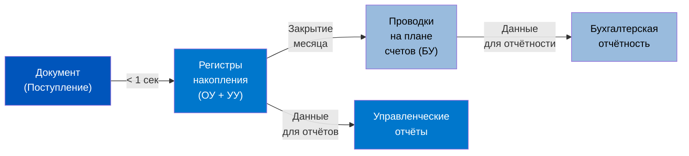

# Виды учета и Архитектура 1C:ERP 2.5

> **Цель урока:** Понять, почему в 1C:ERP 2.5 существуют четыре параллельных слоя учета, как они связаны через регистры и проводки, и какие архитектурные решения определяют точность финансовых данных в Q-commerce.
> **Компетенции:**
> - Различать оперативный, управленческий, бухгалтерский и налоговый учет и их роль в ERP
> - Объяснять, почему регистры — первичный источник данных, а проводки — вторичный
> - Диагностировать расхождения между слоями учета
> - Понимать механизм формирования проводок через «Закрытие месяца»
> **Время чтения:** ~75 минут

---

## Оглавление

- [[#Часть 1. Три измерения одного банана]]
- [[#Часть 2. От Луки Пачоли к асинхронному движку]]
- [[#Часть 3. Анатомия слоёв: четыре параллельные вселенные]]
- [[#Часть 4. Психология проведённого документа]]
- [[#Часть 5. Архитектура данных: Документ, Регистр, Проводка]]
- [[#Часть 6. Кейс: Как две сети дарксторов увидели разную прибыль]]
- [[#Часть 7. Глоссарий и FAQ]]

---

## Часть 1. Три измерения одного банана

Утро понедельника. Даркстор на Пресне. Грузовик привозит 200 кг бананов. Кладовщик сканирует штрихкод, нажимает «Принять» на терминале сбора данных — и в этот момент в 1C:ERP 2.5 начинается цепная реакция, невидимая глазу.

В первую секунду система записывает оперативный факт: на складе «Пресня» появилось 200 кг бананов. Это нужно немедленно — через 40 секунд клиент в приложении откроет каталог, и бананы должны быть доступны для заказа. Если оперативный слой опоздает хотя бы на минуту, покупатель увидит «нет в наличии» и уйдёт к конкуренту. По данным McKinsey (2023), 30% клиентов Q-commerce после одного промаха с наличием не возвращаются.

Но одного факта «200 кг приехало» недостаточно. Финансовый директор хочет знать: за сколько мы купили эти бананы? 47 руб./кг или 52 руб./кг? Какая доля аренды даркстора ляжет на каждый килограмм? Это управленческий слой — он работает медленнее, но именно он показывает, зарабатываем мы на бананах или теряем.

А бухгалтер вообще не видит бананов до тех пор, пока поставщик не пришлёт УПД (универсальный передаточный документ). Без «бумажки» бананы юридически не существуют. Это регламентированный слой — мир, где правит не скорость, а закон.

Три измерения одного банана. Три правды. Три скорости. И все три живут в одной базе данных.

А теперь представьте, что через час после приёмки кладовщик обнаруживает: 15 кг бананов — в кашу, их нужно списать. Что происходит?

- **В оперативном слое:** Списание должно произойти мгновенно. Иначе сборщик попытается собрать заказ с несуществующим товаром.
- **В управленческом слое:** 15 кг × 47 руб./кг = 705 руб. должны упасть на статью расходов «Потери при приёмке» конкретного даркстора «Пресня». Если этого не произойдёт — маржинальность точки будет завышена.
- **В регламентированном слое:** Бухгалтеру нужен «Акт о списании» с подписями и причиной. Без этого акта 705 руб. продолжат висеть на счёте 41 как актив, хотя бананов давно нет. Баланс будет врать.

Если вы, как продакт-менеджер, не понимаете, какой слой «отвечает» за какую правду, вы рискуете принимать решения на основе цифр, которые ещё не дозрели — как те самые бананы.

И вот ещё один нюанс, который часто упускают. Три слоя не просто фиксируют разные «правды» — они делают это с разной скоростью. ОУ обновляется за миллисекунды. УУ — за часы. БУ — за дни или недели. Это означает, что в каждый конкретный момент времени три слоя показывают разные цифры. И это нормально. Это не баг — это архитектурный принцип. Проблемы начинаются, когда кто-то берёт цифру из «неправильного» слоя для принятия решения.

### Почему Q-commerce обострил проблему до предела

В классическом ритейле разница между слоями учёта — вопрос удобства. Супермаркет может позволить себе расхождение между ОУ и БУ в течение недели: товар на полке, покупатель его видит, а бухгалтер оформит позже. В Q-commerce эта роскошь исчезла.

Три фактора делают многослойность учёта критической:

1. **Скорость цикла:** От заказа до доставки — 15 минут. За это время система должна зарезервировать товар (ОУ), рассчитать себестоимость заказа (УУ) и сформировать чек (БУ). Любой сбой в любом слое — и клиент получает отмену заказа или неправильную сумму.

2. **Плотность транзакций:** 50 000 заказов в день при среднем чеке 680 руб. — это 34 млн руб. выручки, которая должна «приземлиться» во все три слоя. При этом каждый заказ содержит в среднем 7–8 позиций — итого 350 000–400 000 строк движений в регистрах за день.

3. **Скоропортящийся ассортимент:** 35–40% SKU (Stock Keeping Unit — единица складского учёта) в дарксторе — фреш со сроком годности 3–7 дней. Каждый просроченный йогурт — это одновременно физическое списание (ОУ), убыток (УУ) и бухгалтерская операция (БУ). Если хотя бы один слой не обработает списание вовремя, данные начнут «гнить» так же быстро, как сам йогурт.

> **Один физический факт порождает три учётных реальности. Продакт, который путает слои, управляет не бизнесом, а миражом.**

---

## Часть 2. От Луки Пачоли к асинхронному движку

### Двойная запись: 530 лет и всё ещё актуальна

В 1494 году францисканский монах Лука Пачоли опубликовал трактат «Summa de Arithmetica», где описал метод двойной записи. Каждая операция записывалась дважды: откуда ушли деньги (Кредит) и куда пришли (Дебет). Венецианские купцы использовали эту систему, чтобы контролировать капитанов торговых судов: если в сундуке 100 дукатов, а в книге записано 120, значит, кто-то украл 20. Единственный «учёт» тогда был один — и он был одновременно оперативным, управленческим и бухгалтерским.

Что интересно: Пачоли не изобрёл двойную запись — он систематизировал практику, которая уже существовала у флорентийских банкиров семейства Медичи. Но именно его формализация стала стандартом, который пережил пять веков. И до сих пор план счетов в 1С — прямой потомок тех венецианских гроссбухов. Разница в том, что купец XV века сводил баланс раз в год при возвращении судна, а Q-commerce требует ответа каждую секунду.

### Индустриальный разлом: рождение управленческого учёта

В XX веке с появлением конвейеров Ford и Toyota возникла проблема, которую Пачоли не предвидел: **аллокация накладных расходов**. Деталь сходит с конвейера — но сколько она «стоит»? Железо — понятно. А электричество? Аренда цеха? Зарплата охранника? Бухгалтер мог ответить только в конце месяца, когда собирал все счета. Но директор завода хотел знать себестоимость сегодня.

Так родился разрыв между «учётом для государства» (бухгалтерским) и «учётом для себя» (управленческим). В 1923 году General Motors под руководством Альфреда Слоуна внедрила систему управленческого учёта, которая позволяла сравнивать рентабельность разных подразделений — Chevrolet против Cadillac — без ожидания квартального отчёта. Это была революция: впервые менеджеры получили «экономический рентген» бизнеса в реальном времени.

В 1C:ERP 2.5 наследие этой революции — концепция «Направлений деятельности». Каждый даркстор может быть отдельным «подразделением» с собственным P&L (Profit & Loss — отчёт о прибылях и убытках), как Chevrolet в структуре GM.

### Цифровой шок Q-Commerce

В мире 15-минутной доставки этот разрыв стал смертельным. Цифры говорят сами за себя:

- **50 000 заказов в день** на одну сеть — это 50 000 документов реализации. Если система пытается формировать бухгалтерские проводки синхронно с каждым заказом, сервер захлебнётся. Для сравнения: средний супермаркет «Пятёрочка» обрабатывает 2 000–3 000 чеков в день — в 15–20 раз меньше.
- **Маржа 10–15%** при стоимости доставки 150–200 руб. — ошибка в учёте на 5% превращает прибыльный бизнес в убыточный за неделю. В классическом ритейле маржа 25–35% оставляет «подушку безопасности» для учётных неточностей. В Q-commerce такой подушки нет.
- **Срок годности 3–5 дней** — если списание просроченного творога задержится на сутки, остатки в 1С становятся «цифровым мусором». А «мусор» в данных порождает каскад: клиент видит товар в приложении, оформляет заказ, сборщик не находит товар на полке, заказ отменяется. Стоимость одной отмены для Q-commerce — около 250–300 руб. (потерянная выручка + время сборщика + негатив клиента).

Эти три фактора — объём, маржинальность и скоропортящийся ассортимент — и определили архитектурный выбор 1С:ERP 2.5: разнести оперативные и бухгалтерские данные по разным хранилищам (регистры vs проводки) и синхронизировать их асинхронно.

> [!NOTE] Контекст: ERP 2.5 vs ERP 2.4
> Редакция 2.5 (текущая) значительно отличается от 2.4 в части механизма отражения документов. В 2.4 отражение было менее гибким. В 2.5 добавлена возможность настраивать правила отражения по типам документов и запускать процедуру по расписанию. Это критично для Q-commerce: вы можете настроить ежедневное отражение для документов реализации (важно для выручки), но еженедельное — для корректировок (менее срочно).

### Архитектурный переворот ERP 2.5

В старых системах 1С (поколение 7.7, Бухгалтерия 8.x) ядром был План счетов. Все данные жили «внутри» бухгалтерских проводок. Это называлось «бухгалтеро-центричная» архитектура.

В 1C:ERP 2.5 архитектура перевёрнута:

- **Ядро** — регистры накопления. Огромные «плоские» таблицы, оптимизированные для сверхбыстрых расчётов остатков и оборотов.
- **Периферия** — бухгалтерские проводки. Согласно документации ИТС: «Бухгалтерские проводки используются только для получения установленной законодательными актами отчётности. Механизмы формирования проводок не используют бухгалтерские итоги».

Это не мелочь — это фундаментальный сдвиг. Проводки больше не «двигают» данные. Они — отражение, тень, которую оперативные факты отбрасывают на план счетов. И формируются эти тени не в момент проведения документа, а во время регламентной процедуры «Закрытие месяца».

Почему это произошло? Потому что «бухгалтеро-центричная» архитектура не выдержала масштаба. В 1С:УТ (Управление Торговлей) — предшественнице ERP — документ при проведении сразу записывал и регистры, и проводки. При 500 документах в день это работало. При 50 000 — нет. Сервер тратил 60–70% вычислительных ресурсов на формирование проводок, которые никто не читал до конца месяца. В ERP 2.5 инженеры 1С вынесли эту нагрузку в фоновую задачу — и получили 3–5-кратный прирост производительности при проведении документов.

Аналогия из мира разработки: это как перенести тяжёлую обработку из синхронного API-вызова в фоновую очередь. Клиент (кладовщик) получает ответ мгновенно, а тяжёлая работа (формирование проводок) выполняется в бэкграунде. Для продакта, знакомого с микросервисной архитектурой, это будет понятная метафора.

---

## Часть 3. Анатомия слоёв: четыре параллельные вселенные

Мы уже знаем, что ERP 2.5 содержит четыре слоя учёта. Теперь разберём каждый из них детально: какие данные он хранит, какие регистры использует, с какой скоростью работает и — самое важное — какие решения на его основе можно принимать, а какие нельзя.

Для удобства будем использовать сокращения: ОУ (оперативный учёт), УУ (управленческий учёт), БУ (бухгалтерский/регламентированный учёт), НУ (налоговый учёт). Эти аббревиатуры — стандарт в сообществе внедренцев 1С.

### Оперативный учёт (ОУ): физика процесса

Оперативный учёт фиксирует события в реальном времени. «Приняли 200 кг бананов», «Списали 3 шт. просроченного йогурта», «Зарезервировали 1 шт. авокадо под заказ №47832». Здесь нет понятий «Дебет» и «Кредит». Есть ресурсы — их количество, местоположение, статус. Если проводить аналогию с физикой: ОУ — это ньютоновская механика. Простые законы, мгновенный эффект, предсказуемый результат.

В типичном Q-commerce дарксторе оперативный учёт обрабатывает 200–500 операций в час: приёмки, списания, резервирования, сборки, отгрузки. Каждая операция — это запись в один или несколько регистров накопления. За день — 3 000–5 000 записей на одну точку. За месяц — 100 000–150 000. Именно для этого объёма регистры оптимизированы.

Инструменты ОУ — регистры накопления: `Товары на складах`, `Свободные остатки`, `Заказы клиентов`. Задержка записи — менее 500 мс. Если оперативный регистр не обновился вовремя, клиент на сайте купит товар, которого физически нет. Это отмена заказа — и потерянный клиент.

Важно понимать: оперативный учёт в ERP 2.5 — это не «черновик» для бухгалтерии. Это самостоятельный полноценный слой, который живёт по своим правилам. Кладовщик на приёмке работает именно с ним. Сборщик заказов — тоже. Алгоритм показа доступности товара в приложении — тоже. Для 90% операционных решений в Q-commerce достаточно только оперативного учёта.

Типичная ошибка продакта — проектировать процесс «от бухгалтерии». Например, требовать, чтобы приёмка товара не начиналась, пока бухгалтер не «подтвердит» документ. В Q-commerce это невозможно: грузовик приезжает в 6:00, бухгалтер приходит в 9:00. Три часа простоя — 200 заказов потеряно. Правильная архитектура: кладовщик принимает товар в ОУ немедленно, бухгалтер отражает его в БУ при получении УПД. Два слоя работают параллельно, не блокируя друг друга.

> [!TIP] Правило для продакта
> Если ваш процесс требует, чтобы один слой учёта «ждал» другой — это красный флаг. В ERP 2.5 слои спроектированы для параллельной работы. Блокировка между слоями — признак неправильной настройки.

### Управленческий учёт (УУ): экономическая правда

Управленческий учёт отвечает на вопрос «Зарабатываем или теряем?». Он работает с деньгами, но по правилам, которые устанавливает сама компания, а не государство. Продолжая физическую аналогию: если ОУ — это механика, то УУ — это термодинамика. Здесь мы считаем «энергию» (деньги), которая течёт через систему, нагревает одни участки и охлаждает другие.

В ERP 2.5 управленческий учёт — не «надстройка» над бухгалтерским. Это полноценный параллельный контур, который может жить и без бухгалтерии. Многие стартапы начинают именно с управленческого учёта, подключая регламентированный позже — когда объём операций требует сдачи отчётности.

В ERP 2.5 управленческий учёт базируется на регистрах накопления (не на плане счетов). Ключевые регистры: `Себестоимость товаров`, `Выручка и себестоимость продаж`, `Прочие доходы и расходы`. Управленка позволяет делать то, что запрещает бухгалтерия: начислять плановые расходы до получения документов. Например, мы платим курьерам раз в неделю, но хотим видеть расход на курьера в себестоимости каждого заказа ежедневно. В УУ это решается через плановое начисление.

**Направления деятельности** — ключевая аналитика ERP 2.5 для управленческого учёта. Согласно документации ИТС, существуют два режима:

1. **Через правила распределения** — направления деятельности используются только в управленческом учёте. Доходы и расходы распределяются по направлениям автоматически по заданным правилам.
2. **Через обособленный учёт** — направления деятельности отражаются и в управленческом, и в регламентированном учёте. Каждая операция явно привязывается к направлению.

Для Q-commerce это критически важно: если вы хотите видеть P&L по каждому даркстору, вам нужно настроить направления деятельности до первой транзакции. Изменить режим на лету — дорого и болезненно.

Вот как выглядит разница на практике. Допустим, у вас 15 дарксторов и центральный хаб:

**Режим 1 (правила распределения):** Выручка каждого даркстора известна точно (каждый заказ привязан к точке). Но накладные расходы — аренда хаба, зарплата офиса, маркетинг — распределяются по правилам (например, пропорционально выручке). Это быстрее в настройке, но менее точно. И главное — работает только в управленческом учёте.

**Режим 2 (обособленный учёт):** Каждая операция явно помечается направлением. Перемещение товара с хаба на даркстор «Пресня» создаёт внутреннюю «продажу» между направлениями. Сложнее в настройке, но P&L по даркстору получается и в управленческом, и в регламентированном учёте — что критично для аудированной отчётности.

| Критерий | Режим 1 (распределение) | Режим 2 (обособленный) |
|:---|:---|:---|
| Скорость настройки | 1–2 дня | 2–3 недели |
| Точность P&L по точке | ±10–15% (из-за аллокаций) | ±1–2% |
| Работает в БУ | Нет | Да |
| Подходит для аудита | Нет | Да |
| Сложность поддержки | Низкая | Средняя |

### Регламентированный учёт (БУ): юридическая правда

Регламентированный (бухгалтерский) учёт живёт по правилам государства — ФСБУ и Налоговый кодекс РФ. Его инструмент — план счетов «Хозрасчётный». Здесь важна «бумажная верность»: товар мог приехать на склад физически, но без УПД от поставщика он юридически не существует.

Критический факт, который должен знать каждый продакт: в ERP 2.5 **проводки формируются не в момент проведения документа**, а при выполнении регламентной процедуры «Отражение документов в регламентированном учёте», которая входит в состав «Закрытия месяца». Документация ИТС прямо говорит: «Механизмы формирования проводок не используют бухгалтерские итоги».

Это означает, что между оперативным фактом и его бухгалтерским отражением всегда есть задержка — так называемый **учётный лаг**. Иногда — часы (если запускать отражение ежедневно), иногда — недели (если ждать закрытия месяца). Величина лага — один из ключевых параметров настройки ERP для Q-commerce. Чем короче лаг, тем больше нагрузка на сервер, но тем точнее бухгалтерские данные.

На практике оптимальный баланс для Q-commerce: ежедневное отражение документов реализации (выручка должна быть актуальной) и еженедельное отражение прочих документов (корректировки, возвраты). Продакт, который требует от бухгалтера «проводить документы секунду в секунду при приёмке», ломает методологию ERP и создаёт ненужную нагрузку на сервер.

### Налоговый учёт (НУ): математика обязательств

Налоговый учёт ведётся параллельно на том же плане счетов, но с отдельными признаками. Он нужен только для расчёта налога на прибыль по правилам НК РФ. В нём действуют свои правила амортизации, свои нормы списания, свои лимиты.

Для продакт-менеджера в Q-commerce налоговый учёт — зона ответственности бухгалтерии. Но важно знать, что он существует и может порождать расхождения с управленкой. Классический пример: компания списала партию просроченного молока на 500 000 руб. В управленческом учёте это убыток в полном объёме. В налоговом учёте — только часть суммы может быть принята как расход (зависит от наличия акта уничтожения, заключения Роспотребнадзора и других формальностей). Разница порождает так называемую «временную разницу» между БУ и НУ, которая отражается в отложенных налоговых активах и обязательствах.

Продакту не нужно уметь считать эти разницы, но нужно знать, что они существуют. Когда финансовый директор говорит «наш эффективный налог на прибыль — 25%, а не 20%», причина часто кроется именно в расхождениях между управленческим и налоговым учётом.

### Матрица сравнения слоёв

| Параметр | Оперативный (ОУ) | Управленческий (УУ) | Регламентированный (БУ) | Налоговый (НУ) |
|:---|:---|:---|:---|:---|
| **Главная цель** | Не остановить отгрузку | Посчитать реальную маржу | Сдать отчётность без штрафов | Рассчитать налог на прибыль |
| **Источник данных** | Регистры накопления | Регистры накопления | План счетов (проводки) | План счетов (проводки) |
| **Основание записи** | Физический факт (скан ТЗД) | Правила компании | Первичный документ (УПД/Акт) | Налоговый кодекс |
| **Задержка** | < 1 секунды | Часы — дни | Дни — месяц | Месяц — квартал |
| **Цена ошибки** | Потеря клиента сегодня | Неверное инвестиционное решение | Блокировка счетов ФНС | Штрафы и пени |
| **Метод оценки себестоимости** | Нет (только количество) | По учётной политике (средняя за месяц, среднескользящая или ФИФО) | По учётной политике (средняя за месяц, среднескользящая или ФИФО) | По правилам НК РФ |

> [!IMPORTANT] Себестоимость в ERP 2.5
> В 1C:ERP 2.5 доступны три метода оценки себестоимости: **средняя за месяц**, **среднескользящая** и **ФИФО**. Метод задаётся в учётной политике организации. Средняя за месяц — наиболее распространённый выбор для Q-commerce: система усредняет стоимость всех бананов на складе, а окончательный расчёт происходит при закрытии месяца. Подробнее о выборе метода — в Дне 3.

### Решение Продуктового Архитектора: какой слой — «главный»?

Начинающие продакты в Q-commerce часто задают вопрос: «Какой слой учёта самый важный?» Ответ зависит от горизонта принятия решений.

**Гипотеза:** Для операционных решений (что закупить, когда списать, как собрать заказ) достаточно оперативного учёта.

**Проверка:** Рассмотрим три типичных решения продакта и определим, какой слой даёт данные для каждого:

| Решение | Слой | Почему именно этот |
|:---|:---|:---|
| «Закупить ли ещё 100 кг бананов?» | ОУ | Нужны текущие остатки и скорость продаж — это данные регистра `Товары на складах` |
| «Стоит ли открывать 16-й даркстор?» | УУ | Нужна юнит-экономика по точкам — это данные направлений деятельности |
| «Можем ли мы снизить цену на 10% ради промо?» | УУ + БУ | Нужна фактическая себестоимость (УУ) и проверка, что цена не ниже налоговой себестоимости (БУ) |

**Риск:** Если продакт принимает решение об открытии новой точки на основе данных ОУ (есть спрос, высокая конверсия), но не проверяет УУ (фактическая маржа с учётом всех затрат), он может открыть убыточный даркстор и не узнать об этом до закрытия квартала.

**Вердикт:** В Q-commerce нет «главного» слоя. Есть правило: каждый тип решения требует данных из конкретного слоя. Путаница слоёв — корневая причина большинства ошибок планирования.

---

## Часть 4. Психология проведённого документа

### Ловушка кнопки «Провести»

Продакт-менеджеры, приходящие из мира лёгких SaaS-решений, воспринимают «Проведение» документа как «Сохранить». Нажал — готово, можно забыть. В Notion вы меняете цифру — и она мгновенно обновляется везде. В Jira вы редактируете задачу — и историю изменений можно откатить одним кликом. В ERP всё иначе.

В 1C:ERP 2.5 проведение — это событие с последствиями. Документ не просто сохраняется; он записывает движения в регистры, и эти движения становятся частью цепочки зависимостей. Каждое движение влияет на расчёт себестоимости, на остатки, на финансовый результат. Это ближе к банковской транзакции, чем к редактированию документа.

Представьте:
1. **День 1.** Поступление: 100 кг бананов по 47 руб./кг.
2. **День 3.** Перемещение: 50 кг с хаба на даркстор «Пресня».
3. **День 5.** Реализация: 30 кг клиентам по 89 руб./кг.
4. **День 30.** Закрытие месяца: расчёт фактической себестоимости.

Если вы «просто исправите опечатку» в цене поступления в День 1 (было 47, стало 52 руб./кг), система должна пересчитать перемещение, изменить себестоимость в реализации и скорректировать финансовый результат. В базе с миллионом транзакций такая «правка» может вызвать каскадную блокировку таблиц — и курьеры не смогут выдать заказы, пока пересчёт не завершится.

### Граница последовательности

В ERP 2.5 существует понятие «Граница последовательности» — момент, до которого все расчёты считаются завершёнными и согласованными. После закрытия месяца граница сдвигается вперёд, и все данные до неё «замораживаются». Любая попытка изменить документ до границы требует повторного закрытия — а это часы работы сервера и риск развала отчётности.

Визуализируйте границу последовательности как замёрзшее озеро. Всё, что произошло до границы — подо льдом. Вы можете смотреть на эти данные, но не можете их трогать без последствий. Если вы пробьёте лёд (измените документ до границы), вода хлынет наружу — система потребует полного перезакрытия периода. В базе с 500 000 документов за месяц перезакрытие может занять 4–8 часов серверного времени.

**Культура транзакционной гигиены** — вот что отличает зрелую команду от хаотичной. Правило простое: ошибка — это новый документ. Вместо того чтобы править поступление месячной давности, создаётся «Корректировка поступления». Прошлое должно быть неизменным. Только так можно сохранить целостность данных.

В практике Q-commerce это означает конкретные организационные правила:
- Правка документов старше 3 дней — только через корректировку.
- Правка документов в закрытом периоде — запрещена (ERP позволяет настроить этот запрет через права доступа).
- Каждая корректировка должна содержать причину: «ошибка цены», «пересортица», «дополнительная скидка от поставщика».

Эти правила кажутся бюрократическими. Но без них ваша база данных за год превращается в «лоскутное одеяло», где невозможно отличить реальные данные от «заплаток». Один из крупных Q-commerce операторов обнаружил, что 22% всех документов за 2023 год были «перепроведены» задним числом. Аудит потребовал 6 недель дополнительной работы и обошёлся в 8 млн руб.

### Когнитивная ловушка: «Поправим в конце месяца»

Эта фраза — красный флаг. В Q-commerce «конец месяца» — это вечность. За 30 дней через систему проходят сотни тысяч транзакций. Каждая «мелкая правка» задним числом может потянуть за собой цепочку пересчётов, которая затронет тысячи документов.

Рассмотрим конкретный сценарий. Закупщик обнаружил, что в поступлении от 5-го числа указана неверная цена: 47 руб./кг вместо правильных 52 руб./кг. Разница — 5 руб. на 200 кг, всего 1 000 руб. Мелочь?

Если просто исправить цену в документе поступления:
1. ERP пересчитает себестоимость всех перемещений этой партии (допустим, 8 документов).
2. Пересчитает себестоимость всех продаж из этой партии (допустим, 150 документов реализации).
3. Пересчитает финансовый результат за весь период от 5-го числа до сегодня.
4. Заблокирует таблицы регистров на время пересчёта — от 30 секунд до 15 минут в зависимости от объёма данных.

В эти 15 минут ни один сборщик не может провести документ сборки. Ни один кладовщик не может оформить приёмку. Бизнес стоит.

Правильный путь — создать «Корректировку поступления» сегодняшним числом. Система учтёт разницу в 1 000 руб. только вперёд, не трогая историю. Архитектор процесса должен строить систему так, чтобы ошибки фиксировались новыми документами вперёд, а не правками назад.

> [!WARNING] Антипаттерн: правка задним числом
> Если в вашей компании разрешено править документы месячной давности без создания корректировок — все ваши управленческие отчёты за этот период потенциально недостоверны. ERP 2.5 позволяет это технически, но методологически это подрывает целостность данных.

### Пять красных флагов учётной дисциплины

Как продакт может быстро оценить «здоровье» учётной системы? Вот пять диагностических вопросов:

1. **«Разрешены ли правки задним числом?»** Если да — все отчёты за прошлые периоды ненадёжны. Решение: настроить в ERP запрет на редактирование документов старше N дней через права доступа.

2. **«Как часто закрывается месяц?»** Если ответ «раз в квартал» или «когда бухгалтер найдёт время» — вы не знаете свою реальную себестоимость. Ориентир: Hard Close — до 10-го числа следующего месяца.

3. **«Есть ли ручные проводки?»** Если бухгалтер регулярно корректирует суммы на счетах вручную, не меняя данные в регистрах — ОУ и БУ живут в разных реальностях. Допустимо: не более 5% от общего числа проводок.

4. **«Используется ли Excel для расчёта маржи?»** Если кто-то выгружает данные из 1С в Excel и «докручивает» формулы — управленческий учёт в ERP настроен неправильно. Цель: 100% управленческих отчётов — из ERP.

5. **«Сходятся ли остатки в ОУ и БУ?»** Регулярное расхождение между регистром `Товары на складах` и счётом 41 более чем на 3% — признак системной проблемы. Причины: незапущенное отражение документов, ручные корректировки, ошибки в настройке правил отражения.

---

## Часть 5. Архитектура данных: Документ, Регистр, Проводка

Мы разобрали «что» (четыре слоя) и «почему» (психология документа). Теперь — «как». Как именно ERP 2.5 превращает действие кладовщика в финансовые данные? Через три уровня абстракции: Документ → Регистр → Проводка. Это не три этапа одного процесса — это три разных сущности с разными жизненными циклами.

**Документ** — это «событие». Поступление товара, реализация, списание. Документ фиксирует: что произошло, когда, с каким товаром, в каком количестве, по какой цене.

**Регистр** — это «память». Он хранит накопленный итог: сколько товара на складе, какова его общая стоимость, сколько денег должен контрагент. Регистр не помнит отдельные события — он помнит результат.

**Проводка** — это «отчёт для государства». Запись на плане счетов в формате Дт/Кт, которую требует законодательство для формирования бухгалтерской отчётности.

### Три волны одного проведения

Когда кладовщик нажимает «Принять» на ТЗД, в ERP 2.5 запускается не один, а три процесса — но с разной скоростью.

**Волна 1. Оперативный слой (мгновенно).** Система пишет данные в регистры накопления. Это таблицы без сложной бухгалтерской логики, оптимизированные под один вопрос: «сколько сейчас?». Из регистра `Товары на складах` прибавляется 200 кг бананов. Теперь клиент в приложении их увидит.

**Волна 2. Управленческий слой (с задержкой).** Система обогащает оперативный факт финансовыми данными. На 200 кг бананов записывается закупочная цена, транспортные расходы, доля аренды даркстора. Эти данные попадают в регистры `Себестоимость товаров` и `Выручка и себестоимость продаж`. Задержка зависит от настройки — от минут до часов.

**Волна 3. Регламентированный слой (при закрытии месяца).** Механизм «Отражение документов в регламентированном учёте» берёт данные из регистров и создаёт классические проводки на плане счетов: Дт 41.01 Кт 60.01 на сумму 9 400 руб. (200 кг × 47 руб.). Для ERP это самая «второстепенная» задача — система прекрасно работает без проводок.

Важно: волны не являются строго «последовательными» в техническом смысле. Волна 1 происходит синхронно при проведении документа. Волна 2 может происходить как синхронно (для некоторых типов документов), так и через фоновое задание. Волна 3 — всегда отложенная, регламентная процедура. Продакт не управляет этими волнами напрямую, но он должен понимать их существование, чтобы не удивляться, когда данные в разных отчётах «не сходятся» в течение дня.

### Почему регистр — источник истины, а не проводка

Это самый контринтуитивный факт для тех, кто привык к «классической» бухгалтерии. В ERP 2.5, если вы видите на плане счетов сумму 1 000 руб., а в регистре `Себестоимость товаров` — 1 050 руб., **верить нужно регистру**. Проводка — это «отчёт», производная. Регистр — это «база данных», первоисточник.

Документация ИТС подтверждает: «Механизмы формирования проводок не используют бухгалтерские итоги». Проводки формируются на основе данных регистров, а не наоборот. Бухгалтер может вручную скорректировать проводку — но это опасная практика, которая создаёт расхождение между оперативными данными и бухгалтерским учётом.

Для продакта это имеет практическое следствие: если вам нужно проверить, сколько товара на складе, **никогда** не смотрите в оборотно-сальдовую ведомость по счёту 41. Смотрите в отчёт «Остатки и доступность товаров» — он читает данные из регистра `Товары на складах`. Разница может быть существенной: на одном из проектов внедрения расхождение между счётом 41 и регистром `Товары на складах` достигало 12% из-за того, что процедура «Отражение документов в регл. учёте» не запускалась 2 недели.

> [!CAUTION] Красный флаг
> Если ваш бухгалтер принимает решения на основе плана счетов, а операционная команда — на основе регистров, и эти данные регулярно расходятся более чем на 3–5%, у вас проблема с регулярностью отражения документов в регламентированном учёте. Решение: настроить ежедневный автоматический запуск процедуры отражения.

### Мягкое и жёсткое закрытие

В Q-commerce бухгалтерия не успевает за операционной скоростью. Поэтому зрелые компании используют двухуровневую систему:

- **Soft Close (мягкое закрытие):** Еженедельно. Сводим управленческие данные, чтобы понять операционную маржу. Используем плановые цены и нормативы. Точность: ±5–10%. Занимает 1–2 часа работы финансового аналитика. Не требует участия бухгалтерии.
- **Hard Close (жёсткое закрытие):** Ежемесячно. Запускаем полный цикл «Закрытие месяца»: пересчёт себестоимости по средневзвешенной, распределение накладных расходов, формирование проводок. Граница последовательности сдвигается вперёд. Точность: ±0,1%. Занимает 3–5 рабочих дней (подготовка данных + запуск процедуры + проверка результатов).

Разница между Soft и Hard Close — это не просто точность. Это разные инструменты для разных аудиторий. Soft Close нужен операционной команде для еженедельной корректировки курса. Hard Close нужен финансовому директору для отчётности перед инвесторами и налоговой. Продакт должен знать оба и уметь объяснить разницу своей команде.

Продакт должен следить, чтобы правила мягкого закрытия не противоречили жёсткому. Если ваш еженедельный P&L показывает маржу 12%, а после закрытия месяца она оказывается 7%, значит, плановые нормативы устарели и их пора пересмотреть.

Практический пример: сеть из 20 дарксторов использует плановую стоимость доставки 150 руб. для Soft Close. По итогам Hard Close выясняется, что фактическая стоимость — 195 руб. (выросла из-за зимнего сезона и дефицита курьеров). Еженедельный P&L показывал маржу +8%, а фактическая маржа — +2,5%. Три недели подряд CEO принимал решения о расширении, опираясь на завышенные цифры.

Решение: пересматривать плановые нормативы для Soft Close ежемесячно, сразу после Hard Close. Норматив текущего месяца = фактические данные прошлого месяца + коэффициент сезонности.

---

## Часть 6. Кейс: Как две сети дарксторов увидели разную прибыль

Чтобы понять цену архитектурной ошибки, разберём историю двух условных сетей дарксторов, стартовавших в Москве в 2022 году с одинаковыми начальными условиями: 15 точек, ассортимент 2 500 SKU, средний чек 680 руб., зона доставки — Москва внутри МКАД. Обе команды привлекли по 50 млн руб. в seed-раунде. Через 12 месяцев одна из них закрылась, а вторая вышла на операционную окупаемость. Разница — не в продукте, не в маркетинге, а в архитектуре учёта.

### «Ракета»: иллюзия скорости

Основатели «Ракеты» выбрали путь быстрого старта. Оперативка — в кастомной админке сайта. Закупки — в Google Таблицах. Бухгалтерия — на аутсорсе в отдельной «1С:Бухгалтерии».

Первые три месяца всё шло гладко. Команда радовалась: «Мы запустились за 2 недели, пока конкуренты настраивают ERP!» Выручка росла на 25% в месяц, инвесторы были довольны графиками. Но на четвёртый месяц начались проблемы:

- **Разрыв ОУ и УУ.** В админке сайта товар числился на складе (оперативный факт), но закупщики в Google-таблицах забыли внести поставку от фермерского хозяйства. Система не знала себестоимости 40% ассортимента «фреш».
- **Слепая зона логистики.** Стоимость доставки (в среднем 180 руб. на заказ) не распределялась на каждый заказ, а висела общим комом в статье «Транспорт». При 1 200 заказах в день это 216 000 руб. ежедневно — невидимых для юнит-экономики.
- **Проблема «призрачного стока».** Без единой системы учёта кладовщики перестали доверять данным и начали вести параллельные записи в тетрадках. Расхождение между «тетрадкой» и Google-таблицей достигало 15–20% по свежим овощам.
- **Иллюзия прибыли.** 15-го числа CEO (генеральный директор) видел в админке «Выручка 10 млн руб.» и считал маржу по закупочным ценам из таблицы. Получалось +2 млн руб.
- **Крах.** В конце квартала бухгалтер с аутсорса прислал реальный P&L. С учётом неучтённых списаний брака (8% фреша), логистического плеча и расхождений в ценах реальный убыток составил **−3,5 млн руб.**

Инвесторы заблокировали транш из-за «непрозрачности юнит-экономики». Финансовый директор, привлечённый для спасения ситуации, потратил 2 месяца на попытку «сшить» данные трёх систем. За это время Cash Burn Rate (скорость сжигания денег) составил 4,2 млн руб./мес. «Ракета» закрылась через 7 месяцев.

**Корневая причина:** Не технические ошибки, а архитектурное решение «три системы вместо одной». Когда ОУ, УУ и БУ живут в разных базах, их синхронизация становится отдельным проектом с собственным бюджетом. В Q-commerce, где объём транзакций растёт экспоненциально, этот проект быстро превращается в «чёрную дыру».

### «Марс Экспресс»: прозрачность с первого дня

Команда «Марс Экспресс» потратила 6 недель на настройку 1C:ERP 2.5 до запуска первой точки. Это казалось безумием: конкуренты уже принимали заказы, а «Марс» ещё настраивал справочники номенклатуры. Но эти 6 недель окупились многократно.

Что именно они настроили:
- **Направления деятельности** — каждый даркстор как отдельный центр прибыли.
- **Статьи расходов** — 12 категорий вместо общей «Транспорт»: доставка курьером, перемещение между точками, возврат поставщику и т.д.
- **Плановые нормативы** — для каждого типа затрат (доставка: 150 руб., потери фреша: 5%, упаковка: 12 руб./заказ).
- **Соглашения с поставщиками** — с условиями оплаты и графиками поставок.

В результате ERP в момент сборки заказа начисляла плановый расход — 150 руб. на доставку — даже если счёт от курьерской службы придёт через неделю.

Каждое списание подгнившего авокадо на точке «Хамовники» мгновенно отражалось в регистре `Себестоимость товаров` с аналитикой по этому даркстору (через направления деятельности). Средний процент списаний по фрешу составлял 4,8% — и команда «Марса» знала эту цифру каждый день, а не раз в квартал.

Ключевое архитектурное решение: разделение на «плановую» и «фактическую» себестоимость. При поступлении товара ERP записывала плановую цену (из соглашения с поставщиком). При закрытии месяца — пересчитывала на фактическую (с учётом скидок, бонусов, транспортных расходов). Разница между плановой и фактической себестоимостью за октябрь составила всего 2,3% — допустимый уровень для еженедельного управленческого контроля.

**P&L «Марс Экспресс» за октябрь:**

| Статья | УУ (управленческий) | БУ (бухгалтерский) | Причина расхождения |
|:---|:---|:---|:---|
| Выручка | 12 400 000 руб. | 12 450 000 руб. | Возврат в УУ отражён сразу, в БУ — через акт |
| Себестоимость | 8 200 000 руб. | 7 800 000 руб. | УУ учёл плановые потери на брак (5%), БУ — только акты |
| Логистика | 2 100 000 руб. | 0 руб. | Счета от курьеров ещё не пришли; в УУ — плановое начисление |
| **Маржинальная прибыль** | **2 100 000 руб.** | **4 650 000 руб.** | **БУ рисует розовые очки; УУ показывает суровую правду** |

> [!IMPORTANT] Урок кейса
> «Марс Экспресс» выжили, потому что видели реальный кэш-флоу и маржу каждый день. «Ракета» управляла «вчерашним днём». Обратите внимание: **бухгалтерская прибыль (4,65 млн) была в 2,2 раза выше управленческой (2,1 млн)**. Если бы CEO «Марса» ориентировался только на БУ, он бы принимал такие же ошибочные решения, как основатели «Ракеты».

### Грабли: чего не учли даже в «Марс Экспресс»

Настроив направления деятельности через правила распределения (режим 1), команда «Марса» через полгода обнаружила, что не может свести P&L по даркстору в разрезе бухгалтерского учёта — только в управленческом. Для инвесторов, которые хотели видеть аудированную отчётность по каждой точке, это стало проблемой. Переход на режим 2 (обособленный учёт) потребовал 3 недели перенастройки и ручной разноски исторических данных.

Мораль: выбор режима направлений деятельности — одно из тех решений, которые нужно принимать до первой транзакции. Цена ошибки — не только 3 недели работы команды внедрения, но и потеря доверия инвесторов, которые 6 месяцев получали «красивый» P&L по точкам, а потом узнали, что он был «управленческой оценкой», а не аудируемым фактом.

### Что если бы «Ракета» выбрала ERP с самого начала?

Интересный мысленный эксперимент. При тех же 15 точках и 2 500 SKU настройка ERP 2.5 заняла бы 6–8 недель и обошлась бы примерно в 3–4 млн руб. (лицензия + внедрение + обучение). «Ракета» потеряла 3,5 млн руб. за один квартал убытков + 50 млн руб. инвестиций, сгоревших при закрытии. Математика однозначна: цена «экономии на ERP» оказалась в 15 раз выше цены самого ERP.

Но справедливости ради: даже ERP не спасает от ошибок, если его настроить неправильно. «Марс Экспресс» столкнулся с проблемой направлений деятельности именно потому, что команда внедрения не задала правильный вопрос на старте: «Нужна ли вам аудируемая отчётность по каждой точке?» Технология — необходимое, но не достаточное условие.

### Решение Продуктового Архитектора

Перед запуском сети дарксторов продакт-менеджер сталкивается с развилкой: какой уровень учётной зрелости закладывать в MVP?

**Гипотеза:** «Можно запуститься на минимальной учётной инфраструктуре и дотянуть ERP позже, когда появится выручка.»

**Пути реализации:**
- **Путь А:** Кастомная связка (админка + таблицы + аутсорс-бухгалтерия). Стартовые затраты: ~200 000 руб. Время запуска: 2 недели.
- **Путь Б:** 1C:ERP 2.5 с минимальной настройкой (режим 1, без обособленного учёта). Стартовые затраты: ~1,5 млн руб. Время запуска: 4–6 недель.
- **Путь В:** 1C:ERP 2.5 с полной настройкой (режим 2, обособленный учёт по точкам). Стартовые затраты: ~3–4 млн руб. Время запуска: 6–8 недель.

**Риски для целостности данных:**
- Путь А: катастрофические. Три изолированные системы не синхронизируются автоматически. К 4-му месяцу данные необратимо расходятся.
- Путь Б: умеренные. Единая система, но P&L по точкам — только управленческий, не аудируемый. Достаточно до раунда А.
- Путь В: минимальные. Полная прозрачность с первого дня, но долгий старт.

**Финальное решение:** Go для Пути Б при объёме до 5 000 заказов/день. Go для Пути В при наличии инвесторов, требующих аудируемую отчётность. No-go для Пути А при объёме свыше 500 заказов/день.

### Сравнительная таблица: компромисс архитектора

| Операция | Профит для Продукта | Цена для Системы | Вердикт |
|:---|:---|:---|:---|
| Запуск без ERP (Excel + кастом) | Скорость старта: 2 недели | Полная непрозрачность unit-экономики к 4-му месяцу | Только для MVP <500 заказов/день |
| ERP с режимом 1 (распределение) | Быстрая настройка, P&L по точке за 1–2 дня | Нет аудируемого P&L по точке в БУ | Для стартапов до раунда А |
| ERP с режимом 2 (обособленный) | Полный P&L по точке, аудируемый | 2–3 недели настройки, сложнее поддержка | Для компаний с инвесторами и аудитом |

---

## Часть 7. Глоссарий и FAQ

Этот раздел — ваш «карманный словарь» для разговоров с бухгалтерами, архитекторами 1С и финансовыми директорами. Вернитесь к нему, когда на встрече прозвучит незнакомый термин.

### Глоссарий

| Термин | Определение | Контекст в Q-commerce |
|:---|:---|:---|
| **Регистр накопления** | Таблица ERP для хранения остатков и оборотов. Основной источник данных | Определяет, видит ли клиент товар в приложении |
| **Регистр сведений** | Хранилище настроек: цены, скидки, коэффициенты | Содержит плановые нормативы для Soft Close |
| **План счетов** | Иерархический список бухгалтерских счетов для двойной записи | Используется только для регламентированной отчётности |
| **Проводка** | Запись движения между счетами (Дт/Кт) | В ERP 2.5 формируется при закрытии месяца, а не при проведении |
| **Направление деятельности** | Аналитический разрез для обособленного P&L | Позволяет видеть прибыль/убыток по конкретному даркстору |
| **Граница последовательности** | Точка, до которой все расчёты зафиксированы | Сдвигается при закрытии месяца; правки до неё требуют перезакрытия |
| **Средневзвешенная стоимость** | Метод оценки себестоимости: общая стоимость / общее количество | Один из трёх методов оценки в ERP 2.5 (наряду со среднескользящей и ФИФО); наиболее популярный в Q-commerce |
| **Закрытие месяца** | Регламентная процедура: пересчёт себестоимости + формирование проводок | Превращает «оперативные факты» в «бухгалтерскую истину» |
| **УПД** | Универсальный передаточный документ — юридическое основание для БУ | Без УПД товар не может быть отражён в регламентированном учёте |
| **ТЗД** | Терминал сбора данных — портативный компьютер со сканером для склада | Основной инструмент кладовщика для работы с оперативным учётом |

### FAQ

**В: Можно ли в ERP 2.5 вести управленческий учёт без бухгалтерского?**
О: Технически — да, ERP позволяет отключить регламентированный учёт. Но методически это редкость: смысл ERP в том, что один документ «кормит» оба слоя. Если вы ведёте их раздельно, вы возвращаетесь к проблемам «Ракеты» из нашего кейса. Единственный реалистичный сценарий — пилотный запуск первых 2–3 недель, когда бухгалтерская настройка ещё не завершена.

**В: Где искать «истинную» себестоимость — в проводках или в регистре?**
О: В регистре `Себестоимость товаров`. Проводка на плане счетов — производная от регистра. Если цифры расходятся, причина обычно в ручной корректировке проводок бухгалтером. Практический совет: настройте еженедельный отчёт-сверку между суммой на счёте 41 и итогом регистра `Товары на складах`. Расхождение более 1% — повод для расследования.

**В: Что произойдёт, если не закрывать месяц вовремя?**
О: Управленческий учёт будет работать на плановых ценах (Soft Close), но фактическая себестоимость останется неизвестной. Расхождение между плановой и фактической маржой может накапливаться и взорваться при закрытии, показав совсем другую картину бизнеса. На практике задержка закрытия более чем на 10 рабочих дней — признак системных проблем с учётной дисциплиной.

**В: Почему для Q-commerce чаще выбирают средневзвешенную, а не ФИФО?**
О: В ERP 2.5 доступны три метода: средняя за месяц, среднескользящая и ФИФО. Средневзвешенная (средняя за месяц) проще в расчёте и не требует партионного учёта на уровне продаж. Для Q-commerce, где один и тот же банан может быть из трёх разных поставок, средневзвешенная даёт достаточную точность при значительно меньшей нагрузке на систему. ФИФО точнее, но требует партионного учёта и в разы увеличивает время закрытия месяца. Подробный разбор — в Дне 3.

**В: Как убедиться, что оперативные данные и бухгалтерия не разъехались?**
О: Сравнить отчёт «Ведомость по товарам на складах» (данные регистров ОУ) с «Оборотно-сальдовая ведомость по счёту 41» (данные БУ). Если суммы расходятся — искать документы, которые проведены в ОУ, но не отражены в регламентированном учёте. Типичные причины расхождений: непроведённые корректировки, документы «в статусе черновика», ошибки в настройке правил отражения.

**В: Что такое «учётная политика» и почему её нельзя менять в середине года?**
О: Учётная политика — это набор настроек ERP, которые определяют, как именно система считает себестоимость, распределяет расходы и формирует отчётность. Изменение учётной политики в середине года означает, что данные первого и второго полугодия будут несопоставимы — вы получите «два разных бизнеса» в одной отчётности. В ERP 2.5 учётная политика привязана к календарному году и применяется ко всем документам периода. Подробнее об этом — в Дне 3.

**В: Зачем мне, продакту, вообще разбираться в видах учёта?**
О: Потому что каждый ваш продуктовый запрос — «добавить новый тип списания», «изменить логику резервирования», «показать маржу по даркстору в реальном времени» — затрагивает минимум два слоя учёта. Если вы не понимаете последствий своего запроса для каждого слоя, разработчик реализует его «как попало», бухгалтер не сможет закрыть месяц, а финансовый директор получит искажённые цифры.

**В: Как понять, что нужно кастомизировать в ERP, а что лучше оставить типовым?**
О: Простое правило: всё, что касается учёта и отчётности — оставляйте типовым максимально долго. Кастомизация учётных регистров означает, что каждое обновление 1С превращается в отдельный проект. Кастомизируйте то, что приближено к операционной специфике вашего бизнеса: стейт-машину заказов, интерфейс кладовщика, алгоритм отбора на складе. Разграничение простое: «это чтобы бухгалтерия не ошиблась» — оставляйте типовым; «это чтобы курьер мог работать» — кастомизируйте.

---

> [!TIP] Тизер Дня 2
> Завтра мы разберём, как одна неправильная настройка справочника «Склады» может остановить работу 100 курьеров. Организации, подразделения, склады и направления деятельности — архитектурный скелет, на который нанизывается весь учёт. → [[Week 1 - Day 2 - Архитектура предприятия|День 2]]

---

[[README|Оглавление]] | [[Week 1 - Day 2 - Архитектура предприятия|День 2]] →
