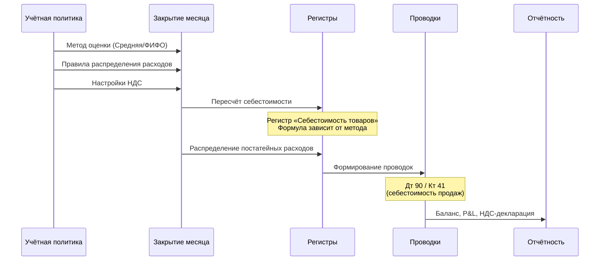

# Учётная политика: Настройки, которые определяют всё

> **Цель урока:** Понять, что такое учётная политика в 1C:ERP 2.5, какие переключатели в ней спрятаны, почему их нельзя менять в середине года и как выбор метода оценки себестоимости определяет всю финансовую картину Q-commerce бизнеса.
> **Компетенции:**
> - Различать учётную политику для финансового, регламентированного и налогового учёта
> - Понимать разницу между тремя методами оценки себестоимости и их влияние на P&L (отчёт о прибылях и убытках)
> - Объяснять, почему учётная политика создаётся ДО ввода остатков
> - Диагностировать последствия неправильного выбора метода оценки для Q-commerce
> **Время чтения:** ~75 минут

---

## Оглавление

- [[#Часть 1. Переключатель, который нельзя трогать]]
- [[#Часть 2. От венецианских торговцев к ФСБУ]]
- [[#Часть 3. Анатомия учётной политики в ERP 2.5]]
- [[#Часть 4. Три метода — три правды о себестоимости]]
- [[#Часть 5. НДС, налоги и невидимые ловушки]]
- [[#Часть 6. Кейс: Как смена метода оценки разрушила квартальный отчёт]]
- [[#Часть 7. Глоссарий и FAQ]]

---

## Часть 1. Переключатель, который нельзя трогать

Январь 2024 года. Финансовый директор Q-commerce сети «ЭкспрессМарт» (30 дарксторов, 42 000 заказов в день) открывает карточку организации в 1C:ERP 2.5, заходит на вкладку «Учётная политика и налоги» и меняет одну настройку: метод оценки стоимости запасов с «Средняя за месяц» на «ФИФО» (First In, First Out — первым поступил, первым списан). Мотив благородный: ФИФО точнее отражает себестоимость скоропортящихся товаров. Йогурт, купленный неделю назад за 45 руб., и йогурт, купленный сегодня за 52 руб. — это разные деньги, и ФИФО это учитывает.

Через 10 дней бухгалтер запускает «Закрытие месяца». Процедура, которая обычно занимает 4 часа, работает 19 часов и падает с ошибкой. Причина: система пытается пересчитать себестоимость 2 500 SKU (учётных единиц товара) по партиям за весь январь — а для ФИФО нужны данные о каждой партии каждого товара на каждом из 30 складов. Это миллионы строк в регистре «Себестоимость товаров», которых при средневзвешенной не существовало.

Финансовый директор отменяет изменение. Но «отменить» учётную политику — это не Ctrl+Z. Это перезакрытие месяца, переформирование движений в регистрах, ручная проверка проводок. Две недели работы бухгалтерии. Квартальный отчёт инвесторам задержан на 8 дней.

Один переключатель. Одно решение. 14 дней хаоса.

Этот случай — не исключение. По данным внутренних опросов 1С-Франчайзи, около 15% проектов внедрения ERP сталкиваются с проблемами, вызванными некорректной или несвоевременной настройкой учётной политики. В Q-commerce, где объём транзакций в десятки раз выше, чем в классическом ритейле, последствия ошибок усиливаются пропорционально.

Учётная политика в ERP — это не «настройка». Это конституция финансового учёта. Она определяет, как система считает себестоимость, когда формирует проводки, каким образом распределяет расходы и в каком формате отчитывается перед государством. Изменить её можно — но каждое изменение имеет цену, и часто эта цена неочевидна до момента «Закрытия месяца».

### Почему учётная политика — это «до первой транзакции»

Документация ИТС (информационно-технологическое сопровождение) 1С формулирует это однозначно:

> «При начале ведения учёта в информационной базе рекомендуется даты начала применения настроек учётной политики устанавливать минимум на месяц раньше даты ввода остатков.»

Это значит: если вы планируете запустить ERP 1 марта, учётная политика должна быть создана с 1 февраля. Почему? Потому что система при вводе начальных остатков должна «знать», по какому методу оценивать товар. Если вы ввели остатки 1 марта, а учётную политику создали 15 марта, система не знает, как считать себестоимость за первые две недели. Результат — ошибки при первом закрытии месяца.

Для продакт-менеджера это означает простое правило: учётная политика — часть архитектурного проекта, а не «настройка, которую сделает бухгалтер потом». Она закладывается на этапе проектирования системы — наравне с топологией складов и структурой организаций.

В сегодняшнем уроке мы разберём все ключевые компоненты учётной политики: от выбора метода оценки себестоимости до настроек НДС, от правил распределения расходов до реального кейса, где один переключатель стоил компании 3,2 млн рублей.

### Масштаб проблемы: что контролирует учётная политика

Чтобы оценить масштаб, посмотрим на список того, что учётная политика определяет:

- **Метод оценки себестоимости** — как считается стоимость каждого проданного товара
- **Метод учёта выпуска продукции** — по плановой или фактической стоимости (для готовой еды)
- **Система налогообложения** — ОСНО или УСН, с НДС или без
- **Раздельный учёт НДС** — как распределять входящий НДС между облагаемыми и необлагаемыми операциями
- **Момент вычета НДС** — ежемесячно или ежеквартально
- **Авансовый НДС** — как учитывать предоплаты клиентов
- **Амортизация основных средств** — как списывать стоимость оборудования (холодильников, стеллажей)
- **Резервы под обесценение** — создавать ли резервы по просроченным товарам
- **Учёт отложенных налоговых обязательств (ПБУ 18/02)** — как отражать временные разницы между бухгалтерским и налоговым учётом
- **Метод признания доходов и расходов** — кассовый или метод начисления

Десять переключателей, каждый из которых меняет поведение системы. И все десять должны быть установлены до начала работы. Решения, заложенные в учётную политику, определяют, какие отчёты вы сможете строить, с какой точностью видеть маржу и как быстро закрывать месяц.

> **Учётная политика — это ДНК финансового учёта. Она пишется один раз, действует весь год и определяет каждую цифру в вашем P&L.**

---

## Часть 2. От венецианских торговцев к ФСБУ

### Почему существует выбор метода оценки

В Дне 1 мы говорили о Луке Пачоли и двойной записи. Но Пачоли решил только одну проблему: как зафиксировать, что товар пришёл и ушёл. Он не решил другую проблему: **по какой цене списывать товар при продаже?**

Представьте венецианского купца XV века. Он купил 100 мешков перца за 10 дукатов в январе и ещё 100 мешков за 15 дукатов в марте (цена выросла из-за пиратов). В апреле он продал 50 мешков. Вопрос: какова себестоимость проданного перца — 10 дукатов (январская партия) или 15 (мартовская)? Или 12,5 (среднее)?

Ответ зависит от метода оценки. И этот выбор напрямую влияет на прибыль:
- Если списать по 10 (ФИФО) — прибыль выше
- Если списать по 15 (ЛИФО — последним пришёл, первым ушёл) — прибыль ниже
- Если списать по 12,5 (средняя) — прибыль посередине

Пять веков купцы, а потом индустриальные гиганты, спорили о «правильном» методе. В XX веке государства начали регулировать этот выбор через стандарты бухгалтерского учёта: МСФО (Международные стандарты финансовой отчётности), GAAP (Generally Accepted Accounting Principles — общепринятые принципы бухгалтерского учёта), российские ПБУ (Положения по бухгалтерскому учёту), а с 2022 года — ФСБУ (Федеральные стандарты бухгалтерского учёта).

### Российский контекст: что разрешено

В России с 2021 года действует ФСБУ 5/2019 «Запасы». Он разрешает два метода оценки: средневзвешенную и ФИФО. Метод ЛИФО запрещён с 2008 года (Приказ Минфина №26н). Причина запрета ЛИФО: при инфляции этот метод занижает стоимость остатков на балансе, что искажает финансовую отчётность. Россия следовала международному тренду — МСФО запретили ЛИФО ещё раньше.

1C:ERP 2.5 реализует оба разрешённых метода плюс вариацию средневзвешенной — «среднескользящую». Итого три варианта. Важно: выбор метода оценки в управленческом учёте (УУ) не обязан совпадать с выбором для регламентированного (БУ). На практике большинство компаний используют одинаковый метод для обоих контуров — иначе при закрытии месяца возникают расхождения, которые нужно объяснять аудиторам.

Выбор метода — это не «техническая деталь для бухгалтера». Это стратегическое решение, которое влияет на:
- Размер прибыли в отчётности (и, следовательно, на налог на прибыль)
- Оценку запасов на балансе (и, следовательно, на привлекательность для инвесторов)
- Скорость закрытия месяца (и, следовательно, на оперативность принятия решений)

---

## Часть 3. Анатомия учётной политики в ERP 2.5

### Где она живёт

Учётная политика в ERP 2.5 — это не один экран настроек, а три связанных блока, каждый со своей зоной ответственности:

**Путь:** НСИ (нормативно-справочная информация) и администрирование → НСИ → Организации → вкладка «Учётная политика и налоги»

| Блок | Что определяет | Кому нужен |
|:---|:---|:---|
| **Финансовый учёт** | Метод оценки себестоимости, учёт резервов, амортизация ОС (основных средств) и НМА (нематериальных активов) | Финансовый директор, аналитик |
| **Налоговый учёт** | Система налогообложения (ОСНО/УСН), метод признания доходов и расходов, ПБУ 18/02 | Бухгалтер, налоговый консультант |
| **НДС** | Раздельный учёт, момент вычета, авансовый НДС, сводные справки | Бухгалтер, финансовый директор |

Обратите внимание: учётная политика привязана к **организации**, а не к предприятию в целом. Если у вас два юрлица (как в кейсе «ФрешТайм» из Дня 2), у каждого — своя учётная политика. Это означает, что ООО «ФрешТайм Ритейл» может считать себестоимость по средневзвешенной, а ООО «ФрешТайм Экспресс» — по ФИФО. Но на практике это создаёт проблемы при консолидации: сравнивать P&L двух юрлиц с разными методами оценки — всё равно что сравнивать километры с милями.

### Три уровня настроек, которые определяют поведение ERP

Продакт-менеджеру не нужно знать все 40+ параметров учётной политики. Но три группы настроек критичны:

**Группа 1: Метод оценки стоимости запасов** (подробно — в Части 4)

Это главный переключатель. Он определяет, как система считает себестоимость каждого проданного товара. Три варианта: средняя за месяц, среднескользящая, ФИФО.

**Группа 2: Метод учёта выпуска продукции**

Два варианта: по фактической стоимости или по плановой. Для Q-commerce этот параметр актуален, если даркстор производит готовую еду (салаты, сэндвичи). «По плановой» означает: при сборке блюда система использует заранее рассчитанную стоимость ингредиентов, а разницу с фактом корректирует при закрытии месяца. «По фактической» — стоимость рассчитывается сразу при выпуске. Плановый метод удобнее при высокой частоте производства: вместо того чтобы пересчитывать стоимость каждого сэндвича в момент сборки, система работает с «нормативной» себестоимостью, а отклонения выявляются раз в месяц.

**Группа 3: Система налогообложения**

ОСНО (общая система — НДС + налог на прибыль) или УСН (упрощённая — без НДС, фиксированная ставка). Для Q-commerce с оборотом свыше 200 млн руб./год выбора нет — только ОСНО.

> [!IMPORTANT] Правило для продакта
> Если вы участвуете в запуске ERP, убедитесь, что эти три параметра обсуждены и зафиксированы ДО ввода начальных остатков. После — менять болезненно и дорого. Хороший способ проверить: откройте карточку организации → вкладка «Учётная политика и налоги» → убедитесь, что все три блока (финансовый, налоговый, НДС) заполнены и дата начала действия — раньше планируемого ввода остатков.

### Рекомендуемые значения для Q-commerce

Ниже — таблица ключевых параметров учётной политики с рекомендуемыми значениями для типичной Q-commerce сети (10+ дарксторов, ОСНО, 20 000+ заказов/день). Это не догма, а отправная точка для обсуждения с финансовым директором и бухгалтерией.

| Параметр | Рекомендуемое значение | Почему |
|:---|:---|:---|
| Метод оценки себестоимости | Средняя за месяц | Баланс точности и скорости закрытия |
| Метод учёта выпуска | По плановой стоимости | Скорость сборки готовых блюд важнее точности в моменте |
| Система налогообложения | ОСНО | Выручка свыше порога УСН |
| Раздельный учёт НДС | Включён | Есть товары с НДС 10% (продукты) и 20% (непродовольственные) |
| Момент вычета НДС | Ежемесячно | Высокая оборачиваемость, точнее отражает пропорции |
| Авансовый НДС | Включён (авансы от покупателей) | 95% заказов — предоплата онлайн |
| ПБУ 18/02 | Балансовый метод | Требование ФСБУ для средних и крупных компаний |
| Амортизация ОС | Линейная | Стабильные списания, предсказуемый P&L |

### Дата начала действия: подводный камень

Отдельно стоит сказать о параметре, который не входит ни в одну из трёх групп, но критичен: **дата начала действия** учётной политики.

В ERP 2.5 учётная политика — это не одна запись, а **цепочка записей с датами начала действия**. Каждая запись «перекрывает» предыдущую. Это означает:

- Запись с 01.01.2024: средневзвешенная, ОСНО, раздельный учёт НДС включён
- Запись с 01.07.2024: ФИФО (остальное наследуется от предыдущей записи)

Система автоматически применяет нужную запись в зависимости от даты документа. Но если между записями есть «дыра» (например, запись с 01.01.2024 удалена, а запись с 01.07.2024 осталась), система не знает, по каким правилам обрабатывать документы за январь–июнь, и выдаёт ошибку.

Правило: цепочка записей учётной политики должна быть **непрерывной** — от даты первого документа до текущего дня. Любой разрыв блокирует проведение документов.

### Взаимосвязь учётной политики с другими подсистемами

Учётная политика — не изолированная настройка. Она влияет на поведение нескольких подсистем ERP:

- **Закрытие месяца** — какие регламентные операции выполняются и в каком порядке (зависит от метода оценки и наличия раздельного учёта НДС)
- **Складской учёт** — ФИФО требует данных о партиях для расчёта себестоимости; при средневзвешенной партионный учёт не обязателен для расчёта, но может быть включён для складских нужд (FEFO, контроль сроков годности)
- **Ценообразование** — плановая себестоимость для формирования цен (зависит от метода оценки)
- **Бюджетирование** — какие статьи расходов доступны для планирования (зависит от правил распределения)
- **Интеграции** — формат данных для внешних систем (агрегаторы, аналитические платформы) зависит от системы налогообложения (с НДС или без)

Если продакт-менеджер проектирует интеграцию ERP с внешней аналитической системой и не учитывает, что себестоимость на средневзвешенной «финализируется» только при закрытии месяца, он может получить дашборд с неверными цифрами маржи в первые три недели каждого месяца.

---

## Часть 4. Три метода — три правды о себестоимости

Это ключевой раздел урока. Метод оценки себестоимости — единственный параметр учётной политики, который продакт-менеджер должен понимать на уровне «могу объяснить на пальцах».

### Сценарий для сравнения

Представим один товар — «Йогурт клубничный, 200 г» — на одном дарксторе за январь:

| Дата | Операция | Количество | Цена за шт. | Сумма |
|:---|:---|:---|:---|:---|
| 5 января | Приход (партия 1) | 100 шт. | 45 руб. | 4 500 руб. |
| 12 января | Продажа | 50 шт. | ? | ? |
| 18 января | Приход (партия 2) | 100 шт. | 52 руб. | 5 200 руб. |
| 25 января | Продажа | 80 шт. | ? | ? |

Вопрос: какова себестоимость проданных 130 штук? Ответ зависит от метода.

### Метод 1: Средняя за месяц (средневзвешенная)

**Формула:** (Сумма на начало + Все приходы) / (Количество на начало + Все приходы)

**Расчёт:** (4 500 + 5 200) / (100 + 100) = 9 700 / 200 = **48,50 руб./шт.**

Себестоимость всех 130 проданных штук: 130 × 48,50 = **6 305 руб.**

**Особенность:** Расчёт происходит только при закрытии месяца. До этого момента система не знает точную себестоимость — она использует предварительную оценку (на основе плановых цен или данных предыдущего расчёта). Проводки формируются в регламентной процедуре «Закрытие месяца» через операцию «Расчёт себестоимости».

**Для Q-commerce:** Это значит, что еженедельный P&L при предварительном закрытии (Soft Close) работает на приблизительных цифрах. Реальная себестоимость становится известна только после полного закрытия (Hard Close) — закрытия месяца.

### Метод 2: Среднескользящая

**Формула:** Текущий остаток (в руб.) / Текущий остаток (в шт.) — пересчитывается при каждой операции.

**Расчёт:**
- 5 января: Остаток 100 шт. × 45 = 4 500 руб. → Цена = 45 руб.
- 12 января: Продажа 50 шт. → Себестоимость = 50 × 45 = **2 250 руб.** Остаток: 50 шт. × 45 = 2 250 руб.
- 18 января: Приход 100 шт. × 52 = 5 200 руб. → Остаток: 150 шт. = 7 450 руб. → Цена = 49,67 руб.
- 25 января: Продажа 80 шт. → Себестоимость = 80 × 49,67 = **3 973 руб.** Остаток: 70 шт. = 3 477 руб.

Итого себестоимость 130 шт.: 2 250 + 3 973 = **6 223 руб.**

**Особенность:** Себестоимость рассчитывается в момент проведения документа. Проводки формируются сразу. Закрытие месяца быстрее, потому что основная работа уже сделана.

**Для Q-commerce:** Реальная себестоимость видна в каждом документе мгновенно. Еженедельный P&L точнее. Но есть нюанс: если документы проводятся не в хронологическом порядке (а в Q-commerce это бывает — кладовщик забыл провести приёмку вчера и проводит сегодня), результат может «плавать».

Именно эта чувствительность к хронологии делает среднескользящую рискованным выбором для крупных сетей. Представьте: 30 дарксторов, каждый проводит 50–80 приёмок в день. Если хотя бы 5% документов проводятся «задним числом» (вчерашним днём), среднескользящая пересчитывает среднюю цену для всех последующих продаж — и себестоимость «скачет». При средневзвешенной такой проблемы нет: она считает одну цену за весь месяц, игнорируя порядок проведения.

Поэтому среднескользящая хороша для сетей до 10 точек, где кладовщик проводит документы дисциплинированно и в реальном времени. Для крупных операций — средневзвешенная надёжнее.

### Метод 3: ФИФО (First In, First Out)

**Принцип:** Первый поступивший товар списывается первым. Партии не смешиваются.

**Расчёт:**
- 12 января: Продажа 50 шт. → Из партии 1 (45 руб.) → Себестоимость = 50 × 45 = **2 250 руб.** Остаток партии 1: 50 шт.
- 25 января: Продажа 80 шт. → Из партии 1: 50 шт. × 45 = 2 250 руб. + Из партии 2: 30 шт. × 52 = 1 560 руб. → Себестоимость = **3 810 руб.**

Итого себестоимость 130 шт.: 2 250 + 3 810 = **6 060 руб.**

**Особенность:** Самый точный метод. Каждая единица товара «помнит», из какой партии она пришла и за сколько. Расчёт при закрытии месяца.

**Для Q-commerce:** ФИФО идеально подходит для скоропортящихся товаров — он отражает реальную стоимость того, что было продано. Но требует партионного учёта на уровне регистров, что многократно увеличивает объём данных и время закрытия месяца.

### Сводная таблица

| Параметр | Средняя за месяц | Среднескользящая | ФИФО |
|:---|:---|:---|:---|
| Себестоимость 130 шт. (пример) | 6 305 руб. | 6 223 руб. | 6 060 руб. |
| Когда считается | При закрытии месяца | При проведении документа | При закрытии месяца |
| Партионный учёт | Нет | Нет | Да |
| Скорость закрытия месяца | Быстро | Очень быстро | Медленно |
| Точность еженедельного P&L | Низкая (плановые цены) | Высокая (факт в момент) | Низкая (до закрытия) |
| Нагрузка на регистры | Минимальная | Средняя | Максимальная |
| Рекомендация для Q-commerce | Оптимальный баланс | Для малых сетей <10 точек | Только если аудитор требует |

### Что означает разница в 245 руб.

На первый взгляд, разница между методами мизерная: 6 305 vs 6 060 руб. — всего 245 руб. на 130 штук йогурта. Но давайте масштабируем.

Средний даркстор продаёт 2 000 единиц скоропортящихся товаров в день. При средней разнице между методами ~2 руб./шт. это 4 000 руб./день на одну точку. При 30 дарксторах — 120 000 руб./день. За год — **43,8 млн руб.** Это не ошибка — это разница в том, как система «оценивает» себестоимость. И эта разница полностью переходит в P&L: один метод покажет маржу +8%, другой — +6,2%. При маржинальности Q-commerce в 10–15% это разница между «бизнес растёт» и «бизнес на грани».

Поэтому выбор метода — не академический вопрос. Это решение, которое определяет, как выглядит ваш бизнес в глазах инвесторов, налоговой и операционной команды.

### Почему ERP 2.5 по умолчанию использует средневзвешенную

Средневзвешенная (средняя за месяц) — не самый точный метод, но самый практичный для высокообъёмных операций. Вот почему:

1. **Нет партионного учёта** — на один товар на одном складе одна строка в регистре, а не десятки строк по партиям. При 2 500 SKU на 30 складах это 75 000 строк вместо 750 000.

2. **Устойчивость к ошибкам порядка** — неважно, в каком порядке проводились документы. Результат одинаков. Для Q-commerce, где кладовщики проводят приёмки с задержкой, это критично.

3. **Быстрое закрытие месяца** — алгоритм прост: сумму делим на количество. Для ФИФО нужно «разматывать» цепочки партий, что на порядок дольше.

> [!TIP] Правило выбора метода
> Если ваша сеть обрабатывает более 10 000 заказов в день, средневзвешенная — безопасный выбор. ФИФО имеет смысл только для специализированных операций (например, учёт алкоголя с ЕГАИС — Единая государственная автоматизированная информационная система), где партионный учёт обязателен по закону.

---

## Часть 5. НДС, налоги и невидимые ловушки

### Переход между методами: что говорит ERP

Если вы всё-таки решили сменить метод, ERP 2.5 устанавливает жёсткие правила:

**Переход на ФИФО или средневзвешенную:**
- Можно начать с любого месяца
- Необходимо создать новую запись учётной политики с указанием даты начала действия
- Система переформирует все движения в регистре «Себестоимость товаров» начиная с даты перехода
- Все месяцы начиная с перехода нужно перезакрыть

**Переход на среднескользящую:**
- Переход возможен с начала любого месяца; рекомендуется выполнять с начала года для сопоставимости отчётности
- При переходе система пересчитывает себестоимость с учётом хронологии операций
- Все месяцы начиная с даты перехода необходимо перезакрыть

**Переход настроек НДС:**
- Только с первого числа квартала
- Нельзя создать политику НДС с середины квартала

**Переход настроек ПБУ 18/02 (отложенные налоги):**
- Только с начала финансового года

Вывод: чем глубже настройка, тем реже её можно менять. Метод оценки — ежемесячно (теоретически). НДС — ежеквартально. Налоги — ежегодно.

### НДС: почему продакту важно об этом знать

НДС (налог на добавленную стоимость) — не просто «20%, которые мы добавляем к цене». В ERP 2.5 настройки НДС в учётной политике определяют, как система ведёт раздельный учёт, когда принимает к вычету входящий НДС и как формирует книгу покупок и продаж.

Для продакт-менеджера критичны три настройки:

**1. Раздельный учёт НДС**

Если компания одновременно продаёт товары с НДС (большинство продуктов) и без НДС (например, детское питание, медицинские изделия), система должна вести раздельный учёт. Это означает: при каждой закупке ERP определяет, какая часть входящего НДС идёт к вычету, а какая — включается в себестоимость. Ошибка в настройке раздельного учёта → завышенный вычет НДС → штраф от ФНС (Федеральная налоговая служба).

**2. Момент вычета НДС**

Учётная политика определяет, как часто система пересчитывает пропорции для раздельного учёта: ежемесячно или ежеквартально. Для Q-commerce с высокой оборачиваемостью рекомендуется ежемесячный пересчёт — он точнее отражает реальную структуру продаж.

**3. Авансовый НДС**

Когда клиент оплачивает заказ онлайн до доставки (а в Q-commerce это 95% случаев), возникает «авансовый НДС». Компания обязана начислить НДС с аванса, а при отгрузке — принять его к вычету. При 50 000 заказов в день это 50 000 операций с авансовым НДС ежедневно. Если настройка неправильная, книга продаж раздувается до нечитаемых размеров.

### Система налогообложения: ОСНО vs УСН

| Параметр | ОСНО | УСН |
|:---|:---|:---|
| НДС | 20% (10% на продукты) | Нет |
| Налог на прибыль | 20% | 6% (доходы) или 15% (доходы − расходы) |
| Лимит выручки | Нет | 200 млн руб./год (с 2025 — 450 млн) |
| Сложность учёта в ERP | Высокая | Низкая |
| Типичный профиль | Сети 10+ точек | Стартапы 1–3 точки |

Для Q-commerce выбор обычно предопределён: как только выручка превышает порог УСН, компания переходит на ОСНО. Но момент перехода — ловушка: если не подготовить учётную политику заранее, первый квартал на ОСНО превращается в бухгалтерский кошмар.

Типичный сценарий: стартап запускается на УСН (нет НДС, простая отчётность, 6% с доходов). Через 12–18 месяцев выручка приближается к порогу. Бухгалтер говорит: «Нужно готовиться к ОСНО». Но подготовка — это не просто «галочку переключить». Нужно:
- Создать новую запись учётной политики с настройками ОСНО (НДС, налог на прибыль, ПБУ 18/02)
- Пересмотреть договоры с поставщиками — теперь НДС в их счетах можно принимать к вычету
- Настроить раздельный учёт НДС, если в ассортименте есть товары с разными ставками
- Перестроить ценообразование — цены для конечного покупателя могут измениться

Всё это — задачи, которые напрямую затрагивают продуктовую команду. Если продакт-менеджер не знает о переходе, он может обнаружить «сюрприз» в ценах или марже уже после запуска нового налогового режима.

### Статьи расходов и правила распределения

Помимо метода оценки, учётная политика определяет, как ERP распределяет накладные расходы. В Дне 2 мы говорили о направлениях деятельности и P&L по дарксторам. Но чтобы P&L был точным, нужно не только собрать выручку и себестоимость — нужно правильно «раскидать» расходы.

В ERP 2.5 для этого используются **статьи расходов** и **правила распределения**. Статья расходов — это категория (аренда, ФОТ — фонд оплаты труда, логистика, маркетинг). Правило распределения — это формула, по которой расход попадает на конкретные подразделения и направления деятельности.

Пример: аренда центрального офиса — 2 млн руб./мес. Как распределить между 30 дарксторами? Варианты:
- **Поровну** — каждому по 66 667 руб. Просто, но несправедливо: маленький даркстор с 500 заказами/день получает столько же, сколько большой с 3 000.
- **Пропорционально выручке** — даркстор с 10% выручки получает 10% аренды. Справедливее, но выручка может колебаться.
- **Пропорционально площади** — фиксированная база, не зависит от сезонности. Наиболее стабильный вариант.

Правила распределения настраиваются в: Финансовый результат и контроллинг → Правила распределения. И они напрямую зависят от учётной политики: если учётная политика не предусматривает обособленный учёт по подразделениям (настройка из Дня 2), правила распределения просто не будут работать.

> [!WARNING] Ловушка нераспределённых расходов
> Если правило распределения не настроено для какой-то статьи расходов, при закрытии месяца эта статья «зависает» как нераспределённая. Система не сломается — но P&L будет неполным. Проверяйте после каждого закрытия: есть ли нераспределённые суммы? Если да — добавьте правило.

### Как учётная политика влияет на закрытие месяца

В Дне 1 мы говорили о Soft Close и Hard Close. Теперь — конкретика о том, как учётная политика определяет содержание Hard Close:

Каждый шаг зависит от настроек учётной политики. Если метод — средняя за месяц, пересчёт себестоимости занимает минуты. Если ФИФО — часы. Если правила распределения расходов не настроены — часть затрат «зависает» нераспределённой, и закрытие месяца блокируется.

> [!WARNING] Типичная ловушка
> Бухгалтер настроил учётную политику для регламентированного учёта (БУ), но забыл про управленческий (УУ). В результате: бухгалтерская себестоимость считается правильно, а управленческий P&L по дарксторам показывает плановые цены, которые не обновлялись 3 месяца. Финансовый директор принимает решения на основе устаревших цифр.

---

## Часть 6. Кейс: Как смена метода оценки разрушила квартальный отчёт

Чтобы увидеть, как теоретические знания о методах оценки и правилах перехода превращаются в реальные потери, разберём историю сети, которая решила «улучшить точность» — и заплатила за это тремя неделями хаоса.

### Контекст

Сеть «ВитаФреш», 18 дарксторов в Санкт-Петербурге. 25 000 заказов в день. 1C:ERP 2.5 с первого дня. Учётная политика: средняя за месяц (средневзвешенная). Всё работает стабильно 8 месяцев.

В сентябре новый CFO (финансовый директор) приходит из FMCG-компании (Fast-Moving Consumer Goods — товары повседневного спроса), где использовался ФИФО. Он настаивает на переходе: «ФИФО точнее отражает себестоимость скоропорта. Мы теряем видимость по партиям».

### Механизм провала

1. **Решение принято 15 сентября.** CFO меняет учётную политику с 1 октября. Бухгалтер предупреждает: «Нужно закрыть сентябрь по старому методу, а октябрь начать по новому». CFO соглашается.

2. **Сентябрь закрыт нормально** — средневзвешенная, привычный процесс, 5 часов.

3. **Октябрь — катастрофа.** ФИФО требует партионного учёта. Но за 8 месяцев работы на средневзвешенной в регистре «Себестоимость товаров» нет данных о партиях — все товары «обезличены». Система при закрытии октября пытается «восстановить» партии задним числом и не может: данные о конкретных поставках стёрты при предыдущих закрытиях.

4. **Ошибка закрытия.** Процедура работает 22 часа и завершается с ошибками в 340 позициях (14% ассортимента). Бухгалтер вручную корректирует каждую — ещё 3 дня.

5. **Кумулятивный эффект.** Квартальный отчёт Q3 (июль–сентябрь) сдан вовремя. Но отчёт за октябрь задержан на 2 недели. Инвесторы видят задержку и запрашивают аудит. Аудитор находит «разрыв методологии» между Q3 и Q4 и требует пересчёта.

### Цена ошибки

- 3 недели работы бухгалтерии на устранение последствий
- Аудиторская проверка: 800 000 руб.
- Задержка отчёта инвесторам: 18 дней
- Репутационный ущерб: инвесторы запрашивают ежемесячный аудит (вместо квартального) — дополнительно 2,4 млн руб./год

### Что нужно было сделать

Правильная процедура смены метода оценки в ERP 2.5:

1. **Планирование:** Смена метода — с начала финансового года (1 января), а не с произвольного месяца
2. **Подготовка данных:** За 2–3 месяца до перехода начать вести партионный учёт параллельно (через серии номенклатуры), не меняя метод оценки
3. **Тестирование:** Провести «пробное» закрытие месяца с ФИФО на копии базы
4. **Переходный период:** Закрыть декабрь по старому методу. Ввести остатки на 1 января с разбивкой по партиям. Начать январь с ФИФО
5. **Мониторинг:** Первые 3 месяца — еженедельная сверка себестоимости по новому методу с расчётом по старому

### Пять уроков из провала «ВитаФреш»

1. **Не путайте точность метода с полезностью.** ФИФО точнее, но если закрытие месяца занимает 20 часов вместо 5, вы теряете 15 часов операционного времени ежемесячно — и задерживаете аналитику.
2. **Тестируйте на копии базы.** ERP 2.5 позволяет сделать копию базы и провести «пробное» закрытие месяца с новым методом. Это стоит 1 день работы администратора, но экономит недели потенциального хаоса.
3. **Меняйте метод с начала года.** Даже если формально можно с любого месяца — аудиторы любят «чистые» годовые переходы.
4. **Подготовьте данные заранее.** Если переходите на ФИФО — начните вести партионный учёт (через серии) за 2–3 месяца до смены метода. Так у системы будут данные о партиях к моменту перехода.
5. **Согласуйте с инвесторами.** Смена метода оценки меняет цифры в P&L. Инвесторы должны знать об этом заранее, а не обнаружить «разрыв методологии» в отчёте.

### Грабли: что упустили

Даже если бы переход был выполнен правильно (с 1 января), ФИФО при 25 000 заказов/день создал бы серьёзную нагрузку. Закрытие месяца, которое занимало 5 часов на средневзвешенной, заняло бы 15–20 часов на ФИФО. Для сети, которая планировала рост до 40 точек, это означало бы: закрытие месяца «не влезает» в выходные, и операционная команда получает финансовые данные с задержкой в 3–5 дней.

Ещё один неочевидный эффект: при ФИФО каждое перемещение товара между дарксторами создаёт новую «партию» в регистре себестоимости. Если товар переместили со склада А на склад Б, а затем обратно (что бывает при балансировке стока), в регистре появляется три записи вместо одной. При 50–100 перемещений в день по сети из 18 точек это сотни лишних строк в регистре ежедневно.

### Решение Продуктового Архитектора

**Гипотеза:** «ФИФО точнее, значит, нужно перейти на ФИФО.»

**Анализ:**
- Разница в себестоимости между средневзвешенной и ФИФО для ассортимента «ВитаФреш» (70% фреш) составила 1,8% за тестовый период. При обороте 80 млн руб./мес. это 1,44 млн руб. — существенно, но не критично.
- Время закрытия месяца: средневзвешенная — 5 ч., ФИФО — 18 ч.
- Требование инвесторов: аудируемая отчётность, но без требования конкретного метода

**Финальное решение:** Отказ от ФИФО. Оставить средневзвешенную для основного учёта. Для аналитики по скоропорту — использовать серийный учёт (FEFO — First Expired, First Out — первым истекает срок, первым отгружается) на уровне складских операций, не меняя метод оценки себестоимости. Это даёт операционную прозрачность по партиям без нагрузки на финансовые регистры.

### Сравнительная таблица: компромисс архитектора

| Операция | Профит для Продукта | Цена для Системы | Вердикт |
|:---|:---|:---|:---|
| Средневзвешенная (статус-кво) | Быстрое закрытие, стабильность | ±2–3% неточность по партиям | Для 90% Q-commerce сетей |
| ФИФО | Точная себестоимость по партиям | ×3–4 время закрытия, риск ошибок | Только при законодательном требовании |
| Средневзвешенная + FEFO на складе | Точность по партиям + быстрое закрытие | Дополнительная настройка серий | Оптимальный гибрид для Q-commerce |

---

## Часть 7. Глоссарий и FAQ

### Глоссарий

| Термин | Определение | Контекст в Q-commerce |
|:---|:---|:---|
| **Учётная политика** | Совокупность методологических и организационных подходов к ведению учёта | Конституция финансового учёта, создаётся до первой транзакции |
| **Средневзвешенная (средняя за месяц)** | Метод: общая стоимость / общее количество за период | Основной метод для Q-commerce, баланс точности и скорости |
| **Среднескользящая** | Метод: пересчёт средней при каждой операции | Для малых сетей, даёт мгновенную себестоимость |
| **ФИФО** | Метод: первый поступивший товар списывается первым | Точный, но тяжёлый; только при законодательном требовании |
| **ФСБУ 5/2019** | Федеральный стандарт бухучёта «Запасы» (с 2021) | Разрешает средневзвешенную и ФИФО, запрещает ЛИФО |
| **ОСНО** | Общая система налогообложения | Обязательна при выручке свыше порога УСН |
| **УСН** | Упрощённая система налогообложения | Для стартапов до ~200 млн руб./год |
| **НДС** | Налог на добавленную стоимость (10% продукты, 20% остальное) | 50 000 операций/день с авансовым НДС |
| **Раздельный учёт НДС** | Разделение входящего НДС между облагаемыми и необлагаемыми операциями | Обязателен, если есть продажи без НДС |
| **Закрытие месяца** | Регламентная процедура: пересчёт себестоимости + проводки | Время зависит от метода оценки: от 3 до 20+ часов |
| **Партионный учёт** | Учёт товара с привязкой к конкретной поставке | Обязателен для ФИФО, опционален для средневзвешенной |
| **ПБУ 18/02** | Стандарт учёта отложенных налоговых обязательств | Настраивается в налоговой части учётной политики |

### FAQ

**В: Можно ли использовать разные методы оценки для разных товаров?**
О: Нет. В ERP 2.5 метод оценки себестоимости — единый для всей организации. Нельзя считать молоко по ФИФО, а чипсы — по средневзвешенной. Это ограничение стандарта: учётная политика должна быть единообразной для обеспечения сопоставимости данных. Если вам нужна точность по партиям для фреша — используйте серийный учёт (FEFO) на уровне складских операций, не меняя метод оценки.

**В: Когда можно менять учётную политику?**
О: Метод оценки (средняя/ФИФО) формально можно сменить с начала любого месяца. Но на практике рекомендуется менять только с 1 января — это обеспечивает сопоставимость годовой отчётности. Настройки НДС меняются только с начала квартала. Настройки налога на прибыль и ПБУ 18/02 — только с начала года.

**В: Что произойдёт, если не создать учётную политику вообще?**
О: ERP 2.5 не позволит провести документы реализации без учётной политики. Система выдаст ошибку при попытке рассчитать себестоимость. Это жёсткая блокировка — не предупреждение, а стоп.

**В: Среднескользящая — это то же самое, что средневзвешенная?**
О: Нет. Средневзвешенная (средняя за месяц) считает одну цену для всех продаж за период — задним числом, при закрытии. Среднескользящая пересчитывает среднюю после каждой операции — в реальном времени. Результаты различаются, потому что среднескользящая учитывает хронологию операций, а средневзвешенная — нет.

**В: Как учётная политика влияет на автоматический заказ товара?**
О: Напрямую — никак. Автозаказ работает на данных регистра «Товары на складах» (оперативный учёт), а учётная политика влияет на финансовые регистры. Но косвенно — сильно: если из-за неправильного метода оценки вы не видите реальную маржу по товару, вы можете закупать убыточный ассортимент, не зная об этом.

**В: Нужно ли продакт-менеджеру согласовывать учётную политику?**
О: Формально — нет, это зона ответственности CFO и бухгалтерии. Но на практике — да, потому что метод оценки определяет, какие цифры вы увидите в своих управленческих отчётах. Если вы строите аналитику юнит-экономики по дарксторам, вы должны понимать, как считается себестоимость, и учитывать погрешность метода.

**В: Что делать, если учётная политика уже установлена, а мы только начинаем внедрение?**
О: Проверьте три вещи: (1) дата начала действия учётной политики — она должна быть минимум на месяц раньше даты ввода остатков; (2) метод оценки — он должен соответствовать объёму операций вашей сети; (3) настройки НДС — раздельный учёт должен быть включён, если есть продажи товаров с разными ставками НДС. Если хотя бы один пункт неверен, исправьте ДО ввода остатков — потом будет поздно.

---

> [!TIP] Тизер Дня 4
> Учётная политика определяет *правила*. Но кто приводит эти правила в действие? Завтра разберём документооборот и регистры — механизм, через который каждое нажатие кнопки «Провести» превращается в запись в регистре и (при закрытии месяца) в проводку на плане счетов. → [[Week 1 - Day 4 - Документооборот и регистры|День 4]]

---

← [[Week 1 - Day 2 - Архитектура предприятия|День 2]] | [[README|Оглавление]] | [[Week 1 - Day 4 - Документооборот и регистры|День 4]] →
