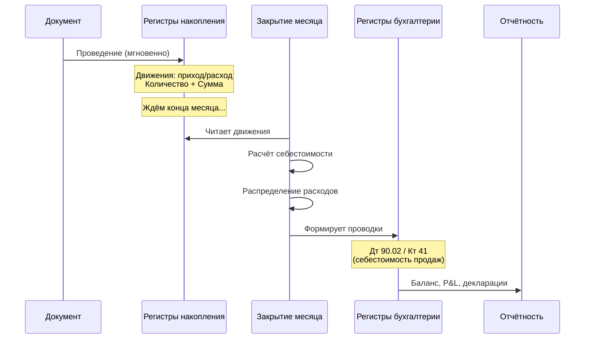

# Документооборот и регистры: Как ERP «запоминает» действия

> **Цель урока:** Понять, как 1C:ERP 2.5 фиксирует каждую операцию бизнеса — от приёмки товара до списания просрочки — через механизм документов, регистров и проводок. Разобраться, почему «провести документ» — это не просто нажать кнопку, а запустить цепную реакцию записей в десятках регистров.
> **Компетенции:**
> - Различать три типа регистров (накопления, сведений, бухгалтерии) и их роль в учёте
> - Объяснять связь «документ → движения в регистрах → проводки при закрытии месяца»
> - Понимать концепцию Регистратора — почему документ является «автором» всех записей
> - Диагностировать типичные проблемы документооборота в Q-commerce (задержки проведения, «дыры» в регистрах)
> **Время чтения:** ~80 минут

---

## Оглавление

- [[#Часть 1. Кнопка, которая запускает цепную реакцию]]
- [[#Часть 2. Как учёт превратился из книги в базу данных]]
- [[#Часть 3. Архитектура регистров в ERP 2.5]]
- [[#Часть 4. Ловушки документооборота в Q-commerce]]
- [[#Часть 5. От регистров к проводкам: механика закрытия месяца]]
- [[#Часть 6. Кейс: Как задержка проведения скрыла убыток в 4,7 млн рублей]]
- [[#Часть 7. Глоссарий и FAQ]]

---

## Часть 1. Кнопка, которая запускает цепную реакцию

Кладовщик даркстора «ЭкспрессМарт» принимает поставку: 200 упаковок йогурта, 150 бутылок воды, 80 пачек чипсов. Он открывает документ «Приобретение товаров и услуг» в 1C:ERP 2.5, сканирует штрихкоды, проверяет количество и нажимает кнопку «Провести».

Для кладовщика это конец процесса. Товар на полке, можно переходить к следующей поставке.

Для системы — это начало. В момент нажатия кнопки «Провести» ERP запускает цепочку из десятков операций:

1. В регистре «Товары на складах» появляется запись: +200 йогуртов, +150 бутылок воды, +80 пачек чипсов на конкретном складе
2. В регистре «Себестоимость товаров» появляется запись: +200 × 45 руб. = 9 000 руб. (йогурт), +150 × 22 руб. = 3 300 руб. (вода), +80 × 65 руб. = 5 200 руб. (чипсы)
3. В регистре «Расчёты с поставщиками» появляется запись: долг перед ООО «ФудСнаб» = 17 500 руб.
4. В регистре «Заказы поставщикам» обновляется статус: поставка получена, заказ закрыт
5. Если включён партионный учёт — в регистре партий появляются три новые записи с датами поступления

Пять регистров, десятки строк данных — и всё это от одного нажатия одной кнопки. Каждая строка привязана к документу-источнику через механизм, который в 1С называется **Регистратор**: документ «Приобретение товаров и услуг №157 от 15.01.2024» становится «автором» всех этих записей. Если кладовщик завтра обнаружит, что вместо 200 йогуртов привезли 180, он откроет тот же документ, исправит количество, проведёт заново — и система автоматически пересчитает все записи во всех пяти регистрах.

Этот механизм — «документ порождает движения в регистрах» — фундаментальный принцип 1C:ERP 2.5. Без его понимания невозможно объяснить, почему закрытие месяца занимает часы, почему P&L (отчёт о прибылях и убытках) «плавает» до Hard Close (полного закрытия) и почему задержка в проведении документов на один день может исказить управленческую отчётность на миллионы рублей.

### Что значит «провести документ»

В обычной жизни «провести» звучит как «утвердить» или «подтвердить». В терминологии 1С «проведение» — это конкретная техническая операция: **создание записей (движений) в регистрах на основании данных документа**.

Документ в ERP 2.5 может находиться в трёх состояниях:

- **Создан, но не проведён** — данные введены, но система их «не видит». Регистры пусты. Товар «не существует» для аналитики, остатков и отчётов.
- **Проведён** — движения созданы во всех связанных регистрах. Товар виден в остатках, долг виден в расчётах.
- **Проведение отменено** — движения удалены из регистров. Данные документа сохранены, но не влияют на учёт.

Для продакт-менеджера ключевой вывод: **непроведённый документ — невидимый документ**. Если кладовщик принял товар, но не провёл приёмку, в ERP этот товар не существует. Клиент не сможет его заказать (система покажет «нет в наличии»), закупщик закажет повторно (система покажет дефицит), а при инвентаризации обнаружится «излишек» — товар физически есть, а в учёте его нет.

---

## Часть 2. Как учёт превратился из книги в базу данных

### От гроссбуха к регистрам

В Дне 1 мы говорили о Луке Пачоли и двойной записи. Его система работала просто: каждая операция записывается в две книги — журнал (хронологически) и главную книгу (по счетам). Это было гениально для XV века, но у системы был фундаментальный недостаток: **одна операция — одна запись в одном месте**.

Когда венецианский купец продавал перец, он делал одну запись: «Продал 50 мешков за 500 дукатов». Но эта запись ничего не говорила о том, сколько перца осталось на складе, какова задолженность покупателя, из какой партии был продан перец и какова себестоимость проданного.

Индустриальная революция XIX века потребовала большего. Фабрики оперировали тысячами наименований, десятками складов, сотнями контрагентов. Одна операция должна была отражаться в нескольких «измерениях» одновременно: складской учёт, финансовый учёт, управленческий учёт, налоговый учёт.

Так родилась концепция **регистра** — структурированного хранилища данных, в которое документы «пишут» свои следы. Не одна книга на всё, а множество специализированных регистров, каждый из которых отвечает за свой аспект учёта.

### От бумажных карточек к цифровым регистрам

В советской бухгалтерии регистры существовали физически — это были картотеки с карточками. Карточка складского учёта формы М-17 содержала: наименование товара, единицу измерения, цену, приход, расход, остаток. Каждая операция записывалась в карточку вручную. При 500 наименованиях на одном складе это означало 500 карточек, обновляемых ежедневно.

1С автоматизировала эту логику, но не изменила её принципиально. Регистр в ERP 2.5 — это та же карточка М-17, только цифровая: структурированная таблица, где каждая строка — одно движение (приход или расход), привязанное к документу-регистратору.

Важно понимать: регистры в ERP — это не «дополнительные таблицы» к документам. Это **первичные хранилища данных**. Все отчёты, все остатки, вся аналитика строятся именно на данных регистров, а не на данных документов напрямую. Документ — это «ввод», регистр — это «память».

Революция в том, что одна операция (проведение документа) теперь создаёт записи в нескольких регистрах одновременно и мгновенно. То, на что бухгалтер тратил час (записать в складскую карточку, в книгу расчётов, в кассовую книгу), система делает за доли секунды. Но принцип остался тем же: каждая операция должна быть зафиксирована, и ни одна запись не должна появиться «из ниоткуда».

---

## Часть 3. Архитектура регистров в ERP 2.5

### Три типа регистров

В ERP 2.5 существуют три принципиально разных типа регистров. Каждый решает свою задачу, хранит данные по-своему и обновляется в разное время.

### Тип 1: Регистры накопления

**Назначение:** Хранить количественно-суммовые остатки и обороты. Это основной тип регистра для торговых операций.

**Как работает:** Каждая строка — это движение: «Приход» (увеличение) или «Расход» (уменьшение). Сумма всех приходов минус сумма всех расходов = текущий остаток.

**Ключевые регистры накопления для Q-commerce:**

| Регистр | Что хранит | Пример движения |
|:---|:---|:---|
| **Товары на складах** | Количественные остатки товаров | +200 шт. йогурта на складе «Даркстор Центральный» |
| **Себестоимость товаров** | Стоимость товарных остатков | +9 000 руб. (200 шт. × 45 руб.) |
| **Расчёты с клиентами** | Долги клиентов и предоплаты | +850 руб. — долг клиента за заказ №45678 |
| **Расчёты с поставщиками** | Долги перед поставщиками | +17 500 руб. — долг перед ООО «ФудСнаб» |
| **Денежные средства** | Остатки на счетах и в кассах | +850 руб. на расчётном счёте (оплата от клиента) |
| **Заказы клиентов** | Статус и состав клиентских заказов | Заказ №45678: 3 позиции, статус «К сборке» |

**Структура записи в регистре накопления:**

Каждая строка содержит:
- **Регистратор** — ссылка на документ, создавший запись
- **Период** — дата и время движения
- **Вид движения** — Приход или Расход
- **Измерения** — аналитика: товар, склад, организация, контрагент
- **Ресурсы** — числовые значения: количество, сумма, себестоимость

Пример: при продаже 3 штук йогурта в регистре «Товары на складах» появляется строка:

| Поле | Значение |
|:---|:---|
| Регистратор | Реализация товаров №892 от 16.01.2024 |
| Период | 16.01.2024 14:32:15 |
| Вид движения | Расход |
| Номенклатура | Йогурт клубничный 200 г |
| Склад | Даркстор «Центральный» |
| Количество | 3 |

### Тип 2: Регистры сведений

**Назначение:** Хранить справочную и статусную информацию. В отличие от регистров накопления, здесь нет «приходов» и «расходов» — только текущие значения.

**Как работает:** Каждая строка — это факт: «значение X для объекта Y на дату Z». При изменении факта старая строка не удаляется (если регистр периодический) — добавляется новая с новой датой. Это позволяет видеть историю изменений.

**Ключевые регистры сведений для Q-commerce:**

| Регистр | Что хранит | Пример |
|:---|:---|:---|
| **Цены номенклатуры** | Актуальные цены товаров | Йогурт: закупочная 45 руб., розничная 89 руб. |
| **Штрихкоды номенклатуры** | Привязка штрихкодов к товарам | 4607025392051 → Йогурт клубничный 200 г |
| **Курсы валют** | Курсы на каждый день | USD/RUB на 16.01.2024 = 88,72 |
| **Статусы закрытия месяца** | Какие регламентные операции выполнены | Январь 2024: расчёт себестоимости — выполнен |
| **Настройки учётной политики** | Параметры учёта по организациям | ООО «ЭкспрессМарт»: средневзвешенная, ОСНО (общая система налогообложения) |

Регистры сведений не создают «движений» — они фиксируют состояние. Продакт-менеджеру важно знать о них одно: если цена товара изменилась в регистре сведений «Цены номенклатуры», но документ реализации уже проведён со старой ценой, система не пересчитает автоматически — нужно перепровести документ.

### Тип 3: Регистры бухгалтерии

**Назначение:** Хранить бухгалтерские проводки — записи по плану счетов в формате «Дебет — Кредит — Сумма».

**Как работает:** Это единственный тип регистра, который работает по классической двойной записи Пачоли. Каждая проводка содержит два счёта (дебет и кредит), сумму и аналитику (субконто — до трёх уровней на каждом счёте).

**Ключевое отличие:** Для товарных операций регистры бухгалтерии заполняются **не при проведении документа**, а при **закрытии месяца** — в рамках регламентной операции «Отражение документов в регламентированном учёте». Это фундаментальная архитектурная особенность ERP 2.5. Отдельные типы документов (банковские, кассовые) могут формировать проводки сразу при проведении.

Цепочка выглядит так:

Почему так устроено? Потому что в момент проведения документа система ещё не знает финальную себестоимость (она зависит от метода оценки и всех операций за месяц). Проводки формируются только когда все данные за период собраны и себестоимость рассчитана.

> [!IMPORTANT] Два мира ERP 2.5
> Оперативный учёт (регистры накопления) работает в реальном времени — движения создаются мгновенно при проведении документа. Регламентированный учёт (регистры бухгалтерии) работает по итогам периода — проводки формируются только при закрытии месяца. Продакт-менеджер должен помнить: цифры в управленческих отчётах (из регистров накопления) и цифры в бухгалтерской отчётности (из регистров бухгалтерии) могут расходиться до момента закрытия.

### Концепция Регистратора

Каждая запись в каждом регистре содержит ссылку на документ, который её создал. Этот документ называется **Регистратором**.

Зачем это нужно:

1. **Аудиторский след.** От любой цифры в отчёте можно «провалиться» до конкретного документа: отчёт → проводка → движение в регистре → документ → кто создал, когда, на каком основании.

2. **Автоматический пересчёт.** Если документ перепроводится (например, исправлена ошибка), система автоматически обновляет все связанные записи во всех регистрах. Не нужно искать и править каждый регистр вручную.

3. **Отмена проведения.** Если документ отменяет проведение, система удаляет все записи, где он указан как Регистратор. Ни одна «осиротевшая» запись не останется.

Для продакт-менеджера это означает: в ERP 2.5 нет «потерянных» данных. Каждая цифра имеет автора (документ) и историю. Если цифра в отчёте выглядит неправильно, всегда можно проследить, откуда она взялась.

### Какие документы создают движения

Не все объекты в ERP 2.5 являются документами-регистраторами. Справочники (товары, контрагенты, склады) не создают движений — они описывают «кто» и «что». Движения создают только документы — они описывают «что произошло».

Основные документы Q-commerce и их регистры:

| Документ | Основные регистры | Кол-во движений |
|:---|:---|:---|
| Приобретение товаров и услуг | Товары на складах, Себестоимость, Расчёты с поставщиками, НДС | 4–6 |
| Реализация товаров и услуг | Товары на складах, Себестоимость, Выручка и себестоимость продаж, Расчёты с клиентами | 5–8 |
| Перемещение товаров | Товары на складах (расход со склада А + приход на склад Б), Себестоимость | 2–4 |
| Списание товаров | Товары на складах, Себестоимость, Прочие расходы | 2–3 |
| Пересчёт товаров (инвентаризация) | Товары на складах | 1–2 |
| Заказ клиента | Заказы клиентов (резервирование) | 1–2 |
| Поступление безналичных ДС | Денежные средства, Расчёты с клиентами | 2 |

Один заказ клиента в Q-commerce проходит через цепочку из 3–5 документов: Заказ клиента → Реализация → Поступление оплаты. Каждый создаёт свои движения. Итого на один заказ — 10–15 записей в регистрах. При 40 000 заказов в день — 400 000–600 000 записей ежедневно только от продаж.

---

## Часть 4. Ловушки документооборота в Q-commerce

### Ловушка 1: Отложенное проведение

В классическом ритейле документ проводится в тот же день, когда произошла операция. В Q-commerce — не всегда. Кладовщик принял поставку в 6:00, но провёл документ в 14:00 (после обеда, когда «руки дошли»). Восемь часов — это 500–800 заказов, которые система отработала с устаревшими остатками.

Последствия отложенного проведения:

| Ситуация | Что видит ERP | Что на самом деле | Последствие |
|:---|:---|:---|:---|
| Товар привезли, но не провели приёмку | Остаток = 0 | Товар на полке | Клиент видит «нет в наличии», заказ не формируется. Упущенная выручка. |
| Товар продали, но не провели реализацию | Остаток = 50 | Остаток = 47 | Система резервирует несуществующий товар. Клиент получает отмену при сборке. |
| Перемещение между дарксторами не проведено | На складе А: 100, на Б: 0 | На А: 70, на Б: 30 | Склад Б не может продавать перемещённый товар. Склад А «резервирует» уже отправленное. |

Для Q-commerce, где среднее время от заказа до доставки — 15 минут, задержка проведения в 8 часов — это катастрофа. Система живёт в «параллельной реальности», не совпадающей с физическим миром.

### Ловушка 2: Проведение «задним числом»

Обратная ситуация: кладовщик вчера забыл провести приёмку и проводит её сегодня вчерашним числом. Для регистров накопления это создаёт проблему: все движения, которые были рассчитаны после вчерашней даты (продажи, списания, перемещения), основывались на остатках **без учёта этой приёмки**. При среднескользящем методе оценки (День 3) это означает: себестоимость всех вчерашних продаж пересчитывается, потому что средняя цена задним числом изменилась.

ERP 2.5 позволяет проводить документы задним числом, но при определённых условиях:

- Если месяц ещё не закрыт — проведение возможно, движения пересчитываются
- Если месяц уже закрыт — проведение заблокировано. Нужно открыть месяц заново, что требует повторного закрытия.

> [!WARNING] Правило 24 часов
> Для Q-commerce рекомендуется организационное правило: все складские документы проводятся в течение 24 часов после физической операции. Превышение этого окна создаёт «дрейф» данных — расхождение между физическим миром и цифровым учётом, которое накапливается и проявляется при инвентаризации.

### Ловушка 3: «Дыры» в цепочке документов

В ERP 2.5 документы связаны друг с другом в цепочки. Типичная цепочка продажи:

Заказ клиента → Реализация товаров → Приходный кассовый ордер (или банковская выписка)

Если один документ в цепочке не проведён, следующие документы «зависают»:

- Реализация без заказа — система не знает, кому и зачем продали товар
- Оплата без реализации — деньги пришли, но нет привязки к конкретной продаже
- Реализация без оплаты — товар отгружен, но дебиторская задолженность не контролируется

В Q-commerce эта проблема обостряется из-за объёма: при 40 000 заказов в день даже 0,1% «разрывов» в цепочках — это 40 заказов с неполными данными ежедневно. За месяц — 1 200 операций, которые при закрытии месяца вызовут ошибки или потребуют ручной корректировки.

ERP 2.5 предоставляет инструмент для диагностики: отчёт «Контроль последовательности документов». Он показывает все цепочки, в которых пропущено звено. Рекомендация: запускать этот отчёт ежедневно и включить его в утренний чеклист операционного менеджера.

### Ловушка 4: Дублирование документов

Кладовщик провёл приёмку, но система «зависла» (или он так решил), и он создал документ повторно. Теперь в регистре «Товары на складах» — двойной приход: +400 йогуртов вместо +200. Остатки завышены вдвое. Автозаказ не сработает (система считает, что товара достаточно). При инвентаризации обнаружится «недостача» в 200 штук, которой на самом деле нет.

> [!TIP] Защита от дублирования
> ERP 2.5 имеет встроенный контроль дублей для некоторых типов документов (например, через номер входящего документа поставщика). Но этот контроль не включён по умолчанию. Для Q-commerce рекомендуется настроить контроль уникальности по комбинации: поставщик + дата + номер накладной.

---

## Часть 5. От регистров к проводкам: механика закрытия месяца

### Что происходит при закрытии месяца

В Днях 1 и 3 мы упоминали закрытие месяца. Теперь — детальная механика. Закрытие месяца в ERP 2.5 — это последовательность регламентных операций, которая превращает движения в оперативных регистрах в бухгалтерские проводки.

**Шаг 1: Расчёт себестоимости товаров**

Система читает все движения в регистре «Себестоимость товаров» за месяц и применяет метод оценки из учётной политики (День 3):

- **Средневзвешенная:** Считает единую цену для каждого товара на каждом складе. Формула: (остаток на начало + все приходы) / (количество на начало + количество приходов).
- **ФИФО:** «Разматывает» цепочки партий. Первая поступившая партия списывается первой. Требует партионных данных.

Результат: каждому расходному движению (продажа, списание, перемещение) присваивается стоимостная оценка — себестоимость. До этого момента расходные движения имели только количество, но не сумму.

**Шаг 2: Распределение расходов**

Система берёт накладные расходы (аренда, логистика, ФОТ — фонд оплаты труда) из регистра «Прочие расходы» и распределяет их по подразделениям и направлениям деятельности согласно правилам из учётной политики (День 3, секция «Статьи расходов»).

**Шаг 3: Формирование проводок**

Система конвертирует движения в оперативных регистрах в бухгалтерские проводки. Каждый тип движения имеет своё «отражение» на плане счетов:

| Операция | Движение в регистре | Проводка (Дт → Кт) |
|:---|:---|:---|
| Приёмка товара | Себестоимость товаров: Приход | Дт 41 «Товары» → Кт 60 «Расчёты с поставщиками» |
| Продажа товара (выручка) | Выручка и себестоимость продаж: Приход | Дт 62 «Расчёты с покупателями» → Кт 90.01 «Выручка» |
| Продажа товара (себестоимость) | Себестоимость товаров: Расход | Дт 90.02 «Себестоимость продаж» → Кт 41 «Товары» |
| Списание просрочки | Себестоимость товаров: Расход | Дт 91.02 «Прочие расходы» → Кт 41 «Товары» |
| Оплата от клиента | Денежные средства: Приход | Дт 51 «Расчётный счёт» → Кт 62 «Расчёты с покупателями» |

**Шаг 4: Расчёт НДС (налог на добавленную стоимость)**

Система формирует движения в регистрах НДС: «НДС предъявленный» (входящий НДС от поставщиков) и «НДС к вычету» (НДС, который можно принять к вычету). Если в учётной политике включён раздельный учёт НДС — система дополнительно распределяет входящий НДС между облагаемыми и необлагаемыми операциями.

**Шаг 5: Проверка и аудит**

Система проверяет баланс: сумма всех дебетов должна равняться сумме всех кредитов. Если не сходится — закрытие блокируется, и бухгалтер ищет ошибку.

### Почему закрытие занимает часы

При 30 дарксторах, 2 500 SKU (учётных единиц) и 40 000 заказов в день за месяц накапливается:

- ~1,2 млн движений в регистре «Товары на складах»
- ~800 000 движений в регистре «Себестоимость товаров»
- ~1,2 млн движений в регистре «Расчёты с клиентами»
- ~60 000 движений в регистре «Расчёты с поставщиками»

Итого: ~3,3 млн записей, которые нужно обработать, пересчитать, конвертировать в проводки и проверить на баланс. При средневзвешенном методе это занимает 3–5 часов. При ФИФО — 15–20 часов (как мы разбирали в Дне 3).

> [!WARNING] Незакрытый месяц
> Пока месяц не закрыт, бухгалтерская отчётность не сформирована. Это значит: нет официального P&L, нет баланса, нет НДС-декларации. Для инвесторов и ФНС (Федеральная налоговая служба) компания «молчит». Задержка закрытия на неделю — это задержка отчётности на неделю. Для публичных компаний это штрафы и репутационные потери.

### Предварительное и полное закрытие: два режима аналитики

Для управленческих целей Q-commerce сети обычно делают **предварительное закрытие (Soft Close)** еженедельно: расчёт себестоимости без формирования проводок, без НДС, без аудита. Это даёт приблизительный P&L за неделю — не идеально точный, но достаточный для операционных решений.

**Полное закрытие (Hard Close)** — ежемесячная процедура с полным циклом: себестоимость, проводки, НДС, проверка баланса. Только после Hard Close цифры считаются «финальными».

Разница между Soft Close и Hard Close может составлять 2–5% по марже. Причины:

- Soft Close использует плановую себестоимость для товаров, поступивших в последнюю неделю месяца (фактическая ещё не рассчитана)
- Soft Close не учитывает распределение накладных расходов (аренда, логистика)
- Soft Close не учитывает корректировки задним числом (перепроведённые документы)

Для продакт-менеджера это означает: еженедельные цифры по марже — ориентировочные. Решения о ценообразовании и ассортименте лучше принимать после Hard Close, когда картина полная.

### Порядок регламентных операций

Закрытие месяца — не одна кнопка, а последовательность из 10–15 регламентных операций, выполняемых в строгом порядке. Нарушение порядка приведёт к ошибкам. ERP 2.5 контролирует последовательность автоматически через рабочее место «Закрытие месяца»:

1. Восстановление последовательности расчётов (если были документы задним числом)
2. Расчёт себестоимости товаров
3. Распределение расходов будущих периодов (РБП — расходы будущих периодов)
4. Распределение дополнительных расходов на себестоимость
5. Расчёт амортизации ОС (основных средств) и НМА (нематериальных активов)
6. Формирование движений по НДС
7. Отражение документов в регламентированном учёте (формирование проводок)
8. Расчёт отложенных налогов (ПБУ 18/02)
9. Закрытие счетов доходов и расходов
10. Проверка целостности (аудит баланса)

Каждая операция имеет статус: «Не выполнена», «Выполнена», «Требуется повторное выполнение». Если операция №2 (себестоимость) выполнена, а затем бухгалтер провёл документ задним числом, статус автоматически сбрасывается на «Требуется повторное выполнение» для операций №2–10.

---

## Часть 6. Кейс: Как задержка проведения скрыла убыток в 4,7 млн рублей

### Контекст

Сеть «ФрешЛайн», 22 даркстора в Москве. 35 000 заказов в день. 1C:ERP 2.5 с первого дня работы. Метод оценки — средневзвешенная. Всё работает стабильно 6 месяцев.

В марте финансовый директор замечает аномалию: маржа по категории «Молочные продукты» в управленческом отчёте — 14,2%. Это на 3 процентных пункта выше, чем обычно (11–12%). Звучит как хорошая новость: категория стала прибыльнее.

Но финансовый директор — опытный специалист. Он знает: маржа «молочки» в Q-commerce физически не может вырасти на 3 п.п. без изменения закупочных цен или розничных цен. Ни то, ни другое не менялось.

### Механизм провала

Расследование выявило цепочку:

**1. Непроведённые списания.**

На 8 из 22 дарксторов кладовщики перестали проводить документы «Списание товаров» по истечении срока годности. Физически просроченные йогурты, кефиры и творог выбрасывались — но в ERP операция не фиксировалась. Причина: в феврале обновили интерфейс ТСД (терминал сбора данных — мобильное устройство для складских операций), и новый процесс списания стал требовать дополнительного шага подтверждения. Кладовщики просто пропускали этот шаг.

**2. Завышенные остатки.**

Поскольку списания не проводились, в регистре «Товары на складах» числилось больше товара, чем было физически. На 8 проблемных дарксторах суммарное расхождение к концу марта составило ~4 200 единиц молочной продукции.

**3. Искажённая себестоимость.**

При расчёте средневзвешенной себестоимости за март система делила общую стоимость закупок на общее количество (включая «фантомные» 4 200 единиц, которых физически не было). Результат: себестоимость единицы занижена, потому что знаменатель дроби завышен.

**4. Завышенная маржа.**

Заниженная себестоимость → заниженная стоимость проданного → завышенная валовая прибыль → завышенная маржа в P&L. Вместо реальных 11% система показывала 14,2%.

### Обнаружение

Проблему обнаружили только при инвентаризации в конце марта. Фактический остаток молочной продукции на 8 дарксторах оказался на 4 200 единиц меньше, чем в ERP. Стоимость «фантомных» остатков: 4 200 × средняя себестоимость 52 руб. = **218 400 руб.** Но это прямой убыток. Косвенный — гораздо больше.

### Цена ошибки

- **Прямые потери (списание просрочки):** 218 400 руб. (товар был утилизирован, но не списан в учёте)
- **Автозаказ на основе ложных данных:** Система считала, что молочки достаточно (завышенные остатки), и не генерировала дозаказы. Реальный дефицит на 8 дарксторах → 3 400 отменённых заказов за март → упущенная выручка ~2,1 млн руб.
- **Неверные управленческие решения:** Финансовый директор на основании «высокой маржи» молочки согласовал расширение ассортимента молочных продуктов на 15 позиций. Инвестиции в новый ассортимент: ~1,8 млн руб. На основе ложной маржи.
- **Перезакрытие марта:** После инвентаризации пришлось провести все списания задним числом, перезакрыть март. Три дня работы бухгалтерии.
- **Корректировка НДС:** Списание товара меняет базу для вычета НДС. Корректировочная декларация НДС за I квартал.
- **Итого:** Прямые + косвенные потери: **~4,7 млн руб.**

### Что нужно было сделать

1. **Мониторинг проведения документов.** Ежедневный отчёт: «Документы, созданные, но не проведённые за последние 24 часа». Если списание создано (кладовщик начал процесс), но не проведено — сигнал руководителю даркстора.

2. **Контроль расхождений.** Еженедельная сверка: физические остатки скоропортящихся товаров vs остатки в ERP. Расхождение >2% — расследование.

3. **UX (User Experience — пользовательский опыт) проверка при обновлении.** Любое изменение интерфейса ТСД должно проходить приёмочное тестирование с участием реальных кладовщиков. Если новый процесс добавляет шаги — убедиться, что кладовщики их выполняют.

### Решение Продуктового Архитектора

**Гипотеза:** «Кладовщики не проводят списания из-за сложного UX нового ТСД.»

**Анализ:**
- Корневая причина — не технический сбой, а изменение UX без тестирования
- Проблема обнаруживалась только через 3–4 недели (при инвентаризации)
- Масштаб: 36% дарксторов (8 из 22) были затронуты

**Финальное решение:** Трёхуровневая защита:
1. **UX:** Упростить процесс списания в ТСД до одного подтверждения (было два)
2. **Автоматика:** Настроить ежедневный автоматический отчёт «Непроведённые документы за 24 часа» с отправкой руководителям дарксторов
3. **Контроль:** Еженедельная автоматическая сверка остатков по категориям с высокой оборачиваемостью (молочные, фрукты, овощи) — расхождение >50 единиц на даркстор = автоматический тикет операционной команде

### Сравнительная таблица: компромисс архитектора

| Операция | Профит для Продукта | Цена для Системы | Вердикт |
|:---|:---|:---|:---|
| Автоматическое проведение всех документов | Нет задержек, данные всегда актуальны | Риск проведения ошибочных данных без проверки | Только для автозагрузки из агрегаторов |
| Ежедневный отчёт «Непроведённые документы» | Быстрое обнаружение разрывов | 15 мин./день работы операционного менеджера | Обязательно для сетей >10 точек |
| Еженедельная сверка физических остатков | Раннее обнаружение дрейфа данных | 2–3 часа/неделю на каждый даркстор | Для категорий с оборачиваемостью >5 дней |
| Запрет проведения задним числом | Нет искажений ретроспективы | Кладовщики вынуждены проводить сразу или терять данные | Слишком жёстко; лучше мониторинг + алерт |

### Итог кейса

Проблема «ФрешЛайн» — классический пример того, как разрыв между физическим миром и цифровым учётом нарастает незаметно. Никто не совершил ошибку «специально». Кладовщики не пропускали списания злонамеренно — им просто стало неудобно. Но за месяц «неудобства» превратились в 4,7 млн рублей потерь. Урок: в Q-commerce, где объём операций измеряется десятками тысяч в день, даже маленький систематический пропуск создаёт лавину.

---

## Часть 7. Глоссарий и FAQ

### Глоссарий

| Термин | Определение | Контекст в Q-commerce |
|:---|:---|:---|
| **Проведение документа** | Создание записей (движений) в регистрах на основании данных документа | Мгновенная фиксация операции в учёте; непроведённый документ = невидимая операция |
| **Регистр накопления** | Хранилище количественно-суммовых данных с движениями «Приход/Расход» | Основной тип для торговли: остатки, себестоимость, расчёты |
| **Регистр сведений** | Хранилище справочной и статусной информации без движений | Цены, штрихкоды, курсы валют, статусы закрытия |
| **Регистр бухгалтерии** | Хранилище проводок по плану счетов (Дебет — Кредит) | Заполняется только при закрытии месяца |
| **Регистратор** | Документ, создавший запись в регистре; «автор» движения | Обеспечивает аудиторский след от отчёта до исходной операции |
| **Движение** | Одна запись в регистре: приход или расход с аналитикой и суммой | При 40 000 заказов/день — ~3,3 млн движений в месяц |
| **Проводка** | Бухгалтерская запись: Дебет счёта → Кредит счёта → Сумма | Формируется при закрытии месяца из движений регистров |
| **Закрытие месяца** | Регламентная процедура: расчёт себестоимости → распределение расходов → проводки → НДС | 3–5 часов (средневзвешенная) или 15–20 часов (ФИФО) |
| **Предварительное закрытие (Soft Close)** | Упрощённый расчёт себестоимости без проводок и НДС | Для еженедельного управленческого P&L, точность ±2–5% |
| **Полное закрытие (Hard Close)** | Полный цикл с проводками, НДС и аудитом баланса | Ежемесячно, финальные цифры для отчётности |
| **План счетов** | Структурированный перечень бухгалтерских счетов (41, 60, 62, 90, 91...) | В ERP 2.5 используется типовой план счетов РСБУ (Российские стандарты бухгалтерского учёта) |

### FAQ

**В: Можно ли увидеть движения документа в регистрах?**
О: Да. В любом проведённом документе есть кнопка «Движения документа» (или Ctrl+F12). Она показывает все записи во всех регистрах, которые создал этот документ. Это основной инструмент диагностики: если цифра в отчёте выглядит неправильно, откройте документ-источник и проверьте его движения.

**В: Что произойдёт, если удалить проведённый документ?**
О: ERP 2.5 не позволяет удалить проведённый документ. Сначала нужно отменить проведение (система удалит все движения из регистров), и только потом пометить документ на удаление. Это защита целостности данных: нельзя «выдернуть» документ, оставив осиротевшие записи в регистрах.

**В: Почему управленческий P&L отличается от бухгалтерского?**
О: Потому что они формируются из разных регистров. Управленческий P&L — из регистров накопления (данные в реальном времени, но без финальной себестоимости). Бухгалтерский — из регистров бухгалтерии (данные после закрытия месяца, с финальной себестоимостью и распределёнными расходами). Разница исчезает только после полного закрытия (Hard Close).

**В: Сколько регистров затрагивает один документ продажи?**
О: Типичная «Реализация товаров и услуг» создаёт движения в 5–8 регистрах одновременно: Товары на складах (расход), Себестоимость товаров (расход), Выручка и себестоимость продаж (приход), Расчёты с клиентами (приход — долг), Заказы клиентов (расход — резерв снят), НДС (если ОСНО). При наличии бонусов или скидок добавляются движения в регистрах маркетинговых акций.

**В: Как понять, что закрытие месяца прошло корректно?**
О: После закрытия проверяйте три вещи: (1) Нет ли ошибок в протоколе закрытия (отчёт «Состояние закрытия месяца»). (2) Сходится ли оборотно-сальдовая ведомость (сумма дебетов = сумме кредитов). (3) Нет ли «зависших» нераспределённых расходов (отчёт «Финансовый результат»). Если все три проверки пройдены — закрытие корректно.

**В: Можно ли автоматизировать проведение документов?**
О: Частично. ERP 2.5 поддерживает автоматическое проведение при загрузке данных из внешних систем (например, из агрегаторов заказов через обмен). Но складские документы (приёмка, списание, перемещение) обычно требуют ручного подтверждения — это физические операции, которые нужно верифицировать.

**В: Можно ли переотразить документы, если выяснилось, что они проведены с ошибкой?**
О: Да, через перепроведение. Но здесь есть нюанс для Q-commerce: если документ провели в позапрошлом месяце, перепроведение потребует пересчёта себестоимости за все последующие периоды. В ERP 2.5 это означает повторное закрытие месяца. Практическое правило: ошибки текущего месяца — исправляйте через корректировку; ошибки прошлых периодов — оформляйте как корректировочный документ текущего месяца.

**В: Что происходит с данными в регистрах при отмене проведения документа?**
О: ERP записывает движения с обратным знаком: если проведение добавило запись (+10 ед. на склад), отмена создаёт запись (-10 ед.). Итоговый регистр возвращается к состоянию до документа — это называется «сторно движений». Важно: если между проведением и отменой успело пройти закрытие месяца, сторно создаст расхождение в данных этого закрытия. Именно так рождается хаос при массовых исправлениях постфактум.

---

> [!TIP] Тизер Дня 5
> Мы разобрали, как ERP «запоминает» — через документы, регистры и проводки. Но как «вспоминать»? Завтра — отчётность и аналитика: какие отчёты строить, где искать ошибки и как превратить 3,3 миллиона записей в три числа, которые нужны продакту для принятия решений. → [[Week 1 - Day 5 - Отчётность и аналитика|День 5]]

---

← [[Week 1 - Day 3 - Учётная политика|День 3]] | [[README|Оглавление]] | [[Week 1 - Day 5 - Отчётность и аналитика|День 5]] →
