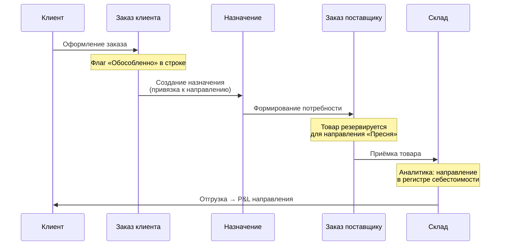
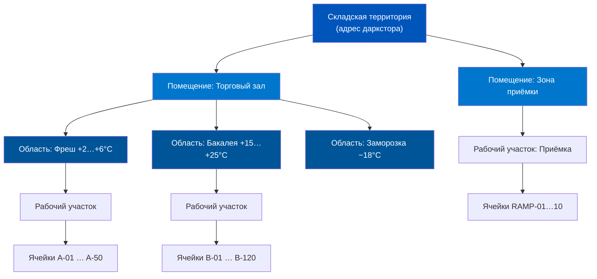
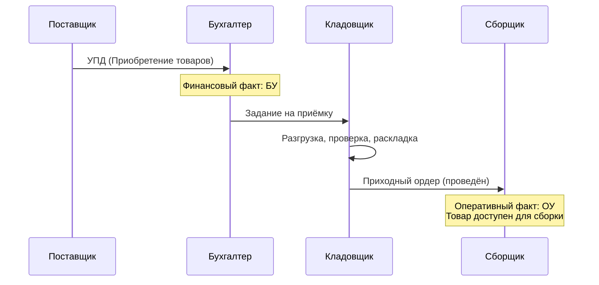

# Архитектура предприятия: Организации, Направления и Склады

> **Цель урока:** Понять, как четыре базовых справочника — Организации, Подразделения, Направления деятельности и Склады — формируют «скелет» ERP, и научиться проектировать структуру, при которой каждый даркстор виден как отдельный центр прибыли.
> **Компетенции:**
> - Различать организацию, подразделение и склад и понимать их взаимное влияние
> - Выбирать режим направлений деятельности (распределение vs обособленный учёт) исходя из задач бизнеса
> - Проектировать топологию склада: помещения, ячейки, области хранения
> - Диагностировать типичные ошибки проектирования структуры предприятия
> **Время чтения:** ~75 минут

---

## Оглавление

- [[#Часть 1. Адрес банана]]
- [[#Часть 2. От бумажной иерархии к цифровому конструктору]]
- [[#Часть 3. Четыре кита структуры: детальный разбор]]
- [[#Часть 4. Ловушка «оставим по умолчанию»]]
- [[#Часть 5. Топология склада: физический мир внутри ERP]]
- [[#Часть 6. Кейс: Два юрлица, один склад и невидимые убытки]]
- [[#Часть 7. Глоссарий и FAQ]]

---

## Часть 1. Адрес банана

Вчера мы узнали, что один банан живёт в трёх учётных слоях одновременно. Сегодня — другой вопрос: а *где* именно он живёт?

Звучит просто, пока не задумаешься. В мире Q-commerce «где» — это не один ответ, а четыре:

- **Юридически** — банан принадлежит ООО «Быстрая Еда». Это организация. Именно она указана в УПД (универсальный передаточный документ), именно она платит НДС, именно ей Федеральная налоговая служба пришлёт письмо, если что-то пойдёт не так.
- **Операционно** — банан лежит на полке даркстора «Пресня-Центр». Это склад. Сборщик видит его в мобильном приложении, берёт и кладёт в пакет.
- **Финансово** — затраты на аренду, электричество, зарплату кладовщика даркстора «Пресня-Центр» падают на подразделение «DS Пресня». Это подразделение (Центр финансовой ответственности — ЦФО).
- **Аналитически** — прибыль от продажи банана попадает в направление деятельности «Москва-Центр». Это разрез для P&L (отчёт о прибылях и убытках).

Четыре ответа. Четыре справочника. И если хотя бы один из них настроен неправильно, вы не сможете ответить на элементарный вопрос: «Сколько зарабатывает даркстор Пресня?»

Именно этот вопрос задал финансовый директор одной Q-commerce сети в январе 2023 года. И получил три разных ответа от трёх подразделений. Операционный директор показал +1,8 млн руб. (считал по данным оперативного учёта). Главный бухгалтер — +4,2 млн руб. (считала по регламентированным проводкам). А финансовый аналитик — −0,3 млн руб. (считал по управленческим данным с учётом аллокации логистики). Кто прав? Все трое — каждый в своём контексте. Но продуктовое решение (открывать вторую точку в районе или нет) требует одной цифры, а не трёх.

Проблема была не в людях и не в методологии. Проблема была в структуре предприятия: склад привязан к одной организации, расходы на аренду — к другому подразделению, а направление деятельности вообще не заведено. Три слоя учёта не были «прошиты» единой структурой, и каждый отчёт собирал цифры из разных углов системы.


### Почему структура — это решение «до первой транзакции»

Вчера мы говорили о средневзвешенной стоимости и направлениях деятельности. Сегодня — о фундаменте, на котором всё это стоит. Структура предприятия в ERP — это не настройка, которую можно «подкрутить» на лету. Это архитектурный каркас, и менять его после запуска — всё равно что передвигать несущие стены в жилом доме.

Конкретный пример: если вы запустили сеть из 15 дарксторов с одним подразделением «Логистика» на всех, а через полгода решили видеть P&L по каждой точке, вам придётся: создать 15 подразделений, перенастроить все статьи расходов, перезакрыть месяцы с начала года. На практике это 2–4 недели работы команды внедрения и полная потеря аналитики за предыдущий период.

> **Структура предприятия в ERP — это не справочник. Это конституция. Изменить её можно, но каждая поправка стоит месяцы работы.**

---

## Часть 2. От бумажной иерархии к цифровому конструктору

### Советское наследие: «Штатное расписание — наше всё»

В плановой экономике структура предприятия определялась одним документом — штатным расписанием. Завод имел цеха, цеха имели участки, участки имели бригады. Каждый элемент — одна строка в бумажной таблице. Бухгалтерия вела учёт по «местам хранения» — тоже бумажным карточкам. Склад №3, стеллаж Б, полка 4 — вот и вся «топология».

Когда в 1990-х появились первые версии «1С:Предприятие», они скопировали эту логику: одна организация, одна иерархия подразделений, один склад = одна запись в справочнике. Для магазина «Продукты» на углу этого хватало.

### Рождение многомерности: холдинги и ритейл 2000-х

Проблемы начались с ростом сетевого ритейла. «Пятёрочка» к 2005 году имела 1 500 магазинов. Каждый магазин — это одновременно и склад (для товара), и подразделение (для расходов), и точка продаж (для выручки). А юридически вся сеть могла работать через 5–10 ООО (для оптимизации налогообложения и снижения рисков).

Возникла задача, которую одномерная иерархия решить не могла: как в одной базе данных видеть товар одновременно на складе «Магазин №847», в подразделении «Кластер Москва-Юг», в организации «ООО Агроторг №3» и в аналитическом разрезе «Формат у дома»?

1C:ERP 2.5 решила эту задачу через **разделение ответственности**: каждый справочник отвечает за свою «координату». Они пересекаются, но не вложены друг в друга.

### Q-commerce: ещё один уровень сложности

Примечательно, что даже «Пятёрочка» с её 20 000+ магазинами имеет относительно простую структуру: один формат магазина, стандартная планировка, предсказуемый ассортимент. Структура ERP для такой сети — это, по сути, 20 000 копий одного шаблона.

В Q-commerce всё иначе. Каждый даркстор уникален: площадь от 150 до 800 м², разный ассортимент (от 800 до 3 000 SKU (Stock Keeping Unit — учётная единица товара) в зависимости от района), разная зона доставки. И эта уникальность должна быть отражена в структуре ERP.

Три фактора делают проектирование структуры особенно сложным:

1. **Скорость открытия точек.** Сеть может открывать 3–5 дарксторов в неделю. Каждый требует заведения склада, подразделения и привязки к направлению деятельности. Если процесс не стандартизирован, через месяц в базе хаос.

2. **Мульти-организационность.** Типичная Q-commerce компания работает через 2–3 юрлица: одно для закупок, одно для розничных продаж, одно для курьерской доставки. Один физический даркстор может обслуживать все три организации.

3. **Динамика.** Даркстор «Пресня» сегодня работает, а через 3 месяца закрыт (аренда выросла). На его месте открывается «Пресня-2» в соседнем здании. В ERP старый склад нельзя удалить (по нему есть исторические данные), но и путать его с новым — нельзя.


---

## Часть 3. Четыре кита структуры: детальный разбор

### 3.1. Организации: юридическая оболочка

**Бизнес-функция:** Организация — это субъект хозяйственной деятельности, зарегистрированный в государственных органах. Проще говоря, это юрлицо (ООО, ИП, АО), которое подписывает договоры, платит налоги и отвечает перед законом.

**Инструмент ERP:** Справочник «Организации». Путь: НСИ (нормативно-справочная информация) и администрирование → НСИ → Организации. Если в системе одна организация, справочник можно даже не включать — система подставит единственное юрлицо автоматически. Для включения нескольких: НСИ и администрирование → Настройка НСИ и разделов → Предприятие → **Несколько организаций**.

**Влияние на учёт:**
- Каждый документ (Приобретение, Реализация, Перемещение) привязан к конкретной организации
- Регламентированная отчётность (баланс, отчёт о прибылях и убытках, декларация НДС) формируется строго по организации
- Если товар нужно «передать» из ООО «Альфа» в ООО «Бета» — это не перемещение, а интеркомпани-операция (продажа + покупка между своими юрлицами)

**Ограничения типового решения:**
- Организации в ERP 2.5 не образуют иерархию. Нет понятия «головная организация» на уровне справочника — только на уровне отчётности (консолидация)
- Обособленные подразделения организации (филиалы) — это отдельная сущность. Они бывают двух типов:
  - **Выделенные на отдельный баланс** — ведут независимый учёт, сдают отдельную отчётность. Фактически — «почти отдельное юрлицо» внутри организации
  - **Не выделенные на отдельный баланс** — имеют собственный КПП (код причины постановки на учёт), но учёт ведётся совместно с головным офисом. Пример: торговая точка, склад в другом городе

> [!IMPORTANT] Для Q-commerce
> Типичная схема: одно ООО для всей сети дарксторов. Каждый даркстор — обособленное подразделение, не выделенное на отдельный баланс. Это позволяет: (1) не плодить юрлица, (2) иметь отдельный КПП для каждой точки (нужен для фискализации чеков), (3) вести единую бухгалтерию.

### 3.2. Подразделения: управленческая иерархия

**Бизнес-функция:** Подразделение — это элемент организационной структуры, на который «падают» затраты. В терминологии управленческого учёта — Центр финансовой ответственности (ЦФО).

**Инструмент ERP:** Справочник «Структура предприятия». Путь: НСИ и администрирование → НСИ → Структура предприятия. Включение: НСИ и администрирование → Настройка НСИ и разделов → Предприятие → **Подразделения**.

**Ключевое отличие от организации:** Подразделения — это управленческая структура, общая для всего предприятия. Они не привязаны к конкретной организации. Это принципиальное архитектурное решение ERP 2.5: управленческая иерархия существует «поверх» юридической структуры.

**Что определяет подразделение:**
- Какие статьи расходов на него начисляются (аренда, ФОТ — фонд оплаты труда, коммуналка)
- Кто из сотрудников к нему приписан (через профиль пользователя — автозаполнение в документах)
- Может ли быть производственным (с дополнительными настройками: график работы, плановый интервал)
- Статус: «Действует» или «Не действует» (мягкое «закрытие» без удаления)

**Иерархия:** Подразделения выстраиваются в дерево. Для Q-commerce типичная структура:

```
Предприятие
├── Управляющая компания
│   ├── Финансы
│   ├── ИТ
│   └── HR
├── Операции Москва
│   ├── DS Пресня
│   ├── DS Хамовники
│   └── DS Чертаново
├── Операции СПб
│   ├── DS Невский
│   └── DS Петроградская
└── Логистика
    ├── Центральный склад
    └── Курьерская служба
```

**Важный нюанс:** Отключить подразделения невозможно, если в системе включён производственный учёт или учёт по обособленным дочерним организациям. Поэтому, если вы когда-нибудь планируете собственное производство (например, готовая еда в дарксторе), включайте подразделения с первого дня.

**Влияние на финансовый результат:** Если включить опцию «Обособленный учёт себестоимости по подразделениям» (НСИ и администрирование → Настройка НСИ и разделов → Финансовый результат и контроллинг → Учёт товаров), система будет считать прибыль отдельно по каждому подразделению. Это мощный инструмент, но он требует дисциплины: каждый документ должен содержать правильное подразделение.

### 3.3. Направления деятельности: аналитический разрез для P&L

**Бизнес-функция:** Направление деятельности — это виртуальный «контейнер», который собирает доходы и расходы в единый P&L. В отличие от подразделения (которое отражает оргструктуру), направление отражает бизнес-логику: по региону, по каналу продаж, по кластеру дарксторов.

**Инструмент ERP:** Справочник «Направления деятельности». Включение: НСИ и администрирование → Настройка НСИ и разделов → Финансовый результат и контроллинг → Финансовый результат → **Финансовый результат по направлениям деятельности**.

**Два режима — критический выбор:**

Мы коснулись этой темы вчера в кейсе «Марс Экспресс». Сегодня разберём подробнее.

**Режим 1: Распределение (правила распределения)**
- Доходы и расходы попадают в направление через правила аллокации
- Товар на складе не «помечен» направлением — он общий
- P&L по направлению формируется в управленческом учёте (УУ), но не в бухгалтерском (БУ)
- Настройка: быстрая (1–2 дня)
- Точность P&L: ±10–15% (из-за аллокаций)

**Режим 2: Обособленный учёт**
- Товар на складе физически «помечен» направлением: «Эти 50 кг бананов — для DS Пресня»
- Включается через: НСИ и администрирование → Настройка НСИ и разделов → Финансовый результат и контроллинг → Финансовый результат → **Финансовый результат по направлениям деятельности** → выбрать режим «Обособленный учёт финансового результата по направлениям деятельности»
- P&L формируется и в УУ, и в БУ — можно аудировать
- Настройка: 2–3 недели
- Точность P&L: ±1–2%

> [!TIP] Важный нюанс
> Режимы не являются полностью взаимоисключающими. В ERP 2.5 можно использовать обособленный учёт по направлениям деятельности и одновременно применять правила распределения для отдельных статей расходов, которые невозможно отнести на конкретное направление напрямую (например, общехозяйственные расходы).

**Как работает обособленное обеспечение:**
1. В заказе клиента строка помечается флагом «Обособленно»
2. Система создаёт «назначение» — привязку товара к конкретному направлению
3. При закупке под этот заказ товар резервируется именно для этого направления
4. В регистрах себестоимости появляется дополнительная аналитика — направление
5. При продаже доход автоматически попадает в нужный P&L



**Ограничение:** Если товар куплен обособленно для направления «Пресня», продать его клиенту из направления «Хамовники» без дополнительного документа нельзя. Обособленный товар «заперт» в своём контейнере.

> [!WARNING] Нельзя переключить режим задним числом
> Переход с режима 1 на режим 2 (и обратно) — операция, затрагивающая все регистры себестоимости. На практике это означает: закрыть текущий период, перенести остатки, перенастроить правила. Для сети из 20+ дарксторов — 2–4 недели работы.


### 3.4. Как четыре справочника связаны между собой

Вот матрица зависимостей, которую стоит держать перед глазами при проектировании:

| Связь | Тип | Пояснение |
|:---|:---|:---|
| Организация ↔ Подразделение | Необязательная | Подразделения общие для всего предприятия, не привязаны к одному юрлицу |
| Организация ↔ Склад | Необязательная | Один склад может обслуживать несколько организаций |
| Подразделение ↔ Склад | Рекомендуемая | Для корректного учёта расходов по ЦФО нужно привязать подразделение к складу |
| Направление ↔ Склад | Зависит от режима | В режиме 1 — не привязано. В режиме 2 — товар на складе помечен направлением |
| Направление ↔ Организация | Необязательная | Направление может покрывать несколько юрлиц |

Обратите внимание: все связи либо необязательные, либо рекомендуемые. ERP 2.5 не заставляет вас связать всё со всем. Но если вы не связали подразделение со складом, расходы на аренду склада не попадут в P&L подразделения. Система не сломается — она просто покажет неполную картину.

Ещё одна типичная ловушка: продакт проектирует структуру «на сегодня», забывая о масштабировании. Если сеть планирует вырасти с 10 до 100 точек за год, структуру нужно проектировать под 100. Это не значит «завести 100 подразделений заранее» — это значит «заложить иерархию, которая масштабируется»: регион → кластер → точка. Плоская структура из 100 подразделений без группировки — это кошмар для аналитика.

**Типы складов в ERP 2.5:**

В системе существует три типа складов, и для Q-commerce этот выбор имеет прямые последствия:

- **Оптовый склад** — для хранения и оптовой торговли. Не поддерживает чеки ККМ (контрольно-кассовой машины) напрямую. Используется для центрального распределительного склада (РЦ).
- **Розничный магазин** — для продажи через кассу. Поддерживает розничные цены и чеки. **Ограничение:** не поддерживает адресное хранение (ячеистый учёт). Если ваш даркстор формально является розничным магазином, вы не сможете использовать WMS-функционал (Warehouse Management System — система управления складом) ERP.
- **Цеховая кладовая** — для незавершённого производства. Актуальна, если в дарксторе есть кухня (готовая еда).

Для Q-commerce типичное решение: даркстор = оптовый склад (чтобы использовать ячеистый учёт), а чеки формируются через интеграцию с онлайн-кассой, а не через встроенный механизм розницы.

---

## Часть 4. Ловушка «оставим по умолчанию»

### Когнитивная ловушка: «Потом разберёмся со структурой»

Самая дорогая фраза при запуске ERP — «давайте пока всё на одно подразделение, а потом разнесём». Это классическая **Предвзятость статус-кво** (Status Quo Bias): текущее положение кажется безопасным, а любое изменение — рискованным. На старте команде кажется, что одно подразделение «Операции» — это «проще» и «быстрее».

Через 6 месяцев, когда финансовый директор спрашивает «какой даркстор убыточен?», ответить невозможно. Все расходы свалены в одну кучу. Чтобы разделить их задним числом, нужно:
1. Создать 15 подразделений
2. Перенастроить статьи расходов (аренда, ФОТ, логистика)
3. Запросить у бухгалтерии разноску исторических документов
4. Перезакрыть 6 месяцев (а это может занять неделю только на обработку)

Стоимость такой «экономии» — 3–5 млн руб. на работу консультантов + потеря аналитики за полгода.

Есть ещё одна, менее очевидная цена. Когда сотрудники привыкли работать с одним подразделением, они заполняют документы без указания конкретной точки. После разделения на 15 подразделений каждый документ требует выбора из списка. Скорость обработки падает на 15–20% в первые 2 недели — пока сотрудники привыкнут. Для Q-commerce с его 50 000 документов в день 20%-ное замедление — это реальная боль.

Вывод: закладывать правильную структуру подразделений нужно ДО первой транзакции. Даже если в первый месяц работает одна точка — заведите для неё отдельное подразделение. Это не стоит ничего, но сэкономит миллионы позже.

### Анти-паттерн: «Один склад на всё»

Противоположная крайность — создать один склад «Центральный» и перемещать всё через него. Это убивает скорость в двух местах:

1. **Документально:** Каждое перемещение товара между дарксторами проходит через «Центральный склад» — это 2 документа вместо 1 (перемещение «DS Пресня» → «Центральный» + перемещение «Центральный» → «DS Хамовники»)
2. **В регистрах:** Остатки на «Центральном складе» раздуваются до бессмысленных значений, потому что товар «пролетает» через него транзитом

Правильное решение: каждый физический даркстор — отдельный склад. Перемещение между дарксторами — прямое (без промежуточного).

### Пять красных флагов структуры

1. **«У нас одно подразделение на всю компанию»** — вы не видите P&L по точкам
2. **«Склад привязан только к одной организации, а работают три юрлица»** — товар второго юрлица невидим
3. **«Направления деятельности не заведены»** — финансовый результат считается только по организации в целом
4. **«Подразделение и склад называются одинаково, но это разные объекты»** — путаница в документах
5. **«Закрытый даркстор не помечен как «Не действует»»** — расходы продолжают начисляться на мёртвую точку

> [!TIP] Правило проектирования
> Перед запуском первой транзакции задайте себе три вопроса: (1) Хочу ли я видеть прибыль по каждой точке? → Нужны направления деятельности. (2) Хочу ли я видеть расходы по каждой точке? → Нужны подразделения. (3) Хочу ли я отдельную бухгалтерскую отчётность по точке? → Нужен режим 2 (обособленный учёт). Если ответ на все три — «да», настраивайте до старта.

---

## Часть 5. Топология склада: физический мир внутри ERP

### От прямоугольника к многослойной карте

В ERP 2.5 склад — это не просто запись в справочнике. Это иерархическая структура с четырьмя уровнями вложенности:

**Помещение → Область хранения → Рабочий участок → Ячейка**



Складские территории используются для группировки складов по географическому признаку. Внутри склада действует четырёхуровневая иерархия. Каждый уровень добавляет точность учёта, но и сложность операций. Для Q-commerce важно найти баланс между «знаем, где лежит каждый банан» и «сборщик не тратит минуту на поиск ячейки в системе».

### Уровень 1: Складская территория

**Что это:** Физическая площадка с едиными условиями хранения. Для Q-commerce — это адрес даркстора.

**Зачем нужна:** Территория группирует помещения по географическому признаку. Если у вас два даркстора на одной улице (такое бывает: один — фреш, другой — дрогери), они могут быть двумя помещениями одной территории.

### Уровень 2: Складские помещения

**Что это:** Отдельные зоны внутри склада с разной материальной ответственностью.

**Влияние на учёт:** Каждое помещение может иметь собственные правила работы: ордерная или безордерная схема, разные ответственные лица. Товар перемещается между помещениями через внутренний документ.

**Для Q-commerce:** Типичный даркстор — одно помещение. Но если у вас есть отдельная зона приёмки (рампа), куда товар попадает до разгрузки, имеет смысл выделить её как второе помещение. Это даёт прозрачность: сколько товара «в пути» (на рампе) vs сколько «на полке» (в зале).

### Уровень 3: Области хранения

**Что это:** Группы ячеек с одинаковыми условиями хранения (температура, влажность, способ обработки).

**Инструмент ERP:** Для каждой области задаются:
- Складские группы номенклатуры (какие товары можно хранить)
- Группы упаковок (в каких упаковках хранить)
- Приоритеты размещения и отбора

**Рабочие участки** — ещё одна координата внутри области. Рабочий участок определяет технологию обработки: ручной отбор, зона погрузчика, зона весового товара. Для каждого участка можно задать ограничения по весу и объёму. При автоматическом формировании заданий на складе ERP создаёт отдельные задания для каждого рабочего участка — это позволяет оптимизировать маршруты сборщиков.

**Для Q-commerce:** Три области — это минимум: «Фреш» (холодильник, +2…+6°C), «Бакалея» (полки, +15…+25°C), «Заморозка» (морозильник, −18°C). Если сборщик по ошибке поставит молоко на полку бакалеи, система с областями хранения подсветит нарушение.

### Уровень 4: Ячейки (адресное хранение)

**Три режима ячеистого учёта:**

| Режим | Описание | Когда использовать |
|:---|:---|:---|
| **Не использовать** | Учёт по складу/помещению целиком | Маленький даркстор <50 SKU |
| **Справочное размещение** | Ячейки как «подсказки» сборщику, учёт по помещению | Средний даркстор 50–500 SKU |
| **Адресное хранение** | Ячейки контролируют остатки, учёт по ячейке | Крупный склад 500+ SKU |

Выбор режима зависит от объёма ассортимента и требований к скорости сборки. Для дарксторов с ассортиментом до 50 позиций (мини-формат, только фреш) ячейки избыточны — сборщик и так знает, где что лежит. Для стандартного даркстора с 500–2 000 позиций справочное размещение — оптимальный баланс. Для центрального распределительного склада с 5 000+ позиций нужно полноценное адресное хранение.

**Справочное размещение** — золотая середина для Q-commerce. Система «знает», что молоко лежит в ячейке A-12, и показывает это сборщику. Но если сборщик взял молоко из A-13, система не заблокирует операцию. Учёт остатков ведётся на уровне помещения, а не ячейки.

**Адресное хранение** — для крупных хабов (центральный склад, РЦ). Здесь ячейка — это единица учёта. Остатки считаются по каждой ячейке отдельно. Это даёт максимальную точность, но требует дисциплины: каждое перемещение товара должно фиксироваться в системе.

### Ордерная схема: разделение бумаги и товара

Мы уже упоминали вчера концепцию «асинхронного движка». В контексте склада она реализуется через **ордерную схему документооборота**.

Суть: финансовый документ (например, «Приобретение товаров и услуг») и складской документ (например, «Приходный ордер на товары») — это два разных документа. Финансовый фиксирует факт покупки (цена, условия, НДС). Складской — факт физического прихода на склад.

Ордерная схема включается для каждого склада отдельно (карточка склада → вкладка «Ордерная схема и структура»). Три переключателя:
- **При поступлении** — разделять приход
- **При отгрузке** — разделять отгрузку
- **При отражении излишков, недостач и порчи** — разделять инвентаризацию

**Зачем это Q-commerce:** Грузовик привёз 500 кг товара. Бухгалтер видит «Приобретение» — документ готов, можно учесть НДС. Но кладовщик ещё не разложил товар по полкам. Без ордерной схемы остатки на складе увеличились бы мгновенно — и сборщик мог бы попытаться собрать заказ с товаром, который физически ещё в коробках на рампе. Ордерная схема решает это: остатки появляются только после того, как кладовщик проведёт Приходный ордер.

> [!IMPORTANT] Ордерная схема обязательна, если
> На складе используются помещения, адресное хранение или серийный учёт. В этих случаях ERP 2.5 требует разделения финансового и складского документооборота.




---

## Часть 6. Кейс: Два юрлица, один склад и невидимые убытки

Чтобы понять, как ошибки проектирования структуры бьют по бизнесу, разберём реальную (с изменёнными названиями) историю сети, которая настроила ERP «почти правильно» — и именно это «почти» стоило ей 5 месяцев ложной аналитики.

### Контекст

Сеть «ФрешТайм», 25 дарксторов в Москве. Два юридических лица: ООО «ФрешТайм Ритейл» (закупки и продажи продовольствия) и ООО «ФрешТайм Экспресс» (курьерская доставка). Средний чек: 720 руб. Объём: 35 000 заказов в день. 1C:ERP 2.5 внедрена с первого дня.

Первые 4 месяца — эйфория. Выручка растёт на 15% в месяц. Управленческий P&L по компании показывает маржу +9%. Инвесторы довольны.

### Механизм провала

На пятый месяц финансовый директор решил посмотреть P&L в разрезе дарксторов. И обнаружил проблему: **P&L по 8 из 25 точек показывал нулевую маржу**.

Расследование показало цепочку архитектурных ошибок:

1. **Ошибка со складами.** Все 25 дарксторов заведены как склады — правильно. Но склады привязаны только к ООО «ФрешТайм Ритейл». Курьерская доставка (расходы: ФОТ курьеров, износ термосумок, бензин) проходит через ООО «ФрешТайм Экспресс» — отдельное юрлицо. В управленческом P&L расходы на доставку не попадали в разбивку по дарксторам, а висели «общим комом» на ООО «Экспресс».

2. **Ошибка с подразделениями.** При настройке создали 25 подразделений (по даркстору), но «забыли» создать подразделения для курьерской службы в привязке к зонам доставки. Все курьерские расходы шли на одно подразделение «Доставка». При 35 000 заказов/день — это 5,2 млн руб./день расходов на логистику, невидимых для юнит-экономики по точкам.

3. **Ошибка с направлениями деятельности.** Направления были заведены, но в режиме 1 (распределение). Правила распределения логистических расходов не учитывали расстояние до клиента. Даркстор на окраине (средний радиус доставки 4,5 км) получал такую же долю расходов, как и даркстор в центре (радиус 1,2 км). В результате центральные точки выглядели менее прибыльными, чем были, а окраинные — более прибыльными.

### Цена ошибки

- **8 точек** с «нулевой маржой» на самом деле были прибыльными (центральные, с низкой стоимостью доставки). Компания едва не закрыла 3 из них — потеря потенциального дохода: ~4 млн руб./мес.
- **5 точек** на окраинах, которые выглядели прибыльными, на самом деле генерировали убыток ~200 000 руб./мес. каждая. За 5 месяцев «невидимого» убытка — 5 млн руб.
- **Общий эффект:** Управленческие решения 5 месяцев принимались на основе искажённых данных.

### Решение

Команда внедрения потратила 3 недели на реструктуризацию:

1. **Интеркомпани-связка:** Настроили автоматическую передачу стоимости доставки из ООО «Экспресс» в ООО «Ритейл» через механизм внутренних услуг. Теперь каждый заказ содержит строку «Услуга доставки» с фактической стоимостью.

2. **Подразделения для логистики:** Создали 5 зон доставки (Центр, Юг, Север, Восток, Запад), каждая привязана к группе дарксторов. Расходы на курьеров распределяются пропорционально числу заказов в зоне.

3. **Правила распределения:** Пересмотрели формулу: вместо равномерного распределения — взвешенное по средней дистанции доставки. Коэффициенты: центр × 0,6, окраина × 1,4.

### Как выглядели искажённые данные

**P&L даркстора «ФрешТайм Арбат» (центр) — до и после исправления:**

| Статья | До исправления | После исправления | Причина расхождения |
|:---|:---|:---|:---|
| Выручка | 4 200 000 руб. | 4 200 000 руб. | Не изменилась |
| Себестоимость товаров | 2 940 000 руб. | 2 940 000 руб. | Не изменилась |
| Логистика (доставка) | 420 000 руб. | 252 000 руб. | Была средняя по сети, стала × 0,6 (центр) |
| Аренда и ФОТ | 840 000 руб. | 840 000 руб. | Не изменилась |
| **Маржа** | **0 руб. (0%)** | **+168 000 руб. (+4%)** | Центральная точка — прибыльная |

Та же логика в обратную сторону для окраинной точки: логистика × 1,4 превращала иллюзорную прибыль в реальный убыток.

### Грабли: чего не учли

Переход с режима 1 на режим 2 (обособленный учёт) был отложен — слишком дорого на ходу. Но режим 1 с улучшенными правилами распределения дал точность ±5% вместо прежних ±20%. Для операционных решений этого хватило, но для аудита по-прежнему нет. Инвесторам объяснили, что полный переход займёт ещё 2 месяца.

Ещё один неочевидный эффект: за 5 месяцев искажённой аналитики компания приняла решение не открывать 3 новых точки в центре города (потому что «центральные точки убыточны»). После пересчёта оказалось, что именно центральные точки — самые маржинальные из-за короткого плеча доставки. Упущенный доход от задержки открытия — ещё ~2 млн руб.

Главный урок: ошибку в структуре предприятия нельзя исправить отчётом или формулой. Если данные не собраны в нужном разрезе, никакой Excel не поможет их «доразбить» задним числом.

### Решение Продуктового Архитектора

**Гипотеза:** «Можно запустить ERP с минимальной структурой и развивать её по мере роста сети.»

**Пути реализации в ERP:**
- **Путь А:** Одно подразделение, один склад, без направлений → Максимум скорости, минимум аналитики
- **Путь Б:** Подразделение = даркстор, склад = даркстор, направления через распределение (режим 1) → Аналитика по точкам, управленческий P&L
- **Путь В:** Полная структура + обособленный учёт (режим 2) + ордерная схема → Аудируемый P&L, максимальная прозрачность

**Риски для целостности данных:**
- Путь А: катастрофические после 10 точек. Юнит-экономика по точке — невозможна.
- Путь Б: умеренные. P&L ±5–15% в зависимости от качества правил распределения. Достаточно до выхода на IPO (Initial Public Offering — первичное размещение акций).
- Путь В: минимальные. Но время запуска новой точки увеличивается на 2–3 дня (настройка обособленного учёта).

**Финальное решение:** Go для Пути Б при сети до 50 точек без аудиторских требований. Go для Пути В при наличии внешних инвесторов или подготовке к M&A (слияние и поглощение). No-go для Пути А при сети свыше 5 точек.

### Сравнительная таблица: компромисс архитектора

| Операция | Профит для Продукта | Цена для Системы | Вердикт |
|:---|:---|:---|:---|
| Все точки — одно подразделение | Быстрый запуск, нет ошибок в разноске | Нулевая видимость юнит-экономики | Только для пилота ≤5 точек |
| Подразделение = даркстор + режим 1 | P&L по точке, 1–2 дня настройки новой точки | ±10–15% точность, нет аудируемого P&L | Для сетей 5–50 точек до раунда B |
| Полная структура + режим 2 | Аудируемый P&L, точность ±1–2% | 2–3 недели настройки, сложнее поддержка | Для сетей 50+ или с внешним аудитом |


---

## Часть 7. Глоссарий и FAQ

Этот раздел — ваш справочник для разговоров с архитекторами 1С и финансовым директором. Возвращайтесь к нему, когда на встрече прозвучит незнакомый термин.

### Глоссарий

| Термин | Определение | Контекст в Q-commerce |
|:---|:---|:---|
| **Организация** | Юридическое лицо, субъект хозяйственной деятельности | ООО, от имени которого заключаются договоры и платятся налоги |
| **Обособленное подразделение** | Подразделение организации, зарегистрированное в ФНС | Каждый даркстор = обособленное подразделение со своим КПП |
| **Подразделение (управленческое)** | Элемент оргструктуры для управленческого учёта (ЦФО) | На него начисляются аренда, ФОТ, коммуналка даркстора |
| **Направление деятельности** | Аналитический разрез для формирования P&L | Позволяет видеть прибыль/убыток по даркстору или кластеру |
| **Склад** | Место хранения товара, единица оперативного учёта | Каждый даркстор — отдельный склад в справочнике |
| **Складская территория** | Физическая площадка, объединяющая помещения | Адрес, по которому расположен один или несколько дарксторов |
| **Помещение** | Зона внутри склада с отдельной ответственностью | Рампа, торговый зал, зона сборки |
| **Область хранения** | Группа ячеек с одинаковыми условиями (температура, влажность) | Фреш (+2…+6°C), бакалея, заморозка (−18°C) |
| **Ячейка** | Минимальная единица адресного хранения | Конкретная полка, на которой лежит товар |
| **Ордерная схема** | Разделение финансового и складского документооборота | Бухгалтер проводит приход, кладовщик отдельно подтверждает размещение |
| **КПП** | Код причины постановки на учёт (налоговый реквизит) | Уникален для каждого обособленного подразделения |
| **ЦФО** | Центр финансовой ответственности | Единица, которой назначаются бюджеты и на которую начисляются расходы |
| **Интеркомпани** | Операции между юрлицами одного холдинга | Передача товара между ООО — это продажа + покупка, а не перемещение |

### FAQ

**В: Сколько организаций нужно для Q-commerce сети?**
О: Минимум — одно ООО. Типичный вариант — два: одно для торговли (закупки + продажи), второе для курьерской доставки (ФОТ курьеров, страховка). Разделение снижает риски: если курьер попадёт в ДТП, судебные претензии направлены к ООО «Доставка», а не к ООО с товарными остатками на балансе. Более трёх юрлиц — усложнение, оправданное только для холдингов с разными видами деятельности.

**В: Можно ли один склад использовать для нескольких организаций?**
О: Да, склады в ERP 2.5 общие для всего предприятия и не привязаны к одной организации. Но будьте осторожны: товар на таком складе должен учитываться раздельно по организациям. Если на складе «Пресня» лежит товар ООО «Альфа» и ООО «Бета», система ведёт остатки отдельно. Перемещение товара между организациями — это интеркомпани-операция (продажа/покупка), а не складское перемещение.

**В: Чем подразделение отличается от обособленного подразделения организации?**
О: Это два разных справочника. Управленческое подразделение (Структура предприятия) — для внутренней аналитики, не привязано к юрлицу. Обособленное подразделение организации (Кадры → Штатное расписание) — юридическая единица, зарегистрированная в ФНС с отдельным КПП. Один даркстор обычно представлен и там, и там: как управленческое подразделение «DS Пресня» для P&L и как обособленное подразделение ООО «ФрешТайм» для налоговой отчётности.

**В: Нужна ли ордерная схема для маленького даркстора?**
О: Если даркстор работает без ячеистого учёта, без серийного учёта и без помещений — формально можно без ордерной схемы. Но на практике рекомендуется включать как минимум «при поступлении»: это защищает от ситуации, когда товар с грузовика мгновенно «появляется» на полке в системе, хотя физически ещё в коробках. Для сети из 10+ точек ордерная схема — стандарт.

**В: Как правильно закрыть даркстор в ERP?**
О: Нельзя удалить склад, если по нему есть исторические данные. Правильная процедура: (1) Обнулить остатки через инвентаризацию. (2) Перевести подразделение в статус «Не действует». (3) Пометить склад как неактивный (убрать из списков подбора). (4) Если нужно — перенести исторические данные на новую точку через корректировочные документы. Не удаляйте и не переименовывайте — история останется привязанной к этому справочнику.

**В: Как ERP 2.5 обрабатывает ситуацию, когда даркстор переезжает?**
О: Технически «переезд» — это закрытие старого склада и открытие нового. Старый склад помечается как неактивный (статус «Не действует»), исторические данные сохраняются. Новый склад создаётся с нуля. Остатки переносятся через документ «Перемещение товаров» от старого склада к новому. Подразделение можно сохранить прежним (если ЦФО остаётся тем же) или создать новое. Направление деятельности обычно сохраняется — это аналитический разрез, не зависящий от физического адреса.

**В: Что произойдёт, если завести склад, но не привязать его к подразделению?**
О: Система не заблокирует такую настройку. Но расходы на аренду и ФОТ этого склада не будут автоматически попадать в P&L конкретной точки. Они «зависнут» на общем подразделении или вообще останутся нераспределёнными. Это одна из самых коварных ошибок: вы думаете, что всё настроено, а на деле P&L по точке показывает только выручку без расходов — и каждая точка выглядит сверхприбыльной.

**В: Можно ли иметь направление деятельности = организация?**
О: Да, это допустимый вариант. Если каждое ООО в холдинге отвечает за свой бизнес-сегмент (например, ООО «Фреш» = продовольствие, ООО «Экспресс» = доставка), направление может совпадать с организацией. Но обычно направления — более гибкий инструмент: «Москва-Центр», «Москва-Юг», «СПб» — это кластеры, которые могут охватывать несколько юрлиц.

---

> [!TIP] Тизер Дня 3
> Структура готова, справочники настроены. Но как система «решает», по каким правилам считать себестоимость, распределять расходы и формировать отчётность? Завтра разберём учётную политику — набор переключателей, которые нельзя трогать в середине года. → [[Неделя 1 - День 3 - Учётная политика|День 3]]

---

← [[Неделя 1 - День 1 - Виды учета и Архитектура|День 1]] | [[README|Оглавление]] | [[Неделя 1 - День 3 - Учётная политика|День 3]] →
