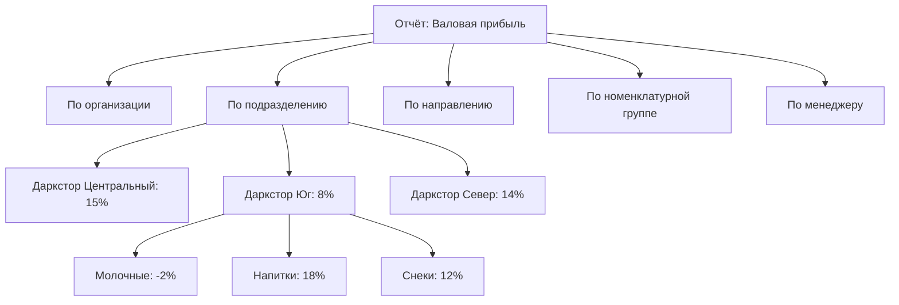
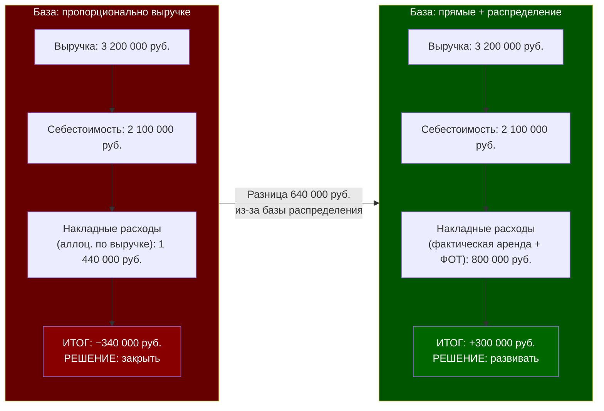

# Отчётность и Аналитика: Где искать правду о бизнесе

> **Цель урока:** Научиться ориентироваться в отчётности 1C:ERP 2.5 — понимать, какой отчёт отвечает на какой вопрос, почему управленческие и бухгалтерские цифры расходятся, и как превратить миллионы записей в регистрах в три числа, которые нужны продакт-менеджеру для принятия решений.
> **Компетенции:**
> - Различать три слоя отчётности: оперативную, управленческую и регламентированную
> - Знать ключевые отчёты для Q-commerce: «Валовая прибыль», «Доходы и расходы», «Остатки и доступность товаров»
> - Понимать, как отчёты связаны с регистрами (День 4) и учётной политикой (День 3)
> - Настраивать отчёт под свою задачу: фильтры, группировки, аналитические разрезы
> **Время чтения:** ~75 минут

---

## Оглавление

- [[#Часть 1. Три числа из трёх миллионов]]
- [[#Часть 2. Как отчётность эволюционировала вместе с бизнесом]]
- [[#Часть 3. Архитектура отчётности в ERP 2.5]]
- [[#Часть 4. Ловушки интерпретации: когда цифры лгут]]
- [[#Часть 5. Монитор целевых показателей и аналитические разрезы]]
- [[#Часть 6. Кейс: Как неправильный отчёт привёл к закрытию прибыльного даркстора]]
- [[#Часть 7. Глоссарий и FAQ]]

---

## Часть 1. Три числа из трёх миллионов

Утро понедельника. Операционный директор Q-commerce сети «ЭкспрессМарт» (30 дарксторов, 40 000 заказов в день) открывает ERP и задаёт три вопроса:

1. **Какова маржа за прошлую неделю?** Он хочет одно число: валовая прибыль в процентах. Не по каждому товару, не по каждому даркстору — общая цифра, чтобы понять, движется ли бизнес в правильном направлении.

2. **Какие дарксторы убыточны?** Он хочет таблицу: 30 строк, три столбца — название, выручка, маржа. Отсортировать по марже. Красные строки — проблемные точки.

3. **Где дефицит?** Он хочет список: товары, которых нет на складе, но которые заказывают клиенты. Упущенная выручка.

Три вопроса. Три числа (или три таблицы). А в ERP за неделю накопилось 800 000 записей в регистрах: движения товаров, расчёты с клиентами, расчёты с поставщиками, денежные средства. Как из 800 000 записей получить три ответа?

Отчётность — это механизм трансформации. Она берёт «сырые» данные из регистров (День 4), применяет к ним правила учётной политики (День 3), группирует по аналитическим разрезам (организации, подразделения, направления из Дня 2) и выдаёт результат в формате, пригодном для принятия решений.

Но у этого механизма есть подвох: **в ERP 2.5 существуют три слоя отчётности**, и каждый слой может дать свой ответ на один и тот же вопрос. Маржа «по управленке» и маржа «по бухгалтерии» — это разные числа, рассчитанные из разных источников, в разное время, по разным правилам. Если продакт-менеджер не понимает, какой слой он смотрит, он рискует принять решение на основе неверных данных.

### Почему это важно для продакта

Продакт-менеджер по логистике не строит отчёты — он их читает. Но «читать» отчёт в ERP — это не то же самое, что читать дашборд в BI-системе (Business Intelligence — система бизнес-аналитики). В BI-системе данные уже очищены, агрегированы и визуализированы. В ERP отчёт — это «живой» запрос к регистрам, и его результат зависит от десятков параметров: периода, организации, метода оценки, статуса закрытия месяца.

Если продакт не понимает, из какого регистра отчёт берёт данные и в каком состоянии этот регистр находится (до закрытия месяца? после?), он может принять решение, основанное на промежуточных цифрах, которые через неделю изменятся на 5–10%.

---

## Часть 2. Как отчётность эволюционировала вместе с бизнесом

### От баланса к дашборду

Первым «отчётом» в истории бухгалтерии был баланс — таблица с двумя столбцами: «Что у нас есть» (активы) и «Откуда это взялось» (пассивы). Баланс показывал статическую картину: состояние бизнеса на конкретную дату. Он отвечал на вопрос «Сколько у нас?», но не на вопрос «Как мы зарабатываем?».

В XIX веке появился отчёт о прибылях и убытках (P&L — Profit and Loss) — динамическая картина: сколько заработали и потратили за период. Баланс + P&L = два основных финансовых отчёта, которые используются до сих пор.

В XX веке бизнес стал сложнее, и двух отчётов перестало хватать. Появились:
- **Отчёт о движении денежных средств** (Cash Flow) — куда уходят деньги
- **Управленческие отчёты** — для внутренних решений, без ограничений стандартов
- **Оперативные отчёты** — в реальном времени, для ежедневного управления

ERP-системы объединили все эти слои в одной платформе. 1C:ERP 2.5 содержит более 200 предустановленных отчётов, сгруппированных по подсистемам. Для продакт-менеджера Q-commerce из этих 200 критичны не более 10–15. Остальные — инструменты бухгалтерии, HR (Human Resources — управление персоналом), казначейства и производства.

Задача этого урока — не перечислить все 200 отчётов, а научить продакта находить нужный отчёт, понимать, откуда он берёт данные, и интерпретировать результат с учётом того, в каком состоянии находятся регистры-источники.

### Три слоя отчётности в 1С

Архитектура отчётности в ERP 2.5 напрямую вытекает из архитектуры регистров (День 4):

| Слой | Источник данных | Когда доступен | Для кого |
|:---|:---|:---|:---|
| **Оперативный** | Регистры накопления | В реальном времени | Кладовщик, операционный менеджер |
| **Управленческий** | Регистры накопления + расчёт себестоимости | После предварительного закрытия (Soft Close) | Финансовый директор, продакт |
| **Регламентированный** | Регистры бухгалтерии (проводки) | После полного закрытия (Hard Close) | Бухгалтер, аудитор, ФНС (Федеральная налоговая служба) |

Ключевое различие: оперативные отчёты показывают «что происходит сейчас» (остатки, заказы, статусы), управленческие — «как мы зарабатываем» (маржа, P&L, рентабельность), регламентированные — «как мы отчитываемся» (баланс, декларации, отчётность по РСБУ — Российские стандарты бухгалтерского учёта).

---

## Часть 3. Архитектура отчётности в ERP 2.5

### Навигация: где искать отчёты

Отчёты в ERP 2.5 не собраны в одном месте — они распределены по подсистемам. Для Q-commerce продакт-менеджера критичны четыре раздела:

| Раздел меню | Ключевые отчёты | Вопрос, на который отвечает |
|:---|:---|:---|
| **Продажи → Отчёты по продажам** | Валовая прибыль предприятия (с группировкой по подразделениям) | Сколько зарабатываем? Какой даркстор прибыльнее? |
| **Склад и доставка → Отчёты по складу** | Остатки и доступность товаров, Товары на складах | Что есть? Чего не хватает? |
| **Финансовый результат и контроллинг** | Доходы и расходы, Финансовый результат по направлениям | Куда уходят деньги? Какое направление приносит прибыль? |
| **Регламентированный учёт → Отчёты** | Оборотно-сальдовая ведомость (ОСВ — оборотно-сальдовая ведомость), Анализ счёта | Сходится ли бухгалтерия? Где ошибка? |

### Пять ключевых отчётов для продакт-менеджера

#### 1. Валовая прибыль предприятия

**Путь:** Продажи → Отчёты по продажам → Валовая прибыль предприятия

**Что показывает:** Выручку, себестоимость и валовую прибыль с возможностью группировки по любому измерению: организация, подразделение, менеджер, номенклатура, номенклатурная группа.

**Источник данных:** Регистр накопления «Выручка и себестоимость продаж».

**Ключевые столбцы:**

| Столбец | Что означает | Зачем продакту |
|:---|:---|:---|
| Количество | Сколько единиц продано | Объём продаж по позиции |
| Выручка | Сумма продаж (с НДС или без — зависит от настройки) | Верхняя строка P&L |
| Себестоимость | Сколько стоил проданный товар | Нижняя строка P&L |
| Валовая прибыль | Выручка − Себестоимость | Маржа в рублях |
| Рентабельность, % | Валовая прибыль / Выручка × 100 | Маржа в процентах |

**Нюанс для Q-commerce:** Этот отчёт показывает валовую прибыль — то есть выручка минус себестоимость товара. Он не учитывает накладные расходы (аренда, ФОТ — фонд оплаты труда, логистика). Поэтому даркстор с валовой маржой 15% может быть убыточным, если аренда и ФОТ съедают 18% выручки. Для полной картины нужен отчёт «Доходы и расходы».

#### 2. Доходы и расходы предприятия

**Путь:** Финансовый результат и контроллинг → Доходы и расходы предприятия

**Что показывает:** Полную картину доходов и расходов по статьям. Это ближайший аналог управленческого P&L в ERP 2.5.

**Источник данных:** Регистры накопления «Выручка и себестоимость продаж» + «Прочие доходы» + «Прочие расходы».

**Структура отчёта:**

| Строка | Пример |
|:---|:---|
| Выручка от реализации | 120 000 000 руб. |
| − Себестоимость реализации | −102 000 000 руб. |
| = Валовая прибыль | 18 000 000 руб. |
| − Коммерческие расходы (логистика, маркетинг) | −8 500 000 руб. |
| − Управленческие расходы (аренда, ФОТ офиса) | −4 200 000 руб. |
| = Прибыль от продаж | 5 300 000 руб. |
| ± Прочие доходы/расходы | −800 000 руб. |
| = Прибыль до налогообложения | 4 500 000 руб. |

**Нюанс:** Полнота этого отчёта зависит от двух настроек из учётной политики (День 3): правил распределения расходов и статей расходов. Если статья расходов «Аренда» не настроена на распределение по подразделениям, отчёт покажет аренду одной строкой на всю компанию — без разбивки по дарксторам.

#### 3. Остатки и доступность товаров

**Путь:** Склад и доставка → Отчёты по складу → Остатки и доступность товаров

**Что показывает:** Текущие остатки на каждом складе с учётом резервов, ожидаемых поступлений и доступного количества.

**Источник данных:** Регистры накопления «Товары на складах» + «Заказы клиентов» + «Заказы поставщикам».

**Ключевые столбцы:**

| Столбец | Формула | Зачем |
|:---|:---|:---|
| На складе | Текущий остаток | Физическое наличие |
| В резерве | Зарезервировано под заказы клиентов | Уже «обещано» |
| Ожидается | Заказано у поставщика, но не поступило | Скоро будет |
| Доступно | На складе − В резерве (упрощённо; полная формула зависит от настроек обеспечения) | Реальная доступность для новых заказов |
| Дефицит | Если Доступно < 0 | Сколько не хватает |

**Для Q-commerce:** Это главный оперативный отчёт. Его нужно смотреть ежедневно (а лучше — в реальном времени через монитор). Столбец «Дефицит» — прямой индикатор упущенной выручки: каждая единица дефицита = потерянный заказ.

#### 4. Финансовый результат по направлениям деятельности

**Путь:** Финансовый результат и контроллинг → Отчёты → Финансовые результаты

**Что показывает:** P&L в разрезе направлений деятельности (из Дня 2). Если направления настроены как «один даркстор = одно направление», этот отчёт показывает P&L каждого даркстора.

**Источник данных:** Регистры накопления + правила распределения расходов.

**Нюанс:** Работает только если в учётной политике включён обособленный учёт по направлениям деятельности (День 2, «Режим 2»). Если используется распределение по правилам («Режим 1»), результат будет приблизительным — расходы распределены по формуле, а не отнесены напрямую.

#### 5. Оборотно-сальдовая ведомость (ОСВ)

**Путь:** Регламентированный учёт → Бухгалтерские отчёты → Оборотно-сальдовая ведомость

**Что показывает:** Сальдо (остаток) и обороты (приход/расход) по каждому бухгалтерскому счёту за период.

**Источник данных:** Регистр бухгалтерии (проводки).

**Зачем продакту:** ОСВ — не рабочий инструмент продакта, но инструмент диагностики. Если цифры в управленческом P&L не сходятся с бухгалтерским — ОСВ покажет, где расхождение. Например: счёт 41 «Товары» в ОСВ показывает остаток 15 млн руб., а управленческий отчёт «Остатки товаров» — 16,2 млн руб. Разница 1,2 млн руб. — это незакрытые операции текущего месяца, которые попали в оперативные регистры, но ещё не отразились в проводках.

### Как настроить отчёт под свою задачу

Каждый отчёт в ERP 2.5 имеет два режима настройки:

**Простой режим:** Выбрать период, организацию, фильтр по складу или товарной группе. Этого достаточно для 80% задач.

**Расширенный режим:** Добавить собственные группировки, фильтры, сортировки и даже диаграммы. Доступен через кнопку «Настройки» → «Расширенный режим».

Основные возможности расширенного режима:

| Вкладка | Что можно сделать | Пример |
|:---|:---|:---|
| **Фильтры** | Ограничить данные по любому измерению | Показать только «Молочные продукты» на дарксторе «Центральный» |
| **Поля и сортировки** | Добавить/убрать столбцы, изменить порядок сортировки | Сортировать по рентабельности (убывание) — проблемные товары наверху |
| **Структура** | Изменить группировки | Сгруппировать по: Подразделение → Номенклатурная группа → Номенклатура |
| **Оформление** | Цветовая разметка, формат чисел | Подсветить красным строки с рентабельностью < 5% |

> [!TIP] Варианты отчёта
> ERP 2.5 позволяет сохранять настройки отчёта как «вариант». Создайте вариант «P&L по дарксторам за неделю» с нужными фильтрами и группировками — и открывайте его одним кликом каждый понедельник. Варианты сохраняются для каждого пользователя и не влияют на других.

---

## Часть 4. Ловушки интерпретации: когда цифры лгут

### Ловушка 1: «Управленка» до закрытия месяца

Самая распространённая ошибка: принимать решения на основе управленческого P&L, который построен до закрытия месяца. До закрытия себестоимость рассчитана приблизительно (плановые цены или цены последнего прихода), накладные расходы не распределены, корректировки задним числом не учтены.

Пример: 20 января продакт смотрит отчёт «Валовая прибыль» за январь и видит маржу 14%. Он решает: «Отличный результат, можно запустить промоакцию со скидкой 10%». После закрытия месяца (5 февраля) маржа пересчитывается и оказывается 11%. Промоакция, рассчитанная на маржу 14%, при реальных 11% приносит убыток.

> [!WARNING] Правило для продакта
> Любые решения о ценообразовании, промоакциях и ассортименте принимайте только на основе данных после полного закрытия (Hard Close) предыдущего месяца. Текущий месяц — ориентировочные цифры с погрешностью ±3–5%.

### Ловушка 2: Управленческая vs бухгалтерская валюта

Управленческие отчёты могут быть настроены в «управленческой валюте» (обычно рубли), а регламентированные — в «регламентированной валюте» (тоже рубли, но с другим курсом пересчёта для валютных операций). Если компания закупает товар в долларах или евро, маржа в управленческом и бухгалтерском P&L будет отличаться из-за разных курсов.

Для Q-commerce это редкая проблема (большинство закупок в рублях), но если сеть импортирует товары напрямую — расхождение может достигать 5–8%. Типичный пример: закупка энергетиков у зарубежного производителя. Курс на дату заказа — 88 руб./долл., курс на дату оплаты — 92 руб./долл. Управленческий учёт может фиксировать себестоимость по курсу заказа, а бухгалтерский — по курсу оплаты. Маржа «по управленке» — 14%, «по бухгалтерии» — 11,5%.

Решение: в настройках предприятия (НСИ — нормативно-справочная информация) можно задать единую валюту управленческого учёта и правила пересчёта. Но для большинства Q-commerce сетей достаточно помнить: если есть валютные закупки, управленческий и бухгалтерский P&L будут расходиться до тех пор, пока курсовые разницы не будут пересчитаны при закрытии месяца.

### Ловушка 3: «Выручка с НДС» vs «Выручка без НДС»

Отчёт «Валовая прибыль» может показывать выручку с НДС (налог на добавленную стоимость) или без — в зависимости от настройки. При ставке НДС 10% (продукты питания) разница составляет 9,1% от суммы. Если продакт сравнивает выручку из ERP (без НДС) с выручкой из агрегатора (с НДС), он получит расхождение в 9–10%, которое выглядит как ошибка, но является различием в методологии.

> [!TIP] Проверка настройки НДС в отчёте
> Перед анализом любого финансового отчёта проверьте параметр «Включая НДС» в настройках отчёта. Для управленческих целей обычно используется «без НДС» — это даёт чистую выручку. Для сверки с кассовыми данными — «с НДС».

### Ловушка 4: Период отчёта vs период закрытия

Отчёт за январь, построенный 25 января, и отчёт за январь, построенный 10 февраля (после закрытия), покажут разные цифры. Причины:

- Документы, проведённые задним числом после 25 января, изменили данные
- Закрытие месяца пересчитало себестоимость
- Распределение расходов добавило затраты

Это не ошибка — это особенность архитектуры. Но для продакта, который привык к «неподвижным» дашбордам BI-систем, такое поведение может быть неожиданным.

Практический совет: если вам нужно зафиксировать цифры «на момент» — экспортируйте отчёт в Excel и сохраните с датой в имени файла. Это создаёт «снимок», который не изменится. Сравнение снимков за разные даты покажет, насколько сильно «плавают» данные до закрытия — и поможет оценить погрешность текущих цифр.

### Ловушка 5: Группировка скрывает проблемы

Отчёт «Валовая прибыль» по всей сети показывает маржу 12%. Выглядит нормально. Но если разгруппировать по дарксторам, картина иная: 20 из 30 дарксторов работают с маржой 14–16%, а 10 — с маржой 4–8%. Средняя «нормальная», но половина сети под вопросом.

Ещё хуже: если разгруппировать по номенклатурным группам внутри убыточного даркстора, может оказаться, что 90% ассортимента прибыльны, а убыток создаёт одна категория (например, свежие фрукты с высоким процентом списания).

> [!IMPORTANT] Правило детализации
> Каждый агрегированный отчёт нужно «провалить» минимум на два уровня: от компании к дарксторам, от дарксторов к категориям. Только тогда видно, где именно возникает проблема. Средние значения маскируют аномалии.

---

## Часть 5. Монитор целевых показателей и аналитические разрезы

### Монитор целевых показателей

Помимо классических отчётов, ERP 2.5 предлагает инструмент визуального мониторинга — «Монитор целевых показателей». Это ближайший аналог дашборда в BI-системе, встроенный прямо в ERP.

**Путь:** Финансовый результат и контроллинг → Целевые показатели → Монитор целевых показателей

**Как устроен:**

1. **Дерево целей.** Верхний уровень — стратегические цели компании (например, «Маржа >12%»). Каждая цель декомпозируется на целевые показатели.

2. **Целевые показатели.** Конкретные метрики с плановыми и фактическими значениями. Система автоматически сравнивает план с фактом и подсвечивает отклонения: зелёный (норма), жёлтый (предупреждение), красный (критическое отклонение).

3. **Шаблоны расчёта.** Каждый показатель привязан к шаблону, который извлекает данные из регистров. Шаблон написан на СКД (система компоновки данных — внутренний язык ERP для построения запросов к данным). Продакту не нужно уметь писать шаблоны, но нужно знать, что они существуют и что их можно настроить.

**Пример настройки монитора для Q-commerce:**

| Показатель | Источник данных | План | Порог (жёлтый) | Порог (красный) |
|:---|:---|:---|:---|:---|
| Валовая маржа, % | Выручка и себестоимость продаж | 12% | <10% | <8% |
| Доля списания, % | Себестоимость товаров (списания / приход) | <3% | >4% | >6% |
| Средний чек, руб. | Расчёты с клиентами | 850 руб. | <750 руб. | <650 руб. |
| Товаров в дефиците | Товары на складах (доступно ≤ 0) | 0 | >20 | >50 |
| Непроведённые документы | Регистр сведений (статусы) | 0 | >10 | >30 |

Монитор доступен и в мобильном клиенте ERP — операционный директор может проверять ключевые метрики с телефона. Настройка автообновления позволяет получать актуальные данные каждые 15–30 минут без ручного обновления.

### Аналитические разрезы: как «нарезать» данные

Сила отчётности ERP — в аналитических разрезах. Каждый отчёт можно сгруппировать по различным измерениям, и комбинация разрезов определяет, какую историю расскажут данные.

Основные аналитические разрезы для Q-commerce:

**Разрез 1: Организация**

Если у компании несколько юрлиц (как «ФрешТайм» из Дня 2), отчёт по организации показывает P&L каждого юрлица отдельно. Это важно для налогообложения и аудита, но менее полезно для операционных решений (один даркстор может принадлежать разным юрлицам в разные периоды).

Важный нюанс: отчёт «по предприятию» автоматически исключает внутригрупповые операции (перемещения между юрлицами). Отчёт «по организации» — нет. Поэтому сумма P&L по всем организациям ≠ P&L предприятия.

**Разрез 2: Подразделение (даркстор)**
Самый полезный разрез для операционного управления. P&L по дарксторам показывает, какие точки зарабатывают, а какие «сжигают» деньги. Работает только если подразделения настроены как центры финансовой ответственности (День 2).

**Разрез 3: Направление деятельности**
Если направления настроены как бизнес-линии (например, «Доставка продуктов» и «Доставка готовой еды»), этот разрез покажет P&L каждого направления. Полезно для стратегических решений: стоит ли развивать новое направление?

**Разрез 4: Номенклатурная группа**
Валовая прибыль по категориям: молочные, напитки, снеки, бытовая химия. Показывает, какие категории «кормят» бизнес, а какие существуют для ассортиментной полноты. В Q-commerce типичная картина: 20% категорий генерируют 80% валовой прибыли.

**Разрез 5: Менеджер / Ответственный**
Отчёт по менеджерам показывает эффективность закупщиков: кто из них договаривается о лучших ценах, у кого выше оборачиваемость, у кого больше просрочки.

### Связь отчётности с предыдущими днями

Отчётность — не изолированный модуль. Она зависит от всех решений, принятых ранее:

| Решение (какой день) | Как влияет на отчётность |
|:---|:---|
| Структура организаций (День 2) | Определяет, по каким юрлицам можно фильтровать отчёты |
| Направления деятельности (День 2) | Определяет, можно ли видеть P&L по дарксторам |
| Метод оценки себестоимости (День 3) | Определяет точность и скорость расчёта себестоимости в отчётах |
| Правила распределения расходов (День 3) | Определяет, попадут ли накладные расходы в P&L по дарксторам |
| Своевременное проведение документов (День 4) | Определяет, актуальны ли данные в оперативных отчётах |
| Закрытие месяца (День 4) | Определяет, доступны ли финальные цифры в управленческих отчётах |

Если какое-то решение принято неправильно (например, направления деятельности не настроены), отчётность теряет целый аналитический разрез — и никакими настройками отчёта это не исправить.

> [!WARNING] Аналитика — производная от архитектуры
> Отчётность нельзя «настроить потом». Она отражает ту структуру, которую вы заложили при проектировании системы. Если вы не создали направления деятельности — P&L по дарксторам невозможен. Если не настроили правила распределения расходов — P&L будет неполным. Если не ведёте партионный учёт — отчёт по срокам годности недоступен. Каждый аналитический разрез в отчётности — это решение, принятое «на этаже ниже».

### Панель отчётов: быстрый доступ

Помимо навигации по меню, ERP 2.5 предлагает «Панель отчётов» — единую точку входа, где отчёты сгруппированы по разделам: Продажи, Закупки, Склад, Казначейство, Производство. Доступ к панели зависит от роли пользователя: продакт-менеджер видит только те разделы, на которые у него есть права.

Рекомендация: настройте «Избранное» в панели отчётов, добавив туда 5–7 ключевых отчётов, которые вы используете ежедневно и еженедельно. Это сэкономит 10–15 минут каждый день на навигации по меню.

---

## Часть 6. Кейс: Как неправильный отчёт привёл к закрытию прибыльного даркстора

### Контекст

Сеть «ФастФуд24», 15 дарксторов в Екатеринбурге. 18 000 заказов в день. 1C:ERP 2.5. Метод оценки — средневзвешенная. Направления деятельности настроены в режиме распределения по правилам (Режим 1 из Дня 2). Правило распределения расходов — пропорционально выручке.

В апреле операционный директор анализирует управленческий P&L по дарксторам. Даркстор «Академический» показывает худший результат: убыток 340 000 руб. за март при среднем профите остальных точек +180 000 руб.

Решение: закрыть «Академический», перераспределить ассортимент на соседние точки. Команда начинает ликвидацию: расторжение аренды, перемещение товара, увольнение персонала.

### Механизм провала

Через две недели новый финансовый аналитик проверяет расчёты и обнаруживает:

**1. Расходы распределены пропорционально выручке, но...**

Даркстор «Академический» расположен рядом с университетом. Его выручка — самая высокая в сети: 12 млн руб./мес. (против средних 8 млн). При распределении расходов пропорционально выручке «Академический» получил 20% всех накладных расходов компании — 2,4 млн руб. из 12 млн общих расходов. Другие дарксторы с выручкой 6–8 млн получили 10–13%.

**2. Неправильная база распределения.**

Из 2,4 млн руб. «назначенных» расходов 800 000 руб. — это расходы на логистику центрального склада. «Академический» расположен ближе всех к центральному складу — его реальные логистические расходы минимальны. Но при распределении «пропорционально выручке» он получил максимальную долю.

**3. Реальная картина.**

Если пересчитать расходы с использованием правильной базы (логистика — пропорционально расстоянию, аренда — по фактической площади, ФОТ — по штатному расписанию), P&L «Академического» выглядит так:

| Статья | По правилу «пропорционально выручке» | По уточнённой модели |
|:---|:---|:---|
| Выручка | 12 000 000 | 12 000 000 |
| Себестоимость | −10 200 000 | −10 200 000 |
| Валовая прибыль | 1 800 000 | 1 800 000 |
| Логистика | −480 000 | −180 000 |
| Аренда | −720 000 | −520 000 |
| ФОТ | −640 000 | −580 000 |
| Прочие | −300 000 | −220 000 |
| **Итого P&L** | **−340 000** | **+300 000** |

Даркстор, который собирались закрыть как убыточный, на самом деле был **третьим по прибыльности** в сети. Убыток существовал только в отчёте — не в реальности.

### Цена ошибки

- **Расторжение аренды:** штраф 600 000 руб. (уже подписано)
- **Перемещение товара:** 180 000 руб. (логистика + порча при перевозке)
- **Увольнение 8 сотрудников:** 480 000 руб. (компенсации)
- **Упущенная выручка:** 12 млн руб./мес. × 2 мес. (пока нашли новую площадку) = 24 млн руб.
- **Потеря клиентской базы:** невозможно оценить, но студенты — лояльная аудитория, которая перешла к конкурентам

### Что нужно было сделать

1. **Проверить базу распределения.** Перед принятием решения о закрытии — построить P&L с тремя разными базами распределения (по выручке, по площади, по факту) и сравнить результаты. Если результаты расходятся больше чем на 20% — база выбрана неправильно.

2. **Использовать обособленный учёт.** Переключить учёт направлений деятельности с Режима 1 (распределение по правилам) на Режим 2 (обособленный учёт) для ключевых статей расходов: аренда, ФОТ, логистика. Это дороже в настройке, но даёт точный P&L по дарксторам.

3. **Валидировать отчёт здравым смыслом.** Даркстор с самой высокой выручкой и нормальной валовой маржой не может быть убыточным без видимой причины. Если отчёт противоречит здравому смыслу — проверяйте методологию, а не верьте цифрам.

4. **Создать «второе мнение».** Перед стратегическими решениями (закрытие точки, запуск нового направления) стройте P&L минимум двумя способами — с разными базами распределения. Если оба способа показывают убыток — решение обосновано. Если один показывает убыток, а другой — прибыль, проблема в методологии, а не в бизнесе.

5. **Документировать базу распределения.** В ERP 2.5 правило распределения — это настройка, которая «живёт» внутри системы. Но обоснование выбора базы (почему выручка, а не площадь?) должно быть зафиксировано в проектной документации. Через полгода никто не вспомнит, почему было выбрано именно это правило.

### Решение Продуктового Архитектора

**Гипотеза:** «Даркстор "Академический" убыточен и подлежит закрытию.»

**Анализ:**
- Валовая маржа «Академического» — 15%, что выше среднего по сети (14,2%)
- Выручка — максимальная в сети
- Единственная причина «убытка» — некорректное распределение расходов

**Финальное решение:** Отказ от закрытия. Вместо этого:
1. Перевести аренду и ФОТ на прямой учёт (обособленный по подразделениям)
2. Логистику распределять пропорционально тоннажу доставки (а не выручке)
3. Прочие расходы — пропорционально выручке (допустимая погрешность)
4. Пересчитать P&L за последние 6 месяцев по новой модели — для верификации

### Сравнительная таблица: компромисс архитектора

| Подход к распределению | Профит для Продукта | Цена для Системы | Вердикт |
|:---|:---|:---|:---|
| Все расходы пропорционально выручке | Простота настройки, один параметр | Искажение P&L для дарксторов с высокой/низкой выручкой | Только для первых 3 месяцев после запуска |
| Каждая статья — своя база распределения | Точный P&L по каждой точке | Сложность настройки: 5–10 правил распределения | Для сетей >10 точек |
| Обособленный учёт (Режим 2) | Максимальная точность, прямые расходы | Каждый расход привязывается к подразделению вручную | Для критичных статей: аренда, ФОТ |
| Гибрид: прямые + распределение | Баланс точности и трудозатрат | Средняя сложность | Оптимальный вариант для Q-commerce |

---

## Часть 7. Глоссарий и FAQ

### Глоссарий

| Термин | Определение | Контекст в Q-commerce |
|:---|:---|:---|
| **Валовая прибыль** | Выручка минус себестоимость проданного товара | Основная метрика прибыльности категории или даркстора |
| **Управленческий P&L** | Отчёт о прибылях и убытках для внутренних решений | Строится из оперативных регистров, доступен до закрытия месяца |
| **Регламентированный P&L** | Отчёт о прибылях и убытках для внешних пользователей | Строится из проводок, доступен только после закрытия месяца |
| **ОСВ** | Оборотно-сальдовая ведомость — сальдо и обороты по счетам | Инструмент диагностики расхождений между управленкой и бухгалтерией |
| **Аналитический разрез** | Измерение, по которому можно группировать отчёт | Организация, подразделение, направление, номенклатурная группа |
| **Вариант отчёта** | Сохранённый набор настроек (фильтры, группировки) | Создайте «P&L по дарксторам» и открывайте одним кликом |
| **Монитор целевых показателей** | Визуальный дашборд с план/фактом по KPI (Key Performance Indicators — ключевые показатели эффективности) | Маржа, списания, дефицит, средний чек |
| **СКД** | Система компоновки данных — внутренний язык отчётов ERP | Позволяет строить произвольные выборки из регистров |
| **База распределения** | Показатель, пропорционально которому расходы «раздаются» подразделениям | Выручка, площадь, тоннаж — каждая даёт свой P&L |
| **Soft Close** | Предварительное закрытие: расчёт себестоимости без проводок | Для еженедельного P&L, погрешность ±3–5% |

### FAQ

**В: Как часто нужно строить управленческий P&L?**
О: Оптимальный ритм для Q-commerce: предварительный P&L — еженедельно (Soft Close), финальный P&L — ежемесячно (Hard Close). Еженедельный даёт приблизительную картину для оперативных решений. Ежемесячный — точные цифры для стратегических.

**В: Можно ли экспортировать данные из ERP в BI-систему?**
О: Да. ERP 2.5 поддерживает выгрузку данных в формате Excel, а также интеграцию через механизм COM-соединения или REST API (Application Programming Interface — программный интерфейс приложения). Крупные сети обычно настраивают автоматическую выгрузку данных из регистров в BI-системы (Power BI, Tableau, Yandex DataLens) для построения дашбордов. Но важно помнить: BI-система показывает данные на момент выгрузки, а не в реальном времени.

**В: Почему маржа в ERP отличается от маржи в агрегаторе?**
О: Три основные причины: (1) НДС — ERP обычно показывает выручку без НДС, агрегатор — с НДС. (2) Себестоимость — ERP считает по учётной политике (средневзвешенная/ФИФО), агрегатор не знает себестоимость. (3) Скидки — ERP учитывает скидки и промо, агрегатор может показывать полную цену. Для корректного сравнения приводите обе цифры к единой базе: без НДС, после скидок.

**В: Как проверить, что отчёт показывает правильные данные?**
О: Используйте «правило треугольника»: (1) Постройте тот же показатель (например, выручку) из трёх источников — отчёт «Валовая прибыль», ОСВ по счёту 90.01, данные кассового аппарата. (2) Если все три совпадают (с допустимой погрешностью <1%) — данные корректны. (3) Если расходятся — ищите причину по цепочке: отчёт → регистр → документ.

**В: Что делать, если нужного отчёта нет в ERP?**
О: Два варианта: (1) Использовать «Универсальный отчёт» — встроенный конструктор, который может извлечь данные из любого регистра с произвольными фильтрами и группировками. (2) Заказать разработку собственного отчёта на СКД — это задача для 1С-разработчика, но продакт должен сформулировать техническое задание: какой регистр использовать, какие измерения группировать, какие фильтры применять.

**В: Как работает «Универсальный отчёт» и когда его использовать?**
О: Универсальный отчёт — встроенный конструктор в ERP, который позволяет за 3–5 минут создать выборку из любого регистра без программирования. Для продакта это «режим отладки»: вы подозреваете, что в каком-то регистре неверные данные, открываете Универсальный отчёт, указываете регистр, ставите нужные фильтры и смотрите сырые записи. Основной сценарий: отчёт расходится с ожиданиями → через Универсальный отчёт находите, на каком уровне произошло искажение — в документе, движении или расчёте.

**В: Стоит ли строить аналитику поверх ERP в BI-системе или достаточно встроенных отчётов?**
О: Зависит от горизонта и источников данных. Встроенные отчёты ERP — правильный выбор для операционных данных: остатки, задолженности, обороты. Данные там актуальны до минуты. BI-система нужна, когда появляются кросс-системные данные (ERP + агрегатор + WMS + маркетинг) или когда нужны долгосрочные тренды. Для Q-commerce типичная связка: ERP как источник финансовой истины + BI для продуктовой аналитики. Ошибка — дублировать в BI то, что ERP уже считает лучше.

**В: Почему отчёт «Валовая прибыль» в ERP может отличаться от P&L, который строит финдиректор?**
О: Три самых частых причины: (1) ERP считает маржу по учётной политике (средневзвешенная себестоимость), финдиректор может добавлять управленческие поправки — амортизацию склада, резервы. (2) ERP не включает в маржу расходы, которые финдиректор считает переменными: доставка, упаковка. (3) Разные периоды отсечения: ERP включает незакрытые документы, P&L финдиректора — только оплаченные. Решение одно: зафиксировать единую методологию в учётной политике и не отступать от неё.

---

> [!TIP] Тизер Дня 6
> Мы изучили теорию: виды учёта, архитектуру предприятия, учётную политику, регистры и отчётность. Завтра — практикум: спроектируем структуру компании Q-commerce с нуля в ERP 2.5. Организации, подразделения, направления, склады, учётная политика — весь «скелет», на который потом нанизываются операции. → [[Неделя 1 - День 6 - Практикум по архитектуре|День 6]]

---

← [[Неделя 1 - День 4 - Документооборот и регистры|День 4]] | [[README|Оглавление]] | [[Неделя 1 - День 6 - Практикум по архитектуре|День 6]] →

