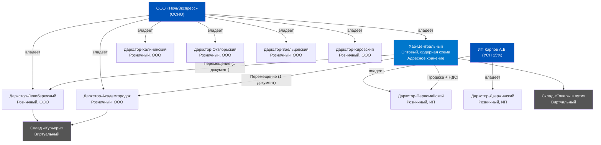
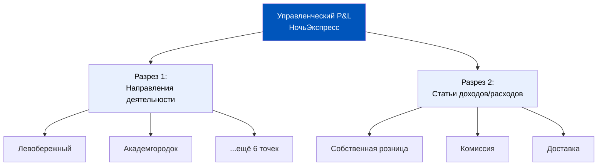
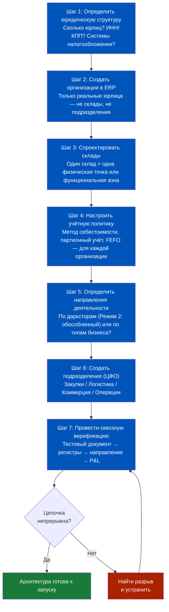
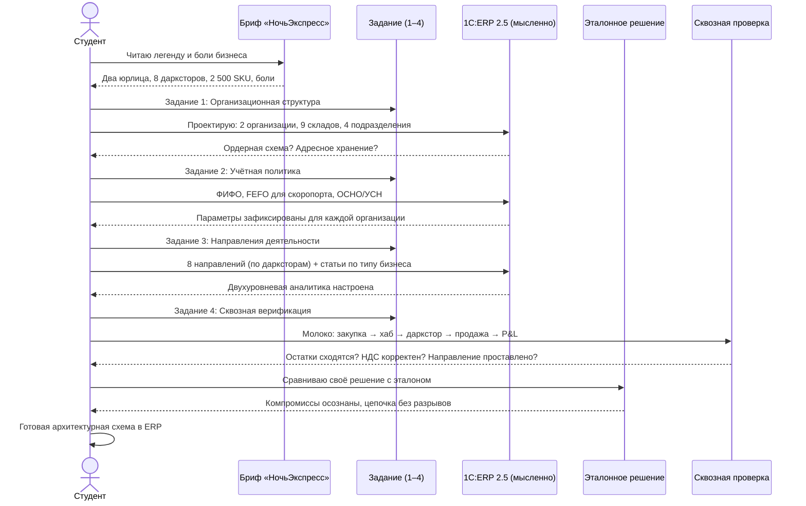
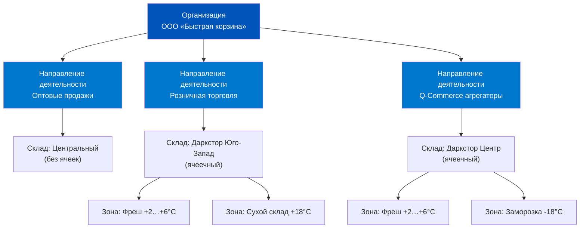

# Практикум: Сборка структуры компании в ERP 2.5

> **Цель урока:** Собрать все знания Недели 1 в единое целое — спроектировать архитектуру предприятия в 1C:ERP 2.5 для вымышленной Q-commerce компании. От юридической структуры до учётной политики и направлений деятельности — каждое решение обосновано, каждый компромисс осознан.
> **Компетенции:**
> - Спроектировать организационную структуру предприятия (организации, подразделения, склады) под задачи Q-commerce
> - Выбрать и обосновать параметры учётной политики для сети дарксторов
> - Настроить направления деятельности и аналитические разрезы под управленческую отчётность
> - Провести сквозную верификацию: от операции на складе до строки в отчёте о прибылях и убытках (P&L)
> **Время на проработку:** ~90 минут

---

## Оглавление

- [[#Часть 1. Бриф: компания «НочьЭкспресс»]]
- [[#Часть 2. Задание 1 — Организационная структура]]
- [[#Часть 3. Задание 2 — Учётная политика]]
- [[#Часть 4. Задание 3 — Направления деятельности и аналитика]]
- [[#Часть 5. Задание 4 — Сквозная верификация]]
- [[#Часть 6. Разбор эталонных решений]]
- [[#Часть 7. Чеклист архитектора и FAQ]]

---

## Часть 1. Бриф: компания «НочьЭкспресс»

Представьте: вам поручили настроить 1C:ERP 2.5 для компании, которая пока работает в Excel и 1С:Бухгалтерии. Вот что вы знаете о бизнесе.

### Легенда

«НочьЭкспресс» — сервис ночной доставки продуктов в Новосибирске. Компания работает с 22:00 до 06:00, обещая доставку за 20 минут. Целевая аудитория — люди, которым нужны продукты поздно вечером: студенты, сменные работники, молодые родители.

**Юридическая структура:**
- ООО «НочьЭкспресс» — основное юрлицо (общая система налогообложения, ОСНО)
- ИП Карпов А.В. — индивидуальный предприниматель на упрощённой системе налогообложения (УСН 15%), владеет двумя дарксторами. Исторически так сложилось: первые точки открывали на ИП для экономии на налогах

**Физическая сеть:**
- 8 дарксторов, разбросанных по районам города
- 6 дарксторов принадлежат ООО, 2 — ИП
- Центральный распределительный склад (хаб) — арендован ООО, обслуживает все 8 точек
- Собственный парк курьеров: 40 человек на электросамокатах

**Ассортимент:**
- 2 500 SKU: продукты питания (70%), бытовая химия (20%), готовая еда от партнёров (10%)
- Скоропортящиеся товары — 45% ассортимента (молочка, мясо, салаты)
- Готовая еда поставляется по схеме комиссии: «НочьЭкспресс» не выкупает товар, а продаёт от имени партнёра за процент

**Финансовые ориентиры:**
- Средний чек: 850 рублей
- 1 200 заказов в сутки в пиковый сезон (зима)
- Целевая валовая маржа: 28%
- Текущие потери от списаний: 4,2% выручки (цель — снизить до 2,5%)

### Ключевые боли (со слов операционного директора)

> «У нас два юрлица, и бухгалтер каждый месяц вручную разносит расходы между ООО и ИП. Мы не понимаем, какой даркстор прибыльный, а какой — нет. Списания идут «в общий котёл». Отчёт по марже я получаю через 3 недели после закрытия месяца, когда уже поздно что-то менять».

> «Готовая еда от партнёров учитывается в одной куче с собственным товаром. Мы не можем быстро понять, сколько мы заработали на комиссии, а сколько — на собственных продажах».

Этот бриф — ваша отправная точка. Каждое из четырёх заданий ниже решает конкретную боль из этого списка.

> [!IMPORTANT] Как работать с практикумом
> Не торопитесь читать эталонные решения. Каждое задание начинается с вопроса — попробуйте ответить сами, прежде чем смотреть разбор. Запишите решение на бумаге или в заметке. Ценность практикума — не в «правильном ответе», а в процессе принятия решения: какие компромиссы вы увидели, какие последствия предугадали, что упустили. Именно так работает реальное проектирование ERP-архитектуры — нет единственного правильного решения, есть набор компромиссов, каждый из которых имеет свою цену.

---

## Часть 2. Задание 1 — Организационная структура

### Что нужно спроектировать

Откройте справочник «Организации» в 1C:ERP 2.5 мысленно (или на бумаге) и ответьте на вопросы:

**Вопрос 1.** Сколько элементов появится в справочнике «Организации»?

Подумайте, прежде чем читать дальше. Ответ не так очевиден, как кажется.

В брифе два юридических лица — ООО «НочьЭкспресс» и ИП Карпов. Значит, в справочнике «Организации» будет ровно две записи. Не восемь (по числу дарксторов), не три (добавив «группу»). Организация в 1C:ERP — это юридическое лицо с ИНН и КПП. Даркстор — это склад, а не организация.

> [!WARNING] Типичная ошибка
> Новички часто создают «организацию» для каждого склада. Это приводит к необходимости оформлять перемещения между «организациями» как межфирменные продажи — с НДС, актами сверки и бухгалтерскими проводками. Для 8 дарксторов это означает 28 потенциальных пар взаимоотношений.

**Вопрос 2.** Сколько складов и какие типы?

Здесь решений больше. Минимальная архитектура:

| # | Название склада | Организация | Тип | Ордерная схема | Адресное хранение |
|:--|:---------------|:-----------|:----|:--------------|:-----------------|
| 1 | Хаб-Центральный | ООО | Оптовый | Да | Да (зоны: приёмка, хранение, отгрузка) |
| 2 | Даркстор-Левобережный | ООО | Розничный | Да | Да (упрощённая: стеллаж/полка) |
| 3 | Даркстор-Академгородок | ООО | Розничный | Да | Да |
| 4 | Даркстор-Калининский | ООО | Розничный | Да | Да |
| 5 | Даркстор-Октябрьский | ООО | Розничный | Да | Да |
| 6 | Даркстор-Заельцовский | ООО | Розничный | Да | Да |
| 7 | Даркстор-Кировский | ООО | Розничный | Да | Да |
| 8 | Даркстор-Первомайский | ИП | Розничный | Да | Да |
| 9 | Даркстор-Дзержинский | ИП | Розничный | Да | Да |

Обратите внимание: ордерная схема включена на всех складах. Это принципиальное решение для Q-commerce — мы обсуждали его в [[Неделя 1 - День 4 - Posting Logic|Дне 4]]. Без ордерной схемы склад не сможет начать отгрузку, пока бухгалтер не проведёт финансовый документ. В ночной доставке, когда бухгалтера нет на месте, это означает полную остановку.

**Вопрос 3.** Как обрабатывать перемещения между ООО и ИП?

Это самый болезненный вопрос. Центральный хаб принадлежит ООО, но снабжает два даркстора ИП. С точки зрения 1C:ERP, это **не перемещение**, а **продажа** от ООО к ИП и **закупка** ИП у ООО. Два документа, две стороны сделки, НДС.

> [!TIP] Альтернативный вариант — ответственное хранение
> Если ИП не выкупает товар, а хранит и продаёт его от имени ООО по договору комиссии, документооборот упрощается. Но тогда ИП теряет возможность учитывать расходы на УСН. Это компромисс, который решает финансовый директор, а не продакт. Задача продакта — понимать, какие последствия каждый вариант имеет для скорости и отчётности.

### Подразделения

Подразделения в 1C:ERP 2.5 — это не склады и не юрлица. Это центры финансовой ответственности (ЦФО). Для «НочьЭкспресс» логично создать:

- **Закупки** — отвечает за приобретение товара и работу с поставщиками
- **Логистика** — отвечает за хаб, перемещения и маршруты курьеров
- **Коммерция** — отвечает за ассортимент, ценообразование и промоакции
- **Операции** — отвечает за работу дарксторов (сборка, выдача)

Каждое подразделение станет аналитическим разрезом в управленческих отчётах. Когда финансовый директор спрашивает «сколько стоит логистика?», ERP сможет ответить, потому что расходы привязаны к подразделению «Логистика».

Обратите внимание: подразделения не привязаны к организации. Один и тот же отдел «Закупки» может работать и на ООО, и на ИП — в жизни это один закупщик, который заказывает товар для всей сети. В ERP это отражается через указание подразделения в документах обеих организаций. Управленческий отчёт покажет суммарные расходы на закупки по группе, а регламентированный — только по конкретному юрлицу.

### Типичные ошибки при проектировании структуры

| Ошибка | Последствие | Как избежать |
|:-------|:-----------|:-----------|
| Создать организацию для каждого даркстора | 8 юрлиц × 7 пар = 28 комплектов межфирменных документов ежемесячно | Организация = юрлицо с ИНН |
| Не включить ордерную схему | Склад парализован, пока бухгалтер не проведёт документ | Ордерная схема обязательна для Q-commerce |
| Забыть создать склад «Товары в пути» | Невозможно отследить товар между хабом и дарксторами в момент перевозки | Виртуальный склад для транзитных операций |
| Объединить дарксторы ООО и ИП в одну группу складов | Нарушение границ юрлиц в документообороте | Чёткое разделение по организациям |

---

## Часть 3. Задание 2 — Учётная политика

### Контекст

В [[Неделя 1 - День 3 - Учётная политика|Дне 3]] мы разбирали, как учётная политика определяет «правила игры» для всей системы. Теперь применим эти знания.

### Задача

Для каждого параметра ниже выберите значение и обоснуйте его. Нет единственно правильного ответа — есть аргументированный выбор.

**Параметр 1. Метод оценки себестоимости**

| Вариант | Плюсы для НочьЭкспресс | Минусы |
|:--------|:----------------------|:-------|
| Средневзвешенная | Простота, стабильность себестоимости, меньше нагрузки на систему | Не отражает реальную стоимость конкретной партии; при росте закупочных цен маржа «размывается» |
| ФИФО | Точное отражение стоимости при высокой ротации; логически совпадает с FEFO (первым истёк — первым ушёл) | Выше нагрузка при расчёте; себестоимость «прыгает» от партии к партии |

**Рекомендация для Q-commerce:** ФИФО. Это важный момент — в [[Неделя 1 - День 3 - Учётная политика|Дне 3]] мы обсуждали, что выбор метода себестоимости нельзя изменить задним числом. Решение принимается один раз и фиксируется в учётной политике на год. Причина выбора — 45% ассортимента скоропортящийся. ФИФО гарантирует, что себестоимость списанного товара соответствует той партии, которая реально ушла с полки. Средневзвешенная скроет проблему: если одна партия молока куплена за 60 рублей, а другая за 80, средневзвешенная покажет 70 — и вы не увидите, что дорогая партия осела на складе и рискует стать списанием.

**Параметр 2. Система налогообложения**

Здесь выбора нет — он задан брифом:
- ООО «НочьЭкспресс» — ОСНО (НДС 20%, налог на прибыль 20%)
- ИП Карпов — УСН 15% (доходы минус расходы)

Но у этого факта есть архитектурное следствие: в 1C:ERP 2.5 учётная политика задаётся **для каждой организации отдельно**. Две организации — два набора параметров. Отчёты по группе компаний потребуют консолидации, которую ERP в штатном режиме делает через механизм «Управленческого баланса» или внешние инструменты.

> [!IMPORTANT] Ключевой вывод
> Разные системы налогообложения (ОСНО и УСН) в одной группе компаний — это не просто бухгалтерская тонкость. Это означает, что стоимость одного и того же товара в регламентированном учёте будет отличаться: ООО учитывает товар без НДС (входящий НДС идёт к вычету), а ИП на УСН включает НДС в стоимость товара. Один и тот же литр молока за 60 рублей + НДС 12 рублей стоит для ООО — 60 рублей, для ИП — 72 рубля.

**Параметр 3. Использование партионного учёта**

Для «НочьЭкспресс» рекомендуется включить партионный учёт с политикой серий «Учёт по FEFO». Это критично для скоропортящихся товаров (45% ассортимента). Без партий система не сможет автоматически направлять сборщика к товару с ближайшим сроком годности.

Но не для всех категорий. Бытовая химия (20% ассортимента) не требует учёта серий — это лишняя нагрузка на сканирование при приёмке и отгрузке. В [[Неделя 1 - День 3 - Учётная политика|Дне 3]] мы называли это «налогом на процессор»: каждое дополнительное поле при сканировании увеличивает время обработки на 3–5 секунд.

Посчитаем влияние на операции. 1 200 заказов в сутки × 4 позиции в среднем = 4 800 сканирований. Если на каждое сканирование серия добавляет 4 секунды — это 19 200 секунд, или 5,3 часа дополнительного рабочего времени в сутки. При стоимости часа сборщика в 350 рублей — 1 855 рублей в день, 55 650 рублей в месяц. Но если отключить серии для бытовой химии (20% сканирований), экономия составит ~960 сканирований × 4 сек. = 3 840 сек. = 1,07 часа = 374 рубля в день. За год — 136 тыс. рублей. Мелочь? Не совсем — при 8 дарксторах это уже больше 1 млн рублей.

| Категория | Партионный учёт | Учёт серий (FEFO) | Обоснование |
|:----------|:---------------|:-----------------|:-----------|
| Молочные продукты | Да | Да | Срок годности 5–14 дней, высокий риск списания |
| Мясо и полуфабрикаты | Да | Да | Срок годности 3–7 дней |
| Готовая еда (комиссия) | Да | Да | Срок годности 24–48 часов, критичен учёт партнёра-комитента |
| Бакалея | Да | Нет | Срок годности 6–12 месяцев, достаточно учёта партий без серий |
| Бытовая химия | Нет | Нет | Срок годности 2–3 года, серии не нужны |

**Параметр 4. Управленческий учёт — обособленный или распределительный?**

В [[Неделя 1 - День 1 - Виды учета и Архитектура|Дне 1]] мы говорили о двух режимах направлений деятельности. Для «НочьЭкспресс» с его 8 точками нужен **обособленный учёт** (Режим 2). Каждый даркстор — отдельное направление, со своими остатками и своим P&L.

Почему не распределительный? Потому что операционный директор хочет знать прибыльность каждого даркстора. При распределительном режиме общие расходы (аренда хаба, зарплата закупщиков) размазываются по правилам пропорции. Это годится для «среднего по больнице», но не для решения «какой даркстор закрыть».

---

## Часть 4. Задание 3 — Направления деятельности и аналитика

### Задача

Спроектируйте набор направлений деятельности, который позволит операционному директору «НочьЭкспресс» видеть:
1. Прибыльность каждого даркстора
2. Разницу между собственными продажами и комиссионной торговлей
3. Вклад каждого канала (приложение, агрегаторы) в выручку

### Проектирование направлений

В 1C:ERP 2.5 «Направление деятельности» — это аналитический разрез, который пронизывает документы от закупки до продажи. Каждое направление получает свой P&L.

**Вариант A — по дарксторам (8 направлений):**

| Направление | Организация | Склад | Что видим в P&L |
|:-----------|:-----------|:------|:----------------|
| Левобережный | ООО | Даркстор-Левобережный | Выручка, себестоимость, прямые расходы точки |
| Академгородок | ООО | Даркстор-Академгородок | Аналогично |
| ... | ... | ... | ... |
| Первомайский | ИП | Даркстор-Первомайский | Выручка, себестоимость, прямые расходы точки |
| Дзержинский | ИП | Даркстор-Дзержинский | Аналогично |

Плюс: прямой ответ на вопрос «какой даркстор прибыльный». Минус: 8 направлений — это 8 строк в каждом отчёте, и общие расходы (маркетинг, IT, аренда хаба) нужно распределять отдельно.

**Вариант B — по типам бизнеса (3 направления):**

| Направление | Описание |
|:-----------|:---------|
| Собственная розница | Продажа товаров, которые «НочьЭкспресс» выкупил у поставщиков |
| Комиссионная торговля | Продажа готовой еды от партнёров (10% ассортимента) |
| Услуги доставки | Выручка от доставки (если доставка платная или субсидируется) |

Плюс: чёткое разделение бизнес-моделей. Минус: не видно, какой именно даркстор генерирует убыток.

**Вариант C — комбинированный (рекомендуемый):**

Используем двухуровневую аналитику:
- **Направления деятельности** = дарксторы (8 шт.) — для P&L по точкам
- **Статьи расходов / доходов** = тип бизнеса (собственный / комиссия / доставка) — для P&L по бизнес-модели

Это позволяет строить два отчёта:
1. «Прибыльность по точкам» — сводка по направлениям
2. «Структура выручки» — сводка по статьям

Почему это важно? Представьте ситуацию: даркстор «Академгородок» показывает валовую маржу 18% — ниже целевых 28%. Операционный директор хочет понять причину. Отчёт по направлению показывает общие цифры, но не объясняет, почему. Отчёт по статьям для этого же направления раскрывает: 60% выручки точки — комиссионная торговля готовой едой с маржой 12%, а собственные продажи дают 32%. Проблема не в точке, а в структуре ассортимента. Без двухуровневой аналитики это расследование заняло бы дни ручного перебора документов.

### Комиссионная торговля: особый случай

Готовая еда от партнёров — это не «обычный товар». В 1C:ERP 2.5 для комиссионной торговли используется отдельная схема документооборота:

1. **Приёмка:** документ «Приобретение товаров и услуг» с видом операции «Приём на комиссию». Товар не становится собственностью «НочьЭкспресс», он учитывается на забалансовом счёте 004 «Товары, принятые на комиссию».
2. **Продажа:** документ «Реализация товаров и услуг» формирует выручку, но себестоимость не списывается с 41 счёта — вместо этого формируется обязательство перед комитентом.
3. **Отчёт комитенту:** ежемесячный документ, который фиксирует, сколько продано и какой процент (комиссия) остаётся «НочьЭкспресс».

Для «НочьЭкспресс» это выглядит так: партнёр-пекарня «ГорячоЕшь» поставляет пиццу и роллы. Договор комиссии: 15% от розничной цены остаётся комиссионеру («НочьЭкспресс»), 85% перечисляется комитенту («ГорячоЕшь»). В ERP это означает:

| Показатель | Своё | Комиссия |
|:-----------|:-----|:---------|
| Розничная цена пиццы | — | 500 руб. |
| Выручка в P&L | 500 руб. (полная) | 75 руб. (только комиссия) |
| Себестоимость | 300 руб. (закупочная цена) | 0 руб. (товар не наш) |
| Валовая прибыль | 200 руб. | 75 руб. |
| Маржа | 40% | 15% |

Если смешать эти потоки, средняя маржа по точке «просядет» — и операционный директор сделает неверный вывод о прибыльности.

> [!WARNING] Ловушка
> Если учитывать комиссионный товар как собственный, валовая маржа будет искажена. Допустим, «НочьЭкспресс» продал 100 пицц по 500 рублей. При комиссии 15% реальный доход — 7 500 рублей, а не 50 000. Если бухгалтер оформит это как обычную продажу, P&L покажет 50 000 выручки и 42 500 себестоимости — маржа 15%. Но при этом на балансе появится «товар», которого компания не покупала. При закрытии месяца баланс не сойдётся.

---

## Часть 5. Задание 4 — Сквозная верификация

### Задача

Проверьте спроектированную архитектуру «от полки до P&L». Возьмите один товар и проследите его путь через все регистры и документы, убедившись, что ни одно звено цепочки не потеряно.

### Сценарий: путь литра молока

**Товар:** Молоко «Простоквашино» 3,2%, 1 л
**Партия:** Дата производства 25.02.2026, срок годности 10.03.2026
**Закупочная цена:** 68 рублей (без НДС для ООО), партия 200 шт.
**Розничная цена:** 109 рублей
**Даркстор:** Левобережный (ООО)
**Направление деятельности:** Левобережный

Почему именно молоко? Это идеальный «индикаторный товар»: скоропортящийся (проверяем FEFO), с НДС (проверяем налоговый учёт), собственный (проверяем отличие от комиссии), массовый (проверяем партионный учёт). Если цепочка работает для молока — она работает для 70% ассортимента.

**Шаг 1. Закупка и приёмка на хаб**

| Документ | Регистр | Движение |
|:---------|:--------|:---------|
| Заказ поставщику | Заказы поставщикам (регистр накопления) | +200 шт. в плане закупок |
| Приходный ордер на товары (хаб) | Товары на складах | +200 шт. на Хаб-Центральный |
| Приходный ордер на товары | Товары в ячейках складов (подсистема адресного хранения) | +200 шт. в ячейку ПРИЁМКА-01 |
| Приобретение товаров и услуг | Себестоимость товаров | +200 × 68 = 13 600 руб. |
| Приобретение товаров и услуг | НДС предъявленный | +200 × 68 × 20% = 2 720 руб. |

Заметьте: складской ордер и финансовый документ — разные. Ордер создаёт кладовщик в момент разгрузки фуры. Финансовый документ «Приобретение товаров и услуг» бухгалтер проводит позже, когда получит оригинал накладной. Но товар уже на складе и доступен для перемещения — в этом суть ордерной схемы.

**Шаг 2. Перемещение с хаба на даркстор**

| Документ | Регистр | Движение |
|:---------|:--------|:---------|
| Перемещение товаров | Товары на складах | −50 шт. с Хаб-Центральный, +50 шт. на Даркстор-Левобережный |
| Расходный ордер (хаб) | Товары в ячейках складов (хаб) | −50 шт. из ячейки ХРАНЕНИЕ-Б2 |
| Приходный ордер (даркстор) | Товары в ячейках складов (даркстор) | +50 шт. в ячейку МОЛОКО-01 |

Перемещение внутри одной организации (ООО) — это один документ. Себестоимость не меняется, НДС не начисляется. Товар просто «переезжает» из одного склада в другой.

А вот если бы молоко нужно было отправить на даркстор ИП — это уже не перемещение, а продажа. Документ «Реализация товаров и услуг» от ООО к ИП, с начислением НДС. ИП должен оформить «Приобретение товаров и услуг» на своей стороне. Два документа вместо одного, и НДС 20% ложится на ИП как расход (ИП на УСН не может принять НДС к вычету). Это наглядно показывает, почему структура юрлиц напрямую влияет на операционные расходы — тема, которую мы поднимали в [[Неделя 1 - День 2 - Архитектура предприятия|Дне 2]].

**Шаг 3. Продажа клиенту**

| Документ | Регистр | Движение |
|:---------|:--------|:---------|
| Заказ клиента | Заказы клиентов | +1 шт. в резерве |
| Расходный ордер (даркстор) | Товары в ячейках складов | −1 шт. из ячейки МОЛОКО-01 |
| Расходный ордер | Товары на складах | −1 шт. с Даркстор-Левобережный |
| Реализация товаров и услуг | Выручка и себестоимость продаж | +109 руб. выручка (с НДС), −68 руб. себестоимость |
| Реализация товаров и услуг | Расчёты с клиентами | +109 руб. (долг клиента) |

**Шаг 4. Отражение в P&L**

| Строка P&L | Значение | Направление | Источник |
|:-----------|:---------|:-----------|:---------|
| Выручка (без НДС) | 90,83 руб. | Левобережный | Регистр «Выручка и себестоимость» |
| Себестоимость | −68,00 руб. | Левобережный | Регистр «Себестоимость товаров» |
| Валовая прибыль | 22,83 руб. | Левобережный | Расчётная |
| Валовая маржа | 25,1% | Левобережный | Расчётная |

Валовая маржа 25,1% — ниже целевых 28%. Это нормально для одного литра молока: молочная продукция традиционно низкомаржинальная. Целевые 28% достигаются за счёт ассортиментного микса — бытовая химия и готовая еда дают более высокую наценку. Именно поэтому управленческий P&L нужно смотреть не по отдельным товарам, а по направлениям деятельности (дарксторам) в целом.

В [[Неделя 1 - День 5 - Reporting Basics|Дне 5]] мы обсуждали ловушку «средней маржи» — теперь вы видите её в действии. Если оценивать прибыльность точки только по молоку, вывод будет пессимистичным. Если только по бытовой химии — оптимистичным. Истина — в совокупности, и именно для этого нужна правильно настроенная аналитика.

### Контрольные вопросы для самопроверки

Пройдите по цепочке и проверьте:

1. **Остатки сходятся?** Хаб: 200 − 50 = 150 шт. Даркстор: 50 − 1 = 49 шт. Итого в системе: 199 шт. Верно — 1 шт. продан.
2. **НДС корректен?** ООО купило за 68 + 13,6 (НДС) = 81,60 руб. Продало за 109 руб. (в т.ч. НДС 18,17 руб.). НДС к уплате: 18,17 − 13,60 = 4,57 руб. с каждой единицы. Проверяйте пропорционально.
3. **Направление деятельности проставлено?** В каждом документе — «Левобережный». Если хотя бы в одном документе направление не указано, строка P&L «Левобережный» будет неполной.
4. **Комиссионный товар отделён?** Молоко — собственный товар. Если бы это была пицца от партнёра, документы были бы другими (приём на комиссию, отчёт комитенту).
5. **Цепочка непрерывна?** Между шагами нет «дыр». Каждый следующий документ ссылается на предыдущий через механизм «Основание». Если заказ поставщику создан, но приходный ордер оформлен «с нуля» (без ссылки на заказ), система потеряет связь между планом закупки и фактом. Отчёт «Контроль закупок» покажет незакрытый заказ, хотя товар давно на складе.

### Что происходит, если цепочка рвётся

Самый частый сценарий разрыва — ночная смена. Кладовщик принял товар, оформил ордер, разместил по ячейкам. Утром бухгалтер пришёл на работу, но не увидел электронную накладную от поставщика (не пришла по ЭДО). Бухгалтер не может провести «Приобретение товаров и услуг». Товар физически на складе и продаётся, но в регламентированном учёте его нет. При закрытии месяца возникнет расхождение: управленческий учёт покажет продажи и себестоимость, а бухгалтерский — только продажи (себестоимость не списана, потому что товар «не оприходован»). Валовая прибыль в бухгалтерской отчётности будет завышена, пока документ не будет проведён.

> [!CAUTION] Критическая точка сбоя
> Самое уязвимое звено — перемещение с хаба на даркстор. Если кладовщик физически отправил товар, но не оформил документ «Перемещение товаров», остатки на хабе завышены, а на дарксторе — занижены. Клиент видит «Нет в наличии», хотя молоко стоит на полке. Это одна из причин, почему потери «НочьЭкспресс» составляют 4,2% вместо целевых 2,5%.

---

## Часть 6. Разбор эталонных решений

Теперь, когда вы прошли все четыре задания, соберём решения в единую карту.

### Сводная архитектура «НочьЭкспресс» в 1C:ERP 2.5

Четыре задания — четыре слоя архитектуры. Организационная структура задаёт юридические границы. Учётная политика определяет правила расчётов внутри этих границ. Направления деятельности создают аналитическую сетку для управленческих решений. Сквозная верификация доказывает, что все слои работают вместе без разрывов. Ниже — итоговая таблица решений.

| Элемент | Решение | Обоснование |
|:--------|:--------|:-----------|
| Организации | 2 (ООО + ИП) | По числу юрлиц, не по числу точек |
| Склады | 9 (1 хаб + 8 дарксторов) | Каждая физическая точка = отдельный склад |
| Ордерная схема | Включена на всех складах | Q-commerce: бухгалтер не должен блокировать операции |
| Адресное хранение | Включено (упрощённое на дарксторах) | Для навигации сборщика и учёта FEFO |
| Себестоимость | ФИФО | 45% скоропорта, нужна точная стоимость каждой партии |
| Партионный учёт | Да (кроме бытовой химии) | FEFO для скоропорта, экономия на непортящихся |
| Направления | 8 (по дарксторам) | P&L по каждой точке |
| Подразделения | 4 (Закупки, Логистика, Коммерция, Операции) | ЦФО для распределения косвенных расходов |
| Комиссионная торговля | Отдельная схема документооборота | 10% ассортимента — чужой товар, нельзя смешивать |
| Склад «Товары в пути» | Виртуальный склад для транзита | Контроль товаров между хабом и дарксторами |
| Склад «Курьеры» | Виртуальный склад | Контроль товаров, переданных курьерам |

### Чего не хватает в этом решении (честный разговор)

Ни одно проектное решение не бывает идеальным. Вот что потребует доработки на следующих этапах:

1. **Распределение косвенных расходов.** Аренда хаба, зарплата IT-отдела, маркетинг — эти расходы не привязаны к конкретному даркстору. В ERP 2.5 их можно распределить через «Статьи расходов» с базой распределения (пропорционально выручке, площади или числу заказов). Но выбор базы — это управленческое решение, которое влияет на «прибыльность» каждого даркстора.

2. **Интеграция с приложением.** Мы спроектировали учётную архитектуру, но не затронули API. Заказы из мобильного приложения должны автоматически создавать «Заказ клиента» в 1C:ERP, привязанный к конкретному даркстору и направлению. Это тема следующих недель.

3. **Закрытие месяца для двух юрлиц.** ООО и ИП закрывают месяц независимо. Но управленческий отчёт по всей группе требует консолидации — вычитания внутригрупповых оборотов (продажи от ООО к ИП). Без этого выручка группы будет завышена. Например, если ООО продало ИП товаров на 500 тыс. рублей, а ИП продало этот товар клиентам за 650 тыс. рублей, консолидированная выручка группы — 650 тыс., а не 1 150 тыс. В управленческом контуре ERP 2.5 эта элиминация выполняется автоматически при построении отчётов «по предприятию» (отчёт автоматически исключает внутригрупповые операции). Однако для регламентированной (бухгалтерской) консолидации потребуется дополнительная настройка или внешние инструменты.

4. **Ценообразование между юрлицами.** По какой цене ООО продаёт товар ИП? Если по рыночной — ИП теряет маржу. Если по себестоимости — налоговая может признать сделку между взаимозависимыми лицами и доначислить налоги. Это не вопрос настройки ERP, но ERP должна корректно отражать согласованные трансфертные цены.

---

## Часть 7. Чеклист архитектора и FAQ

### Чеклист: 12 пунктов перед запуском ERP

Перед тем как нажать «Начать учёт», проверьте каждый пункт. Если хотя бы один не выполнен — система будет выдавать некорректные данные, и вы узнаете об этом только при закрытии первого месяца.

| # | Пункт проверки | Концепция | Статус |
|:--|:--------------|:----------|:-------|
| 1 | Все юрлица заведены в справочник «Организации» | [[Неделя 1 - День 2 - Архитектура предприятия\|День 2]] | ☐ |
| 2 | Учётная политика заполнена для каждой организации | [[Неделя 1 - День 3 - Учётная политика\|День 3]] | ☐ |
| 3 | Метод себестоимости выбран и зафиксирован | [[Неделя 1 - День 3 - Учётная политика\|День 3]] | ☐ |
| 4 | Склады созданы по физическим точкам, не по юрлицам | [[Неделя 1 - День 2 - Архитектура предприятия\|День 2]] | ☐ |
| 5 | Ордерная схема включена на всех складах | [[Неделя 1 - День 4 - Posting Logic\|День 4]] | ☐ |
| 6 | Адресное хранение настроено (хотя бы упрощённое) | [[Неделя 1 - День 2 - Архитектура предприятия\|День 2]] | ☐ |
| 7 | Партионный учёт включён для скоропорта | [[Неделя 1 - День 3 - Учётная политика\|День 3]] | ☐ |
| 8 | Направления деятельности отражают структуру бизнеса | [[Неделя 1 - День 1 - Виды учета и Архитектура\|День 1]] | ☐ |
| 9 | Подразделения (ЦФО) заведены для аналитики расходов | [[Неделя 1 - День 2 - Архитектура предприятия\|День 2]] | ☐ |
| 10 | Комиссионная торговля отделена от собственной | [[Неделя 1 - День 5 - Reporting Basics\|День 5]] | ☐ |
| 11 | Тестовый документ проведён и проверены движения | [[Неделя 1 - День 4 - Posting Logic\|День 4]] | ☐ |
| 12 | Управленческий отчёт построен и верифицирован | [[Неделя 1 - День 5 - Reporting Basics\|День 5]] | ☐ |

### FAQ

**В1. Что если через полгода «НочьЭкспресс» откроет ещё 10 дарксторов? Придётся всё перенастраивать?**

Нет. Новый даркстор — это новый склад в справочнике и новое направление деятельности. Учётная политика, подразделения, метод себестоимости — всё это не меняется. Архитектура масштабируется горизонтально. Единственное ограничение — количество направлений деятельности увеличит размер отчётов. При 20+ точках имеет смысл перейти к группировке направлений (по районам или кластерам).

**В2. Можно ли объединить ООО и ИП в одну организацию в ERP?**

Нельзя. Каждое юрлицо — отдельная запись в справочнике «Организации». Это не ограничение 1С, а требование закона: у каждого юрлица своя отчётность, свои налоговые декларации, свой расчётный счёт. Управленческий учёт может консолидировать данные, но регламентированный — нет. На практике многие Q-commerce компании приходят к решению перевести все точки на одно юрлицо — но это юридическая реструктуризация, а не настройка ERP. Пока существуют два юрлица, ERP обязана вести для них раздельный учёт.

Интересный нюанс: в управленческом контуре 1C:ERP 2.5 можно работать «поверх» юрлиц. Управленческий баланс и P&L строятся по группе компаний, игнорируя юридические границы. Но налоговую декларацию по этому отчёту не подашь — для неё нужны данные строго по одной организации.

**В3. Зачем нужен хаб, если можно доставлять напрямую на дарксторы?**

Хаб выполняет три функции:

1. **Консолидация поставок** — один приёмочный документ вместо восьми. При 50 поставщиках и 8 точках — это разница между 50 и 400 документами «Приобретение товаров и услуг» ежедневно. Бухгалтерия, работающая с 400 документами, потребует как минимум двух дополнительных сотрудников.

2. **Контроль качества** — проверка сроков годности в одной точке. На хабе можно организовать зону входного контроля с весами, сканерами и проверкой температурного режима. Дублировать это на каждом дарксторе — экономически нецелесообразно.

3. **Буфер запасов** — при внезапном всплеске спроса на одном дарксторе товар можно перебросить с хаба за 40 минут, не забирая у другого даркстора и не создавая дефицит на второй точке.

**В4. Как учитывать курьеров — это отдельный склад «В пути»?**

В 1C:ERP 2.5 можно создать виртуальный склад «Курьеры в пути». Когда сборщик передаёт заказ курьеру, товар перемещается с даркстора на этот склад. Когда курьер подтверждает доставку, формируется реализация. Это позволяет в любой момент видеть, сколько товара «в воздухе» — и выявлять потери, если курьер не отчитался.

**В5. Что будет, если бухгалтер забудет указать направление деятельности в документе?**

Документ будет проведён, движения в регистрах сформируются, но без привязки к направлению. В управленческом P&L по дарксторам эта операция попадёт в строку «Не распределено». Если таких операций много, отчёт по точкам становится бессмысленным. Поэтому в 1C:ERP рекомендуется сделать поле «Направление деятельности» обязательным для заполнения — через настройку «Контроль заполнения» в метаданных формы.

### Термины практикума

| Термин | Определение | Где встретился |
|:-------|:-----------|:-------------|
| ЦФО (центр финансовой ответственности) | Подразделение или единица, за которой закреплена ответственность за определённые статьи расходов или доходов | Часть 2, подразделения |
| Трансфертная цена | Цена, по которой товары и услуги передаются между подразделениями или юрлицами одной группы | Часть 6, п. 4 |
| Комитент | Собственник товара, передающий его для продажи другому лицу (комиссионеру) за вознаграждение | Часть 4, комиссионная торговля |
| Элиминация | Исключение внутригрупповых оборотов при консолидации отчётности | Часть 6, п. 3 |
| FEFO | First Expired — First Out: метод отгрузки, при котором первым уходит товар с ближайшим сроком годности | Часть 3, партионный учёт |
| Ордерная схема | Разделение складского и финансового документооборота: кладовщик работает с ордерами, бухгалтер — с накладными | Часть 2, тип складов |
| SKU | Stock Keeping Unit — единица складского учёта, уникальный идентификатор товара в ассортименте | Часть 1, бриф |
| НДС | Налог на добавленную стоимость, косвенный налог 20%, влияющий на стоимость товара в зависимости от системы налогообложения | Часть 3, налогообложение |
| УСН | Упрощённая система налогообложения — спецрежим для малого бизнеса, не предполагающий вычет входящего НДС | Часть 3, налогообложение |
| Забалансовый счёт | Счёт бухгалтерского учёта для имущества, не принадлежащего организации (например, комиссионный товар на счёте 004) | Часть 4, комиссия |

---

### Итоговая карта архитектуры предприятия

Полная структура, которую мы собрали в ходе практикума:

**Ключевой вывод практикума:** правильно настроенная структура предприятия в ERP — это не административная формальность, а операционная необходимость. Каждый уровень иерархии влияет на то, как система распределяет данные по регистрам и строит аналитические отчёты.

← [[Неделя 1 - День 5 - Отчётность и аналитика|День 5]] | [[README|Оглавление]] | [[Неделя 1 - День 7 - История Самоката|День 7]] →
