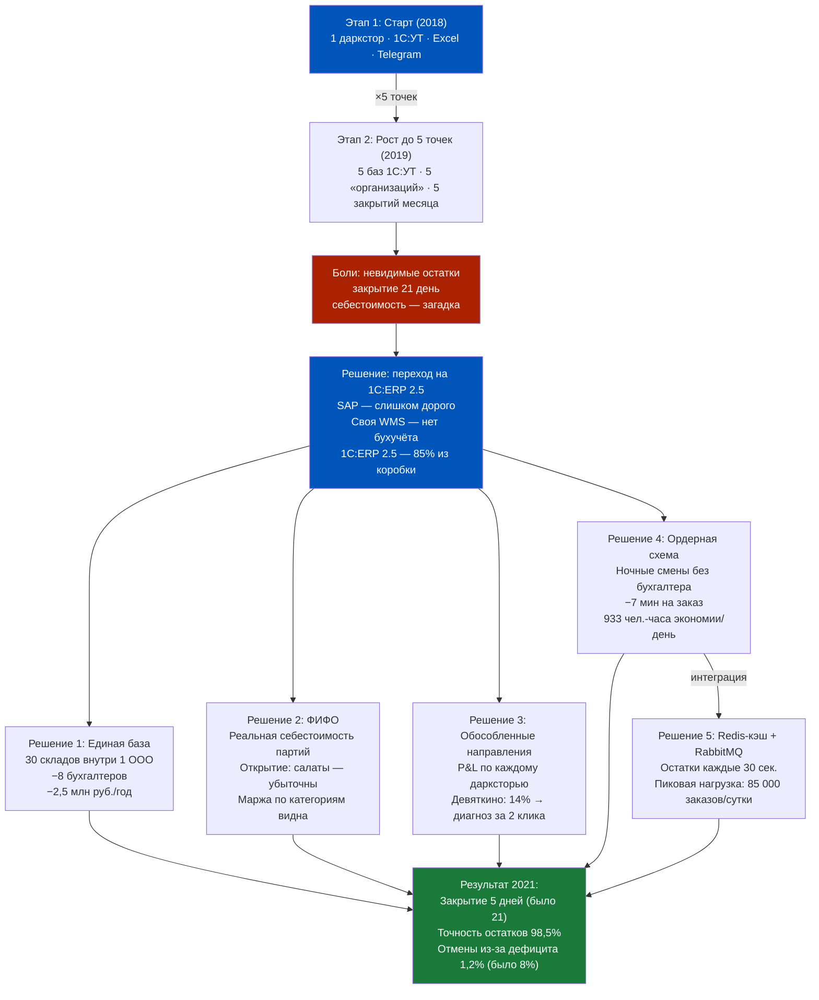
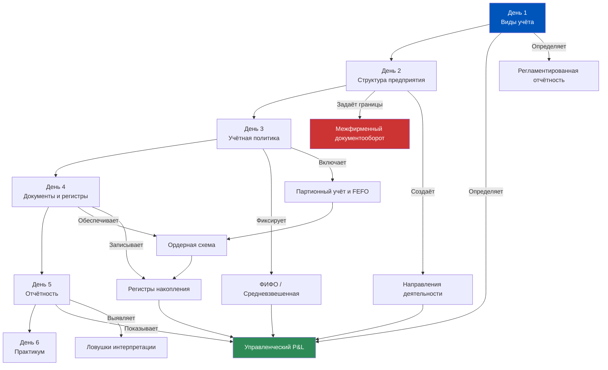
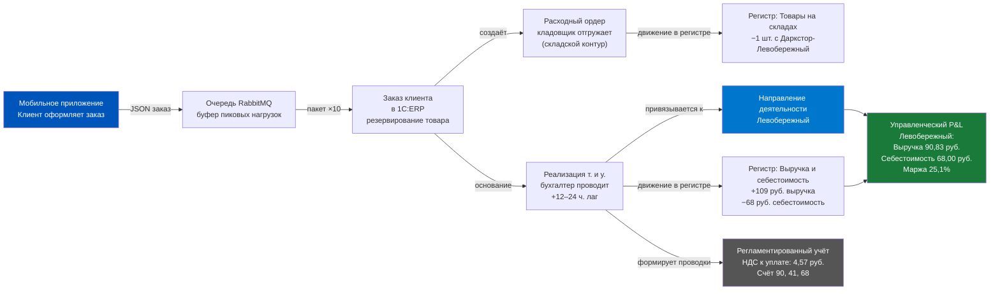
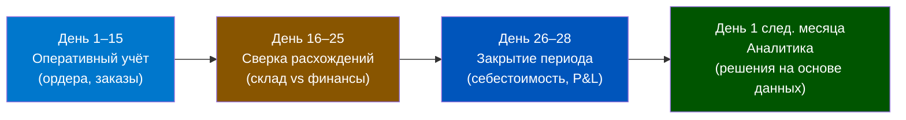

# Путь «Самоката» — архитектурный скелет системы

> **Цель урока:** Закрепить все концепции Недели 1 через глубокие истории реальных и реалистичных Q-commerce компаний. Увидеть, как архитектурные решения первых дней определяют судьбу бизнеса на годы вперёд. Связать отдельные темы — виды учёта, структуру предприятия, учётную политику, регистры и отчётность — в единую систему мышления.
> **Компетенции:**
> - Анализировать архитектурные решения через призму компромиссов «скорость vs целостность»
> - Диагностировать системные проблемы ERP по симптомам бизнеса
> - Применять ментальные модели Недели 1 к реальным ситуациям
> - Видеть причинно-следственные связи между настройками ERP и финансовым результатом
> **Время чтения:** ~100 минут

---

### Оглавление

- [[#Часть 1. Кейс «Самокат» — от Excel до архитектурного эталона]]
- [[#Часть 2. Кейс «ГородЕда» — как неверная структура юрлиц съела маржу]]
- [[#Часть 3. Кейс «Маркет-Экспресс» — провал закрытия месяца при масштабировании]]
- [[#Часть 4. Кейс «ДелиВери» — слияние двух ERP-систем]]
- [[#Часть 5. Кейс «ФермаБокс» — когда партионный учёт спас бизнес от штрафов]]
- [[#Часть 6. Recap — таблица пути Недели 1]]
- [[#Часть 7. Карта связей Недели 1]]
- [[#Часть 8. Пять ментальных моделей архитектора]]
- [[#Часть 9. Самодиагностика — квиз]]
- [[#Часть 10. Вопросы для глубокой рефлексии]]
- [[#Часть 11. Ошибки новичков]]
- [[#Часть 12. Библиотека — книги]]
- [[#Часть 13. Кинотеатр]]
- [[#Часть 14. Связи между кейсами: паттерны недели]]
- [[#Часть 15. Тизер Недели 2]]

---

## Часть 1. Кейс «Самокат» — от Excel до архитектурного эталона

### Пролог: 2018 год, Санкт-Петербург

Каждый большой бизнес начинается с маленького компромисса. Компромисса, который в момент принятия выглядит разумным, а через три года превращается в архитектурный долг на миллионы рублей. История «Самоката» — это учебник таких компромиссов: как они принимаются, как накапливаются и как однажды становится проще снести всё и построить заново, чем залатать дыры.

В 2018 году «Самокат» запускался как небольшой эксперимент: один даркстор, 500 SKU (Stock Keeping Unit, товарных позиций), команда из 15 человек. Учёт вёлся в 1С:Управление торговлей (УТ) — решении, созданном для классической розницы. Заказы приходили через Telegram, курьеры записывали доставки в бумажный журнал, а основатель лично считал прибыль в Excel каждое воскресенье.

На том этапе это работало. И это «работало» — самое опасное слово в лексиконе архитектора. Потому что решение, которое «работает» на одном дарксторе, создаёт иллюзию, что оно будет «работать» на тридцати.

Уже через полгода, когда дарксторов стало пять, Excel превратился из инструмента в ловушку. Основатель тратил 12 часов в неделю на консолидацию данных из пяти баз 1С:УТ, каждая из которых жила своей жизнью. Остатки на одном складе не были видны другому. Себестоимость считалась «на глазок». Курьерские потери списывались в конце месяца одной суммой — без привязки к конкретному дарксторому или заказу.

Хуже всего было то, что каждый даркстор вёл учёт немного по-своему. На первом складе кладовщик записывал молоко как «Молоко Простоквашино 3.2%», на втором — «Простоквашино молоко 3,2%», на третьем — «ПростоКвашино 3.2% 1литр». Это были три записи одного товара, но при попытке свести отчёт по сети — три разные строки. Консолидация без стандартов НСИ — сизифов труд.

> [!WARNING] Архитектурный долг
> «Самокат» на старте совершил ту же ошибку, которую мы разбирали в [[Неделя 1 - День 2 - Архитектура предприятия|Дне 2]]: каждый даркстор был настроен как отдельная «организация» в 1С:УТ. Пять дарксторов — пять баз — пять закрытий месяца. Перемещение товара между точками оформлялось как межфирменная продажа с НДС, хотя юридически все дарксторы принадлежали одному ООО.

### Акт I: Кризис масштабирования (2019)

К середине 2019 года сеть выросла до 30 дарксторов в Санкт-Петербурге и Москве. Инвесторы вложили очередной раунд, команда утроилась, а основатель перестал считать прибыль в Excel — потому что не мог. Данные из 30 баз 1С:УТ были несовместимы, неполны и устаревали к моменту консолидации.

Проблемы стали системными:

**Проблема 1: Невидимые остатки.** Каждая база 1С:УТ знала только «свои» остатки. Если клиент заказывал товар, которого не было на ближайшем дарксторе, но был на соседнем в 800 метрах — система этого не видела. Приложение показывало «Нет в наличии», хотя физически товар был в 3 минутах езды на самокате. По оценкам команды, 8% заказов отменялись из-за «ложного дефицита»: товар физически был в сети, но не на нужном складе. При среднем чеке 650 рублей и 8 000 заказов в день потери составляли ~41 600 рублей ежедневно — более 1,2 млн в месяц только из-за невидимости остатков.

**Проблема 2: Закрытие месяца занимало 3 недели.** 30 баз × бухгалтер, который вручную сверял данные × исправление ошибок задним числом. Процесс выглядел так: каждая база «закрывалась» отдельно (расчёт себестоимости, формирование проводок, сверка остатков). Затем данные экспортировались в Excel. Затем — ручная консолидация. Затем — поиск расхождений (они были всегда). Затем — исправления. Затем — повторная консолидация.

Управленческий P&L (отчёт о прибылях и убытках) за январь финансовый директор видел только в конце февраля. К этому моменту решения на основе январских данных были уже бессмысленны — февральские акции уже запущены, контракты с поставщиками уже пересмотрены (или не пересмотрены), убыточные точки продолжают генерировать убыток.

**Проблема 3: Себестоимость — загадка.** 1С:УТ считала себестоимость по средневзвешенной в каждой базе отдельно. Один и тот же литр молока на дарксторе в центре стоил 62 рубля, а на окраине — 58 рублей. Разница возникала из-за разных поставщиков и разных дат закупки. Финансовый директор не мог ответить на простой вопрос: «Какова реальная маржа по молоку в сети?».

Попытка ответить вручную выглядела абсурдно: нужно было выгрузить данные из 30 баз в Excel, привести к единому формату (каждая база имела свои нюансы в названиях колонок), рассчитать средневзвешенную себестоимость по сети, затем сопоставить с выручкой — тоже из 30 баз. Финансовый аналитик тратил на это 3 дня каждый месяц. К моменту, когда отчёт был готов, данные устаревали.

**Проблема 4: Потери без атрибуции.** Курьерские потери, бой, пересортица — всё это списывалось в конце месяца одной строкой «Прочие расходы» без привязки к конкретному дарксторому, курьеру или заказу. Операционный директор видел, что потери составляют 2,3% от оборота, но не знал, где именно они происходят. На одном дарксторе потери могли быть 0,5%, на другом — 6%. Без аналитики по направлениям деятельности — невозможно отличить одно от другого.

### Акт II: Переход на 1C:ERP 2.5 (2020)

Решение о переходе далось тяжело. Миграция с 1С:УТ на 1C:ERP 2.5 — это не обновление программы, а пересборка архитектуры бизнеса. Внутри команды развернулась дискуссия: CTO предлагал написать собственную WMS с нуля («у нас же технологическая компания!»), операционный директор настаивал на 1C:ERP 2.5 («нам нужен бухгалтерский учёт из коробки»), а финансовый директор хотел SAP («если уж тратить деньги, то на мировой стандарт»).

Победил прагматизм. SAP для 30 дарксторов — как бить из пушки по воробьям: стоимость внедрения превышала годовую выручку. Собственная WMS решила бы складскую задачу, но не дала бы бухгалтерского учёта, налоговой отчётности и расчёта себестоимости. 1C:ERP 2.5 закрывала 85% потребностей из коробки — оставшиеся 15% (интеграция с приложением, кэш-слой остатков) дописали на стороне.

Команда архитекторов приняла три ключевых решения, каждое из которых связано с темами нашей недели.

**Решение 1: Единая база, единая организация** ([[Неделя 1 - День 2 - Архитектура предприятия|День 2]]). Все 30 дарксторов стали складами внутри одной организации. Перемещение товара — один документ «Перемещение товаров» вместо пары «Реализация + Приобретение». НДС на внутренних перемещениях исчез (внутри одного юрлица НДС не начисляется). Вместо 12 бухгалтеров, обслуживавших 30 «псевдо-организаций», остались 4, работающие с одной базой. Экономия на бухгалтерском сопровождении — около 2,5 млн рублей в год.

**Решение 2: ФИФО (First In, First Out — первым пришёл, первым ушёл) вместо средневзвешенной** ([[Неделя 1 - День 3 - Учётная политика|День 3]]). Вся организация перешла на метод ФИФО (в ERP 2.5 метод оценки устанавливается для организации целиком, а не для отдельных товарных групп). Теперь себестоимость каждой проданной единицы соответствовала конкретной партии. Финансовый директор впервые увидел реальную маржу по категориям — и обнаружил, что готовые салаты, считавшиеся прибыльными, на самом деле генерировали убыток из-за высокого процента списаний.

Это открытие стало шоком для команды. Салаты продавались с наценкой 45% — казалось, категория невероятно маржинальна. Но ФИФО показала: при средней оборачиваемости 2,1 дня и проценте списаний 18% реальная маржа составляла минус 3%. Каждый проданный салат субсидировался остальным ассортиментом. До перехода на ФИФО средневзвешенная «размазывала» этот убыток по всем категориям, делая его невидимым.

**Решение 3: Направления деятельности = дарксторы** ([[Неделя 1 - День 2 - Архитектура предприятия|День 2]]). Каждый даркстор стал отдельным направлением деятельности в обособленном режиме. Управленческий P&L строился по точкам автоматически. Впервые операционный директор мог за 30 секунд открыть отчёт и увидеть: «Даркстор на Невском — маржа 31%, даркстор в Девяткино — маржа 14%. Почему?».

Это «Почему?» оказалось революционным. До перехода операционный директор мог задать этот вопрос, но ответ требовал недели ручной аналитики. После перехода ответ был доступен в два клика: детализация P&L по категориям → сравнение с другими точками → выявление отклонений. Даркстор в Девяткино проигрывал по двум причинам: высокий процент списаний (6,2% против среднего 2,8%) и низкая наценка на готовую еду (контракт с локальным поставщиком был на 15% дороже, чем в центре). Обе проблемы были решены за 3 недели — до ERP на их обнаружение ушло бы полгода.

### Акт III: Ордерная схема как спасение скорости (2020)

Первые два решения — про структуру и учётную политику. Третье — про операционную скорость. И именно оно стало критическим для Q-commerce, где обещание «доставка за 15 минут» — это не маркетинговый слоган, а операционный SLA, нарушение которого стоит клиента.

Критическим моментом стало включение ордерной схемы на всех складах ([[Неделя 1 - День 4 - Posting Logic|День 4]]). До этого склад не мог начать отгрузку, пока бухгалтер не проведёт финансовый документ. В 1С:УТ это не было проблемой — бухгалтер сидел рядом. Но при 30 дарксторах и ночных сменах бухгалтеров просто не хватало. Ночная смена (с 22:00 до 06:00) генерировала 30% заказов, но бухгалтер появлялся только в 09:00. Без ордерной схемы ночные заказы ждали проведения до утра — а клиенты ждать не готовы.

Ордерная схема разделила реальности: кладовщик работает со складскими ордерами (приходный, расходный), а бухгалтер проводит финансовые документы утром следующего дня. Товар принимается, размещается в ячейках и продаётся — без ожидания бухгалтерии. Время обработки заказа сократилось с 18 до 11 минут.

Для понимания масштаба: при 8 000 заказов в день (к началу 2021) экономия 7 минут на заказ = 933 человеко-часа в день. Это эквивалент 116 полных смен. Без ордерной схемы «Самокату» пришлось бы нанять на 40% больше сборщиков — или увеличить обещанное время доставки с 15 до 25 минут, что для Q-commerce равносильно смерти бизнес-модели.

Но эта скорость имела цену — и осознание этой цены стало важнейшим уроком для архитектурной команды. Между складским и финансовым контуром возник временной зазор — то, что мы в [[Неделя 1 - День 5 - Reporting Basics|Дне 5]] называли «операционным лагом». Управленческий отчёт показывал продажи в реальном времени, а бухгалтерский — с задержкой в 12–24 часа. Для операционных решений это было приемлемо. Для налоговой отчётности — нет. Поэтому появился жёсткий регламент: все финансовые документы за предыдущий день должны быть проведены до 11:00 следующего дня.

### Акт IV: Интеграция с мобильным приложением

Отдельная глава истории «Самоката» — это выстраивание связки между 1C:ERP и мобильным приложением. На этапе 1С:УТ приложение было «слепым»: оно показывало клиенту ассортимент из статичного каталога, а наличие товара проверялось только в момент сборки. Результат — 8% отмен из-за «ложного дефицита».

В 1C:ERP 2.5 команда построила архитектуру двойной синхронизации:

**Реальное время (остатки).** Каждые 30 секунд ERP выгружала актуальные остатки по каждому дарксторую в кэш-слой (Redis). Мобильное приложение читало остатки из кэша, не нагружая основную базу. Если на дарксторе оставалось менее 3 единиц товара, приложение показывало «Мало» — честный сигнал клиенту.

**Асинхронные операции (заказы).** Заказ из приложения попадал в очередь сообщений (RabbitMQ), а не напрямую в 1С. Микросервис-обработчик забирал заказы пачками по 10 штук и создавал документы «Заказ клиента» в ERP. Это позволило пережить пиковые нагрузки: в Новый год 2021 «Самокат» обработал 85 000 заказов за сутки, при том что 1С могла «переварить» не более 15 заказов в секунду. Очередь выступала буфером, сглаживая пики.

Эта архитектура — прямое следствие ордерной схемы: склад работал со складскими ордерами в реальном времени, а финансовые документы формировались с задержкой. Клиент получал заказ за 15 минут, а бухгалтерская проводка появлялась через 6 часов. Для клиента задержки не существовало.

Критическим было решение о гранулярности синхронизации остатков. Первый прототип обновлял остатки в кэше каждые 5 минут. При пиковой нагрузке (вечер пятницы, дождь) популярные товары разбирались за 3–4 минуты, и приложение показывало «В наличии», хотя товар уже закончился. Сокращение интервала до 30 секунд решило проблему, но увеличило нагрузку на ERP-сервер на 40%. Потребовалось выделить отдельный сервер для выгрузки остатков — он читал данные из реплики базы, не нагружая основной сервер.

Отдельной проблемой стала «гонка состояний» (race condition): два клиента одновременно заказывают последнюю бутылку молока. Оба видят «1 шт.» в приложении. Оба оформляют заказ. Но молоко — одно. Решение: при создании заказа в ERP система моментально резервировала товар. Если резерв не удавался (товар уже зарезервирован другим заказом) — клиент получал push-уведомление «Товар закончился, пока вы оформляли заказ» с предложением замены. Этот сценарий возникал 200–300 раз в день при 85 000 заказов — менее 0,4% случаев.

### Акт V: Результат (2021)

Через год после перехода на 1C:ERP 2.5 ключевые метрики изменились. Но прежде чем смотреть на таблицу, важно понять контекст: «Самокат» не просто «поменял программу». Компания перепроектировала операционную модель. Каждая строка в таблице ниже — это результат конкретного архитектурного решения, принятого на этапе проектирования.

| Метрика | До (1С:УТ, 2019) | После (1C:ERP 2.5, 2021) | Изменение |
|:--------|:-----------------|:-------------------------|:----------|
| Закрытие месяца | 21 день | 5 дней | −76% |
| Отмены из-за ложного дефицита | 8% | 1,2% | −85% |
| Точность остатков | 87% | 98,5% | +13 п.п. |
| Время сборки заказа | 18 мин | 11 мин | −39% |
| Количество бухгалтеров на 30 точек | 12 | 4 | −67% |
| Видимость маржи по точкам | Нет (только среднее по сети) | Да (P&L по каждому дарксторую) | Качественное улучшение |
| Время получения управленческого P&L | 21+ дней после конца месяца | 5 дней после конца месяца | −76% |

```mermaid
gantt
    title Хронология роста «Самоката» и эволюция ERP-системы
    dateFormat YYYY
    axisFormat %Y

    section Учётная система
    1С:УТ — один даркстор, Telegram-заказы        : 2018, 1y
    1С:УТ — 5 баз, Excel-консолидация             : 2019, 1y
    Решение о переходе на 1C:ERP 2.5              : milestone, 2020, 0d
    Миграция + «долина смерти» (3 мес.)           : crit, 2020, 1y
    1C:ERP 2.5 — стабильная работа                : 2021, 2y

    section Масштаб сети
    1 даркстор                                    : 2018, 1y
    5 дарксторов                                   : 2019, 1y
    30 дарксторов (Москва + СПб)                  : 2020, 1y
    50+ дарксторов, интеграция с приложением       : 2021, 2y

    section Ключевые решения ERP
    Единая база — все точки в одной орг.          : milestone, 2020, 0d
    ФИФО вместо средневзвешенной                  : milestone, 2020, 0d
    Ордерная схема — ночные смены без блокировок  : milestone, 2020, 0d
    Двойная синхронизация остатков (Redis)         : 2021, 1y
    Ежедневное «мягкое закрытие»                  : 2021, 1y
```

### Грабли

Переход не был гладким. Три месяца после миграции — «тёмный период», который команда внутри назвала «долиной смерти».

**Проблема 1: Саботаж кладовщиков.** Кладовщики привыкли работать без адресного хранения. Товар ставился «куда удобно», а не куда указывала система. ТСД (терминалы сбора данных) лежали в ящиках — сотрудники считали их «лишней бюрократией». Потребовалось 3 недели обучения и замена двух старших кладовщиков, прежде чем дисциплина установилась.

**Проблема 2: Потеря данных о сроках годности.** Данные о сроках годности для 40% товаров не были перенесены из 1С:УТ — пришлось вводить вручную. Команда из 6 человек потратила 2 недели на «инвентаризацию сроков»: проходили по каждому стеллажу, сканировали штрих-коды и вводили даты в систему.

**Проблема 3: Пустой P&L.** Первое закрытие месяца в новой системе заняло 14 дней вместо обещанных пяти. Причина: 2 300 документов «Приобретение товаров и услуг» были проведены без указания направления деятельности. P&L по точкам оказался пустым — все затраты попали в строку «Не распределено». Финансовый директор увидел P&L с нулевой себестоимостью по 20 из 30 дарксторов и решил, что система сломалась. Пришлось массово перепроводить документы с правильным направлением — операция заняла 4 дня.

**Проблема 4: Нагрузка на сервер.** В первую неделю после перехода сервер 1C:ERP не справлялся с нагрузкой. 30 дарксторов, работающих одновременно в единой базе, создавали пиковую нагрузку в 10 раз выше расчётной. Документы проводились по 3–5 минут вместо секунд. Пришлось экстренно масштабировать серверную инфраструктуру: добавить оперативную память (с 32 до 128 ГБ), перевести базу на SSD и оптимизировать индексы регистров.

> [!IMPORTANT] Главный урок
> Архитектура ERP — это не про выбор программы. Это про выбор правил, по которым бизнес будет жить следующие пять лет. «Самокат» выбрал правила правильно: единая база, ФИФО, ордерная схема, обособленные направления. Но даже правильные правила работают только тогда, когда люди им следуют. «Тёмный период» после миграции — неизбежная цена любого архитектурного перехода. Планируйте его заранее: заложите 3 месяца на стабилизацию, выделите команду поддержки и не ожидайте мгновенных результатов.




---

## Часть 2. Кейс «ГородЕда» — как неверная структура юрлиц съела маржу

### Контекст

Если кейс «Самоката» — это история про технический долг, то «ГородЕда» — это история про организационный долг. Техническую архитектуру можно перепроектировать за полгода. Юридическую — за два года и с привлечением юристов, налоговых консультантов и нотариусов.

«ГородЕда» — сервис доставки продуктов в Екатеринбурге, запущенный в 2020 году. Основатели — два партнёра, каждый из которых зарегистрировал собственное ООО. Первый партнёр (ООО «ГородЕда Запад») обслуживал левый берег реки, второй (ООО «ГородЕда Восток») — правый. Центральный хаб принадлежал третьему юрлицу — ООО «ГородЕда Логистика».

На бумаге это выглядело разумно: разделение зон ответственности, раздельный учёт, понятная ответственность каждого партнёра. Юрист порекомендовал такую структуру «для защиты от рисков» — если один из партнёров решит выйти из бизнеса, его юрлицо можно продать или ликвидировать независимо.

В 1C:ERP 2.5 это означало три организации, 12 складов и ежедневный поток межфирменных документов. Архитектор 1С предупредил: «Три юрлица создадут лавину документооборота». Основатели не послушали — «юрист знает лучше». Через полгода они поняли, что юрист знает юриспруденцию, но не знает операционной экономики ERP.

### Проблема: «налог на юрлица»

Каждое перемещение товара с центрального хаба на даркстор проходило через цепочку:
1. «Реализация товаров и услуг» от ООО «ГородЕда Логистика» → ООО «ГородЕда Запад»
2. «Приобретение товаров и услуг» от ООО «ГородЕда Запад» ← ООО «ГородЕда Логистика»

Два документа на каждую поставку. С НДС 20%. При 15 поставках в день на 12 дарксторов — 360 документов ежедневно только на внутренние перемещения. Бухгалтерия из двух человек превратилась в отдел из шести.

Но главная проблема была не в документообороте. Проблема — в трансфертных ценах. По какой цене «Логистика» продаёт товар «Западу» и «Востоку»? Если по себестоимости — налоговая инспекция признаёт сделки нерыночными и доначисляет налоги. Если с наценкой 5% — «Логистика» показывает прибыль, а розничные компании теряют маржу.

В итоге наценка составляла 3%, и каждый товар, прошедший через хаб, «тяжелел» на 3% ещё до попадания на полку. При целевой валовой марже 25% это означало потерю 12% маржинальности на уровне структуры — до того, как хоть один продукт был продан клиенту.

### Расследование: куда ушла маржа?

Через полгода работы операционный директор заметил: управленческий P&L показывает валовую маржу 13% вместо плановых 25%. Он заподозрил воровство. Нанял аудитора.

Аудитор построил отчёт в 1C:ERP по направлениям деятельности и увидел: каждый даркстор действительно генерирует маржу 22–27% на уровне «выручка минус закупочная цена поставщика». Но между поставщиком и дарксторой стоит хаб, который добавляет 3% наценку + транспортные расходы + бухгалтерские расходы на документооборот.

| Статья | Сумма в месяц | Влияние на маржу |
|:-------|:-------------|:----------------|
| Наценка хаба (3% × оборот 18 млн руб.) | 540 тыс. руб. | −3,0 п.п. |
| НДС на межфирменные операции (не возмещённый) | 210 тыс. руб. | −1,2 п.п. |
| Зарплата 4 дополнительных бухгалтеров | 320 тыс. руб. | −1,8 п.п. |
| Банковские комиссии на межфирменные платежи | 85 тыс. руб. | −0,5 п.п. |
| **Итого «налог на юрлица»** | **1 155 тыс. руб.** | **−6,5 п.п.** |

6,5 процентных пунктов маржи — это не воровство. Это архитектурная ошибка, заложенная в самый фундамент бизнеса. При целевой чистой прибыли Q-commerce в 3–5% потеря 6,5 п.п. маржи означала, что компания была убыточной по определению — независимо от качества операций, маркетинга или команды.

Но и это ещё не всё. Управленческая отчётность была непрозрачной. Каждое ООО вело свой учёт, и консолидированный P&L собирался вручную в Excel. Финансовый директор тратил 5 дней каждый месяц на то, чтобы «склеить» три отчёта в один, исключив внутригрупповые обороты. Без элиминации (исключения межфирменных продаж) выручка группы была завышена на 30%.

Закрытие месяца проходило в три этапа: сначала каждое ООО закрывало свой период, потом бухгалтер сверял взаиморасчёты между юрлицами, потом финансовый директор строил консолидированный отчёт. Если хотя бы одно ООО задерживалось — весь процесс стоял. Среднее время закрытия: 22 дня.

### Решение

Решение далось не сразу. Первый партнёр хотел сохранить отдельное юрлицо «на случай развода». Второй боялся потерять контроль над «своей» зоной. Переломным аргументом стала простая математика: при текущих темпах роста (3 новых даркстора в квартал) через год «налог на юрлица» вырос бы до 2 млн рублей в месяц, потому что количество межфирменных документов растёт пропорционально числу точек, а не линейно.

Партнёры объединили бизнес в одно ООО «ГородЕда». Хаб стал обычным складом внутри той же организации. Перемещения между хабом и дарксторами — один документ, без НДС, без наценки. Четыре бухгалтера были переведены на другие задачи.

В 1C:ERP это означало: удалить две организации, перенести все склады на одну, пересоздать направления деятельности. Техническая миграция заняла 2 месяца и стоила 1,8 млн рублей. Но окупилась за 6 недель — ежемесячная экономия составила 1,155 млн рублей. Вместо разделения по юрлицам партнёры договорились о разделении по направлениям деятельности: каждый видел P&L «своих» дарксторов через обособленные направления — без юридической изоляции, но с полной управленческой прозрачностью.

### Грабли

При объединении возникли две неожиданные проблемы.

**Проблема 1: Потеря истории взаиморасчётов.** Старые контракты были на три разных юрлица, и поставщики отказывались «переписывать» долги на новое ООО. Три месяца юристы согласовывали трёхсторонние акты сверки. Один крупный поставщик (15% объёма закупок) воспользовался ситуацией и пересмотрел условия: скидка снизилась с 12% до 8%. Потери: ~200 тыс. рублей в месяц.

**Проблема 2: Налоговый переходный период.** При ликвидации двух юрлиц налоговая инспекция потребовала провести камеральную проверку за последние 3 года. Проверка длилась 4 месяца и потребовала предоставить все первичные документы по межфирменным операциям. Бухгалтерия потратила 320 человеко-часов на подготовку документов. В итоге доначислений не было — все операции были легальны. Но стресс и временные затраты были значительны.

Урок: объединение юрлиц — это не только перенастройка ERP. Это юридический, налоговый и коммерческий проект одновременно.

> [!IMPORTANT] Главный урок
> Структура юрлиц — это фундамент, который невозможно менять «на ходу». Каждое лишнее юрлицо — это не просто строка в справочнике «Организации». Это постоянный «налог» на каждую операцию: документы, НДС, бухгалтеры, банковские комиссии, трансфертные цены. Проектируйте структуру минимально необходимой — как мы делали в [[Неделя 1 - День 6 - Enterprise Design Workshop|Дне 6]].


---

## Часть 3. Кейс «Маркет-Экспресс» — провал закрытия месяца при масштабировании

### Контекст

«Маркет-Экспресс» — самый коварный из наших кейсов. Потому что компания всё сделала правильно. Одна организация. Ордерная схема. ФИФО. Обособленные направления. Если бы архитектор показал эту настройку на экзамене — получил бы пятёрку.

«Маркет-Экспресс» — московский сервис Q-commerce, 45 дарксторов, 3 500 SKU. Компания успешно работала на 1C:ERP 2.5 два года. Архитектура была выстроена правильно — и именно это создало ложное чувство безопасности.

Проблема возникла не при старте, а при масштабировании. В первый год (15 дарксторов) закрытие месяца занимало 4 дня. Во второй год (30 дарксторов) — 7 дней. К моменту, когда дарксторов стало 45, закрытие месяца растянулось на 18 дней. Финансовый директор получал P&L за март только 18 апреля.

### Анатомия проблемы

Финансовый директор «Маркет-Экспресса» описывал ситуацию так: «В первый год я получал P&L 4-го числа следующего месяца. Это было комфортно — успевал скорректировать ценообразование, закрыть убыточные акции, пересмотреть условия с поставщиками. На второй год P&L приходил 7-го — ещё терпимо. А потом мы открыли 15 новых точек за полгода, и P&L за март я увидел 18 апреля. К этому моменту апрельские решения уже были приняты — на основе интуиции, не данных».

Закрытие месяца в 1C:ERP 2.5 — это последовательность регламентных операций ([[Неделя 1 - День 4 - Posting Logic|День 4]]). Каждая операция обрабатывает все документы за период. При линейном росте числа дарксторов объём документов рос **экспоненциально**:

| Период | Дарксторов | Документов в месяц | Время закрытия |
|:-------|:----------|:-------------------|:---------------|
| Янв. 2022 | 15 | 42 000 | 4 дня |
| Янв. 2023 | 30 | 156 000 | 7 дней |
| Янв. 2024 | 45 | 380 000 | 18 дней |

Почему экспоненциально? Потому что с ростом сети росло не только число продаж, но и число перемещений между дарксторами, возвратов, списаний, инвентаризаций. Каждый новый даркстор добавлял связи со всеми остальными. При 15 точках количество потенциальных маршрутов перемещения — 105 (15×14/2). При 45 — 990. Почти десятикратный рост при трёхкратном увеличении числа точек.

Дополнительный фактор: с ростом сети выросла сложность ценообразования и промо-акций. На 15 дарксторах промо запускались вручную. На 45 — через автоматические правила, генерирующие тысячи дополнительных документов «Установка цен».

Но дело было не только в объёме. Архитектор обнаружил три «бутылочных горлышка»:

**Горлышко 1: Расчёт себестоимости по ФИФО.** При ФИФО система должна «помнить» каждую партию товара и порядок её поступления. С 380 000 документов расчёт себестоимости одного товара требовал перебора всех партий за месяц. Для 3 500 SKU × 45 складов это миллионы итераций. Сервер 1С работал на пределе: 95% загрузки CPU в течение 18 часов подряд. Пользователи жаловались: «Система не отвечает, не можем провести документы». Фактически, бизнес останавливался на время закрытия.

**Горлышко 2: Направления деятельности.** 45 обособленных направлений означали, что каждый расчёт выполнялся 45 раз. P&L по направлениям формировался не параллельно, а последовательно — одно за другим. Расчёт одного направления занимал ~25 минут. 45 × 25 = 18,75 часов только на формирование P&L — без учёта остальных регламентных операций.

**Горлышко 3: Непроведённые документы.** При закрытии месяца система обнаружила 4 200 документов «Перемещение товаров», которые были созданы, но не проведены. Кладовщики создавали документы, но забывали нажать «Провести». Некоторые документы были созданы ещё в начале месяца и забыты. Система не могла закрыть месяц, пока все документы не были обработаны — непроведённые документы создавали «дыры» в движениях регистров, и расчёт себестоимости давал некорректные результаты.

Парадокс: чем больше точек, тем больше людей создают документы, тем больше документов «зависают». При 15 дарксторах зависало ~200 документов, и бухгалтер справлялся вручную. При 45 — зависало 4 200, и ручная обработка стала физически невозможной.

### Решение

Архитектурная команда приняла пакет мер:

1. **Ежедневное «мягкое закрытие»** ([[Неделя 1 - День 5 - Reporting Basics|День 5]]). Вместо одного большого закрытия в конце месяца — ежедневный расчёт себестоимости. Это распределило нагрузку: вместо 380 000 документов за раз система обрабатывала ~12 500 в день. Регламентное задание запускалось ночью, когда нагрузка на базу минимальна.

2. **Контроль непроведённых документов.** Автоматический отчёт, который каждое утро отправлял операционному директору список документов в статусе «Подготовлен» старше 24 часов. Если документ не проведён в течение 48 часов — система блокировала создание новых документов на этом складе. Жёстко? Да. Кладовщики жаловались: «Мы не можем работать, система заблокирована!» Операционный директор отвечал: «Проведите документ — и разблокируется». Через две недели жалобы прекратились. Дисциплина документооборота установилась. Количество «зависших» документов упало с 4 200 до 50.

3. **Группировка направлений.** 45 дарксторов объединили в 9 кластеров по 5 точек. P&L верхнего уровня строился по кластерам (9 строк), а детализация по точкам — отдельным отчётом. Это уменьшило число итераций при закрытии в 5 раз. Кластеры формировались по географическому принципу: «Центр», «Север», «Юг» и т.д. Это совпадало с зонами ответственности региональных менеджеров, что упростило управление.

4. **Параллелизация расчёта.** IT-команда настроила многопоточный расчёт себестоимости: 9 кластеров обрабатывались параллельно на 4 ядрах сервера вместо последовательной обработки. Это сократило время расчёта ФИФО с 8 часов до 2,5 часов.

### Результат

| Метрика | До оптимизации | После |
|:--------|:--------------|:------|
| Время закрытия месяца | 18 дней | 6 дней |
| Непроведённые документы | 4 200 | ~50 |
| Нагрузка на сервер при закрытии | 95% CPU 18 часов | 40% CPU 6 часов |
| Стоимость задержки P&L (упущенные решения) | ~2,4 млн руб./мес. | ~600 тыс. руб./мес. |

Последняя строка — оценка финансового директора. Его логика: каждый день задержки P&L — это день, когда операционные решения принимаются «вслепую». При средней ошибке ценообразования 0,3% на 800 млн рублей месячного оборота каждый день задержки стоит ~80 тыс. рублей. 18 дней × 80 тыс. = 1,44 млн. Плюс косвенные потери: невозможность вовремя закрыть убыточные акции, задержка пересмотра условий с поставщиками.

### Грабли

Ежедневное закрытие выявило неожиданную проблему: если бухгалтер проводил документ задним числом (за прошлую неделю), себестоимость пересчитывалась за все дни от даты документа до текущего. Один документ за 1 марта, проведённый 20 марта, запускал пересчёт за 20 дней. В одном случае это заняло 6 часов и заблокировало базу данных для всех пользователей.

Пришлось ввести правило: документы старше 3 дней проводятся только с разрешения финансового директора. Технически это было реализовано через «дату запрета редактирования» в 1C:ERP — стандартный механизм, который блокирует проведение документов ранее указанной даты. Дата автоматически сдвигалась каждый день: сегодня нельзя провести документ старше трёх дней назад.

> [!IMPORTANT] Главный урок
> Архитектура, которая работает на 15 точках, может умереть на 45. Правильная архитектура ≠ масштабируемая архитектура. Масштабирование — это не просто «добавить складов». Это пересмотр регламентов закрытия, контроль дисциплины документооборота и, иногда, болезненный компромисс в детализации аналитики. Правильный вопрос — не «сколько направлений нам нужно?», а «сколько направлений мы способны закрывать за 5 дней?». Если ответ «меньше, чем хотим» — нужно менять подход к закрытию (ежедневное вместо ежемесячного) или группировать аналитику.


---

## Часть 4. Кейс «ДелиВери» — слияние двух ERP-систем

### Контекст

M&A (слияния и поглощения) — это момент истины для ERP-архитектуры. Всё, что можно было скрыть в одиночной системе — дубли в номенклатуре, грязные карточки, отсутствие стандартов — вскрывается при попытке объединить две базы. Это как переезд: пока живёшь в квартире, беспорядок незаметен. Начни паковать вещи — и увидишь весь хлам, накопленный за годы.

В 2023 году компания «ДелиВери» (Москва, 60 дарксторов, 1C:ERP 2.5) приобрела конкурента — «ПродуктВезу» (Москва, 25 дарксторов, 1С:Управление торговлей 11). Сумма сделки — 800 млн рублей. Перед архитектурной командой встала задача: объединить два бизнеса в единую ERP-систему.

На бумаге задача выглядела простой: перенести данные из 1С:УТ 11 в 1C:ERP 2.5. На практике это оказался архитектурный кошмар, который продлился 4 месяца, стоил 12 млн рублей и чуть не сорвал интеграцию.

### Столкновение миров

На первом совещании архитектурных команд двух компаний стало ясно: это не техническая задача, а культурное столкновение. Архитектор «ДелиВери» показал таблицу отличий — и комната замолчала.

Две системы использовали разные подходы ко всему, что мы изучали на Неделе 1:

| Параметр | «ДелиВери» (ERP 2.5) | «ПродуктВезу» (УТ 11) |
|:---------|:---------------------|:----------------------|
| Организации | 1 ООО | 3 ООО (по зонам Москвы) |
| Метод себестоимости | ФИФО | Средневзвешенная |
| Партионный учёт | Да, с сериями по FEFO (First Expired, First Out) | Нет |
| Ордерная схема | Да | Нет |
| Направления деятельности | По дарксторам (60 шт.) | Не использовались |
| Адресное хранение | Да (стеллаж/полка) | Нет (справочное) |

Таблица выглядит пугающе, и это не случайно. Каждая строка — это отдельный проект миграции. Перевести 25 дарксторов с «нет» на «да» по партионному учёту означает: создать серии для всех товаров, провести инвентаризацию, обучить 25 команд кладовщиков, настроить ТСД, изменить процессы приёмки. И это только одна строка.

Но проблема была глубже, чем перенос данных. У компаний были разные **справочники номенклатуры**. Один и тот же товар — молоко «Простоквашино» 3,2% — в «ДелиВери» назывался «Молоко Простоквашино 3.2% 1л» (артикул MK-PK-032-1L), а в «ПродуктВезу» — «Простоквашино молоко 3,2% литр» (артикул 00004572). Два разных кода, два разных описания, два разных штрих-кода в системе (хотя физически товар один и тот же).

При 3 500 SKU в «ДелиВери» и 2 800 SKU в «ПродуктВезу» совпадающих товаров было около 2 200. Но автоматическая сопоставка (matching) сработала только для 40% из них — остальные различались в названиях, единицах измерения или классификации.

### Человеческий фактор: культурный шок

Проблема была не только технической. У «ДелиВери» и «ПродуктВезу» были разные культуры работы с данными. В «ДелиВери» каждый новый товар проходил через «комитет НСИ» — три человека проверяли карточку перед добавлением в систему. В «ПродуктВезу» новые товары заводил любой менеджер, без проверки. Результат: в справочнике «ПродуктВезу» 40% карточек имели ошибки: неверные единицы измерения, пустые штрих-коды, дублированные позиции.

Когда команда начала сопоставление, 180 из 2 800 SKU «ПродуктВезу» оказались «фантомами» — товарами, которые давно не продавались, но числились в системе с ненулевыми остатками. Примеры: «Мороженое Чистая Линия 450 мл» (снято с производства в 2021), «Батон нарезной Каравай» (поставщик закрылся), «Тофу органический» (пробная партия, не продалась). Все эти товары имели «остатки» в системе — от 3 до 200 единиц, — которые физически не существовали. Они просто никогда не были списаны.

При переносе эти «фантомы» засорили бы базу «ДелиВери». Пришлось провести полную инвентаризацию на 25 дарксторах перед миграцией — это заняло 2 недели и стоило 800 тыс. рублей. Инвентаризация выявила расхождения между данными системы и физическими остатками на уровне 4,3% — критический показатель для Q-commerce, где точность остатков определяет процент отмен.

### Три варианта миграции

Архитектурная команда заперлась в переговорной на два дня. На стене повесили три плаката с вариантами. У каждого — свои сторонники. CTO хотел «Большой взрыв» («быстрее отмучаемся»), операционный директор — постепенную миграцию («нельзя рисковать бизнесом»), архитектор ERP — параллельный запуск («безопаснее всего»).

Три подхода:

**Вариант A: «Большой взрыв».** Перенести все данные «ПродуктВезу» в ERP за одну ночь. Плюс — быстро. Минус — если что-то пойдёт не так, откатить невозможно. При 25 дарксторах и 2 800 SKU риск «битых» данных слишком высок.

**Вариант B: «Постепенная миграция».** Переносить по 5 дарксторов в неделю. Плюс — контролируемый риск. Минус — 5 недель «двойной» системы: часть бизнеса в ERP, часть в УТ. Отчётность за этот период — кошмар.

**Вариант C: «Параллельный запуск» (выбранный).** Завести «ПродуктВезу» как отдельную организацию внутри ERP, с собственными складами и параметрами. Запустить параллельный учёт на 2 месяца. Затем консолидировать: объединить склады, номенклатуру, направления.

Выбор варианта C был обусловлен жёстким требованием бизнеса: ни один даркстор не должен остановиться ни на минуту. «Большой взрыв» этого не гарантировал. Постепенная миграция создавала проблему «двух правд»: часть данных в ERP, часть в УТ, консолидированная отчётность невозможна. Параллельный запуск позволил держать обе «правды» внутри одной системы и строить консолидированные отчёты, пусть и с ручными корректировками.

### Самый болезненный этап: сопоставление НСИ

Сопоставление номенклатуры — это рутинная, монотонная работа, которая требует абсолютной точности. Ошибка в одном символе может привести к тому, что два разных товара станут одним или один товар раздвоится.

Из 2 200 совпадающих товаров 1 320 были сопоставлены автоматически (по штрих-коду EAN-13). Это 60% — неплохой результат, учитывая, что «ПродуктВезу» вводила штрих-коды вручную (без сканера), и в 8% случаев коды содержали опечатки.

Оставшиеся 880 потребовали ручной работы. Команда из 4 человек тратила 3 недели на то, чтобы для каждого товара решить: это тот же продукт или нет? Процесс выглядел так: специалист открывал карточку товара из «ДелиВери» и искал аналог в списке «ПродуктВезу» — по названию, производителю, весу, единице измерения. При совпадении ставил отметку «объединить». При сомнении — передавал категорийному менеджеру для экспертной оценки. Средняя скорость: 40 товаров в день на человека.

Ошибки стоили дорого. 15 товаров были ошибочно объединены — например, «Кефир 1%» и «Кефир 2,5%» получили один код. Причина: в карточке «ПродуктВезу» жирность указывалась не в названии, а в характеристике, которую специалист по сопоставлению не проверил. В результате на 3 дарксторах остатки кефира 1% и 2,5% слились в одну строку. Сборщики не понимали, какой кефир брать. Клиенты получали не тот продукт. Возвраты выросли на 12% за первую неделю после объединения.

Исправление одного ошибочного объединения занимало в среднем 4 часа: разделить номенклатуру, пересчитать остатки, провести инвентаризацию на затронутых дарксторах, уведомить сборщиков. 15 ошибок × 4 часа = 60 часов работы на исправление последствий невнимательности.

### Конфликт учётных политик

Ещё одна системная проблема: «ПродуктВезу» считала себестоимость по средневзвешенной, а «ДелиВери» — по ФИФО. При объединении остатков нужно было «переоценить» все товары «ПродуктВезу» по методу ФИФО. Но для этого требовалась история партий, которой в 1С:УТ не было — серийный учёт не вёлся.

Это ключевой момент для понимания: **метод себестоимости — не настройка, а образ жизни**. Переход с средневзвешенной на ФИФО — это не переключение тумблера. Это изменение логики хранения данных. ФИФО требует знания, когда именно каждая единица товара была куплена. Средневзвешенная эту информацию не хранит — она «растворяет» все партии в одну среднюю цену. Восстановить историю партий из средневзвешенной — всё равно что восстановить яйца из омлета.

Решение: на дату объединения (1 апреля 2023) все остатки «ПродуктВезу» были приняты как одна «виртуальная партия» по средневзвешенной цене. С этого момента новые поступления уже шли по ФИФО. Переходный эффект — искажение себестоимости на 3–5% в течение первых двух месяцев, пока старые «виртуальные партии» не были распроданы.

Финансовый директор «ДелиВери» позже признался: «Два месяца я не мог доверять P&L по бывшим дарксторам ПродуктВезу. Себестоимость была гибридной — частично средневзвешенная, частично ФИФО. Ни один аналитик не мог корректно сравнить маржинальность старых и новых точек. Мы принимали решения об ассортименте на 25 дарксторах вслепую».

### Результат

Полная миграция заняла 4 месяца. Стоимость проекта — 12 млн рублей (из них 5 млн — на сопоставление номенклатуры). Для сравнения: сумма сделки по приобретению «ПродуктВезу» — 800 млн рублей. Стоимость интеграции — 1,5% от суммы сделки. Это типичный показатель для слияний в ритейле, но руководство «ДелиВери» заложило в бюджет только 4 млн — остальные 8 млн стали «сюрпризом».

После объединения:
- Единая база: 85 дарксторов, одна организация, один метод себестоимости
- Сокращение дублей в номенклатуре на 38% (с 6 300 позиций до 3 906)
- Единый P&L по 85 точкам — впервые за историю объединённой компании
- Время закрытия месяца: 7 дней (вместо 12, когда базы работали параллельно)
- Централизация закупок: вместо двух отделов — один, с единым прайсом по каждому поставщику

Синергетический эффект от объединения закупок оказался главным бонусом. Когда «ДелиВери» и «ПродуктВезу» покупали молоко у одного и того же поставщика, они делали это по разным ценам (разные объёмы, разные контракты). После объединения объём закупок вырос, и поставщик дал скидку 4% — это 2,8 млн рублей экономии в год.

### Хронология проекта

Миграция шла четырьмя волнами, каждая со своими задачами:

| Волна | Период | Задача | Команда | Ключевой риск |
|:------|:-------|:-------|:--------|:-------------|
| 1 | Февр. 2023 | Аудит НСИ и инвентаризация | 8 чел. | «Фантомы» в остатках |
| 2 | Март 2023 | Сопоставление номенклатуры | 4 чел. | Ошибочные объединения |
| 3 | Апрель 2023 | Параллельный запуск | 6 чел. | Расхождения в себестоимости |
| 4 | Май 2023 | Консолидация и тюнинг | 4 чел. | Потеря поставщиков |

Самым недооценённым этапом оказалась Волна 3. Параллельный запуск означал, что два месяца бухгалтерия работала фактически в двух системах. Управленческая отчётность за март 2023 строилась вручную: данные «ДелиВери» из ERP + данные «ПродуктВезу» из ERP (отдельная организация) + ручная элиминация внутригрупповых оборотов. Финансовый директор назвал этот период «туманом войны»: ни один отчёт не отражал реальности полностью.

### Грабли

Поставщики «ПродуктВезу» привыкли работать с тремя юрлицами. При переходе на одно ООО 8 поставщиков отказались перезаключать договоры без пересмотра условий. Переговоры заняли 6 недель, и в это время товар от этих поставщиков не поступал — дефицит 120 SKU на 25 дарксторах в течение полутора месяцев.

> [!IMPORTANT] Главный урок
> Слияние ERP-систем — это прежде всего слияние справочников. Номенклатура, контрагенты, склады — мастер-данные определяют, насколько болезненным будет переход. Если вы планируете M&A, начинайте с аудита НСИ — ещё до подписания сделки. Стоимость «грязных» мастер-данных при слиянии может составить 1–3% от суммы сделки.


---

## Часть 5. Кейс «ФермаБокс» — когда партионный учёт спас бизнес от штрафов

### Контекст

Последний кейс Недели 1 — самый «приземлённый». Здесь нет слияний за 800 млн и миграций на 30 дарксторов. Зато есть творог с плесенью, инспектор Роспотребнадзора и штраф, который стоил бизнесу больше, чем его размер в рублях.

«ФермаБокс» — сервис доставки фермерских продуктов в Краснодаре. 8 дарксторов, 1 200 SKU, 90% ассортимента — скоропортящиеся товары с коротким сроком годности (от 3 до 14 дней). Компания позиционировала себя как «свежее, чем в магазине».

Специфика бизнеса создавала уникальную сложность: средний срок годности товара «ФермаБокс» — 7 дней (против 30–90 дней у массовых производителей). Молоко от локальных ферм — 5 дней. Творог — 7 дней. Сметана — 10 дней. При таких сроках каждый день задержки на полке — это 15–20% «потерянного» срока годности. У обычного ритейлера товар может лежать неделю без последствий. У «ФермаБокс» — не может.

В первый год работы (2022) учёт серий не велся. Товар принимался на склад, размещался по ячейкам — и забывался. Сборщики брали то, что ближе к руке. Старые партии молока оседали в глубине стеллажа, пока не портились.

### Инцидент: проверка Роспотребнадзора

В мае 2023 года Роспотребнадзор провёл внеплановую проверку одного из дарксторов. Проверка была инициирована жалобой клиента: ребёнок получил расстройство желудка после употребления творога, купленного через «ФермаБокс». Мать написала жалобу на портале госуслуг.

Инспектор обнаружил на полке 14 упаковок творога с истёкшим сроком годности. Некоторые были просрочены на 3 дня, одна упаковка — на 8 дней. Штраф — 300 тыс. рублей. Но хуже штрафа — публикация результатов проверки в реестре Роспотребнадзора и последующий пост в локальном Telegram-канале с 45 тыс. подписчиков. Для компании, которая строила бренд на свежести, это был репутационный удар. Количество заказов в Краснодаре упало на 22% в течение двух недель после публикации.

Директор поручил архитектору 1C:ERP найти причину. Ответ нашёлся в регистрах: система не знала, какая партия творога лежит на какой полке. Документ «Приобретение товаров и услуг» фиксировал дату производства, но эта информация не передавалась на склад. Кладовщик видел только «Творог фермерский, 200 г, 50 шт.» — без даты, без серии. Хронология просрочки была простой: 20 апреля пришла партия (срок до 4 мая), 25 апреля пришла новая партия (срок до 10 мая). Сборщики брали из новой партии — она была ближе к краю стеллажа. Старая партия протухла за стеллажом.

### Внедрение FEFO

Архитектор изучил возможности 1C:ERP 2.5 и обнаружил, что механизм FEFO уже встроен в систему — его нужно было только включить и настроить. В этом сила платформенного решения: функциональность существует, но требует осознанного архитектурного решения о её активации.

Архитектор включил партионный учёт с политикой серий «Управление по FEFO остатками серий» для всех скоропортящихся товаров. Это потребовало трёх изменений:

1. **На уровне НСИ** ([[Неделя 1 - День 1 - Виды учета и Архитектура|День 1]]): в карточке каждого скоропортящегося товара включили признак «Учёт по сериям» с обязательным полем «Дата окончания срока годности».

2. **На уровне склада** ([[Неделя 1 - День 4 - Posting Logic|День 4]]): при приёмке товара кладовщик сканировал штрих-код, и ТСД запрашивал дату производства. Система автоматически рассчитывала дату окончания срока годности и присваивала партию. Товар размещался по принципу FEFO: партия с ближайшим сроком — ближе к зоне отбора.

3. **На уровне отбора**: при сборке заказа ТСД автоматически направлял сборщика к ячейке с товаром, у которого ближайший срок годности. Сборщик не мог взять «свежую» партию, пока не был отобран товар с более коротким сроком. Экран ТСД показывал: «Ячейка А-03-02 → Творог фермерский 200 г → Партия от 12.05 (осталось 2 дня)». Простая, понятная инструкция — сборщику не нужно думать, только выполнять.

### Цена скорости

Любое архитектурное решение имеет цену. FEFO — не исключение.

Включение серий увеличило время приёмки товара на 35%. Каждая коробка требовала дополнительного сканирования и ввода даты. Кладовщик, который раньше принимал 40 коробок в час, теперь принимал 26. При 200 поставках в день на 8 дарксторов — это 70 дополнительных человеко-часов в месяц. Стоимость: около 180 тыс. рублей в месяц.

Были и скрытые затраты. ТСД (терминалы сбора данных) на трёх из восьми дарксторов оказались устаревшей модели и не поддерживали сканирование QR-кодов, через которые передавались даты производства. Пришлось закупить 12 новых ТСД — разовые затраты 360 тыс. рублей.

Но экономия на списаниях составила 420 тыс. рублей в месяц. До внедрения FEFO процент списаний по сроку годности — 5,8% от оборота скоропортящихся товаров. После — 1,9%.

| Показатель | До FEFO | После FEFO | Разница |
|:-----------|:--------|:-----------|:--------|
| Списания по сроку годности | 5,8% | 1,9% | −3,9 п.п. |
| Стоимость списаний в месяц | 620 тыс. руб. | 200 тыс. руб. | −420 тыс. руб. |
| Дополнительные затраты на приёмку | — | 180 тыс. руб. | +180 тыс. руб. |
| **Чистая экономия** | — | — | **240 тыс. руб./мес.** |

### Второй рубеж: автоматическое списание

После стабилизации FEFO архитектор сделал следующий шаг: настроил автоматическое списание товаров, у которых остаточный срок годности менее 20%. Каждое утро в 06:00 регламентное задание проверяло регистр серий и формировало документы «Списание товаров» для всех позиций за пределом допустимого срока.

До автоматизации кладовщик должен был вручную обходить стеллажи и проверять даты. При 1 200 SKU и 8 дарксторах — это 2 часа работы на каждой точке ежедневно. Автоматическое списание устранило эту задачу полностью. Кладовщик утром получал готовый акт списания — оставалось только физически убрать товар с полки.

Экономия: 16 человеко-часов в день × 30 дней × 350 руб./час = 168 тыс. рублей в месяц. В сочетании с экономией на списаниях общий эффект от партионного учёта достиг 408 тыс. рублей в месяц.

Но самый ценный эффект автоматического списания был не финансовым, а репутационным. После инцидента с Роспотребнадзором «ФермаБокс» внедрила политику «ни одного дня просрочки на полке». Каждое утро ТСД кладовщика показывал акт списания — товары, которые нужно убрать. К 07:00, до первого заказа, все просроченные товары были уже в контейнере для утилизации. За 8 месяцев после внедрения — ноль инцидентов с просроченной продукцией.

### Неожиданный эффект: управленческая аналитика

Партионный учёт дал побочный эффект, который оказался ценнее прямой экономии. Теперь финансовый директор мог видеть в отчётах ([[Неделя 1 - День 5 - Reporting Basics|День 5]]):
- Среднюю оборачиваемость по каждому поставщику (сколько дней товар лежит на полке)
- Долю товаров с остаточным сроком годности менее 30% (индикатор потенциальных списаний)
- Связь между днём недели поставки и процентом списаний

Последний показатель привёл к открытию: поставки в пятницу давали в 2,3 раза больше списаний, чем поставки во вторник. Причина: пятничный товар лежал выходные без продаж и терял 2 дня срока. «ФермаБокс» перенёс основные поставки скоропорта на понедельник–среду. Списания упали ещё на 0,8 п.п.

Второе открытие было ещё неожиданнее. Анализ серий показал, что один из поставщиков молока систематически указывал дату производства на день позже реальной. Молоко, маркированное как «произведено 15 мая», на самом деле производилось 14 мая. Разница в один день при сроке годности 5 дней — это 20% срока. ERP зафиксировала паттерн: молоко от этого поставщика списывалось в 3,1 раза чаще, чем молоко от остальных. Причина нашлась не в качестве молока, а в нечестной маркировке. Поставщик был заменён.

Без серийного учёта этот паттерн был бы невидим. Система показывала бы только общий процент списаний «по молоку» — без разбивки по поставщикам и партиям. «ФермаБокс» продолжала бы платить за нечестного поставщика списаниями.

### Грабли

Первые две недели после внедрения FEFO сборщики систематически нарушали правило: они ходили к «ближней» ячейке вместо той, куда их направлял ТСД. Система показывала корректный маршрут, но привычка оказалась сильнее.

Данные подтвердили масштаб проблемы: в первую неделю 62% сборок выполнялись не по маршруту FEFO. Сборщики объясняли: «Я знаю, где лежит товар. Зачем мне идти на другой конец стеллажа?». Логика понятна — при нормативе 3 минуты на сборку каждый лишний шаг ощущается болезненно.

Потребовалось ввести штрафную систему: если сборщик сканирует товар из «неправильной» ячейки, ТСД блокирует операцию и требует подтверждения старшего смены. К концу второй недели нарушения упали до 8%, к концу месяца — до 2%. Средняя скорость сборки при этом снизилась только на 12 секунд на заказ — гораздо меньше, чем опасались.

> [!IMPORTANT] Главный урок
> Партионный учёт — это инвестиция, а не расход. Он стоит времени на приёмке, но экономит на списаниях, штрафах и репутации. Для Q-commerce со скоропортящимся ассортиментом FEFO — не опция, а необходимость. Но технология работает только в связке с дисциплиной: система может показать путь, но пройти его должен человек. И главный бонус FEFO — не экономия на списаниях, а управленческие инсайты: какой поставщик нечестен, в какой день недели лучше принимать скоропорт, какой процент ассортимента находится в «красной зоне» срока годности прямо сейчас.


---

## Часть 6. Recap — таблица пути Недели 1

Семь дней, шесть тем, пять кейсов. Давайте уложим всё в одну таблицу. Обратите внимание на колонку «Главная метрика» — это тот минимум, который стоит запомнить из каждого дня.

| День | Тема | Ссылка | Главная метрика | Что мы узнали |
|:-----|:-----|:-------|:---------------|:-------------|
| 1 | Виды учёта и архитектура | [[Неделя 1 - День 1 - Виды учета и Архитектура\|День 1]] | 3 вида учёта, 2 режима направлений | ERP — это три «правды» об одном бизнесе: управленческая, бухгалтерская, налоговая |
| 2 | Архитектура предприятия | [[Неделя 1 - День 2 - Архитектура предприятия\|День 2]] | Организации, склады, подразделения | Структура юрлиц определяет стоимость каждой операции |
| 3 | Учётная политика | [[Неделя 1 - День 3 - Учётная политика\|День 3]] | ФИФО vs средневзвешенная, FEFO, УСН/ОСНО | Учётная политика — правила игры, которые нельзя менять на ходу |
| 4 | Документооборот и регистры | [[Неделя 1 - День 4 - Posting Logic\|День 4]] | 3 типа регистров, ордерная схема | Документ — обещание, регистр — реальность |
| 5 | Отчётность и аналитика | [[Неделя 1 - День 5 - Reporting Basics\|День 5]] | 3 слоя отчётности, ловушки интерпретации | Отчёт без понимания структуры данных — опасное оружие |
| 6 | Практикум | [[Неделя 1 - День 6 - Enterprise Design Workshop\|День 6]] | 4 задания, сквозная верификация | Архитектура — это не набор настроек, а система компромиссов |
| 7 | Кейсы | Вы здесь | 5 кейсов, 5 ментальных моделей | Теория без историй — мёртвый груз. Истории без теории — анекдоты |

Если бы пришлось выжать Неделю 1 в одно предложение, оно звучало бы так: **ERP — это система компромиссов между скоростью операций и точностью учёта, и задача архитектора — найти баланс, который выдержит масштабирование.**

---

## Часть 7. Карта связей Недели 1

Шесть дней, шесть тем. Но изолированно они бесполезны. Архитектура ERP — это не набор независимых настроек, а система, где изменение одного элемента каскадом влияет на все остальные. Карта ниже показывает эти связи. Обратите внимание: все пути ведут к одному узлу — «Управленческий P&L». Это не случайно: конечная цель всей архитектуры — достоверный финансовый результат.



### Как читать эту карту

Граф выше — не декорация. Это навигатор по архитектуре ERP. Каждый узел — тема дня. Каждая стрелка — причинно-следственная связь. Зелёный узел (P&L) — конечная цель всей архитектуры: получить достоверный финансовый результат. Красный узел (межфирменный документооборот) — главный враг производительности. Синие узлы — фундамент, определяющий всё остальное.

Если бы нужно было выбрать одну стрелку как самую важную, это была бы связь **День 2 → Направления деятельности → P&L**. Именно структура предприятия определяет, увидите ли вы P&L по точкам или «в среднем по больнице».

### Ключевые связи

1. **День 1 → День 5**: Выбор вида учёта (управленческий vs регламентированный) определяет, какой отчёт считается «правдой» для принятия решений. Самокат ориентировался на управленческий P&L — и это позволило принимать решения за дни, а не за недели.

2. **День 2 → День 4**: Структура организаций и складов определяет объём документооборота. Каждое лишнее юрлицо (кейс «ГородЕда») удваивает количество документов на перемещение.

3. **День 3 → День 5**: Метод себестоимости (ФИФО vs средневзвешенная) определяет, насколько точно P&L отражает реальность. Средневзвешенная «сглаживает» — удобно для стабильного бизнеса, опасно для скоропорта.

4. **День 4 → весь цикл**: Ордерная схема — это клей, который позволяет складу работать быстро (для клиентов), а бухгалтерии — точно (для налоговой). Без неё Q-commerce невозможен.

5. **День 3 → День 4**: Партионный учёт и FEFO работают только при адресном хранении. Если склад не знает, в какой ячейке лежит какая партия, FEFO бессмысленен (кейс «ФермаБокс»).

6. **День 6 → День 7**: Практикум создал «идеальную» архитектуру на бумаге. Кейсы показывают, как эта архитектура живёт (и ломается) в реальности. Каждая ошибка из практикума — от неверного числа юрлиц до неправильного метода себестоимости — имеет реальный аналог в кейсах этого урока.

7. **День 1 → День 3 → День 4**: Три уровня «правды». День 1 объяснил, что правд три (управленческая, бухгалтерская, налоговая). День 3 показал, как учётная политика создаёт расхождения между ними. День 4 — как ордерная схема добавляет временной лаг. Все три эффекта наложились в кейсе «Самоката»: управленческий P&L показывал продажи в реальном времени, бухгалтерский — с задержкой в 12–24 часа, а налоговый — только после закрытия месяца.

---

## Часть 8. Пять ментальных моделей архитектора

Ментальная модель — это не знание, а линза. Линза, через которую вы смотрите на любую архитектурную задачу и видите структуру, скрытую за деталями. Пять моделей ниже — это концентрат опыта Недели 1. Каждая модель проверена кейсами выше. Запомните их — они будут возвращаться снова и снова на протяжении всего курса.

### Модель 1: «Фундамент дороже стен»

Организационная структура и учётная политика — это фундамент. Стены (процессы, отчёты, интеграции) можно перестроить за недели. Фундамент — за месяцы и миллионы рублей. «Самокат» вложил 6 месяцев в проектирование фундамента и потом масштабировался без переделок. «ГородЕда» начала со стен и перестраивала фундамент под работающим зданием.

**Как применять.** Перед каждым архитектурным решением задайте вопрос: «Это стена или фундамент?». Добавить новый отчёт — стена (можно переделать за день). Выбрать метод себестоимости — фундамент (переход с средневзвешенной на ФИФО может занять квартал). Правило: на решения-фундаменты тратьте в 10 раз больше времени, чем кажется нужным.

### Модель 2: «Документ — обещание, регистр — реальность»

Созданный документ — это намерение. Проведённый документ — это факт, записанный в регистрах. Непроведённый документ — невидимый для системы. «Маркет-Экспресс» потерял 18 дней на закрытии месяца из-за 4 200 непроведённых документов — «обещаний», которые никогда не стали «реальностью».

**Как применять.** В любой момент вы можете проверить здоровье системы одним запросом: «Сколько документов в статусе Подготовлен старше 24 часов?». Если ответ > 100 — у вас проблема дисциплины. Если > 1 000 — у вас архитектурная проблема (возможно, процесс проведения слишком сложен для пользователей). Этот индикатор — своего рода «пульс» ERP.



### Модель 3: «Каждое юрлицо — это налог»

Лишняя организация в справочнике — это не строка в базе данных. Это постоянный расход: бухгалтеры, документы, НДС на межфирменные операции, банковские комиссии, трансфертные цены. «ГородЕда» платила 1,155 млн рублей в месяц за привилегию иметь три юрлица вместо одного.

**Как применять.** Формула быстрой оценки «налога на юрлицо»: (количество межфирменных документов в месяц × 15 минут работы бухгалтера) + (оборот между юрлицами × ставка НДС × коэффициент невозмещения) + (количество юрлиц − 1) × 80 тыс. руб./мес. (бухгалтерское обслуживание). Если результат > 5% операционных расходов — структуру нужно упрощать.

### Модель 4: «FEFO — инвестиция, а не расход»

Партионный учёт замедляет приёмку на 35%, но экономит на списаниях в 2–3 раза больше. «ФермаБокс» тратила 180 тыс. рублей в месяц на дополнительное сканирование — и экономила 420 тыс. на списаниях. Чистый эффект: +240 тыс. в месяц, не считая штрафов Роспотребнадзора.

**Как применять.** Посчитайте ROI партионного учёта для вашего бизнеса. Числитель: (текущий процент списаний − целевой) × оборот скоропорта + потенциальные штрафы (от 100 до 500 тыс. руб. за инцидент). Знаменатель: дополнительное время приёмки × стоимость человеко-часа × число дарксторов. Если ROI > 2 — включайте немедленно. Если > 1 — включайте с пилота на 2–3 точках.

### Модель 5: «Масштаб убивает линейность»

Удвоение числа дарксторов не удваивает нагрузку на систему — оно утраивает или учетверяет её. Больше точек — больше перемещений, больше связей, больше документов. «Маркет-Экспресс» обнаружил это, когда закрытие месяца выросло с 4 до 18 дней при троекратном росте сети.

**Как применять.** Для сети из N дарксторов количество потенциальных перемещений растёт как N×(N−1)/2. При 10 точках — 45 связей. При 30 — 435. При 100 — 4 950. Архитектурное правило: если число точек удваивается — закладывайте не двукратный, а четырёхкратный запас по производительности закрытия месяца. Лучше ежедневное «мягкое закрытие», чем один большой расчёт в конце.

---

## Часть 9. Самодиагностика — квиз

Пять вопросов-ситуаций. Каждый основан на реальных проблемах из кейсов выше. Попробуйте ответить, не заглядывая в предыдущие уроки. Засеките время: архитектор решает эти задачи за 10 минут. Стажёр — за 30. Если за 30 минут не удалось ответить — значит, материал Недели 1 нужно перечитать.

**Вопрос 1.** Компания работает на 1C:ERP 2.5. У неё 20 дарксторов и 2 юрлица (ООО и ИП). Товар перемещается с центрального хаба (ООО) на дарксторы ИП. Какие документы формируются при этом перемещении?

> **Ответ:** Это не перемещение, а продажа. Формируются: «Реализация товаров и услуг» от ООО и «Приобретение товаров и услуг» от ИП. С начислением НДС 20%, который ИП на УСН не может принять к вычету. Это классический «налог на юрлица» из кейса «ГородЕда» — каждая поставка на дарксторы ИП стоит бизнесу дополнительные 20% НДС, который никогда не вернётся.

**Вопрос 2.** Финансовый директор жалуется: «P&L по дарксторам показывает, что все точки прибыльные, но общая прибыль компании отрицательная». Какая самая вероятная причина?

> **Ответ:** Косвенные расходы (аренда офиса, маркетинг, IT, зарплата управленцев) не распределены по направлениям деятельности. P&L по точкам показывает только валовую прибыль (выручка минус себестоимость), а общие расходы висят «над» направлениями.

**Вопрос 3.** Закрытие месяца в 1C:ERP занимает 15 дней. Архитектор предлагает перейти с ФИФО на средневзвешенную. Ускорит ли это закрытие? Какие риски?

> **Ответ:** Да, ускорит — средневзвешенная не требует перебора партий, расчёт проще. Но для скоропортящихся товаров это опасно: себестоимость «размывается» между партиями, и невозможно увидеть, какая конкретная партия принесла убыток. Компромисс: ФИФО для скоропорта, средневзвешенная для бытовой химии и непродовольственных товаров. Именно так поступил «Маркет-Экспресс» при оптимизации — разделил товары на две группы с разными методами расчёта.

**Вопрос 4.** Компания покупает конкурента, который работает на 1С:УТ. Первое, что должен сделать архитектор?

> **Ответ:** Аудит НСИ (номенклатуры). Сопоставить справочники товаров двух систем, найти дубли, различия в названиях и кодах. Это самый долгий и дорогой этап миграции — как показал кейс «ДелиВери», до 40% стоимости проекта.

**Вопрос 5.** На дарксторе 14 упаковок творога с истёкшим сроком. 1C:ERP показывает, что весь творог в наличии и «свежий». Где искать ошибку?

> **Ответ:** Либо учёт серий не включён (система не знает дату производства), либо серии включены, но кладовщик при приёмке не ввёл дату (ввёл «пустую» серию). Проверить: карточка номенклатуры → политика серий → записи в регистре «Серии товаров».

### Шкала самооценки

| Правильных ответов | Уровень | Комментарий |
|:-------------------|:--------|:-----------|
| 5 | Архитектор | Вы готовы проектировать ERP для Q-commerce |
| 3–4 | Аналитик | Понимание есть, нужна практика с реальной системой |
| 1–2 | Стажёр | Перечитайте Дни 2, 3 и 4 — там ключевые концепции |
| 0 | Турист | Начните с [[Неделя 1 - День 1 - Виды учета и Архитектура\|Дня 1]] заново |

Не расстраивайтесь, если результат ниже ожидаемого. Эти вопросы требуют не знания конкретных фактов, а системного мышления — умения видеть, как одно решение каскадом влияет на всю систему. Это навык, который формируется практикой, а не чтением. Неделя 2 даст вам ещё один слой понимания, и те же вопросы через две недели будут казаться проще.

---

## Часть 10. Вопросы для глубокой рефлексии

Эти вопросы не имеют «правильного» ответа. Они предназначены для того, чтобы связать концепции Недели 1 с вашим личным опытом. Лучший способ работать с ними: выберите один вопрос, потратьте 15 минут на письменный ответ (именно письменный — мышление структурируется в процессе записи), а затем обсудите с коллегой или руководителем. Вы удивитесь, насколько по-разному люди из одной команды видят одни и те же архитектурные проблемы.

1. **Вспомните ситуацию в вашей работе, когда вы принимали решение на основе данных, которые оказались неточными.** Какой «регистр» был искажён? Была ли это проблема данных (грязный ввод), процесса (непроведённый документ) или архитектуры (неверная структура учёта)? Подсказка: большинство людей сначала винят данные, но при глубоком анализе обнаруживается, что корень проблемы — в процессе или архитектуре.

2. **Если бы вы завтра стали CTO Q-commerce стартапа с 3 дарксторами, какую систему вы бы выбрали: 1С:УТ или 1C:ERP 2.5?** Учтите: ERP дороже во внедрении (в 3–5 раз), но масштабируется. УТ дешевле на старте, но создаёт архитектурный долг. «Самокат» начал с УТ и мигрировал на 30 точках. Была ли точка, в которой миграция стала неизбежной? Или можно было начать с ERP сразу, заплатив больше на старте, но сэкономив на болезненном переходе?

3. **«Самокат» перешёл на единую базу. А что, если у вас франчайзинговая модель, где каждый даркстор — отдельный предприниматель?** Как бы вы спроектировали архитектуру: единая ERP для всех (удобно для управления, но нарушает юридическую автономию)? Отдельные базы с синхронизацией (автономия сохранена, но вернулись все проблемы «Самоката» 2019 года)? Облачное решение с многоарендной архитектурой? Какие компромиссы неизбежны?

4. **Представьте, что вам нужно объяснить генеральному директору, почему проект миграции с 1С:УТ на 1C:ERP стоит 12 млн рублей и займёт 4 месяца.** Какие три аргумента вы приведёте? Как бы вы визуализировали ROI, используя данные из кейсов этого урока? Что, если директор скажет: «А давайте просто наймём ещё двух бухгалтеров вместо миграции»?

---

## Часть 11. Ошибки новичков

Каждая ошибка в таблице ниже — не теоретическое предупреждение, а реальный шрам реальной компании. Мы видели их в каждом кейсе этого урока. Они повторяются с пугающей регулярностью — независимо от размера компании, города и года запуска. Распечатайте эту таблицу и повесьте на стену в кабинете. Серьёзно.

| # | Ошибка | Почему это опасно | Как избежать |
|:--|:-------|:-----------------|:------------|
| 1 | Создавать организацию для каждого склада | Экспоненциальный рост документооборота, «налог на юрлица» | Организация = юрлицо с ИНН. Даркстор = склад |
| 2 | Откладывать включение партионного учёта «на потом» | Без истории партий переход на FEFO невозможен — нет данных для ретроспективного расчёта | Включать при запуске, хотя бы для скоропорта |
| 3 | Не проводить документы «потому что некогда» | Непроведённые документы — невидимые для системы. При закрытии месяца превращаются в блокировки | Автоматический контроль: документы старше 24 ч. = красный алерт |
| 4 | Выбирать метод себестоимости «как проще» | Средневзвешенная скрывает убыточные партии. ФИФО сложнее, но показывает правду | Анализировать структуру ассортимента: доля скоропорта > 30% → ФИФО |
| 5 | Игнорировать заполнение направления деятельности | P&L по точкам будет неполным — операции попадут в «Не распределено» | Сделать поле обязательным, контролировать ежедневно |

Обратите внимание: каждая из этих ошибок встречается в кейсах выше. Ошибка 1 — «ГородЕда». Ошибка 2 — «ФермаБокс» (до проверки Роспотребнадзора). Ошибка 3 — «Маркет-Экспресс» (4 200 зависших документов). Ошибка 4 — «ДелиВери» («ПродуктВезу» на средневзвешенной потеряла историю партий). Ошибка 5 — «Самокат» (2 300 документов без направления при первом закрытии). Это не теоретические предупреждения — это реальные шрамы реальных компаний.

---

## Часть 12. Библиотека — книги

Пять книг, расположенных по нарастающей сложности. Начните с первой — она задаёт системное мышление, без которого остальные бессмысленны. Каждая книга связана с конкретным кейсом этого урока.

| # | Книга | Автор | Связь с Неделей 1 | Уровень |
|:--|:------|:------|:------------------|:--------|
| 1 | «Цель» | Элияху Голдратт | Теория ограничений — почему «узкое место» (закрытие месяца, ордерная схема) определяет производительность всей системы | Начинающий |
| 2 | «Пятая дисциплина» | Питер Сенге | Системное мышление: как изменение в одном элементе (учётная политика) влияет на все остальные (отчётность, себестоимость, налоги) | Начинающий |
| 3 | «Проектирование высоконагруженных систем» | Мартин Клеппманн | Почему базы данных деградируют при масштабировании, как устроены регистры и блокировки на техническом уровне | Средний |
| 4 | «Антихрупкость» | Нассим Талеб | Архитектура ERP должна становиться лучше от стрессов (пиковые нагрузки, сбои), а не ломаться | Средний |
| 5 | «Domain-Driven Design» | Эрик Эванс | Язык бизнеса (номенклатура, контрагенты, организации) должен совпадать с языком системы. Основа чистой НСИ. Объясняет, почему «Молоко Простоквашино 3.2%» и «Простоквашино молоко 3,2%» в разных базах — это не просто беспорядок, а фундаментальная проблема доменной модели | Продвинутый |

---

## Часть 13. Кинотеатр

Кино и медиа не научат вас настраивать 1C:ERP. Но они сформируют правильную интуицию: как выглядят системные проблемы снаружи, почему масштабирование ломает процессы и зачем нужны данные для принятия решений.

| # | Что смотреть | Формат | Связь с Неделей 1 |
|:--|:------------|:-------|:------------------|
| 1 | «Основатель» (The Founder, 2016) | Фильм | Рэй Крок и McDonald's: как стандартизация процессов (аналог ордерной схемы) превратила бургерную в империю |
| 2 | «Социальная сеть» (The Social Network, 2010) | Фильм | Масштабирование инфраструктуры: Facebook прошёл путь от одного сервера до миллионов — аналогия с ростом от 1 до 100 дарксторов |
| 3 | Склады Amazon (документальные ролики) | YouTube | Современная WMS в действии: адресное хранение, роботы-перемещатели, волновой отбор — будущее, к которому стремится 1C:ERP |
| 4 | «Внутри Ocado» (Inside Ocado) | Документальный | Полностью автоматизированный фулфилмент: как выглядит Q-commerce, когда «ордерная схема» доведена до абсолюта |
| 5 | «Точка невозврата» (Margin Call, 2011) | Фильм | Про важность отчётности: когда P&L показывает одно, а реальность — другое. Последствия «операционного лага» между данными и решениями |
| 6 | Подкаст «Продуктовое мышление» | Подкаст | Русскоязычный подкаст о продуктовом подходе к автоматизации. Эпизоды про Q-commerce — редко, но метко |
| 7 | «Монибол» (Moneyball, 2011) | Фильм | Как данные побеждают интуицию: аналогия с переходом от «учёта на глазок» к системному анализу в ERP |
| 8 | «Великий уравнитель» (серия лекций MIT OpenCourseWare) | Лекции | Масштабирование операционных систем. Почему нелинейный рост нагрузки — математическая неизбежность, а не сюрприз |

---

## Часть 14. Связи между кейсами: паттерны недели

Пять кейсов. Пять компаний. Пять разных городов. Одни и те же ошибки.

Если изучать их изолированно — это пять историй про разные компании. Если видеть связи — это один рассказ о том, как архитектурные решения определяют судьбу бизнеса. Каждый подсвечивает свой аспект архитектуры ERP, но вместе они рисуют общую картину.

**Паттерн 1: Долг структуры.** «Самокат» начал с 5 отдельных баз и заплатил за миграцию. «ГородЕда» начала с 3 юрлиц и заплатила 1,155 млн в месяц. «ДелиВери» купила компанию с «грязной» НСИ и заплатила 5 млн за сопоставление. Архитектурный долг всегда приходится возвращать — вопрос только в проценте.

**Паттерн 2: Масштаб как проявитель.** Проблемы, невидимые на 5 точках, становятся катастрофическими на 45. «Маркет-Экспресс» обнаружил это при закрытии месяца. «Самокат» — при интеграции с приложением. Архитектура должна проектироваться не для текущего масштаба, а для следующего.

**Паттерн 3: Данные дороже процессов.** «ФермаБокс» доказала, что правильные данные (серии, партии, даты) дают не только операционную пользу, но и управленческие инсайты, которых никто не ожидал (связь дня поставки с процентом списаний). «ДелиВери» показала, что «грязные» данные (дубли, фантомы) обесценивают любую архитектуру.

**Паттерн 4: Люди — последний рубеж.** Ни одна система не работает без дисциплины. «Самокат» боролся с кладовщиками, которые саботировали ТСД. «ФермаБокс» — со сборщиками, которые игнорировали маршруты FEFO. «Маркет-Экспресс» — с бухгалтерами, которые не проводили документы. Технология решает 80% задачи, оставшиеся 20% — это привычки людей.

Сводная матрица кейсов показывает эти паттерны в числах:

| Компания | Паттерн | Цена ошибки | Время исправления | Урок для |
|:---------|:--------|:-----------|:-----------------|:---------|
| Самокат | Долг структуры | 2,5 млн/год на лишний НДС | 6 мес. миграции | Архитекторов |
| ГородЕда | Долг структуры | 1,155 млн/мес. «налог» | 2 мес. + 1,8 млн | Основателей |
| Маркет-Экспресс | Масштаб | 18 дней на закрытие | 2 мес. оптимизации | Операционных директоров |
| ДелиВери | Данные | 12 млн за слияние | 4 мес. проекта | Продуктовых менеджеров |
| ФермаБокс | Данные + люди | 300 тыс. штраф + репутация | 1 мес. внедрения | Складских менеджеров |

Обратите внимание на колонку «Время исправления». Ни одна компания не решила проблему за неделю. Минимум — месяц (ФермаБокс, потому что проблема была локальной: включить FEFO на 8 дарксторах). Максимум — 6 месяцев (Самокат, потому что требовалась полная смена платформы).

Отсюда следует железное правило: **цена архитектурной ошибки растёт экспоненциально со временем**. Чем позже вы её обнаруживаете — тем дороже, дольше и болезненнее исправление. «ГородЕда» заметила проблему через 6 месяцев — и заплатила 1,8 млн за реструктуризацию. Если бы заметила через 2 года — платить пришлось бы в 3–4 раза больше: больше данных для переноса, больше договоров для перезаключения, больше привычек для ломки.

---


---

## Часть 15. Тизер Недели 2

### НСИ — генетический код системы

На Неделе 1 мы построили скелет: организации, склады, учётную политику, регистры, отчёты. Это инфраструктура — каркас, внутри которого будет жить бизнес.

На Неделе 2 мы наполним этот скелет «генетическим кодом» — мастер-данными (НСИ, нормативно-справочная информация). Если архитектура определяет, *как* система работает, то НСИ определяет, *с чем* она работает. Карточка товара, карточка контрагента, прайс-лист — это не просто справочники. Это инструкции, по которым ERP принимает решения каждую секунду: какую цену показать клиенту, на какой счёт отнести затраты, какой срок годности проверить при отгрузке.

Кейс «ДелиВери» уже показал, чем грозят «грязные» мастер-данные при слиянии. Неделя 2 покажет, как они убивают бизнес и без всяких слияний — просто в ежедневной работе.

| День | Тема | Загадка |
|:-----|:-----|:--------|
| День 1 | Номенклатура: виды, характеристики, единицы | Почему один и тот же товар может существовать в системе 7 раз — и каждый раз по-разному? |
| День 2 | Группы финансового учёта (ГФУ) | Как одна галочка в карточке товара определяет, попадёт он в строку «Себестоимость» или «Расходы на продажу»? |
| День 3 | Партнёры и контрагенты | Почему «Партнёр» и «Контрагент» в 1C:ERP — это не синонимы, и чем грозит их путаница? |
| День 4 | Ценообразование и прайс-листы | Как система выбирает цену, когда у товара их пять: закупочная, оптовая, розничная, акционная, VIP? |
| День 5 | Соглашения и условия продаж | Что такое «правила игры» в ERP и почему без них каждый менеджер продаёт по своим ценам? |
| День 6 | Практикум: карточка товара для Dark Store | Спроектируем «идеальную» карточку товара с нуля |
| День 7 | Кейс: как грязные НСИ убивают автоматизацию | Почему компания с 50 000 SKU потеряла 30 млн рублей из-за дублей в номенклатуре |

Обратите внимание: каждый день Недели 2 содержит «загадку» — вопрос, на который вы пока не можете ответить, но к концу дня он станет очевидным. Это приём, который мы продолжим использовать: сначала загадка, потом расследование, потом ответ.

> Если Неделя 1 — это анатомия (где что лежит), то Неделя 2 — это генетика (почему оно работает именно так). Мастер-данные определяют потолок сложности, которую способна выдержать система. Загрязните НСИ — и самая совершенная архитектура начнёт выдавать мусор.

Предварительное задание: откройте 1C:ERP (или демо-базу) и найдите справочник «Номенклатура». Откройте любую карточку товара. Сколько полей вы видите? Какие из них обязательны? Какие — пустые? Запишите свои наблюдения. На Неделе 2 мы разберём каждое поле и объясним, почему оно влияет на всё — от цены на витрине до строки в P&L.

---

---

**Неделя 1 завершена.**

Вы прошли путь от базовых понятий (виды учёта, структура предприятия) до архитектурных кейсов, где каждое решение стоило миллионы. Вы научились видеть связь между галочкой в настройках ERP и строкой в P&L. Это фундамент. На Неделе 2 мы положим на него первые кирпичи — мастер-данные, без которых архитектура остаётся пустой рамой.

---


### Архитектурный манифест Самоката

После трёх лет работы на 1C:ERP 2.5 технический директор Самоката сформулировал три принципа, которые стали внутренним стандартом команды.

**«Сначала данные, потом автоматизация»**
Любая новая функция начинается с вопроса: «Какие данные для этого нужны и откуда они берутся в ERP?». Если ответа нет — функция не попадает в спринт. Это правило сократило количество срочных откатов на продакшне с 11 до 2 за квартал.

**«Регистр — правда, UI — интерпретация»**
Все аналитические запросы идут к регистрам ERP напрямую, а не через экранные формы. Это дало разрыв в 3–5% точности между «видит менеджер» и «есть в системе» — и компания научилась жить с этим разрывом осознанно.

**«Закрытие месяца — это процесс, а не событие»**


Когда Самокат перешёл на «непрерывное закрытие» — сверяя расхождения ежедневно, а не раз в месяц — финальное закрытие сократилось с 5 дней до 18 часов. И ещё важнее: не было ни одного «большого сюрприза» в P&L конца месяца за последние 2 года.


← [[Неделя 1 - День 6 - Практикум по архитектуре|День 6]] | [[1c_erp_qcom/README|Оглавление]] | [[Неделя 2 - День 1 - Nomenclature Master|Неделя 2, День 1]] →
