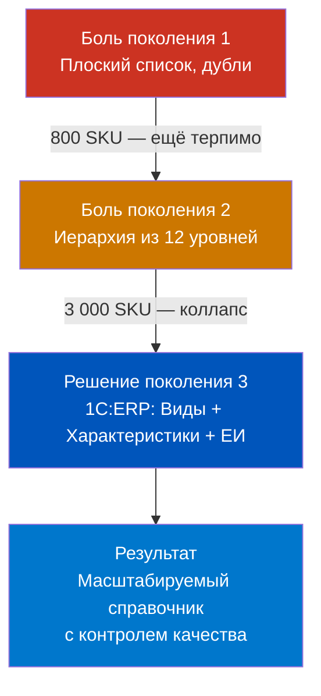
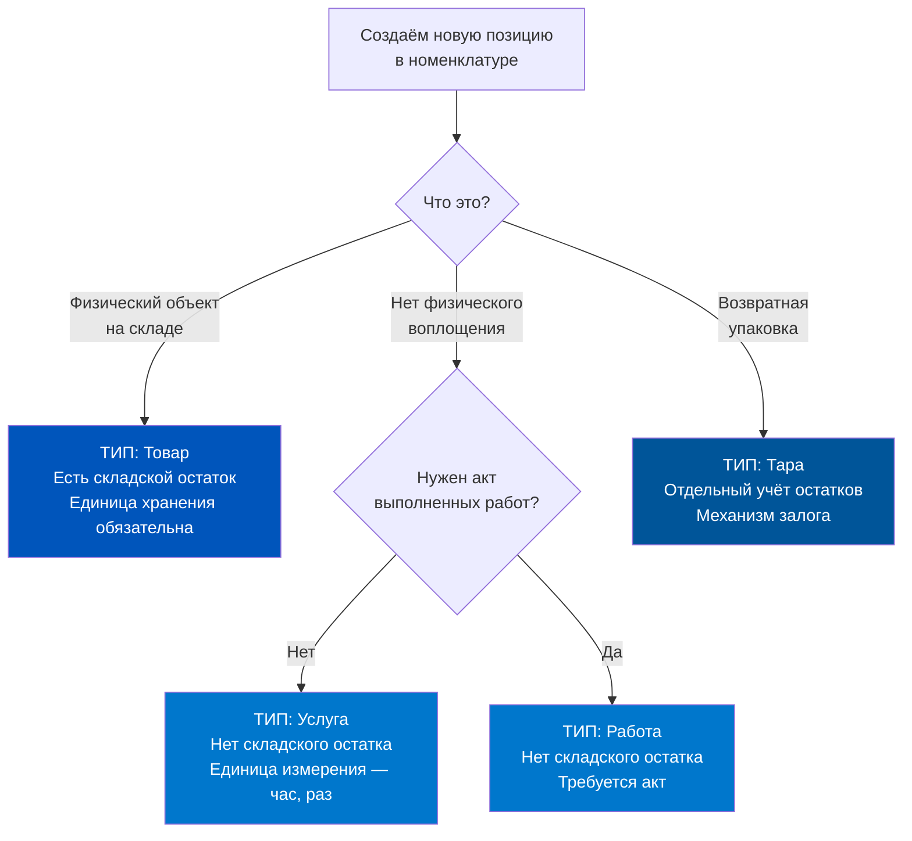
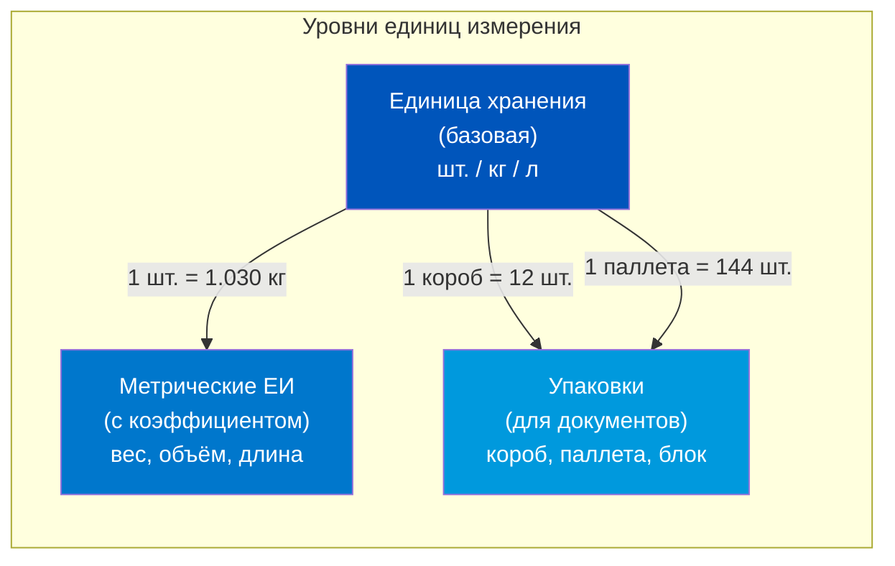
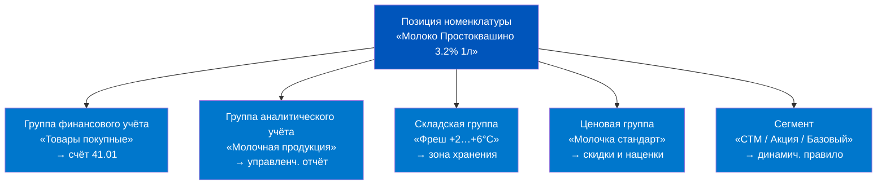
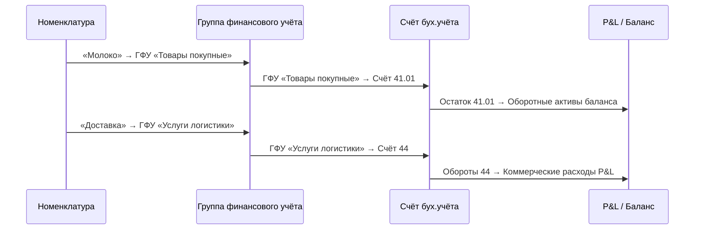
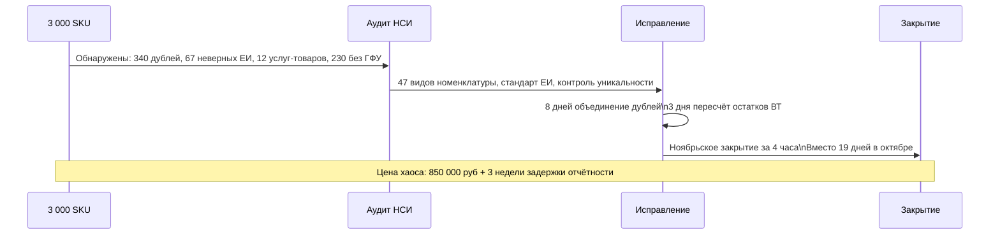
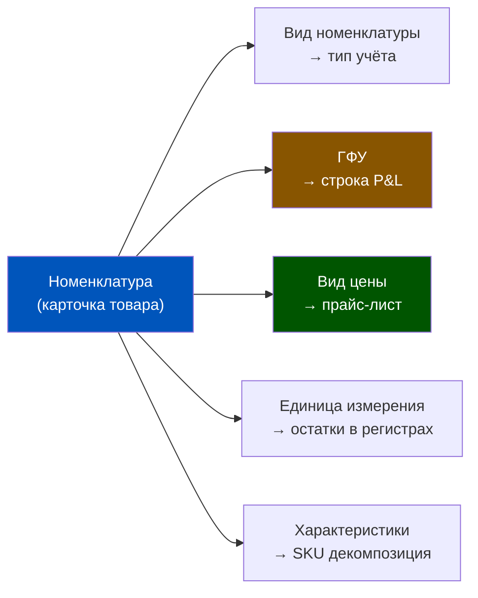

# Номенклатура: Виды, Характеристики и Единицы измерения

> **Цель урока:** Понять, как 1C:ERP 2.5 хранит информацию о товарах, почему виды номенклатуры определяют возможности учёта, и как неверная структура справочника может парализовать закрытие месяца в Q-commerce сети.
> **Время чтения:** ~65 минут

---

## Оглавление

- [[#Часть 1. Три тысячи позиций — и ни одна не закрылась]]
- [[#Часть 2. От инвентарной книги к генетическому коду]]
- [[#Часть 3. Архитектура: виды, характеристики, единицы измерения]]
- [[#Часть 4. Психология справочника: как рождаются дубли]]
- [[#Часть 5. Финансовый код товара: ГФУ и P&L]]
- [[#Часть 6. Кейс: SKU-взрыв и хаос в данных]]
- [[#Часть 7. Глоссарий и FAQ]]

---

## Часть 1. Три тысячи позиций — и ни одна не закрылась

Представьте: конец месяца, 23:47. Финансовый директор открывает 1С, чтобы запустить закрытие периода. Система выдаёт ошибку. Потом ещё одну. Потом ещё двадцать семь.

Причина не в бухгалтерских проводках. Не в регистрах. Причина — в справочнике номенклатуры, который полтора года назад заполнял менеджер по закупкам в спешке, потому что «надо было срочно завести новый товар». Позиция «Молоко 3.2% 1л Простоквашино» была создана трижды: с единицей хранения «шт.», «уп.» и «литр». Все три участвовали в разных документах. Себестоимость одной и той же физической единицы товара рассчитывалась в трёх несвязанных потоках данных. Система не могла свести баланс.

Это не гипотетический сценарий. Именно такой кризис произошёл в одной из московских сетей дарксторов в 2023 году, когда компания за 8 месяцев выросла с 800 до 3 000 SKU. Подробнее — в Части 6. Но сначала нужно понять механизм: почему справочник номенклатуры — это не «база товаров», а фундамент всей финансовой модели Q-commerce.

Центральный парадокс звучит так: чем быстрее растёт ассортимент, тем дороже обходится каждая ошибка в номенклатуре. При 800 SKU одна неверная единица измерения — это неудобство. При 3 000 SKU — это системный сбой закрытия месяца стоимостью в недели ручной работы и сотни тысяч рублей трудозатрат.

## Часть 2. Откуда взялась номенклатура — боль, которую решали итерациями

До появления ERP-систем складской учёт вёлся в карточках. Каждый товар — отдельная карточка с именем, единицей измерения и ценой. Когда появились первые компьютеризированные системы, этот же принцип перенесли в базы данных: таблица товаров, строчка на каждый SKU.

Проблема возникла с масштабом. Когда у компании 50 позиций — плоский список работает. Когда 5 000 — начинается хаос: как понять, что «Молоко цельное 1л» и «Молоко 1 литр цельное» — это один и тот же товар? Как связать цену закупки с ценой продажи, если они измеряются в разных единицах? Как автоматически формировать счета бухгалтерского учёта, не вводя каждый раз вручную?

Разработчики 1С:ERP ответили на эти вопросы концепцией вида номенклатуры. Вид — это не просто папка. Это шаблон: какие свойства описывают товар данного типа, какие единицы измерения допустимы, как формируется наименование, нужны ли характеристики. Когда создаётся новая позиция — она наследует всю эту логику от вида.

Эволюция шла через три поколения боли:

**Поколение 1** (плоский список): один менеджер ввёл «кг», другой «килограмм», третий «Кг» с заглавной. Три разных единицы измерения в системе — три несвязанных потока данных.

**Поколение 2** (иерархические группы): структура «Молочка → Молоко → Пастеризованное» выглядит логично, но при росте ассортимента с 300 до 3 000 позиций превращается в дерево из 12 уровней, где никто не помнит, куда положить новый товар.

**Поколение 3** (виды + характеристики + единицы измерения): то, что реализовано в 1С:ERP 2.5. Жёсткий типизированный справочник с контролем уникальности, наследованием свойств и автогенерацией наименований. Сложнее в настройке — но зато масштабируется до 100 000 позиций без деградации качества данных.

## Часть 3. Архитектура номенклатуры: четыре уровня, которые нужно знать

### 3.1. Тип номенклатуры: четыре разные вселенные учёта

Первый и важнейший выбор при создании вида номенклатуры — тип. В 1С:ERP 2.5 предусмотрено четыре типа, и они принципиально различаются по логике учёта:

| Тип | Что это | Складской остаток | Проводки | Q-commerce пример |
|-----|---------|------------------|---------|-------------------|
| Товар | Физический объект | Да | Д41/К60 при приёмке | Бананы, молоко, зубная паста |
| Услуга | Нематериальное | Нет | Д20/К60 | Доставка, сборка заказа |
| Работа | Нематериальное с актом | Нет | Д20/К60 | Ремонт оборудования склада |
| Тара | Возвратная упаковка | Да (отдельно) | Особые правила | Термосумки, паллеты, ящики |

Критически важный момент для Q-commerce: **тара** — это не просто «контейнер». Когда вы учитываете термосумки для курьеров как тару (а не как товар), система автоматически применяет механизм возвратной тары: при отгрузке — дебет счёта залога, при возврате — кредит. Если же кто-то завёл термосумки как «Товар», они оседают в себестоимости доставки как безвозвратные расходы. Разница в P&L — ощутимая.

Аналогично с услугами: если «Доставка» заведена как **Товар** — система попытается вести по ней складские остатки. Этого не существует физически, но ERP честно попытается — и начнёт генерировать ошибочные регистры.

### 3.2. Виды номенклатуры: шаблон, а не папка

Вид номенклатуры — это классификатор, объединяющий позиции с **одинаковым набором свойств и учётных параметров**. Ключевое слово: «одинаковым». Не похожим — одинаковым.

Пример из Q-commerce: «Молочная продукция» — это неправильный вид. Правильные виды:
- «Молоко пастеризованное» (свойства: жирность, объём, производитель; единица хранения: шт.)
- «Сыр твёрдый» (свойства: жирность, выдержка, производитель; единица хранения: кг)
- «Йогурт» (свойства: жирность, вкус, объём; единица хранения: шт.)

Почему нельзя объединить? Потому что сыр хранится и продаётся в килограммах, а молоко — в штуках (бутылках). Разные единицы хранения — значит, разные виды.

В карточке вида номенклатуры настраивается:

1. **Тип номенклатуры** (Товар/Услуга/Работа/Тара)
2. **Использование характеристик** (нет / индивидуальные / общие для вида / общие с другими видами)
3. **Использование серий** (актуально для товаров с серийными номерами или сроком годности)
4. **Дополнительные реквизиты** — физические и потребительские свойства (жирность, объём, вкус)
5. **Шаблон наименования** — автогенерация из значений реквизитов
6. **Фильтры быстрого отбора** — какие свойства показывать в форме подбора
7. **Контроль уникальности** — запрет создания дублей

Функциональная опция «Множество видов номенклатуры» включается в НСИ и администрирование → Настройка НСИ и разделов → Номенклатура → Разрезы учёта. Без неё — работает только один вид по умолчанию.

### 3.3. Характеристики: когда нужны, когда нет

Характеристика — это вариант исполнения одной и той же номенклатурной позиции. Размер 38, цвет синий. Или: вес нетто 250 г, вкус «Клубника». Все учётные параметры (тип, единица хранения) задаются для номенклатуры в целом, а характеристики добавляют аналитический разрез.

Три варианта использования характеристик:

- **Индивидуальные для номенклатуры** — свой список для каждой позиции. Гибко, но трудоёмко в обслуживании.
- **Общие для вида номенклатуры** — единый список характеристик для всего вида (например, размерная линейка «36–46» для всей обуви). Рекомендован ИТС как основной подход.
- **Общие с другими видами** — характеристики одного вида используются в другом. Экономит разработку при схожих линейках.

**Критерий «использовать характеристики»** — три случая из ИТС:
1. Свойства общие для всего вида (размерная линейка для обуви)
2. Разделение одной услуги по принципалам (агентская схема)
3. Автоподбор характеристик материалов в ресурсных спецификациях

**Критерий «не использовать характеристики»** — если проще создать отдельные карточки. При использовании характеристик подбор товара становится двухшаговым: сначала выбрать номенклатуру, затем выбрать характеристику. Для простых товаров это усложняет работу без добавления ценности.

Для Q-commerce характеристики актуальны в следующих случаях:

| Товар | Характеристика | Альтернатива |
|-------|---------------|-------------|
| Напиток | Объём (0.33л / 0.5л / 1л) | Отдельные SKU — проще |
| Фреш-товар | Весовой диапазон (если фиксированный) | Только если фиксированный |
| Одежда (мерч) | Размер + цвет | Характеристики — правильно |
| Фрукты | Страна происхождения | Отдельные SKU — прозрачнее |

Самая частая ошибка: создавать характеристики для товаров, где разные объёмы имеют разные штрихкоды, разные закупочные цены и разные условия хранения. В таком случае это разные SKU, а не характеристики одного.

### 3.4. Единицы измерения: три уровня иерархии

В 1С:ERP для каждого товара существует несколько слоёв единиц измерения. Понять их разницу — значит устранить 80% проблем с учётом.

**Единица хранения** — базовая. В ней ведётся учёт складских остатков. ИТС рекомендует выбирать ту единицу, которой кладовщик оперирует при работе с товарами. Для молока — «шт.» (бутылка), для сыра — «кг», для воды в бочках — «л».

**Метрические единицы** (вес, объём, длина, площадь) — дополнительные. Задаются с коэффициентом пересчёта к базовой единице. Имеют смысл только если коэффициент фиксированный: 1 шт. молока = 1.030 кг (вес бутылки с содержимым) — это фиксировано. А 1 шт. арбуза = ? кг — нефиксировано, значит метрическую единицу через коэффициент не настроить.

**Упаковки** — инструмент для удобного ввода количества в документах. Не меняют единицу хранения, но позволяют принимать товар «коробами» (12 шт.) и «паллетами» (144 шт.). Система автоматически пересчитывает в единицы хранения.

Важное предупреждение из ИТС: **при пересчёте единиц возможны ошибки округления**. Это не баг системы — это математическая природа вычислений с плавающей точкой. Рекомендация: задавать коэффициент пересчёта как можно ближе к 1. Например, не «1 кг = 0.001 т», а лучше «1 000 г = 1 кг» — убрать дробную часть.

**Для Q-commerce особенно важен весовой товар.** Арбузы, дыни, мясо на развес, сыр на развес — это товары, у которых каждая единица имеет уникальный вес. Единица хранения у них — «кг». Количество в документах вводится с точностью до граммов. Упаковки здесь неприменимы. Если такой товар по ошибке создать с единицей хранения «шт.» — вся аналитика рассыпется.

### 3.5. Группы номенклатуры и дополнительная классификация

Помимо видов, в 1С:ERP существует несколько независимых осей классификации. Каждая решает свою задачу:

**Группы номенклатуры** — иерархическая структура для навигации в списке. Используется при варианте «Навигация по иерархии». Простая и понятная, но негибкая: каждая позиция принадлежит только одной группе.

**Группа финансового учёта** — определяет счета бухгалтерского учёта. Это критически важная классификация для P&L: именно через неё товар попадает на счёт 41 (товары), услуга — на 20 (основное производство), тара — на 41.3 (тара). Ошибка здесь — ошибка в балансе.

**Группа аналитического учёта** — экономический классификатор. Объединяет позиции по однородным экономическим характеристикам (покупные товары, материалы, готовая продукция). Используется в управленческих отчётах.

**Складская группа** — для адресного хранения. Определяет условия хранения и зоны склада (холодная, тёплая, фреш, сухой склад). В Q-commerce — критически важна для дарксторов с мультитемпературным хранением.

**Ценовая группа** — для ценообразования и скидок.

**Сегмент номенклатуры** — произвольная группировка по правилам (например, «Акционные товары», «Собственная торговая марка»). Может формироваться динамически.

## Часть 4. Когнитивные ловушки при работе с НСИ

Справочник номенклатуры — это единственный элемент ERP, где ошибки, допущенные однажды, практически невозможно исправить без остановки бизнеса. Понимать почему — значит уже наполовину защитить себя от них.

### Ловушка 1. «Потом разберёмся» — иллюзия обратимости

Продакт-менеджер видит: нужно срочно добавить 40 новых позиций перед промо. На правильную настройку вида номенклатуры уйдёт 2 часа. Быстрое создание «как придётся» — 20 минут. Выбирается второй вариант с обещанием «потом переделаем».

Проблема: как только по позиции прошли хоть один документ — приёмка, продажа, списание — её изменение становится хирургической операцией. Нельзя изменить единицу хранения, если есть остатки. Нельзя сменить тип номенклатуры, если есть проводки. Нельзя удалить позицию, если она участвовала в закрытии месяца.

Цена «потом разберёмся» при масштабе 3 000 SKU — это 2–3 недели ручной работы аналитика и приостановка части операций.

### Ловушка 2. «Это один и тот же товар» — иллюзия физического тождества

Физически «Вода Evian 0.33л» и «Вода Evian 0.5л» — это похожие объекты. В ERP это два разных SKU с разными штрихкодами, разными ценами закупки, разными ценами продажи, возможно разными ставками НДС. Объединять их в одну номенклатурную позицию через характеристики — ошибка, потому что:
- Коэффициент пересчёта не существует (0.33 и 0.5 — разные ёмкости)
- Штрихкод уникален для каждой
- WMS видит их как разные единицы хранения

Правило: **разные штрихкоды = разные карточки номенклатуры**.

### Ловушка 3. «Дублей нет» — иллюзия визуального контроля

Контроль уникальности в 1С:ERP работает только при правильной настройке: в виде номенклатуры нужно явно указать, по каким реквизитам проверять уникальность (наименование + штрихкод, или наименование + производитель + объём). Если настройки нет — система создаст столько дублей, сколько нажмут «Сохранить».

Визуальный контроль («я же вижу в списке — похожих нет») не работает при большом объёме. 3 000 позиций глазами не проверить.

Настраивается в: НСИ и администрирование → Настройка НСИ и разделов → Номенклатура → Настройки создания.

### Ловушка 4. «Единица хранения — это единица продажи» — иллюзия симметрии

Сыр может приниматься на склад головками (ЕХ = шт.), продаваться граммами (фасовка), списываться кг (по весу). Если единица хранения задана «шт.» (голова сыра), а продаётся он граммами — система должна знать коэффициент: 1 шт. = 1 200 г (средний вес головки). Но вес головки непостоянен. Это и есть весовой товар в чистом виде — единица хранения должна быть «кг», иначе учёт себестоимости будет ошибочным.

## Часть 5. Номенклатура, регистры и P&L: как неверный справочник ломает финансовую модель

Здесь — самое важное для финансового понимания. Номенклатура — это не просто «база товаров». Это корень, от которого вырастают все финансовые данные.

### 5.1. Связь с регистрами накопления

Когда проходит документ (приёмка, продажа, перемещение) — система делает записи в регистрах накопления. Ключевой регистр для товарного учёта — «Товары на складах». Измерение этого регистра включает поле «Номенклатура» и поле «Единица измерения». Если одна и та же физическая позиция числится в регистре под тремя разными карточками номенклатуры — остаток физически один, а в регистре — три отдельных строки с тремя отдельными остатками.

При закрытии месяца система рассчитывает себестоимость «По средней» (не FIFO — именно средневзвешенную, это стандарт 1С:ERP 2.5). Расчёт ведётся в разрезе каждой карточки номенклатуры отдельно. Дубль с нулевым остатком и ненулевым входящим движением — это математически невозможная ситуация, которая блокирует закрытие.

### 5.2. Группа финансового учёта → счёт бухгалтерского учёта → P&L

Цепочка работает так:

Если «Доставка» заведена как Товар вместо Услуги — она попадает в ГФУ «Товары», счёт 41. Система будет формировать складские остатки по доставке. В балансе появятся оборотные активы «Доставка» на складе. Аудитор это заметит. Налоговая — тоже.

### 5.3. Влияние единиц измерения на себестоимость

Себестоимость «По средней» рассчитывается: (Стоимость входящего остатка + Стоимость прихода) ÷ (Количество входящего остатка + Количество прихода).

Если приход оформлен в «шт.», а расход в «кг» (из-за ошибки в настройке единиц) — система не может корректно сложить количества. Она либо конвертирует через коэффициент (если настроен), либо — если коэффициента нет — создаёт ошибку при расчёте себестоимости.

Для Q-commerce с высоким товарооборотом (ротация 70–80% ассортимента за месяц) ошибка в единицах измерения = неверная себестоимость = неверная валовая прибыль = неверное управленческое решение о ценообразовании.

### 5.4. Дополнительные реквизиты vs характеристики vs отдельные SKU: три пути и один правильный

Это один из самых частых вопросов при проектировании справочника: как описать «клубничный йогурт 150г» — как отдельный SKU, как характеристику SKU «Йогурт Данон», или как дополнительный реквизит?

Разница принципиальная:

**Дополнительный реквизит** — поисковый атрибут. По нему можно находить товар в списке, фильтровать в отчётах, формировать наименование. Но в разрезе дополнительного реквизита **не ведётся количественный учёт**. Реквизит «Вкус = Клубника» не создаёт отдельную строку в регистре остатков.

**Характеристика** — аналитический разрез с количественным учётом. Остатки в регистрах хранятся в разрезе «Номенклатура + Характеристика». Можно узнать: сколько штук «Йогурт Данон, Вкус Клубника» сейчас на складе.

**Отдельный SKU** — полная независимость: отдельная строка в справочнике, отдельный штрихкод, отдельный расчёт себестоимости, отдельное ценообразование.

Таблица принятия решений:

| Вопрос | Ответ «Да» | Решение |
|--------|-----------|---------|
| У вариантов разные штрихкоды? | Да | Отдельные SKU |
| Нужно вести остатки по каждому варианту отдельно? | Да | Характеристики или отдельные SKU |
| Варианты имеют разные закупочные цены? | Да | Отдельные SKU |
| Нужен только поиск/фильтрация по свойству? | Да | Доп. реквизит |
| Свойство общее для всего вида (размерная линейка)? | Да | Характеристики |

### 5.5. SKU-взрыв и управление ростом

При запуске дарксторы работают с 500–800 SKU. Через 12–18 месяцев типичный darkstore Q-commerce в России имеет 3 000–5 000 SKU. Прирост — в 4–6 раз. За это же время количество видов номенклатуры должно вырасти с 15–20 до 60–80. Если этого не происходит — виды становятся «помойными вёдрами», куда складывается всё подряд.

Практическое правило для Q-commerce: **один вид — одна единица хранения**. Если в один вид пытаются положить товары с разными единицами хранения — это признак неправильной структуры.

Ещё один индикатор здорового справочника: соотношение количества видов к количеству SKU. При правильной структуре это примерно 1:40–1:60 (один вид на 40–60 позиций). Если у вас 3 000 SKU и 5 видов — виды перегружены. Если 3 000 SKU и 500 видов — виды слишком детализированы, потеряна управляемость.

Дополнительный инструмент контроля — сегменты номенклатуры. В отличие от видов и групп, сегмент может формироваться динамически по правилам: «все товары с ценовой группой "премиум" и остатком < 10 шт.» — это сегмент, который пересчитывается автоматически при каждом обращении. Для Q-commerce сегменты особенно ценны для управления акционными предложениями и мониторинга неликвидов.

## Часть 6. Кейс: «Великий хаос справочника» — 3 000 SKU и заблокированное закрытие

### Исходные данные

Анонимная сеть дарксторов (Москва, 2023 год). На старте — 4 точки, 800 SKU, 1С:ERP разворачивали в спешке за 6 недель. Справочник номенклатуры настраивали по принципу «иерархия по группам», без видов номенклатуры. Единицу хранения для каждой позиции задавал тот, кто создавал — без стандарта.

За 8 месяцев сеть выросла до 12 дарксторов и 3 000 SKU. Прирост на 2 200 позиций — 40–60 новых SKU в неделю.

### Анатомия хаоса

К сентябрю 2023 года справочник содержал следующие проблемы (выявлены при аудите):

**Дублирование**: 340 позиций имели дубли — один и тот же физический товар под разными наименованиями. Пример: «Молоко Простоквашино 3.2% 1л», «Простоквашино молоко 3.2 1 литр», «Молоко пст 3.2 Простоквашино». Три карточки, три потока движений, три расчёта себестоимости.

**Единицы измерения**: 67 позиций весового товара (арбузы, дыни, мясо) заведены с единицей хранения «шт.». Фактически продавались на вес. Каждая продажа вводилась с ручным коэффициентом в документе. Никакого стандарта.

**Тип номенклатуры**: 12 позиций услуг (доставка, сборка, доп.упаковка) заведены как Товар. По ним числились «складские остатки» — физически несуществующие.

**Характеристики**: 180 позиций фреш-товаров (йогурты в разных вкусах) заведены без характеристик — каждый вкус как отдельная карточка, но без единообразного наименования. Итог: «Йогурт клубника Данон 150г», «Данон йогурт клубн 150», «Данон 150 клубника йогурт» — три разные карточки одного SKU.

**Отсутствующие группы финансового учёта**: 230 позиций без ГФУ. Они не попадали ни на какой счёт бухгалтерского учёта автоматически. Бухгалтер добавлял ГФУ вручную при каждом документе — не всегда одинаково.

### Закрытие месяца: три недели вместо одной ночи

В октябре 2023 года при попытке закрыть сентябрь система выдала 47 ошибок при расчёте себестоимости:
- 23 ошибки — дубли с несовпадающими остатками
- 14 ошибок — единицы измерения весового товара (пытались сложить «шт.» и «кг»)
- 10 ошибок — позиции без ГФУ, не имеющие счёта учёта

Закрытие заняло 19 рабочих дней вместо 1. Привлекли внешнего консультанта. Стоимость работ: около 850 000 рублей. Плюс — задержка управленческой отчётности на 3 недели, решения о закупках на ноябрь принимались «вслепую».

### Как исправили

Внешний аналитик разработал стандарт видов номенклатуры: 47 видов вместо одной «корзины». Для каждого вида — обязательные реквизиты, шаблон наименования, единица хранения. Включили контроль уникальности по штрихкоду и наименованию.

Затем — 340 дублей объединили через инструмент «Замена в документах»: старые карточки помечены на удаление, движения перевешены на основную. Это потребовало 8 рабочих дней только на механическую работу.

67 позиций весового товара переведены на единицу хранения «кг». Потребовалось вручную пересчитать остатки на 12 складах — 3 дня.

Результат: ноябрьское закрытие прошло за 4 часа.

### Контрфактический сценарий: что было бы при правильном старте

Если бы при запуске потратили 3 недели на проектирование НСИ:

- 47 видов номенклатуры с шаблонами наименований — исключают вариативность написания
- Контроль уникальности по штрихкоду — блокирует дубли на входе
- Стандарт ЕИ для весового товара (кг) — задокументирован и обязателен
- 5 типов номенклатуры с чётким разделением — каждый менеджер знает, куда положить новый товар
- ГФУ для всех видов — каждая позиция автоматически попадает на нужный счёт

Стоимость проектирования в начале: 3 недели × 1 аналитик ≈ 150 000 рублей.
Стоимость исправления через 8 месяцев: 850 000 рублей + 3 недели задержки + потери от неверных решений по закупкам.

Коэффициент: вложение 1 рубля в НСИ на старте экономит 5–6 рублей при масштабировании.

### Выводы из кейса

1. Стандарт видов номенклатуры нужно разрабатывать **до** добавления первых позиций, а не после достижения 3 000 SKU.
2. Контроль уникальности — не опция, а обязательная настройка в НСИ.
3. Весовой товар — отдельная категория с отдельными правилами (единица хранения «кг», без коэффициентов).
4. Услуги и тара — отдельные типы номенклатуры, их нельзя заводить как товар.
5. Рост с 800 до 3 000 SKU за 8 месяцев — это не рост в 3.75 раза. Это рост сложности НСИ примерно в 14 раз (нелинейная зависимость).
6. Стоимость правильного старта: ~150 000 рублей. Стоимость исправления хаоса: ~850 000 рублей. Разница — в 5.7 раза.

## Часть 7. Глоссарий и FAQ

### Глоссарий

**НСИ** (Нормативно-справочная информация) — раздел 1С:ERP, содержащий справочники: номенклатуру, контрагентов, склады, единицы измерения и другие базовые объекты.

**Вид номенклатуры** — классификатор, объединяющий позиции номенклатуры с одинаковым набором свойств и учётных параметров. Содержит шаблон наименования, список дополнительных реквизитов, настройку характеристик.

**Тип номенклатуры** — базовая классификация: Товар, Услуга, Работа, Тара. Определяет логику учёта.

**Единица хранения** (ЕХ) — единица измерения, в которой ведётся учёт складских остатков. Для товаров — обязательна.

**Метрическая единица** — дополнительная единица (вес, объём, длина, площадь) с фиксированным коэффициентом пересчёта к единице хранения.

**Упаковка** — инструмент удобного ввода количества в документах. Не меняет единицу хранения, пересчитывается автоматически.

**Характеристика номенклатуры** — вариант исполнения позиции (размер, цвет, вкус). Позволяет вести количественный учёт в разрезе вариантов без создания отдельных карточек.

**Группа финансового учёта** (ГФУ) — классификатор номенклатуры по правилам отражения в регламентированном учёте. Определяет счёт бухгалтерского учёта.

**Группа аналитического учёта** (ГАУ) — экономический классификатор для управленческих отчётов.

**Складская группа** — классификатор по условиям хранения на адресном складе.

**Контроль уникальности** — механизм предотвращения дублей при создании новых позиций номенклатуры. Настраивается в НСИ → Настройка НСИ и разделов → Номенклатура → Настройки создания.

**SKU** (Stock Keeping Unit) — уникальная идентификация товарной позиции. Каждый SKU = одна карточка номенклатуры.

**Себестоимость «По средней»** — метод расчёта стоимости единицы товара: (стоимость начального остатка + стоимость прихода) ÷ (количество начального остатка + количество прихода). Стандарт 1С:ERP 2.5.

**FEFO** (First Expired — First Out) — принцип отпуска: сначала товар с наиболее ранней датой истечения срока годности. Актуален для фреш-товаров Q-commerce.

### FAQ

**Q: Можно ли изменить тип номенклатуры (например, с Товар на Услугу) после того, как по позиции прошли документы?**

A: Технически — нет. Система не даёт изменить тип при наличии движений. Практически — нужно пометить старую позицию на удаление и создать новую с правильным типом, потом перепровести документы. Это трудоёмко. Избегать изначально.

**Q: Когда использовать характеристики, а когда создавать отдельные SKU?**

A: Правило: если разные варианты имеют разные штрихкоды — это разные SKU. Если штрихкод один (например, единый штрихкод для размерной линейки одежды в некоторых системах) — можно рассмотреть характеристики. В Q-commerce 95% случаев — отдельные SKU.

**Q: Обязательно ли настраивать группу финансового учёта для каждой позиции?**

A: Обязательно, если компания ведёт регламентированный учёт (что является требованием законодательства). Без ГФУ позиция не попадёт ни на какой счёт бухгалтерского учёта автоматически.

**Q: Как настроить систему, чтобы предотвратить создание дублей?**

A: НСИ и администрирование → Настройка НСИ и разделов → Номенклатура → Настройки создания → включить «Контроль уникальности номенклатуры». Выбрать вариант: по наименованию, по реквизитам, по штрихкоду (или комбинацию). Рекомендуется: наименование + штрихкод.

**Q: Для фреш-товаров с переменным весом (арбузы, дыни, мясо) — как правильно настроить единицы измерения?**

A: Единица хранения — «кг». Метрические единицы не задаются (коэффициент нефиксированный). Упаковки — не используются. Количество в документах вводится в кг с точностью до граммов (0.001 кг = 1 г). WMS при отгрузке фиксирует фактический вес.

**Q: Сколько видов номенклатуры оптимально для Q-commerce с 3 000 SKU?**

A: Практика показывает: 40–80 видов для ассортимента 3 000–5 000 SKU. Примерная разбивка: 25–35 видов для продовольственных товаров, 10–15 для непродовольственных, 5–10 для тары и упаковки, 3–5 для услуг.

**Q: Влияет ли иерархия групп номенклатуры на P&L и отчётность?**

A: Группы номенклатуры — только навигационный инструмент. На P&L не влияют. На P&L влияет группа финансового учёта (через счёт бухгалтерского учёта) и группа аналитического учёта (через управленческие разрезы). Не путать.

**Q: Что делать, если в системе уже есть тысячи позиций без видов номенклатуры — с чего начать аудит?**

A: Алгоритм из практики. Шаг 1: выгрузить список номенклатуры с полями «Наименование», «Единица хранения», «Тип», «ГФУ». Шаг 2: через Excel/Power Query найти позиции с незаполненным ГФУ и неверным типом. Шаг 3: кластеризовать позиции по физическим свойствам — это будущие виды. Шаг 4: настроить виды и шаблоны наименований. Шаг 5: через «Замену в документах» перевести движения с дублей на основные карточки. Шаг 6: включить контроль уникальности. Типичный срок при 3 000 SKU — 4–6 недель при одном аналитике.

**Q: Как устроен контроль уникальности при записи новой позиции?**

A: При записи номенклатуры с неуникальными параметрами система показывает, какой вид контроля нарушен (штрихкод, реквизиты или наименование). Пользователю предлагается три действия: «Выбрать существующую» (отказаться от создания нового), «Продолжить заполнение» (изменить данные), «Продолжить запись» (создать всё равно — доступно только при специальной роли «Ввод информации по номенклатуре без контроля»). Это значит: даже при включённом контроле уникальности нужно следить за тем, кому выдана роль обхода контроля.

### Что изучить дальше

Этот урок заложил фундамент: вы понимаете структуру справочника номенклатуры и понимаете, почему ошибки в нём стоят дорого. Следующий шаг — Группы финансового учёта (ГФУ): как именно они связывают номенклатуру со счетами бухгалтерского учёта, как они определяют структуру P&L, и что происходит, когда ГФУ настроены неправильно.

Три вопроса для самопроверки перед следующим уроком:
1. Чем отличается «Группа финансового учёта» от «Группы аналитического учёта» — в одном предложении?
2. Почему нельзя изменить единицу хранения у номенклатуры, если по ней уже есть движения?
3. Назовите два случая из Q-commerce, когда характеристики правильнее, чем отдельные SKU.

---

### Связи в системе: номенклатура как центр НСИ

← [[Неделя 1 - День 7 - История Самоката|День 7 (Неделя 1)]] | [[README|Оглавление]] | [[Неделя 2 - День 2 - ГФУ|День 2]] →
