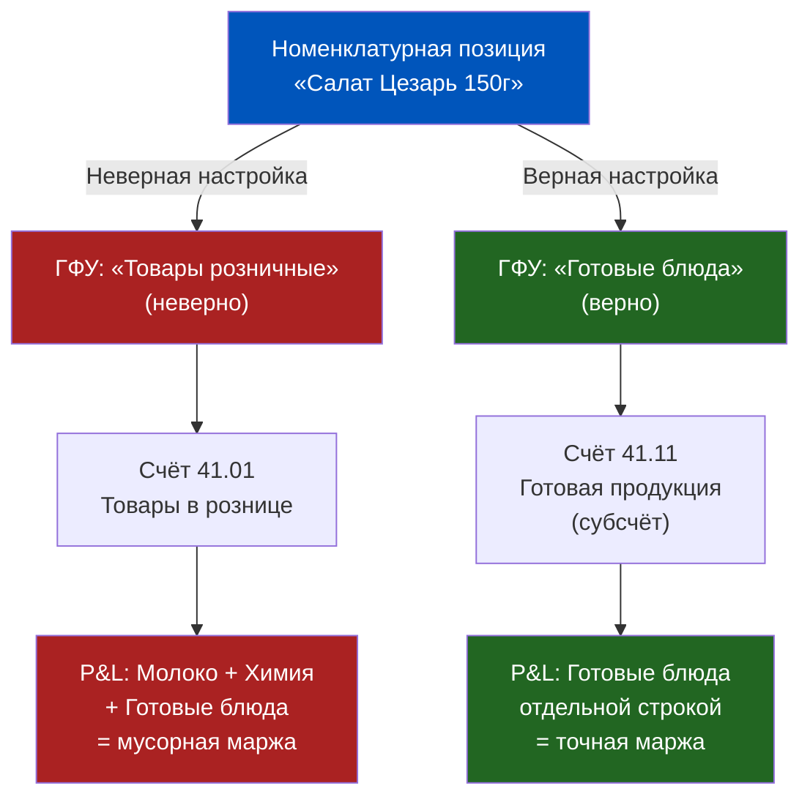
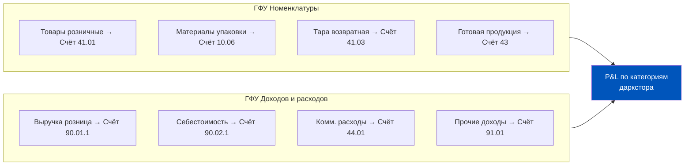
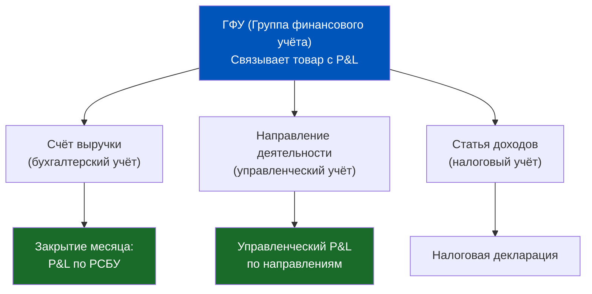
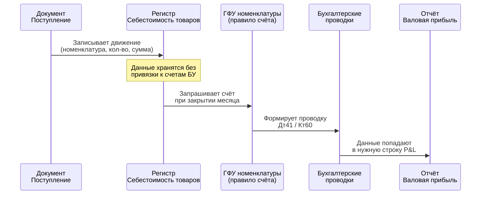
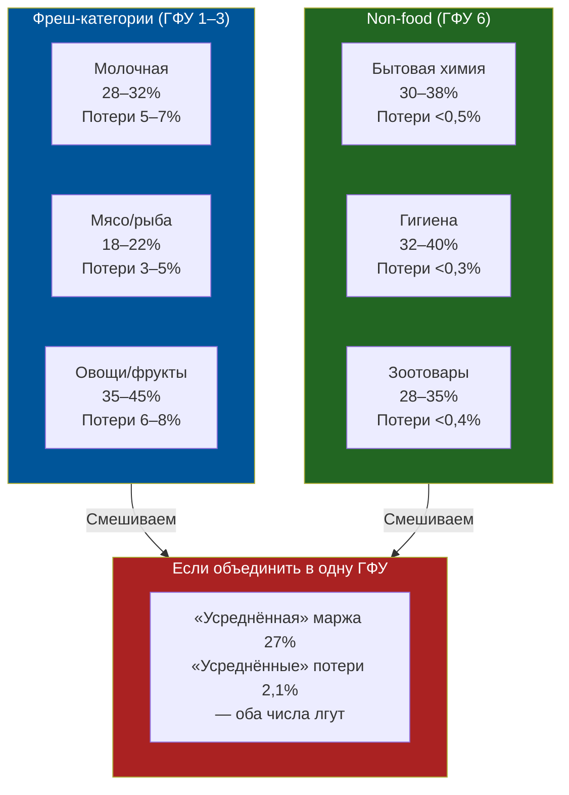

# Группы финансового учёта (ГФУ): Связь товара с P&L

> **Цель урока:** Понять, как группы финансового учёта (ГФУ) в 1C:ERP 2.5 связывают каждую номенклатурную позицию с конкретными счетами бухгалтерского учёта — и почему неверная настройка ГФУ разрушает точность P&L по категориям в Q-commerce.
> **Компетенции:**
> - Объяснить, что такое ГФУ и как она определяет проводку Дт41/Дт10 → Кт60
> - Различать ГФУ для товаров, материалов, готовой продукции, тары, доходов и расходов
> - Объяснить, почему молоко и бытовая химия в одной ГФУ = слепая зона в P&L
> - Предложить структуру ГФУ для даркстора с фреш и non-food категориями
> **Время чтения:** ~65 минут

---

## Оглавление

- [[#Часть 1. Катастрофа на 11 миллионов]]
- [[#Часть 2. Происхождение: зачем ERP нужны группы финансового учёта]]
- [[#Часть 3. Архитектура ГФУ: товары, услуги, доходы, расходы]]
- [[#Часть 4. Ловушки настройки: семь способов сломать P&L]]
- [[#Часть 5. Q-commerce контекст: фреш vs non-food]]
- [[#Часть 6. Кейс: «Тандем» — даркстор, который потерял маржу на 3 месяца]]
- [[#Часть 7. Глоссарий и FAQ]]

---

## Часть 1. Катастрофа на 11 миллионов

Представьте: конец марта, закрытие квартала. Финансовый директор сети из 12 дарксторов открывает отчёт «Валовая прибыль предприятия» в 1C:ERP 2.5. Цифры смотрят на него с экрана — и он не верит тому, что видит.

Категория «Молочная продукция»: маржа 31%. Категория «Бытовая химия»: маржа 34%. Категория «Фреш-овощи»: маржа 12%.

Всё выглядит разумно. Но когда он пытается сравнить эти данные с управленческим отчётом из Excel, который категорийный менеджер вёл вручную, цифры расходятся на 11 млн руб. за квартал. В одном месте — прибыль, в другом — убыток по одним и тем же SKU (единица складского учёта).

Три недели финансовый отдел ищет ошибку в документах. Находят её не там. Всё оказалось проще и страшнее: три месяца назад, когда запускали новую категорию «Готовые блюда» (салаты, сэндвичи), технолог по 1С не создал отдельную ГФУ. Он назначил готовым блюдам ту же группу финансового учёта, что и обычным товарам, — «Товары розничные». В результате:

- Готовые блюда поступали на счёт 41 (Товары) вместе с молоком и шоколадом.
- Себестоимость разных категорий смешалась в одном котле.
- P&L по категориям «Молочная продукция» включал часть затрат на упаковку сэндвичей.
- Финансовый директор три месяца принимал инвестиционные решения на основе данных, которые описывали несуществующую реальность.

Стоимость ошибки — не 11 млн руб. Стоимость ошибки — неверное расширение категорий, которое привело к убыточному запуску двух дарксторов.

> **Группа финансового учёта — это не бухгалтерская мелочь. Это система координат, в которой ваш P&L видит (или не видит) прибыль по каждой категории.**

Но чтобы понять, как именно работает этот механизм — нужно разобраться в архитектуре.

---

## Часть 2. Происхождение: зачем ERP нужны группы финансового учёта

### Проблема, которую решает ГФУ

В 1C:ERP 2.5 на предприятии могут быть тысячи номенклатурных позиций. У торговой сети дарксторов — легко 5 000–8 000 активных SKU. Каждая позиция при поступлении, продаже или списании должна попасть на правильный счёт бухгалтерского учёта.

Теоретически можно настроить счёт для каждой из 8 000 позиций по отдельности. Но это:
- 8 000 записей в регистре настройки счетов
- Необходимость изменять счёт при каждом добавлении позиции
- Гарантированные ошибки при массовом вводе

Решение — сгруппировать номенклатуру по **одинаковым правилам отражения в учёте**. Позиции, которые при поступлении должны попасть на счёт 41 (Товары), объединяются в одну группу. Позиции, которые попадают на счёт 10 (Материалы), — в другую.

Это и есть **группа финансового учёта (ГФУ) номенклатуры** — классификатор, позволяющий объединить номенклатуру с одинаковыми счетами бухгалтерского учёта.

Согласно документации ИТС, ГФУ определена как классификатор номенклатуры для описания правил управленческого и регламентированного учёта. Именно через ГФУ система понимает, на какой счёт бухгалтерского учёта попадёт товар при поступлении, продаже или списании — и как эта же информация используется в управленческих отчётах.

### Исторический контекст: от советской бухгалтерии к ERP

В советской плановой экономике существовал единый план счетов, где счёт 41 — «Товары», счёт 10 — «Материалы», счёт 43 — «Готовая продукция». Каждая категория ценностей имела «свой» счёт, и бухгалтер знал: если принимаем товар для перепродажи — дебетуем 41, если принимаем сырьё для производства — дебетуем 10.

В первых версиях «1С:Бухгалтерии» счёт задавался вручную для каждого документа или для каждой позиции номенклатуры. Но когда на смену «Бухгалтерии» пришли системы управления предприятием — «1С:Управление торговлей», а затем «1С:ERP» — встала задача автоматизировать этот выбор. Бухгалтер не должен каждый раз думать: «А это что — товар или материал?»

Ответом стала система ГФУ. Один раз при настройке системы вы определяете: всё, что входит в ГФУ «Товары розничные» — всегда идёт на счёт 41.01. Всё, что входит в ГФУ «Тара» — на счёт 41.03. Система знает правило и применяет его автоматически.

### Два уровня ГФУ в 1C:ERP 2.5

Важно понять: в 1C:ERP 2.5 существуют **два типа ГФУ**, и они решают разные задачи:

1. **ГФУ номенклатуры** — определяет, на какой счёт попадает товар при поступлении, продаже, списании. Это «паспорт счёта» для каждой категории товаров.

2. **ГФУ доходов и расходов** — определяет, на какой счёт попадают выручка от продажи и коммерческие расходы. Это «паспорт P&L-строки» для каждого вида доходов и затрат.

Вместе они формируют полную картину: по каким счетам движутся активы (ГФУ номенклатуры) и по каким счетам проходят доходы и расходы (ГФУ доходов/расходов). P&L — это пересечение двух систем.

---

## Часть 3. Архитектура ГФУ: товары, услуги, доходы, расходы

### ГФУ номенклатуры: четыре типовых группы

В типовой поставке 1C:ERP 2.5 предусмотрен набор стандартных ГФУ. Они соответствуют основным типам номенклатуры, которые различаются по характеру учёта.

**1. «Товары»**

Самая используемая группа. Применяется для всего, что предприятие покупает для перепродажи без переработки. При поступлении — дебет счёта 41 «Товары». При продаже — кредит счёта 41 и дебет счёта 90.02 «Себестоимость продаж».

Для даркстора: молоко, хлеб, напитки, бытовая химия, зоотовары — всё, что куплено у поставщика и продаётся в том же виде.

**2. «Материалы»**

Применяется для расходных материалов, которые используются в процессе деятельности и не перепродаются. При поступлении — дебет счёта 10 «Материалы». Списываются на затраты при использовании.

Для даркстора: упаковочная плёнка, пакеты-пыльники, перчатки для фасовки, этикетки, термоэтикетки, чековая лента для принтеров. Важно: если эти же пакеты продаются клиентам — их нужно учитывать как «Товары», а не «Материалы».

**3. «Готовая продукция»**

Применяется для позиций, которые предприятие производит само — из сырья или полуфабрикатов. При выпуске с производства — дебет счёта 43 «Готовая продукция».

Для даркстора с собственной кухней: готовые блюда (салаты, сэндвичи, нарезки), фасованные специи, упакованные фруктовые корзины. Если даркстор сам нарезает арбузы на дольки и продаёт в лотках — лоток с арбузом это уже «Готовая продукция», а не «Товар».

**4. «Тара»**

Применяется для многооборотной тары — той, которая возвращается поставщику или передаётся клиенту с условием возврата. Счёт 41.03 «Тара под товаром и порожняя».

Для даркстора: кеги с напитками (если есть), возвратные контейнеры от поставщиков молочной продукции, пластиковые паллеты.

### Как ГФУ привязывается к счёту: механизм работы

В 1C:ERP 2.5 существует специальное рабочее место — **«Настройка счетов для отражения документов в регламентированном учёте»** (меню «Регламентированный учёт» → «Настройки и справочники» → «Настройка счетов учёта»).

В этом рабочем месте настраиваются **таблицы соответствия**: при поступлении товара с ГФУ «Товары розничные» от контрагента типа «Поставщик» — использовать счёт 41.01. При том же поступлении, но ГФУ «Материалы» — использовать счёт 10.06.

Ключевые реквизиты, влияющие на выбор счёта:
- **ГФУ номенклатуры** — основной определитель
- **Тип хозяйственной операции** (поступление/продажа/списание)
- **Вид организации** (торговая/производственная)
- **Направление деятельности** (если ведётся)

Механизм прост: когда в базу записывается документ «Приобретение товаров и услуг», система смотрит на ГФУ каждой строки — и автоматически подставляет счёт дебета. Бухгалтер не выбирает счёт вручную. Он **однажды** настраивает правило, и дальше система работает автоматически.

> **Один раз настроенная ГФУ → тысячи правильных проводок без ручного труда.**

### ГФУ доходов и расходов

Параллельная система для доходной и расходной части P&L. Настраивается в разделе «Регламентированный учёт» → «Настройки и справочники» → «Группы финансового учёта доходов/расходов».

Каждая карточка ГФУ доходов/расходов содержит:
- **Параметр «Используется для учёта»**: Доходы или Расходы
- **Для доходов**: счёт регистрации (например, 90.01.1 — «Выручка от продаж»)
- **Для расходов**: счёт учёта (например, 44.01 — «Издержки обращения») + счёт списания (90.07 или 90.02)

Пример ГФУ расходов для даркстора:

| Наименование ГФУ | Счёт учёта | Счёт списания | Применяется для |
|---|---|---|---|
| Коммерческие расходы: доставка | 44.01 | 90.07 | Расходы на курьеров |
| Коммерческие расходы: упаковка | 44.02 | 90.07 | Пакеты, скотч продажные |
| Общехозяйственные расходы | 26 | 90.08 | Аренда, коммуналка |
| Потери при хранении | 94 | 91.02 | Списания просрочки |

### Связь с регистром «Себестоимость товаров»

В 1C:ERP 2.5 себестоимость хранится **не в проводках**. Основное хранилище — регистр накопления «Себестоимость товаров». Туда записываются движения с указанием номенклатуры, количества, стоимости — и именно этот регистр является источником для расчёта фактической себестоимости при закрытии месяца.

Когда при закрытии месяца выполняется регламентное задание «Распределение затрат и расчёт себестоимости», система:

1. Читает данные из регистра «Себестоимость товаров»
2. Формирует бухгалтерские проводки на счетах, **определённых через ГФУ**
3. Записывает результат в регистр «Выручка и себестоимость продаж»
4. Именно из этого последнего регистра строится отчёт «Валовая прибыль»

Схема проста и жёсткая: если ГФУ указана неверно — на шаге 2 проводка уйдёт на неправильный счёт. И ваш P&L будет врать не потому, что кто-то ошибся в цифре — а потому что цифра попала в неправильную строку отчёта.

---

## Часть 4. Ловушки настройки: семь способов сломать P&L

### Ловушка 1. «Все товары в одну группу»

Самая распространённая ошибка при быстром запуске. Создали одну ГФУ «Товары» — и назначили её всем 7 000 позиций. Технически система работает, проводки формируются. Но P&L не знает разницы между йогуртом, батарейкой и средством для мытья посуды — всё это «Товары» с одинаковой аналитикой.

Результат: нельзя посмотреть маржу по категории «Молочная продукция» отдельно от «Бытовой химии». P&L показывает один котёл вместо структурированного отчёта.

### Ловушка 2. Материалы учтены как Товары

Классика при запуске: команда торопится, категорийный менеджер заводит позицию «Пакет фасовочный 10 мкм» в ту же ГФУ, что и обычный товар. Пакеты идут на счёт 41, участвуют в расчёте оборачиваемости, попадают в отчёт о продажах.

Последствия:
- Оборачиваемость товарного запаса искусственно занижается (материалы медленно ротируются)
- При инвентаризации остатки пакетов «не совпадают» с пакетами на складе
- Себестоимость реализации включает стоимость пакетов, которые нельзя «продать»

### Ловушка 3. Готовая продукция учтена как Товары

Особенно опасно для дарксторов с собственной кухней. Если готовые блюда попадают на счёт 41 вместо счёта 43:

- Нет разделения между закупочной стоимостью сырья и стоимостью готового изделия
- Формируется некорректная себестоимость: система не знает, что салат — это продукт переработки, а не купленный товар
- Невозможно отследить коэффициент выхода: из 1 кг капусты + 0,2 кг заправки + 0,1 кг курицы должен выйти 1,1 кг «Салата Цезарь» стоимостью 180 руб., а не просто «товар по закупочной цене»

### Ловушка 4. Тара учтена как Товар

Возвратная тара — это не товар. Она не продаётся клиенту в собственность, а передаётся на условиях возврата. Если кег с пивом попадёт в ГФУ «Товары», система при продаже спишет его в себестоимость — и начнёт показывать убыток по каждой продаже «Пива разливного», потому что дорогой кег де-факто «ушёл» к клиенту.

### Ловушка 5. Одна ГФУ для всего фреша

Даже если правильно разделить «Товары» от «Материалов», внутри категории «Товары» может не быть нужной детализации. Если молоко, мясо, рыба и овощи сидят в одной ГФУ — P&L не покажет, какая из четырёх фреш-групп убыточна. А в Q-commerce маржинальность фреш-категорий очень разная: молочка даёт 28–32%, охлаждённое мясо — 18–22%, овощи — 35–45%.

### Ловушка 6. Пустая ГФУ у новой позиции

При создании новой номенклатурной позиции поле ГФУ может остаться незаполненным, если не настроено значение по умолчанию. Документ проведётся — но либо выдаст ошибку при формировании проводок, либо запишет движение на счёт по умолчанию из настроек организации. В обоих случаях данные попадают «не туда».

**Как защититься**: в виде номенклатуры настраивают значение поля ГФУ «по умолчанию» — тогда каждая новая позиция автоматически получает правильную группу при создании.

### Ловушка 7. ГФУ изменили задним числом

Иногда через месяц после запуска приходит понимание, что ГФУ настроена неверно. Специалист исправляет настройку в карточке номенклатуры — но уже проведённые документы не пересчитываются автоматически. Исторические движения остаются со старым счётом. P&L начинает показывать «разрыв»: до даты исправления — одна картина, после — другая.

Исправление требует либо перепроведения документов (долго и рискованно), либо ручной корректировки проводок, либо введения корректировочного документа.

> **Золотое правило**: настраивайте ГФУ до ввода первой строки номенклатуры. Менять потом — значит переписывать историю.

---

## Часть 5. Q-commerce контекст: фреш vs non-food

### Почему стандартных ГФУ недостаточно для даркстора

Типовые ГФУ в 1C:ERP 2.5 создавались для промышленных предприятий и классической торговли. Даркстор — гибридная структура: часть SKU ведёт себя как обычный ритейл, часть — как небольшое производство (собственная кухня), часть — как сервисная компания (доставка).

Для корректного P&L в Q-commerce нужна детализированная система ГФУ, которая отражает эту многоуровневость.

### Рекомендуемая структура ГФУ номенклатуры для даркстора

| ГФУ | Счёт | Что входит | Маржа (ориентир) |
|---|---|---|---|
| Товары — Молочная и яйца | 41.01 | Молоко, кефир, йогурт, творог, яйца | 28–32% |
| Товары — Мясо и рыба | 41.01 | Охлаждённое мясо, колбасы, рыба охл. | 18–22% |
| Товары — Овощи и фрукты | 41.01 | Свежие овощи/фрукты | 35–45% |
| Товары — Бакалея | 41.01 | Крупы, макароны, соусы, консервы | 25–30% |
| Товары — Напитки | 41.01 | Вода, соки, газировка | 20–25% |
| Товары — Нон-фуд | 41.01 | Химия, гигиена, зоотовары | 30–38% |
| Товары — Алкоголь | 41.02 | Пиво, вино, крепкий алкоголь | 22–28% |
| Готовая продукция — Кухня | 43 | Готовые блюда, нарезки | 45–55% |
| Тара возвратная | 41.03 | Кеги, возвратные контейнеры | — |
| Материалы упаковки | 10.06 | Пакеты, плёнка, этикетки | — |

Для алкоголя — отдельный субсчёт 41.02, потому что в 1C:ERP ведётся специальный учёт по ЕГАИС (Единая государственная автоматизированная информационная система) — алкогольная продукция маркируется акцизными марками и требует отдельной аналитики.

### Почему фреш и non-food нельзя объединять

Три принципиальных отличия:

**1. Разные ставки потерь.** Фреш-категории имеют уровень списаний 3–8% от оборота. Non-food — менее 0,5%. Если объединить их в одну ГФУ, средний уровень потерь «покроет» убыточность фреша. Категорийный менеджер не увидит, что молочка съедает 7% в потерях, а шампунь — 0,1%.

**2. Разная скорость оборачиваемости.** Оборачиваемость молока — 2–3 дня. Оборачиваемость стирального порошка — 12–18 дней. Смешанный показатель бессмысленен для управления заказом.

**3. Разный режим ценообразования.** Фреш-категории часто работают на динамическом ценообразовании с уценкой при приближении срока годности. Non-food — на стабильных ценах. Если обе группы в одной ГФУ, отчёт «Валовая прибыль» покажет усреднённую маржу, которая маскирует убыточные уценки.

### Связь ГФУ с направлениями деятельности

В дарксторах с несколькими локациями (например, сеть из 15 дарксторов) ГФУ работает в связке с **Направлениями деятельности**. Каждый даркстор — отдельное направление. Тогда P&L показывает не просто «Молочная продукция по всей сети», а «Молочная продукция даркстор Пресня» vs «Молочная продукция даркстор Хамовники».

Это особенно важно при решении об открытии или закрытии точки: если маржа по молочке на Пресне — 31%, а на Хамовниках — 19% (из-за повышенных потерь при некачественном хранении) — это разные управленческие решения.

---

## Часть 6. Кейс: «Тандем» — даркстор, который потерял маржу на 3 месяца

### Контекст

«Тандем» — сеть из 8 дарксторов в Московской агломерации. Запуск состоялся в феврале 2024 года. На старте работала небольшая IT-команда, торопилась: нужно было быстро внедрить систему и начать операции. ГФУ настроили за 2 дня — создали 3 группы: «Товары», «Материалы», «Услуги».

Всё шло нормально первые 6 недель.

### Момент обнаружения

В конце апреля категорийный менеджер по фрешу обратила внимание: цифра маржи по молочной продукции в ERP — 31%, а в её собственной таблице расчёта маржи — 24%. Расхождение в 7 процентных пунктов на обороте 4,2 млн руб. в месяц = 294 000 руб. «потерянной» маржи ежемесячно.

Начали искать. Три недели перебирали цены поступления, сравнивали с накладными. Всё сходилось. Потом один из аналитиков заметил: в отчёте «Валовая прибыль» в строке «Молочная продукция» в колонке «Себестоимость» было на 18% меньше, чем должно быть.

### Причина

При запуске категории «Готовые блюда» в марте (собственная кухня: сэндвичи, сырники, блины) технолог создал позиции с ГФУ «Товары». Три причины:

1. Кухня считалась «временной» — думали, через 2 месяца закроют. Не закрыли.
2. Никто не объяснил разницу между «Товаром» и «Готовой продукцией» в контексте ERP.
3. Дедлайн запуска — через 48 часов. Было не до нюансов.

Результат: сырьё для кухни (молоко, яйца, мука для блинов) поступало в ГФУ «Товары» → на счёт 41.01. При списании на производство формировалась проводка, которая уменьшала остатки счёта 41.01 — но не создавала правильный производственный цикл (счёт 20 → счёт 43). Часть себестоимости молока «исчезала» из строки молочной продукции и появлялась в общей куче производственных затрат.

ERP не ошибалась. Она делала именно то, для чего её настроили. Но настроили неверно.

### Масштаб потерь

За 3 месяца (февраль–апрель 2024):
- Объём выпуска кухни: 2 400 ед. в месяц × 3 месяца = 7 200 блюд
- Средняя стоимость сырья на блюдо: 85 руб.
- Итого неверно отнесённая себестоимость: 7 200 × 85 = 612 000 руб.

Из-за того что 612 000 руб. затрат «выпали» из молочной категории и размазались по производственным затратам, кажущаяся маржа молочки была завышена на 294 000 руб./мес. (с учётом коэффициента смешения категорий).

Решение по категории развития («расширять молочку?») принималось на основе 31% маржи. Реальная цифра — 24%. Разница принципиальная: при 24% молочка уже не является приоритетом для расширения.

### Как исправляли

1. Создали новые ГФУ: «Готовая продукция — Кухня», «Сырьё для кухни (Материалы)»
2. Переназначили номенклатурные позиции кухни на правильные ГФУ
3. Провели корректировку остатков на дату исправления (1 мая 2024)
4. Перепровели все документы за апрель (февраль–март решили не трогать — слишком высокий риск новых ошибок)

Итог: за май–июль реальная маржа молочной категории подтвердилась на уровне 23–25%. Принятое решение «сокращать долю молочки» оказалось верным. Но оно опоздало на квартал.

> **Правило «Тандема»**: ГФУ — это ДНК P&L. Неверная ДНК не убивает систему немедленно. Она медленно накапливает ошибки, пока не превращает отчётность в источник принятия неверных решений.

---

## Часть 7. Глоссарий и FAQ

### Глоссарий

**ГФУ номенклатуры (Группа финансового учёта номенклатуры)** — классификатор в 1C:ERP 2.5, который объединяет номенклатурные позиции с одинаковыми правилами отражения в регламентированном учёте. Определяет, на какой счёт бухгалтерского учёта попадёт товар при поступлении, продаже или списании.

**ГФУ доходов и расходов** — классификатор для доходных и расходных статей. Определяет, на какой счёт попадает выручка от продажи товара или коммерческие расходы. Используется при формировании P&L.

**Счёт 41** — «Товары». Активный счёт, на котором учитываются товарно-материальные ценности, предназначенные для перепродажи. Субсчета: 41.01 — товары на складах, 41.02 — товары в рознице, 41.03 — тара.

**Счёт 10** — «Материалы». Счёт для материально-производственных запасов, не предназначенных для перепродажи. Для даркстора: упаковка, расходные материалы.

**Счёт 43** — «Готовая продукция». Для продукции собственного производства до момента продажи. Применяется, если даркстор имеет собственную кухню.

**Счёт 90** — «Продажи». Структура: 90.01 — выручка, 90.02 — себестоимость продаж, 90.07 — расходы на продажу, 90.09 — прибыль/убыток от продаж.

**Регистр накопления** — основное хранилище данных в 1C:ERP 2.5. Регистр «Себестоимость товаров» хранит фактические затраты по партиям товаров. Является первичным источником данных; проводки формируются из регистров при закрытии месяца.

**Закрытие месяца** — регламентная процедура в 1C:ERP 2.5, в ходе которой выполняется расчёт фактической себестоимости, формируются бухгалтерские проводки и рассчитывается финансовый результат. Именно в этот момент ГФУ «участвует» в определении счетов проводок.

**P&L (Profit & Loss)** — отчёт о прибылях и убытках. Показывает выручку, себестоимость, валовую прибыль, расходы и итоговый финансовый результат за период. В контексте даркстора — может строиться как по категориям товаров, так и по точкам присутствия.

**Себестоимость средневзвешенная** — метод оценки стоимости товаров, применяемый в 1C:ERP 2.5. Стоимость каждой единицы рассчитывается как средняя по всем поступлениям за месяц. Проводки по себестоимости формируются при закрытии месяца, а не при проведении документа отгрузки.

**Валовая прибыль** — разность между выручкой от продаж и себестоимостью реализованных товаров. В ERP рассчитывается по формуле: Выручка − Себестоимость товаров − Дополнительные расходы (на доставку/хранение). Данные строятся из регистра «Выручка и себестоимость продаж».

### FAQ

**В. Можно ли для одной номенклатурной позиции назначить разные правила учёта для разных складов или организаций?**

О. Да — именно для этого предназначен механизм настройки счетов учёта в рамках ГФУ. Согласно документации ИТС, в рамках группы финансового учёта порядок отражения можно настраивать отдельно по организациям и складам. Это позволяет, например, одну и ту же номенклатуру учитывать в одной организации как материал, а в другой — как готовую продукцию, или на одном складе как товар, а на другом — как материал (при перемещении на склад материалов отражение в бухгалтерском учёте изменится автоматически). Сама ГФУ задаётся в карточке номенклатуры, а детальные правила счетов — в настройке счетов учёта с отборами по организации и складу.

**В. Что будет, если у позиции вообще не заполнена ГФУ?**

О. При проведении документа система попытается найти счёт в настройках по умолчанию. Если настройки по умолчанию заданы — документ проведётся с «дефолтным» счётом (что, скорее всего, неверно). Если настроек нет — документ выдаст ошибку или предупреждение при формировании проводок в закрытии месяца.

**В. Нужно ли создавать отдельную ГФУ для каждой товарной категории (молоко, мясо, рыба)?**

О. Зависит от задачи. Если цель — видеть P&L по каждой категории раздельно — да, нужно. Если достаточно видеть «Весь фреш» одной строкой — можно объединить. Но помните: гранулярность ГФУ определяет гранулярность P&L. Нельзя потом «раздробить» объединённую ГФУ без пересмотра истории данных.

**В. ГФУ — это то же самое, что «Группа аналитического учёта»?**

О. Нет, это разные вещи. Группа аналитического учёта — экономический классификатор (покупные товары, материалы, тара). ГФУ — классификатор по правилам отражения на счетах. На практике они могут совпадать по названию, но имеют разные функции. ГФУ влияет на проводки, группа аналитического учёта — на управленческую аналитику.

**В. Влияет ли ГФУ на управленческий учёт или только на бухгалтерский?**

О. ГФУ номенклатуры напрямую влияет на бухгалтерский (регламентированный) учёт — определяет счета проводок. На управленческий учёт влияет косвенно: через корректность данных в регистрах, из которых строятся управленческие отчёты. Если счёт указан неверно, отчёт «Валовая прибыль предприятия» (который работает с обоими контурами) также покажет неверные данные.

**В. Можно ли изменить ГФУ у позиции, по которой уже есть движения?**

О. Технически — можно. Практически — это опасная операция. Новые документы будут формировать проводки на новый счёт, а исторические останутся со старым. P&L получит «излом» на дату изменения. Правильный подход: либо делать исправление с одновременным перепроведением всех затронутых документов, либо создавать новую номенклатурную позицию и мигрировать остатки.

**В. Как связаны ГФУ и отчёт «Валовая прибыль»?**

О. Данные для отчёта «Валовая прибыль предприятия» берутся из регистра «Выручка и себестоимость продаж». В регистр себестоимость переносится из регистра «Себестоимость товаров» при закрытии месяца. При этом переносе ГФУ определяет, на какой бухгалтерский счёт ляжет себестоимость. Если счёт неверный — в отчёте будет либо неверная сумма в нужной строке, либо сумма вовсе окажется в другой строке.

---

---

## Итоговые тезисы урока

Пять ключевых мыслей, которые должны остаться после прочтения:

1. **ГФУ — это не бухгалтерская абстракция**, а архитектурное решение, от которого зависит точность P&L по каждой категории и каждой точке продаж.

2. **В 1C:ERP 2.5 два типа ГФУ**: для номенклатуры (определяет счёт актива при поступлении) и для доходов/расходов (определяет счёт при продаже и отражении затрат). Оба нужны для корректного P&L.

3. **Себестоимость хранится в регистрах, а не в проводках**. ГФУ «участвует» в определении счёта только при закрытии месяца. Поэтому ошибка в ГФУ проявляется с задержкой — и обнаруживается не сразу.

4. **Для Q-commerce нужна детализированная система ГФУ**: минимум 6–8 групп для номенклатуры, разделяя фреш-категории, non-food, алкоголь, готовую продукцию собственной кухни, материалы упаковки и возвратную тару.

5. **Настраивайте ГФУ до ввода первой позиции номенклатуры**. Исправление ГФУ «по живой» базе — это хирургия на работающей системе. Иногда необходима, но всегда болезненна.

---

← [[Неделя 2 - День 1 - Номенклатура|День 1]] | [[README|Оглавление]] | [[Неделя 2 - День 3 - Партнёры и контрагенты|День 3]] →
