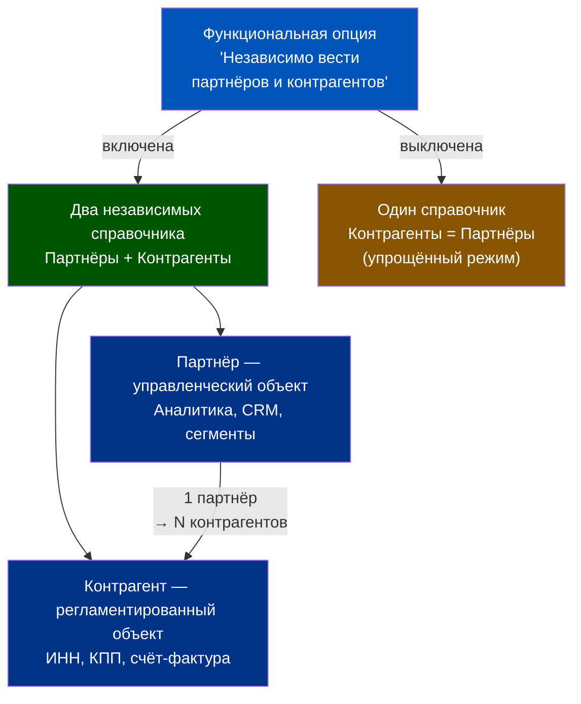
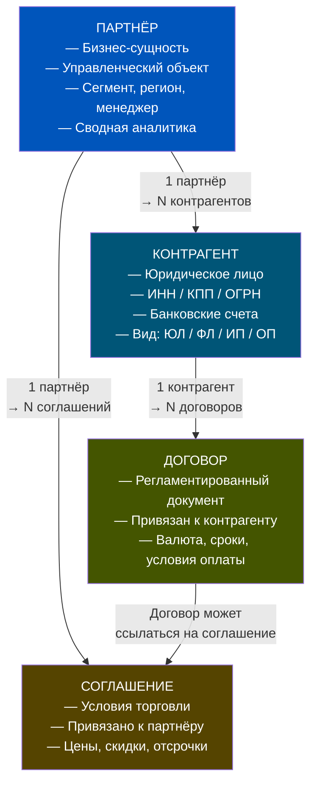
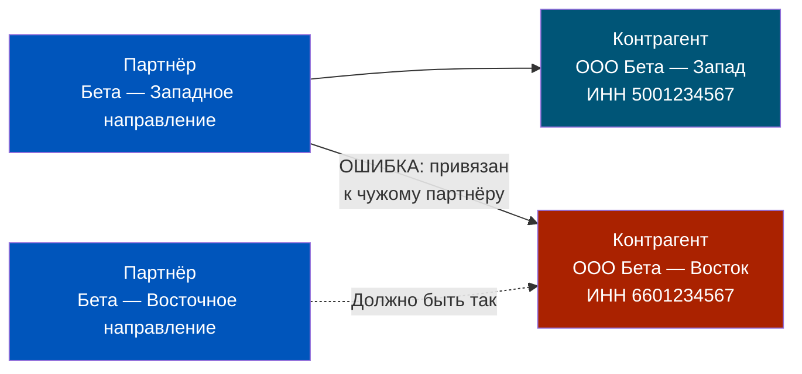
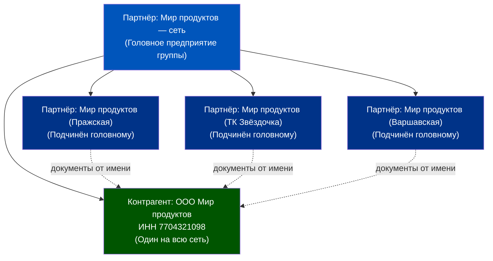
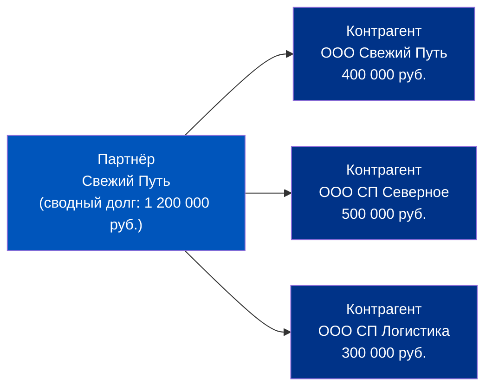

# Партнёры и Контрагенты: Логика взаимодействия с миром

> **Цель урока:** Понять, зачем в 1C:ERP 2.5 существуют два разных объекта — Партнёр и Контрагент, как они связаны между собой, и почему именно эта двухуровневая модель критически важна для Q-commerce с его агрегаторами, сетевыми поставщиками и разветвлёнными холдинговыми структурами.
> **Компетенции:**
> - Объяснять разницу между Партнёром и Контрагентом и выбирать правильный уровень для каждой задачи
> - Структурировать сложных поставщиков: холдинги, сети магазинов, агрегаторы
> - Настраивать связку Партнёр → Контрагент → Договор → Соглашение
> - Читать сводную задолженность по партнёру, не путая управленческий и регламентированный разрезы
> **Время чтения:** ~70 минут

---

## Оглавление

- [[#Часть 1. Один поставщик, три юрлица: детектив у приёмной двери даркстора]]
- [[#Часть 2. Откуда взялись два объекта: история разделения в ERP 2.5]]
- [[#Часть 3. Архитектура: Партнёр → Контрагент → Договор → Соглашение]]
- [[#Часть 4. Ловушки: дубли, неверная привязка и другие классические ошибки]]
- [[#Часть 5. Сеть дарксторов и сетевые поставщики: многие ко многим]]
- [[#Часть 6. Кейс: поставщик-монстр с 15 юрлицами]]
- [[#Часть 7. Глоссарий и FAQ]]

---

## Часть 1. Один поставщик, три юрлица: детектив у приёмной двери даркстора

Вторник, 06:14. Приёмная зона даркстора на Белорусской. Грузовик из распределительного центра «Свежий Путь» только что выгрузил 340 позиций фруктов и овощей. Кладовщик открывает 1C на терминале, находит нужного поставщика — и вот тут начинается детектив.

В базе три записи с похожими названиями:

- «Свежий Путь ООО»
- «Свежий Путь — Северное направление ООО»
- «Свежий Путь Логистика ООО»

Все три — один и тот же партнёр, с которым менеджер по закупкам общается через одного коммерческого директора Сергея Ильича. Но документы приходят от разных юрлиц в зависимости от региона доставки: центральные дарксторы — через головное ООО, северный куст — через «Северное направление», а транспортные услуги — вообще через отдельное юрлицо «Логистика».

Если кладовщик выберет не то юрлицо при приёмке, произойдёт одно из трёх:
1. Счёт-фактура разойдётся с накладной — НДС не зачтётся. Бухгалтер обнаружит это через 2–3 недели.
2. Задолженность зависнет на «не том» контрагенте — сверка с поставщиком покажет расхождение, и Сергей Ильич позвонит с претензией.
3. Автоматическая сверка взаиморасчётов не сработает, потому что платёж ушёл от одного юрлица, а долг числится за другим.

Все три ошибки реальны. Все три случались в российских Q-commerce операциях. И все три решаются одним архитектурным решением, которое заложено в 1C:ERP 2.5: **разделением Партнёра и Контрагента**.

Партнёр — это «Свежий Путь» как бизнес-единица. Один объект, один коммерческий директор, одни переговоры. Контрагент — это конкретное юрлицо с ИНН, КПП, ОГРН, банковским счётом. У одного партнёра может быть 1, 3 или 15 контрагентов. Сводная задолженность и аналитика — на уровне партнёра. Документы и проводки — на уровне контрагента.

Это не просто «удобство». Это фундамент, без которого Q-commerce с его агрегаторами (Яндекс Маркет, Ozon, Самокат), сетевыми поставщиками и разветвлёнными логистическими партнёрами просто не может нормально работать.


---

## Часть 2. Откуда взялись два объекта: история разделения в ERP 2.5

### Управленческий и регламентированный учёт — два языка одной реальности

В ранних версиях 1С (7.7, 8.0) существовал единственный справочник «Контрагенты». Всё было просто: один партнёр — одна запись. Но бизнес усложнялся. Холдинги росли. Один коммерческий партнёр мог работать через 5–10 разных юрлиц, и бухгалтеры начали «размножать» контрагентов: «ООО Рога», «ООО Копыта», «ООО Рога (Север)», «ООО Рога (старый)»...

В итоге в базах появлялись сотни дублей. Аналитика разваливалась: суммарная задолженность по группе компаний не собиралась автоматически, менеджер по продажам не видел, сколько в целом должен ему холдинг «Мебель», потому что часть долгов числилась за одним юрлицом, часть — за другим.

В ERP 2.5 это разрешили архитектурно. Была введена функциональная опция **«Независимо вести партнёров и контрагентов»** (НСИ и администрирование → Настройка НСИ → CRM и маркетинг). При её включении система полностью разделяет два справочника:

| Атрибут | Партнёр | Контрагент |
|---|---|---|
| Природа | Управленческая | Регламентированная |
| ИНН / КПП | Нет | Обязательно |
| Договор | Нет | Да |
| Соглашение | Да | Нет |
| Аналитика продаж | Да | Нет (только через партнёра) |
| Счёт-фактура | Нет | Да |
| Сегментация CRM | Да | Нет |

**Партнёр** — это бизнес-сущность. Тот, с кем вы ведёте переговоры, кому звоните, кого анализируете в CRM. Информация о партнёре носит управленческий характер: регион, сегмент, ответственный менеджер, история взаимодействий.

**Контрагент** — это юридическое лицо (или физическое, или ИП). Тот, чьи реквизиты вы вписываете в счёт-фактуру. Данные регламентированного учёта.



### Когда включать раздельный учёт

Включение опции «Независимо вести партнёров и контрагентов» оправдано, если выполняется хотя бы одно из условий:

1. Среди партнёров есть холдинги или группы компаний (несколько ИНН под одним коммерческим управлением).
2. Нужна CRM-аналитика по партнёру в целом, а не по каждому юрлицу по отдельности.
3. Один партнёр работает через разные юрлица в разных регионах (типичная ситуация для федеральных сетей).
4. Контроль задолженности нужен на уровне группы, а не отдельного юрлица.

Для типичного Q-commerce оператора с агрегаторами и федеральными поставщиками — опция должна быть **включена**. Это не обсуждается.

> Когда опция выключена, справочник «Контрагенты» работает в упрощённом режиме: один контрагент = один партнёр. Для микробизнеса с 10–15 поставщиками это допустимо. Для операции с 200+ поставщиками фреша и 5–7 агрегаторами — катастрофа.

---

## Часть 3. Архитектура: Партнёр → Контрагент → Договор → Соглашение

### Четырёхуровневая иерархия

Работа с деловыми партнёрами в ERP 2.5 строится на четырёх связанных объектах. Каждый уровень отвечает за свой пласт информации.



### Партнёр: управленческий центр

Карточка партнёра — это «досье» на бизнес-единицу. В неё входит:

- **Наименование** — то, как партнёр называется в переговорах (не обязательно совпадает с юридическим).
- **Бизнес-регион** — используется для аналитики продаж/закупок в разрезе географии.
- **Вид взаимодействия** — партнёр может быть одновременно поставщиком, клиентом и конкурентом. Да, именно так: агрегатор Яндекс Маркет — одновременно канал сбыта (клиент) и конкурент по собственному тёмному магазину.
- **Ответственный менеджер** — владелец отношений.
- **Сегмент** — CRM-классификация (крупный поставщик, региональный партнёр, стратегический агрегатор).
- **Иерархия** — партнёра можно включить в группу (холдинг). Холдинг — группа в иерархии, дочерние компании — вложенные партнёры.

Список партнёров находится: НСИ и администрирование → НСИ → Партнёры.

### Контрагент: регламентированный паспорт

Контрагент привязывается к партнёру и содержит юридические реквизиты. **Вид контрагента** определяет состав обязательных полей:

| Вид контрагента | ИНН | КПП | ОГРН | Особенности |
|---|---|---|---|---|
| Юридическое лицо | 10 цифр | 9 цифр | 13 цифр | Стандарт |
| Физическое лицо | 12 цифр | — | — | Паспортные данные |
| ИП | 12 цифр | — | 15 цифр (ОГРНИП) | Статус предпринимателя |
| Обособленное подразделение ЮЛ | = ИНН головной | Уникальный КПП | — | Ссылка на головной контрагент |
| ЮЛ (нерезидент) | Код страны | — | — | Иностранные партнёры |

**Автозаполнение реквизитов**: при указании ИНН система может автоматически получить данные из ЕГРЮЛ/ЕГРИП (при подключённой интернет-поддержке). Заполняются: КПП, краткое наименование, юридический адрес, телефон. Это критически важно: вручную вбитые реквизиты — источник 70–80% ошибок при работе с первичкой.

> Важно: автозаполнение по ИНН работает только для юридических лиц. Данные ИП, физлиц и обособленных подразделений из реестра не загружаются — их придётся вводить вручную.

### Договор: регламентированные рамки сделки

Договор в ERP 2.5 — не просто скан PDF-файла. Это структурированный объект, который:

- Привязывается к **конкретному контрагенту** (юрлицу), а не к партнёру в целом.
- Содержит валюту расчётов, формы оплаты, сроки.
- Является основанием для проводок взаиморасчётов.
- Может иметь статус «действующий» / «закрытый» / «приостановленный».

Один контрагент может иметь несколько договоров: например, один на поставку товаров и отдельный на оказание транспортных услуг.

### Соглашение: управленческие условия торговли

Соглашение — объект на уровне партнёра (не контрагента). Это торговая политика: ценовые условия, скидки, отсрочка платежа, условия возврата. Соглашение не привязано к конкретному ИНН — оно описывает, как мы торгуем с этим партнёром в целом.

Таким образом:
- Договор с ООО «Свежий Путь» регулирует **юридические и финансовые рамки** конкретной сделки.
- Соглашение с партнёром «Свежий Путь» регулирует **коммерческие условия** — скидку 5% от объёма 500 000 руб./мес., отсрочку 14 дней.

Если в документе (заказ поставщику, реализация) нужно выбрать и партнёра, и контрагента — система требует оба. Это не дублирование — это разные уровни описания одной операции.


---

## Часть 4. Ловушки: дубли, неверная привязка и другие классические ошибки

Знание архитектуры — это половина дела. Вторая половина — понимание того, где именно обычно всё идёт не так. За годы внедрений 1C:ERP в ритейле сложился «зоопарк» типовых ошибок при работе со справочником партнёров/контрагентов.

### Ловушка 1. Дубли контрагентов

**Симптом:** В базе есть «ООО Альфа», «Альфа ООО», «ООО АЛЬФА», «ООО Альфа (поставщик)» — и это один и тот же контрагент с ИНН 7712345678.

**Причина:** Разные менеджеры создавали контрагента вручную, не проверяя существующие записи. Или автозаполнение по ИНН не было настроено.

**Последствия:** Задолженность разбита по 4 записям. Сверка с контрагентом показывает расхождение. Акт сверки требует ручной корректировки. В среднем такая «чистка» базы занимает от 40 до 120 часов работы методолога.

**Профилактика:**
- Включить автозаполнение по ИНН (интернет-поддержка).
- Ввести правило: контрагент создаётся только через помощника регистрации нового партнёра с обязательным вводом ИНН.
- Периодически запускать отчёт «Дублирующиеся контрагенты» (по совпадению ИНН).

### Ловушка 2. Контрагент без партнёра (или с «чужим» партнёром)

**Симптом:** Контрагент «ООО Бета — Восток» привязан к партнёру «Бета — Западное направление».

**Причина:** При создании контрагента выбрали не того партнёра из списка (похожие названия), или создали контрагента «напрямую», минуя карточку партнёра.

**Последствия:** Сводная аналитика по партнёру «Бета» некорректна. Часть долгов «висит» не там. Отчёт «Досье партнёра» показывает неполную картину.



### Ловушка 3. Один договор на всё

**Симптом:** У контрагента один-единственный договор «Основной», на который вешаются и поставки, и транспортные услуги, и возвраты.

**Причина:** Нежелание создавать несколько договоров — «и так работает».

**Последствия:** Взаиморасчёты в рамках этого договора превращаются в кашу. Невозможно понять, какая часть долга — за товар, какая — за логистику. Акт сверки выглядит как хаотичный список из 3 000 строк.

**Правило:** Один договор — один вид хозяйственных отношений. Поставка товаров — отдельный договор. Транспортные услуги — отдельный. Аренда оборудования — отдельный.

### Ловушка 4. Соглашение на уровне контрагента вместо партнёра

**Симптом:** Менеджер завёл 3 соглашения об условиях для трёх контрагентов одного холдинга с разными условиями, хотя коммерчески холдинг договорился об единых условиях.

**Причина:** Путаница между «Партнёр» и «Контрагент». Соглашение привязали к контрагенту-юрлицу, а не к партнёру-холдингу.

**Последствие:** Три юрлица холдинга получают разные цены. Переговорные условия не выполняются.

**Правило:** Соглашение — объект партнёра. Именно на партнёра смотрит система при подборе цен в заказе.

### Ловушка 5. КПП обособленного подразделения не зарегистрирован

**Симптом:** При выставлении счёт-фактуры в адрес обособленного подразделения поставщика КПП подразделения нужно вводить вручную каждый раз.

**Причина:** Обособленное подразделение не создано в справочнике контрагентов как отдельная запись вида «Обособленное подразделение ЮЛ».

**Последствие:** Ошибки при вводе КПП. Риск неправомерного зачёта НДС. В рамках Q-commerce с крупными федеральными сетями, имеющими по 50–100 точек (обособленных подразделений), это — регулярная головная боль.

**Решение:** Для каждого обособленного подразделения создать запись в справочнике «Контрагенты» с видом «Обособленное подразделение ЮЛ». Указать ИНН головной организации (совпадает) и уникальный КПП подразделения. После этого в счёт-фактуре КПП будет подставляться автоматически.


---

## Часть 5. Современный контекст: сеть дарксторов и работа с сетевыми поставщиками

### Два сценария «многие ко многим»

В Q-commerce возникают два принципиально разных случая, когда стандартная схема «один партнёр — несколько контрагентов» не до конца описывает реальность.

**Сценарий А: Сеть магазинов — один партнёр, несколько точек, одно юрлицо.**

Поставщик «Мир продуктов» — сеть из 12 точек: «Мир продуктов (Пражская)», «Мир продуктов (ТК Звёздочка)» и т.д. Все 12 точек работают под одним ИНН и одним юрлицом «ООО Мир продуктов», но с каждой точкой нужно вести отдельный учёт запасов, отдельные цены, отдельные условия.

**Решение в ERP 2.5:** Создать иерархию партнёров:



Ключевая особенность: при работе с партнёром «Мир продуктов (Пражская)» необходим доступ также и к головному предприятию «Мир продуктов — сеть». Это требование системы: дочерний партнёр не может оформить документ без видимости родительского контрагента.

Управленческий контроль — по каждой точке отдельно (запасы, цены, задолженность). Регламентированные документы — от имени единственного юрлица ООО «Мир продуктов».

**Сценарий Б: Агрегатор — один партнёр, несколько юрлиц.**

Яндекс Маркет. Для Q-commerce оператора это одновременно:
- Канал продаж (Яндекс.Маркет Технологии — ООО)
- Логистический оператор (Яндекс.Логистика — ООО)
- Рекламная платформа (Яндекс — ООО)
- Финансовый агент (выплаты за заказы)

Три разных ИНН, три разных юрлица, одна коммерческая команда Яндекса. Это классический случай «один партнёр — несколько контрагентов».

### Контроль задолженности в разрезе партнёра

Одно из ключевых преимуществ двухуровневой модели — сводная задолженность. ERP 2.5 позволяет видеть долг по партнёру в целом, суммируя долги по всем его контрагентам.

Отчёт «Досье партнёра» собирает:
- Суммарную дебиторскую/кредиторскую задолженность по всем контрагентам партнёра.
- Разбивку по договорам и контрагентам.
- Контактные данные всех лиц партнёра.
- Историю взаимодействий (при включённом CRM).

Это означает: если у «Свежего Пути» три ООО и суммарный долг перед вами — 1 200 000 руб. (400 000 руб. + 500 000 руб. + 300 000 руб. по трём контрагентам), то в отчёте «Досье партнёра» вы увидите именно 1 200 000 руб. — и сможете позвонить одному Сергею Ильичу с единым требованием.

Без раздельного учёта партнёров и контрагентов такой консолидированный вид был бы невозможен.



### Q-commerce специфика: три типа партнёров и их структуры в ERP

**Поставщики фреша** (молоко, овощи, ягоды) — как правило, малые/средние ИП или ООО. Схема простая: 1 партнёр = 1 контрагент. Но их может быть 80–120 штук. Критично: правильный ИНН с первого раза, иначе НДС при возврате товара не сойдётся.

**Федеральные дистрибьюторы** (алкоголь, бакалея, бытовая химия) — холдинги с региональными ООО. Схема: 1 партнёр = 3–8 контрагентов. Долг и аналитика — на партнёра, документы — на конкретный региональный контрагент.

**Агрегаторы** (Яндекс Маркет, Ozon, Delivery Club) — сложные структуры с разными юрлицами для разных потоков (торговля, логистика, реклама). Схема: 1 партнёр = 2–5 контрагентов. Критично правильно разнести потоки: выручка от продаж — по одному договору с одним контрагентом, логистические расходы — по другому договору с другим контрагентом того же партнёра.

---

## Часть 6. Кейс: поставщик-«монстр» с 15 юрлицами

### Реальная задача

Представьте: ваш Q-commerce операционный директор говорит на планёрке — «Завтра начинаем работать с "АгроМир-Холдинг". Они поставляют нам фреш по всей России. 15 ИНН, 7 регионов, договорились на единые условия — скидка 7% от оборота свыше 2 000 000 руб./мес., отсрочка 21 день».

Ваша задача — правильно завести структуру в ERP 2.5 до того, как придут первые поставки.

### Шаг 1. Создать партнёра-холдинг

В списке «Партнёры» (НСИ → Партнёры) создать группу «АгроМир-Холдинг» с атрибутами:
- Вид взаимодействия: Поставщик
- Бизнес-регион: Федеральный
- Ответственный менеджер: Иванова А.В.
- Сегмент: Стратегический поставщик

Эта группа — «шапка» холдинга. В неё войдут все 15 юрлиц.

### Шаг 2. Создать контрагентов для каждого ИНН

По каждому из 15 юрлиц холдинга создать запись в справочнике «Контрагенты»:
- Вид: Юридическое лицо
- ИНН: заполнить (автозаполнение получит КПП, адрес, наименование из ЕГРЮЛ)
- Привязать к партнёру «АгроМир-Холдинг»

Предположим, что 3 из 15 юрлиц имеют обособленные подразделения с отдельными КПП (склады в других городах). Для каждого такого подразделения создать дополнительный контрагент вида «Обособленное подразделение ЮЛ» с КПП подразделения и ссылкой на головной контрагент.

Итого записей в справочнике «Контрагенты» по одному партнёру:
- 15 юрлиц
- 3 × (в среднем 4 обособленных подразделения) = 12 ОП-контрагентов
- Итого: **27 записей** по одному партнёру-холдингу.

### Шаг 3. Создать договоры

По каждому контрагенту, с которым будет документооборот, — завести договор:
- «Договор поставки №XXX от ДД.ММ.ГГГГ» с указанием валюты (руб.), формы оплаты, срока.
- Для контрагентов, через которых идут только логистические услуги, — отдельный договор «Договор транспортных услуг».

Не нужно создавать договоры для обособленных подразделений, если они не являются самостоятельными юрлицами — документы идут через головной контрагент.

### Шаг 4. Создать соглашение об условиях закупок

На уровне партнёра «АгроМир-Холдинг» создать соглашение:
- Скидка 7% при обороте свыше 2 000 000 руб./мес.
- Отсрочка платежа 21 день
- Валюта: рубли

Это соглашение применяется ко всем контрагентам холдинга автоматически — условия договорились на уровне управляющей компании, и тиражировать их на каждое юрлицо отдельно не нужно.

### Шаг 5. Контроль задолженности

После первых поставок финансовый директор запросит: «Сколько мы должны АгроМир-Холдингу?»

В отчёте «Досье партнёра» по «АгроМир-Холдинг» будет сводная кредиторская задолженность по всем 15 контрагентам. Предположим, что за первый месяц накопился долг:

| Контрагент | Сумма |
|---|---|
| ООО АгроМир-Центр | 780 000 руб. |
| ООО АгроМир-Юг | 450 000 руб. |
| ООО АгроМир-Урал | 320 000 руб. |
| ООО АгроМир-Сибирь | 210 000 руб. |
| Прочие 11 юрлиц | 940 000 руб. |
| **Итого по партнёру** | **2 700 000 руб.** |

Именно эти 2 700 000 руб. будут показаны в верхней строке «Досье партнёра». Детализация по контрагентам — при раскрытии. Условие скидки (оборот свыше 2 000 000 руб.) — выполнено уже в первый месяц.


### Что было бы без разделения Партнёр/Контрагент

Если бы опция «Независимо вести партнёров и контрагентов» была отключена, менеджер был бы вынужден:
- Завести 15 отдельных «контрагентов» без общей шапки.
- На каждого — отдельное соглашение об условиях (15 копий вместо одного).
- При переговорах об изменении скидки — обновить 15 записей вместо одной.
- При запросе «сколько мы должны холдингу?» — вручную суммировать данные по 15 контрагентам.
- При анализе оборота для триггера скидки — вручную агрегировать 15 потоков.

Разница очевидна: раздельный учёт партнёров и контрагентов — это не усложнение, а упрощение работы с любой нетривиальной структурой поставщика или покупателя.

---

## Часть 7. Глоссарий и FAQ

### Глоссарий

**Партнёр** — управленческий объект в справочнике НСИ. Описывает бизнес-единицу, с которой ведётся взаимодействие: поставщик, клиент, конкурент. Может включать несколько контрагентов. Хранит: сегмент, регион, менеджера, соглашения об условиях.

**Контрагент** — регламентированный объект. Описывает юридическое (физическое) лицо с ИНН, КПП, ОГРН и банковскими реквизитами. Основание для первичных документов (счёт-фактура, УПД, ТОРГ-12).

**ИНН** — Идентификационный номер налогоплательщика. 10 цифр для ЮЛ, 12 цифр для ФЛ/ИП. Уникальный идентификатор юрлица в российской налоговой системе.

**КПП** — Код причины постановки на учёт. 9 цифр. Присваивается по каждому месту постановки на налоговый учёт. У обособленного подразделения — свой КПП при совпадающем с головной организацией ИНН.

**ОГРН** — Основной государственный регистрационный номер. 13 цифр для ЮЛ, 15 цифр (ОГРНИП) для ИП.

**Обособленное подразделение (ОП)** — структурное подразделение юрлица, расположенное по иному адресу. Имеет собственный КПП. В справочнике ERP создаётся как отдельный контрагент вида «Обособленное подразделение ЮЛ» с ссылкой на головной контрагент.

**Договор** — объект регламентированного учёта, привязанный к контрагенту. Основание для взаиморасчётов. Содержит валюту, форму и сроки оплаты.

**Соглашение об условиях** — объект управленческого учёта, привязанный к партнёру. Содержит коммерческие условия: цены, скидки, отсрочки. Применяется ко всем контрагентам партнёра.

**Досье партнёра** — отчёт, собирающий сводную информацию по партнёру: задолженность по всем контрагентам, контактные данные, история взаимодействий.

**ЕГРЮЛ / ЕГРИП** — государственные реестры юридических лиц и индивидуальных предпринимателей. Источник для автозаполнения реквизитов контрагентов по ИНН.

**Автозаполнение реквизитов** — функция ERP 2.5, которая по введённому ИНН загружает из ЕГРЮЛ: КПП, краткое наименование, юридический адрес, телефон. Требует подключения интернет-поддержки.

---

### FAQ

**В.: Можно ли у одного партнёра иметь контрагентов с разными ИНН из разных стран?**

О.: Да. Для иностранных юрлиц используется вид контрагента «Юр. лицо (нерезидент)». Вместо ИНН указывается код страны регистрации и регистрационный номер по иностранному реестру. Это актуально для Q-commerce операторов, работающих с международными маркетплейсами или зарубежными поставщиками.

**В.: Если отключить опцию «Независимо вести партнёров и контрагентов» после начала работы — что случится с данными?**

О.: Данные не удалятся, но система вернётся в упрощённый режим: в документах будет отображаться только один реквизит (контрагент или партнёр) в зависимости от вида документа. Сводная аналитика по партнёру перестанет корректно агрегировать данные по нескольким контрагентам. Обратное включение опции восстановит поведение, но исторические документы могут иметь заполненным только один из двух реквизитов.

**В.: Как корректно объединить дубли контрагентов?**

О.: В ERP 2.5 предусмотрен механизм «Объединение дублирующихся элементов» (НСИ → Сервис). Все движения по дублю переносятся на основной контрагент, дубль помечается на удаление. Обязательно — тестирование в копии базы перед выполнением в продуктиве.

**В.: Нужно ли создавать партнёра для физлица-курьера, которому платим за разовую доставку?**

О.: Если курьер является самозанятым с ИНН — да, создать партнёра и контрагента вида «Физическое лицо». Если расчёты ведутся через агрегатор курьерских услуг — создать партнёра-агрегатор с его юрлицом как контрагентом. Разовые физлица без систематических расчётов могут учитываться через упрощённый механизм подотчётных лиц.

**В.: В Q-commerce партнёр-агрегатор (Яндекс Маркет) одновременно является клиентом (платит нам комиссию) и поставщиком (берём у него логистику). Как это отразить?**

О.: В карточке партнёра можно указать несколько видов взаимодействия одновременно: «Клиент» + «Поставщик». Договоры создаются раздельно: один договор (с контрагентом «Яндекс.Маркет Технологии ООО») — на агентские услуги продаж, другой договор (с контрагентом «Яндекс.Логистика ООО») — на транспортировку. Взаиморасчёты ведутся в разрезе каждого договора, но сводная аналитика доступна на уровне партнёра «Яндекс Маркет».

**В.: Как настроить автоматическую проверку лимита задолженности на уровне партнёра?**

О.: В соглашении об условиях закупок/продаж предусмотрен параметр «Кредитный лимит». При его заполнении система будет предупреждать (или запрещать — в зависимости от настройки) создание новых заказов при превышении лимита. Контроль ведётся в разрезе партнёра, суммируя задолженность по всем контрагентам.

---


### Итоговая схема: иерархия партнёров в Q-commerce

```mermaid
graph TD
    P1["Партнёр
«Свежий Путь» (сеть)"] --> C1["Контрагент
Свежий Путь Центр, ИНН 1234567890"]
    P1 --> C2["Контрагент
Свежий Путь Запад, ИНН 9876543210"]
    P1 --> C3["Контрагент
Свежий Путь Юг, ИНН 5555555555"]
    C1 --> D1["Договор #1
Поставка бакалеи"]
    C1 --> D2["Договор #2
Поставка фреш"]
    P1 -.->|"Суммарный долг
1 200 000 руб."| TOTAL["Аналитика
по партнёру"]

    style P1 fill:#0055BB,color:#fff
    style TOTAL fill:#885500,color:#fff

← [[Неделя 2 - День 2 - ГФУ|День 2]] | [[README|Оглавление]] | [[Неделя 2 - День 4 - Ценообразование|День 4]] →
