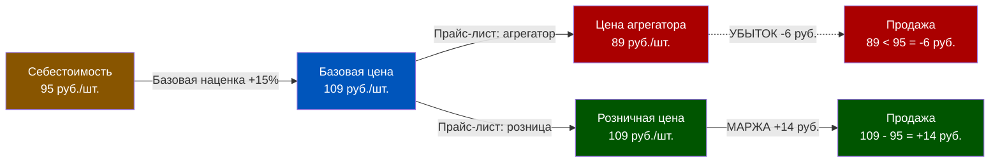
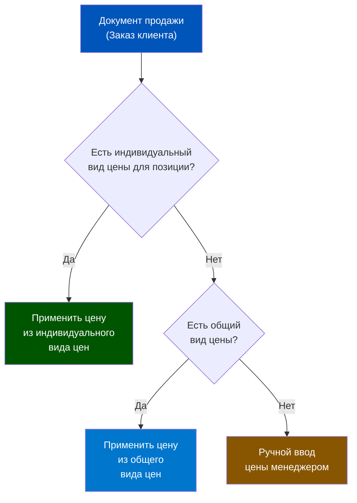
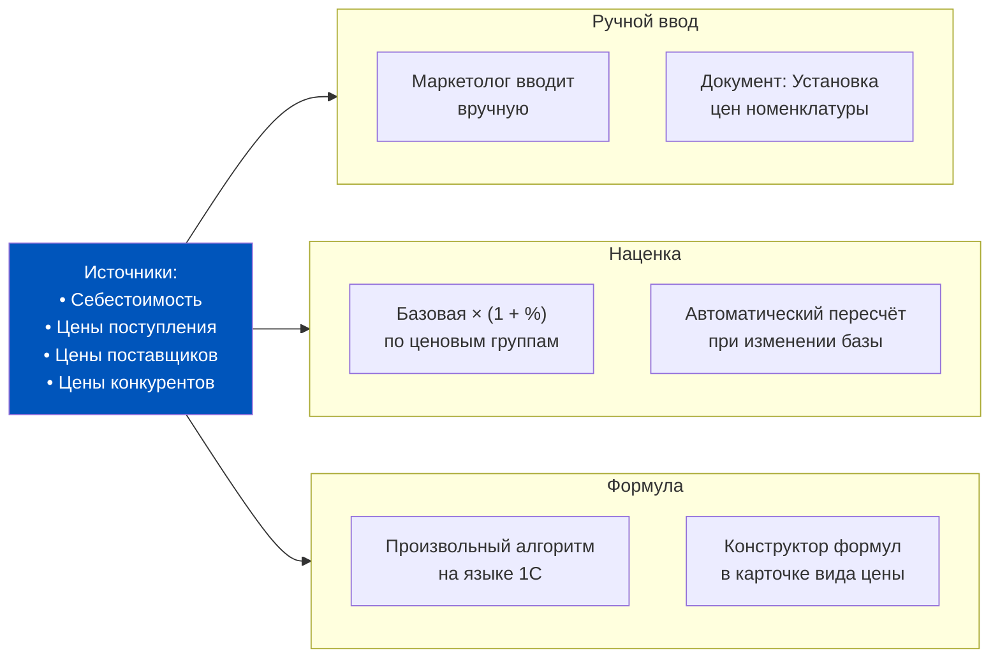
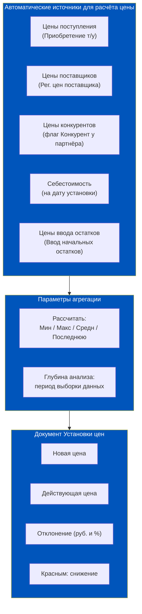
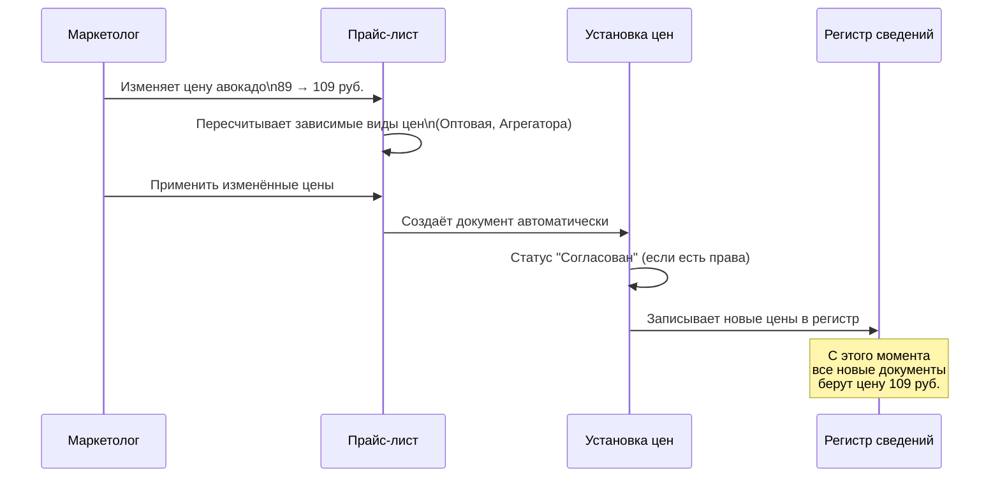
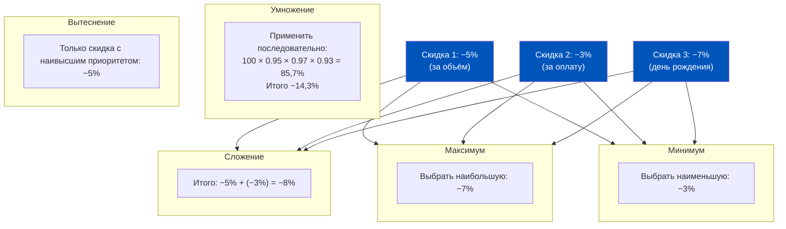
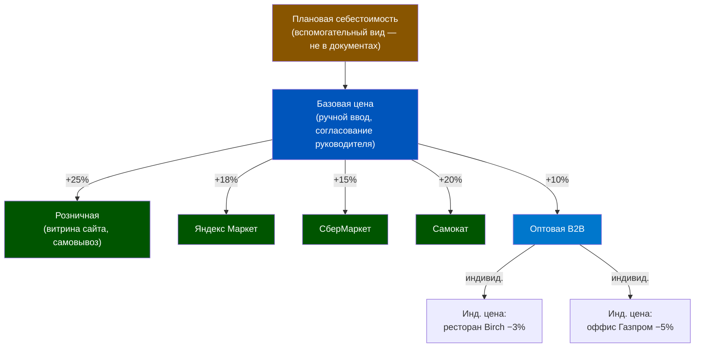

# Ценообразование: Виды цен, Прайс-листы и Скидки

> **Цель урока:** Понять, как 1C:ERP 2.5 хранит и вычисляет цены — от архитектуры видов цен до правил совместного применения скидок. Научиться выстраивать многоуровневую ценовую политику, в которой система сама знает: этому партнёру — 89 рублей, тому — 94, а если он везёт паллетом в воскресенье — минус 7%.
> **Компетенции:**
> - Объяснять разницу между видом цены, прайс-листом и соглашением
> - Настраивать способы расчёта цен: ручной, по наценке, по себестоимости, по формуле
> - Применять правила совместного использования скидок (сложение, умножение, вытеснение)
> - Описывать специфику ценообразования версии 2.5: общие и индивидуальные виды цен
> **Время чтения:** ~80 минут

---

## Оглавление

- [[#Часть 1. 89 рублей против себестоимости 95]]
- [[#Часть 2. Архитектура видов цен в ERP 2.5]]
- [[#Часть 3. Способы расчёта цен: восемь методов]]
- [[#Часть 4. Прайс-лист как рабочее место]]
- [[#Часть 5. Скидки и наценки: классификатор и правила]]
- [[#Часть 6. Кейс: ценовой хаос в Q-commerce и как ERP его устранил]]
- [[#Часть 7. Глоссарий и контрольные вопросы]]

---

## Часть 1. 89 рублей против себестоимости 95

Март. 23:47. В даркстор «Быстрая корзина» приходит заказ через агрегатор: авокадо «Хасс», 2 шт., итого 178 рублей. Сборщик комплектует, курьер доставляет, клиент доволен. Но когда на следующей неделе финансовый директор открывает отчёт о рентабельности, он видит жуткую цифру: маржа по авокадо за март — минус 6,3%.

Он вызывает категорийного менеджера: «Почему мы торгуем авокадо себе в убыток?» Тот краснеет. Оказывается, два месяца назад он вручную исправил цену в одном акционном документе — «временно, только на выходные». Но «временный» прайс зафиксировался как постоянный. И всё это время 1C:ERP заботливо подтягивала именно этот вид цены в каждый новый заказ.

Себестоимость авокадо в тот момент составляла 95 рублей за штуку. Продавали по 89. Дельта — минус 6 рублей с каждой штуки. При объёме 2 400 штук в месяц — минус 14 400 рублей чистых убытков ежемесячно, которые никто не замечал ровно 8 недель.

Эта история — не о рассеянном менеджере. Это о том, что происходит, когда компания не выстраивает правильную архитектуру ценообразования. Ценообразование в 1C:ERP 2.5 — это не просто таблица с числами. Это система правил: какая цена действует для кого, при каких условиях, как она рассчитывается и кто вправе её изменять.

В правильно настроенной системе цена авокадо не может стать убыточной случайно. Потому что менеджер просто не имеет прав изменить базовую цену без согласования. Потому что система знает себестоимость и выдаёт предупреждение, если новая цена ниже допустимого порога. Потому что все «временные акционные цены» привязаны к маркетинговому мероприятию с конкретными датами начала и конца — и после окончания акции система автоматически возвращается к регулярным ценам.

Как выстроена эта система — разбираем сегодня.



---

## Часть 2. Архитектура видов цен в ERP 2.5

### Что такое вид цены

Вид цены в 1C:ERP 2.5 — это именованный столбец прайс-листа с набором правил: как цена рассчитывается, для кого действует, как округляется и каков допустимый коридор отклонения.

Типичный набор видов цен для Q-commerce-платформы выглядит так:

| Вид цены | Назначение | Способ расчёта |
|---|---|---|
| Закупочная | Мониторинг цен поставщиков | По поставщикам |
| Плановая себестоимость | Контроль рентабельности | По себестоимости |
| Базовая | Исходная для расчёта других цен | Ручная |
| Оптовая | Для B2B-клиентов | Наценка на базовую +10% |
| Розничная | Для прямых продаж и витрины | Наценка на базовую +25% |
| Агрегатора | Для Яндекс Маркета, СБЕР Маркета | Наценка на базовую +15% |
| Акционная | Временные промо-цены | Ручная (на период акции) |

Каждый вид цены — отдельная сущность в справочнике. Включение нескольких видов цен активируется функциональной опцией: **НСИ и администрирование → Настройка НСИ и разделов → CRM и маркетинг → Маркетинг → Несколько видов цен**. Если опция отключена, работает единственный вид — «Прайс-лист».

### Ценообразование версии 2.5: общие и индивидуальные виды цен

Версия 2.5 ERP ввела принципиальное разделение видов цен по предназначению.

**Общий вид цены** — стандартный вид, работающий для всех объектов: соглашений, партнёров, форматов магазинов, складов. Именно его указывают в типовых соглашениях как базовый.

**Индивидуальный вид цены** — уточняет общий для конкретного объекта. Может содержать цены только на часть номенклатуры (уточняющий). При совместном применении с общим видом — всегда имеет приоритет.

Индивидуальный вид цены можно задать для:
- Соглашения с клиентом
- Склада (розничного магазина или даркстора)
- Формата магазинов
- Конкретного партнёра

**Приоритет при определении цены** работает по принципу: от конкретного к общему.



### Статус вида цены

Каждый вид цены имеет статус:
- **Действует** — используется в документах
- **Не действует** — скрыт из выбора, исторические данные сохраняются

Правило: если вид цены перестаёт использоваться, ему не присваивают статус «Не действует» мгновенно — сначала нужно убедиться, что все открытые заказы и соглашения уже не ссылаются на него.

### Вспомогательный вид цены

Особая роль: **вспомогательный вид** для расчёта других цен. Значения таких цен фиксируются только в документе «Установка цен номенклатуры», но не записываются в регистры сведений. В торговых документах такой вид цены выбрать невозможно. Используется как промежуточная переменная в сложных формульных расчётах.

Пример: «Средняя рыночная» — вспомогательный вид цены, который агрегирует данные конкурентов. На его основе рассчитывается «Рекомендованная розничная» — уже полноценный вид цены.

---

## Часть 3. Способы расчёта цен: восемь методов

Для каждого вида цены обязательно указывается способ задания. В 1C:ERP 2.5 предусмотрено восемь вариантов.

### Способ 1: Ручное назначение

Цену вводит пользователь вручную в момент актуализации прайс-листа через документ «Установка цен номенклатуры». Применяется для базовых цен, где нет автоматического источника — например, для цен на уникальные позиции или при начальной загрузке системы.

**Для Q-commerce:** Часто используется для сезонных позиций — цена на клубнику в июне и клубнику в январе принципиально разная, и алгоритм не может это учесть.

### Способ 2: Наценка на другой вид цен

Цена рассчитывается автоматически как базовая цена × (1 + наценка). Это самый распространённый способ для производных видов цен.

```
Розничная = Базовая × 1,25
Оптовая = Базовая × 1,10
Дилерская = min(Средняя рынка, Оптовая)
```

Можно уточнить наценку по ценовым группам — например, для молочной продукции наценка 18%, для алкоголя 30%, для свежей зелени 45%.

### Способ 3: Наценка на цену поступления

Для расчёта берутся цены документов поступления и добавляется обязательная наценка. Параметр «Глубина анализа» определяет период, за который анализируются поступления — чтобы не использовать устаревшие данные.

**Типичный параметр «Рассчитать»:** минимальная / максимальная / средняя / последняя из цен нескольких поступлений.

### Способ 4: Наценка на цену ввода остатков

Цена рассчитывается как наценка на цену, зафиксированную при вводе начальных остатков номенклатуры. Применяется в ситуациях, когда компания переходит на ERP и ей нужно сформировать начальные цены на основе фактических учётных данных по остаткам, а не по документам поступления.

**Для Q-commerce:** Полезен при запуске новой торговой точки — цена ввода остатков стартового стока становится базой для автоматического расчёта розничных цен. Позволяет избежать ручного ввода прайса для сотен позиций.

### Способ 5: По себестоимости

В качестве цены используется плановая или фактическая себестоимость, рассчитанная на дату установки. Включает или не включает дополнительные расходы.

Применение: вид цены «Плановая себестоимость» нужен не для продажи, а для контроля. Менеджер видит: цена продажи — 89 руб., себестоимость — 95 руб., отклонение — красным цветом. Сигнал: стоп, подожди.

### Способ 6: По поставщикам

Берутся последние цены поставщиков, зафиксированные документом «Регистрация цен поставщика» или автоматически при проведении «Заказа поставщику». В качестве поставщиков — партнёры с флагом «Поставщик».

Позволяет мониторить, как меняются закупочные цены, и автоматически пересчитывать продажные при изменении закупочных.

### Способ 7: По конкурентам

Аналогично п.5, но источник — «Регистрация цен поставщика» для партнёров с флагом «Конкурент». Используется для мониторинга рынка и автоматической подстройки цен «не выше конкурента».

### Способ 8: Произвольная формула

Цена вычисляется по формуле, написанной на языке 1C:Предприятие или через конструктор формул. Примеры:

```
МаксЦенаПродажи = Розничная * 1.05
ДилерскаяCена = Мин(СредняяРынка, Оптовая)
АкционнаяCена = Базовая * 0.85
```

Алгоритм расчёта можно задать как для вида цены в целом, так и уточнить для каждой ценовой группы.



### Правила округления

Для каждого вида цены настраиваются правила округления по диапазонам:

| Диапазон цены | Правило округления |
|---|---|
| До 10 руб. | До копеек |
| 10–100 руб. | До 0,50 руб. |
| 100–10 000 руб. | До целых рублей |
| Свыше 10 000 руб. | До 10 руб., минус 8 руб. (психологическое ценообразование: 10 492 вместо 10 500) |

Конструктор округления позволяет проверить, как будет выглядеть конкретная цена после применения правил.

### Порог срабатывания

Для каждого вида цены можно настроить порог изменения — при регистрации новых цен система будет предупреждать, если отклонение превышает допустимый процент. Отдельно для роста и снижения цены. Детализация по ценовым группам.

Пример: Порог 3% для группы «Фреш». Если поставщик поднял цену на авокадо на 2,8% — система не создаст новый документ Установки цен, цена останется прежней (минимальное колебание «шума»). Если поднял на 5% — система создаст документ и предложит пересчитать продажные цены.

После расчёта новых цен строки с товарами, по которым цены не изменились (не превысили порог), можно удалить одной командой: **Изменить строки → Удалить строки без изменения**. Это ускоряет работу при массовом пересчёте прайс-листа из сотен позиций.

### Автоматическая установка цен по документам поставки

Каждый вид цены может иметь флаг **«Устанавливать цену по документам поставки»**. Если флаг установлен, то при проведении документа «Приобретение товаров и услуг» система автоматически создаст документ «Установка цен номенклатуры» и включит туда этот вид цены — без участия маркетолога.

Для Q-commerce это особенно ценно при работе с фреш-категорией: цены закупки меняются ежедневно, и автоматическое создание документа установки цен гарантирует, что продажные цены будут актуализированы сразу после проведения приёмки, а не через два дня, когда маркетолог «дойдёт до прайс-листа».

### Отбор по номенклатуре для вида цены и режим запрета

В карточке вида цены можно настроить предопределённый отбор позиций — только те товары, для которых имеет смысл этот вид цены. Отбор задаётся по реквизитам номенклатуры, характеристикам или сегменту.

Дополнительный режим: **«Запретить установку цен за пределами отбора»** — при его включении цены, установленные на номенклатуру, не входящую в отбор, будут автоматически очищаться. Это страховка от ситуации, когда маркетолог случайно устанавливает «дилерскую цену» на позиции, которые не предназначены для дилерского канала.

При загрузке позиций в документ «Установка цен номенклатуры» для вида цены с установленным отбором используется команда **Изменить строки → Добавить товары по отбору видов цен** — загружаются только позиции, подходящие под условия отбора.

### Девятый способ: Произвольный запрос к данным ИБ

Помимо восьми описанных выше методов, существует девятый: **«Произвольный запрос к данным информационной базы»**. Цена рассчитывается по алгоритму, написанному с использованием стандартных средств системы компоновки данных (СКД). Источником могут быть любые данные базы — цены конкурентов, поставщиков, поступления, себестоимость, остатки, кастомные таблицы.

Агрегирование рыночных цен (минимальная, максимальная или средняя из цен нескольких конкурентов или поставщиков) рассматривается как частный случай этого метода.

Для Q-commerce: если нужно автоматически устанавливать цену «не выше среднего из трёх конкурентов и не ниже себестоимости × 1,15» — это реализуется именно через произвольный запрос к ИБ. Стандартный конструктор формул здесь недостаточен — нужна СКД.



---

## Часть 4. Прайс-лист как рабочее место

### Цены (прайс-лист) — рабочее место маркетолога

Главное место для работы с ценами: **CRM и маркетинг → Цены и скидки → Цены (прайс-лист)**.

Здесь маркетолог видит все виды цен по всей номенклатуре в виде таблицы. Каждая строка — один SKU, каждый столбец — один вид цены. Это буквально прайс-лист компании в реальном времени.

Возможности рабочего места:
- Формирование прайс-листа с отбором по любым реквизитам номенклатуры
- Ручное изменение цен прямо в ячейках таблицы
- Групповое изменение на процент или на сумму (панель редактирования)
- Просмотр зависимых и влияющих цен — если изменить «Базовую», система подсветит все производные
- История изменения цен для сравнения

### Документ «Установка цен номенклатуры»

Все зафиксированные изменения цен сохраняются через документ **«Установка цен номенклатуры»**. Это финальный регистрирующий шаг.

Документ показывает:
- Новую цену (колонка «Цена»)
- Действующую цену (колонка «Действующая цена»)
- Отклонение в рублях и процентах
- Снижение цены — красным, с минусом

Статус документа зависит от прав пользователя:
- Маркетолог с правом «Установка цен без согласования» — документ сразу в статусе «Согласован»
- Остальные сотрудники — статус «Не согласован», нужен бизнес-процесс согласования



### Временные (акционные) цены

Цены можно зарегистрировать не «с даты», а «на период» — привязав к маркетинговому мероприятию. После окончания периода система автоматически возвращается к регулярной цене.

Пример:
- Регулярная цена авокадо с 01.06: 109 руб.
- Акционная цена 16.06–18.06 (выходные): 89 руб. (привязана к акции «Летняя скидка»)
- С 19.06: снова 109 руб. — автоматически, без участия менеджера

Это ключевой механизм против проблемы из начального кейса: «временная» цена не может остаться навсегда, потому что у неё есть дата окончания.

---

## Часть 5. Скидки и наценки: классификатор и правила

### Архитектура скидок

Скидки и наценки — это второй уровень ценообразования, работающий поверх прайс-листных цен. Если виды цен определяют «какая цена действует для этого вида клиентов», то скидки отвечают: «какое дополнительное изменение применяется при выполнении конкретного условия».

Классификатор скидок: **CRM и маркетинг → Скидки (наценки)**.

Скидки объединяются в группы. Для каждой группы — своё правило совместного применения.

### Типы скидок

| Тип | Описание |
|---|---|
| Процентная | Снижение цены на N% |
| Суммовая на документ | Фиксированная сумма, распределяется по строкам |
| Суммовая на строку | Фиксированная сумма применяется к каждой строке отдельно |
| Скидка количеством | Подарочный тот же товар (купи 4 — получи 5) |
| Подарок | При покупке A в подарок выдаётся B |
| Начисление бонусов | Баллы в программе лояльности |
| Выдача сообщения | Напоминание менеджеру о выдаче карты лояльности |
| Округление суммы документа | Финальное округление после всех скидок |

Знак значения:
- Положительное значение (+) → скидка (цена снижается)
- Отрицательное значение (−) → наценка (цена повышается)

### Условия предоставления скидки

Скидка срабатывает только при выполнении условий. Ключевые типовые условия:

| Условие | Пример применения |
|---|---|
| За время продажи | Скидка 10% по будням с 9:00 до 12:00 |
| За форму оплаты | Наценка 2% при оплате наличными |
| За разовый объём | Скидка 5% при заказе на сумму > 5 000 руб. |
| За накопленный объём | Скидка 7% при накопленных покупках > 50 000 руб. за квартал |
| За день рождения | Скидка 15% за 3 дня до и 3 дня после дня рождения |
| Вхождение партнёра в сегмент | Скидка 8% для партнёров из сегмента «Ресторанный бизнес» |
| За наличие карты лояльности | Скидка 3% по «Золотой» карте |

Условия проверяются последовательно. Если одно не выполнено — остальные не проверяются.

### Правила совместного применения

Когда несколько скидок срабатывают одновременно — система применяет одно из пяти правил:



**Практическое правило для Q-commerce:** Для промо-скидок обычно используется «Вытеснение» внутри каждой группы + «Сложение» между группами. Это означает: внутри группы «Акции» применяется только самая выгодная акция, но скидка по карте лояльности добавляется сверху.

### Ограничение действия скидки по номенклатуре

Скидку можно ограничить конкретным набором позиций:
- **Любая номенклатура** — без ограничений
- **Номенклатура из списка** — только конкретные SKU, с возможностью установить период для каждого
- **Номенклатура из сегмента** — все позиции, входящие в ценовой сегмент
- **Номенклатура не из сегмента** — всё кроме указанного сегмента
- **По отбору** — позиции, подходящие под параметры (например: срок годности истекает через 3 дня)

Последний вариант особенно актуален для свежей продукции: автоматическая скидка 30% на позиции с датой годности T+3 позволяет сократить списания.

### Максимальный процент скидки для вида цены

Для каждого вида цены можно задать максимально допустимый процент ручной скидки, которую менеджер вправе предоставить без согласования. Детализируется по ценовым группам.

Пример: Менеджер вправе дать ручную скидку до 5% по любой позиции. Скидка сверх 5% — только после согласования с руководителем отдела продаж. Это контролируется на уровне прав 1C, а не «договорённостей».

---

## Часть 6. Кейс: ценовой хаос в Q-commerce и как ERP его устранил

### Ситуация: даркстор «Город в коробке»

Московский даркстор «Город в коробке» работал на рынке Q-commerce 14 месяцев до внедрения 1C:ERP. За это время накопился типичный «органически выросший» ценовой хаос:

- **3 агрегатора** (Яндекс Маркет, СберМаркет, Самокат) — у каждого договорённость о «немного другой цене»
- **B2B-клиенты** (офисы, рестораны) — 11 индивидуальных прайс-листов в Google Sheets
- **Акции** — маркетолог менял цены вручную в системе накануне выходных, иногда забывал вернуть обратно
- **Закупочные колебания** — цены на фреш менялись дважды в неделю, продажные цены не успевали

Результат: в конкретный день аудитор насчитал 7 активных «версий» прайс-листа. Три разных сотрудника, спрошенные о цене на клубнику, назвали три разные цифры: 189, 199 и 219 рублей. Все три были «правильными» — для разных контекстов, о которых никто не предупреждал.

### Решение: иерархия видов цен

После внедрения ERP выстроили следующую архитектуру:



Ключевые правила новой архитектуры:

1. **Базовую цену** может изменить только маркетолог, и только через документ с согласованием
2. **Производные цены** (Яндекс Маркет, Розничная и др.) пересчитываются автоматически при изменении базовой — менеджер никогда не трогает их вручную
3. **Акционные цены** всегда привязаны к маркетинговому мероприятию с датами — «вечных» акций не бывает
4. **Индивидуальные цены** для ресторанов и офисов — через индивидуальный вид цены в соглашении, не через отдельный Google Sheet

### Итоговые цифры после 3 месяцев работы

| Метрика | До ERP | После ERP |
|---|---|---|
| Версий прайс-листа | 7 | 1 (с производными) |
| Время обновления цен при изменении закупочной | 2–3 дня (ручной обход) | < 30 минут (автоматический пересчёт) |
| Случаев продажи ниже себестоимости | 14 за квартал | 0 |
| Ручных исправлений цен менеджерами | ~180/мес. | < 5/мес. (только согласованные исключения) |
| Маржа по фреш-категории | 8,3% | 14,1% |

Рост маржи с 8,3% до 14,1% — это не потому что компания стала «жаднее». Это потому что перестали терять деньги на невидимых убытках.

---

## Часть 7. Глоссарий и контрольные вопросы

### Глоссарий

**Вид цены** — именованный столбец прайс-листа с правилами расчёта, округления и допустимых отклонений.

**Общий вид цены** — применяется ко всем объектам без индивидуальных настроек.

**Индивидуальный вид цены** — уточняет общий для конкретного соглашения, партнёра, склада или формата магазина. Имеет приоритет над общим.

**Прайс-лист** — рабочее место маркетолога: таблица всех видов цен по всей номенклатуре.

**Установка цен номенклатуры** — документ, фиксирующий изменение цен в регистрах сведений. Требует согласования для пользователей без соответствующего права.

**Ценовая группа** — классификатор номенклатуры для дифференциации наценок и скидок. Одна позиция может принадлежать только одной ценовой группе.

**Вспомогательная цена** — вид цены, используемый только как промежуточная переменная в расчётах. В торговых документах не выбирается, в регистры не записывается.

**Классификатор скидок** — иерархический справочник скидок и наценок с условиями применения и правилами совместного использования.

**Вытеснение** — правило совместного применения: из всех активных скидок группы берётся только та, что имеет наивысший приоритет.

**Умножение** — правило совместного применения: скидки применяются последовательно, каждая следующая считается от суммы после предыдущей.

**Порог срабатывания** — минимальный процент изменения цены, при котором регистрируется новый документ Установки цен.

**Временная (акционная) цена** — цена, привязанная к маркетинговому мероприятию с датой начала и конца. После окончания мероприятия система автоматически возвращает регулярную цену.

### Контрольные вопросы

1. Чем отличается общий вид цены от индивидуального? Какой из них имеет приоритет?

2. Вид цены настроен способом «Наценка на другой вид цен» с базовой ценой «Закупочная» и наценкой +20%. Закупочная цена кофе изменилась с 400 до 460 рублей. Какой будет новая цена продажи?

3. Маркетолог хочет установить скидку 25% на все позиции с истекающим сроком годности (T+2 дня). Какой вариант ограничения действия скидки по номенклатуре нужно выбрать?

4. Для вас важно, чтобы при одновременном выполнении трёх скидок к клиенту применялась только наибольшая. Какое правило совместного применения нужно задать для группы?

5. Почему для мониторинга рентабельности лучше использовать вспомогательный вид цены «Плановая себестоимость», а не обычный?

6. Категорийный менеджер вручную снизил цену авокадо в документе Заказ клиента. Через день он снова снизил её в другом заказе. Какой механизм в ERP позволит руководителю увидеть эти изменения и ограничить полномочия менеджера?

### Связанные темы

- [[Неделя 2 - День 5 - Соглашения]] — как виды цен применяются в соглашениях с клиентами
- [[Неделя 2 - День 3 - Партнёры и контрагенты]] — сегменты партнёров как условие скидок
- [[Неделя 3 - День 1 - Закупки]] — регистрация цен поставщиков как источник для расчёта цен продажи

---

← [[Неделя 2 - День 3 - Партнёры и контрагенты|← День 3. Партнёры и контрагенты]] | [[1c_erp_qcom/README|Оглавление]] | [[Неделя 2 - День 5 - Соглашения|День 5. Соглашения →]]
