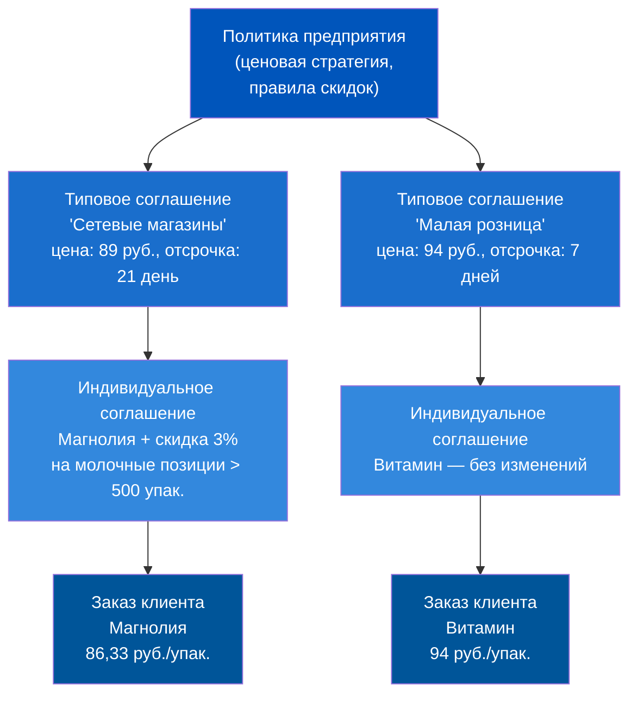
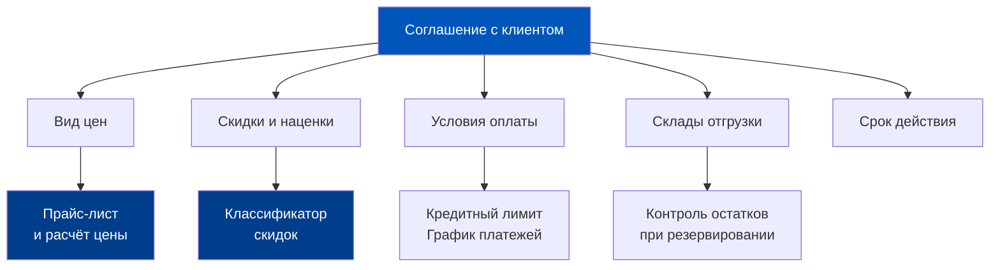
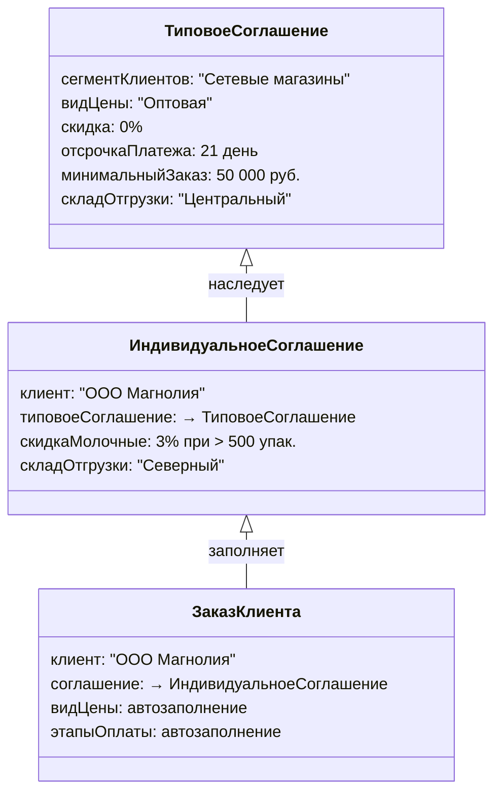
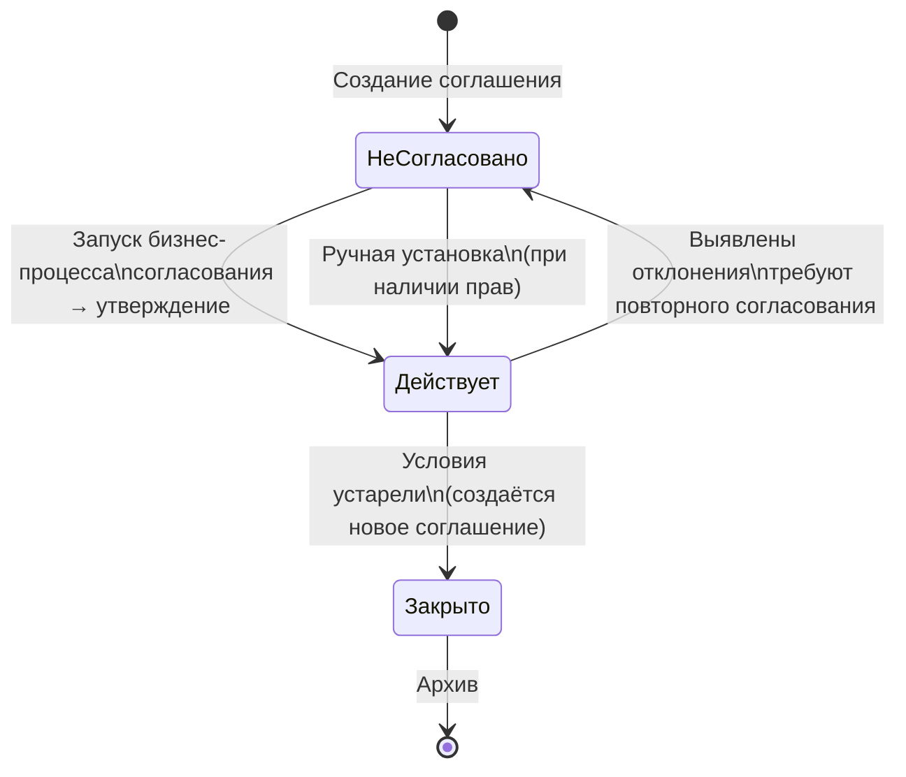
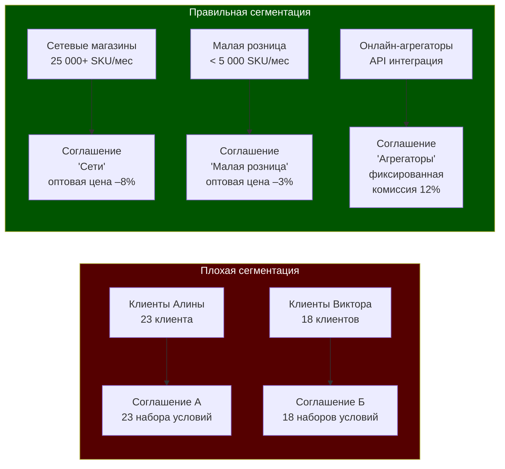
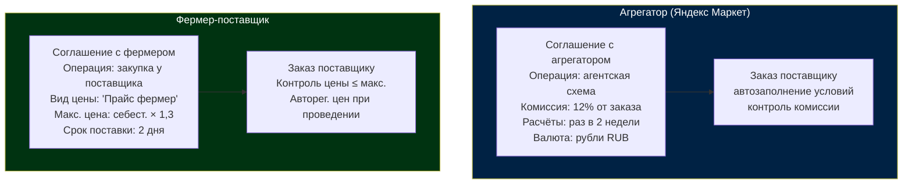
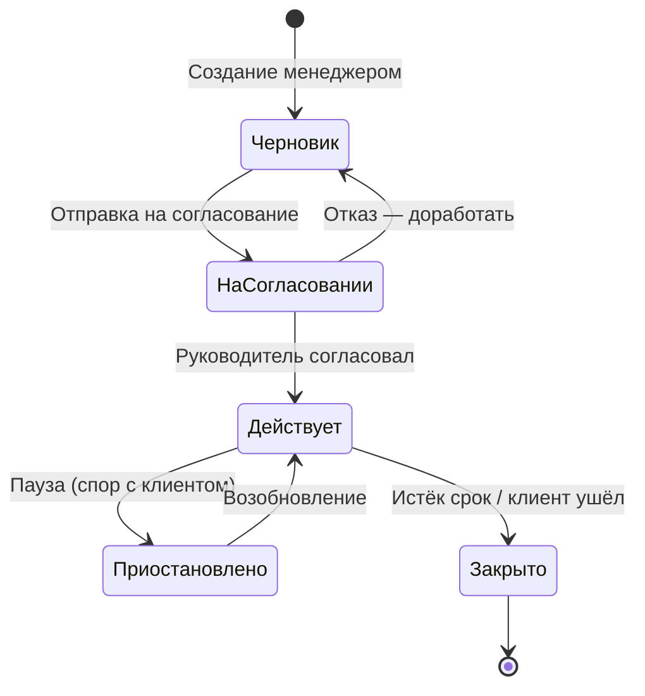

# Соглашения и Условия продаж: Правила игры в системе

> **Цель урока:** Понять, чем соглашение отличается от договора, как устроена иерархия типовых и индивидуальных соглашений в 1C:ERP 2.5, и почему грамотная настройка соглашений — это разница между управляемой ценовой политикой и хаосом из 50 «ручных» исключений.
> **Компетенции:**
> - Объяснять разницу между соглашением, договором и правилами продаж в ERP
> - Выстраивать иерархию: типовое соглашение — индивидуальное соглашение — заказ
> - Описывать workflow согласования соглашений с клиентами и с поставщиками
> - Применять логику соглашений к специфике Q-commerce: агрегаторы, фермерские поставщики
> **Время чтения:** ~80 минут

---

## Оглавление

- [[#Часть 1. Два заказа, один товар, разные цены]]
- [[#Часть 2. Зачем соглашение если есть договор]]
- [[#Часть 3. Архитектура соглашений в ERP 2.5]]
- [[#Часть 4. Ловушки высокообъёмной торговли]]
- [[#Часть 5. Соглашения с поставщиками: другая сторона стола]]
- [[#Часть 6. Кейс: 50 индивидуальных соглашений против управляемости]]
- [[#Часть 7. Глоссарий и FAQ]]

---

## Часть 1. Два заказа, один товар, разные цены

Представьте утро в отделе продаж крупного дистрибьютора молочной продукции. Менеджер Алина оформляет два заказа на творог «Домашний» 9%, 200 г. Одному клиенту — сети «Магнолия» — система выставляет цену 89 руб./упаковка. Второму — небольшой аптечной сети «Витамин» — 94 руб./упаковка. Оба клиента видят одинаковый артикул в прайсе, оба находятся в одном городе, оба работают по безналичному расчёту.

Алина не трогала цены вручную. Она не ошиблась. Система сама подставила разные числа. Это произошло за 3 секунды — ровно столько нужно 1C:ERP 2.5, чтобы найти действующее соглашение для клиента, извлечь из него вид цены и применить его к каждой позиции заказа.

Через час к Алине подходит логист Виктор: «Почему у "Магнолии" отсрочка платежа 21 день, а у "Витамина" всего 7?» Алина пожимает плечами. Она просто оформляла заказы — условия заполнились автоматически.

Это не магия. Это соглашения об условиях продаж.

Именно в соглашениях записаны ответы на все вопросы, которые кажутся «договорённостями по телефону»: какая цена действует для этого клиента? какая скидка? в какой валюте считать? как делить оплату — предоплата или постоплата? с какого склада отгружать? На каждый из этих вопросов система должна иметь однозначный ответ, не требующий ручного ввода менеджера и не зависящий от его памяти.

Но откуда берётся эта разница? Как система «знает», что «Магнолия» — это 89 рублей и 21 день, а «Витамин» — это 94 рубля и 7 дней?

Ответ в архитектурном решении, которое разработчики 1C:ERP 2.5 называют «соглашением с клиентом». Оно стоит между ценовой политикой предприятия и конкретным документом продажи — как переводчик между языком бизнеса и языком транзакций.

Но самое важное в этой истории — даже не разные цены и отсрочки. Важно то, что и Алина, и Виктор получили правильные ответы без единого звонка руководителю. Система знает — потому что правила зафиксированы. Это и есть принципиальное отличие зрелой ERP-системы от Excel с прайсами: не менеджер помнит условия, а система их хранит, применяет и контролирует.

Чтобы разобраться в этой архитектуре, нужно сначала ответить на вопрос, который путает большинство новичков в ERP: зачем вообще нужно соглашение, если у каждого клиента уже есть договор?

---

## Часть 2. Зачем соглашение если есть договор

### Две разные правовые природы

В юридической практике договор — это документ с подписями и печатями, который регулирует права и обязанности сторон. Он отвечает на вопросы: кто кому должен деньги? что происходит при нарушении условий? какой суд разбирает споры?

Соглашение в 1C:ERP 2.5 — принципиально другая сущность. Согласно документации ИТС, «Соглашение об условиях продаж отражает управленческий (не регламентированный) характер взаимоотношений между организацией и покупателем». Это не юридический документ — это операционные правила игры.

Разница не семантическая. Она архитектурная.

Договор может действовать 3 года. За эти 3 года ценовые условия с клиентом могут меняться 12 раз — раз в квартал, по сезонным коэффициентам. Каждый раз переподписывать договор невозможно. Для этого и существует соглашение: оно живёт отдельно от договора и может обновляться независимо.

Более того, согласно ИТС: «Между договорами и соглашениями нет прямой взаимосвязи. В рамках одного договора можно оформлять документы по различным соглашениям, и наоборот». Один клиент, один договор, но летом он работает по «Летнему соглашению» с усиленными скидками на прохладительные напитки, а зимой — по «Зимнему соглашению» с другим ассортиментным фокусом.

### Что фиксирует соглашение

Соглашение — это четыре группы условий, которые автоматически «перетекают» в каждый документ продажи:

**Ценовые условия** — какой вид цен применяется к клиенту (оптовая, дилерская, дистрибьюторская), какие скидки и надбавки действуют, в какой валюте указаны цены.

**Финансовые условия** — валюта взаиморасчётов (рубли, доллары, евро), детализация расчётов (по заказам или по накладным), график оплаты (предоплата 30% + постоплата 70% через 14 дней), минимальная сумма заказа.

**Логистические условия** — с какого склада производится отгрузка, каков плановый срок поставки.

**Прочие условия** — нужен ли договор при оформлении документов, особые параметры работы с тарой.

### Обязательность и контроль

Критическая деталь, которую часто упускают при первом знакомстве с системой: «Указание соглашения с клиентом в документах продажи является обязательным». Не рекомендательным — обязательным. Без соглашения заказ клиента не проведёт обычный менеджер.

Это означает, что соглашение — не просто удобный шаблон. Это точка контроля. Когда менеджер оформляет заказ с ценой ниже зафиксированной в соглашении, система не молчит. Она требует согласования. Именно это делает соглашение оружием управляемости, а не просто справочником.

Контроль условий выполняется при записи и проведении двух ключевых документов: «Заказ клиента» и «Реализация товаров и услуг». Это означает, что попытка «проскочить» с нестандартной ценой при создании реализации — тоже заблокирована.

При отклонении условий от зафиксированных в соглашении, менеджер обязан провести заказ в статусе «На согласовании» и запустить бизнес-процесс «Согласование заказа клиента». Исключение: пользователи с ролью «Отклонение от условий продажи» или с полными правами могут проводить документы напрямую. Но это право должно быть строго регламентировано — иначе соглашения превращаются в формальность.

---

## Часть 3. Архитектура соглашений в ERP 2.5

### Два режима: типовое и индивидуальное

1C:ERP 2.5 предлагает два принципиально разных инструмента для работы с условиями продаж, и выбор между ними — это стратегическое решение, а не техническое.

**Типовое соглашение** создаётся для сегмента клиентов. Не для конкретного «ООО Магнолия», а для всего сегмента «Сетевые магазины» или «Дилеры Поволжья». Суть в том, что когда предприятие меняет условия для целого сегмента — достаточно изменить одно типовое соглашение. Все 47 клиентов из сегмента «Дилеры» автоматически получат новые условия. Либо — другой способ управления — клиент переводится в другой сегмент, и его условия меняются мгновенно.

**Индивидуальное соглашение** создаётся для конкретного клиента. Оно может существовать самостоятельно или «наследовать» условия от типового соглашения, добавляя или уточняя их. Если клиент «Витамин» получает особую скидку 5% на витаминные группы товаров — это фиксируется в индивидуальном соглашении поверх типовых условий.

Архитектурный принцип здесь схож с объектно-ориентированным программированием: типовое соглашение — это класс, индивидуальное — его экземпляр с переопределёнными свойствами.

### Как система выбирает нужное соглашение

При выборе варианта использования соглашений (путь: НСИ и администрирование — Настройка НСИ и разделов — Продажи — Оптовые продажи) доступны четыре режима:

1. **Типовые и индивидуальные соглашения** — наиболее гибкий вариант, позволяющий использовать оба типа.
2. **Только типовые соглашения** — унифицированный подход, каждый клиент обязательно принадлежит сегменту.
3. **Только индивидуальные соглашения** — каждое соглашение уникально, нет наследования от типовых.
4. **Не использовать** — соглашения отключены, цены и графики оплаты определяются непосредственно в документе.

Последний режим — «Не использовать» — это тот самый случай, когда в системе «нет правил». Цены вводятся вручную в каждом заказе. Для малого бизнеса с 10 клиентами это допустимо. Для Q-commerce с 30 000 заказов в день — это катастрофа.

### Автозаполнение документов

Когда менеджер указывает соглашение в заказе клиента, система немедленно подставляет из него все ключевые реквизиты: хозяйственную операцию, организацию, склад, правила оплаты (этапы и сроки), вид цены и признак «Цена включает НДС». Менеджер не вводит ничего вручную — 6–8 полей заполняются автоматически за 1 действие.

Это не только удобство. Это контроль. Если менеджер попытается изменить вид цены или склад прямо в документе — система проверит, входит ли новое значение в допустимый диапазон условий соглашения. Если нет — документ уйдёт «На согласование» или будет отклонён (в зависимости от прав пользователя).

### Статусы жизненного цикла соглашения

Каждое соглашение в ERP проходит через три статуса:

- **Не согласовано** — соглашение создано, но ещё не утверждено. В этом статусе оно невидимо для документов продажи: менеджер не сможет выбрать его при оформлении заказа.
- **Действует** — рабочий статус. Устанавливается по умолчанию при создании. Именно это соглашение подставляется в документы.
- **Закрыто** — условия устарели. Соглашение скрыто из выбора, но история сохраняется. Рекомендуемый порядок: не редактировать старое соглашение, а закрыть его и создать новое — чтобы история правил продаж была прозрачной.

### Workflow согласования

Согласование соглашений — это полноценный бизнес-процесс в ERP 2.5, включающий 4 независимые роли:

- **Ответственный за согласование логистических условий** — подтверждает склад отгрузки и сроки поставки.
- **Ответственный за согласование ценовых условий** — проверяет цены и скидки на соответствие допустимому диапазону.
- **Ответственный за согласование финансовых условий** — одобряет графики и формы оплаты.
- **Ответственный за согласование коммерческих условий** — финальный арбитр, принимает итоговое решение.

Задачи появляются у ответственных в разделе «Главное — Почта, задачи — Мои задачи». Когда согласующий коммерческих условий принимает положительное решение, статус соглашения автоматически меняется на «Действует».

Важная деталь: задачи генерируются избирательно. Если в индивидуальном соглашении ничего не изменилось по сравнению с типовым — согласование проходит через роль «коммерческих условий» без участия ценовых и финансовых специалистов. Если же менеджер попытался вписать скидку, выходящую за допустимый диапазон, — задача автоматически уходит ответственному за ценовые условия.

---

## Часть 4. Ловушки высокообъёмной торговли

### Ловушка 1. Соглашение как мёртвая буква

Наиболее распространённая ошибка — создать соглашение для галочки, а потом работать «поверх него». Менеджер с ролью «Отклонение от условий продажи» может проводить заказы с любыми ценами, игнорируя соглашение. Через 3 месяца такой работы в системе накапливается 200–300 заказов с ценами, не совпадающими ни с одним действующим соглашением. Финдиректор смотрит на отчёт о скидках и видит хаос: скидки от 0% до 23% на один и тот же артикул, без какой-либо логики.

Решение: право «Отклонение от условий продажи» должно быть исключением, а не нормой. Обычный менеджер работает строго в рамках соглашения. Любое отклонение — через согласование заказа в статусе «На согласовании» с бизнес-процессом подтверждения.

### Ловушка 2. Сегментация без логики

Типовое соглашение привязывается к сегменту клиентов. Это мощный инструмент — но только если сегментация продумана. Если сегменты созданы хаотично («Клиенты Алины», «Клиенты Виктора», «Старые»), типовые соглашения превращаются в индивидуальные де-факто — только с дополнительным слоем сложности.

Правило: сегментация для соглашений должна отражать реальную бизнес-логику: канал продаж (опт/розница/онлайн), объём закупок (крупный/средний/малый), регион, тип взаиморасчётов. Один клиент — один сегмент. Переход клиента в другой сегмент автоматически меняет его условия — это feature, а не bug.

### Ловушка 3. Забытое минимальное ограничение

В соглашении есть реквизит «Минимальная сумма заказа». Если он не заполнен, менеджер может оформить заказ на 150 руб. — просто потому что клиент «попросил добавить ещё одну упаковку». В Q-commerce, где стоимость обработки одного заказа составляет от 80 до 200 руб., это прямой убыток. Для сегмента «Оптовые клиенты» минимальный заказ в 50 000 руб. — не каприз, а экономическая необходимость.

### Ловушка 4. Игнорирование сегмента номенклатуры

Типовое соглашение может быть привязано не только к сегменту клиентов, но и к сегменту номенклатуры. Это означает, что условия соглашения действуют только для товаров, входящих в указанный сегмент. Менеджер не сможет использовать «дилерские» условия для продажи товаров, не предназначенных для дилерского канала. Без этой настройки соглашение теряет предметную специфику.

### Ловушка 5. Хаос статусов при параллельном согласовании

Бизнес-процесс согласования не блокирует соглашение: его можно редактировать, пока оно проходит согласование. Если никто не включил версионирование (НСИ и настройки — Продажи — Включить версионирование), согласующий по финансовым условиям может одобрить версию соглашения, которую менеджер уже изменил. В итоге условия, которые «утверждены», отличаются от того, что реально зафиксировано в документе.

Вывод: версионирование соглашений — обязательная настройка для любой компании с процессом согласования.

---

## Часть 5. Соглашения с поставщиками: другая сторона стола

До этого момента мы смотрели на соглашения глазами продавца. Но в 1C:ERP 2.5 аналогичный механизм существует и для закупок — и это особенно важно для Q-commerce, где цена закупки у поставщика напрямую определяет маржинальность.

### Зеркальная архитектура

Закупочная сторона в Q-commerce — это не менее напряжённая среда, чем продажи. Фрукты и овощи: цена обновляется еженедельно, а в сезон — ежедневно. Готовая еда от партнёрских кухонь: прайс меняется с новым сезонным меню раз в квартал. Хозтовары и non-food: стабильная цена, но длинная логистика с отсрочкой 30–45 дней. Каждый сегмент поставщиков требует своего типа соглашения — с разными параметрами контроля.

Соглашение с поставщиком — это «зеркало» соглашения с клиентом. Оно фиксирует те же четыре группы условий: ценовые, финансовые, логистические, прочие — но уже с точки зрения закупки.

Ключевое отличие от соглашений с клиентами: «Указание соглашения с поставщиком в документах закупки не является обязательным». Разовая поставка может быть оформлена без соглашения. Это разумно: не с каждым поставщиком удаётся согласовать формальные условия заранее.

### Контроль цены закупки

Наиболее ценная функция соглашения с поставщиком в Q-commerce — контроль ценовых отклонений. В соглашении можно:

- Зафиксировать вид цены поставщика (например, «прайс-лист от 01.03.2026»)
- Установить максимально допустимый процент ручной скидки и наценки
- Включить запрет на закупку по ценам выше указанных в соглашении

Если в заказе поставщику появляется цена выше согласованной — система не пропустит документ без участия пользователя с ролью «Отклонение от условий закупки» или без перевода заказа в статус «На согласовании».

В условиях Q-commerce, где фермерский поставщик клубники может в день вашей крупной промоакции прислать счёт с ценой выше на 40%, этот контроль спасает маржу.

### Специфика Q-commerce: два типа соглашений с поставщиками

В Q-commerce прослеживаются два принципиально разных типа отношений с поставщиками, которые диктуют разный подход к соглашениям:

**Тип 1: Агрегаторская модель (Яндекс Маркет, Delivery Club)**

Агрегатор — это не традиционный покупатель. Он не платит фиксированную цену за единицу товара. Он берёт комиссию с каждой транзакции — обычно от 10% до 18% от суммы заказа. В соглашении с агрегатором ключевые параметры:

- Хозяйственная операция: «Продажи через агента»
- Вид цены: «Розничная» или «Агрегаторская» (специальный вид цены)
- Финансовые условия: расчёт за вычетом комиссии агентского вознаграждения
- Период выплат: раз в 2 недели или по достижении порога 100 000 руб.

**Тип 2: Прямой поставщик с плавающей ценой (фермеры, локальные производители)**

Небольшой фермер под Рязанью поставляет клубнику. Его цена зависит от урожая, погоды, логистики. В соглашении с таким поставщиком критичен:

- Диапазон допустимых цен закупки (например, не выше себестоимости × 1.3)
- Срок покупки: 2 дня от даты заказа до поступления
- Автоматическая регистрация цен поставщика при проведении документов поставки

### Контроль сроков и логистика

В соглашении с поставщиком два временных параметра формируют «ДНК» поставки:

- **Срок покупки** — плановое количество дней от даты заказа до желаемой даты поступления. Автоматически рассчитывается в заказах поставщикам как: дата документа + срок покупки.
- **Доставка** — плановое количество дней от даты отгрузки до даты поступления.

Срок покупки включает длительность доставки. Если поставщик везёт 3 дня, а срок покупки установлен в 5 дней, значит, у него есть 2 дня на комплектацию и погрузку.

Для Q-commerce, где планирование закупок происходит по потребностям (рабочее место «Формирование заказов по потребностям»), эти параметры определяют, когда система автоматически сформирует заказ поставщику, чтобы товар успел прийти до момента дефицита.

---

## Часть 6. Кейс: 50 индивидуальных соглашений против управляемости

### Предыстория

Аптечная сеть «МедТочка» — 38 аптек в трёх регионах России. До внедрения 1C:ERP 2.5 ценовые условия с каждым поставщиком хранились в Excel-файлах и в головах закупщиков. С переходом на ERP коммерческий директор Нина Кравцова поставила задачу: «Перенесите все наши договорённости в систему».

Результат через 4 месяца работы: 50 индивидуальных соглашений с поставщиками, каждое — уникальное. С поставщиком «Фармлайн» — соглашение A1, с «МедСнаб» — A2, с «Фитофарм» — A3. Структура: одно соглашение на один прайс-лист, один склад, один вид расчётов.

### Проблема

Через 6 месяцев «МедТочка» провела тендер на поставку антибиотиков. Победил новый поставщик «БиоФарма» с ценой на 7% ниже рынка. Условия: 14 дней отсрочки, поставка на 3 склада сети, ежеквартальный пересмотр прайса.

Старший специалист по закупкам попытался создать соглашение с «БиоФарма» — и обнаружил, что у него нет шаблона. Каждое из 50 соглашений создавалось вручную с нуля. Логика «Оптовый поставщик ТОП-3 с отсрочкой 14 дней» нигде не зафиксирована — ни в типовых соглашениях, ни в сегментации поставщиков.

Более того: когда «Фармлайн» попросил увеличить объём заказов в обмен на скидку 3%, закупщик не мог быстро проверить, какие текущие условия действуют в соглашении A1, и как они соотносятся с условиями конкурентов. Каждое соглашение — изолированный остров.

### Диагностика

Коммерческий аудит выявил три системные проблемы:

**Проблема 1: Нет типовых соглашений.** 50 индивидуальных соглашений — это 50 полностью независимых «правил игры». Изменить условия оплаты для класса «Оптовые поставщики с отсрочкой 14 дней» — значит открыть 12 соглашений и изменить каждое вручную.

**Проблема 2: Нет сегментации поставщиков.** Справочник поставщиков не сегментирован. Нет понятия «крупный / средний / локальный поставщик», нет «стратегический / разовый». Сегментация позволила бы автоматически применять условия при добавлении нового поставщика в сегмент.

**Проблема 3: Нет контроля диапазона цен.** В ни одном из 50 соглашений не установлен признак «Запретить закупки по ценам выше указанных в соглашении». За 6 месяцев 23% заказов поставщикам проведены по ценам, превышающим зафиксированные в прайсах — без какого-либо уведомления системы.

### Реструктуризация

Консультант по внедрению предложил архитектурное решение: перейти от 50 индивидуальных к 5 типовым + N индивидуальным.

| Типовое соглашение | Количество поставщиков | Ключевые условия |
|---|---|---|
| «Федеральные дистрибьюторы» | 4 | Отсрочка 30 дней, минимальный заказ 500 000 руб. |
| «Региональные оптовики» | 11 | Отсрочка 14 дней, минимальный заказ 100 000 руб. |
| «Локальные поставщики» | 18 | Предоплата 50%, минимальный заказ 30 000 руб. |
| «Фармпроизводители прямые» | 8 | Квартальный пересмотр цен, допустимое отклонение ±5% |
| «Импортёры» | 9 | Валюта EUR/USD, отсрочка 45 дней |

Итого вместо 50 разрозненных соглашений — 5 типовых + индивидуальные соглашения только для тех поставщиков, у которых действительно есть особые условия (таких оказалось 7 из 50).

### Результат

Через 3 месяца после реструктуризации:

- Время создания нового соглашения с поставщиком снизилось с 40 минут до 8 минут — новое соглашение «наследует» типовые условия, нужно только указать поставщика и период действия.
- Контроль цен закупки: 97% заказов поставщикам проходит в рамках согласованных ценовых диапазонов против 77% до реструктуризации.
- Обнаружено 3 поставщика, которые систематически выставляли счета по ценам выше соглашений — суммарно 1,2 млн руб. переплаты за 6 месяцев. При включённом контроле эти отклонения были бы замечены в момент проведения документов.

### Урок для Q-commerce

Аптечный кейс — это история не об аптеках. Это история о любом бизнесе, который достиг точки, когда «помнить всё» невозможно. В Q-commerce этот порог наступает быстрее, чем в традиционном ритейле.

Если даркстор работает с 40 поставщиками (молочные, мясо, овощи, фрукты, бакалея, готовая еда, хозтовары, кормá для животных), и у каждого — свои условия поставки и цены, возникает вопрос: как операционный менеджер в 06:30 утра, принимая решение о срочном дозаказе клубники, знает, что цена в счёте от фермера на 12% выше, чем было согласовано?

Без соглашений с настроенным контролем — никак. Он просто нажимает «Провести» и забывает. Стоимость этого решения — 12% маржи на одной поставке, которая в пиковый день может составлять 200 000 руб. Ошибка стоит 24 000 руб. И происходит это не один раз.

Именно поэтому соглашение с поставщиком в Q-commerce — это не бюрократия. Это автоматический сторожевой пёс, который следит, чтобы закупщики в 06:30 не переплачивали в спешке.

```mermaid
xychart-beta
    title "Эффект реструктуризации соглашений"
    x-axis ["Кол-во соглашений", "Время создания, мин", "Заказы в рамках условий, %", "Переплата поставщикам, %"]
    y-axis "До / После (нормализовано)" 0 --> 100
    bar [100, 100, 77, 100]
    bar [14, 20, 97, 0]
```

Это не уникальный кейс. По данным консультантов по внедрению 1C:ERP, около 60% компаний, перешедших с Excel-учёта, на первом году работы создают слишком много индивидуальных соглашений — потому что воспринимают их как «цифровой договор», а не как инструмент управления сегментами.

Главный вывод кейса: количество соглашений — не показатель точности. Управляемость — это иерархия, где типовые условия служат фундаментом, а индивидуальные — обоснованными исключениями, а не нормой.

---

## Часть 7. Глоссарий и FAQ

### Глоссарий

**Соглашение об условиях продаж** — управленческий документ в 1C:ERP 2.5, фиксирующий ценовые, финансовые, логистические и прочие условия работы с клиентом. Носит не регламентированный (не юридический) характер; является обязательным при оформлении документов продажи.

**Типовое соглашение** — соглашение, применяемое к сегменту клиентов или сегменту номенклатуры. Содержит унифицированные условия для группы партнёров. Доступно по пути: CRM и маркетинг — НСИ продаж — Типовые соглашения с клиентами.

**Индивидуальное соглашение** — соглашение для конкретного клиента, которое может наследовать типовые условия и уточнять их. Доступно по пути: Продажи — НСИ продаж — Индивидуальные соглашения с клиентами.

**Сегмент клиентов** — группа партнёров, для которой действуют единые условия продаж, зафиксированные в типовом соглашении. Перемещение клиента в другой сегмент автоматически меняет его условия продаж.

**Сегмент номенклатуры** — группа товаров, к которым применяются условия конкретного соглашения. Менеджер без права отклонения от условий не может продать товары вне сегмента по данному соглашению.

**График оплаты** — набор этапов оплаты с вариантами отсчёта (от даты заказа / от даты отгрузки), вариантами контроля (оплата до обеспечения / до отгрузки / независимо от отгрузки) и учётом отсрочки (по календарным дням или по производственному календарю).

**Статус соглашения** — состояние жизненного цикла: «Не согласовано» (нельзя использовать в документах), «Действует» (рабочее состояние), «Закрыто» (архив, недоступно для выбора).

**Роль «Отклонение от условий продажи»** — право пользователя проводить документы с условиями, отклоняющимися от зафиксированных в соглашении. Без этой роли отклонение возможно только через статус «На согласовании» и бизнес-процесс согласования.

**Соглашение об условиях закупки** — управленческий документ, фиксирующий условия работы с поставщиком. В отличие от соглашения с клиентом, его указание в документах закупки не является обязательным.

**Диапазон допустимых цен** — ценовые границы, за которые нельзя выйти без согласования. Настраивается в разделе CRM и маркетинг — Настройки и справочники — Виды цен — Диапазон допустимых цен.

**Версионирование соглашений** — механизм фиксации изменений соглашения в процессе согласования. Включается в НСИ и настройки — Продажи — Включить версионирование. Обязателен при параллельном согласовании с несколькими участниками.

---

### FAQ

**В: Можно ли работать без соглашений — только с договорами?**

О: Да, если в настройках выбран режим «Не использовать» соглашения. В этом случае цены и графики оплаты вводятся вручную в каждом документе. Это допустимо для небольших объёмов, но лишает систему автоматического контроля условий и аналитики по соблюдению договорённостей.

**В: Что важнее — соглашение или договор?**

О: Они решают разные задачи. Договор — юридическая основа отношений. Соглашение — операционные правила. Между ними нет иерархии в ERP: в рамках одного договора могут использоваться разные соглашения, и наоборот. Важно понимать: контроль условий (цены, скидки, сроки) идёт через соглашение, а не через договор.

**В: Сколько типовых соглашений нужно создавать?**

О: Столько, сколько реальных сегментов клиентов с принципиально разными условиями. Как правило, это 3–8 соглашений для оптовых продаж (крупный опт, средний опт, розница, дилеры, дистрибьюторы, онлайн-агрегаторы). Количество типовых соглашений должно отражать реальную ценовую стратегию компании.

**В: Может ли индивидуальное соглашение давать условия хуже типового?**

О: Технически — да. Индивидуальное соглашение может уточнять любые условия по сравнению с типовым. Но изменение условий, закреплённых в типовом соглашении (например, снижение скидки), потребует согласования, если у пользователя нет права отклонения.

**В: Что происходит, если клиент переведён в другой сегмент, но у него действует индивидуальное соглашение?**

О: Индивидуальное соглашение, оформленное с привязкой к конкретному типовому, продолжает действовать в рамках своего срока. При создании нового заказа система предложит соглашение, указанное в карточке клиента. Автоматической смены условий не происходит — нужно создать новое индивидуальное соглашение на основе нового типового.

**В: Как Q-commerce использует соглашения с агрегаторами?**

О: Агрегатор (Яндекс Маркет, Delivery Club, Самокат-как-агрегатор) в ERP может выступать в роли комиссионера. В этом случае соглашение оформляется как «Передача на комиссию» с фиксированным процентом комиссионного вознаграждения. Ценовые условия — «Розничные», финансовые — расчёт за вычетом комиссии, периодичность — по отчётам комиссионера.

**В: Нужно ли соглашение при продажах физическим лицам в розницу?**

О: Для розничных продаж через РМК (рабочее место кассира) соглашения, как правило, не используются — кассир работает с фиксированными розничными ценами, которые задаются через виды цен. Соглашения — инструмент оптовых продаж и работы с корпоративными клиентами.

**В: Как контролировать, что менеджер не злоупотребляет правом отклонения от условий?**

О: Для этого в системе существуют аналитические отчёты. Отчёт «Отклонения от условий продаж» позволяет увидеть все документы, оформленные с отклонением от соглашений, с указанием суммы отклонения и ответственного менеджера. Регулярный (еженедельный или ежемесячный) просмотр этого отчёта коммерческим директором — базовая гигиена ценовой дисциплины.

**В: Как соглашение взаимодействует с акциями и ручными скидками?**

О: Скидки, указанные в соглашении (ручные скидки, автоматические скидки по условиям), действуют поверх вида цены. Если в соглашении прописана скидка 5% для клиента из сегмента «Дилеры», она применяется ко всем позициям заказа, привязанного к этому соглашению. Дополнительные ручные скидки, вводимые менеджером сверх зафиксированных в соглашении, могут быть ограничены — в соглашении с поставщиком можно установить «максимально допустимый процент ручной скидки».

---

---

---

> **Итог урока.** Соглашение в 1C:ERP 2.5 — это не юридический документ и не дублёр договора. Это операционная конституция для каждого канала продаж и каждого поставщика: четыре группы условий (ценовые, финансовые, логистические, прочие), два уровня иерархии (типовое — индивидуальное), три статуса жизненного цикла. Именно соглашение отвечает за то, чтобы 30 000 заказов Q-commerce в день оформлялись с правильными ценами, правильными отсрочками и правильными складами — без участия человека в каждой транзакции.

### Итоговая схема: жизненный цикл соглашения

← [[Неделя 2 - День 4 - Ценообразование|День 4]] | [[README|Оглавление]] | [[Неделя 2 - День 6 - Практикум по НСИ|День 6]] →
