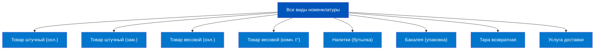
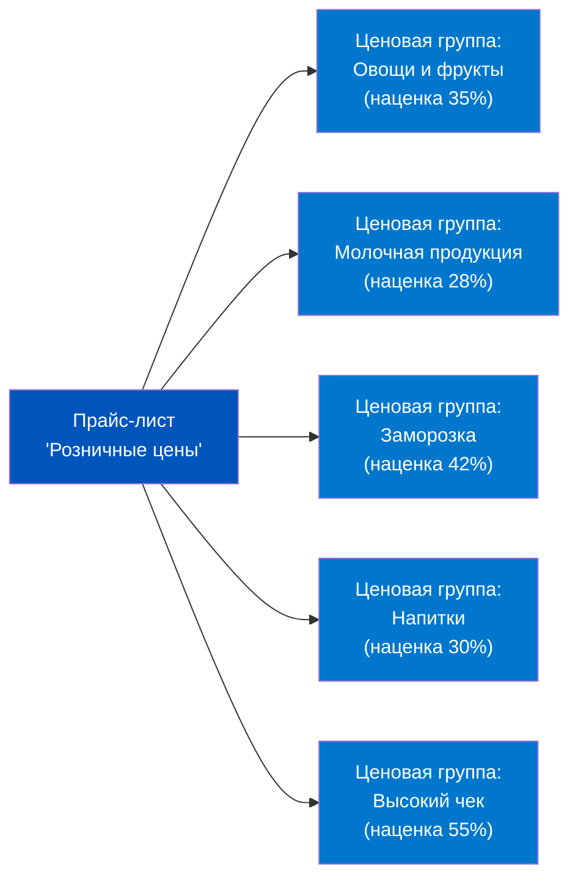
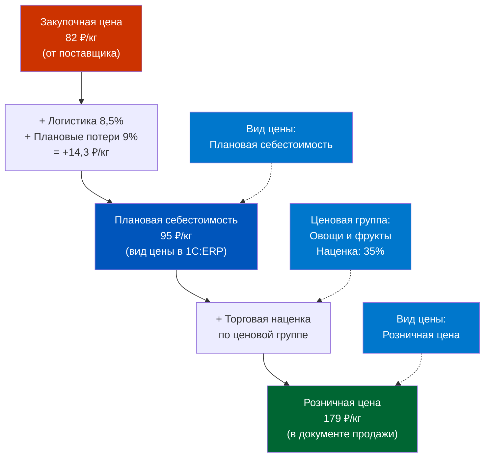
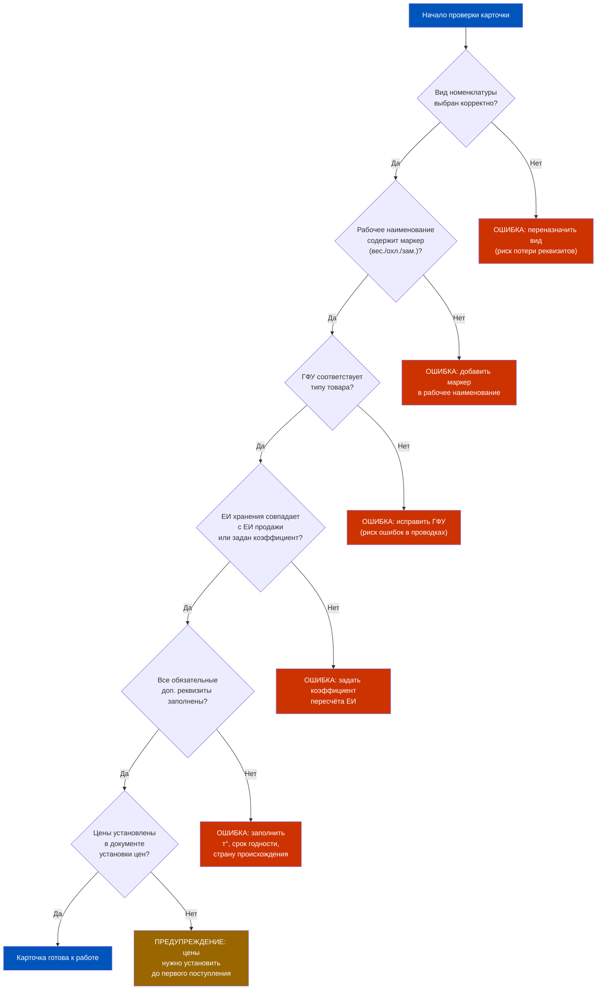

# Week 2, Day 6. Практикум: Проектирование карточки товара для Dark Store


---

## Часть 1. Задача: зачем dark store нужна идеальная карточка товара

Представьте: субботнее утро, 08:14. Курьер Яндекс Лавки стоит у стеллажа с авокадо. В приложении заказ — «авокадо, 1 шт.». Но в учётной системе три позиции: «Авокадо», «Авокадо (весовое)» и «Авокадо Хасс». Какую брать? Курьер наугад берёт первую, вешает на весах — 180 г. В 1С:ERP эта позиция учитывается в штуках, а не в граммах. Система проводит списание 1 шт. Реальный остаток расходится с учётным. К вечеру расхождение по складу накапливается до 47 позиций. К понедельнику автозаказ формирует заявку поставщику с ошибкой на 23%.

Это не гипотетическая история — это типичная картина первых месяцев работы Q-commerce даркстора без выстроенной НСИ.

**НСИ в Q-commerce — это не просто справочник.** Это операционный фундамент, на котором держится:
- автоматическое пополнение запасов (автозаказ),
- корректное списание при сборке заказа,
- расчёт плановой и фактической маржи,
- закрытие месяца без ручных корректировок.

В этом практикуме мы спроектируем полную карточку товара в 1С:ERP 2.5 — от выбора вида номенклатуры до прайс-листа. В конце выполним реальное задание: создадим карточку «Авокадо Хасс, весовое» с нуля по набору исходных данных.

### Что нужно знать перед началом

Справочник «Номенклатура» в 1С:ERP хранится по пути:

> НСИ и администрирование → НСИ → Номенклатура

Каждая позиция имеет два наименования:
- **Рабочее наименование** — для быстрого поиска внутри системы,
- **Наименование для печати** — отображается в документах для контрагентов.

Эти два поля нередко заполняют одинаково, что порождает путаницу. В даркстор-операциях рабочее наименование должно содержать технические маркеры: «весовое», «охл.», «зам.» — чтобы сборщик однозначно идентифицировал товар.

---

## Часть 2. Архитектура идеальной карточки номенклатуры

Карточка номенклатуры в 1С:ERP — это не плоский набор полей. Это многоуровневая структура, где каждый блок отвечает за свою функцию в операционном процессе.


Ниже — схема архитектуры в виде диаграммы зависимостей:

```mermaid
graph TD
    A["КАРТОЧКА НОМЕНКЛАТУРЫ"] --> B["Блок 1: Основные реквизиты"]
    A --> C["Блок 2: Характеристики"]
    A --> D["Блок 3: Ценообразование"]
    A --> E["Блок 4: Логистика"]
    A --> F["Блок 5: Аналитика"]

    B --> B1["Вид номенклатуры"]
    B --> B2["Группа номенклатуры"]
    B --> B3["ГФУ (Группа фин. учёта)"]
    B --> B4["Единица хранения / ЕИ"]

    C --> C1["Доп. реквизиты вида"]
    C --> C2["Весовой / штучный"]
    C --> C3["Температурный режим"]
    C --> C4["Срок годности (сут.)"]

    D --> D1["Ценовая группа"]
    D --> D2["Базовая цена продажи"]
    D --> D3["Плановая себестоимость"]

    E --> E1["Складская группа"]
    E --> E2["Схема обеспечения"]

    F --> F1["Товарная категория"]
    F --> F2["Марка / Бренд"]
    F --> F3["Сегмент"]

    style A fill:#0055BB,color:#fff
    style B fill:#0055BB,color:#fff
    style C fill:#0077CC,color:#fff
    style D fill:#0055BB,color:#fff
    style E fill:#0077CC,color:#fff
    style F fill:#0055BB,color:#fff
```



**Почему порядок важен.** Блок 1 — это фундамент. Нельзя заполнить характеристики (Блок 2), пока не выбран вид номенклатуры (Блок 1): именно вид определяет, какие дополнительные реквизиты доступны. Нельзя настроить ценообразование (Блок 3), пока не указана единица измерения (Блок 1), — система не поймёт, за что считать цену: за штуку, за килограмм или за упаковку из 6 штук.

Типичная ошибка новичков — начинать заполнение с названия товара, игнорируя вид номенклатуры. Это приводит к тому, что карточка создаётся с видом по умолчанию («Товар»), без дополнительных реквизитов. Потом приходится переделывать — а это уже риск потери связей с проведёнными документами.

### Правило первого шага

> **Сначала — Вид номенклатуры. Всегда.**

В интерфейсе 1С:ERP при создании новой позиции система сразу запрашивает вид. После его выбора на экране появляется полный набор реквизитов, обязательных для заполнения в данном виде. Если вид настроен правильно, система не даст сохранить карточку с пустыми критическими полями.

---

## Часть 3. Блок 1 — Основные реквизиты

### 3.1. Вид номенклатуры

Вид номенклатуры — это классификатор по физическим свойствам товара. Все позиции одного вида описываются одинаковым набором характеристик. В 1С:ERP тип «Товар» является базовым, но для даркстора этого недостаточно.

**Рекомендуемая иерархия видов для Q-commerce:**



Ключевые параметры, которые настраиваются на уровне вида:
- **Тип номенклатуры**: Товар / Услуга / Работа / Тара. Для физических SKU даркстора — всегда «Товар».
- **Использование характеристик**: включается, если товар имеет варианты (вес, объём, вкус). Для весовых фруктов-овощей — обязательно включить.
- **Использование серий**: для товаров с учётом по сроку годности или партии — включить, выбрать политику учёта серий.
- **Набор дополнительных реквизитов**: здесь задаётся, какие поля будут доступны в карточке — «Температурный режим», «Срок годности», «Вес нетто».

**Практическое правило для даркстора:** создавайте отдельный вид для каждой категории с уникальными физическими условиями хранения. Не смешивайте охлаждёнку и заморозку в одном виде. Система не сможет корректно разнести товары по складским зонам (ячейкам), если у них одинаковая складская группа.

### 3.2. Группа номенклатуры

Группа — это иерархическая папка в справочнике. Она используется для навигации и фильтрации, но не влияет на учётные параметры. Типичная ошибка: смешивать логику вида и группы.

**Пример корректной иерархии групп для даркстора:**

```
Овощи и фрукты
├── Фрукты тропические
│   ├── Авокадо
│   ├── Манго
│   └── Ананас
├── Фрукты сезонные
│   ├── Яблоки
│   └── Груши
└── Овощи листовые
    ├── Салат
    └── Шпинат
```

Группа — для поиска и навигации оператора. Вид — для автоматической логики системы.

### 3.3. Группа финансового учёта (ГФУ)

ГФУ — это классификатор номенклатуры по правилам отражения в регламентированном (бухгалтерском) учёте. ГФУ определяет, на какие счета будут формироваться проводки при движении товара.

Для Q-commerce типичный набор ГФУ:

| ГФУ | Счёт бухучёта | Применение |
|-----|--------------|------------|
| Товары (розница) | 41.11 | Все SKU для продажи |
| Тара возвратная | 41.03 | Бутылки, поддоны |
| Товары в пути | 41.12 | Транзитные поставки |
| Материалы (упаковка) | 10.01 | Пакеты, скотч |

**Критично**: неправильная ГФУ — прямая дорога к ошибкам в бухгалтерской отчётности. Если поставить товару ГФУ «Материалы», закупочная цена уйдёт на счёт 10, а не 41. При закрытии месяца это вызовет расхождение между управленческим и регламентированным учётом.

### 3.4. Единицы измерения

Это один из самых критичных реквизитов карточки. В 1С:ERP 2.5 для каждой позиции настраиваются три типа единиц:

- **Единица хранения** — базовая ЕИ для учёта складских остатков. Именно в ней ведётся количественный учёт в регистрах.
- **Единица закупки** — ЕИ в документах от поставщиков (может отличаться от хранения с коэффициентом пересчёта).
- **Единица продажи** — ЕИ в документах продажи клиентам.

**Таблица пересчёта для типичных SKU даркстора:**

| Товар | ЕИ хранения | ЕИ закупки | Коэффициент | ЕИ продажи |
|-------|------------|-----------|-------------|-----------|
| Авокадо Хасс | кг | ящик (4 кг) | 4,000 | кг |
| Молоко 1 л | шт | упаковка (12 шт) | 12,000 | шт |
| Хлеб нарезной | шт | лоток (10 шт) | 10,000 | шт |
| Шпинат листовой | кг | лоток (0,25 кг) | 0,250 | кг |
| Вода 0,5 л | шт | упаковка (24 шт) | 24,000 | шт |

**Для весовых товаров единица хранения — кг.** Это критично. Если создать «Авокадо» со штучной единицей хранения, при весовом списании система попытается сконвертировать граммы в штуки. Коэффициент будет либо некорректным, либо отсутствовать — и тогда проводка не сформируется.

---

## Часть 4. Блок 2 — Характеристики для Q-commerce

### 4.1. Что такое дополнительные реквизиты вида

Дополнительные реквизиты — это произвольные поля, которые настраиваются на уровне вида номенклатуры и отображаются на закладке «Реквизиты → Дополнительные реквизиты» в каждой карточке.

Они могут принимать значения:
- базовых типов: текст, число, дата,
- ссылок на объекты системы,
- значений из предопределённого списка.


### 4.2. Обязательные дополнительные реквизиты для даркстора

**Весовой товар:**

| Реквизит | Тип значения | Обязательность | Пример |
|----------|-------------|----------------|--------|
| Вес нетто (г) | Число | Обязательный | 150–300 г |
| Вес брутто (г) | Число | Обязательный | 160–320 г |
| Страна происхождения | Список | Обязательный | Мексика |
| Срок годности (сут.) | Число | Обязательный | 5 |
| Температурный режим | Список | Обязательный | +2..+6°C |
| Тип упаковки | Список | Опциональный | Без упаковки |

**Штучный охлаждённый товар:**

| Реквизит | Тип значения | Обязательность | Пример |
|----------|-------------|----------------|--------|
| Срок годности (сут.) | Число | Обязательный | 7 |
| Температурный режим | Список | Обязательный | +2..+6°C |
| Объём / Вес | Число | Обязательный | 1 000 мл |
| Штрихкод EAN-13 | Текст | Обязательный | 4607024030327 |
| Количество в упаковке | Число | Опциональный | 12 |

### 4.3. Температурный режим: почему это операционный параметр

Температурный режим — не просто информационное поле для отчёта. В правильно настроенном даркстор-WMS (или в 1С:ERP со складским учётом) этот реквизит связывается со **складской группой** и определяет, в какой зоне хранения (ячейках) система предложит разместить товар при приёмке.

**Типичные зоны хранения даркстора:**

| Зона | t°C | Примеры товаров |
|------|-----|----------------|
| Ambient (сухой склад) | +15..+25°C | Бакалея, чипсы, вода |
| Охлаждение (chiller) | +2..+6°C | Молочка, мясо, авокадо |
| Заморозка (freezer) | −18°C | Пельмени, мороженое |
| Овощи-фрукты | +8..+12°C | Бананы, томаты |

Если в карточке не заполнен температурный режим, система не может автоматически направить товар в нужную зону. При приёмке кладовщик вынужден принимать решение вручную — и кладёт авокадо в ambient. За 4 часа партия потеряет 30% товарного вида.

### 4.4. Срок годности и учёт серий

Для товаров с коротким сроком годности (до 14 суток) рекомендуется включить **учёт серий** с политикой «по сроку годности». В этом случае при поступлении товара система создаёт серию с датой истечения, а при списании автоматически применяет принцип FEFO (First Expired — First Out): сначала уходят позиции с ближайшим сроком.

Включить учёт серий: в карточке вида номенклатуры → «Использование серий» → выбрать политику.

**Внимание**: себестоимость «По средней» в 1С:ERP 2.5 рассчитывается при закрытии месяца. Серии не влияют на метод оценки себестоимости, но используются для управленческого учёта остатков по срокам.

---

## Часть 5. Блок 3 — Ценообразование

### 5.1. Ценовая группа

Ценовая группа — классификатор для назначения цен и скидок в разрезе группы товаров. Один прайс-лист может охватывать несколько ценовых групп с разными наценками.

**Типичные ценовые группы для даркстора:**



### 5.2. Базовая цена продажи

Базовая цена задаётся в «Виды цен номенклатуры» через документ «Установка цен номенклатуры». Для Q-commerce обычно ведутся минимум 3 вида цен:

| Вид цены | Кому применяется | Пример (авокадо) |
|---------|-----------------|-----------------|
| Розничная цена | Конечный покупатель | 179 ₽/кг |
| Плановая себестоимость | Внутренний расчёт | 95 ₽/кг |
| Закупочная (входящая) | Ссылка на договор | 82 ₽/кг |

**Маржа на авокадо по этим данным:**
- Наценка к закупочной: (179 − 82) / 82 × 100% = **118%**
- Маржа к продажной: (179 − 95) / 179 × 100% = **47%**




### 5.3. Плановая себестоимость

Плановая себестоимость — отдельный вид цены, который используется в управленческих отчётах для расчёта плановой рентабельности до фактического закрытия месяца. Это прогнозное значение, которое вносится вручную или рассчитывается по формуле на основе последней закупочной цены + логистические расходы.

Формула для Q-commerce:
```
Плановая себестоимость = Закупочная цена × (1 + % логистики + % потерь)
```

Для авокадо:
```
95 = 82 × (1 + 0,08 + 0,08)
```

Где:
- 8% — доля логистических расходов (доставка до даркстора),
- 8% — плановые списания по потерям (порча, бой).

---

## Часть 6. Практическое задание: карточка «Авокадо Хасс»

### Исходные данные

Вы — оператор НСИ нового даркстора в Москве. Поступил запрос от байера на создание позиции:

```
Товар: Авокадо Хасс, весовой
Поставщик: ООО «Фрешлайн», договор №47 от 01.03.2026
Закупочная цена: 86 ₽/кг (с НДС 10%)
Розничная цена: 189 ₽/кг
Страна происхождения: Мексика
Температурный режим: +2..+8°C
Срок годности: 7 суток от даты упаковки
Штрихкод: 4606203214879
Единица хранения: кг
Единица закупки: ящик (вес нетто: 4 кг)
Категория: Овощи и фрукты → Фрукты тропические
ГФУ: Товары (розница), счёт 41.11
```


### Пошаговое выполнение

**Шаг 1. Открыть справочник и начать создание**

НСИ и администрирование → НСИ → Номенклатура → кнопка «Создать»

Система сразу запрашивает вид номенклатуры.

**Шаг 2. Выбор вида номенклатуры**

Выбираем: **«Товар весовой (охл.)»**

После выбора на экране появятся обязательные реквизиты этого вида. В нашем случае система покажет поля: Наименование, ГФУ, Единица хранения, Страна происхождения, Температурный режим, Срок годности.

**Шаг 3. Заполнение наименований**

- Рабочее наименование: `Авокадо Хасс охл. вес.`
- Наименование для печати: `Авокадо Хасс (весовое)`

**Шаг 4. Основные реквизиты**

- Вид номенклатуры: Товар весовой (охл.)
- Группа: Овощи и фрукты / Фрукты тропические
- ГФУ: Товары (розница) → счёт 41.11
- Ценовая группа: Овощи и фрукты

**Шаг 5. Единицы измерения**

- Единица хранения: кг
- Единица продажи: кг (коэффициент 1,000)
- Единица закупки: ящик (коэффициент 4,000)

**Шаг 6. Дополнительные реквизиты**

Переходим на закладку «Реквизиты → Дополнительные реквизиты»:

| Реквизит | Значение |
|---------|---------|
| Температурный режим | +2..+8°C |
| Срок годности (сут.) | 7 |
| Страна происхождения | Мексика |
| Штрихкод | 4606203214879 |
| Складская группа | Охлаждение (chiller) |

**Шаг 7. Цены**

После записи карточки создаём документ «Установка цен номенклатуры»:

| Вид цены | Значение | Валюта | ЕИ |
|---------|---------|--------|-----|
| Розничная цена | 189,00 | ₽ | кг |
| Плановая себестоимость | 101,00 | ₽ | кг |
| Закупочная (входящая) | 86,00 | ₽ | кг |

Расчёт плановой себестоимости:
```
86 × (1 + 0,085 + 0,09) ≈ 101 ₽/кг
```
(8,5% — логистика, 9% — плановые потери по авокадо)

**Шаг 8. Контроль уникальности**

Перед сохранением система проверит:
- Уникальность наименования — нет дублей «Авокадо Хасс охл. вес.»?
- Уникальность штрихкода — 4606203214879 не используется другой позицией?
- Уникальность по набору реквизитов вида?

Если проверка прошла — нажать «Записать и закрыть».

---

## Часть 7. Чеклист готовой карточки и частые ошибки

### 7.1. Чеклист «Карточка готова к работе»



### 7.2. Топ-7 ошибок при создании карточек

**Ошибка 1. Неправильный вид номенклатуры**
Товар создан с видом «Товар» вместо «Товар весовой». Результат: отсутствуют поля для температуры и срока годности. При поступлении система не сможет автоматически направить товар в нужную зону.

**Ошибка 2. ЕИ хранения в штуках для весового товара**
Авокадо поставили единицей «шт» вместо «кг». При весовом списании (0,235 кг) система пытается списать дробное количество штук. Часть систем это запрещает, часть проводит с ошибкой в регистрах.

**Ошибка 3. Не задан коэффициент пересчёта ЕИ**
Закупка в ящиках (4 кг), хранение в кг. Если коэффициент 4,000 не указан, при оприходовании 10 ящиков система запишет 10 кг вместо 40 кг. Потери: расхождение остатков 30 кг на первой же поставке.

**Ошибка 4. Неверная ГФУ**
Поставили «Материалы» вместо «Товары (розница)». Закупочная цена уйдёт на счёт 10.01. При закрытии месяца — расхождение с регламентированным учётом, ручная корректировка бухгалтера.

**Ошибка 5. Пустая ценовая группа**
Карточка записана без ценовой группы. Автоматические скидки и наценки из прайс-листа к товару применяться не будут. Товар продаётся по нулевой цене до ручной установки.

**Ошибка 6. Дублирование позиций**
Без включённого контроля уникальности один и тот же товар создаётся 2–3 раза с разными наименованиями: «Авокадо», «Авокадо хасс», «Авокадо (вес)». Остатки разделяются между позициями. Автозаказ работает по каждой отдельно и занижает объём заказа.

**Ошибка 7. Цены установлены не через документ**
Цена вписана напрямую в карточку (поле «Цена» в шапке), а не через документ «Установка цен номенклатуры». Результат: цена не попадает в регистр цен, не отражается в аналитике, не участвует в расчёте плановой рентабельности.

### 7.3. Резюме практикума

За шесть частей мы прошли полный путь создания карточки номенклатуры для даркстора:

1. Поняли, почему архитектура карточки — операционный фундамент, а не просто справочник.
2. Изучили 5 функциональных блоков карточки и их зависимости.
3. Разобрали каждый блок: от вида номенклатуры до ценовых групп.
4. Выполнили кейс «Авокадо Хасс» — 8 шагов от нуля до готовой позиции.
5. Систематизировали 7 типичных ошибок и способы их предотвращения.

В следующем уроке разберём реальный кейс: что происходит с операционным бизнесом, когда эти правила не соблюдаются массово.

---


### Итоговый чеклист: карточка товара готова к работе


← [[Неделя 2 - День 5 - Соглашения|День 5]] | [[README|Оглавление]] | [[Неделя 2 - День 7 - История грязных НСИ|День 7]] →
