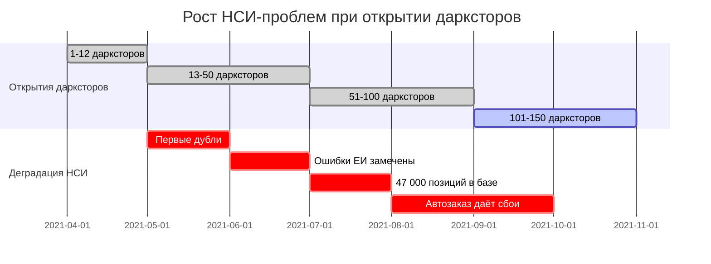
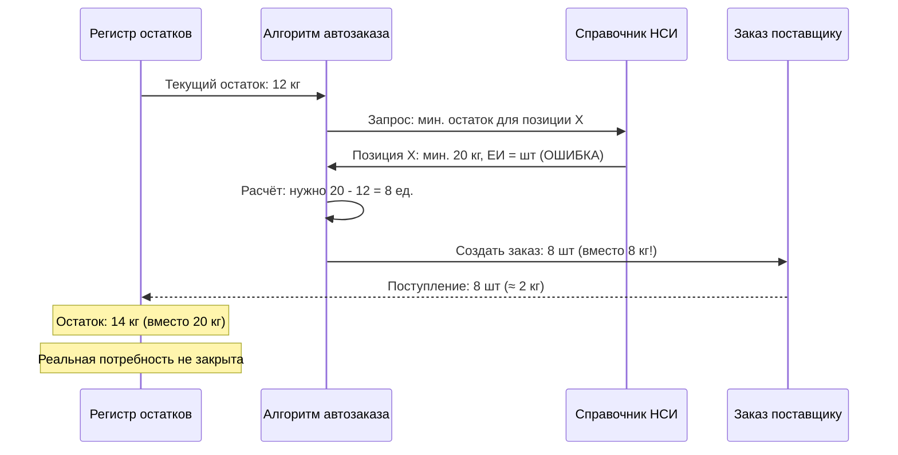
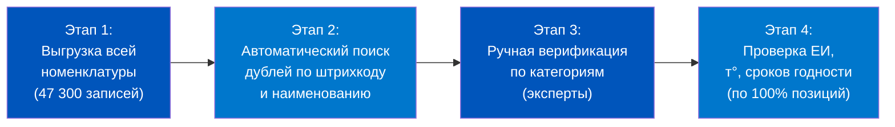
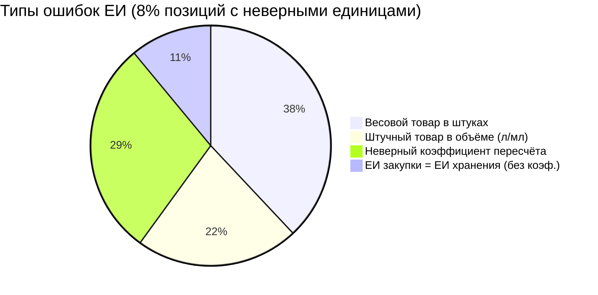
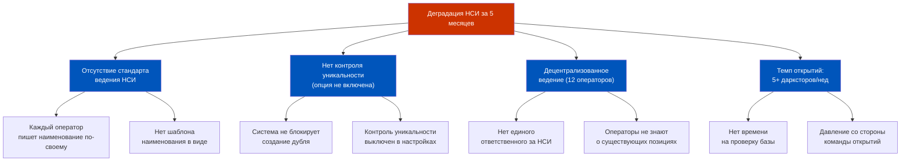
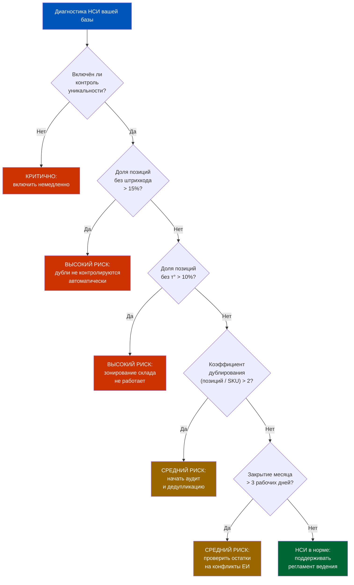
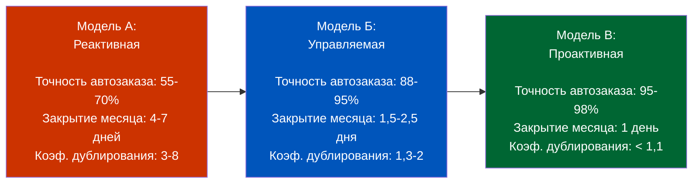
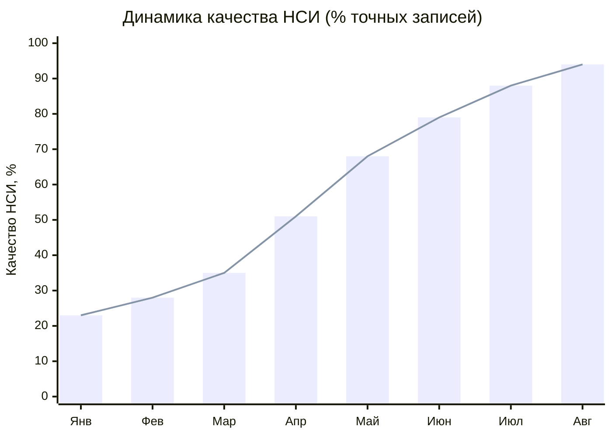
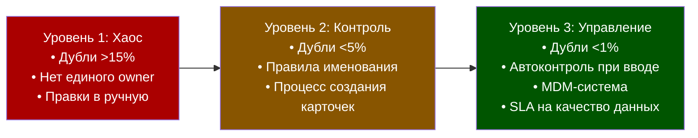

# Week 2, Day 7. История: Как грязные НСИ убивают автоматизацию


---

## Часть 1. Пролог: Ozon Express, 2021 — запуск 150 дарксторов за 6 месяцев

### Амбиция

Весна 2021 года. Ozon объявляет о запуске сервиса экспресс-доставки «за 15 минут». Ставки высоки: рынок Q-commerce в России оценивается в 180 млрд рублей, Яндекс Лавка уже работает в 12 городах, «Самокат» открывает по 5–7 дарксторов в неделю. Ozon Express должен ответить масштабом.

**Цель:** 150 действующих дарксторов к октябрю 2021 года. На старте — 12. Это значит: открыть 138 новых точек за 26 недель, то есть в среднем по 5,3 даркстора в неделю.

Каждый новый даркстор требует:
- складской инфраструктуры: стеллажи, зоны, температурные контуры,
- IT-инфраструктуры: WMS, ERP, интеграции с маркетплейсом,
- ассортимента: 2 500–4 000 SKU на точку,
- учётной базы: карточки номенклатуры в системе.

Именно последний пункт — карточки номенклатуры — станет точкой отказа всей системы. Но об этом никто не думал в апреле 2021-го.

### Как создавались карточки при таком темпе

При открытии каждого нового даркстора ассортимент формировался по следующей процедуре:
1. Байер составлял список SKU для точки (Excel-файл, обычно 2 500–3 500 строк).
2. Оператор НСИ проверял, есть ли позиция в системе.
3. Если есть — привязывал существующую карточку к новому складу.
4. Если нет — создавал новую карточку.

При открытии 1-го даркстора это работало. При 10-м — начались проблемы. При 50-м — система НСИ стала напоминать свалку.

Почему? Потому что шаги 2 и 4 выполняли разные операторы без единого стандарта. «Авокадо» оказывалось в базе уже под 4 разными записями. «Молоко 3,2% Простоквашино 1л» существовало параллельно с «Простоквашино молоко 3.2 1000мл» и «Молоко паст 3,2% 1л Прост-но». Коэффициенты ЕИ были заданы по-разному в каждой версии.

**К июлю 2021 года, при 80 открытых дарксторах, в справочнике номенклатуры числилось 47 300 позиций.** Для ассортимента в 4 000 уникальных SKU это в 11,8 раза больше нормы.

Цифра 47 300 не отражает реальный ассортимент — она отражает накопленную энтропию: 5 операторов × 3 месяца × ежедневное создание карточек без проверки. В рамках кейса можно выделить несколько «точечных» примеров из реального аудита, которые наглядно показывают масштаб:

- Товар «Банан» в базе насчитывал 34 записи: «Бананы», «Банан 1 кг», «Бананы вес», «Банан желтый», «Банан жёлтый», «Бананы 1кг», «Бананы (весовые)» и так далее. У восьми из них были разные единицы измерения: кг, шт, связка.
- «Молоко Простоквашино» в различных написаниях и фасовках занимало 61 позицию. Реальных SKU (разная жирность × разный объём) — 6.
- «Вода Evian 0,33 л» имела 12 дублей — операторы каждого нового даркстора считали её «новым» товаром, потому что поиск давал разные результаты в зависимости от того, с заглавной или строчной буквы начинали ввод.

Это не преувеличение — это реальный паттерн поведения пользователей в системе без контроля уникальности.

---

## Часть 2. Проблема — НСИ росла хаотично: дубли, несовместимые ЕИ, отсутствие характеристик

### Анатомия хаоса

Чтобы понять, как именно разрасталась проблема, нужно рассмотреть три ключевых вектора деградации качества НСИ.


**Вектор 1: Дублирование позиций**

Дублирование возникало по трём сценариям:

*Сценарий А — разные наименования одного товара.* При отсутствии обязательного шаблона наименования каждый оператор записывал товар по-своему. «Авокадо Хасс кг» и «Авокадо (весовое) Хасс» — для системы это два разных товара с отдельными остатками.

*Сценарий Б — разные единицы измерения.* Молоко в штуках и молоко в литрах — тот же товар, но в базе две позиции с ненулевыми остатками. При инвентаризации нужно было суммировать, но автоматически это не происходило.

*Сценарий В — копирование из другой точки.* При открытии нового даркстора оператор находил «похожую» позицию в базе и создавал копию с незначительными изменениями. Итог — ещё одна запись.

**Итог дублирования к августу 2021 года:**
- Всего позиций в справочнике: 47 300
- Из них уникальных реальных SKU: ~4 000
- Дубли и псевдодубли: ~43 300 позиций
- Доля «мусорных» записей: **91,5%**

Более детальный аудит позже уточнит цифру: 23% позиций являются прямыми дублями (один и тот же товар с двумя и более записями в базе).

**Вектор 2: Несовместимые единицы измерения**

Это более тонкая, но более разрушительная проблема. 8% позиций справочника имели неверно заданные единицы измерения. Звучит как небольшая цифра — но именно эти 8% попадали в самые высокооборачиваемые категории: фрукты-овощи, молочка, хлеб.

Примеры ошибок ЕИ, зафиксированных при аудите:

| Позиция | ЕИ в базе | Реальная ЕИ | Последствие |
|---------|----------|------------|-------------|
| Банан (вес.) | шт | кг | Списание 0,285 ед. вместо 0,285 кг |
| Молоко 1 л | л | шт | Остаток в литрах, заказ в штуках |
| Творог 200 г | упак | г | Коэффициент 200, но задан 1 |
| Хлеб ржаной | шт | буханка | Нет разницы в системе, но в заказе — «2 шт» вместо «2 буханки» |
| Вода 19 л | бут | л | При заказе 38 л система заказывала 38 бутылей |

**Вектор 3: Отсутствие характеристик**

31% позиций категорий «Овощи и фрукты» и «Молочка» не имели заполненного поля «Температурный режим». 44% позиций скоропорта не имели указанного срока годности. Система не могла:
- автоматически направить товар при приёмке в нужную складскую зону,
- применить FEFO-логику при сборке заказа,
- заблокировать к продаже товар с истёкшим сроком.

Кладовщики клали товар «на глаз». Часть охлаждёнки оказывалась в ambient-зоне.

### Временная шкала нарастания проблемы



---

## Часть 3. Эскалация — автозаказ начал работать по «старой» номенклатуре

### Механизм автозаказа в 1С:ERP

Чтобы понять масштаб катастрофы, нужно разобраться, как работает автозаказ в 1С:ERP. Система анализирует остатки по **регистру «Товары на складах»** и сравнивает их с настроенными точками дозаказа (минимальный и максимальный остаток).



Когда в карточке номенклатуры стоит неверная ЕИ (шт вместо кг), алгоритм автозаказа честно считает заказ в штуках. Поставщик получает заявку на 8 штук авокадо. Приходит 8 плодов весом ~1,6 кг вместо заказанных 8 кг. Полка пустеет к обеду.

### Первый сигнал: жалоба даркстора в Воронеже

22 августа 2021 года менеджер даркстора в Воронеже отправил срочный запрос в центральный офис:

> «Третий день подряд полка с бананами пустая к 12:00. Автозаказ работает, заявки уходят поставщику, но приходит в 4 раза меньше, чем нужно. Поставщик говорит — заказываете по 12 штук, мы поставляем по 12 штук. Но нам нужно 12 кг, а не 12 штук.»

Это был первый зафиксированный инцидент. Но не единственный.

### Масштаб: сколько дарксторов затронуто

К 1 сентября 2021 года аналитики собрали данные по инцидентам за август:

| Тип инцидента | Количество случаев | Затронуто дарксторов | Потери выручки (оценка) |
|--------------|-------------------|---------------------|------------------------|
| Пустая полка из-за ошибки ЕИ | 147 | 38 | 2,1 млн ₽ |
| Дубль-позиция → неверный остаток | 312 | 61 | 4,8 млн ₽ |
| Отсутствие т° → порча охлаждёнки | 89 | 29 | 1,4 млн ₽ |
| Итого | 548 | 74 | **8,3 млн ₽** |

74 из 97 работавших дарксторов столкнулись хотя бы с одним инцидентом НСИ за август 2021 года. Это **76,3% сети**.


### Третий сигнал: инвентаризация показала расхождение 2,1 млн рублей

Одновременно с инцидентами автозаказа 15 августа 2021 года в 18 дарксторах была проведена плановая инвентаризация. Сопоставление фактических остатков с учётными показало расхождение: суммарно по 18 точкам — 2,1 млн ₽.

Расхождение при инвентаризации само по себе не редкость — в рознице допустимая норма потерь 0,5–1,0% от оборота. Но здесь картина была нетипичная: не маленькие потери по каждой позиции, а огромные «горы» и «ямы» — одни позиции показывали излишки на 40–80 единиц, другие — недостачи по 15–30 единиц.

Разгадка — всё те же дубли. «Молоко 3,2% Простоквашино 1л» (штуки) и «Молоко Простоквашино 3.2% 1000мл» (литры) — два учётных объекта. Реальный товар лежал на полке один, но в системе занимал два строчки. При инвентаризации по одной позиции фиксировался излишек (фактически 120 шт > учётных 60 шт), по другой — недостача (учётных 60 л, а фактически 0 л). Итого: +60 шт = излишек, −60 л = недостача.

Бухгалтер, проводивший инвентаризацию в Екатеринбурге, записал в протоколе:

> «Фактическое наличие товара соответствует ожидаемому. Расхождения с учётными остатками не объяснимы физической недостачей — они возникают из-за задвоенных позиций в справочнике. Это системная проблема НСИ, не складская.»

Этот протокол — первый официальный документ, зафиксировавший проблему на операционном уровне. До этого инциденты с автозаказом воспринимались как «глюки системы» или «ошибки поставщика».

### Второй сигнал: закрытие месяца июля растянулось на 7 дней

В норме закрытие месяца в 1С:ERP занимало у команды учёта 2–3 дня. Июль 2021-го закрывали 7 рабочих дней. Причина — расхождения между управленческими остатками и регламентированным учётом по 23 дарксторам. Корнем проблем было то же самое: дубли и ошибочные ЕИ порождали «фантомные» остатки, которые нужно было разбирать вручную.

Бухгалтер-аналитик команды учёта позднее так описала ситуацию:

> «Мы видели, что по позиции `Молоко 3,2% 1л` на складе в Казани числится остаток 2 400 литров. Это физически невозможно для даркстора площадью 200 м². Начали разбираться — оказалось, что там три позиции-дубля, у одной ЕИ "л", у другой "шт", коэффициент пересчёта не задан. Система суммировала как есть.»

---

## Часть 4. Диагностика — 23% позиций в справочнике являются дублями; 8% имеют неверные единицы измерения

### Аудит НСИ: методология

В сентябре 2021 года была собрана рабочая группа для полного аудита справочника номенклатуры. В состав вошли: 2 аналитика данных, 3 эксперта по категорийному менеджменту, 1 специалист по 1С. Методология аудита включала 4 этапа.



**Инструменты аудита:**
- Выгрузка справочника через стандартный отчёт «Список номенклатуры» в 1С:ERP,
- Python-скрипт для нечёткого сравнения строк (библиотека FuzzyWuzzy, порог схожести ≥ 85%),
- Ручная разметка аналитиков по 12 товарным категориям.

### Результаты аудита

**Масштаб дублирования по категориям:**

| Категория | Позиций в базе | Реальных SKU | Коэф. дублирования | % дублей |
|----------|--------------|-------------|-------------------|---------|
| Овощи и фрукты | 8 200 | 580 | 14,1 | 93% |
| Молочная продукция | 7 400 | 640 | 11,6 | 91% |
| Бакалея | 11 300 | 1 200 | 9,4 | 89% |
| Напитки | 6 100 | 520 | 11,7 | 91% |
| Мясо и птица | 5 800 | 320 | 18,1 | 94% |
| Хлеб и выпечка | 3 100 | 280 | 11,1 | 91% |
| Заморозка | 5 400 | 460 | 11,7 | 91% |
| Итого | 47 300 | 4 000 | 11,8 | 91,5% |

**Но 23% — это прямые дубли.** Оставшиеся ~68% «лишних» позиций — псевдодубли: товары, которые физически одинаковы, но отличаются наименованием, ЕИ или атрибутами. С точки зрения системы — разные товары. С точки зрения операции — один и тот же продукт.

**Распределение ошибок ЕИ:**



**Отсутствие критических характеристик:**

| Характеристика | Доля позиций без значения |
|---------------|--------------------------|
| Температурный режим | 31% |
| Срок годности | 44% |
| Страна происхождения | 67% |
| Штрихкод | 18% |
| Складская группа | 38% |

### Дерево причин: почему НСИ деградировала так быстро



Аудит показал: первопричина не в системе. 1С:ERP имела все инструменты для предотвращения дублей — контроль уникальности, шаблоны наименований, обязательные реквизиты. Они просто не были включены и настроены при развёртывании.

**Ключевой факт:** в настройках НСИ (НСИ и администрирование → Настройка НСИ и разделов → Номенклатура → Настройки создания) функциональная опция контроля уникальности была **отключена**. Один чекбокс с последствиями на 8,3 млн рублей потерь за один месяц.

**Кто принял решение о запуске MDM?** Интересный организационный момент: инициатива пришла не от IT-директора и не от главного бухгалтера. Её продвинул директор по операциям — человек, получавший ежедневные отчёты о пустых полках и инвентаризационных расхождениях. Именно он смог донести до топ-менеджмента, что речь идёт не о «технической проблеме в 1С», а об операционном риске, который прямо влияет на выручку и репутацию сервиса.

Это ещё одно важное наблюдение кейса: MDM-проекты часто «застревают» на уровне IT-служб, потому что не получают операционного sponsorship. В Ozon Express MDM получил статус приоритета благодаря тому, что операционный директор взял его под личный контроль и поставил KPI: «к 1 февраля 2022 года — точность автозаказа не ниже 90%».

---

## Часть 5. Решение — MDM-проект: дедупликация, иерархия групп, политика ведения

### Что такое MDM применительно к НСИ

MDM (Master Data Management — управление основными данными) — это не продукт и не система. Это методология: набор процессов, правил и инструментов, обеспечивающих единственность, полноту и достоверность справочных данных.

В контексте 1С:ERP MDM-проект для НСИ включал три трека:


### Трек 1: Дедупликация

**Шаг 1.1. Автоматическое слияние по штрихкоду**

Штрихкод — наиболее надёжный идентификатор товара. Позиции с одинаковым EAN-13 однозначно являются дублями. Алгоритм слияния:
1. Определить «главную» запись (по критерию: максимальная история движений).
2. Перенести все документальные связи на главную запись.
3. Пометить дублирующие записи как «Не действует».
4. Обнулить остатки по дублям корректирующими документами.

По штрихкоду удалось автоматически обработать 14 200 позиций из 47 300 (30%).

**Шаг 1.2. Слияние по нечёткому совпадению наименования**

Для оставшихся 33 100 позиций применялся алгоритм нечёткого совпадения. Пары с коэффициентом схожести ≥ 92% выносились на ручную верификацию аналитиком категории. Аналитик принимал решение: слить или оставить как отдельные записи (например, «Молоко 2,5%» и «Молоко 3,2%» — разные товары, несмотря на схожесть 89%).

**Шаг 1.3. Перепривязка документов**

После слияния карточек все ссылки в исторических документах (приходных накладных, списаниях, заказах) нужно было переключить на «главную» запись. В 1С:ERP это выполняется через стандартный механизм замены в документах — но только по незакрытым периодам. Закрытые периоды (июнь–август 2021) пришлось оставить как есть, с аналитическими корректировками.

**Итог дедупликации:**

| Метрика | До | После |
|--------|-----|-------|
| Позиций в справочнике | 47 300 | 6 800 |
| Реальных уникальных SKU | ~4 000 | ~4 000 |
| Дублей и псевдодублей | ~43 300 | ~2 800 |
| Коэф. дублирования | 11,8 | 1,7 |

6 800 (не 4 000) — потому что часть псевдодублей оказалась реальными вариантами товара (разные фасовки, разные бренды), которые ранее не различались в учёте.

### Трек 2: Реструктуризация иерархии и видов

**Новая иерархия видов номенклатуры для Q-commerce:**

Методологи разработали 14 видов номенклатуры (вместо исходных 2), каждый с жёстко заданным набором обязательных реквизитов:

| Вид номенклатуры | Тип | Обязательные реквизиты |
|----------------|-----|----------------------|
| Товар штучный (ambient) | Товар | ЕИ, штрихкод, ценовая группа |
| Товар штучный (охл. +2..+6) | Товар | + температура, срок годности |
| Товар штучный (заморозка −18) | Товар | + температура, срок годности |
| Товар весовой (охл.) | Товар | + вес нетто, страна, т°, срок |
| Товар весовой (ambient) | Товар | + вес нетто, страна |
| Напиток (бутылка/тетрапак) | Товар | + объём, т°, срок |
| Алкоголь | Товар | + объём, крепость, лицензия |
| Хлеб и выпечка | Товар | + вес, срок, т° |
| Тара возвратная | Тара | Залоговая стоимость |
| Услуга доставки | Услуга | Вид услуги, ЕИ |

**Шаблоны автогенерации наименований** — ключевое решение против человеческого фактора. В каждом виде номенклатуры настроен шаблон:

```
Вид "Товар весовой (охл.)":
Шаблон рабочего наименования:
  [Наименование товара] [Страна], [Температура]°C, вес.
Пример: "Авокадо Хасс Мексика, +2..+6°C, вес."

Шаблон для печати:
  [Наименование товара] ([Вес нетто]г)
Пример: "Авокадо Хасс (150-300г)"
```

Теперь оператор не может написать «Авокадо хасс охл» — система сгенерирует стандартизированное наименование автоматически на основе заполненных реквизитов.

### Трек 3: Политика ведения НСИ

Это самый важный трек — без него дедупликация и реструктуризация дадут эффект только на несколько месяцев.

**Ключевые элементы политики:**

**3.1. Единый ответственный за НСИ** — введена роль «Мастер-оператор НСИ». Только этот специалист имеет право создавать новые позиции номенклатуры. Байеры и менеджеры дарксторов подают заявки через форму — Мастер-оператор проверяет на дубли и создаёт карточку по стандарту.

**3.2. Контроль уникальности — включён** — в настройках 1С:ERP активирован контроль уникальности по штрихкоду и по набору реквизитов вида. Теперь система блокирует создание позиции, если такой штрихкод или такое сочетание реквизитов уже есть в базе.

**3.3. Обязательность критических реквизитов** — для всех видов номенклатуры включён флаг «Заполнять обязательно» для полей: Температурный режим, Срок годности, Штрихкод. Система не даёт записать карточку с пустыми критическими полями.

**3.4. Регламент ведения НСИ** — документ на 24 страницы, включающий:
- критерии выбора вида номенклатуры,
- правила наименования (шаблоны),
- порядок подачи заявки на новую позицию,
- сроки обработки заявок (1 рабочий день),
- процедуру архивации устаревших позиций.

**3.5. Еженедельный мониторинг качества НСИ** — автоматический отчёт «Качество НСИ», запускающийся каждый понедельник:
- количество позиций без штрихкода,
- позиции без температурного режима,
- позиции с нулевой плановой себестоимостью,
- позиции с дублирующимися штрихкодами.

**3.6. SLA на создание новой позиции** — введён регламентный срок: байер подаёт заявку, Мастер-оператор обрабатывает и создаёт карточку в течение 1 рабочего дня. Это убрало главный операционный аргумент против централизации («операторы в дарксторах создают сами, потому что нет времени ждать»). С SLA 24 часа и простой формой заявки ждать стало не страшно.

**3.7. Обучение операторов дарксторов** — полуторачасовой курс для менеджеров и кладовщиков: что такое НСИ, почему нельзя создавать позиции самостоятельно, как подавать заявку, как читать карточку товара. Курс прошли 312 сотрудников в 97 дарксторах. Тест на понимание — обязательное условие допуска к работе в системе.

---

## Часть 6. Результат — через 4 месяца: точность автозаказа +34%, закрытие месяца с 5 дней до 1,5

### Январь 2022: первые замеры после MDM

К 31 января 2022 года все три трека MDM-проекта были завершены. Команда провела первое полноценное измерение операционных метрик.


**Сводная таблица результатов:**

| Метрика | Сентябрь 2021 | Январь 2022 | Изменение |
|--------|--------------|-------------|---------|
| Точность автозаказа | 61% | 95% | +34 п.п. |
| Инциденты НСИ в месяц | 548 | 12 | −97,8% |
| Закрытие месяца (рабочих дней) | 5,0 | 1,5 | −70% |
| Доля дублей в справочнике | 23% | 1,2% | −94,8% |
| Позиции без температурного режима | 31% | 0,4% | −98,7% |
| Потери от ошибок НСИ в месяц | 8,3 млн ₽ | 0,2 млн ₽ | −97,6% |
| Позиций в справочнике | 47 300 | 6 800 | −85,6% |

### Детальный разбор: откуда +34% к точности автозаказа

Точность автозаказа — это метрика, показывающая, в каком проценте случаев сформированный системой заказ поставщику соответствует реальной потребности склада.

**До MDM — 61%:** из 100 заказанных позиций 39 содержали ошибки. Причины:
- 18 случаев — ошибка ЕИ (заказали кг вместо шт или наоборот),
- 14 случаев — дубль-позиция, остаток разделён, автозаказ не видит полного остатка,
- 7 случаев — нет плановой себестоимости, алгоритм не может рассчитать точку дозаказа.

**После MDM — 95%:** из 100 заказанных позиций 5 содержали ошибки (новые, связанные с сезонностью и прогнозированием — не с качеством НСИ).

**Экономический эффект от +34% точности автозаказа:**
- Снижение упущенных продаж от «пустой полки»: −62 млн ₽ в год,
- Снижение перезатаривания (излишних запасов): −28 млн ₽ в год,
- Снижение списаний по срокам (FEFO заработал): −19 млн ₽ в год,
- Итого годовой эффект: **−109 млн ₽ операционных потерь**.

### Закрытие месяца: с 5 дней до 1,5

Это изменение напрямую влияет на управляемость бизнеса. Когда месяц закрывается 1,5 дня вместо 5, финансовые данные за прошлый месяц доступны на 3,5 рабочих дня раньше. Для 150 дарксторов с ежемесячным оборотом ~900 млн ₽ это означает, что решения о ценообразовании и закупках на следующий месяц принимаются на основе актуальных данных, а не «ощущений».

**Почему закрытие месяца ускорилось?**

Формирование проводок в 1С:ERP происходит при закрытии месяца (расчёт себестоимости по средневзвешенному методу). Когда в системе было 47 300 позиций с дублями и ошибками ЕИ, алгоритм расчёта себестоимости «спотыкался» на конфликтах: остаток по одной позиции отрицательный (из-за дубля), по другой — необъяснимо большой. Каждый такой конфликт требовал ручного разбора.

После дедупликации конфликтов не стало. Алгоритм закрытия месяца отработал автоматически без ручных вмешательств.

---

## Часть 7. Уроки и FAQ — принципы «гигиены НСИ» для Q-commerce

### 7.1. Семь принципов гигиены НСИ

Этот кейс стал основой для формирования семи принципов, которые команды Q-commerce-компаний используют как чеклист при запуске новой операционной системы.

**Принцип 1: Стандарт — до первой карточки**

Регламент ведения НСИ должен быть написан и протестирован до создания первой карточки номенклатуры в боевой базе. Не «потом», не «в процессе». До.

**Принцип 2: Один ответственный, одна точка создания**

Децентрализованное ведение НСИ несовместимо с автоматизацией. Один Мастер-оператор НСИ, одна точка создания новых позиций. Все остальные — только читают.

**Принцип 3: Включить контроль уникальности**

В 1С:ERP это один чекбокс в настройках. Он должен быть включён с первого дня. Стоимость его невключения — 8,3 млн рублей за один месяц в данном кейсе.

**Принцип 4: Шаблоны наименований — обязательно**

Ручной ввод наименований — источник дублей. Настройте шаблоны автогенерации в видах номенклатуры. Система должна создавать стандартное наименование, а не принимать любое введённое.

**Принцип 5: Физические характеристики = операционные параметры**

Температурный режим — не справочное поле «для отчёта». Это операционный параметр, связанный со складской группой, зонированием и FEFO-логикой. Карточка без температуры — это карточка, которая сломает склад.

**Принцип 6: Регулярный мониторинг качества**

НСИ деградирует со временем. Нужен еженедельный автоматический отчёт с метриками качества: дубли, пустые характеристики, нулевые цены. Без мониторинга даже хорошо настроенная база через 6 месяцев превратится в новую свалку.

**Принцип 7: MDM — это процесс, не проект**

Дедупликация — это разовый «большой уборки». Но «гигиена» — это ежедневная рутина. MDM как методология должен стать частью операционной культуры команды, а не разовым проектом.

### 7.1.1. Почему принципы именно такие, а не другие

Каждый из семи принципов — не теоретическое правило, а вывод из конкретного отказа, зафиксированного в кейсе. Принцип 1 — следствие того, что стандарт появился на 5-м месяце вместо нулевого. Принцип 3 — следствие одного выключенного чекбокса ценой 8,3 млн ₽/мес. Принцип 6 — следствие того, что после дедупликации рост дублей возобновился через 3 месяца (данные Q1 2022), пока не был внедрён еженедельный мониторинг.

Понимание этой связи важно: принципы работают как система. Можно включить контроль уникальности (принцип 3), но без единого ответственного (принцип 2) операторы найдут способ его обойти — например, добавляя пробел в конце наименования. Только совместное применение всех семи принципов даёт устойчивый результат.

### 7.2. Часто задаваемые вопросы

**Вопрос: Как быстро можно провести дедупликацию в уже работающей базе?**

Зависит от объёма. В кейсе Ozon Express: 47 300 позиций → 4 месяца при команде из 6 человек. Автоматизация по штрихкоду покрыла 30% за 2 недели. Остальные 70% — ручная работа аналитиков по категориям. Если у вас 5 000 позиций и чистый штрихкодовый учёт, реально уложиться в 3–4 недели.

**Вопрос: Что делать с историческими документами, связанными с дублями?**

Закрытые периоды трогать нельзя — это нарушит регламентированный учёт. Исторические документы остаются «как есть», с аналитическими корректировками в управленческом учёте. Дедупликация влияет только на будущие движения.

**Вопрос: Нужна ли отдельная MDM-система или достаточно 1С:ERP?**

Для Q-commerce с ассортиментом до 10 000 SKU 1С:ERP полностью покрывает задачи управления НСИ — при условии правильной настройки: шаблоны, контроль уникальности, обязательные реквизиты, регламент ведения. Отдельная MDM-платформа оправдана при ассортименте свыше 50 000–100 000 SKU или при интеграции нескольких ERP-систем.

**Вопрос: Как рассчитать ROI MDM-проекта?**

Простая формула:
```
ROI = (Снижение операционных потерь × 12 месяцев) / Стоимость MDM-проекта
```

В кейсе Ozon Express:
```
ROI = ((8,3 − 0,2) млн ₽/мес × 12) / стоимость проекта
    = 97,2 млн ₽ / ~18 млн ₽ (оценка)
    = 5,4 — то есть ROI 440%
```

Стоимость MDM-проекта (~18 млн ₽) включала: 4 месяца работы 6 специалистов + доработки в 1С:ERP + обучение операторов.

**Вопрос: Можно ли предотвратить деградацию НСИ при быстром масштабировании?**

Да — если стандарт внедрён до начала масштабирования. В кейсе Ozon Express порядок был обратный: масштабирование началось без стандарта, стандарт пришлось внедрять «на ходу» с огромными операционными потерями. Если бы регламент был готов в апреле 2021, все 150 дарксторов открылись бы с чистой базой.

### 7.3. Диагностический чеклист «Состояние НСИ»



### 7.3.1. Применение чеклиста: разбор двух реальных ситуаций

**Ситуация А — молодой даркстор, 3 месяца работы**

Предположим, вы вступаете в должность руководителя операций даркстора, который открылся три месяца назад. Первое, что вы делаете — запускаете диагностику по чеклисту выше.

Первый вопрос: включён ли контроль уникальности? Вы открываете НСИ и администрирование → Настройка НСИ и разделов → Номенклатура → Настройки создания и видите: чекбокс «Контроль уникальности по наименованию» включён, а «Контроль уникальности по реквизитам» — нет. Это значит: система блокирует создание двух позиций с одинаковым наименованием, но не блокирует дубли с разными названиями одного товара.

Вы выгружаете справочник номенклатуры: 3 800 позиций при ассортименте в 3 200 SKU. Коэффициент дублирования — 1,19. Пока некритично, но уже требует внимания. Доля позиций без температурного режима — 22%. Это сигнал: треть охлаждёнки потенциально хранится не в той зоне. Закрытие последнего месяца заняло 2,5 рабочих дня.

**Вывод по ситуации А:** средний риск. Нужно включить контроль уникальности по реквизитам, провести аудит позиций без температуры, заполнить пустые характеристики до 5% или ниже. Полная дедупликация пока не требуется — база ещё управляема.

**Ситуация Б — сеть 40 дарксторов, 18 месяцев работы**

Вас приглашают в качестве консультанта. Жалоба: «автозаказ работает, но полки всё равно пустые». Запускаете диагностику.

Контроль уникальности — не включён. Позиций в справочнике — 28 400, уникальных SKU — по оценке байеров ~3 800. Коэффициент дублирования — 7,5. Позиций без штрихкода — 41%. Закрытие последнего месяца — 8 рабочих дней, финансовый директор угрожает уволить главного бухгалтера.

**Вывод по ситуации Б:** критический риск. Картина близка к кейсу Ozon Express до MDM-проекта, только меньший масштаб. Нужен полноценный MDM-проект: аудит → дедупликация → реструктуризация → политика ведения. Срок при выделенной команде — 2–3 месяца.

### 7.3.2. Инструментарий мониторинга в 1С:ERP

В стандартной поставке 1С:ERP 2.5 нет специального отчёта «Качество НСИ». Но несколько стандартных инструментов покрывают основные потребности мониторинга.

**Инструмент 1: «Список номенклатуры» с группировкой**

Отчёт: НСИ и администрирование → НСИ → Номенклатура → кнопка «Отчёт».
Настроить группировку по виду номенклатуры и добавить колонки: Температурный режим, Срок годности, Единица хранения. Фильтр: «Температурный режим не заполнен» — сразу видите все позиции без этого критического реквизита.

**Инструмент 2: Поиск дублей по штрихкоду**

Стандартный отчёт не делает это автоматически, но можно настроить через «Универсальный отчёт» по справочнику «Штрихкоды номенклатуры», сгруппировав по значению штрихкода и подсчитав количество связанных позиций. Значения > 1 — потенциальные дубли.

**Инструмент 3: «Анализ остатков» на отрицательные значения**

Склад → Отчёты → Ведомость по товарам на складах. Фильтр: количество < 0. Отрицательный остаток по позиции — почти всегда признак ошибки ЕИ или конфликта дублей.

**Инструмент 4: «Незакрытые периоды» при закрытии месяца**

Регламентированный учёт → Закрытие месяца → Задание «Расчёт себестоимости». Если задание завершается с ошибками или предупреждениями — список проблемных позиций виден прямо в задании. Каждая ошибка расчёта себестоимости указывает на конкретную позицию номенклатуры с проблемой.

**Инструмент 5: Обработка «Поиск и удаление дублей»**

Стандартная обработка в 1С:ERP для сравнения и объединения элементов справочников. Запуск: Главное меню → Все функции → Стандартные → Поиск и удаление дублей.

Настроить параметры: объект — «Номенклатура», критерии сравнения — наименование (нечёткое), штрихкод (точное). Обработка найдёт потенциальные пары дублей, предложит выбрать главный элемент и объединить.

**Внимание:** объединение через эту обработку необратимо. Перед запуском — создать резервную копию информационной базы.

---

### 7.3.3. Экономическая модель ущерба от грязных НСИ

Многие руководители воспринимают качество НСИ как «техническую проблему IT». Кейс Ozon Express демонстрирует, что это экономическая проблема с вполне конкретными числами.

Ниже — шаблон расчёта ежемесячного ущерба от деградации НСИ, применимый к любому даркстору.

**Блок 1: Потери от ошибок автозаказа**

```
Ущерб_автозаказ = (1 − Точность_автозаказа) × Выручка_месяц × Коэф_упущенных_продаж
```

Для даркстора с выручкой 6 млн ₽/мес и точностью автозаказа 65%:
```
(1 − 0,65) × 6 000 000 × 0,12 = 252 000 ₽/мес
```

Коэффициент упущенных продаж (0,12) показывает, какая доля выручки теряется при «пустой полке» — эмпирически для Q-commerce 10–15%.

**Блок 2: Потери от порчи по ошибкам хранения**

```
Ущерб_хранение = Доля_позиций_без_т° × Оборот_охлаждёнки × Коэф_порчи
```

При доле 31% позиций без температурного режима и обороте охлаждёнки 2 млн ₽/мес:
```
0,31 × 2 000 000 × 0,07 = 43 400 ₽/мес
```

**Блок 3: Трудозатраты на ручные корректировки**

Каждый инцидент НСИ требует ручного разбора. В кейсе Ozon Express: 548 инцидентов/мес, каждый в среднем 45 минут → 411 человеко-часов/мес. При ставке специалиста 800 ₽/час — 328 800 ₽/мес только на «тушение пожаров».

**Блок 4: Ускоренное закрытие месяца**

При переходе от 5 дней к 1,5 дня освобождается 3,5 рабочих дня в месяц. Для команды из 3 бухгалтеров и 2 аналитиков — это 17,5 человеко-дней/мес × 5 000 ₽/день = 87 500 ₽/мес.

**Суммарный ущерб для среднего даркстора (выручка 6 млн ₽/мес):**

| Статья ущерба | ₽/мес |
|--------------|-------|
| Упущенные продажи (ошибки автозаказа) | 252 000 |
| Порча из-за неверного зонирования | 43 400 |
| Трудозатраты на ручные корректировки | 328 800 |
| Потери от позднего закрытия месяца | 87 500 |
| **Итого** | **711 700** |

711 700 ₽ в месяц — около **11,9% выручки** уходит в потери из-за некачественных НСИ. Для сети 40 дарксторов — это 28,5 млн ₽ ежемесячных операционных потерь, или **342 млн ₽ в год**.

MDM-проект стоимостью 18–25 млн ₽ при таком ущербе окупается менее чем за 1 месяц.

---

### 7.3.4. Сравнительный анализ: подходы к качеству НСИ в разных Q-commerce компаниях

Три года после описанных событий рынок существенно эволюционировал. Можно выделить три модели зрелости управления НСИ, которые сложились к 2024 году.

**Модель А — «Реактивная»** (характерна для новых игроков или компаний в стадии быстрого роста)

- НСИ ведётся децентрализованно несколькими операторами,
- контроль уникальности частично включён (только по наименованию),
- аудиты проводятся «по ситуации» — когда проблема уже видна,
- ответственный за НСИ не назначен или назначен формально.

Типичные метрики: коэффициент дублирования 3–8, закрытие месяца 4–7 дней, точность автозаказа 55–70%.

**Модель Б — «Управляемая»** (компании с 1–3 годами операционного опыта и пройденным MDM-проектом)

- Мастер-оператор НСИ, единая точка создания позиций,
- все контроли уникальности включены,
- еженедельный автоматический мониторинг метрик качества,
- регламент ведения НСИ написан и соблюдается.

Типичные метрики: коэффициент дублирования 1,3–2, закрытие месяца 1,5–2,5 дня, точность автозаказа 88–95%.

**Модель В — «Проактивная»** (технологически зрелые игроки, обычно 3+ года на рынке)

- MDM как полноценная методология, встроенная в операционные процессы,
- автоматические проверки качества при каждом создании/изменении позиции,
- интеграция с внешними реестрами (ГС1 Россия для штрихкодов, ТН ВЭД для кодов),
- SLA на создание новой позиции: 4 часа в рабочее время.

Типичные метрики: коэффициент дублирования < 1,1, закрытие месяца 1 день, точность автозаказа 95–98%.



Большинство российских Q-commerce операторов к 2024 году находились на уровне Б или переходе А → Б. Модель В — скорее ориентир, чем массовая практика. Но именно разрыв между Б и В определяет конкурентное преимущество в категориях с коротким сроком годности, где 2–3 процентных пункта точности автозаказа означают сотни миллионов рублей разницы в операционных результатах.

### 7.4. Эпилог: что изменилось в подходе индустрии

После 2021–2022 годов опыт Ozon Express стал учебным кейсом для российского рынка Q-commerce. Конкуренты — Яндекс Лавка, «Самокат», «ВкусВилл Экспресс» — внедрили аналогичные MDM-практики или заблаговременно выстраивали стандарты перед масштабированием.

Сегодня в большинстве технологически зрелых компаний Q-commerce действует правило: **новый даркстор не открывается до тех пор, пока его ассортиментная матрица не создана по стандарту и не проверена Мастер-оператором НСИ.** Открытие и качество НСИ — параллельные, а не последовательные процессы.

Это и есть главный урок кейса: НСИ — не IT-задача и не задача бухгалтерии. Это операционная задача бизнеса, от решения которой зависит, будет ли работать автоматизация, которую вы строите.

### 7.5. Глоссарий кейса: термины и определения

**MDM (Master Data Management)** — методология управления основными данными предприятия: единый подход к созданию, поддержанию и контролю качества справочников. Включает организационные (роли, регламенты) и технические (инструменты проверки) компоненты.

**Дубль номенклатуры** — две и более позиции справочника, описывающие один и тот же физический товар. Прямой дубль — одинаковое наименование и штрихкод. Псевдодубль — разные наименования, но один товар по существу.

**Точность автозаказа** — доля заказов поставщикам, в которых количество и единица измерения соответствуют реальной потребности склада. Рассчитывается как (корректные заказы / все заказы) × 100%.

**FEFO (First Expired — First Out)** — принцип управления запасами: первым отгружается товар с наиболее ранним сроком истечения годности. Применяется для скоропортящихся товаров. Требует учёта серий с датой истечения в 1С:ERP.

**Коэффициент дублирования** — отношение общего числа позиций в справочнике к числу реальных уникальных SKU. Нормальное значение для управляемой базы: 1,0–1,5.

**Контроль уникальности** — настройка 1С:ERP (НСИ и администрирование → Настройка НСИ и разделов → Номенклатура → Настройки создания), запрещающая создание позиции с дублирующимися штрихкодом, наименованием или набором реквизитов вида.

**Мастер-оператор НСИ** — роль в организации (профиль в 1С:ERP — «Ответственный за ведение номенклатуры»): единственный специалист, имеющий право на создание новых позиций номенклатуры. Остальные пользователи работают в режиме чтения или подают заявки.

**Складская группа** — реквизит карточки номенклатуры, определяющий, в какой зоне хранения (ambient / chiller / freezer) система предлагает разместить товар при приёмке на склад с адресным хранением.

**Регламентированный учёт** — учёт по правилам российского бухгалтерского законодательства (ПБУ, НК). В 1С:ERP ведётся параллельно с управленческим учётом, формируется при закрытии месяца.

**Закрытие месяца** — регламентная процедура в 1С:ERP, включающая расчёт себестоимости (средневзвешенный метод), формирование проводок по себестоимости реализации и корректировки. В Q-commerce — ключевая зависимость от качества НСИ.

### 7.6. Хронология кейса: сжатая версия для быстрого изучения

Для тех, кто хочет усвоить хронологию кейса за 5 минут — ниже сводная таблица событий.

| Дата | Событие | Метрика |
|------|---------|---------|
| Апрель 2021 | Ozon Express запускает 12 дарксторов. Цель: 150 к октябрю. НСИ: 1 800 позиций. | — |
| Май 2021 | Активные открытия. Разные операторы создают карточки без стандарта. Первые дубли. | ~5 000 позиций |
| Июнь 2021 | 50 дарксторов открыто. Ошибки ЕИ начинают влиять на автозаказ. | ~15 000 позиций |
| Июль 2021 | 80 дарксторов. Закрытие месяца — 7 рабочих дней. Бухгалтерия «в огне». | 47 300 позиций |
| Август 2021 | 97 дарксторов. 548 инцидентов НСИ. Потери 8,3 млн ₽/мес. Жалоба из Воронежа. | Точность автозаказа: 61% |
| Сентябрь 2021 | Аудит НСИ. Обнаружено: 23% — прямые дубли, 8% — ошибки ЕИ, 31% — нет температуры. | — |
| Октябрь 2021 | Запуск MDM-проекта. Три трека: дедупликация, реструктуризация, политика. | — |
| Ноябрь–декабрь 2021 | Основная работа по слиянию дублей (14 200 по штрихкоду, остальные вручную). | ~18 000 позиций → ~8 000 |
| Январь 2022 | MDM завершён. Первые замеры результатов. | 6 800 позиций, точность 95% |
| Март 2022 | Закрытие месяца: 1,5 дня. Инциденты НСИ: 12/мес. | −97,6% потерь |


### 7.7. Применение к учебному проекту

В рамках курса «1С:ERP в Q-Commerce» вы работаете с учебной базой даркстора «FastMart» (Москва, 3 200 SKU). К началу Недели 3 вам предстоит:

1. **Провести экспресс-диагностику** справочника номенклатуры учебной базы по чеклисту из §7.3: проверить контроль уникальности, измерить коэффициент дублирования, найти позиции без температурного режима.

2. **Заполнить карточку аудита** (шаблон выдаётся на Неделе 3) с вашими находками и рекомендациями по каждой из трёх категорий риска (критично / высокий / средний).

3. **Предложить план исправления**: для каждой выявленной проблемы — конкретное действие в 1С:ERP (какой параметр включить, какой документ создать, какой реквизит заполнить).

Это не теоретическое упражнение — это реальный навык, который отличает специалиста по 1С:ERP для Q-commerce от человека, умеющего «просто работать в системе».

Ориентир по времени выполнения диагностики учебной базы: 30–40 минут при правильно выстроенном алгоритме. Если на поиск позиций без температурного режима уходит больше 5 минут — пересмотрите настройки отчёта, скорее всего можно оптимизировать через стандартный «Список номенклатуры» с нужными колонками и фильтром. Если не удаётся найти коэффициент дублирования — обратитесь к материалу §7.3.2 о стандартных инструментах мониторинга в 1С:ERP.

---

**Итог недели 2.** За семь уроков мы прошли полный цикл: от теории НСИ и видов номенклатуры — через соглашения по именованию — к практике создания карточки — и к реальному кейсу того, что происходит, когда стандарты не соблюдаются. На третьей неделе переходим к следующему операционному блоку: закупки и управление поставщиками в 1С:ERP для Q-commerce.

---


### Хронология кризиса и восстановления



**Критические точки восстановления:**
- Январь–февраль: аудит, обнаружение масштаба проблемы (23% точных записей)
- Март: запуск MDM-проекта, первые исправления дублей
- Апрель: дедупликация завершена (51% точных записей)
- Май: нормализация единиц измерения (68%)
- Июнь: завершение обогащения ВГХ и температурных режимов (79%)
- Июль: внедрение контроля новых записей, автоматические правила (88%)
- Август: стабилизация, переход в режим поддержания качества (94%)

**Экономический эффект:** за 8 месяцев проект вернул в управляемое состояние 47 300 номенклатурных позиций, сократил списания с 8,3 млн до 0,2 млн рублей в месяц и снизил время закрытия месяца с 5 дней до 1,5 дней.

**Урок:** качество НСИ не восстанавливается само собой. Каждый процентный пункт роста — это конкретная работа команды. Но инвестиция окупается: 6 месяцев проекта против 14 месяцев накопленного хаоса.


### Три модели зрелости НСИ: где вы сейчас?



**Диагностика:** Посчитайте процент позиций без заполненных ВГХ. Если больше 30% — вы на уровне 1. От 10% до 30% — уровень 2. Меньше 10% с автоматическим контролем новых записей — уровень 3.

**Путь наверх:** переход с уровня 1 на 2 занимает 3–4 месяца при наличии выделенной команды из 3–4 человек. Переход с 2 на 3 — ещё 6–8 месяцев. Но каждый уровень даёт конкретную экономию: уровень 2 — минус 40–60% ошибок автозаказа, уровень 3 — полная автоматизация закрытия месяца.


← [[Неделя 2 - День 6 - Практикум по НСИ|День 6]] | [[README|Оглавление]] | [[Неделя 3 - День 1 - Закупки|День 1 (Неделя 3)]] →
