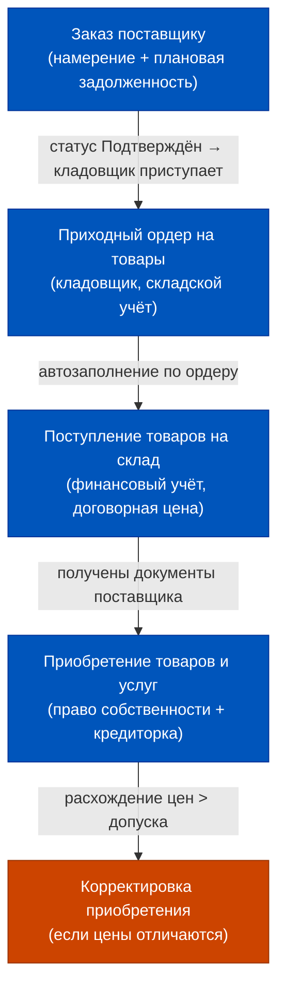
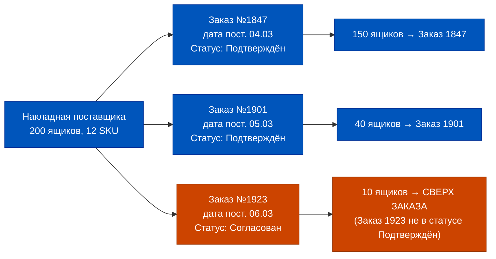
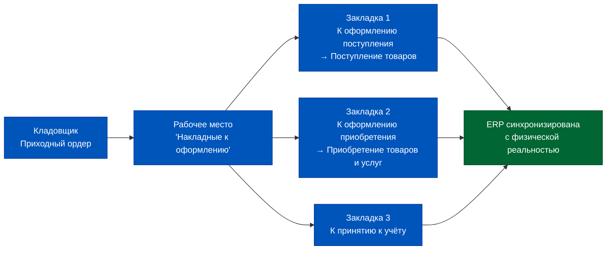
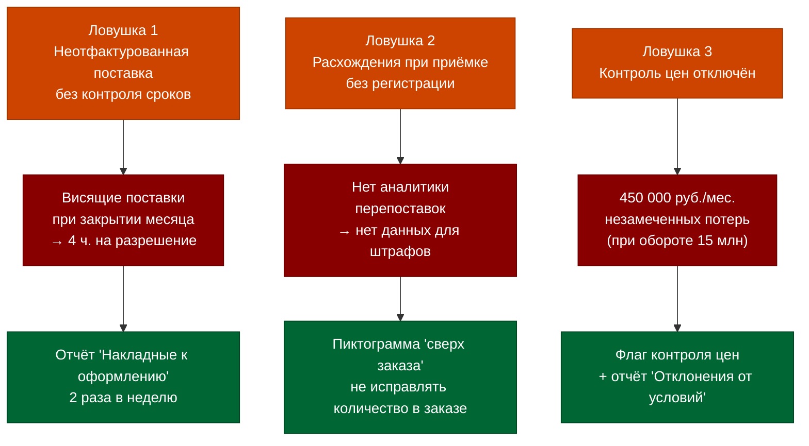
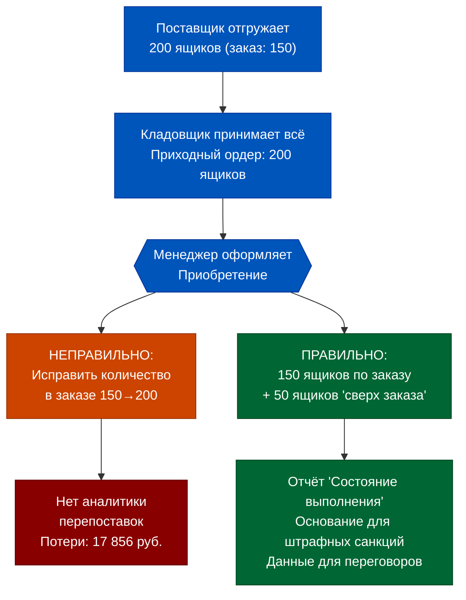

# Week 3, Day 1. Закупки в ERP 2.5: Цепочка документов и контроль цен

## Часть 1. Грузовик у ворот, но поставщик хочет денег: документарный разрыв

Представьте стандартный понедельник в московском дарксторе. Три утра. К воротам подъезжает рефрижератор с 200 ящиками молочки. Кладовщик Антон открывает ворота, пересчитывает паллеты, ставит подпись на бумажной накладной и уходит спать. Товар принят. Физически — да. Юридически? Финансово? Вот тут начинается детектив.

В системе нет ни одного документа, который бы подтверждал: ERP знает, что эти 200 ящиков теперь принадлежат компании. Нет заказа поставщику — значит, нет плановой задолженности. Нет «Приобретения товаров и услуг» — значит, право собственности не перешло. Нет приходного ордера в системе — значит, склад по данным ERP пуст. И когда в 9 утра финансовый директор формирует отчёт по кредиторской задолженности, эти 200 ящиков стоимостью 47 000 рублей существуют только в физическом мире, но не в информационном.

Это называется **документарный разрыв** — расхождение между физической реальностью и её цифровым двойником в учётной системе. В Q-Commerce, где оборачиваемость запасов составляет 2–4 дня, а среднее количество SKU на одном дарксторе достигает 3 000–5 000 позиций, такой разрыв способен накапливаться со скоростью 15–20 необработанных поступлений в неделю. Через месяц компания живёт в двух параллельных реальностях.

Масштаб проблемы хорошо виден в цифрах. Средний даркстор получает 4–7 поставок в сутки. За месяц — 120–210 поставок. Если хотя бы 10% из них обрабатываются с задержкой более 24 часов (что типично без выстроенного процесса), каждый месяц накапливается 12–21 «висящих» поставки. При средней сумме поставки 45 000 рублей — это от 540 000 до 945 000 рублей запасов, которые физически есть на складе, но отсутствуют в финансовом учёте. Кредиторская задолженность перед поставщиками занижена на ту же сумму.

Для финансового директора, который строит прогноз cash flow, эта ошибка означает: реальный отток денег через 2–3 недели (когда поставщики выставят счета) окажется на 540 000–945 000 рублей больше, чем показывает ERP сегодня. В бизнесе с отрицательным оборотным капиталом (а Q-Commerce часто работает именно так) такой сюрприз может быть болезненным.

Ещё острее проблема проявляется в контроле цен. Поставщик привозит товар — и всё хорошо, пока не выясняется, что цена в накладной на 8% выше той, что была зафиксирована при заказе. Кладовщик этого не видит. Менеджер по закупкам об этом узнает через 3 недели, когда разбирает счета. ERP 2.5 умеет ловить такие расхождения автоматически — но только если цепочка документов выстроена правильно.

Сегодня мы разбираем эту цепочку от начала до конца: от намерения купить до того момента, когда товар юридически, финансово и складски считается принятым. Это не технический урок о кликах в интерфейсе — это урок о том, как информация о физической реальности превращается в управленческие данные, и в каких точках эта трансформация может сломаться.


## Часть 2. Происхождение: от закупочного листа к электронному документообороту

До появления ERP-систем закупочный процесс в торговле строился на бумажных журналах и ручных сверках. Товаровед вёл «закупочную тетрадь», где фиксировал заявки поставщикам. Кладовщик ставил штамп на накладной. Бухгалтер раз в неделю сверял стопку бумаг с банковскими выписками. Всё это работало при ассортименте в 200–300 позиций и 2–3 поставщиках.

Когда в конце 1990-х российская торговля начала взрывной рост, бумажная модель сломалась. Сети с 50+ магазинами и 10 000 SKU не могли управлять закупками вручную. Появились первые учётные системы — ещё без концепции «документооборота», просто базы данных с операциями прихода/расхода.

Концептуальный сдвиг произошёл с появлением платформы 1С:Предприятие 8.x и методологии «документ как регистратор хозяйственной операции». Каждое событие в жизни компании теперь фиксировалось отдельным объектом с набором реквизитов и порождало движения в регистрах. Не запись в журнале — а документ с историей, статусами и связями с другими документами.

Q-Commerce добавила к этой четырёхслойной схеме свою специфику: скорость. Когда поставки идут 4–7 раз в сутки и каждая длится 30–60 минут разгрузки, нет времени на задержку между слоями. Ордерная схема, ЭДО и автоматическое заполнение документов по данным предыдущего — это не опции, а обязательные условия работоспособности системы.

Отдельная глава этой эволюции — **ордерная схема документооборота**. До её появления кладовщик и менеджер по закупкам работали с одним документом: кладовщик принимал физически, менеджер проводил финансово — в один и тот же документ. При высокой частоте поставок это создавало конкуренцию за редактирование и ошибки параллельной работы.

Ордерная схема разделила ответственность: кладовщик создаёт свой документ (Приходный ордер), менеджер — свой (Поступление/Приобретение). Каждый работает в своей зоне ответственности, параллельно, без конфликтов. В Q-Commerce с даркстором на 3–5 поставок в сутки и разделением ночной смены (кладовщик) и утренней смены (менеджер) ордерная схема — единственно работающая модель.

В версии 1С:ERP 2.5 эта концепция достигла зрелости. Закупочный процесс теперь описывается цепочкой из **4 ключевых документов**, каждый из которых отвечает за свой слой реальности:

| Документ | Слой реальности | Что порождает |
|---|---|---|
| Заказ поставщику | Намерение / обязательство | Плановую задолженность |
| Приходный ордер на товары | Физический приём | Складской учёт |
| Поступление товаров на склад | Финансовый приём | Финансовый учёт запасов |
| Приобретение товаров и услуг | Право собственности | Фактическую кредиторку |

Важно понять: это не четыре способа сделать одно и то же, а четыре разных слоя, которые могут существовать независимо. Возможные комбинации:

| Ситуация | Заказ | Приходный ордер | Поступление | Приобретение |
|---|---|---|---|---|
| Плановая поставка с предоплатой | Да (плановая задолженность) | Да | Да | Да |
| Неотфактурованная поставка | Да | Да | Да | Позже |
| Экстренная закупка без заказа | Нет | Да (если ордерная схема) | Да | Да |
| Товары в пути (право до физики) | Да | Нет (товар ещё едет) | Нет | Да |
| Закупка через подотчётника | Нет или Да | Нет (неордерная схема) | Да | Да | Физически товар на складе — не значит, что право собственности перешло. Право собственности перешло — не значит, что товар физически прибыл. Q-Commerce научилась эксплуатировать эту многослойность для управления потоком: товары «в пути» могут уже числиться в активах компании, пока рефрижератор ещё едет по кольцевой.


## Часть 3. Глубокое погружение: цепочка документов шаг за шагом

Разберём полный сценарий закупки на ордерном складе — это стандарт для крупного даркстора с автоматизированной приёмкой.

### Шаг 1. Заказ поставщику

Документ «Заказ поставщику» — это контракт намерений. Он фиксирует: что, сколько, по какой цене и когда должно прийти. В 1С:ERP 2.5 заказ не является «проводкообразующим» документом — он не влияет на финансовый результат и не блокируется механизмом закрытия месяца.

Статусная модель заказа включает 4 состояния:
- **На согласовании** — заказ создан, ждёт одобрения внутри компании
- **Согласован** — внутренне одобрен, но поставщик ещё не подтвердил
- **Подтверждён** — поставщик подтвердил дату поставки (критически важно: только при статусе «Подтвержден» заказ участвует в автоматическом распределении при поступлении по нескольким заказам)
- **Закрыт** — работа по заказу завершена

В заказе задаются правила оплаты — этапы с датами и суммами платежей. Если в соглашении с поставщиком прописаны этапы оплаты, они автоматически переносятся в заказ. Если нет — по умолчанию создаётся 1 этап: 100% оплата от даты заказа.

Параметр «Длительность доставки» (берётся из соглашения) позволяет системе автоматически рассчитать дату поступления: Дата отгрузки + Длительность в календарных днях = Дата поступления.


### Шаг 2. Приходный ордер на товары

Когда грузовик приезжает на склад, кладовщик работает в рабочем месте «Приёмка товаров на склад». Там он видит список ожидаемых поставок (распоряжений) — это заказы поставщикам со статусом «Подтвержден». По каждому распоряжению он создаёт **Приходный ордер** — документ складского учёта.

Приходный ордер фиксирует **фактическое** количество: то, что реально выгрузили с машины. Если заказали 150 ящиков, а приехало 200 — кладовщик ставит 200. Это расхождение система запоминает и впоследствии маркирует строки, принятые «сверх заказа».

Важный нюанс: Приходный ордер работает только со складским учётом. Финансовый учёт — кредиторка, себестоимость — он не затрагивает.

### Шаг 3. Поступление товаров на склад (для неотфактурованных поставок)

При неотфактурованной поставке (товар приехал, документов от поставщика ещё нет) менеджер по закупкам создаёт документ **«Поступление товаров на склад»**. Он отражает приход в финансовом учёте по договорной стоимости.

Документ заполняется автоматически по данным Приходного ордера — менеджеру не нужно вручную перебивать строки. Это критически важно при 30–50 позициях в одной поставке.

Поступление товаров на склад **не влияет** на взаиморасчёты с поставщиком — оно лишь вводит товар в финансовый учёт по предварительной оценке.

### Шаг 4. Приобретение товаров и услуг (УПД/накладная)

Когда от поставщика приходят документы — УПД, ТОРГ-12, счёт-фактура — менеджер создаёт документ **«Приобретение товаров и услуг»**. Именно этот документ:
- Фиксирует переход права собственности
- Создаёт **фактическую кредиторскую задолженность** перед поставщиком
- Регистрирует цены поставщика в системе
- Переводит плановую задолженность (из заказа) в фактическую

Документ может быть оформлен по заказу, по соглашению или без них — вручную. При наличии соглашения его условия автоматически заполняют реквизиты документа.



### Поступление по нескольким заказам

Реальность Q-Commerce: один рефрижератор везёт товары по 3–7 разным заказам одновременно. ERP 2.5 умеет это обрабатывать автоматически — при условии, что включена опция «Поступление по нескольким заказам».

Алгоритм распределения работает по **ФИФО по дате поступления**: сначала привязываются строки к заказу с наиболее ранней датой поступления. Условие матчинга строгое: поставщик, контрагент, организация, склад, валюта, соглашение, договор, признак «Цена включает НДС» — всё должно совпадать. Одно расхождение — и строка автоматически помечается как «сверх заказа».



### Бизнес-процесс согласования заказа поставщику

Для заказов, требующих многоэтапного согласования (крупные суммы, нестандартные условия, новые поставщики), ERP 2.5 поддерживает бизнес-процесс «Согласование закупки». По его результату устанавливается статус «Подтверждён» — автоматически, без ручного вмешательства менеджера.

Типовая схема согласования для даркстора:

1. Менеджер по закупкам создаёт Заказ поставщику — статус «На согласовании»
2. Автоматически создаётся задача для руководителя отдела закупок
3. Руководитель проверяет: цена, объём, поставщик — и принимает решение
4. При положительном решении — статус «Согласован» → следующий этап: подтверждение поставщика
5. Поставщик подтверждает дату — статус «Подтверждён» (автоматически по результату задачи «Подвести итоги согласования закупки»)

Для Q-Commerce с ритмом 120–200 заказов в месяц полная маршрутизация согласования имеет смысл только для заказов на сумму выше порогового значения — например, выше 500 000 рублей. Заказы ниже порога проводятся в статус «Подтверждён» напрямую.

### Корректировка приобретения: что делать, когда цены не совпали

После фактуровки — получения УПД от поставщика — может выясниться, что фактические цены отличаются от тех, что были указаны при оформлении неотфактурованной поставки. Это нормальная ситуация: при неотфактурованной поставке используются договорные цены, а поставщик может выставить счёт по чуть иным ценам.

Документ «Приобретение товаров и услуг» при фактуровке отражает **фактическую** стоимость. Если она отличается от той, что была в «Поступлении товаров на склад», формируется разница:

- Если фактическая стоимость **больше** договорной: Дт 41 / Кт 60.НП — доначисление стоимости товаров
- Если фактическая стоимость **меньше** договорной: Дт 60.НП / Кт 41 — сторно излишне принятой стоимости

Корректировки отражаются автоматически при проведении документа «Приобретение» — не нужно создавать отдельных документов корректировки, если расхождение выявляется в момент фактуровки. Отдельный документ «Корректировка приобретения» используется, если расхождение обнаружено позднее или если нужно отразить частичный возврат.

### Статусы исполнения заказа поставщику

В рабочем месте «Заказы поставщикам» каждый заказ имеет индикаторы исполнения:

| Индикатор | Значение |
|---|---|
| Не поступало | Заказ создан, поставка не начата |
| Поступило частично | Приходный ордер или поступление оформлено не на всё количество |
| Поступило полностью | Весь объём заказа принят на склад |
| Не оплачено | Документы поставщика получены, оплата не произведена |
| Оплачено частично | Произведена частичная оплата |
| Оплачено полностью | Все этапы оплаты выполнены |

Эта аналитика критически важна для менеджера по закупкам Q-Commerce: утренняя сверка по «поступило частично» позволяет за 10–15 минут идентифицировать все незакрытые поставки прошлого дня.

### Рабочее место «Накладные к оформлению»

Это центральный интерфейс операционного менеджера по закупкам. Три закладки отражают три очереди работы:

**Закладка «К оформлению поступления»** — список заказов поставщикам, по которым кладовщик уже создал Приходный ордер, но менеджер ещё не создал документ «Поступление товаров на склад». Команда «Оформить → Поступление товаров» создаёт документ автоматически по данным ордера.

**Закладка «К оформлению приобретения (приёмки)»** — список заказов/поступлений, по которым получены документы от поставщика, но «Приобретение товаров и услуг» ещё не создано. Команда «Оформить» создаёт документ приобретения.

**Закладка «К принятию к учёту»** — документы, ожидающие финального проведения.

В Q-Commerce с ритмом поставок 3–5 раз в неделю на каждый даркстор рабочее место «Накладные к оформлению» должно обрабатываться ежедневно утром. Непроработанная очередь длиннее 2 дней — признак операционного отставания.



## Часть 4. Мышление: ловушки документарной цепочки

Три сценария, которые ломают закупочный процесс в реальных дарксторах.

### Ловушка 1. Неотфактурованная поставка без контроля сроков

Ситуация: товар принят на склад, Приходный ордер создан, Поступление товаров на склад проведено. Документы от поставщика не приходят 2 недели. В системе — товар по договорной цене, без кредиторки. Поставщик молчит.

Последствие: при закрытии месяца бухгалтерия обнаруживает «висящие» неотфактурованные поставки. Отдел закупок начинает ручной розыск первичных документов. Среднее время разрешения одного случая — 4 часа.

Решение: настроить отчёт «Накладные к оформлению» с фильтром по дате поступления — заполнять регулярно, не реже 2 раз в неделю.

### Ловушка 2. Расхождения при приёмке без регистрации

Товар принят в количестве, отличном от заказного — но в системе строка не помечена «сверх заказа», а просто исправлено количество в заказе. Теперь система не знает, что было расхождение. Аналитика перепоставок — нулевая.

Последствие: невозможно отследить систематических нарушителей среди поставщиков. Нет данных для переговоров о штрафных санкциях.

Решение: использовать пиктограмму «сверх заказа» — не исправлять количество в заказе, а фиксировать превышение отдельной строкой.

### Ловушка 3. Контроль цен отключён или игнорируется

В соглашении не установлен флаг «Запретить закупки по ценам выше указанных в соглашении». Поставщик регулярно выставляет счета на 3–5% дороже договорной цены — никто не замечает, потому что проверка не автоматизирована.

Последствие: при обороте закупок 15 000 000 рублей в месяц незамеченное превышение цен на 3% = 450 000 рублей ежемесячных потерь.

Решение: включить ценовой контроль в соглашении + настроить отчёт «Отклонения от условий закупки» для регулярного мониторинга.



### Ловушка 4. Товары в пути и расчёты с поставщиком

При схеме «товары в пути» возникает специфический бухгалтерский вопрос: кто несёт право собственности на товар, пока он едет от поставщика на склад?

В ERP 2.5 задолженность перед поставщиком возникает **по результату перехода прав собственности** — то есть при проведении документа «Приобретение товаров и услуг». Документ «Поступление товаров на склад» на взаиморасчёты не влияет.

Практическое следствие для Q-Commerce: если товар отгружен поставщиком 10 марта (дата перехода права по договору), но физически прибыл на склад 12 марта — кредиторская задолженность формируется 10 марта. При ведении расчётов по отсрочке платежа эти 2 дня разницы влияют на расчёт дат платежей.

Правило: дата документа «Приобретение товаров и услуг» должна соответствовать дате перехода права собственности по договору — не дате физической приёмки.

### Ловушка 5. Приёмка от подотчётника

В Q-Commerce распространённая схема: курьер-подотчётник закупает товар на рынке или в небольшом магазине и привозит на даркстор. Эта операция также оформляется через документ «Приобретение товаров и услуг» — с операцией «Закупка у поставщика» и указанием подотчётного лица.

Типичная ошибка: такие поступления проводятся вне заказа поставщику и без привязки к соглашению. В результате:
- Цены не контролируются
- Аналитика по поставщику не накапливается
- Невозможно сравнить «закупку на рынке» с «закупкой у поставщика» по эффективной цене

Рекомендация: даже для подотчётных закупок настроить справочник «поставщиков» (рынок, небольшой магазин) и оформлять хотя бы минимальный заказ поставщику — для аналитики.

## Часть 5. Современный контекст: ЭДО и автоматическая регистрация цен поставщика

Электронный документооборот (ЭДО) изменил закупочную цепочку принципиально: переход права собственности и регистрация первичных документов теперь происходят в режиме реального времени, не с задержкой в 2–5 дней.

В 1С:ERP 2.5 интеграция с ЭДО через сервис «1С:EDI» позволяет:
- Принимать УПД от поставщика в электронном виде
- Автоматически создавать документ «Приобретение товаров и услуг» на основе входящего УПД
- Сверять суммы и позиции с заказом поставщику без ручного ввода

При работе через ЭДО кардинально снижается риск неотфактурованных поставок: документы поступают в систему одновременно с физической доставкой товара, а не через 3–14 дней.

Второй ключевой элемент — **автоматическая регистрация цен поставщика**. Каждый раз, когда проводится документ «Приобретение товаров и услуг», ERP 2.5 может автоматически создать документ «Регистрация цен поставщика» — фиксируя фактические цены последней поставки. Это формирует **прайс-лист поставщика** в системе: история изменения цен по каждой позиции с датой и источником.

Рабочее место «Цены поставщиков (прайс-листы)» позволяет в реальном времени видеть:
- Текущие цены по каждому поставщику и SKU
- Историю изменений (синим — цена выросла, зелёным — упала)
- Процент отклонения от договорной цены

В контексте Q-Commerce это критически важно: молочка и овощи имеют сезонную волатильность цен до 40% в год, и без автоматической регистрации цен продакт-менеджер по логистике просто не видит текущую картину закупочной себестоимости.


### Контрольные точки ЭДО-интеграции для продакт-менеджера

Продакт-менеджер по логистике должен контролировать три ключевых метрики ЭДО-интеграции:

**1. Доля поставщиков, подключённых к ЭДО.** Целевой показатель для зрелой сети: 70–80% оборота закупок через ЭДО. Приоритет подключения: поставщики с частотой поставок 3+ раз в неделю — они генерируют наибольший документооборот.

**2. Срок обработки входящего УПД.** Время от получения электронного УПД до проведения «Приобретения товаров и услуг». Целевой KPI: не более 4 часов. При бумажном документообороте этот же показатель — 2–5 рабочих дней.

**3. Доля автоматически созданных «Приобретений».** Если ЭДО настроен с автосозданием документа — процент «Приобретений», созданных автоматически (не вручную). Целевой KPI: 85–90%. Остаток 10–15% — документы с расхождениями, требующие ручного разбора.

### Регистрация цен поставщика: дисциплина обновления

Прайс-лист поставщика в ERP 2.5 актуален только если регулярно обновляется. Три сигнала, что прайс-лист устарел:

- Отчёт «Отклонения от условий закупки» показывает систематическое отклонение +5–10% — скорее всего, поставщик повысил цены, но в системе они не обновлены
- Менеджеры регулярно получают блокировки при проведении документов — реагируют не анализом, а «отключением контроля»
- Разница между ценой в прайс-листе и фактической ценой поставки превышает 15% — это уже не техническое расхождение, а неактуальный справочник

Частота обновления: при каждом существенном изменении цен поставщика (уведомление о пересмотре прайс-листа) + обязательно в начале каждого квартала.

## Часть 6. Кейс: даркстор принял 200 ящиков вместо 150 и не зафиксировал расхождение

### Контекст

Декабрь 2023 года. Сеть из 12 дарксторов в Москве. Новогодний сезон, оборот вырос на 60% относительно ноября. Поставщик молочной продукции — крупный региональный завод — отгружает сверхнормативно, пытаясь «раздать» остатки перед праздниками.

### Что произошло

Поставщик отгрузил на один из дарксторов 200 ящиков кисломолочки вместо заказанных 150. Кладовщик принял всё — время три ночи, очередь из 4 машин, некогда разбираться. В накладной поставщика: 200 ящиков по цене 312 рублей за ящик = 62 400 рублей.

Менеджер по закупкам, оформляя приобретение, не использовал пиктограмму «сверх заказа» — просто исправил количество в заказе с 150 на 200 ящиков. Система приняла документ без предупреждений.

### Цепочка последствий

**Финансовый учёт:** Кредиторская задолженность выросла на 62 400 рублей вместо запланированных 46 800 рублей (150 × 312). Разница: 15 600 рублей незапланированных обязательств.

**Складской учёт:** Остаток кисломолочки на складе — 200 ящиков. Нормативный заказ рассчитан на 150. Через 2 дня выяснилось, что часть товара не распродаётся — срок годности 5 дней, оборачиваемость не позволяет освоить излишек.

**Аналитика:** Поскольку расхождение не зафиксировано как «сверх заказа», в отчётах нет ни одного признака перепоставки. Этот же поставщик повторил приём 3 раза за декабрь по другим дарксторам — суммарный незапланированный товарный остаток: 47 ящиков кисломолочки на сумму около 14 700 рублей, из которых 38 ящиков списаны по истечении срока годности.

**Потери от несистематизации:** 38 ящиков × 312 рублей = 11 856 рублей прямых потерь от списания. Плюс 4 часа работы управляющего и категорийного менеджера на разбор ситуации = ещё ~6 000 рублей трудозатрат. Итого: ~17 856 рублей по одному инциденту на одном дарксторе.

### Что нужно было сделать в ERP

1. Кладовщик принимает 200 ящиков в Приходном ордере
2. Менеджер в «Приобретении» видит автоматически сформированные 150 строк по заказу
3. Для дополнительных 50 ящиков нажимает пиктограмму «сверх заказа»
4. Система фиксирует: 50 ящиков = незапланированная перепоставка
5. Автоматически формируется аналитический признак для отчёта «Состояние выполнения»
6. В конце месяца отчёт по перепоставкам показывает: данный поставщик превысил заказ 3 раза, суммарно на 150 ящиков — основание для пересмотра условий договора и введения штрафных санкций за самовольное увеличение объёма отгрузки.

### Вывод

Отсутствие признака «сверх заказа» — не просто техническая небрежность. Это потеря управленческой информации о систематических нарушениях поставщика. В сети из 12 дарксторов при 30 поставщиках такая информация — основа переговорной позиции на ежеквартальном контрактном ревью.



## Часть 7. Глоссарий и FAQ

### Глоссарий

**Заказ поставщику** — документ ERP, фиксирующий предварительную договорённость об условиях и сроках поставки. Не является проводкообразующим, не блокируется при закрытии месяца.

**Приходный ордер на товары** — документ складского учёта, оформляемый кладовщиком при физической приёмке товара. Отражает фактическое количество. Не затрагивает финансовый учёт.

**Поступление товаров на склад** — документ финансового учёта для неотфактурованных поставок. Вводит товар в финансовые регистры по договорной стоимости.

**Приобретение товаров и услуг** — ключевой документ закупочного цикла. Фиксирует переход права собственности, создаёт фактическую кредиторскую задолженность.

**Неотфактурованная поставка** — товар физически принят на склад, но первичные документы от поставщика (УПД, ТОРГ-12) ещё не получены.

**Строка «сверх заказа»** — маркировка в документе «Приобретение товаров и услуг» для товара, принятого в количестве, превышающем заказанное.

**Плановая задолженность** — задолженность перед поставщиком, образуемая документом «Заказ поставщику» на даты платежей по правилам оплаты.

**Фактическая задолженность** — задолженность, образуемая документом «Приобретение товаров и услуг» по факту перехода права собственности.

**Ордерная схема документооборота** — схема, при которой складской учёт (Приходный ордер) и финансовый учёт (Поступление/Приобретение) ведутся отдельными документами.

**Регистрация цен поставщика** — документ, автоматически создаваемый при проведении Приобретения и формирующий актуальный прайс-лист поставщика в системе. История изменения цен хранится в полном объёме: можно посмотреть, какая цена была на любую дату в прошлом.

**Структура подчинённости** — графическое представление связей между документами в ERP 2.5: показывает, на основании каких документов созданы текущий и все последующие, и позволяет отследить полную «родословную» операции от заказа до оплаты.

**Рабочее место «Приёмка товаров на склад»** — интерфейс кладовщика в ERP 2.5. Здесь формируются Приходные ордера. Для каждого распоряжения (заказа поставщику) кладовщик видит: что ожидается, в каком количестве и на какую дату. Заполнение ордера происходит путём сканирования штрихкодов или ручного ввода фактического количества.

**Накладная к оформлению** — статус документа в рабочем месте «Накладные к оформлению», означающий, что Приходный ордер создан, но финансовые документы (Поступление / Приобретение) ещё не оформлены. Для менеджера по закупкам — основная очередь ежедневной работы.

### FAQ

**Вопрос: Можно ли оформить Приобретение без предварительного Заказа поставщику?**

Да. Документ «Приобретение товаров и услуг» может быть оформлен как по заказу, так и по соглашению, или вручную без каких-либо распоряжений. Заказ поставщику — инструмент планирования и контроля, а не обязательный элемент цепочки.

**Вопрос: Что происходит с взаиморасчётами, если поступление оформлено, а приобретение — нет?**

Документ «Поступление товаров на склад» не влияет на взаиморасчёты с поставщиком. До оформления «Приобретения» кредиторская задолженность не формируется. Товар в системе числится, но задолженность перед поставщиком — нет.

**Вопрос: Почему заказ не блокируется при закрытии месяца?**

Заказ поставщику — не проводкообразующий документ. Он не влияет на финансовый результат и данные баланса. Поэтому механизм блокировки периода на него не распространяется. Его можно редактировать в любое время без открытия закрытого периода.

**Вопрос: При поступлении по нескольким заказам — как ERP выбирает, к какому заказу привязать строку?**

Алгоритм ФИФО по дате поступления: сначала привязывается заказ с наиболее ранней ожидаемой датой поступления. Если дата поступления не заполнена — ФИФО по дате отгрузки в заказе. Обязательное условие: заказ должен иметь статус «Подтверждён».

**Вопрос: Что делать, если поставщик прислал товар, которого вообще не было в заказе?**

Добавить новую строку в документ «Приобретение» — система автоматически установит признак «сверх заказа». Затем выбрать заказ, «относительно» которого эта строка идёт сверх. Это позволяет корректно вести взаиморасчёты и аналитику перепоставок.

**Вопрос: Как работает агентская схема закупки (через посредника-комиссионера)?**

Это отдельный сценарий, реализованный в ERP 2.5 через операцию «Закупка по агентской схеме через посредника». В этом случае юридически договор с конечным поставщиком заключает посредник, а ваша организация — с посредником. В документах используется специальная операция, позволяющая учесть это разделение сторон сделки. Для Q-Commerce актуально при импорте через торговых представителей.

**Вопрос: Что такое «принятие товара к учёту по нулевой стоимости» и когда это нужно?**

Это сценарий, когда товар нужно принять на склад, но его стоимость ещё неизвестна (например, при бесплатных образцах от поставщика или при акционных поставках). В ERP 2.5 предусмотрен специальный режим оформления: документ поступления проводится с нулевой ценой, а затем, когда стоимость определена, создаётся документ корректировки.

**Вопрос: Каковы реальные KPI закупочного документооборота для Q-Commerce?**

По практике зрелых сетей:
- Время от физической приёмки до проведения Поступления товаров на склад: не более 4 часов (целевой) / не более 24 часов (допустимый)
- Время от получения документов поставщика до проведения Приобретения: не более 8 часов
- Доля неотфактурованных поставок старше 7 дней: не более 2% от общего количества поставок
- Доля расхождений при приёмке, зафиксированных в системе (а не исправленных в заказе): 100% — это требование к дисциплине, а не рекомендация

Эти показатели можно отслеживать через стандартные отчёты ERP: «Накладные к оформлению», «Задолженность поставщикам», «Отклонения от условий закупки». Построение регулярного мониторинга этих KPI — первый шаг от «ERP как системы учёта» к «ERP как системе управления».

### Ключевые цифры урока

| Показатель | Значение |
|---|---|
| Статусов у документа «Заказ поставщику» | 4 (На согласовании, Согласован, Подтверждён, Закрыт) |
| Ключевых документов в закупочной цепочке | 4 (Заказ, Приходный ордер, Поступление, Приобретение) |
| Стоимость незафиксированного расхождения в кейсе | 17 856 руб. (один инцидент) |
| Реквизитов, которые должны совпасть для автораспределения по заказам | 8+ (поставщик, контрагент, организация, склад, валюта, соглашение, договор, НДС) |
| Доля оборота закупок через ЭДО (целевой KPI) | 70–80% |
| Целевое время обработки входящего УПД | не более 4 часов |
| Срок хранения неотфактурованной поставки без фактуровки (тревожный порог) | 7 дней |
| Незапланированные потери при 3% ценовом расхождении на 15 млн руб./мес. | 450 000 руб./мес. |

---


### Итоговая схема: полная цепочка документов закупки

```mermaid
sequenceDiagram
    participant PM as Продакт/Категорийный
    participant ERP as 1C:ERP
    participant SUPP as Поставщик
    participant WH as Склад

    PM->>ERP: Заказ поставщику (статус «Согласован»)
    ERP->>SUPP: Передача заказа (email/EDI)
    SUPP->>ERP: Подтверждение (статус «Подтверждён»)
    SUPP->>WH: Доставка товара
    WH->>ERP: Приходный ордер (физическое поступление)
    Note over ERP: Остатки увеличены в складском регистре
    PM->>ERP: Приобретение товаров и услуг
    Note over ERP: КЗ создана. Себестоимость зафиксирована.
    ERP->>PM: Заказ закрыт


> **Следующий шаг:** В следующем уроке разберём, как соглашения с поставщиками превращают разовые сделки в управляемые партнёрства с фиксированными условиями.


← [[Неделя 2 - День 7 - История грязных НСИ|День 7 (Неделя 2)]] | [[README|Оглавление]] | [[Неделя 3 - День 2 - Соглашения с поставщиками|День 2]] →
