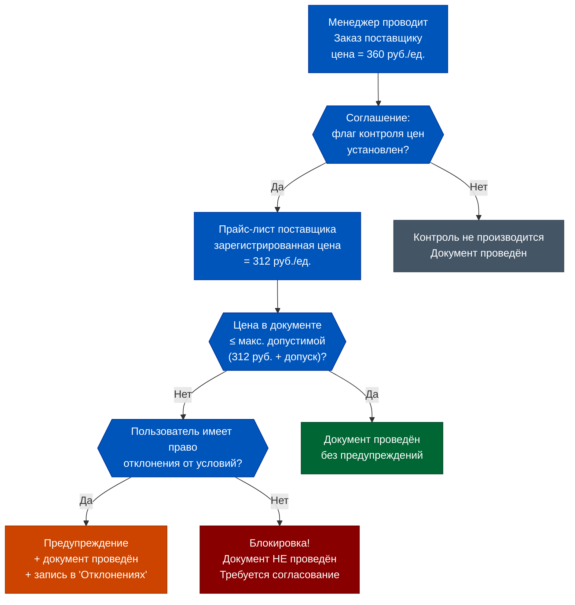
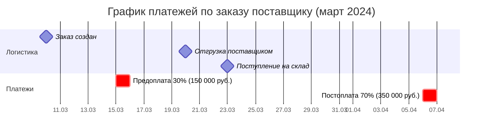
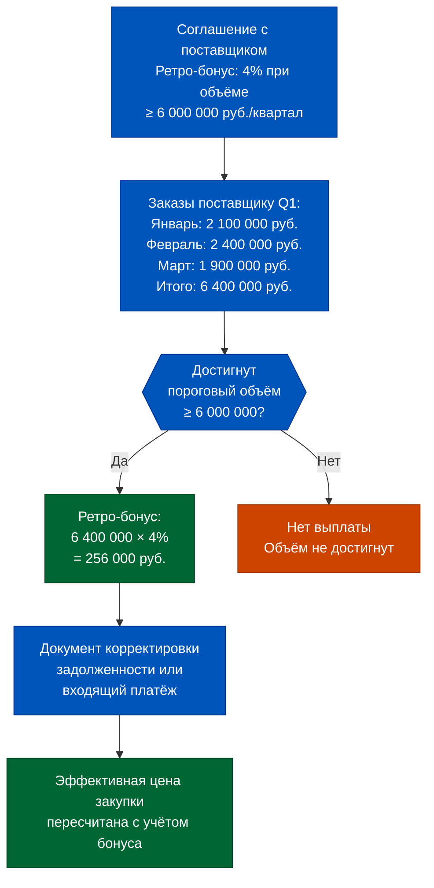
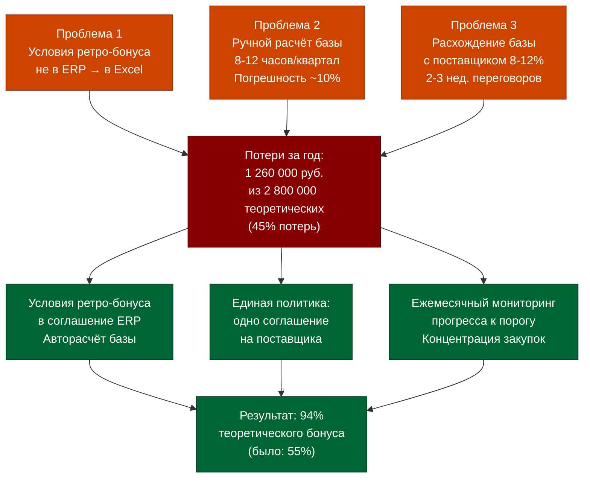

# Week 3, Day 2. Соглашения с поставщиками и графики оплат

## Часть 1. Поставщик поднял цену на 15%, ERP это не знает: последствия

Март 2024 года. Региональный дистрибьютор замороженных полуфабрикатов в одностороннем порядке поднял цены на 15% — ссылаясь на рост стоимости упаковочных материалов и топлива. Уведомление пришло на электронную почту категорийному менеджеру в пятницу вечером. Менеджер поставил письмо в папку «Разобраться в понедельник».

В понедельник была планёрка. Во вторник — аудит. В среду менеджер уволился.

Между тем ERP продолжала работать. Три поставки за эту неделю прошли через цепочку документов: Заказ поставщику, Приходный ордер, Приобретение товаров и услуг. Поставщик выставил счёт по новым ценам. Финансовый отдел оплатил — потому что в системе не было механизма, который бы остановил платёж и сказал: «Стоп. Это на 15% выше, чем должно быть по соглашению».

Итог за одну неделю: 3 поставки × средняя сумма 280 000 рублей × 15% = 126 000 рублей переплаты. За квартал, если паттерн не прерывается: ~1 638 000 рублей.

Что происходит дальше? Через 3 месяца финансовый директор замечает, что маржа категории «заморозка» упала с 28% до 24% — необъяснимо, «рынок что-то изменился». Категорийный менеджер просматривает продажи — всё нормально, объём и средний чек в норме. Никто не смотрит на закупочную цену, потому что никто не помнит историческую. В системе нет зафиксированных договорных цен — только фактические поступления, которые уже включают 15% наценку поставщика.

Детектив этого расследования редко заканчивается быстро. Чаще всего причина обнаруживается случайно: кто-то находит то самое письмо в папке «Разобраться». Или новый менеджер перечитывает договор и замечает расхождение. К тому моменту переплачено 1,6 млн рублей — и ни один рубль из них не вернуть, потому что срок выставления претензий по договору — 30 дней.

Это не фантастика — это стандартный сценарий для компаний, которые используют ERP как систему учёта, а не как инструмент контроля. Разница между двумя подходами находится в одном месте: **архитектура соглашений с поставщиком**.

В 1С:ERP 2.5 соглашение с поставщиком — это не просто справочный документ с реквизитами. Это живой контрольный механизм: если в соглашении установлен запрет закупок по ценам выше указанных, система физически не позволит провести документ с превышением цены пользователю без соответствующих прав. Сегодня мы разбираем, как это устроено.

Но прежде чем перейти к механике — важно понять, почему эта система так часто не используется. Три главные причины:

Первая: **операционное давление**. Менеджер по закупкам получает накладную в 8 утра, поставщик ждёт подтверждения, до открытия магазина 2 часа. Некогда разбираться, почему система выдаёт предупреждение о цене. Проще нажать «Провести всё равно».

Вторая: **организационные силосы**. Коммерческий директор договорился с поставщиком об изменении цен — но не обновил соглашение в ERP. Менеджер по закупкам видит блокировку, не знает о договорённости, звонит в коммерческий, теряет 40 минут. После нескольких таких случаев он перестаёт обращать внимание на предупреждения.

Третья: **неактуальные прайс-листы**. Соглашение есть, контроль включён, но цены в прайс-листе поставщика не обновлялись 8 месяцев. Теперь половина поставок генерирует «ложные» предупреждения — реально цены выросли по договору, но в системе об этом не знают. Контроль стал шумом, который все научились игнорировать.

Решение всех трёх проблем — не технические, а процессные: договорённость о том, кто и когда обновляет прайс-листы в системе, кто имеет право проводить документы с отклонением и при каком пороге.


## Часть 2. Происхождение: от рукопожатия к цифровому соглашению

В докомпьютерную эпоху «соглашение с поставщиком» буквально означало договорённость, зафиксированную в бумажном договоре, который хранился в архиве юридического отдела и был физически недоступен менеджеру по закупкам в момент оформления поставки. Менеджер держал условия в голове. Или не держал.

Первый шаг к цифровизации — перенос основных условий в карточку контрагента в учётной системе. Теперь хотя бы адрес и ИНН были под рукой. Но цены, отсрочки, лимиты — всё это по-прежнему жило в отдельных Excel-файлах или голове менеджера.

Второй шаг — появление «договоров» как объектов в ERP: уже не просто карточка, а документ с реквизитами, к которому можно привязывать операции. Но договор в старых системах — пассивный объект: он описывает условия, но не контролирует их соблюдение.

Параллельно с эволюцией систем менялась и переговорная культура. В 2000-е годы условия закупок — цена, отсрочка, объём — обсуждались преимущественно устно и фиксировались в договорах раз в год. К 2010-м годам, по мере роста сетей, переговоры стали квартальными, условия — более детализированными: появились условия по каждой товарной группе, сезонные корректировки, маркетинговые соглашения. Управлять этим многообразием в Excel стало физически невозможно.

Третий шаг — концепция **соглашения как активного контрольного механизма** в 1С:ERP 2.5. Соглашение теперь:
- Определяет вид цен поставщика (конкретный прайс-лист или вид цен из НСИ)
- Задаёт допустимые диапазоны отклонений цен
- Хранит этапы оплаты (графики платежей)
- Управляет параметрами доставки (срок покупки, длительность доставки)
- Может **блокировать** проведение документов при несоответствии условиям

Важнейший архитектурный принцип ERP 2.5: **соглашение определяет организацию**, а не наоборот. Это означает: нельзя сначала выбрать организацию «ООО РитейлСеть» и потом спросить «а какие у нас соглашения с поставщиком X?». Логика обратная: выбираешь поставщика → система показывает его соглашения → из соглашения подтягивается организация. Для многофилиальных сетей с несколькими юрлицами это принципиально важно: один поставщик может поставлять разным юрлицам по разным соглашениям — и система не позволит «перепутать» организацию. Когда менеджер выбирает поставщика в документе — система показывает список доступных соглашений. Из выбранного соглашения автоматически подтягиваются: организация, склад, валюта, вид цен, признак «Цена включает НДС». Менеджер не задаёт эти параметры вручную — они зафиксированы в соглашении.


## Часть 3. Глубокое погружение: архитектура соглашений с поставщиком

### Структура соглашения в ERP 2.5

Соглашение с поставщиком — документ НСИ (не проводкообразующий), содержащий следующие ключевые блоки:

**Блок 1. Идентификация**
- Поставщик (партнёр) + контрагент
- Организация-покупатель
- Хозяйственная операция: «Закупка у поставщика», «Ввоз из ЕАЭС», «Импорт»
- Статус: открытое / закрытое

**Блок 2. Ценовые условия**
- Вид цены поставщика — ссылка на конкретный вид цен в НСИ
- Флаг «Цена включает НДС»
- Флаг «Запретить закупки по ценам выше указанных в соглашении»
- Настройки допустимых диапазонов цен (максимально допустимые цены закупки)

**Блок 3. Логистические параметры**
- Срок покупки (дней) — используется для расчёта желаемой даты поступления
- Длительность доставки (дней) — для расчёта даты поступления от даты отгрузки
- Склад поставки

**Блок 4. Условия оплаты**
- Этапы оплаты: процент, вариант отсчёта, количество дней, вариант контроля
- Варианты отсчёта: «от даты заказа», «от даты отгрузки», «до даты отгрузки», «от даты поступления»
- Варианты контроля: «Оплата независимо от отгрузки», «Оплата после отгрузки»

Использование соглашений не является обязательным в 1С:ERP 2.5 — но без него теряется весь механизм автоматического контроля. Практика показывает: компании, работающие «без соглашений», как правило, переходят к ним после первого серьёзного ценового инцидента с поставщиком. Стоимость этого инцидента обычно в 10–50 раз превышает трудозатраты на первоначальную настройку соглашений.


### Механизм контроля цен

Ключевой элемент — флаг **«Запретить закупки по ценам выше указанных в соглашении»**. Когда он установлен, система контролирует соответствие цен в документах закупки ценам, зафиксированным в виде цен поставщика.

Контроль работает на двух уровнях:
1. **Уровень вида цен**: цена в заказе/приобретении сравнивается с ценой из зарегистрированного прайс-листа поставщика (документ «Регистрация цен поставщика»)
2. **Уровень допустимых диапазонов**: настройка максимально допустимых цен закупки — может быть задана как процент отклонения от прайс-листа

Если пользователь пытается провести документ с ценами выше допустимых **и у него нет права «отклонения от условий закупок»** — система блокирует проведение. Документ не проведётся.

Для пользователя с правом отклонения система выдаёт предупреждение, но позволяет провести. Контекстный отчёт «Отклонения от условий закупки» фиксирует все такие случаи.



### Этапы оплаты и расчёт графика платежей

Этапы оплаты в соглашении — это шаблон платёжного графика. Когда на основании соглашения создаётся Заказ поставщику, этапы оплаты автоматически копируются в раздел «К оплате» заказа и преобразуются в конкретные плановые даты платежей.

Пример: соглашение с условием «30% предоплаты за 5 дней до отгрузки, 70% через 14 дней от даты поступления».

| Этап | Процент | Вариант отсчёта | Дней | Сумма при заказе на 500 000 руб. |
|---|---|---|---|---|
| 1 | 30% | До даты отгрузки | 5 | 150 000 руб. |
| 2 | 70% | От даты поступления | 14 | 350 000 руб. |

При заказе с датой отгрузки 20 марта и датой поступления 23 марта система автоматически поставит:
- Платёж 1: 15 марта (20 − 5 дней), 150 000 рублей
- Платёж 2: 6 апреля (23 + 14 дней), 350 000 рублей

Плановая задолженность по этим датам видна в отчёте «Задолженность поставщикам по срокам» — ещё до того, как поставка физически оформлена.



### Виды цен поставщика: что это и зачем их несколько

В 1С:ERP 2.5 «вид цены» — это не просто цифра, а именованный тип прайс-листа. Один поставщик может иметь несколько видов цен:

- «Базовый прайс-лист» — стандартные закупочные цены
- «Акционные цены» — временные скидки на конкретные позиции
- «Цены для ключевых клиентов» — специальные условия при больших объёмах
- «Сезонные цены» — цены с декабря по февраль, когда часть сырья дорожает

Соглашение с поставщиком привязывается к конкретному виду цен. При создании заказа или приобретения система подтягивает цены именно из этого вида. Если поставщик прислал акционный прайс-лист — нужно либо обновить зарегистрированные цены в базовом виде, либо создать новый вид цен «Акционный» и создать соответствующее соглашение.

Частая ошибка: все цены поставщика хранятся в одном виде цен, который периодически перезаписывается. В результате теряется история: невозможно понять, по какой цене закупали молоко в сентябре 2023 года. Правильная практика: создавать отдельный вид цен для каждого значимого прайс-листа с датой начала действия — тогда история сохраняется.

### Связь соглашения с договором

В ERP 2.5 сосуществуют два объекта: **договор** (юридический документ) и **соглашение** (операционный инструмент). Это не одно и то же.

Договор хранит юридически значимые условия: реквизиты сторон, предмет, срок, условия расторжения. К одному договору может быть привязано несколько соглашений — например, для разных складов одной организации.

Соглашение определяет операционные параметры: какой прайс-лист использовать, какой склад, какие этапы оплаты. При проведении документа система использует именно соглашение — договор напрямую в расчётах не участвует (кроме случаев, когда расчёты ведутся «по договорам»).

Для Q-Commerce стандартная конфигурация: 1 договор → 1–3 соглашения (по числу дарксторов, куда поставщик делает регулярные поставки).


## Часть 4. Мышление: контроль цен при поступлении и допустимые отклонения

### Почему «нулевое допустимое отклонение» — это плохая идея

Интуиция подсказывает: чем жёстче контроль, тем лучше. Поставим 0% допустимого отклонения — и никаких переплат. На практике это создаёт операционный ад.

У поставщиков есть объективные причины для микроотклонений цен:
- Округление при конвертации валют (поставки из Белоруссии, Армении)
- Пересчёт цен при изменении НДС или акцизов
- Технические расхождения в 1–2 копейки при разных алгоритмах округления

Если допустимое отклонение = 0%, каждое такое расхождение генерирует блокировку документа. Менеджер тратит 15–20 минут на ручное согласование. При 50 поставщиках и 200 документах в месяц — это 50–100 часов операционных потерь в месяц на борьбу с копеечными расхождениями.

Рекомендуемая практика:
- Для стратегических поставщиков (доля в закупках > 15%): допустимое отклонение 0,5–1%
- Для стандартных поставщиков: 2–3%
- Верхний порог блокировки (независимо от права пользователя): 5% — требует согласования руководителя

### Правило «50% от SKU» для ценового контроля

Практика показывает: нет смысла вести прайс-листы по всем 5 000 SKU. Достаточно покрыть **топ-20% SKU по доле в закупочном обороте** — это, как правило, 80% суммарных закупок (принцип Парето). Для этих позиций ценовой контроль включается на максимальную жёсткость. Для оставшихся 80% SKU — мониторинг без блокировки, только уведомления.

В ERP 2.5 это реализуется через разные виды цен поставщика: основной прайс-лист с контролем для топ-SKU и информационный прайс-лист для остальных.

### Что проверять в отчёте «Отклонения от условий закупки»

Отчёт формируется из контекста документа заказа или приобретения. Показывает:
- Какие строки имеют цену выше соглашения
- Размер отклонения в рублях и процентах
- Кто из пользователей провёл документ с отклонением (аудит)

Регулярный мониторинг (раз в неделю) позволяет выявлять паттерны: если один поставщик систематически выставляет счета на 4–5% дороже соглашения — это предмет для переговоров, а не для индивидуального согласования каждого документа.

### Практическое правило: «Три вопроса перед ревью поставщика»

Перед ежеквартальным ревью с поставщиком продакт-менеджер по логистике должен подготовить 3 блока данных из ERP:

**Блок 1. Ценовая дисциплина:** отчёт «Отклонения от условий закупки» за квартал. Покажет: сколько документов прошло с ценой выше соглашения, на сколько процентов, суммарная сумма переплаты. Это сильный переговорный аргумент.

**Блок 2. Выполнение объёмных обязательств:** отчёт «Задолженность поставщикам» — суммарный объём закупок за квартал. Нужен для расчёта ретро-бонуса и для проверки, не ниже ли объём порогового значения по соглашению.

**Блок 3. Логистическая точность:** из документов «Приобретение товаров и услуг» — доля поставок с расхождениями (строки «сверх заказа»), доля неотфактурованных поставок, средняя задержка между физической приёмкой и фактурированием. Это данные для обсуждения операционной дисциплины поставщика.

Без автоматизированного соглашения эти три блока данных не существуют — они либо не собираются вовсе, либо требуют 8–12 часов ручной выборки.


## Часть 5. Современный контекст: ретро-бонусы поставщиков в ERP 2.5

Ретро-бонус (или ретробонус, или маркетинговая выплата) — денежное вознаграждение, которое поставщик выплачивает торговой сети по итогам периода при достижении согласованного объёма закупок. В Q-Commerce это стандартная практика: типичные размеры ретро-бонусов составляют 3–8% от оборота.

Математика: сеть из 15 дарксторов, суммарный оборот закупок у конкретного поставщика 8 000 000 рублей в квартал, ретро-бонус 4% = 320 000 рублей квартального дохода. Это уже не копейки.

### Как ретро-бонус работает в учёте

В 1С:ERP 2.5 ретро-бонусы поставщиков — отдельный учётный объект, связанный с соглашением. Механизм:

1. В соглашении с поставщиком настраиваются условия ретро-бонуса: база (объём закупок за период), ставка (процент), периодичность расчёта (ежемесячно / ежеквартально)
2. По итогам периода формируется документ «Выплата маркетинговых услуг» или корректировочный документ снижения задолженности
3. Сумма ретро-бонуса уменьшает фактическую кредиторскую задолженность перед поставщиком или выплачивается отдельно
4. В управленческой отчётности ретро-бонус отражается как снижение эффективной закупочной цены

Типичная ошибка: ретро-бонус учитывается «постфактум» — менеджер помнит о нём, но в системе он нигде не зафиксирован. В результате при расчёте маржинальности категории используется валовая закупочная цена без учёта бонуса. Реальная маржа оказывается на 3–5% выше, чем показывает система, — но это ложный оптимизм: компания не управляет фактором, который обеспечивает этот результат.



### Эффективная цена vs. номинальная цена

Управленческое решение по поставщику нужно принимать на основе **эффективной закупочной цены** — с учётом ретро-бонусов, маркетинговых выплат и логистических компенсаций.

Пример: поставщик А предлагает йогурт по 85 рублей/штука без бонусов. Поставщик Б — по 90 рублей/штука, но с ретро-бонусом 6% и компенсацией логистики 2%.

Эффективная цена у поставщика Б: 90 × (1 − 0,06 − 0,02) = 90 × 0,92 = **82,8 рубля/штука**.

По номинальной цене проигрывает. По эффективной — выигрывает 2,2 рубля на штуке, или ~2,6%. При закупках 100 000 штук в квартал: 220 000 рублей дополнительной маржи.

ERP 2.5 способна рассчитывать эффективную цену автоматически — при условии, что ретро-бонусы корректно зарегистрированы в соглашении.

### Маркетинговые услуги vs. ретро-бонус: юридическая и учётная разница

В российской практике ритейла сложилась неоднозначная ситуация: законодательство о торговле (Федеральный закон №381-ФЗ) ограничивает размер бонусов, которые поставщик может выплачивать ритейлеру, — не более 5% от цены приобретённых продовольственных товаров (для продовольственных сетей с выручкой > 400 млн рублей в год).

На практике это привело к тому, что часть бонусов «переименовывается» в «оплату маркетинговых услуг» — продвижение на полке, размещение в каталоге, мерчандайзинговые услуги. Юридически это договор оказания услуг, а не бонусная выплата.

Учётно в ERP 2.5 разница существенна:
- **Ретро-бонус** — корректирует дебиторскую задолженность поставщика или выплачивается как возврат части стоимости товара
- **Маркетинговые услуги** — отражаются как выручка от реализации услуг (Дт 62 / Кт 90), облагаются НДС

Продакт-менеджер должен знать: при работе с Q-Commerce, которая не подпадает под ограничения 381-ФЗ (например, суммарная выручка сети < 400 млн рублей), возможна более гибкая структура бонусов. При работе с крупными сетями — необходима консультация с юридическим отделом о правомерной структуре соглашений.

В любом случае, цифровая регистрация условий в ERP — обязательное условие для расчёта фактических выплат и их корректного отражения в бухгалтерском учёте.

### Отчёт «Задолженность поставщикам по срокам»: инструмент cash flow management

Соглашение с этапами оплаты автоматически создаёт **плановую задолженность** в отчёте «Задолженность поставщикам по срокам». Это означает, что cash flow прогноз по поставщикам формируется автоматически — без ручного составления таблиц Excel.

Структура отчёта: поставщик → заказ/договор → даты плановых платежей → суммы. Можно смотреть как текущую задолженность (уже просроченная + текущая), так и будущую (плановая по открытым заказам).

Для финансового директора Q-Commerce это позволяет строить 2-недельный прогноз выплат поставщикам с точностью до конкретного дня. При 40–60 активных поставщиках ручное составление такого прогноза занимало бы 3–4 часа еженедельно. Автоматический отчёт — 5 минут.

Важный нюанс: отчёт показывает только **плановую** задолженность по заказам и **фактическую** по приобретениям. Если заказы поставщику не создаются (работа «без заказов»), плановая часть отчёта будет пустой — только фактическая задолженность по уже полученным поставкам.

## Часть 6. Кейс: сеть дарксторов согласовала ретро-бонус 3%, но ERP не умела его считать

### Контекст

Сеть из 8 дарксторов в Санкт-Петербурге, начало работы — конец 2021 года. Три крупных поставщика согласились на ретро-бонусные условия: 3% при квартальном обороте более 4 000 000 рублей, 5% при обороте более 7 000 000 рублей. Условия прописаны в коммерческих договорах.

Суммарный оборот закупок у трёх поставщиков: около 14 000 000 рублей в квартал. Теоретический ретро-бонус по максимальной ставке: 700 000 рублей в квартал.

### Что пошло не так

**Проблема 1: Соглашения в ERP не содержали условий ретро-бонуса.** Коммерческий директор считал, что соглашения в ERP — «для закупочников», а ретро-бонусы — «финансовый вопрос». Реальные условия жили в Excel-файле у категорийного менеджера.

**Проблема 2: Нет автоматического расчёта базы.** Для расчёта ретро-бонуса нужно было суммировать объём закупок по каждому поставщику за квартал. Это делалось вручную — раз в квартал, занимало 8–12 часов. Погрешность: менеджер не всегда правильно включал все документы (некоторые приобретения проходили по другому контрагенту того же поставщика).

**Проблема 3: Поставщик оспаривал базу.** Поставщик рассчитывал базу по своим отгрузкам, компания — по своим приобретениям. Расхождение достигало 8–12% из-за неотфактурованных поставок и разных дат отражения операций. Согласование каждого квартала превращалось в 2–3-недельные переговоры.

**Итог за год работы:** Из теоретических 2 800 000 рублей годового ретро-бонуса (700 000 × 4 квартала) фактически получено 1 540 000 рублей — 55%. Потери: 1 260 000 рублей, из которых:
- 380 000 рублей — неверный расчёт базы (часть закупок не включена)
- 420 000 рублей — оспорено поставщиком из-за расхождений в датах
- 460 000 рублей — два квартала не достигнут порог 7 000 000 рублей, хотя с правильным планированием и концентрацией закупок порог был бы достижим

### Что было сделано

**Шаг 1.** В соглашения с тремя поставщиками добавлены условия ретро-бонуса с автоматическим расчётом базы за квартал.

**Шаг 2.** Введена единая политика: все закупки у поставщика должны идти через одно соглашение — исключён вариант с разными контрагентами одного поставщика в разных документах.

**Шаг 3.** Настроен отчёт «Задолженность поставщикам» с группировкой по кварталу — базовый документ для сверки с поставщиком.

**Шаг 4.** Введён ежемесячный мониторинг прогресса к порогу: если к концу второго месяца квартала объём < 60% от порогового — принимается решение о концентрации закупок у конкретного поставщика.

**Результат через 2 квартала:** Фактически получено 94% теоретического ретро-бонуса против 55% в предыдущем году. Дополнительный эффект: более предсказуемый cash flow (поставщики стали быстрее согласовывать, так как расчётная база стала прозрачной для обеих сторон).



## Часть 7. Глоссарий и FAQ

### Глоссарий

**Соглашение с поставщиком об условиях закупки** — документ НСИ в ERP 2.5, определяющий все параметры взаимодействия с поставщиком: вид цен, условия оплаты, логистические параметры, настройки контроля цен.

**Вид цены поставщика** — классификатор прайс-листов в НСИ. К одному поставщику может быть привязано несколько видов цен (например, «Базовый прайс-лист», «Прайс-лист для сезонных закупок»). Соглашение определяет, какой вид цен используется.

**Регистрация цен поставщика** — документ, фиксирующий фактические цены по конкретному поставщику на конкретную дату. Является основой для ценового контроля при проведении документов закупки.

**Допустимый диапазон цен** — настройка в соглашении, задающая максимально допустимое отклонение цены в документе от зарегистрированной цены поставщика.

**Плановая задолженность** — задолженность перед поставщиком, формируемая документом «Заказ поставщику» на плановые даты платежей. Не является фактической кредиторкой.

**Фактическая задолженность** — задолженность, формируемая документом «Приобретение товаров и услуг» по факту перехода права собственности.

**Этапы оплаты** — шаблон платёжного графика в соглашении. Может содержать несколько этапов с разными процентами, вариантами отсчёта и количеством дней.

**Ретро-бонус (ретробонус)** — денежное вознаграждение от поставщика торговой сети по итогам периода при достижении согласованного объёма закупок. Типичный размер в Q-Commerce: 3–8% от оборота.

**Эффективная закупочная цена** — номинальная цена, скорректированная на все бонусные выплаты и компенсации от поставщика. Используется для корректного расчёта маржинальности категории.

**Отчёт «Отклонения от условий закупки»** — контекстный отчёт ERP, показывающий строки документов, в которых цены отличаются от зафиксированных в соглашении. Инструмент аудита ценовой дисциплины.

### FAQ

**Вопрос: Как настроить напоминание о приближающемся ревью цен?**

В ERP 2.5 нет встроенного механизма «напомни обновить прайс-лист через 90 дней». Практический подход: использовать поле «Комментарий» в соглашении с указанием следующей плановой даты ревью, плюс настроить ежеквартальный отчёт «Список соглашений с датой последнего обновления цен» — смотреть, у кого прайс-лист не обновлялся больше 60 дней.

**Вопрос: Обязательно ли использовать соглашение — нельзя ли работать просто с договором?**

В ERP 2.5 соглашение — не замена договору, а дополнительный объект. Договор — юридический документ. Соглашение — операционный инструмент контроля. Можно работать без соглашения: тогда все параметры вводятся вручную в каждом документе, контроль цен отсутствует, этапы оплаты не копируются автоматически.

**Вопрос: Что значит «соглашение определяет организацию»?**

В ERP 2.5 при выборе поставщика в документе закупки система показывает список соглашений. Из выбранного соглашения автоматически подставляется организация-покупатель. Нельзя «выбрать организацию и потом посмотреть, какие соглашения с этим поставщиком под неё есть» — логика обратная. Это важно при работе нескольких юридических лиц в одной базе ERP.

**Вопрос: Что происходит с плановой задолженностью при отмене заказа?**

При закрытии или удалении заказа поставщику плановая задолженность, сформированная этим заказом, аннулируется. Фактическая задолженность (из «Приобретения») — не аннулируется, её нужно корректировать отдельным документом.

**Вопрос: Можно ли в одном соглашении указать разные цены для разных складов (дарксторов)?**

Нет: одно соглашение привязано к одному складу. Для поставок на разные склады (дарксторы) нужно несколько соглашений с одним поставщиком. Это позволяет гибко настраивать ценовые условия для каждой точки доставки.

**Вопрос: Что происходит, если поставщик закрыт (соглашение в статусе «Закрыто»)?**

При закрытии соглашения оно исчезает из списка выбора в документах закупки — менеджер просто не сможет его выбрать. Уже созданные документы (заказы, приобретения) по закрытому соглашению остаются в системе без изменений. Закрытие соглашения не отменяет уже возникшие обязательства.

**Вопрос: Можно ли изменить соглашение в уже созданном заказе поставщику?**

Да, если заказ ещё не проведён или не закрыт. При изменении соглашения все параметры (организация, склад, вид цен, этапы оплаты) перезаполняются из нового соглашения. Цены в строках документа могут быть обновлены командой «Заполнить цены». Важно: смена соглашения может изменить организацию-покупателя — это влияет на налоговый учёт.

**Вопрос: Как работает срок покупки в соглашении и зачем он нужен?**

Срок покупки (в днях) — параметр соглашения, используемый для расчёта «Желаемой даты поступления» в заказе поставщику: Дата заказа + Срок покупки = Желаемая дата поступления. Это не жёсткое ограничение, а плановый ориентир. Для Q-Commerce типичные значения: фреш-поставщики — 1–2 дня, бакалея — 3–5 дней, импортные товары — 14–30 дней.

### Ключевые цифры урока

| Показатель | Значение |
|---|---|
| Потенциальная переплата при необнаруженном росте цен на 15% | 126 000 руб. за одну неделю (3 поставки × 280 000 руб.) |
| Операционные потери при допустимом отклонении 0% | 50–100 ч./мес. на согласование |
| Рекомендуемое допустимое отклонение для стратегических поставщиков | 0,5–1% |
| Доля SKU, покрывающих 80% оборота закупок (принцип Парето) | 20% от ассортимента |
| Теоретический ретро-бонус в кейсе (год) | 2 800 000 руб. |
| Фактически полученный ретро-бонус до автоматизации | 1 540 000 руб. (55%) |
| После автоматизации соглашений | 94% теоретического |
| Типовые ставки ретро-бонуса в Q-Commerce | 3–8% от оборота |
| Эффективная цена при бонусе 6% + компенсация логистики 2% от 90 руб. | 82,8 руб./шт. |
| Экономия на 100 000 шт. квартала vs поставщик без бонуса | 220 000 руб. |

**Вопрос: Как ретро-бонус влияет на себестоимость товаров в ERP?**

Зависит от учётной политики. Вариант 1: ретро-бонус уменьшает кредиторскую задолженность — тогда он снижает эффективную стоимость закупки. Вариант 2: ретро-бонус отражается как прочий доход — тогда себестоимость товаров не пересчитывается. Второй вариант проще с точки зрения учёта, но искажает маржинальность категории.

---

### Чек-лист настройки соглашения с поставщиком

Перед тем как соглашение считается «готовым к работе», проверьте 10 пунктов:

- [ ] Поставщик (партнёр) и контрагент указаны корректно
- [ ] Хозяйственная операция выбрана (Закупка у поставщика / Ввоз из ЕАЭС / Импорт)
- [ ] Организация-покупатель и склад назначены
- [ ] Вид цены поставщика привязан и прайс-лист актуален (дата обновления < 60 дней)
- [ ] Флаг «Запретить закупки по ценам выше» установлен (для стратегических поставщиков)
- [ ] Допустимое отклонение цены задано (не 0% — см. Часть 4)
- [ ] Этапы оплаты заполнены (минимум 1 этап с процентом и вариантом отсчёта)
- [ ] Срок покупки и длительность доставки проставлены
- [ ] Соглашение протестировано на одном тестовом заказе
- [ ] Права пользователей проверены: кто может отклонять условия, кто — нет

Пять минут на этот чек-лист при создании соглашения экономят часы разбора инцидентов.


### Матрица решений: когда типовое, когда индивидуальное соглашение

```mermaid
flowchart TD
    Q1{"Поставщик работает
с несколькими вашими
юрлицами?"}
    Q1 -->|"Да"| Q2{"Условия одинаковые
для всех юрлиц?"}
    Q1 -->|"Нет"| Q3{"Стандартные условия
рынка?"}
    Q2 -->|"Да"| TYP["Типовое соглашение
+ привязка к организациям"]
    Q2 -->|"Нет"| IND["Индивидуальные
соглашения для каждого ЮЛ"]
    Q3 -->|"Да"| TYP2["Типовое соглашение
из библиотеки шаблонов"]
    Q3 -->|"Нет"| IND2["Индивидуальное соглашение
с уточнёнными условиями"]

    style TYP fill:#005500,color:#fff
    style TYP2 fill:#005500,color:#fff
    style IND fill:#0055BB,color:#fff
    style IND2 fill:#0055BB,color:#fff

← [[Неделя 3 - День 1 - Закупки|День 1]] | [[README|Оглавление]] | [[Неделя 3 - День 3 - Логика обеспечения|День 3]] →
