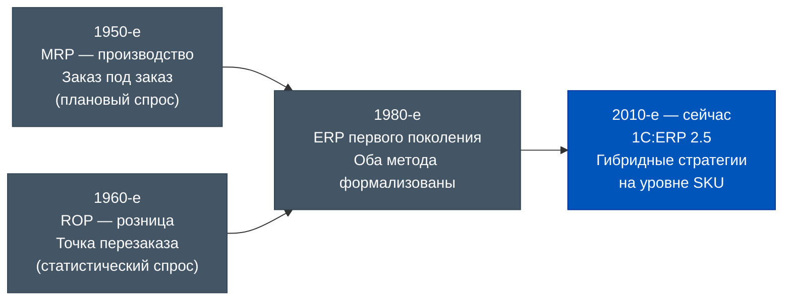
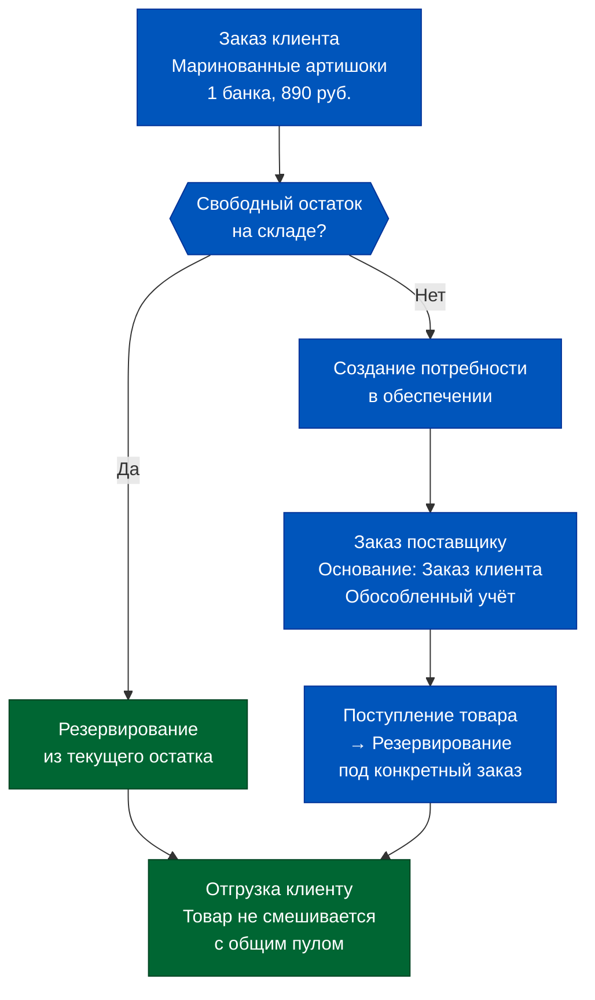
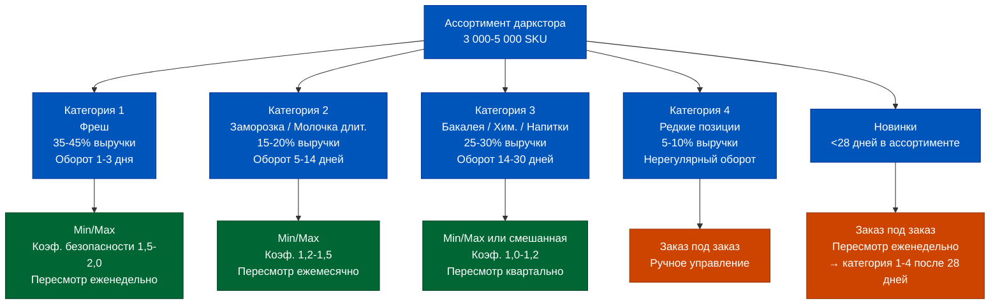
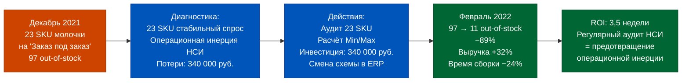

# Week 3, Day 3. Логика обеспечения: «Заказ под заказ» vs «Поддержание запасов»

## Часть 1. Один и тот же товар: у одного даркстора всегда есть, у другого — дефицит

Январь 2023 года. Два даркстора одной сети в одном районе Москвы. Расстояние между ними — 2,1 километра. Один и тот же товар: молоко ультрапастеризованное 1 л, СТМ поставщика.

Даркстор А: товар всегда есть. Уровень наличия в течение месяца — 94%. Средний остаток на полке — 47 упаковок. Ни одного случая отсутствия в пиковые часы. Рейтинг даркстора в приложении: 4,8 звезды.

Даркстор Б: за тот же месяц — 11 эпизодов out-of-stock. Средняя продолжительность каждого — 3,7 часа. Отменённые заказы клиентов из-за отсутствия молока: 68 штук на сумму около 2 700 рублей в выручке. Плюс репутационный ущерб: из этих 68 клиентов 19 открыли приложение конкурента. Рейтинг даркстора: 4,4 звезды. Тренд — снижается третий месяц подряд.

Управляющий сетью получил оба отчёта в один день — отчёт по уровню наличия и отчёт по рейтингам. Связь между ними не была очевидной: у него не было инструмента, который бы автоматически сопоставил «рейтинг 4,4» с «11 out-of-stock по молоку». Поиск причины занял 2 недели. Решение — ещё 2 недели настройки. Итого: почти месяц деградации сервиса, который стоил сети около 15–20 постоянных клиентов.

Одна сеть. Один поставщик. Одно и то же соглашение. Одна ERP. Разница в одной настройке: **схема обеспечения**.

В дарксторе А была настроена схема «Поддержание запасов» с минимальным остатком 30 упаковок и максимальным 80. Система автоматически формировала заказ поставщику каждый раз, когда остаток опускался ниже 30. Менеджер по закупкам не принимал ручное решение — система делала это сама.

В дарксторе Б работала схема «Заказ под заказ» — каждый заказ поставщику формировался только при наличии заказа клиента или вручную. Для молока с суточным спросом 25–40 упаковок это было катастрофой: менеджер не успевал за динамикой.

Сегодня мы разбираем две принципиально разные философии обеспечения запасами — как они устроены в ERP 2.5, когда каждую применять и какова цена ошибки в выборе.


## Часть 2. Происхождение: от ручного заказа к алгоритмическому обеспечению

Два даркстора. Один и тот же товар. Два совершенно разных операционных результата. Но что именно означает «одна настройка»? Это не параметр интерфейса — это выбор философии управления запасами, который определяет, как система реагирует на каждое изменение спроса.

Первая «логика обеспечения» в истории торговли — это кладовщик, который каждое утро обходил полки и записывал, что заканчивается. Его опыт и интуиция были алгоритмом. Параметры этого алгоритма жили в голове, не воспроизводились и терялись при смене человека.

Первая формализация произошла в производственной логистике в 1950-е годы — метод MRP (Material Requirements Planning). Ключевая идея: потребность в материалах рассчитывается из производственного плана «сверху вниз». Это прототип схемы «заказ под заказ» — производить только то, что нужно для конкретного заказа.

Параллельно в розничной торговле развивалась логика «поддержания запасов»: не «сколько нужно для конкретного заказа», а «сколько нужно держать на полке, чтобы удовлетворить статистический спрос». Появились концепции точки перезаказа (Reorder Point) и целевого уровня запасов (Target Stock Level).

Слияние двух подходов в рамках одной системы произошло в 1990-е с появлением ERP-систем класса SAP R/3 и затем решений на базе Oracle. В российском ритейле массовое внедрение ERP с функцией управления запасами началось в 2005–2010 годах — крупные сети (Магнит, X5, Лента) внедряли западные системы, средний бизнес адаптировал 1С:Предприятие. Концепция автоматического расчёта потребностей стала доступна российским компаниям широко только с появлением 1С:ERP 2.0+ в 2013–2014 годах.

К концу 1990-х годов обе логики были формализованы в ERP-системах как два базовых метода пополнения:

- **Min/Max (Minimum/Maximum)**: держать запас между минимальным и максимальным уровнем. Заказ формируется, когда остаток падает ниже Min; объём заказа = Max − текущий остаток.
- **Order-to-Order (Заказ под заказ)**: пополнение инициируется конкретным заказом клиента или ручным решением. Запас не создаётся «на склад».

В 1С:ERP 2.5 эти два метода реализованы в разделе «Обеспечение потребностей» и доступны как настройки на уровне номенклатуры, склада и способа обеспечения. Они не противоречат друг другу — правильная стратегия предполагает их комбинацию для разных категорий. Именно в этой комбинации и скрывается конкурентное преимущество: один даркстор с 3 000 SKU, из которых 2 400 обслуживаются автоматически по Min/Max, даёт менеджеру по закупкам свободное время на управление оставшимися 600 критическими позициями и на переговоры с поставщиками. Другой — с теми же 3 000 SKU «на ручном» — просто тонет в операционной рутине.



## Часть 3. Глубокое погружение: два режима обеспечения в ERP 2.5

### Схема «Заказ под заказ»

В схеме «Заказ под заказ» заказ поставщику формируется **только при наличии конкретного запроса**: заказа клиента, внутренней потребности или ручного решения менеджера.

Цепочка в ERP 2.5:
1. Поступает Заказ клиента
2. Система проверяет: есть ли свободный остаток на складе для резервирования?
3. Если нет — создаётся потребность в обеспечении
4. Менеджер по закупкам или система автоматически формирует Заказ поставщику
5. После поступления товара — резервирование под Заказ клиента

Ключевой параметр: в Заказе поставщику указывается **Заказ клиента** как основание — это создаёт обособленный учёт: товар, купленный «под» конкретного клиента, не попадает в общий пул запасов.

При ведении обособленного учёта в рамках сделки можно отслеживать валовую прибыль по конкретной сделке с учётом затрат на поставку.

**Для Q-Commerce это работает для:**
- Нестандартных позиций: товары для особых событий, оптовые заказы корпоративных клиентов
- Крупногабаритных товаров: нет смысла держать 10 единиц кофемашин на складе — лучше заказать под конкретного покупателя
- Товаров с нулевым регулярным спросом: специи редких сортов, экзотические фрукты по предзаказу
- Сезонных товаров при первом вводе в ассортимент (до накопления статистики спроса)



### Схема «Поддержание запасов» (Min/Max)

В схеме «Поддержание запасов» система автоматически поддерживает остаток товара в заданном диапазоне: между минимальным (Min) и максимальным (Max) уровнями.

**Алгоритм пополнения:**
- Текущий остаток отслеживается в реальном времени
- Когда остаток опускается ниже **Min** — создаётся потребность в пополнении
- Объём заказа = **Max − текущий остаток** (пополнение до максимума)
- Если остаток между Min и Max — заказ не формируется

**Параметры Min и Max задаются на уровне:**
- Номенклатура + Склад (даркстор): позволяет для одного и того же товара задать разные уровни на разных точках
- Организация + Склад: единые параметры для всей организации

**Как рассчитать Min и Max для Q-Commerce?**

Min = Средний дневной спрос × Время пополнения (дней) × Коэффициент безопасности

Пример для молока на дарксторе:
- Средний дневной спрос: 32 упаковки
- Время пополнения (от заказа до поступления): 1,5 дня
- Коэффициент безопасности: 1,5 (высокий для фреша)
- Min = 32 × 1,5 × 1,5 = 72 упаковки

Max = Min + Экономичная партия заказа

Экономичная партия для молока (поставки 3 раза в неделю):
- 32 упаковки/день × (7/3 дня между поставками) = ~75 упаковок
- Max = 72 + 75 = 147 упаковок

Итого: при падении остатка ниже 72 упаковок — автозаказ 75 упаковок (до 147).


### Сравнительная таблица двух схем

| Критерий | Заказ под заказ | Поддержание запасов (Min/Max) |
|---|---|---|
| Инициатор заказа | Заказ клиента / ручное решение | Падение ниже Min автоматически |
| Кому подходит | Уникальные/редкие товары | Товары с регулярным спросом |
| Риск затоваривания | Минимальный | Средний (при завышенном Max) |
| Риск дефицита | Высокий (при ручном управлении) | Низкий (при корректном Min) |
| Требования к данным | Нет статистики спроса | Нужна история продаж (≥ 4 нед.) |
| Операционная нагрузка | Высокая (менеджер решает вручную) | Низкая (система автоматизирует) |
| Обособленный учёт | Поддерживается | Не применяется |

```mermaid
quadrantChart
    title Выбор схемы обеспечения по критериям товара
    x-axis Предсказуемость спроса (Низкая --> Высокая)
    y-axis Скорость оборачиваемости (Низкая --> Высокая)
    quadrant-1 Min/Max (автоматика)
    quadrant-2 Гибрид или Min/Max с высоким Safety Stock
    quadrant-3 Заказ под заказ
    quadrant-4 Заказ под заказ или малый Min/Max
    Молоко: [0.85, 0.95]
    Хлеб: [0.80, 0.90]
    Шампанское новогоднее: [0.30, 0.40]
    Кофемашина: [0.20, 0.15]
    Экзотич. фрукты: [0.25, 0.70]
    Бытовая химия: [0.75, 0.50]
    Детское питание: [0.70, 0.75]
```

### Как в ERP 2.5 настроить автоматическое пополнение по Min/Max

Настройка выполняется в разделе «Склад и доставка» → «Настройки и справочники» → «Способы обеспечения потребностей». Для каждой комбинации «номенклатура + склад» задаётся:

- **Способ обеспечения**: «Покупка» (заказ поставщику), «Перемещение» (перемещение между складами), «Производство» и другие
- **Стратегия обеспечения**: «Поддержание запасов» (Min/Max) или «Под заказ»
- **Минимальный запас**: числовое значение в единицах хранения
- **Максимальный запас**: числовое значение в единицах хранения
- **Поставщик** и **соглашение с поставщиком**: из которого будут браться условия при автоматическом формировании заказа

После настройки рабочее место «Формирование заказов поставщикам» (Закупки → Закупки → Формирование заказов поставщикам) рассчитывает потребности автоматически: сравнивает текущий остаток с Min и предлагает список заказов к созданию.

Менеджер по закупкам работает в этом рабочем месте один-два раза в день: просматривает предложенный список, при необходимости корректирует объёмы и нажимает «Создать заказы». ERP формирует заказы поставщикам автоматически.

### Обработка потребностей: приоритет источников обеспечения

В реальной сети у одного SKU может быть несколько возможных источников пополнения:
1. Основной поставщик (соглашение с лучшими ценами)
2. Резервный поставщик (чуть дороже, но быстрее)
3. Центральный склад (перемещение, если там есть излишки)

ERP 2.5 позволяет настроить **приоритет источников**: сначала проверяется наличие на центральном складе (перемещение), потом — основной поставщик, потом — резервный. Это снижает закупочные расходы: внутреннее перемещение всегда дешевле закупки.

Для Q-Commerce с сетью из 5–20 дарксторов и центральным фулфилмент-центром эта настройка критически важна: часть товаров может перераспределяться между дарксторами через ФФ-центр быстрее и дешевле, чем через нового заказа поставщику.

## Часть 4. Мышление: когда какую схему выбирать и риски каждой

### Ошибка 1. «Заказ под заказ» для скоропортящихся товаров с высоким спросом

Фреш-категория в Q-Commerce — молочка, хлеб, овощи, готовые блюда — имеет два несовместимых с ручным управлением свойства: **высокий оборот** (25–80 единиц в день) и **ограниченный срок годности** (1–7 дней). При схеме «заказ под заказ»:

- Клиентский заказ приходит в 22:30 → менеджер его видит утром → заказ поставщику оформлен в 10:00 → поставка через 1 день → клиент уже купил у конкурента

Ни одна высокочастотная категория фреш-ассортимента не может работать на схеме «заказ под заказ» в Q-Commerce с целевым временем доставки 15–30 минут.

**Правило**: для всех товаров с оборачиваемостью менее 3 дней → только Min/Max.

### Ошибка 2. Min/Max для товаров без истории спроса

Если товар только введён в ассортимент — нет статистики для расчёта Min. Установка Min «на глаз» приводит к двум симметричным рискам:

- Min завышен → постоянное затоваривание, особенно опасно для фреша → потери на списаниях
- Min занижен → частые out-of-stock в первые недели жизни SKU

**Правило**: для новинок в первые 4 недели → «заказ под заказ» или микро-Min/Max с пересмотром каждую неделю. После накопления 28 дней продаж — переход на расчётный Min/Max.

### Ошибка 3. Единые параметры Min/Max для всех дарксторов

Молоко на дарксторе в спальном районе с высокой плотностью семей с детьми — дневной спрос 60–80 упаковок. Молоко на дарксторе в деловом центре — 15–20 упаковок. Min для первого: 100+ единиц. Min для второго: 30 единиц.

Если установить единый Min для всей сети «по среднему» = 50 единиц, получим: спальный район постоянно в out-of-stock, деловой центр — в хроническом затоваривании с регулярными списаниями.

**Правило**: параметры Min/Max должны настраиваться на уровне «Номенклатура + Склад», а не на уровне организации в целом.

### Ошибка 4. Игнорирование сезонности при расчёте Min

Средний дневной спрос на молоко по году — 32 упаковки. Но в декабре-январе (новогодние рецепты, каши, горячий шоколад) — 48–55 упаковок в день. Min, рассчитанный по годовому среднему, будет систематически недостаточным в декабре.

**Правило**: пересматривать параметры Min/Max не реже 1 раза в квартал. Перед сезонными пиками (Новый год, 8 марта, майские праздники) — обязательный пересмотр за 2–3 недели до начала.


## Часть 5. Современный контекст: комбинированное обеспечение в Q-Commerce

Реальный даркстор с ассортиментом 3 000–5 000 SKU не может работать по одной схеме для всего ассортимента. Профессиональная практика — **сегментация ассортимента** с назначением схемы обеспечения на уровне категории или отдельной позиции.

### Практическая сегментация для Q-Commerce

**Категория 1: Фреш (молочка, хлеб, готовые блюда, фрукты/овощи)**
- Доля в выручке: 35–45%
- Оборачиваемость: 1–3 дня
- Схема: Min/Max
- Пересмотр параметров: еженедельно
- Коэффициент безопасности: 1,5–2,0 (высокий из-за нетерпимости к out-of-stock)

**Категория 2: Заморозка и молочка длительного хранения**
- Доля в выручке: 15–20%
- Оборачиваемость: 5–14 дней
- Схема: Min/Max
- Пересмотр параметров: ежемесячно
- Коэффициент безопасности: 1,2–1,5

**Категория 3: Бакалея, бытовая химия, напитки**
- Доля в выручке: 25–30%
- Оборачиваемость: 14–30 дней
- Схема: Min/Max или смешанная
- Пересмотр параметров: ежеквартально
- Коэффициент безопасности: 1,0–1,2

**Категория 4: Нестандартные заказы, редкие позиции**
- Доля в выручке: 5–10%
- Оборачиваемость: нерегулярная
- Схема: Заказ под заказ
- Управление: ручное, на уровне категорийного менеджера

**Категория 5: Новинки первых 4 недель**
- Схема: Заказ под заказ или Min/Max с еженедельным пересмотром
- После 28 дней → перевод в соответствующую категорию 1–4



### Как ERP 2.5 поддерживает комбинированное обеспечение

В 1С:ERP 2.5 способ обеспечения настраивается на уровне элементарной единицы: **номенклатура + характеристика + склад**. Это означает:

- Один и тот же товар может иметь разную схему обеспечения на разных складах (дарксторах)
- Смена схемы не требует изменения настроек документов — только изменения параметров способа обеспечения
- Оба способа работают в рамках одного рабочего места «Формирование заказов поставщикам»

Рабочее место «Формирование заказов» консолидирует все потребности: и автоматически рассчитанные по Min/Max, и сформированные по конкретным заказам клиентов. Менеджер видит единый список «что заказывать сегодня» — независимо от того, каким способом сформирована потребность.

## Часть 6. Кейс: Яндекс Лавка, зима 2022 — переход с «заказ под заказ» на Min/Max для молочки

Это реконструктивный учебный кейс, основанный на типичных операционных вызовах, с которыми сталкивались крупные Q-Commerce игроки в 2021–2022 годах в России.

### Контекст

Зима 2021–2022 года. Q-Commerce переживает экстремальный рост: количество заказов выросло на 180% год к году. Среднее время сборки заказа — критический операционный показатель: цель <4 минут, факт в пиковые часы — 7–9 минут. Одна из главных причин задержки: сборщик идёт к полке молочки, а там пусто. Повторный поиск + ждёт поступления или меняет артикул = +3–4 минуты к заказу.

Молочная категория: ~180 SKU, оборот 2–3 дня, поставки 4 раза в неделю. Исторически работала на смешанной схеме: часть позиций — Min/Max, часть (нестандартные форматы и новинки) — заказ под заказ.

Проблема: в период роста потребления зимой менеджеры по закупкам не успевали вручную обрабатывать потребности по схеме «заказ под заказ». 23 SKU молочки работали на «заказ под заказ» — по историческим причинам (когда-то были новинками, потом «забыли» перевести).

### Диагностика

Анализ данных за ноябрь–декабрь 2021 года:
- 23 SKU на «заказ под заказ» генерировали 67% всех out-of-stock эпизодов в молочной категории
- Средняя частота out-of-stock по этим SKU: 4,2 раза в неделю каждый
- Суммарные потери выручки по этим 23 SKU: ~340 000 рублей за декабрь
- Суммарный объём продаж тех же 23 SKU: 1 270 000 рублей в декабре
- Упущенная выручка: ~27% от потенциала

Ключевой вывод: все 23 SKU имели стабильный прогнозируемый спрос — нет оснований держать их на «заказ под заказ». Причина: операционная инерция НСИ.

### Действия

**Январь 2022 года, 2 недели:**

Шаг 1. Аудит 23 SKU — расчёт параметров Min/Max по данным продаж за последние 8 недель (исключая аномальные декабрьские дни).

Шаг 2. Расчёт Min для каждого SKU по формуле:
Min = Средний дневной спрос × 1,75 дня (среднее время пополнения) × 1,4 (коэффициент безопасности для зимы)

Средние результаты по 23 SKU:
- Минимальные остатки: от 8 до 67 упаковок
- Максимальные остатки: от 24 до 180 упаковок
- Увеличение суммарного нормативного остатка молочки: +340 000 рублей в стоимостном выражении

Шаг 3. Разовое пополнение до уровня Max — инвестиция ~340 000 рублей в оборотный капитал.

Шаг 4. Смена схемы обеспечения в ERP с «заказ под заказ» на Min/Max для 23 SKU.

### Результаты (февраль 2022 — первый полный месяц работы)

| Показатель | Декабрь 2021 | Февраль 2022 | Изменение |
|---|---|---|---|
| Out-of-stock эпизоды (23 SKU) | 97 за месяц | 11 за месяц | −89% |
| Выручка (23 SKU) | 1 270 000 руб. | 1 680 000 руб. | +32% |
| Время сборки заказа в пик | 7,8 мин. | 5,9 мин. | −24% |
| Трудозатраты менеджера на ручные заказы по молочке | 11 ч./нед. | 2,5 ч./нед. | −77% |

Возврат инвестиций в оборотный капитал (340 000 рублей) — за 3,5 недели за счёт роста выручки.

Дополнительный эффект, не зафиксированный в таблице: снижение стресса у сборщиков в пиковые часы и улучшение рейтинга даркстора по скорости доставки — +0,3 балла за квартал.

### Чему учит этот кейс

Переход с «заказ под заказ» на Min/Max — это не разовое техническое решение. Это регулярный аудит НСИ: проверка, что схема обеспечения каждого SKU соответствует его операционному профилю. SKU мигрируют: новинка превращается в стандартный товар, сезонный товар становится круглогодичным, позиция теряет популярность и должна перейти обратно на «заказ под заказ» перед выводом из ассортимента.

В сети из 20 дарксторов с 4 000 SKU каждый — это 80 000 пар «номенклатура + склад», каждая из которых требует правильной настройки. Автоматизация пересмотра параметров (алгоритмический расчёт Min/Max по свежей статистике продаж) — следующий уровень зрелости системы управления запасами.

### Финансовая логика выбора схемы: оборотный капитал vs. риск дефицита

Выбор схемы обеспечения — это не только операционный, но и финансовый вопрос. Каждая схема имеет разное влияние на оборотный капитал.

**Схема «Заказ под заказ»:**
- Нормативный остаток = минимальный (только страховой резерв)
- Оборотный капитал в запасах — минимальный
- Риск дефицита — высокий при ручном управлении
- Подходит, когда стоимость капитала высокая или товар дорогостоящий с непредсказуемым спросом

**Схема Min/Max:**
- Нормативный остаток = (Min + Max) / 2 в среднем
- Оборотный капитал в запасах — выше
- Риск дефицита — низкий при корректных параметрах
- Подходит, когда стоимость out-of-stock (упущенная выручка + отток клиентов) превышает стоимость содержания запасов

Для Q-Commerce расчёт простой: стоимость 1 часа out-of-stock по ходовому SKU = потерянные 8–15 заказов × средний чек 900–1 200 рублей × вероятность потери клиента (25–35%) = 1 800–6 300 рублей прямых и косвенных потерь. Стоимость хранения 30 дополнительных упаковок молока за тот же час — несколько рублей. Математика говорит в пользу Min/Max для фреша.

Для дорогостоящих товаров (кофемашины, алкоголь премиального сегмента) расчёт меняется: стоимость содержания 1 единицы на складе сопоставима со стоимостью нескольких заказов клиентов — «заказ под заказ» становится финансово предпочтительным.



## Часть 7. Глоссарий и FAQ

### Глоссарий

**Схема «Заказ под заказ»** — способ обеспечения, при котором заказ поставщику формируется только при наличии конкретной потребности: заказа клиента или внутреннего запроса. Запас «на склад» не создаётся.

**Схема «Поддержание запасов» (Min/Max)** — способ обеспечения, при котором система автоматически поддерживает остаток товара между минимальным (Min) и максимальным (Max) уровнями. При падении ниже Min формируется заказ поставщику на объём (Max − текущий остаток).

**Min (минимальный уровень запаса)** — нижняя граница остатка, при достижении которой инициируется пополнение. Рассчитывается как: Средний дневной спрос × Время пополнения × Коэффициент безопасности.

**Max (максимальный уровень запаса)** — верхняя граница остатка, до которой производится пополнение. Max = Min + Экономичная партия заказа.

**Коэффициент безопасности** — множитель в расчёте Min, учитывающий вариабельность спроса и риск срывов поставок. Для фреша в Q-Commerce: 1,4–2,0. Для бакалеи: 1,0–1,2.

**Точка перезаказа (Reorder Point, ROP)** — уровень запасов, при достижении которого необходимо разместить заказ. В схеме Min/Max совпадает с параметром Min.

**Обособленный учёт** — режим работы в ERP, при котором товары, закупленные «под» конкретный заказ клиента, не смешиваются с общим складским пулом и отслеживаются в рамках конкретной сделки.

**Out-of-stock (OOS)** — ситуация отсутствия товара в продаже при наличии спроса на него. В Q-Commerce с доставкой за 15–30 минут эквивалентен потере заказа.

**Операционная инерция НСИ** — ситуация, когда параметры справочников (включая схемы обеспечения) не пересматриваются по мере изменения операционного профиля товара. Новинки «застревают» на схеме «заказ под заказ» после стабилизации спроса.

**Рабочее место «Формирование заказов»** — интерфейс ERP 2.5, консолидирующий все потребности в обеспечении (и автоматические по Min/Max, и по заказам клиентов) в единый список для формирования заказов поставщикам.

**Эффективная оборачиваемость** — показатель скорости продажи запасов: Выручка за период / Средний остаток в период. Для фреша в Q-Commerce: 3–7 оборотов в неделю.

### FAQ

**Вопрос: Можно ли применять Min/Max, если поставки нерегулярны (поставщик привозит «когда удобно»)?**

Схема Min/Max работает корректно при предсказуемом времени пополнения. При нерегулярных поставках коэффициент безопасности нужно поднять до 2,0–3,0, что существенно увеличивает нормативный запас. Альтернатива: перевести поставщика на фиксированный график поставок (3 раза в неделю) — это обычно выгоднее обеим сторонам, чем держать большой страховой запас.

**Вопрос: Как часто нужно пересматривать параметры Min/Max?**

Зависит от волатильности спроса. Минимальная частота: раз в квартал для всех категорий. Для фреша и сезонных товаров — раз в месяц или перед каждым сезонным пиком. Автоматизация: можно настроить расчёт Min/Max по скользящему окну продаж (последние 28 дней) — тогда параметры будут актуализироваться автоматически.

**Вопрос: Что лучше: единый Max для всей сети или индивидуальный по каждому дарксторю?**

Индивидуальный всегда точнее — спрос на молоко в спальном районе и в деловом центре отличается в 3–4 раза. Единый Max для сети — компромисс для этапа «быстрого старта» до накопления дифференцированной аналитики по точкам.

**Вопрос: При схеме «заказ под заказ» товар сразу резервируется под заказ клиента?**

Да, при наличии остатка на складе — резервируется немедленно при создании заказа клиента. Если остатка нет — создаётся потребность, и после прихода товара от поставщика он резервируется под конкретный клиентский заказ. Товар не попадает в свободный пул остатков.

**Вопрос: Нужно ли менять схему обеспечения при выводе товара из ассортимента?**

Да. При плановом выводе SKU из ассортимента: за 2–3 недели до вывода снизить Max до нуля (или перевести на «заказ под заказ»), чтобы система перестала автоматически пополнять позицию. Иначе будут продолжаться автозаказы на товар, который вы планируете убрать с полок.

**Вопрос: Можно ли использовать Min/Max для товаров с выраженной недельной цикличностью спроса?**

Да, но Min нужно рассчитывать с учётом пикового дня. Если молоко продаётся 20 упаковок в будни и 50 в выходные, «средний» Min не подходит: он будет недостаточен в выходные. Решение: рассчитывать Min по максимальному дневному спросу в скользящем 28-дневном окне, а не по среднему. Это создаст чуть больший запас, но исключит OOS в пики.

**Вопрос: Как Min/Max взаимодействует с соглашениями поставщиков?**

При автоматическом формировании заказа поставщику по Min/Max система использует соглашение, привязанное к данному складу и поставщику. Из соглашения подтягиваются: вид цен, условия оплаты, длительность доставки (для расчёта дат поступления). Поэтому корректная настройка соглашений — обязательное условие для работы автоматического пополнения.

---

### Ключевые цифры урока

| Показатель | Значение |
|---|---|
| Out-of-stock эпизоды в дарксторе Б за месяц (кейс) | 11 эпизодов |
| Средняя продолжительность OOS | 3,7 часа |
| Отменённые заказы из-за OOS молока | 68 заказов / 2 700 руб. выручки |
| Ушло к конкурентам | 19 клиентов из 68 |
| Расстояние между двумя дарксторами в кейсе | 2,1 км |
| Уровень наличия в дарксторе А (Min/Max) | 94% |
| Формула Min | Спрос × Время пополнения × Коэффициент безопасности |
| Пример Min для молока: 32 × 1,5 × 1,5 | 72 упаковки |
| Пример Max для молока | 147 упаковок |
| Out-of-stock снижение в кейсе Яндекс Лавка | −89% (97 → 11 эпизодов) |
| Рост выручки после перехода на Min/Max | +32% (23 SKU молочки) |
| Снижение времени сборки заказа в пик | −24% (7,8 → 5,9 мин.) |
| Снижение трудозатрат на ручные заказы | −77% (11 → 2,5 ч./нед.) |
| ROI инвестиции в оборотный капитал | 3,5 недели |
| Критический порог оборачиваемости для Min/Max | ≤ 3 дней |
| Минимальный период истории продаж для расчёта Min | 28 дней |


### Матрица выбора схемы обеспечения

```mermaid
flowchart TD
    Q1{"Товар присутствует
в ассортименте постоянно?"}
    Q1 -->|"Да"| Q2{"Спрос предсказуем
(ошибка прогноза < 20%)?"}
    Q1 -->|"Нет"| Q3{"Единичный заказ
или разовая поставка?"}
    Q2 -->|"Да"| STOCK["Поддержание запасов
(точка заказа + страховой запас)"]
    Q2 -->|"Нет"| MIXED["Гибридная схема:
база + страховой буфер 20%"]
    Q3 -->|"Да"| ORDER["Заказ под заказ
(нет остатков на складе)"]
    Q3 -->|"Нет"| COMM["Централизованная
закупка + распределение"]

    style STOCK fill:#005500,color:#fff
    style ORDER fill:#0055BB,color:#fff
    style MIXED fill:#885500,color:#fff

← [[Неделя 3 - День 2 - Соглашения с поставщиками|День 2]] | [[README|Оглавление]] | [[Неделя 3 - День 4 - Ответственное хранение|День 4]] →
