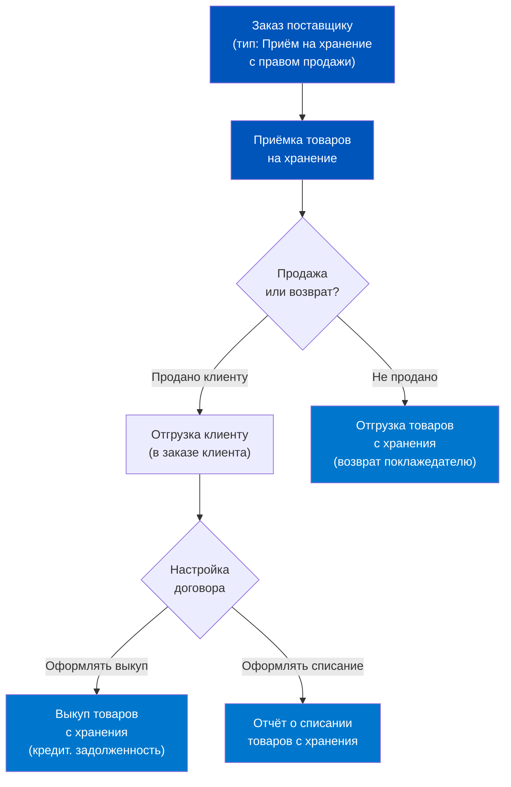
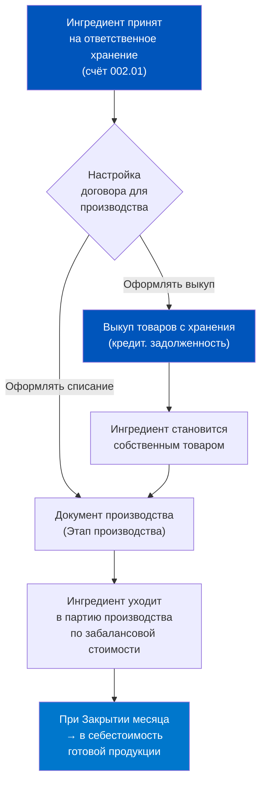
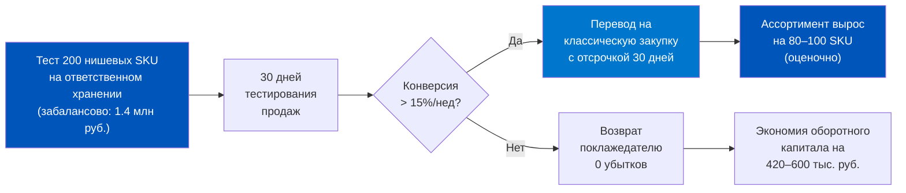
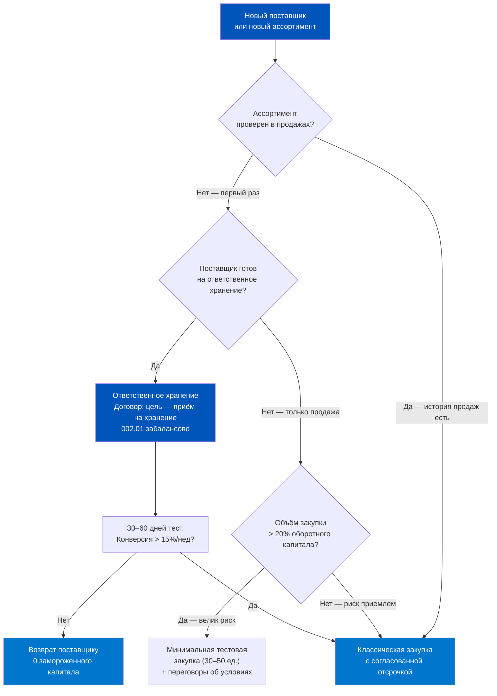
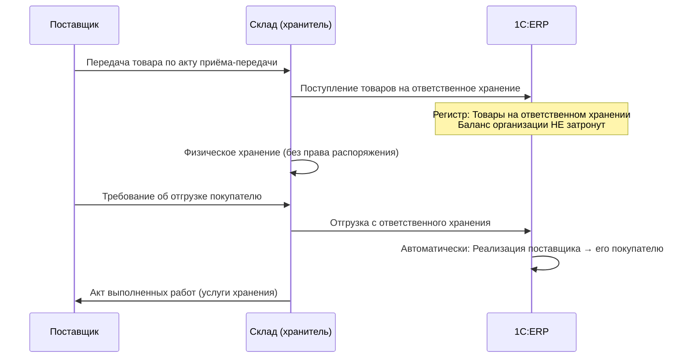

# День 4. Ответственное хранение и давальческая схема

## Часть 1. Крючок — товар на полке, но ERP говорит «не наш»: что такое ответственное хранение

Представьте утро вторника в даркстор-хабе Москвы. Приёмщик сканирует паллету с молоком торговой марки «Фермерский дом» — 240 упаковок, срок годности нормальный, температурный режим соблюдён. ERP принимает сканирование, создаёт запись о товаре, разрешает выдачу курьерам. Всё идёт штатно. Но если открыть карточку этого молока в разделе запасов и посмотреть тип остатка — там будет написано не «Собственный товар», а «Товар на хранении с правом продажи».

Что это значит на практике? Молоко стоит на полке даркстора, курьеры берут его в заказы, покупатели получают его через 23 минуты. Но юридически это молоко не принадлежит дарксторовой компании. Оно принадлежит поставщику — «Фермерскому дому». Компания выступает в роли хранителя, а не собственника. И только в момент, когда молоко уходит в заказ покупателя, происходит его выкуп: поставщик выставляет счёт, возникает кредиторская задолженность.

Это и есть ответственное хранение — один из самых нестандартных, но практически полезных механизмов в логистике Q-commerce.

Зачем это нужно? Представьте переговоры с небольшим локальным производителем мёда или сыра. Производитель не готов рисковать дебиторкой: он хочет, чтобы его товар либо продался и тогда он получил деньги, либо вернулся обратно непроданным. Классическая закупка с отсрочкой платежа его не устраивает — слишком непонятно, когда придут деньги. Схема консигнации (ответственного хранения) снимает это противоречие: поставщик-поклажедатель передаёт товар на хранение дарксторовой компании-хранителю, и расчёты происходят только по факту фактической продажи.

Для Q-commerce такая модель открывает несколько важных возможностей. Первая — расширение ассортимента без замораживания оборотного капитала. Вторая — тестирование новых категорий: привезли 50 единиц нового продукта, посмотрели на конверсию, не зашло — вернули без убытков для закупщика. Третья — работа с сезонным товаром, когда поставщик заинтересован в широком покрытии, но не хочет давать длинные отсрочки.

В 1С:ERP 2.5 этот механизм реализован через специальный тип операции и забалансовый счёт бухгалтерского учёта. Разберём архитектуру подробно.

---

## Часть 2. Происхождение — зачем нужен учёт «чужого» товара в своей системе

Исторически ответственное хранение возникло задолго до ERP-систем. Классический прообраз — консигнационные склады при оптовых базах советской эпохи, где производители размещали товар на реализацию. Розничная сеть получала комиссионное вознаграждение, производитель — канал сбыта без риска «зависших» денег.

В современном ритейле эта схема трансформировалась в несколько устойчивых бизнес-сценариев.

Первый сценарий — пробный ассортимент. Новый поставщик хочет войти в сеть, но закупщик не готов выделять закупочный бюджет под непроверенный товар. Соглашение об ответственном хранении позволяет провести тест: поставщик привозит 100 единиц, даркстор реализует их в течение 2 недель, по итогу либо выкупает остаток (если товар показал оборачиваемость выше порогового значения), либо возвращает поставщику.

Второй сценарий — дорогостоящий или нишевый товар. Органическое вино за 3 500 рублей бутылку, крафтовый сыр за 1 200 рублей за 200 граммов — такие позиции сложно держать как собственный запас в 20 дарксторах одновременно. Ответственное хранение позволяет распределить риск: поставщик несёт риск до момента продажи.

Третий сценарий — сезонные пики. В декабре даркстор принимает на ответственное хранение подарочные наборы от кондитерских: если к 10 января остатки не проданы, поставщик забирает их обратно. Никакой уценки, никаких списаний за счёт закупщика.

Теперь ключевой вопрос: почему ERP должна знать об этом товаре, если он юридически чужой? Причин несколько.

Оперативный учёт. Курьер не может знать, «наш» это товар или на хранении — он видит в приложении единый список доступных позиций. ERP обязана управлять физическим наличием товара на складе вне зависимости от типа права собственности.

Финансовый учёт. Когда поставщик выставит счёт за проданный товар, бухгалтерия должна понять: какой именно товар был продан, в каком количестве, по какой себестоимости. ERP хранит всю эту историю в регистрах.

Управление возвратами. Если товар испортился или не продался, нужно оформить возврат поклажедателю. Без корректного учёта количества в разрезе поклажедателей это невозможно.

Именно поэтому в российском бухгалтерском учёте для таких ценностей предусмотрен специальный забалансовый счёт 002 «Товарно-материальные ценности, принятые на ответственное хранение». Слово «забалансовый» означает, что этот счёт не входит в основной баланс предприятия — стоимость этих ценностей не увеличивает активы компании, поскольку право собственности не перешло.

В 1С:ERP субсчёт 002.01 «Товарно-материальные ценности на складах» — основной регистр для отражения таких ценностей в бухгалтерии.

---

## Часть 3. Глубокое погружение — ответственное хранение: документооборот, договор, регистры

Прежде чем разбирать документооборот, нужно включить соответствующую функциональную опцию в 1С:ERP. Путь: НСИ и администрирование → Настройка НСИ и разделов → Закупки → Документы закупок → установить флаг «Приёмка на ответственное хранение с правом продажи». Без этого флага соответствующий тип операции в документах просто не появится.

### Договор с поклажедателем

Весь механизм строится на специальном типе договора. В карточке контрагента-поставщика создаётся договор с целью «Приём на ответственное хранение». Именно в этом договоре закладываются два критически важных параметра:

**Порядок списания недостач.** Если при инвентаризации обнаружена недостача товара, принятого на хранение, то чей это убыток? В договоре выбирается одна из двух настроек:
- «Оформлять списание» — убыток за счёт поклажедателя или за счёт хранителя, отражение через счёт 002. Результат: появляется документ «Отчёт о списании товаров с хранения».
- «Оформлять выкуп» — хранитель принимает на себя недостачу, возникает кредиторская задолженность, отражение через счёт 91. Результат: появляется документ «Выкуп товаров с хранения».

**Порядок списания в производство.** Этот параметр актуален для дарксторов, у которых есть производственная составляющая — например, готовят готовые блюда или наборы. Если в производство уходят ингредиенты, принятые на ответственное хранение, опять два варианта:
- «Оформлять списание» — товар списывается непосредственно в производство по забалансовой стоимости, выкуп не требуется.
- «Оформлять выкуп» — сначала оформляется выкуп товара (возникает задолженность), потом он уходит в производство как собственный.

### Цепочка документов

Полная схема документооборота по приёмке на ответственное хранение выглядит следующим образом:

Шаг 1. **Заказ поставщику** с типом операции «Приём на хранение с правом продажи». Это необязательный документ — можно принять товар без предварительного заказа, — но он фиксирует договорённость о количестве и стоимости.

Шаг 2. **Приёмка товаров на хранение**. Ключевой документ. Оформляется либо вручную из журнала документов закупки, либо на основании заказа поставщику. Если склад работает по ордерной схеме, физическая приёмка товара оформляется документом «Приходный ордер на товары», а финансовый документ «Приёмка товаров на хранение» создаётся отдельно. Если ордерная схема не используется — один документ закрывает обе функции. После проведения «Приёмки» товар появляется в остатках с типом «Товар на хранении с правом продажи» и учитывается на счёте 002.01.

Шаг 3. **Продажа**. Товар из ответственного хранения продаётся клиенту так же, как собственный — через заказ клиента. ERP сама понимает, что это «хранимый» товар, и при проведении документа отгрузки формирует движения по забалансовому счёту 002.

Шаг 4. **Выкуп или списание**. В зависимости от настройки договора система либо формирует кредиторскую задолженность перед поставщиком (выкуп), либо оформляет отчёт о списании без возникновения задолженности.

Шаг 5. **Возврат с хранения**. Если товар не продан, оформляется документ «Отгрузка товаров с хранения» — это возврат поклажедателю. Счёт 002.01 обнуляется по данной позиции.

### Регистры ERP для мониторинга

В 1С:ERP товары на ответственном хранении отражаются в нескольких регистрах одновременно:

| Регистр | Что хранит |
|---------|-----------|
| Товары организаций (бухучёт) | Забалансовый счёт 002.01, забалансовая стоимость |
| Товары на складах (управленч.) | Физические остатки для оперативного управления |
| Расчёты с поставщиками | Задолженность после оформления выкупа |

Отчёт «Товары, принятые на хранение» (раздел Закупки → Отчёты) — главный инструмент мониторинга. Он показывает остаток по каждому поклажедателю, что принято, что продано, что списано в производство, что возвращено.

---

## Часть 4. Давальческая схема — отдать материалы переработчику и получить готовый продукт

Давальческая схема — это когда ваша компания является заказчиком производства, а не производителем. Вы передаёте сырьё или материалы стороннему переработчику, он изготавливает из них готовую продукцию и возвращает вам. Расчёты ведутся только за услугу переработки — само сырьё остаётся вашей собственностью на всём протяжении цикла.

Для Q-commerce это абсолютно реальный сценарий. Представьте: сеть дарксторов хочет продавать «Готовые наборы для завтрака» под собственной торговой маркой. Компоненты — крупа, сухофрукты, орехи — закупаются напрямую у оптовиков. А фасовку и упаковку выполняет небольшая производственная компания. Компоненты принадлежат дарксторовой сети, переработчик только фасует и упаковывает, получая плату за услугу.

Или другой пример: производство готовых салатов. Компания закупает ингредиенты (листья салата, помидоры, соус), передаёт их в цех-партнёр, получает обратно готовые контейнеры с салатами под своей маркой.

В обоих случаях сырьё юридически ни на секунду не переходит в собственность переработчика — именно это делает давальческую схему особенной с точки зрения учёта.

### Два варианта оформления в 1С:ERP

Документация ИТС описывает два варианта давальческой схемы:

**Вариант 1 — с заказами переработчику.** Предпочтительный вариант для управления взаимодействием. Перед передачей сырья создаётся документ «Заказ переработчику», в котором фиксируются: переработчик, перечень передаваемого сырья, ожидаемый выход продукции, плановые сроки. Этот заказ становится «распоряжением» для всех последующих учётных документов.

**Вариант 2 — без заказов переработчику.** Упрощённый вариант только для учётных действий. Используется, когда управленческий контроль не нужен — например, разовый заказ на переработку.

Оба варианта можно применять параллельно в одной системе.

### Ключевые документы давальческой схемы

Рабочее место: Производство → Передача в переработку → Документы передачи в переработку (все).

- **Передача сырья переработчику** — фиксирует физическое выбытие материалов с вашего склада. Материалы перемещаются на «виртуальный» склад переработчика. Право собственности остаётся у вас.
- **Поступление от переработчика** — фиксирует возврат готовой продукции. Продукция появляется на вашем складе как собственный товар.
- **Отчёт переработчика** — это счёт за услугу переработки. Критически важный документ: именно он формирует правильную себестоимость готовой продукции. Согласно документации ИТС, отчёт переработчика должен быть оформлен в том же месяце, что и поступление от переработчика, иначе себестоимость рассчитается некорректно.
- **Возврат сырья от переработчика** — если часть материалов не была использована, они возвращаются на ваш склад.

### Обособление материалов — четыре варианта

Один из самых тонких аспектов давальческой схемы в 1С:ERP — механизм обособления материалов. Настройка: НСИ и администрирование → Производство → Переработка на стороне → Обособление сырья и материалов.

Доступно четыре варианта:

1. **По направлению деятельности** — материалы резервируются под конкретное направление (например, «СТМ-продукция»). Это позволяет опережающую закупку, когда конкретный переработчик ещё не выбран.

2. **По переработчику/договору** — материалы резервируются под конкретного партнёра или его договор. Уже само намерение привлечь переработчика запускает процедуру обособленного обеспечения.

3. **По назначению продукции** — объектом обособления является целевое назначение готовой продукции. Позволяет опережающую закупку при неопределённом переработчике.

4. **По заказу переработчику** — классический вариант: сначала создаётся заказ переработчику, затем под него обеспечиваются материалы. Самый контролируемый подход.

Важное правило: значение опции применяется только к новым заказам переработчику. Ранее созданные заказы сохраняют свой вариант обособления. Изменить можно вручную — скорректировав ключевой реквизит документа (партнёра, договор, направление деятельности).

---

## Часть 4а. Нюансы — ордерный склад, недостачи, производство: подводные камни

Прежде чем перейти к прикладным сценариям, разберём несколько тонких моментов, которые регулярно вызывают затруднения при работе со схемой ответственного хранения в ERP.

### Ордерный склад и ответственное хранение

Большинство Q-com дарксторов работают по ордерной схеме документооборота. Это означает, что физическая приёмка товара и финансовое оформление разделены. Как это работает для товаров на ответственном хранении?

Сценарий ордерного склада:
1. Фактически товар принимается документом «Приходный ордер на товары» — кладовщик сканирует штрихкоды, проверяет количество, сорт.
2. После этого, в рамках рабочего места «Накладные к оформлению» (закладка «Контроль ордеров»), менеджер по закупкам создаёт финансовый документ «Приёмка товаров на хранение» по данным фактически принятых ордеров (кнопка «Оформить → По приёмке»).

Ключевое: товар появляется в остатках ERP с правильным типом «Товар на хранении с правом продажи» только после проведения финансового документа, а не ордера. Ордер фиксирует физический факт — накладная фиксирует юридический.

Если склад работает НЕ по ордерной схеме — оба факта фиксирует один документ «Приёмка товаров на хранение».

### Что происходит с недостачей при инвентаризации

Предположим, при плановой инвентаризации выяснилось: по данным ERP на хранении числится 80 бутылок крафтового пива, а фактически на полке только 73 бутылки. Разница 7 бутылок — это недостача.

Кто несёт ответственность? Это определяется не законом, а договором с поклажедателем. В зависимости от настройки «Порядок списания недостач»:

**Вариант «Оформлять списание»:**
- Оформляется документ «Отчёт о списании товаров с хранения» на 7 бутылок
- Счёт 002.01 кредитуется на стоимость 7 бутылок (7 × 200 руб. = 1 400 руб.)
- Если недостача — вина хранителя (например, кража), то сумма относится на счёт виновного лица через счёт 94; если поклажедатель согласен «простить» — просто списание
- Кредиторской задолженности перед поставщиком НЕ возникает

**Вариант «Оформлять выкуп»:**
- Система формирует «распоряжение» на выкуп 7 бутылок
- Менеджер оформляет «Выкуп товаров с хранения» на 1 400 рублей
- Возникает кредиторская задолженность перед поставщиком 1 400 рублей
- Отражение через счёт 91 (прочие расходы)
- Хранитель фактически выкупает утраченный товар

В Q-commerce оба варианта встречаются. Для работы с небольшими поставщиками, которые дорожат репутационными отношениями, обычно выбирают «Оформлять списание» с договорённостью о приемлемом проценте потерь (например, до 0,5% от оборота — за счёт хранителя, свыше — за счёт поклажедателя).

### Когда товар с хранения уходит в производство

Этот сценарий специфичен для дарксторов с собственным производством (готовые блюда, наборы). Если ингредиент был принят на ответственное хранение, а потом нужен для производства — в ERP предусмотрен специальный механизм.

При создании документов «Производство без заказа», «Этап производства» или «Отчёт переработчика 2.5» система анализирует тип запасов, указанный в договоре:

- Если «Оформлять списание» → на партии производства списывается товар с типом «Товар на хранении». Забалансовая стоимость ингредиентов включается в стоимость партии производства и при Закрытии месяца распределяется на готовую продукцию.

- Если «Оформлять выкуп» → сначала система генерирует необходимость оформить «Выкуп товаров с хранения» (рабочее место: Закупки → Выкупы к оформлению), потом на партии производства списывается уже собственный товар.

Важный нюанс: стоимость ингредиентов, принятых на ответственное хранение, всё равно попадает в себестоимость готовой продукции — через забалансовую оценку. Это отражается в отчётах «Анализ себестоимости выпущенной продукции» и «Дерево себестоимости».

### Отчёт «Товары, принятые на хранение» — детальный разбор

Главный инструмент контроля ответственного хранения. Путь: Закупки → Отчёты → Товары, принятые на хранение.

Отчёт показывает в разрезе каждого поклажедателя и каждой позиции номенклатуры:

| Колонка | Смысл |
|---------|-------|
| Принято | Сколько единиц было принято на хранение суммарно |
| Остаток | Сколько единиц числится на хранении прямо сейчас |
| Продано | Сколько единиц ушло в заказы клиентов |
| Выкуплено | Сколько единиц выкуплено (оформлен документ «Выкуп») |
| Списано | Сколько единиц оформлено как потери/списание |
| Списано в производство | Сколько единиц ушло в производство |
| Возвращено | Сколько единиц возвращено поклажедателю |

Идеальная ситуация на конец расчётного периода: Принято = Продано + Возвращено + Списано + Списано в производство; Остаток = 0 (всё, что не продано, возвращено или выкуплено).

---

## Часть 5. Мышление — когда использовать эти схемы в Q-commerce: СТМ, производство салатов

Теперь давайте переведём теорию в практику принятия решений. Продакт-менеджер по логистике должен понимать, в каких бизнес-ситуациях каждая из схем является оптимальным выбором.

### Матрица принятия решений

| Ситуация | Ответственное хранение | Давальческая схема | Классическая закупка |
|---------|----------------------|-------------------|---------------------|
| Тест нового поставщика | + лучший выбор | - нет смысла | - риск залежалого товара |
| СТМ-продукт с внешним производством | - | + лучший выбор | - теряется контроль над сырьём |
| Дорогой нишевый товар | + хорошо | - | + но замораживает капитал |
| Сезонный товар (подарки, праздники) | + хорошо | - | + но риск остатков |
| Готовые блюда по рецептуре сети | - | + лучший выбор | - нет рычага над составом |
| Масштабная SKU-матрица (топ-500) | - слишком сложно | - | + стандарт |

### СТМ в Q-commerce через давальческую схему

Собственная торговая марка (СТМ) — это одновременно маржинальная возможность и операционный риск. Классические ритейлеры выстраивают производство СТМ годами. В Q-commerce, где скорость вывода продукта в продажу критична, давальческая схема становится инструментом быстрого запуска.

Схема работает следующим образом. Команда категорийного менеджмента формирует рецептуру и технологическую карту. Закупщик приобретает ингредиенты по рыночным ценам и ставит их на учёт как собственное сырьё. Подрядчик-производитель получает эти ингредиенты с накладной «Передача сырья переработчику», производит готовый продукт и возвращает его с отчётом переработчика. На полке даркстора появляется готовый СТМ-продукт с правильно рассчитанной себестоимостью.

Ключевое преимущество перед прямой закупкой готового товара: компания контролирует состав, может менять рецептуру без переоформления отношений с поставщиком, а главное — себестоимость в ERP корректна, потому что она складывается из стоимости ингредиентов плюс стоимость услуги переработки.

### Производство готовых салатов и блюд

Это ещё более динамичный кейс. Срок годности готового блюда — 24–72 часа. Цикл производства — ежедневный. Объёмы — например, 500 контейнеров в день на 20 дарксторов.

В такой ситуации критически важно:
- Ежедневно точно знать, сколько сырья передано переработчику и не вернулось
- Понимать реальную себестоимость каждого SKU
- Быстро реагировать на изменение рецептуры или замену ингредиента

Давальческая схема с ежедневными заказами переработчику и ежедневными отчётами переработчика даёт именно это — полный цикл учёта за 24 часа.

**Числовой пример.** Даркстор-сеть производит «Греческий салат» через переработчика. Состав на 1 контейнер (300 граммов): помидоры черри — 80 граммов, огурцы — 60 граммов, маслины — 40 граммов, сыр фета — 50 граммов, масло оливковое — 10 граммов, зелень — 15 граммов, соус — 45 граммов. Закупочная стоимость ингредиентов на 1 контейнер — 87 рублей. Стоимость услуги переработчика (фасовка, сборка, упаковка) — 18 рублей. Итоговая себестоимость продукта в ERP: 105 рублей. Розничная цена в приложении — 239 рублей. Маржа — 55%.

### Сравнительный расчёт: давальческая схема vs. прямая закупка готового салата

Предположим, тот же «Греческий салат» можно купить у стороннего производителя готовым — по 140 рублей за контейнер. Кажется проще. Но давайте сравним.

| Параметр | Давальческая схема | Прямая закупка |
|----------|-------------------|----------------|
| Закупочная стоимость в ERP | 105 руб. | 140 руб. |
| Маржа (розница 239 руб.) | 55,6% | 41,4% |
| Контроль рецептуры | Полный | Нет |
| Возможность изменить состав | Да, без смены поставщика | Нет без смены поставщика |
| Срок готовности к изменениям | 1–3 дня | 2–4 недели |
| Сложность учёта в ERP | Средняя (нужны документы передачи/отчёта) | Низкая |
| Зависимость от переработчика | Высокая (оперативная) | Низкая |

Вывод: при ежедневных объёмах от 200–300 контейнеров в день и наценке > 100% разница в маржинальности 14 процентных пунктов — это значительный финансовый аргумент в пользу давальческой схемы.

### Как давальческая схема помогает при изменении рецептуры

В Q-commerce важна скорость. Допустим, команда решила улучшить «Греческий салат» — заменить обычные маслины на маслины с лимоном и добавить 5 граммов вяленых помидоров. При прямой закупке: нужно переоформлять спецификации с поставщиком, получать новые образцы, ждать. Срок: 2–4 недели.

При давальческой схеме: даркстор сам закупает новые ингредиенты у своих поставщиков, передаёт переработчику с обновлённой технологической картой. В ERP добавляется новая спецификация, сырьё передаётся по новым пропорциям, отчёт переработчика фиксирует изменение состава. Срок: 1–3 дня.

Это принципиальная операционная гибкость, которая позволяет быстро реагировать на предпочтения потребителей.

---

## Часть 6. Кейс — даркстор принял чужой товар на реализацию: как ERP разделила «своё» и «чужое»

Весна, апрель. Небольшая сеть Q-commerce на 12 дарксторах договаривается с местной крафтовой пивоварней «Северный ветер» о тестовой поставке 6 позиций крафтового пива. Пивоварня — производитель с оборотом 18 000 000 рублей в год, не готова давать отсрочку платежа более 7 дней. Закупщик не хочет замораживать деньги под непроверенный ассортимент — рынок крафта нестабильный. Договариваются об ответственном хранении.

**Параметры сделки:**
- Объём передачи: 480 бутылок на сумму 96 000 рублей (забалансовая стоимость)
- Срок хранения по договору: 21 день
- Порядок расчётов: по документам выкупа
- Порядок списания недостач: оформлять выкуп
- Распределение по дарксторам: 40 бутылок на каждый из 12 дарксторов

**Как это выглядит в 1С:ERP:**

Шаг 1. Создаётся договор с «Северным ветром» — цель договора «Приём на ответственное хранение». В договоре: порядок расчётов — по документам выкупа, срок 21 день.

Шаг 2. Оформляется «Приёмка товаров на хранение» на 480 бутылок. После проведения: в остатках появляется 480 единиц с типом «Товар на хранении с правом продажи»; в бухучёте — дебет 002.01 на 96 000 рублей.

Шаг 3. Товар распределяется по 12 дарксторам через внутренние перемещения. В каждом даркстор-остатке — 40 бутылок «чужого» пива.

Шаг 4. В течение 18 дней продаётся 312 бутылок из 480. Каждая продажа создаёт движение в регистре — для последующего формирования документа выкупа.

Шаг 5. На 19-й день менеджер по закупкам формирует документ «Выкуп товаров с хранения» на проданные 312 бутылок. Возникает кредиторская задолженность: 312 × 200 рублей = 62 400 рублей.

Шаг 6. Остаток 168 бутылок оформляется документом «Отгрузка товаров с хранения» (возврат). Кредит 002.01 на 33 600 рублей — счёт закрывается.

**Итог:** Закупщик потратил 62 400 рублей только на то, что фактически было продано. Финансовый директор доволен: никакого замороженного остатка. Пивоварня довольна: товар получил дистрибуцию в 12 точках, выручка 62 400 рублей за 18 дней. По итогам теста 3 из 6 позиций переведены на классическую закупку с отсрочкой 14 дней.

### Что было бы при классической закупке

Сравним итоги при двух сценариях:

| Показатель | Ответственное хранение | Классическая закупка |
|-----------|----------------------|---------------------|
| Авансовый платёж поставщику | 0 рублей | 96 000 рублей |
| Фактические затраты на закупку | 62 400 рублей (только за проданное) | 96 000 рублей (весь объём) |
| Остаток непроданного (168 бутылок) | Возвращён, 0 убытков | Нужно хранить, уценять или списать |
| Стоимость непроданного остатка | 0 | 33 600 рублей (заморожено) |
| Оборотный капитал под риском | 62 400 рублей (мин.) | 96 000 рублей (макс.) |

Разница очевидна. Для непроверенного ассортимента ответственное хранение — это страховка оборотного капитала.

### Масштабирование: ответственное хранение как инструмент расширения ассортимента

Если сеть дарксторов хочет быстро нарастить ассортимент до 4 000–5 000 SKU, не имея достаточного оборотного капитала на закупку всего этого объёма, схема ответственного хранения становится стратегическим инструментом.

Пример: добавление 200 новых «нишевых» SKU (органические продукты, здоровое питание, региональные продукты) на ответственное хранение.

- Среднее количество единиц на SKU при тестовом запуске: 20 штук
- Средняя забалансовая стоимость единицы: 350 рублей
- Итоговая «площадь риска»: 200 × 20 × 350 = 1 400 000 рублей

Это сумма, которую компания не тратит из оборотного капитала. При классической закупке она была бы заморожена в товаре. При ответственном хранении — нет.

По итогам 30 дней теста: те SKU, которые показали конверсию в заказ > 15% в неделю, переводятся на классическую закупку. Остальные возвращаются поставщикам. Расчёты только за проданное.

---

## Часть 7. Глоссарий и FAQ

### Глоссарий

**Ответственное хранение** — форма взаимоотношений, при которой хранитель принимает товар от поклажедателя без перехода права собственности, с возможностью продажи или использования в производстве и последующим выкупом или возвратом.

**Поклажедатель** — юридическое лицо, передающее товар на хранение (в контексте ERP — поставщик). Сохраняет право собственности на товар.

**Хранитель** — юридическое лицо, принимающее товар на хранение (в контексте Q-commerce — даркстор-оператор).

**Счёт 002** (забалансовый) — «Товарно-материальные ценности, принятые на ответственное хранение». Субсчёт 002.01 — «Товарно-материальные ценности на складах».

**Выкуп товаров с хранения** — документ, которым хранитель фиксирует приобретение ранее хранимого товара. Возникает кредиторская задолженность перед поклажедателем.

**Давальческая схема** — производственная схема, при которой заказчик передаёт собственные материалы стороннему переработчику для изготовления готовой продукции, оплачивая только услугу переработки.

**Поклажедатель → Давалец** — при давальческой схеме заказчика (владельца сырья) называют давальцем, а исполнителя — переработчиком.

**Отчёт переработчика** — документ, подтверждающий выполнение услуги переработки и являющийся основанием для расчёта себестоимости готовой продукции в ERP.

**Обособление материалов** — резервирование конкретных запасов под конкретное назначение (направление деятельности, переработчика, заказ).

### FAQ

**Q: Если товар на ответственном хранении испортился — кто платит?**
A: Зависит от договора. Если в договоре указано «Оформлять выкуп» по недостачам — хранитель принимает на себя убыток, возникает задолженность перед поклажедателем через счёт 91. Если «Оформлять списание» — оформляется отчёт о списании, который поклажедатель либо принимает (его убыток), либо оспаривает.

**Q: Можно ли комбинировать ответственное хранение и классическую закупку в одном дарксторе?**
A: Да, абсолютно. ERP разделяет эти запасы по типу («Собственный» и «Товар на хранении») и ведёт их параллельно. Курьер не видит разницы, но управленческий учёт чёткий.

**Q: Как понять, сколько денег нужно заплатить поставщику по итогам месяца при ответственном хранении?**
A: Отчёт «Товары, принятые на хранение» показывает количество проданного товара в разрезе поклажедателя. На основе этих данных оформляются документы «Выкуп товаров с хранения», которые создают кредиторскую задолженность. Сумма задолженности = количество выкупленного × забалансовая цена.

**Q: Нужно ли включать товар на ответственном хранении в аналитику продаж?**
A: Да. В управленческом учёте продажи учитываются независимо от типа права собственности на товар. Аналитика «выручка», «количество продаж», «оборачиваемость» работает одинаково для собственного и хранимого товара.

**Q: При давальческой схеме — нужно ли страховать переданное сырьё?**
A: Это вопрос договора с переработчиком, а не настройки ERP. Юридически сырьё остаётся вашей собственностью, значит риск его утраты у переработчика — ваш. Договор с переработчиком должен регулировать материальную ответственность. В ERP достаточно корректно вести учёт переданного сырья через документы «Передача сырья переработчику».

**Q: Что такое «рабочее место Выкупы к оформлению»?**
A: Путь: Закупки → Закупки → Выкупы к оформлению → Выкупы товаров к оформлению. Здесь собираются все «распоряжения» на выкуп, которые сформировались автоматически по результатам продаж хранимого товара. Менеджер по закупкам заходит в это рабочее место и одним действием создаёт документы «Выкуп товаров с хранения» по всем поклажедателям.

**Q: Можно ли принять товар на ответственное хранение без предварительного «Заказа поставщику»?**
A: Да. Документ «Заказ поставщику» с типом операции «Приём на хранение с правом продажи» — это опциональный документ. Он полезен для фиксации договорённости (количество, цена, дата), но не является обязательным условием для создания «Приёмки товаров на хранение». Накладную можно оформить напрямую, минуя заказ.

**Q: Как в ERP отличить товар, принятый «на хранение», от товара «на комиссию» (комиссионная схема продаж)?**
A: Это принципиально разные схемы. Ответственное хранение — это когда вы принимаете товар от поставщика (хранитель). Комиссионная схема (УПД для комиссионных схем, раздел 7.17 ИТС) — это когда вы продаёте чужой товар как комиссионер и получаете вознаграждение. В ERP они реализованы через разные типы операций и договоров. Также в ИТС есть отдельный раздел по учёту операций с различным отражением в учёте (раздел 7.18 — «Регистрация операций, имеющих различное отражение»), что поможет разобраться с пограничными случаями.

**Q: Влияет ли переход части товара из «ответственного хранения» в «собственный» на налоговую нагрузку?**
A: Да. Выкуп товара с ответственного хранения означает приобретение права собственности: возникает НДС к вычету (если поставщик — плательщик НДС) и кредиторская задолженность. Это налоговое событие. До выкупа (пока товар числится на 002.01) — входящего НДС нет. Именно поэтому схема интересна с точки зрения управления денежным потоком: налоговые обязательства возникают только в момент выкупа, то есть по факту продажи.

**Q: Если один поставщик поставляет и «своё» (классическая закупка) и «хранимое» (ответственное хранение) — как ERP разделяет учёт?**
A: По типу договора. Классическая закупка идёт через договор с целью «Покупка». Ответственное хранение — через договор с целью «Приём на ответственное хранение». Один и тот же контрагент может иметь несколько договоров с разными целями. В документах закупки при выборе договора автоматически определяется тип операции: стандартная приёмка или приёмка на хранение.

### Типичные ошибки при работе с ответственным хранением в ERP

Несколько распространённых ошибок, которые встречаются при первом внедрении схемы:

**Ошибка 1. Забыли включить функциональную опцию.** Менеджер пытается создать документ «Приёмка товаров на хранение», но тип операции «Приём на хранение с правом продажи» отсутствует в списке. Причина: опция НСИ → Настройка НСИ и разделов → Закупки → «Приёмка на ответственное хранение с правом продажи» не включена. Решение: включить опцию (требует прав администратора).

**Ошибка 2. Неправильный тип договора.** Договор с поставщиком создан с целью «Покупка» вместо «Приём на ответственное хранение». Результат: товар оприходуется как собственный, попадает на балансовый счёт 41, а не на 002.01. Обнаруживается обычно при сверке с поставщиком или при инвентаризации.

**Ошибка 3. Не оформляется выкуп своевременно.** Продажи идут, но выкуп оформляется раз в месяц или «по требованию». Результат: у поставщика нет информации о продажах, расчёты непрозрачны, накапливается неоформленная кредиторская задолженность. Правильная практика: выкуп оформлять еженедельно или по заранее согласованному с поставщиком расписанию.

**Ошибка 4. Размещение «хранимого» товара вперемешку с собственным на полке без маркировки.** ERP разделяет учёт, но физически коробки стоят рядом. При инвентаризации кладовщик не знает, где «своё», где «чужое». Решение: выделять отдельную зону хранения или использовать цветовую маркировку.

**Ошибка 5. Заказ поставщику с неправильным типом операции.** Если заказ поставщику создан с обычным типом операции (не «Приём на хранение с правом продажи»), а потом по нему оформляется «Приёмка товаров на хранение» — возникнет несоответствие в цепочке документов. Правильно: заказ поставщику и приёмка должны быть оформлены с одним и тем же типом операции или приёмка создаётся независимо.

---

### Схема выбора: ответственное хранение или классическая закупка?

Практическое правило для PM: какую схему использовать при вводе нового поставщика или нового ассортимента.

---

### Схема приёмки на ответственное хранение

← [[Неделя 3 - День 3 - Логика обеспечения|День 3]] | [[README|Оглавление]] | [[Неделя 3 - День 5 - Мониторинг заказов|День 5]] →
