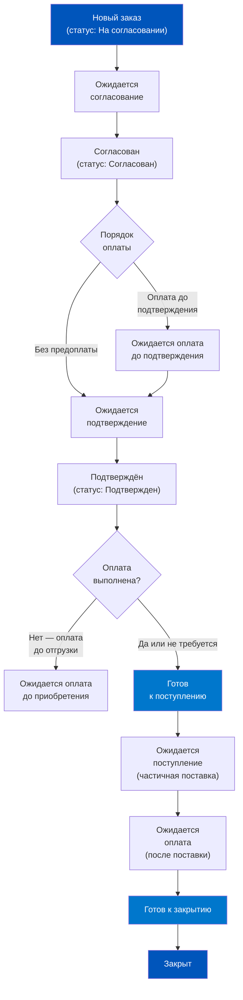
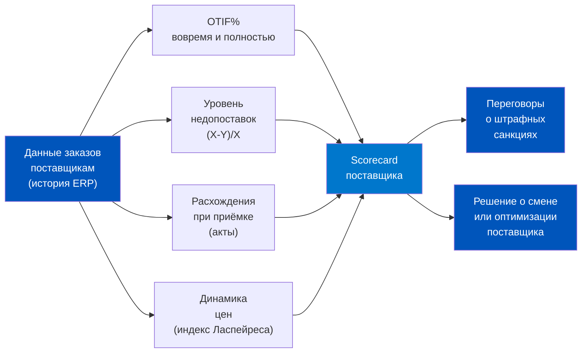
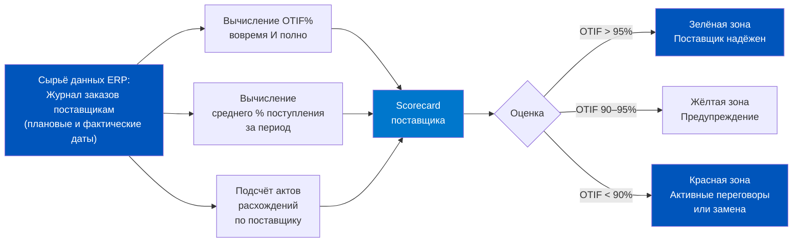
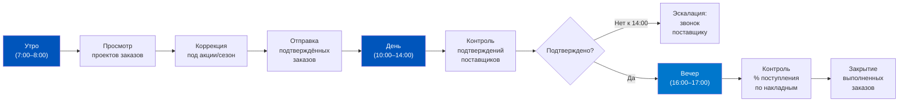

# День 5. Мониторинг заказов поставщикам и контроль сроков

## Часть 1. Крючок — 40 000 заказов в день, 3% не поставлено: где смотреть и что делать

Пятница, 7:15 утра. Менеджер по закупкам открывает список заказов поставщикам в 1С:ERP. На экране — 847 активных заказов. Из них 23 подсвечены красным. Это заказы, у которых наступил или уже прошёл срок выполнения, а поставка так и не была оформлена.

Звучит не страшно — 23 из 847, это около 2,7%. Но что скрывается за этими 23 строчками? Два заказа — это молоко. Семь — хлеб. Четыре — вода питьевая. Ещё три — детское питание. Это не абстрактный процент. Это конкретные SKU, которых сегодня не хватит в дарксторах к часу пик. К 12:00 приложение начнёт показывать «нет в наличии» по самым ходовым позициям. К 14:00 пойдут отказы от заказов. К 18:00 продакт-менеджер получит сводку: потери выручки за день — 340 000 рублей.

Вся эта цепочка начинается с одного пропущенного момента: никто не заметил красные строки в 7:15 утра.

В Q-commerce, где дарксторовая сеть обрабатывает десятки тысяч потребительских заказов в сутки, операционная чёткость закупочного цикла имеет прямое влияние на выручку. Исследования крупных Q-com операторов показывают, что дефицит товара на полке (Out-of-Stock) стоит примерно 8–12% потенциальной выручки по затронутым SKU. При среднем чеке 1 200 рублей и 3 000 заказов в час даже часовой дефицит ключевой позиции — это потери 36 000–72 000 рублей. За сутки — до 800 000 рублей.

Мониторинг заказов поставщикам — это ранняя система предупреждения. ERP хранит всё необходимое: плановые даты поступлений, фактические даты оформления накладных, процент оплаты, процент поступления по каждому заказу. Задача продакт-менеджера — знать, где смотреть и что делать с каждым типом отклонения.


---

## Часть 2. Происхождение — от бумажного журнала к цифровому мониторингу поставок

До эпохи ERP-систем закупщик вёл бумажный или Excel-журнал заказов. Колонки: поставщик, дата заказа, дата ожидаемой поставки, статус. Звучит просто, но реальность была другой. Журнал устаревал немедленно после создания. Поставщик перезвонил и сдвинул дату? Нужно вручную найти строку и исправить. Часть товара пришла, часть нет? Строку нужно разбить на две. За три недели такой журнал превращался в нечитаемый документ, которому никто не доверял.

В ритейле 1990-х и 2000-х именно проблема «непрозрачного pipeline поставок» была одной из главных операционных болей. Менеджеры по закупкам работали в режиме «тушения пожаров»: не предотвращали дефицит, а реагировали на него постфактум. Типичный диалог: «Почему нет хлеба?» — «Поставщик не приехал» — «А ты почему не знал?» — «Я не знал, что он не приедет».

Первые ERP-системы в ритейле (Navision, SAP R/3 в крупных сетях) изменили ситуацию: заказы стали вестись в единой базе данных, видимой всем участникам процесса. Но настоящая революция произошла с появлением механизмов автоматического расчёта статуса заказа. Теперь система сама вычисляла — «этот заказ просрочен», «по этому заказу оплата не перечислена», «этот поставщик подтвердил поставку» — без участия человека.

В 1С:ERP 2.5 эта эволюция воплощена в механизме «Текущее состояние заказа». Система в реальном времени анализирует статус документа, наличие оплаты, факт оформления поставки и автоматически присваивает каждому заказу одно из семи состояний. Это не просто удобный фильтр — это операционный регламент, встроенный в архитектуру системы.


---

## Часть 2а. Цена неверного мониторинга: три сценария потерь

До погружения в технику разберём «стоимость ошибки» — что происходит, когда мониторинг заказов ведётся неправильно или не ведётся совсем.

**Сценарий 1: Мониторинг не ведётся.**
Менеджер не проверяет список заказов регулярно. Просрочки накапливаются. Статистика Q-com операторов, перешедших от нерегулярного к ежедневному мониторингу, показывает снижение количества Out-of-Stock событий на 40–60% уже за первые 4 недели — без каких-либо изменений в процессе закупок.

**Сценарий 2: Мониторинг ведётся, но только в рабочее время.**
Критические события (неполные пятничные поставки, неподтверждённые заказы на субботу) происходят в вечернее время. Без дежурства или автоматических правил реакция запаздывает на 12–18 часов. За это время Out-of-Stock по критическим SKU уже в полном разгаре.

**Сценарий 3: Мониторинг ведётся по «среднему», а не по «хвосту».**
Суммарные остатки выглядят нормально, но 15% дарксторов в красной зоне. Агрегированная метрика маскирует кризис. Это самый опасный сценарий — кажущееся благополучие до момента, когда проблема становится очевидной через жалобы покупателей.

Стоимость каждого из трёх сценариев — от 500 000 до 3 000 000 рублей в месяц для сети из 30–50 дарксторов с типичной выручкой категории фреш.

---

## Часть 3. Глубокое погружение — отчёты мониторинга: статусы заказов, сроки, отклонения

### Восемь состояний заказа поставщику

В 1С:ERP каждый заказ поставщику автоматически получает одно из восьми текущих состояний. Понимание логики их присвоения — основа грамотного мониторинга.



Разберём каждое состояние:

**1. Ожидается согласование.** Статус заказа — «На согласовании». Кто-то должен согласовать заказ в системе. В Q-commerce это критично для крупных заказов — заказы на сумму выше порогового значения (например, выше 500 000 рублей) требуют подтверждения категорийного директора.

**2. Ожидается оплата до подтверждения.** Поставщик требует предоплату как условие подтверждения наличия товара. До поступления аванса он не бронирует товар. Типично для дефицитных позиций в сезон.

**3. Ожидается подтверждение.** Заказ отправлен поставщику, ждём от него подтверждения дат поступления. Это критическое состояние для мониторинга: если поставщик молчит более 24–48 часов, нужна эскалация.

**4. Ожидается оплата до приобретения.** Поставщик подтвердил поставку, но по условиям договора необходимо оплатить до отгрузки. Финансовый отдел должен провести платёж.

**5. Готов к поступлению.** Все предварительные условия выполнены: подтверждено, оплачено (если требовалось). Теперь ждём физическую поставку. Состояние «нормальный рабочий режим».

**6. Ожидается поступление.** Поставка оформлена частично — либо не все позиции получены, либо оформлена накладная, но не проведён приходный ордер (на ордерном складе). Требует контроля завершения.

**7. Ожидается оплата.** Товар получен, теперь нужно оплатить по факту поставки. Финансовый триггер для бухгалтерии.

**8. Готов к закрытию.** Все обязательства выполнены с обеих сторон. Заказ можно переводить в статус «Закрыт».

### Срок выполнения как навигатор

Каждый заказ в списке имеет колонку «Срок выполнения». Это не просто дата — это динамически пересчитываемый дедлайн ближайшего обязательства по заказу. Логика следующая:

- Если заказ в статусе «На согласовании» — срок выполнения = дата согласования
- Если подтверждён и ждём поставки — срок выполнения = дата поступления товаров
- Если поставлено, ждём оплаты — срок выполнения = дата платежа

Просроченные заказы подсвечиваются красным цветом. В поле «Срок выполнения» в шапке списка можно установить фильтр: «Просрочен», «Завтра», «На этой неделе», «На следующей неделе». Это позволяет расставлять приоритеты работы в начале дня.

**Пример из документации ИТС.** Заказ создан в статусе «На согласовании», дата согласования — 20 апреля, дата поступления — 28 апреля, дата платежа — 8 мая. Срок выполнения в момент создания: 20 апреля (согласовать заказ). После согласования: 28 апреля (оформить поставку). После поставки: 8 мая (перечислить оплату).

### Процент поступления и оплаты

В списке заказов поставщикам есть три информативные колонки:

- **% поступления** — какая доля от заказанного количества фактически пришла
- **% оплаты** — какая доля суммы заказа оплачена
- **% долга** — соотношение текущей задолженности к сумме заказа

Эти данные отображаются только при расчётах «По заказам» или «Аванс по заказам, долг по накладным». При других порядках расчётов в колонках будет прочерк.

**Важный нюанс:** корректировки приобретения влияют на % оплаты и % долга, но НЕ влияют на % поступления. Если по заказу оформлена корректировка на уменьшение количества, % поступления всё равно остаётся 100%, поскольку система считает фактическую поставку завершённой. Это логично: корректировка — финансовый инструмент, а не оперативный.

### Отчёт «Состояние выполнения»

Наиболее детальный инструмент анализа конкретного заказа. Формируется из списка заказов: выделить заказ → команда «Отчёты» → «Состояние выполнения». Показывает полную разбивку по строкам: что заказано, что поставлено, что оплачено, расхождения.

Можно выделить несколько заказов сразу и сформировать сводный отчёт — удобно для ежеутреннего анализа «тревожного листа».


---

## Часть 4. Мышление — KPI поставщиков через данные ERP: OTIF, недопоставки, расхождения

Данные ERP о заказах поставщикам — это не просто операционный инструмент. Это сырьё для построения системы оценки поставщиков. Продакт-менеджер по логистике, умеющий извлекать эти данные, может строить обоснованную переговорную позицию с поставщиками — не на основе ощущений, а на основе цифр.

### Ключевые метрики из данных ERP

**OTIF (On Time In Full)** — поставлено вовремя и в полном объёме. Формула:

```
OTIF% = (Количество заказов, поставленных вовремя и полностью / Всего заказов) × 100
```

Из 1С:ERP для расчёта OTIF нужны два параметра из каждого заказа:
- Разница между плановой датой поступления (поле «Дата поступления» в заказе) и фактической датой оформления «Приобретения товаров и услуг»
- Разница между заказанным количеством и фактически принятым (% поступления)

Заказ считается выполненным «в срок», если фактическая дата не превышает плановую. Заказ считается «полным», если % поступления ≥ 95% (типичный порог в FMCG-ритейле, обусловленный допустимыми отклонениями при приёмке мерных товаров).

**Уровень недопоставок** — какой процент заказанного количества регулярно не поставляется поставщиком. Данные берутся из истории заказов: заказано X единиц, поставлено Y единиц, недопоставка = (X - Y) / X × 100%.

Пример: если поставщик молока стабильно поставляет 92% от заказанного количества, это означает, что закупщик должен заказывать на 8,7% больше, чтобы получить нужное количество. ERP позволяет обнаружить этот паттерн и скорректировать модель заказа.

**Расхождения при приёмке.** После каждой приёмки, где было расхождение с заказом, оформляется «Акт о расхождениях после поступления». Накопленная статистика актов по поставщику — ценный KPI качества поставок.

### Аналитические отчёты ERP для оценки поставщиков

Раздел в ERP: Закупки → Отчёты по закупкам → Условия закупок.

- **Отчёт «Условия закупок»** — сравнение ценовых условий разных поставщиков по одной номенклатуре. Незаменим при переговорах: «Ваш конкурент предлагает те же позиции на 6% дешевле».

- **Отчёт «Индекс цен номенклатуры»** — динамика изменения цен поставщиков за период. Показывает, насколько быстро конкретный поставщик повышает цены по сравнению с рынком.

- **Отчёт «Индексы цен поставщиков»** — использует модель индексов Ласпейреса, рассчитывает индексы по группам номенклатуры. Позволяет оценить, как изменилась реальная закупочная стоимость ассортимента с учётом структуры потребления.

### Практический пример расчёта OTIF из данных ERP

Допустим, за квартал по поставщику «МолокоПлюс» зафиксировано 78 заказов. Из них:
- 71 заказ поставлен в плановую дату (дата из поля «Дата поступления» в заказе совпала с датой накладной или не превышена)
- 70 заказов поставлены в полном объёме (% поступления ≥ 95%)
- 68 заказов выполнены одновременно вовремя И в полном объёме (соответствие обоим критериям)

OTIF% = 68 / 78 × 100 = 87,2%

Это ниже порогового уровня 95%. В переговорах с поставщиком это факт, а не ощущение.

Также важно видеть разбивку по причинам неудач: 7 заказов — просрочка, 3 заказа — неполный объём. Если большинство проблем — просрочка, нужно работать с плановой датой отгрузки поставщика или его логистикой. Если неполный объём — с наличием товара на складе поставщика.




### Пороговые значения KPI для Q-commerce

На основе практики крупных Q-com операторов можно выделить следующие ориентиры:

| KPI | Приемлемый уровень | Требует внимания | Критический |
|----|-------------------|-----------------|-------------|
| OTIF% | > 95% | 90–95% | < 90% |
| Недопоставка | < 3% | 3–8% | > 8% |
| Расхождения при приёмке | < 1% | 1–3% | > 3% |
| Срок просрочки поставки | 0–1 день | 1–3 дня | > 3 дней |

Эти пороги не универсальны — для категории «Свежие овощи и фрукты» допустимые отклонения при приёмке мерных товаров выше, чем для категории «Бытовая химия», где учёт поштучный.



---

## Часть 4а. Детали — расчёт сроков и нюансы ордерной схемы при мониторинге

Прежде чем говорить об автоматизации, разберём несколько технических деталей, которые важны для правильной интерпретации данных в списке заказов.

### Как рассчитываются даты в заказе поставщику

Четыре связанных даты в заказе поставщику (из документации ИТС):

**Дата заказа** — дата создания документа. Точка отсчёта для расчёта.

**Желаемая дата поступления** — когда компания хотела бы получить товар. Рассчитывается: Дата заказа + Срок покупки (из соглашения с поставщиком). Это «пожелание», а не обязательство.

**Дата отгрузки** — когда поставщик должен отгрузить товар со своего склада. Используется для расчёта дат платежей при вариантах отсчёта «от даты отгрузки» / «до даты отгрузки».

**Дата поступления** — когда товар ожидается на складе. Рассчитывается: Дата отгрузки + Длительность доставки (в календарных днях, из соглашения). При установке статуса «Подтверждён» дата поступления заполняется значением «желаемой даты поступления».

Пример из ИТС: заказ от 20 апреля, срок покупки 8 дней, длительность доставки 0. Желаемая дата поступления: 28 апреля. Дата отгрузки = дата поступления = 28 апреля. После подтверждения заказа срок выполнения в списке — 28 апреля.

Если дата отгрузки или длительность доставки меняются (поставщик уведомил о переносе) — дата поступления пересчитывается автоматически (при включённом флаге «Отгрузка одной датой»). Это ключевой механизм актуальности срока выполнения.

### Ордерная схема и мониторинг: два распоряжения на приёмку

Для Q-com дарксторов, работающих по ордерной схеме, важно понимать: мониторинг заказа в части «% поступления» зависит от того, что является распоряжением на приёмку — заказ поставщику или накладная.

**Сценарий 1: Распоряжение — заказ поставщику.**
Заказ связан с ордерами. Если накладная оформлена, но приходный ордер ещё не проведён — в отчёте «Состояние выполнения» будет «В процессе поступления на склад». Заказ нельзя закрыть до завершения приёмки на складе. % поступления = 100% только после проведения приходного ордера.

**Сценарий 2: Распоряжение — накладная.**
Ордера не связаны с заказом. Если накладная оформлена (даже без ордера), заказ считается поступившим — статус «Поступило». Заказ готов к автоматическому закрытию или ручному закрытию (с контролем).

Для мониторинга это означает: в Q-com с ордерной схемой нельзя считать заказ «выполненным», пока товар не поставлен физически на полку и не проведён ордер. Иначе в ERP будет «ложная» зелёная строка при реальном отсутствии товара на складе.

### Поступление сверх заказа: нужно ли редактировать % поступления

Бывает, что поставщик привёз больше, чем было заказано — например, 110% от заказанного количества. В ERP поступление сверх заказа разрешено всегда. В строке поступления указывается признак «Сверх заказа».

Что происходит с % поступления при этом? Если поставлено 110 единиц при заказе 100, % поступления = 100% (система считает заказ полностью выполненным, поскольку нужное количество уже достигнуто). Избыток 10 единиц не влечёт изменения состояния заказа.

Для управления расхождениями при таких случаях предусмотрены «Акты о расхождениях после поступления» — если качество или ассортимент поступившего не соответствует заказанному.

---

## Часть 5. Современный контекст — автоматические уведомления и эскалации при просрочке

Ручной мониторинг списка заказов — это необходимый минимум. Но по-настоящему зрелая операционная система строит автоматические триггеры, чтобы критические ситуации не требовали ежеутреннего просмотра 800+ строк.

### Помощник закрытия заказов

В 1С:ERP есть специальный инструмент — Помощник закрытия заказа. Он вызывается по гиперссылке «Закрыть заказ» непосредственно из формы документа «Заказ поставщику» или «Приобретение товаров и услуг».

Помощник позволяет выполнить сразу несколько операций:
- Скорректировать строки мерных товаров (отменить строки с отклонениями в рамках допустимых)
- Отменить неотработанные строки с указанием причины отмены
- Скорректировать цены (привести цены заказа в соответствие ценам накладной)
- Установить статус «Закрыт» (если включены соответствующие функциональные опции)

Это особенно важно для Q-commerce, где заказы часто закрываются с частичной поставкой — поставщик привёз 95% от заказа, 5% «за рамками». Вместо ручной правки каждой строки помощник обрабатывает весь заказ за один сеанс.

### Автоматическая корректировка мерных товаров

Для категорий с мерными товарами (овощи, фрукты, мясо — где вес приёмки отличается от заказанного) предусмотрено регламентное задание, которое автоматически корректирует строки заказов, если отклонение приёмки находится в пределах допустимого диапазона. Включается через: НСИ и администрирование → Номенклатура → Единицы измерения → «Использовать автоматическое закрытие строк заказов мерных товаров».

Для Q-commerce эта опция критически важна: ежедневные поставки фреша практически всегда содержат незначительные отклонения (помидоры заказаны 50 кг, пришло 49,3 кг). Без автоматической корректировки закупщик тратил бы 1–2 часа ежедневно на ручную доводку заказов.

### Контроль закрытия заказов

Две функциональные опции определяют, насколько жёстко система контролирует закрытие:
- «Контроль поступления при закрытии заказов поставщикам» — запрет закрытия при неполной поставке
- «Контроль оплаты при закрытии заказов поставщикам» — запрет закрытия при неполной оплате

При включённых опциях в документе «Заказ поставщику» появляется статус «Закрыт», который устанавливается только вручную или через помощника. При выключенных — заказ закрывается автоматически при выполнении всех условий.

Для Q-commerce рекомендуется включать контроль поступления: это предотвращает «зависание» частично выполненных заказов, когда часть позиций фактически не поступила, но формально заказ мог бы считаться закрытым.


---

## Часть 6. Кейс — ТОП-3 поставщика фреша нарушали сроки: как мониторинг помог найти виновных

Крупная Q-com сеть, 35 дарксторов в одном мегаполисе. Категория «Свежие овощи и фрукты» (фреш-категория) — второй по выручке сегмент после молочных продуктов, доля в GMV 18%. Ежемесячно оформляется около 420 заказов поставщикам фреша — это примерно 14 заказов в день, охватывающих 12 поставщиков.

**Проблема.** В течение четырёх недель подряд Out-of-Stock по фреш-категории держится на уровне 11–14%. Средний показатель по категории за предыдущие 3 месяца был 4,2%. Операционный директор требует объяснений. Закупщики говорят: «Поставщики не везут». Поставщики говорят: «Мы всё везём, просто спрос вырос».

**Что сделал продакт-менеджер.** Выгрузил из 1С:ERP данные по всем заказам фреш-поставщиков за 4 недели. Конкретно — список заказов с колонками: поставщик, дата заказа, плановая дата поступления, фактическая дата поступления (из накладной), % поступления, суммарное отклонение по количеству.

**Что показали данные.** Из 12 поставщиков фреша только 3 показали статистически значимые отклонения:

- **ООО «АгроПоставка»** (томаты, огурцы, перец) — 23 заказа за 4 недели. Средняя просрочка поставки: 1,8 дня. % поступления: 84% (недопоставка 16%). Сумма недопоставок: 186 000 рублей.

- **ИП Смирнов** (листовые салаты, зелень) — 18 заказов. Средняя просрочка: 0,4 дня (в основном в пределах допуска), но % поступления: 71% (недопоставка 29%). Причина выявлена по актам расхождений — проблемы с качеством при приёмке, 40% актов указывали «несоответствие сорту».

- **ООО «СвежаяЛоджистика»** (ягоды, экзотические фрукты) — 14 заказов. Просрочка: 2,3 дня (критический уровень). % поступления: 67%. Накопленные акты расхождений по качеству: 9 из 14 поставок.

Остальные 9 поставщиков показали OTIF > 94% — они не были источником проблемы.

**Последствия.** Вооружённый данными ERP, продакт-менеджер провёл три переговорных встречи:

1. С «АгроПоставкой» договорились о штрафных санкциях (0,5% от суммы недопоставки за каждый день просрочки) и ввели предварительное подтверждение наличия за 48 часов до поставки.

2. ИП Смирнов получил уведомление о снижении объёма заказов на 40% и требование прилагать сертификат соответствия к каждой поставке. Одновременно найден резервный поставщик зелени.

3. С «СвежейЛоджистикой» договор расторгнут. Найдены 2 новых поставщика ягод, перекрывших объём.

**Результат через 6 недель.** Out-of-Stock по фреш-категории — 3,8%. Это на 0,4 процентных пункта ниже докризисного уровня, поскольку замена поставщиков одновременно улучшила качество поставок.

### Финансовый эффект от улучшения мониторинга

Менеджмент потребовал оцифровать результат работы с поставщиками фреша. Расчёт:

- Out-of-Stock до работы с данными: 11,4% по фреш-категории (4 недели)
- Out-of-Stock после: 3,8% (через 6 недель)
- Снижение: на 7,6 процентных пункта
- Среднедневная выручка фреш-категории по 35 дарксторам: 1 850 000 рублей
- Коэффициент конверсии потерянных клиентов в выручку: 0,6 (60% ушедших заказов «потеряны», 40% сделаны позже или в другой категории)

Ежедневный прирост выручки от снижения Out-of-Stock:
7,6% × 1 850 000 × 0,6 = 84 360 рублей в день

За 6 недель (42 дня): 84 360 × 42 = 3 543 120 рублей дополнительной выручки.

Прямые затраты на работу (время аналитика + менеджера + переговоры): около 80 000–120 000 рублей.

ROI: 3 543 120 / 100 000 ≈ в 35 раз. Данные ERP — это не просто отчётность, это источник операционной стоимости.

```mermaid
flowchart TD
    A["Out-of-Stock 11–14%\nфреш-категория\n4 недели подряд"] --> B["Анализ данных ERP:\n420 заказов × 4 поставщика\nза 28 дней"]
    B --> C{Кто виноват?}
    C -->|OTIF > 94%| D["9 поставщиков\nв норме"]
    C -->|Нарушения| E["3 поставщика:\nАгроПоставка, ИП Смирнов,\nСвежаяЛоджистика"]
    E --> F["АгроПоставка:\nProsrochka 1.8 дня,\nнедопоставка 16%"]
    E --> G["ИП Смирнов:\nнедопоставка 29%,\n9 актов расхождений"]
    E --> H["СвежаяЛоджистика:\nProsrochka 2.3 дня,\nнедопоставка 33%"]
    F --> I["Штраф 0.5%/день\n+ подтверждение за 48ч"]
    G --> J["Объём -40%\n+ резервный поставщик"]
    H --> K["Расторжение договора\n2 новых поставщика"]
    I --> L["Out-of-Stock\n→ 3.8% через 6 недель"]
    J --> L
    K --> L

    style A fill:#0055BB,color:#fff
    style L fill:#0077CC,color:#fff
```



---

## Часть 7. Глоссарий и FAQ

### Глоссарий

**OTIF (On Time In Full)** — метрика надёжности поставщика: процент заказов, выполненных вовремя и в полном объёме. Международный отраслевой стандарт оценки поставщиков в ритейле.

**Текущее состояние заказа** — автоматически рассчитываемый атрибут заказа поставщику в 1С:ERP, отражающий ближайшее обязательство по заказу (согласовать, оплатить, получить, закрыть).

**Срок выполнения** — динамически пересчитываемая дата ближайшего обязательства по заказу. Просроченные заказы подсвечиваются красным.

**% поступления** — доля фактически принятого количества товара от заказанного. Не пересчитывается при корректировках приобретения.

**Акт о расхождениях после поступления** — документ, фиксирующий разницу между заказанным и фактически принятым товаром (по количеству, качеству или номенклатуре).

**Помощник закрытия заказа** — инструмент в 1С:ERP для пакетной обработки заказов при закрытии: корректировка строк, отмена непоставленных позиций, установка статуса «Закрыт».

**Индекс цен Ласпейреса** — метод расчёта ценовых индексов, в котором веса (структура потребления) фиксируются на базовый период. Используется в отчёте «Индексы цен поставщиков» для оценки изменения закупочных затрат.

**Контроль поступления/оплаты при закрытии** — функциональные опции ERP, запрещающие закрытие заказа при неполной поставке или оплате.

### FAQ

**Q: Как быстро в 1С:ERP найти все просроченные заказы?**
A: Список заказов поставщикам → поле «Срок выполнения» в шапке → выбрать «Просрочен». Альтернатива: отсортировать список по колонке «Срок выполнения» по возрастанию — просроченные окажутся вверху и будут подсвечены красным.

**Q: Что делать, если заказ застрял в состоянии «Ожидается подтверждение» уже 3 дня?**
A: Это сигнал для активной коммуникации с поставщиком. По истечении SLA (обычно 24–48 часов для Q-com) — звонок менеджеру поставщика. Если нет реакции — эскалация на уровень руководителя. Параллельно: проверить наличие текущего запаса по данным SKU на складах, оценить время до достижения точки заказа, при необходимости оформить заказ резервному поставщику.

**Q: Можно ли автоматически отправлять уведомления поставщикам о просроченных заказах через 1С:ERP?**
A: Стандартный функционал ERP 2.5 не отправляет email/SMS поставщикам автоматически. Но возможности для интеграции с внешними системами уведомлений есть через механизм бизнес-событий (НСИ → Органайзер → Бизнес-события). Более распространённое решение в Q-com — интеграция ERP с CRM или с системой автоматических рассылок через API.

**Q: Что означает, если % поступления = 100%, но заказ не в статусе «Готов к закрытию»?**
A: Скорее всего, не выполнено условие по оплате (если включён контроль оплаты) или по ордерной приёмке — накладная оформлена, но приходный ордер на склад не проведён. В отчёте «Состояние выполнения» такой заказ будет показывать «В процессе поступления на склад».

**Q: Как рассчитать OTIF по поставщику за квартал, используя данные ERP?**
A: Штатного отчёта «OTIF по поставщикам» в 1С:ERP 2.5 нет. Данные можно получить двумя путями: (1) через выгрузку журнала заказов и накладных в Excel и расчёт вручную; (2) через создание кастомного отчёта в СКД (система компоновки данных) — это задача для аналитика или 1С-разработчика. В качестве временного решения — отчёт «Состояние выполнения» по группе заказов с ручным расчётом метрики.

**Q: Что делать с заказами, которые поставщик выполнил, но накладная не оформлена в ERP?**
A: Ситуация «товар физически пришёл, но документы не занесены». Такой заказ будет оставаться в состоянии «Готов к поступлению» или «Ожидается поступление». Риск: товар не появится в остатках ERP, даркстор может работать с ним вне системы (что недопустимо в Q-com). Решение: ввод накладной «Приобретение товаров и услуг» на основании бумажных документов поставщика, с использованием рабочего места «Накладные к оформлению» → кнопка «Оформить».

**Q: Как настроить сортировку заказов в списке так, чтобы самые срочные всегда были вверху?**
A: В списке заказов поставщикам нажмите на заголовок колонки «Срок выполнения» — произойдёт сортировка по возрастанию (самые ранние сроки вверху). Просроченные заказы с прошедшими датами будут наверху и подсвечены красным. Это самая эффективная форма ежеутреннего контроля: открыл список, первые строки — те, с которыми нужно работать прямо сейчас.

**Q: Корректировки приобретения не влияют на % поступления — как тогда отследить реальный объём возвратов по поставщику?**
A: % поступления действительно не пересчитывается при корректировках. Для анализа фактических возвратов и корректировок по поставщику нужен отдельный отчёт. Путь: Закупки → Закупки → Документы закупки (все) → отфильтровать по типу «Корректировка приобретения» + контрагент. Альтернатива: регулярный анализ «Состояния выполнения» по группе заказов поставщика с ручным сведением данных.

**Q: Что произойдёт, если закрыть заказ при включённом «Контроле поступления», но часть товара ещё не получена?**
A: Система не даст закрыть заказ. В форме помощника закрытия заказа появится предупреждение о непоставленных строках. Нужно либо дождаться поставки, либо вручную отметить непоставленные строки как «Отменено» (с указанием причины), и только после этого система разрешит установить статус «Закрыт».

**Q: Можно ли массово закрыть большое количество заказов сразу?**
A: Да. В списке заказов поставщикам можно выделить несколько заказов и применить команду «Установить статус → Закрыт». Откроется помощник закрытия заказов, который обработает все выделенные заказы последовательно. Это удобно для «уборки» в конце месяца — закрытия всех заказов, по которым выполнены все обязательства.

### Регламент работы с заказами: шаблон для команды закупок

Хорошая практика — зафиксировать операционный регламент мониторинга заказов внутри команды. Пример такого регламента:

| Действие | Периодичность | Ответственный | Инструмент в ERP |
|----------|--------------|---------------|-----------------|
| Проверка просроченных заказов | Ежедневно 7:30 | Менеджер по закупкам | Список заказов, фильтр «Просрочен» |
| Контроль % поступления | Ежедневно 16:00 | Менеджер по закупкам | Список заказов, колонка % поступления |
| Закрытие выполненных заказов | Ежедневно (фреш) / раз в неделю (бакалея) | Менеджер | Помощник закрытия заказа |
| OTIF-анализ топ-20 поставщиков | Еженедельно, пн 9:00 | Старший менеджер | Ручная выгрузка + расчёт |
| Квартальный scorecard поставщиков | Раз в квартал | Руководитель по закупкам | Отчёты ERP + Excel |

### Три вопроса, которые продакт-менеджер должен задавать еженедельно

Мониторинг — это не только просмотр списков. Это регулярное задавание правильных вопросов:

1. «Какие из наших поставщиков показали снижение % поступления второю неделю подряд?» — этот вопрос выявляет тренды раньше, чем они становятся кризисом.

2. «Сколько заказов сейчас в состоянии "Ожидается подтверждение" более 48 часов?» — поставщик, не подтверждающий заказ, либо перегружен, либо не может его выполнить. В обоих случаях нужно действовать.

3. «По каким поставщикам у нас 0 актов расхождений за месяц?» — это может означать, что кладовщики не оформляют акты при расхождениях. «Идеальная» статистика часто указывает на проблему с дисциплиной оформления, а не на отличную работу поставщика.

Эти три вопроса занимают около 15 минут в понедельник утром и дают более ценный результат, чем час пассивного просмотра отчётов.

### Итоговый числовой профиль урока

Для закрепления — ключевые цифры, которые вы должны помнить после прохождения этого урока:

| Показатель | Значение | Контекст |
|-----------|---------|---------|
| Количество состояний заказа поставщику в ERP | 8 | Автоматически рассчитываемых |
| Пороговый OTIF для Q-com | > 95% | «Жёлтая зона» 90–95%, «красная» < 90% |
| Допустимая просрочка поставки | 0–1 день | > 3 дней — критический уровень |
| Порог недопоставки (допустимый) | < 3% | > 8% — критический |
| Пример расчёта: заказ 60 000 руб., корректировка −30 000 руб. | % оплаты после корректировки: 50% | Из примера документации ИТС |
| Расчёт OTIF: 68 из 78 заказов | OTIF = 87,2% | Ниже порога 95% |
| ROI улучшения мониторинга в кейсе | 35-кратный | За 6 недель работы |

### Связь между мониторингом заказов и следующей неделей курса

В Week 4 мы перейдём к теме складских операций — ордерной схеме и управлению складскими процессами. Мониторинг заказов поставщикам — это «входная точка» для складской логики: заказ поставщику определяет, когда и какой товар ожидается на склад. Корректно настроенный мониторинг заказов обеспечивает «предупреждение» для склада — кладовщики и приёмщики знают заранее, что придёт, когда и в каком объёме. Это позволяет планировать трудовые ресурсы, зонирование и приоритеты приёмки. Связь «заказ → склад → остаток» — сквозная нить, которую мы прослеживали всю третью неделю.

Если мониторинг заказов настроен правильно: список заказов со статусом «Ожидается поступление» к вечеру пятницы — это буквально расписание приёмки на следующий рабочий день для склада. «Завтра ожидается: 12 позиций молочки от МолокоПлюс + 8 позиций овощей от АгроПоставки + 5 позиций сыров от ИП Козлова». Кладовщик может заранее распечатать приёмные листы, освободить место в холодильнике, назначить достаточное количество приёмщиков. Это и есть интеграция закупочного и складского процессов через ERP.

Плохой мониторинг разрывает эту цепочку: склад узнаёт о поступлении товара в момент, когда машина уже у ворот. Нет подготовки — нет эффективности. В Q-commerce, где скорость критична, это прямо влияет на время сборки заказов. Именно поэтому тема следующей недели (ордерная схема склада) неотделима от темы текущей недели (мониторинг закупок).



Итоговое послание урока: мониторинг заказов поставщикам — это не бюрократическая процедура. Это ключевой инструмент предотвращения дефицита и поддержания операционной надёжности всей сети дарксторов. Данные есть в ERP прямо сейчас. Вопрос только в том, смотрит ли кто-то на правильные метрики в правильное время.

Следующий урок (Day 6) переводит эти знания в практику: вы спроектируете полный процесс «умной дозакупки» для реальной сети из 20 дарксторов, применив всё изученное на этой неделе.

---

← [[Неделя 3 - День 4 - Ответственное хранение|День 4]] | [[README|Оглавление]] | [[Неделя 3 - День 6 - Практикум умная дозакупка|День 6]] →
