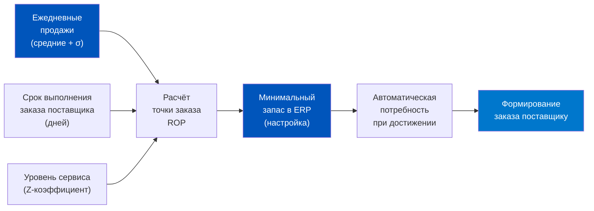
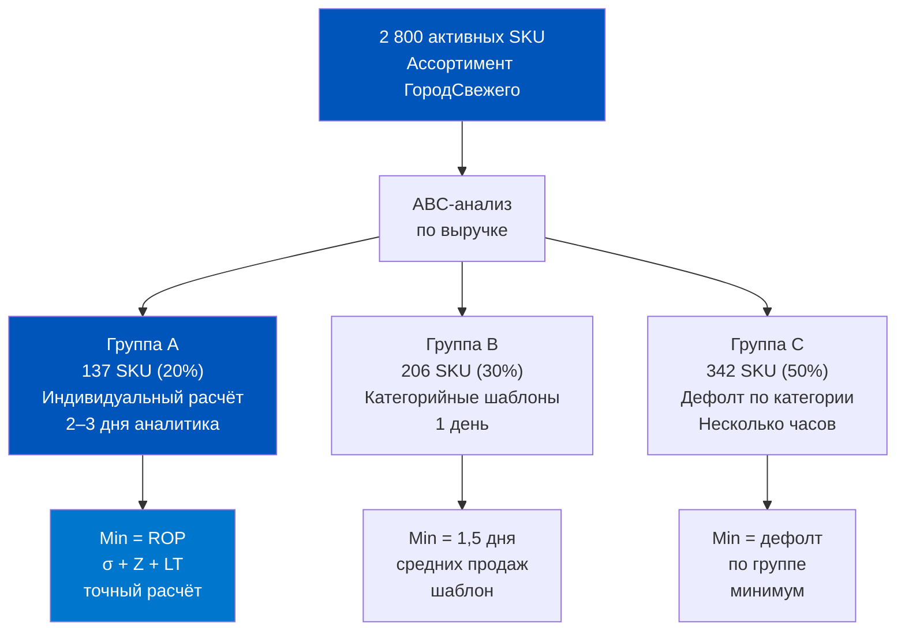
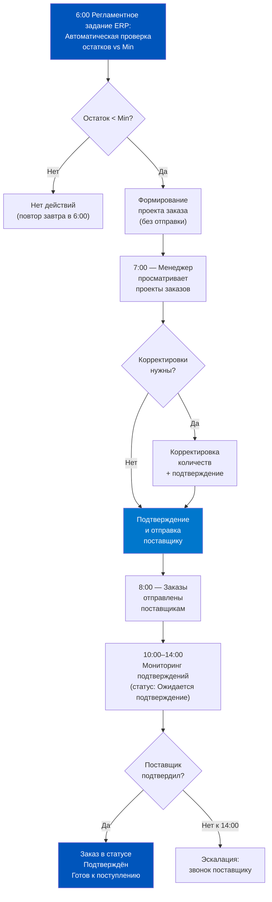
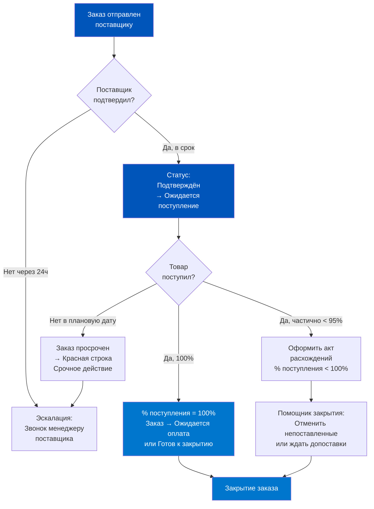
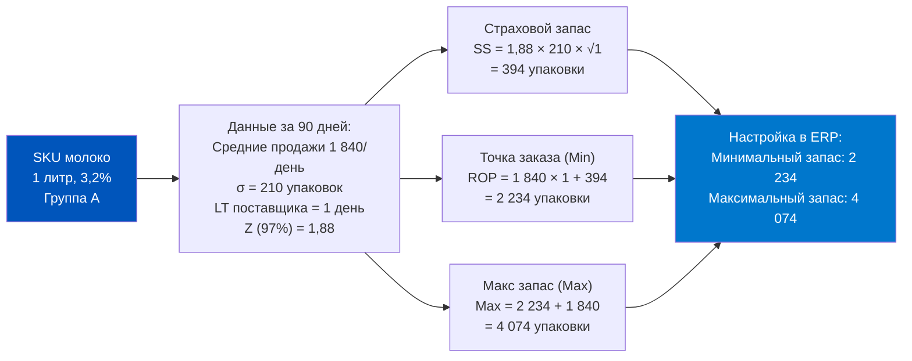

# День 6. Практикум: Дизайн процесса «Умная дозакупка»

## Часть 1. Задача — спроектировать процесс «умной дозакупки» для сети из 20 дарксторов

Добро пожаловать в формат практикума. Сегодня мы не просто изучаем инструменты — мы проектируем реальный операционный процесс от начала до конца. Вы будете работать как продакт-менеджер по логистике, которому поставлена конкретная задача.

**Задание.** Вы только что пришли на новую позицию в Q-com компанию «ГородСвежего». Сеть из 20 дарксторов в двух городах. Компании 2 года, оборот — около 800 000 000 рублей в год, средний чек 950 рублей. Активных SKU в матрице — 2 800 позиций.

Первое, что вы видите: нет единого процесса дозакупки. Каждый из четырёх категорийных менеджеров делает заказы «как чувствует»: кто-то раз в неделю, кто-то ежедневно, кто-то реагирует только после тревожного сигнала от операционного директора. Результат предсказуем: Out-of-Stock по приоритетным SKU держится на уровне 7,3% — почти вдвое выше нормы для сети такого масштаба.

Операционный директор ставит перед вами задачу: за 4 недели разработать и внедрить процесс «умной дозакупки», который снизит Out-of-Stock до 3,5% без увеличения складских запасов (то есть без роста оборотного капитала в закупках).

Это не тривиальная задача. Снизить дефицит можно грубой силой — закупить всё с запасом в 2 месяца. Но тогда вырастет оборотный капитал, увеличится списание фреша, упадёт оборачиваемость. «Умная» дозакупка — это точечное обеспечение: нужный товар, в нужном месте, в нужное время, в нужном количестве.

По завершении практикума вы должны уметь:
- Настраивать параметры Min/Max в 1С:ERP для ключевых категорий
- Понимать логику автоматического формирования заказов
- Выстраивать цикл контроля выполнения заказов
- Спроектировать утренний операционный ритуал закупщика

Начнём с исходных данных системы.


---

## Часть 2. Исходные данные — параметры системы: ассортимент, поставщики, точки заказа

Перед тем как проектировать процесс, нужно понять, с чем именно работаем. Вот параметры системы «ГородСвежего».

### Структура ассортимента

2 800 активных SKU разбиты на 5 категорий:

| Категория | SKU | Доля GMV | Частота заказа | Срок годности |
|-----------|-----|----------|---------------|--------------|
| Молочные продукты и яйца | 380 | 22% | Ежедневно | 3–21 день |
| Свежие овощи и фрукты | 210 | 18% | Ежедневно | 1–14 дней |
| Хлеб и выпечка | 95 | 8% | Ежедневно | 1–3 дня |
| Мясо и рыба | 145 | 15% | 3 раза в неделю | 1–7 дней |
| Бакалея, напитки, бытовая химия | 1 970 | 37% | 1–2 раза в неделю | 30–730 дней |

Первые три категории — «фреш» — требуют ежедневных заказов и составляют 48% GMV. Именно они являются источником большинства Out-of-Stock событий.

### Поставщики и их характеристики

На 2 800 SKU работает 87 активных поставщиков. Из них:
- 12 поставщиков фреша (ежедневные поставки, критический приоритет)
- 18 поставщиков мяса/рыбы (3 раза в неделю)
- 57 поставщиков бакалеи и сухих категорий (1–2 раза в неделю или реже)

Ключевые параметры, которые нужно знать по каждому поставщику:
- **Минимальная сумма заказа** (у большинства — от 15 000 до 80 000 рублей)
- **Срок выполнения заказа** (от 1 до 5 дней от момента заказа до поступления)
- **Частота доставки** (ежедневно / 3 раза в неделю / 1 раз в неделю)
- **OTIF%** (историческая надёжность, берётся из данных ERP за последние 90 дней)

### Текущее состояние настройки ERP

Проверка системы показала: из 2 800 SKU только у 340 (12%) настроены параметры Min/Max в карточке номенклатуры. Остальные 2 460 SKU управляются полностью вручную — закупщик смотрит на остаток и решает «на глаз», сколько заказать.

Это и есть корневая причина Out-of-Stock 7,3%. Человек не может держать в голове 700 позиций (своя доля на каждого из 4 менеджеров) и принимать точные решения ежедневно. ERP может — но её не настроили.

### Понятие «точки заказа»

**Точка заказа** (Reorder Point, ROP) — это уровень остатка, при достижении которого нужно сформировать заказ поставщику, чтобы новая партия пришла до того, как запас закончится.

Формула ROP:

```
ROP = Средние продажи в день × Время выполнения заказа (дней) + Страховой запас
```

Где страховой запас учитывает нестабильность спроса и нестабильность поставок:

```
Страховой запас = Z × σ_спроса × √(Время выполнения)
```

Здесь Z — коэффициент надёжности (для уровня обслуживания 95% — Z = 1,65; для 98% — Z = 2,05), σ_спроса — стандартное отклонение ежедневных продаж.

В 1С:ERP 2.5 точка заказа соответствует значению «Минимальный запас» в карточке номенклатуры (или в настройках склада для конкретной позиции). Достижение минимального уровня автоматически формирует «потребность» в пополнении.



---

## Часть 3. Блок 1 — Настройка Min/Max для фреш-категорий: как считать страховой запас

Начинаем с самого критичного: молочные продукты, овощи/фрукты, хлеб. Это 685 SKU с ежедневным циклом.

### Шаг 1. Собрать данные из ERP

Для каждой из 685 позиций нужно извлечь из 1С:ERP:
- Ежедневные продажи за последние 90 дней (по всем 20 дарксторам суммарно)
- Стандартное отклонение ежедневных продаж
- Исторический срок выполнения заказа по поставщику (разница между датой заказа и датой поступления)
- OTIF% поставщика за 90 дней

Эти данные берутся из отчётов ERP (раздел Закупки → Отчёты или Продажи → Отчёты) плюс журнал заказов поставщикам.

### Шаг 2. Рассчитать Min для каждого SKU

Возьмём конкретный пример. Молоко 3,2% жирности, 1 литр (один из топ-10 SKU по выручке):

- Средние продажи по сети: 1 840 упаковок в день
- Стандартное отклонение: 210 упаковок в день (σ)
- Срок выполнения заказа по поставщику: 1 день
- Уровень сервиса: 97% (Z = 1,88)

**Страховой запас:**
```
SS = 1,88 × 210 × √1 = 394 упаковки
```

**Точка заказа (Min):**
```
ROP = 1 840 × 1 + 394 = 2 234 упаковки
```

Это значит: когда суммарный остаток по сети падает ниже 2 234 упаковок — нужно немедленно формировать заказ.

### Шаг 3. Рассчитать Max для каждого SKU

Max — это уровень, до которого мы пополняем запас. Для фреша с коротким сроком годности Max ограничен физически: нельзя держать молока на 7 дней продаж, оно не доживёт.

Формула Max:

```
Max = Min + Количество заказа
Количество заказа = Средние продажи × Период пополнения
```

Для молока с ежедневными поставками период пополнения = 1 день:

```
Количество заказа = 1 840 × 1 = 1 840 упаковок
Max = 2 234 + 1 840 = 4 074 упаковки
```

Но нужно также проверить, что Max не превышает физическую ёмкость холодильного оборудования. Если суммарная ёмкость хранения молока по 20 дарксторам — 5 000 упаковок, то Max = min(4 074, 5 000) = 4 074. Всё в порядке.

### Шаг 4. Учесть сезонность и дни недели

Продажи молока в субботу-воскресенье на 35% выше, чем в будни. Если мы настроим статичный Min/Max по среднедневным продажам, в пятницу вечером система будет недооценивать потребность на выходные.

Решение: в 1С:ERP Min/Max можно настраивать в разрезе складов. Для ключевых SKU можно вести два набора параметров — «будни» и «выходные», переключая их через регламентное задание или вручную в пятницу.

Практичная альтернатива: закладывать в расчёт страхового запаса не среднее σ, а σ_выходного_дня, умноженное на коэффициент безопасности. Тогда Min будет рассчитан с учётом максимальной нагрузки.


### Приоритизация: ABC-анализ для настройки

685 SKU нельзя настраивать все вручную одновременно. Нужна приоритизация по ABC:
- **Группа A** (топ-20% по выручке, ~137 SKU) — настройка Min/Max в первую очередь, индивидуальный расчёт
- **Группа B** (следующие 30%, ~206 SKU) — настройка по типовым профилям (шаблонам по категориям)
- **Группа C** (оставшиеся 50%, ~342 SKU) — минималистичные настройки, мониторинг один раз в 2 недели

Для 137 SKU группы A — ручной расчёт с полными данными. Время: 2–3 рабочих дня аналитика.
Для 206 SKU группы B — типовые шаблоны: страховой запас = 1,5 дня средних продаж, срок пополнения = срок поставщика + 0,5 дня буфер. Время: 1 рабочий день.
Для 342 SKU группы C — единый шаблон «дефолт» по категории. Время: несколько часов.



### Расчёт Min/Max для нескольких дарксторов: агрегированный vs. индивидуальный подход

Важный вопрос: настраивать Min/Max для всей сети суммарно или для каждого даркстора отдельно?

Аргументы за агрегированный (по всей сети):
- Проще в администрировании
- Работает при централизованном складе, который раздаёт по дарксторам
- Меньше параметров для поддержки

Аргументы за индивидуальный (по каждому дарксторy):
- Дарксторы в разных локациях имеют разные паттерны потребления (спальный район vs. бизнес-центр)
- Разные транспортные расстояния до поставщика → разные сроки доставки
- Ошибка «осреднения»: высоконагруженный даркстор будет перебирать запас раньше, чем система среагирует

Рекомендуемый подход для «ГородСвежего»: гибридный.
- Для топ-50 SKU группы A — индивидуальные Min/Max в разрезе кластеров дарксторов (3–4 кластера по типу локации: «центр», «спальный район», «бизнес-зона», «пригород»)
- Для остальных SKU — агрегированный склад с распределением по дарксторам

В 1С:ERP параметры Min/Max настраиваются в разрезе «Номенклатура × Склад». 20 дарксторов = 20 складов = потенциально 20 × 685 = 13 700 строк настроек. Это управляемо при правильной шаблонизации.


---

## Часть 4. Блок 2 — Формирование заказов поставщику: ручное vs. автоматическое

Настроив Min/Max, мы создали «интеллект» системы — ERP теперь знает, когда и сколько заказывать по каждой позиции. Следующий вопрос: кто нажимает кнопку «Создать заказ»?

### Два режима формирования заказов

**Режим 1 — Ручной с подсказкой ERP.** Менеджер по закупкам каждое утро открывает рабочее место формирования заказов (раздел Закупки → Закупки → Заказы поставщикам или аналогичный раздел потребностей). Система показывает список позиций, у которых остаток достиг или ниже уровня Min. Менеджер просматривает список, корректирует количества при необходимости (например, учитывая грядущую акцию или праздник), и утверждает заказы.

Преимущество: человеческий контроль. Менеджер может увидеть, что на эту неделю запланирована маркетинговая кампания и нужно увеличить заказ на 20%.

Недостаток: зависимость от дисциплины. Если менеджер заболел или забыл — заказы не формируются.

**Режим 2 — Автоматический.** На основе настроенных параметров ERP самостоятельно формирует заказы поставщикам по регламентному заданию (например, каждое утро в 6:00). Менеджер получает список сформированных заказов для просмотра и акцепта (или автоматической отправки, если настроена интеграция с EDI/порталом поставщика).

Преимущество: системная дисциплина. Процесс не зависит от человека.

Недостаток: система не знает о маркетинговых кампаниях, праздниках, локальных акциях — если не настроены соответствующие корректировки.

### Рекомендуемая гибридная модель для «ГородСвежего»

Для сети из 20 дарксторов с 4 категорийными менеджерами оптимальна гибридная модель:



### Параметры формирования заказа в 1С:ERP

При создании заказа поставщику из документации ИТС следуют важные параметры:

- **Соглашение об условиях закупки** — если с поставщиком заключено одно соглашение, оно автоматически подставляется. Из соглашения берутся: цена, организация, склад, валюта, этапы оплаты.

- **Дата поступления** — плановая дата прихода товара. Рассчитывается как дата заказа + срок покупки (из соглашения). Это ключевой параметр для мониторинга просрочек.

- **Желаемая дата поступления** — дата, к которой компания хочет получить товар. Если срок поставки = 1 день, желаемая дата = завтра.

- **Длительность доставки** — плановое количество дней от отгрузки поставщиком до прихода на склад. Берётся из соглашения, влияет на расчёт даты поступления.

- **Правила оплаты** — этапы оплаты по заказу. Если в соглашении прописаны этапы — автоматически подставляются в заказ.

---

## Часть 5. Блок 3 — Контроль выполнения: что проверять после отправки заказа

Заказ отправлен — работа не закончена. Начинается фаза контроля выполнения. В Q-commerce с ежедневными поставками каждый непоставленный заказ имеет последствия уже на следующий день.

### Чеклист контроля для менеджера по закупкам

После отправки заказа нужно отслеживать три типа событий:

**Тип 1 — Неподтверждённые заказы.** Фильтр в списке заказов: текущее состояние = «Ожидается подтверждение». Через 24 часа после отправки все фреш-заказы должны быть в статусе «Подтверждён». Если нет — звонок поставщику.

**Тип 2 — Просроченные заказы.** Фильтр: «Просрочен» (подсветка красным). Ежедневная утренняя проверка, действие в течение часа после обнаружения.

**Тип 3 — Частичные поставки.** После прихода накладной смотреть % поступления в списке заказов. Если % поступления < 90% — уточнить у поставщика, будет ли допоставка или нужно искать альтернативу.



### Система метрик для еженедельного ревью

Каждую неделю категорийный менеджер и руководитель по закупкам проводят 30-минутный разбор показателей:

| Метрика | Цель | Источник в ERP |
|---------|------|----------------|
| Out-of-Stock% по категории | < 3,5% | Отчёт по остаткам + продажи |
| OTIF% по топ-20 поставщикам | > 95% | Журнал заказов + накладные |
| % заказов, закрытых в срок | > 98% | Список заказов, статус «Закрыт» |
| Средний % поступления | > 97% | Список заказов, колонка % поступления |
| Количество актов расхождений | < 5% заказов | Журнал актов расхождений |

### Закрытие заказов: регламент

В сети «ГородСвежего» нет регламента закрытия заказов. В результате в системе накопилось 1 847 «открытых» заказов за прошлый год — часть из них давно выполнена, но никто не закрыл. Это засоряет список и мешает нормальному мониторингу.

Новый регламент:
- Заказы фреша закрываются на следующий день после поставки (если % поступления ≥ 95%) или после оформления акта расхождений
- Заказы бакалеи — в течение 5 рабочих дней после плановой даты поставки
- Ответственный за закрытие — менеджер по закупкам категории
- Еженедельный отчёт: количество «открытых» заказов старше 30 дней (цель: 0)


---

## Часть 6. Практическое задание — кейс «Понедельник 6:00»: спроектировать утренний цикл закупки

Теперь применим всё изученное в реальном сценарии.

**Вводные данные.** Понедельник, 6:00. Вы — менеджер по закупкам категорий «Молочные продукты» и «Свежие овощи/фрукты» в сети «ГородСвежего». На прошлой неделе был настроен Min/Max для 137 приоритетных SKU. ERP сформировала проекты заказов автоматически в 6:00.

Вы открываете систему и видите следующую картину:

**Список сформированных проектов заказов (7 штук):**

1. ООО «МолокоПлюс» — молочная группа — 14 позиций, сумма 127 500 рублей, дата поступления — завтра (вторник)
2. ООО «Ферма Иванова» — йогурты, кефиры — 8 позиций, сумма 43 200 рублей, дата поступления — завтра
3. ИП Козлов — сыры — 5 позиций, сумма 61 800 рублей, дата поступления — среда (срок поставки 2 дня)
4. ООО «АгроПоставка» — томаты, огурцы, перец — 12 позиций, сумма 38 600 рублей, дата поступления — завтра
5. ООО «ЗеленьПро» — листовые салаты, зелень — 9 позиций, сумма 22 100 рублей, дата поступления — завтра
6. ООО «ФруктоМир» — бананы, яблоки, цитрусы — 15 позиций, сумма 71 400 рублей, дата поступления — завтра
7. ИП Смирнов — экзотические фрукты — 4 позиции, сумма 18 900 рублей, дата поступления — среда

**Дополнительная информация, которую вы знаете:**
- В воскресенье поступила информация от маркетинга: в среду запускается акция «-20% на весь фреш» продолжительностью 3 дня. Прогноз роста продаж в период акции: +40%
- В прошлую пятницу ООО «АгроПоставка» недопоставило 18% заказанного объёма томатов. Акт расхождений оформлен.
- OTIF ИП Смирнов за последние 30 дней: 71% (критический уровень — из вчерашнего урока вы это знаете)

**Ваши действия (ответьте на каждый вопрос):**

Вопрос 1. Какие заказы требуют корректировки из-за предстоящей акции? На сколько нужно увеличить количество?

Ответ: Заказы 1, 2, 4, 5, 6 — все поставщики фреша. Акция в среду-пятницу означает пик продаж с среды. Заказы 1, 2, 4, 5, 6 поступают во вторник — это обеспечение на вторник-среду. Заказы нужно увеличить на 40% по позициям, участвующим в акции. Дополнительно: нужно сформировать внеплановый заказ поставщикам с доставкой в среду и четверг для поддержания уровня запаса в период акции.

Вопрос 2. Что делать с заказом ООО «АгроПоставка» в свете недавней недопоставки?

Ответ: Заказ подтвердить, но уведомить поставщика о недавней недопоставке и запросить подтверждение наличия полного объёма ДО отправки заказа. Параллельно — проверить наличие резервного поставщика томатов (важно перед акцией с ростом спроса +40%). Если у поставщика нет возможности поставить полный объём — разделить заказ между «АгроПоставкой» и резервным источником.

Вопрос 3. Что делать с заказом ИП Смирнов при OTIF 71%?

Ответ: Это критический вопрос управления рисками. Экзотические фрукты — менее критичная позиция, чем базовый фреш. Но перед акцией с ростом спроса +40% надёжность критична. Действие: (а) позвонить ИП Смирнову и запросить подтверждение поставки в среду ДО отправки заказа; (б) проверить, есть ли альтернативный поставщик экзотики; (в) рассмотреть снижение объёма заказа у ИП Смирнов и компенсацию через альтернативного поставщика.

Вопрос 4. В каком порядке вы подтверждаете и отправляете заказы?

Ответ: Сначала — заказы с поставкой завтра (критичный день перед акцией): 1, 2, 4, 5, 6. Затем — заказы с поставкой в среду (3, 7), с проверкой надёжности поставщика 7. Цель: все 7 заказов подтверждены и отправлены до 8:00.

---

## Часть 6а. Расширенный разбор кейса «Понедельник 6:00»

Давайте разберём кейс из Части 6 в деталях, отвечая на каждый из четырёх вопросов с числовыми расчётами.

### Развёрнутый ответ на вопрос 1: расчёт дополнительного объёма под акцию

Акция «-20% на весь фреш» с прогнозируемым ростом продаж +40% на 3 дня (среда-пятница). Заказы 1 и 2 поступают во вторник — обеспечивают запасы на вторник-среду.

Возьмём заказ 1 (ООО «МолокоПлюс», 14 позиций, 127 500 рублей):

Предположим, что заказ рассчитан исходя из стандартных 2 дней продаж (вторник + среда без акции). Для покрытия пика среды нужно: базовый заказ × 1,4 = заказ × 40%. Дополнительный объём = 127 500 × 0,4 = 51 000 рублей сверх базового. Скорректированная сумма заказа 1: 127 500 + 51 000 = 178 500 рублей.

Аналогично для заказов 4, 5, 6 (фреш от овощей и фруктов):
- Заказ 4 (АгроПоставка): 38 600 × 1,4 = 54 040 рублей
- Заказ 5 (ЗеленьПро): 22 100 × 1,4 = 30 940 рублей
- Заказ 6 (ФруктоМир): 71 400 × 1,4 = 99 960 рублей

Итого дополнительный объём заказов под акцию по поставке вторника: 178 500 + 54 040 + 30 940 + 99 960 = 363 440 рублей (vs. базовых 259 600 рублей).

Плюс — нужны дополнительные заказы с поставкой в среду и четверг для поддержания запаса в разгар акции. Это внеплановые заказы, которые система автоматически не сформировала (акция не была внесена в ERP как «событие»).

### Развёрнутый ответ на вопрос 3: решение по ИП Смирнов

OTIF 71% — это значит, что из каждых 10 заказов 3 не выполняются вовремя и/или в полном объёме. При акции с ростом спроса +40% вероятность провала критична.

Алгоритм решения:
1. Позвонить ИП Смирнов: «Можете ли вы гарантировать 100% поставку 4 позиций в среду к 8:00?» — если «да, гарантируем», задокументировать (письмо/мессенджер).
2. Одновременно: проверить наличие альтернативного поставщика экзотики в базе контрагентов ERP.
3. Если альтернатива есть: разделить заказ — 60% у ИП Смирнов, 40% у альтернативного поставщика. Суммарный риск недопоставки снижается с 29% до ~12%.
4. Если альтернативы нет: снизить объём заказа у ИП Смирнов на 30% (консервативный запас с учётом низкого OTIF), зафиксировать в ERP как «пониженный заказ».
5. Параллельно инициировать поиск нового поставщика экзотики — ситуация с OTIF 71% неприемлема долгосрочно.

---

## Часть 7. Чеклист идеального процесса закупки и частые ошибки

### Чеклист «Умная дозакупка»: 20 пунктов

**Настройка системы (делается один раз, обновляется ежеквартально):**

- [ ] ABC-анализ ассортимента выполнен, SKU разбиты на группы A/B/C
- [ ] Min рассчитан для всех SKU группы A по формуле с учётом σ и Z-коэффициента
- [ ] Max рассчитан с учётом физической ёмкости склада и срока годности
- [ ] Параметры соглашений с поставщиками актуальны в ERP (срок поставки, мин. сумма)
- [ ] Регламентное задание автоформирования потребностей настроено и работает
- [ ] Порог контроля поступления при закрытии заказа включён
- [ ] Автокорректировка строк мерных товаров включена (фреш, мясо, рыба)

**Ежедневный цикл (07:00–08:00):**

- [ ] Проекты заказов просмотрены, проверены на актуальность
- [ ] Корректировки под сезонность/акции внесены
- [ ] Заказы с поставкой «сегодня» проверены на статус подтверждения
- [ ] Просроченные заказы (красные строки) — коммуникация с поставщиком
- [ ] Все заказы дня подтверждены и отправлены до 08:00

**Ежедневный цикл (14:00–15:00):**

- [ ] Неподтверждённые заказы фреша — эскалация
- [ ] Поступившие накладные сверены с заказами (% поступления)
- [ ] Акты расхождений оформлены при необходимости
- [ ] Принятый товар занесён на склад в ERP (приходный ордер, если ордерный склад)

**Еженедельное ревью:**

- [ ] Out-of-Stock% по категориям вычислен и сравнён с целевым
- [ ] OTIF по топ-20 поставщиков пересчитан
- [ ] Заказы старше 30 дней закрыты или находятся под контролем
- [ ] Min/Max скорректированы для SKU с изменившимися паттернами продаж (сезон, новинки)


### Топ-7 частых ошибок



**Ошибка 1. «Завышенный страховой запас как защита от всего».** Типичная реакция на Out-of-Stock — удвоить Min. Результат: Out-of-Stock исчезает, но растут списания фреша и замораживается оборотный капитал. Правильно: рассчитывать страховой запас математически, а не «на глаз».

**Ошибка 2. «Статичный Min без учёта сезонности».** Если Min рассчитан по среднегодовым данным, в праздники он будет недостаточен, а в низкий сезон — избыточен. Правильно: пересматривать Min/Max минимум раз в квартал, с учётом сезонных коэффициентов.

**Ошибка 3. «Заказ у ненадёжного поставщика без резервного источника».** Если OTIF поставщика < 90%, а резервного поставщика нет — это системный риск. Правильно: для топ-10 SKU иметь минимум 2 активных поставщика.

**Ошибка 4. «Закрытие заказов задним числом»**. Закупщик закрывает заказы раз в месяц «пачкой». В результате список заказов засоряется, мониторинг просрочек невозможен. Правильно: закрывать заказы в течение 1–2 дней после выполнения.

**Ошибка 5. «Игнорирование состояния "Ожидается подтверждение"».** Если поставщик не подтвердил заказ — это не значит, что он выполнит его в срок. Правильно: все фреш-заказы должны получить подтверждение в течение 24 часов, иначе — активное действие.

**Ошибка 6. «Автоматический заказ без учёта маркетинговых акций».** Чисто автоматический режим без человеческого контроля на этапе «проект заказа» опасен: акция может удвоить спрос, а система ничего не знает. Правильно: гибридная модель с ежеутренней проверкой проектов заказов.

**Ошибка 7. «Единый Min/Max для всех 20 дарксторов».** Потребности даркстора в спальном районе и даркстора в бизнес-центре разные. Правильно: Min/Max должны быть настроены в разрезе складов (дарксторов) или, как минимум, в разрезе кластеров (тип локации).

### Итоговая картина: что получает «ГородСвежего» после внедрения

Через 8 недель после начала внедрения «умной дозакупки» команда проводит итоговое ревью. Вот что изменилось:

**Количественные результаты:**
- Out-of-Stock снизился с 7,3% до 3,8% (цель 3,5% почти достигнута)
- Среднее время на формирование и отправку заказов сократилось с 3,5 часов до 55 минут в день
- Количество «экстренных» закупок (доплата за срочность) сократилось с 12–15 в месяц до 3–4
- Оборотный капитал в закупках вырос на 6,2% (в рамках допустимого — целевой предел был +10%)

**Изменения в процессе:**
- Все 4 категорийных менеджера работают по единому регламенту с утренним ритуалом до 8:00
- Проекты заказов формируются автоматически в 6:00 для фреш-категорий
- Введён еженедельный OTIF-отчёт по топ-20 поставщикам
- Настроены автоматические правила для 100 критических SKU (Min/Max в ERP)

**Что осталось сделать (дорожная карта):**
- Настроить Min/Max для группы B (206 SKU по шаблонам) — следующие 2 недели
- Ввести кластерные Min/Max для топ-30 SKU по типу локации даркстора — 4 недели
- Внедрить автоматическую корректировку Min под маркетинговый промо-календарь — 6 недель
- Финальная цель Out-of-Stock 3,5%: достижима через 4–5 недель при сохранении темпа

Путь от хаоса к управляемой дозакупке — это не прыжок, а последовательные шаги. Каждый шаг измерим и обоснован данными ERP.

### Итоговый числовой профиль практикума

Ключевые числа, рассчитанные в ходе практикума:

| Показатель | Значение | Расчёт |
|-----------|---------|--------|
| Out-of-Stock на старте | 7,3% | Исходные данные «ГородСвежего» |
| Цель Out-of-Stock | 3,5% | Задание практикума |
| Фреш-SKU с ежедневным циклом | 685 | Сумма молочных + овощи/фрукты + хлеб |
| Min молоко (основная марка) | 2 234 упаковки | ROP = 1 840 × 1 + 394 |
| Страховой запас молока (Z=1,88) | 394 упаковки | 1,88 × 210 × √1 |
| Max молоко | 4 074 упаковки | Min + 1 840 (1 день продаж) |
| SKU группы A (индивидуальный расчёт) | ~137 SKU | 20% от 685 |
| Допзаказ под акцию +40% по МолокоПлюс | 51 000 руб. | 127 500 × 0,4 |
| Out-of-Stock через 8 недель | 3,8% | Итог практикума |
| Рост оборотного капитала | +6,2% | В рамках допустимого (<10%) |

---

← [[Неделя 3 - День 5 - Мониторинг заказов|День 5]] | [[README|Оглавление]] | [[Неделя 3 - День 7 - История дефицита|День 7]] →
