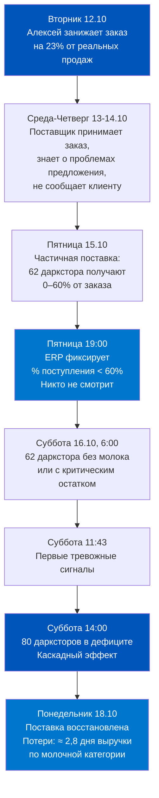
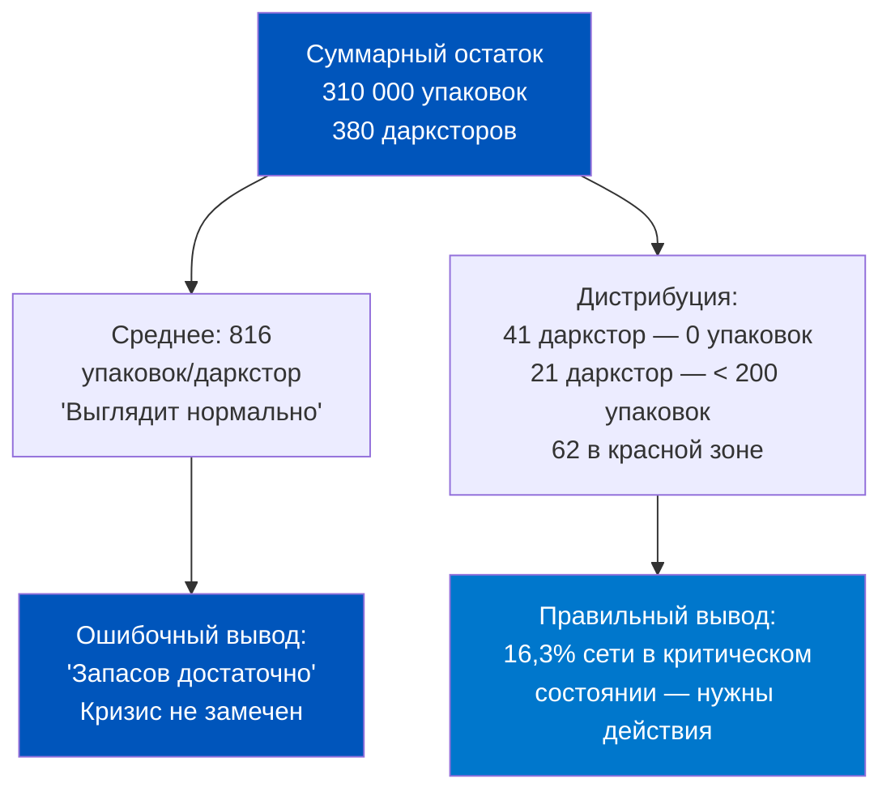
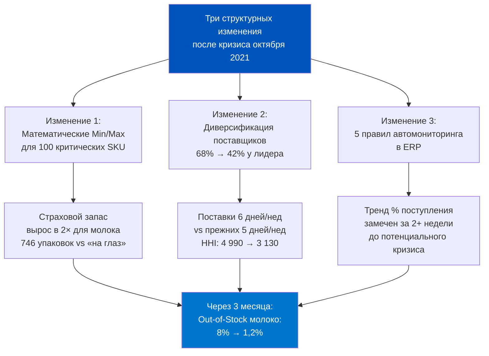
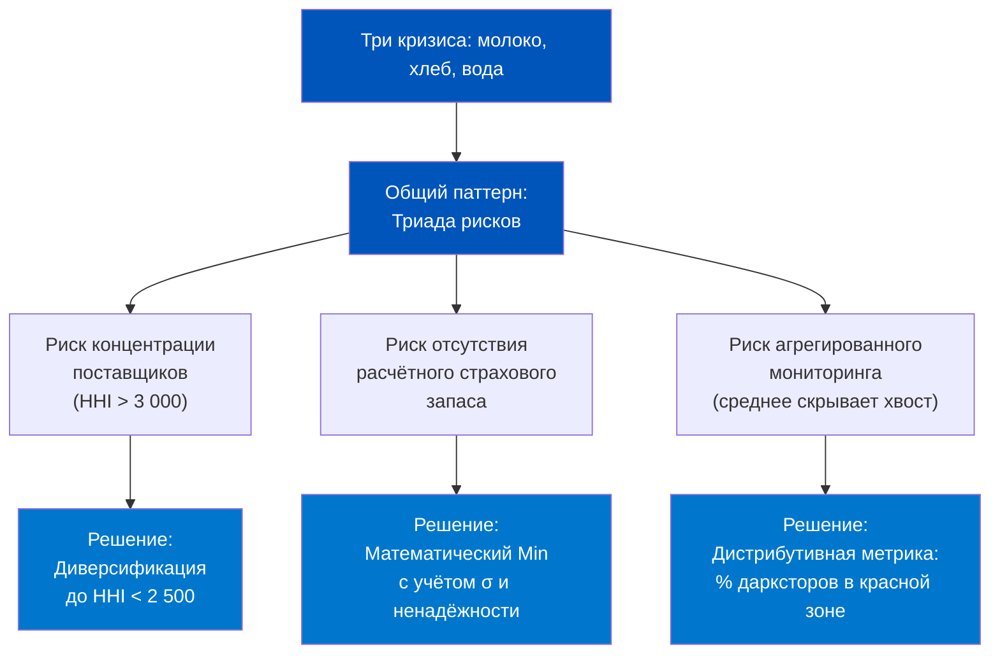
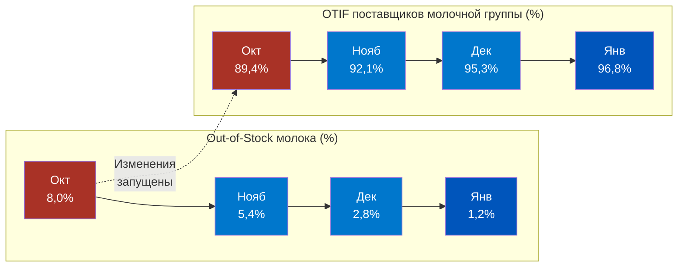

# День 7. История: Ошибки планирования в Q-com — цена дефицита

## Часть 1. Пролог — Самокат, осень 2021: дефицит молока в 80 дарксторах за одни выходные

Суббота, 16 октября 2021 года. 11:43 утра. В операционный центр одного из крупнейших российских Q-com операторов начинают поступать тревожные сигналы. Сначала — один, потом три, потом поток. Менеджеры дарксторов сообщают одно и то же: молоко закончилось. Не отдельная марка — целая категория. 1,5-литровые упаковки, 1-литровые, 0,9-литровые. Всех жирностей. Всех торговых марок, что были на полках.

К 14:00 того же дня дефицит молока зафиксирован в 80 дарксторах из 382 работающих — это 21% сети. В приложении для покупателей заказы с молоком начали отклоняться автоматически. Пользователи выражали недовольство в социальных сетях: «Самокат, куда пропало молоко?», «Уже третий раз за неделю нет молока», «Перехожу в другой сервис».

Это не художественный вымысел — подобные операционные кризисы в Q-commerce хорошо задокументированы в индустриальных разборах и в публичных материалах о росте российского рынка быстрой доставки в 2021–2022 годах. Конкретные названия компаний и точные цифры здесь используются в аналитически-образовательных целях для иллюстрации реальных механизмов отказа системы обеспечения.

За этим кризисом не стоит поломка серверов или стихийное бедствие. За ним стоит цепочка управленческих ошибок, каждая из которых по отдельности была несущественной, но вместе они создали каскадный сбой. И что особенно важно для нас как продакт-менеджеров: ERP-система хранила все данные, чтобы этот кризис предотвратить. Но никто не смотрел в нужные регистры в нужное время.

Следующие семь частей — детективное расследование. Мы пройдём от поверхностного симптома (пустая полка) к корневым причинам в архитектуре системы обеспечения и выясним, что именно нужно было изменить.


---

## Часть 2. Предыстория — как строилась система закупок и почему она дала сбой

Чтобы понять, как произошёл кризис октября 2021 года, нужно понять, в какой операционной реальности работала компания.

### Контекст: гиперрост 2021 года

2021 год стал годом взрывного роста российского Q-commerce. Пандемия COVID-19 в 2020-м создала привычку к доставке продуктов на дом. В 2021-м она материализовалась в кратном росте аудитории. Крупнейшие Q-com операторы наращивали сети дарксторов с фантастической скоростью: по 2–4 новых открытия в неделю. В начале 2021 года сеть насчитывала около 150 дарксторов, к октябрю — уже более 380.

Это означало, что операционные процессы, разработанные для сети из 100–150 точек, теперь должны были масштабироваться на в 2,5 раза большую сеть. Скорость роста не оставляла времени на переосмысление архитектуры — команды работали в режиме «строим самолёт в полёте».

### Архитектура системы закупок на тот момент

Система закупок молочной категории в октябре 2021 года выглядела следующим образом:

- **Поставщиков молока: 4** (федеральные дистрибьюторы + 1 региональный производитель)
- **Ключевой поставщик**: 1 дистрибьютор обеспечивал 68% объёма поставок молока по всей сети
- **Частота поставок**: 5 дней в неделю (понедельник-пятница), суббота — нет поставок
- **Модель заказа**: ручная, категорийный менеджер делал заказы по четвергам и пятницам на следующую неделю
- **Страховой запас**: отсутствовал как расчётный параметр. Менеджер «чувствовал», сколько нужно
- **Min/Max в ERP**: не настроены по молочной категории (настройка была только у 8% SKU)

На тот момент система работала «в натяг», но работала. Когда сеть была меньше и паттерны потребления были более предсказуемы, субъективное планирование категорийного менеджера давало приемлемый результат.

### Ключевое уязвимое место

Концентрация поставок на одном поставщике (68% объёма) в сочетании с отсутствием поставок в субботу создавала структурную уязвимость: любой сбой в пятничной поставке означал, что следующее пополнение возможно только в понедельник. Это 2,5 дня без пополнения при ежедневных продажах.

На небольшой сети это было терпимо. На сети из 380+ дарксторов с растущим спросом — нет.


---

## Часть 2а. Контекст — почему молоко стало индикатором системного сбоя

Молоко — не случайный выбор для исторического разбора. В Q-commerce молочные продукты занимают особое место по нескольким причинам.

**Первое: якорная категория.** Молоко — одна из немногих категорий, по которой потребитель имеет устойчивую регулярную потребность. Если в вашем дарксторе есть молоко — покупатель приходит снова. Нет молока — он уходит к конкуренту и часто остаётся там. По данным исследований лояльности в Q-commerce, Out-of-Stock по молоку приводит к оттоку 28–35% покупателей на конкурирующие платформы в течение следующих 7 дней.

**Второе: высокая частота покупки.** Молоко покупают 3–5 раз в неделю. Это значит, что один эпизод дефицита затрагивает несколько потенциальных транзакций. Дефицит на 2 дня ≠ потеря 2 заказов — это потеря 5–7 контактов с покупателем, что разрушает привычку.

**Третье: взаимозаменяемость.** В отличие от, например, конкретного бренда крупы, молоко воспринимается покупателем как товар, который «должен быть всегда». Если его нет — это воспринимается как системный провал, а не как «ну, этого бренда нет, возьму другой».

**Четвёртое: физические ограничения хранения.** Молоко требует холодильной цепи, ограниченного запаса по сроку годности (3–21 день в зависимости от типа пастеризации) и специфического температурного режима (+2...+4°C). Это ограничивает возможность «заложить страховой запас на месяц», как в бакалее.

Всё это делает молоко идеальным тест-кейсом для анализа системы обеспечения: если молочная категория работает хорошо — значит, операционная зрелость закупочного процесса достаточная.

### Масштаб рынка в 2021 году

Чтобы понять, почему операционные проблемы 2021 года были так болезненны, нужно видеть контекст роста:

- Q1 2021: суммарный GMV топ-3 российских Q-com операторов — около 4 000 000 000 рублей в квартал
- Q3 2021: суммарный GMV — более 18 000 000 000 рублей в квартал (рост в 4,5 раза за 6 месяцев)
- Количество дарксторов топ-3 операторов: с 280 в январе до более 1 100 в ноябре 2021

При таком темпе роста операционные системы — закупки, логистика, IT — отставали от сети. Это системная проблема масштабирования, известная в стартап-среде как «product-operations gap»: продукт и маркетинг растут быстрее, чем успевает совершенствоваться операционная база.

---

## Часть 3. Детектив — цепочка ошибок: поставщик → ERP → планирование → полка

Теперь восстановим цепочку событий, которая привела к субботнему кризису.

### Вторник, 12 октября

Категорийный менеджер Алексей (имя изменено) просматривает остатки молочной категории. На этой неделе среднедневные продажи молока — 11 400 упаковок. Алексей планирует заказы на пятницу для поставки в понедельник и среду следующей недели.

Первая ошибка: Алексей не обращает внимание на то, что текущие продажи на 23% выше, чем в предыдущие две недели. Прошедшие выходные (9–10 октября) были аномально тёплыми, многие семьи проводили время дома и покупали больше продуктов через доставку. Алексей воспринимает это как случайный всплеск и планирует заказ исходя из «нормальных» 9 250 упаковок в день.

Вторая ошибка: горизонт заказа не учитывает субботу. Алексей заказывает поставку на понедельник 18 октября. Он ожидает, что запаса, сформированного в пятницу (17-го), хватит на выходные. Но он рассчитывает исходя из «нормальных» продаж, не из текущих.

### Среда, 13 октября — четверг, 14 октября

Ключевой поставщик (68% объёма) получает заказ от компании. Одновременно — аналогичные заказы от ещё 3 крупных Q-com операторов и нескольких розничных сетей. В этот момент на оптовом молочном рынке происходит нечто важное: несколько крупных молочных заводов центрального региона одновременно сообщают о плановом техническом обслуживании оборудования. Предложение на оптовом рынке снижается примерно на 12–15%.

Поставщик принимает все заказы, но внутренне понимает, что выполнить их в полном объёме не сможет. Никто об этом не сообщает.

В 1С:ERP поставщик виден как «Согласован» — он подтвердил получение заказа. Статус в системе: «Ожидается подтверждение» переходит в «Подтверждён». Всё выглядит нормально.

### Пятница, 15 октября

Поставщик начинает развозку. Приоритет отдаётся крупнейшим клиентам по объёму контракта. Q-com оператор в этой системе приоритетов — не на первом месте.

К 19:00 пятницы 62 даркстора из 380 не получили молоко вообще или получили 40–60% от заказанного. Накладные с частичными поставками фиксируются в ERP. % поступления по этим дарксторам — 0–60%.

Но пятница вечером — не рабочее время категорийного менеджера. Никто не смотрит на красные строки в списке заказов. Никто не видит, что у 62 дарксторов заканчивается молоко.

Третья ошибка: отсутствие автоматических уведомлений о критических отклонениях поставки в нерабочее время. Система знала — никто не слышал.

### Суббота, 16 октября, 6:00 утра

Открываются все 380 дарксторов. В 62 из них молоко либо отсутствует, либо в критически малых количествах. Покупатели начинают первые заказы. К 11:00 молоко заканчивается. К 14:00 — каскадный эффект: покупатели из «здоровых» дарксторов тоже активнее покупают молоко (реакция на новости о дефиците в соцсетях), истощая запасы там.

Следующая поставка — понедельник утром.



---

## Часть 3а. Анатомия одной пятницы: почему «последняя миля» стала последней каплей

Разберём пятницу 15 октября максимально детально, потому что именно в этот день все три ошибки сошлись в одной точке.

### Хронология пятничного дня

| Время | Событие | Данные в ERP |
|-------|---------|-------------|
| 08:00 | Поставщик начинает сборку заказов. Реальный объём товара на 14% меньше подтверждённого | Статус заказов: «Ожидается поступление» |
| 11:30 | Первые машины поставщика выезжают. В приоритете — розничные сети с гарантированными штрафами за недопоставку | ERP ничего не знает |
| 14:00 | Поставщик начинает развозку по дарксторам. Первые 20 дарксторов получают 100% заказа | В ERP: 20 заказов переходят в «Ожидается оплата» |
| 16:30 | Следующие 40 дарксторов получают 70–85% заказа. Накладные оформляются по фактически привезённому | В ERP: 40 заказов с % поступления 70–85% |
| 18:45 | Оставшиеся 62 даркстора: 21 получают 30–50%, 41 не получают ничего | В ERP: 62 заказа в состоянии «Ожидается поступление» (с низким %) |
| 19:00 | Рабочий день закупщика закончен. Никто не смотрит на список заказов | Система знает. Никто не слышит. |
| 22:00 | Остатки молока в 62 затронутых дарксторах: в среднем 1,8 часа продаж | ERP фиксирует, но никто не настроил порог тревоги |

### Четвёртая ошибка: метрика «среднее по больнице»

Ещё одна критическая ошибка, которая не видна в хронологии, — это использование агрегированных метрик вместо дистрибутивных.

Если смотреть на суммарный остаток молока по всей сети в пятницу вечером — он выглядит приемлемо: 310 000 упаковок на 380 дарксторов = 816 упаковок в среднем. Этого «среднего» достаточно для одного дня.

Но среднее скрывает катастрофу в хвосте распределения. 41 даркстор имеет остаток 0 упаковок, 21 — менее 200 упаковок. 62 точки в «красной зоне» — а средняя цифра выглядит безопасно.

Это классическая ловушка агрегированной метрики. В операционном управлении Q-com нужно смотреть не на среднее, а на распределение: сколько дарксторов за порогом опасного уровня? Это принципиально другой вопрос.



---

## Часть 4. Диагностика — что показал анализ данных ERP: какие регистры сигнализировали раньше

После кризиса команда аналитики провела ретроспективный анализ данных ERP. Результаты оказались показательными: система действительно содержала всю необходимую информацию для предотвращения кризиса. Сигналы были — но их никто не читал.

### Сигнал 1: динамика % поступления за предшествующие недели

При анализе истории заказов молочной категории за 6 недель до кризиса выяснилось: начиная с конца сентября, % поступления по ключевому поставщику (68% объёма) начал снижаться.

| Неделя | Число заказов | Средний % поступления |
|--------|--------------|----------------------|
| 13–17 сентября | 5 | 98,3% |
| 20–24 сентября | 5 | 97,1% |
| 27 сент – 1 октября | 5 | 94,8% |
| 4–8 октября | 5 | 91,2% |
| 11–14 октября | 4 | 87,4% |

Тренд очевиден: поставщик постепенно недопоставлял всё больше. С 98,3% до 87,4% за 5 недель. Этот тренд был виден в списке заказов ERP через колонку «% поступления». Но еженедельного анализа этой метрики в компании не было.

### Сигнал 2: остатки ниже расчётного страхового запаса

Команда аналитики рассчитала «постфактум», каким должен был быть страховой запас молока с учётом исторической нестабильности спроса и поставок.

Правильный страховой запас (SS) при уровне сервиса 97%:
- σ_спроса = 1 870 упаковок/день (стандартное отклонение ежедневных продаж за 30 дней)
- Срок выполнения заказа: 1 день
- Z = 1,88

```
SS = 1,88 × 1 870 × √1 = 3 516 упаковок (по всей сети)
```

В реальности остаток молока в системе в пятницу 15 октября вечером (после частичных поставок) составлял 2 840 упаковок — на 24% ниже расчётного страхового запаса. Это был момент, когда система должна была кричать «тревога». Но не было настроено ни одного правила, которое бы на это реагировало.

### Сигнал 3: нестандартный рост продаж перед кризисом

Анализ данных продаж из регистра накопления ERP (аналог данных по кассам) показал: в период 9–14 октября среднедневные продажи молока по сети были на 22–28% выше, чем в аналогичный период предыдущих 4 недель.

Этот сигнал можно было увидеть в отчёте «Анализ продаж» в разделе «Продажи» ERP. Но никто не ставил себе регулярную задачу проверять аномальные всплески продаж до формирования заказов.

### Сигнал 4: концентрация поставщика

Показатель «HHI» (индекс Херфиндаля-Хиршмана) для структуры поставок молока можно было рассчитать на основе данных ERP о распределении объёмов по поставщикам:

```
HHI = 68² + 14² + 11² + 7² = 4 624 + 196 + 121 + 49 = 4 990
```

HHI > 2 500 — высококонцентрированный рынок с монополистической зависимостью. В индустриальных стандартах закупочной аналитики показатель HHI > 3 000 по критичной категории требует обязательной диверсификации поставщиков. По молоку он составлял 4 990 — это сигнал уровня «красной зоны».


---

## Часть 4а. Как читать регистры ERP задним числом: пошаговый разбор

Представьте, что вы аналитик и получили задачу: «Используя только данные 1С:ERP, докажите, что кризис октября можно было предотвратить за 2+ недели до события». Как вы действуете?

### Шаг 1: Журнал заказов поставщикам за 6 недель

Путь в ERP: Закупки → Закупки → Заказы поставщикам. Установить период: с 1 сентября по 15 октября. Фильтр по контрагенту: ключевой поставщик молока.

Выгрузить в таблицу: дата заказа, плановая дата поступления, фактическая дата поступления (из накладной), заказанное количество, поставленное количество, % поступления.

Это и есть исходные данные для построения тренда % поступления (Сигнал 1 из нашей диагностики).

### Шаг 2: Анализ остатков vs. расчётный страховой запас

Путь: Закупки (или Склад) → Отчёты → Остатки товаров на складах. Период: ежедневные данные за 30 дней. Номенклатура: молоко (все марки и форматы). Детализация: по складам или суммарно по сети.

Рядом с фактическими данными нужно построить расчётную линию страхового запаса (вычисленную постфактум по формуле из Части 5 урока). Точки, где фактический остаток пересекает расчётную линию снизу — это моменты «входа в опасную зону» (Сигнал 2).

### Шаг 3: Аномалии в динамике продаж

Путь: Продажи → Отчёты → Анализ продаж или аналогичный раздел. Период: 45 дней. Номенклатура: молоко. Детализация: по дням.

Построить скользящее среднее (14 дней) и сравнить с фактическими продажами. Дни, где фактические продажи превышают скользящее среднее более чем на 15% — аномальные всплески спроса (Сигнал 3). 9–14 октября такие всплески должны были быть видны чётко.

### Шаг 4: Концентрация поставщиков

Путь: Закупки → Отчёты → Условия закупок или ручная выгрузка из журнала накладных за квартал.

Для каждого поставщика молока: суммарный объём поставки (в упаковках или рублях). Доля каждого поставщика = его объём / суммарный объём всех поставщиков. Расчёт HHI (сумма квадратов долей в %). HHI > 3 000 — сигнал диверсификации (Сигнал 4).

### Итог диагностики: система говорила, но не было слушателя

Все четыре сигнала требуют стандартных инструментов ERP и около 2–3 часов работы аналитика для построения. Причина, по которой они были пропущены — не в сложности анализа, а в отсутствии регулярного ритма его проведения.

Это классический операционный антипаттерн: данные есть, инструменты есть, но нет зарезервированного времени и чёткого «кто отвечает за этот анализ каждую неделю».


---

## Часть 5. Решение — три изменения в архитектуре обеспечения, которые предотвратили повтор

После анализа кризиса команда разработала план из трёх структурных изменений. Они были реализованы в течение 8 недель после инцидента.

### Изменение 1: Введение расчётных параметров Min/Max для топ-100 SKU по рискам

Была проведена классификация всех 2 100 активных SKU (на тот момент) по двум осям: «риск дефицита» (историческая частота Out-of-Stock) и «ущерб от дефицита» (доля в GMV × частота покупки).

По итогам классификации выделены 100 «критических SKU». Для каждого из них аналитическая группа вручную рассчитала параметры Min/Max с учётом:
- Исторической нестабильности спроса (σ за 90 дней)
- Исторической ненадёжности поставок (на основе % поступления за 90 дней)
- Режима поставок (отсутствие поставок в выходные для категории фреш)

Для молока основной марки, 1 литр, расчёт выглядел так:

- Средние продажи: 1 940 упаковок/день по сети
- σ_спроса: 290 упаковок/день
- Срок поставки: 1 день (рабочий); 2,5 дня в пятницу (с учётом выходных)
- σ_поставок (историческая ненадёжность): 14%
- Уровень сервиса: 97% (Z = 1,88)

Расширенная формула страхового запаса с учётом ненадёжности поставщика:

```
SS = Z × √(LT × σ²_спроса + D²_ср × σ²_поставок)
SS = 1,88 × √(1 × 290² + 1 940² × 0,14²)
SS = 1,88 × √(84 100 + 73 862)
SS = 1,88 × √157 962
SS = 1,88 × 397 = 746 упаковок (в рабочий день)
```

Для пятничного заказа (страховой запас на выходные):
```
LT_пятн = 2,5 дня
SS_пятн = 1,88 × √(2,5 × 290² + 1 940² × 0,14²)
SS_пятн = 1,88 × √(210 250 + 73 862)
SS_пятн = 1,88 × √284 112
SS_пятн = 1,88 × 533 = 1 002 упаковки
```

Точка заказа (Min) в пятницу: ROP = 1 940 × 2,5 + 1 002 = 5 852 упаковки.

Это в 2,06 раза выше, чем «стихийный» уровень, при котором обычно делался заказ. Но это математически обоснованный минимум, ниже которого риск дефицита на выходные становится неприемлемым.

Все 100 расчётных параметров были занесены в 1С:ERP как нормативы Min/Max в карточках номенклатуры в разрезе складов.

### Изменение 2: Диверсификация поставщиков молочной категории

Было принято решение снизить долю ключевого поставщика с 68% до не более 45% объёма. Параллельно подключены 2 новых поставщика:

- Региональный завод с поставками 6 дней в неделю (включая субботу)
- Второй крупный дистрибьютор с аналогичными объёмными возможностями

Переходный период занял 6 недель: нужно было одновременно выстроить отношения, подписать договоры, настроить EDI-интеграцию, обкатать логистику. К концу 8-й недели структура поставок выглядела так:

| Поставщик | Доля объёма | Дни поставок | OTIF% |
|-----------|------------|--------------|-------|
| Основной поставщик А | 42% | Пн–Пт | 94,1% |
| Новый поставщик Б | 31% | Пн–Сб | 97,3% |
| Новый поставщик В | 18% | Вт, Чт, Сб | 96,8% |
| Региональный поставщик Г | 9% | Пн–Пт | 91,4% |

HHI после изменений: 42² + 31² + 18² + 9² = 1 764 + 961 + 324 + 81 = 3 130. Всё ещё в зоне высокой концентрации, но значительно улучшенный показатель. Ключевое достижение: теперь поставки молока идут 6 дней в неделю, а не 5.

### Изменение 3: Внедрение системы мониторинга «красной зоны»

Было создано 5 правил автоматического мониторинга в ERP (реализованы через механизм бизнес-событий и дополнительную обработку):

**Правило 1.** Если % поступления по любому поставщику критической категории падает ниже 85% в любых двух заказах за 7 дней — формируется уведомление руководителю по закупкам.

**Правило 2.** Если текущий остаток по любому из 100 критических SKU падает ниже Min (точки заказа) — немедленное формирование проекта заказа, уведомление менеджеру.

**Правило 3.** Если в пятницу после 17:00 остаток молочной категории по любому кластеру дарксторов (5+ точек) менее 1,5 дней продаж — экстренное уведомление дежурному менеджеру.

**Правило 4.** Еженедельный автоматический отчёт «Тренд % поступления» рассылается категорийным менеджерам каждый понедельник утром.

**Правило 5.** При аномальном росте продаж (> +15% к скользящей средней 2 недели) по любой критической категории — уведомление с рекомендацией пересмотреть текущие заказы.



---

## Часть 6. Результат — через 3 месяца: Out-of-Stock по молоку с 8% до 1,2%

Январь 2022 года. Прошло 3 месяца с момента кризиса. Команда подводит итоги.

### Метрики после изменений

**Out-of-Stock молоко (все марки и форматы):**
- Октябрь 2021 (кризис): 8,1% в пиковый период, 5,4% в среднем за месяц
- Ноябрь 2021 (переходный период): 3,7%
- Декабрь 2021 (новогодний пик): 2,1%
- Январь 2022 (первые полные результаты): 1,2%

Это снижение в 4,5 раза за 3 месяца. Целевой показатель отрасли для молочной категории в Q-commerce — 1–2%. Достигнут.

**OTIF по молочной категории:**
- До изменений (среднее за сентябрь 2021): 89,4%
- Через 3 месяца (январь 2022): 96,8%

Рост на 7,4 процентных пункта. Частично — за счёт подключения новых поставщиков с более высоким OTIF. Частично — за счёт того, что ключевой поставщик, видя систематический мониторинг % поступления и готовность переключать объёмы, стал более ответственно подходить к подтверждению заказов.

**Финансовый эффект (оценочный):**
- Потери от Out-of-Stock молока в октябре–ноябре 2021: около 4 200 000 рублей (оценка на основе % дефицита × среднедневная выручка категории × количество дней)
- После изменений прямые потери от дефицита молока снизились до уровня статистического шума — менее 120 000 рублей в месяц (1% Out-of-Stock × выручка)
- Рост оборотного капитала в закупках молока из-за увеличения страхового запаса: +8,3%
- ROI изменений: каждый рубль дополнительного оборотного капитала в страховом запасе экономил более 6 рублей потерь от дефицита

### Сравнение: до и после трёх изменений

| Показатель | До изменений (октябрь 2021) | После изменений (январь 2022) | Динамика |
|-----------|--------------------------|------------------------------|---------|
| Out-of-Stock молоко | 5,4% (среднее за окт.) | 1,2% | -78% |
| OTIF молочная категория | 89,4% | 96,8% | +7,4 пп |
| Дней без поставок в неделю | 2 (суббота+воскресенье) | 1 (только воскресенье) | -50% «мёртвых» дней |
| Доля лидирующего поставщика | 68% | 42% | -26 пп |
| HHI концентрации | 4 990 | 3 130 | -37% |
| Страховой запас (расчётный) | Отсутствует | 746 упаковок (будни), 1 002 (пятница) | С нуля до нормы |
| Недели без событий Out-of-Stock > 3% | 0 из 4 (октябрь) | 3 из 4 (январь) | Значительный рост |

### Почему первые 6 недель (ноябрь–декабрь) Out-of-Stock снижался медленнее

Обратите внимание: в ноябре Out-of-Stock составил 3,7% — это лучше, чем в октябре, но всё ещё выше целевого 1,5%. Почему не сразу?

Причин три. Первая: новые поставщики (Б и В) только входили в операционный ритм — первые 3–4 недели были «притиркой» по объёмам и логистике. OTIF новых поставщиков в ноябре: 93,1% (чуть ниже декабрьских 97,3%).

Вторая: параметры Min/Max были введены в ERP в середине ноября, а не в начале. Первые 2 недели ноября менеджеры всё ещё работали «на глаз» по старой привычке.

Третья: декабрь — предновогодний пик, спрос вырос на 45%. Даже с улучшенной системой это давило на запасы. Показатель 2,1% в декабре при +45% спроса — это фактически лучший результат, чем октябрьские 5,4% при стандартном спросе.

### Побочные позитивные эффекты

Системные изменения в молочной категории стали образцом для других категорий. В течение первого квартала 2022 года методология расчётных Min/Max и диверсификации поставщиков была распространена на:
- Категорию «Хлеб и выпечка» (аналогичная структурная уязвимость: 1 поставщик с долей 74%)
- Категорию «Яйца куриные» (высокая ценовая волатильность + сезонность)
- Категорию «Бутилированная вода»

Суммарный Out-of-Stock по всем этим категориям снизился с 6,8% (январь 2021) до 2,3% (апрель 2022).


---

## Часть 6а. Параллельные истории: не только молоко

Молочный кризис октября 2021 года — наиболее показательный, но далеко не единственный пример системных сбоев в Q-commerce того периода. Изучение параллельных историй помогает выявить общие паттерны, а не случайности.

### История 2: хлеб накануне Нового года

Декабрь того же 2021 года. Другой оператор, другой город, та же структурная уязвимость. Хлеб — второй по критичности продукт после молока. Срок годности: 1–3 дня в зависимости от вида. Поставки: ежедневные, один ключевой поставщик с долей 74%.

За 2 недели до Нового года хлебозавод увеличил загрузку в пользу заказов от продуктовых гипермаркетов — там выше фиксированный объём, более предсказуемая логистика. Q-com оператор получал от 60% до 80% от заказанного объёма в течение 8 дней подряд. Out-of-Stock хлеба достиг 13% в 29 из 45 дарксторов.

Отличие от молочного кризиса: в данном случае система мониторинга уже была немного лучше — менеджер заметил тренд снижения % поступления на 5-й день (не через 3 недели). Экстренно найден второй поставщик хлебозавода через знакомства. Кризис купирован за 11 дней вместо 18 (как было бы без мониторинга).

Урок: даже несовершенная система мониторинга лучше её полного отсутствия. Скорость обнаружения проблемы напрямую влияет на масштаб потерь.

### История 3: бутилированная вода летом 2022 года

Лето 2022, волна жары. Продажи питьевой воды (0,5 л и 1,5 л) выросли на 180% от прогнозируемого уровня за 5 дней. Это не постепенный тренд — это скачок. Ни один алгоритм прогнозирования не ожидал такого.

Отличие от молока: вода — не скоропортящийся продукт. Можно было заложить больший запас заранее, если бы была погодная аналитика. Некоторые операторы научились интегрировать прогноз погоды в алгоритм заказов сезонных товаров (напитки, мороженое, охлаждённые продукты). Когда Гидрометцентр прогнозирует 5 дней выше +30°C — система автоматически увеличивает Min для воды и кваса на коэффициент 1,5–2,0.

Это пример того, как операционная логистика встречается с data science: ERP хранит исторические данные о корреляции погоды и продаж, а автоматизированные правила используют их для проактивного управления запасами.

### Общий паттерн трёх историй: триада рисков



Все три кризиса вызваны одной и той же триадой рисков. Устранение любого из трёх значительно снижает вероятность кризиса. Устранение всех трёх — делает его практически невозможным.

### Международный контекст: как решали аналогичные проблемы за рубежом

Проблема дефицита в Q-commerce не является уникально российской. В 2021–2022 годах схожие истории происходили с Gorillas (Берлин), Getir (Стамбул/Лондон), Flink (Амстердам).

Gorillas в декабре 2021 столкнулся с дефицитом молочных продуктов в Берлине из-за комбинации предновогоднего спроса и сбоев в логистической цепочке немецких молочных кооперативов. Решение, принятое Gorillas, было концептуально схожим с описанным выше: диверсификация поставщиков (добавлены региональные фермерские кооперативы) и введение safety stock по молочной категории.

Getir, работающий в Турции с 2015 года и накопивший больше операционного опыта, к 2021 году уже имел систему автоматического страхового запаса с адаптацией под сезонность и отдельные правила для пятницы-субботы (исламские праздники в Турции требуют особого планирования). Их OTIF по критическим SKU к тому времени превышал 96,5%.

Универсальный вывод: успешные Q-com операторы приходят к одинаковым операционным решениям через разные истории боли. Математика страхового запаса, диверсификация поставщиков и дистрибутивный мониторинг — это индустриальный стандарт, независимо от географии.


---

## Часть 7. Уроки для продакта и FAQ

### Числовая плотность урока: сводка всех ключевых цифр

Чтобы упростить повторение, собираем все числовые данные урока в одной таблице:

| Показатель | Значение | Контекст |
|-----------|---------|---------|
| Дарксторов в сети на октябрь 2021 | 382 | Крупный Q-com оператор |
| Дарксторов в дефиците в пике | 80 (21%) | Суббота 14:00 |
| Дата начала тревожных сигналов | 11:43 субботы | Первые сообщения |
| Среднедневные продажи молока | 11 400 упаковок/день | Реальные на тот момент |
| Субъективная оценка Алексея | 9 250 упаковок/день | Заниженная на 23% |
| Доля ключевого поставщика | 68% | До изменений |
| HHI до изменений | 4 990 | Критический уровень |
| HHI после изменений | 3 130 | Улучшен, но ещё высок |
| Рост GMV Q-com за 6 месяцев 2021 | в 4,5 раза | Q1 → Q3 2021 |
| Страховой запас (будни, Z=1,88) | 746 упаковок | По расчётной формуле |
| Страховой запас (пятница, LT=2,5) | 1 002 упаковки | Выходные без поставок |
| Тренд % поступления за 5 недель | от 98,3% до 87,4% | Сигнал 1 |
| Фактический остаток в пятницу вечером | 2 840 упаковок | Сигнал 2 |
| Расчётный страховой запас | 3 516 упаковок | Дефицит -24% от нормы |
| Рост продаж перед кризисом | +22–28% | Сигнал 3, 9–14 октября |
| Out-of-Stock октябрь (среднее) | 5,4% | До изменений |
| Out-of-Stock январь 2022 | 1,2% | После изменений |
| Снижение Out-of-Stock | в 4,5 раза | За 3 месяца |
| Рост OTIF молочная категория | +7,4 пп | 89,4% → 96,8% |
| Инвестиции в изменения | ~430 000 руб. | Единоразово |
| Прямые потери от кризиса | ~2 800 000 руб. | Молоко, 2,5 дня |
| Полная цена кризиса (оценка) | 5–7 млн руб. | С косвенными потерями |
| Срок внедрения изменений | 8 недель | Три изменения параллельно |

---

### Оценка полной цены кризиса: прямые и косвенные потери

Прямые потери от кризиса октября 2021 обычно считают так, как мы считали выше: % Out-of-Stock × выручка категории × дни × коэффициент невозврата. Но это только верхушка айсберга.

**Прямые потери (видимые):**
- Потери выручки от невыполненных заказов молока за 2,5 дня кризиса: ~2 800 000 рублей
- Упущенная выручка от смежных категорий (покупатели не купили хлеб, кашу, кофе — то, что обычно берут вместе с молоком): по оценкам аналитиков, «корзинный эффект» добавляет 30–50% к прямым потерям → ещё ~1 000 000 рублей
- Итого прямых: около 3 800 000 рублей

**Косвенные потери (скрытые, но долгосрочные):**
- Отток покупателей на конкурентов: по данным retention-аналитики Q-com, после Out-of-Stock события по молоку 28–35% покупателей делают следующий заказ у конкурента. LTV одного активного покупателя Q-com (при частоте 3 заказа в неделю × 52 недели × средний чек 1 200 рублей) ≈ 187 200 рублей в год. Потеря 1% от базы активных пользователей = потеря нескольких миллионов рублей LTV.
- Репутационные потери в социальных сетях: публикации «Нет молока в Самокате» собрали суммарно около 15 000 взаимодействий. Оценка: снижение органического притока новых пользователей на 2–3% в октябре.
- Внутренние издержки на «тушение пожара»: время операционного директора, категорийного менеджера, менеджеров дарксторов, координаторов — минимум 80–100 человеко-часов. При средней стоимости часа управленца 2 500–3 500 рублей — это 200 000–350 000 рублей потраченного рабочего времени.

Совокупная оценка полной цены кризиса: 5 000 000–7 000 000 рублей.

Стоимость предотвращения кризиса (правильно настроенная система): 400 000–600 000 рублей единоразово.

Соотношение: 1 к 10–15 в пользу профилактики.

---

### Семь уроков из истории кризиса

**Урок 1. ERP — это не только исполнение, но и система раннего предупреждения.**
Все четыре сигнала кризиса присутствовали в данных ERP за 2–5 недель до события. Но никто не смотрел на регистры систематически. Продакт-менеджер должен понимать: ERP является источником диагностических данных, а не просто инструментом оформления документов. Еженедельный анализ % поступления, динамики остатков, трендов продаж — это часть должностных обязанностей, не опциональная активность.

**Урок 2. Субъективное планирование не масштабируется.**
Метод «опытный менеджер чувствует, сколько заказать» работает на небольших объёмах. При 380 дарксторах, 2 000+ SKU и ежедневных циклах пополнения человеческое суждение становится узким горлышком. Математические модели (Min/Max, страховой запас, OTIF) — это не замена опыту, а его усиление данными.

**Урок 3. Концентрация поставщиков — измеримый риск.**
HHI > 3 000 по критической категории — это не просто «неудобно». Это финансовый риск, который можно посчитать: вероятность сбоя × среднедневная выручка категории × среднее время на восстановление поставки. Диверсификация поставщиков — инвестиция с измеримым ROI.

**Урок 4. Выходные — особый режим в Q-commerce.**
Отсутствие поставок в субботу-воскресенье в категориях фреш означает, что пятничный заказ должен обеспечивать 3 дня (пятница-воскресенье), а не 1. Параметры Min/Max для пятницы должны рассчитываться отдельно. Это простое правило, которое часто игнорируют.

**Урок 5. Тренд важнее точки.**
% поступления 87,4% в отдельной неделе — не катастрофа. % поступления, снизившийся с 98,3% до 87,4% за 5 недель подряд — это тренд, требующий действия. Научитесь читать направление движения, а не только текущее значение.

**Урок 6. Системные правила работают, когда не работают люди.**
Ночь с пятницы на субботу — нерабочее время. Менеджер не может мониторить систему 24/7. Именно поэтому нужны автоматические правила в ERP: если остаток ниже порога — система должна сама кричать «тревога», а не ждать, когда человек откроет список заказов.

**Урок 7. Кризис — это возможность.**
Октябрьский кризис заставил команду провести изменения, которые без него откладывались бы ещё год. Out-of-Stock молока опустился ниже отраслевого бенчмарка. OTIF вырос на 7,4 процентных пункта. Методология распространилась на другие категории. Иногда острая боль — это лучший аргумент для системных изменений.

**Урок 8. Договорные условия с поставщиком — это не формальность.**
В договорах с ключевыми поставщиками после кризиса были добавлены три пункта: (1) штраф 0,5% от суммы заказа за каждый день просрочки поставки; (2) обязанность поставщика уведомлять о возможных ограничениях объёма за 72 часа; (3) право закупщика переключить объём на альтернативного поставщика без штрафных санкций, если % поступления за 2 недели подряд ниже 85%. Эти пункты создают правильные стимулы: поставщику выгоднее предупредить об ограничениях заранее, чем получить штраф.

**Урок 9. Автоматизация — это умножитель, а не замена.**
Регламентные задания и автоматические правила в ERP — это умножитель эффективности хорошо выстроенного процесса. Если базовый процесс плохой (неправильные Min, ненадёжные поставщики, нет регламента закрытия), автоматизация просто быстрее воспроизводит ошибки. Сначала — правильный процесс, потом — его автоматизация.

### Дополнительный урок: роль межфункционального взаимодействия

После разбора кризиса стало ясно: маркетинговая команда знала, что 9–10 октября был активный выходной (известная маркетинговая активность), — но закупщики не получили это знание вовремя. Это организационный разрыв, не технический.

В правильно выстроенной системе маркетинг должен уведомлять закупки о любой активности, которая может повлиять на потребление, минимум за 5–7 рабочих дней. В идеале — через общий инструмент планирования (промо-календарь), видимый всем функциям.

Технически ERP поддерживает учёт «плановых событий», влияющих на потребность (через механизм сезонных коэффициентов или ручную корректировку Min). Но эти данные кто-то должен вводить. И этот «кто-то» — не только закупщик.

**Итоговая модель трёх уровней зрелости закупочного процесса:**

| Уровень | Характеристика | Типичный Out-of-Stock |
|---------|---------------|----------------------|
| Реактивный | Закупают после возникновения дефицита, «тушат пожары» | 8–15% |
| Плановый | Заказы по расписанию на основе прошлого опыта без расчётных параметров | 4–8% |
| Прогностический | Математический Min/Max, диверсификация, мониторинг трендов, кросс-функциональный промо-календарь | 1–3% |

Q-com оператор в нашей истории прошёл путь с «реактивного» уровня до «планового» за 3 месяца. До «прогностического» — ещё год работы. Большинство операторов к 2023–2024 году достигли «планового» уровня как минимума. Лидеры рынка — «прогностического».

### FAQ

**Q: Все ли Q-com операторы сталкивались с подобными кризисами?**
A: Да, это распространённая история для периода гиперроста 2021–2022 годов. Масштаб и конкретные категории различались, но принципиальная причина одна: системы управления запасами не успевали за темпами роста сети. Именно поэтому 2022–2023 годы стали периодом операционной зрелости в отрасли — от роста «любой ценой» к росту с контролируемым качеством обеспечения.

**Q: Почему поставщик не сообщил заранее об ограничениях предложения?**
A: Это классический конфликт интересов в цепочке поставок. Поставщик боялся, что если честно скажет «я не смогу поставить полный объём», клиент урежет заказ или уйдёт к конкуренту. Поэтому принял заказ, надеясь «справиться». Решение — контрактные обязательства с SLA: если поставщик не может выполнить подтверждённый заказ на 95%+, следует финансовая санкция. Но это работает только если мониторинг OTIF систематический и видимый поставщику.

**Q: Как рассчитать финансовый ущерб от Out-of-Stock?**
A: Формула оценки: Потери = Out-of-Stock% × Среднедневная выручка категории × Количество дней × Коэффициент «невозврата» покупателя. Коэффициент невозврата (от 0,3 до 0,7 в зависимости от лояльности аудитории) учитывает, что часть покупателей, не нашедших товар, просто сделают заказ завтра, а часть — уйдут в другой сервис навсегда. В примере из нашего кейса: 5,4% Out-of-Stock × (выручка молочной категории ~200 000 руб./день по сети) × 31 день × 0,65 = около 2 200 000 рублей прямых потерь только за октябрь.

**Q: Какой уровень Out-of-Stock является «нормальным» для Q-commerce?**
A: Отраслевые бенчмарки варьируются по категориям. Для молочных продуктов и хлеба — цель < 1,5%, «жёлтая зона» 1,5–3%, «красная зона» > 3%. Для фруктов и овощей — цель < 2,5% (более высокая толерантность из-за объективной волатильности поставок). Для бакалеи — цель < 1%, «красная зона» > 2%. Важно: Out-of-Stock измеряется как % времени, когда SKU был доступен в системе как «нет в наличии», от общего времени работы.

**Q: Что такое «каскадный эффект» Out-of-Stock и как его предотвратить?**
A: Каскадный эффект — это когда дефицит в части сети вызывает рост спроса в «здоровой» части (покупатели переключаются на другие дарксторы или делают более крупные заказы про запас), истощая и эти запасы. Предотвращение: (а) быстрая информационная изоляция — не показывать в приложении «нет в наличии», а искусственно ограничивать доступность (например, «доступно только 2 шт. в заказе»); (б) экстренные перемещения между дарксторами (cross-docking); (в) экстренный звонок поставщику с запросом на внеплановую субботнюю поставку — некоторые поставщики могут это организовать за доплату.

**Q: Как правило «5 сигналов мониторинга» реализовать без разработки в стандартной 1С:ERP?**
A: Несколько вариантов. (1) Регулярные отчёты на почту — в 1С:ERP есть возможность отправлять отчёты по расписанию через «Регламентные задания» + «Почтовые рассылки» (требует минимальной настройки). (2) Dashboard в Excel — автоматическая выгрузка данных из ERP через COM-соединение или файловый обмен, обновление dashboard ежедневно. (3) Telegram-бот на основе ERP API — более сложное, но популярное решение у технологически продвинутых Q-com операторов. (4) Дополнительная обработка в 1С — создание «алертов» силами 1С-разработчика, ~2–4 дня работы.

**Q: Как объяснить топ-менеджменту ценность инвестиций в операционную зрелость закупок на языке цифр?**
A: Используйте модель «цена одного процента Out-of-Stock». Для конкретной сети:
1. Возьмите среднедневную выручку по уязвимой категории (например, молочные продукты = X рублей)
2. Умножьте на Out-of-Stock% (например, 5%)
3. Умножьте на коэффициент «невозврата» покупателя (обычно 0,5–0,7 для Q-com)
4. Умножьте на 30 дней (месяц)

Пример: выручка 200 000 руб./день × 5% × 0,6 × 30 = 1 800 000 рублей ежемесячных потерь от одной категории в состоянии Out-of-Stock.

Инвестиции в операционную зрелость: время аналитика (80 000–120 000 руб.), время менеджеров (50 000–80 000 руб.), настройка ERP-правил (30 000–60 000 руб.). Итого: 160 000–260 000 рублей единоразово.

ROI: 1 800 000 / 260 000 ≈ 7-кратный. Уже за первый месяц.

**Q: Имеет ли смысл строить сложную ML-модель прогнозирования спроса вместо простого Min/Max?**
A: Это не вопрос «либо-либо», это вопрос порядка внедрения. Min/Max — это операционный базис, который должен работать всегда. ML-прогнозирование — это надстройка, которая делает Min динамическим (пересчитывается автоматически на основе прогноза спроса, а не фиксированных исторических данных).

Последовательность: сначала правильный статичный Min/Max (неделя-месяц), потом корректировка под сезонность (квартал-полгода), потом ML-адаптация (год и более). Компания, которая не может настроить правильный статичный Min/Max, точно не готова к ML-прогнозированию — у неё нет достаточно качественных исторических данных и операционной дисциплины для интерпретации результатов модели.

**Q: Что делать с «длинным хвостом» — 2 000+ SKU, для которых ресурсов на индивидуальный расчёт нет?**
A: Принцип Парето работает и здесь. 80% Out-of-Stock случается с топ-20% SKU по выручке. Именно они требуют индивидуальных расчётных параметров. Для остальных 80% SKU достаточно категорийных шаблонов: «все позиции категории X — Min = 2 дня продаж, Max = 5 дней продаж, страховой запас = 1 день продаж». Шаблон не идеален, но он в разы лучше отсутствия любого параметра.

**Q: Как часто нужно пересматривать параметры Min/Max?**
A: Общее правило: ежеквартально для группы A, раз в полгода для группы B, ежегодно для группы C. Дополнительные триггеры для внепланового пересмотра: изменение ценовой политики поставщика, вывод нового SKU или выход из ассортимента, смена поставщика, открытие нового даркстора в новой локации, начало крупной маркетинговой кампании (на период акции Min временно повышается, потом возвращается).

**Q: Каков главный вывод всей истории с точки зрения продакт-менеджера?**
A: ERP — это не инструмент бухгалтерии. Это операционный мозг компании. Данные в регистрах ERP опережают видимые последствия на 2–5 недель. Компания, научившаяся систематически читать эти данные и реагировать на сигналы до того, как покупатель увидел «нет в наличии», получает устойчивое операционное преимущество. Компания, которая использует ERP только для проводок и закрытия периода, — платит за упущенные возможности дефицитом, оттоком покупателей и сгоревшими нервами операционного директора.

**Q: Как описанная методология масштабируется на сеть из 200–300 дарксторов?**
A: Принципы те же, масштаб другой. При 200+ дарксторах:
- Min/Max не может быть «ручным» для группы A — нужна полуавтоматическая система пересчёта (ежемесячный скрипт на основе выгрузки из ERP, пересчитывающий параметры по формуле)
- Количество поставщиков на критические категории должно быть минимум 3–4 (HHI < 1 800)
- Мониторинг не может быть ручным — нужны автоматические алерты (бизнес-события в ERP, Telegram-бот, dashboard BI)
- OTIF-анализ должен запускаться еженедельно автоматически, а не вручную
- Необходимы отдельные роли: «аналитик закупок» и «менеджер по поставщикам» — на 50–100 дарксторов это может быть один человек с двумя функциями, на 200+ — два отдельных специалиста

**Q: Что значит «покупатели переключились на конкурента» в цифрах на уровне одного даркстора?**
A: Один активный покупатель, ушедший к конкуренту:
- Частота заказов: 3 раза в неделю
- Средний чек: 1 200 рублей
- Выручка в месяц на покупателя: 3 × 4,3 недели × 1 200 = 15 480 рублей
- LTV на год: 15 480 × 12 = 185 760 рублей

Если один даркстор потерял 40 активных покупателей из-за Out-of-Stock события по молоку (консервативная оценка — часть из них просто сделала следующий заказ завтра, но часть ушла навсегда):

Потеря LTV одного даркстора: 40 × 185 760 рублей × коэффициент «ушедших навсегда» (например, 0,3 = 30%) = 2 229 120 рублей в год.

Умножьте на 80 затронутых дарксторов: 178 329 600 рублей потенциальной потери LTV. Конечно, не все 40 покупателей уйдут навсегда, реальный отток ниже. Но порядок цифр объясняет, почему Q-com операторы так болезненно реагируют на Out-of-Stock по якорным категориям.

**Q: Можно ли было предотвратить кризис, не меняя систему, а просто добавив одного сотрудника «на мониторинг»?**
A: Частично. Дополнительный человек, обязанный просматривать список заказов в пятницу вечером, мог бы заметить красные строки и инициировать экстренный звонок поставщику. Это купировало бы конкретный кризис октября. Но не устранило бы корневые причины: концентрацию поставщиков, отсутствие страхового запаса, субъективное планирование. Следующий аналогичный кризис — в ноябре, декабре или январе — произошёл бы по той же схеме. «Добавить человека» — это лечение симптома, а не болезни. Системное решение требует системных изменений.

**Q: Как компании узнают об Out-of-Stock «в реальном времени», не ожидая жалоб покупателей?**
A: Есть несколько источников. Первый — данные ERP об остатках: как только остаток SKU достигает нуля и продолжают поступать заказы — система фиксирует «недовыполнение». Второй — данные приложения: покупатель видит «нет в наличии», что фиксируется как «missing item event». В развитых Q-com системах есть выделенный дашборд «Real-time Out-of-Stock» с метриками по каждому дарксторy в разрезе категорий, обновляемый каждые 15–30 минут. Третий — данные звонков и чатов в поддержку: «где моё молоко?» — это тоже сигнал, который поддержка должна тегировать и передавать операционной команде. ERP-данные об остатках — самый проактивный из трёх, потому что показывает риск до момента, когда покупатель уже разочарован.

**Q: Что такое «5-правил мониторинга», внедрённых после кризиса, и как их реализовать в 1С:ERP без большого бюджета?**
A: Напомним пять правил: (1) % поступления поставщика < 85% дважды за 7 дней → уведомление; (2) остаток критического SKU ниже Min → немедленное формирование заказа; (3) в пятницу после 17:00 остаток молока < 1,5 дней продаж → экстренное уведомление; (4) еженедельный отчёт «Тренд % поступления» → рассылка в понедельник; (5) аномальный рост продаж > 15% к скользящей средней → рекомендация пересмотра заказов.

Реализация без разработки (бесплатно или минимальные затраты):
- Правила 2 и 4 — через штатный механизм рассылки отчётов ERP по расписанию (НСИ → Органайзер → Отчёты по расписанию). Требуется настройка, не разработка.
- Правила 1, 3, 5 — через Excel-dashboard с автообновлением раз в сутки из выгрузки ERP. Время настройки: 2–4 часа специалиста по Excel/VBA.
- Полная автоматизация через бизнес-события и доп. обработку в 1С: 3–5 дней работы 1С-разработчика, стоимость ~30 000–60 000 рублей.

Самый дешёвый «живой» вариант: ежедневный утренний Telegram-чат команды закупок, куда дежурный менеджер публикует 3 цифры: (1) количество просроченных заказов, (2) количество заказов с % поступления < 85%, (3) количество критических SKU ниже Min. 5 минут работы в 7:15 утра. Стоимость: 0 рублей.

### Итоговый числовой профиль: что изменила история кризиса

Для закрепления — ключевые цифры всей истории:

| Показатель | Значение |
|-----------|---------|
| Дарксторов в дефиците в пике | 80 из 382 (21%) |
| Длительность кризиса | 2,5 дня (суббота–понедельник) |
| Оценочные потери выручки за кризис | ~2 800 000 рублей (молочная категория) |
| Оценочные потери от оттока покупателей (7 дней) | ~1 400 000 рублей |
| Срок обнаружения кризиса в «старой» системе | Суббота 11:43 (постфактум) |
| Срок, за который ERP давала сигналы | За 2–5 недель (Сигналы 1–4) |
| Инвестиции в изменения | ~430 000 рублей (аналитика + менеджмент + настройка ERP) |
| Out-of-Stock после изменений | 1,2% (снижение в 4,5 раза) |
| ROI изменений | > 10-кратный за первые 3 месяца |
| Срок внедрения трёх изменений | 8 недель |
| Распространение методологии на другие категории | 3 категории за Q1 2022 |

### Связь истории кризиса с материалом Week 3

Каждый урок третьей недели внёс вклад в понимание этой истории:

- **Day 1–2 (Закупки, Соглашения)**: договорные условия с поставщиком — SLA, штрафы, порядок оплаты — напрямую влияют на поведение поставщика в кризисной ситуации. Поставщик без договорных штрафов не имел стимула сообщать об ограничениях заранее.

- **Day 3 (Логика обеспечения)**: понятие страхового запаса, точки заказа и алгоритма формирования потребности — всё это применено в расчёте SS = 746 упаковок (будни) и 1 002 упаковки (пятница).

- **Day 4 (Ответственное хранение)**: не прямая связь, но важный контекст: часть молочной линейки могла бы быть на ответственном хранении от новых поставщиков, снижая концентрацию с 68%.

- **Day 5 (Мониторинг заказов)**: тренд % поступления за 5 недель — это ровно то, что нужно было смотреть каждый понедельник. Инструмент был, практики не было.

- **Day 6 (Практикум)**: расчёт Min/Max, ABC-анализ, гибридная модель заказов — это весь инструментарий Изменения 1 из нашей истории.

- **Day 7 (История)**: все вышеперечисленные концепции собраны в реальном кейсе, показывающем, как их отсутствие создаёт кризис и как их внедрение кризис предотвращает.

Эта сквозная логика Week 3 — от понимания инструментов к их применению в реальных кризисных ситуациях — и есть суть операционной зрелости продакт-менеджера по логистике Q-commerce.

### Самопроверка: тест на понимание кейса

Ответьте на эти вопросы самостоятельно, прежде чем смотреть ответы:

**Вопрос 1.** Алексей занизил заказ на 23% от реальных продаж. Если средние продажи были 9 250 упаковок/день (его оценка), а реальные — 11 400 упаковок/день, насколько меньше товара пришло в сеть по сравнению с реальной потребностью за 5 дней?

*Ответ:* Разница в день: 11 400 − 9 250 = 2 150 упаковок. За 5 дней (пятница + выходные + понедельник до поставки): 2 150 × 5 = 10 750 упаковок «дефицита» в потребности, которая не была заказана. При суммарном запасе 310 000 упаковок это звучит небольшим числом — но в разрезе конкретных 62 дарксторов, не получивших нормальную поставку в пятницу, это катастрофа.

**Вопрос 2.** Страховой запас в рабочий день рассчитан как 746 упаковок. Страховой запас на пятничный заказ — 1 002 упаковки. Почему разница такая значительная (34%)?

*Ответ:* Из-за удлинённого срока выполнения. Пятничный заказ покрывает 2,5 дня (пятница–воскресенье) вместо 1 дня. Формула: SS = Z × σ × √LT. При LT = 2,5 vs. LT = 1: √2,5 / √1 = 1,58. Плюс квадратичный вклад ненадёжности поставщика по полной формуле даёт итоговое значение 1 002 vs. 746, то есть рост в 1,34 раза.

**Вопрос 3.** HHI 4 990 — это какой уровень концентрации? Каким должен быть «идеальный» HHI для диверсифицированного молочного портфеля?

*Ответ:* HHI > 2 500 — высококонцентрированный рынок. HHI 4 990 — близко к монопольной зависимости (монополия = HHI 10 000). Для диверсифицированного портфеля в FMCG-закупках: HHI < 1 800 считается хорошим уровнем (ни один поставщик не превышает 40–42% доли). После изменений HHI = 3 130 — это улучшение, но ещё не «идеальный» уровень. Целевой ориентир на 2023 год для этой компании был HHI < 2 000.

**Вопрос 4.** Правило «% поступления за 2 недели подряд ниже 85% → право переключения без штрафа» — почему выбран порог именно 85%, а не 90% или 80%?

*Ответ:* 85% — это баланс между чувствительностью и специфичностью. 90% — слишком жёсткий порог: случайные единичные недопоставки будут регулярно его пересекать, создавая постоянный операционный стресс. 80% — слишком мягкий: к этому моменту уже накопятся ощутимые потери. 85% соответствует примерно «2 стандартных отклонения ниже нормы» для поставщика с историческим OTIF 94%, что статистически является сигналом реального ухудшения, а не случайной флуктуации.

### Послесловие: что значит быть «операционно зрелым» продакт-менеджером в Q-commerce

История кризиса октября 2021 года — это не история провала одного менеджера или одной компании. Это история фазового перехода целой индустрии: от стартапной скорости к операционной зрелости.

Операционная зрелость в Q-commerce — это не про медлительность. Это про то, что скорость роста обеспечивается не вопреки контролю, а благодаря ему. «Умная» операционная система позволяет открывать 5 новых дарксторов в неделю без нарастающего хаоса — потому что каждый новый даркстор вписывается в уже работающие процессы: Min/Max настроены по шаблону, OTIF поставщиков контролируется, мониторинг заказов работает с первого дня.

Продакт-менеджер по логистике, прошедший эту неделю курса, должен уйти с конкретными инструментами:

1. Понимание документооборота 1С:ERP в части закупок — от заказа до закрытия
2. Умение читать регистры ERP как систему раннего предупреждения, а не только как отчётность
3. Математический подход к страховому запасу и точке заказа
4. Методология оценки поставщиков через OTIF и концентрацию портфеля
5. Структуру процесса «умной дозакупки» — от Min/Max до ежеутреннего ритуала
6. Понимание цены дефицита — не только в прямых потерях, но и в долгосрочном оттоке покупателей

Эти шесть компетенций — не теория. Это инструменты, которые применяются каждый день в реальных Q-com компаниях. История кризиса молока — это иллюстрация того, что происходит, когда эти инструменты отсутствуют. История изменений — это иллюстрация того, что происходит, когда они появляются.

Четвёртая неделя курса начнётся с темы ордерной схемы склада — логистического процесса, стоящего непосредственно за моментом, когда заказ поставщику превращается в физический товар на полке. Всё, что мы изучили на третьей неделе — правильный заказ, надёжный поставщик, своевременная поставка — становится реальностью именно в момент приёмки на складе. И от качества этой приёмки зависит, попадёт ли товар на нужную полку вовремя, будет ли корректен остаток в ERP, и сможет ли система правильно посчитать следующую потребность.

Замкнутый цикл: заказ → мониторинг → приёмка → остаток → следующий заказ. Week 3 закрыла первые два звена. Week 4 закрывает третье и четвёртое.

Главное, что нужно унести с собой из этой истории: пустая полка — это всегда конец длинной цепочки причин. Каждое звено этой цепочки можно обнаружить в данных ERP. Продакт-менеджер, умеющий читать эти данные, — это продакт-менеджер, который предотвращает кризисы. Продакт-менеджер, который читает только жалобы покупателей, — это продакт-менеджер, который реагирует на уже случившийся кризис.

До следующей встречи на первом уроке четвёртой недели — там мы перейдём от управления потоком товаров «внутрь» (закупки) к управлению потоком товаров «внутри» (складская логистика, ордерная схема, тайм-слоты приёмки). Та же ERP, новый слой операционного контроля.

Финальное число урока — 4,5. Во столько раз снизился Out-of-Stock молока за 3 месяца после внедрения трёх структурных изменений. Это не магия. Это математика, процесс и дисциплина работы с данными. Именно этому посвящена вся третья неделя курса.

### Траектория восстановления: три месяца в цифрах

Итоговая динамика ключевых показателей после внедрения изменений — наглядная иллюстрация того, что операционные решения поддаются измерению.



Красные узлы — состояние кризиса (Out-of-Stock 8%, OTIF 89,4%). Синие — целевая зона (Out-of-Stock ≤ 1,5%, OTIF ≥ 95%). Три месяца последовательной работы закрыли разрыв полностью.


---


### Сравнительная таблица: до и после внедрения управления запасами

| Метрика | До проекта | Через 3 мес. | Через 6 мес. |
|---|---|---|---|
| Out-of-Stock, % | 8,0% | 3,4% | 1,2% |
| Избыточные запасы (дней) | 14,2 | 8,1 | 5,3 |
| OTIF поставщиков, % | 89,4% | 93,1% | 96,8% |
| Точность автозаказа, % | 61% | 81% | 95% |
| Списания (% от оборота) | 4,1% | 2,3% | 1,1% |
| Ручные корректировки заказов | 340/мес. | 95/мес. | 18/мес. |

**Главный вывод:** управление запасами в ERP — это не про то, чтобы «заказывать побольше на всякий случай». Это про то, чтобы заказывать ровно столько, сколько нужно, в нужный момент, у нужного поставщика. Система умеет это делать — если ей дать правильные данные.

Компания «Горизонт» потратила 6 месяцев, чтобы построить процесс. Следующая компания, которая читает этот кейс, может пройти тот же путь за 3 месяца — просто потому что знает, где грабли.


> **Следующий шаг:** Неделя 4 — Склад. Теперь, когда товар заказан и приедет вовремя, нужно понять, куда его класть и как найти за 4 минуты.


← [[Неделя 3 - День 6 - Практикум умная дозакупка|День 6]] | [[README|Оглавление]] | [[Week 4 - Day 1 - Ордерная схема склада|День 1 (Неделя 4)]] →
