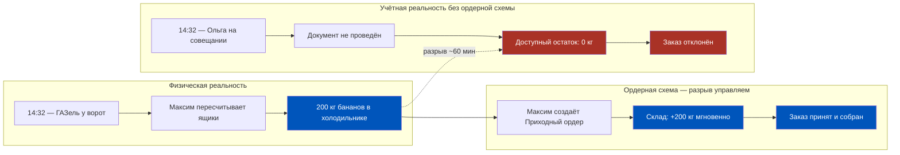
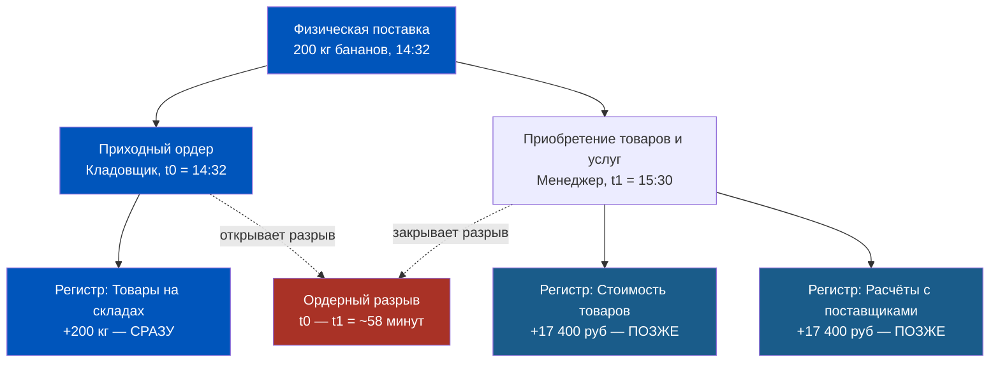
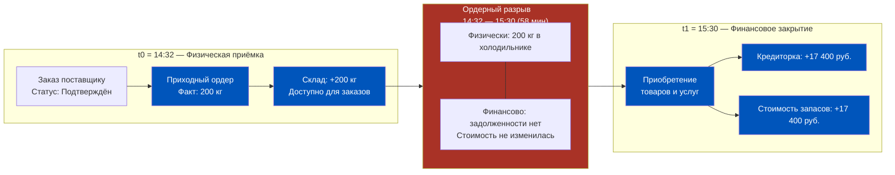
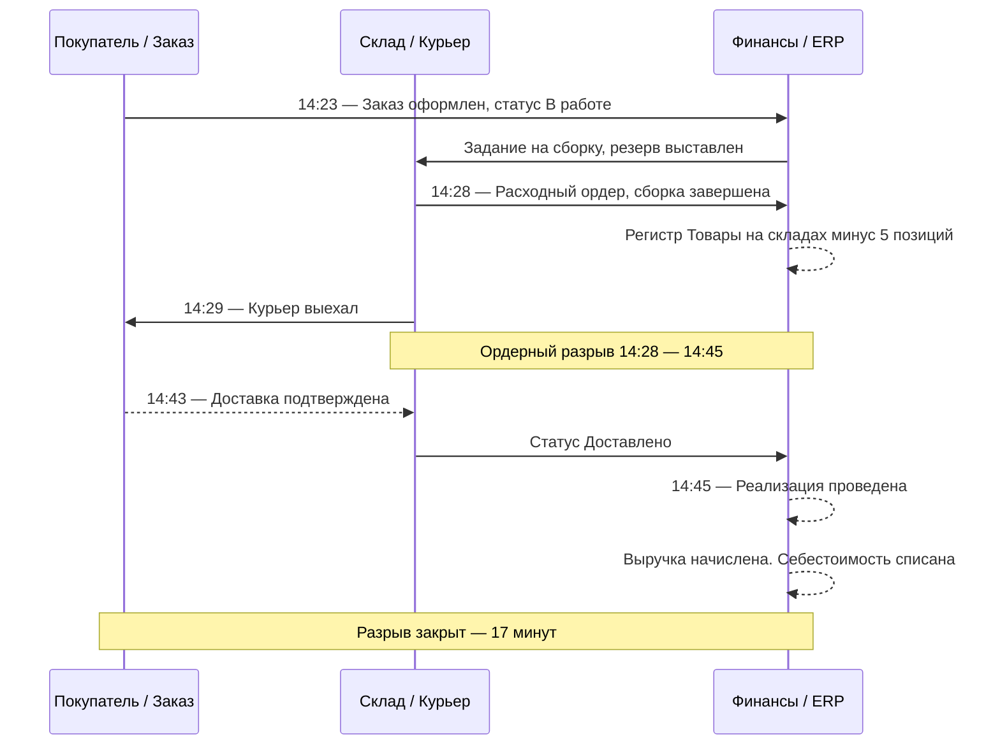
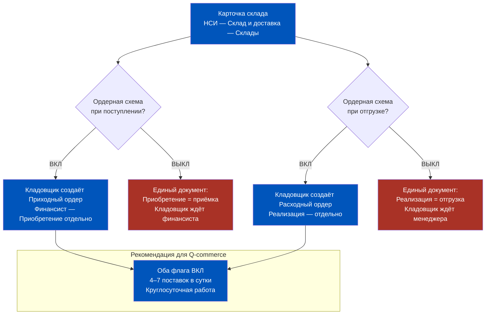
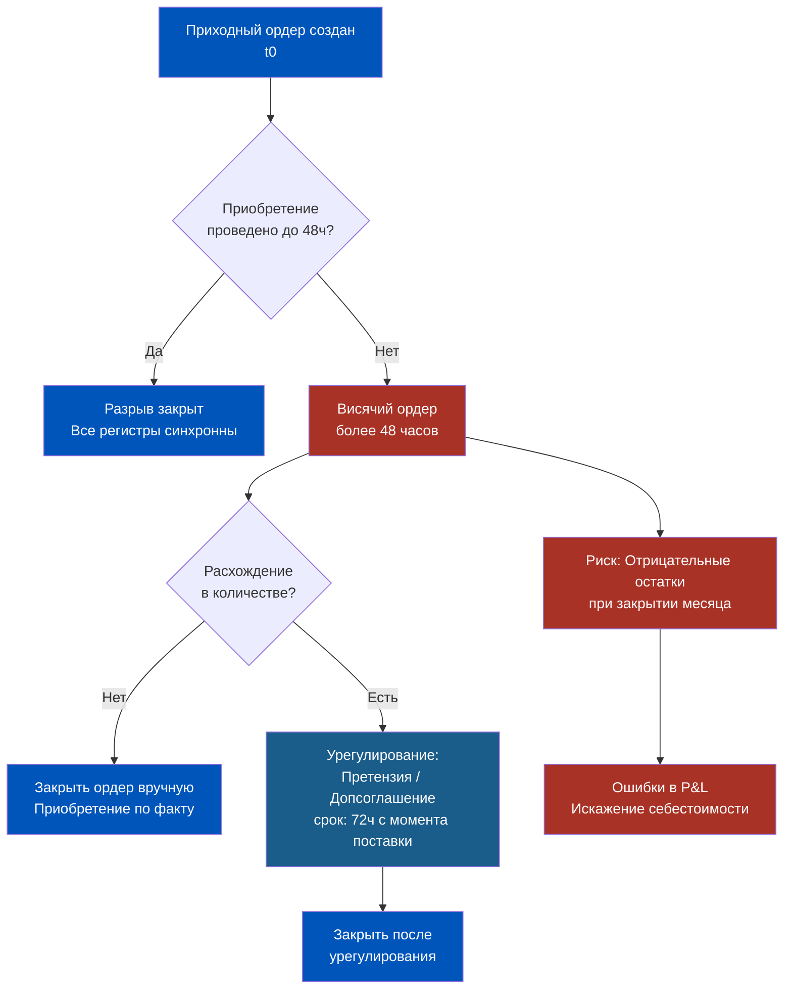
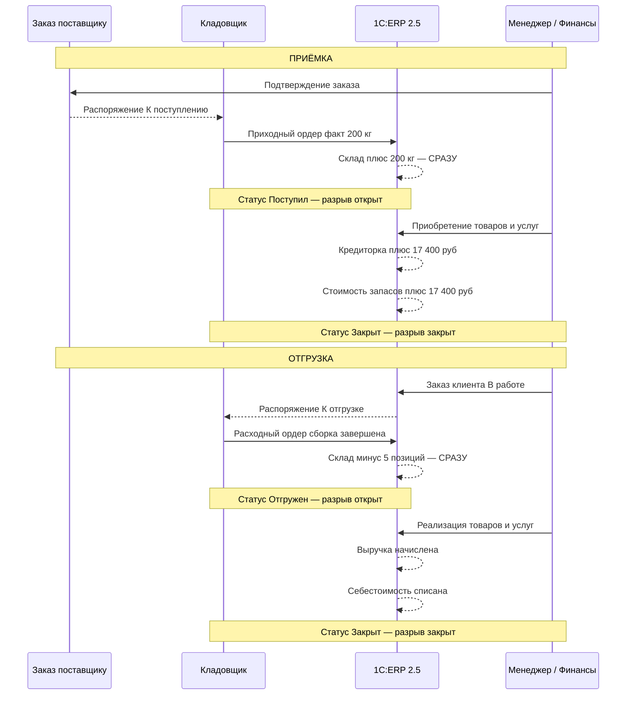

# Ордерная схема склада: Физика товара и Логика документов

> **Цель урока:** Понять архитектурный принцип ордерной схемы в 1С:ERP 2.5 — почему физический приём товара и финансовая операция существуют в системе как два независимых объекта, и как управлять этим разрывом в условиях 10-минутной доставки Q-commerce.
>
> **Компетенции по итогу:**
> - Объяснить коллегам, почему в ERP «товар на складе» и «товар в финансовом учёте» — не одно и то же
> - Настраивать ордерную схему по приёмке и отгрузке отдельно для каждого склада
> - Читать статусы складских ордеров и диагностировать «висячие» остатки
> - Принимать архитектурное решение: когда ордерная схема спасает, а когда создаёт технический долг
>
> **Время чтения:** ~75 минут

---

## Оглавление

- [[#Часть 1. Парадокс принятого товара]]
- [[#Часть 2. Архитектура ордерной схемы]]
- [[#Часть 3. Ордерная схема при приёмке]]
- [[#Часть 4. Ордерная схема при отгрузке]]
- [[#Часть 5. Настройка и рабочие места]]
- [[#Часть 6. Ловушки Q-commerce]]
- [[#Часть 7. Глоссарий и контрольные вопросы]]

---

## Часть 1. Парадокс принятого товара

14:32. К воротам даркстора подъезжает ГАЗель. Водитель открывает кузов — 200 кг бананов, 8 ящиков, всё по накладной. Кладовщик Максим пересчитывает каждый ящик, взвешивает, ставит подпись. Бананы уезжают в холодильник. Физически — они здесь. Без сомнений.

14:41. Приходит заказ клиента: 2 кг бананов. Оператор открывает ERP. Система выдаёт: «Доступный остаток бананов — 0 кг». Резервирование невозможно.

Финансовый менеджер Ольга сейчас на совещании. «Приобретение товаров и услуг» по этой поставке она проведёт не раньше 15:30. Пока документа нет — с точки зрения ERP бананов не существует. Заказ отклонён.

Кладовщик знает, что 200 кг лежат в холодильнике. ERP убеждена, что склад пуст. Обе стороны правы — и в этом суть парадокса.

До появления ордерной схемы у компании был жёсткий выбор: либо кладовщик ждёт финансиста у ворот (что невозможно при круглосуточных поставках), либо менеджер проводит документ прямо в момент разгрузки (что нереально при 4–7 поставках в сутки). Ордерная схема отменяет этот выбор. Она говорит: **пусть физическая реальность и финансовая реальность расходятся во времени — но контролируемо, с документальным следом**.

Парадокс разрешается не выбором стороны. Он разрешается признанием того, что физическая операция и финансовая операция — это два разных вопроса. Каждый требует своего документа, своего исполнителя, своего времени. Ордерная схема даёт каждому из них законное место в системе.

---

## Часть 2. Архитектура ордерной схемы

Чтобы понять ордерную схему, нужно сначала разобраться, что именно она разделяет. Когда товар поступает на склад, он одновременно существует в нескольких измерениях системы — и каждое измерение ведётся своим документом.

### Два документа — два мира

**Приходный ордер на товары** — складской документ. Создаётся кладовщиком немедленно, в момент физической приёмки. Влияет исключительно на складской учёт: вносит движение в регистр «Товары на складах», делает товар доступным для резервирования под заказы клиентов. Не создаёт кредиторской задолженности, не влияет на стоимость запасов в финансовом учёте.

**Приобретение товаров и услуг** — финансовый документ. Создаётся менеджером по закупкам после получения и проверки документов поставщика. Фиксирует переход права собственности, создаёт кредиторскую задолженность перед поставщиком, формирует финансовую стоимость запасов. Требует цены, ставки НДС, реквизитов договора.

Разрыв между ними может составлять от 15 минут до нескольких дней. Это не баг — это архитектурный принцип.

| Параметр | Приходный ордер | Приобретение товаров |
|---|---|---|
| Кто создаёт | Кладовщик | Менеджер по закупкам |
| Когда | В момент физической приёмки | После получения документов поставщика |
| Что затрагивает | Регистр «Товары на складах» | Стоимость запасов, кредиторка |
| Доступ к финансовым данным | Не нужен | Обязателен |
| Типичное время создания | 03:17, 04:30, 23:45 | 10:00–17:00 рабочего дня |

### Три регистра одного факта

Один физический факт — поставка товара — создаёт движения в трёх разных регистрах. До ордерной схемы все три движения порождал один документ в один момент. Ордерная схема разнесла первое движение (склад) от второго и третьего (финансы):

За разрывом стоит важный гражданско-правовой принцип: момент перехода права собственности может не совпадать с моментом физической передачи товара. В Q-commerce состояние «физически есть, финансово не проведено» — норма. 4–7 поставок в сутки, каждая проходит через это состояние длительностью 2–18 часов. Ордерная схема делает это состояние управляемым: товар не «теряется» между двумя реальностями, он документально отслежен с первой секунды приёмки.

---

## Часть 3. Ордерная схема при приёмке

Разберём полную последовательность событий при ордерной схеме приёмки — от момента, когда машина подъезжает к воротам, до момента, когда товар корректно отражён во всех регистрах.

### Шаг 0. Заказ поставщику — предпосылка

Всё начинается до приезда машины. Менеджер создал «Заказ поставщику»: 200 кг бананов, 87 руб./кг, среда, Склад №3. Заказ переведён в статус **«Подтверждён»**.

Это критический момент. Только при статусе «Подтверждён» заказ попадает в список распоряжений на приёмку — очередь, которую видит кладовщик в своём рабочем месте. Если менеджер не подтвердил заказ — кладовщик принимает товар «вслепую».

### Шаг 1. Приходный ордер — складской факт

14:32. Кладовщик Максим открывает рабочее место «Приёмка товаров на склад». В списке распоряжений — ожидаемая поставка бананов. Он сверяет с накладной водителя, фиксирует фактическое количество: 200 кг. Создаёт Приходный ордер на товары. В системе мгновенно:

- Регистр «Товары на складах»: +200 кг бананов, Склад №3
- Статус заказа поставщику: частично или полностью исполнен
- Приходный ордер связан с заказом через механизм обеспечения

Товар доступен для резервирования. Бананы можно собирать в заказы клиентов прямо сейчас. Финансовый учёт при этом не изменился.

### Шаг 2. Приобретение товаров и услуг — финансовый факт

15:30. Ольга возвращается с совещания, открывает очередь поступлений. Видит поставку бананов с привязанным Приходным ордером №00-000312 на 200 кг. Проверяет: цена 87 руб./кг совпадает с заказом, расхождений нет. Проводит «Приобретение товаров и услуг». В системе:

- Регистр «Стоимость товаров»: +17 400 рублей (200 кг × 87 руб.)
- Регистр «Расчёты с поставщиками»: задолженность +17 400 руб. перед ООО «АгроФрут»
- Документ связан с Приходным ордером №00-000312

Разрыв закрыт. Все три регистра синхронны.

### Расхождения при приёмке

Реальность редко идеальна. Заказали 200 кг — приехало 187 кг. Приходный ордер фиксирует 187. Система создаёт строку расхождения: 13 кг в статусе «к поступлению, не принято». Менеджер видит расхождение до проведения финансового документа и принимает решение: дозаказать, закрыть как частичное исполнение или выставить претензию.

За 30 дней работы среднего даркстора (150 поставок в месяц) расхождения по количеству встречаются в 12–18% поставок: 18–27 случаев, каждый требует ручного урегулирования. Ордерная схема делает каждое расхождение видимым немедленно.

---

## Часть 4. Ордерная схема при отгрузке

Зеркальный механизм работает при отгрузке. Здесь временной разрыв ещё острее: в Q-commerce курьер должен выехать через 3–5 минут после сборки, а финансовый документ создаётся значительно позже.

### Цепочка документов

**Заказ клиента** — намерение. Покупатель нажал «Оформить заказ» в приложении в 14:23. В ERP появился заказ со статусом «В работе». Товары зарезервированы — недоступны для других заказов. Физически они ещё на полке.

**Расходный ордер на товары** — физическое действие. Комплектовщик Дмитрий получает задание в 14:24. Он проходит по складу, снимает товары с полок. В 14:28 нажимает «Сборка завершена» — создаётся Расходный ордер. Товары списаны из зоны хранения. Курьер забирает заказ и выезжает. Всё это — 4–6 минут.

**Реализация товаров и услуг** — финансовое действие. Фиксирует переход права собственности к покупателю, начисляет выручку, списывает себестоимость. В Q-commerce создаётся:
- автоматически при статусе «Заказ доставлен» (оптимально),
- вручную пакетом раз в 2–4 часа,
- вручную по каждому заказу в конце смены.

В промежутке между «Курьер выехал» и «Реализация проведена» товар физически у покупателя, но юридически числится в активах компании. Это разрыв от 15 минут (автоматика) до нескольких часов (ручной режим).

### Почему Q-commerce особенно уязвима

В традиционной рознице кассовый чек закрывает реализацию мгновенно. В Q-commerce 500–800 заказов в сутки через один даркстор. Без автоматической реализации к концу смены накапливается 200–400 расходных ордеров без финансового документа. Товар физически доставлен — выручка не начислена, остатки занижены. Если закрытие смены происходит без урегулирования — управленческий отчёт дня будет неверным.

### Резервирование и физическое списание

Между «заказ оформлен» и «ордер создан» — зона сборки. Если заказ отменили до создания ордера — резерв снимается автоматически, товар возвращается в доступный остаток. Если ордер уже создан (товар снят с полки) — нужна обратная операция: возврат в зону хранения, отмена ордера. В дарксторе с 50–80 одновременными заказами в час это требует чёткого понимания: отмена «на полпути» через сборку — не одна кнопка, а процесс из нескольких шагов с последствиями для регистров.

---

## Часть 5. Настройка и рабочие места

Ордерная схема в 1С:ERP 2.5 не включена глобально. Она настраивается **отдельно для каждого склада** и **отдельно для операций приёмки и отгрузки**.

### Путь к настройке

**НСИ и администрирование → Склад и доставка → Склады → [Карточка склада] → раздел «Ордерная схема»**

Два независимых флага:

| Флаг | Что включает | Влияние |
|---|---|---|
| «Ордерная схема при поступлении» | Приходный ордер при приёмке | Отделяет складской учёт от финансового при поступлении |
| «Ордерная схема при отгрузке» | Расходный ордер при отгрузке | Отделяет складской учёт от финансового при отгрузке |

### Рабочие места кладовщика

При включённой ордерной схеме кладовщик не работает с «Приобретением» или «Реализацией» — у него специализированные инструменты:

**«Приёмка товаров на склад»** — список ожидаемых поставок из подтверждённых заказов. Создание Приходного ордера, фиксация фактического количества и расхождений. Не требует понимания финансовой части.

**«Отгрузка товаров со склада»** — список заказов к сборке. Создание Расходного ордера, подтверждение комплектации. Только физические данные.

Контроль незакрытых ордеров: отчёт **«Остатки к оформлению»** (Склад и доставка → Отчёты по складу). Должен просматриваться минимум 2 раза в сутки. Ордера старше 48 часов без финансового документа — сигнал проблемы.

### Статусная модель приёмки

Отгрузка — зеркальная логика: Заказ клиента «В работе» → «К отгрузке» → «Отгружен» (Расходный ордер проведён) → «Закрыт» (Реализация проведена).

Зона «Поступил / Отгружен, но не закрыт» — это ордерный разрыв в чистом виде. Нормативный стандарт для Q-commerce: закрытие всех ордеров в течение 24 часов с момента приёмки или отгрузки.

---

## Часть 6. Ловушки Q-commerce

Ордерная схема — мощный инструмент, но она работает только при операционной дисциплине. Без неё она сама становится источником ошибок.

### Когда ордерная схема спасает

**Ночная приёмка без финансиста.** 04:30, три поставщика одновременно, кладовщик один. Без ордерной схемы товар стоит у ворот до 09:00. С ордерной схемой — 3 Приходных ордера за 25 минут, товар доступен для утренних заказов.

**Параллельная работа бригад.** 2 зоны приёмки, 3 кладовщика, 5 машин одновременно. Без ордеров — конфликты редактирования одного документа. С ордерами — каждый создаёт свой документ независимо.

**Контроль расхождений.** Накладная на 500 единиц, принято 487. Расхождение 13 единиц зафиксировано немедленно и видно менеджеру до проведения финансового документа.

**Актуальные остатки для резервирования.** При 50–80 одновременных заказах в час остатки в складском регистре обновляются мгновенно после каждого ордера — без задержки на проведение финансовых документов.

### Когда создаёт проблемы

**Ловушка 1. Незакрытые ордера на конец месяца.**

Типичная история запуска: включили ордерную схему, кладовщики создают ордера, менеджеры не успевают создавать финансовые документы. Через 2 недели — 340 незакрытых ордеров. Товар есть физически, но финансово не принят. При закрытии месяца — «дыры» в кредиторке и искажение себестоимости.

**Ловушка 2. Расходный ордер без реализации.**

Курьер выехал с заказом. Расходный ордер создан — товар списан со склада. Но приложение не зафиксировало «Доставлено», менеджер не проверил открытые ордера. На следующее утро: 37 расходных ордеров без реализации. Остатки занижены на 37 заказов, выручка занижена. При объёме 600 заказов в сутки даже 5% «потерянных» реализаций — 30 заказов в день, 900 в месяц с ошибочным финансовым учётом.

**Ловушка 3. Расхождения без урегулирования.**

Кладовщик принял 487 вместо 500. Зафиксировал в ордере. Расхождение видно. Но никто не принял решение: признать недостачу, переоформить заказ, выставить претензию. Ордер висит в статусе «Поступил» — финансист не может закрыть его. Через 3 недели — 14 таких ордеров. Поставщик уже не помнит рейс, акт подписывать отказывается. Урегулирование превращается в расследование по устаревшим данным. Стандарт: расхождения урегулировать в течение 72 часов.

**Ловушка 4. Двойной учёт при дублировании.**

Кладовщик создал Приходный ордер. Менеджер, не зная об этом, создал «Приобретение» без привязки к ордеру. Результат: склад показывает товар дважды. Остатки задвоены. В первые 2–4 недели после внедрения ордерной схемы частота таких ошибок — 8–15% от числа поставок.

### Таблица компромиссов

| Ситуация | Плюс ордерной схемы | Риск | Вердикт |
|---|---|---|---|
| Круглосуточная приёмка | Кладовщик независим | Ордера без закрытия | Включить + контроль 2×/день |
| Высокий поток отгрузок | Актуальные остатки | Ордера без реализации | Автоматизировать реализацию |
| Поставки с расхождениями | Расхождение видно сразу | Ордер зависает до урегулирования | Включить + регламент 72ч |
| Небольшой даркстор, 1 смена | — | Лишний документооборот | Не включать |
| Параллельная работа бригад | Нет конфликтов редактирования | Нужно обучение персонала | Включить обязательно |

---

## Часть 7. Глоссарий и контрольные вопросы

### Словарь ордерной схемы

**Ордерная схема** — архитектурный принцип в 1С:ERP 2.5, при котором физическая складская операция и финансовая операция выполняются разными документами в разное время. Настраивается отдельно для каждого склада и отдельно для приёмки и отгрузки.

**Приходный ордер на товары** — документ складского учёта, создаваемый кладовщиком в рабочем месте «Приёмка товаров на склад». Фиксирует фактическое количество принятого товара. Создаёт движение в регистре «Товары на складах». Не влияет на финансовый учёт.

**Расходный ордер на товары** — документ складского учёта, создаваемый при отгрузке. Фиксирует физическое перемещение товара из зоны хранения. Создаёт движение в регистре «Товары на складах». Не создаёт выручку и не списывает стоимость запасов.

**Финансовый документ** — «Приобретение товаров и услуг» (при поступлении) или «Реализация товаров и услуг» (при отгрузке). Создаёт движения в финансовых регистрах: кредиторская задолженность, стоимость запасов, выручка, себестоимость.

**Складские остатки** — данные регистра «Товары на складах»: физическое количество по складам и ячейкам. Обновляется ордерами.

**Доступный остаток** — складские остатки за вычетом зарезервированных под заказы клиентов. Именно этот показатель влияет на возможность принять новый заказ.

**Право собственности** — юридический момент перехода товара от поставщика к покупателю. Фиксируется финансовым документом, не ордером.

**Товар в пути** — товар, по которому создан Расходный ордер, но не создана Реализация. Физически у покупателя, юридически в активах компании. Нормальное время: 15–60 минут. Более 2 часов — сигнал проблемы.

**Незакрытый ордер** — складской ордер без соответствующего финансового документа. Нормативный срок закрытия: 24 часа. Более 48 часов — проблема. Более 5 суток — риск ошибок при закрытии месяца.

**Рабочее место кладовщика** — специализированный интерфейс («Приёмка товаров на склад», «Отгрузка товаров со склада») без доступа к финансовым данным. Показывает только физические задачи: ожидаемые поставки, заказы на сборку, фактические количества.

**Остатки к оформлению** — отчёт в разделе «Склад и доставка», показывающий ордера без финансового документа. Основной инструмент контроля ордерного разрыва.

**Ордерный разрыв** — временной интервал между созданием складского ордера и финансового документа. Нормальный: 2–18 часов. Проблемный: более 48 часов. Критический: более 5 суток.

**Распоряжение на приёмку / отгрузку** — команда складу выполнить операцию. При приёмке — подтверждённый Заказ поставщику. При отгрузке — Заказ клиента в статусе «К отгрузке». Без распоряжения кладовщик не видит задачу.

### Полная схема документооборота

### Контрольные вопросы

1. Кладовщик принял товар и создал Приходный ордер. Менеджер ещё не провёл «Приобретение товаров и услуг». Можно ли зарезервировать этот товар под заказ клиента — и почему?

2. На складе включена ордерная схема только при поступлении, при отгрузке — выключена. Как это влияет на работу кладовщика при сборке заказов?

3. К концу рабочей недели в отчёте «Остатки к оформлению» — 47 незакрытых приходных ордеров, самый старый датирован 6 днями назад. Какие конкретные риски это создаёт при закрытии месяца?

4. Кладовщик принял 487 единиц вместо заказанных 500. Менеджер без внимания провёл «Приобретение» на 500 единиц по накладной поставщика, без привязки к ордеру. Что произойдёт в регистрах и где возникнет ошибка?

5. Почему в Q-commerce рекомендуется автоматизировать создание «Реализации товаров и услуг» при статусе «Заказ доставлен», а не делать это вручную пакетом в конце смены?

---

### Связанные темы

- [[Неделя 4 - День 2 - Ячеечный склад]] — адресное хранение и ячеечная структура склада
- [[Неделя 1 - День 4 - Документооборот и регистры]] — как регистры формируют данные в ERP

---

← [[Неделя 3 - День 7 - История дефицита|← День 7. История дефицита]] | [[1c_erp_qcom/README|Оглавление]] | [[Неделя 4 - День 2 - Ячеечный склад|День 2. Ячеечный склад →]]
