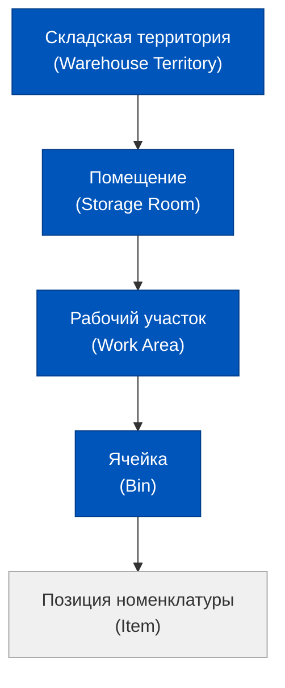
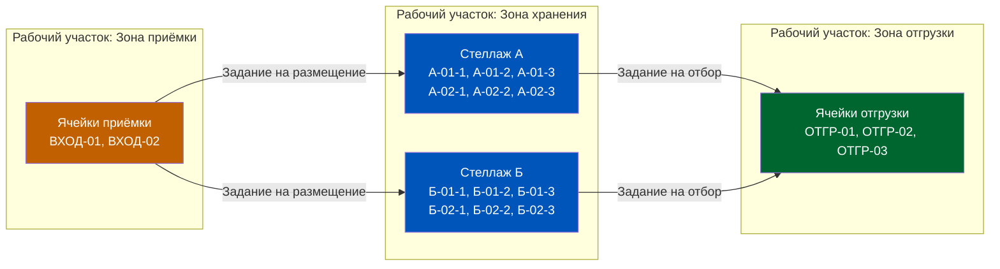
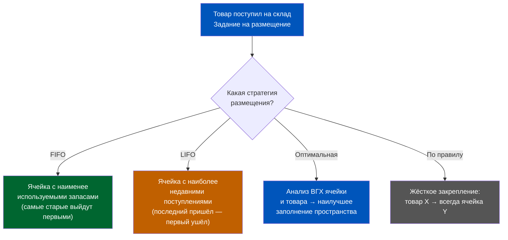
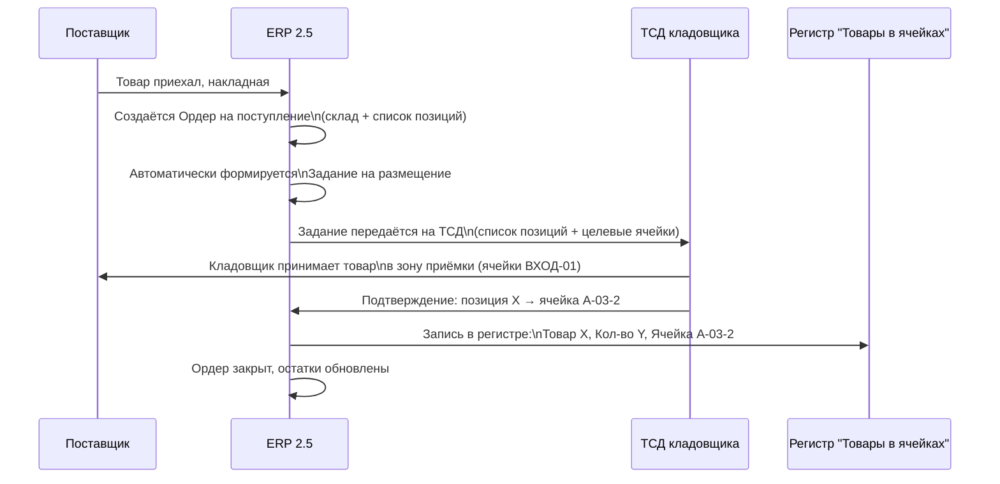
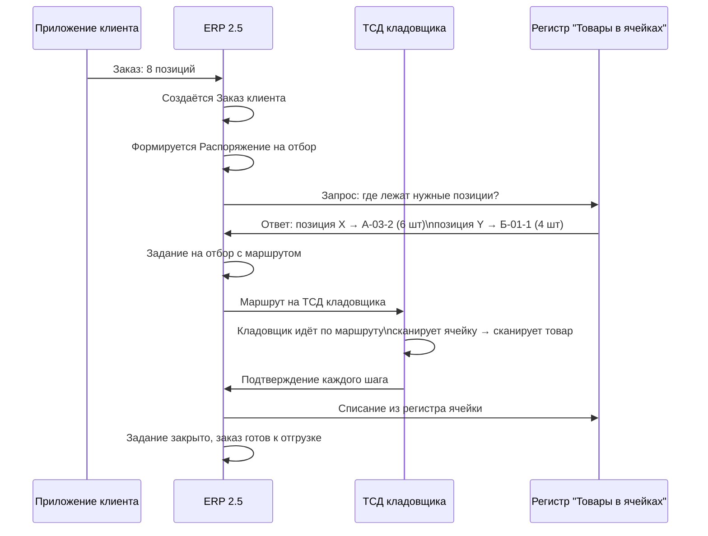
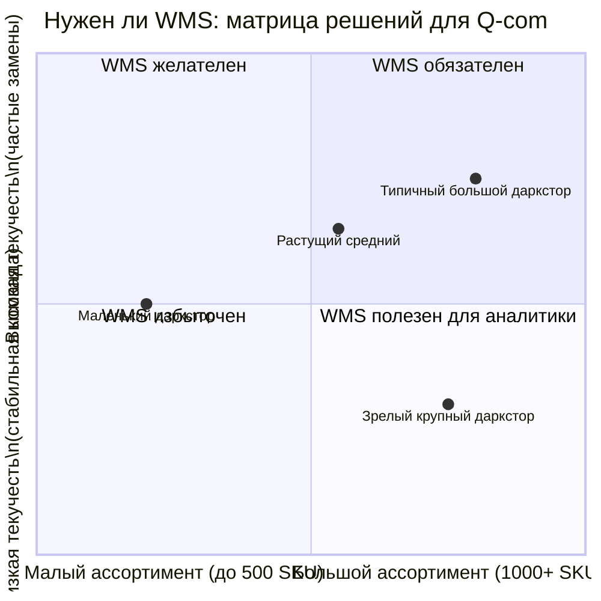

# Ячеечный склад (WMS): Настройка адресного хранения в ERP 2.5

> **Цель урока:** Понять архитектуру адресного хранения в 1C:ERP 2.5, научиться настраивать топологию ячеечного склада и управлять потоком приёмки и отбора через задания WMS — без написания кода, только через логику данных и настройку функциональных опций.
>
> **Компетенции после урока:**
> - Знаешь разницу между «плоским» и адресным складом в терминах ERP 2.5
> - Умеешь спроектировать топологию: Складская территория → Помещение → Рабочий участок → Ячейка
> - Понимаешь, как задание на размещение и задание на отбор формируются и маршрутизируются через систему
> - Можешь оценить, нужен ли полный WMS для даркстора или это избыточная архитектура
>
> **Время чтения:** ~75 минут

---

## Оглавление

- [[#Часть 1. Кладовщик с навигатором|Часть 1. Кладовщик с навигатором]]
- [[#Часть 2. Архитектура адресного склада|Часть 2. Архитектура адресного склада]]
- [[#Часть 3. Настройка в ERP 2.5|Часть 3. Настройка в ERP 2.5]]
- [[#Часть 4. Приёмка на адресный склад|Часть 4. Приёмка на адресный склад]]
- [[#Часть 5. Отбор заказа|Часть 5. Отбор заказа]]
- [[#Часть 6. Q-commerce: нужен ли WMS в даркстор|Часть 6. Q-commerce: нужен ли WMS в даркстор]]
- [[#Часть 7. Глоссарий|Часть 7. Глоссарий]]

---

## Часть 1. Кладовщик с навигатором

Представь задачу: даркстор, 280 квадратных метров, 1 400 позиций номенклатуры. Поступил заказ — 8 позиций, время сборки по стандарту качества не более 7 минут. Кладовщик должен взять корзину, пройти по складу и собрать заказ. Что происходит, если склад «плоский», без адресного хранения?

Он идёт по памяти. Или идёт по распечатанному листу, где написано «молоко — в холодильнике». Звучит разумно — пока позиций 200 и работают двое опытных людей. Но когда SKU становится 1 400, а команда расширяется и ротируется, когда приходит новый сотрудник и его нужно обучить за 3 часа — система рушится. Среднее время поиска одной нестандартной позиции на «плоском» складе у 500–2 000 SKU — от 45 секунд до 4 минут. Умножь на 8 позиций в заказе.

Но в одном из даркторов сети «Самокат» в 2022 году кладовщик укладывался в 6–8 минут на заказ из 12 позиций при 900 SKU в ассортименте. Секрет был не в сверхлюдях и не в кастомной разработке. Секрет — в адресном хранении, настроенном в 1C:ERP 2.5. Терминал сбора данных (ТСД) показывал маршрут: «Стеллаж А, Ярус 2, Ячейка 04». Это не магия — это GPS-навигатор для склада, реализованный через стандартный функционал ERP.

> [!IMPORTANT] Ключевой парадокс адресного склада
> Чем точнее ты описываешь физическое пространство склада в ERP, тем быстрее работает человек с ТСД. Данные в системе становятся точнее, чем знания опытного сотрудника — и при этом не зависят от его присутствия на смене.

Адресное хранение — это не про автоматизацию ради автоматизации. Это про перенос экспертизы из головы кладовщика в регистры ERP. И именно здесь начинается настоящая игра с 1C:ERP 2.5.

Прежде чем двигаться дальше, зафиксируем разрыв между двумя мирами. «Плоский» склад — это модель, в которой ERP знает: «на складе X есть 48 единиц молока». Адресный склад — это модель, в которой ERP знает: «на складе X, в помещении "Холодильная зона", на рабочем участке "Хранение", в ячейке Х-03-2, находятся 12 единиц молока с датой поступления 07.03.2026, и ещё 36 единиц — в ячейке Х-04-1 с датой поступления 06.03.2026». Разница не количественная — разница в том, какие решения можно принимать на основе этих данных. Второй вариант позволяет управлять сроками годности в режиме реального времени, оптимизировать маршрут кладовщика и контролировать каждую единицу товара без ручных пересчётов.

Это урок про архитектуру. Про то, как настроить ERP так, чтобы она стала точным цифровым двойником физического склада. Разберём всё по порядку — от иерархии объектов до конкретных шагов в меню 1C:ERP 2.5.

---

## Часть 2. Архитектура адресного склада

> **Терминология:** В этом уроке используется термин «ячеечный склад» как разговорное упрощение. Официальный термин в документации 1С:ERP 2.5 и глоссарии ИТС — **«адресный склад»** / **«адресное хранение»**. В интерфейсе программы и настройках также используется «адресное хранение». «Ячеечный» и «адресный» — синонимы в контексте курса.

Прежде чем открывать меню настроек ERP, нужно понять, как система описывает физическое пространство. В 1C:ERP 2.5 адресный склад строится на четырёхуровневой иерархии. Это не прихоть разработчиков — это слепок реального устройства любого склада, от крошечного даркстора до распределительного центра на 40 000 кв. м.

**Складская территория** — это верхний уровень. Юридически и логистически это весь ваш даркстор: один адрес, одна лицензия, одна зона ответственности. В ERP это объект справочника «Склады», для которого включена функциональная опция адресного хранения.

**Помещение** — следующий уровень. В реальном дарксторе это может быть одна зона или несколько: торговый зал (если он совмещён), холодильная камера, морозильный отсек, сухая зона. Каждое помещение в ERP имеет свои температурные характеристики и настройки. Разделение помещений критично для номенклатуры с разными условиями хранения — замороженные продукты нельзя размещать в одном помещении с бытовой химией.

**Рабочий участок** — это зона внутри помещения, объединяющая ячейки по признаку одинаковой технологии работы («зона ручного отбора», «участок работы погрузчиков» и т. д.). Рабочие участки не имеют фиксированного «типа» в смысле ERP — это инструмент разбиения склада на логические зоны для маршрутизации заданий и разграничения исполнителей. Тип хранения (Приёмка / Хранение / Отгрузка / Архив) задаётся не для участка, а для каждой конкретной **ячейки**, которая входит в данный участок.

**Ячейка** — атомарный элемент адресного склада. У каждой ячейки есть уникальный адрес (номер), физические характеристики (длина, ширина, высота, максимальный вес) и тип. Именно через ячейку ERP знает, что конкретный товар находится в конкретном физическом месте.

### Типы ячеек: четыре роли в одной системе

В 1C:ERP 2.5 каждая ячейка получает один из типов, определяющих её роль в потоке товаров:

| Тип ячейки | Роль в процессе | Где используется |
|---|---|---|
| Приёмка | Промежуточное хранение до размещения по ячейкам | Зона разгрузки |
| Хранение | Основная зона хранения номенклатуры; из этих ячеек также выполняется отбор | Стеллажи, полки |
| Отгрузка | Промежуточное накопление товаров, подготовленных к отправке | Зона сборки/упаковки |
| Архив | Ячейки, выведенные из оборота (реорганизация склада); размещение невозможно, отбор — допустим | Выведенные зоны |

Официальных типов ячеек в 1С:ERP 2.5 четыре: Приёмка, Хранение, Отгрузка, Архив. Ячейки типа «Хранение» являются основной рабочей зоной — из них же выполняется и отбор товаров. В небольшом дарксторе 100–200 кв. м одна ячейка типа «Хранение» выполняет функцию и хранения, и отбора. В более крупных объектах (300+ кв. м) зоны хранения разбиваются на рабочие участки с разными стратегиями отбора, что повышает скорость на 20–35%.

> [!NOTE] Номер ячейки = полный адрес места хранения
> В ERP 2.5 номер ячейки — это строка, которую система генерирует или которую ты задаёшь вручную. Стандартная практика для даркстора: `[Буква стеллажа]-[Номер секции]-[Ярус]`. Например, `А-03-2` — стеллаж А, секция 3, ярус 2. ТСД отображает этот номер кладовщику как пункт назначения.

Эта схема — не просто визуализация. Она описывает движение данных в регистрах ERP. Каждое перемещение товара из ячейки в ячейку создаёт запись в регистре накопления «Товары в ячейках». Именно этот регистр отвечает на вопрос «где сейчас лежит позиция X?» за миллисекунды. Когда кладовщик подтверждает перемещение на ТСД — регистр обновляется немедленно, остатки пересчитываются в режиме реального времени.

### Откуда взялась эта архитектура: история адресного хранения

Концепция адресного хранения появилась задолго до ERP-систем. В 1960-х годах крупные американские дистрибуторы — в первую очередь производители автозапчастей и фармацевтические склады — столкнулись с проблемой: при ассортименте в 10 000–50 000 позиций «ручная» система учёта начинала давать сбои. Инвентаризационные расхождения достигали 8–12%, что при миллионных оборотах превращалось в катастрофические потери.

Решение пришло от логистических инженеров, работавших с авиационной отраслью: точно так же, как каждое воздушное судно имеет регистрационный номер и точное положение на стоянке, каждая единица склада должна иметь уникальный «координатный адрес». Эта идея была стандартизирована в методологии «Random Location Storage» — хранения по случайному адресу, где товар кладётся не на «свою» фиксированную полку, а в первую подходящую свободную ячейку, но с точной записью этого адреса в системе.

В 1C:ERP 2.5 эта методология реализована в полном объёме. Архитектура четырёхуровневой иерархии (Территория → Помещение → Участок → Ячейка) — это прямой наследник стандарта складской адресации, который сформировался в 1970–1980-х годах в американской и западноевропейской логистике, а затем был оцифрован в первых WMS-системах начиная с 1990-х.

Для Q-com принципиально важно: адресное хранение в ERP 2.5 — это не «промышленный» инструмент, перенесённый в небольшой склад. Это та же архитектура, адаптированная под любой масштаб. 80 ячеек в дарксторе или 80 000 ячеек в распределительном центре — логика регистров одна и та же.

---

## Часть 3. Настройка в ERP 2.5

Переходим от теории к практике. Адресное хранение в 1C:ERP 2.5 — это не отдельный модуль, который нужно купить. Это функциональная опция, которая скрыта «под капотом» системы и требует последовательной активации.

### Шаг 1. Функциональная опция «Адресное хранение»

Путь включения функциональной опции на уровне базы: **НСИ и администрирование → Настройка НСИ и разделов → Склад и доставка → Склад**.

Здесь включается функциональная опция «Ордерные склады» и «Несколько складов». Само адресное хранение (использование ячеек) задаётся не глобально, а в карточке конкретного склада. Включение адресного хранения меняет поведение системы для данного склада — добавляются новые поля в документы, появляются новые рабочие места и новые регистры для хранения данных о ячейках.

> [!CAUTION] Адресное хранение включается отдельно для каждого склада (или помещения)
> Это означает: ты можешь иметь смешанную конфигурацию. Один склад — адресный, другой — «плоский». Для Q-com это важно: если у тебя несколько дарксторов в одной базе ERP, можно мигрировать на адресное хранение поэтапно, не затрагивая остальные объекты.

Для конкретного склада адресное хранение активируется в карточке склада: **НСИ и администрирование → НСИ → Склады → [Выбрать склад] → поле «Ячейка»**. В этом поле выбирается один из трёх вариантов: «Не использовать», «Использовать для справочного размещения номенклатуры» или «Использовать для хранения остатков номенклатуры» (последний вариант и есть полноценное адресное хранение с учётом остатков по ячейкам).

### Шаг 2. Настройка топологии

Топология — это карта физического пространства склада, описанная в иерархии ERP. Настраивается в справочнике **«Помещения»**, **«Рабочие участки»** и **«Ячейки»**.

Для типичного даркстора 150 кв. м топология может выглядеть так:

| Уровень | Объект | Количество |
|---|---|---|
| Помещение | Сухая зона | 1 |
| Помещение | Холодильная зона | 1 |
| Помещение | Морозильная зона | 1 |
| Рабочий участок | Зона приёмки (сухая) | 1 |
| Рабочий участок | Зона хранения (сухая) | 1 |
| Рабочий участок | Зона отгрузки | 1 |
| Рабочий участок | Зона хранения (холод) | 1 |
| Ячейка | Всего по складу | 80–150 |

### Шаг 3. Весогабаритные характеристики ячеек

Для каждой ячейки в ERP 2.5 задаются ВГХ (весогабаритные характеристики):

- **Длина, ширина, высота** (в миллиметрах или сантиметрах)
- **Максимальный вес** (в килограммах)
- **Максимальный объём** (рассчитывается автоматически из габаритов)

Зачем это нужно? ERP использует ВГХ ячейки при выборе места размещения. Если товар весит 18 кг, а ячейка рассчитана на максимум 15 кг — система не предложит её как место размещения. Это не просто техническое ограничение — это защита от физических повреждений и нарушения условий хранения.

Аналогично настраиваются ВГХ для номенклатурных позиций — в справочнике «Номенклатура», вкладка «Хранение». Если ВГХ товара не заполнены, система не сможет рассчитать оптимальное размещение — и это частая ошибка при первоначальной настройке WMS.

### Шаг 4. Стратегии размещения

Это один из самых важных параметров — и один из наименее интуитивных. Стратегия размещения определяет, по какому алгоритму ERP выбирает ячейку для нового товара.

**FIFO (First In, First Out)** — первым пришёл, первым ушёл. Критически важно для скоропортящихся товаров: молочные продукты, свежие овощи, хлеб. В Q-com это доминирующая стратегия для 60–70% ассортимента. ERP при формировании задания на отбор выберет ячейку с более ранней датой поступления.

**LIFO (Last In, First Out)** — последним пришёл, первым ушёл. Применяется редко в пищевом сегменте. Встречается для товаров с длительным сроком хранения, где важна оборачиваемость конкретной партии.

**Оптимальная** — ERP анализирует доступные ячейки и выбирает ту, которая лучше всего подходит по ВГХ, минимизируя «дыры» в заполнении стеллажей. Полезно для оптимизации использования складского пространства.

**По правилу закрепления** — жёсткое правило: конкретный товар всегда хранится в конкретной ячейке. В дарксторе это часто используется для ABC-сегментации: категория A (топ-20% SKU, дающих 80% оборота) закрепляется за ячейками отбора в ближайшей к зоне сборки позиции.

> [!TIP] Стратегии размещения задаются не только для склада целиком, но и для отдельных рабочих участков
> Это означает: зона хранения скоропортящихся — FIFO; зона хранения бытовой химии — оптимальная; зона быстрого отбора (топ-SKU) — по правилу закрепления. Гибридная стратегия для одного склада — это штатный функционал ERP 2.5.

### Практический пример: настройка топологии даркстора 200 кв. м

Возьмём конкретный сценарий. Даркстор площадью 200 кв. м, ассортимент 850 SKU, 3 температурных зоны. Вот как выглядит конфигурация в ERP 2.5:

**Помещения (3 штуки):**
- «Сухая зона» — 120 кв. м. Бакалея, консервы, бытовая химия, непродовольственные товары.
- «Холодильная зона» — 50 кв. м. Молочные продукты, охлаждённое мясо, готовая еда. Температурный режим: +2…+6°C.
- «Морозильная зона» — 30 кв. м. Мороженое, замороженные полуфабрикаты. Температурный режим: -18°C.

**Рабочие участки (5 штук):**
- «Приёмка» — 2 ячейки типа **Приёмка**: ВХОД-01, ВХОД-02.
- «Хранение сухое» — 72 ячейки типа **Хранение** (6 стеллажей × 4 секции × 3 яруса = 72). Включает фронтальные позиции для топ-200 SKU — они остаются того же типа «Хранение», но с более высоким уровнем доступности и приоритетом отбора.
- «Хранение холод» — 20 ячеек типа **Хранение** в холодильных секциях.
- «Хранение мороз» — 12 ячеек типа **Хранение** в морозильных секциях.
- «Отгрузка» — 6 ячеек типа **Отгрузка**: ОТГР-01 по ОТГР-06 (под одновременные заказы в сборке).

Итого: 136 ячеек на 850 SKU. Это соотношение 1 ячейка на ~6 SKU — норма для дарксторов с преобладанием «плоского» стеллажного хранения. Дополнительно: для 50 SKU с высоким оборотом (ячейки типа «Отбор») — удвоенное количество ячеек для обеспечения непрерывности.

Суммарное время настройки топологии в ERP специалистом, знакомым с системой, — около 6–8 часов. Ещё 4 часа займёт ввод ВГХ для 850 позиций номенклатуры (при наличии данных от поставщиков). Полная первичная настройка WMS — 2–3 рабочих дня.

---

## Часть 4. Приёмка на адресный склад

Ты включил адресное хранение, настроил топологию, задал стратегии. Теперь приехала машина с товаром. Что происходит в ERP?

Сравним с тем, что было в предыдущем уроке — ордерная схема без адресного хранения. Там путь был: Заказ поставщику → Ордер на поступление → Подтверждение → Товар «на складе» (без уточнения где).

С адресным хранением картина усложняется — и именно это усложнение и даёт нам ценность.

### Задание на размещение: что это и как формируется

Задание на размещение — это документ в ERP 2.5, который создаётся автоматически на основе ордера на поступление. Он содержит:

1. Список принятых позиций с количеством
2. Целевые ячейки для каждой позиции (рассчитанные по стратегии размещения)
3. Маршрут — последовательность ячеек, оптимизированная для минимизации пробега

Ключевой вопрос: кто выбирает ячейку? ERP выбирает автоматически — на основе стратегии размещения и текущих остатков в ячейках. Кладовщик с ТСД получает уже готовый маршрут: «Возьми паллету из зоны приёмки, иди к стеллажу A, ярус 2, ячейка А-02-3, поставь туда 12 единиц; затем иди к стеллажу Б, ярус 1, ячейка Б-01-1, поставь 8 единиц».

> [!NOTE] Отличие от «плоского» склада
> На «плоском» складе кладовщик принимает товар и решает сам, куда его положить. Или кладёт в «общую зону», которая есть в ERP как единое место хранения. Система знает, что товар «на складе», но не знает — где именно. При адресном хранении: ERP всегда знает точное место каждой единицы.

### Подтверждение на ТСД: что происходит с данными

Когда кладовщик подтверждает размещение на ТСД (сканирует штрих-код ячейки), ERP 2.5 выполняет несколько действий одновременно:

- Записывает в регистр «Товары в ячейках»: конкретная позиция, количество, ячейка, дата и время
- Закрывает строку задания на размещение
- Обновляет свободный объём ячейки (для ВГХ-расчётов)
- Если задание выполнено полностью — закрывает задание и связанный ордер

Это атомарная транзакция. Данные либо записываются полностью, либо не записываются вообще. Это критично для целостности остатков — ровно то, о чём мы говорили в первой неделе курса.

### Расхождение при приёмке: что делает ERP

Реальная жизнь отличается от накладной. Приехало 96 единиц вместо заявленных 100. Или 3 единицы повреждены. В этом случае ERP 2.5 позволяет скорректировать количество в ордере на поступление — и корректировка сразу же отразится в задании на размещение. Оно будет пересчитано под фактическое количество.

---

## Часть 5. Отбор заказа

Если приёмка — это ввод данных в адресный склад, то отбор — это извлечение ценности из системы. Именно здесь проявляется весь экономический эффект WMS: скорость сборки, точность, минимизация ошибок.

### Как формируется задание на отбор

Цепочка начинается с заказа клиента. В Q-com это заказ, пришедший из мобильного приложения через API в ERP. Далее:

1. **Заказ клиента** создаётся в ERP (раздел «Продажи»)
2. **Распоряжение на отбор** формируется автоматически или оператором
3. **Задание на отбор** рассчитывается системой: из каких ячеек, в каком порядке, сколько взять

Задание на отбор — это маршрутный лист для кладовщика. ERP строит его с учётом нескольких факторов:
- Фактические остатки в ячейках (из регистра «Товары в ячейках»)
- Стратегия отбора (FIFO по дате поступления для скоропортящихся)
- Топология склада (порядок обхода ячеек для минимизации пробега)
- Тип ячеек (сначала из ячеек отбора, затем из хранения, если нужно «пополнение»)

### Маршрутизация: волновая сборка vs одиночный отбор

Это одно из ключевых архитектурных решений для Q-com.

**Одиночный отбор (Single Order Picking)** — один кладовщик собирает один заказ от начала до конца. Задание на отбор формируется под один заказ клиента, маршрут оптимизируется для этого заказа. Плюс: простота управления, нет риска перепутать товары между заказами. Минус: кладовщик ходит одними и теми же маршрутами для каждого заказа, много перекрёстных движений.

**Волновая сборка (Wave Picking)** — ERP объединяет несколько заказов в одну «волну» и формирует общее задание на отбор. Кладовщик проходит маршрут один раз, набирая товары для 3–5 заказов. Это уменьшает общее расстояние обхода на 25–40% при высокой плотности заказов.

> [!WARNING] Волновая сборка требует точной разметки зоны отгрузки
> Если ячейки отгрузки не настроены корректно (каждый заказ — в свою ячейку отгрузки), волновая сборка превращается в хаос: товары смешиваются. ERP 2.5 поддерживает волновую сборку в типовом функционале, но требует правильной настройки ячеек отгрузки как «мест временного хранения под заказ».

Для даркстора с 15-минутным стандартом доставки, обрабатывающего 40–80 заказов в час в пиковые часы, волновая сборка — практически обязательна. Но она работает только при условии, что все остатки в ячейках актуальны в режиме реального времени. Вот почему адресное хранение и подтверждение на ТСД — это единая система, не два отдельных инструмента.

### Ситуация: ячейка пуста, а в ERP — остатки

Это реальный кошмар WMS и самая частая причина сбоев при сборке. Кладовщик пришёл по маршруту к ячейке А-03-2 за молоком — ячейка пуста. Что произошло?

Три возможных причины:
1. **Предыдущее задание не было подтверждено на ТСД** — физически товар взяли, но в ERP не подтвердили. Регистр «врёт».
2. **Инвентаризация не проводилась** — накопленные расхождения за несколько дней.
3. **Ошибка размещения** — кладовщик при приёмке положил товар не в ту ячейку, но подтвердил правильную.

В ERP 2.5 для такого случая предусмотрен документ **«Пересчёт товаров»** — пересчёт остатков в конкретных ячейках без остановки работы склада. Это важный инструмент, который мы рассмотрим подробно в Day 5 текущей недели.

### Блок решения продуктового архитектора: что делать прямо сейчас

Когда кладовщик обнаруживает пустую ячейку в середине сборки — у него два варианта действий:

**Вариант А: Отмена строки задания.** На ТСД или в рабочем месте «Задания на отбор» оператор может снять строку с конкретной позицией, отправить заказ в статус «Частично собран» и инициировать инвентаризацию ячейки. Клиент получит неполный заказ или отмену позиции. Это честно, но ведёт к потере выручки.

**Вариант Б: Ручной поиск остатков.** Кладовщик ищет товар в соседних ячейках или в зоне хранения, находит его, забирает и подтверждает из «правильной» ячейки вручную — через рабочее место «Отбор по ячейкам». ERP позволяет корректировать фактическую ячейку отбора в режиме реального времени.

Разница между этими сценариями — это разница между операционной культурой «скорость любой ценой» и «целостность данных прежде всего». Для Q-com правильный ответ ситуативен: на пиковой нагрузке в пятницу вечером Вариант Б оправдан, но каждый такой случай должен записываться в журнал расхождений и разбираться на планёрке следующего дня.

> [!IMPORTANT] Метрика здоровья WMS
> Отслеживай один KPI: «Процент заданий на отбор, выполненных без корректировки ячейки». Целевой показатель — не менее 97%. Если он падает ниже 95% — это сигнал, что дисциплина сканирования или качество приёмки нарушены, и нужна выборочная инвентаризация. Этот показатель доступен из стандартных отчётов ERP 2.5 по заданиям.

---

## Часть 6. Q-commerce: нужен ли WMS в даркстор

Мы разобрали архитектуру и механику. Теперь — главный вопрос для продакт-менеджера: стоит ли это игры?

Даркстор — это особый вид склада. Площадь 100–300 кв. м, 500–2 000 SKU, стандарт доставки 10–20 минут, что означает стандарт сборки заказа 5–8 минут. Цикл оборачиваемости товара — 2–4 дня для скоропортящихся. Пиковая нагрузка — 60–120 заказов в час в вечернее время.

Это не склад логистического центра на 15 000 SKU. Это нечто принципиально другое.

### Аргументы за WMS в дарксторе

**Скорость обучения новых сотрудников.** Текучесть персонала в дарксторах сети составляет в среднем 80–120% в год. Если каждый новый кладовщик учит расположение товаров «по памяти» — это 2–3 недели потерь эффективности при каждой замене. С ТСД и адресным хранением: новый сотрудник работает на полной скорости с первой смены, ориентируясь на маршрут.

**Точность остатков.** В «плоском» складе расхождение факта с учётом в 3–5% — норма. В адресном складе с ТСД — менее 0,5% при правильной дисциплине. Для Q-com 3% ошибки остатков означают 3% отменённых заказов из-за «нет в наличии» — при среднем чеке 1 200 рублей и 500 заказах в день это 18 000 рублей ежедневных потерь.

**Аналитика по ячейкам.** Зная, как быстро опустошается каждая ячейка, можно оптимизировать топологию. Ячейки с высокооборотным товаром ставятся ближе к зоне отгрузки — это снижает пробег кладовщика. Этот анализ доступен в ERP через отчёты по регистру «Товары в ячейках».

### Аргументы против: WMS как overhead

**Накладные расходы на настройку.** Первичная настройка топологии (100–150 ячеек) занимает 3–5 дней работы специалиста по 1С. Плюс обучение персонала работе с ТСД — ещё 1–2 дня. Плюс первичная инвентаризация для «заполнения» регистра ячеек реальными остатками — ещё день.

**Дисциплина — обязательное условие.** WMS работает только тогда, когда каждый шаг подтверждается на ТСД. Если один кладовщик «забыл» подтвердить 10 позиций — регистр расходится с реальностью. Поддержание дисциплины требует операционной культуры, которой нет у всех команд.

**Малый ассортимент не требует WMS.** Если даркстор работает с 300–400 SKU, и команда — 3–4 человека, адресное хранение — избыточная сложность. Кладовщики и так знают каждую полку лично.

### Компромиссное решение: «Лёгкий WMS»

В 1C:ERP 2.5 можно настроить промежуточное решение — адресное хранение без полного ТСД-подтверждения для каждого шага:

- Ячейки настроены (топология есть)
- Задания на размещение и отбор формируются
- Но подтверждение — не через ТСД, а через рабочее место кладовщика на планшете или ПК

Это снижает скорость работы на 10–15% по сравнению с ТСД, но требует значительно меньших инвестиций (ТСД промышленного класса — от 25 000 до 80 000 рублей за единицу). Для даркстора с 600–900 SKU и стабильной командой — оптимальный старт перед переходом на полный WMS.

> [!TIP] Правило продуктового архитектора: начни с топологии
> Даже если ты пока не внедряешь полный WMS — опиши физический склад в ERP: создай ячейки, задай стратегии. Это займёт 1 день, но создаст фундамент. Когда бизнес вырастет до 1 000 SKU и нужно будет ускориться — у тебя уже будет готовая архитектура, а не «переделка с нуля».

### Финансовый расчёт: точка окупаемости WMS

Допустим: даркстор обрабатывает 300 заказов в день. Без WMS — средняя ошибка остатков 4%, т.е. 12 отменённых заказов ежедневно. Средний чек — 1 400 рублей. Потери выручки: 12 × 1 400 = 16 800 рублей в день, или 504 000 рублей в месяц.

Стоимость внедрения WMS (настройка + 3 ТСД + обучение): 300 000–400 000 рублей единовременно.

При сокращении ошибок с 4% до 0,5% — возврат инвестиций менее чем за 30 дней. Это грубый расчёт, но он показывает порядок цифр и помогает обосновать бюджет перед руководством.

---

## Часть 7. Глоссарий

| Термин | Определение | Где в ERP 2.5 |
|---|---|---|
| **Адресное хранение** | Система учёта товаров с точностью до ячейки. Каждая единица номенклатуры привязана к конкретному физическому месту на складе | Карточка склада: поле «Ячейка» → значение «Использовать для хранения остатков номенклатуры» |
| **Ячейка (Bin)** | Атомарная единица хранения. Имеет уникальный адрес, тип и весогабаритные характеристики | Справочник «Ячейки склада» |
| **Рабочий участок** | Функциональная зона внутри помещения: приёмка, хранение, отбор, отгрузка. Определяет тип операций, выполняемых в данной зоне | Справочник «Рабочие участки» |
| **Задание на размещение** | Документ ERP, формируемый по ордеру на поступление. Содержит список позиций и целевые ячейки для каждой, рассчитанные по стратегии размещения | Документ «Задание на размещение» |
| **Задание на отбор** | Документ ERP, формируемый по распоряжению на отбор. Содержит маршрут кладовщика: из каких ячеек, в каком порядке, сколько взять | Документ «Задание на отбор» |
| **ТСД (Терминал сбора данных)** | Промышленный мобильный сканер, с которого кладовщик подтверждает выполнение заданий на размещение и отбор. Каждое подтверждение записывает транзакцию в регистр ERP | Мобильное приложение 1С для ТСД |
| **Волновая сборка (Wave Picking)** | Метод отбора, при котором ERP объединяет несколько заказов в одну «волну» и формирует единое задание. Кладовщик проходит маршрут один раз, набирая товары для нескольких заказов | Параметры задания на отбор: режим «Волновой» |
| **Стратегия размещения** | Алгоритм выбора целевой ячейки при приёмке товара: FIFO, LIFO, оптимальная по ВГХ или закрепление по правилу | Настройки рабочего участка: вкладка «Стратегии» |
| **ВГХ (Весогабаритные характеристики)** | Параметры ячейки и товара: длина, ширина, высота, максимальный вес. Используются ERP для расчёта совместимости при размещении | Справочник «Ячейки» + «Номенклатура» → вкладка «Хранение» |
| **Регистр «Товары в ячейках»** | Накопительный регистр ERP, хранящий текущие остатки по ячейкам в режиме реального времени. Первичный источник данных для всех заданий WMS | Регистры накопления ERP 2.5 |

### Часто задаваемые вопросы

**В: Можно ли перейти с «плоского» склада на адресный без остановки работы?**

О: Технически — да, ERP это позволяет. Но на практике требуется «нулевая инвентаризация»: сначала пересчитать все остатки физически, затем включить адресное хранение и разнести остатки по ячейкам. Это 1–2 дня работы. Оптимально — делать переход в период низкой активности (понедельник, ранние утренние часы).

**В: Что произойдёт, если кладовщик положил товар не в ту ячейку?**

О: В ERP останется запись в «неправильной» ячейке. При следующем задании на отбор система отправит кладовщика к «правильной» (по регистру) ячейке, которая окажется пустой. Для исправления: инвентаризация ячейки → корректировка записи в регистре. Именно поэтому дисциплина сканирования — критическое условие WMS.

**В: Можно ли одну ячейку использовать для хранения нескольких разных товаров?**

О: Да, ERP 2.5 поддерживает мультиноменклатурные ячейки. Но это снижает скорость отбора и увеличивает риск ошибок. Лучшая практика для Q-com: один SKU — одна ячейка или зона ячеек. Для «длиннохвостого» ассортимента (редко продающиеся позиции) допускается группировка в «универсальные» ячейки с обязательным сканированием.

**В: Как ERP обрабатывает ситуацию, когда нужного количества нет в одной ячейке?**

О: ERP автоматически «разбивает» задание: возьми 4 единицы из ячейки А-03-2, ещё 2 — из ячейки А-04-1. Кладовщик получает это как два шага одного задания. Если суммарных остатков недостаточно — задание не будет сформировано, и оператор получит сигнал о нехватке.

**В: Как настраивается порядок обхода ячеек в маршруте задания на отбор?**

О: В ERP 2.5 порядок обхода задаётся через атрибут «Порядок обхода» в справочнике ячеек — это числовое поле, по которому система сортирует маршрут. Логика: кладовщик должен двигаться по складу «змейкой» (без возвратов к уже пройденным зонам). Если ячейки заведены без порядка обхода — задание формируется без оптимизации маршрута, что увеличивает время сборки на 15–30%.

**В: Что происходит с адресным хранением при переоценке товаров и закрытии месяца?**

О: Адресное хранение работает на уровне оперативного учёта — это регистр «Товары в ячейках». Переоценка и закрытие месяца работают на уровне бухгалтерских регистров и на адресный учёт не влияют. Себестоимость рассчитывается по средневзвешенной при закрытии месяца — независимо от того, в каких ячейках лежат товары. Ячейки — это «физические координаты», бухгалтерия — это «финансовые регистры». Эти два слоя в ERP 2.5 разделены намеренно.

**В: Как часто нужно проводить инвентаризацию ячеек?**

О: Лучшая практика для Q-com — «скользящая инвентаризация» (Cycle Counting): каждый день пересчитывается 5–10% ячеек по ротации, а не весь склад раз в квартал. В ERP 2.5 это реализуется через документ **«Пересчёт товаров»** (Склад и доставка → Излишки, недостачи, порчи → Пересчёт товаров), в котором можно задать отбор по конкретным ячейкам. При 136 ячейках в дарксторе полный цикл покрытия займёт 14–28 рабочих дней. Критически важные ячейки (топ-SKU, скоропортящиеся) проверяются ежедневно — это 15–20 минут работы в начале смены. Такая дисциплина удерживает точность регистра выше 99%.

### Чеклист: адресный склад готов к работе

Перед тем как запустить адресное хранение в production-режиме, пройди по этому чеклисту:

| # | Проверка | Критично? |
|---|---|---|
| 1 | Функциональная опция «Адресное хранение» включена в настройках ERP | Да |
| 2 | Для склада включён флаг «Вести учёт по ячейкам» | Да |
| 3 | Все помещения созданы с правильными температурными характеристиками | Да |
| 4 | Все рабочие участки созданы; ячейкам в каждом участке присвоены правильные типы (Приёмка / Хранение / Отгрузка / Архив) | Да |
| 5 | Все ячейки созданы с уникальными номерами, типами и ВГХ | Да |
| 6 | Порядок обхода ячеек задан (числовые значения в справочнике) | Да |
| 7 | Стратегии размещения настроены для каждого рабочего участка | Да |
| 8 | ВГХ заполнены для всей активной номенклатуры | Да |
| 9 | Проведена нулевая инвентаризация — остатки разнесены по ячейкам | Да |
| 10 | Кладовщики обучены работе с ТСД и знают алгоритм подтверждения | Да |
| 11 | Регламент инвентаризации ячеек утверждён (рекомендуется: ежедневная выборочная) | Желательно |
| 12 | Отчёт по расхождениям ячеек настроен и проверяется ежедневно | Желательно |

Пункты 1–10 — жёсткие условия. Без любого из них система либо не запустится, либо начнёт генерировать расхождения в первые же часы работы.

### Связь с ордерной схемой

В предыдущем уроке (День 1) мы разобрали ордерную схему склада. Теперь важно зафиксировать связь: адресное хранение — это надстройка над ордерной схемой, а не альтернатива ей. Ордер на поступление — это документ-основание, который инициирует задание на размещение. Ордер на отгрузку — это документ-основание, который инициирует задание на отбор. Без ордерной схемы адресное хранение не работает. Это не два разных функционала — это два слоя одной архитектуры: ордерная схема управляет потоком документов и ответственностью, адресное хранение управляет физическим местом в пространстве склада.

В следующем уроке (День 3) мы углубимся в партионный учёт и серийные номера — ещё один слой той же архитектуры, отвечающий за прослеживаемость конкретных партий и единиц товара. Каждый новый инструмент в ERP 2.5 — это не изолированная функция, а дополнительный срез данных поверх единого регистра остатков. Понимание этой послойной логики — ключевой навык продакта, который управляет сложной логистической системой.

> [!NOTE] Что взять из этого урока в работу уже сейчас
> Если твой даркстор сейчас работает без адресного хранения — сделай один шаг: нарисуй топологию физического склада на бумаге. Обозначь ячейки, дай им номера, оцени количество. Это займёт час, но создаст фундамент для разговора с командой 1С о настройке WMS. Готовая топология на бумаге — это половина работы по внедрению адресного хранения в ERP.

---

← [[Неделя 4 - День 1 - Ордерная схема склада|← День 1]] | [[1c_erp_qcom/README|Оглавление]] | [[Неделя 4 - День 3 - Партионный учет и серийные номера|День 3 →]]
