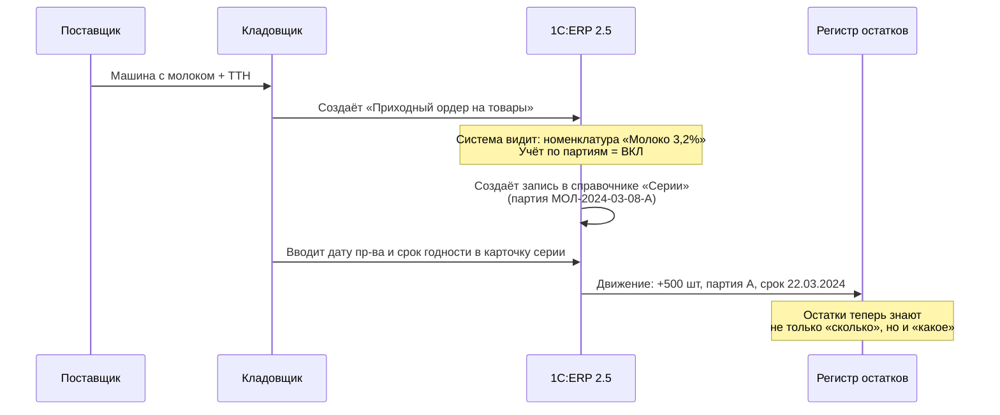
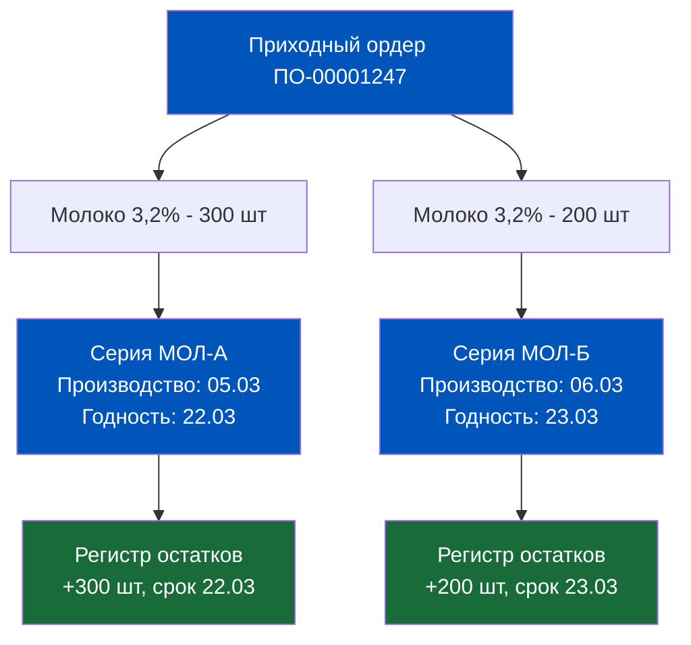
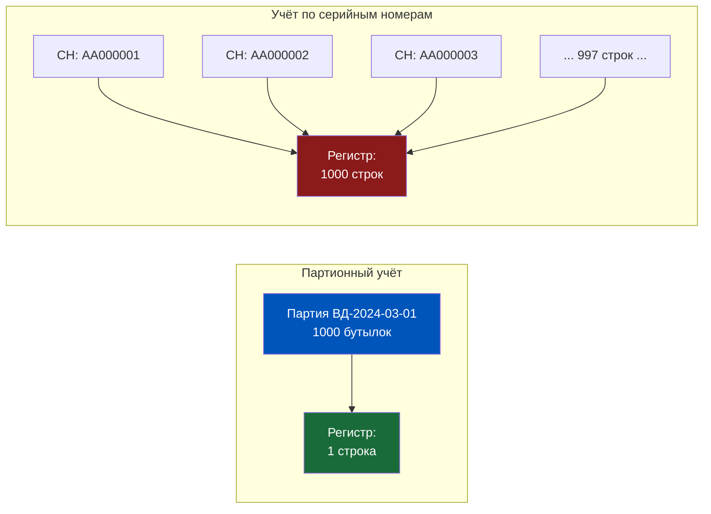
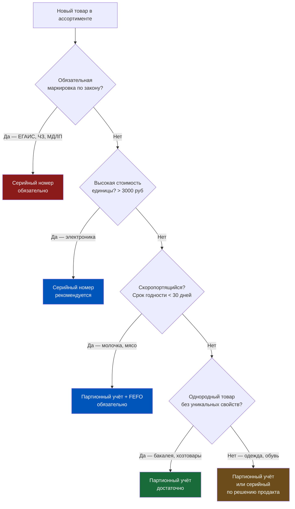
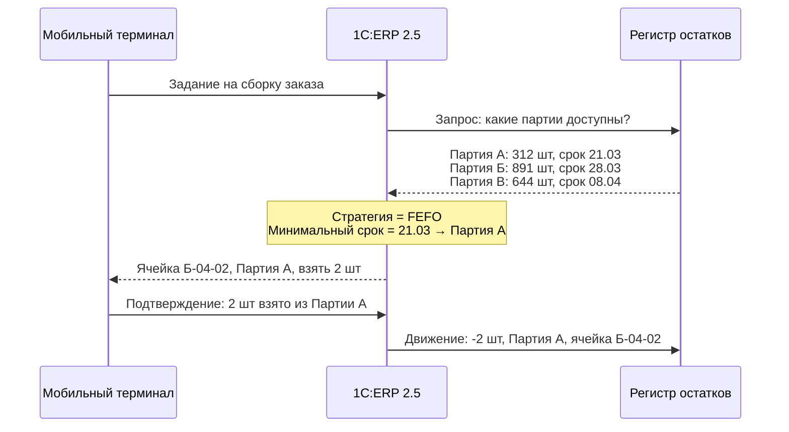
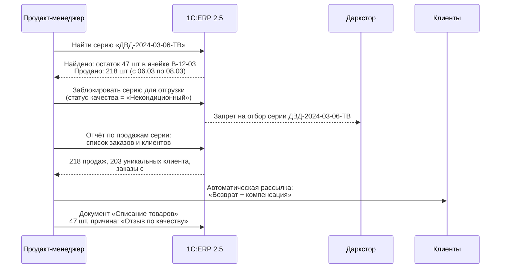

# Партионный учёт vs Серийные номера: Логика выбора в Q-commerce

> **Цель урока:** Научить продакт-менеджера по логистике понимать архитектурное различие между партионным учётом и учётом по серийным номерам в 1C:ERP 2.5, выбирать правильный инструмент для каждого типа товара и конфигурировать систему так, чтобы отзыв партии или проверка прослеживаемости занимали минуты, а не часы.
>
> **Компетенции после урока:**
> - Объяснить разницу между партией и серийным номером как архитектурными сущностями ERP
> - Настроить вид номенклатуры для партионного учёта или учёта по сериям
> - Провести отзыв партии через ERP за 20 минут
> - Понять, когда FEFO бьёт FIFO и почему молоко на полке — это всегда про регистры
> - Объяснить архитектору, зачем ЕГАИС и «Честный ЗНАК» живут поверх партионного учёта
>
> **Время:** ~75 минут

---

## Оглавление

- [[#Часть 1. Жалоба клиента, которая стоила менеджеру ночи]]
- [[#Часть 2. Анатомия партии — что ERP знает о пакете молока]]
- [[#Часть 3. Серийный номер — уникальная личность каждой единицы]]
- [[#Часть 4. Сравнительная таблица: архитектурный выбор продакта]]
- [[#Часть 5. Настройка в ERP 2.5 — где живут переключатели]]
- [[#Часть 6. Практические сценарии: отзыв творога, ЕГАИС и ГТД]]
- [[#Часть 7. Глоссарий]]

---

## Часть 1. Жалоба клиента, которая стоила менеджеру ночи

Был обычный вторник. В 22:47 в службу поддержки пришёл тикет: «Я заказал молоко сегодня, получил его в 23:05. Срок годности — послезавтра. На полке в вашем дарксторе я своими глазами видел пакеты с датой через 14 дней. Почему мне дали протухающее?»

Менеджер по логистике открыл систему и начал смотреть. Молоко на складе есть. Остатки сходятся. Всё выглядит нормально — если не знать, как именно система выбирает, какую единицу товара отгрузить первой.

Вот что произошло под капотом.

На склад за последние 3 недели поступило 3 партии молока:
- **Партия А** — поступила 18 дней назад, срок годности 2 дня (дата производства 21 день назад)
- **Партия Б** — поступила 7 дней назад, срок годности 14 дней
- **Партия В** — поступила вчера, срок годности 16 дней

Система была настроена на **FIFO** — «первым пришёл, первым ушёл». По этой логике она честно отгрузила молоко из Партии А: оно поступило раньше всех, значит, идёт первым. Всё технически правильно. Всё операционно катастрофично.

Клиент не хочет самое старое молоко. Клиент хочет молоко с максимальным остаточным сроком годности. Это называется **FEFO** — First Expired, First Out. Не «первым пришёл», а «первым истекает». И это не просто настройка галочки — это архитектурное решение, которое работает только если система знает срок годности каждой партии. А чтобы она его знала, партионный учёт должен быть включён и правильно настроен.

Именно с этой точки начинается сегодняшний урок.

Менеджер понял: проблема не в комплектовщике, который «взял не ту пачку». Проблема в том, что система никогда не знала о сроках годности партий. Она просто считала штуки. 1 пакет = 1 единица хранения без контекста о времени.

Исправить это за одну ночь не получится. Нужно перестроить учёт. Но сначала — понять, как устроена партия внутри ERP.

---

## Часть 2. Анатомия партии — что ERP знает о пакете молока

Слово «партия» в обиходе звучит просто: «привезли 500 пакетов молока одной поставкой». Но в 1C:ERP 2.5 партия — это полноценная справочная единица со своим паспортом. Это не просто метка «эта коробка пришла сегодня». Это структура данных, которая привязана к движениям товара через регистры.

### Что такое партия в ERP 2.5

В системе партия — это объект типа **«Серии номенклатуры»** (не путать с серийными номерами — об этом в следующей части). Каждая партия имеет набор реквизитов:

| Реквизит | Что хранит | Пример |
|---|---|---|
| Номер партии | Уникальный идентификатор | МОЛ-2024-03-08-А |
| Дата поступления | Когда товар поступил на склад | 08.03.2024 |
| Поставщик | Контрагент-источник | ООО «Молочный завод» |
| Дата производства | Когда произведён товар | 05.03.2024 |
| Срок годности | До какой даты годен | 22.03.2024 |
| Качество | Кондиционный / Некондиционный | Кондиционный |
| Документ-основание | Приходный ордер или ТТН | ПО-00001247 |

Последний пункт — ключевой. Именно здесь партия «рождается» в системе.

### Как ERP создаёт партию при приёмке

Обратите внимание: кладовщик **вручную вводит** дату производства и срок годности. Это не автоматика. ERP доверяет человеку на приёмке. Если человек ошибся или поленился — система будет хранить неверные данные с той же уверенностью, что и правильные. Это первые «грабли» партионного учёта.

### Регистр остатков с партионным разрезом

Без партионного учёта регистр выглядит так:

| Склад | Номенклатура | Количество |
|---|---|---|
| Даркстор-Центр | Молоко 3,2% | 1 847 шт |

С партионным учётом — вот так:

| Склад | Номенклатура | Серия (партия) | Срок годности | Количество |
|---|---|---|---|---|
| Даркстор-Центр | Молоко 3,2% | МОЛ-2024-02-19-А | 21.03.2024 | 312 шт |
| Даркстор-Центр | Молоко 3,2% | МОЛ-2024-03-01-Б | 28.03.2024 | 891 шт |
| Даркстор-Центр | Молоко 3,2% | МОЛ-2024-03-08-В | 08.04.2024 | 644 шт |

Разница колоссальная. Во втором варианте система знает, что 312 пачек нужно продать в первую очередь — они истекают раньше всех. Именно здесь и живёт логика FEFO.

### Один приходный ордер = одна партия?

Почти всегда — да. Но есть нюанс: если поставщик привёз молоко двух дат производства в одной машине (бывает при смешанных паллетах), кладовщик должен создать **два приходных ордера** или использовать режим ввода нескольких серий в одном документе. В ERP 2.5 это поддерживается: в табличной части документа можно указать разные серии для одной номенклатурной позиции.

Вот почему грамотная приёмка — это не просто «отсканировать штрихкоды». Это создание паспорта для каждой группы товаров. Качество данных на входе определяет качество всех последующих решений системы.

---

## Часть 3. Серийный номер — уникальная личность каждой единицы

Если партия — это паспорт группы, то серийный номер — это паспорт конкретного человека. Или, точнее, конкретной бутылки виски, конкретного смартфона, конкретной пары кроссовок с маркировкой.

### В чём принципиальная разница

Представьте 1 000 бутылок водки «Беленькая» 0,5л в коробках. При партионном учёте это 1 запись в регистре: «1 000 бутылок, партия ВД-2024-03-01». При учёте по серийным номерам это 1 000 записей: по одной на каждую бутылку.

Это не просто вопрос объёма данных. Это архитектурное решение об уровне прослеживаемости.

Красный цвет регистра в правой части — не случаен. 1 000 строк вместо 1 означают: в 1 000 раз больше операций записи при приёмке, в 1 000 раз больше операций чтения при отгрузке. Для даркстора, который обрабатывает 3 000–8 000 заказов в сутки, это прямое влияние на производительность базы данных.

### Где серийные номера оправданы в Q-commerce

Применять серийный учёт нужно там, где это либо **законодательно обязательно**, либо **экономически оправдано** из-за высокой стоимости единицы.

**1. Крепкий алкоголь — ЕГАИС**

Это не опция, это закон. Каждая бутылка крепкого алкоголя (свыше 9% об.) имеет федеральную специальную марку с уникальным кодом. Этот код — фактически серийный номер, контролируемый государственной системой ЕГАИС. При продаже через кассу информация о списании конкретной марки уходит в ЕГАИС онлайн. 1C:ERP 2.5 имеет встроенный модуль интеграции с ЕГАИС именно через механизм серийных номеров.

**2. Маркированные товары — «Честный ЗНАК»**

С 2019 по 2024 год система «Честный ЗНАК» охватила: молочную продукцию (с 2021), воды питьевые, пиво и слабоалкогольные напитки, табак, лекарства, обувь, одежду, духи. Для Q-commerce релевантны прежде всего молочка, вода и пиво. Каждая единица маркируется кодом Data Matrix — это и есть серийный номер в понимании «Честного ЗНАКа».

> Важный нюанс: для молочной продукции в системе маркировки используется **групповая** или **единичная** маркировка. При групповой маркировке (коробка из 6 пачек) код присвоен коробке, а не каждой пачке отдельно. Это ближе к партионному учёту, чем к серийному. Детали разбираем в Week 4 Day 4.

**3. Электроника высокой стоимости**

Смартфоны, планшеты, ноутбуки — каждый имеет IMEI или серийный номер производителя. При возврате клиент обязан вернуть ту же единицу (не «такую же»). ERP должна это контролировать.

### Стоимость серийного учёта для системы

Конкретные числа, которые нужно держать в голове при принятии архитектурного решения:

- Средний объём таблицы остатков по серийным номерам для даркстора с ассортиментом 5 000 SKU при среднем обороте 30 единиц/день — около **450 000 записей в месяц** только по операциям прихода/расхода
- Время проведения приходного ордера на 200 позиций без серийного учёта — **3–7 секунд**
- То же с серийным учётом для 50 позиций (500 единиц) — **15–40 секунд**
- При пиковой нагрузке (утро понедельника, 40 одновременных пользователей) задержка может вырасти до **120 секунд**

Это не страшно само по себе. Страшно, когда серийный учёт включён для всего ассортимента «на всякий случай» — тогда система начинает задыхаться там, где это не нужно.

---

## Часть 4. Сравнительная таблица: архитектурный выбор продакта

Это тот редкий момент, когда таблица говорит больше, чем три абзаца текста. Перед вами — карта решений для продакта, который выбирает инструмент под конкретный тип товара.

### Матрица выбора: Партия vs Серийный номер

| Критерий | Партионный учёт | Учёт по серийным номерам |
|---|---|---|
| **Единица прослеживаемости** | Группа единиц (поставка) | Каждая единица уникально |
| **Записей в регистре на 1000 шт** | 1–5 (по числу поставок) | 1000 |
| **Скорость приёмки 100 ед.** | ~2 минуты | ~8–15 минут (сканирование каждой) |
| **Скорость отгрузки 50 ед.** | ~1 минута | ~4–10 минут |
| **Отзыв при проблеме качества** | Вся партия (точно, быстро) | Конкретные экземпляры (точнее, медленнее) |
| **Трудозатраты при инвентаризации** | Низкие (считаем группами) | Высокие (сканируем каждую единицу) |
| **Нагрузка на БД** | Низкая | Высокая (в 100–1000 раз больше строк) |
| **Применимость FEFO** | Да (через срок годности партии) | Да (через срок годности серии) |
| **Обязательность по закону** | Нет (кроме фармацевтики) | Да: ЕГАИС, «Честный ЗНАК», МДЛП |
| **Возврат «той же единицы»** | Невозможен (только «такой же») | Возможен (по серийному номеру) |

### Вердикт по типам товаров Q-commerce

### Три ошибки, которые делают все

**Ошибка 1: Включить серийный учёт для молочки «потому что там маркировка»**

Маркировка «Честный ЗНАК» для молочной продукции до 1 кг работает через систему чек-аута (касса отправляет данные в ГИС МТ при продаже). Серийный учёт в ERP нужен только если вы физически сканируете каждую пачку при приёмке. Для большинства дарксторов это избыточно — достаточно партионного учёта с передачей агрегированных данных.

**Ошибка 2: Не включить партионный учёт для скоропортящихся товаров**

«У нас высокая оборачиваемость, молоко всё равно продаётся за 2 дня, зачем нам партии?» — распространённое заблуждение. Проблема проявляется не в штатном режиме, а при сбоях: задержка поставки, возврат от клиента, рекламация на качество. Без партионного учёта вы не можете ответить, какую конкретно поставку затронула проблема.

**Ошибка 3: Включить партионный учёт, но не заполнять срок годности**

Партионный учёт без дат годности — это половина инструмента. Система видит партии, но не может реализовать FEFO, потому что не знает, что истекает раньше. Результат — тот же клиент с молоком на 2 дня.

---

## Часть 5. Настройка в ERP 2.5 — где живут переключатели

Теперь от теории к конкретным действиям. Настройка партионного учёта в 1C:ERP 2.5 происходит на двух уровнях: **уровень вида номенклатуры** (что учитывать) и **уровень склада** (как учитывать оперативно). Плюс есть третий уровень — регламентированный учёт, который живёт по своим правилам.

### Уровень 1. Вид номенклатуры

Это главный переключатель. Путь: **НСИ и администрирование → Номенклатура → Виды номенклатуры → [Выбрать нужный вид]**.

В карточке вида номенклатуры есть раздел **«Серии»** с тремя вариантами:

1. **Не используются** — учёт идёт только по номенклатуре и характеристике. Ни партий, ни серийных номеров. Для бакалеи с длительным сроком хранения — норма.

2. **Учитываются** (без уточнения типа) — включает партионный учёт. Система создаёт объекты типа «Серия» при каждом поступлении. Именно здесь хранятся поля: дата производства, срок годности, номер партии поставщика.

3. **Учитываются (с обязательным указанием серии при продаже)** — жёсткий режим: отгрузка без указания серии заблокирована. Подходит для ЕГАИС и маркированных товаров.

> Важно: изменение настройки вида номенклатуры **задним числом** — болезненная операция. Если у вас есть остатки без партий, а вы включаете партионный учёт, система создаст «пустую» партию для этих остатков. Это технически корректно, но аналитически мусор. Включайте до первого поступления или проводите инвентаризацию.

### Уровень 2. Настройки склада (оперативный учёт)

Путь: **Склад и доставка → Склады → [Выбрать склад] → Учётная политика**.

Здесь задаётся **стратегия отгрузки** для скоропортящихся товаров:

| Стратегия | Что делает система | Когда применять |
|---|---|---|
| FIFO | Берёт самую раннюю по дате поступления партию | Непищевые товары без срока годности |
| FEFO | Берёт партию с наиболее ранним сроком годности | Молочка, мясо, рыба, готовая еда |
| По порядку размещения | Берёт из ячейки, указанной в задании | Ячеечный склад с настроенной топологией |
| Вручную | Кладовщик сам выбирает партию | Специфические товары, алкоголь |

Для Q-commerce с молочными продуктами правильный ответ — **FEFO**. Всегда. Это не обсуждается.

### Уровень 3. Регламентированный учёт

Здесь начинается развилка, которую продакты часто не замечают. В 1C:ERP 2.5 настройки учёта по сериям могут **различаться** для складского (оперативного) и регламентированного (бухгалтерского) учёта.

- **Складской учёт** знает о партиях, FEFO, ячейках. Он работает в реальном времени.
- **Регламентированный учёт** (бухгалтерия) может работать без партионного разреза — если бухгалтер не видит смысла детализировать себестоимость до партии.

Это не баг — это фича. Но если вы хотите, чтобы бухгалтерия тоже видела, из какой партии была реализована продукция (нужно для отзывных операций с документальным подтверждением), необходимо включить **«Учёт по сериям в регламентированном учёте»** в настройках вида номенклатуры. Это увеличивает объём проводок примерно в 2–4 раза для позиций с активным партионным учётом.

### Документы, работающие с партиями

В ERP 2.5 следующие документы поддерживают работу с сериями/партиями:

| Документ | Что делает с партиями |
|---|---|
| Приходный ордер на товары | Создаёт партию / привязывает к существующей |
| Расходный ордер на товары | Списывает конкретную партию (при FEFO — автоматически) |
| Перемещение товаров | Переносит партию между складами/ячейками |
| Возврат товаров от клиента | Возвращает на склад с указанием партии |
| Пересчёт товаров | Корректирует остатки в разрезе партий (документ «Пересчёт товаров») |
| Списание товаров | Фиксирует причину списания по партии |
| Отчёт о розничных продажах | Списывает партии при продаже через кассу |

---

## Часть 6. Практические сценарии: отзыв творога, ЕГАИС и ГТД

Теория хороша до первого инцидента. Разберём три реальных сценария, с которыми сталкивается Q-commerce платформа.

### Сценарий А. Отзыв партии некачественного творога за 20 минут

Пятница, 16:30. В лабораторию Роспотребнадзора поступил сигнал: в партии творога «Домик в деревне» 200г, поступившей на склады ритейлера 6 марта, обнаружены превышения по листериям. Номер партии поставщика: ДВД-2024-03-06-ТВ. Вам нужно остановить продажи и изъять остатки.

**Без партионного учёта:** вы не знаете, сколько пачек из этой партии осталось на складе, сколько уже продано, кому. Единственный вариант — остановить продажи всего SKU. Это потеря выручки и репутации.

**С партионным учётом в ERP 2.5:**

Весь процесс от получения сигнала до блокировки на складе — **7 минут**. Идентификация 203 затронутых клиентов через отчёт по продажам серии — ещё **13 минут**. Итого 20 минут вместо нескольких часов ручного анализа.

Ключевой инструмент: в карточке серии можно изменить **статус качества** с «Кондиционный» на «Некондиционный». После этого ERP автоматически запрещает включать данную серию в задания на сборку.

### Сценарий Б. ЕГАИС для крепкого алкоголя

Каждая бутылка крепкого алкоголя в России проходит через ЕГАИС — Единую государственную автоматизированную информационную систему. Это 3 точки контроля: **производство** (или импорт), **опт** (база ФСРАР), **розница** (ваша касса).

В Q-commerce сценарий выглядит так:

1. Поставщик отгружает вам партию виски (скажем, 120 бутылок). В товарно-транспортной накладной ЕГАИС — штрих-коды марок.
2. При приёмке кладовщик сканирует каждую марку ТСД. ERP принимает накладную в ЕГАИС — **подтверждение получения** уходит в ФСРАР.
3. Каждая марка — это серийный номер в ERP. Регистр остатков: 120 записей, по одной на бутылку.
4. При продаже кассир сканирует марку. ERP списывает конкретный серийный номер и отправляет чек в ЕГАИС.

Если при приёмке была отсканирована марка, которой нет в накладной ЕГАИС — система **заблокирует** приёмку и создаст расхождение. Это защита от контрафакта.

> Данные ФСРАР: в 2023 году через ЕГАИС прошло свыше 2,1 млрд единиц алкогольной продукции. Доля ошибок при приёмке у ритейлеров, использующих автоматическое сканирование, — менее 0,3%. У тех, кто принимает «по количеству» без сканирования марок — до 4,7%.

### Сценарий В. Прослеживаемость импортных товаров (ГТД)

Импортный товар приходит на склад вместе с грузовой таможенной декларацией — ГТД (или GTD, Грузовая Таможенная Декларация). В 1C:ERP 2.5 ГТД — это реквизит серии номенклатуры. Он важен по двум причинам:

**Налоговая прослеживаемость:** с 2021 года в России действует система прослеживаемости импортных товаров. Для ряда товаров (холодильники, стиральные машины, детские коляски, мониторы) при продаже в счёт-фактуру обязательно вносится регистрационный номер партии товара (РНПТ) — он формируется из номера ГТД.

**Логика в ERP 2.5:** при поступлении импортного товара в приходном ордере указывается номер ГТД. ERP автоматически формирует РНПТ и привязывает его к серии. При отгрузке РНПТ автоматически попадает в счёт-фактуру. Без партионного учёта — эта цепочка рвётся, и бухгалтерия получает счета-фактуры без обязательных реквизитов.

Для Q-commerce эта история актуальна для категорий электроники и бытовой техники. Если в вашем ассортименте есть импортные товары из перечня прослеживаемости, партионный учёт с ГТД — **не опция, а налоговое требование**.

---

## Часть 7. Глоссарий

**Партия (batch)** — группа единиц товара, объединённых общим происхождением: одна поставка, один поставщик, одна дата производства. В 1C:ERP 2.5 реализована через справочник «Серии номенклатуры» с типом «Партия». Позволяет отслеживать движение группы товаров от приёмки до реализации. 1 партия = 1 запись в регистре независимо от количества единиц.

**Серийный номер (serial number)** — уникальный идентификатор конкретной единицы товара. В 1C:ERP 2.5 также реализован через справочник «Серии номенклатуры», но с типом «Серийный номер». 1 единица товара = 1 запись в регистре. Применяется для товаров, требующих индивидуальной прослеживаемости.

**FEFO (First Expired, First Out)** — стратегия управления запасами: «первым истекает срок — первым уходит». Противоположность FIFO по критерию отбора: вместо даты поступления используется дата окончания срока годности. Критически важна для скоропортящихся товаров. Требует партионного учёта с заполненным полем «Срок годности».

**FIFO (First In, First Out)** — стратегия управления запасами: «первым поступил — первым уходит». Классика складского учёта. Корректна для товаров без срока годности или с очень длительным сроком. Для свежих продуктов может приводить к выдаче клиентам товаров с минимальным остаточным сроком годности.

**Прослеживаемость (traceability)** — способность системы восстановить полную историю движения товара от производителя до конечного потребителя. В контексте ERP: возможность по номеру партии или серийному номеру найти все документы прихода, перемещений, продаж. Реализуется через регистр «Движения по сериям».

**ГТД / GTD (Грузовая Таможенная Декларация)** — таможенный документ, оформляемый при ввозе товаров на территорию РФ. Содержит уникальный номер, который в системе налоговой прослеживаемости становится основой для формирования РНПТ (регистрационный номер партии товара). В 1C:ERP 2.5 хранится как реквизит серии номенклатуры.

**ЕГАИС (Единая государственная автоматизированная информационная система)** — государственная система контроля производства и оборота этилового спирта и алкогольной продукции в России. Обязательна для всех участников алкогольного рынка. В Q-commerce интегрируется с 1C:ERP 2.5 через механизм серийных номеров (марок). Оператор — Росалкогольрегулирование (РАР/ФСРАР).

**Маркировка «Честный ЗНАК»** — национальная система маркировки и прослеживаемости товаров в России. Оператор — ЦРПТ (Центр развития перспективных технологий). Каждая единица товара в охваченных категориях получает уникальный код Data Matrix. Для Q-commerce актуальны: молочная продукция (с 2021), питьевая вода, пиво и слабоалкогольные напитки, табак. Данные передаются в ГИС МТ при продаже через кассу.

**РНПТ (регистрационный номер партии товара)** — идентификатор, присваиваемый партии импортного товара в системе налоговой прослеживаемости ФНС. Формируется на основе номера ГТД. Обязателен в счетах-фактурах при продаже товаров из перечня прослеживаемости (постановление Правительства РФ № 1108 от 01.07.2021).

---

## Итог урока

Сегодня вы прошли путь от жалобы клиента на молоко с двухдневным сроком до полной архитектурной карты прослеживаемости в Q-commerce.

Три решения, которые нужно принять до запуска нового SKU в ERP:

1. **Нужен ли партионный учёт?** Если товар скоропортящийся, импортный из перечня прослеживаемости или подпадает под «Честный ЗНАК» — да, обязательно.

2. **Нужен ли серийный учёт?** Если товар попадает под ЕГАИС, маркируется индивидуально, или стоит дороже 3 000 рублей за единицу и требует контроля возвратов — да.

3. **Какая стратегия отгрузки?** Для скоропортящихся — FEFO. Всегда. Без исключений.

Партионный учёт — это не бухгалтерская прихоть. Это инструмент, который за 20 минут позволяет остановить отзыв партии и уведомить 200 клиентов вместо того, чтобы останавливать продажи всей категории на сутки.

### Чеклист продакта перед запуском партионного учёта

Прежде чем включить партионный учёт для нового вида номенклатуры, пройдите этот список:

- [ ] Определён тип учёта: партия или серийный номер
- [ ] В виде номенклатуры выбран корректный режим учёта по сериям
- [ ] Для склада назначена стратегия отгрузки (FEFO / FIFO / вручную)
- [ ] Кладовщики обучены вводить дату производства и срок годности при приёмке
- [ ] Регламентированный учёт по сериям включён (если нужна детализация в бухгалтерии)
- [ ] Проведена инвентаризация остатков до включения учёта (чтобы не было «пустых» партий)
- [ ] Проверена нагрузка на систему: если включаете серийный учёт для высокооборотного SKU — тест в непиковое время
- [ ] Настроен минимальный остаточный срок годности для отгрузки (если система должна блокировать «просроченные» партии)

### Связь с предыдущими темами

Партионный учёт — это не изолированный модуль. Он работает в связке с тем, что мы разбирали в предыдущих уроках:

- **Ячеечный склад (День 2):** FEFO работает поверх ячеечной адресации. Система не просто знает, из какой партии взять товар, но и в какой конкретно ячейке эта партия лежит. Задание на сборку содержит и партию, и ячейку.
- **День 4 (Сроки годности и FEFO):** завтра мы углубимся в механику автоматического контроля остаточного срока годности — когда ERP должна отказать в отгрузке партии, которая доживёт до клиента с остатком менее 30% от общего срока.

Между этими темами нет жёстких границ. Партионный учёт — это фундамент. FEFO — это надстройка. Ячейки — это физическая координата. Все три уровня вместе дают систему, в которой клиент никогда не получит молоко с двухдневным сроком.

### Цифры, которые нужно знать наизусть

Прежде чем идти на следующий урок, зафиксируйте эти числа — они понадобятся в разговоре с командой и архитектором:

| Параметр | Значение |
|---|---|
| Записей в регистре: 1 партия из 1 000 шт | 1 |
| Записей в регистре: 1 000 шт по серийным номерам | 1 000 |
| Скорость приёмки 100 ед. без серийного учёта | ~2 минуты |
| Скорость приёмки 100 ед. с серийным учётом | ~8–15 минут |
| Время отзыва партии с настроенным учётом | 20 минут |
| Клиентов, идентифицированных при отзыве в примере | 203 |
| Заказов, проверенных при отзыве в примере | от #44201 до #44891 |
| Рост объёма проводок при включении серий в рег. учёт | в 2–4 раза |
| Задержка проведения документа при пиковой нагрузке с сер. учётом | до 120 секунд |
| Доля ошибок при приёмке алкоголя с автосканированием марок | < 0,3% |
| Доля ошибок при приёмке «по количеству» без сканирования | до 4,7% |
| Единиц алкоголя через ЕГАИС за 2023 год | свыше 2,1 млрд |
| Минимальная стоимость единицы для рекомендации серийного учёта | 3 000 руб. |
| Срок до 30 дней = признак скоропортящегося товара | FEFO обязательно |

---

**Правило выбора для Q-commerce:**
- Фреш (молочка, мясо, рыба, овощи) — **партионный учёт** + FEFO. Контроль по дате годности, не по серийному номеру.
- Алкоголь (крепкий) — **серийные номера** через ЕГАИС. Обязательно по законодательству.
- Бакалея, бытхим — **без партионного учёта**. Достаточно FIFO по умолчанию.
- Маркированные товары (молочка с «Честный ЗНАК») — **серийные номера** через систему маркировки.

← [[Неделя 4 - День 2 - Ячеечный склад|← День 2]] | [[1c_erp_qcom/README|Оглавление]] | [[Неделя 4 - День 4 - Сроки годности и FEFO|День 4 →]]
