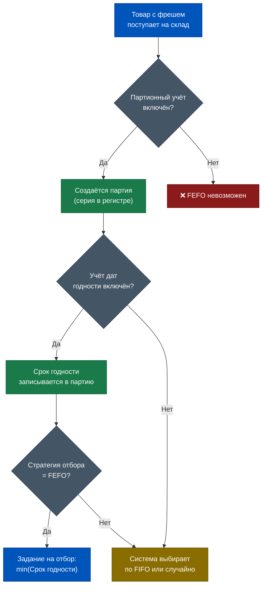
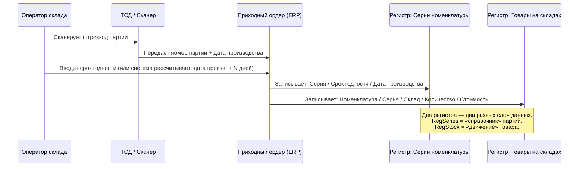
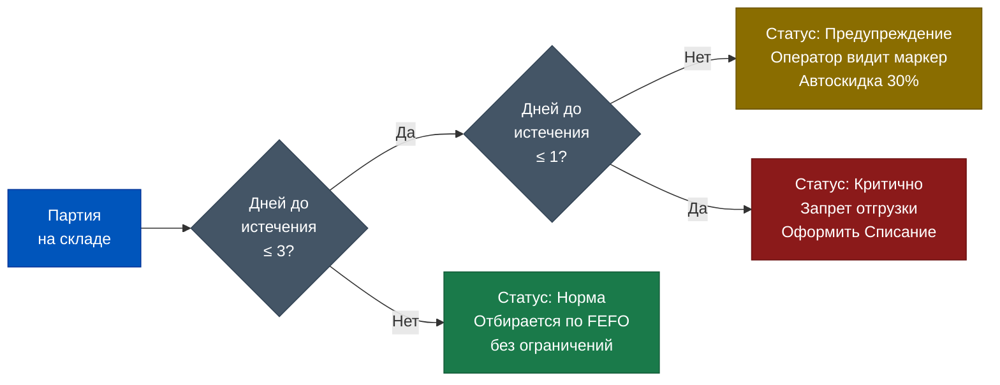
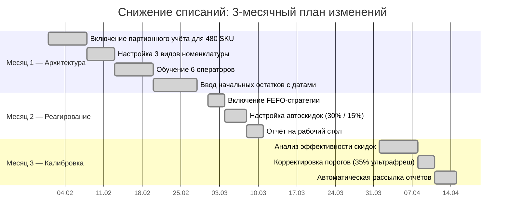
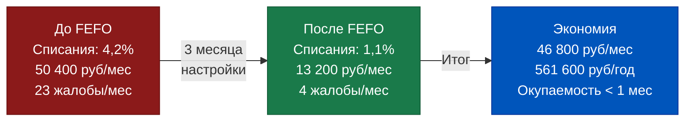

# Неделя 4, День 4. Сроки годности и FEFO: Автоматизация управления фрешем

> **Цель урока:** Разобрать механику FEFO в 1С:ERP 2.5 — от настройки вида номенклатуры до автоматического понижения цены при приближении срока годности — и научиться строить управляемую систему контроля фреша без ручного вмешательства оператора.
>
> **Компетенции после урока:**
> - Понимаете принципиальную разницу между FEFO и FIFO и почему для фреша они дают разный финансовый результат
> - Умеете включить контроль сроков годности для вида номенклатуры и настроить стратегию отбора FEFO
> - Знаете, какие регистры ERP хранят даты годности и как они влияют на задание на отбор
> - Умеете читать отчёт «Товары с истекающим сроком» и интерпретировать его для принятия решений
> - Понимаете, как связать ценообразование и контроль сроков для автоматической уценки фреша
>
> **Время чтения:** ~75 минут

---

## Оглавление

- [[#Часть 1. Клубника, 15 марта и вопрос ценой в 4,2%|Часть 1. Крючок]]
- [[#Часть 2. FEFO: принцип, который спасает фреш от самого себя|Часть 2. FEFO — происхождение и принцип]]
- [[#Часть 3. Настройка в ERP 2.5: от галочки в карточке до задания на отбор|Часть 3. Настройка]]
- [[#Часть 4. Контроль сроков: предупреждения, запреты, автоматическая скидка|Часть 4. Контроль сроков]]
- [[#Часть 5. Категории фреша в Q-commerce: три разных мира — три разные стратегии|Часть 5. Категории фреша]]
- [[#Часть 6. Кейс: как один даркстор снизил списания с 4,2% до 1,1%|Часть 6. Кейс]]
- [[#Часть 7. Глоссарий|Часть 7. Глоссарий]]

---

## Часть 1. Клубника, 15 марта и вопрос ценой в 4,2%

15 марта. Дневная смена даркстора. Два поддона с клубникой стоят в холодильной зоне, каждый подписан стикером с датой:

- **Партия А**: поступила 12 марта, годна до 16 марта — в запасе 1 день.
- **Партия Б**: поступила 14 марта, годна до 18 марта — в запасе 3 дня.

Клиент оформил заказ. Система формирует задание на отбор. Что произойдёт дальше?

Если на складе включён **FIFO** (First In, First Out — первым пришёл, первым ушёл), ответ технически верен: система отберёт Партию А. Её приходный ордер датирован 12 марта — она старше, значит, уходит первой. Клиент получит клубнику с остатком годности 1 день. Вероятность жалобы — высокая. Вероятность повторного заказа — под вопросом.

Если включён **FEFO** (First Expired, First Out — у кого срок истекает раньше, тот уходит первым), ответ тот же: система выберет Партию А. Её срок истекает 16 марта, а у Партии Б — 18 марта. Клубника та же самая. Результат — тот же.

Тогда в чём разница?

Разница проявляется в пограничных случаях, которые в Q-commerce происходят каждый день. Представьте: те же две партии, но дата приёмки у обеих одинакова — обе поступили 13 марта. Партия А произведена неделю назад, годна до 16-го. Партия Б — произведена позавчера, годна до 22-го. При FIFO они равнозначны (пришли одновременно) — система может выбрать любую. При FEFO система гарантированно выберет Партию А, потому что её срок истекает раньше. Клиент получает честный продукт. Партия Б остаётся в запасе с максимальной остаточной жизнью.

Теперь второй вопрос из нашего крючка: а что если обе партии истекают завтра — скидка 30% автоматически?

В базовом функционале 1С:ERP 2.5 — нет. Но в связке «контроль сроков годности + подсистема ценообразования» — да. Это возможно через настройку автоматической скидки, привязанной к условию «количество дней до истечения срока ≤ N». Именно этот механизм позволил одному из дарксторов снизить списания с **4,2% до 1,1%** от товарооборота фреша. Как именно — разберём в Части 6.


---

## Часть 2. FEFO: принцип, который спасает фреш от самого себя

История FEFO как формального стандарта ведёт в фармацевтику и пищевую промышленность 1970-х годов. Не в ритейл, не в логистику — именно в производство лекарств, где ошибка с датой годности имела не финансовые, а медицинские последствия. FDA (Управление по санитарному надзору за качеством пищевых продуктов и медикаментов, США) к 1978 году обязало фармацевтические склады вести партионный учёт с явным указанием срока годности каждой партии и применять принцип «наиболее ранний истекающий — первым уходит» при комплектации.

Пищевая промышленность переняла стандарт в 1980–1990-е. Крупные дистрибьюторы — Sysco, US Foods — к 1995 году автоматизировали FEFO-отбор в своих WMS. В Европе стандарт GS1 закрепил FEFO как обязательный для свежих продуктов в FMCG в директиве EN 13005 в начале 2000-х.

В Россию FEFO пришёл через фармацевтические дистрибьюторы (ЦВ «Протек», «Катрен», «СИА Интернейшнл») в 2003–2008 годах. В продуктовый ритейл — значительно позже, через внедрения SAP в крупных сетях (Лента, Магнит) в 2010–2015 годах. 1С:ERP поддерживает FEFO начиная с версии 2.2 (2016 год), но в полной мере с настраиваемыми стратегиями отбора — с редакции 2.4 и 2.5.

Почему фреш не работает на FIFO? Потому что FIFO решает **один вопрос**: кто пришёл раньше. Этот вопрос правильно ставить для товаров с фиксированным сроком годности, который не зависит от партии: электроника, одежда, непродовольственные товары. Там дата производства прямо коррелирует с «свежестью».

Для фреша ситуация сложнее. Срок годности зависит от:
- условий транспортировки (цепочка холода — прервана или нет)
- даты производства, а не даты поставки
- конкретной партии от конкретного производителя

Два йогурта могут прийти в один день от одного поставщика, но быть из разных производственных смен — и иметь разницу в сроке годности 3–4 дня. FIFO их не различит. FEFO — различит, потому что смотрит не на дату прихода, а на дату «умирания».

**Обязательные условия для работы FEFO в 1С:ERP 2.5:**

Первое условие — **партионный учёт** (разобран в предыдущем уроке). Без него система не умеет разделить запас на партии и не может сравнить сроки годности между ними. Это фундамент.

Второе условие — **учёт дат годности** как отдельного атрибута партии. В ERP 2.5 этот атрибут хранится в регистре сведений «Серии номенклатуры» — в поле «Срок годности». При этом «серия» в контексте фреша без серийного учёта — это именно партия с датой. Конкретно: запись в регистре содержит поля `Номенклатура`, `Характеристика`, `Серия` (или `Партия`), `Склад`, `Ячейка` (если адресное хранение), `Количество` и `Срок годности`.

Третье условие — **настройка стратегии отбора FEFO** для конкретного склада или вида номенклатуры. По умолчанию система работает в режиме FIFO. FEFO нужно явно включить.



Ключевое понимание для продакта: FEFO — это не кнопка, это **архитектурная связка** трёх настроек. Если выпасть хотя бы одно звено — система физически не может гарантировать отбор по сроку годности. Оператор на складе будет принимать решение вручную, то есть случайно.

### Откуда берётся путаница между FEFO и FIFO на практике

Вот типичный сценарий, который происходит в дарксторах без правильной настройки. Смена оператора. Пришла новая поставка молока — 48 упаковок, срок годности 24 марта. На полке стоит остаток предыдущей партии — 12 упаковок, срок годности 17 марта. Оператор расставляет новую поставку, и — это ключевой момент — ставит её перед старой партией, потому что так удобнее: новые коробки только что распакованы, они ближе к руке.

Теперь приходит заказ. Оператор идёт на полку и берёт ближайшие упаковки. Ближайшие — это новая партия с датой 24 марта. Клиент получает молоко с отличным сроком, но на полке остаётся 12 упаковок с датой 17 марта, которые постепенно движутся к списанию.

Этот сценарий происходит не потому что оператор злой умысел имеет — он просто не видит, какая партия «важнее». Без системного задания на отбор (где чёрным по белому написано: «взять серию №2024-03-11, срок 17.03») у него нет никакого сигнала принять другое решение.

Именно поэтому FEFO без **подтверждения отбора** через ТСД — это декларация, а не гарантия. Продакт должен понимать: настройка стратегии в ERP — это первый шаг. Второй шаг — процесс сканирования при отборе, который не даст закрыть задание без подтверждения нужной партии.

---

## Часть 3. Настройка в ERP 2.5: от галочки в карточке до задания на отбор

Разберём настройку пошагово — от нулевой точки до момента, когда система сформирует задание на отбор с гарантированным FEFO. В этой части нет кода, только логика навигации по системе и смысл каждого параметра.

### Шаг 1. Настройка вида номенклатуры

Вид номенклатуры — это «тип» товара в иерархии ERP. Все настройки учёта наследуются: если включили контроль сроков на уровне вида, все товары этого вида автоматически получают атрибут «Срок годности».

Путь в ERP 2.5: `НСИ и администрирование → Номенклатура → Виды номенклатуры`. Открываем нужный вид (например, «Клубника свежая» или «Молочная продукция»).

В разделе **«Серии»** находим группу параметров:
- `Использовать серии` — переключить в «Да» (это включает партионный учёт)
- `Вести учёт по сериям в разрезе складов` — рекомендуется для фреша, чтобы остатки считались корректно по каждому дарксторному складу отдельно
- `Контролировать срок годности` — переключить в «Да» (ключевая галочка)
- `Срок годности (дней)` — указываем стандартный срок для данного вида (например, 7 дней для клубники). Это значение используется как дефолт при создании новой серии, если оператор не ввёл дату вручную

Важный нюанс: после включения контроля сроков годности система начнёт требовать ввода даты при любом движении товара данного вида. Если в базе есть «старые» партии без даты — это создаст ошибки при проведении документов. Перед включением нужно обнулить или актуализировать эти остатки.

Второй нюанс: параметр `Срок годности (дней)` — это **не ограничение**, а умолчание. Если оператор при приёмке партии с реальным сроком 5 дней введёт дату вручную, она перекроет дефолт. Дефолт используется только в тех случаях, когда оператор не заполнил дату — тогда система сама рассчитает: «Дата Приходного ордера + N дней». Для ультрафреша это допустимо как запасной вариант, но не как основной процесс: если у разных партий одного и того же молока реальный срок различается на 3–4 дня, а в систему попадает усреднённый дефолт — FEFO будет работать неточно.

### Шаг 2. Ввод дат годности при приёмке

Документ, в котором фиксируется дата годности конкретной партии — **Приходный ордер на товары** (в складском документообороте ERP 2.5). Именно он является первичным документом приёмки на склад.

Последовательность событий:
1. Из заказа поставщику создаётся Приходный ордер
2. Оператор сканирует товар или вводит данные вручную
3. В табличной части документа для каждой строки с «серийным» товаром открывается колонка **«Серия»**
4. Оператор создаёт новую серию (партию): указывает номер партии (или штрих-код), **дату производства** и **срок годности** (конкретную дату, не количество дней)
5. После проведения Приходного ордера система записывает в регистр накопления «Товары на складах» остаток по этой серии и в регистр сведений «Серии номенклатуры» — атрибут срока годности

Практически: в реальных Q-commerce операциях ввод дат вручную — узкое место. Стандартное решение — интеграция с ТСД (терминалом сбора данных), где оператор при приёмке сканирует QR-код или штрих-код с датой производства. Если товар маркирован «Честным ЗНАКОМ» — дата производства уже зашита в КиЗ (код идентификации), и система может получить её автоматически при сканировании.



### Шаг 3. Настройка стратегии отбора FEFO

Стратегия отбора — это правило, по которому ERP выбирает, **из какой именно партии** сформировать задание на отбор, если товар есть в нескольких партиях.

Путь в ERP 2.5: `Склад → Настройки → Параметры отбора` (или в настройках конкретного склада, если используется адресное хранение).

Параметр: `Стратегия выбора серий при отборе`. Доступные значения:
- `FIFO (по дате поступления)` — стандартный режим
- `FEFO (по сроку годности)` — первым уходит тот, у кого срок истекает раньше
- `LIFO (по дате поступления, обратный)` — редко используется

При выборе FEFO система при формировании Задания на отбор обращается к регистру «Товары на складах», фильтрует строки по номенклатуре и складу, затем из регистра «Серии номенклатуры» получает срок годности для каждой партии, сортирует по возрастанию — и включает в задание партию с минимальным сроком годности первой.


> [!IMPORTANT] Что нельзя сделать в типовом функционале
> Штатный FEFO в ERP 2.5 работает на уровне **склада целиком** или **вида номенклатуры**. Нельзя в одном документе выбрать FEFO для клубники и FIFO для консервов одновременно — если они относятся к разным видам номенклатуры с разными настройками, система корректно обработает каждый вид по-своему. Если же смешать их в одном виде — будет применено одно правило для всех.

---

## Часть 4. Контроль сроков: предупреждения, запреты, автоматическая скидка

Знать, что у товара заканчивается срок годности — это половина задачи. Вторая половина — правильно на это отреагировать: предупредить оператора, запретить отгрузку или снизить цену до того, как товар станет балластом. В ERP 2.5 эти три уровня реагирования настраиваются по-разному.

### Уровень 1. Предупреждение при отборе

В параметрах вида номенклатуры или в настройках склада задаётся **«Минимальное количество дней до истечения срока годности»** — порог, при достижении которого система показывает оператору предупреждение при формировании задания на отбор.

Логика: если оставшийся срок партии ≤ N дней — в задании на отбор появляется визуальный маркер. Оператор видит: «Внимание: у партии №2026-03-12 осталось 1 день». Он не обязан остановить отбор — только информирован.

Практическое значение: в Q-commerce эта настройка работает как «последнее предупреждение» перед тем, как товар попадёт к клиенту с критически коротким сроком. Если FEFO настроен корректно, эта партия всё равно уйдёт первой — но оператор будет знать об этом явно, а не обнаружит факт уже после жалобы клиента.

### Уровень 2. Запрет отгрузки просроченного товара

В тех же настройках можно включить **«Запрет отгрузки при истёкшем сроке годности»**. При проведении Задания на отбор или Расходного ордера система проверит: есть ли в строках партии с истёкшим сроком? Если да — документ не проведётся, будет ошибка.

Это кажется очевидным, но в реальной практике даркстора настройка критична по одной причине: **ручной отбор без ТСД**. Если оператор отбирает товар «по памяти» и берёт не ту партию — без этой проверки просроченный товар может уйти клиенту. С проверкой — система остановит документ до финального сканирования.

> [!WARNING] Частая ошибка
> Запрет отгрузки просроченного товара не означает автоматического списания. Товар с истёкшим сроком продолжает числиться на остатках до тех пор, пока не будет оформлен документ **Списание товаров** с соответствующей причиной («Истечение срока годности»). Если не контролировать это отдельно — бухгалтерия будет видеть «живой» товар в остатках, который физически уже уничтожен.

### Уровень 3. Автоматическая скидка при приближении срока

Это самый интересный и наиболее влияющий на P&L механизм. В ERP 2.5 автоматическая скидка при приближении срока годности реализуется через **подсистему ценообразования**.

Логика настройки:
1. В разделе «Продажи → Ценообразование → Скидки (наценки)» создаётся новая скидка: например, «Уценка фреша T-2»
2. Условие применения скидки: `Количество дней до истечения срока годности ≤ 2`
3. Размер скидки: 30% (или другой процент по решению бизнеса)
4. Скидка назначается на определённые товарные группы (фреш, ультрафреш)

При оформлении заказа клиента система проверяет срок годности партии, которая будет отобрана (с учётом FEFO). Если срок ≤ 2 дней — автоматически применяет скидку к цене позиции в чеке.

> [!NOTE] Ограничение типового функционала
> Автоматическая скидка в ERP 2.5 применяется в момент **оформления заказа клиента**, а не в момент физического отбора. Это означает, что если клиент оформил заказ вечером (когда у партии ещё 3 дня), а отбор произошёл утром следующего дня (когда осталось 2 дня) — скидка не применится автоматически. Для Q-commerce с быстрыми циклами это некритично: время от оформления заказа до отгрузки обычно составляет 15–30 минут.

### Связка с ценообразованием: как это работает изнутри

Когда клиент оформляет заказ в приложении (либо оператор создаёт Заказ клиента в ERP), система проходит по строкам заказа и для каждой позиции запускает расчёт цены. Расчёт цены включает в себя проверку применимых скидок.

В момент расчёта система уже знает (благодаря FEFO), какая именно партия будет отобрана для этого заказа — та, у которой срок истекает раньше всего. Она берёт из регистра «Серии номенклатуры» дату срока годности этой партии и вычитает из неё текущую дату. Получается число — количество дней до истечения. Если оно меньше или равно пороговому значению скидки — скидка применяется.

Это объясняет, почему скидка в системе не «вешается на товар», а **динамически рассчитывается в момент оформления заказа**. Один и тот же товар утром может стоить полную цену (у отбираемой партии ещё 4 дня), а вечером — уже со скидкой 30% (осталось 1 день). Это честная механика: клиент получает информацию о скидке до оформления, а не постфактум в виде товара с сюрпризом.

### Отчёты «Товары с истекающим сроком»

Штатный отчёт в ERP 2.5: `Склад → Отчёты → Товары с истекающим сроком годности`.

Параметры отчёта:
- **Дата формирования** — на какой момент смотреть
- **Количество дней до истечения** — порог фильтрации (например, показать всё, что истечёт в ближайшие 3 дня)
- **Склад** / **Вид номенклатуры** — сегментация

Выходные данные: список номенклатуры, партии, количество, дата истечения, остаток дней. Отчёт можно вывести на рабочий стол нужной роли (заведующий складом, категорийный менеджер) и настроить автоматическую рассылку по расписанию — например, каждый день в 6:00 утра до начала смены.



---

## Часть 5. Категории фреша в Q-commerce: три разных мира — три разные стратегии

Одна из самых распространённых ошибок при настройке FEFO в дарксторе — применять одинаковую стратегию ко всему ассортименту категории «Фреш». Клубника и пармезан физически находятся в разных реальностях, хотя оба считаются свежими продуктами. Попытка управлять ими одним инструментом — это как настраивать один будильник для всех часовых поясов одновременно.

В Q-commerce фреш делится на три категории с принципиально разными параметрами управления:

### Ультрафреш: 0–3 дня

Типичные позиции: свежая клубника, малина, черешня, мясные п/ф без замораживания, сырая рыба, парное мясо.

Срок жизни — от нескольких часов до 3 суток. Для этой категории каждый час решает. В Q-commerce (доставка 15–30 минут) ультрафреш — это витрина конкурентного преимущества и одновременно главный источник списаний.

Стратегия управления в ERP:
- FEFO с порогом предупреждения: **1 день**
- Запрет отгрузки: при истечении срока + **2 часа** (если система умеет работать с временными метками — нестандартная доработка)
- Автоматическая скидка: **25–40%** при T-1 день
- Минимальный страховой запас: **нулевой или минимальный** (1–2 единицы), потому что хранить ультрафреш «про запас» опаснее, чем иметь временный out-of-stock
- Частота поставок: **ежедневно**, иногда 2 раза в день
- Отчёт по истекающим срокам: **каждые 4 часа**

Показатель списаний для ультрафреша без FEFO: в среднем 6–12% по отрасли. С настроенным FEFO + автоуценкой: 1,5–3%.

Ещё один параметр, критичный для ультрафреша: **минимальный остаточный срок при приёмке**. В ERP 2.5 можно настроить условие: если при приёмке партии система видит, что срок годности менее X дней с момента поставки — документ выдаст предупреждение или заблокирует приёмку. Для клубники стандарт Q-commerce: минимальный остаточный срок при приёмке — **не менее 3 дней**. Если поставщик привёз клубнику с остатком 2 дня, это нарушение договорных условий поставки. ERP может автоматически зафиксировать это расхождение в Акте о приёмке.

### Короткий срок: 3–14 дней

Типичные позиции: молоко, кефир, сметана, йогурты, твёрдые сыры, охлаждённая птица в вакуумной упаковке, свежевыжатые соки.

Это основной объём категории «Фреш» в Q-commerce: по данным отраслевых исследований, на этот диапазон приходится 55–65% всех SKU фреша в российских дарксторах.

Стратегия управления в ERP:
- FEFO с порогом предупреждения: **3 дня**
- Запрет отгрузки: строго при истечении
- Автоматическая скидка: **15–20%** при T-2 дня
- Страховой запас: умеренный, рассчитывается по модели min/max с учётом ежедневного спроса
- Частота поставок: 3–5 раз в неделю
- Интеграция с «Честным ЗНАКОМ»: обязательна для молочной продукции (маркировка введена с 2021 года для молока со сроком более 40 дней, с 2022 года — для всей молочки)

Среднеотраслевой уровень списаний без FEFO: 2,5–4%. С FEFO: 0,8–1,5%.

### Средний срок: 14–90 дней

Типичные позиции: выдержанные сыры, колбасные изделия в вакууме, пресервы, маринады, охлаждённые блюда с длительным сроком.

Для этой категории FEFO по-прежнему важен, но давление срока значительно ниже. Здесь приоритет смещается в сторону управления оборачиваемостью и снижения замороженного капитала.

Стратегия управления в ERP:
- FEFO с порогом предупреждения: **7 дней**
- Автоматическая скидка: **10–15%** при T-5 дней
- Страховой запас: рассчитывается на 3–7 дней продаж
- Частота поставок: 1–2 раза в неделю
- Списания: при правильном FEFO не превышают **0,3–0,7%**


> [!TIP] Компромисс продакта
> Не пытайтесь с первого дня настроить разные пороги для всех трёх категорий. Начните с ультрафреша: он даёт максимальный возврат инвестиций в настройку. Списания ультрафреша на 1% выручки — это 10 000 рублей потерь на каждые 1 млн рублей оборота категории. У Q-commerce с 500 тыс. рублей оборота ультрафреша в месяц — это 5 000 рублей живых денег, которые можно вернуть за 2–3 дня настройки.

---

## Часть 6. Кейс: как один даркстор снизил списания с 4,2% до 1,1%

### Точка отсчёта

Февраль 2024 года. Даркстор сети в Москве, Районный центр доставки «Сокол». Площадь: 320 кв.м. Активных SKU: 2 800. Фреш-зона: 480 SKU, из них ультрафреш — 85 SKU. Оборот категории фреш: около 1,2 млн рублей в месяц.

Проблема, которую поставили продакту: **списания в категории фреш составляют 4,2% от товарооборота**. По отраслевым ориентирам норма для дарксторов — не выше 1,5–2%. 4,2% — это примерно 50 400 рублей ежемесячных потерь, которые напрямую уходят в минус P&L категории.

Аудит показал три источника потерь:

**Источник 1: хаотичный отбор.** Операторы брали товар «с удобной полки», а не из самой старой партии. В 37% случаев (по журналу заданий на отбор за январь) отбиралась не та партия, которую следовало взять по FEFO. Причина: на складе не был включён партионный учёт для 60% SKU фреша.

**Источник 2: запоздалая реакция на истекающий срок.** Менеджер узнавал о товаре с критическим сроком постфактум — при физической инвентаризации или когда оператор физически находил просроченный товар. Среднее время запаздывания: 1,5 суток. За это время 18% партий ультрафреша переходили из «скидочной зоны» в «зону списания».

**Источник 3: ручная уценка как процесс.** Когда менеджер всё же замечал товар с коротким сроком, он делал уценку вручную через документ «Изменение цен». Это занимало от 40 минут до 2 часов. Пока шёл процесс согласования уценки, часть товара либо истекала, либо уходила к клиенту по полной цене без скидки — и клиент потом жаловался на короткий срок годности.

### Что изменили в системе

Первый месяц — архитектурная подготовка. Включили партионный учёт для всех 480 SKU фреша. Разбили ассортимент на три вида номенклатуры: «Ультрафреш», «Фреш короткий срок», «Фреш средний срок». Для каждого вида настроили собственные параметры контроля сроков. Обучили 6 операторов вводу дат годности при приёмке через ТСД.

Второй месяц — настройка реагирования. Включили FEFO как стратегию отбора для всех трёх видов. Настроили автоматическую скидку: 30% при T-2 дня для ультрафреша, 15% при T-2 дня для короткого срока. Вывели отчёт «Товары с истекающим сроком» на рабочий стол заведующего складом с обновлением каждые 2 часа.

Третий месяц — калибровка. Пороги скидок скорректировали: для ультрафреша подняли до 35%, потому что при 30% клиенты покупали охотно, но маржа позволяла давать больше и тем самым ускорять продажи. Добавили автоматическую рассылку отчёта на e-mail категорийного менеджера в 7:00 утра.



### Результат

После 90 дней работы новой системы:

- Списания фреша: **с 4,2% до 1,1%** — снижение в 3,8 раза
- Ежемесячная экономия: около **37 000 рублей** (от 50 400 до 13 200 рублей потерь)
- Количество жалоб клиентов на срок годности: **снизилось с 23 до 4** обращений в месяц
- Доля автоматически уценённого и проданного товара (не списанного): **68%** от товара, который ранее шёл в списание
- Время реакции менеджера на критический срок: **с 1,5 суток до 2 часов** (благодаря отчёту каждые 2 часа)
- Количество ручных операций уценки: **с 12–18 в неделю до 2–3** (остальное делает автоматика)

Грабли, на которые наступили:

**Граблина первая: операторы саботировали ввод дат.** В первые 3 недели около 30% приходных ордеров проводились без заполнения поля «Срок годности» — операторы торопились и пропускали шаг. Решение: в настройках вида номенклатуры включили **обязательность заполнения серии при проведении Приходного ордера**. Без даты документ не проводился. За первую неделю после включения обязательности — 4 конфликта с операторами. Через 2 недели — норма.

**Граблина вторая: «старые» остатки без дат.** На момент включения партионного учёта на складе числилось 127 позиций без сведений о партии и сроке годности. Система начала выдавать ошибки при формировании заданий на отбор. Пришлось провести инвентаризацию с ручным вводом дат для этих позиций — 2 рабочих дня для 2 операторов.

**Граблина третья: автоскидка «съедала» маржу на дорогих позициях.** Для импортного сыра стоимостью 890 рублей скидка 30% за T-2 дня давала цену 623 рубля — ниже себестоимости. Решение: настроили скидку не для всего вида номенклатуры, а для конкретной товарной группы «Молоко, кефир, йогурты», исключив «Сыры выдержанные» и настроив для них отдельную меньшую скидку 10%.

**Граблина четвёртая: отчёт по истекающим срокам никто не читал.** Отчёт был настроен и выводился на рабочий стол, но в первые 3 недели заведующий складом не реагировал на него — слишком много других задач. Решение: ввели регламент «15 минут с утра на фреш-отчёт» и добавили в KPI заведующего показатель «доля уценённого и проданного фреша против списанного». Как только показатель стал измеримым — поведение изменилось: к концу второго месяца заведующий самостоятельно начал запрашивать отчёт 2 раза в день, не только утром.

### Финансовая математика кейса

До изменений: списания 4,2% от 1,2 млн = **50 400 рублей** в месяц прямых потерь. Жалобы клиентов на короткий срок — 23 обращения в месяц; каждая жалоба в среднем закрывается компенсационным заказом ~500 рублей = 11 500 рублей. Итого ежемесячный ущерб: ~**62 000 рублей**.

После изменений: списания 1,1% от 1,2 млн = **13 200 рублей**. Жалобы: 4 обращения = 2 000 рублей. Итого ущерб: ~**15 200 рублей**. Снижение: 62 000 − 15 200 = **46 800 рублей в месяц**, или **561 600 рублей в год**.

Стоимость внедрения: 2 рабочих дня аналитика на настройку + 3 рабочих дня на обучение 6 операторов. Суммарно — около **40 000 рублей** разовых затрат. Окупаемость — менее 1 месяца.



> [!IMPORTANT] Главный вывод кейса
> FEFO без автоматической уценки снижает списания примерно на 30–40%. FEFO + автоматическая уценка — на 60–75%. Связка двух механизмов работает нелинейно: уценка превращает потенциальное списание в продажу, пусть и с меньшей маржой, что всегда лучше нулевой выручки от списания.

---

## Часть 7. Глоссарий

| Термин | Определение | Где в ERP 2.5 |
|:-------|:-----------|:--------------|
| **FEFO** (First Expired, First Out) | Стратегия отбора: первым уходит товар с наиболее ранним сроком истечения годности. Противопоставляется FIFO, который ориентируется на дату приёмки, а не на дату годности | Настройки склада → Стратегия выбора серий при отборе |
| **FIFO** (First In, First Out) | Стратегия отбора: первым уходит товар, который поступил на склад раньше всего. Стандартный режим ERP 2.5, не учитывает срок годности | Стратегия по умолчанию в параметрах отбора |
| **Срок годности** | Дата, до которой производитель гарантирует соответствие товара заявленным характеристикам. Указывается на упаковке. В ERP хранится как атрибут серии (партии) в регистре сведений «Серии номенклатуры» | Регистр сведений «Серии номенклатуры», поле «Срок годности» |
| **Дата производства** | Дата изготовления конкретной партии товара. Вместе со сроком годности задаёт «окно жизни» партии. Важна для расчёта остаточного срока годности | Регистр сведений «Серии номенклатуры», поле «Дата изготовления» |
| **«Честный ЗНАК»** | Российская национальная система маркировки товаров. Для молочной продукции обязательна с 2021–2022 года. КиЗ (код идентификации) содержит дату производства и GTIN; при сканировании система может автоматически заполнить дату в Приходном ордере | Подсистема маркировки, интеграция через оператора ЭДО |
| **Контроль сроков годности** | Настройка в виде номенклатуры, которая включает обязательный ввод даты годности при движении товара и позволяет системе применять предупреждения и запреты при критическом остатке срока | Вид номенклатуры → Серии → Контролировать срок годности |
| **Списание** | Документ в ERP 2.5, которым фиксируется безвозвратная потеря товара (порча, истечение срока, недостача). Формирует проводку в бухгалтерском учёте и уменьшает остаток в регистре «Товары на складах» | Склад → Списание товаров |
| **Уценка** | Снижение цены товара ниже базовой цены продажи, оформляемое через документ «Установка цен номенклатуры» или через механизм автоматических скидок в подсистеме ценообразования | Продажи → Ценообразование → Скидки (наценки) |
| **Партионный учёт** | Система учёта, при которой каждая партия поступившего товара (приходный ордер) регистрируется отдельно с собственными атрибутами: номером партии, датой, поставщиком, ценой, сроком годности. Фундамент для работы FEFO | Вид номенклатуры → Серии → Использовать серии |
| **Задание на отбор** | Складской документ ERP 2.5, который формируется на основании заказа клиента и содержит инструкцию для оператора: что, сколько, из какой ячейки и из какой партии взять | Склад → Задания на отбор |

**Часто задаваемые вопросы:**

**Вопрос 1: Если FEFO настроен, оператор всё равно может взять не ту партию?**

Да. FEFO — это инструкция в Задании на отбор, а не физический замок. Если оператор игнорирует задание или на складе нет ТСД с подтверждением отбора — он физически может взять любую партию. Защита от этого: подтверждение факта отбора сканированием штрих-кода партии через ТСД. Без подтверждения корректной партии документ не закрывается.

Дополнительный слой контроля — **адресное хранение**. Если каждая ячейка в складе имеет адрес (стеллаж-уровень-место), и FEFO-партия стоит в конкретной ячейке, задание на отбор указывает оператору не только «возьми серию №X», но и «возьми из ячейки А-2-3». Оператор физически идёт к конкретному месту. Вероятность ошибки при правильной организации склада — менее 2% против 37% при отборе «по памяти».

**Вопрос 2: Как FEFO влияет на финансовую отчётность?**

FEFO влияет на **себестоимость списания** при закрытии месяца. В ERP 2.5 себестоимость рассчитывается методом средневзвешенной, но если партии имеют разную закупочную цену — FEFO определяет, какая партия ушла первой, и соответственно, какая себестоимость зафиксирована в конкретной продаже. При больших колебаниях закупочных цен на фреш это может влиять на показатель валовой маржи.

**Вопрос 3: Нужен ли «Честный ЗНАК» для работы FEFO?**

Нет, это независимые системы. «Честный ЗНАК» — это требование регулятора по прослеживаемости. FEFO — внутренняя логика управления запасами. Они могут работать вместе (КиЗ ускоряет ввод дат) и по отдельности. Но для молочной продукции «Честный ЗНАК» обязателен вне зависимости от настроек склада.

**Вопрос 4: Как часто нужно проводить инвентаризацию фреша при включённом FEFO?**

При правильно настроенном FEFO и подтверждении отбора через ТСД — рекомендуемая частота инвентаризации фреша: **1 раз в 3 дня** для ультрафреша (0–3 дня), **1 раз в неделю** для короткого срока, **1 раз в 2 недели** для среднего срока. Это не требование ERP — это операционный стандарт. Без регулярной инвентаризации система постепенно накапливает «виртуальный» товар: партии, которые числятся в остатках, но физически уже не существуют или испорчены. Каждое такое расхождение искажает FEFO-логику при следующем отборе.

**Вопрос 5: Что происходит с данными о партии при возврате товара от клиента?**

При оформлении Возврата от клиента в ERP 2.5 система создаёт обратное движение в регистре «Товары на складах» — партия возвращается с той же серией и тем же сроком годности, с которыми она ушла. Это значит, что FEFO продолжает учитывать эту партию при следующем отборе. Если клиент вернул клубнику с уже истёкшим сроком — система выдаст предупреждение при попытке поместить её обратно в оборот. Правильное решение в этом случае: оформить Списание сразу при обработке возврата, не допуская попадания просроченного товара в активные остатки.

---

> [!TIP] Что делать в понедельник утром
> 1. Проверьте: включён ли партионный учёт хотя бы для топ-20 SKU вашего ультрафреша?
> 2. Откройте отчёт «Товары с истекающим сроком годности» и посмотрите, что истекает в ближайшие 3 дня. Если такого отчёта нет — это первый вопрос к вашему 1С-аналитику.
> 3. Спросите заведующего складом: «Как оператор выбирает, из какой партии брать?» Если ответ «ну, с ближайшей полки» — вы нашли источник 2–4% списаний.
> 4. Подготовьте бизнес-кейс для включения FEFO с числами: объём фреша × текущий % списаний × потенциальное снижение на 60–75%. Это ваш аргумент на внедрение.
> 5. Проверьте, настроена ли автоматическая скидка хотя бы для одной товарной группы ультрафреша. Если нет — оцените потенциал: какой объём товара еженедельно попадает в «зону риска» T-2 дня и уходит в списание, а не в продажу со скидкой.

---


### Итоговая схема управления сроками годности

```mermaid
flowchart LR
    REC["Приёмка
Ввод дат годности
в Приходный ордер"] --> REG["Регистр
Партии товаров
(дата + количество)"]
    REG --> FEFO["Алгоритм FEFO
Сортировка по дате
истечения ↑"]
    FEFO --> PICK["Задание на отбор
Партия с min датой
издаётся первой"]
    PICK --> CHECK{"Остаток до
истечения, дней"}
    CHECK -->|"< 3 дней"| DISCOUNT["Автоматическая
скидка 30%"]
    CHECK -->|"< 1 дня"| BLOCK["Блокировка
отгрузки + списание"]
    CHECK -->|"> 3 дней"| SHIP["Обычная отгрузка"]

    style REG fill:#0055BB,color:#fff
    style FEFO fill:#0055BB,color:#fff
    style DISCOUNT fill:#885500,color:#fff
    style BLOCK fill:#AA0000,color:#fff
    style SHIP fill:#005500,color:#fff

← [[Неделя 4 - День 3 - Партионный учет и серийные номера|← День 3]] | [[1c_erp_qcom/README|Оглавление]] | [[Неделя 4 - День 5 - Весогабаритные характеристики|День 5 →]]
