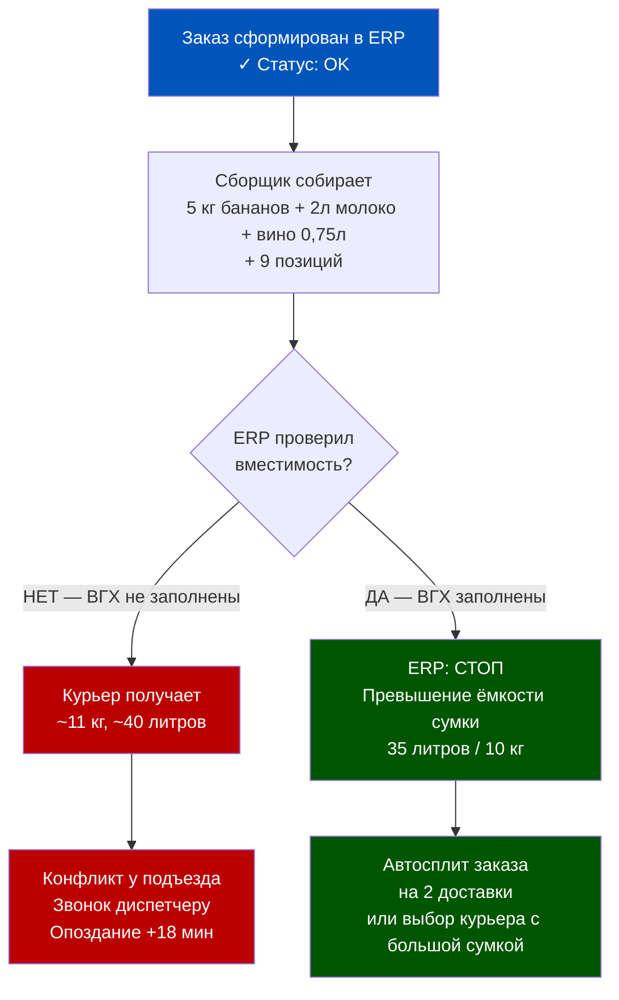
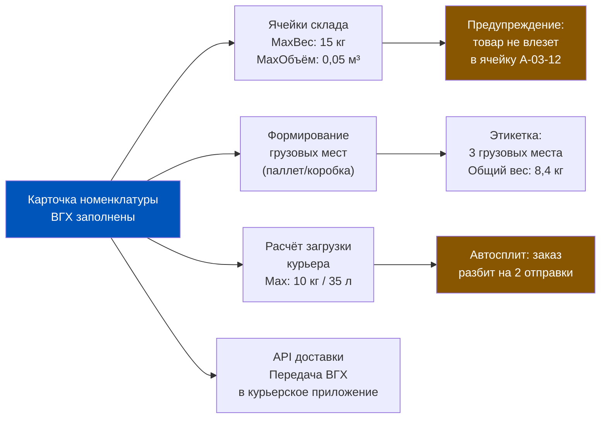
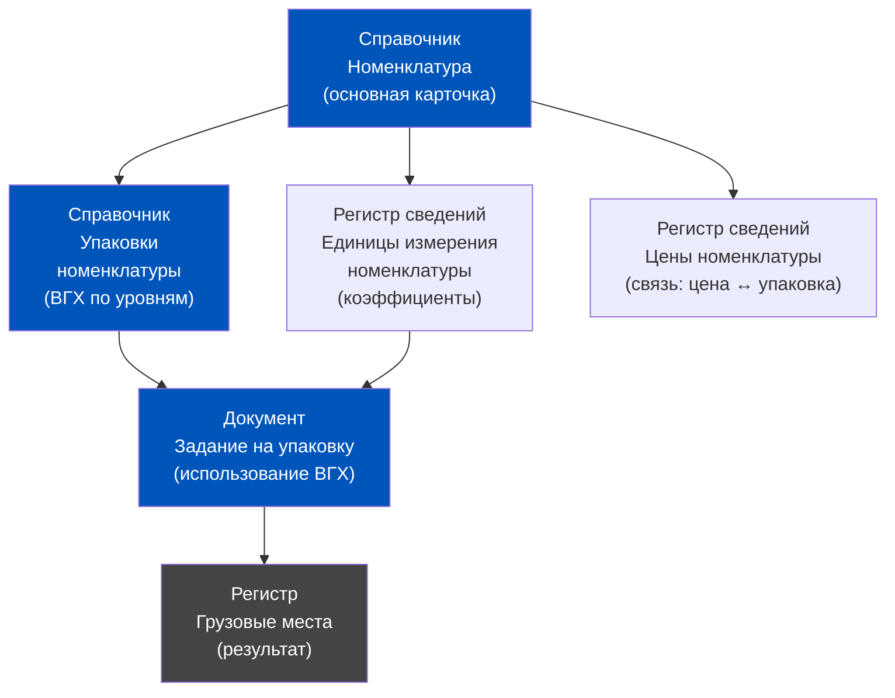
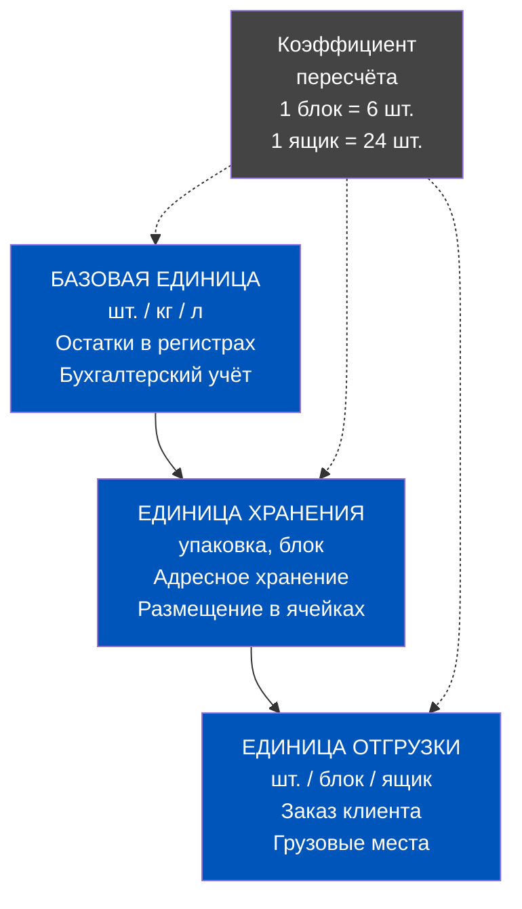
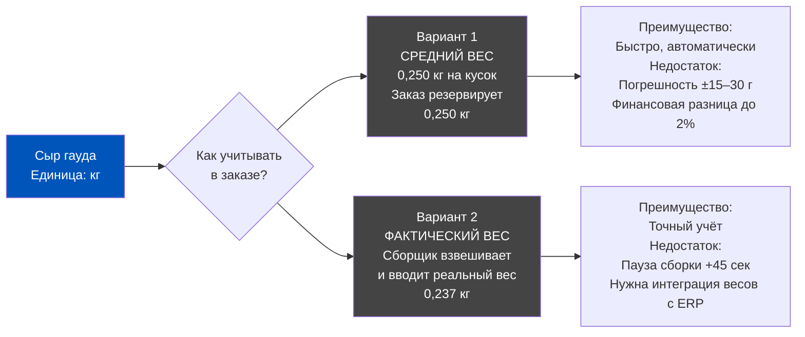
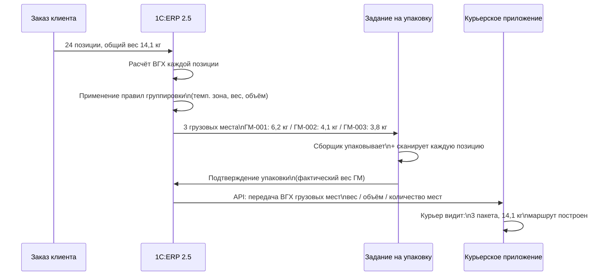
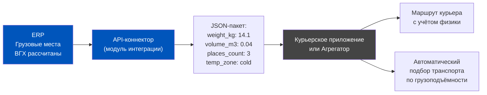
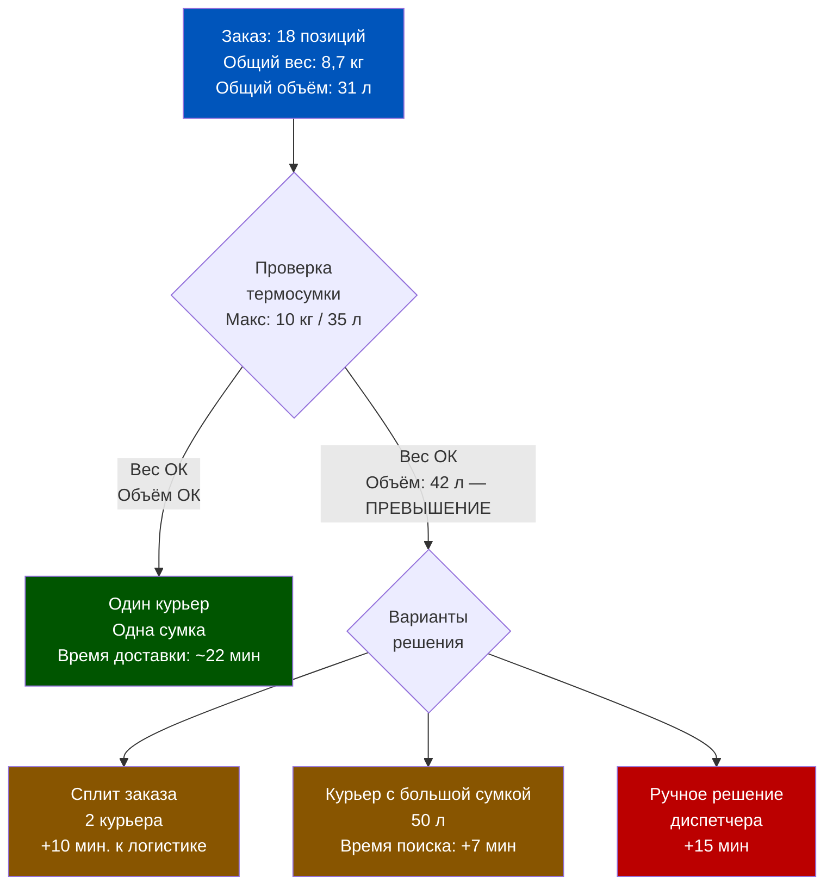
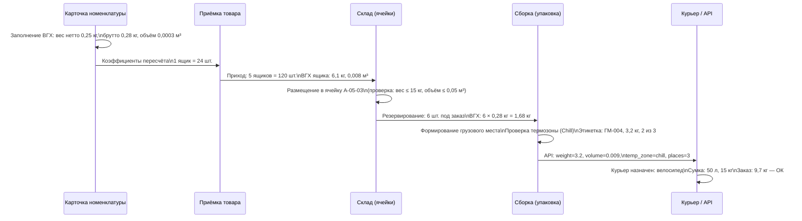

# Неделя 4 — День 5. Весогабаритные характеристики и Упаковки: Физика товара в ERP

> **Цель урока:** Понять, как 1C:ERP 2.5 моделирует физическую реальность товара — его вес, объём, упаковки и особенности весового учёта — и почему без этих данных система слепа к логистическим ограничениям Q-commerce.
>
> **Компетенции после урока:**
> - Знать, какие поля ВГХ в карточке номенклатуры за что отвечают и как они влияют на складскую логику
> - Уметь настроить набор упаковок и понимать, как ERP конвертирует между единицами
> - Разбираться в особенностях учёта весового товара и проблеме точности ±5 г
> - Видеть связь ВГХ с ограничениями термосумки, температурными зонами и API доставки
>
> **Время:** ~70 минут

---

## Оглавление

- [[#Часть 1. Крючок: когда физика побеждает логику]]
- [[#Часть 2. ВГХ в карточке номенклатуры ERP 2.5]]
- [[#Часть 3. Единицы измерения и набор упаковок]]
- [[#Часть 4. Весовой товар: учёт и точность]]
- [[#Часть 5. Грузовые места и маркировка]]
- [[#Часть 6. Практика Q-commerce: температура, сумка, курьер]]
- [[#Часть 7. Глоссарий]]

---

## Часть 1. Крючок: когда физика побеждает логику

Представьте сцену: московский курьер, 22:47, у подъезда клиента. В его руках — заказ из 12 позиций. ERP успешно провёл сборку, сформировал маршрут, рассчитал стоимость доставки. Система довольна. Курьер — нет.

Потому что в заказе: 5 кг бананов, 2-литровый пакет молока (2 кг, 30 × 10 × 20 см) и бутылка вина 0,75 л (высота 32 см, вес 1,4 кг с учётом стекла). Плюс ещё 9 позиций помельче. Итого: около 11 кг и объём, который физически не помещается в стандартную термосумку объёмом 35 литров. Курьер звонит диспетчеру. Диспетчер звонит операционному менеджеру. Операционный менеджер открывает 1С и видит, что с заказом «всё в порядке».

Это не единичный инцидент. Это системная ошибка проектирования — ERP не знает физики товара.

В этом и заключается суть проблемы ВГХ. Весогабаритные характеристики — это не справочник для бухгалтерии. Это слепок реальности, без которого система управляет виртуальными единицами, а не физическими объектами. Курьер с 35-литровой сумкой — это ограничение. Ячейка склада высотой 40 см — ограничение. Грузоподъёмность лифта в доме клиента — ограничение. ERP должен знать о каждом из них.

Q-commerce добавляет к этому ещё одно измерение: скорость. Когда доставка должна состояться за 15–30 минут, нет времени на «перепроверить вручную». Если система не предупредила о физическом конфликте на этапе сборки — курьер узнаёт о нём у подъезда.

Сегодня мы разберёмся, как 1C:ERP 2.5 хранит физику товара, почему это сложнее, чем кажется, и где именно прячутся те самые грабли, которые превращают корректный заказ в логистический коллапс.



Детектив начинается не с улики, а с вопроса: почему система думала, что всё в порядке?

### Масштаб проблемы в цифрах

Это не академическая история. По данным операционных команд крупных Q-commerce игроков, доля заказов, в которых возникают логистические конфликты из-за неверных или отсутствующих ВГХ, составляет от 3% до 8% в первый год после запуска ERP. При объёме 5 000 заказов в день это 150–400 проблемных заказов ежесуточно. Каждый — это звонок, задержка, иногда возврат. Стоимость одного инцидента в операционных затратах: 150–300 руб. (время диспетчера + повторная логистика). Итого потери: от 22 500 до 120 000 руб. в день — только из-за отсутствия цифр в карточке товара.

Хорошая новость: это полностью устранимая проблема. Нужно понять архитектуру ВГХ в ERP, выстроить процесс их заполнения и поддержания актуальности. Именно этому посвящён сегодняшний урок.

Важно запомнить с самого начала: ВГХ в 1C:ERP 2.5 — это не один параметр. Это система взаимосвязанных полей, справочников и регистров, которая работает как единое целое. Разберём её слой за слоем.

---

## Часть 2. ВГХ в карточке номенклатуры ERP 2.5

Открываем карточку номенклатуры в 1C:ERP 2.5. Вкладка называется «Единицы измерения и упаковки». Здесь хранятся все физические параметры товара — то, что в логистике называют весогабаритными характеристиками.

### Анатомия полей ВГХ

Карточка содержит 6 ключевых числовых полей, каждое из которых несёт свою функцию в логистической цепочке:

| Поле | Что хранит | Где используется в ERP |
|------|------------|------------------------|
| Вес нетто | Вес товара без упаковки, кг | Расчёт загрузки курьера (чистый товар) |
| Вес брутто | Вес товара с упаковкой, кг | Расчёт грузовых мест, логистика |
| Объём | Объём в куб. метрах (м³) | Расчёт вместимости ячеек и термосумки |
| Длина | Длина наибольшей стороны, мм | Проверка на проходимость в ячейку |
| Ширина | Ширина, мм | Планирование хранения |
| Высота | Высота, мм | Штабелирование, стеллажи |
| Вес тары | Вес упаковки = брутто − нетто, кг | Расчёт складских потерь |

Важная деталь архитектуры: все эти поля в ERP 2.5 хранятся **в привязке к конкретной единице измерения**. У бутылки вина 0,75 л вес брутто — 1,4 кг и объём — 0,00066 м³ (660 мл эквивалент). У паллета тех же бутылок — совсем другие цифры. Система умеет хранить ВГХ для каждого уровня иерархии упаковки.

### Как ERP использует ВГХ для складской логики



Критический момент: если поля ВГХ не заполнены, ERP не выдаёт ошибку. Он молча считает, что вес = 0 и объём = 0. Задача для продакта: настроить валидацию на обязательность заполнения ВГХ при создании карточки номенклатуры для физических товаров. Это не стандартное ограничение ERP — его нужно конфигурировать отдельно.

### Вес тары как отдельная сущность

Поле «Вес тары» — недооценённый инструмент. В Q-commerce тара — это: пакет (5–30 г), термопакет для мороженого (80 г), картонный лоток для яиц (140 г), стеклянная банка 500 мл (280 г). Разница между весом нетто и брутто у стеклянной банки мёда 500 г составляет примерно 300 г — это 37% от веса товара. Если не учитывать тару, расчёт загрузки курьера даёт погрешность до 25% по реальному весу отправления.

### Решение продуктового архитектора

Гипотеза: «Заполним ВГХ один раз при заведении номенклатуры — и система сама всё посчитает».

Реальность: ВГХ нужно заполнять **для каждой единицы измерения** в иерархии упаковки. Штука, блок, ящик, паллет — у каждого свои цифры. Если в системе 4 500 SKU и у каждого 3–4 уровня упаковки, это 13 500–18 000 записей ВГХ. Без автоматизации заполнения (импорт из Excel, интеграция с PIM-системой) — это полугодовой проект внесения данных.

Вердикт: ВГХ — не разовая настройка. Это операционный процесс ведения данных, встроенный в онбординг нового товара.

### Где хранятся ВГХ в архитектуре ERP: слои данных

Продакту важно понимать, что ВГХ в 1C:ERP 2.5 — не одно поле, а распределённая структура данных. Они живут в нескольких связанных объектах:



Ключевой момент для понимания целостности данных: если ВГХ изменены в справочнике «Упаковки», это **не пересчитывает** уже сформированные грузовые места в проведённых документах. Исторические документы остаются с теми ВГХ, которые были актуальны на момент их создания. Это стандартное поведение ERP — учёт «снимком» данных. Изменения ВГХ действуют только на новые документы.

Практическое следствие: при аудите логистических ошибок прошлых периодов нужно смотреть не на текущие ВГХ в карточке, а на значения, которые были зафиксированы в регистре на дату документа. Инструмент для этого — отчёт «История изменений» по регистру сведений «Единицы измерения номенклатуры».

---

## Часть 3. Единицы измерения и набор упаковок

Здесь начинается самое интересное. Один и тот же физический объект в ERP существует одновременно в нескольких измерениях — и система должна уметь переключаться между ними без потери точности.

### Три слоя единиц измерения

В 1C:ERP 2.5 для каждой номенклатуры определяется трёхуровневая структура:

1. **Базовая единица измерения** — та, в которой ведётся бухгалтерский учёт и в которой хранятся остатки в регистрах. Для большинства непродовольственных товаров — штука (шт.). Для сыпучих — килограмм (кг). Для жидкостей — литр (л).

2. **Единица хранения** — та, в которой товар физически лежит на полке склада. Может совпадать с базовой, а может нет. Пример: йогурт учитывается в штуках (базовая), но хранится в упаковках по 6 штук (единица хранения). Это влияет на адресное хранение и размещение в ячейках.

3. **Единица отгрузки** — та, в которой товар передаётся курьеру или клиенту. Чаще всего совпадает с базовой, но в B2B-заказах может отличаться. Например, поставка в HoReCa — ящиками по 24 шт., а не штуками.



### Набор упаковок: от штуки до паллета

Для каждой номенклатуры в ERP настраивается иерархия упаковок — «Набор упаковок». Типовая иерархия для Q-commerce выглядит так:

| Уровень | Название | Кол-во базовых | Вес брутто | Объём |
|---------|----------|----------------|------------|-------|
| 1 | Штука (шт.) | 1 шт. | 0,25 кг | 0,0003 м³ |
| 2 | Блок | 6 шт. | 1,55 кг | 0,002 м³ |
| 3 | Ящик | 24 шт. | 6,1 кг | 0,008 м³ |
| 4 | Паллет | 48 ящиков = 1 152 шт. | 295 кг | 0,96 м³ |

Каждый уровень — это отдельная запись в справочнике «Упаковки номенклатуры» с собственными ВГХ. ERP знает: если на складе хранится 1 паллет, это 1 152 штуки товара. Если из паллета изымается 1 ящик — остаток пересчитывается в базовых единицах.

### Как ERP конвертирует между единицами

Конвертация происходит через коэффициенты пересчёта, которые хранятся в регистре сведений «Единицы измерения номенклатуры». Алгоритм простой:

- Приход товара: 2 паллета → 2 × 48 × 24 = 2 304 шт. (записывается в регистр остатков в базовых единицах)
- Отгрузка: клиент заказывает 1 блок → ERP резервирует 6 шт. из регистра остатков
- Остаток после отгрузки: 2 304 − 6 = 2 298 шт.

Критичная ловушка: коэффициенты пересчёта должны быть целыми числами для штучных товаров и могут быть дробными для весовых. Если кто-то ввёл коэффициент «1 блок = 5,95 шт.» (ошибка ввода) — система примет это значение, но при закрытии месяца у бухгалтера появятся копеечные остатки, которые невозможно объяснить.

### Практика: алкоголь как особый случай

В Q-commerce алкоголь — отдельная история. Бутылка 0,75 л учитывается в штуках, но для ЕГАИС важно ещё и литровое содержимое. В ERP 2.5 для алкоголя настраивается дополнительная единица «л (спирт)» с коэффициентом пересчёта от бутылки. Это влияет на отчётность в Росалкогольрегулирование, но не на физическую логистику — для термосумки важен вес и объём бутылки, а не градус.

### Типичные ошибки при настройке набора упаковок

На практике в ERP встречается несколько устойчивых паттернов ошибок при настройке иерархии упаковок:

**Ошибка 1: Смешивание ВГХ нетто и брутто.** Сотрудник вводит в поле «Вес брутто» значение веса нетто (без учёта тары). При дальнейшей работе ERP рассчитывает грузовые места с заниженным весом. Для 12 бутылок воды 1,5 л это разница: 12 × 1,5 кг (нетто) = 18 кг vs. 12 × 1,78 кг (брутто с бутылкой) = 21,36 кг. Курьер получает задание с весом 18 кг вместо 21 кг.

**Ошибка 2: Единицы объёма.** В ERP объём хранится в м³. Сотрудник вводит 0,66 (думая, что это литры) вместо 0,00066 (м³ для 660 мл). В результате система считает, что один йогурт занимает 0,66 м³ — больше половины кубометра. ERP начинает «не влезать» буквально при каждом заказе. Такая ошибка обычно обнаруживается быстро, но если она закралась в 50+ позиций при массовом импорте — на диагностику уходит несколько дней.

**Ошибка 3: Неверный коэффициент «ящик → штука».** Если поставщик изменил фасовку (ящик стал 18 шт. вместо 24), но в ERP не обновили коэффициент, система фиксирует приход 24 шт. при фактических 18. Расхождение: +6 шт. на каждый ящик. При приёмке 100 ящиков в ERP появляется фантомный излишек в 600 штук. Это выяснится при первой инвентаризации — но до тех пор заказы будут выполняться из товара, которого физически нет.

---

## Часть 4. Весовой товар: учёт и точность

Вот где детектив становится по-настоящему сложным. Весовой товар в Q-commerce — это не просто «товар, который весят». Это отдельная категория с принципиально другой логикой учёта.

### Что такое весовой товар

В Q-commerce к весовым относятся: сыры (продаётся нарезкой, вес от 100 г до 500 г на позицию), мясо и рыба (фасованные/нефасованные), фреш-нарезка (салаты, готовые блюда на развес), некоторые овощи и фрукты (например, арбуз — целиком по весу).

В 1C:ERP 2.5 весовой товар отличается единицей базового учёта: не штука, а **килограмм** (или грамм для небольших позиций). Это меняет всю логику движения товара через документы.

### Средний вес vs. фактический вес

Здесь продакт сталкивается с первым архитектурным решением:



**Сценарий «средний вес»**: в карточке номенклатуры задаётся поле «Вес по умолчанию» или аналог — типовой вес одной единицы для расчёта резервирования. Когда клиент заказывает «1 кусок сыра», ERP резервирует 250 г (0,25 кг). Сборщик берёт кусок, который по факту весит 237 г. Разница в 13 г уходит в недостачу или корректируется закрывающими документами.

**Сценарий «фактический вес»**: сборщик взвешивает товар на весах, интегрированных с WMS/ERP, и вводит реальный вес. ERP обновляет строку заказа: вместо 0,250 кг ставится 0,237 кг. Клиент платит за фактический вес. Это точно, но требует технической интеграции (весы → API → ERP) и добавляет 40–60 секунд к сборке каждой весовой позиции.

### Точность ±5 г: почему это важно

Стандарт отрасли для Q-commerce — допустимая погрешность взвешивания ±5 г. Откуда берётся эта цифра?

- Стандартные торговые весы с ценой деления 1 г дают погрешность ±2 г
- Погрешность ввода данных оператором (округление) добавляет ещё ±3 г
- Итого: реальная погрешность системы ±5 г

При стоимости сыра 1 800 руб./кг погрешность 5 г = 9 руб. на позицию. Казалось бы, мелочь. Но если в день проходит 2 000 заказов с весовыми позициями и в каждом — 3 весовые позиции, то при систематическом смещении (например, весы дают +5 г) ежедневная «недостача» составит 2 000 × 3 × 9 = 54 000 руб., или около 1,6 млн руб. в месяц.

В ERP 2.5 для контроля погрешности используется механизм **допустимого расхождения** в документе «Задание на отбор»: если фактический вес отличается от заявленного более чем на заданный процент (например, 3%), система требует подтверждения руководителя. Это не встроенный функционал «из коробки» для Q-commerce, но его можно настроить через настройки ордерной схемы.

### Фреш и Q-commerce: двойная сложность

Фреш-нарезка (готовые салаты, сэндвичи, роллы) — это пересечение весового учёта и срока годности. Каждая порция: уникальный вес + дата изготовления + время истечения годности (часы, не дни). В ERP это означает, что партия товара должна одновременно нести: фактический вес (кг), серийный номер или штрихкод (для идентификации конкретной порции), дату и время производства, срок годности (в часах). Это связка модулей «Серии номенклатуры» + «ВГХ» + «Сроки годности» — тема предыдущего дня.

### Компромисс продакта: средний вес vs. фактический вес

Это одно из ключевых архитектурных решений при настройке весового учёта в Q-commerce. Рассмотрим его как таблицу компромиссов:

| Параметр | Средний вес | Фактический вес |
|----------|-------------|-----------------|
| Точность расчёта загрузки | ±10–15% (погрешность веса) | ±1–2% (погрешность весов) |
| Скорость сборки | Базовая (без взвешивания) | +40–60 сек на весовую позицию |
| Финансовая точность | Погрешность до 2% выручки по весовым SKU | Точный учёт: клиент платит за факт |
| Требования к оборудованию | Не нужно ничего дополнительно | Весы с интеграцией в ERP/WMS |
| Сложность настройки | Минимальная | Высокая (интеграция весов → API → ERP) |
| Риск перегруза курьера | Средний (может накопиться +500–800 г) | Низкий (точные данные) |

**Вердикт для Q-commerce:** Гибридный подход. Для штучных товаров с предсказуемым весом (йогурты, пакеты молока) — средний вес достаточен. Для дорогих весовых товаров (сыры 1 800+ руб/кг, лосось 3 500+ руб/кг, стейки) — фактический вес экономически оправдан. При годовом обороте весовых SKU от 50 млн руб. погрешность 2% = 1 млн руб. потерь — это уже аргумент для инвестиций в интеграцию весов.

---

## Часть 5. Грузовые места и маркировка

Итак, товар собран, ВГХ известны. Следующий слой: как ERP упаковывает отдельные позиции в грузовые места и что передаёт курьеру.

### Что такое грузовое место

Грузовое место (ГМ) — это физическая единица отправления, которую курьер берёт в руки и несёт клиенту. Один заказ может содержать несколько грузовых мест. Пример:

- Заказ: 24 позиции
- Грузовое место 1: сухие товары (крупы, консервы, бытовая химия) — 6,2 кг, 18 л
- Грузовое место 2: охлаждённые товары (молочка, мясо, сыры) — 4,1 кг, 12 л
- Грузовое место 3: хрупкие/высокие товары (вино, сок в тетрапаке) — 3,8 кг, 10 л

В 1C:ERP 2.5 формирование грузовых мест происходит в документе **«Задание на упаковку»** (или «Задание на комплектацию» в зависимости от настроек ордерной схемы). ERP группирует позиции заказа по заданным правилам:



### Этикетки грузовых мест

При печати этикеток ERP генерирует для каждого ГМ:

- Штрихкод или QR-код грузового места (уникальный ID)
- Номер заказа и адрес доставки
- Вес грузового места (фактический, после взвешивания)
- Количество мест в отправлении (например, «2 из 3»)
- Температурный режим (для охлаждённых товаров — специальная маркировка)

Типовой формат этикетки в ERP 2.5 настраивается через «Макеты печатных форм». Для Q-commerce рекомендован формат 100 × 150 мм (стандарт термопечати), совместимый с принтерами Zebra и SATO.

### Контрольный вес грузового места

После упаковки ERP опционально может потребовать **контрольное взвешивание** готового грузового места — сравнить фактический вес с расчётным (сумма ВГХ позиций). Это называется «весовой контроль» и работает по следующей логике:

- Расчётный вес ГМ: Σ (вес брутто каждой позиции × количество) = 5,6 кг
- Допустимое отклонение: ±3% = ±168 г
- Фактический вес после взвешивания: 5,83 кг
- Отклонение: 230 г = 4,1% — **выше порога**
- Действие ERP: блокировка отгрузки, запрос подтверждения

Этот механизм — последний рубеж защиты от ошибок ВГХ. Если расчётный и фактический вес систематически расходятся на 3–5%, это прямой сигнал: ВГХ какой-то номенклатуры в составе этого ГМ устарели. В штатном функционале ERP 2.5 весовой контроль реализуется через настройки ордерной схемы склада. Пороговое значение допустимого отклонения (3%, 5%, 10%) настраивается в параметрах склада и может быть разным для разных складских зон.

### Передача ВГХ в API доставки

Последнее звено цепи — передача данных о грузовых местах в курьерское приложение или внешнюю курьерскую службу. В 1C:ERP 2.5 это реализуется через модуль **«Настройки интеграции»** (раздел 18 документации ИТС).

Типовая передача данных:



Критичный момент для Q-commerce: API доставки должен получать ВГХ **до** назначения курьера, а не после. Если интеграция построена так, что ВГХ передаются после формирования маршрута — курьер может получить задание, физически невыполнимое для его транспорта.

---

## Часть 6. Практика Q-commerce: температура, сумка, курьер

Теоретический фундамент заложен. Теперь — реальные ограничения Q-commerce, которые превращают ВГХ из справочника в операционный инструмент.

### Термосумка как физическое ограничение системы

Стандартная термосумка курьера Q-commerce: объём 30–40 литров, грузоподъёмность 10–12 кг. Это ограничение, которое ERP должен знать и учитывать при сборке.

В 1C:ERP 2.5 это ограничение вводится через справочник **«Виды упаковок»** или через настройки зон ответственности курьера. Идея: каждый курьер «имеет» одну или несколько сумок с определёнными ВГХ. ERP при формировании задания на отбор проверяет суммарный вес и объём заказа против ёмкости сумки.



### Температурные зоны как ограничение совместимости

Отдельная глава физики Q-commerce: товары нельзя класть вместе, если у них разные температурные режимы. Стандартная классификация:

| Зона | Температура | Примеры товаров |
|------|-------------|-----------------|
| Ambient (сухая) | +15°C до +25°C | Бакалея, консервы, бытовая химия |
| Chill (охлаждённая) | 0°C до +6°C | Молочка, мясо, рыба, сыры |
| Freeze (заморозка) | −18°C и ниже | Мороженое, замороженные полуфабрикаты |

Правило несовместимости: бытовую химию нельзя класть с едой вообще (санитарные нормы, риск аллергенов). Замороженные товары нельзя класть с охлаждёнными без специального разделителя (потеря температурного режима). В Q-commerce это означает: один заказ с мороженым + йогуртом + порошком = минимум 2 грузовых места.

В ERP эти ограничения настраиваются через атрибут номенклатуры **«Температурный режим хранения»** и правила формирования грузовых мест в задании на упаковку. Правило звучит так: «Позиции с разными температурными режимами упаковывать в разные грузовые места». Это типовая настройка, доступная в ERP 2.5 без доработок.

### Расчёт загрузки курьера: полная формула

Финальный расчёт загрузки курьера в Q-commerce учитывает три ограничения одновременно:

```
Допустимость назначения =
    (Σ вес брутто всех ГМ ≤ MAX_WEIGHT_COURIER)
    И (Σ объём всех ГМ ≤ MAX_VOLUME_COURIER)
    И (Температурные зоны совместимы с типом сумки курьера)
```

На практике:
- Курьер-пешеход: MAX_WEIGHT = 10 кг, MAX_VOLUME = 35 л, только Ambient + Chill
- Курьер на велосипеде: MAX_WEIGHT = 15 кг, MAX_VOLUME = 50 л, Ambient + Chill + ограниченный Freeze (спецсумка)
- Курьер-автомобиль: MAX_WEIGHT = 80 кг, MAX_VOLUME = 200 л, все три зоны

В ERP 2.5 тип транспорта курьера — атрибут справочника «Сотрудники» или «Ресурсы» (в зависимости от конфигурации). При маршрутизации ERP фильтрует доступных курьеров по этому атрибуту и ВГХ заказа.

### Грабли, которые ждут в продакшене

Первая граблина: ВГХ не обновляются при смене поставщика. Поставщик изменил упаковку бутылки (добавил картонный коллар), вес брутто вырос с 1,4 до 1,6 кг. В карточке номенклатуры по-прежнему стоит 1,4 кг. Система продолжает рассчитывать загрузку курьера по старым данным. Курьеры начинают жаловаться на перегруз — а причину никто не ищет в ERP.

Вторая граблина: весовые товары при нулевом ВГХ. Если у сыра не заполнен вес брутто, ERP считает его вес нулём. 3 куска сыра по 250 г = 0 кг в расчёте загрузки. Курьер получает «лёгкий» заказ, который по факту весит 11 кг.

Третья граблина: конфликт единиц при приёмке. Поставщик привёз товар в ящиках по 18 штук, а в ERP ящик настроен на 24 штуки. Приёмщик «на глаз» принял 10 ящиков = 240 шт. Фактически в наличии 180 шт. Первичные ВГХ корректны, но остаток в регистре расходится с реальностью на 25%.

### Сводная диаграмма: жизненный цикл ВГХ в Q-commerce

Подведём итог — как ВГХ движутся через всю цепочку Q-commerce операции:



Это полная цепочка от карточки до подъезда. Если хотя бы одна ячейка этой цепочки содержит ошибку — ВГХ «ломается» в определённом звене, и эффект накапливается вплоть до курьера.

### Операционный дашборд: что мониторить продакту

Продакт по логистике должен видеть в ежедневном отчёте следующие метрики качества ВГХ:

- **Доля SKU без ВГХ** — процент активных номенклатур с незаполненным весом брутто или объёмом. Норма: < 1% от активного каталога. При 4 500 SKU допустимо не более 45 позиций с незаполненными ВГХ.
- **Отклонение фактического веса ГМ от расчётного** — если при взвешивании готового грузового места фактический вес отклоняется от расчётного более чем на 8%, это сигнал об устаревших ВГХ в карточках.
- **Количество ручных корректировок диспетчера** — каждое ручное вмешательство при назначении курьера из-за «не влезло» — это инцидент, который должен создавать тикет на обновление ВГХ конкретной номенклатуры.
- **Частота сплитов заказа по причине превышения ёмкости** — если более 5% заказов требуют сплита, это либо проблема ВГХ (занижен объём), либо проблема ассортимента (слишком объёмные товары продаются в количестве, несовместимом с одной сумкой).

### Итог: ВГХ как основа цифрового двойника склада

Мы вернулись к той же точке, с которой начали — к курьеру у подъезда. Только теперь у нас есть ответ. Система не предупредила о физическом конфликте, потому что не знала физики. ВГХ не были заполнены, или были заполнены неверно, или устарели после смены упаковки поставщика.

1C:ERP 2.5 предоставляет полный инструментарий для учёта физики товара: поля ВГХ в карточке номенклатуры, набор упаковок с коэффициентами пересчёта, механизм грузовых мест, весовой контроль и интеграцию с API доставки. Система не «слепа от рождения» — она слепа ровно настолько, насколько пустыми остаются поля в карточках номенклатуры.

Задача продакта: построить операционный процесс, при котором ни одна новая позиция не появляется в каталоге без заполненных ВГХ. Это организационное решение, а не техническое. Самый надёжный способ — включить заполнение ВГХ в чеклист онбординга нового товара, наравне с ценой, штрихкодом и категорией. Пока этот чеклист не существует — система управляет виртуальными объектами. Когда он появится — ERP начнёт управлять физическим миром.

---

## Часть 7. Глоссарий

**ВГХ (Весогабаритные характеристики)** — совокупность физических параметров товара: вес нетто, вес брутто, объём, длина, ширина, высота. В 1C:ERP 2.5 хранятся в карточке номенклатуры в разрезе единиц измерения. Используются для расчёта вместимости ячеек, формирования грузовых мест и проверки загрузки курьера.

**Вес брутто** — вес товара вместе с упаковкой (тарой). Используется в логистических расчётах, при формировании грузовых мест и передаче в API доставки. Единица: килограмм (кг).

**Вес нетто** — вес товара без упаковки. Используется в торговых документах, таможенных декларациях и для расчёта «чистого» содержимого партии. Единица: килограмм (кг).

**Объём** — трёхмерный физический объём единицы товара в м³. В 1C:ERP 2.5 рассчитывается либо вручную (заполняется поле «Объём»), либо автоматически через произведение длина × ширина × высота. Используется для расчёта вместимости ячеек склада и объёма грузовых мест.

**Набор упаковок** — иерархия единиц измерения одного и того же товара с коэффициентами пересчёта между ними. Пример: штука → блок (6 шт.) → ящик (24 шт.) → паллет (48 ящиков = 1 152 шт.). Каждый уровень иерархии имеет собственные ВГХ.

**Весовой товар** — номенклатура, базовая единица учёта которой — вес (кг, г), а не штука. Отличается учётом по среднему весу или по фактическому весу при сборке. В Q-commerce: сыры, мясо, рыба, фреш-нарезка, некоторые овощи. Допустимая погрешность взвешивания в отрасли: ±5 г.

**Грузовое место (ГМ)** — физическая единица отправления, которую курьер несёт к клиенту. Один заказ может содержать несколько грузовых мест. В ERP формируется в документе «Задание на упаковку» с учётом правил совместимости (температурные зоны, вес, объём). Каждое ГМ получает собственную этикетку с штрихкодом.

**Единица хранения** — единица измерения, в которой товар физически размещён на полке склада. Может отличаться от базовой единицы. Используется в адресном хранении для расчёта вместимости ячеек. Пример: йогурт учитывается в штуках (базовая), хранится в упаковках по 6 (единица хранения).

**Единица отгрузки** — единица измерения, в которой товар указывается в заказе клиента или передаётся при отгрузке. В B2C Q-commerce обычно совпадает с базовой. В B2B-заказах может быть ящик или паллет.

**Температурная зона** — атрибут номенклатуры, определяющий условия хранения и транспортировки: Ambient (+15°C до +25°C), Chill (0°C до +6°C), Freeze (−18°C и ниже). Используется в правилах формирования грузовых мест: товары из несовместимых зон упаковываются отдельно.

**Вес тары** — вес упаковочного материала = вес брутто − вес нетто. Учитывается при расчёте реального веса отправления и складских потерь. Для стеклянной банки 500 мл типичный вес тары: 280–320 г, что составляет 37–42% от веса товара.

---

← [[Неделя 4 - День 4 - Сроки годности и FEFO|← День 4]] | [[1c_erp_qcom/README|Оглавление]] | [[Неделя 4 - День 6 - Практикум по топологии склада|День 6 →]]
