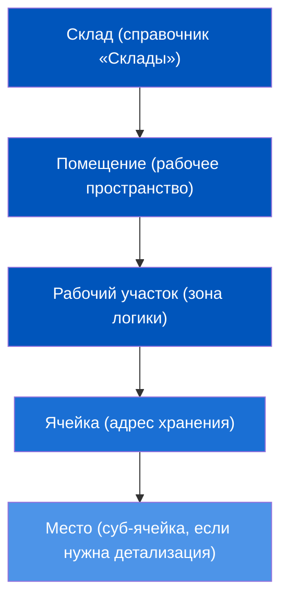
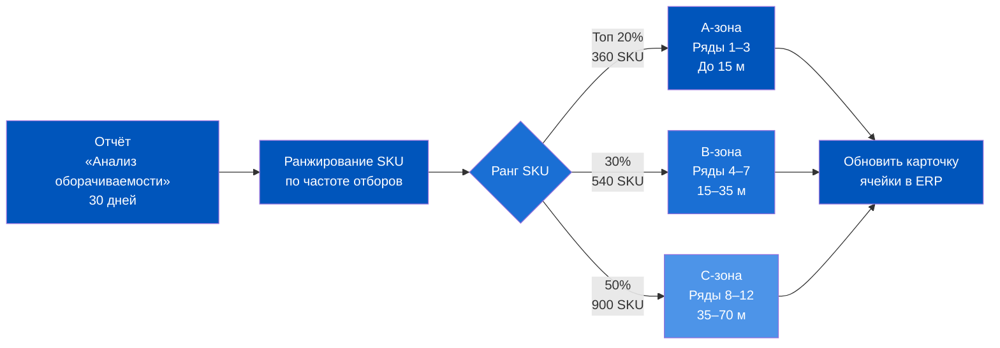
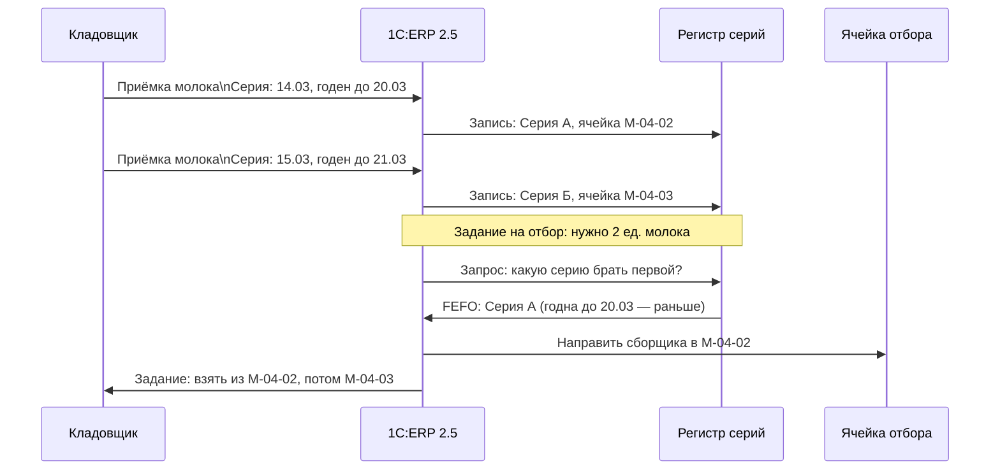
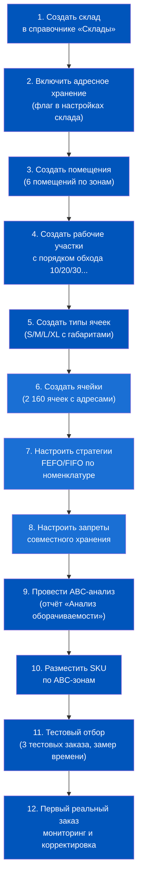
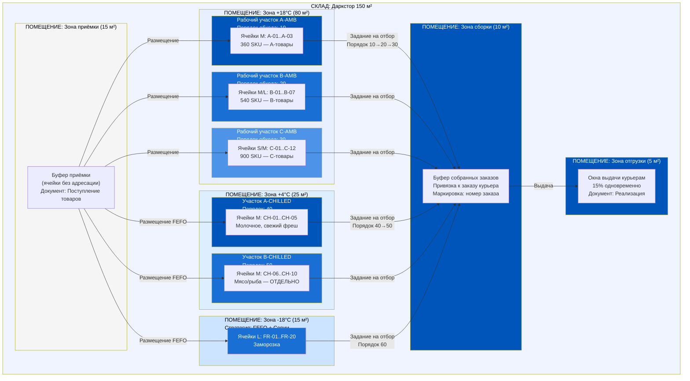

# День 6. Практикум: Проектирование топологии идеального микро-фулфилмента

> **Цель урока:** Пройти полный цикл проектирования топологии даркстора 150 м² в терминах 1C:ERP 2.5 — от разбивки зон до настройки маршрута сборки — и выйти с готовым чеклистом запуска.
>
> **Компетенции после урока:**
> — Создавать иерархическую структуру территории склада в ERP (помещения, зоны, рабочие участки, ячейки)
> — Применять ABC-анализ для размещения SKU с помощью отчёта «Анализ оборачиваемости»
> — Настраивать стратегии отбора FEFO/FIFO и ограничения совместного хранения
> — Конфигурировать порядок обхода рабочих участков в задании на отбор
> — Запускать новый даркстор по 12-шаговому чеклисту без критических ошибок
>
> **Время:** ~80 минут

---

## Оглавление

- [[#Часть 1. Постановка задачи: даркстор 150 м² с целью 4 минуты]]
- [[#Часть 2. Шаг 1 — Зонирование территории в ERP]]
- [[#Часть 3. Шаг 2 — ABC-анализ для размещения SKU]]
- [[#Часть 4. Шаг 3 — Настройка ячеек и стратегий хранения]]
- [[#Часть 5. Шаг 4 — Маршрутизация сборки]]
- [[#Часть 6. Чеклист запуска нового даркстора: 12 шагов]]
- [[#Часть 7. Итоговая схема: топологическая карта идеального даркстора]]

---

## Часть 1. Постановка задачи: даркстор 150 м² с целью 4 минуты

Вам дали ключи от нового даркстора. Буквально. Пустое помещение 150 м², стеллажи ещё не расставлены, в ERP нет ни одной ячейки. Через 3 недели — первый заказ.

Задача звучит так: 95% заказов должны собираться за 4 минуты. Не за 8 минут — как сейчас работает ваш ближайший конкурент. Именно за 4. Это не маркетинговая цифра, это операционный договор с курьером, который стоит у входа и ждёт.

Разберём параметры задачи, потому что каждый из них напрямую влияет на то, как мы будем проектировать структуру в ERP.

**Параметры объекта:**

| Параметр | Значение | Следствие для ERP |
|---|---|---|
| Площадь склада | 150 м² | 3 температурные зоны + зоны приёмки/сборки/отгрузки в одном помещении |
| Активных SKU | 1 800 позиций | Минимум 1 800 ячеек хранения + буфер для сезонных позиций |
| Целевое время сборки | 4 минуты | Маршрут отбора не должен превышать 220–240 метров пути сборщика |
| Заказов ≤ 8 позиций | 80% от потока | Стандартное задание на отбор: 1 проход по маршруту |
| Пиковая загрузка курьеров | 15% одновременно | Зона отгрузки рассчитывается на 15% от среднечасового трафика |
| Цель выполнения | 95% заказов в срок | Буферный запас времени 48 секунд на непредвиденные ситуации |

Главное противоречие этой задачи: 1 800 SKU в 150 м² — это плотность, которая убивает скорость, если расставить товары наугад. Среднестатистический сборщик проходит 1,2 метра в секунду. Если A-товары (те, что входят в 80% заказов) стоят на дальних стеллажах — каждый лишний метр пути стоит секунду. 20 лишних метров = 17 секунд на заказ = при 300 заказах в день потеряно 85 минут рабочего времени.

Именно поэтому проектирование топологии — это не «красивая схема на бумаге». Это математический расчёт, который потом нужно закрепить в справочниках ERP так, чтобы система сама вела сборщика по оптимальному маршруту.

---

## Часть 2. Шаг 1 — Зонирование территории в ERP

Физический склад и его цифровой двойник в ERP — это две разные реальности, которые должны совпадать до миллиметра. Начнём с того, как устроена иерархия объектов в 1C:ERP 2.5.

### Иерархия объектов склада в ERP 2.5

В системе существует четырёхуровневая вложенность:

**Склад** — верхний уровень. В нашем случае это один объект: «Даркстор Центральный» (или по адресу). Именно к нему будут привязаны все документы движения товаров.

**Помещение** — физически обособленное пространство внутри склада. Температурные зоны — это разные помещения в ERP, даже если между ними нет капитальной стены. Разделение на уровне помещений важно потому, что ERP может ограничивать хранение определённой номенклатуры в конкретном помещении.

**Рабочий участок** — логическая группа ячеек внутри помещения. Именно рабочий участок определяет порядок обхода при сборке и отвечает за маршрутизацию задания на отбор.

**Ячейка** — минимальная единица адресации. У каждой ячейки есть: адрес (например, «А-01-03» = стеллаж А, полка 01, позиция 03), **тип** (официальные значения в ERP 2.5: Хранение, Приёмка, Отгрузка, Архив), размерный класс (S/M/L/XL под габариты товара) и настройки порядка обхода.

### Создание структуры даркстора 150 м²

Для нашего даркстора проектируем следующую структуру:

| Уровень | Объект | Количество | Назначение |
|---|---|---|---|
| Помещение | Зона хранения +18°C | 1 | Бакалея, напитки, непродовольственные товары |
| Помещение | Зона хранения +4°C | 1 | Молочное, мясо, готовая еда |
| Помещение | Зона хранения -18°C | 1 | Заморозка |
| Помещение | Зона приёмки | 1 | Временное хранение до размещения |
| Помещение | Зона сборки | 1 | Буфер собранных заказов |
| Помещение | Зона отгрузки | 1 | Передача курьерам |
| Рабочий участок | Участки внутри хранения | 9 | ABC-зоны по каждой температурной зоне |
| Ячейка | Адресные ячейки | 2 160 | 1 800 SKU + 20% буфер |

В ERP путь создания: **Склад и доставка → Склады → [выбрать склад] → Помещения → Создать**.

Для каждого помещения обязательно указываем:
- Тип температурного режима (через дополнительный реквизит или через ограничение номенклатуры)
- Признак «Адресное хранение: Да»
- Стратегию размещения по умолчанию

### Критическая ошибка при зонировании

Начинающие внедренцы часто создают один склад с одним помещением и 1 800 ячеек без рабочих участков. Это работает — пока не нужна маршрутизация. Без рабочих участков ERP не может упорядочить задание на отбор. Сборщик получает список из 8 позиций в случайном порядке и бегает по складу хаотично. При 150 м² разница между оптимальным и хаотичным маршрутом — около 3 минут на заказ. Именно те 3 минуты, которые отделяют 4-минутный стандарт от 7-минутного провала.

---

## Часть 3. Шаг 2 — ABC-анализ для размещения SKU

Физическая топология без данных — это угадывание. Данные без системы размещения — это потерянные метрики. ABC-анализ — это мост между аналитикой и конфигурацией ячеек.

### Логика ABC в контексте Q-commerce

Классическое правило: A-товары — 20% SKU, генерирующие 80% заказов (не выручки — именно заказов по частоте включения). B-товары — 30% SKU, входящие в 15% заказов. C-товары — оставшиеся 50% SKU.

Применительно к нашему даркстору (1 800 SKU):

| Категория | SKU | Доля в заказах | Целевая зона | Расстояние от зоны сборки |
|---|---|---|---|---|
| A-товары | 360 SKU | 80% заказов | Ближние ячейки (ряды 1–3) | До 15 метров |
| B-товары | 540 SKU | 15% заказов | Средние ряды (4–7) | 15–35 метров |
| C-товары | 900 SKU | 5% заказов | Дальние стеллажи (8–12) | 35–70 метров |

Ключевой нюанс: для Q-commerce «вес» товара в ABC — это частота вхождения в заказ, а не выручка. Молоко 3,2% по 60 рублей входит в каждый второй заказ и должно лежать в A-зоне. Дорогой корм для кошек за 800 рублей покупают раз в неделю — он в C-зоне, даже если его маржа выше.

### Как использовать отчёт «Анализ оборачиваемости» в ERP 2.5

Путь в системе: **Склад и доставка → Отчёты → Анализ оборачиваемости**.

Настройка отчёта для ABC-анализа:

1. **Период:** последние 30 рабочих дней (не календарных, иначе праздники исказят данные)
2. **Группировка:** По номенклатуре + По складу
3. **Показатели:** Количество движений (не сумму оборота), Среднедневное количество отборов
4. **Сортировка:** По убыванию частоты отборов

Результат — таблица, где каждый SKU получает ранг по частоте включения в задания на отбор. Первые 360 позиций — это ваши A-товары. Задача: перенести их в ближние ячейки.

### Динамика ABC: когда пересматривать

Ассортимент даркстора живой. Новинки запускаются каждые 2 недели, сезонные пики смещают распределение. Рекомендуемая частота пересмотра ABC:

- **Еженедельно:** проверять топ-20 позиций по отборам (автоматический отчёт)
- **Ежемесячно:** полный пересчёт ABC и физическое перемещение товаров (плановая работа кладовщика)
- **По событию:** при вводе нового SKU с прогнозом высокого спроса — сразу размещать в A-зоне

Физическое перемещение товаров при пересмотре ABC в ERP оформляется документом **«Перемещение товаров»** с указанием ячеек-источников и ячеек-получателей. Документ не влияет на финансовый учёт (товар остаётся на том же складе), но меняет данные в регистре адресного хранения.

---

## Часть 4. Шаг 3 — Настройка ячеек и стратегий хранения

Теперь переходим от стратегии к тактике. Ячейка в ERP — это не просто адрес. Это объект с набором атрибутов, которые управляют поведением системы при размещении и отборе.

### Размерные классы ячеек

Один из главных источников ошибок при запуске: все ячейки создают одинакового размера. В результате бутылка оливкового масла (600 мл, 0.4 кг) и упаковка воды 6×1.5 л (9 кг) попадают в одну стандартную ячейку. ERP не предупреждает о перегрузке, товар физически не помещается, кладовщик выкладывает воду на пол — и адресный учёт рассыпается.

Для даркстора 150 м² рекомендуется 4 размерных класса:

| Класс | Габариты ячейки (ДxШxВ) | Типичные товары | Количество |
|---|---|---|---|
| S | 30×30×30 см | Специи, небольшая упаковка, снеки | 480 ячеек |
| M | 60×40×40 см | Молочные продукты, напитки до 2 л, консервы | 720 ячеек |
| L | 80×60×60 см | Вода 6-пак, крупная бытовая химия, объёмные снеки | 360 ячеек |
| XL | Паллетное место | Приёмочный буфер, сезонный сток | 24 места |

В ERP 2.5 размерный класс задаётся через **«Тип ячейки»** — справочник, где указываются максимальный вес (кг) и максимальный объём (литры или куб. метры). При попытке разместить товар, превышающий параметры, система выдаёт предупреждение.

### Стратегия FEFO для фреша

FEFO (First Expired — First Out) — отбирать первым то, у чего раньше истекает срок годности. Это критически важно для молочных продуктов, мяса, готовой еды: просрочка в даркстор — это не просто списание, это жалоба, штраф, репутационный ущерб.

В ERP 2.5 FEFO работает через серии номенклатуры. Серия — это партия товара с конкретной датой производства и сроком годности.

Настройка FEFO в ERP: **Карточка номенклатуры → Хранение → Стратегия отбора → FEFO**. Обязательное условие: в настройках склада должен быть включён учёт по сериям (иначе ERP не знает, у какой партии какой срок годности).

### Стратегия FIFO для бакалеи

Для товаров с длительным сроком хранения (бакалея, консервы, напитки) применяется FIFO (First In — First Out): то, что поступило раньше, отбирается первым. Цель та же — ротация остатков — но механизм проще: не через серии с датой годности, а через дату поступления партии.

Настройка: **Карточка номенклатуры → Хранение → Стратегия отбора → FIFO**.

### Запреты совместного хранения

В ERP 2.5 можно задать **«Условия хранения»** — правила несовместимости между группами номенклатуры. Для даркстора критически важны два запрета:

**Запрет 1: Бытовая химия + Продукты питания**
Законодательное требование (СанПиН) и здравый смысл. Хлорсодержащие чистящие средства рядом с молочными продуктами — это запах, который клиент почувствует дома.

Настройка: создаём две группы несовместимости: «Продукты питания» и «Бытовая химия». ERP не позволит разместить товары из разных групп в одном помещении или на одном рабочем участке (в зависимости от настройки уровня запрета).

**Запрет 2: Сырые продукты + Готовая еда**
В зоне +4°C сырое мясо и готовые салаты должны быть на разных рабочих участках. В ERP это задаётся через условие хранения на уровне рабочего участка, а не всего помещения.

---

## Часть 5. Шаг 4 — Маршрутизация сборки

Это финальный и самый недооценённый шаг. Можно правильно расставить товары по ABC-зонам, корректно настроить FEFO и FIFO — и всё равно получить 8-минутную сборку вместо 4-минутной. Причина: задание на отбор выдаёт позиции в случайном порядке, и сборщик мечется по складу, возвращаясь в одни и те же ряды несколько раз.

### Принцип маршрутизации в ERP 2.5

В 1C:ERP 2.5 порядок позиций в задании на отбор определяется **порядком обхода рабочих участков**. Это числовое поле в карточке рабочего участка: участок с порядком «10» сборщик посещает раньше, чем участок с порядком «20».

Сборщик движется по S-образному маршруту (snake route) — классическая топология для узких стеллажных рядов:

### Математика экономии времени

Разберём, как порядок обхода участков превращает 8 минут в 4 минуты.

**Сценарий «до» (без маршрутизации):**
Заказ из 8 позиций. Позиции разбросаны случайно по заданию. Сборщик проходит: зона B → зона A → зона C → зона A → зона B. Итого: 5 переходов между зонами, ~420 метров пути, 8,2 минуты.

**Сценарий «после» (с маршрутизацией):**
Тот же заказ из 8 позиций. ERP выстраивает позиции в порядке 10→20→30→40→50→60. Сборщик проходит одной волной от A к C. Итого: 1 сквозной проход, ~195 метров, 3,9 минуты.

| Метрика | До маршрутизации | После маршрутизации | Экономия |
|---|---|---|---|
| Среднее расстояние на заказ | 420 м | 195 м | 54% |
| Время сборки (8 позиций) | 8,2 мин | 3,9 мин | 4,3 мин |
| Заказов за смену (8 часов) | ~55 | ~110 | +100% |
| Выполнение цели 95% × 4 мин | Нет | Да | — |

### Настройка порядка обхода в ERP

Путь: **Склад и доставка → Склады → [выбрать склад] → Рабочие участки → Поле «Порядок обхода»**.

Важно: порядок обхода задаётся целым числом с шагом 10 (10, 20, 30...). Шаг 10 позволяет вставлять новые участки между существующими без перенумерации всего списка. Если задать шаг 1 (1, 2, 3...), при добавлении нового участка между первым и вторым придётся переписывать все последующие номера — рутинная работа, которой можно избежать.

**Дополнительная настройка — «Стратегия обхода рядов»:** для стеллажных рядов с двусторонним доступом применяется стратегия «S-образный обход» (snake). Для рядов с односторонним доступом — «Линейный». Выбор стратегии влияет на порядок ячеек внутри участка, но не на порядок самих участков.

---

## Часть 6. Чеклист запуска нового даркстора: 12 шагов

Теперь собираем всё вместе в операционный чеклист. Это последовательность действий в ERP от нулевого состояния до первого принятого заказа. Каждый шаг — это конкретный объект или настройка в системе.

### Разбор каждого шага

**Шаг 1. Создать склад**
Путь: Склад и доставка → Настройки и справочники → Склады → Создать.
Обязательные поля: Наименование, Ответственный, Организация. Тип склада — «Оптовый» (не «Розничный» — у розничного другая логика документооборота, несовместимая с адресным хранением).

**Шаг 2. Включить адресное хранение**
Флаг «Использовать адресное хранение» в карточке склада. После включения назад дороги нет — отключить адресное хранение на работающем складе без потери данных невозможно. Убедитесь, что принято осознанное решение.

**Шаг 3. Создать помещения**
6 помещений: +18°C (основное хранение), +4°C (фреш), -18°C (заморозка), Приёмка, Сборка, Отгрузка. Для каждого помещения в поле «Ячейка» выбирается вариант использования ячеек: «Использовать для хранения остатков номенклатуры» (адресное хранение) или «Не использовать» / «Справочное размещение». Зоны приёмки и отгрузки могут работать как с адресным хранением (с ячейками-буферами), так и без точной адресации ячеек.

**Шаг 4. Создать рабочие участки с порядком обхода**
Критический шаг. Порядок обхода (10, 20, 30...) — это ДНК маршрута сборки. Ошибиться здесь = потерять минуты на каждом заказе навсегда, пока не переделаешь.

**Шаг 5. Создать типы ячеек**
4 типа (S/M/L/XL). Для каждого: максимальный вес (кг), максимальный объём (л), допустимые температурные условия.

**Шаг 6. Создать ячейки**
2 160 ячеек. На практике — не вручную. Используется обработка «Групповое создание ячеек» (Склад и доставка → Сервис → Создание ячеек): задаёте шаблон адреса, диапазоны стеллажей/полок/позиций, тип ячейки — система генерирует весь массив за несколько минут.

**Шаг 7. Настроить стратегии FEFO/FIFO**
Для каждой номенклатуры (или группы номенклатуры) в карточке товара: Склад → Стратегия отбора. Для фреша — обязательно FEFO + включить учёт по сериям.

**Шаг 8. Настроить запреты совместного хранения**
Условия хранения: Бытовая химия ≠ Продукты, Сырое мясо ≠ Готовая еда. Проверить, что запреты работают: попробовать вручную разместить несовместимые позиции в одну ячейку — система должна отказать.

**Шаг 9. Провести ABC-анализ**
Для нового склада нет исторических данных. Используем данные с ближайшего аналогичного даркстора сети. Если это первый объект — берём данные конкурентов (отраслевые бенчмарки) или прогнозы маркетинга.

**Шаг 10. Разместить SKU по ABC-зонам**
Физически расставить товары согласно ABC-карте. Одновременно в ERP создать документы «Размещение товаров» — привязать каждый SKU к конкретным ячейкам. Без этого шага адресный учёт пустой: система не знает, где что лежит.

**Шаг 11. Тестовый отбор**
Создать 3 тестовых заказа (вручную, через документ «Заказ на перемещение»): один из 3 позиций (A-товары), один из 8 позиций (A+B-товары), один из 12 позиций (A+B+C-товары). Замерить реальное время сборки. Если время превышает целевые 4 минуты — пересмотреть порядок обхода или ABC-зонирование.

**Шаг 12. Первый реальный заказ**
Мониторинг в реальном времени. Отчёт «Выполнение заданий на отбор» — сколько заданий закрыто в срок, сколько просрочено, по каким причинам. Первые 3 дня — ежедневный разбор с кладовщиком.

### Типичные ошибки при запуске

**Ошибка 1: Отсутствие ячейки приёмки как адреса**
Товар поступает на приёмку, но в ERP нет ячейки «Буфер приёмки». Система не знает, куда записать товар до его размещения. Решение: всегда создавать хотя бы одну ячейку в зоне приёмки (даже без точного адреса).

**Ошибка 2: Неправильный тип склада (Розничный вместо Оптового)**
Обнаруживается через 2–3 недели, когда выясняется, что документы движения ведут себя не так, как ожидалось. Переделка структуры на работающем складе — несколько дней потерянных данных.

**Ошибка 3: Все ячейки одного размерного класса**
Классика. Вода 6×1.5 л не помещается в стандартную ячейку, кладовщик кладёт на пол — адресный учёт ломается с первого дня.

**Ошибка 4: Порядок обхода не задан**
Система работает, но задания на отбор сортируются по умолчанию (алфавитно или по порядку добавления ячеек). Маршрут хаотичен, время сборки в 2 раза выше целевого.

**Ошибка 5: FEFO включён, но учёт по сериям выключен**
ERP не может выбрать «первым истекающий» без данных о сроках годности. Стратегия FEFO молча деградирует до FIFO (или до случайного отбора). Проверяется тестовым отбором с двумя партиями одного товара с разными датами годности.

---

## Часть 7. Итоговая схема: топологическая карта идеального даркстора

Соберём всё, что мы спроектировали, в единую модель. Это не просто красивая картинка — это архитектурный документ, который описывает, как физическое пространство 150 м² соотносится с объектами ERP 2.5.

### Полная топологическая карта в терминах ERP

### Сводные метрики топологии

| Параметр | Значение | Источник в ERP |
|---|---|---|
| Помещений | 6 | Справочник «Помещения склада» |
| Рабочих участков | 9 | Справочник «Рабочие участки» |
| Ячеек хранения | 2 160 | Справочник «Ячейки» |
| A-ячейки (топ 360 SKU) | 480 ячеек | Участки с порядком 10, 40 |
| B-ячейки (540 SKU) | 720 ячеек | Участки с порядком 20, 50 |
| C-ячейки (900 SKU) | 960 ячеек | Участки с порядком 30, 60 |
| Стратегий отбора | 2 (FEFO + FIFO) | Карточка номенклатуры |
| Запретов совместимости | 2 | Условия хранения |
| Порядков обхода | 6 уровней | Рабочие участки |
| Целевое время сборки | 4 минуты | KPI, контроль через «Выполнение заданий» |
| Выполнение цели | 95% заказов | Отчёт «Анализ выполнения отборов» |
| Шагов запуска | 12 | Чеклист данного урока |

### Что осталось за рамками этого практикума

Мы спроектировали «скелет» топологии. Три темы, которые выходят за рамки одного урока, но логически следуют из этой работы:

**Весогабаритные характеристики** (День 5, предыдущий урок): как параметры ячейки взаимодействуют с весом и объёмом конкретного товара при автоматическом размещении.

**Управление мощностью зон**: когда ячейка заполнена на 100%, ERP должна предложить альтернативу. Настройка «переполнения» и алгоритм поиска свободной ячейки — отдельная история.

**Интеграция с WMS**: при масштабировании сети выше 5–7 дарксторов встроенного адресного хранения ERP 2.5 может не хватить. Момент, когда нужно выносить WMS-функцию в отдельный модуль — тема недели о интеграциях.

---

← [[Неделя 4 - День 5 - Весогабаритные характеристики|← День 5]] | [[1c_erp_qcom/README|Оглавление]] | [[Неделя 4 - День 7 - История Ozon Express|День 7 →]]
