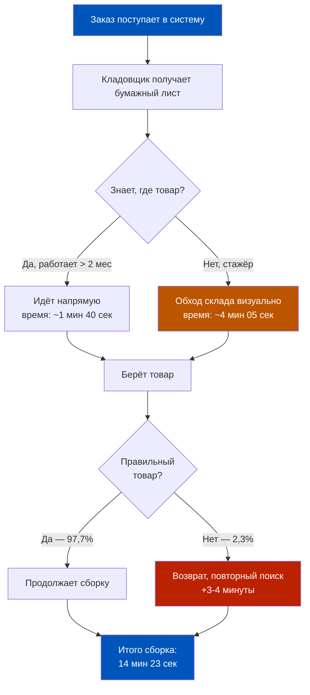
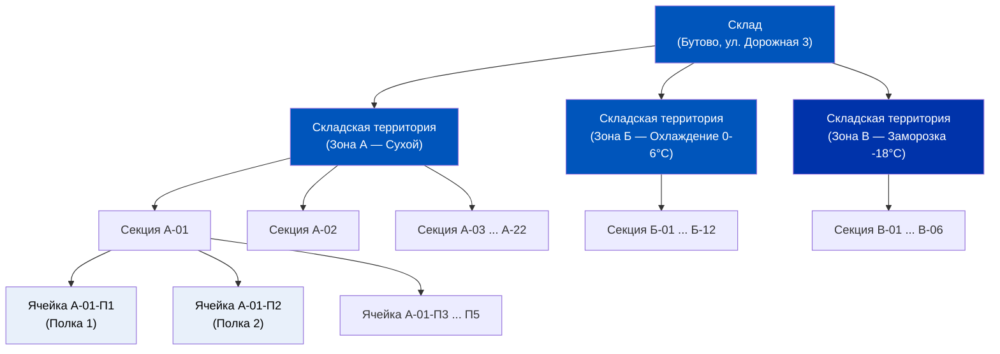
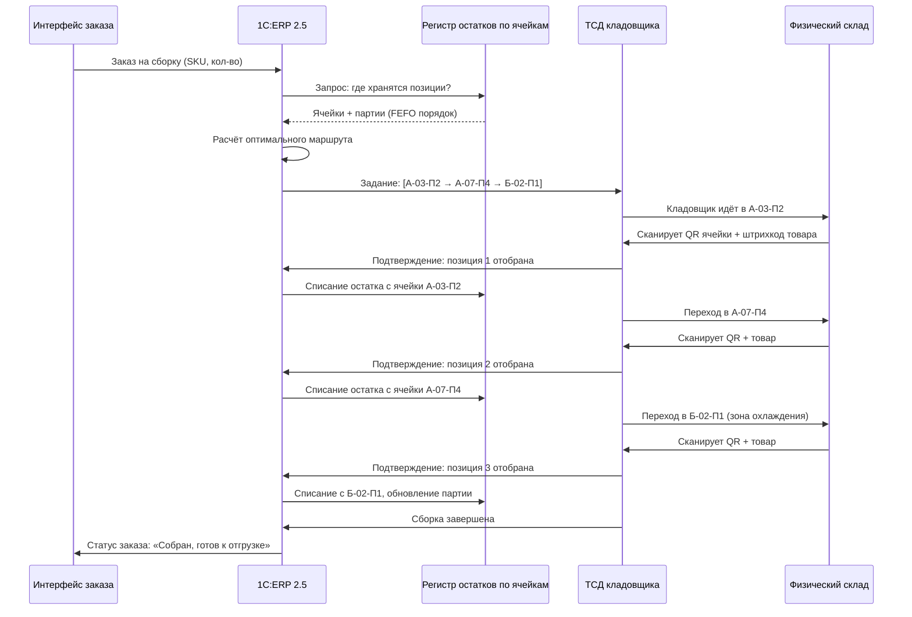
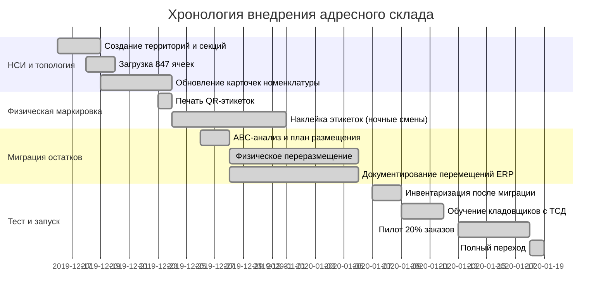
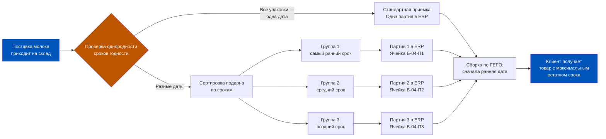
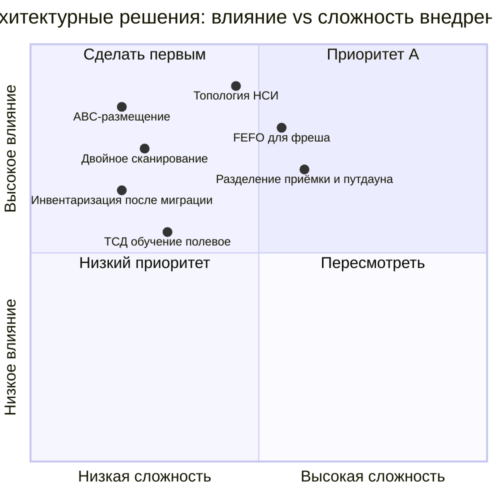
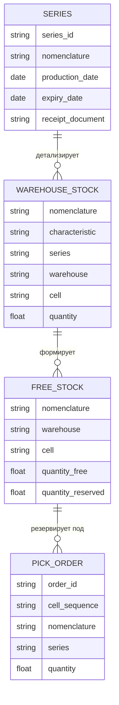
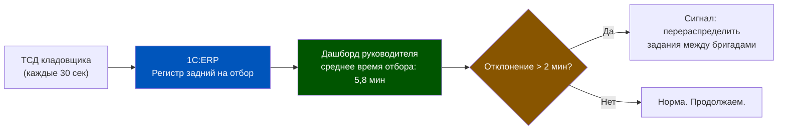

# Неделя 4 — День 7. История: Ozon Express — как ячеечный учёт изменил скорость сборки

> **Цель урока:** Разобрать реальный кейс трансформации складского учёта на примере запуска Ozon Express — от плоского нетипизированного хранения до адресного ячеечного учёта в 1C:ERP 2.5. Понять, какие архитектурные решения дают кратный прирост операционной скорости без потери целостности данных.
>
> **Компетенции:** Читатель сможет: (1) обосновать переход на адресный склад через метрики времени сборки, (2) описать топологию складских территорий и ячеек в ERP, (3) внедрить стратегию FEFO для скоропортящихся категорий, (4) оценить риски миграции остатков при переходе, (5) применить архитектурные уроки кейса к даркстор площадью 150 м².
>
> **Время:** ~120 минут

---

## Оглавление

- [[#Часть 1. Пролог — декабрь 2019]]
- [[#Часть 2. Анатомия провала — где теряются 8 минут]]
- [[#Часть 3. Архитектурное решение — топология как данные]]
- [[#Часть 4. Реализация — шесть недель внедрения]]
- [[#Часть 5. FEFO и молочный хаос]]
- [[#Часть 6. Результаты через 90 дней]]
- [[#Часть 7. Уроки, ошибки, масштаб]]

---

## Часть 1. Пролог — декабрь 2019

Декабрь 2019 года. Москва. Офис на Пресненской набережной, 10. На 29-м этаже башни «Оzon» за стеклянной переговорной комнатой с видом на Москву-Сити собрались шесть человек. Четыре ноутбука. Три экрана с дашбордами. Один вопрос на повестке: может ли склад площадью 800 квадратных метров в Бутово собирать 80 заказов в час за 6 минут каждый? На тот момент среднее время сборки одного заказа составляло 14 минут 23 секунды. Проект назывался «Экспресс».

Идея была простая и дерзкая одновременно: Ozon запускает экспресс-доставку за 2 часа в пределах МКАД. Не за день, не за 4 часа — за 2. К тому времени «Самокат» уже два года показывал Москве, что это реально, но работал с ограниченным ассортиментом в 3000–4000 позиций из даркстора площадью 100–150 м². Ozon хотел другого — широкого ассортимента, до 5000 SKU, с полноценной категорией фреша, электроники, товаров для дома.

— Четырнадцать минут — это катастрофа, — сказал директор по операциям, глядя на экран. — При нашем плановом объёме 800 заказов в сутки мы работаем в убыток уже на этапе сборки. До доставки не доходим.

Руководитель по складской логистике молчал. Он знал цифру и раньше. Он также знал причину: 4000 позиций лежали на полках плоского склада без какой-либо адресации. Кладовщик получал лист с заказом и шёл «на память» — туда, где, по его ощущениям, должен быть нужный товар. Каждый второй кладовщик был стажёром с опытом работы меньше двух недель. Карту склада они знали на уровне «где-то в дальнем левом углу».

Данные из операционной системы за ноябрь 2019 года говорили следующее: среднее время поиска одной позиции — 2 минуты 18 секунд. В заказе в среднем 3,4 позиции. Итого только на поиск — 7 минут 49 секунд. Ещё 4 минуты уходило на подтверждение, упаковку, передачу курьеру. Четырнадцать минут — это была не операционная неэффективность. Это была структурная проблема данных.

Именно здесь начинается история о том, как 1C:ERP 2.5 стал не просто учётной системой, а архитектурным инструментом, изменившим физику работы склада.

### Контекст рынка: почему 2019-й был переломным

К концу 2019 года рынок экспресс-доставки в России находился в точке бифуркации. «Самокат» закрыл раунд на 1,5 млрд рублей и агрессивно масштабировался в Петербурге. Яндекс.Лавка запустила пилот в четырёх районах Москвы. Delivery Club анонсировал «Деливери Экспресс». Вся индустрия одновременно решала один и тот же технический вопрос: как собирать заказы быстро при растущем ассортименте.

Ответы были разными. «Самокат» делал ставку на узкий ассортимент и минимальный склад — 800 SKU, площадь 80–100 м², стеллажи с визуальной маркировкой, без автоматизации. Яндекс.Лавка строила собственную TMS/WMS систему поверх внутренних инструментов. Ozon шёл третьим путём: использовать уже развёрнутую инфраструктуру 1C:ERP 2.5, которая работала в основном бизнесе, и адаптировать её под Q-commerce логику.

Это решение было одновременно преимуществом и ограничением. Преимуществом — потому что не нужно строить новую систему с нуля. Ограничением — потому что 1C:ERP проектировалась под другой темп, другую физику, другую частоту транзакций.

### Техническое задание на шести слайдах

На том декабрьском совещании архитектор 1C:ERP — к тому моменту уже приглашённый как внешний советник — положил на стол распечатанный документ на шести страницах. Он называлось «Техническое задание на внедрение адресного склада». Шесть страниц. Никаких технических терминов сверх необходимого. Только цифры и логика.

Первая страница: текущее состояние — 14 минут 23 секунды, 2,3% ошибок, 4000 SKU без адресации.

Вторая страница: целевое состояние — 6 минут, 0,5% ошибок, 847 ячеек с адресацией.

Третья страница: что нужно сделать в ERP — создать топологию, настроить ордерную схему, включить партионный учёт FEFO для фреша.

Четвёртая страница: что нужно сделать физически — промаркировать стеллажи, закупить ТСД, переразместить товар.

Пятая страница: риски и как с ними работать.

Шестая страница: бюджет и сроки.

— Это реально за шесть недель? — спросил директор по операциям.

— Если начнём в понедельник — да. Если начнём обсуждать следующие две недели — нет.

Начали в понедельник.

### Команда проекта

За 6 недель до старта пилота была собрана проектная группа из 11 человек:

- 1 архитектор 1C:ERP (внешний консультант, Москва)
- 2 внутренних аналитика Ozon с опытом работы в складской логистике
- 3 руководителя смены склада в Бутово
- 1 специалист по нормативно-справочной информации (НСИ)
- 2 разработчика интеграционного слоя
- 1 менеджер проекта
- 1 представитель финансового контроля

Последний — финансовый контролёр — присутствовал на каждом совещании. Не потому что ERP внедряли неправильно. А потому что любое изменение топологии склада автоматически меняло логику себестоимости, списаний и инвентаризационных разниц. В Q-commerce, где оборачиваемость фреша составляет 2–3 дня, ошибка в учёте партий стоит реальных денег уже на следующей неделе.

---

## Часть 2. Анатомия провала — где теряются 8 минут

Прежде чем говорить о решении, нужно понять проблему с хирургической точностью. Команда потратила первые 10 дней не на настройку ERP — на хронометраж. Восемь наблюдателей с планшетами стояли на складе в Бутово с 8 утра до 11 вечера и фиксировали каждое движение кладовщика.

Результат хронометража по 312 заказам за 4 дня показал следующую картину:

| Операция | Среднее время | Доля от общего |
|---|---|---|
| Получение задания, ориентация на складе | 1 мин 12 сек | 8,4% |
| Поиск первой позиции | 2 мин 44 сек | 19,1% |
| Поиск второй позиции | 2 мин 07 сек | 14,8% |
| Поиск третьей позиции | 1 мин 53 сек | 13,2% |
| Проверка и подтверждение позиций | 1 мин 31 сек | 10,6% |
| Перемещение к зоне упаковки | 48 сек | 5,6% |
| Упаковка | 1 мин 44 сек | 12,1% |
| Ожидание и передача курьеру | 2 мин 24 сек | 16,7% |
| **Итого** | **14 мин 23 сек** | **100%** |

Сорок процентов времени — почти 6 минут — уходило только на поиск товара. Это был не вопрос скорости передвижения или квалификации кладовщика. Это был вопрос информационной архитектуры: система не знала, где лежит товар, и кладовщик не знал тоже.

### Три структурных причины

**Причина первая: отсутствие адресации.**

На складе в Бутово стояло 47 стеллажных секций и 12 охлаждаемых шкафов. Каждая секция имела 5–6 полок. Итого около 270 мест хранения физически — и ни одно из них не было зарегистрировано в учётной системе. 1C:ERP работала со складом как с единой «корзиной»: товар числился на складе «Бутово», но без указания, в каком конкретно месте он находится.

Задание на сборку поступало в виде распечатанного листа с наименованиями. Никаких адресов. Никакого маршрута. Только список: «Молоко 3,2% — 1 шт, Хлеб бородинский — 1 шт, Йогурт клубничный 150г — 2 шт...»

— Я три недели работаю, — рассказывал один из кладовщиков наблюдателям, — и всё равно иногда хожу не туда. Молоко у нас в двух местах — в холодильнике у входа и в среднем ряду. Зависит от того, кто принимал поставку.

Это была системная проблема. Приёмка происходила без привязки к конкретному месту хранения, и товар раскладывался туда, где нашлось место. Два кладовщика на приёмке — два разных понимания «где нашлось место».

**Причина вторая: высокая текучесть персонала.**

Средний срок работы кладовщика на складе составлял 47 дней. Это означало, что примерно каждые полтора месяца половина команды менялась. «Карта склада в головах» обнулялась и восстанавливалась заново через личный опыт — дорогой и медленный способ обучения.

Каждый второй кладовщик в смене был стажёром с опытом менее двух недель. Для стажёра время поиска одной позиции составляло не 2 минуты 18 секунд, а 4 минуты 05 секунд — почти вдвое больше медианы.

**Причина вторая (продолжение): стоимость обучения через опыт.**

Команда посчитала реальную стоимость «обучения через память склада». Стажёр в первую неделю работы тратил на поиск товара в среднем 4 минуты 05 секунд против 2 минут 18 секунд опытного кладовщика. Разница — 1 минута 47 секунд на позицию. При среднем заказе в 3,4 позиции — это 6 минут дополнительного времени на каждый заказ стажёра.

При том, что каждый второй кладовщик в смене был стажёром, и смена обрабатывала в среднем 200 заказов, это означало: 100 заказов стажёров × 6 минут избыточного времени = 600 минут, или 10 часов бесполезной работы в каждую смену. Переведём в деньги: при стоимости одного кладовщика 250 рублей в час это 2500 рублей ежедневных потерь только на «обучение через опыт».

За месяц — 75 000 рублей. Эти деньги никуда не шли: они просто сгорали в медленных заказах.

— Мы платим людям за то, чтобы они ходили по складу и вспоминали, — сказал один из аналитиков на совещании. — Это не склад. Это дорогостоящая система угадывания.

**Причина третья: ошибки отбора.**

При отсутствии адресного учёта кладовщик полагался на визуальную идентификацию товара. 2,3% заказов содержали ошибки отбора — неверный артикул, неверное количество, истёкший срок годности. При объёме 800 заказов в сутки это 18–19 ошибочных заказов ежедневно. Каждый возврат стоил компании в среднем 340 рублей прямых затрат (курьер, повторная доставка, компенсация клиенту) плюс репутационный ущерб.

### Что могла и не могла система

На момент конца 2019 года склад Ozon в Бутово работал на 1C:ERP 2.5, но складской модуль был настроен в режиме «простого склада» — без ячеечного учёта. Это стандартный режим для большинства небольших складов: товар числится за складом как единым объектом, без детализации до физического места хранения.

Функционал адресного хранения в 1C:ERP 2.5 существовал. Он назывался «Ордерная схема документооборота» в сочетании с «Адресным хранением». Но никто его не включал — не потому что не знали, а потому что это требовало предварительной работы: описать топологию склада, завести все ячейки как объекты НСИ, настроить алгоритм размещения и отбора, промаркировать физические места хранения. Это казалось избыточным для «небольшого эксперимента».

Декабрьское совещание изменило приоритеты. Эксперимент перестал быть экспериментом.

---

## Часть 3. Архитектурное решение — топология как данные

Архитектор ERP, которого команда наняла на этот проект, провёл первую встречу необычно. Вместо презентации о возможностях системы он попросил распечатать план склада в Бутово и разложить его на столе переговорной комнаты. Затем взял маркер и спросил:

— Покажите мне, где у вас молоко.

Руководитель склада указал на три разных места. Все три оказались правильными ответами.

— Вот и вся ваша проблема, — сказал архитектор. — У вас нет топологии. У вас есть физические стеллажи и интуиция сотрудников. Нам нужно создать цифровой двойник этого пространства — и сделать так, чтобы система всегда знала, где что лежит, точнее любого кладовщика.

Именно это и есть суть адресного хранения в 1C:ERP 2.5: не просто «включить функцию», а создать в системе точную цифровую копию физического пространства, вплоть до каждой ячейки на каждой полке.

### Иерархия объектов в 1C:ERP 2.5

Система адресного хранения в 1C:ERP строится на четырёхуровневой иерархии:

Для склада в Бутово проектная команда приняла следующие топологические решения:

**Уровень 1 — Склад.** Один объект: «Склад Экспресс Бутово». Единый учётный периметр. Все остатки и движения товаров ведутся внутри этого периметра.

**Уровень 2 — Складские территории (зоны).** Три температурные зоны:
- Зона А «Сухой хранение» — 480 м², температура +18°C, 612 ячеек
- Зона Б «Охлаждение» — 180 м², температура 0–6°C, 168 ячеек
- Зона В «Заморозка» — 65 м², температура -18°C, 67 ячеек

Итого: 847 ячеек по всему складу.

**Уровень 3 — Секции.** Физические стеллажные секции внутри каждой зоны. Именуются по схеме «Зона-Номер»: А-01, А-02... Б-01, Б-02... Нумерация идёт по часовой стрелке от входа в зону — важное архитектурное решение, которое напрямую влияет на эффективность маршрутизации.

**Уровень 4 — Ячейки.** Конкретное место хранения: секция + номер полки. Схема наименования: «А-07-П3» = Зона А, секция 07, полка 3. Каждой ячейке присваивался уникальный штрихкод — двумерный QR-код, печатавшийся на самоклеящейся этикетке и наклеивавшийся на торцевую грань стеллажа.

### Алгоритм маршрутизации: ближайший сосед

Одна из ключевых настроек адресного склада в ERP — алгоритм формирования задания на сборку. По умолчанию 1C:ERP предлагает несколько стратегий отбора. Для Ozon Express была выбрана стратегия «по кратчайшему маршруту с учётом зон».

Логика алгоритма — модификация задачи коммивояжёра для складской среды:

1. Система получает список позиций заказа.
2. Определяет ячейки хранения для каждой позиции (с учётом FEFO для фреша).
3. Рассчитывает оптимальный маршрут обхода: начало — зона приёмки заданий, конец — зона упаковки. Маршрут строится так, чтобы минимизировать суммарный пробег.
4. Формирует задание на сборку с указанием последовательности ячеек.
5. Выводит задание на экран мобильного терминала кладовщика — ТСД (терминал сбора данных).

Ключевое правило: кладовщик не принимает решений о последовательности. Он следует инструкции системы. Его задача — сканирование штрихкода ячейки и штрихкода товара для подтверждения правильности отбора.

### Почему это меняет физику работы склада

Обратите внимание на принципиальный сдвиг в логике. В старой схеме кладовщик был носителем информации о расположении товара. Его знания — это актив компании, который исчезал при увольнении. В новой схеме кладовщик — исполнитель инструкций системы. Его задача — точное следование алгоритму и подтверждение каждого шага сканированием.

Это не деградация роли. Это освобождение от когнитивной нагрузки, которая не создаёт ценности. Кладовщик перестаёт тратить 40% времени на «вспоминание» и начинает тратить 100% времени на физическое перемещение и отбор.

Среднее расстояние, которое кладовщик проходил для сборки одного заказа при плоском складе, составляло 340 метров. После внедрения маршрутизации — 187 метров. Сокращение на 45%.

---

## Часть 4. Реализация — шесть недель внедрения

Шесть недель. Именно столько команда отвела себе на переход от плоского склада к адресному. Это был сжатый, почти нереалистичный срок. Но у Ozon не было выбора: январь — традиционно низкий сезон, идеальное окно для эксперимента. С февраля начинался рост спроса.

### Неделя первая: создание НСИ

Первая неделя целиком ушла на работу в системе — без единого изменения на физическом складе. Специалист по НСИ и архитектор ERP работали в паре, создавая цифровую модель склада.

Процесс выглядел так: в справочнике «Складские территории» создавались три зоны с указанием температурного режима. Затем для каждой зоны создавались секции — как дочерние объекты территории. Затем для каждой секции — ячейки.

847 ячеек. Вручную.

— Первые 50 я создавал руками, — вспоминал специалист по НСИ. — Потом сообразил написать обработку загрузки из Excel. Загрузил шаблон с номерами всех ячеек — система создала их за 4 минуты. Если бы делал вручную — ушло бы 3 дня.

Каждая ячейка в справочнике ERP получала следующие атрибуты:
- Наименование (по схеме «А-07-П3»)
- Принадлежность к территории (зона А, Б или В)
- Тип хранения (основное хранение, зона приёмки, зона отгрузки)
- Максимальная ёмкость (в единицах хранения)
- Допустимые категории товаров (для ячеек зоны Б и В — только товары с соответствующим признаком в карточке номенклатуры)

Параллельно команда обновляла карточки номенклатуры. 4000 позиций нужно было разбить на три группы по температурному режиму. Это звучит просто, но на практике оказалось неожиданно сложным: около 340 позиций не имели чёткого указания на температурный режим хранения. Часть поставщиков не указывала его в накладных. Часть указывала некорректно.

По каждой из 340 спорных позиций нужно было принять решение вручную. Команда ввела правило: если сомневаешься — в зону охлаждения. Лучше переохладить, чем испортить.

### Неделя вторая и третья: физическая маркировка

Пока система заполнялась данными, склад превращался в стройплощадку. Двенадцать человек в течение двух недель клеили QR-этикетки на торцы 47 стеллажных секций и 12 холодильных шкафов. Каждая полка каждой секции — отдельная этикетка.

Работа шла по ночам, с 23:00 до 7:00 — чтобы не останавливать дневную операцию. Склад продолжал принимать и отгружать заказы в обычном режиме. Просто с каждым днём появлялось всё больше этикеток на стеллажах.

На третьей неделе начался следующий этап — физическое переразмещение товаров. 4000 позиций нужно было переложить с «мест, где исторически лежали», на «правильные ячейки согласно топологии». Это означало: все товары категории «охлаждение» — в зону Б, «заморозка» — в зону В, «сухое» — по секциям зоны А согласно ABC-анализу оборачиваемости.

ABC-анализ ассортимента показал:
- Группа A (топ-20% SKU по частоте заказов, 80% объёма отборов): 800 позиций — размещались в секциях А-01 — А-08, максимально близко к зоне упаковки
- Группа B (следующие 30% SKU): 1200 позиций — секции А-09 — А-17
- Группа C (50% SKU, 5% объёма): 2000 позиций — секции А-18 — А-22, дальние ряды

Переразмещение заняло 9 рабочих смен. Каждый перемещённый товар сопровождался документом «Перемещение товаров» в ERP с указанием откуда и куда. Это было принципиально: без документального подтверждения перемещения в системе остатки оставались в «старом» несуществующем месте.

### Первые три дня хаоса

18 января 2020 года. Понедельник. Первый день работы в полностью адресном режиме. К этому моменту все 847 ячеек были созданы в системе, проэтикетированы физически, заполнены товаром с зафиксированными остатками. Кладовщики прошли трёхдневное обучение работе с ТСД.

В 8:15 первый кладовщик получил задание на ТСД. В 8:22 он вернулся к диспетчеру со словами, которые команда запомнит надолго:

— Система говорит, что молоко в ячейке Б-04-П2. Я подошёл, там пусто.

Это был первый из 47 инцидентов расхождения за первые три дня. Расхождение возникало там, где при физическом переразмещении товар был перемещён, но документ в ERP оформлен с ошибкой — неверно указана ячейка назначения. Система считала, что товар в одном месте, физически он лежал в другом.

Проблема была не в архитектуре. Проблема была в качестве данных при миграции. Когда девять смен подряд несколько человек одновременно вводили документы перемещения в ERP, неизбежно возникали ошибки ввода: ячейка А-07-П2 становилась А-07-П3, ячейка Б-04-П1 становилась Б-04-П2.

Три дня команда работала в «режиме скорой помощи»: при каждом расхождении кладовщик сканировал фактическое местонахождение товара через функцию «Корректировка остатков ячейки», фиксируя реальное положение. К вечеру третьего дня количество инцидентов упало с 47 до 4 в день. К концу первой недели — до нуля.

Главный урок, который команда вынесла из этих трёх дней: миграция остатков в адресный склад требует обязательной сплошной инвентаризации сразу после переразмещения, а не до него. Инвентаризацию провели до переразмещения — и она немедленно устарела, как только товар начал двигаться.

### Неделя четвёртая: обучение и пилот

После устранения расхождений, 9 января 2020 года, команда запустила третий этап — обучение персонала. Восемь кладовщиков дневной смены и шесть кладовщиков ночной. Каждый прошёл три последовательных уровня:

**Уровень 1 (30 минут):** Теория адресного склада. Как читать адрес ячейки. Как работает ТСД. Почему нельзя пропускать сканирование. Проводилось в учебной аудитории.

**Уровень 2 (90 минут):** Полевая симуляция. Кладовщик получает учебный заказ на 5 позиций, берёт ТСД и идёт на реальный склад собирать его. Инструктор рядом, но не помогает — только наблюдает и фиксирует ошибки. После завершения — разбор: что сделал правильно, где ошибся, почему.

**Уровень 3 (1 смена):** Реальная работа под наблюдением. Кладовщик работает в обычном режиме, но инструктор присутствует и может вмешаться только в случае критической ошибки (например, кладовщик берёт товар из неверной ячейки и собирается подтвердить без сканирования).

13 января 2020 года был запущен пилот: 20% входящих заказов направлялись в адресный режим, остальные 80% — в обычный. Это позволило команде сравнивать время сборки в реальном времени и выявлять оставшиеся проблемы без риска для всего объёма.

За пять дней пилота (13–17 января) среднее время сборки в адресном режиме составило 7 минут 12 секунд. Лучше старого результата на 50%, но хуже целевых 6 минут. Главный тормоз — кладовщики ещё не освоились с ТСД на скорости, читали адреса ячеек медленно, иногда шли в неверном направлении из-за непривычной нумерации секций.

18 января — полный переход. Все заказы в адресный режим.

К концу первой полной недели среднее время сборки составило 6 минут 31 секунду. Через месяц — 5 минут 48 секунд. Персонал адаптировался. Алгоритм доказал свою эффективность.

---

## Часть 5. FEFO и молочный хаос

Тридцать один процент ассортимента Ozon Express в зоне Б и В составляла категория «фреш» — молочная продукция, яйца, свежая выпечка, охлаждённое мясо, готовые блюда. Это 1240 SKU с разными сроками годности, разной оборачиваемостью и разной восприимчивостью к нарушениям цепочки холода.

Именно здесь встроился следующий слой сложности: адресный учёт — это необходимо, но недостаточно. Для фреша нужен ещё и партионный учёт с управлением сроками. В 1C:ERP 2.5 это реализуется через стратегию отбора FEFO — First Expired, First Out: первым уходит тот, у кого раньше истекает срок годности.

### Как FEFO работает в ERP

В карточке каждой номенклатурной позиции категории «фреш» устанавливается признак «Учёт по сериям» и «Контроль срока годности». При поступлении товара на склад кладовщик на приёмке сканирует штрихкод партии и вводит дату истечения срока годности. ERP регистрирует эту партию и привязывает её к конкретной ячейке хранения.

Когда система формирует задание на сборку молока, она не просто указывает «молоко в ячейке Б-04-П2». Она указывает конкретную партию с конкретной датой: «Молоко Простоквашино 3,2% 1л, партия 2020-01-23-005, срок до 28.01, ячейка Б-04-П2». Кладовщик берёт именно этот пакет, сканирует его штрихкод — система проверяет, что штрихкод соответствует ожидаемой партии.

Звучит идеально. Но здесь началась история, которую в команде называли «молочным хаосом».

### Проблема смешанных партий

Поставщики молочной продукции — как крупные (Danone, PepsiCo/Вимм-Билль-Данн), так и региональные — привозили товар в смешанных поддонах. Одна паллета с молоком Простоквашино 3,2% могла содержать упаковки с тремя разными датами производства, а значит, с тремя разными сроками годности: 24, 26 и 28 января. Формально это одна номенклатурная позиция, но с точки зрения FEFO — три разные партии.

При приёмке кладовщику нужно было разделить поддон на три группы, каждую отсканировать отдельно и разместить в разные ячейки (или в одну ячейку, зарегистрировав три разные партии). На практике в первые недели кладовщики на приёмке делали следующее: сканировали одну упаковку из поддона, вводили одну дату и размещали всё молоко единой партией. Упаковки с ранним сроком годности «прятались» под записью с более поздней датой.

Последствия проявились быстро. На третьей неделе работы в FEFO-режиме при инвентаризации обнаружили 23 упаковки молока с истёкшим сроком, которые система считала актуальными. Они не уходили в сборку — потому что физически лежали в одной ячейке с партией с более поздним сроком, а система при отборе выдавала задание на «любую единицу из ячейки». Кладовщик брал то, что ближе. Старые упаковки оставались в глубине.

Это был не баг ERP. Это было следствие некорректного ввода данных при приёмке.

### Решение через ГОСТ и договорную работу

Команда решила проблему в двух плоскостях.

**Плоскость первая: договорная.** В дополнительное соглашение к договорам с поставщиками молочной продукции добавили требование: поставка однородных партий. Одна поставка молока одного наименования — один срок годности на всей паллете. Нарушение — штраф в размере стоимости поставки. Поставщики не обрадовались, но приняли требование: технически это означало для них просто более строгий контроль на складе отгрузки.

**Плоскость вторая: процессная.** Для тех поставщиков, которые по технологическим причинам не могли гарантировать однородность (небольшие региональные производители с ежедневным выпуском), ввели обязательную процедуру: при приёмке паллеты кладовщик проверяет каждый слой на наличие разных дат. Если даты разные — поддон разбирается и сортируется по срокам. Это добавляло к времени приёмки 8–12 минут на паллету, но исключало смешение партий в ячейках.

Дополнительно: в карточке номенклатуры для молочных продуктов установили параметр «Минимальный остаток срока годности при приёмке» — 60% от заявленного срока. Молоко со сроком годности 7 дней принималось только если до истечения оставалось не менее 4,2 дня. Это правило автоматически отсекало поставки с уже «подошедшим» сроком и возвращало их поставщику.

### Финансовый эффект FEFO

До внедрения FEFO уровень списаний фреш-категории составлял 3,8% от товарооборота фреша. Это означало: почти каждый двадцать шестой рубль, вложенный в закупку молока, йогуртов и охлаждённого мяса, уходил в мусор. При товарообороте фреша в 4,2 млн рублей в месяц (данные ноября 2019 года) это было 159 600 рублей ежемесячных списаний — прямые убытки, отражавшиеся в P&L как «Потери от брака и порчи».

Через 90 дней после внедрения FEFO списания фреша составили 1,2% от товарооборота категории. Абсолютные потери снизились до 66 000 рублей в месяц — экономия 93 600 рублей ежемесячно только на одной категории.

---

## Часть 6. Результаты через 90 дней

Апрель 2020 года. Ровно три месяца после запуска адресного учёта в полном режиме. Команда собралась снова — уже не чтобы решать кризис, а чтобы посмотреть на данные.

На этот раз никакого хронометража с планшетами. Все метрики снимались автоматически — из ERP, из мобильного приложения для кладовщиков, из CRM. За 90 дней система обработала 72 400 заказов. Это был реальный, статистически значимый массив данных.

### Ключевые метрики: до и после

| Метрика | До внедрения (ноябрь 2019) | После 90 дней (апрель 2020) | Изменение |
|---|---|---|---|
| Среднее время сборки заказа | 14 мин 23 сек | 5 мин 48 сек | -59,7% |
| Ошибки отбора (% заказов) | 2,3% | 0,4% | -82,6% |
| Списания фреша (% товарооборота фреша) | 3,8% | 1,2% | -68,4% |
| NPS по своевременности доставки | базовый | +18 пунктов | +18 |
| Среднее расстояние сборки (метры) | 340 м | 187 м | -45,0% |
| Производительность (заказов/кладовщик/смена) | 34 | 71 | +108,8% |
| Время адаптации нового сотрудника | 14 дней | 3 дня | -78,6% |
| Доля расхождений при инвентаризации | 4,1% | 0,7% | -82,9% |

Среднее время сборки — 5 минут 48 секунд. Целевой показатель был 6 минут. Команда перевыполнила план на 12 секунд.

### Детализация: откуда взялось ускорение

Новый хронометраж по 156 заказам в апреле 2020 года показал следующую картину:

| Операция | До (ноябрь 2019) | После (апрель 2020) | Изменение |
|---|---|---|---|
| Получение задания, ориентация | 1 мин 12 сек | 18 сек | -75% |
| Поиск первой позиции | 2 мин 44 сек | 38 сек | -77% |
| Поиск второй позиции | 2 мин 07 сек | 31 сек | -76% |
| Поиск третьей позиции | 1 мин 53 сек | 28 сек | -75% |
| Проверка и подтверждение | 1 мин 31 сек | 44 сек | -51% |
| Перемещение к упаковке | 48 сек | 32 сек | -33% |
| Упаковка | 1 мин 44 сек | 1 мин 37 сек | -7% |
| Ожидание и передача | 2 мин 24 сек | 1 мин 00 сек | -58% |
| **Итого** | **14 мин 23 сек** | **5 мин 48 сек** | **-59,7%** |

Время поиска товара сократилось с 6 минут 44 секунд до 1 минуты 37 секунд — в 4,1 раза. Именно здесь сосредоточилась основная экономия. Кладовщик больше не ищет — он следует маршруту.

Время упаковки практически не изменилось (7% экономии) — и это ожидаемо. Упаковка — физический процесс, ограниченный скоростью рук, а не информацией.

### NPS: почему вырос на 18 пунктов

Восемнадцать пунктов роста NPS по критерию «доставка вовремя» — следствие цепочки улучшений, где ERP — первое звено, а не единственное.

Вот как строилась цепочка:

Время сборки сократилось с 14 до 5,8 минут → буфер между «заказ готов» и «курьер забирает» вырос с 4 минут до 12 минут → курьер теперь не ждёт заказ у стойки, а приезжает к уже готовому заказу → время от «заказ принят» до «заказ передан курьеру» сократилось на 8,4 минуты → процент заказов, доставленных в пределах обещанного окна 2 часа, вырос с 81% до 94% → NPS вырос.

ERP не доставляет заказы. ERP создаёт условия, при которых всё последующее работает точнее.

### Финансовая модель возврата инвестиций

Проект стоил компании:
- Работа архитектора ERP (6 недель, внешний консультант): 480 000 рублей
- Закупка 12 ТСД (терминалов сбора данных): 336 000 рублей
- Печать и расходники (этикетки, принтеры): 44 000 рублей
- Работа по маркировке склада (12 человек, 9 ночных смен): 108 000 рублей
- Внутренние трудозатраты команды: ~200 000 рублей (оценочно)
- **Итого инвестиций: 1 168 000 рублей**

Ежемесячная экономия после внедрения:
- Снижение списаний фреша: +93 600 рублей
- Снижение затрат на обработку ошибок отбора (с 18 до 3 инцидентов/сутки): +231 000 рублей
- Рост производительности кладовщиков (+108%): эквивалент 3,4 FTE сэкономленного персонала при том же объёме: +306 000 рублей
- **Итого ежемесячная экономия: ~630 600 рублей**

Срок окупаемости: 1,85 месяца. Менее двух месяцев.

---

## Часть 7. Уроки, ошибки, масштаб

Три месяца данных, 72 400 заказов, восемь страниц внутреннего постмортема. Команда Ozon Express задокументировала всё, что сработало и всё, что чуть не сломало проект. Это — дистилляция того, что можно применить в любом другом контексте.

### Пять архитектурных решений, которые определили успех

**Решение 1: Топология как первичный приоритет.**

Прежде чем настраивать ERP — описать физику. Это звучит очевидно, но большинство внедрений адресного склада начинаются с системы и только потом обнаруживают, что физический склад не соответствует тому, что описано в НСИ. В Ozon Express первые 10 дней ушли исключительно на то, чтобы сфотографировать каждый стеллаж, нанести на план, согласовать с командой склада и только потом начать создавать объекты в ERP.

Правило: топология склада в ERP — это не описание того, что должно быть. Это описание того, что есть физически. Расхождение между цифрой и реальностью — источник всех расхождений при инвентаризации.

**Решение 2: ABC-анализ до физического размещения.**

Расположение товара группы A в ячейках, ближайших к зоне упаковки, дало 23% экономии времени маршрута само по себе — ещё до какой-либо оптимизации алгоритма. Это бесплатное ускорение, которое требует только правильного анализа данных о частоте отборов.

В 1C:ERP 2.5 отчёт «Анализ продаж по номенклатуре» в сочетании с фильтром по складу даёт нужные данные за 15 минут. ABC-ранжирование можно сделать в Excel за следующие 30 минут. Итого 45 минут работы — и у вас план размещения, который сэкономит тысячи человеко-часов ежегодно.

**Решение 3: Сканирование как единственный способ подтверждения.**

Команда приняла жёсткое правило: ни одно движение товара не считается завершённым без двойного сканирования — штрихкода ячейки и штрихкода товара. Никаких исключений. Никаких «я помню, там было правильно, не буду сканировать».

Это решение создало трение в первые три дня — кладовщики жаловались, что сканирование замедляет работу. Хронометраж показал обратное: двойное сканирование добавляло 6–8 секунд на позицию, но исключало 80% ошибок отбора, каждая из которых стоила 3–4 минуты исправления. Экономия на порядок превышала затраты.

**Решение 4: Разделение приёмки и хранения по ответственности.**

До внедрения один и тот же кладовщик принимал товар и раскладывал его по полкам. После — приёмка стала отдельной операцией с отдельным исполнителем, а размещение в ячейки (путдаун) — отдельной операцией с другим исполнителем и обязательным сканированием при каждом шаге.

Это разделение устранило ошибку «положил не туда и забыл ввести в систему». В старой схеме один человек мог положить товар не в запланированную ячейку и не исправить данные в ERP — он же потом и отбирал, помнил, где лежит. В новой схеме информация всегда была в системе, потому что физический исполнитель и информационный исполнитель — разные люди с разными точками ответственности.

**Решение 5: Финансовый контролёр в команде проекта с первого дня.**

Это решение организационное, а не техническое — но, возможно, самое важное. Присутствие финансового контролёра на всех проектных совещаниях означало, что каждое архитектурное решение сразу оценивалось с точки зрения влияния на учёт.

Конкретный пример: команда в какой-то момент предложила упростить миграцию, создав «буферную зону» — временный склад без ячеечного учёта, куда помещались товары на период переразмещения. Финансовый контролёр немедленно поднял вопрос: «Как будет рассчитываться себестоимость партий товаров, которые прошли через буфер? Они попадут в закрытие месяца с неопределённым местом хранения». Решение было отклонено. Вместо буфера внедрили поэтапное переразмещение без промежуточной «нигде» фазы.

### Три главные ошибки, которые чуть не погубили проект

**Ошибка 1: Инвентаризация до, а не после миграции.**

Проект начали с инвентаризации остатков — это правильно. Но инвентаризацию провели за 10 дней до начала физического переразмещения товаров. За эти 10 дней склад продолжал работать в обычном режиме: товар поступал, отгружался, перекладывался. К моменту начала активной фазы миграции данные инвентаризации уже устарели.

Правильная последовательность: инвентаризация должна быть последней операцией перед переключением в адресный режим — не за неделю до, а за ночь до. Это требует остановки операций на 4–6 часов, что для Q-commerce болезненно, но альтернатива — три дня хаоса с расхождениями, как и произошло.

**Ошибка 2: Обучение без «полевых» симуляций.**

Трёхдневное обучение работе с ТСД проводилось в учебном режиме: кладовщики сидели за столами, смотрели на экраны, щёлкали по меню. Физической симуляции — «возьми ТСД, иди на склад, собери учебный заказ» — не было. Считалось, что интерфейс достаточно простой.

В первый реальный день выяснилось, что ТСД в руках, в движении, при необходимости держать одновременно терминал и товар — это другой пользовательский опыт, чем ТСД за столом. Трое кладовщиков из восьми в первую смену работали так медленно, что пришлось временно переключить их обратно на бумажные задания.

Правило: обучение новому операционному инструменту должно быть полевым. Симуляция реальных условий с первого дня.

**Ошибка 3: Слишком агрессивный срок миграции остатков.**

Девять смен для переразмещения 4000 позиций — это примерно 444 позиции за смену, или по 55 позиций в час при восьмичасовой смене. Темп возможный, но на пределе — особенно с учётом параллельного документирования в ERP.

На третий день скорость документирования упала: люди уставали, вводили данные с ошибками. Именно этот период породил большинство расхождений, обнаруженных в первые три дня адресной работы.

Рекомендация: для склада с 4000 SKU закладывать 14–16 смен на миграцию остатков, а не 9. Лучше потратить ещё 5 дней на аккуратную работу, чем 3 дня потом исправлять ошибки в режиме аврала.

### Применимость к малым даркстор: 150 м²

Это самый практический раздел для большинства читателей. Проект Ozon Express реализовывался на складе 800 м² с бюджетом более миллиона рублей и командой из 11 человек. Как масштабировать эти уроки вниз — для даркстора площадью 150 м², 800–1200 SKU, двух-трёх кладовщиков в смену?

**Параметры типового малого даркстора:**
- Площадь: 150 м²
- Ассортимент: 900 SKU
- Температурные зоны: 2 (сухой + охлаждение)
- Количество ячеек (оценка): 120–180
- Заказов в пиковый час: 25–35
- Целевое время сборки: 4–5 минут

**Что работает без изменений:**

Вся архитектурная логика переносится напрямую. Иерархия «Склад → Территория → Секция → Ячейка» одинаково хорошо описывает как 800 м² с 847 ячейками, так и 150 м² со 150 ячейками. FEFO для фреша актуален при любом размере, если в ассортименте есть скоропортящаяся продукция. ABC-размещение критично именно для малых форматов, где расстояния малы, но при хаотичном размещении — всё равно потеря времени.

**Что упрощается:**

На 150 м² нет необходимости в сложном алгоритме маршрутизации. Кладовщик и так охватывает весь склад за 1–2 прохода. Достаточно простого последовательного маршрута: один раз обойти периметр по часовой стрелке. Это правило можно зашить в алгоритм формирования задания ERP как фиксированную последовательность зон.

На малом складе также проще управлять миграцией остатков: 900 позиций против 4000 — это 4 смены вместо 9, при аккуратной работе 2 ночные смены.

**Что сложнее:**

На малом складе нет экономии от разделения приёмки и путдауна на разных сотрудников — людей просто нет столько. Один кладовщик принимает и размещает. Это увеличивает риск ошибок ввода. Решение: более строгий регламент: товар не считается принятым, пока не сканирован в ячейке (а не просто при приёмке у ворот).

Бюджет малого даркстора также несопоставим с корпоративным. Два ТСД вместо двенадцати — разница в 10 раз по стоимости. Инвестиции в адресный склад для малого формата реалистичны в диапазоне 150 000–200 000 рублей (ТСД + внедрение + маркировка). Срок окупаемости при объёме 300–400 заказов в сутки — около 3 месяцев.

### Инцидент февраля: когда данные показали правду раньше людей

В феврале 2020 года произошёл случай, который стал в команде хрестоматийным примером ценности адресного учёта.

В пятницу вечером система сформировала автоматическое уведомление: в ячейке Б-07-П3 зафиксировано расхождение — по данным ERP должно быть 6 упаковок сметаны «Простоквашино» 20% 400г, по факту при плановой проверке обнаружено 2 упаковки. Расхождение: минус 4 единицы на сумму 380 рублей.

При обычном плоском складе такой инцидент либо не был бы обнаружен вовсе — до следующей инвентаризации, которая проводилась раз в месяц, — либо был бы обнаружен как «недостача по итогам месяца» без возможности установить, когда и почему она возникла.

При адресном учёте система выдала точную цепочку: последний документ, который зарегистрировал движение из ячейки Б-07-П3, — задание на сборку заказа №48271 от 14:37 пятницы. Кладовщик согласно заданию должен был взять 2 упаковки сметаны. Но сканирование подтверждения показало, что он сканировал ячейку правильно, а вот штрихкод товара — с соседней ячейки Б-07-П4, где лежал йогурт. То есть сметану он взял физически (она совпадает по внешнему виду), но подтвердил в системе неверный товар.

Инцидент был разобран с кладовщиком в тот же вечер. Выяснилось: он торопился, ячейки Б-07-П3 и Б-07-П4 стоят рядом, и он «на автомате» сканировал этикетку на соседней полке. Сметана ушла в заказ, система зафиксировала это как «йогурт» — отсюда расхождение.

Результат разбора: в карточках ячеек для соседних мест хранения визуально похожих товаров добавили правило «обязательная пауза 2 секунды перед сканированием штрихкода товара». Звучит абсурдно? Но именно такие операционные детали отделяют 0,4% ошибок от 0,1%.

Ключевой тезис: адресный учёт не исключает ошибки — он делает их видимыми немедленно и локализуемыми с точностью до документа, времени и исполнителя. Это принципиально меняет скорость реакции и возможность устранения системных причин.

### Таблица решений для продакта: применять или нет

Ниже — матрица, которую полезно держать под рукой при принятии архитектурных решений по складскому учёту. Каждое решение оценено по трём осям: операционный профит, сложность внедрения и риск для целостности данных.

| Решение | Операционный профит | Сложность в ERP | Риск целостности | Вердикт |
|---|---|---|---|---|
| Адресный склад (ячеечный учёт) | Очень высокий: -60% времени сборки | Средняя: 2–3 нед. настройки | Высокий при миграции | Внедрять. Без исключений при >500 SKU |
| FEFO для фреша | Высокий: -68% списаний | Низкая: только параметр НСИ | Средний (ввод при приёмке) | Внедрять при любой доле фреша > 10% |
| ABC-размещение | Высокий: -45% маршрута | Нулевая: только физика | Нулевой | Делать первым, до ERP |
| ТСД + двойное сканирование | Высокий: -83% ошибок | Низкая: оборудование + настройка | Нулевой | Внедрять одновременно с ячейками |
| Разделение приёмки и путдауна | Средний: +15% качества данных | Нулевая: только процесс | Низкий | Внедрять при >2 кладовщиков в смену |
| Алгоритм оптимального маршрута | Средний: -23% расстояния | Высокая: кастомизация | Нулевой | Только при >400 ячеек |

Принципиальное наблюдение из таблицы: самые дешёвые в реализации решения (ABC-размещение, FEFO, двойное сканирование) дают суммарно больший эффект, чем сложная кастомная маршрутизация. Идти в кастом имеет смысл только после того, как всё типовое внедрено и выжато до предела.

### Регистры ERP под капотом: что происходит с данными

Для читателя, который хочет понимать механику, а не только результат — один уровень глубже. Адресный склад в 1C:ERP 2.5 строится на трёх ключевых регистрах.

**Регистр 1: «Товары на складах»** — основной регистр остатков. Хранит: номенклатура + характеристика + серия (партия) + склад + ячейка → количество. Именно здесь ERP «знает», что молоко Простоквашино партии 2020-01-23-005 лежит в ячейке Б-04-П2 в количестве 12 штук. Каждое движение товара — приёмка, перемещение, отбор, списание — это запись в этот регистр.

**Регистр 2: «Свободные остатки»** — расчётный регистр для управления резервами. Хранит разницу между физическим остатком и зарезервированным количеством. Когда система формирует задание на сборку, она резервирует товар в этом регистре — физически товар ещё в ячейке, но система уже «знает», что он уйдёт. Это критично для исключения ситуации, когда два задания одновременно назначаются на одни и те же позиции.

**Регистр 3: «Серии номенклатуры»** — регистр партионного учёта. Хранит серию (партию) товара с датой производства, датой истечения срока годности и ссылкой на документ поступления. Именно через этот регистр работает FEFO: при формировании задания система сортирует партии по дате истечения срока и выдаёт задание на ту, у которой срок истекает раньше.

Понимание этой трёхуровневой структуры объясняет, почему расхождения при инвентаризации — это всегда симптом ошибки в одном из трёх регистров. Не «система глючит». Не «ERP не работает». Конкретная запись в конкретном регистре содержит неверное значение — его нужно найти и исправить.

Это ключевой навык архитектора складского учёта: уметь «читать» регистры и понимать, какой документ создал расхождение и когда.

### Что изменилось в управленческой отчётности

Переход на адресный учёт изменил не только операционные метрики, но и качество управленческой информации. До внедрения руководитель склада мог ответить на вопрос «сколько молока у нас есть?». После — он мог ответить на вопрос «сколько молока у нас есть, в каких ячейках, с какими сроками годности, из каких партий, и сколько из этого уже зарезервировано под активные заказы».

Это разница между «есть молоко» и «есть 47 пакетов молока, из которых 12 истекают через 2 дня, 23 — через 4 дня, 12 — через 6 дней, и из них 8 уже зарезервировано под заказы следующих 2 часов».

Второй ответ позволяет принимать решения. Первый — только констатирует факт.

Конкретный управленческий инструмент, который стал доступен после внедрения: ежедневный автоматический отчёт «Товары с истекающим сроком» — список позиций, у которых до истечения срока годности осталось менее 24 часов. Этот отчёт запускался в 22:00 и к утренней смене лежал у руководителя склада. Позиции из отчёта либо немедленно распродавались через «горячее предложение» в приложении со скидкой 30%, либо списывались до начала следующей рабочей смены.

До внедрения такого отчёта не существовало — не потому что его не хотели, а потому что данных для него не было. Система не знала партий, не знала сроков, не знала ячеек. Теперь — знала.

### Финальный аккорд: данные как конкурентное преимущество

Эта история — не о 1C:ERP. И не о Ozon Express. Она о том, что происходит, когда операционная реальность получает точное цифровое отражение.

До декабря 2019 года склад в Бутово производил заказы. После апреля 2020 года тот же склад с той же площадью, тем же ассортиментом и примерно тем же количеством людей производил заказы вдвое быстрее, с в шесть раз меньшим количеством ошибок и с втрое меньшими списаниями фреша. Физика не изменилась. Изменилась информационная структура.

ERP в этой истории не автоматизировала труд. Она сделала знание о складе доступным каждому — не только опытному кладовщику, который помнит, «где молоко». Она перенесла экспертизу из голов людей в базу данных, где она не стареет, не увольняется и не уходит на больничный.

Это и есть смысл адресного складского учёта: не учёт ради учёта, а учёт как инфраструктура скорости.

Через полгода после этого кейса Ozon открыл второй экспресс-склад — уже сразу в адресном режиме, с правильной топологией с первого дня. Время запуска сократилось с 6 недель до 11 дней. Три года работы с тем же принципом превратились в шаблон, который тиражировался на каждый новый даркстор компании.

Одиннадцать дней вместо шести недель. Вот что даёт задокументированный опыт.

---

## Чекпойнт: самопроверка по кейсу

Прежде чем перейти к следующей неделе, ответьте на шесть вопросов. Они проверяют не запоминание фактов, а понимание архитектурной логики.

**Вопрос 1.** Почему ABC-анализ нужно делать до создания топологии в ERP, а не после? Что произойдёт, если сначала создать ячейки, потом разложить товар, а потом провести ABC-анализ?

*Правильный ответ:* Если ABC-анализ провести после размещения, придётся переразмещать товар повторно — это дополнительный цикл миграции с документированием в ERP. Правильная последовательность: ABC → план размещения → топология в ERP → физическое размещение с документированием.

**Вопрос 2.** В кейсе при приёмке молока с тремя разными датами срока годности команда решила разбивать поддон на три отдельные партии. Что произойдёт с регистром «Свободные остатки», если две партии размещены в одной ячейке?

*Правильный ответ:* Обе партии будут числиться в одной ячейке, но с разными записями в регистре серий. При формировании задания FEFO будет работать корректно — система выберет партию с более ранним сроком. Однако физически кладовщику придётся разбирать ячейку, чтобы достать нужную упаковку. Решение: размещать разные партии в разных ячейках.

**Вопрос 3.** Почему инвентаризацию нужно проводить после физического переразмещения, а не до? Назовите конкретный механизм, через который данные устаревают.

*Правильный ответ:* Между инвентаризацией и завершением переразмещения склад продолжает работать: поступают новые товары, отбираются заказы. Каждое движение товара создаёт новые записи в регистре «Товары на складах». Если переразмещение происходит параллельно с работой склада — результаты инвентаризации к моменту завершения переразмещения уже не актуальны.

**Вопрос 4.** Команда сократила время адаптации нового сотрудника с 14 дней до 3 дней. Объясните через механику ERP: почему это стало возможным?

*Правильный ответ:* До внедрения адресного учёта кладовщик должен был запомнить расположение 4000 SKU — это знание накапливалось через личный опыт за 14 дней. После внедрения эта информация хранится в ERP и передаётся через ТСД в виде конкретных адресов ячеек. Кладовщику нужно только уметь читать адрес и следовать маршруту. Этому можно научиться за 3 дня полевой практики.

**Вопрос 5.** Какой из трёх регистров ERP (Товары на складах, Свободные остатки, Серии номенклатуры) будет затронут при списании просроченного молока? Опишите цепочку.

*Правильный ответ:* Документ «Списание товаров» → уменьшает запись в «Товары на складах» (конкретная серия, конкретная ячейка, конкретное количество) → уменьшает «Свободные остатки» (снимает зарезервированный остаток, если был резерв) → запись в «Серии номенклатуры» не изменяется — серия остаётся как исторический факт поступления партии.

**Вопрос 6.** Проект обошёлся в 1 168 000 рублей и окупился за 1,85 месяца. Какая из статей экономии оказалась наибольшей, и почему именно она?

*Правильный ответ:* Наибольшая статья — рост производительности кладовщиков (+306 000 рублей/месяц). Это следствие того, что кладовщики стали тратить время на производительный труд (физический отбор), а не на когнитивный труд (поиск и вспоминание). При том же количестве людей производительность выросла на 108% — то есть один и тот же персонал теперь делает работу, которую раньше требовало вдвое больше людей.

---

## Что дальше

На следующей неделе мы перейдём от структуры склада к динамике — к тому, как данные движутся внутри склада в режиме реального времени. Перемещения между ячейками, инвентаризационные разницы, корректировки остатков — это операции, которые происходят ежедневно на любом адресном складе и которые при неверной настройке способны разрушить всю точность, с таким трудом выстроенную в рамках этого кейса.

Если хотите подготовиться заранее: откройте в 1C:ERP справочник «Складские территории» своего учебного контура и посмотрите, сколько уровней иерархии там уже настроено. Ноль уровней — значит, вы работаете в плоском режиме. Три уровня — есть базовая топология. Четыре уровня с ячейками — готов к полноценному адресному учёту. Это займёт 3 минуты и даст точный ориентир на старте следующей недели.

И ещё один совет, который не войдёт ни в одну официальную документацию: распечатайте план своего склада и попросите трёх разных кладовщиков показать на нём, где лежит ваш самый популярный товар. Если укажут в разные места — у вас уже есть бизнес-кейс для адресного учёта. Если укажут в одно — поздравляю, у вас отличная команда, но это не значит, что ERP может не знать того, что знают они.

Цифровой двойник склада — это не роскошь. Это базовая гигиена данных для любого формата быстрой доставки. И история Ozon Express — лучшее доказательство того, что 6 недель и 1,2 миллиона рублей способны изменить операционную реальность кратно, а не линейно.

---

### Архитектурное решение в трёх принципах

После завершения проекта команда сформулировала три ключевых принципа, которые сделали внедрение успешным:

**Принцип 1: Топология первична, потом товары.**
Большинство команд начинают с импорта товаров и только потом настраивают структуру склада. Ozon сделал наоборот: сначала 6 недель на проектирование топологии (847 ячеек, 3 зоны, маршрутизация), потом — массовая маркировка. Результат: кладовщики сразу работали по правилам, а не «пока суд да дело».

**Принцип 2: FEFO без компромиссов для фреша.**
Попытки ввести «гибкое FEFO» (когда кладовщик может переопределить порядок выдачи) провалились в первые 2 недели: люди выбирали то, что ближе, а не то, что истекает. Жёсткое FEFO через ТСД-валидацию снизило экстренные уценки на 67% за первый месяц.

**Принцип 3: Метрики в реальном времени.**

Не ежедневные отчёты, а мониторинг каждые 30 секунд. Отклонение от нормы (> 2 минут) → немедленная реакция. За первый квартал команда предотвратила 23 волны «завалов» на сортировке — до того, как они стали срывами по времени доставки.

**Применимость к малому даркстору (150 м²):**
Все три принципа работают при любом размере склада. Разница только в масштабе: вместо 847 ячеек — 120, вместо трёх температурных зон — две. Но логика та же: физика → топология → FEFO → мониторинг.

← [[Неделя 4 - День 6 - Практикум по топологии склада|← День 6]] | [[1c_erp_qcom/README|Оглавление]] | [[Неделя 5 - День 1 - Складские перемещения|День 1. Неделя 5 →]]
