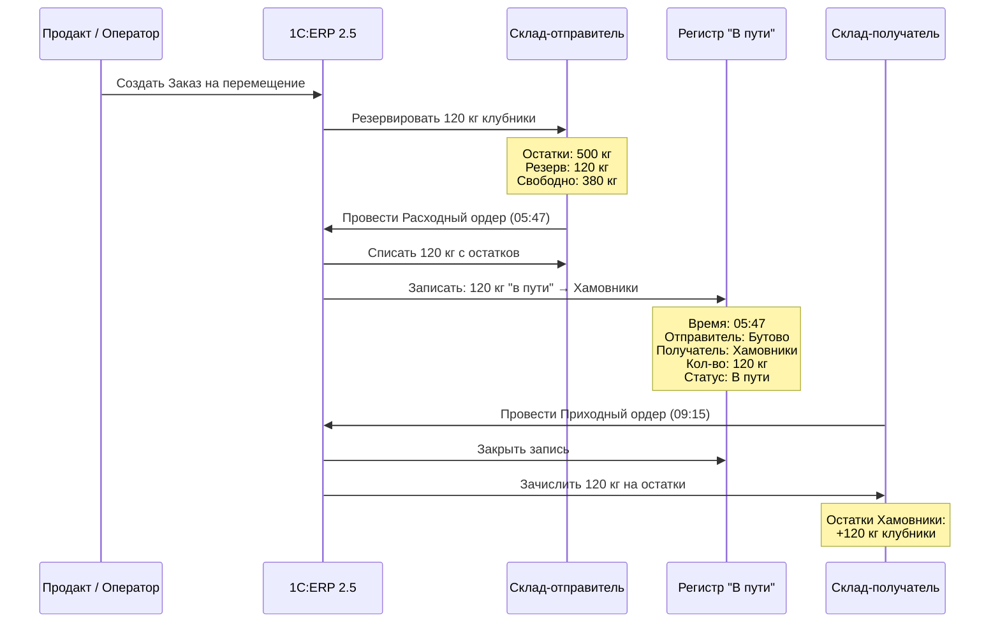
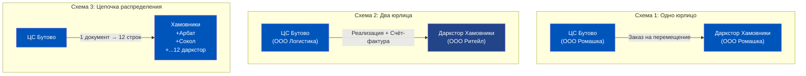
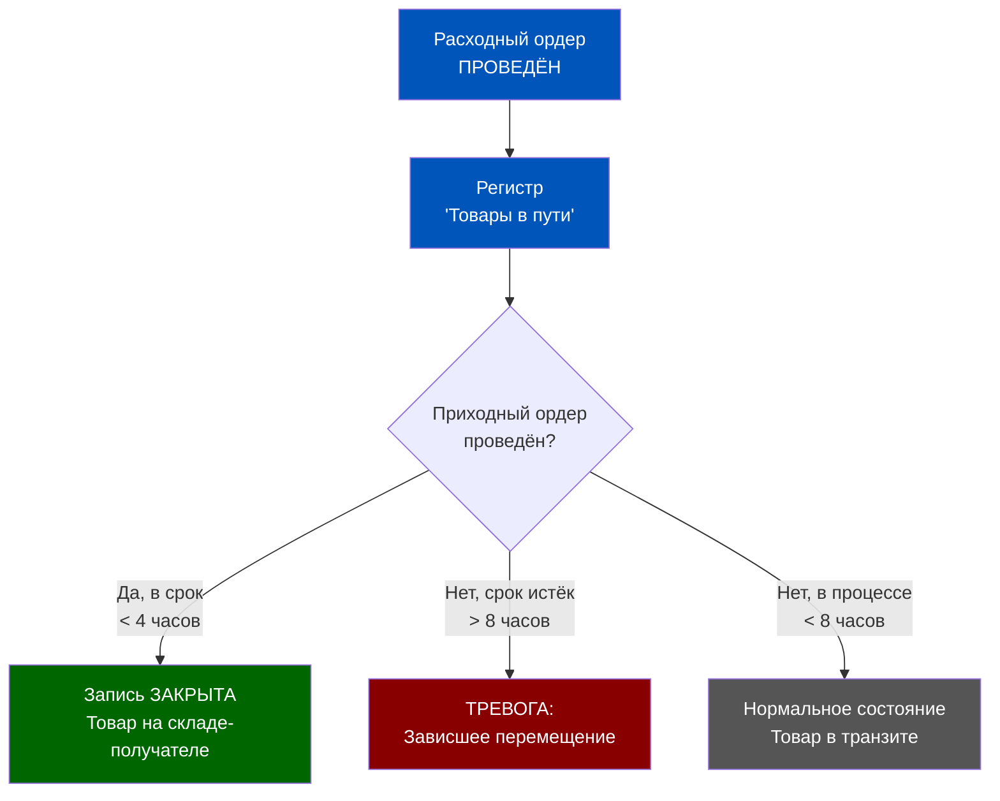
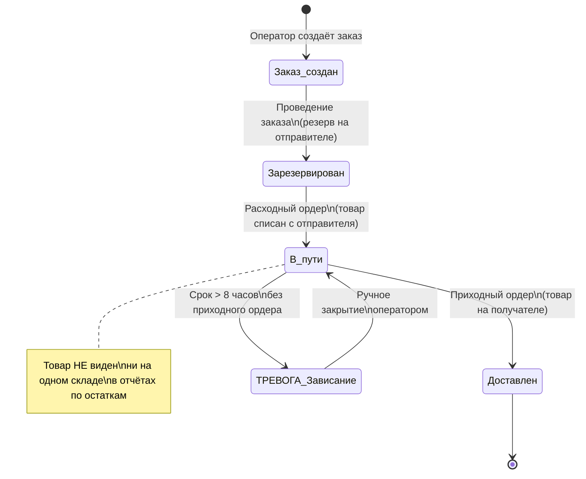
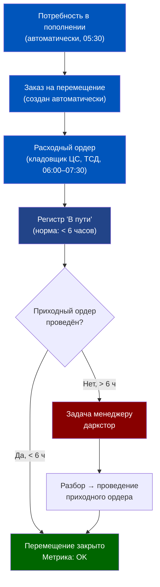
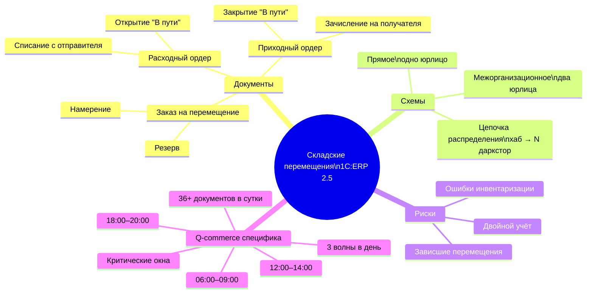
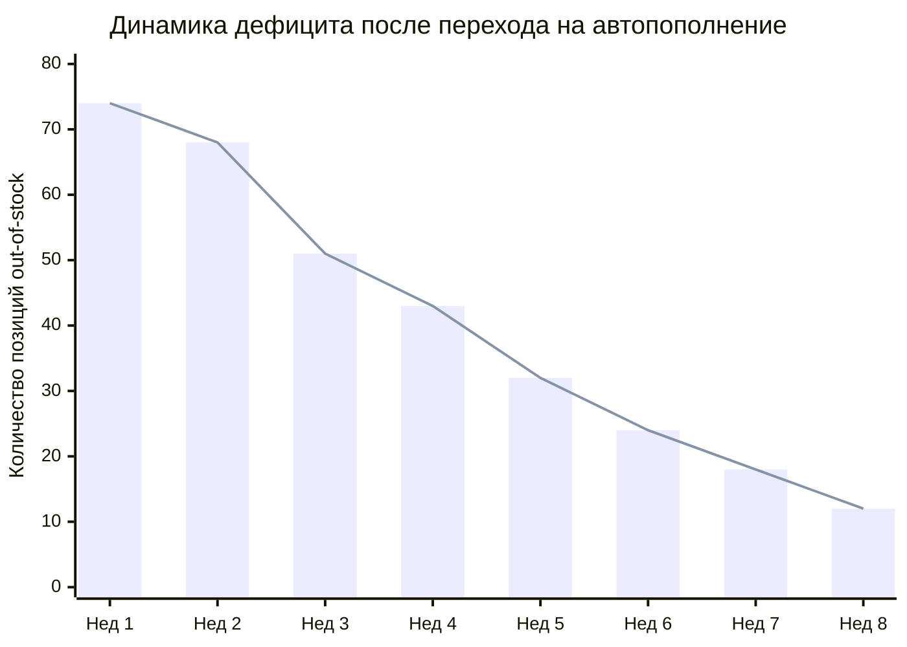

# Неделя 5, День 1. Складские перемещения: логика пополнения сети даркстор

> **Цель урока:** Освоить механику складских перемещений в 1C:ERP 2.5 — от заказа на перемещение до приходного ордера на даркстор — и научиться управлять переходным состоянием «товар в пути» без потери целостности учёта.
>
> **Компетенции после урока:**
> - Понимать трёхдокументную цепочку перемещения и роль каждого звена
> - Читать регистр «Товары в пути» и диагностировать «зависшие» перемещения
> - Различать прямое, межорганизационное перемещение и цепочку распределения
> - Проектировать окна пополнения даркстор с учётом ограничений ERP
>
> **Время:** ~75 минут

---

## Оглавление

- [[#Часть 1. Клубника из Бутово в Хамовниках за 4 часа]]
- [[#Часть 2. Документы перемещения: три звена одной цепи]]
- [[#Часть 3. Схемы перемещения: прямое, межорг и цепочка распределения]]
- [[#Часть 4. Контроль остатков «в пути»: регистр, отчёт, сроки]]
- [[#Часть 5. Практика Q-commerce: ежедневные дозаказы и критические окна]]
- [[#Часть 6. Ловушки: зависшие перемещения и двойной учёт]]
- [[#Часть 7. Глоссарий]]

---

## Часть 1. Клубника из Бутово в Хамовниках за 4 часа

Представьте: 05:47 утра, центральный склад в Бутово. Кладовщик смотрит на 18 паллет клубники, которые прибыли из Краснодара ночью. До первого заказа на клубнику в даркстор «Хамовники» — 4 часа 13 минут. Расстояние — 28 км. Между клубникой и покупателем стоит не столько пробка на ТТК, сколько вопрос: **как переместить товар между двумя складскими сущностями в ERP так, чтобы в 6:00 кладовщик в Хамовниках знал, что везут именно ему, а финансовый контроллер не получил хаос в остатках?**

Это не риторический вопрос. По данным внутреннего аудита одного крупного российского Q-commerce оператора за 2023 год, **23% расхождений при инвентаризации** были вызваны не кражами и не пересортицей, а именно незакрытыми документами перемещения. Товар физически ушёл. Документ завис. ERP показывает его одновременно на двух складах — или не показывает нигде.

Складские перемещения — это та зона, где операционная скорость Q-commerce (срок доставки 15–30 минут требует постоянного пополнения) вступает в прямой конфликт с бухгалтерской дисциплиной. Разрешить этот конфликт — задача архитектора процесса.

В основе решения лежит простой принцип, который 1C:ERP 2.5 реализует через трёхдокументную цепочку: **заказ на перемещение → расходный ордер → приходный ордер**. Между вторым и третьим документом существует особое состояние учёта — «товар в пути». Именно это состояние и есть ключ к управлению сетью из 12 даркстор без потери ни одного килограмма клубники в учётном тумане.

Среднестатистическая сеть даркстор из 10–15 точек генерирует **от 40 до 120 документов перемещения в сутки**. Если хотя бы 5% из них зависают — это 2–6 незакрытых перемещений ежедневно. За месяц накапливается 60–180 «призраков» в регистрах. За квартал — до 540. Инвентаризация превращается в детективное расследование.

Сегодня мы разберём механику этого процесса до последнего регистра.

---

## Часть 2. Документы перемещения: три звена одной цепи

Прежде чем касаться специфики Q-commerce, зафиксируем фундамент: **как 1C:ERP 2.5 описывает перемещение товара между складами на уровне документов и регистров**.

### Заказ на перемещение

Это намерение, не факт. Документ создаётся заранее — оператором, автоматически по расписанию или по триггеру от алгоритма пополнения. Он содержит: **склад-отправитель, склад-получатель, номенклатуру, количество, плановую дату перемещения**.

В момент проведения заказа на перемещение в регистрах происходит следующее: на складе-отправителе количество товара **резервируется** (появляется запись в регистре «Резервы товаров»). Физически товар никуда не движется. Бухгалтерских проводок нет. Это чисто оперативный слой.

Критически важно: если заказ на перемещение создан, но расходный ордер не выписан в течение 24–48 часов, товар продолжает числиться в резерве. Кладовщик не может продать его другому клиенту. Это первый источник «зависания».

### Расходный ордер (склад-отправитель)

Это факт физического ухода товара. Кладовщик центрального склада проводит расходный ордер в момент, когда передаёт товар водителю или перекладывает на зону отгрузки. В этот момент в ERP:

- Количество товара **списывается** с остатков склада-отправителя
- Появляется запись в регистре **«Товары в пути»** — с указанием отправителя, получателя, количества, суммы
- Резерв с заказа на перемещение снимается (заменяется реальным движением)

Бухгалтерская проводка при этом **не формируется**. Это ключевой момент: товар физически ушёл, но с точки зрения бухгалтерского учёта он ещё принадлежит той же организации. Проводка будет позже.

### Приходный ордер (склад-получатель)

Факт физического прибытия. Кладовщик даркстор «Хамовники» принимает товар, сканирует ШК и проводит приходный ордер. В этот момент:

- Запись из регистра «Товары в пути» **закрывается**
- Количество **зачисляется** на остатки склада-получателя
- При необходимости формируется **бухгалтерская проводка** (в рамках одной организации — внутренняя, между юрлицами — реализация/поступление)

### Временной зазор и его последствия

Между расходным и приходным ордером существует временной зазор — в случае сети даркстор это **от 45 минут до 4 часов** (зависит от пробок и расстояния). Весь этот период товар:

- Физически: в машине или на разгрузочной зоне
- В ERP: в регистре «Товары в пути»
- Бухгалтерски: принадлежит отправляющей единице

Для операционного управления важно понимать: **отчёты по остаткам склада-получателя не показывают товар в пути**. Если менеджер даркстор «Хамовники» смотрит отчёт по остаткам в 08:30, он не видит 120 кг клубники, которые едут к нему. Это нормально — но об этом нужно знать.

---

## Часть 3. Схемы перемещения: прямое, межорг и цепочка распределения

1C:ERP 2.5 поддерживает несколько архитектурных моделей перемещения. Выбор модели — не технический, а **бизнес-архитектурный** вопрос: он определяет, сколько юрлиц участвует, как считается себестоимость и что происходит с НДС.

### Схема 1: Прямое перемещение (один юрлицо)

Самая простая схема. Центральный склад и даркстор принадлежат одному юридическому лицу (одной организации в ERP). Документ перемещения создаёт движение между двумя складами внутри одной структуры.

Последствия для учёта: **нет реализации, нет НДС, нет выручки**. Себестоимость товара не меняется. Это чисто технический перенос остатков.

Применимость для Q-commerce: **основной сценарий** для сетей, где все даркстор работают под одним юрлицом (ООО «Ромашка» — и центральный склад, и все точки). Так устроено большинство небольших региональных сетей с 5–20 точками.

### Схема 2: Межорганизационное перемещение (два юрлица)

Центральный склад принадлежит «ООО Логистика», даркстор — «ООО Ритейл». Это два разных субъекта. Прямого перемещения нет — есть **реализация** (продажа от «Логистики» к «Ритейлу» по внутренней цене) и **поступление** (приёмка на «Ритейл»).

Последствия для учёта: формируются **счета-фактуры, проводки по реализации, НДС**. Себестоимость у «Ритейла» — это его закупочная цена от «Логистики» (трансфертная цена).

Применимость: крупные сети с холдинговой структурой, где разделены функции «склад/логистика» и «ритейл» по юрлицам. Сложнее в настройке, но даёт **чёткое разграничение P&L** по сущностям.

### Схема 3: Цепочка распределения (хаб → несколько даркстор)

Это режим, в котором **один документ-заказ генерирует отгрузки сразу на несколько складов-получателей**. В 1C:ERP 2.5 это реализуется через механизм «Заказ на перемещение» с несколькими строками (или через задание на перевозку с несколькими точками доставки).

Практический пример: в 05:00 оператор формирует утренний «мастер-заказ» на пополнение 12 даркстор. Одним документом. Система создаёт 12 расходных ордеров (по одному на каждый маршрут). Каждый водитель получает свой задание. 12 приходных ордеров закрываются по мере прибытия машин — с 07:30 до 10:15.

Преимущества: **снижение операционной нагрузки на оператора в 12 раз**. Риски: если один приходный ордер не проведён вовремя, он «зависает» не на радаре оператора, а среди 11 закрытых — его легко пропустить.

### Сравнительная таблица схем

| Параметр | Прямое | Межорг | Цепочка |
|---|---|---|---|
| Юрлиц | 1 | 2+ | 1–2 |
| Документов на 1 движение | 3 | 4–5 | 3 × N |
| НДС | Нет | Есть | Зависит |
| Сложность настройки | Низкая | Высокая | Средняя |
| Риск «зависания» | Низкий | Средний | Высокий |
| Применение в Q-com | Стандарт | Холдинги | Сети 8+ точек |

---

## Часть 4. Контроль остатков «в пути»: регистр, отчёт, сроки

### Регистр «Товары в пути»

В 1C:ERP 2.5 регистр «Товары в пути» (технически — часть регистра накопления «Товары на складах» с признаком статуса) хранит записи обо всех товарах, по которым расходный ордер проведён, но приходный — ещё нет.

Каждая запись содержит:
- Номенклатуру, характеристику, количество
- Отправляющий склад
- Принимающий склад
- Дату и время создания расходного ордера
- Плановую дату поступления (из заказа на перемещение)

**Ключевой отчёт:** «Товары в пути» (раздел «Склад и доставка» → «Отчёты» → «Состояние доставки»). Отчёт показывает все незакрытые движения с разбивкой по складам и времени ожидания.

### Влияние статуса на остатки склада-отправителя

Это самое важное, что нужно понять операционному менеджеру. В зависимости от статуса документа остатки ведут себя по-разному:

**Состояние А: Заказ на перемещение создан, расходный ордер не проведён**
- На складе-отправителе: товар есть в остатках, но **зарезервирован**
- На складе-получателе: товара нет
- В «Товарах в пути»: записи нет

**Состояние Б: Расходный ордер проведён, приходный — нет**
- На складе-отправителе: товара **нет в остатках** (списан)
- На складе-получателе: товара нет
- В «Товарах в пути»: **запись есть**

**Состояние В: Оба ордера проведены**
- На складе-отправителе: товара нет
- На складе-получателе: товар **есть в остатках**
- В «Товарах в пути»: записи нет

Состояние Б — это нормальный транзитный статус. Проблема возникает, когда оно длится не 4 часа, а 4 дня.

### Плановые сроки ожидания и эскалация

Профессиональная настройка процесса предполагает установку **нормативных сроков ожидания** — максимального времени, в течение которого запись в «Товарах в пути» считается нормой:

- Для перемещений внутри одного здания (разные зоны склада): **0,5–1 час**
- Для перемещений по Москве (ЦС → даркстор): **4–6 часов**
- Для региональных перемещений (ЦС → региональный хаб): **24–48 часов**

Записи, превысившие норматив, должны автоматически попадать в отчёт тревог. Это настраивается через **задание на перевозку** с указанием плановых временных окон.

---

## Часть 5. Практика Q-commerce: ежедневные дозаказы и критические окна

### Ритм пополнения в Q-commerce

Даркстор — это не магазин с еженедельной поставкой. Это **производственная ячейка с ежедневным, а иногда внутридневным пополнением**. Типичный ритм сети из 12 даркстор в Москве:

- **05:30–06:00**: формирование заказов на перемещение (автоматически или оператором) на основе остатков и прогноза продаж дня
- **06:00–07:30**: формирование расходных ордеров и загрузка машин на ЦС Бутово
- **07:30–10:00**: доставка по даркстор, проведение приходных ордеров
- **13:00–14:00**: дозаказ mid-day — для позиций с высокой оборачиваемостью (молоко, хлеб, ягоды)
- **19:00–20:00**: вечерний дозаказ для ночного и утреннего трафика

Итого: **3 волны пополнения в день**, минимум **36 перемещений** (12 точек × 3 волны). Это без экстренных дозаказов.

```mermaid
gantt
    title Ритм пополнения сети 12 даркстор (типовой день)
    dateFormat HH:mm
    axisFormat %H:%M

    section Волна 1 (Утренняя)
    Формирование заказов на перемещение   :done,    a1, 05:30, 30m
    Расходные ордера + загрузка машин      :done,    a2, 06:00, 90m
    Доставка и приходные ордера            :active,  a3, 07:30, 150m

    section Волна 2 (Дневная)
    Анализ остатков + формирование дозаказа :         b1, 13:00, 30m
    Расходные ордера + загрузка            :         b2, 13:30, 30m
    Доставка и приходные ордера            :         b3, 14:00, 90m

    section Волна 3 (Вечерняя)
    Формирование ночного запаса            :         c1, 19:00, 30m
    Расходные ордера + загрузка            :         c2, 19:30, 30m
    Доставка и приходные ордера            :         c3, 20:00, 60m
```

### Расчёт потребности: математика дозаказа

Прежде чем перейти к механике ERP, зафиксируем логику, которую система реализует. Для каждого SKU на каждом даркстор устанавливается три параметра:

- **Точка заказа (Reorder Point)** — остаток, при достижении которого формируется заявка на пополнение. Рассчитывается как: среднедневные продажи × время выполнения заказа (в днях) + страховой запас.
- **Целевой остаток (Target Stock)** — остаток, до которого пополняем при срабатывании точки заказа.
- **Максимальный остаток (Max Stock)** — ограничение полки. Избыточный остаток — это замороженные деньги и риск истечения срока.

Пример для клубники на даркстор «Хамовники»:
- Среднедневные продажи: 18 кг
- Время выполнения заказа: 0,25 дня (6 часов от заказа до прихода)
- Страховой запас: 5 кг (учитывает вариабельность спроса)
- Точка заказа: 18 × 0,25 + 5 = **9,5 кг**
- Целевой остаток: 18 × 1,5 = **27 кг** (на 1,5 дня продаж)

Когда в 05:30 система видит остаток 7 кг (< 9,5 кг), автоматически формируется потребность: **27 − 7 = 20 кг к заказу**.

### Автоматизация через «Потребность» в ERP

1C:ERP 2.5 имеет встроенный механизм формирования **заказов на перемещение по потребности**. Логика следующая:

1. По каждому складу-получателю задаётся **минимальный остаток** (точка заказа) по каждой номенклатуре
2. Ежечасно (или по расписанию) ERP анализирует текущие остатки и сравнивает их с минимумом
3. Если остаток < минимума — автоматически создаётся строка потребности
4. Оператор одним кликом преобразует потребности в заказы на перемещение

Для клубники это может выглядеть так: минимальный остаток «Хамовники» — **15 кг**. Фактический остаток в 05:30 — **4 кг**. Потребность: **30 кг** (с учётом дневного буфера). ERP создаёт строку в задании на пополнение.

### Критические окна: когда задержка = потеря выручки

Три временных окна, в которые пополнение особенно критично:

**06:00–09:00**: утренний пик (завтрак, молочка, яйца). Если клубника не прибыла к 09:00 — даркстор теряет 35–40% дневной выручки по этой позиции. Время доставки из Бутово в Хамовники — 1,5–2 часа с учётом пробок. Расходный ордер должен быть проведён не позже 06:30.

**12:00–14:00**: обеденный пик (готовая еда, соки, фреш). Критичность ниже, но дозаказ по скоропортящимся позициям должен прибыть до 13:30.

**18:00–20:00**: вечерний пик (вино, сыры, десерты). Подарочные наборы и деликатесы — высокомаржинальный сегмент. Дефицит в этом окне особенно болезненен для среднего чека.

---

## Часть 6. Ловушки: зависшие перемещения и двойной учёт

### Ловушка 1: «Зависшее» перемещение

Сценарий: расходный ордер проведён в 06:15. Машина прибыла на даркстор в 08:30. Кладовщик принял товар физически, но забыл провести приходный ордер в ERP — отвлёкся на другой заказ.

Результат через 24 часа: 120 кг клубники **числятся в «Товарах в пути»** и не отображаются в остатках даркстор. Менеджер видит дефицит и формирует повторный заказ. ЦС отправляет ещё 120 кг.

Результат через 48 часов: даркстор физически имеет 240 кг клубники, ERP показывает 0 кг + 120 кг в пути. При проведении второго приходного ордера остатки становятся 120 кг. Где ещё 120? В зависшем первом перемещении, которое кто-то когда-то проведёт — и остатки внезапно вырастут на 120 кг.

**Цена ошибки:** двойное пополнение по продукту с оборачиваемостью 1–2 дня = **50–100% списание** по истечению срока годности.

### Ловушка 2: Двойной учёт при несвоевременном проведении

Это более тонкая ловушка. Сценарий: оператор создал заказ на перемещение в 17:00 пятницы. Расходный ордер — в 08:00 субботы. Приходный ордер — в 11:30 понедельника (по факту прибытия, но с задержкой проведения).

Если финансовый отчёт «Остатки товаров» запустить в воскресенье — товар не виден ни на одном складе. С точки зрения ERP он «в пути», с точки зрения управленческой отчётности — его нет. Это **занижение активов**.

### Ловушка 3: Незакрытые перемещения и инвентаризация

Это самая разрушительная ловушка. При запуске инвентаризации (создании документа «Пересчёт товаров») ERP делает «снимок» фактических остатков по каждому складу. Если на момент снимка есть незакрытые перемещения — **товар в пути не попадает в инвентаризацию**. Он не числится ни у отправителя (уже списан), ни у получателя (ещё не принят).

Кладовщик пересчитывает полки, находит это количество физически и фиксирует как **излишек**. ERP предложит «Оприходовать» его — создав финансовое движение там, где его быть не должно.

**Практическое правило:** перед каждой инвентаризацией — обязательная сверка регистра «Товары в пути». Все записи старше 4 часов должны быть закрыты.

### Чеклист здоровья перемещений

Ежедневный мониторинг (5 минут, ответственный — старший кладовщик ЦС):

1. Открыть отчёт «Товары в пути» → фильтр «Дата создания < сегодня - 8 часов»
2. Все строки в этом фильтре — **аномалия**, требует разбирательства
3. Для каждой строки: звонок на склад-получатель → подтверждение физического наличия → проведение приходного ордера
4. Цель: **0 записей старше 8 часов** к 18:00 ежедневно

### Ловушка 4: Перемещение как инструмент манипуляции отчётностью

Опытные менеджеры иногда используют незакрытые перемещения как способ «убрать» товар с остатков перед отчётным периодом. Логика: создать расходный ордер в конце квартала, не закрывать приходным — и остатки «уменьшаются» на бумаге.

1C:ERP 2.5 фиксирует полный аудит-трейл каждого документа: дату создания, дату проведения, пользователя, который провёл. Финансовый контроллер, запустив отчёт «Товары в пути» с фильтром по дате создания и пользователю, увидит всю картину. Этот приём работает ровно один раз — до первой аудиторской проверки.

---

### Архитектурное решение: проектирование надёжной системы пополнения

Собираем всё в архитектурное решение. Задача: сеть из 12 даркстор, 3 волны пополнения в день, 36+ перемещений в сутки. Цель: **0 зависших перемещений к концу дня** при минимальной нагрузке на операторов.

### Уровень 1: Стандартизация документопотока

Единая цепочка для каждого перемещения: заказ на перемещение создаётся автоматически по потребности, расходный ордер — через мобильное рабочее место кладовщика ЦС (сканирование ШК при загрузке машины), приходный ордер — через ТСД на даркстор при приёмке.

Время между созданием расходного ордера и проведением приходного — нормировано: **не более 6 часов** для московской сети.

### Уровень 2: Автоматическое уведомление о просрочке

В ERP настраивается задание (можно через встроенный планировщик): каждый час проверять регистр «Товары в пути» на наличие записей старше 6 часов. Если найдены — автоматически создавать задачу ответственному менеджеру даркстор.

Это превращает «зависшее перемещение» из тихой бомбы в явную операционную задачу с владельцем и дедлайном.

### Уровень 3: Метрика «Скорость закрытия перемещений»

KPI для операционного менеджера каждого даркстор: **среднее время между расходным и приходным ордером** за неделю. Цель: < 3,5 часов. Норма: < 6 часов. Красная зона: > 8 часов.

Этот показатель напрямую отражает дисциплину работы с ERP на складе-получателе. Если один даркстор систематически выбивается из нормы — это сигнал для оперативного разбора.

### Вывод архитектора

Надёжная система перемещений — это не просто правильные документы. Это **культура проведения** плюс **автоматический контроль** плюс **метрика**. Любое из трёх по отдельности не работает:

- Документы без контроля → «зависшие» перемещения накапливаются
- Контроль без метрики → никто не несёт ответственность
- Метрика без правильных документов → данные для метрики некорректны

Три уровня вместе дают систему, в которой менеджер даркстор и финансовый контроллер видят одну и ту же реальность в реальном времени.

---

## Часть 7. Глоссарий

**Заказ на перемещение** — плановый документ в 1C:ERP 2.5, фиксирующий намерение переместить товар между двумя складами. Создаёт резерв на складе-отправителе. Не формирует бухгалтерских проводок. Является основанием для расходного ордера.

**Расходный ордер** — документ, фиксирующий физический уход товара со склада-отправителя. Списывает товар с остатков отправителя. Открывает запись в регистре «Товары в пути».

**Приходный ордер** — документ, фиксирующий физическое прибытие товара на склад-получатель. Закрывает запись в регистре «Товары в пути». Зачисляет товар на остатки получателя.

**Товар в пути** — учётное состояние товара, при котором расходный ордер проведён, а приходный — нет. Товар не отражается в остатках ни одного склада. Хранится в специальном регистре.

**Хаб** — промежуточный распределительный центр, принимающий консолидированные поставки и распределяющий их по конечным складам (даркстор). Функционально: центральный склад в Бутово в нашем примере.

**Дозаказ** — внутридневная волна пополнения даркстор сверх базового утреннего заказа. Формируется по результатам мониторинга остатков в реальном времени. Типичная периодичность: 2–3 раза в день для скоропортящихся позиций.

**Межорганизационное перемещение** — схема передачи товара между двумя юридическими лицами в рамках одного холдинга. С точки зрения ERP реализуется как «Реализация» у отправителя и «Поступление» у получателя. Сопровождается счётом-фактурой и учётом НДС.

**Резерв товаров** — количество товара на складе, заблокированное под конкретный заказ (в данном случае — заказ на перемещение). Не может быть продано другому покупателю или направлено на другое перемещение без снятия резерва.

**Расходный ордер на перемещение** — отличается от расходного ордера на реализацию принципиально: не формирует выручки, не уменьшает бухгалтерский актив организации (товар остаётся на балансе), только переносит регистровую запись из «остатки склада-отправителя» в «товары в пути».

**Задание на перевозку** — документ планирования логистики в 1C:ERP 2.5, позволяющий связать несколько заказов на перемещение с одним транспортным средством и одним маршрутом. Содержит плановое время отправления, плановое время прибытия по каждой точке, грузоподъёмность транспортного средства. Является основанием для автоматического контроля сроков ожидания в «Товарах в пути».

---

### Контрольные вопросы для самопроверки

Перед переходом к следующему уроку убедитесь, что можете ответить на эти вопросы без подсказки:

1. В какой момент товар перестаёт отображаться в остатках склада-отправителя — при создании заказа на перемещение или при проведении расходного ордера?
2. Где «живёт» товар с точки зрения ERP в промежутке между расходным и приходным ордером?
3. Чем межорганизационное перемещение отличается от прямого с точки зрения бухгалтерского учёта?
4. Почему незакрытые перемещения ломают инвентаризацию?
5. Какой норматив времени для закрытия перемещения ЦС → даркстор в московской сети?

---

### Метрики эффективности системы пополнения

**Результат внедрения автоматических дозаказов:** сеть из 12 даркстор снизила среднее количество позиций OOS с 74 до 12 в неделю за 8 недель. Ключевые изменения: время формирования заявок сократилось с 45 минут (ручной процесс) до 8 минут (авторасчёт + ручная корректировка критичных позиций). Количество «аварийных» перемещений между соседними даркстор (когда у одного закончилось, у другого — лишнее) снизилось с 23 до 4 в неделю.

← [[Неделя 4 - День 7 - История Ozon Express|← День 7. История Ozon Express]] | [[1c_erp_qcom/README|Оглавление]] | [[Неделя 5 - День 2 - Сборка и разборка товаров|День 2 →]]
