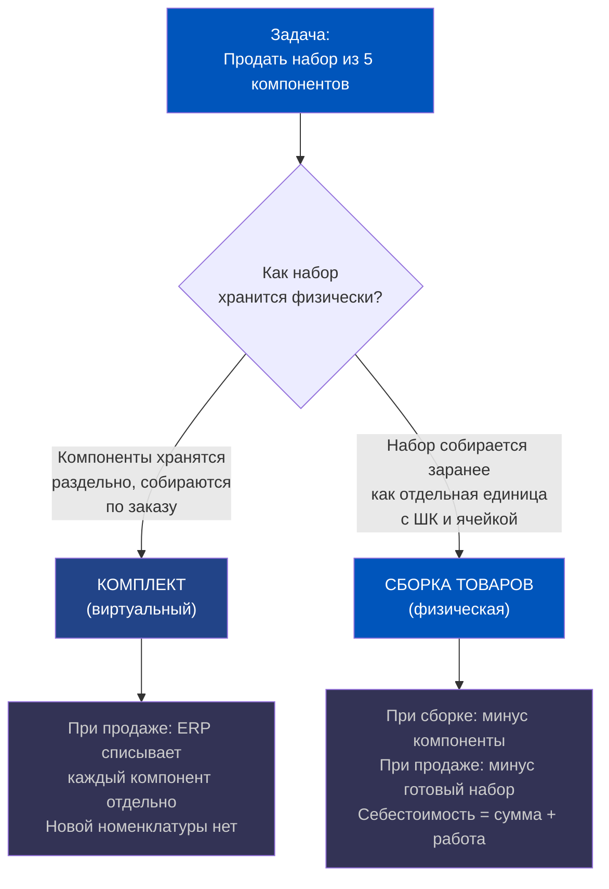
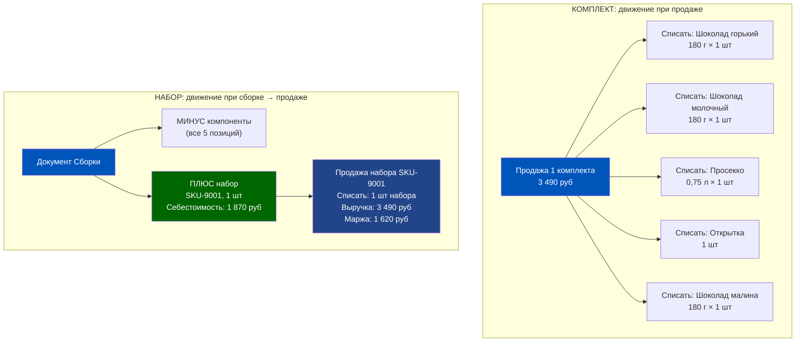
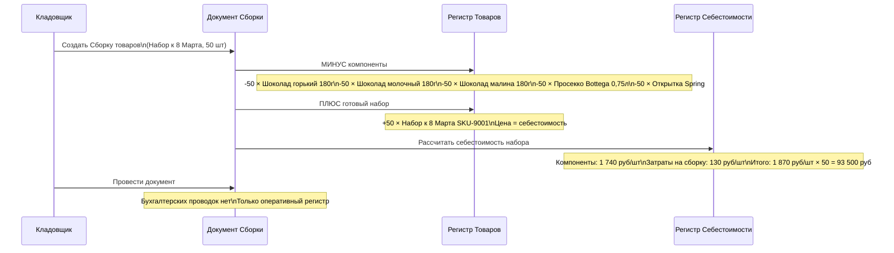
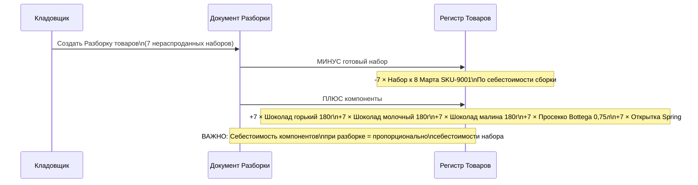
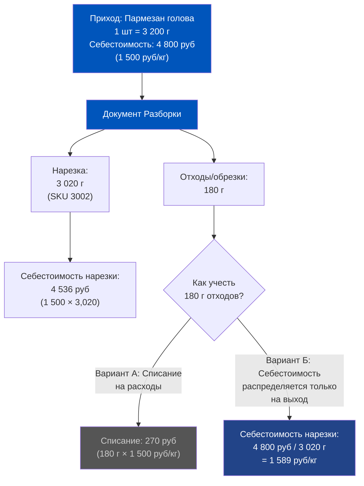
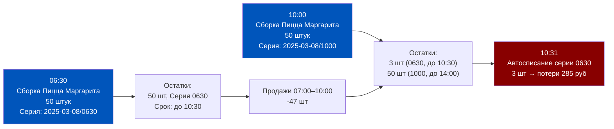
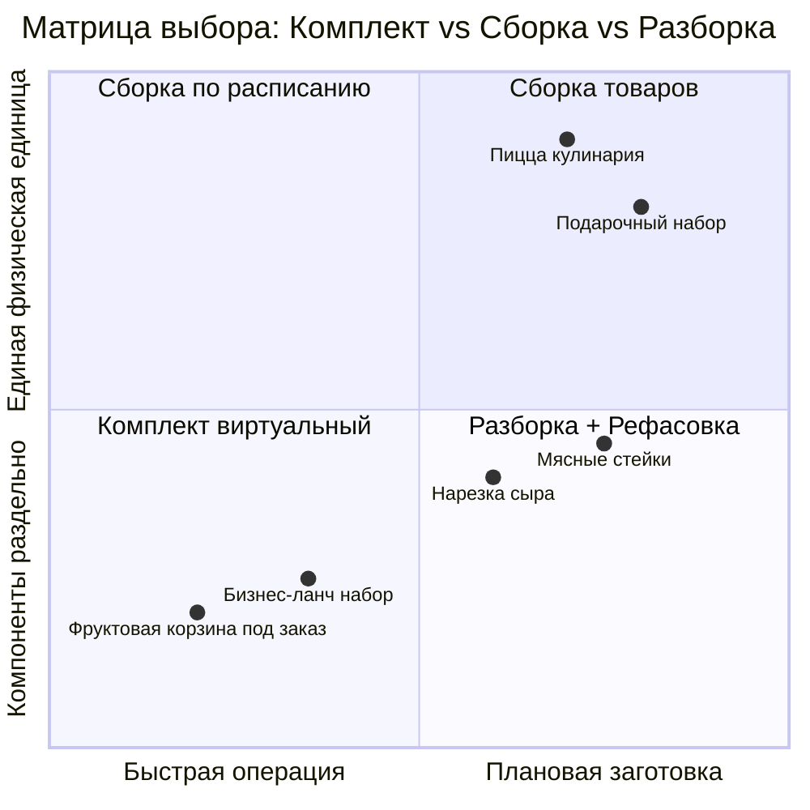
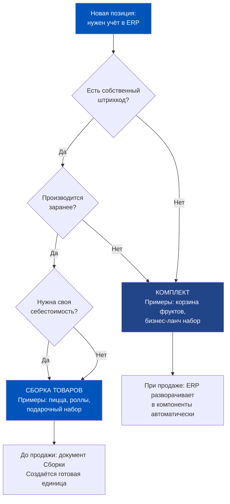
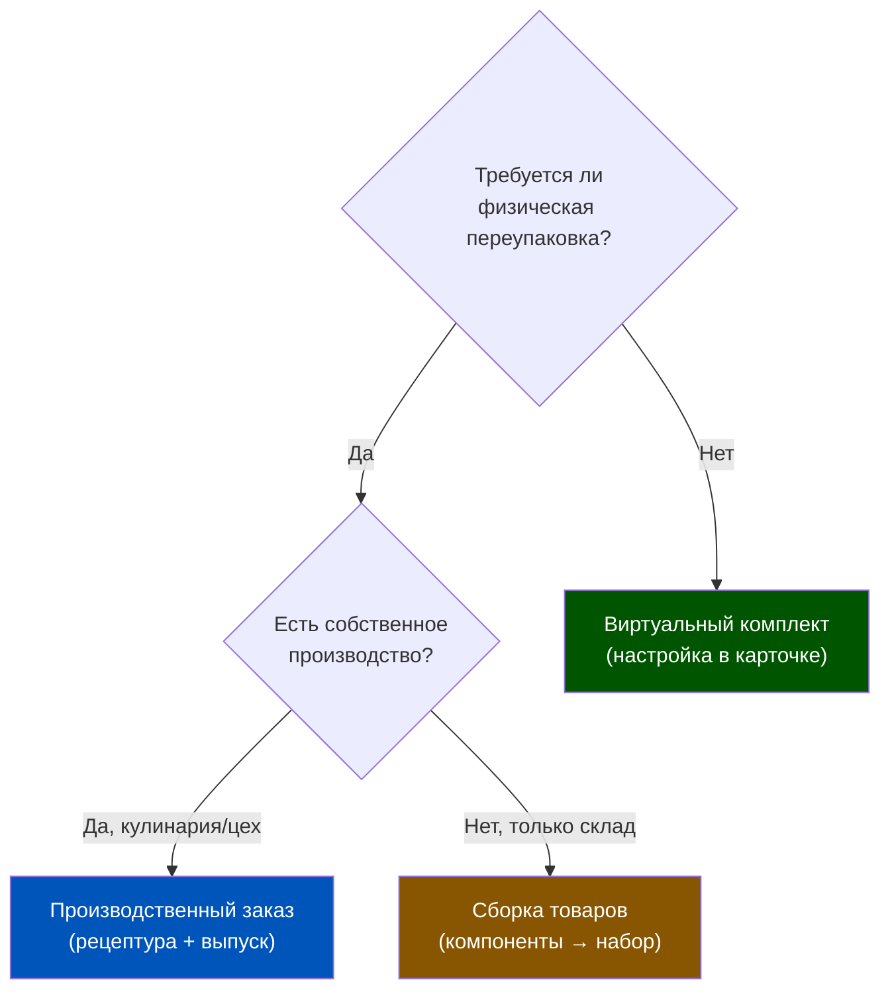

# Неделя 5, День 2. Сборка и разборка товаров: от наборов до весового товара

> **Цель урока:** Освоить механику документов «Сборка» и «Разборка товаров» в 1C:ERP 2.5 — понять, как система управляет движением компонентов и готовых единиц в регистрах, и научиться выбирать правильную модель учёта для каждого Q-commerce сценария.
>
> **Компетенции после урока:**
> - Различать «комплект» и «набор» в терминологии ERP и принимать осознанный выбор между ними
> - Понимать, как себестоимость набора формируется через документ «Сборка товаров»
> - Проектировать учёт весового товара с погрешностью веса
> - Применять нужную модель (сборка / разборка / комплект) к конкретным Q-commerce задачам
>
> **Время:** ~75 минут

---

## Оглавление

- [[#Часть 1. Подарочный набор к 8 Марта и бухгалтерская головоломка]]
- [[#Часть 2. Комплект vs набор: два мира в одном регистре]]
- [[#Часть 3. Документ «Сборка товаров»: как рождается новая учётная единица]]
- [[#Часть 4. Разборка товаров: обратный путь и его логика]]
- [[#Часть 5. Весовой товар: резка, фасовка и погрешность]]
- [[#Часть 6. Практика Q-commerce: кулинария, наборы, мясо]]
- [[#Часть 7. Глоссарий]]

---

## Часть 1. Подарочный набор к 8 Марта и бухгалтерская головоломка

Седьмое марта, 22:15. Менеджер по ассортименту открывает ноутбук и смотрит на заявку от маркетинга: к завтрашнему дню нужно запустить в продажу «Подарочный набор к 8 Марта» — 3 вида шоколада Lindt, бутылка просекко Bottega Gold и открытка с тиснением. Итого 5 позиций. Цена набора — 3 490 рублей.

В ERP есть каждая из 5 позиций: шоколад горький (180 г) — SKU 1042, шоколад молочный (180 г) — SKU 1043, шоколад с малиной (180 г) — SKU 1044, просекко Bottega Gold 0,75 л — SKU 2187, открытка «Spring» — SKU 5001. Самого набора как позиции в системе нет.

Вопрос продакта: «Просто создадим набор и будем продавать». Вопрос системного архитектора: «Как? Как именно ERP должна это записать?»

Здесь и начинается настоящий разговор. Потому что ответ зависит от того, как физически будет храниться и продаваться этот набор. И от ответа на этот вопрос зависит **вся цепочка учёта**: остатки, себестоимость, списание при продаже, возможность возврата одного компонента.

Два принципиально разных подхода:

**Вариант А**: Набор продаётся вместе, но физически компоненты хранятся на полках по отдельности. Сборщик берёт 5 позиций, кладёт в фирменную коробку и передаёт курьеру. В системе «набора» как единицы хранения нет.

**Вариант Б**: Набор физически собирается заранее — упаковывается, перематывается лентой, наклеивается артикул. Это теперь отдельная единица хранения с собственным штрихкодом. Компоненты списаны, новая позиция оприходована.

ERP 2.5 поддерживает оба подхода. Для первого — механизм **«Комплект»**. Для второго — **документ «Сборка товаров»**. Разница не только терминологическая — она определяет, что происходит с регистрами в момент продажи.

---

## Часть 2. Комплект vs набор: два мира в одном регистре

Прежде чем разбирать документы — зафиксируем терминологию. В 1C:ERP 2.5 это два разных механизма с разной логикой регистров. Путаница между ними — источник половины ошибок в учёте сборных позиций.

### Комплект (виртуальный набор)

**Что это:** Группа номенклатур, которые продаются вместе как одна позиция в заказе покупателя, но хранятся и учитываются раздельно.

**Как работает:** В номенклатуре создаётся позиция «Подарочный набор к 8 Марта» с типом «Комплект». К ней привязываются 5 компонентов с коэффициентами. При добавлении комплекта в заказ покупателя ERP автоматически разворачивает его в 5 строк — по одной на каждый компонент.

**Что происходит при продаже:**
- В документе реализации — 1 строка (комплект, 1 шт, 3 490 руб)
- В движениях по регистрам — 5 списаний (каждый компонент отдельно)
- Нового SKU не создаётся
- Собственной себестоимости «набора» как единицы нет — она складывается из себестоимости 5 компонентов в момент списания

**Когда использовать:** Сборка происходит в момент комплектации заказа (за 30–120 секунд). Нет смысла создавать отдельную единицу хранения. Характерный пример: корзины с фруктами, которые собираются под каждый заказ по-новому.

**Ограничения:**
- Нельзя управлять остатком «набора» как единицы — только остатки компонентов
- Нельзя заранее «забронировать» набор на полку — только зарезервировать компоненты
- Если один компонент закончился — весь комплект недоступен (что правильно, но требует отдельного мониторинга)

### Набор (физическая сборка)

**Что это:** Результат документа «Сборка товаров». Новая номенклатурная позиция, которая физически существует как отдельная единица хранения.

**Как работает:** Перед запуском в продажу на складе выполняется операция сборки: компоненты списываются со склада, создаётся новая единица — «Подарочный набор к 8 Марта 2025» (свой SKU, своя ячейка, свой штрихкод). При продаже списывается именно эта единица.

**Что происходит при сборке:**
- Движение в регистре: **минус 5 компонентов** (по количеству и сумме)
- Движение в регистре: **плюс 1 набор** (по количеству)
- Себестоимость набора = сумма себестоимостей компонентов + прямые затраты на сборку
- Бухгалтерской проводки сборка не генерирует (это оперативный учёт)

**Когда использовать:** Набор продаётся как самостоятельная единица. У него есть собственный штрихкод. Он может лежать на полке несколько дней. Примеры: подарочные наборы к праздникам, тематические «корзины» с фиксированным составом.

### Сравнительная таблица: когда что выбрать

| Критерий | Комплект | Набор (Сборка) |
|---|---|---|
| Физическое хранение | Компоненты раздельно | Единая упаковка |
| Собственный SKU | Нет | Да |
| Собственная себестоимость | Нет (сумма компонентов) | Да (с учётом сборки) |
| Время на операцию | 0 (виртуально) | 15–120 мин на партию |
| Управление остатком | По компонентам | По готовому набору |
| Возврат одного компонента | Сложно | Через Разборку |
| Подходит для | Сборка под заказ | Плановое производство |

---

## Часть 3. Документ «Сборка товаров»: как рождается новая учётная единица

Документ «Сборка товаров» — это точка, где ERP превращает несколько позиций в одну. Разберём его архитектуру.

### Структура документа

Документ содержит две обязательные секции:

**Секция «Готовая продукция»** (шапка): что именно собирается — номенклатура, характеристика, количество, склад, куда зачисляется готовый набор.

**Секция «Компоненты»** (табличная часть): список позиций, которые списываются. Каждая строка: номенклатура, склад-источник, количество, цена. ERP может заполнить эту секцию автоматически из спецификации (если она задана для номенклатуры) или вручную.

**Секция «Затраты на сборку»** (опционально): прямые затраты, не связанные с материалами — работа сборщика, упаковка, печать этикеток. Эти суммы включаются в себестоимость готового набора.

### Движение в регистрах при проведении

### Себестоимость набора: формула

Себестоимость готового набора в 1C:ERP 2.5 рассчитывается в момент проведения документа «Сборка товаров»:

**Себестоимость набора = Сумма (себестоимость компонента × количество) + Затраты на сборку**

Пример для «Набора к 8 Марта»:
- Шоколад горький 180 г: 320 руб × 1 = 320 руб
- Шоколад молочный 180 г: 285 руб × 1 = 285 руб
- Шоколад с малиной 180 г: 310 руб × 1 = 310 руб
- Просекко Bottega Gold 0,75 л: 740 руб × 1 = 740 руб
- Открытка Spring: 85 руб × 1 = 85 руб
- Итого компоненты: 1 740 руб
- Упаковочная коробка + лента + этикетка: 100 руб
- Норма труда на сборку (3 мин × тарифная ставка): 30 руб
- **Итоговая себестоимость набора: 1 870 руб**
- Продажная цена: 3 490 руб
- **Маржинальность: 46,4%**

Важно: если себестоимость компонентов пересчитывается по итогам закрытия месяца (средневзвешенная в ERP 2.5), себестоимость набора **не пересчитывается автоматически**. Она фиксируется в момент сборки. Это особенность, которую нужно учитывать при анализе маржинальности праздничных наборов.

### Спецификация и повторяемость

Для регулярных сборок (например, подарочные наборы запускаются каждый месяц) правильная практика — создать **спецификацию** для номенклатуры готового набора. Тогда при создании нового документа «Сборка товаров» ERP автоматически заполняет компоненты и нормы расхода. Это снижает время на создание документа с 7–10 минут до 30 секунд.

---

## Часть 4. Разборка товаров: обратный путь и его логика

Разборка — это зеркальная операция сборки. Но у неё своя логика применения и свои тонкости в регистрах.

### Когда применяется разборка

Три основных сценария:

**Сценарий 1: Остаток нераспроданных наборов.** Праздник прошёл (8 Марта закончилось), на складе осталось 7 нераспроданных «Наборов к 8 Марта». Держать их как единую позицию бессмысленно — набор потерял актуальность. Разбираем обратно на компоненты и продаём их по отдельности. Просекко уйдёт за выходные. Шоколад — через неделю.

**Сценарий 2: Брак одного компонента.** В 3 из 50 собранных наборов обнаружен деформированный шоколад. Разбираем эти 3 набора, заменяем дефектный компонент, собираем снова.

**Сценарий 3: Перекомплектация.** Маркетинг решил изменить состав набора (убрать открытку, добавить конфеты). Разбираем 20 уже собранных наборов старого состава и собираем по новой спецификации.

### Движение в регистрах при разборке

### Себестоимость при разборке: нюанс

При разборке себестоимость готового набора распределяется по компонентам **пропорционально** их доле в себестоимости сборки. Это не обязательно равно их текущей закупочной себестоимости.

Пример: набор собирался при себестоимости просекко 740 руб. К моменту разборки текущая себестоимость просекко — 790 руб (новая поставка дороже). При разборке просекко вернётся в остатки по **740 руб** (пропорция от себестоимости набора 1 870 руб), а не по 790 руб.

Это правильно с точки зрения учёта (сохраняется балансовая стоимость), но создаёт расхождение с текущей рыночной оценкой. Финансовый контроллер должен об этом знать.

### Разборка vs Списание набора целиком

Если набор необратимо испорчен (упаковка намокла, истёк срок) — нет смысла делать разборку. Проводим **«Списание товаров»** по позиции готового набора. Вся себестоимость набора (1 870 руб) уходит в расходы одной операцией. Это проще, чем разбирать на компоненты и потом списывать каждый отдельно.

Правило выбора: если **хотя бы один компонент можно спасти** — разборка. Если все компоненты испорчены — списание набора целиком.

---

## Часть 5. Весовой товар: резка, фасовка и погрешность

Весовой товар — это отдельная глава в учёте Q-commerce. Сыр, мясо, рыба, нарезки — всё это продаётся в граммах, хранится в килограммах и создаёт постоянную погрешность между тем, что заказал клиент, и тем, что физически отрезано.

### Логика разборки крупной единицы в малые

Типичный сценарий: на центральный склад приходит **голова сыра Пармезан весом 3,2 кг** (1 штука, SKU 3001). Даркстор продаёт Пармезан нарезкой по 100–300 г (SKU 3002, весовой). Нужно «разобрать» большую единицу в малые.

В ERP 2.5 это оформляется через **документ «Разборка товаров»**:
- Исходная позиция: 1 × Пармезан (голова) 3,2 кг, SKU 3001
- Результирующие позиции: N × Пармезан (нарезка, весовой), SKU 3002

Но здесь появляется ключевая проблема: при нарезке голова весом 3 200 г **не даст ровно 3 200 г нарезки**. Будут обрезки (корка, торцы) — условно 180 г. Реальный выход нарезки: **3 020 г**.

### Погрешность веса: как принять в учёт

Два подхода, два разных управленческих смысла:

**Вариант А (списание отходов):** Нарезка учитывается по исходной себестоимости 1 500 руб/кг. Погрешность 180 г × 1 500 = 270 руб уходит в «потери при разделке» — отдельная статья затрат. Менеджер видит, сколько реально теряется при нарезке каждой головы.

**Вариант Б (перераспределение на выход):** Вся себестоимость головы (4 800 руб) распределяется только на фактический выход нарезки (3 020 г). Себестоимость нарезки выше — 1 589 руб/кг. Отдельной строки потерь нет. Но реальная стоимость продукта для ценообразования корректнее.

Рекомендация для Q-commerce: **Вариант Б**, если целевой показатель — маржинальность по SKU. **Вариант А**, если нужен мониторинг потерь при разделке как операционного KPI.

### Нормативы выхода и отклонения

Профессиональная настройка предполагает задание **нормативного выхода** для каждого типа разделки:
- Пармезан (голова → нарезка): норма выхода **94,3%** от входящего веса
- Говяжий антрекот (туша → стейки): норма выхода **68–72%**
- Красная рыба (тушка → филе): норма выхода **58–62%**

Если фактический выход отклоняется от нормы более чем на 2–3%, это сигнал: либо качество сырья ниже (больше потерь), либо кладовщик ошибся при взвешивании, либо — что неприятнее — происходит «усушка» иного характера.

---

## Часть 6. Практика Q-commerce: кулинария, наборы, мясо

Теперь соберём всё в практическую таблицу решений для типичных Q-commerce задач.

### Готовая еда из собственной кулинарии

**Задача:** Пицца «Маргарита» готовится в собственной производственной зоне даркстор из теста (SKU 4001), томатного соуса (SKU 4002), моцареллы (SKU 4003), базилика (SKU 4004). Результат — 1 пицца (SKU 5001, 400 г).

**Модель:** Документ «Сборка товаров» с указанием спецификации. Компоненты списываются по нормам расхода. Готовая пицца зачисляется в остатки.

**Критичный нюанс:** Срок годности пиццы — 4 часа с момента готовности. ERP 2.5 позволяет управлять **сериями с датой истечения** для каждой партии сборки. Это нужно активировать в настройках номенклатуры, иначе пиццы из разных «волн» (08:00, 11:00, 14:00) будут смешаны в одном остатке — и FIFO-списание не сработает.

### Подарочные наборы к праздникам

**Задача:** 8 Марта, 23 Февраля, Новый Год — плановые наборы с фиксированным составом.

**Модель:** Сборка товаров с предзаданной спецификацией. Собирается партия заранее (за 1–3 дня до праздника). Продаётся как единица с собственным SKU.

**Экономика:** Сборка 300 наборов «8 Марта» занимает 4 человеко-часа (при скорости 1 набор за 45 секунд с двумя сборщиками = 160 шт/час, итого ~2 часа командой из 2 человек). Затраты на труд включаются в себестоимость.

**Ловушка:** Не забыть создать позицию готового набора **до начала сборки** (с активированным управленческим учётом). Если собрать физически, а потом разобраться с ERP-настройками — придётся делать ручные корректировки остатков.

### Фасованное мясо и рыба

**Задача:** Говяжий стейк рибай приходит в вакуумной упаковке по 1,2–1,5 кг (1 упаковка = 1 шт, SKU 6001). Клиент заказывает стейк на 300 г (SKU 6002, весовой). Нужна разделка.

**Модель:** Разборка товаров. 1 упаковка 1,35 кг разбирается на: 4 × стейк ~300 г (SKU 6002) + 150 г обрезки (SKU 6003 «Говядина для тушения»).

**Норматив выхода:** 1 350 г входа → 1 200 г стейков (88,9%) + 150 г фарш/тушение.

### Матрица выбора модели

### Экономика производственного цикла Q-commerce кулинарии

Числа, которые продакт должен держать в голове при проектировании учёта собственного производства:

Типичный даркстор с кулинарией (пиццы, роллы, салаты) производит **3–5 волн сборки в день**. Каждая волна — отдельный документ «Сборка товаров» с отдельной серией и сроком годности. При 5 позициях меню и 5 волнах — **25 документов сборки в день** только по кулинарии.

Если средний срок годности готового блюда — 4–6 часов, а производственный цикл составляет 3–4 волны в день, то к концу дня накопленный нереализованный остаток может достигать 8–12% от произведённого. При себестоимости производства 350 руб/блюдо и объёме 80 блюд в день потенциальные ежедневные потери — **2 240–3 360 рублей**. За месяц — **67 000–100 000 рублей** только на одном даркстор.

Инструмент контроля: отчёт по документам «Сборка товаров» с фильтрацией по сериям с истёкшим сроком годности. Запускается в конце каждой волны. Товар с истёкшей серией — немедленное списание, не перенос.

---

### Архитектурное решение: от бардака к системе

Сведём всё в архитектурную схему принятия решений для продакта, который проектирует учёт производства и наборов в Q-commerce.

### Три вопроса перед выбором модели

**Вопрос 1: Есть ли у этой позиции собственный штрихкод?**
- Да → нужна «Сборка товаров» (создаётся отдельная учётная единица с ШК)
- Нет → «Комплект» достаточен (ШК отдельных компонентов используются при продаже)

**Вопрос 2: Производится ли эта позиция заранее или только под заказ?**
- Заранее → «Сборка товаров» (партионное производство с управлением остатком)
- Только под заказ → «Комплект» (производство = момент сборки для конкретного заказа)

**Вопрос 3: Нужно ли управлять себестоимостью этой позиции отдельно?**
- Да → «Сборка товаров» (собственная себестоимость, включая труд)
- Нет → «Комплект» (себестоимость = сумма компонентов на момент продажи)

### Типичная ошибка Q-commerce стартапов

Команда создаёт пиццу как «Комплект» — потому что так проще в начале. 3 месяца работы. Начинают анализировать маржинальность меню. Выясняется, что у пиццы нет собственной себестоимости в регистрах — только у компонентов. Отчёт «Валовая прибыль по номенклатуре» показывает выручку от продажи пиццы, но себестоимость разбита на 6–8 компонентов в разных строках.

Итог: ни один аналитик не может сказать, с какой маржой продаётся каждый вид пиццы. Переход с «Комплекта» на «Сборку» требует ручного пересчёта всех остатков и изменения настроек номенклатуры. Работа на 2–3 дня.

Правило: **если позиция производится, она требует «Сборки»**. Комплект — только для торговых наборов без производственного процесса.

---

## Часть 7. Глоссарий

**Комплект** — виртуальный набор в 1C:ERP 2.5: группа номенклатур, продающихся вместе как одна позиция в заказе, но хранящихся раздельно. При продаже ERP автоматически разворачивает комплект в отдельные строки списания по компонентам. Новая учётная единица не создаётся.

**Набор** — результат документа «Сборка товаров». Физически собранная единица с собственным SKU, штрихкодом и себестоимостью. Хранится как самостоятельная номенклатурная позиция.

**Сборка** — операция (и одноимённый документ) в 1C:ERP 2.5, в ходе которой компоненты списываются с остатков склада и создаётся готовая единица. Документ формирует движения в регистрах, но не создаёт бухгалтерских проводок в момент проведения.

**Разборка** — обратная операция (документ «Разборка товаров»): готовая единица списывается, компоненты возвращаются в остатки по себестоимости, пропорциональной их доле при сборке.

**Компонент** — исходная номенклатурная позиция, входящая в состав набора согласно спецификации. При сборке — уменьшается в остатках. При разборке — увеличивается.

**Готовый набор** — номенклатурная позиция, создаваемая в результате документа «Сборка товаров». Имеет собственную себестоимость = сумма себестоимостей компонентов + затраты на сборку.

**Себестоимость сборки** — полная стоимость создания готового набора: материалы (себестоимость компонентов по данным регистра на момент сборки) + прямые затраты (упаковка, труд сборщиков, расходные материалы).

**Весовой товар** — номенклатурная позиция с единицей измерения «граммы» или «килограммы». Продаётся в произвольных количествах. При разборке большой единицы в малые возникает погрешность — разница между входящим весом и суммарным весом результирующих позиций. Погрешность учитывается либо как потери (отдельная статья расходов), либо распределяется на себестоимость результирующих позиций.

**Спецификация** — описание состава набора: перечень компонентов и нормы расхода на 1 единицу готового набора. Хранится в карточке номенклатуры. Позволяет автоматически заполнять документы «Сборка товаров».

**Норматив выхода** — доля полезного продукта (в процентах от входящей массы) после разделки/нарезки. Используется для контроля потерь при разборке весового товара.

**Серия** — дополнительный атрибут номенклатурной позиции в 1C:ERP 2.5, позволяющий разделить один SKU на партии с разными характеристиками (дата производства, срок годности, номер партии). Для готовой продукции собственной кулинарии серия — это волна производства. Управление сериями включается в настройках вида номенклатуры и критически важно для FIFO-списания скоропортящихся товаров.

**Трансфертная цена** — внутренняя расчётная цена, по которой товар передаётся между подразделениями или юридическими лицами в рамках холдинга. При межорганизационных перемещениях используется в документе реализации. Влияет на P&L каждой сущности и определяет, где «формируется прибыль» в холдинговой структуре. Налоговые органы контролируют трансфертное ценообразование в соответствии с разделом V.1 Налогового кодекса.

**Бухгалтерская проводка по сборке** — несмотря на то что документ «Сборка товаров» не генерирует проводок при проведении, финансовые последствия возникают при **закрытии месяца**: себестоимость компонентов пересчитывается по средневзвешенной, и если фактическая себестоимость отличается от плановой (указанной при сборке), формируется проводка корректировки. Это нужно учитывать при анализе маржинальности продуктов, собранных в конце месяца.

### Ловушки при работе с весовым товаром

**Ловушка 1: Отрицательные остатки при погрешности веса**

Сценарий: в ERP приходует 1 голова сыра весом 3 200 г. При продаже отрезают кусок 350 г (клиент заказал 300 г, но нарезка дала чуть больше). Заказ проведён как 350 г. Продали ещё 8 кусков по 350–380 г. Итого отгружено: 350 + 8 × 365 = 3 270 г. В системе было 3 200 г. ERP создаёт **отрицательный остаток −70 г**.

Это типичная ситуация для весовых товаров. Решение — не паника, а правильная настройка: в параметрах номенклатуры разрешить продажу при нулевом остатке с автоматическим созданием документа корректировки. Плюс ежедневная сверка весовых товаров с погрешностью > 3%.

**Ловушка 2: Неправильная единица измерения при разборке**

Голова сыра хранится в штуках (1 шт = 3 200 г). Нарезка учитывается в граммах. При разборке нужно указать правильный коэффициент пересчёта: 1 шт = 3 200 г. Если этот коэффициент не задан в карточке номенклатуры, ERP не сможет автоматически рассчитать остаток нарезки.

Настройка: в карточке исходной номенклатуры (голова сыра) задать дополнительную единицу измерения «грамм» с коэффициентом пересчёта. Тогда в документе разборки можно указывать как в штуках, так и в граммах.

### Числовые ориентиры для Q-commerce производства

Прежде чем закончить урок, зафиксируем опорные числа для проектирования процессов:

- Скорость сборки простого набора (3–5 компонентов без сложной упаковки): **45–90 секунд** на единицу
- Скорость сборки сложного набора (5–8 компонентов, фирменная коробка с тиснением): **3–5 минут** на единицу
- Типичный норматив выхода при нарезке твёрдого сыра: **92–96%**
- Типичный норматив выхода при разделке охлаждённой рыбы: **55–65%**
- Допустимое отклонение весового товара от заявленного (при продаже): **±5%** (по ГОСТ для фасованной продукции)
- Максимальная партия для документа «Сборка товаров» без разбивки на подпартии: практика показывает, что партии свыше **200 единиц** лучше разбивать на 2–3 документа для упрощения отладки при расхождениях
- Срок хранения документов «Сборка товаров» в базе: **5 лет** (согласно требованиям к первичной документации)
- Минимальный объём партии для экономически обоснованной сборки подарочного набора: **20–30 штук** (ниже этого порога трудозатраты на документооборот превышают выгоду от единой учётной единицы)
- Время на создание документа «Сборка товаров» вручную (без спецификации): **7–10 минут** для набора из 5–8 компонентов; со спецификацией — **25–40 секунд**

---

### Контрольные вопросы для самопроверки

Перед переходом к следующему уроку убедитесь, что можете ответить без подсказки:

1. В чём принципиальная разница между «комплектом» и «набором» с точки зрения регистров ERP?
2. Как формируется себестоимость готового набора при документе «Сборка товаров»?
3. В каком случае лучше выбрать «Разборку товаров», а не «Списание набора» целиком?
4. Почему пересчёт себестоимости компонентов при закрытии месяца не меняет себестоимость уже собранных наборов?
5. Какие два метода учёта потерь при разделке весового товара поддерживает ERP, и когда какой выбирать?

---

### Сравнительная таблица: комплект vs набор vs производство

| Критерий | Виртуальный комплект | Физический набор | Производство |
|---|---|---|---|
| Хранение компонентов | Раздельное | Раздельное до сборки | Раздельное до производства |
| Момент изменения остатков | При продаже | При сборке | При выпуске |
| Себестоимость | Сумма компонентов | Сумма + затраты на сборку | По спецификации |
| Обратный процесс | Не нужен | Разборка | Возврат в производство |
| Документ | Заказ клиента (набор) | Сборка товаров | Производственный заказ |
| Учёт в ERP | Регистр продаж | Регистр склада | Производственный регистр |

**Когда что выбирать в Q-commerce:**
- Подарочный набор в красивой коробке (перфорированные окошки, кастомная упаковка) → физический набор, нужна сборка
- Набор «3 товара по цене 2» без переупаковки → виртуальный комплект, достаточно настройки в карточке
- Готовое блюдо из собственной кулинарии (пицца, роллы, нарезка) → производство или сборка в зависимости от сложности

← [[Неделя 5 - День 1 - Складские перемещения|← День 1]] | [[1c_erp_qcom/README|Оглавление]] | [[Неделя 5 - День 3 - Инвентаризация|День 3 →]]
