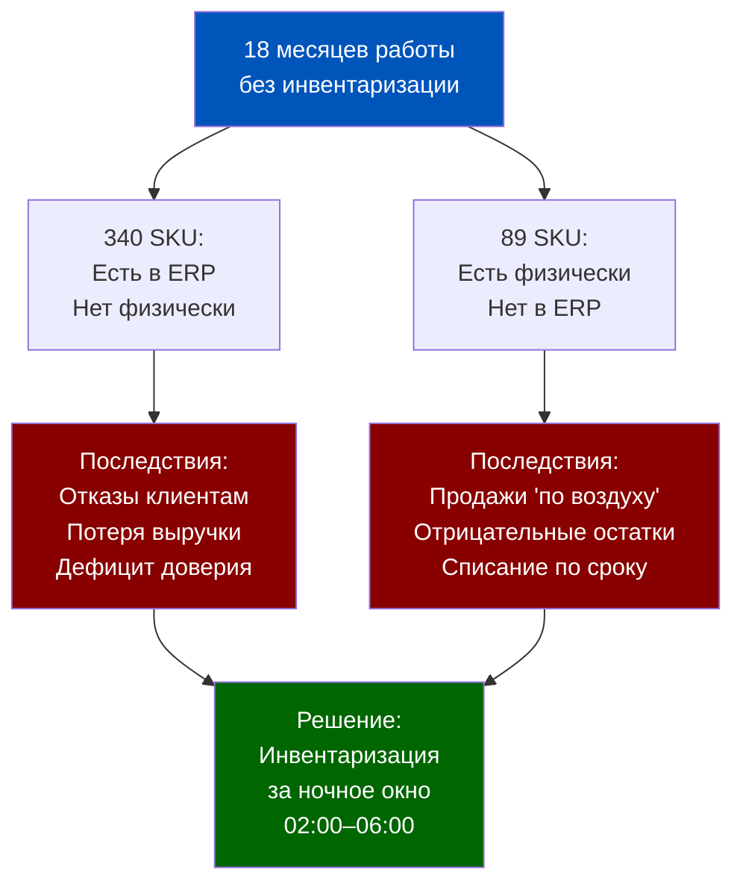
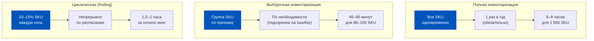
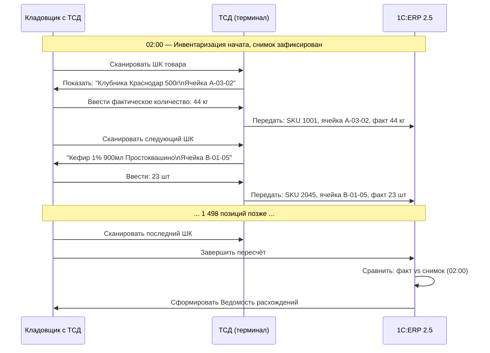
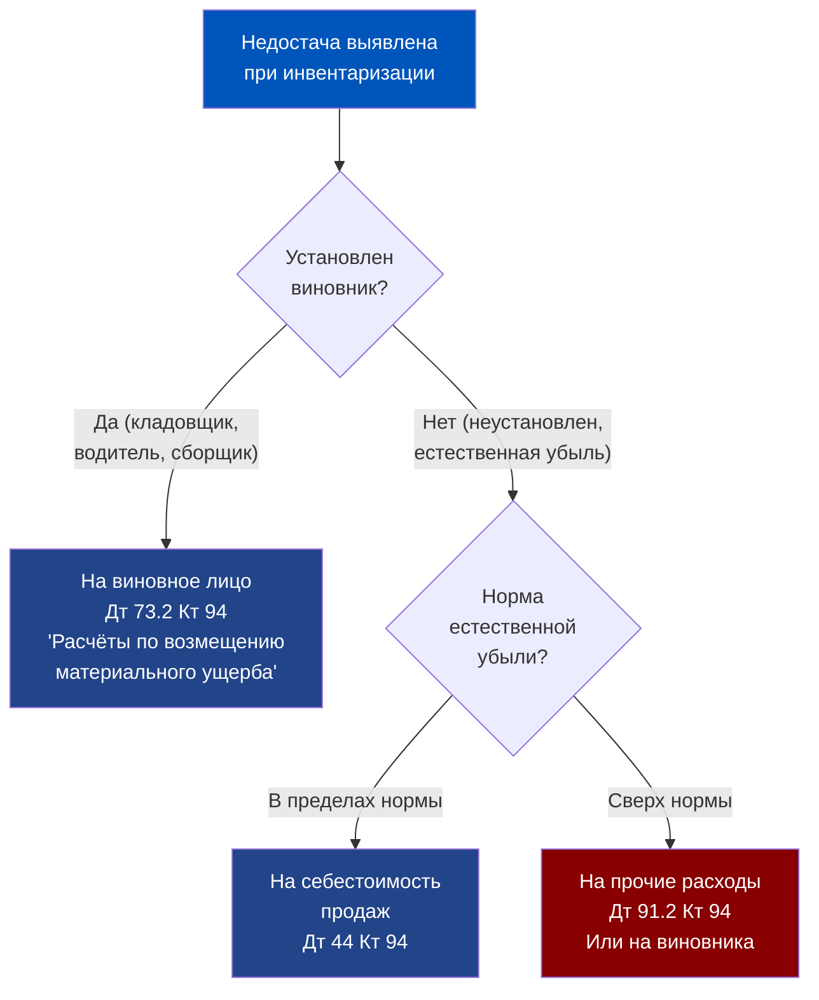
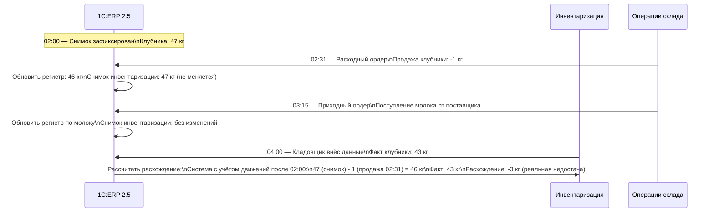
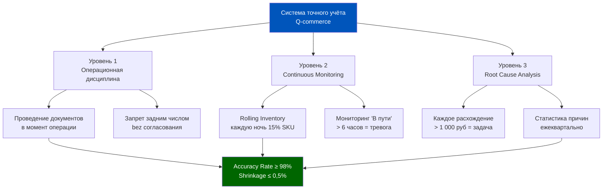

# Неделя 5, День 3. Инвентаризация: технология пересчёта без остановки склада

> **Цель урока:** Освоить технологию инвентаризации в 1C:ERP 2.5 — от выбора типа пересчёта до оформления излишков и недостач — и научиться проводить полный цикл инвентаризации в ночное окно Q-commerce без остановки операций.
>
> **Компетенции после урока:**
> - Выбирать правильный тип инвентаризации для каждого операционного сценария
> - Понимать механизм «снимка остатков» и его влияние на параллельные операции
> - Оформлять излишки и недостачи в ERP с правильным распределением финансовых последствий
> - Проектировать процесс rolling inventory для непрерывно работающего даркстор
>
> **Время:** ~75 минут

---

## Оглавление

- [[#Часть 1. Даркстор без выходных и 18 месяцев без инвентаризации]]
- [[#Часть 2. Типы инвентаризации в ERP 2.5: полная, выборочная, циклическая]]
- [[#Часть 3. Технология проведения: снимок, подсчёт, сравнение]]
- [[#Часть 4. Оформление результатов: излишки, недостачи, финансовые последствия]]
- [[#Часть 5. Инвентаризация при работающем складе: параллельные операции]]
- [[#Часть 6. Специфика Q-commerce: ночное окно и 2000 SKU за 4 часа]]
- [[#Часть 7. Глоссарий]]

---

## Часть 1. Даркстор без выходных и 18 месяцев без инвентаризации

Август 2024 года. Даркстор «Сокольники» работает без остановки 18 месяцев подряд — с момента открытия. 24 часа, 7 дней в неделю, 547 дней без единого закрытия на инвентаризацию. Это гордость операционного директора: «Мы ни разу не подвели клиента».

Но финансовый контроллер смотрит на отчёт по расхождениям с другим чувством. За 18 месяцев накопилось: **340 позиций в системе, которых нет физически** (ERP показывает остаток, на полке пусто), и **89 позиций физически есть, но системе неизвестны** (лежат на полке, в ERP — нулевой остаток или другой SKU).

Убытки от первой группы: систематические отказы клиентам («товара нет», хотя он мог бы быть). Убытки от второй группы: либо продаётся «по воздуху» и создаёт отрицательные остатки, либо пылится и истекает по сроку.

Совокупная цена проблемы при среднем чеке по расхождению 350 рублей: **340 × 350 = 119 000 рублей замороженных или несуществующих активов** только по позициям с нулевым физическим остатком. По позициям с незарегистрированным излишком — аналогичная сумма неучтённых активов.

И теперь главный вопрос: **как провести инвентаризацию за одно ночное окно — с 02:00 до 06:00 — не останавливая продажи, не создавая двойного учёта, и при этом охватить 500 до 2 000 SKU** в зависимости от ширины ассортимента?

Это не теоретическая задача. Это то, что лучшие операционные команды Q-commerce решают каждый квартал. Инструмент — 1C:ERP 2.5. Технология — то, что мы разберём сегодня.



---

## Часть 2. Типы инвентаризации в ERP 2.5: полная, выборочная, циклическая

1C:ERP 2.5 поддерживает три типа инвентаризации. Выбор типа — первое стратегическое решение, которое принимает операционный менеджер. Каждый тип решает свою задачу и имеет свою «цену» с точки зрения трудозатрат и прерывания операций.

### Полная инвентаризация

**Суть:** Все SKU склада пересчитываются одновременно. Создаётся один документ «Пересчёт товаров» с полным перечнем номенклатуры.

**Когда применяется:**
- Раз в год (обязательная бухгалтерская инвентаризация согласно 402-ФЗ «О бухгалтерском учёте»)
- После смены материально-ответственного лица
- После чрезвычайного события (потоп, пожар, кража)
- При стартовой «нулевой» инвентаризации нового склада

**Трудозатраты для даркстор 1 500 SKU:** при одной команде из 3 кладовщиков с ТСД — 6–8 часов. При двух командах из 3 человек — 3,5–4 часа. Именно поэтому для Q-commerce полная инвентаризация проводится исключительно в ночное окно.

**Документ в ERP:** «Пересчёт товаров» (раздел «Склад и доставка» → «Излишки, недостачи, порчи» → «Пересчёт товаров»). Содержит: склад, ответственное лицо, дату и время, перечень номенклатуры с учётными остатками. Для получения официальных печатных форм ИНВ-3 и ИНВ-19 дополнительно оформляется документ «Инвентаризационная опись» на основании данных пересчёта.

### Выборочная инвентаризация

**Суть:** Пересчитывается только заданная группа позиций — по товарной группе, по ячейке, по зоне хранения или по конкретному поставщику.

**Когда применяется:**
- Подозрение на систематическую ошибку в конкретной группе (например, все молочные продукты дают расхождение при каждой инвентаризации)
- Проверка после прихода конкретного поставщика (контроль качества приёмки)
- Плановый контроль высокомаржинальных позиций (алкоголь, деликатесы) — раз в месяц

**Трудозатраты для группы 80–150 SKU:** 45–90 минут одним кладовщиком с ТСД. Может проводиться в рабочее время с минимальным влиянием на операции.

**Документ в ERP:** «Пересчёт товаров» с отбором по нужной группе номенклатуры, ячейке или зоне.

### Циклическая инвентаризация (Rolling Inventory)

**Суть:** Склад делится на зоны или группы. Каждая зона пересчитывается по расписанию — например, каждая из 10 зон раз в 10 рабочих дней. За месяц весь склад проходит полный цикл.

**Когда применяется:**
- Непрерывно работающие склады, где полная инвентаризация нежелательна
- Большие ассортиментные матрицы (1 000+ SKU), где полный пересчёт занял бы 8+ часов
- Как альтернатива или дополнение к ежеквартальной полной инвентаризации

**Для Q-commerce это золотой стандарт.** Каждую ночь в окне 02:00–04:00 пересчитывается 10–15% склада. За неделю — полный охват. Расхождения выявляются и устраняются непрерывно, не накапливаясь за 18 месяцев.



### Документ «Пересчёт товаров» и «Инвентаризационная опись»

В ERP 2.5 процесс инвентаризации строится на одном ключевом документе. Разграничение — по назначению:

| Параметр | Пересчёт товаров | Инвентаризационная опись |
|---|---|---|
| Назначение | Организация и фиксация фактического пересчёта | Формирование официальных печатных форм |
| Складские акты | Оформляются на основании данных пересчёта | Включает данные из пересчётов и актов |
| Правовая значимость | Основание для оприходования/списания | Печатные формы ИНВ-3 и ИНВ-19 для подписи |
| Параллельные операции | На адресном складе: пересчёт невозможен при активных заданиях | Не влияет на операции |
| Статусы (при ордерной схеме) | Подготовлено → В работе → Внесение результатов → Выполнено | Не имеет статусов |

---

## Часть 3. Технология проведения: снимок, подсчёт, сравнение

Разберём пошагово, как именно происходит инвентаризация в 1C:ERP 2.5 — от создания документа до получения ведомости расхождений.

### Шаг 1: Создание документа «Пересчёт товаров» и фиксация снимка

Оператор создаёт документ **«Пересчёт товаров»** (раздел «Склад и доставка» → «Излишки, недостачи, порчи» → «Пересчёт товаров») с указанием:
- Склада (или конкретных ячеек при выборочном пересчёте)
- Ответственного лица
- Даты и времени начала

В момент создания и перевода документа в статус **«В работе»** ERP фиксирует системные (учётные) остатки по каждой номенклатуре. Это критически важный момент: все операции, проведённые **до** создания документа, попадают в снимок. Все операции, проведённые **после** — фиксируются в регистрах отдельно и учитываются при расчёте расхождений.

**Практически:** оператор создаёт документ пересчёта в 02:00 и переводит его в статус «В работе». ERP фиксирует учётные остатки: «На 02:00 на складе Сокольники числится 47 кг клубники (SKU 1001), 23 шт кефира 1% 900 мл (SKU 2045)...» и так по всем 1 500 SKU. На основании этих данных формируется **«Бланк задания на пересчёт товаров»** для кладовщиков.

### Шаг 2: Выгрузка задания для пересчёта

Из документа «Пересчёт товаров» формируется **«Бланк задания на пересчёт товаров»** (по кнопке печати в документе) — список позиций, который загружается в ТСД (терминал сбора данных). На экране ТСД кладовщик видит: наименование товара, ячейку хранения, системный остаток (скрыт или открыт — зависит от методики).

Два подхода к методике пересчёта:

**«Слепой» пересчёт:** кладовщик не видит системный остаток. Считает фактически, вносит цифру, потом ERP сравнивает. Более честный метод — исключает подгонку под систему.

**«Открытый» пересчёт:** кладовщик видит системный остаток и корректирует его. Быстрее, но менее надёжен — есть соблазн «подтянуть» фактическое к системному.

Для Q-commerce с высокой текучестью персонала: **«слепой» пересчёт** для высокомаржинальных групп (алкоголь, деликатесы), «открытый» — для фреш и бакалеи.

### Шаг 3: Физический подсчёт



### Шаг 4: Ведомость расхождений

После загрузки всех фактических данных ERP автоматически формирует **ведомость расхождений** — таблицу с тремя колонками:

- Системный остаток (на момент снимка 02:00)
- Фактический остаток (результат подсчёта)
- Расхождение (факт минус система)

Расхождение со знаком «+» — **излишек** (физически больше, чем в ERP).
Расхождение со знаком «–» — **недостача** (физически меньше, чем в ERP).

Пример ведомости для «Сокольников»:

| SKU | Наименование | Система | Факт | Расхождение | Сумма расхождения |
|---|---|---|---|---|---|
| 1001 | Клубника 500 г | 47 кг | 44 кг | -3 кг | -450 руб |
| 2045 | Кефир 1% 900 мл | 23 шт | 23 шт | 0 | 0 |
| 3102 | Сыр Пармезан | 2,4 кг | 3,1 кг | +0,7 кг | +1 050 руб |
| 4511 | Вино Шардоне 0,75 л | 12 шт | 9 шт | -3 шт | -2 130 руб |

---

## Часть 4. Оформление результатов: излишки, недостачи, финансовые последствия

Ведомость расхождений — это диагноз. Теперь нужно лечение: привести учёт в соответствие с физической реальностью. В 1C:ERP 2.5 для этого используются два документа.

### Излишки: документ «Оприходование излишков товаров»

Если фактический остаток **больше** системного — создаём документ **«Оприходование излишков товаров»** (раздел «Склад и доставка» → «Излишки, недостачи, порчи» → «Складские акты»). Он зачисляет излишек на остатки склада.

Финансовое последствие: **излишек увеличивает стоимость активов** и одновременно формирует **прочий доход** в бухгалтерском учёте (Дт 41 «Товары» Кт 91.1 «Прочие доходы»). Проводки формируются при закрытии месяца, но основание — документ оприходования.

Вопрос, который нужно задать перед оприходованием: **откуда взялся излишек?** Три варианта:
1. Пересортица: SKU 3102 (Пармезан) и SKU 3103 (Пармезан другая фасовка) были перепутаны при приёмке. 0,7 кг — это ненайденная фасовка другого SKU.
2. Незакрытое перемещение: 0,7 кг Пармезана пришло по приходному ордеру, который не проведён. Решение — закрыть перемещение, а не оприходовать.
3. Реальный излишек: поставщик отгрузил чуть больше нормы. Редко, но бывает.

**Практическое правило:** излишки свыше 5 000 рублей — обязательное расследование причины перед оприходованием.

### Недостачи: документ «Списание недостач товаров»

Если фактический остаток **меньше** системного — создаём документ **«Списание недостач товаров»** (раздел «Склад и доставка» → «Излишки, недостачи, порчи» → «Складские акты»). Он уменьшает остатки до фактического значения.

Финансовое последствие зависит от того, как квалифицируется недостача:



**Нормы естественной убыли** — отдельная тема. Для Q-commerce особенно актуальны нормы для фреш-категорий:
- Зелень, салаты: до 3,5% от оборота за период
- Мясо охлаждённое: до 0,8% за период хранения
- Рыба свежая: до 1,2%
- Ягоды: до 4%

Всё, что сверх нормы — либо на виновника (если установлен), либо в прочие расходы (с соответствующим налоговым последствием — не учитывается при расчёте налога на прибыль).

### Пересортица: два документа вместо одного

Особый случай — когда излишек по одной позиции и недостача по другой имеют одну природу. Например, клубника садовая (SKU 1001) в недостаче на 3 кг, клубника лесная (SKU 1002) в излишке на 3 кг — их перепутали при приёмке.

В 1C:ERP 2.5 пересортица оформляется документом **«Пересортица товаров»** (раздел «Склад и доставка» → «Излишки, недостачи, порчи» → «Складские акты»). Документ фиксирует списываемый товар и приходуемый товар. При условии совпадения ставок НДС — финансовый результат нулевой, в регистрах формируется корректное движение. Если ставки НДС различаются — зачесть пересортицу нельзя, оформляются два отдельных документа.

---

## Часть 5. Инвентаризация при работающем складе: параллельные операции

Главная сложность инвентаризации в Q-commerce: **склад не останавливается**. Пока кладовщики считают полки, в 02:30 приходит заказ — и нужно собирать его и отгружать. Как ERP с этим справляется?

### Механизм параллельных операций

После **проведения** документа инвентаризации и фиксации снимка (02:00) ERP переходит в особый режим: **любые движения товаров продолжаются в штатном режиме**, но они не изменяют снимок, зафиксированный в документе инвентаризации.

Как это работает технически: ERP запоминает состояние регистра на момент начала инвентаризации. Все последующие движения (продажи, поступления, перемещения) записываются в регистр как обычно. Когда кладовщик завершает пересчёт и вводит фактические данные, ERP сравнивает:

**Системный остаток для сравнения = Снимок (02:00) + Движения после 02:00**

То есть, если в 02:30 была продана 1 кг клубники (расходный ордер проведён), ERP учтёт это и скорректирует «ожидаемый» остаток. Кладовщик, считающий в 03:00, найдёт 43 кг — и это будет правильно (снимок 47 кг − продажи 1 кг − расхождение 3 кг = 43 кг).



### Блокировка ячеек: когда и зачем

При работающем складе полная блокировка ячеек (запрет любых операций) возможна, но нежелательна. В ERP 2.5 доступна **частичная блокировка**: ячейка помечается как «на пересчёте», и система предупреждает сборщика, если задание на сборку включает товар из этой ячейки.

Рекомендуемая практика: блокировать ячейки **только в момент физического подсчёта** (15–20 минут на зону). После внесения фактических данных — разблокировать. Это минимизирует прерывание операций при сохранении точности пересчёта.

### Что делать с товарами, поступившими во время инвентаризации

Если в ночное окно 02:00–06:00 ожидается поставка (например, плановая доставка от поставщика в 04:00) — правильная практика:

**Вариант А:** Поставка откладывается до 06:00 (после закрытия инвентаризации). Простой метод, но требует договорённости с поставщиком.

**Вариант Б:** Поставка принимается в отдельную «карантинную» зону, приходный ордер проводится только после 06:00. Товар физически на складе, но в ERP ещё не оприходован. Требует дисциплины от кладовщика.

**Вариант В:** Поставка принимается и проводится штатно. ERP учитывает это движение в расчёте расхождений. Требует точного порядка проведения документов.

Для Q-commerce рекомендуется **Вариант Б** — минимальный риск путаницы при максимальной операционной гибкости.

---

## Часть 6. Специфика Q-commerce: ночное окно и 2000 SKU за 4 часа

### Параметры задачи

Типичный даркстор Q-commerce в Москве:
- Ассортиментная матрица: **500–2 000 активных SKU** (зависит от формата и сезона)
- Доступное ночное окно: **02:00–06:00** (4 часа)
- Объём заказов в ночное окно: **15–40 заказов** (низкий трафик, но не нулевой)
- Доступный персонал: **2–4 кладовщика** (ночная смена)

Задача: пересчитать 2 000 SKU за 4 часа силами 3 кладовщиков. Без ТСД это физически невозможно: ручной пересчёт с записью в бумажный журнал даёт скорость ~50 позиций/час на человека = 150 позиций/час на команду = 20 часов на 2 000 SKU.

С ТСД и штрихкодированием: скорость возрастает до **400–600 позиций/час на человека** при последовательном сканировании. Команда из 3 человек = 1 200–1 800 позиций/час = весь ассортимент за 1,5–2 часа. Оставшиеся 2 часа — на оформление расхождений и ввод данных в ERP.

### Ключевые условия скорости

**Условие 1: Все товары заштрихкодированы.** Без ШК кладовщик ищет позицию в ТСД вручную (по названию или артикулу) — это 30–60 секунд на позицию вместо 3 секунд. Для 2 000 SKU разница = 45 минут vs 11 часов. Приоритет перед инвентаризацией: **100% наличие ШК** на всех единицах хранения.

**Условие 2: Адресное хранение (ячейки).** Если каждый SKU хранится в известной ячейке, кладовщик идёт по маршруту, а не ищет товар по всему складу. ТСД подсказывает следующую ячейку. Без адресного хранения время инвентаризации возрастает в 1,5–2 раза.

**Условие 3: Предварительная сортировка ведомости по маршруту.** Задание для ТСД должно быть отсортировано по физическому маршруту обхода — от ячейки А-01-01 до ячейки Д-12-08. Не в алфавитном порядке SKU, а по физическому расположению. Это снижает пробег кладовщика с 8 км до 2,5 км за смену.

```mermaid
gantt
    title Инвентаризация 1 500 SKU: ночное окно Q-commerce
    dateFormat HH:mm
    axisFormat %H:%M

    section Подготовка
    Создание документа инвентаризации       :done, a1, 01:50, 10m
    Снимок остатков ERP                     :done, a2, 02:00, 1m
    Загрузка заданий в 3 ТСД               :done, a3, 02:01, 9m

    section Физический пересчёт (3 команды)
    Команда 1: Зоны А-Б (500 SKU)          :active, b1, 02:10, 60m
    Команда 2: Зоны В-Г (500 SKU)          : b2, 02:10, 65m
    Команда 3: Зоны Д-Е (500 SKU)          : b3, 02:10, 70m

    section Обработка результатов
    Выгрузка данных из ТСД в ERP            : c1, 03:20, 10m
    Анализ ведомости расхождений            : c2, 03:30, 30m
    Расследование крупных расхождений       : c3, 04:00, 60m
    Оформление оприходований               : c4, 05:00, 30m
    Оформление списаний                    : c5, 05:30, 20m
    Закрытие документа инвентаризации      : c6, 05:50, 10m
```

### Стратегия rolling inventory для непрерывной точности

Инвентаризация раз в квартал — это диагностика на «скорой помощи». Лучшая практика Q-commerce — **превентивная медицина**: ежедневный или еженедельный пересчёт части ассортимента.

Схема rolling inventory для 1 500 SKU и 5 рабочих дней в неделе:
- **Понедельник (ночь):** Зона А — фреш-ягоды, фрукты (200 SKU, ~30 мин)
- **Вторник (ночь):** Зона Б — молочные, охлаждённые (300 SKU, ~45 мин)
- **Среда (ночь):** Зона В — бакалея (400 SKU, ~60 мин)
- **Четверг (ночь):** Зона Г — напитки, алкоголь (300 SKU, ~45 мин)
- **Пятница (ночь):** Зона Д — непродовольственные, хозтовары (300 SKU, ~45 мин)

**Итог:** весь склад проходит пересчёт раз в 5 рабочих дней. Максимальный «возраст» расхождения до выявления — 5 дней вместо 90 дней при ежеквартальной инвентаризации. Тот самый сценарий с 18-месячным накоплением расхождений становится невозможным.

### Финансовые метрики инвентаризации

Три показателя, которые нужно отслеживать по каждому циклу инвентаризации:

**1. Accuracy Rate (точность учёта):**
Accuracy = (1 − количество_позиций_с_расхождением / всего_позиций) × 100%

Для «Сокольников» после 18 месяцев без инвентаризации: (1 − 429 / 1 500) × 100% = **71,4%** — катастрофически низкий показатель.
Целевой уровень для Q-commerce: **≥ 98%**.

**2. Shrinkage Rate (потери):**
Shrinkage = сумма_недостач / товарооборот_за_период × 100%

Норматив для Q-commerce: **0,3–0,8%** от товарооборота. Свыше 1% — системная проблема (воровство, ошибки приёмки или учёта).

**3. Inventory Adjustment Cost (стоимость корректировок):**
Суммарная стоимость оприходований и списаний за период. Тренд вниз — система становится точнее. Стабильно высокое значение — продолжается системная проблема.

### Архитектура ночного цикла: от подготовки до закрытия

Детальный тайминг для команды из 3 кладовщиков, 1 500 SKU, ночное окно 02:00–06:00:

**01:45–02:00 (15 минут) — Подготовка:**
- Зарядить ТСД (3 терминала)
- Проверить синхронизацию с ERP (тест-сканирование одной позиции)
- Разделить склад на 3 маршрута (по 500 SKU каждый, распечатать карту маршрута)

**02:00 (1 минута) — Старт:**
- Оператор создаёт документ инвентаризации и проводит его
- ERP фиксирует снимок: время 02:00:00, склад «Сокольники», 1 500 позиций
- Задания загружены в ТСД

**02:01–03:45 (104 минуты) — Физический пересчёт:**
- Три кладовщика расходятся по маршрутам
- Скорость: 450–500 позиций/час при наличии ШК на всех товарах
- 500 позиций × 1 кладовщик ÷ 480 поз/час = ~62 минуты на маршрут
- К 03:05 все три команды завершили пересчёт

**03:05–03:30 (25 минут) — Выгрузка и анализ:**
- Данные из ТСД синхронизированы с ERP
- Оператор открывает ведомость расхождений
- Позиции с расхождением > 5% или > 500 рублей — в отдельный список для проверки

**03:30–04:30 (60 минут) — Расследование расхождений:**
- Физическая перепроверка топ-20 позиций по сумме расхождения
- Для каждой: поиск незакрытых перемещений → проверка последнего прихода/отгрузки → решение
- Итог: список позиций для оприходования и список для списания

**04:30–05:30 (60 минут) — Оформление в ERP:**
- Создать документы **«Оприходование излишков товаров»** через Помощник оформления складских актов
- Создать документы **«Списание недостач товаров»** с правильной квалификацией статьи расходов
- При необходимости оформить документ **«Пересортица товаров»** для взаимозачёта
- Проверить, что ведомость расхождений закрыта (все строки обработаны)

**05:30–06:00 (30 минут) — Закрытие и отчёт:**
- Закрыть документ инвентаризации
- Сформировать итоговый отчёт: Accuracy Rate, сумма излишков, сумма недостач, топ-5 позиций по расхождению
- Отправить отчёт операционному директору до 06:00

---

## Часть 6.6. Решение продуктового архитектора: от ежеквартального стресса к непрерывной точности

### Гипотеза: «Инвентаризация — это событие»

Большинство команд относятся к инвентаризации как к разовому событию: запланировали, провели, устранили расхождения, забыли до следующего квартала. Это взгляд торгового предприятия с недельным товарооборотом.

В Q-commerce с дневной оборачиваемостью фреш-категорий это **неприемлемая модель**. За 90 дней между инвентаризациями через даркстор проходит оборот, эквивалентный стоимости всех складских остатков в 30–50-кратном размере. Каждая незафиксированная ошибка учёта умножается на скорость потока.

### Путь к системной точности: три уровня

**Уровень 1: Operational Discipline (операционная дисциплина)**
Источник 70–80% расхождений — не кражи, а ошибки проведения документов: незакрытые перемещения, неправильно оприходованные поставки, забытые списания брака. Уровень 1 — это процедуры, которые предотвращают накопление ошибок:
- Приходный ордер проводится в момент физической приёмки (не «потом»)
- Списание брака — в тот же день, не в конце недели
- Расходный ордер при передаче курьеру — до отъезда машины

**Уровень 2: Continuous Monitoring (непрерывный мониторинг)**
Rolling inventory + ежедневный мониторинг «зависших» перемещений. Расхождения выявляются на горизонте 5 дней, не 90 дней.

**Уровень 3: Root Cause Analysis (анализ коренных причин)**
Каждое расхождение свыше 1 000 рублей — автоматически открывает задачу в системе управления задачами с дедлайном «установить причину за 48 часов». Накопленная статистика причин за квартал позволяет выявить системные проблемы: конкретный поставщик, конкретный SKU, конкретный кладовщик.



### Цена точности vs цена ошибки

Затраты на организацию rolling inventory (1,5 часа ночного времени × 3 кладовщика × 365 ночей × тарифная ставка 250 руб/час):
**1,5 × 3 × 365 × 250 = 410 625 рублей в год** на один даркстор.

Цена расхождений при accuracy rate 71,4% (как у «Сокольников»): при обороте 2 млн рублей в месяц и shrinkage rate 1,5% потери составляют **30 000 рублей в месяц = 360 000 рублей в год**. Плюс операционные потери от дефицита и замороженных активов — ещё 80 000–120 000 рублей.

Инвестиция в точность окупается за 8–10 месяцев. После этого — чистая операционная прибыль.

---

## Часть 7. Глоссарий

**Пересчёт товаров** — основной документ инвентаризации в 1C:ERP 2.5. Используется как для полной, так и для выборочной или циклической инвентаризации. Фиксирует учётные остатки и фактические данные пересчёта. Является основанием для оформления складских актов (оприходования излишков, списания недостач, пересортицы). Статусы при ордерной схеме: «Подготовлено» → «В работе» → «Внесение результатов» → «Выполнено».

**Инвентаризационная опись** — документ для формирования официальных печатных форм ИНВ-3 и ИНВ-19. Создаётся на основании данных документов «Пересчёт товаров» и складских актов за период. Не является первичным документом пересчёта — только инструментом для получения регламентированных форм.

**Снимок остатков** — фиксированное состояние регистра остатков на момент начала инвентаризации. ERP запоминает это состояние и использует его как эталон для сравнения с фактическими данными, независимо от последующих движений товаров.

**Расхождение** — разница между фактическим остатком (результат физического подсчёта) и системным остатком (снимок + движения после снимка). Расхождение со знаком «+» — излишек, со знаком «–» — недостача.

**Оприходование излишков товаров** — финансовый документ (складской акт) для постановки на учёт излишков, выявленных при инвентаризации. Формирует прочий доход в бухгалтерском учёте. Расположен: «Склад и доставка» → «Излишки, недостачи, порчи» → «Складские акты».

**Списание недостач товаров** — финансовый документ (складской акт) для снятия с учёта недостач, выявленных при инвентаризации. В зависимости от квалификации недостачи списывается на виновника, на себестоимость (в пределах норм естественной убыли) или на прочие расходы (сверх норм). Расположен: «Склад и доставка» → «Излишки, недостачи, порчи» → «Складские акты».

**Rolling inventory (циклическая инвентаризация)** — методология непрерывной инвентаризации, при которой склад разбивается на зоны, и каждая зона пересчитывается по расписанию. Позволяет охватить весь склад за 5–10 рабочих дней без единовременной полной остановки.

**ТСД (терминал сбора данных)** — портативное устройство со сканером штрихкодов и экраном, используемое кладовщиком для ввода фактических остатков при инвентаризации. Подключается к ERP в реальном времени или через синхронизацию по завершении зоны. Скорость пересчёта с ТСД в 8–12 раз выше, чем ручной ввод.

**Accuracy Rate** — ключевой KPI точности складского учёта: доля позиций без расхождения от общего количества позиций инвентаризации. Целевой уровень для Q-commerce: ≥ 98%.

**Shrinkage** — суммарные потери товарно-материальных ценностей за период (недостачи сверх норм естественной убыли). Измеряется в процентах от товарооборота. Включает воровство, ошибки учёта, бой и порчу.

**Пересортица** — ситуация, при которой излишек по одной позиции и недостача по другой имеют общую причину: товары были перепутаны при приёмке, хранении или отгрузке. Оформляется встречными документами оприходования и списания.

---

← [[Неделя 5 - День 2 - Сборка и разборка товаров|← День 2]] | [[1c_erp_qcom/README|Оглавление]] | [[Неделя 5 - День 4 - Оприходование и списание|День 4 →]]
