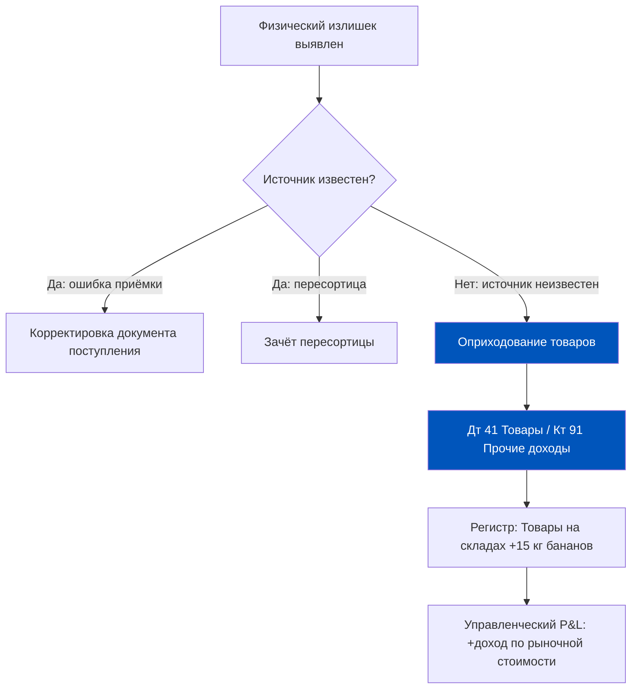
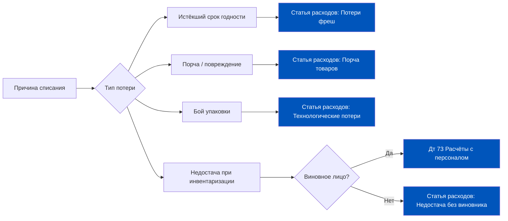
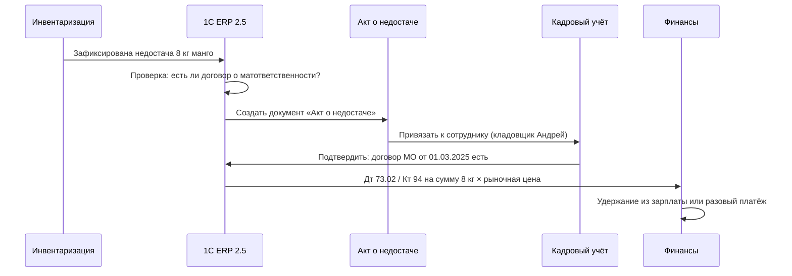
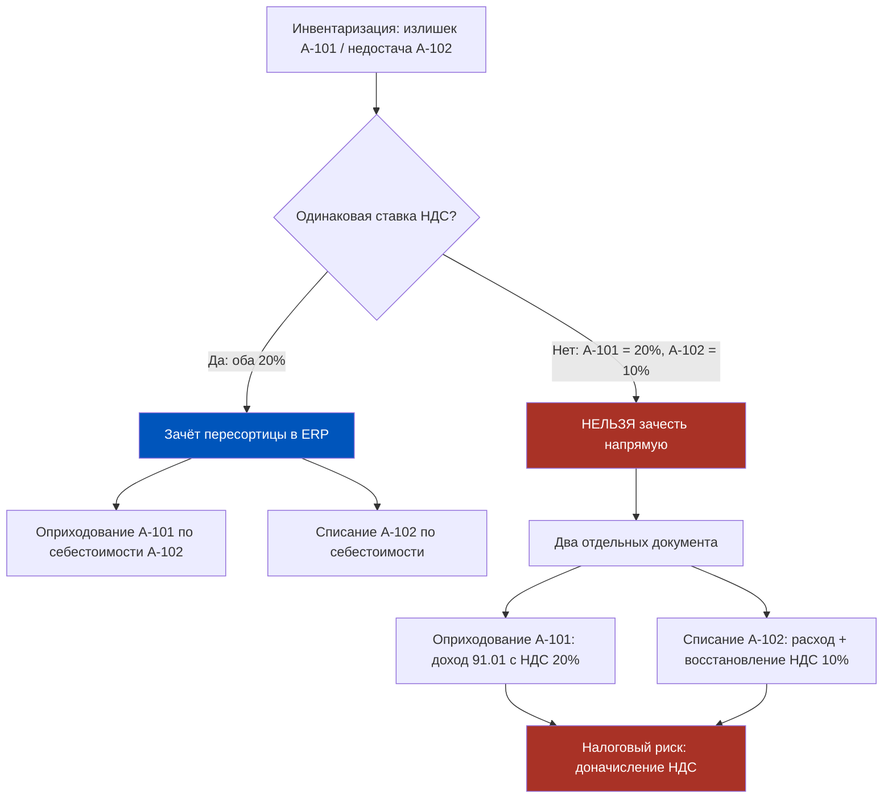
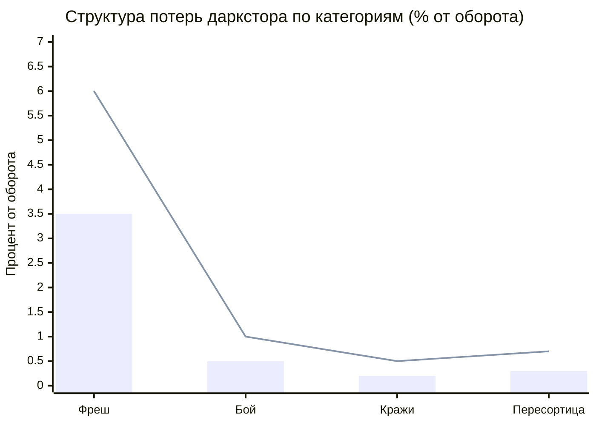
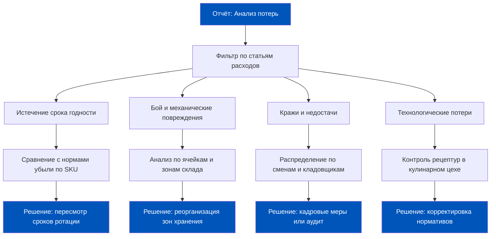
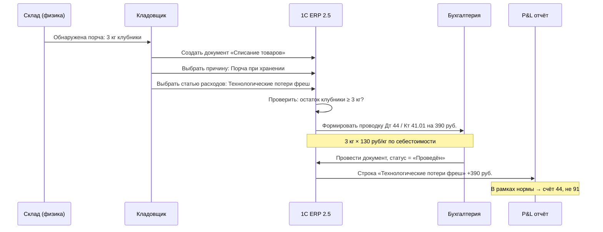
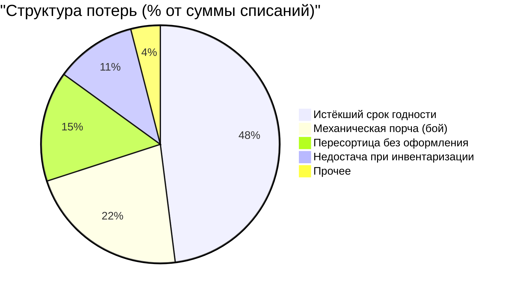
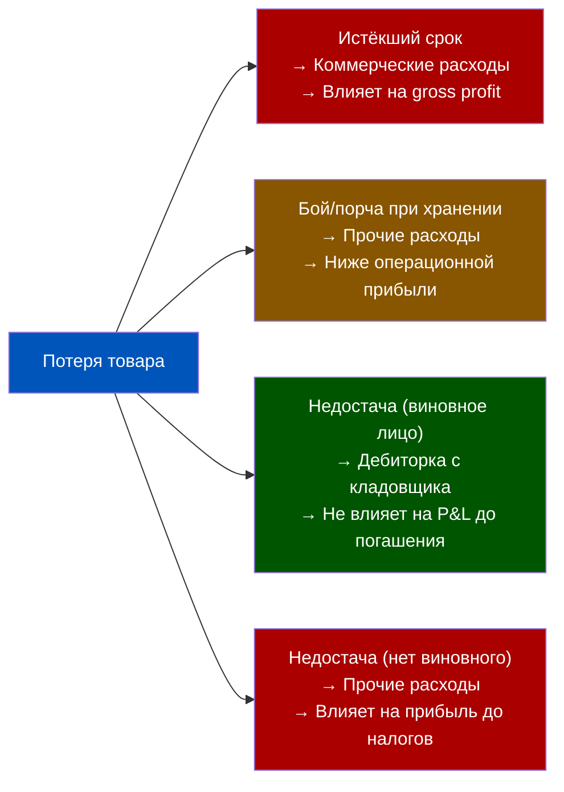

# Неделя 5, День 4. Оприходование и Списание: Оформление потерь и излишков

> **Цель урока:** Научиться корректно оформлять документы оприходования и списания в 1C:ERP 2.5, понять финансовые последствия каждой операции для P&L и разобраться с логикой пересортицы и материальной ответственности.
>
> **Компетенции после урока:**
> - Различать документы «Оприходование товаров» и «Списание товаров» и знать, когда применяется каждый
> - Правильно выбирать статью расходов при списании, чтобы не исказить P&L
> - Оформлять пересортицу в ERP 2.5 и понимать её налоговые риски
> - Контролировать структуру потерь в Q-commerce по категориям
>
> **Время:** ~75 минут

---

## Оглавление

- [[#Часть 1. Крючок: два документа, два судьбы]]
- [[#Часть 2. Оприходование товаров: когда склад богатеет]]
- [[#Часть 3. Списание товаров: когда склад теряет]]
- [[#Часть 4. Виновное лицо и материальная ответственность]]
- [[#Часть 5. Пересортица: когда один товар маскируется под другой]]
- [[#Часть 6. Q-commerce потери: цифры, нормы и контроль]]
- [[#Часть 7. Глоссарий]]

---

## Часть 1. Крючок: два документа, два судьбы

Вечер пятницы. Кладовщик Андрей заканчивает инвентаризацию в даркстор «Полярная» и обнаруживает нечто странное. На полке с бананами лежит на 15 кг больше, чем числится в системе. При этом в ячейке с манго — минус 8 кг по сравнению с учётными данными.

Казалось бы, один склад, одна смена, одна инвентаризация. Но в 1C:ERP 2.5 Андрей должен создать два принципиально разных документа. И каждый из них нажмёт на разные кнопки в финансовой машине предприятия.

Почему не один документ? Потому что бананы и манго — это разные истории. Бананы — это актив, который появился из ниоткуда. ERP не может просто «принять» его без объяснения источника: иначе система нарушит двойную запись, и бухгалтерия получит дебет без кредита. А недостача манго — это потеря, которую нужно либо отнести на расходы компании, либо предъявить виновному лицу.

Два документа. Два финансовых последствия. Ноль возможностей их перепутать.

В этом уроке мы разберём механику обоих операций — с точностью часовщика и без лишнего академизма.

---

## Часть 2. Оприходование товаров: когда склад богатеет

### Что такое оприходование и когда оно возникает

Документ «Оприходование товаров» в 1C:ERP 2.5 — это инструмент для постановки на учёт товаров, которые физически существуют на складе, но в системе не отражены. Говоря языком бухгалтерии: дебетуем счёт товаров, а кредитуем что-то, что объяснит источник этого богатства.

Три типичных сценария возникновения излишков в Q-commerce:

**Сценарий А — Инвентаризационный излишек.** Самый распространённый. Физический пересчёт выявил больше товара, чем числится в системе. Причины: ошибочное двойное поступление без отражения в ERP, неверный учёт при приёмке, пересортица (разобрём в Части 5).

**Сценарий Б — Неучтённые остатки при вводе системы.** При первоначальном внедрении 1C:ERP на новый даркстор или при переходе с другой системы. Остатки нужно «ввести в систему» одним документом.

**Сценарий В — Производственный излишек.** Редко, но в Q-commerce встречается: кулинарный цех нарезал порций на 3 кг больше, чем планировал по рецептуре. Выход готовой продукции превысил норматив.

### Бухгалтерская механика: что происходит в регистрах

Когда бухгалтер проводит документ «Оприходование товаров», 1C:ERP 2.5 делает две вещи одновременно:

1. **В регистре накопления «Товары на складах»** появляется запись о приходе: +15 кг бананов, ячейка А-12, партия от сегодняшней даты.
2. **В регистре бухгалтерии** формируется проводка: Дт 41.01 «Товары на складах» / Кт 91.01 «Прочие доходы».

Важный нюанс для продакта: счёт 91.01 — это «прочие доходы», не выручка от продаж. Это значит, что в управленческом P&L излишек попадает в отдельную строку, не смешиваясь с основным товарооборотом. Финансовый директор видит это как «аномальный доход» — сигнал для расследования.

**Оценка излишка.** По умолчанию 1C:ERP 2.5 предлагает оприходовать излишек по рыночной цене на дату документа. Продакту важно знать: если бананы закуплены по 80 руб./кг, а рыночная цена 120 руб./кг — система зафиксирует 120 × 15 = 1 800 руб. дохода. Это реальный налоговый доход, который уйдёт в налогооблагаемую базу.

### Поля документа, которые влияют на аналитику

| Поле | Значение для продакта |
|---|---|
| Склад | Определяет, в каком регистре остатков отразится приход |
| Подразделение | Влияет на управленческую аналитику по центрам затрат |
| Статья доходов | Разделяет «нормальные» излишки от «подозрительных» в отчётности |
| Ответственный | Кто подписал документ — важно для аудита |

---

## Часть 3. Списание товаров: когда склад теряет

### Анатомия документа «Списание товаров»

Если оприходование — это «склад обнаружил золото», то списание — это «склад зафиксировал дыру». Документ «Списание товаров» уменьшает физические и учётные остатки и одновременно увеличивает расходы предприятия.

Для Q-commerce это повседневная реальность: фреш портится, упаковка бьётся, что-то теряется. Система должна всё это зафиксировать корректно — иначе P&L будет ложью.

### Виды списания и их место в P&L

**Истёкший срок годности.** Самая частая причина в Q-commerce. Товар технически исправен, но продавать его нельзя. В ERP создаётся документ «Списание товаров» с основанием «срок годности истёк». Статья расходов: «Потери от истечения сроков годности». В P&L это строка в операционных расходах, которую финдиректор видит как сигнал неэффективности управления запасами.

**Порча и бой.** Разбитая упаковка, протёкший сок, примятые овощи — всё это физическая порча. Разница между «порчей» и «боем» в терминологии 1C: порча — это деградация качества, бой — механическое повреждение упаковки. На практике для Q-commerce это одна и та же статья расходов, но налоговая иногда требует разделения.

**Недостача по результатам инвентаризации.** Товар числился, но физически не обнаружен. Здесь ERP требует явного указания: есть ли виновное лицо? Если да — сумма потери переходит на счёт 73 «Расчёты с персоналом по возмещению материального ущерба». Если нет — идёт на расходы компании.

### Бухгалтерские проводки при списании

| Ситуация | Дебет | Кредит | Сумма |
|---|---|---|---|
| Естественная убыль (в пределах норм) | 44 Расходы на продажу | 41.01 Товары | По себестоимости |
| Сверх норм (без виновника) | 91.02 Прочие расходы | 41.01 Товары | По себестоимости |
| Сверх норм (есть виновник) | 73.02 Расчёты по ущербу | 41.01 Товары | По рыночной стоимости |
| Порча с НДС | 94 Недостачи | 41.01 + 19 НДС | Себест. + восстановленный НДС |

Обратите внимание на последнюю строку: при списании товаров, по которым ранее был принят НДС к вычету, налоговая требует восстановить НДС. Это дополнительные ~20% к сумме потерь. Именно поэтому правильная классификация причины списания критически важна для налогового учёта.

---

## Часть 4. Виновное лицо и материальная ответственность

### Как ERP фиксирует ответственного

Когда 8 кг манго не нашлись при инвентаризации, система задаёт вопрос: кто несёт ответственность? В 1C:ERP 2.5 этот вопрос решается через связку нескольких элементов.

### Документ «Акт о недостаче» и его юридический вес

«Акт о недостаче» — не просто бумага для галочки. Это юридически значимый документ, который в связке с договором о полной материальной ответственности даёт компании право взыскать ущерб с сотрудника.

**Три условия для взыскания ущерба (ТК РФ, ст. 243):**
1. Сотрудник — материально ответственное лицо (подписан договор о полной МО).
2. Факт недостачи подтверждён документально (акт инвентаризации + акт о недостаче).
3. Сумма ущерба определена по рыночным ценам на дату обнаружения.

**Что ERP умеет, а что нет.** 1C:ERP 2.5 автоматически рассчитывает сумму ущерба по рыночным ценам из справочника номенклатуры. Но система не проверяет, подписан ли договор о МО — это ответственность HR. Если договора нет, взыскание невозможно, а потеря ляжет на расходы компании. Интеграция с HR-системой (1C:ЗУП или аналогом) позволяет видеть наличие договоров в ERP, но требует отдельной настройки.

### Практический порядок оформления

1. Зафиксировать недостачу в документе «Инвентаризация товаров».
2. Создать «Акт о недостаче» на основании инвентаризации — ERP предложит это автоматически.
3. Указать виновное лицо (выбор из справочника «Физические лица»).
4. Выбрать способ возмещения: удержание из зарплаты или единовременный платёж.
5. ERP сформирует проводку Дт 73.02 / Кт 94 и создаст задолженность сотрудника.

**Лимит удержания.** Трудовой кодекс ограничивает единовременное удержание: не более 20% от зарплаты в месяц. Если сумма ущерба 24 000 руб., а зарплата кладовщика 60 000 руб., удержание растянется на 2 месяца по 12 000 руб. ERP фиксирует остаток долга и автоматически продолжает удержания до полного погашения.

---

## Часть 5. Пересортица: когда один товар маскируется под другой

### Детектив в зоне приёмки

Представьте: кладовщик принял груз поздно ночью. Яблоки Гренни Смит (артикул А-101) и яблоки Голден (артикул А-102) выглядят похоже при плохом освещении. Итог: 20 кг Гренни Смит оказались в ячейке Голдена, и наоборот. При инвентаризации система видит: излишек А-101 = 20 кг, недостача А-102 = 20 кг. Это классическая пересортица.

### Механика зачёта пересортицы в 1C:ERP 2.5

ERP 2.5 позволяет оформить пересортицу через операцию «зачёт» при одновременном выполнении условий:

- Товары относятся к одному наименованию (позволяет учётная политика предприятия).
- Ставки НДС совпадают.
- Излишек и недостача выявлены в одном периоде одной инвентаризацией.
- Сумма зачёта не превышает меньшую из сторон (20 кг излишка vs 8 кг недостачи → зачесть можно только 8 кг).

**Как это оформляется:** В документе «Инвентаризация товаров» есть специальная вкладка «Пересортица». Пользователь вручную сопоставляет строки излишка и недостачи. ERP формирует внутреннее перемещение без дополнительных проводок — это «бесплатная» операция с точки зрения P&L.

### Налоговый риск: когда ставки НДС не совпадают

Это ловушка, в которую часто попадают Q-commerce компании. Молоко (НДС 10%) и кофе (НДС 20%) перепутали при сборке. Налоговая инспекция рассматривает такую пересортицу как два отдельных события:

- Появление молока = доход, облагаемый НДС 10%.
- Исчезновение кофе = потеря с восстановлением НДС 20%.

Разница ставок создаёт реальное налоговое обязательство там, где товар просто «переложили не в ту ячейку». Сумма доначисления НДС при объёме пересортицы 100 000 руб.: (20% − 10%) × 100 000 = 10 000 руб. дополнительного НДС.

**Совет продакту:** Настройте в справочнике номенклатуры чёткое разделение ставок НДС и проводите регулярный аудит правильности присвоения ставок. Ошибка в карточке товара обходится дороже, чем кажется.

---

## Часть 6. Q-commerce потери: цифры, нормы и контроль

### Анатомия потерь даркстора

Любой даркстор теряет товар. Вопрос в том, сколько и почему. Отраслевые данные по Q-commerce в России дают следующую структуру потерь от оборота:

| Категория потерь | Норма, % | Тревожный уровень, % | Критический уровень, % |
|---|---|---|---|
| Фреш (скоропорт, истёкший срок) | 2,5–3,5 | 4,0–5,5 | >6,0 |
| Бой упаковки | 0,3–0,5 | 0,6–0,9 | >1,0 |
| Кражи и необъяснимые недостачи | 0,1–0,2 | 0,3–0,4 | >0,5 |
| Пересортица (неисправленная) | 0,1–0,3 | 0,4–0,6 | >0,7 |
| Итого потери | 3,0–4,5 | 5,3–7,4 | >8,2 |

### Нормы естественной убыли: что это и зачем

Естественная убыль — это нормативно установленные потери товара при хранении и транспортировке, которые не являются хищением или халатностью. Для пищевых продуктов нормы утверждены приказами Минэкономразвития.

**Примеры норм для Q-commerce (приказ Минторга, действующая редакция):**

| Товар | Норма убыли в сутки, % | Норма за 30 дней, % |
|---|---|---|
| Бананы (хранение при +14°С) | 0,08 | 2,4 |
| Томаты (охлаждение +4°С) | 0,12 | 3,6 |
| Молоко (охлаждение +4°С) | 0,03 | 0,9 |
| Листовой салат | 0,15 | 4,5 |
| Замороженные продукты | 0,01 | 0,3 |

**Почему это важно для ERP.** Потери в пределах норм списываются на счёт 44 «Расходы на продажу» без восстановления НДС. Потери сверх норм требуют восстановления НДС и относятся на счёт 91.02 «Прочие расходы». Разница в налоговой нагрузке может составлять до 20% от суммы сверхнормативных потерь.

В 1C:ERP 2.5 нормы естественной убыли настраиваются в справочнике «Нормы убыли» и применяются автоматически при формировании документа «Списание товаров».

### Как ERP помогает контролировать каждую категорию

### Настройка предупреждений в ERP

1C:ERP 2.5 не имеет встроенного механизма «порогового оповещения» по потерям в типовой конфигурации. Но есть два рабочих подхода:

**Подход А — Регулярные отчёты.** Настройте расписание автоматической рассылки отчёта «Анализ потерь» еженедельно на финдиректора и операционного директора. Это не real-time, но покрывает 80% потребностей.

**Подход Б — Бюджетирование потерь.** Введите в модуль «Бюджетирование» статью «Нормативные потери» с плановыми значениями по каждой категории. При план-фактном анализе отклонение свыше 5% по любой позиции автоматически попадёт в красную зону сводного отчёта.

Для Q-commerce с оборотом более 10 млн руб./месяц разница между нормативными потерями 3,5% и фактическими 6,2% — это 270 000 руб./месяц, уходящих непонятно куда. ERP даёт инструменты сделать эти деньги видимыми.

### Жизненный цикл потерь в ERP: от факта до отчёта

Чтобы понять, почему структура потерь иногда «не сходится» в отчётности, полезно видеть полный путь от физического события до строки в P&L.

Этот поток кажется простым, пока всё идёт штатно. Ошибки возникают на двух переходах:

**Переход 1: «физика → документ».** Кладовщик обнаружил порчу в 14:30, но создал документ в 17:00 следующего дня — с датой «вчера». ERP позволяет это сделать. Результат: движение товара зафиксировано не в тот день, что ломает дневную динамику остатков. При работающем ТСД с временными метками этот риск снижается: система фиксирует реальное время сканирования.

**Переход 2: «документ → статья расходов».** Кладовщик выбрал не ту статью расходов — «Недостача без виновника» вместо «Порча при хранении». Это меняет не сумму, а аналитику: финдиректор видит недостачу там, где была банальная порча. Через 3 месяца структура потерь искажена, и принять правильное операционное решение по ней невозможно.

### Как оценить «цену» неправильной статьи расходов

Рассмотрим конкретный расчёт. Даркстор списывает 50 000 руб./месяц потерь фреша через статью «Недостача без виновника» вместо «Естественная убыль».

**Налоговые последствия:**
- «Естественная убыль» в пределах норм → НДС не восстанавливается. Счёт 44.
- «Недостача без виновника» → НДС восстанавливается в полном объёме. Счёт 94, затем 91.02.
- Разница по НДС: 50 000 × 20% = 10 000 руб. дополнительного НДС к уплате ежемесячно.
- Годовой ущерб от одной «неправильной» статьи расходов: 10 000 × 12 = 120 000 руб.

**Управленческие последствия:**
- Завышенная строка «Недостачи» сигнализирует о возможном хищении — руководство тратит время на расследование.
- Занижена строка «Потери фреша» — неверный сигнал о том, что с ротацией товара всё в порядке.
- Решения по закупкам (заказать больше/меньше скоропорта) принимаются на основе искажённой картины.

---

## Часть 7. Глоссарий

**Оприходование товаров** — документ 1C:ERP 2.5 для постановки на баланс товаров, выявленных в излишке при инвентаризации или не отражённых в системе ранее. Проводка: Дт 41.01 / Кт 91.01.

**Списание товаров** — документ для снятия с баланса товаров, утраченных по любой причине (порча, недостача, истечение срока). Проводка зависит от причины и наличия виновника.

**Пересортица** — ситуация, когда излишек одного товара совпадает с недостачей другого аналогичного товара. ERP позволяет зачесть их взаимно при совпадении ставок НДС.

**Естественная убыль** — нормативные потери товара при хранении и транспортировке, утверждённые приказами профильных министерств. Списывается без восстановления НДС.

**Виновное лицо** — сотрудник, признанный материально ответственным за недостачу. Для взыскания ущерба требуется договор о полной материальной ответственности (ТК РФ, ст. 243).

**Статья расходов** — аналитический признак в ERP, определяющий, в какую строку P&L попадут расходы на списание. От правильного выбора статьи зависит корректность управленческой отчётности.

**Акт о недостаче** — юридически значимый документ, фиксирующий факт недостачи, её сумму и виновное лицо. Является основанием для удержания ущерба из заработной платы.

**Счёт 73.02** — «Расчёты с персоналом по возмещению материального ущерба». На этот счёт переносится сумма недостачи при наличии виновного лица.

**Восстановление НДС** — обязательное доначисление НДС при списании товаров сверх норм естественной убыли. Увеличивает фактическую стоимость потерь на 10–20%.

---

## Приложение: Пошаговые инструкции для продакта

### Как создать документ «Оприходование товаров» в ERP 2.5

Маршрут в интерфейсе: **Склад и доставка → Внутренние документы → Оприходование товаров → Создать**.

Поля, обязательные для заполнения:
- **Организация** — юрлицо, на баланс которого приходуется товар.
- **Склад** — склад, где физически обнаружен излишек.
- **Дата** — дата обнаружения излишка (не дата создания документа).
- **Статья доходов** — выбрать из справочника. Если нужной статьи нет — согласовать с бухгалтерией и создать.
- **Табличная часть «Товары»:** номенклатура, количество, цена (рыночная), сумма.

После заполнения нажать **«Провести»** (не «Провести и закрыть» — это разные кнопки). Статус документа изменится с «Черновик» на «Проведён». Только после этого регистр остатков обновится.

**Типичная ошибка:** Создать документ и забыть провести. Документ существует в базе, но на остатки не влияет. Такие «зависшие черновики» — одна из причин расхождений при инвентаризации.

### Как создать документ «Списание товаров» в ERP 2.5

Маршрут: **Склад и доставка → Внутренние документы → Списание товаров → Создать**.

Критически важные поля:
- **Причина списания** — выбрать из заранее настроенного справочника. Причина влияет на предлагаемую статью расходов.
- **Статья расходов** — финальный выбор остаётся за пользователем, но причина задаёт «правильный» дефолт.
- **Виновное лицо** — заполнять только при наличии документально подтверждённой вины.
- **Склад** — если складов несколько, выбрать конкретный. Списание с «неправильного» склада создаст расхождение.

**Важно:** После проведения документа систему автоматически предложит создать «Акт о списании» для печати. Этот акт подписывается комиссией (минимум 3 человека) и хранится в архиве. Без подписанного акта налоговая может не принять расходы.

### Сравнительная таблица: коробка vs кастом для управления потерями

| Задача | Типовой функционал ERP 2.5 | Кастомизация | Вердикт |
|---|---|---|---|
| Учёт потерь по статьям | Есть, настройка статей расходов | Не нужна | Коробка |
| Нормы естественной убыли | Есть справочник, ручное обновление | Автоимпорт из Минторга | Коробка для старта |
| Оповещение при превышении порога | Нет в типовом | Регламентное задание + рассылка | Лёгкий кастом |
| Автоматическое списание по сроку годности | Нет в типовом | Интеграция с маркировкой Честного ЗНАКА | Средний кастом |
| Анализ потерь в разрезе кладовщиков | Есть через статью «Виновное лицо» | Нет | Коробка |
| Real-time dashboard потерь | Нет | BI-система поверх ERP | Тяжёлый кастом |

**Вывод для продакта:** На 80% потребностей даркстора хватает типового функционала ERP 2.5. Инвестиции в кастомизацию оправданы только при обороте фреша выше 5 млн руб./месяц — тогда экономия от автоматического контроля сроков годности окупает разработку за 4–6 месяцев.

### Разбор ошибок: топ-5 граблей при оприходовании и списании

**Грабли 1: Оприходование вместо корректировки поступления.**
Ситуация: поставщик привёз 110 кг вместо 100 кг бананов, но накладная на 100 кг. Кладовщик принял 110 кг «по факту» и создал оприходование на 10 кг. Ошибка: правильно было создать расхождение при приёмке и согласовать с поставщиком корректировочный УПД. Оприходование исказило взаиморасчёты: поставщик поставил 110 кг, а ERP видит «поступление 100 кг + оприходование 10 кг». Кредиторская задолженность занижена на стоимость 10 кг.

**Грабли 2: Списание по рыночной цене вместо себестоимости.**
По умолчанию 1C:ERP 2.5 при списании использует себестоимость из регистра «Себестоимость товаров». Но если оператор вручную ввёл рыночную цену в поле «Цена» — сумма списания окажется завышена. Проводка: Дт 44 / Кт 41 на сумму больше себестоимости. Разница уйдёт как неоправданный расход, занижая прибыль.

**Грабли 3: Несовпадение единиц измерения.**
Карточка товара: единица хранения «кг», единица продажи «шт» (порция 250 г = 0,25 кг). Кладовщик создаёт списание и вводит «4 шт» думая о 4 порциях. ERP интерпретирует «4 шт» как базовую единицу — если базовая единица «шт» и коэффициент не настроен, списание уйдёт неверно. Всегда проверять, что единица измерения в документе списания совпадает с фактической единицей хранения.

**Грабли 4: Список товаров в документе не совпадает со складом документа.**
ERP позволяет создать документ списания, указать склад «Центральный», а в табличной части добавить товар, которого на «Центральном» нет (он на «Северном»). Документ проведётся — ERP не всегда проверяет наличие при проведении (зависит от настроек). Результат: остаток «Центрального» уйдёт в минус, а «Северный» останется с излишком. Это технический тип расхождения, разобранный в уроке 6.

**Грабли 5: Одновременное проведение инвентаризации и отгрузок.**
Пока идёт инвентаризация и оприходования/списания ещё не проведены — ERP отображает «старые» остатки. Кладовщик параллельно собирает заказ и берёт последние 5 кг манго. Инвентаризация фиксирует 0 кг, создаётся оприходование на 3 кг (излишек). Инвентаризация проводится — ERP добавляет 3 кг. Итого: 3 кг в остатке, но физически 0. Вывод: при крупных инвентаризациях на скоропортящиеся позиции рекомендуется временная блокировка движения по этим позициям (настраивается через «Запрет редактирования данных»).

### Внутренние проверки ERP: что система контролирует автоматически

1C:ERP 2.5 выполняет ряд проверок при проведении документов оприходования и списания. Понимание этих проверок позволяет предсказать, когда документ проведётся, а когда выдаст ошибку.

**При проведении оприходования:**
- Заполнена ли цена? (Если нет — предупреждение, но не блокировка.)
- Выбрана ли статья доходов? (Обязательно при соответствующей настройке учётной политики.)
- Есть ли разрешение у пользователя на операцию «Оприходование»? (Роль в 1C.)

**При проведении списания:**
- Достаточно ли остатка на выбранном складе? (Блокировка, если включена опция «Контроль остатков».)
- Заполнено ли виновное лицо при причине «Недостача»? (Предупреждение, но не блокировка в типовой конфигурации.)
- Относится ли статья расходов к разрешённым для данного подразделения?

Наличие «мягких» проверок (предупреждение, а не блокировка) — это осознанное архитектурное решение 1C: оперативность важнее строгости. Для Q-commerce это разумно — нельзя останавливать склад из-за того, что бухгалтер ещё не настроил справочник статей расходов. Но это означает, что человеческая ошибка всегда возможна, и регулярный аудит остатков (как в Уроке 6) является обязательной частью операционной дисциплины.

---

### Финансовая математика потерь: сколько стоит 1% списаний

Для даркстора с оборотом 5 млн рублей в месяц:

| Уровень списаний | Потери/мес. | Потери/год | Источник |
|---|---|---|---|
| 1,0% | 50 000 руб. | 600 000 руб. | Нижняя граница нормы |
| 2,5% | 125 000 руб. | 1 500 000 руб. | Средняя Q-commerce |
| 4,0% | 200 000 руб. | 2 400 000 руб. | Без контроля FEFO |
| 6,2% | 310 000 руб. | 3 720 000 руб. | Ситуация из кейса «Северная звезда» |

**Структура потерь типичного даркстора (% от оборота):**

Почти половина всех списаний (48%) — это истёкший срок годности. Именно поэтому FEFO (Неделя 4, День 4) является критически важным инструментом: правильное управление партиями напрямую уменьшает главную статью потерь.

### Счёт бухгалтерских проводок по типу потерь

Важный нюанс для продакта: способ оформления списания влияет на P&L по-разному.

Это важно при формировании управленческой отчётности: коммерческие потери (срок, качество) — это себестоимость продаж, они снижают валовую прибыль. Операционные потери (кражи, вина сотрудников) — это другая строка. Смешивать нельзя.

← [[Неделя 5 - День 3 - Инвентаризация|← День 3]] | [[1c_erp_qcom/README|Оглавление]] | [[Неделя 5 - День 5 - Мобильное рабочее место кладовщика|День 5 →]]
