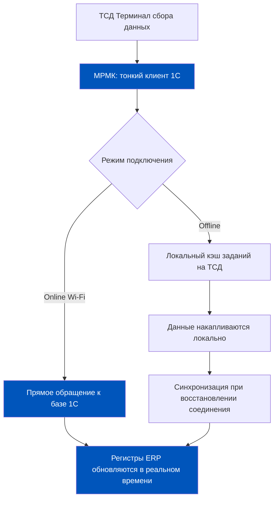
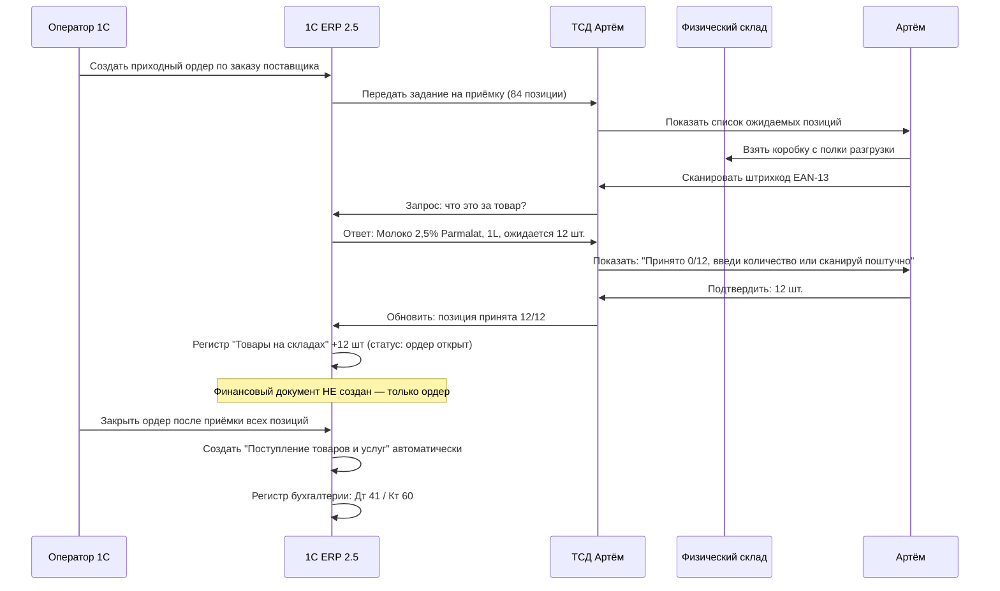
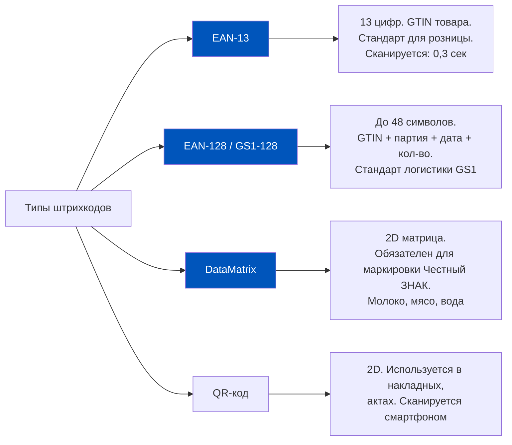
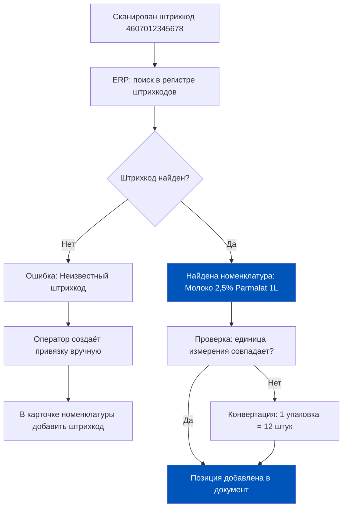
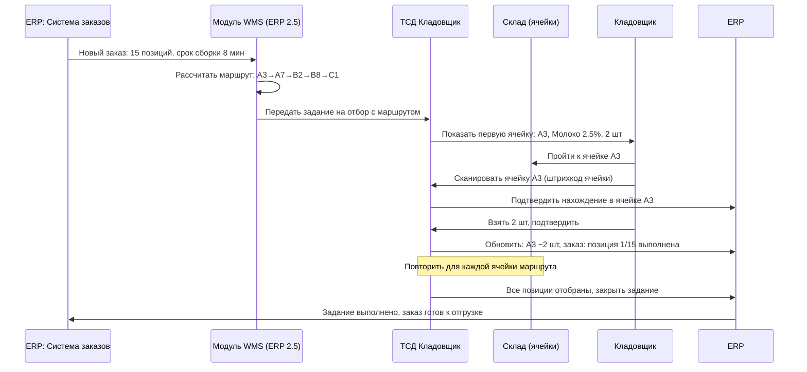
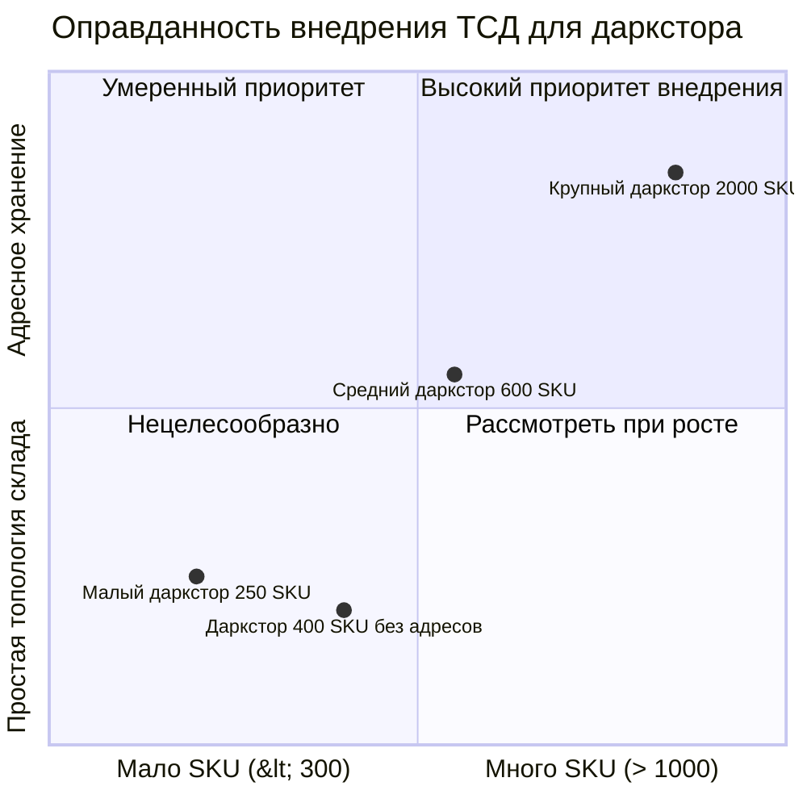
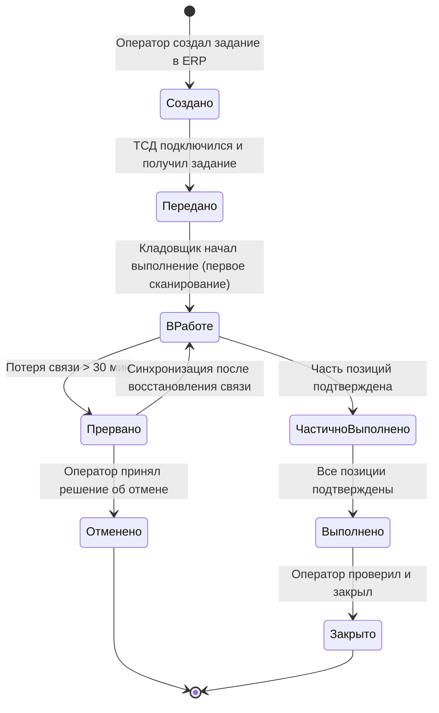
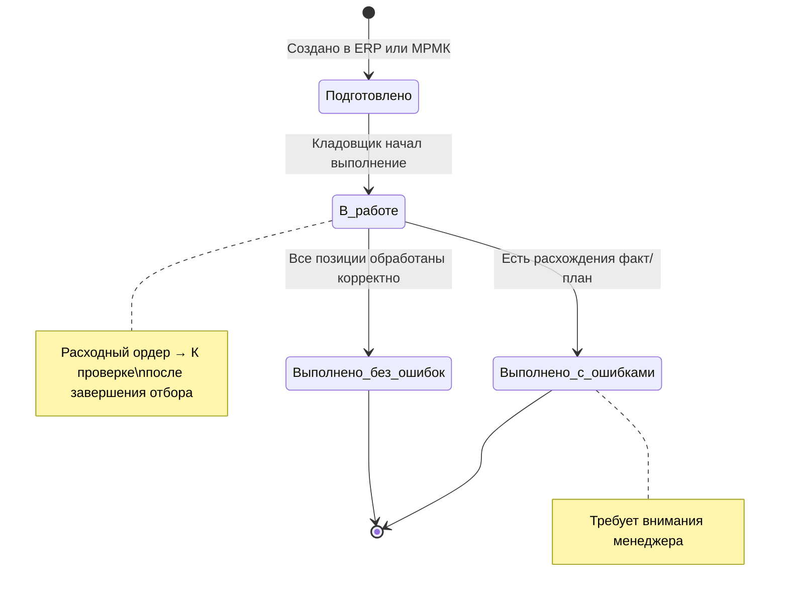

# Неделя 5, День 5. Мобильное рабочее место кладовщика: Когда 1C выходит в поле

> **Цель урока:** Понять архитектуру и логику мобильного рабочего места кладовщика (МРМК) в 1C:ERP 2.5 — как ТСД интегрируется с системой, какие операции он поддерживает и когда его внедрение оправдано для даркстора.
>
> **Компетенции после урока:**
> - Объяснить архитектуру МРМК и поток данных между ТСД и ERP
> - Понять логику штрихкодирования (EAN-13, EAN-128, DataMatrix, GS1) и привязки к номенклатуре
> - Оценить, оправдано ли внедрение ТСД для конкретного даркстора
> - Описать типичные операции МРМК и их связь с документами ERP
>
> **Время:** ~75 минут

---

## Оглавление

- [[#Часть 1. Крючок: склад без форм 1C]]
- [[#Часть 2. Архитектура МРМК: как устроен интерфейс на ТСД]]
- [[#Часть 3. Поток данных: от сканирования до регистра ERP]]
- [[#Часть 4. Штрихкодирование: язык, которым товар говорит с системой]]
- [[#Часть 5. Практические операции в МРМК]]
- [[#Часть 6. Q-commerce: когда ТСД оправдан, а когда это overhead]]
- [[#Часть 7. Глоссарий]]

---

## Часть 1. Крючок: склад без форм 1C

Кладовщик Артём начинает смену в 6:00. Берёт ТСД — это такой промышленный смартфон с лазерным сканером, защищённый от падений и влаги. На экране — минималистичный интерфейс: три иконки («Приёмка», «Отбор», «Инвентаризация»), индикатор зоны Wi-Fi и заряд батареи 87%.

Артём не видит ни одной полной формы 1C. Никаких вкладок, никаких списков из 40 полей, никаких кнопок «Провести и закрыть». Только задание: «Принять поступление №12345, 84 позиции, зона А». Артём сканирует штрихкод первой коробки — система говорит: «Молоко 2,5%, 12 шт. Ожидается: 12. Принято: 0». Он подтверждает. Следующая. И так 84 раза за 23 минуты.

Но вот вопрос, который должен задать себе продакт: что происходит в 1C в этот момент? Кто создаёт документы? Где живут промежуточные состояния? Что случится, если Wi-Fi пропадёт на 10-й коробке из 84-х?

Ответы на эти вопросы — не технические детали для программиста. Это операционная архитектура, от которой зависит точность остатков, скорость закрытия месяца и ответ на вопрос финдиректора: «Почему у нас расхождение 3,7% в молочке за март?»

---

## Часть 2. Архитектура МРМК: как устроен интерфейс на ТСД

### Что такое МРМК в терминах 1C:ERP

МРМК (Мобильное рабочее место кладовщика) — это специализированный интерфейс 1C:ERP 2.5, оптимизированный для работы на устройствах с небольшим экраном и аппаратным сканером штрихкодов. Технически это не отдельное приложение, а тонкий клиент 1C с упрощённым UX, работающий поверх полноценной базы данных.

Важно понимать: МРМК — это не «мобильное приложение» в смысле iOS/Android-апп. Это веб-клиент 1C или мобильная платформа 1C, которая требует постоянного (или периодического) соединения с сервером 1C.



### Поддерживаемые операции МРМК

МРМК в версии 1C:ERP 2.5 поддерживает 11 типовых складских операций (не 6, как часто думают):

| Операция | Документ в ERP | Обновляемый регистр |
|---|---|---|
| Приёмка товаров на склад | Приходный ордер на товары | Товары на складах (+) |
| Отгрузка товаров со склада | Расходный ордер на товары | Товары на складах (−) |
| Размещение товаров по ячейкам | Задание на размещение | Товары в ячейках |
| Отбор товаров из ячеек | Задание на отбор | Товары в ячейках (резерв) |
| Перемещение товаров | Перемещение товаров | Товары на складах (2 склада) |
| Переупаковка товаров | Задание на переупаковку | Остатки по упаковкам |
| Проведение инвентаризации | Пересчёт товаров | Инвентаризационные ведомости |
| Поиск товара на складе | — (справочно) | Остатки и ячейки |
| Просмотр остатков в ячейках | — (справочно) | — |
| Блокировка ячеек | Блокировка ячеек | Статус ячейки |
| Редактирование карточки товара | Номенклатура | Справочник |

Редактирование карточки товара из МРМК включает: дополнение весом и объёмом, создание упаковки, присвоение штрихкода, добавление фото с камеры устройства. Также поддерживается присвоение ячейки и дополнительной ячейки для товара при справочном хранении.

**Важно:** МРМК работает на складах **с ордерной схемой документооборота** при любом варианте использования ячеек: без ячеек, со справочным и с адресным хранением. Без ордерной схемы МРМК недоступен.

**Ключевое архитектурное решение в ERP 2.5:** Ордерная схема. МРМК работает исключительно с ордерами — промежуточными документами, фиксирующими факт физического движения товара. Финансовый документ (например, «Приобретение товаров и услуг») создаётся отдельно, бухгалтером или автоматически после закрытия ордера. Это разделение «физика vs финансы» — архитектурная основа всей складской логики ERP 2.5.

### Разделы МРМК: структура интерфейса

В отличие от полного клиента 1C МРМК разделён на 5 функциональных разделов:

| Раздел | Что доступно |
|---|---|
| Приёмка и размещение | Распоряжения на приёмку, Приходные ордера, Товары к размещению, Задания на размещение |
| Отгрузка и отбор | Распоряжения на отгрузку, Ордера к отбору, Задания на отбор, Ордера к проверке, Ордера к отгрузке |
| Прочие операции | Задания на перемещения, Пересчёты товаров, Блокировка ячеек |
| Отчёты | Поиск товара (сканирование ШК → остатки), Остатки в ячейках |
| Настройки | Текущий пользователь, выбор склада, показ фото товаров |

**Раздел «Ордера к проверке»** — особый механизм контроля качества сборки. Разделён на две вкладки: «Свободные» (ордера в статусе «К проверке», которые можно взять) и «Мои» (ордера, назначенные на текущего пользователя). Команды свайпом: «Назначить мне», «Начать проверку», «Снять с меня». Этот раздел реализует принцип «четырёх глаз»: один сотрудник отбирает, другой контролирует.

**Роли для контроля сборки:**
- «Проверка только своих ордеров» — пользователь проверяет ордера, где он указан исполнителем
- «Проверка только чужих ордеров» — пользователь проверяет ордера других (классический сценарий контроля качества)
- Типовой профиль «Работник склада» включает обе роли

### Связь с задачами ERP: жизненный цикл задания

Задание кладовщика — центральный объект МРМК. Оно создаётся в ERP (обычно автоматически при проведении заказа или вручную оператором), передаётся на ТСД и закрывается после подтверждения кладовщиком.

Статусы задания: «Создано» → «Передано на ТСД» → «В работе» → «Частично выполнено» → «Выполнено» → «Закрыто». Каждый переход статуса фиксируется в журнале регистрации ERP с timestamp и пользователем.

---

## Часть 3. Поток данных: от сканирования до регистра ERP

### Последовательность событий при приёмке

Разберём полный цикл операции приёмки — от момента, когда поставщик въехал в зону разгрузки, до момента, когда товар «встал на учёт» в ERP.



### Offline-режим: что происходит при потере связи

Если Wi-Fi пропадает в момент, когда Артём уже принял 40 из 84 позиций, ТСД переходит в offline-режим. Принятые данные сохраняются в локальном кэше устройства. Артём продолжает работу — сканирует, подтверждает количества.

**Риски offline-режима:**

Первый риск — конфликт данных. Пока Артём работал offline, оператор в ERP мог внести изменения в ордер (например, поставщик прислал 5 штук вместо 10 по одной позиции). При синхронизации возникнет конфликт. ERP 2.5 разрешает конфликты по принципу «сервер приоритетнее» — данные ТСД могут быть частично перезаписаны.

Второй риск — задержка обновления остатков. Пока ТСД не синхронизировался, система не знает о принятом товаре. Если другой кладовщик в это время собирает заказ и запрашивает остаток молока — ERP покажет «0», хотя физически 40 пачек уже на полке.

**Практическое правило:** В Q-commerce с временем доставки 15–30 минут offline-режим длительностью более 5 минут создаёт операционный риск. Инфраструктура Wi-Fi на складе — не IT-вопрос, а продуктовый.

---

## Часть 4. Штрихкодирование: язык, которым товар говорит с системой

### Типы штрихкодов в складской логистике



### Что кодируется в GS1-128 и DataMatrix

GS1 — международный стандарт для кодирования информации о товаре. В одном штрихкоде GS1-128 или DataMatrix может быть зашито до 5 атрибутов:

| Идентификатор приложения (AI) | Что означает | Пример значения |
|---|---|---|
| AI (01) | GTIN — глобальный идентификатор товара | 04607012345678 |
| AI (10) | Номер партии / лота | LOT-2025-03-15 |
| AI (17) | Дата окончания срока годности (YYMMDD) | 250630 = 30 июня 2025 |
| AI (30) | Количество единиц в упаковке | 012 = 12 штук |
| AI (37) | Количество единиц потребительской упаковки | 001 |

**Как ERP декодирует штрихкод.** Когда Артём сканирует DataMatrix на упаковке молока, ТСД передаёт в ERP строку из 40–80 символов. 1C:ERP 2.5 разбирает её по стандарту GS1 Application Identifiers: сначала ищет AI (01) — это GTIN, по которому находит карточку товара в справочнике номенклатуры. Затем извлекает AI (17) — срок годности, и автоматически проставляет его в серийный номер или партию товара (зависит от настроек учёта).

**Система «Честный ЗНАК»** обязывает производителей молока, мяса, воды и другой подконтрольной продукции маркировать каждую единицу уникальным DataMatrix-кодом, включающим крипто-хвост для верификации. При сканировании на ТСД ERP передаёт этот код в систему Честного ЗНАКА через API интеграции (настраивается отдельно).

### Привязка штрихкода к номенклатуре в ERP



**Практическая проблема:** У одного товара может быть 3–5 штрихкодов. Молоко Parmalat 1L: один штрихкод на потребительской упаковке, другой — на блоке из 12 штук, третий — на логистическом поддоне из 48 блоков. Все три должны быть заведены в справочник ERP и связаны с одной карточкой номенклатуры с указанием коэффициентов пересчёта. Если это не сделано — кладовщик сканирует штрихкод на коробке, ERP его не находит, операция останавливается.

Типичная Q-commerce ситуация: поставщик поменял упаковку и напечатал новый штрихкод на коробке. Старый штрихкод ERP знает, новый — нет. Приёмка встала в 07:15 утра. Это не техническая проблема — это процессный риск, который продакт должен закрыть соглашением с поставщиком об уведомлении при смене кодировки.

---

## Часть 5. Практические операции в МРМК

### Операция 1: Приёмка с взвешиванием

Фреш принимается по весу, а не по штукам. Для Q-commerce это критично: поставщик привёз 50 кг банановых гроздей, а вес каждой варьируется от 1,1 до 1,8 кг. МРМК поддерживает интеграцию с торговыми весами через COM-порт или Bluetooth.

Последовательность операции:
1. Открыть задание приёмки на ТСД.
2. Сканировать штрихкод весовой позиции (EAN-13 с 5-значным кодом веса для весовых товаров).
3. ТСД отправляет команду на весы → весы возвращают значение 47,3 кг.
4. ERP автоматически проставляет количество 47,3 кг в строку приходного ордера.
5. Кладовщик подтверждает.

**Экономия времени vs ручной ввод:** Типичная приёмка 50 фреш-позиций вручную (запись в бумажную ведомость, потом ввод в ERP) — 45–60 минут. С МРМК и весами — 15–20 минут. Разница: 30–40 минут на каждую поставку. При 3 поставках в день — 1,5–2 часа сэкономленного времени кладовщика.

### Операция 1b: Двухшаговая операция размещения и отбора

Ключевое отличие МРМК от бумажных процессов — **обязательное двухшаговое сканирование** при работе с адресным складом. Это не прихоть интерфейса, а механизм контроля, исключающий ошибки размещения.

**Шаг 1: Сканирование ячейки.** Кладовщик подходит к стеллажу и сканирует штрихкод ячейки (этикетка на ячейке с уникальным адресом). Открывается форма с перечнем товаров, которые должны быть помещены именно в эту ячейку. Плановое количество — чёрным, фактически размещённое — зелёным (совпадает) или красным (расхождение).

**Шаг 2: Сканирование товара.** После сканирования ячейки кладовщик сканирует штрихкоды каждой упаковки. Можно сканировать поштучно (каждый скан добавляет 1 единицу), использовать кнопки «+»/«−» или заполнить плановым количеством кнопкой «Заполнить».

По завершении работы с ячейкой нажимается «Закончить размещение» — товары переходят на вкладку «Размещено». Если в ячейке обнаружена проблема (несоответствие, повреждение) — из формы можно немедленно **заблокировать ячейку**, не выходя в меню администрирования.

Этот же двухшаговый принцип работает при отборе: сначала ШК ячейки (подтверждение местонахождения), потом ШК товара (подтверждение правильности позиции).

### Операция 2: Отбор с маршрутизацией по ячейкам

Задание на отбор в МРМК — это оптимизированный маршрут по складу. ERP рассчитывает последовательность ячеек, минимизирующую пройденный путь (алгоритм S-маршрута или оптимальный).



**Время отбора.** Среднее время ручного отбора 15 позиций без МРМК: 12–18 минут. С МРМК и оптимизированным маршрутом: 7–10 минут. Разница 5–8 минут критична для Q-commerce с обещанием доставки за 15 минут: если из 15 минут 10 уходит на сборку, а ещё 5 — на передачу курьеру, то любая задержка приёмки ломает SLA.

### Операция 3: Инвентаризация по ячейкам через ТСД

Для адресного склада МРМК позволяет провести выборочную инвентаризацию без остановки склада. Кладовщик получает задание «Пересчитать ячейки A1–A20», обходит их со сканером и подтверждает фактическое количество.

**Ключевое преимущество:** ERP скрывает от кладовщика плановые остатки до завершения пересчёта. Это устраняет «удобство» заполнения данных «как надо, а не как есть». После завершения пересчёта ERP автоматически рассчитывает расхождения и предлагает создать документы оприходования и списания.

---

## Часть 6. Q-commerce: когда ТСД оправдан, а когда это overhead

### Матрица решений для даркстора

Внедрение МРМК и ТСД — это инвестиция. Стоимость одного промышленного ТСД (Honeywell, Zebra, Urovo) — от 45 000 до 120 000 руб. Плюс настройка МРМК в ERP, обучение персонала, поддержка Wi-Fi-инфраструктуры. Когда это окупается?



### Когда ТСД оправдан

**Условие 1: Объём номенклатуры от 500 SKU.** При меньшем количестве кладовщик держит большинство позиций в голове. ТСД не даёт ощутимого выигрыша в скорости.

**Условие 2: Адресное хранение.** Если товар хранится в конкретных ячейках и маршрутизация отбора имеет значение — ТСД окупается. Без адресного хранения задание маршрутизировать некуда.

**Условие 3: Высокая текучесть персонала.** Q-commerce теряет до 80% кладовщиков в год. Новый сотрудник без ТСД учит расположение 600+ SKU 2–3 недели. С ТСД и маршрутизацией — 2–3 дня.

**Условие 4: Маркированные товары.** Если даркстор работает с молоком, водой, мясом — DataMatrix сканирование через ТСД обязательно для корректной отчётности в Честный ЗНАК.

### Когда ТСД — это overhead

Даркстор до 300 SKU с простой линейной топологией (3 стеллажа, все на виду): кладовщик видит весь склад с одной точки. Маршрутизация ему не нужна — он и так знает, где что лежит. Ввод данных на стационарном компьютере у стеллажа займёт столько же времени, сколько сканирование ТСД, но без капитальных затрат.

| Параметр | ТСД оправдан | ТСД — overhead |
|---|---|---|
| Количество SKU | > 500 | < 300 |
| Тип склада | Адресный, ячейки | Простой, зональный |
| Текучесть персонала | > 50% в год | < 30% в год |
| Маркированные товары | > 30% ассортимента | < 10% ассортимента |
| Площадь склада | > 200 м² | < 80 м² |
| Поставки в день | > 5 | < 3 |

**Минимальный порог окупаемости.** При 3 поставках в день × 30 минут экономии × 22 рабочих дня = 1 980 минут/месяц = 33 часа. При ставке кладовщика 250 руб./час — экономия 8 250 руб./месяц. ТСД за 80 000 руб. окупится за 9,7 месяца — при условии, что экономия реальна, а не теоретическая. Реальная окупаемость с учётом внедрения и обучения: 18–24 месяца.

---

## Часть 7. Глоссарий

**МРМК (Мобильное рабочее место кладовщика)** — специализированный интерфейс 1C:ERP 2.5, оптимизированный для работы на ТСД. Не отдельное приложение, а тонкий клиент поверх основной базы данных.

**ТСД (Терминал сбора данных)** — промышленное мобильное устройство со встроенным лазерным или имиджевым сканером штрихкодов. Защищён от вибрации, пыли и влаги (класс защиты IP54–IP67). Примеры: Honeywell CT40, Zebra TC52, Urovo DT40.

**Задание кладовщика** — документ в 1C:ERP 2.5, передаваемый на ТСД. Содержит список операций (принять, отобрать, переместить) с маршрутом по ячейкам. Имеет жизненный цикл статусов от «Создано» до «Закрыто».

**EAN-13** — международный стандарт штрихкода из 13 цифр. Кодирует GTIN (глобальный идентификатор торговой единицы). Наносится на потребительскую упаковку. Первые 3 цифры — код страны производителя.

**EAN-128 / GS1-128** — линейный штрихкод для логистических упаковок. Кодирует множество атрибутов: GTIN, партию, срок годности, количество. Стандарт GS1 используется при межскладских перемещениях и поставках.

**DataMatrix** — двумерный матричный штрихкод. Обязателен для маркировки товаров в системе «Честный ЗНАК» (молоко, мясо, вода, лекарства). Содержит уникальный криптоключ для каждой единицы.

**GS1** — международная организация стандартизации идентификации товаров и логистики. Разрабатывает стандарты штрихкодов, форматов данных и процессов электронного документооборота.

**Offline-синхронизация** — режим работы ТСД при отсутствии связи с сервером 1C. Данные накапливаются в локальном кэше устройства и передаются в ERP при восстановлении соединения. Создаёт риски конфликта данных.

**Ордерная схема** — архитектурное решение в 1C:ERP 2.5, разделяющее физическое движение товара (фиксируется ордером) и финансовое движение (фиксируется накладной). МРМК работает только с ордерами.

**S-маршрут** — алгоритм оптимизации пути отбора по складу. Кладовщик проходит стеллажи змейкой: нечётные — слева направо, чётные — справа налево. Снижает пройденное расстояние на 20–35% по сравнению со случайным порядком.

---

## Часть 5b. Параллельный отбор и типовой сценарий на адресном складе

### Параллельный отбор на адресном складе: как это работает в МРМК

На адресном складе по одному документу «Расходный ордер на товары» можно создать **несколько заданий на отбор** и назначить их разным кладовщикам. Это — официально задокументированная возможность ERP 2.5, а не кастомная доработка.

Диспетчирование (назначение исполнителей) выполняется в десктопной версии, после чего каждый кладовщик видит своё задание в разделе «Отгрузка и отбор → Задания на отбор» МРМК.

**Типовой сценарий отгрузки на адресном складе** (по ИТС):
1. Кладовщик берёт распоряжение в работу через раздел «Распоряжения на отгрузку»
2. По нажатию «Начать отгрузку» **одновременно** создаются: Расходный ордер на товары (статус «К отбору») + Задание на отбор — форма задания сразу открывается
3. Кладовщик выполняет отбор, по завершении выбирает: «Перейти к проверке ордера» (если есть права) или «Завершить работу с ордером» (ордер уходит в «Ордера к проверке → Свободные»)
4. Контролёр берёт ордер из «Свободных», нажимает «Назначить мне» → «Начать проверку»
5. После контроля — отгрузка финализируется

**Что происходит с недобором при отборе?** Если кладовщик не нашёл все товары, при завершении отбора МРМК предлагает три варианта:
- «Отменить отгрузку товаров» — неотобранные позиции удаляются из расходного ордера
- «Оставить ордер к отбору» — документ задания сохраняется в статусе «В работе», позже можно доотобрать или создать новое задание
- «Продолжить отбор» — вернуться к текущему заданию

```mermaid
sequenceDiagram
    participant D as Диспетчер (ПК)
    participant K1 as Кладовщик А (ТСД)
    participant K2 as Кладовщик Б (ТСД)
    participant ERP as 1C:ERP
    participant KO as Контролёр (ТСД)

    D->>ERP: Распоряжение на отгрузку
    ERP->>ERP: Расходный ордер (К отбору)
    D->>ERP: Создать 2 задания на отбор\n(Зона А → Кладовщик А,\nЗона Б → Кладовщик Б)
    ERP->>K1: Задание: Зона А, 7 строк
    ERP->>K2: Задание: Зона Б, 8 строк
    K1->>ERP: Выполнено
    K2->>ERP: Выполнено
    ERP->>ERP: Расходный ордер → К проверке
    ERP->>KO: Ордер появился в Свободных
    KO->>ERP: Назначить мне → Начать проверку
    KO->>ERP: Контроль завершён → К отгрузке

    classDef blue fill:#0055BB,color:#fff
    class D,ERP blue
```

## Приложение: Технические детали для продакта

### Настройка МРМК: пошаговый чеклист

Перед внедрением важно понимать: МРМК — не отдельное приложение, а часть конфигурации 1C:ERP. Для запуска требуется:

**Шаг 1: Веб-публикация базы.** Установить и настроить веб-сервер (Apache или IIS), опубликовать базу через Конфигуратор (Администрирование → Публикация на веб-сервере).

**Шаг 2: Настройка прав пользователей.** Для каждого кладовщика:
- Создать пользователя в `НСИ и администрирование → Администрирование → Пользователи`
- Добавить в группу доступа на базе профиля «Работник склада» с дополнительными ролями:
  - «Использование рабочего места кладовщика» — обязательно
  - «Использование автономного режима» — для работы при нестабильном Wi-Fi
- В карточке пользователя установить флажок «Открывать по умолчанию» для формы «Мобильное рабочее место кладовщика»

**Шаг 3: Настройка сканера штрихкодов.** Включить опцию `НСИ → Администрирование → РМК и оборудование → Использовать подключаемое оборудование`. Добавить сканер в список «Подключаемое оборудование», выбрать драйвер «1С:Сканеры штрихкода (NativeApi)», порт: «Клавиатура». Это можно сделать с самого мобильного устройства после первого входа.

**Шаг 4: Установка мобильного клиента.** На устройство с Android или iOS установить мобильный клиент 1C, прописать путь к опубликованной базе, указать логин/пароль кладовщика.

**Шаг 5: Настройка склада.** Убедиться, что на складе включена ордерная схема документооборота — без неё МРМК недоступен.

Настройки можно выполнять как с десктопной версии, так и непосредственно с мобильного устройства (если пользователь имеет соответствующие права).

### Инфраструктурные требования для МРМК

Перед тем как принять решение о внедрении ТСД, продакт должен оценить инфраструктурный минимум. Это не IT-вопрос в вакууме — это операционный риск, который нужно просчитать заранее.

**Wi-Fi покрытие.** МРМК работает на частоте 2,4 ГГц или 5 ГГц (зависит от ТСД). Металлические стеллажи, холодильные камеры с металлическими стенками и плотная застройка ячеек создают мёртвые зоны. Норматив: покрытие не менее 95% площади склада, сигнал не слабее −70 dBm. Для склада 500 м² при стандартных металлических стеллажах обычно требуется 3–4 точки доступа промышленного класса (Cisco, Ubiquiti UniFi) — стоимость от 80 000 руб.

**Сервер 1C.** МРМК создаёт дополнительную нагрузку на сервер: каждый ТСД генерирует 5–15 обращений в минуту при активной работе. 3 ТСД с 15 обращениями = 45 запросов/минуту — это не критично для типичного сервера. 15 ТСД = 225 запросов/минуту — здесь уже важна производительность сервера и лицензионная схема 1C (количество конкурентных лицензий).

**Зарядка устройств.** Промышленный ТСД держит заряд 8–12 часов активного использования. При 2-сменном режиме работы (06:00–23:00) устройство не успевает полностью зарядиться между сменами. Решение: набор батарей с ротацией или зарядная станция на 4–6 слотов (≈ 25 000 руб.).

### Жизненный цикл задания кладовщика в деталях

Задание кладовщика — это не просто «список дел». Это объект со своей системой статусов, привязанный к документам ERP и влияющий на регистры остатков. Понимание жизненного цикла задания позволяет диагностировать сбои.



**Статус «Прервано»** — операционная ловушка. Кладовщик начал приёмку на 50 позиций, ТСД потерял связь, смена закончилась, кладовщик ушёл домой. Задание зависло в статусе «Прервано». Товар физически принят (коробки на полке), но в ERP ордер не закрыт. Следующий день: новая смена, новые заказы, а система не знает о 50 позициях, принятых вчера. Решение: ежедневная утренняя проверка заданий в статусе «Прервано» и ручное закрытие с указанием фактических данных.

### Сравнение операций: ТСД vs стационарный ПК vs бумага

| Операция | Бумага + ПК вечером | Стационарный ПК на складе | ТСД + МРМК |
|---|---|---|---|
| Приёмка 50 позиций | 60–90 мин | 30–45 мин | 15–25 мин |
| Отбор 15 позиций заказа | 15–20 мин | 10–15 мин | 7–10 мин |
| Инвентаризация 200 позиций | 4–6 часов | 2–3 часа | 60–90 мин |
| Задержка отражения в ERP | До 24 часов | Немедленно | Немедленно |
| Точность данных (% ошибок ввода) | 3–5% | 1–2% | < 0,3% |
| Требуемая квалификация персонала | Высокая | Средняя | Низкая |
| Стоимость инфраструктуры | Минимальная | Низкая | 200–500 тыс. руб. |

Ключевая колонка — «Точность данных». Ошибка ввода 3–5% при бумажном учёте означает: из 1 000 позиций в ERP 30–50 будут с неверным количеством. При обороте 10 000 единиц/день — это 300–500 ошибочных записей ежедневно. ТСД снижает этот показатель в 10–15 раз: сканирование штрихкода исключает человеческую ошибку при вводе кода товара и уменьшает ошибки при вводе количества (подтверждение поштучным сканированием).

### Обучение персонала: сколько времени нужно на освоение МРМК

Одно из главных операционных преимуществ МРМК — низкий порог входа для нового персонала.

**Без МРМК (традиционный 1C):** Кладовщик должен знать навигацию по 1C, уметь создавать и проводить документы, знать расположение 500+ SKU в памяти. Срок обучения до самостоятельной работы: 2–3 недели.

**С МРМК:** Кладовщик видит только 3 кнопки, текущее задание и инструкцию на экране. Расположение товара показывает система (маршрутизация). Срок обучения: 4–8 часов, из них 2–3 часа практики на реальных заданиях.

Для Q-commerce с текучестью персонала 60–80% в год экономия на обучении составляет: допустим, 2 недели ручного обучения vs 1 день с МРМК. При ставке старшего кладовщика-наставника 300 руб./час и 9 новых сотрудниках в год:
- Без МРМК: 9 × 10 дней × 8 часов × 300 руб. = 216 000 руб./год только на наставничество.
- С МРМК: 9 × 1 день × 8 часов × 300 руб. = 21 600 руб./год.
- Экономия на обучении: 194 400 руб./год.

### Ограничения типового МРМК: честный разговор

1C:ERP 2.5 предлагает МРМК как «коробочное» решение, но у типового функционала есть реальные ограничения, которые важно знать до внедрения.

### Статусная модель заданий на размещение и отбор в МРМК

Задания в МРМК имеют собственные статусы, отдельные от статусов ордеров. Понимание этих статусов критично для диагностики «зависших» операций:



Фильтры в списках заданий по статусу: «Все», «Все невыполненные», «Подготовлено», «В работе», «Выполнено без ошибок», «Выполнено с ошибками». Это позволяет быстро выявить задания, требующие внимания, не просматривая весь журнал.

**Команда «Назначить мне»** (свайп вправо в списке ордеров) автоматически ставит текущего пользователя ответственным — ордер появляется в его вкладке «Мои». **Команда «Снять с меня»** возвращает ордер в предыдущий статус и очищает исполнителя.

**Ограничение 1: Нет поддержки batch-picking.**
Batch-picking — это когда один кладовщик одновременно собирает несколько заказов, физически разделяя товар по корзинам. Стандартный МРМК работает по одному заданию за раз. Для Q-commerce с пиковой нагрузкой 30–50 заказов/час это критично: кладовщик вынужден делать 3 обхода стеллажей вместо одного. Решение — кастомная доработка или переход на специализированную WMS-систему с интеграцией в 1C.

**Ограничение 2: Привязка к конкретной версии 1C:ERP.**
МРМК — часть платформы 1C. При обновлении ERP с версии 2.5.11 на 2.5.15 интерфейс МРМК может измениться. Кладовщики, привыкшие к старому расположению кнопок, могут совершать ошибки в первые 2–3 дня после обновления. Рекомендация: при обновлении платформы проводить 30-минутный брифинг смены.

**Ограничение 3: Отсутствие голосового управления.**
Лучшие промышленные WMS-системы (Manhattan, Blue Yonder) поддерживают voice-picking: кладовщик слышит задание в наушниках, подтверждает голосом. Руки свободны — скорость выше на 15–20%. В типовом МРМК 1C голосового управления нет. Это не критично для малых дарксторов, но чувствуется при объёме 200+ заказов/день.

**Ограничение 4: Ограниченная аналитика по производительности кладовщиков.**
МРМК фиксирует время выполнения каждого задания. Но встроенный отчёт по производительности кладовщиков в типовой конфигурации минималистичен. Чтобы построить сравнительную аналитику (кладовщик А собирает заказ за 8 мин, кладовщик Б — за 14 мин), нужен кастомный отчёт или выгрузка в BI-систему.

### Диагностика сбоев МРМК: что делать когда ТСД не работает

Таблица первой помощи для операционного менеджера:

| Симптом | Вероятная причина | Действие |
|---|---|---|
| ТСД не находит задание | Задание не передано на устройство | Проверить статус задания в ERP → «Передать на ТСД» |
| Штрихкод не распознаётся | Товар не добавлен в справочник штрихкодов | Добавить штрихкод в карточку номенклатуры |
| Данные не синхронизируются | Потеря Wi-Fi | Проверить покрытие, переместить ТСД ближе к точке доступа |
| ERP показывает «Остаток 0», но товар есть | Незакрытый приходный ордер | Закрыть ордер вручную в ERP |
| ТСД завис во время операции | Переполнение кэша | Перезагрузить ТСД, синхронизация восстановит данные |
| После синхронизации данные задвоились | Конфликт offline-данных с сервером | Обратиться к администратору 1C, ручная корректировка |

**Правило 15 минут.** Если ТСД не работает более 15 минут и причина не устранена — переходить на бумажные ведомости с последующим ручным вводом в ERP. Для Q-commerce простой склада на 30 минут дороже, чем потеря точности за 1 смену.

### Экономика внедрения МРМК: как обосновать инвестицию

ROI-расчёт для типичного даркстора 600 SKU с 3 ТСД:

**Единовременные затраты:**
- 3 ТСД Urovo DT40 по 65 000 руб. = 195 000 руб.
- Настройка МРМК в 1C (силами подрядчика, 40 часов) = 120 000 руб.
- Wi-Fi точки доступа (2 штуки Ubiquiti) = 40 000 руб.
- Обучение персонала (2 дня) = 25 000 руб.
- **Итого инвестиции: 380 000 руб.**

**Ежемесячная экономия:**
- Ускорение приёмки: 3 поставки × 25 мин × 22 дня × (250 руб./час / 60) = 6 875 руб.
- Ускорение отбора: 150 заказов/день × 5 мин × 22 дня × (200 руб./час / 60) = 55 000 руб.
- Снижение ошибок ввода (экономия на разборе расхождений): 15 000 руб.
- Экономия на обучении (текучесть 70%): 16 200 руб.
- **Итого экономия: ~93 000 руб./месяц.**

**Срок окупаемости: 380 000 / 93 000 = 4,1 месяца.**

Это оптимистичная оценка для активного даркстора. Реалистичная с учётом первых месяцев «притирки» и неизбежных операционных накладных при внедрении — 6–8 месяцев.

---


### Полный поток данных: от сканирования до регистра ERP

```mermaid
sequenceDiagram
    participant WRK as Кладовщик (ТСД)
    participant MRMC as МРМК (интерфейс)
    participant ERP as 1C:ERP (регистры)
    participant WH as Склад (ячейки)

    Note over WRK,ERP: Операция: Приёмка партии бананов
    ERP->>MRMC: Задание на приёмку
(партия 200 кг, ячейка A-04-02)
    MRMC->>WRK: Показать: «Отсканируй
штрихкод товара»
    WRK->>MRMC: Сканирует EAN-13 с коробки
    MRMC->>ERP: Проверка: этот штрихкод = авокадо «Хасс»?
    ERP->>MRMC: Подтверждение + инструкция по весу
    WRK->>MRMC: Вводит вес: 203,4 кг
    MRMC->>ERP: Создать приходный ордер
(авокадо, 203,4 кг, дата 18.06, ячейка A-04-02)
    ERP->>ERP: Обновить регистр складских остатков
    ERP->>MRMC: «Размести в ячейку A-04-02»
    WRK->>WH: Физически помещает в ячейку
    WRK->>MRMC: Подтверждает: «Размещено»
    ERP->>ERP: Закрыть задание, статус «Выполнено»
```

### Технические требования к инфраструктуре МРМК

Для корректной работы МРМК в условиях даркстора необходимо:

**Wi-Fi покрытие:**
- Стандарт 802.11ac (Wi-Fi 5) или 802.11ax (Wi-Fi 6)
- Перекрытие зон хранения без «мёртвых» зон
- Пропускная способность: ≥50 Мбит/с на ТСД (при 10 одновременных устройствах — 500 Мбит/с суммарно)
- Для даркстора 150 м² — обычно достаточно 2–3 точек доступа

**ТСД (терминалы сбора данных):**
- Класс: промышленные Android-терминалы (Zebra TC-серия, Honeywell, Urovo)
- Сканер: лазерный 1D/2D, дальность до 5 м для стеллажей высокого хранения
- Батарея: ≥8 часов при непрерывной работе
- Экран: ≥4 дюйма, работа в перчатках (ёмкостный или резистивный)
- Стоимость: 35 000–80 000 руб. за устройство

**Сервер 1C:**
- Режим работы: клиент-сервер (не файловый)
- Минимум: 8 ядер CPU, 32 GB RAM для 10–20 одновременных пользователей
- Лицензии МРМК: отдельная опция или включена в базовую поставку (уточнять у франчайзи)

### Offline-режим: когда Wi-Fi пропал

МРМК поддерживает offline-режим ограниченной функциональности: кладовщик может продолжать сканирование, данные буферизируются в памяти ТСД. При восстановлении соединения — автоматическая синхронизация.

**Ограничения offline:** нельзя получить новое задание (требует запроса к серверу). Нельзя проверить доступность ячейки (нет актуальных данных). Подтверждение операции буферизируется — до синхронизации ERP «не знает» о выполненном задании.

**Практическое правило:** offline > 5 минут — операционный риск. Даркстор на 150 м² без резервной точки доступа рискует 15–20% операций приёмки/отгрузки в час пика.

**Итоговый вывод недели.** МРМК — не просто «удобный интерфейс». Это архитектурный мост между физическим движением товара и регистрами ERP, который сжимает задержку отражения данных с часов до секунд. Для Q-commerce, где скорость — это продукт, этот мост имеет прямое операционное и финансовое значение.


← [[Неделя 5 - День 4 - Оприходование и списание|← День 4]] | [[1c_erp_qcom/README|Оглавление]] | [[Неделя 5 - День 6 - Практикум по аудиту склада|День 6 →]]
