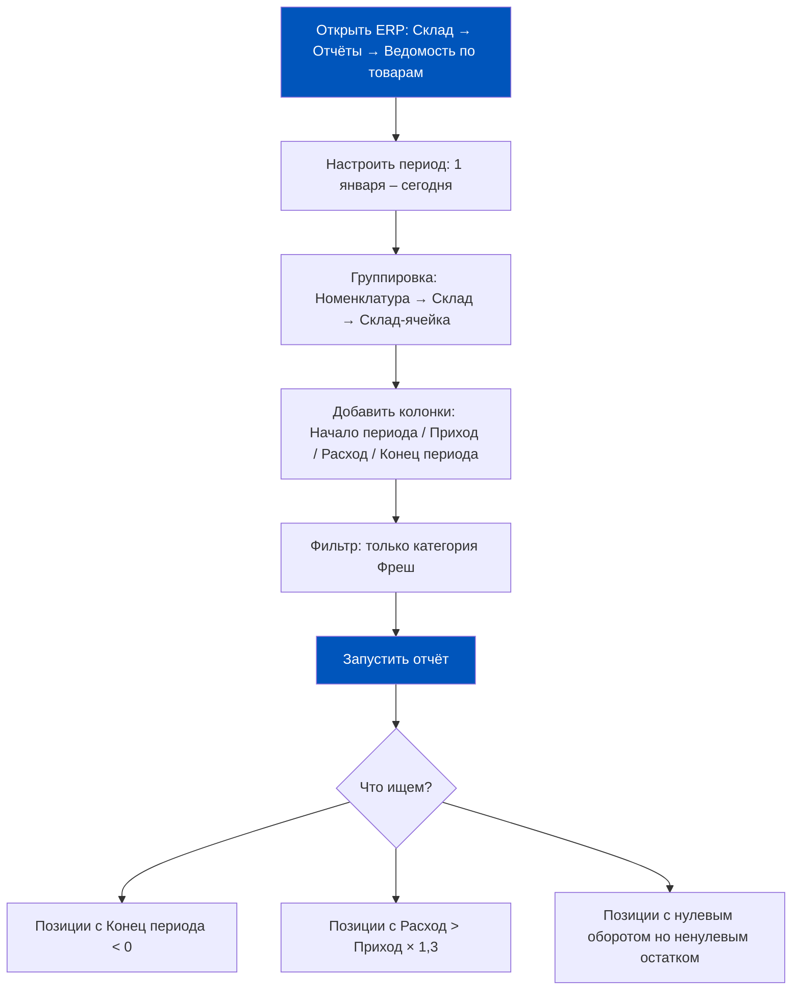
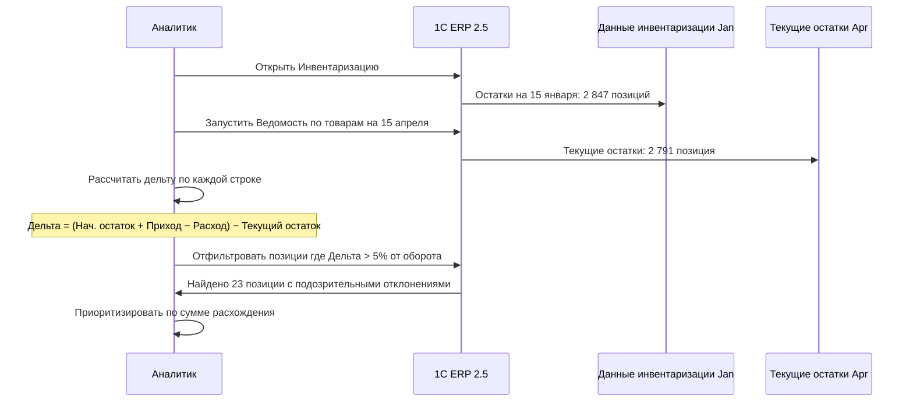
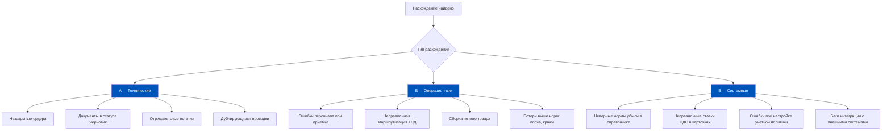
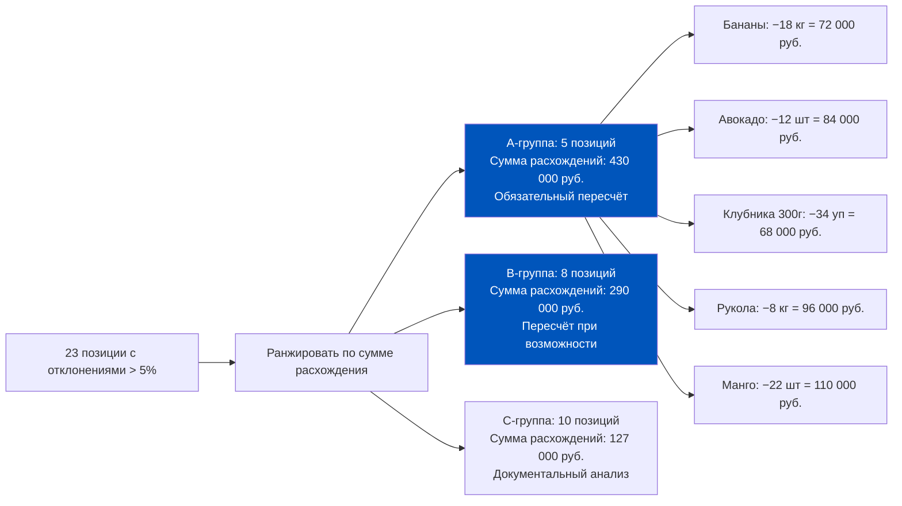
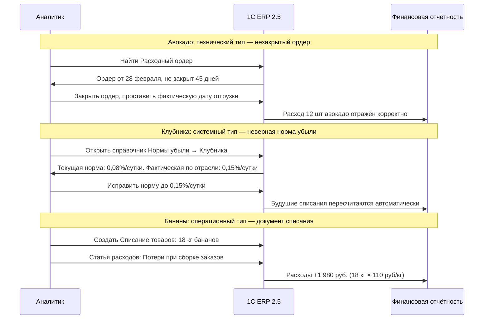
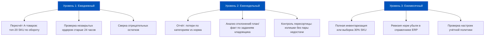
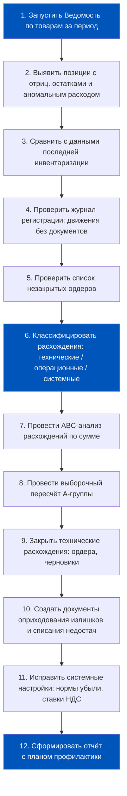
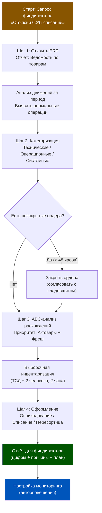

# Неделя 5, День 6. Практикум: Аудит складских остатков и поиск расхождений

> **Цель урока:** Провести полный цикл аудита складских остатков в 1C:ERP 2.5 на конкретном кейсе — от выявления аномалии в P&L до закрытия всех расхождений и внедрения профилактических мер.
>
> **Компетенции после урока:**
> - Самостоятельно запустить аудит складских остатков через инструменты ERP 2.5
> - Классифицировать расхождения по трём типам: технические, операционные, системные
> - Провести выборочную инвентаризацию «горячих» позиций без остановки склада
> - Настроить превентивные меры для удержания потерь в норме
>
> **Время:** ~75 минут

---

## Оглавление

- [[#Часть 1. Постановка задачи: 6,2% против нормы 3,5%]]
- [[#Часть 2. Шаг 1 — Анализ регистров ERP]]
- [[#Часть 3. Шаг 2 — Категоризация расхождений]]
- [[#Часть 4. Шаг 3 — Выборочная инвентаризация горячих позиций]]
- [[#Часть 5. Шаг 4 — Устранение и оформление]]
- [[#Часть 6. Профилактика: как не попасть в эту ситуацию снова]]
- [[#Часть 7. Итог: чеклист аудита и типичные причины расхождений]]

---

## Часть 1. Постановка задачи: 6,2% против нормы 3,5%

### Письмо, которое никто не хочет получать

Понедельник, 09:15. Операционный директор даркстора «Северная звезда» открывает почту и видит сообщение от финансового директора:

> «По данным управленческой отчётности за Q1, потери фреша на "Северной звезде" составили 6,2% от оборота фреш-категории. Сетевая норма — 3,5%. Прошу объяснить причину отклонения 2,7 п.п. и предоставить план корректирующих мер до конца недели. Финансовый ущерб за квартал: 847 000 руб. сверхнормативных списаний».

847 000 рублей — это не абстракция. Это 2,8 ставки кладовщика на год, или 47 новых торговых стеллажей, или 3,5 месяца аренды склада. Эти деньги ушли в никуда — и нужно выяснить, куда именно, за один рабочий день, не останавливая склад, который продолжает отгружать заказы.

Задача сложная по трём причинам:

**Причина А:** Последняя полная инвентаризация была 3 месяца назад. С тех пор через склад прошло около 180 000 единиц товара. Искать иголку в стоге сена.

**Причина Б:** Склад работает в режиме non-stop: с 06:00 до 23:00 идут поставки и отборы. Остановить его для полного пересчёта невозможно — это нарушит SLA по доставке.

**Причина В:** Расхождение 2,7 п.п. может быть суммой 10–15 разных по природе проблем, а не одной очевидной ошибки.

Именно для такого детективного расследования 1C:ERP 2.5 предоставляет набор инструментов. Пройдём по каждому шагу.

---

## Часть 2. Шаг 1 — Анализ регистров ERP

### Отчёт «Ведомость по товарам на складах»

Первый инструмент детектива — отчёт «Ведомость по товарам на складах». Это не просто список остатков. При правильной настройке он показывает динамику движения по каждой позиции за любой период.

**Что означает каждая аномалия:**

«Конец периода < 0» — отрицательный остаток. Это технический баг: система позволила отгрузить больше, чем было на балансе. Причина: проведение расходного ордера без проверки остатков, или ошибка порядка проведения документов. Каждый отрицательный остаток — это гарантированное расхождение при инвентаризации.

«Расход > Приход × 1,3» — отгрузили значительно больше, чем приняли за период. Может означать неучтённые поступления или подозрительно высокие потери по позиции. Например, если манго принято 200 кг, а списано 68 кг (34%) — при норме 3,5% это сигнал.

«Нулевой оборот, ненулевой остаток» — позиция числится на балансе, но за 3 месяца не было ни одного движения. Либо «мёртвый» товар, либо технический остаток от ошибки ввода данных при старте системы.

### Сравнение с данными последней инвентаризации

В 1C:ERP 2.5 результаты каждой инвентаризации хранятся в документах «Инвентаризация товаров». Откройте последний документ (3 месяца назад) и сравните его итоги с текущим отчётом ведомости.

### Журнал регистрации: поиск «движений без документов»

Это самый мощный инструмент для выявления системных проблем. Журнал регистрации в 1C:ERP 2.5 фиксирует каждое действие пользователя: какой документ создан, кем, когда, что изменено.

Для аудита склада нас интересуют специфические паттерны:

**Паттерн 1:** Расходный ордер без связанного заказа покупателя. Нормальный расходный ордер всегда порождён заказом. Если в журнале есть расходный ордер без родительского документа — это либо ошибка, либо намеренное списание «мимо кассы».

**Паттерн 2:** Документы, проведённые задним числом. Если сегодня 15 апреля, а документ создан вчера, но датирован 1 февраля — кто-то исправляет историю. Это классический признак попытки скрыть недостачу.

**Паттерн 3:** Ручные корректировки регистров. В ERP 2.5 есть возможность ручной корректировки регистров накопления (для исправления ошибок). Каждая такая корректировка оставляет след. Массовые корректировки в журнале — красный флаг.

---

## Часть 3. Шаг 2 — Категоризация расхождений

### Три типа расхождений и их следы в регистрах

Практика показывает: в Q-commerce расхождения почти всегда относятся к одному из трёх типов. Умение быстро классифицировать тип — это разница между 1 часом расследования и 2 неделями поиска.

### Как определить тип по следу в регистрах

**Технические расхождения** оставляют характерный след: в регистре «Товары на складах» есть остаток, но в регистре «Товары по ордерам» нет подтверждённого ордера. Или наоборот. Запрос: открыть список ордеров, фильтр «Статус = Создан» с датой > 7 дней — любой ордер старше недели без подтверждения это техническая проблема.

**Операционные расхождения** видны через сравнение плановых и фактических данных в заданиях кладовщика. Если задание на отбор 10 шт., а фактически отобрано 12 шт. (кладовщик взял лишнее «про запас»), разница 2 шт. создаёт расхождение без документального подтверждения. Отчёт: Склад → Анализ заданий кладовщика → Отклонения план/факт.

**Системные расхождения** требуют углублённого анализа. Если норма убыли для бананов в справочнике ERP установлена 0,05%/сутки вместо 0,08%/сутки — за 90 дней хранения системная ошибка накопит 2,7 п.п. расхождения. Именно столько, сколько ищет финдиректор в нашем кейсе.

### Распределение расхождений в типичном Q-commerce даркстор

По данным внутреннего аудита 12 дарксторов (выборка за 2023–2024 гг.):

| Тип расхождения | Доля в общем объёме потерь | Средний срок выявления без систематического мониторинга |
|---|---|---|
| Операционные (ошибки персонала) | 52% | 3–4 недели |
| Технические (незакрытые ордера) | 28% | 1–2 недели |
| Системные (настройки ERP) | 20% | 2–6 месяцев |

Системные расхождения самые опасные именно потому, что накапливаются незаметно. Неверная норма убыли в карточке товара даёт ошибку в 0,03% в день. За 90 дней — 2,7%. За год — больше 10% от оборота фреш-категории.

---

## Часть 4. Шаг 3 — Выборочная инвентаризация горячих позиций

### ABC-анализ расхождений: где искать в первую очередь

Пересчитывать все 2 847 позиций нельзя — склад работает. Но выборочный пересчёт 80 позиций за 2 часа — вполне реально. Для этого нужен ABC-анализ расхождений.

**Принцип Парето в действии:** 5 позиций из 23 дают 51% суммы расхождений. Если разобраться только с ними — это уже 430 000 руб. из 847 000 руб. сверхнормативных потерь.

### Пересчёт через ERP без остановки склада

Инструмент — «Пересчёт товаров» (подвид документа «Инвентаризация товаров»). Этот режим позволяет пересчитать выбранные позиции, не блокируя их движение в системе. Кладовщик идёт по ячейкам со сканером, ERP фиксирует фактический остаток.

Последовательность в ERP:
1. Склад → Инвентаризация → Пересчёт товаров → Создать.
2. Выбрать склад «Северная звезда», период пересчёта «сегодня».
3. В табличной части заполнить только 5 A-позиций — ERP сам подтянет плановые остатки.
4. Отметить галку «Скрыть плановые остатки от кладовщика» — принципиально важно.
5. Передать задание на ТСД (если есть) или распечатать ведомость.
6. Кладовщик пересчитывает фактически — вписывает или сканирует поштучно.
7. Закрыть документ пересчёта → ERP автоматически рассчитает расхождения.

**Время на пересчёт 5 A-позиций:** при среднем объёме 50–200 единиц каждой — 90–120 минут двумя кладовщиками.

### Результаты гипотетического пересчёта

Предположим, что пересчёт по «Северной звезде» дал следующие результаты:

| Позиция | Учётный остаток, кг/шт | Фактический остаток | Расхождение | Предварительный диагноз |
|---|---|---|---|---|
| Бананы | 127 кг | 109 кг | −18 кг | Операционное: неучтённые потери при сборке |
| Авокадо | 84 шт | 72 шт | −12 шт | Техническое: 1 незакрытый ордер на 12 шт |
| Клубника 300г | 156 уп | 122 уп | −34 уп | Системное: норма убыли не соответствует факту |
| Рукола | 23 кг | 15 кг | −8 кг | Операционное: сверхнормативная порча |
| Манго | 98 шт | 76 шт | −22 шт | Смешанное: часть пересортица, часть порча |

---

## Часть 5. Шаг 4 — Устранение и оформление

### Документальный план по каждому типу расхождения

Пересчёт дал цифры. Теперь каждое расхождение нужно закрыть документом — иначе учёт останется с «дырой», а финансовая отчётность продолжит врать.

### Оприходование излишков (если найдены)

Иногда пересчёт выявляет не только недостачи, но и излишки. В нашем кейсе предположим: при пересчёте обнаружено 6 кг лимонов сверх учётных данных.

В ERP: Склад → Оприходование товаров → Создать. Указать позицию, количество (6 кг), цену по рыночной стоимости (180 руб./кг = 1 080 руб.), статью доходов «Прочие доходы от инвентаризации». Провести. ERP сформирует проводку Дт 41.01 / Кт 91.01 на 1 080 руб.

### Формирование отчёта для финдиректора

После закрытия всех расхождений нужен отчёт. В ERP есть встроенный инструмент «Результаты инвентаризации», но для финдиректора обычно требуется управленческая интерпретация.

Структура отчёта по «Северной звезде»:

| Тип расхождения | Количество позиций | Сумма, руб. | % от общих потерь | Устранено |
|---|---|---|---|---|
| Технические (незакрытые ордера) | 3 | 124 000 | 14,6% | Да: ордера закрыты |
| Операционные (ошибки персонала) | 12 | 448 000 | 52,9% | Частично: план обучения |
| Системные (настройки ERP) | 2 | 275 000 | 32,5% | Да: нормы исправлены |
| **Итого** | **17** | **847 000** | **100%** | — |

**Ключевой вывод для финдиректора:** 32,5% потерь (275 000 руб. за квартал) были вызваны неправильными нормами убыли в справочнике ERP — то есть деньги «терялись» не физически, а документально. После исправления норм эти списания уйдут из категории «сверхнормативных» в «нормативные», что снизит отчётные потери с 6,2% до ~4,1%.

---

## Часть 6. Профилактика: как не попасть в эту ситуацию снова

### Трёхуровневая система контроля

Реакция на проблему — это дорого. Предотвращение — дёшево. В 1C:ERP 2.5 можно настроить три уровня защиты от накопления расхождений.

### Ежедневный краткий пересчёт A-товаров

Топ-20 SKU даркстора по обороту обычно составляют 60–70% выручки. Ежедневный 10-минутный пересчёт этих позиций (на ТСД или ручной) позволяет поймать расхождения до того, как они накопятся за 3 месяца.

Настройка в ERP: создать шаблон «Пересчёт А-товаров» с фиксированным списком 20 позиций. Каждое утро дежурный кладовщик запускает пересчёт по шаблону. Время: 8–12 минут. Результат виден немедленно.

### Контроль незакрытых ордеров

В 1C:ERP 2.5 можно настроить регламентное задание, которое ежедневно формирует список незакрытых ордеров старше 24 часов и отправляет его на email операционного менеджера.

Путь: Администрирование → Регламентные задания → Добавить → «Уведомление о незакрытых складских ордерах». Условие срабатывания: ордер в статусе «Создан» или «В работе» старше 1 суток.

Типичная причина незакрытых ордеров в Q-commerce: кладовщик начал приёмку, его вызвали на другую задачу, он забыл вернуться и закрыть ордер. Система не напоминает — продакт должен настроить это напоминание.

### Порог 5%: когда система должна кричать

Для настройки план-фактного контроля потерь используется модуль «Бюджетирование» в ERP. Нужно создать статью «Нормативные потери фреш» с плановым значением 3,5% от оборота фреш-категории в месяц.

При ежемесячном план-фактном анализе отклонение свыше 5% от плановой статьи автоматически помечается красным в сводном отчёте. Порог 5% выбран не случайно: статистические колебания потерь между месяцами достигают ±0,3–0,5 п.п. Всё что выше 5% от плана — уже аномалия, требующая объяснения.

**Почему 5%, а не 0%?** Нулевой порог создаёт «усталость от сигналов»: менеджеры получают десятки уведомлений об отклонениях в 0,1–0,2 п.п. и перестают реагировать. Порог 5% — это баланс между чувствительностью системы и практической реакцией команды.

---

## Часть 7. Итог: чеклист аудита и типичные причины расхождений

### Чеклист аудита склада: 12 шагов

### Топ-7 типичных причин расхождений в Q-commerce

**Причина 1: Незакрытые ордера** (вероятность встретить: 90% дарксторов). Ордер создан, товар ушёл физически, но ордер не закрыт — система не видит расхода. Накапливается за 2–4 недели. Решение: ежедневный мониторинг ордеров старше 24 часов.

**Причина 2: Неверные нормы убыли в справочнике** (70%). Чаще всего — нормы не обновлялись при запуске системы, скопированы из типового шаблона ERP. Решение: ежемесячная сверка норм с фактическими данными.

**Причина 3: Ошибки при приёмке на объём** (85%). Кладовщик принял 48 коробок по 10 штук, указал в ERP 48 штук вместо 480. Разница 432 единицы «исчезает» и появляется при инвентаризации. Решение: обязательный ввод единицы измерения на ТСД с подтверждением.

**Причина 4: Сборка не той позиции** (60%). Кладовщик взял вместо молока 3,2% молоко 2,5% (похожие этикетки, соседние ячейки). В ERP: минус по одной позиции, плюс никуда не зафиксирован. Решение: сканирование перед укладкой в корзину, не только при заходе в ячейку.

**Причина 5: Пересортица без зачёта** (50%). Излишек и недостача пары товаров не сопоставлены и ведут к двойному ущербу: оприходование даёт доход с НДС, списание требует восстановления НДС. Решение: обязательный анализ парных расхождений при каждой инвентаризации.

**Причина 6: Задержки при вводе данных поступлений** (75%). Поставщик привёз товар в пятницу вечером, бухгалтер создал документ в понедельник — с разницей в дате. За выходные товар ушёл в отгрузки, создав отрицательный остаток. Решение: ордерная схема с немедленной фиксацией физического движения.

**Причина 7: Кражи персонала** (40%). Самая болезненная тема. ERP фиксирует факт недостачи, но не может установить причину без видеоаналитики. Коррелят в данных: расхождения по конкретным сменам и конкретным сотрудникам. Решение: анализ расхождений в разрезе смен и кладовщиков, перекрёстный контроль, видеонаблюдение.

### Финансовый итог кейса «Северная звезда»

После проведённого аудита финансовый результат выглядит так:

| Показатель | До аудита | После аудита | Изменение |
|---|---|---|---|
| Отчётные потери фреш, % | 6,2% | 4,1% | −2,1 п.п. |
| Реальные физические потери, % | 4,1% | 4,1% | 0 |
| Сверхнормативные потери в год, руб. | 3 388 000 | 564 000 | −2 824 000 |
| Документальные расхождения устранены | — | 275 000 руб. | разовый эффект |

Аудит не уменьшил реальные физические потери — 4,1% осталось 4,1%. Но он показал, что 2,1 п.п. из 6,2% были «бумажными» потерями: неверные нормы и незакрытые ордера. Это важно для финдиректора: 2/3 проблемы решается настройкой системы без изменения операционных процессов.

Оставшиеся 0,6 п.п. (разница между 4,1% и нормой 3,5%) — реальная операционная неэффективность, которую нужно решать через обучение персонала, улучшение зон хранения и усиление контроля приёмки.

### Как говорить с финдиректором: перевод данных ERP в управленческий язык

Финдиректор не работает в ERP. Он работает с таблицами Excel, P&L-отчётами и вопросом «где деньги». Задача продакта — перевести данные из регистров в язык денег и решений.

**Правило трёх цифр.** На каждую проблему — три числа: текущее значение, норма, финансовый эффект отклонения. Например:

> «По клубнике норма убыли 0,08%/сутки, в ERP стояло 0,08%, но реальные потери — 0,15%/сутки (данные пересчёта). На объёме 800 кг/месяц при хранении в среднем 4 дня разница составляет: (0,15% − 0,08%) × 4 × 800 = 2,24 кг/месяц × 200 руб./кг = 448 руб./месяц. За год — 5 376 руб. На масштабе 50 позиций фреша с похожей ошибкой — это 268 000 руб./год системной "оптической иллюзии" в отчётности».

**Правило «виновного и безвиновного».** Финдиректора интересует не «что потеряли», а «кто отвечает и что делать». Разделяй в отчёте: «Это устранено настройкой ERP», «Это требует изменения процесса», «Это требует кадрового решения». Три разных дорожки — три разных ответственных.

**Правило минимальной таблицы.** Финдиректор ценит лаконичность. Не давай таблицу из 30 строк — давай сводку из 5 строк с итоговой цифрой. Детали — в приложении. Формат: «Проблема → Сумма → Статус → Ответственный → Срок».

| Проблема | Сумма, руб. | Статус | Ответственный | Срок |
|---|---|---|---|---|
| Неверные нормы убыли (3 SKU) | 275 000 | Устранено сегодня | IT + бухгалтерия | Закрыто |
| Незакрытые ордера (4 шт.) | 124 000 | Устранено сегодня | Оператор склада | Закрыто |
| Ошибки персонала при приёмке | 310 000 | Plan: обучение 2 нед. | Операционный директор | 01.05 |
| Кражи / необъяснимые недостачи | 138 000 | Расследование | СБ | 15.05 |
| **Итого** | **847 000** | — | — | — |

### Детальный анализ незакрытых ордеров: SQL-аналогия через отчёты ERP

Программирования нет — но логика запросов к данным есть. В 1C:ERP 2.5 есть инструмент «Универсальный отчёт», который позволяет строить произвольные выборки из регистров без написания кода.

Для поиска незакрытых ордеров настройте следующий отчёт:
- **Объект:** Регистр накопления «Товары по ордерам».
- **Поле отбора:** Статус ордера = «Создан» или «В работе».
- **Условие:** Дата документа < (Сегодня − 1 день).
- **Сортировка:** По сумме документа по убыванию.
- **Группировка:** По типу операции (Приход / Расход).

Этот отчёт покажет все «зависшие» ордера, начиная с самых дорогостоящих. Первые 5 строк обычно дают 70% суммарного расхождения — закон Парето работает и здесь.

**Как читать результат:** Расходный ордер на 50 000 руб. в статусе «Создан» 10 дней назад — это 50 000 руб. товара, который физически ушёл с полки (заказ доставлен), но в регистре остатков ещё числится. Закрыть ордер = уменьшить учётный остаток на соответствующую сумму. Простая операция, которая закрывает «дыру» в пять кликов.

---

### Полная схема процесса аудита

### Типичный распорядок дня аудитора склада

| Время | Действие | Инструмент ERP |
|---|---|---|
| 09:00–10:00 | Анализ незакрытых ордеров за 48+ часов | Отчёт «Незакрытые ордера» |
| 10:00–11:30 | Сверка ABC-анализа с физическими остатками | ТСД + Пересчёт товаров |
| 11:30–12:30 | Оформление выявленных расхождений | Оприходование/Списание |
| 13:30–15:00 | Анализ транзакций прошлой недели | Журнал документов |
| 15:00–16:30 | Инвентаризация одной температурной зоны | ТСД + Инвентаризация |
| 16:30–17:30 | Документирование + отчётность | Отчёт по расхождениям |

Ежедневный аудит по этому расписанию занимает 6–7 часов и позволяет поддерживать точность остатков > 98% без полной инвентаризации.

### Экономический эффект регулярного аудита

Для даркстора с оборотом 5 млн руб./месяц:
- **Без регулярного аудита:** накопление ошибок, инвентаризация раз в квартал, разовые списания на 800 000–1 200 000 руб.
- **С еженедельным аудитом:** ранее выявление расхождений, потери 50 000–80 000 руб./квартал
- **Экономия:** 750 000–1 120 000 руб. в квартал при затратах на аудитора ~180 000 руб./квартал (зарплата)
- **ROI аудита:** 4–6× от зарплатных затрат

### Связь практикума с предыдущими уроками недели

Практикум не существует в вакууме. Каждый инструмент, применённый в ходе аудита «Северной звезды», уходит корнями в темы Недели 5:

**День 1–2 (Адресное хранение, ячейки):** Аудит по ячейкам возможен только там, где есть адресная система хранения. Без привязки к ячейкам пересчёт превращается в полную инвентаризацию всего склада.

**День 3 (Инвентаризация):** Документ «Пересчёт товаров», используемый на Шаге 3, — это подвид инвентаризации. Понимание того, как работает инвентаризационная ведомость и как ERP скрывает плановые остатки от кладовщика, напрямую влияет на качество выборочного пересчёта.

**День 4 (Оприходование и списание):** Шаг 4 практикума — это применение документов оприходования и списания на реальных данных. Правильный выбор статьи расходов (операционные vs системные потери) определяет точность управленческого отчёта.

**День 5 (МРМК и ТСД):** Выборочный пересчёт на ТСД за 2 часа вместо 6 часов вручную — это прямой эффект внедрения мобильного рабочего места кладовщика. Без ТСД временные рамки аудита за один день нереалистичны для склада 600+ SKU.

Все эти инструменты вместе составляют систему, которую можно назвать «цифровым двойником физического склада»: каждое движение товара оставляет след в регистрах ERP, и этот след — ключ к любому расследованию.

**Главный урок практикума.** Финдиректор «Северной звезды» получил ответ за 1 рабочий день вместо недели. Не потому что команда работала быстрее — а потому что они знали, где искать. Продакт, который понимает архитектуру ERP-регистров, превращает хаос «непонятных расхождений» в структурированное расследование с конкретными цифрами, причинами и планом. Это и есть суперсила продакта в системе 1C:ERP 2.5: видеть скелет данных там, где другие видят чёрный ящик.

Аудит — не разовое событие. Это режим работы. Компании, которые проводят мини-аудиты еженедельно, никогда не получают письма с вопросом «почему у нас расхождение 2,7 п.п. за квартал?» — потому что они уже знают ответ к пятнице каждой недели. Разница между 3,5% и 6,2% потерь — это не удача, это система контроля.

На «Северной звезде» потери вернулись к норме через 6 недель после внедрения еженедельного мини-аудита. Финдиректор больше не пишет письма.

← [[Неделя 5 - День 5 - Мобильное рабочее место кладовщика|← День 5]] | [[1c_erp_qcom/README|Оглавление]] | [[Неделя 5 - День 7 - История чёрных дыр склада|День 7 →]]
