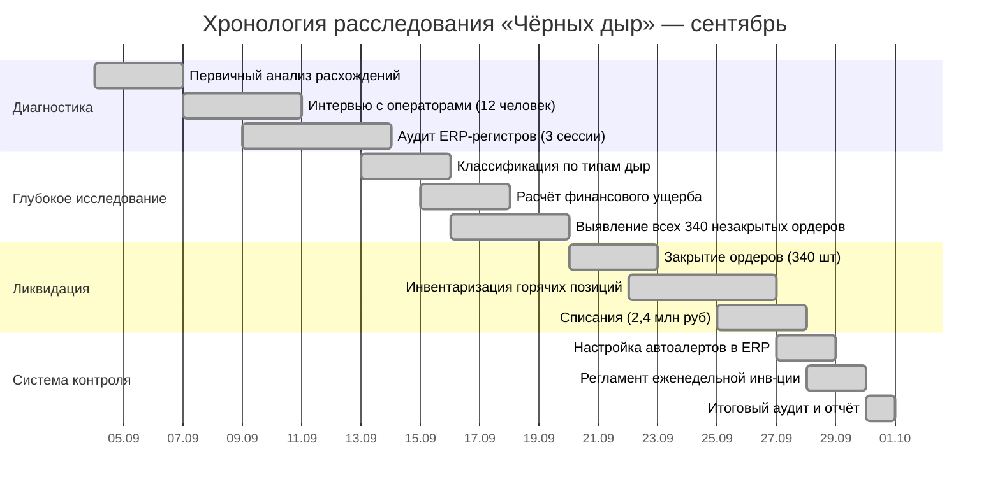
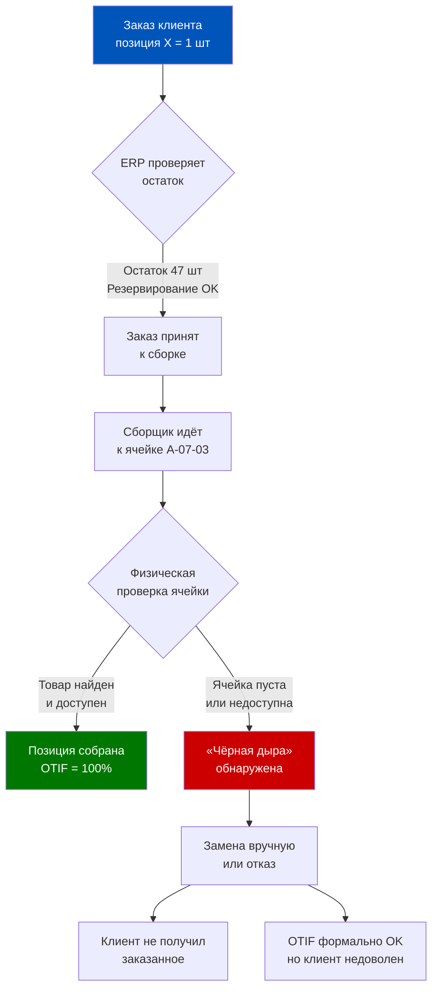
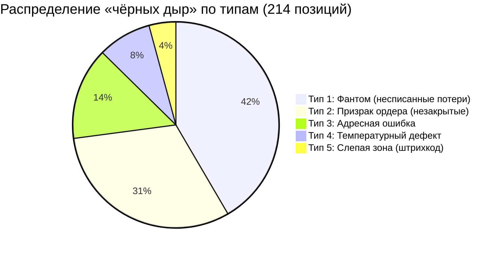
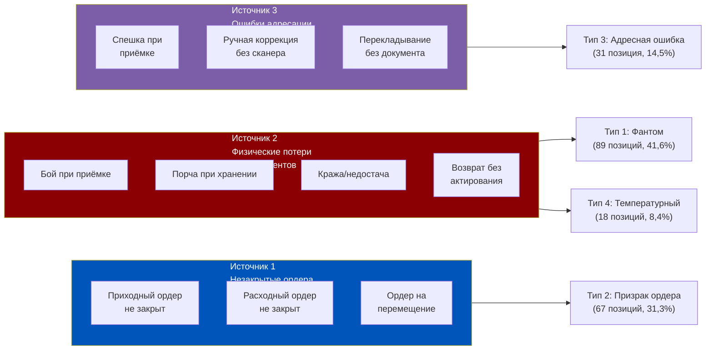
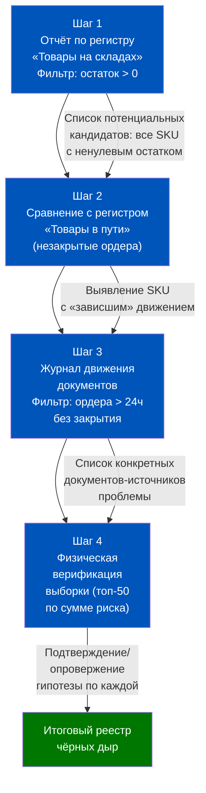
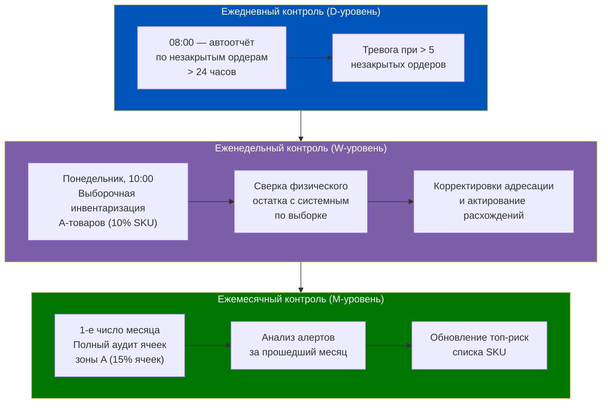
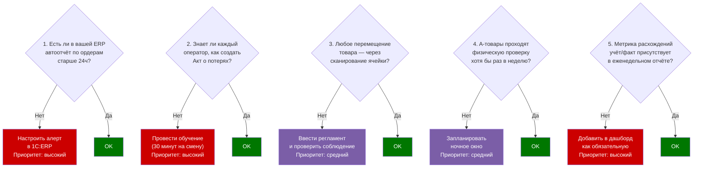

# История: Как «чёрные дыры» на складе убивают юнит-экономику

> **Цель урока:** На примере реального кейса понять природу складских расхождений («чёрных дыр»), научиться обнаруживать их в 1C:ERP 2.5, ликвидировать системно и выстраивать защиту от рецидива.
>
> **Компетенции:** диагностика расхождений учёт/факт; работа с регистрами остатков в ERP; операционный контроль незакрытых ордеров; финансовое измерение потерь от инвентарных ошибок.
>
> **Расчётное время:** ~120 минут

---

## Оглавление

1. [[#Часть 1. Начало: 97,3% и что за этим скрывается]]
2. [[#Часть 2. Анатомия «чёрной дыры»]]
3. [[#Часть 3. Три источника чёрных дыр]]
4. [[#Часть 4. Расследование в ERP: как найти чёрные дыры]]
5. [[#Часть 5. Ликвидация: 30 дней операции «Чистый склад»]]
6. [[#Часть 6. Результаты и система предотвращения]]
7. [[#Часть 7. Уроки и выводы]]

---

## Часть 1. Начало: 97,3% и что за этим скрывается

### Сентябрь, понедельник, 09:14

Игорь Семёнов, директор по операциям региональной Q-commerce сети «МегаМаркет», открыл еженедельный дашборд на своём ноутбуке и увидел то, что обычно вызывало у него сдержанное удовлетворение: OTIF (On Time In Full) — 97,3%. В индустрии, где 95% считается хорошим результатом, а 98% — поводом для пресс-релиза, 97,3% означало, что операционный блок работает.

Но что-то не сходилось.

Три сигнала пришли почти одновременно, и каждый по отдельности мог быть случайностью. Вместе они складывались в паттерн, который Игорь инстинктивно не хотел признавать.

**Сигнал первый.** Анна Русакова, руководитель клиентского сервиса, прислала в корпоративный мессенджер скриншот: количество жалоб категории «недостача в заказе» за август выросло на 34% по сравнению с июлем. Это были не жалобы на скорость или качество — клиенты писали, что заказали 3 позиции, получили 2, а за третью деньги вернули через поддержку. Формально — не срыв OTIF: доставка была вовремя, заказ был выполнен «в пределах допустимой замены». Но клиент не получил то, что хотел.

**Сигнал второй.** На планёрке старший оператор даркстора «Серебряный бор» Максим Конев поднял неловкий вопрос: «Почему система разрешает собирать заказ на позицию, которой физически нет на полке уже неделю?» Он показал распечатку: артикул «Молоко Простоквашино 3,2% 1л» — системный остаток 47 единиц, физический — 0. Система не блокирует резервирование, курьеры тратят время на поиск несуществующего товара, потом делают замену вручную.

**Сигнал третий.** Финансовый директор Светлана Орлова в пятницу вечером прислала сжатое письмо: «Игорь, объясни, почему валовая маржа по складу "Серебряный бор" за август — 18,4%, хотя плановая 22,1%? Это 3,7 процентных пункта, которые я не вижу ни в списаниях, ни в возвратах поставщикам.»

Три сигнала. Три разных человека. Три разных угла зрения на одну и ту же проблему.

Игорь закрыл дашборд с красивыми 97,3% и открыл новый документ. Сверху написал два слова: **«Чёрные дыры».**

---

### Контекст: почему Q-commerce уязвимее традиционного ритейла

Прежде чем войти в детали расследования, важно понять, почему проблема чёрных дыр в формате Q-commerce (доставка за 15–30 минут) принципиально опаснее, чем в традиционном интернет-ритейле или офлайн-магазине.

В традиционном интернет-ритейле покупатель видит доступность товара на сайте. Если товар ушёл в «чёрную дыру» — менеджер замечает это при обработке заказа, звонит клиенту, предлагает замену или отмену. Процесс небыстрый, но управляемый. Временной буфер — часы.

В Q-commerce временной буфер — **минуты**. Заказ принят, сборщик пошёл на склад, у него есть 45–90 секунд на позицию. Обнаружил пустую ячейку — нет времени на звонок, нет времени на поиск менеджера. Решение принимается на месте: либо замена (берёт похожий товар), либо прочерк (позиция пропускается). В обоих случаях клиент получает не то, что заказал. OTIF формально выполнен — доставка была вовремя и в целом комплектность «в пределах нормы». Но именно это «в пределах нормы» и есть маскировка проблемы.

Даркстор «МегаМаркет» обрабатывал в среднем **847 заказов в сутки** с 2 847 активными SKU. Среднее время сборки одного заказа — **4,8 минуты** при среднем заказе 6,3 позиции. Это 46 секунд на позицию. В таком режиме поиск «пропавшего» товара — непозволительная роскошь. Чёрные дыры становятся структурной проблемой, а не случайным сбоем.

---

### Неделя первая: постановка диагноза

Расследование началось 4 сентября. Игорь сформировал рабочую гипотезу: на складе существуют позиции, которые система ERP считает доступными, но физически недоступны для отбора. Эти позиции генерируют ложное ощущение высокого OTIF, одновременно создавая замены в заказах и необъяснимые потери маржи.

Первым делом он попросил аналитика Дмитрия Волкова сформировать простой отчёт: сравнить системные остатки по всем позициям даркстора «Серебряный бор» с фактическими данными последней инвентаризации. Инвентаризация проводилась 15 августа — всего три недели назад.

Результат пришёл через 4 часа и был обескураживающим.

Из 2 847 активных SKU на складе:
- **214 позиций** имели системный остаток > 0, но при физической проверке оказались либо отсутствующими, либо недоступными для отбора.
- Это составило **7,5% от общего числа активных SKU**.
- Суммарный «фантомный» остаток по этим позициям — **1 247 370 рублей** по закупочным ценам.

Семёнов смотрел на эту цифру долго. Потом позвонил Орловой.

— Светлана, я нашёл примерно половину твоих 3,7%. Но это только один склад и только поверхностный срез. Нам нужно копать глубже.

— Сколько времени?

— Четыре недели. Мне нужны ресурсы: аналитик, старший кладовщик, твой финансист и координатор. Полная команда.

— Бюджет на операцию?

— Не знаю ещё. Но ничего не делать будет дороже.

---

### Первый разговор с кладовщиком

На следующий день после получения данных от Волкова Игорь Семёнов приехал на даркстор в 23:30 — к началу ночной смены. Нашёл Максима Конева в зоне приёмки, где тот принимал поставку молочной продукции.

— Максим, у меня к тебе вопрос не как к подчинённому, а как к человеку, который видит эту кухню изнутри. Сколько раз в неделю ты видишь, что система говорит «товар есть», а на полке пусто?

Конев поставил коробку и посмотрел прямо.

— Каждый день. Минимум 15–20 позиций.

— Почему не сообщаешь?

— Я сообщал. Полгода назад. Мне сказали «занеси в журнал». Журнал никто не читает. Потом перестал сообщать.

Это был момент, когда Семёнов понял масштаб проблемы. Не технической — организационной. Люди, которые видели проблему каждый день, перестали о ней говорить. Система обратной связи была сломана раньше, чем система учёта.

За следующие две недели он провёл 12 интервью. Не по шаблону «что вы видели и когда» — а с единственным вопросом: «Что мешает тебе сразу оформлять документ, когда ты видишь расхождение?» Ответы сложились в три категории, которые легли в основу последующих изменений.

---

### Хронология четырёх недель

За четыре недели команда провела 12 интервью: 5 операторов склада, 2 старших кладовщика, 2 менеджера по приёмке, 1 IT-администратор ERP, 1 бухгалтер, 1 менеджер по закупкам. Каждый видел кусочек пазла, но никто не видел картины целиком. Именно это и позволяло проблеме существовать незаметно.

Провели 3 аудита ERP: первый — поверхностный (регистры остатков), второй — глубокий (незакрытые ордера и журнал движения документов), третий — верификационный (сравнение с физическим пересчётом по выборке).

Итог расследования сложился в концепцию, которую Игорь Семёнов назвал «анатомией чёрной дыры».

---

## Часть 2. Анатомия «чёрной дыры»

### Определение

**«Чёрная дыра» склада** — это SKU или конкретная складская единица хранения, которая в ERP-системе отображается как доступная для резервирования и отбора, но физически недоступна для включения в заказ в момент его сборки.

Ключевое слово — «в момент сборки». Товар может физически существовать в здании склада. Он может быть учтён на балансе. Но если сборщик не может взять его в руки и положить в пакет за отведённые 45–90 секунд на позицию — для операционной модели Q-commerce этот товар не существует.

Это определение принципиально отличается от обычного понятия «недостача». Классическая недостача — товара нет. Чёрная дыра — товар есть в системе, может даже быть физически, но система лжёт о его доступности.

Важно также отличать чёрную дыру от **стокаута** (stock out). Стокаут — состояние, когда товар реально закончился и система это знает: резервирование новых заказов заблокировано, позиция показывается как «нет в наличии». Чёрная дыра хуже стокаута именно потому, что она **невидима** для системы управления заказами: заказ принимается, резервируется, уходит в сборку — и только там обнаруживается проблема. Стокаут честен. Чёрная дыра лжёт.

Для продакт-менеджера это означает, что метрика «количество стокаутов» не показывает чёрные дыры. Нужна отдельная метрика: **«доля заказов с заменой при сборке»**. Именно она отражает реальную частоту столкновения с чёрными дырами в операционном потоке.

### Пять типов чёрных дыр

По итогам расследования Игорь Семёнов и аналитик Дмитрий Волков классифицировали все выявленные расхождения по пяти типам. Классификация оказалась устойчивой: каждый тип имеет свою механику возникновения в ERP-регистрах и свой профиль потерь.

**Тип 1 — «Фантом»:** товар списан физически (бой, порча, кража), но документ о списании не создан или создан и не проведён в ERP. Системный остаток завышен. Обнаружили 89 позиций этого типа — 41,6% всех чёрных дыр.

**Тип 2 — «Призрак ордера»:** приходный или расходный ордер создан и частично исполнен, но не закрыт. ERP считает товар присутствующим согласно ордеру. Выявили 67 позиций — 31,3%.

**Тип 3 — «Адресная ошибка»:** товар физически есть на складе, но лежит не в той ячейке. В системе он привязан к правильной (пустой) ячейке, а сборщик смотрит именно туда. Нашли 31 позицию — 14,5%.

**Тип 4 — «Температурный дефект»:** товар физически присутствует, но повреждён вследствие нарушения температурного режима и не может быть отгружен клиенту. Документально не оформлен как брак. 18 позиций — 8,4%.

**Тип 5 — «Слепая зона»:** товар есть, но штрихкод повреждён или нечитаем сканером, что делает его невидимым для системы сборки. 9 позиций — 4,2%.

### Математика потерь

Команда рассчитала каскадный эффект от 7,5% позиций-чёрных дыр.

Исходные данные по даркстору «Серебряный бор» за август:
- Среднесуточное количество заказов: **847**
- Среднее количество позиций в заказе: **6,3**
- Доля заказов, затронутых чёрной дырой: **18,4%** (156 заказов в сутки)
- Из них доля заказов с заменой (а не отменой позиции): **71%**
- Средняя потеря маржи при замене (клиент получает более дешёвый аналог): **23 руб./заказ**
- Доля клиентов, отток которых связан с опытом замены: **8,3%** (по данным когортного анализа)

Итоговый расчёт за месяц:
- Прямые потери маржи на заменах: 156 × 71% × 23 руб. × 30 дней = **76 600 руб./мес**
- Потеря LTV от ушедших клиентов: 156 × 30 × 8,3% × средний LTV 4 200 руб. = **1 634 000 руб./мес**
- Дополнительные затраты времени сборщиков на поиск: 156 × 1,8 мин × 30 дней × стоимость минуты 4,2 руб. = **35 400 руб./мес**

Совокупный ущерб от чёрных дыр только по одному даркстору: **~1 746 000 руб./мес**, или **~4,1% от оборота** данного объекта.

Финдиректор Орлова, получив эти цифры, написала в чат: «Теперь я вижу свои 3,7%. И ещё кое-что сверху.»

---

## Часть 3. Три источника чёрных дыр

### Анатомия происхождения

Расследование показало, что все пять типов чёрных дыр питаются из трёх первичных источников. Понимание источников важнее, чем классификация симптомов: именно на уровне источников строится система профилактики.

---

### Источник 1: незакрытые ордера

В 1C:ERP 2.5 складская операция всегда двухэтапна: сначала создаётся **распоряжение** (заказ поставщику, распоряжение на отгрузку, ордер на перемещение), потом — **ордерный документ**, фиксирующий фактическое движение товара. Регистр остатков обновляется по ордеру, а не по распоряжению.

Проблема возникает, когда ордер создан, но закрыт не полностью. Примеры из реальных данных «МегаМаркет»:

**Кейс А.** 17 августа пришла поставка молочной группы: 120 позиций. Оператор Петров провёл приходный ордер на 118 позиций, две позиции (Кефир 1% 500мл — 24 шт и Ряженка 4% — 18 шт) не прошли по качеству. Петров сказал менеджеру, что надо оформить акт расхождения. Менеджер сказал «запишем, потом оформим». Акт так и не был создан. В ERP эти 42 единицы числятся как принятые на склад, ордер формально открыт с расхождением, регистр показывает остаток.

**Кейс Б.** 22 августа при инвентаризации обнаружили, что ячейка B-12-07 переполнена — туда случайно положили часть товара из ячейки B-12-05. Кладовщик физически переложил 15 единиц обратно. Ордер на перемещение не создавал — «и так видно, где лежит». В системе обе ячейки теперь показывают данные, не соответствующие реальности.

**Кейс В.** 28 августа отгрузили заказ клиенту. Сборщик собрал 11 из 12 позиций, 12-ю не нашёл и поставил прочерк в бланке. Расходный ордер был создан на 12 позиций (автоматически по заказу), но фактически закрыт на 11. Разница в 1 единицу «зависла» как незакрытый остаток ордера.

За 90 дней (июнь–август) команда обнаружила **340 незакрытых ордеров**. Распределение: 187 приходных (55%), 124 расходных (36%), 29 на перемещение (9%). Суммарный «зависший» объём — **847 единиц товара** на сумму **623 000 руб.** по закупочным ценам.

Что делает их невидимыми в стандартных отчётах? Стандартный отчёт по остаткам в 1C:ERP показывает итоговый остаток на регистре. Он не показывает, **каким образом** этот остаток сформировался. Незакрытый ордер выглядит в итоговом отчёте точно так же, как корректно оприходованный товар. Нужно смотреть не отчёт по остаткам, а **журнал движения документов** с фильтром по статусу ордеров.

---

### Источник 2: физические потери без документального оформления

Это самый массовый источник — **68% всех выявленных чёрных дыр** (по совокупности Типов 1 и 4) имели именно это происхождение.

Механика простая и универсальная для любого склада. Физическое событие происходит — товар разбили, он испортился, его украли. Но документальное оформление либо не происходит вовсе, либо происходит с задержкой в дни или недели.

В 1C:ERP 2.5 списание потерь требует создания документа **«Списание товаров»** с указанием причины, количества и ответственного лица. До момента проведения этого документа регистр остатков не изменяется. Товара физически нет, но система о нём не знает.

Почему это происходит систематически, а не случайно?

Интервью с операторами выявило три поведенческих паттерна:

1. **«Успею потом»:** оператор видит, что разбил банку соуса. Физически убирает осколки. Мысленно говорит «надо будет оформить акт». В условиях высокой нагрузки (даркстор «Серебряный бор» обрабатывал 50–70 заказов в час в пиковые окна) «потом» превращается в «никогда».

2. **«Не моя зона»:** порчу обнаруживает сборщик, а право создать документ на списание есть только у старшего смены. Старший занят. Передача информации теряется.

3. **«Не буду подставляться»:** за недостачу, оформленную актом, может быть материальная ответственность. Психологически проще «не замечать» небольшой бой, чем оформлять документ с подписью.

Финансовая оценка потерь от этого источника по данным аудита: за три месяца (июнь–август) на даркстор «Серебряный бор» пришлось **1 890 000 руб.** физических потерь, из которых документально было оформлено только **312 000 руб.** (16,5%). Остальные **1 578 000 руб.** «растворились» в разнице между системным и физическим остатком.

---

### Источник 3: ошибки адресации в ячеечном складе

Ячеечный склад — стандарт для даркстора Q-commerce. Каждому SKU назначены одна или несколько ячеек хранения. Задача сборщика — прийти в конкретную ячейку и взять товар. Именно адресация делает сборку быстрой: сборщик не ищет, он идёт по маршруту.

Чёрная дыра адресного типа возникает, когда физическое местонахождение товара расходится с системным. Товар существует, он доступен, но сборщик идёт в пустую ячейку — туда, куда ему говорит система.

Как это происходит в реальности (три сценария из расследования):

**Сценарий «спешка при приёмке».** Поставка пришла в 23:40, последний слот перед закрытием. Два оператора разгружают 34 коробки. Сканеры работают медленно — аккумуляторы разряжены. Один оператор начинает расставлять товар вручную «по памяти», без сканирования ячейки назначения. Завтра утром в системе числится: молоко в ячейке A-03-01 (правильно), кефир в ячейке A-03-02 (правильно), ряженка в ячейке A-03-03 (система думает, что там, но фактически оператор поставил её в A-03-05 — там было больше места).

**Сценарий «ручная коррекция».** Старший кладовщик Конев обнаружил, что ячейка переполнена. Физически переложил часть товара в соседнюю пустую ячейку. Сканировал старую ячейку, забыл просканировать новую. В системе товар числится в старом месте.

**Сценарий «перекладывание при уборке».** Уборщик, не имеющий доступа к ERP, переложил три упаковки с прохода на ближайшую свободную полку. Никакого документа, никакого сканирования.

Из 31 позиции адресного типа: 18 (58%) возникли при приёмке, 10 (32%) при внутреннем перемещении, 3 (10%) при уборке/реорганизации.

---

## Часть 4. Расследование в ERP: как найти чёрные дыры

### Стратегия поиска

Когда Дмитрий Волков, аналитик команды, сел за рабочую станцию с доступом к 1C:ERP 2.5, у него было чёткое понимание: стандартные отчёты по остаткам скрывают проблему, а не показывают её. Нужно работать с первичными регистрами и журналами движения документов.

Он выстроил четырёхшаговый процесс поиска, который затем был задокументирован как стандартная аудиторская процедура «МегаМаркет».

---

### Шаг 1: Регистр «Товары на складах»

В 1C:ERP 2.5 регистр накопления **«Товары на складах»** — главный источник данных об остатках. Путь: **Склад → Отчёты → Остатки товаров на складах**.

Настройка отчёта для аудита:
- Группировка: Номенклатура + Характеристика + Ячейка хранения
- Отбор: Склад = «Серебряный бор»; Остаток (количество) > 0
- Показатели: Количество, Сумма (по закупочным ценам)

Результат шага 1 для «Серебряного бора»: 2 847 строк с ненулевым остатком. Суммарная стоимость остатков: **18 340 000 руб.** Это исходный список — «всё, что система считает на складе».

---

### Шаг 2: Регистр «Товары в пути» и незакрытые ордера

Ключевой шаг. В 1C:ERP 2.5 существует регистр **«Товары в пути»** (доступен через: **Склад → Отчёты → Товары в пути**), который показывает товар, движение которого **начато, но не завершено** с точки зрения ордерной схемы.

Если остаток по регистру «Товары на складах» включает в себя позиции из «Товаров в пути» — это потенциальная чёрная дыра типа «Призрак ордера».

Дмитрий сформировал отчёт «Товары в пути» с отбором по дате: документы, открытые более 24 часов назад и до сих пор не закрытые. За 90 дней: **340 документов**, суммарный «зависший» товар — 847 единиц, **623 000 руб.**

Далее Дмитрий выгрузил оба отчёта в Excel и сделал ВПР по полю «Номенклатура + Склад». Позиции, присутствующие в обоих отчётах — кандидаты для углублённого анализа.

---

### Шаг 3: Журнал движения документов

Третий шаг — работа с **журналом движения документов** (в 1C:ERP: **НСИ и администрирование → Обслуживание → Журнал регистрации**, либо **Склад → Журналы → Складские ордера**).

Фильтр для аудита:
- Тип документа: Приходный ордер на товары; Расходный ордер на товары; Ордер на перемещение товаров
- Статус: не «Закрыт» (т.е. «Открыт», «Частично исполнен»)
- Дата создания: более 24 часов назад (для оперативного мониторинга) или более 3 суток (для аудита)
- Склад: «Серебряный бор»

Этот запрос выдал **340 документов** с конкретными номерами, датами создания, ответственными лицами и суммами. Теперь у команды был не абстрактный список расхождений, а конкретный список документов, которые нужно закрыть или аннулировать.

---

### Шаг 4: Физическая верификация выборки

Последний шаг — полевой. Нельзя полностью доверять только ERP-данным, особенно в расследовании, цель которого — найти ошибки этих самых данных.

Дмитрий и старший кладовщик Конев взяли топ-50 позиций по сумме риска (произведение «зависшего» количества на закупочную цену) и физически проверили каждую ячейку.

Результаты верификации выборки:
- 28 из 50 позиций (56%) подтвердили расхождение: система говорила «есть», физически — нет
- 14 из 50 (28%): товар есть, но в другой ячейке — адресная ошибка
- 8 из 50 (16%): расхождение было корректным (товар в процессе перемещения, ордер действительно открыт обоснованно)

Эффективность метода: из 50 проверенных позиций 42 (84%) оказались реальными чёрными дырами. Это подтвердило, что алгоритм ERP-поиска работает точно.

---

### Как читать регистры: детали для аналитика

Когда Волков работал с регистрами, он столкнулся с несколькими неочевидными особенностями 1C:ERP 2.5, которые важно понимать для корректной интерпретации данных.

**Особенность 1 — Остаток vs. свободный остаток.**
Регистр «Товары на складах» хранит **общий остаток**. Но часть этого остатка может быть уже зарезервирована под открытые заказы клиентов. Для поиска чёрных дыр нужен именно **свободный остаток** (общий минус зарезервированный). Путь в 1C:ERP: **Склад → Отчёты → Остатки и доступность товаров** — этот отчёт показывает одновременно общий остаток, резерв и свободный остаток.

Практический вывод: SKU с общим остатком 47 единиц и резервом 47 единиц имеет свободный остаток 0 — при этом новые заказы будут отклонены на этапе резервирования. Такая позиция чёрной дырой не является. А вот SKU с общим остатком 47, резервом 20 и свободным остатком 27 — кандидат на проверку, если физически ячейка пуста.

**Особенность 2 — Дата актуальности данных.**
В 1C:ERP 2.5 остатки рассчитываются **на момент запроса**. Если выполнять отчёты в разное время суток в разгар операционного дня, данные будут меняться — заказы резервируются и закрываются непрерывно. Для аудита рекомендуется формировать базовый снимок **в 04:00** — минимальная операционная активность гарантирует стабильность данных.

**Особенность 3 — Учёт по ячейкам требует включённой функциональности.**
Адресный склад в 1C:ERP — отдельная функциональность, которую необходимо включить в настройках. Путь: **НСИ и администрирование → Настройки НСИ и разделов → Склад и доставка → Использование ячеек**. Если функциональность не включена, регистр не хранит данные об уровне ячейки — только уровень склада. В этом случае адресные ошибки (Тип 3) в ERP-отчётах не видны вообще.

На дарксторе «Серебряный бор» адресный учёт был включён, но на двух из пяти зон его настроили некорректно — ячейки были созданы как «виртуальные» без привязки к физическим стеллажам. Это само по себе было источником адресных ошибок и было исправлено в рамках операции «Чистый склад» 4–5 октября.

**Особенность 4 — Серийный и партионный учёт.**
Для ряда товарных групп Q-commerce (особенно молочная продукция, заморозка) в ERP может быть включён учёт по сериям и партиям со сроком годности. Это добавляет ещё одно измерение к поиску чёрных дыр: товар в системе есть по количеству, но все серии просрочены. Такие позиции — чёрные дыры Типа 4 в терминологии кейса, и они обнаруживаются через отчёт **«Остатки товаров с истекающим сроком годности»** (Склад → Отчёты).

---

## Часть 5. Ликвидация: 30 дней операции «Чистый склад»

### Команда и структура операции

1 октября Игорь Семёнов провёл установочную встречу операционной группы. На столе лежал распечатанный список из 214 позиций-чёрных дыр и 340 незакрытых ордеров. Задача: закрыть всё за 30 дней, не останавливая текущую операцию даркстора.

Команда из четырёх человек:

| Роль | Человек | Зона ответственности |
|---|---|---|
| Аналитик ERP | Дмитрий Волков | Работа с документами в системе, закрытие ордеров, настройка отчётов |
| Старший кладовщик | Максим Конев | Физическая инвентаризация, адресация, верификация |
| Финансист | Ирина Захарова (от Орловой) | Списания, акты расхождения, финансовый учёт |
| Координатор | Наталья Соколова | График работ, коммуникация с сменами, контроль сроков |

Операция была разбита на четыре недели с чёткими задачами и метриками закрытия.

---

### Неделя 1: Закрытие ордеров (1–7 октября)

Первый приоритет — 340 незакрытых ордеров. Это самая «чистая» работа: каждый ордер нужно либо закрыть корректно (если товар существует), либо аннулировать с составлением акта расхождения (если товара нет).

Дмитрий Волков работал в три смены по 4 часа за терминалом ERP. За три рабочих дня — 1, 2 и 3 октября — было обработано 340 ордеров:

- **187 приходных ордеров:** 143 закрыты с подтверждением фактического остатка; 44 закрыты с актами расхождения (товар отсутствовал или был повреждён при приёмке)
- **124 расходных ордера:** 109 закрыты с подтверждением отгрузки; 15 закрыты с корректировкой (фактически отгружено меньше, остаток возвращён на склад)
- **29 ордеров на перемещение:** 24 закрыты после физической верификации нового местонахождения; 5 аннулированы (перемещение не состоялось)

Итог недели 1: 340 ордеров закрыты. Регистр «Товары в пути» очищен. Высвобождено **623 000 руб.** «замороженных» остатков (часть вернулась на склад, часть стала основой для актов списания).

---

### Недели 2–3: Инвентаризация «горячих» позиций (8–21 октября)

«Горячие» позиции — это 214 выявленных чёрных дыр плюс все A-товары (топ-20% SKU по оборачиваемости), которые в рамках расследования было решено проверить превентивно.

Инвентаризация проводилась в **ночные окна**: с 02:00 до 05:00, когда активность заказов минимальна (в Q-commerce «МегаМаркет» ночные заказы составляли менее 4% суточного объёма).

График инвентаризации: 14 ночей, каждую ночь — секция склада (3–4 стеллажных прогона). Максим Конев и двое дежурных операторов сканировали каждую ячейку секции, сверяя факт с системой.

Обнаруженные расхождения фиксировались немедленно: адресные ошибки исправлялись созданием ордера на перемещение прямо в ночь; излишки оформлялись как «неучтённый приход»; недостачи передавались Захаровой для оформления актов списания.

К концу 21 октября: проверено 100% A-товаров (647 SKU) и все 214 проблемных позиций. Итого выявлено дополнительно 126 расхождений, ранее не попавших в первоначальный список. Общий список чёрных дыр вырос до 340 позиций.

Особый случай обнаружили на ночи с 14 на 15 октября в зоне замороженных продуктов. Ячейка C-01-08 числилась в системе как содержащая 36 упаковок замороженной пиццы «МираМакс» по 400 г. Конев подошёл к ячейке — она была занята другим товаром: мороженым «Пломбир» в 8 упаковках. Пицца физически нашлась в ячейке C-01-12 — 22 упаковки вместо 36. Итого: адресная ошибка + частичная недостача 14 упаковок. Закупочная стоимость 14 упаковок: 3 850 руб. Незначительная сумма — но этот конкретный SKU входил в топ-30 по частоте заказов. За август по нему было 47 замен. 47 клиентов не получили пиццу, которую заказали.

---

### Неделя 4: Списания и финализация (22–31 октября)

Самая болезненная часть операции. Финансист Захарова к 22 октября собрала полный пакет документов: акты расхождения, акты на уничтожение, акты о порче — всё, что нужно для официального списания в бухгалтерском учёте.

Совокупная сумма к списанию: **2 400 000 руб.** по закупочным ценам.

Разбивка списаний по причинам:

| Причина | Сумма, руб. | Доля |
|---|---|---|
| Физическое уничтожение (бой, порча) | 1 380 000 | 57,5% |
| Температурный дефект (молочка, заморозка) | 480 000 | 20,0% |
| Недостача при приёмке (акты расхождения) | 360 000 | 15,0% |
| Кража/необъяснимая недостача | 180 000 | 7,5% |

Семёнов и Орлова провели двухчасовое совещание по поводу суммы 2,4 млн руб. Финдиректор была жёсткой:

— Игорь, это болезненно. Это бьёт по P&L октября.

— Светлана, эти деньги уже потеряны. Они потеряны в июне, июле, августе. Мы просто фиксируем в учёте то, что уже произошло. Альтернатива — продолжать жить с ложными данными ещё квартал.

— Понимаю. Проводим.

Списание было проведено 28 октября. Это уменьшило учётный остаток на складе с **18 340 000 до 15 940 000 руб.** — снижение на 13%.

---

### Настройка автоматических предупреждений

Параллельно со списаниями Дмитрий Волков настроил в 1C:ERP 2.5 систему автоматических предупреждений, чтобы предотвратить рецидив.

Было настроено три типа алертов. Техническую реализацию выполнил IT-администратор ERP Антон Берёзов — на это ушло два рабочих дня. Ключевой инструмент: **регламентные задания** в 1C:ERP (НСИ и администрирование → Обслуживание → Регламентные и фоновые задания), которые позволяют запускать отчёты по расписанию и отправлять результаты на e-mail или в мессенджер через настроенную интеграцию. Специальных доработок конфигурации не потребовалось — всё реализовано штатными средствами платформы.

**Алерт 1 — «Долгий ордер»:** ежедневно в 08:00 система формирует отчёт по ордерам, открытым более 24 часов. Если таких ордеров более 5 — автоматическое уведомление старшему смены и Волкову.

**Алерт 2 — «Аномальный остаток»:** при нулевом физическом пересчёте ячейки (по данным сканеров) при ненулевом системном остатке — немедленное уведомление дежурному аналитику.

**Алерт 3 — «Давность без движения»:** SKU с системным остатком > 0, по которому не было ни одного движения (приход/расход) более 14 дней — еженедельный отчёт для анализа.

---

## Часть 6. Результаты и система предотвращения

### Сравнение до/после

Итоги операции «Чистый склад» были подведены 15 ноября — через 45 дней после старта. Команда сравнила ключевые метрики за август (до операции) и за октябрь–ноябрь (после).

```mermaid
xychart-beta
    title "Ключевые метрики: до и после операции «Чистый склад»"
    x-axis ["Расхождение\nучёт/факт, %", "Незакрытые\nордера > 24ч", "Замены\nв заказах, %", "OTIF\nреальный, %"]
    y-axis "Значение" 0 --> 100
    bar [7.5, 34, 18.4, 89.2]
    bar [1.8, 3, 4.1, 96.8]
```

Развёрнутая сравнительная таблица по восьми метрикам:

| Метрика | До (август) | После (ноябрь) | Изменение |
|---|---|---|---|
| Расхождение учёт/факт, % SKU | 7,5% | 1,8% | −76% |
| Незакрытые ордера > 24ч (среднее/день) | 34 | 3 | −91% |
| Замены в заказах, % | 18,4% | 4,1% | −78% |
| OTIF фактический (без замен) | 89,2% | 96,8% | +7,6 п.п. |
| Жалобы «недостача в заказе», шт/мес | 487 | 89 | −82% |
| Потери маржи от складских ошибок, % оборота | 4,1% | 1,3% | −68% |
| Время сборки одного заказа, мин | 4,8 | 3,9 | −19% |
| Списания в месяц, тыс. руб. | 523 (скрытые) | 87 (прозрачные) | −83% |

Особенно показательна последняя строка. Списания не исчезли — они стали прозрачными. До операции 523 000 руб./месяц «испарялись» незаметно в виде расхождений. После — 87 000 руб./месяц официально фиксируются актами, видны финдиректору, являются управляемой статьёй затрат.

---

### Система мониторинга: три горизонта

После операции «Чистый склад» в «МегаМаркет» была внедрена трёхуровневая система мониторинга:

**Финансовый результат системы мониторинга** (три месяца после внедрения, сентябрь–ноябрь):
- Совокупные потери маржи от складских ошибок снизились с 4,1% до 1,3% оборота
- По даркстору «Серебряный бор» с оборотом ~42 500 000 руб./месяц это экономия: (4,1% − 1,3%) × 42 500 000 = **1 190 000 руб./месяц**
- Окупаемость операции «Чистый склад» (затраты на команду + списания 2,4 млн): 2,4 млн / 1,19 млн/мес = **2 месяца**

На итоговой встрече 15 ноября Орлова подвела черту: «Мы потеряли 2,4 млн единовременно, зафиксировав то, что уже было потеряно. И будем сохранять 1,2 млн каждый месяц. Это хорошая сделка.»

---

### Связь расхождений учёт/факт с P&L: как считать

Финансовый анализ кейса показал нетривиальную связь между качеством инвентарных данных и строками отчёта о прибылях и убытках. Понимание этой связи принципиально для продакт-менеджеров, которые хотят говорить с финансовым директором на одном языке.

**Механизм влияния на себестоимость.** В 1C:ERP 2.5 себестоимость списывается по **средневзвешенной цене** в момент Закрытия месяца. Если в регистре остатков числится «фантомный» товар (физически отсутствующий), средневзвешенная цена рассчитывается неверно: числитель (сумма) завышен, знаменатель (количество) завышен. Это систематически искажает себестоимость всей номенклатурной группы.

**Механизм влияния на валовую маржу.** Когда клиент получает замену (более дешёвый товар вместо заказанного), выручка может фиксироваться по цене оригинального товара (если замена проводится «бесплатно» для клиента) или по цене замены. В обоих случаях маржа на позицию отличается от плановой — и это расхождение не видно в стандартном P&L без дополнительного анализа.

**Механизм влияния на оборачиваемость.** «Фантомный» остаток увеличивает знаменатель в формуле оборачиваемости: Days of Supply = Остаток / Среднесуточное потребление. Завышенный остаток даёт завышенные Days of Supply — склад «на бумаге» выглядит более заполненным, чем он есть. Закупщик, глядя на такие данные, не заказывает вовремя — и получает настоящую недостачу уже физическую.

Именно этот каскадный эффект — фантомный остаток → искажённая оборачиваемость → запоздалый заказ → реальная недостача — является наиболее опасным сценарием. В «МегаМаркет» в августе была обнаружена 1 позиция именно с таким развитием событий: «Вода Evian 0,5л» с фантомным остатком 120 единиц вызвала задержку заказа на 5 дней, что привело к 3-дневному физическому стокауту и 89 неисполненным заказам с этой позицией.

---

## Часть 7. Уроки и выводы

### Что показали 12 интервью: голоса команды

Прежде чем перейти к принципам, важно привести несколько прямых цитат из интервью — они точнее любой схемы передают природу проблемы.

**Оператор Петрова, 4 года стажа, дневная смена:**
«Я когда разбиваю что-то, я сразу убираю осколки. А документ — это надо идти к компьютеру, ждать пока загрузится, вспоминать куда нажимать, потом ещё старший должен подписать. У меня в это время 3 заказа в сборке висит. Я и не оформляю.»

**Менеджер по приёмке Кириллов:**
«Поставщик привозит в 23:45. Экспедитор торопится уехать. Водитель тоже. Мы принимаем быстро. Потом я замечаю, что 2 коробки были с дефектом — уже в 01:30, когда всё разобрали. Поставщик уехал. Как мне теперь акт расхождения сделать? Формально — с задержкой. Вот и «забываю».»

**Старший смены Громова:**
«У меня в KPI — скорость сборки, OTIF, нет опозданий. Нет ни одного показателя про качество данных. За что меня будут оценивать, то я и буду делать.»

Три цитаты — три разных причины одной проблемы: сложность процесса оформления, невозможность оформить документ ретроспективно без потерь, отсутствие мотивации в системе KPI. Каждая из них потребовала отдельного решения.

---

### Пять системных принципов «анти-чёрных-дыр»

Расследование и операция «Чистый склад» сформировали пять принципов, которые Игорь Семёнов оформил во внутренний стандарт «МегаМаркет». Каждый принцип опирается на конкретный урок из кейса.

**Принцип 1 — «Ордер живёт не более 24 часов».**
Любой складской ордер должен быть закрыт в течение суток с момента создания. Нет исключений, нет «потом, когда разберусь». Если ордер не может быть закрыт за 24 часа — значит, есть проблема, которую нужно эскалировать, а не откладывать.

Связь с ERP: алерт D2 — ежедневный автоматический контроль.

**Принцип 2 — «Физическое событие = мгновенный документ».**
Любое физическое событие на складе (бой, порча, находка, перекладывание) документируется немедленно — в момент события, а не «когда будет время». Ответственность за нарушение этого принципа — у старшего смены.

Операционная поддержка: на каждом рабочем месте сборщика размещён QR-код для быстрого создания документа «Акт о потерях» прямо с мобильного сканера.

**Принцип 3 — «Сканер — единственный источник правды об адресации».**
Никаких ручных перемещений «по памяти». Любое изменение местонахождения товара — только через сканирование новой ячейки в ERP. Даже перекладывание на 50 сантиметров в другой слот — документируется.

**Принцип 4 — «A-товары проверяются еженедельно».**
Топ-20% SKU по оборачиваемости проходят физическую проверку каждую неделю. Это 647 позиций из 2 847 — за 2–3 ночных часа в понедельник. Инвестиция небольшая, а информационная ценность — высокая: именно A-товары создают 80% потерь от чёрных дыр.

**Принцип 5 — «Метрика качества данных — в еженедельном дашборде».**
OTIF 97,3% может лгать. Процент расхождения учёт/факт — нет. Эта метрика добавлена в еженедельный операционный дашборд рядом с OTIF. Если расхождение > 2% — красный цвет, требуется разбор.

---

### Связь операционной культуры с настройками ERP

Технический инструмент (1C:ERP 2.5) не решает проблему сам по себе. Он создаёт возможность — если организационная культура настроена правильно.

Ключевой вывод расследования: **68% чёрных дыр возникли не из-за технических сбоев, а из-за поведения людей** — отложенного документирования, страха оформлять акты, привычки «работать по памяти».

Это означает, что настройка ERP и настройка культуры — два обязательных компонента. Убрать один — и система не работает.

Что изменилось в культуре «МегаМаркет» после операции:
1. Введена **анонимная процедура** уведомления о потерях (QR-код → форма без поля «ответственный»). Страх убран технически.
2. KPI старшего смены включает **метрику «незакрытые ордера на конец смены»** — не более 0.
3. Еженедельная 15-минутная встреча команды склада с разбором одного случая «чёрной дыры» из прошедшей недели — обучение через примеры.

---

### Применимость к малому даркстору

Кейс «МегаМаркет» — это средняя сеть с оборотом ~500 млн руб./год по складскому направлению. Применимы ли эти принципы к малому даркстору с оборотом 5–15 млн руб./месяц?

Ответ: полностью, с единственным масштабным отличием. В малом дарксторе (300–500 SKU) аудит проводится не по A-товарам, а **по всем позициям** еженедельно — это занимает 1,5–2 часа одного человека. Нет необходимости в выделенном аналитике ERP: достаточно обученного старшего смены, который раз в неделю проверяет отчёт по незакрытым ордерам.

Критический порог: даже при обороте 5 млн руб./месяц потери от 4% чёрных дыр — это 200 000 руб./месяц. За год — 2 400 000 руб. Сумма, несопоставимая с затратами на 2 часа еженедельного контроля.

---

### Масштабирование на сеть: что изменилось в «МегаМаркет» системно

После завершения операции «Чистый склад» по «Серебряному бору» Семёнов получил поручение от CEO: распространить методологию на все 7 даркстор сети в течение квартала.

Масштабирование показало, что проблема была не уникальной для одного объекта:

| Даркстор | SKU с расхождениями, % | «Фантомный» остаток, тыс. руб. | Незакрытые ордера > 24ч |
|---|---|---|---|
| Серебряный бор | 7,5% | 1 247 | 340 |
| Речной вокзал | 5,8% | 890 | 214 |
| Марьино | 9,1% | 1 680 | 421 |
| Кунцево | 4,2% | 560 | 187 |
| Таганка | 6,7% | 1 120 | 298 |
| Отрадное | 8,3% | 1 340 | 376 |
| Бутово | 3,9% | 480 | 143 |
| **Итого по сети** | **6,5% среднее** | **7 317** | **1 979** |

Совокупный «фантомный» остаток по сети: **7 317 000 руб.** Это деньги, которые числятся на складах, но физически недоступны. Деньги, вложенные в товар, который не генерирует выручку и не обслуживает клиентов.

После проведения операций на всех 7 объектах (декабрь–февраль) совокупные списания составили **11 400 000 руб.** Болезненный одноразовый удар по P&L, который освободил систему управления от многомесячного накопленного мусора. В первом квартале после завершения программы операционная маржа сети выросла на **2,3 процентных пункта** — с 16,1% до 18,4%.

Ключевой организационный вывод масштабирования: стандарт работает только при наличии **назначенного владельца процесса** на каждом объекте. Там, где ответственным был назначен старший смены без выделенного времени — результаты деградировали через 6–8 недель. Там, где была выделена 0,5 ставки аналитика — система держалась устойчиво.

---

### Чеклист самопроверки: 10 пунктов

Полный чеклист десяти пунктов:

1. **Автоотчёт по незакрытым ордерам > 24ч** настроен и доставляется ответственному ежедневно в 08:00.
2. **Процедура оформления Акта о потерях** известна каждому оператору смены, не требует звонка старшему.
3. **Любое физическое перемещение товара** фиксируется через сканирование новой ячейки в ERP — без исключений.
4. **A-товары** (топ-20% по оборачиваемости) проходят физическую инвентаризацию не реже одного раза в неделю.
5. **Метрика расхождения учёт/факт** включена в еженедельный операционный дашборд и имеет установленный порог тревоги (> 2%).
6. **KPI старшего смены** включает показатель «незакрытые ордера на конец смены = 0».
7. **Процедура приёмки** предусматривает обязательное сканирование ячейки назначения — даже при срочных ночных поставках.
8. **Ежемесячный аудит ячеек** зоны A (15% ячеек с наиболее оборачиваемым товаром) включён в операционный план.
9. **Психологический барьер** при документировании потерь устранён: анонимная форма или закреплённая ответственность за оформление (не за факт потери).
10. **Результаты операции «Чистый склад»** (или аналогичной) задокументированы и показаны команде: люди должны видеть, сколько стоит бездействие.

---

### Вопросы для самопроверки и разбора кейса

Используйте эти вопросы для проработки материала — самостоятельно или в группе. Ответы не являются однозначными: хороший ответ требует аргументации с опорой на конкретные данные кейса.

**Вопрос 1 — Диагностика.**
OTIF «МегаМаркет» был 97,3%, но реальная удовлетворённость клиентов падала. Предложите дополнительные 2–3 метрики, которые следовало мониторить рядом с OTIF, чтобы раньше заметить проблему. Обоснуйте, почему именно они.

**Вопрос 2 — Расчёт потерь.**
В Части 2 приведена математика потерь по даркстору «Серебряный бор». Пересчитайте итоговую цифру (~1 746 000 руб./мес) для даркстора с оборотом в 2 раза меньше (847 × 0,5 = 423 заказа/сутки) и уровнем расхождений не 7,5%, а 4%. Как изменится цифра? Изменится ли вывод о необходимости операции?

**Вопрос 3 — Приоритизация источников.**
Три источника чёрных дыр дали 41,6% + 31,3% + 14,5% = 87,4% проблем. Если у вас есть ресурс только на работу с одним источником в месяц — с какого начать? Аргументируйте выбор, опираясь на данные кейса.

**Вопрос 4 — Культура и ERP.**
Три цитаты из интервью (Петрова, Кириллов, Громова) описывают три разных барьера. Для каждого барьера предложите конкретное решение — техническое (настройка ERP) или организационное (регламент/KPI). Должны ли все три решения быть реализованы одновременно?

**Вопрос 5 — Масштабирование.**
При масштабировании на сеть из 7 даркстор выяснилось, что без выделенного владельца процесса система деградирует через 6–8 недель. Почему это происходит? Как структурировать роль «владельца процесса качества данных» в небольшой команде (3–5 человек на даркстор) без найма отдельного аналитика?

---

### Финальный разговор

15 ноября, на итоговой встрече, Игорь Семёнов закрыл ноутбук с обновлённым дашбордом. OTIF по-прежнему показывал высокие цифры — теперь **96,8%** реального OTIF (без учёта замен), а не красивые 97,3% с замаскированными заменами.

— Мы стали хуже? — спросила Наталья Соколова, координатор операции.

— Нет, — ответил Семёнов. — Мы стали честнее. А честные данные — это единственное, на чём можно строить рост.

За окном дарсктора «Серебряный бор» начинался ноябрь. Система работала. Ордера закрывались в течение 24 часов. A-товары проверялись каждый понедельник. Акты писались сразу, а не потом.

Чёрные дыры не исчезли — они появятся снова, как только ослабнет контроль. Но теперь команда знала, как их искать, измерять и ликвидировать. И это меняло всё.

Спустя четыре месяца, в феврале, Семёнов выступал на внутренней конференции «МегаМаркет» с презентацией о результатах программы. В конце слайда с цифрами экономии он добавил одну строку, которую потом неоднократно цитировали коллеги из других команд:

**«Качество данных — это не IT-задача. Это операционная культура, которой нужен хозяин.»**

Владелец бизнеса спросил его после выступления: «Как вы это заметили? 97,3% — это же хороший показатель.»

Семёнов ответил: «Я заметил не OTIF. Я заметил, что три человека из трёх разных отделов говорили мне об одной и той же проблеме — просто разными словами. Клиентский сервис, операции и финансы видели разные симптомы одной болезни. Моя работа была их услышать и соединить.»

Это, пожалуй, главный урок кейса — операционный и управленческий одновременно: данные в ERP отражают не реальность, а то, что люди решили задокументировать. Качество управленческих решений не может быть выше качества данных, на которых они основаны. Инвестиции в точность учёта — это инвестиции в способность управлять.

Ни одна диаграмма в ERP не исправит культуру, в которой люди боятся фиксировать потери. И ни одна корпоративная культура не спасёт бизнес, если ERP настроен так, что увидеть проблему технически невозможно. Нужно и то, и другое — одновременно.

Именно поэтому операция «Чистый склад» началась не с настройки алертов, а с разговора в 23:30 у стеллажей с молочной продукцией. С вопроса: «Максим, почему ты перестал сообщать?»

---

← [[Неделя 5 - День 6 - Практикум по аудиту склада|← День 6]] | [[1c_erp_qcom/README|Оглавление]] | [[Неделя 6 - День 1 - Логика резервирования|День 1. Неделя 6 →]]
