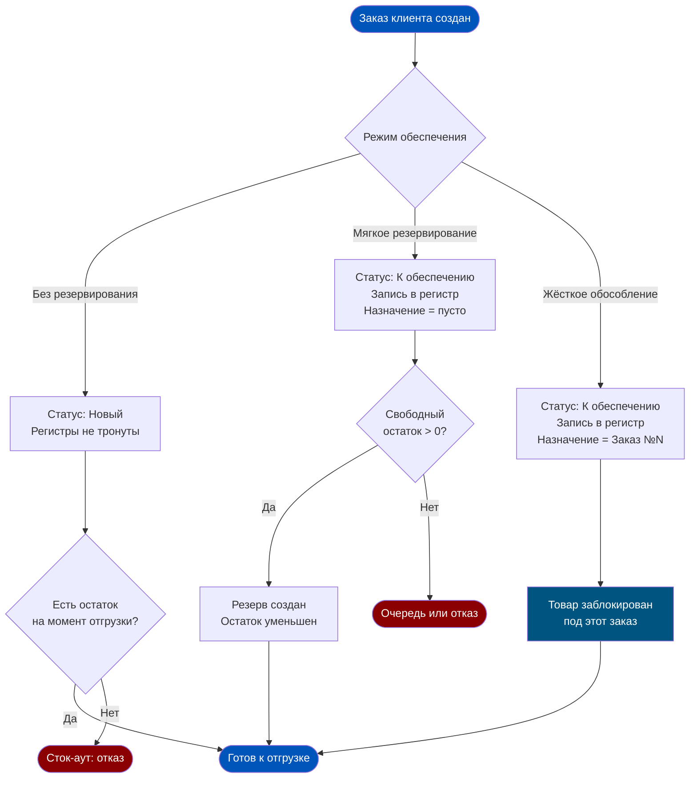
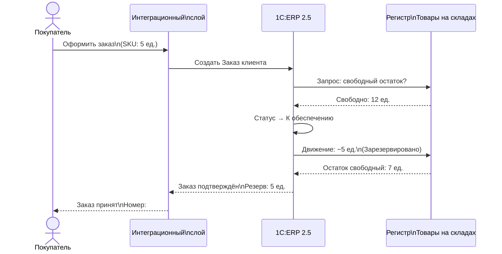
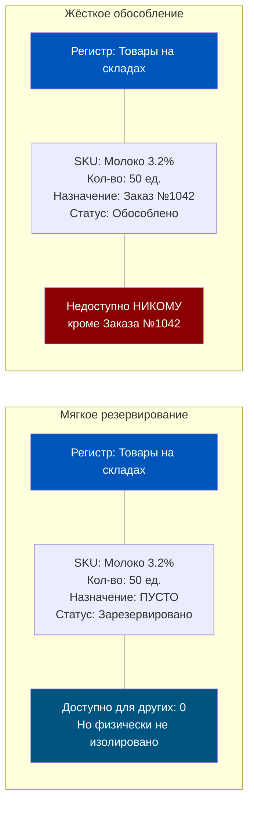
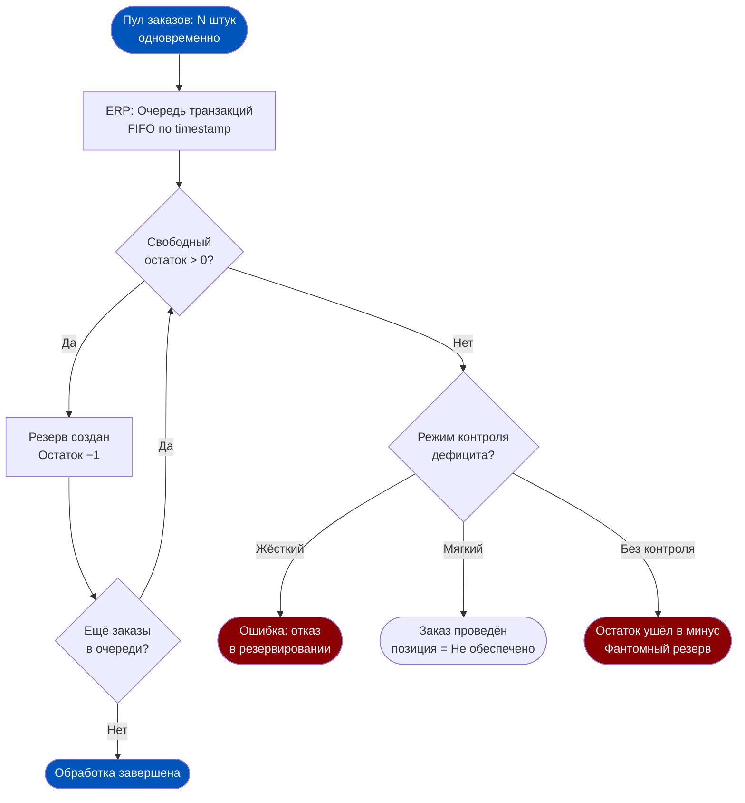
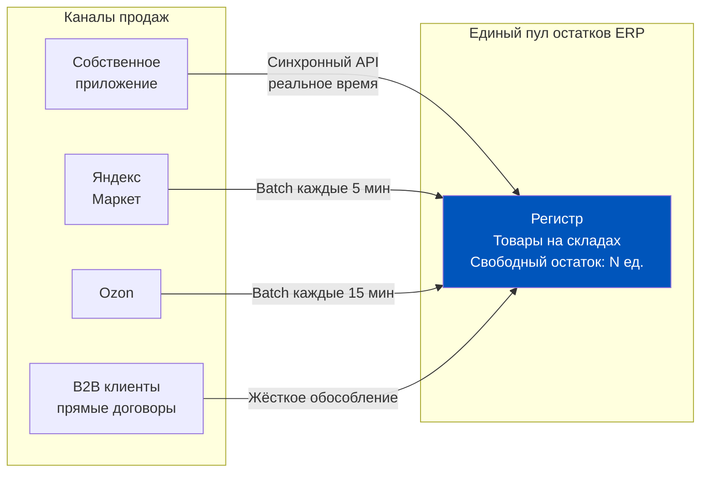
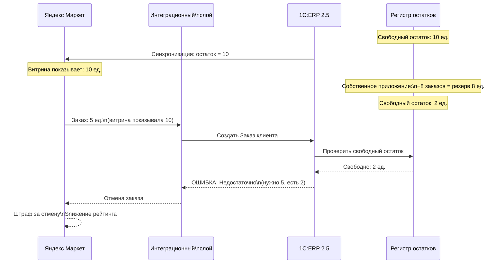
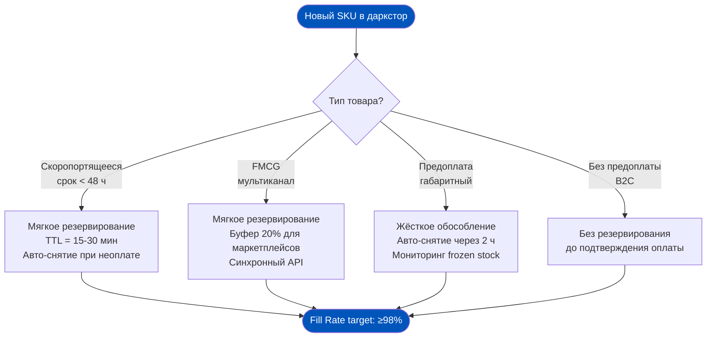

# Неделя 6. День 1. Логика резервирования

> Резервирование — это не просто «пометить товар». Это архитектурное решение о том, кому принадлежит право на остаток. В Q-commerce, где 150 заказов в час бьются за одну полку, неправильный выбор режима резервирования стоит Fill Rate и клиентской лояльности.

## Содержание

- [[#Часть 1. Резервирование как архитектурный выбор]]
- [[#Часть 2. Механика мягкого резервирования]]
- [[#Часть 3. Жёсткое обособление под заказ]]
- [[#Часть 4. Проблема конкурирующих заказов в Q-com]]
- [[#Часть 5. Контроль «зависших» резервов]]
- [[#Часть 6. Резервирование при интеграции с маркетплейсами]]
- [[#Часть 7. Архитектурное решение: как проектировать резервирование для даркстора]]

---

## Часть 1. Резервирование как архитектурный выбор

### Почему это важно для продакта

Большинство продактов в Q-com думают о резервировании как о «галочке» при настройке системы: «мы выбрали режим — забыли». На практике выбор режима резервирования определяет:

- Сколько заказов вы сможете принять одновременно до деградации производительности ERP.
- Насколько точны данные об остатках, которые вы передаёте на маркетплейсы и в приложение.
- Как быстро система восстанавливается после отмены партии заказов.
- Какой процент заказов получает статус «Не обеспечено» в пиковые периоды.

Это операционные KPI, напрямую влияющие на выручку и NPS. Поэтому разбираем детально.

Представьте склад как банковский счёт. На счету 150 единиц товара. В какой момент деньги «заморожены» для конкретного клиента — при выставлении счёта, при подтверждении оплаты или при отправке перевода? Именно этот вопрос решает режим резервирования в 1C:ERP 2.5.

В типовой конфигурации ERP 2.5 существуют три принципиально разных режима обеспечения потребностей по заказу клиента:

**Режим 1: Без резервирования.** Заказ создан, но система никак не «помечает» товар. Остаток остаётся полностью доступным для других заказов. Система работает по принципу «кто успел отгрузить — тот и отгрузил». Подходит для крупнооптовых B2B-компаний с длинным циклом согласования, где заказы оформляются за недели до отгрузки и фактическое наличие проверяется непосредственно перед отгрузкой.

**Режим 2: Резервирование на складе (мягкое).** При подтверждении заказа система уменьшает «доступный» остаток, но товар физически остаётся на той же полке. Это виртуальная метка в регистре. Другие заказы не смогут «захватить» зарезервированный товар — система откажет им в резервировании или поставит в очередь. Это стандартный режим для большинства интернет-магазинов.

**Режим 3: Обеспечение потребностей (жёсткое обособление).** Товар не просто помечается — он «привязывается» к конкретному заказу через субконто «Назначение» в регистре накопления «Товары на складах». Никто другой не может использовать этот товар, даже если он физически стоит рядом с другими единицами того же SKU. Это жёсткое резервирование.

Ключевое различие между режимами 2 и 3 — не в физическом перемещении товара, а в данных регистра. Когда склад делает «мягкий» резерв, в регистре «Товары на складах» появляется запись с пустым субконто «Назначение». Когда делается «жёсткое» обособление — в субконто «Назначение» прописывается конкретный документ заказа клиента. Этот ссылочный ключ и создаёт «замок» на товар.

Свободный остаток в режиме мягкого резервирования рассчитывается так:
`Свободный = Остаток на складе − Зарезервировано`

В режиме жёсткого обособления формула та же, но товар с субконто «Назначение» вообще не попадает в числитель «доступного» — он существует в отдельном измерении регистра.

Выбор режима резервирования — это не техническая деталь, которую можно поменять «потом». Это фундаментальное архитектурное решение, влияющее на скорость сборки, точность остатков и способность системы обрабатывать пиковую нагрузку. Для даркстора с 15-минутной доставкой неправильный выбор означает либо phantom stock (заказ принят, товара нет), либо frozen stock (товар есть, но «заморожен» под несуществующие заказы).

---

## Часть 2. Механика мягкого резервирования

### Что продакт должен понимать о регистрах

Регистр накопления «Товары на складах» — не просто таблица с числами. Это многомерная структура данных, где каждая строка описывается несколькими измерениями: склад, номенклатура, характеристика (если используется), партия (если ведётся партионный учёт), назначение (для жёсткого обособления). Запрос «сколько свободного остатка» — это агрегация по нескольким измерениям одновременно. Именно поэтому при высокой нагрузке этот запрос может становиться узким местом: чем больше измерений и чем больше строк в регистре, тем дольше агрегация.

При работе с 1C:ERP в продуктивной среде полезно понимать три характеристики регистра, влияющие на производительность резервирования:

- **Глубина истории**: чем больше незакрытых движений (старые резервы, незавершённые заказы), тем медленнее запросы к регистру.
- **Количество активных транзакций**: при пиковой нагрузке конкурирующие транзакции выстраиваются в очередь; время ожидания блокировки линейно растёт с числом параллельных пользователей.
- **Наличие индексов**: штатная конфигурация ERP 2.5 имеет оптимизированные индексы, но кастомные поля и нестандартные измерения могут их «ломать».

Мягкое резервирование — это как «стикер» на товаре. Физически товар стоит на той же полке, но система знает: этот конкретный стикер с номером заказа означает, что 5 единиц «принадлежат» заказу №1042. Разберём, как именно это работает в недрах ERP 2.5.

Когда менеджер подтверждает заказ клиента (или система делает это автоматически при получении заказа из внешней системы), документ переходит в статус «К обеспечению». Именно этот переход запускает движение по регистру накопления «Товары на складах». Появляется новая строка: склад, номенклатура, количество — с признаком «Зарезервировано».

Расчёт доступного остатка — это запрос к регистру, который происходит в момент каждого нового резервирования:

`Доступный остаток = Итого на складе − Уже зарезервировано − Уже обособлено`

Критически важный момент: этот расчёт выполняется в момент проведения документа, а не в момент его создания. Если два менеджера одновременно открыли форму заказа и видят «доступно: 10 единиц», а затем оба одновременно нажимают «Провести» — возникает классическая проблема race condition.

В 1C:ERP 2.5 эта проблема решается через механизм блокировок на уровне базы данных (управляемые блокировки). Когда первый документ начинает движение по регистру «Товары на складах», система устанавливает блокировку на строку этого регистра. Второй документ ждёт снятия блокировки, после чего повторно читает остаток — и уже видит актуальные данные (с учётом первого резервирования).

На практике это означает: при высокой параллельной нагрузке пользователи или интеграционные потоки начинают «выстраиваться в очередь» к базе данных. При 100 заказах в час это незаметно. При 100 заказах в минуту — это узкое место.

Что происходит, если свободного остатка не хватает? Здесь поведение системы зависит от настроек:

- **Жёсткий контроль:** система отказывает в проведении документа. Заказ остаётся в статусе «Новый» или «На согласовании», менеджер получает ошибку.
- **Мягкий контроль:** система проводит документ, но помечает дефицитные позиции как «Не обеспечено». Заказ уходит в работу, но с «дырой».
- **Без контроля:** система резервирует даже то, чего нет. Остаток уходит в минус. Этот вариант нарушает логику регистра и приводит к фантомным данным.

Важная деталь для продакта: «зарезервировано» в ERP — это не физическое перемещение, а изменение в виртуальном измерении регистра. Сборщик на складе видит обычную полку. Он не знает, что 5 единиц «принадлежат» заказу №1042, пока не откроет задание на сборку. Это означает, что при неправильной организации процессов физическое и виртуальное состояние склада могут расходиться — и это корень большинства проблем с phantom stock.

Ещё один нюанс: резерв снимается не автоматически при физической отгрузке. Снятие резерва происходит при проведении расходного ордера или реализации. Если физически товар ушёл, но документ не проведён — в регистре он по-прежнему «зарезервирован» под старый заказ. Склад создал «долг» перед системой.

---

## Часть 3. Жёсткое обособление под заказ

### Когда жёсткое обособление оправдано

Прежде чем разбирать механику, ответим на вопрос: в каких реальных сценариях жёсткое обособление является правильным выбором, а не архитектурным оверинжинирингом?

**Сценарий А: Товар с индивидуальным серийным учётом.** Если каждая единица товара уникальна (например, смартфоны с IMEI, ювелирные украшения с уникальными артикулами) — клиент заказывает конкретную вещь, а не «одну из». Жёсткое обособление здесь не опция, а обязательное требование.

**Сценарий Б: Крупный корпоративный заказ с гарантией наличия.** Кейтеринговая компания заказала 200 упаковок определённого продукта для корпоратива через неделю. Вы дали письменную гарантию наличия. Жёсткое обособление — это техническое воплощение этой гарантии.

**Сценарий В: Предоплаченный заказ в дефицитном SKU.** Последние 10 единиц лимитированного товара. Клиент предоплатил. Логично заблокировать товар именно под его заказ.

Если ни один из этих сценариев не применим — жёсткое обособление, скорее всего, избыточно и создаёт больше проблем (frozen stock), чем решает.

Если мягкое резервирование — это «стикер» на полке, то жёсткое обособление — это физическая клетка с замком и именной табличкой. Товар не просто помечен: он юридически и учётно принадлежит конкретному заказу, и только этот заказ имеет право его «разблокировать».

Жёсткое обособление в 1C:ERP 2.5 реализуется через механизм «Обеспечение потребностей». Когда для заказа клиента устанавливается схема обеспечения «Зарезервировать под заказ», система создаёт движение в регистре «Товары на складах» с заполненным субконто **Назначение** — ссылкой на конкретный документ заказа клиента.

Для перемещения товаров между складами с сохранением обособления используется документ **«Заказ на перемещение»**. Он «переносит» обособление с одного склада на другой, сохраняя ссылку на оригинальный заказ клиента. Именно через этот документ реализуется схема «Заказ под заказ» (К-В-К), используемая в Q-com для резервирования товаров из конкретной партии поступления.

Типичный сценарий применения в Q-com: приходит крупная партия охлаждённой продукции (молоко, йогурты). Менеджер по закупкам хочет обеспечить ею уже существующие заказы клиентов, а не отдавать на «общий рынок». Через инструмент «Обеспечение потребностей» он привязывает конкретные строки Заказа поставщика к конкретным строкам Заказов клиентов. После оприходования товара он автоматически становится обособленным.

Но здесь есть критическая ловушка — **frozen stock problem**. Представьте: 50 единиц йогурта обособлены под заказы, которые клиенты оформили утром. К вечеру 15 из этих заказов отменились или просрочились по времени сборки. Йогурты физически стоят на складе, но в регистре они «принадлежат» уже несуществующим заказам. Новые заказы не могут их захватить — сборщик буквально стоит перед полной полкой и не может взять товар без ручного вмешательства менеджера.

Frozen stock problem — это не баг системы, это последствие правильно работающей логики обособления в условиях нестабильного спроса. Именно поэтому в Q-com жёсткое обособление применяется избирательно: только для высокомаржинальных SKU, только для предоплаченных заказов, только при наличии автоматического снятия обособления по истечению TTL заказа.

---

## Часть 4. Проблема конкурирующих заказов в Q-com

Пятница, 19:00. Ваш даркстор обрабатывает 100 заказов в час. На полке — 150 единиц популярного SKU (кокосовая вода, остаток с утра). За первые 30 минут вечернего пика приходит 120 заказов, в каждом из которых 1–3 единицы этого SKU. Итого: спрос 160–180 единиц, предложение 150. Как 1C:ERP 2.5 принимает решение, кто получит товар, а кто — отказ?

Ответ — **механизм очереди резервирования по времени создания документа (FIFO по timestamp)**. Система обрабатывает заказы в порядке их поступления. Первые 140–150 заказов (в зависимости от количества в каждом) успешно резервируют товар. Когда свободный остаток достигает нуля, следующий заказ встречает один из сценариев:

- При жёстком контроле: документ не проводится, ошибка «Недостаточно свободного остатка».
- При мягком контроле: документ проводится с пометкой «Не обеспечено» на дефицитных позициях.

Но дьявол в деталях: 100 заказов в час — это в среднем 1 заказ в 36 секунд. Это вполне комфортный темп для ERP. Проблемы начинаются, когда внешняя система (маркетплейс, приложение) присылает заказы **пакетами** — например, раз в 5 минут пачкой из 30–50 документов. В этом случае ERP одновременно пытается провести 30–50 документов, каждый из которых претендует на один и тот же остаток.

| Сценарий | Что происходит в системе | Последствие |
|---|---|---|
| Профицит: 150 ед., 80 заказов по 1 ед. | Все 80 заказов резервируются успешно | Fill Rate = 100%, очередь свободна |
| Баланс: 150 ед., 150 заказов по 1 ед. | Все резервируются, свободный → 0 | Fill Rate = 100%, но буфер исчерпан |
| Дефицит: 150 ед., 200 заказов по 1 ед. | Первые 150 — ОК, следующие 50 — отказ | Fill Rate = 75%, 50 отменённых заказов |
| Пакетная нагрузка: 50 заказов одновременно | Блокировки регистра, очередь транзакций | Задержка 2–10 сек на заказ, риск таймаутов |

Для продакта из Q-com этот механизм имеет практическое следствие: **решение о том, получает ли клиент товар, принимается в момент проведения документа в ERP, а не в момент нажатия кнопки «Оформить» в приложении**.

### Пул резервирования и его настройка

В ERP 2.5 существует возможность настраивать **приоритеты каналов резервирования** через механизм схем обеспечения. Это позволяет задать: если товара не хватает на все заказы, какой канал обеспечивается в первую очередь.

Типовая иерархия приоритетов для Q-com:

1. **Предоплаченные заказы** — наивысший приоритет, резервируются первыми.
2. **Корпоративные клиенты** (SLA-договоры) — второй приоритет.
3. **Собственное мобильное приложение** — третий приоритет.
4. **Маркетплейсы** — резервируются из буферного остатка (80% от свободного).

Эта иерархия настраивается через **виды заказов** в ERP — каждый вид заказа может иметь свою схему обеспечения и приоритет в очереди. Реализация требует кастомизации типовой конфигурации, но это одно из наиболее оправданных изменений для мультиканального Q-com.

Без приоритизации все заказы конкурируют в едином FIFO-потоке. Это значит, что случайный заказ с маркетплейса, пришедший на 3 секунды раньше, может «захватить» последние единицы SKU, оставив без них предоплаченный заказ из собственного приложения. Это нарушение бизнес-логики, которое система без приоритизации не «замечает». Если между этими двумя событиями есть задержка (интеграционная очередь, batch-обработка, медленная шина данных) — клиент может получить подтверждение заказа, а через 30 секунд — уведомление об отмене из-за отсутствия товара. Это называется «over-confirmation» и является одним из главных источников негативных отзывов в Q-com.

Контрмера — **синхронный режим интеграции**: резервирование выполняется до отправки подтверждения клиенту. Но это увеличивает latency оформления заказа. Классический trade-off скорости и надёжности.

---

## Часть 5. Контроль «зависших» резервов

### Диагностика: как найти зависшие резервы прямо сейчас

Если вы впервые проводите аудит резервов на работающей системе, алгоритм следующий:

1. Открыть отчёт «Анализ доступности товаров» с фильтром «Только дефицитные позиции» (свободный остаток = 0 при физическом наличии > 0).
2. Для каждой такой позиции: развернуть детализацию по заказам, которые формируют резерв.
3. Отсортировать заказы по дате создания. Все заказы старше порогового TTL (для Q-com: обычно 2–4 часа) — кандидаты на проверку.
4. Проверить состояние оплаты по этим заказам. Неоплаченный заказ старше 2 часов — почти наверняка зависший.
5. Принять решение: ручная отмена или настройка автоматического регламента.

Зависший резерв — это как незакрытая вкладка в браузере: ресурс занят, задача заброшена, а вы давно занялись другим. В мире Q-com зависший резерв — это товар, которого клиент больше не ждёт, но система об этом не знает.

Типичный сценарий: клиент оформил заказ, товар зарезервирован, но оплата не прошла (тайм-аут эквайринга). Заказ завис в статусе «Ожидает оплаты». Резерв висит. Через час — ещё 5 таких заказов. Через день — 30 единиц популярного SKU «зарезервированы» под заказы, которые никогда не будут отгружены. Для всех остальных клиентов эти 30 единиц не существуют.

В 1C:ERP 2.5 для диагностики этой проблемы используется отчёт **«Анализ доступности товаров»**. Как его правильно читать продакту:

Отчёт показывает несколько измерений по каждой номенклатуре:
- **На складе** — физический остаток (то, что реально лежит на полке)
- **Зарезервировано** — занято мягкими резервами
- **Обособлено** — занято жёсткими обособлениями
- **Свободный остаток** — доступно для новых заказов
- **В пути** — ожидаемые поступления

Красный флаг: `Свободный остаток = 0` при `На складе > 0`. Это означает, что весь физический остаток «съеден» резервами. Следующий шаг — выяснить возраст этих резервов. Если большинство резервов старше 2 часов (для Q-com) или старше 24 часов (для обычного e-com) — скорее всего, часть из них зависла.

Инструмент автоматической «уборки» резервов — поле **«Желаемая дата отгрузки»** или **«Максимальная дата отгрузки»** в заказе клиента. Если эта дата прошла, а заказ не отгружен, регламентное задание ERP может автоматически снять резерв и перевести заказ в нужный статус. Но это требует корректной настройки:

1. Регламентное задание «Снятие резервов по просроченным заказам» должно быть активировано в расписании.
2. Для каждого вида заказа должно быть настроено правило: что происходит с заказом после снятия резерва — отмена, перевод в «Ожидание» или запрос менеджеру.
3. Временное окно должно соответствовать бизнес-логике: для Q-com это 15–30 минут после создания неоплаченного заказа, для обычного ритейла — 24–48 часов.

Последствия зависших резервов для P&L видны через метрику **Fill Rate**. Если 20 единиц SKU зарезервированы под «мёртвые» заказы, а 20 новых заказов получают отказ — Fill Rate падает не потому, что нет товара, а потому что товар «заперт» в неправильном состоянии. Это скрытый сток-аут: по отчёту об остатках товар есть, по факту — недоступен.

---

## Часть 6. Резервирование при интеграции с маркетплейсами

### Архитектура многоканального резервирования

Прежде чем разбирать проблемы, зафиксируем архитектурную рамку: в многоканальной Q-com-компании существует несколько «претендентов» на один и тот же товарный остаток.

Из этой схемы видно: собственное приложение имеет прямой синхронный доступ к ERP, тогда как маркетплейсы работают с задержкой. Это не техническая проблема — это намеренное архитектурное решение, потому что маркетплейсы не позволяют интегрироваться синхронно так же легко, как собственный бэкенд. Задержка синхронизации должна компенсироваться буфером безопасности в передаваемом остатке.

Здесь начинается самое интересное. Ваш даркстор торгует не только через собственное приложение, но и через Яндекс Маркет и Ozon. Каждый из этих каналов имеет собственную витрину, собственную логику отображения остатков и собственный темп передачи заказов в вашу ERP. Резервирование в этой многоканальной реальности превращается в задачу синхронизации нескольких независимых систем.

Типовая схема интеграции выглядит так: у вас есть `Остаток в ERP` → вы периодически (или в реальном времени) передаёте `Доступный остаток` в системы маркетплейсов → покупатель видит на маркетплейсе количество, которое было актуальным на момент последней синхронизации → покупатель нажимает «Купить» → маркетплейс создаёт заказ → заказ через API приходит в ERP → ERP пытается зарезервировать.

Проблема в **временном окне**: между «товар показан на сайте маркетплейса» и «товар зарезервирован в ERP» проходит время. Это время — минуты (при хорошей интеграции) или часы (при batch-синхронизации). За это время:
- Ваше собственное приложение могло продать этот товар.
- Другой маркетплейс мог прислать заказ раньше.
- Физический инвентаризационный сбой мог уменьшить реальный остаток.

Это и есть **phantom stock problem** — системная болезнь мультиканальных продаж. ERP подтверждает заказ на товар, которого уже нет, потому что витрина маркетплейса работала с устаревшим остатком.

Для продакта из Q-com это означает несколько практических решений:

**Буфер безопасности**: передавать на маркетплейс не `100%` свободного остатка, а `80%`. Оставшиеся 20% — страховой буфер на временное окно синхронизации. Это осознанное занижение доступности в обмен на снижение процента отмен.

**Приоритизация каналов**: настроить интеграцию так, чтобы собственный канал имел приоритет резервирования. Маркетплейсы работают с «буферным» остатком, собственное приложение — с полным.

**Мониторинг отмен по причине дефицита**: процент заказов с маркетплейсов, отменённых по причине «нет в наличии», — ключевой индикатор проблемы phantom stock.

---

## Часть 7. Архитектурное решение: как проектировать резервирование для даркстора

Вы прошли путь от теории к конкретным проблемам. Теперь — синтез: как проектировать систему резервирования, зная все эти механизмы.

Универсального ответа нет. Оптимальный режим резервирования зависит от категории товара, модели продаж и уровня нагрузки. Вот таблица рекомендаций:

| Категория товара | Режим резервирования | Главный риск | Вердикт |
|---|---|---|---|
| Скоропортящееся (срок < 24ч) | Мягкое + TTL 15 мин | Frozen stock при отменах | Мягкое с коротким TTL |
| Алкоголь, табак (лицензионный) | Жёсткое обособление | Медленная разблокировка | Жёсткое, но с авто-снятием |
| Высокооборотный FMCG | Мягкое + буфер 20% | Phantom stock в мульти-канале | Мягкое + буфер на маркетплейсы |
| Крупный габарит (слот доставки) | Жёсткое под слот | Под-резерв слота курьера | Жёсткое с привязкой к слоту |
| Предоплаченный заказ | Мягкое (сразу) | Race condition при пике | Мягкое с синхронным API |
| Заказ без предоплаты | Без резерва до подтверждения | Phantom stock | Отложенный резерв при оплате |

Ключевая метрика здоровья системы резервирования — **Fill Rate**:

`Fill Rate = (Количество отгруженных позиций / Количество заказанных позиций) × 100%`

Целевой показатель для Q-com: Fill Rate ≥ 98%. При Fill Rate < 95% система резервирования требует аудита. При Fill Rate < 90% — это кризис, который нужно разбирать на уровне архитектуры.

### Резервирование и финансовый учёт: когда появляется обязательство

Важный вопрос, который часто задают финансовые директора: с какого момента зарезервированный товар считается «обязательством» компании перед клиентом с точки зрения финансового учёта?

Ответ: **резервирование само по себе не создаёт финансового обязательства**. В момент мягкого резервирования никаких бухгалтерских проводок не возникает. Товар остаётся в собственности компании, его стоимость отражается в регистре товарного учёта, но выручка и обязательства — нет.

Финансовое событие возникает только при проведении документа «Реализация товаров и услуг». Именно этот документ:
- Формирует проводку: Дт «Дебиторская задолженность» / Кт «Выручка»
- Списывает себестоимость: Дт «Себестоимость продаж» / Кт «Товары»
- Уменьшает физический остаток в товарном регистре

До этого момента резерв — это операционное ограничение (товар нельзя продать другому), но не финансовое обязательство. Это разграничение важно при аудите и при построении финансовой отчётности на основе данных ERP.

Связь с партионным учётом (Неделя 4, FEFO): резервирование не существует в изоляции. Когда система делает мягкий резерв по номенклатуре «Молоко 3.2%», она резервирует количество без привязки к конкретной партии. Но при сборке сборщик должен взять партию с ближайшим сроком годности (FEFO). Это означает, что правило «какую партию взять» определяется не в момент резервирования, а в момент выдачи задания на сборку. Жёсткое обособление позволяет привязать резерв к конкретной партии ещё на этапе планирования — это дорого по сложности настройки, но даёт максимальный контроль над FEFO-соответствием.

Главный принцип, который стоит запомнить: **резервирование — это не технический параметр заказа, это бизнес-обязательство системы перед клиентом**. Когда ERP резервирует товар, она говорит: «Мы гарантируем, что этот товар будет доступен для этого заказа». Это обязательство имеет цену — снижение доступности для других покупателей. Баланс между «гарантировать существующему» и «не блокировать для нового» — и есть суть архитектурного решения по резервированию.

### Дополнительный разбор: три метрики здоровья системы резервирования

Помимо Fill Rate, существуют две вспомогательные метрики, позволяющие оценить качество настройки резервирования:

**Reservation Accuracy** = (Заказы с корректно выданным товаром) / (Заказы с созданным резервом) × 100%

Если резерв создан, но при сборке оказалось, что товара нет — это нарушение Reservation Accuracy. Метрика отличается от Fill Rate тем, что Fill Rate учитывает все причины неполной отгрузки, тогда как Reservation Accuracy — только расхождение между «зарезервировано в системе» и «реально было на полке».

**Zombie Reservation Rate** = (Резервы старше TTL) / (Все активные резервы) × 100%

«Зомби-резервы» — это резервы, которые не будут выполнены, но ещё не сняты. Целевой показатель для Q-com: < 2%. Если Zombie Reservation Rate > 5% — система резервирования работает неправильно и требует немедленного вмешательства.

**Reservation-to-Shipment Time** = Среднее время от создания резерва до проведения расходного ордера.

Для Q-com цель: < 20 минут. Если этот показатель растёт — значит, либо скорость сборки падает, либо заказы «зависают» в промежуточных статусах.

### Дополнительный разбор: как резервирование влияет на ABC-категоризацию

Есть нюанс, о котором редко говорят на внедрениях: режим резервирования влияет на корректность ABC-анализа остатков. Если ваша BI-система считает «доступный остаток» из регистра ERP, то товары с большим количеством зависших резервов будут выглядеть «дефицитными» — даже если физически их полно на складе.

Пример: SKU «Вода минеральная 0.5л» — Category A по продажам, 500 единиц на складе. Из них 200 зарезервированы под заказы, созданные 3 дня назад (просроченные, но не отменённые). Доступный остаток = 300. BI-система видит 300, тогда как «реальный» доступный — 500. Система закупок считает, что нужно срочно дозаказать. Поставщик привозит ещё 300. Итого на складе 800 единиц при реальном дневном спросе 150. Это переток капитала в ненужный запас — прямое следствие не настроенной «уборки» резервов.

### Практический стандарт: матрица TTL по категориям

Для даркстора рекомендуется установить индивидуальные TTL (time-to-live) для резервов по категориям:

| Категория товара | TTL резерва | Действие при истечении |
|---|---|---|
| Скоропортящееся (молочка, мясо) | 20 мин | Авто-отмена заказа, SMS клиенту |
| Бакалея, напитки | 60 мин | Перевод в статус «Требует подтверждения» |
| Алкоголь (предоплата) | 120 мин | Авто-отмена, возврат предоплаты |
| FMCG без предоплаты | 30 мин | Снятие резерва, заказ остаётся открытым |
| Готовая еда, кулинария | 15 мин | Авто-отмена + уведомление менеджера |

Эти TTL настраиваются в поле «Максимальная дата отгрузки» заказа клиента, заполняемом автоматически при создании заказа через интеграцию. Регламентное задание ERP каждые N минут сканирует заказы с истёкшей датой и выполняет заданное действие.

### Резервирование и кросс-докинг: отдельный случай

В Q-com с кросс-докингом (товар поступает от поставщика и сразу уходит в заказ, минуя хранение на полке) механизм резервирования работает иначе. Здесь резерв создаётся не под текущий остаток, а под **ожидаемое поступление**:

1. Заказ клиента создан — потребность зафиксирована.
2. Заказ поставщику создан с обособлением под этот заказ клиента.
3. При оприходовании товара от поставщика — товар сразу «уходит» в обособление под заказ клиента.
4. Товар никогда не попадает в «общий пул» свободного остатка.

Это схема «Заказ-на-Заказ» (Purchase-to-Order), которая критически зависит от точности прогнозирования времени поставки. Если поставщик опаздывает — заказ клиента «завис» в состоянии «Ожидает поступления», и система должна уметь вовремя информировать клиента и предлагать альтернативы.

### Разбор кейса: пиковая нагрузка на Новый год

Ночь с 31 декабря на 1 января. Ваш даркстор принимает 400 заказов в течение 2 часов — в 4 раза выше обычного пика. Шампанское, категория A — на складе 800 бутылок. В систему за 30 минут приходит 300 заказов, в каждом — 2–3 бутылки. Итого: запрос на ~750 бутылок за полчаса.

Что происходит в ERP:

- Первые 150 заказов (≈400 бутылок) — резервируются без проблем.
- Следующие 100 заказов (≈300 бутылок) — система начинает выдавать блокировки конкурирующих транзакций. Время проведения одного заказа растёт с 0.3 сек до 2–3 сек.
- Оставшиеся 50 заказов (≈150 бутылок): либо получают отказ (если настроен жёсткий контроль), либо «Не обеспечено» (мягкий контроль).

Плюс: из интеграционной очереди уже «прилетают» следующие 100 заказов, которые ждут проведения. Очередь растёт. Если интеграционный сервис не настроен на retry с backoff — часть заказов потеряется.

Это реальный сценарий, который нужно тестировать в нагрузочных тестах **до** праздничного пика, а не разбирать «почему упало» после.

### Контрольные вопросы для самопроверки

Прежде чем перейти к следующему уроку, ответьте на три вопроса:

1. Ваш даркстор работает с предоплатой. Клиент оформил заказ, оплата не прошла (сбой эквайринга), но Заказ клиента в ERP создан и товар зарезервирован. Что должна делать система через 20 минут, если оплата так и не подтвердилась?

2. У вас 5 каналов продаж: собственное приложение, сайт, Яндекс Маркет, Ozon, Самокат. Все они передают заказы в одну ERP. Как вы будете приоритизировать резервирование между каналами в момент дефицита SKU?

3. Сборщик физически взял товар с полки под заказ, но забыл отсканировать — в системе задание на сборку не завершено, резерв не снят, реализация не создана. Через 4 часа менеджер обнаруживает расхождение. Какова последовательность действий в ERP для исправления этой ситуации без потери учётных данных?

Ответы на эти вопросы — не теоретические упражнения. Это типичные инциденты первых двух месяцев работы любого нового даркстора. Система резервирования, которая не имеет задокументированных ответов на эти три вопроса, — не готова к продуктивной эксплуатации.

### Итог урока: что запомнить

Три ключевых тезиса, которые стоит унести из этого урока:

**Тезис 1.** Режим резервирования — это не техническая настройка, а бизнес-политика. Он определяет, кому принадлежит право на товар, как система ведёт себя при дефиците и насколько быстро деградирует при пиковой нагрузке.

**Тезис 2.** Мягкое резервирование быстрее и проще в обслуживании, но требует дисциплины в управлении TTL. Жёсткое обособление даёт максимальные гарантии, но создаёт риск frozen stock при нестабильном спросе.

**Тезис 3.** Fill Rate — это не только про «есть товар или нет». Это про качество всей системы управления резервами: насколько точно система предсказывает доступность, насколько быстро снимает устаревшие резервы и насколько корректно обрабатывает пиковую нагрузку.

---

← [[Неделя 5 - День 7 - История чёрных дыр склада|← Неделя 5. День 7]] | [[1c_erp_qcom/README|Оглавление]] | [[Неделя 6 - День 2 - Статусная модель заказа|День 2 →]]
