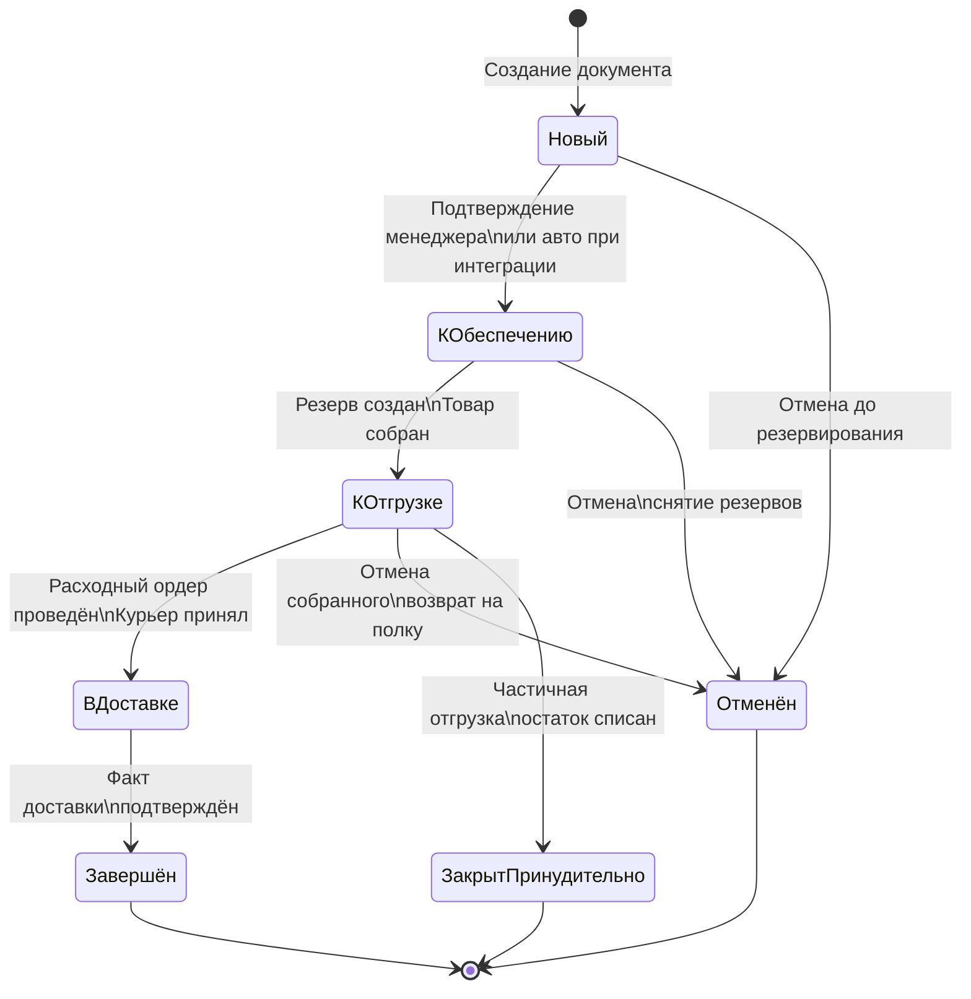
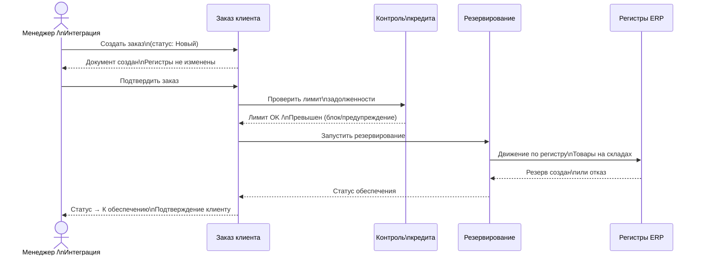
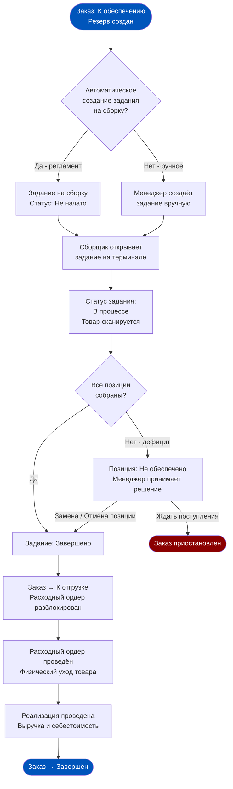
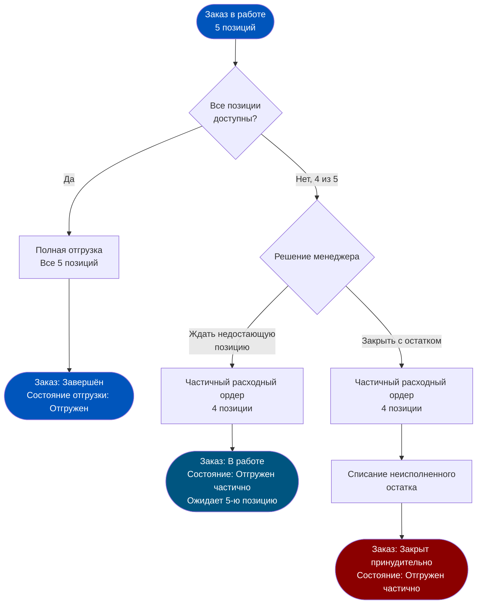
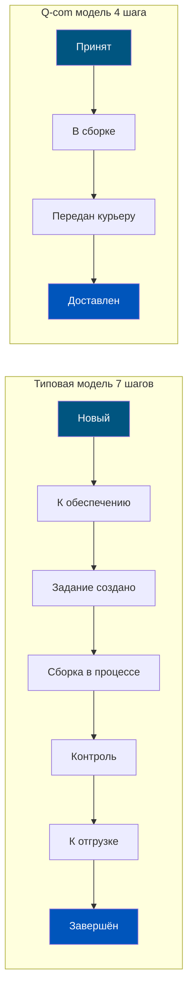
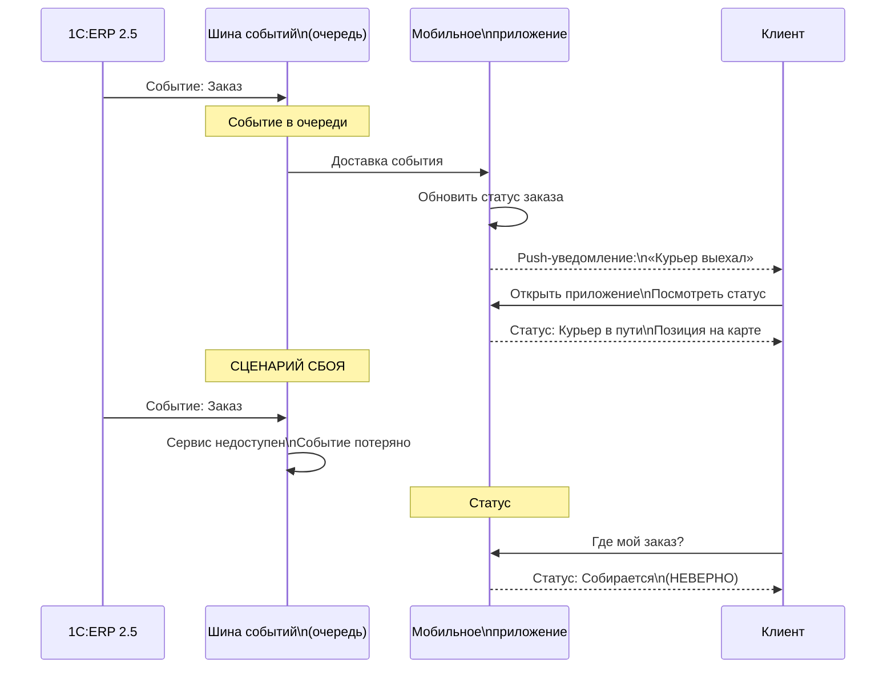
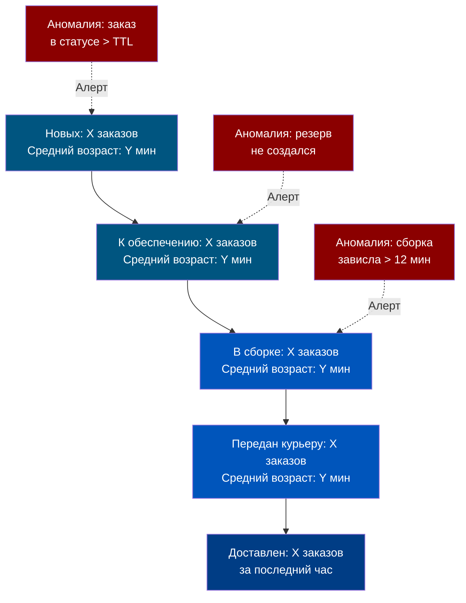

# Неделя 6. День 2. Статусная модель заказа

> Статус в 1C:ERP — это не цвет в интерфейсе для красоты. Это юридически значимое событие, которое изменяет состояние регистров, запускает проводки и определяет, кто и что имеет право делать с заказом дальше. Продакт, который путает статус с UX-лейблом, строит процессы на песке.

## Содержание

- [[#Часть 1. Анатомия статусной модели в 1C:ERP 2.5]]
- [[#Часть 2. Создание и первичная обработка заказа]]
- [[#Часть 3. Жизненный цикл: от подтверждения до готовности к отгрузке]]
- [[#Часть 4. Отмена и частичное выполнение]]
- [[#Часть 5. Статусная модель в режиме Q-com (15-минутная доставка)]]
- [[#Часть 6. Интеграция с внешними системами через статусы]]
- [[#Часть 7. Проектирование статусной модели: чеклист продакта]]

---

## Часть 1. Анатомия статусной модели в 1C:ERP 2.5

Одна из самых распространённых ошибок при работе с 1C:ERP — попытка найти «поле Статус заказа» и прочитать из него текущее состояние. Это поле существует, но оно описывает лишь одно из трёх измерений состояния документа. Реальная картина складывается из комбинации трёх независимых атрибутов:

**Измерение 1: Статус документа** — описывает, на какой стадии бизнес-процесса находится заказ. Принимает значения: `Новый`, `В работе`, `Завершён`, `Закрыт`. Это административный статус: он говорит, «открыт» ли заказ как бизнес-объект.

**Измерение 2: Состояние оплаты** — независимо от статуса документа, фиксирует факт финансовых обязательств. Значения: `Не оплачен`, `Оплачен частично`, `Оплачен`, `Переплата`. Это состояние меняется при проведении платёжных документов и не зависит от того, собран ли заказ физически.

**Измерение 3: Состояние отгрузки** — отражает физическое движение товара. Значения: `Не отгружен`, `Отгружен частично`, `Отгружен`. Это состояние меняется при проведении расходных ордеров и реализаций.

Почему ERP устроена именно так, а не «одно поле = один статус»? Потому что реальный бизнес-процесс нелинеен. Заказ может быть полностью оплачен, но не отгружен (предоплата). Может быть отгружен частично, но в статусе «В работе» (продолжается). Может быть «Завершён» административно, но оплачен лишь на 60% (постоплата с рассрочкой). Три независимых измерения дают 4 × 4 × 3 = 48 теоретически возможных комбинаций состояний. Реальных устойчивых комбинаций — около 12–15, но именно это многообразие позволяет системе точно отражать все нюансы бизнес-реальности.

Регистр, который хранит историю изменений состояний — **«Состояния заказов»** (регистр сведений). В отличие от регистров накопления (которые хранят только текущий итог), этот регистр ведёт полную историю каждого перехода: что изменилось, когда, в результате проведения какого документа и каким пользователем.

Механизм событий в ERP работает следующим образом: каждый переход между состояниями является «событием», на которое система может реагировать автоматически. Переход в «К обеспечению» → триггер резервирования. Переход в «К отгрузке» → разблокировка расходного ордера. Переход в «Завершён» → формирование задолженности для закрытия месяца. Это event-driven архитектура внутри монолитной системы — и понимание этих триггеров критически важно при проектировании интеграций.

---

## Часть 2. Создание и первичная обработка заказа

Детектив начинает расследование с первой улики. В нашем случае первая улика — момент создания заказа клиента. Именно здесь закладываются все данные, которые будут определять поведение системы на следующих этапах.

При создании документа «Заказ клиента» в статусе **«Новый»** система ещё ничего не делает с регистрами товарных остатков. Документ существует как намерение. В регистрах он не отражён. Это важно: «Новый» заказ не влияет на доступность товара для других заказов.

Первое, что происходит при попытке подтвердить заказ (перевести в работу) — **проверка лимита задолженности клиента**. ERP смотрит в регистр «Задолженность контрагентов» и сравнивает текущую задолженность + сумму нового заказа с установленным лимитом кредита для этого контрагента. Если лимит превышен — система может заблокировать подтверждение (при жёстком контроле) или выдать предупреждение (при мягком). Для B2C Q-com-заказов, где каждый покупатель — это физическое лицо без кредитного лимита, этот механизм обычно не используется. Но при интеграции с корпоративными клиентами (кейтеринг, офисная доставка) он становится критически важным.

После проверки кредитного лимита происходит переход в статус **«К обеспечению»**. Это ключевой момент. Именно здесь система «видит» потребность и начинает работу с регистрами:

- В регистр «Товары на складах» добавляется запись о резервировании (если настроено мягкое резервирование).
- В регистр «Заказы клиентов» добавляется информация о потребности по номенклатуре и срокам.
- Запускается механизм обеспечения потребностей (если настроен).

Автоматические обработчики событий — это то, что превращает ERP из «базы данных с формами» в операционную систему бизнеса. В типовой конфигурации ERP 2.5 есть регламентные задания, которые могут автоматически:

- Переводить заказы из «Новый» в «К обеспечению» по расписанию или по факту оплаты.
- Снимать резервы с заказов, у которых истёк TTL (максимальная дата отгрузки).
- Создавать задания на сборку при переходе заказа в статус «К отгрузке».
- Отправлять уведомления во внешние системы при смене состояния.

Именно эти автоматические триггеры нужно тщательно описывать и документировать при проектировании процессов — они невидимы глазу, но критически влияют на поведение системы в нештатных ситуациях.

---

## Часть 3. Жизненный цикл: от подтверждения до готовности к отгрузке

Заказ подтверждён, резерв создан. Теперь начинается операционная часть — путь от «товар зарезервирован в системе» до «товар у курьера в руках». Это самый насыщенный событиями отрезок жизненного цикла заказа.

Цепочка переходов выглядит так:

**Шаг 1: «К обеспечению» → создание задания на сборку.** При переходе заказа в состояние «К отгрузке» (или по отдельному триггеру) система создаёт документ **«Заказ на сборку (разборку)»**. Это отдельный документ с собственным жизненным циклом: `Не начато` → `В процессе` → `Завершено`. Задание на сборку содержит: список номенклатуры, количество, ячейку хранения (если ведётся адресное хранение), штрих-коды для сканирования.

**Шаг 2: Сборка в процессе.** Сборщик получает задание через мобильный терминал или распечатанный лист. Он физически идёт по складу, берёт товар, сканирует ячейки и позиции. Каждое сканирование — это событие в системе: «позиция X собрана». Статус задания меняется в реальном времени (при использовании мобильного рабочего места WMS-уровня).

**Шаг 3: Сборка завершена → контроль.** В некоторых конфигурациях добавляется этап контроля качества: другой сотрудник (или камера) проверяет, что собрано правильно. В Q-com с 15-минутной доставкой этот этап часто исключается или совмещается со сборкой.

**Шаг 4: «К отгрузке».** Это критический статус, открывающий «шлюз» для финансовых документов. Только когда заказ в статусе «К отгрузке», менеджер может создать и провести документ **«Расходный ордер»** (складской документ, фиксирующий физический уход товара) и **«Реализация товаров и услуг»** (бухгалтерский документ, формирующий выручку и себестоимость). До этого момента эти документы технически можно создать, но провести — нельзя. Это защита от случайных отгрузок незакрытых заказов.

Связь задания на сборку с заказом — не просто организационная. Это учётная связь: задание на сборку «знает», из какого резерва (какого заказа клиента) берётся каждая позиция. При использовании партионного учёта (FEFO, Неделя 4) задание на сборку также содержит информацию о конкретной партии, которую нужно взять. Это и есть механизм, через который бизнес-правило «отдавать сначала ближайший к истечению срок годности» реализуется на физическом уровне складских операций.

---

## Часть 4. Отмена и частичное выполнение

Идеальный мир: каждый заказ проходит полный цикл от «Новый» до «Завершён». Реальный мир: каждый десятый заказ — это исключение. Клиент передумал. Курьер не доехал. Товар при проверке оказался бракованным. Заказан 10 кг, физически на складе оказалось 7 кг. Статусная модель должна уметь обрабатывать все эти сценарии без потери учётных данных.

**Отмена заказа** — технически простая операция, но с цепочкой последствий:

При отмене заказа в статусе «Новый»: удаляется документ, никаких регистровых движений не было — очистка простая.

При отмене заказа в статусе «К обеспечению»: система должна снять резервы в регистре «Товары на складах». Это не удаление — это обратное движение: был `+5 зарезервировано`, стал `−5 зарезервировано`. Свободный остаток восстанавливается.

При отмене предоплаченного заказа: к логике снятия резервов добавляется логика возврата платежа. Система должна создать документ возврата, изменить состояние оплаты заказа и (при автоматической интеграции с эквайрингом) инициировать возврат средств клиенту.

**Частичная отгрузка** — более сложный сценарий. Клиент заказал 5 позиций, но одной нет в наличии. Варианты поведения системы:

1. Отгрузить 4 позиции → заказ переходит в состояние отгрузки «Отгружен частично» → заказ остаётся «В работе», ожидая отгрузки 5-й позиции.
2. Отгрузить 4 позиции → принудительно закрыть заказ → статус «Закрыт принудительно». Пятая позиция списывается как «не выполненная».

### Регламент обработки частичных заказов: пошаговый алгоритм

Для операционной команды важно иметь задокументированный алгоритм действий при частичной недостаче. Без такого регламента каждый менеджер смены принимает решение интуитивно, что приводит к несогласованным данным в ERP.

**Алгоритм действий при обнаружении недостачи в процессе сборки:**

1. Сборщик отмечает позицию как «Не найдена» в задании на сборку (через мобильный терминал или вручную).
2. Система автоматически создаёт уведомление менеджеру смены о дефицитной позиции.
3. Менеджер смены в течение 3 минут принимает решение по одному из сценариев:
   - **Замена на аналог**: если есть согласованный список замен (справочник «Аналоги номенклатуры»), сборщик берёт аналог, менеджер корректирует позицию в заказе.
   - **Частичная отгрузка**: клиент получает заказ без дефицитной позиции + компенсацию (скидка/купон).
   - **Отмена заказа**: если дефицитная позиция ключевая (например, именинный торт) — заказ отменяется целиком.
4. Решение фиксируется в ERP: корректировка заказа + комментарий с причиной.
5. Клиент получает уведомление через приложение с объяснением изменений.

Без пункта 5 (уведомление клиента) «частичная отгрузка» становится сюрпризом при получении — и это главный источник негативных отзывов, а не сам факт недостачи.

Различие между «Завершён» и «Закрыт принудительно» важно для аналитики. «Завершён» — заказ выполнен полностью. «Закрыт принудительно» — заказ закрыт с неисполненным остатком. Это разные сигналы для анализа Fill Rate: «Закрыт принудительно» — прямой вклад в снижение метрики.

Для Q-com важно определить политику работы с частичными заказами заранее. Типичные варианты:

- **Нулевая толерантность**: если хотя бы одна позиция недоступна — весь заказ отменяется. Клиент разочарован, но не получает неполный заказ.
- **Максимум сервиса**: отгружаем всё, что есть, делаем скидку или возврат за недостающее. Клиент получает частичный заказ и компенсацию.
- **Пороговая политика**: если доступно ≥ 80% позиций — отгружаем частично. Если < 80% — отменяем целиком.

Каждая из этих политик реализуется через настройки в статусной модели ERP и должна быть явно задокументирована в регламентах.

---

## Часть 5. Статусная модель в режиме Q-com (15-минутная доставка)

Типовая статусная модель 1C:ERP 2.5 создавалась для мира, где заказ живёт часами и днями. Цикл «создание → отгрузка» в B2B-дистрибуции занимает от нескольких часов до нескольких дней. Статусов много — это нормально, потому что каждый этап требует времени для обработки, согласования, проверки.

В Q-com с целевым временем доставки 15–30 минут от оформления до курьера у двери каждый лишний статус-переход — это потеря времени. Если на каждый из 7 шагов типовой модели уходит по 2 минуты — это уже 14 минут только на изменение статусов. Реальности не остаётся.

Что менять в конфигурации для ultra-fast fulfillment:

**Убрать ручные подтверждения там, где возможно.** Переход «Новый → К обеспечению» должен происходить автоматически при получении оплаченного заказа из интеграции. Никаких ручных кликов менеджера.

**Объединить сборку и контроль.** Отдельный этап «Контроль сборки» → убирается или заменяется весовым/сканерным автоконтролем прямо на этапе сборки.

**Упростить документооборот отгрузки.** Расходный ордер и реализация могут проводиться автоматически при подтверждении факта передачи курьеру (сканирование пакета при выходе из даркстора).

| Этап | Типовая ERP модель | Q-com оптимизированная модель |
|---|---|---|
| Создание заказа | Новый (ручное) | Авто из API |
| Резервирование | К обеспечению (ручное) | Авто при создании |
| Создание задания | Ручное или регламент | Авто немедленно |
| Сборка | Задание на сборку → Завершено | Мобильный ТСД, без этапов |
| Контроль | Отдельный этап | Встроен в сборку |
| Отгрузка | К отгрузке → Расходный ордер | Авто при скане выхода |
| Закрытие | Реализация (ручное) | Авто при подтверждении доставки |

Ключевые метрики для мониторинга эффективности статусной модели — это **время в каждом статусе**:

- Время от «Принят» до «В сборке»: цель < 1 мин (автоматизированная передача).
- Время от «В сборке» до «Передан курьеру»: цель < 8 мин (benchmark даркстора).
- Время от «Передан курьеру» до «Доставлен»: цель < 15 мин (радиус покрытия).
- Доля заказов, застрявших в статусе > N мин: индикатор системных сбоев.

Если какой-то статус накапливает аномально большое количество заказов — это первый сигнал: либо автоматизированный переход сломался, либо узкое место в физическом процессе.

---

## Часть 6. Интеграция с внешними системами через статусы

Статусная модель в ERP — это внутренняя нервная система заказа. Но клиент видит другую нервную систему: уведомления в мобильном приложении, статус на сайте маркетплейса, SMS от курьерской службы. Задача интеграционного слоя — синхронизировать эти два мира так, чтобы клиент всегда видел правду.

Технически это реализуется двумя способами:

**Polling (опрос):** внешняя система периодически запрашивает ERP: «Какой статус у заказа №1042?» Простой подход, но создаёт лишнюю нагрузку и даёт задержку до следующего цикла опроса (30 сек → 1 мин → зависит от настройки).

**Push (события):** ERP сама «толкает» статус во внешнюю систему, когда он изменяется. Это event-driven подход, реализуемый через вебхуки или очередь сообщений (RabbitMQ, Kafka, 1C:Шина). Задержка минимальная, нагрузка ниже. Именно этот подход рекомендуется для Q-com.

Самая болезненная проблема интеграционного слоя — **рассинхронизация статусов**. Типичный сценарий:

1. ERP: заказ в статусе «В сборке». Приложение показывает «Собирается» — всё верно.
2. Сборщик завершил сборку, задание на сборку проведено в ERP. ERP → статус «К отгрузке».
3. Push-событие ушло в интеграционный слой. Но интеграционный сервис лёг (перезапуск, OOM). Событие потерялось.
4. Приложение продолжает показывать «Собирается». Клиент видит статус, который не обновлялся 20 минут.
5. Курьер уже выехал, но приложение об этом не знает.

Проблема двойных статусов при работе с агрегаторами (Яндекс Доставка, Достависта, собственный курьерский сервис) возникает, когда курьерская система имеет собственную модель статусов, отличающуюся от ERP. Заказ «В доставке» в ERP может соответствовать трём разным статусам в курьерской системе: «Назначен курьер», «Курьер выехал», «На месте». И обратно: статус «Проблема с доставкой» в курьерской системе не имеет аналога в типовой ERP — нужно создавать кастомное маппирование.

Для продакта главный вывод: **маппирование статусов ERP ↔ внешние системы должно быть задокументировано как часть технического дизайна**, а не решаться «по месту» разработчиком интеграции. Каждое несоответствие в маппировании — потенциальный источник конфликтующих статусов и клиентских эскалаций.

---

## Часть 7. Проектирование статусной модели: чеклист продакта

Вы стоите перед задачей: спроектировать или переработать статусную модель заказа для вашего Q-com проекта. Не как разработчик, описывающий технические поля в базе данных, — а как продакт, отвечающий за то, чтобы система отражала бизнес-реальность точно и без провалов.

Семь вопросов, которые нужно задать перед утверждением любого нового статусного потока:

**1. Кто является актором перехода?** Переход происходит автоматически (система) или вручную (пользователь)? Если вручную — какая роль? Если автоматически — какое событие триггерит?

**2. Обратим ли переход?** Можно ли вернуть заказ из статуса B в статус A? Если нет — это необратимое действие, требующее дополнительного подтверждения.

**3. Какие регистры затрагивает переход?** Это вопрос о side effects. Переход может менять товарные остатки, долги, планы закупок, задания сборщикам — нужно знать полный список.

**4. Что происходит с финансами?** Некоторые переходы триггерят проводки или изменяют финансовые обязательства. «Заказ завершён» в ERP — это не просто смена статуса, это формирование дебиторской задолженности и учёт выручки.

**5. Как об этом узнают внешние системы?** Маппирование с курьерской службой, приложением, маркетплейсом. Если перехода нет в маппинге — внешний мир его не видит.

**6. Что происходит при исключении?** Таймаут, сбой интеграции, неожиданные данные — какое состояние у заказа? Есть ли «аварийный» статус или заказ застревает навсегда?

**7. Как этот статус влияет на аналитику?** Какие метрики он улучшает или ухудшает? Корректно ли он отображается в отчётах по Fill Rate, времени выполнения, причинам отмен?

| Статус | Кто видит | Что триггерит | Необратим? |
|---|---|---|---|
| Новый | Менеджер ERP | Ничего | Нет |
| К обеспечению | Менеджер, склад | Резервирование в регистре | Нет (можно отменить) |
| Задание создано | Сборщик, менеджер | Задание на сборку | Нет (можно отозвать) |
| К отгрузке | Менеджер, экспедитор | Разблокировка расходного ордера | Условно (нужна отмена) |
| Завершён | Все стороны, финансы | Проводки выручки и себестоимости | Да (через корректировку) |
| Закрыт принудительно | Менеджер, аналитика | Списание неисполненного | Да |
| Отменён | Все стороны | Снятие резервов, возврат оплаты | Да |

Связь с финансовым учётом — ключевая точка, которую продакт обязан понимать. Переход в статус «Завершён» или проведение реализации в ERP не просто «закрывает» заказ — это **юридически значимое событие**, которое:

- Формирует запись в регистре выручки.
- Формирует запись о себестоимости (через механизм расчёта себестоимости при закрытии месяца).
- Создаёт дебиторскую задолженность клиента (если постоплата).
- Уменьшает товарный остаток в регистре «Товары на складах» (через расходный ордер).

Именно поэтому нельзя «просто удалить» или «откатить» завершённый заказ в ERP — нужно создавать корректирующие документы (возврат, корректировка реализации). Это не ограничение плохого ПО, это требование бухгалтерского и налогового законодательства.

Главный принцип, который стоит выгравировать над входом в любую комнату, где обсуждается дизайн ERP-процессов: **статус в ERP — это юридически значимое событие, а не просто UX-лейбл**. Каждый переход оставляет след в регистрах, влияет на финансы и имеет юридические последствия. Проектируйте статусные модели с той же тщательностью, с которой юрист пишет договор.

### Расширенный разбор: история одного сбоя

Рассмотрим реальный паттерн инцидента, с которым сталкиваются многие Q-com стартапы при первом масштабировании.

Компания запустила даркстор. Интеграция с приложением настроена «по-быстрому»: заказ создаётся в ERP, статус опрашивается каждые 30 секунд (polling). При 200 заказах в день — работает нормально. При 2000 заказах в день — polling создаёт 240 000 запросов в сутки к ERP, база начинает «захлёбываться», время отклика растёт, статусы запаздывают на 2–5 минут.

Последствия для клиента: заказ «Собирается» ещё 10 минут после того, как курьер уже выехал. Клиент нервничает, звонит в поддержку. Поддержка открывает ERP — видит «Передан курьеру». Но почему приложение показывает другое? Потому что последний polling был 4 минуты назад, и следующий ещё не случился.

Это не проблема статусной модели. Это проблема архитектуры интеграции. Но симптомы «видит» именно статусная модель. Именно поэтому при проектировании нужно заранее решить: polling или push-события. И задокументировать это как архитектурное решение с обоснованием, а не как «техническую деталь».

### Что такое «статусный долг» и почему он накапливается

По аналогии с техническим долгом в разработке, в операционных системах существует «статусный долг» — накопленные расхождения между реальным состоянием заказа и его статусом в ERP. Он накапливается по нескольким причинам:

- Сотрудники «срезают углы»: проводят документы задним числом, не дожидаясь корректного перехода через все статусы.
- Интеграционные сбои оставляют заказы в промежуточных статусах, которые никто не мониторит.
- Бизнес-процессы изменились (например, добавили этап весового контроля), но статусная модель в ERP не обновлена — люди придумывают «обходные пути».
- Отсутствие алертов: никто не видит, что 15 заказов уже 3 часа висят в статусе «В сборке».

Статусный долг опасен не сам по себе — один неверный статус легко исправить. Он опасен своей накопительной природой: через 3 месяца работы без мониторинга операционный дашборд перестаёт отражать реальность, и принятие решений начинает строиться на неверных данных. Регулярный аудит статусного долга (еженедельно в первые месяцы работы) — обязательная практика для Q-com операций.

### Типовые ошибки при кастомизации статусной модели

За годы внедрений ERP в ритейл-компаниях накоплены типовые ошибки кастомизации. Вот те, которые чаще всего встречаются именно в Q-com:

**Ошибка 1: Добавление статусов «для красоты».**
«Давайте добавим статус „Упакован" между „Собран" и „К отгрузке" — клиент хочет знать, что заказ упакован». Звучит разумно, но: этот новый статус требует триггера (кто и когда его устанавливает?), маппирования в приложение, обработки в отчётах, логики снятия при отмене. Каждый новый статус — это N умноженное на количество мест в системе, где нужно что-то поменять.

**Ошибка 2: Необратимые переходы без предупреждения.**
Менеджер случайно нажал «Завершить» на заказе, который ещё в сборке. Статус «Завершён» — необратим. Для исправления нужно создавать корректировочные документы, делать возврат и пересоздавать заказ. Итог: 40 минут работы и потенциальные расхождения в бухгалтерии. Решение: добавить диалог подтверждения для необратимых переходов, особенно в мобильном рабочем месте.

**Ошибка 3: Игнорирование промежуточных статусов при отмене.**
Система умеет отменять заказ из «Нового» — всё хорошо. Но что происходит при отмене из статуса «Сборка в процессе»? Сборщик в этот момент уже собрал половину позиций. Нужно: отозвать задание на сборку, вернуть собранное на полку, снять резервы, обработать предоплату. Если логика отмены из «промежуточных» статусов не протестирована — в продакшне она сломается именно тогда, когда это наиболее болезненно.

**Ошибка 4: Разные статусные модели для разных каналов без явного документирования.**
«Для Ozon у нас свой статус „Передан Ozon", для собственного приложения — „В доставке"». Это нормально — но только если задокументировано и все системы знают, какой статус ERP соответствует какому каналу. Без документации через 6 месяцев никто не помнит маппирование, и каждый новый разработчик интеграции создаёт собственную версию истины.

### Инструменты ERP для работы со статусами: что доступно «из коробки»

В типовой конфигурации ERP 2.5 существует несколько встроенных инструментов для работы со статусной моделью, которые часто не используются из-за недостаточной осведомлённости команды:

**Рабочее место «Монитор заказов клиентов»** — центральная точка мониторинга статусов. Позволяет фильтровать заказы по статусу, дате, ответственному. Поддерживает массовые операции: перевести группу заказов в следующий статус, снять резервы по группе и т.д. Это первый инструмент, который должен знать каждый менеджер смены.

**Отчёт «Анализ выполнения заказов»** — показывает, какой процент заказов за период прошёл через каждый статус, сколько времени провёл в каждом, какие перешли в «Закрыт принудительно» или «Отменён». Это еженедельный инструмент руководителя операций.

**Регламентные задания по статусам** — набор фоновых процессов, которые автоматически переводят заказы между статусами по заданным правилам. Их нужно настраивать явно — «из коробки» они либо отключены, либо настроены под типовой B2B-сценарий, не подходящий для Q-com.

**Журнал событий заказа** — для каждого заказа клиента можно просмотреть полную историю изменений: кто, когда, из какого статуса в какой перевёл. Незаменим при разборе инцидентов.

Знание этих четырёх инструментов позволяет продакту самостоятельно диагностировать большинство операционных проблем без привлечения разработчиков или внедренцев.

### Метрика: воронка статусов как операционный дашборд

Представьте воронку, где каждый слой — это статус заказа. Количество заказов в каждом статусе в реальном времени — это операционный пульс вашего даркстора:

Нормальная картина даркстора в рабочее время: большинство заказов находятся в статусах «В сборке» и «Передан курьеру», «Новых» почти нет (быстро переходят дальше), «Доставленных» за час — соответствует входящему потоку.

Аномальная картина: накопление в статусе «Новый» → проблема с интеграцией или резервированием. Накопление в статусе «В сборке» → узкое место на складе или сбой мобильных терминалов. Накопление в «К обеспечению» без движения → регламентное задание создания заданий на сборку не работает.

Этот дашборд должен быть открыт у менеджера смены весь рабочий день. Это не BI-отчёт для еженедельного анализа — это оперативный монитор, как пульт управления в диспетчерской.

### Статусная модель и SLA: как считать соответствие

Многие Q-com компании декларируют SLA (например, «95% заказов доставляются за 20 минут»), но не умеют его правильно измерять через данные ERP. Статусная модель даёт для этого все необходимые данные:

- Время создания заказа (статус «Новый») → timestamp в документе.
- Время передачи курьеру (статус «Передан курьеру») → timestamp проведения расходного ордера.
- Время доставки (статус «Завершён») → timestamp, зафиксированный через интеграцию с курьерской службой.

Разность `Завершён` − `Новый` = полное время исполнения заказа. Разность `Передан курьеру` − `Новый` = время обработки и сборки. Разность `Завершён` − `Передан курьеру` = время доставки.

Если эти timestamps фиксируются корректно (регистр «Состояния заказов» хранит историю переходов), то SLA-отчётность строится напрямую из ERP без дополнительных систем. Если timestamps не фиксируются или фиксируются с задержкой (например, расходный ордер проводится постфактум) — SLA-данные будут неверными, и вы не сможете честно ответить на вопрос «соответствуем ли мы своим обещаниям».

### Связь статусной модели с FEFO и партионным учётом

Статус «К отгрузке» разблокирует расходный ордер. В расходном ордере — ссылка на конкретные партии, которые списываются. Именно здесь логика FEFO (First Expired, First Out) проявляется как учётное требование: система должна выбрать для списания партии с ближайшим сроком годности.

Если при создании задания на сборку сборщик взял «не ту» партию (удобнее было с другой полки), а потом в задании поставил «нужную» партию вручную — в расходном ордере списывается та партия, что указана в задании, а не та, что физически ушла. Это расхождение аккумулируется и выявляется при инвентаризации. Кольцо замкнулось: статусная модель, FEFO, резервирование и инвентаризация — это не четыре отдельных темы, это четыре грани одного учётного процесса.

### Контрольные вопросы для самопроверки

Три вопроса, на которые стоит ответить прежде, чем утверждать дизайн статусной модели:

1. Менеджер смены открывает рабочий день. Какие статусы заказов из прошлой смены требуют его внимания прямо сейчас — и как ERP помогает ему это увидеть без ручного поиска?

2. Заказ находится в статусе «Передан курьеру». Клиент звонит и требует отмены. Технически это возможно? Какие документы нужно создать в ERP, чтобы корректно обработать эту ситуацию?

3. Вы добавляете новый статус «Проверка весового контроля» между «Собран» и «К отгрузке». Перечислите все системы и процессы, которые нужно обновить, чтобы этот статус работал корректно в production.

Если на третий вопрос вы насчитали меньше 8 компонентов — скорее всего, что-то упустили. Это нормально: именно для выявления таких пробелов и нужно делать детальный impact assessment перед любым изменением статусной модели.

### Итог урока: что запомнить

**Тезис 1.** Статус в 1C:ERP — это не одно поле, а комбинация трёх независимых измерений: административный статус документа, состояние оплаты, состояние отгрузки. Работа с «одним статусом» — концептуальная ошибка, которая приводит к неверному дизайну интеграций.

**Тезис 2.** Каждый переход между статусами — это событие с side effects: изменение регистров, триггер документооборота, потенциальные финансовые проводки. Необратимые переходы требуют явной защиты от случайного нажатия.

**Тезис 3.** Оптимизация статусной модели для Q-com — это не «упростить ради простоты», а осознанное устранение ручных шагов и промежуточных статусов, которые не добавляют бизнес-ценности, но добавляют время к fulfilment cycle. Каждый убранный ручной переход — это секунды в TTD (time-to-door).

**Тезис 4.** Мониторинг статусной воронки в реальном времени — обязательный операционный инструмент, а не аналитика «на потом». Аномалии в накоплении заказов в конкретном статусе — первый сигнал системного сбоя, который менеджер смены должен видеть без поиска по отчётам.

### Связь с последующими уроками

Статусная модель заказа — это скелет, на который нанизываются все остальные темы Недели 6. День 3 (Рабочее место сборщика) — это то, что видит сборщик в момент, когда заказ переходит в статус «К сборке». День 4 (Расходные документы) — это финансовый слой, который активируется при переходе в «К отгрузке». День 5 (Курьерская интеграция) — это то, как статус «Передан курьеру» транслируется в курьерскую систему и обратно.

Понимание статусной модели как единой архитектурной рамки позволяет воспринимать каждый последующий урок не как «ещё один набор правил», а как следующий слой одной и той же системы, которую вы уже понимаете в целом.

Если сегодняшний урок оставил один главный вопрос без ответа — пусть это будет: «Для нашего конкретного Q-com-продукта, какой из переходов статусной модели сейчас является наиболее слабым местом — самым ручным, самым медленным, наиболее подверженным ошибкам?» Ответ на этот вопрос укажет, с чего начинать оптимизацию в первую очередь.

Запомните: когда следующий раз кто-то из команды скажет «просто поменяем статус» — знайте, что за этой фразой скрывается как минимум 5 вопросов из чеклиста, которые нужно проверить прежде, чем вносить изменения в продуктивную систему.

Статусная модель — это не документ для однократного проектирования. Это живой артефакт, который эволюционирует вместе с бизнесом: новые каналы продаж, новые типы заказов, новые требования регуляторов — всё это требует пересмотра переходов, проверки маппирований и обновления регламентных заданий. Продакт, который понимает механику статусной модели на уровне регистров и событий ERP, способен управлять этой эволюцией осознанно — а не реагировать на инциденты постфактум.

Следующий урок — рабочее место сборщика — покажет, как статусные переходы, которые мы разобрали сегодня, выглядят с другой стороны: с экрана мобильного терминала человека, который физически собирает заказ.

---

← [[Неделя 6 - День 1 - Логика резервирования|← День 1]] | [[1c_erp_qcom/README|Оглавление]] | [[Неделя 6 - День 3 - Рабочее место сборщика|День 3 →]]

