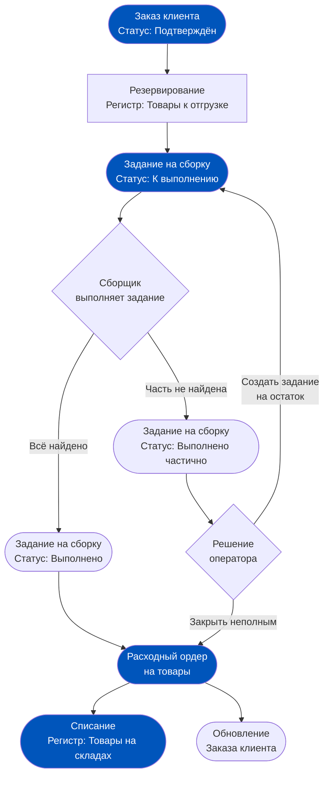
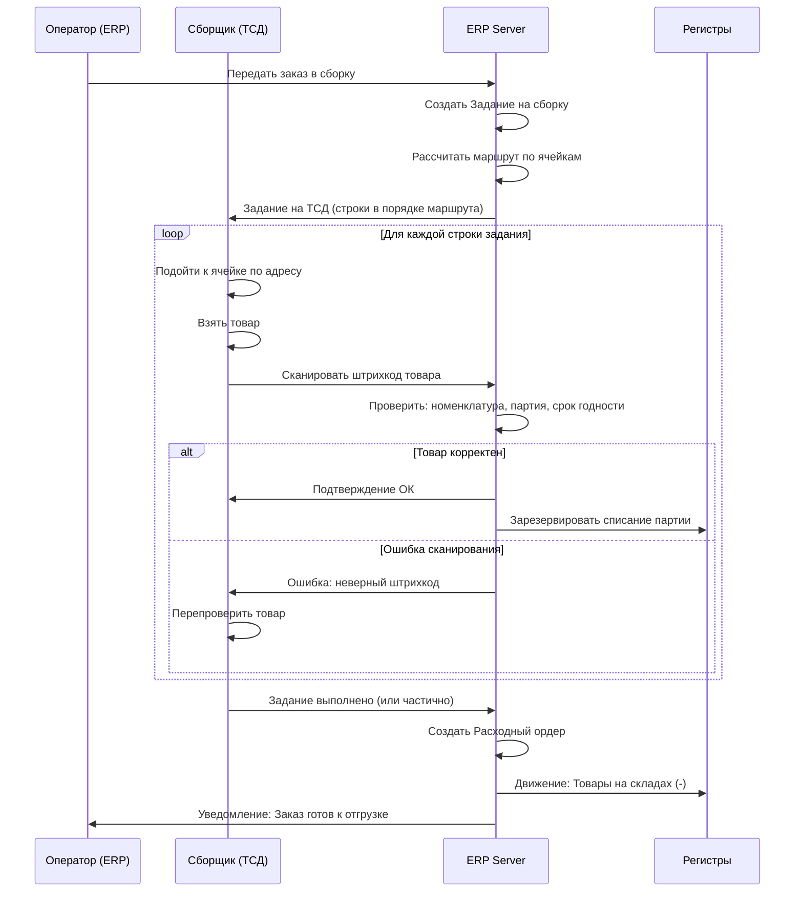
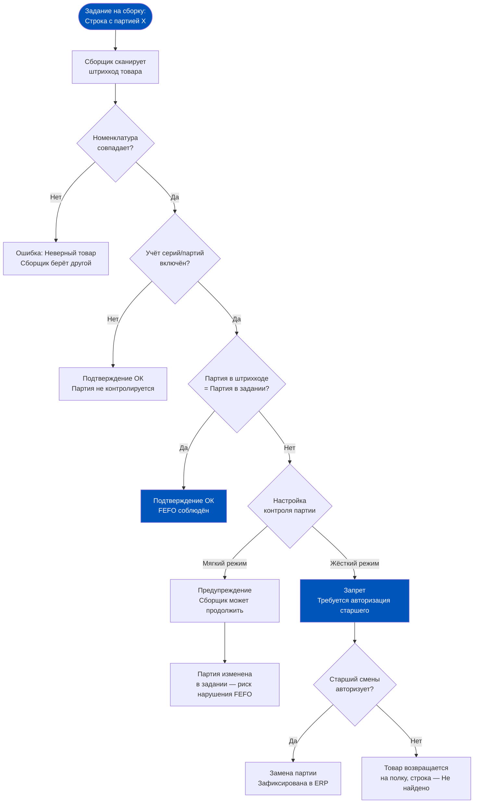
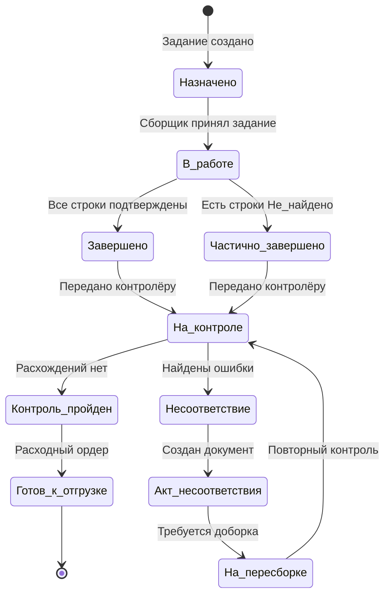
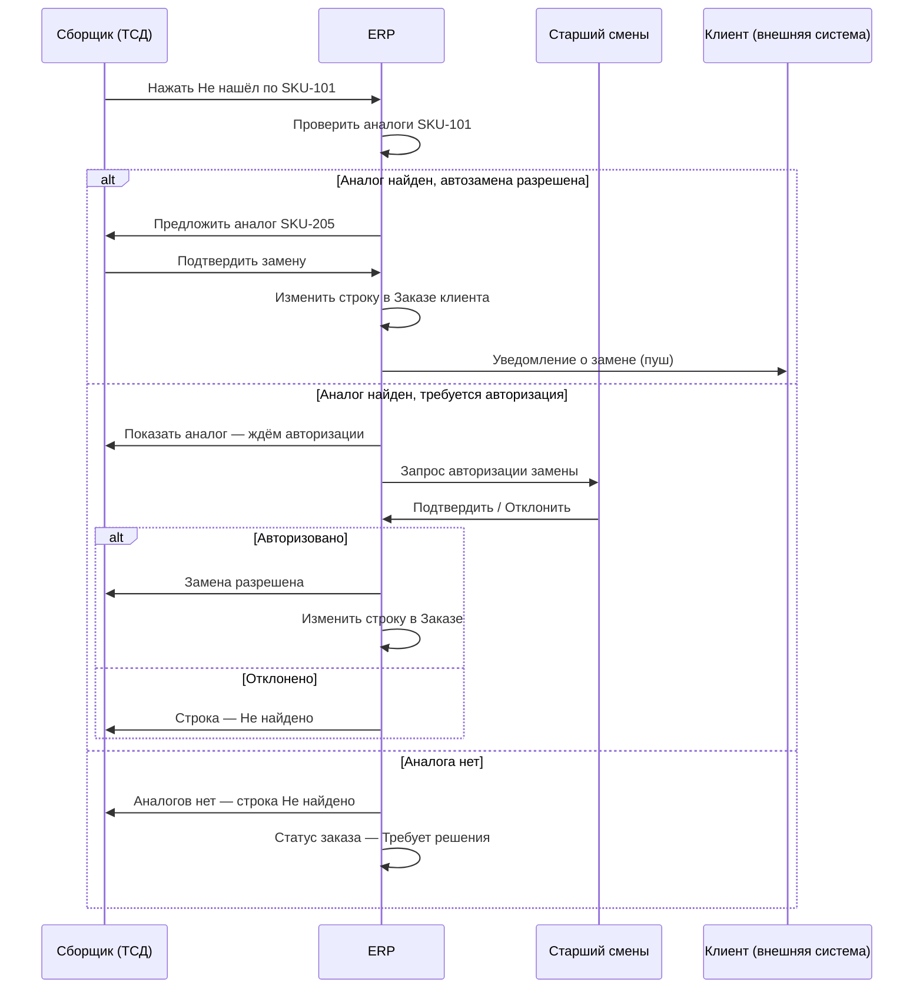
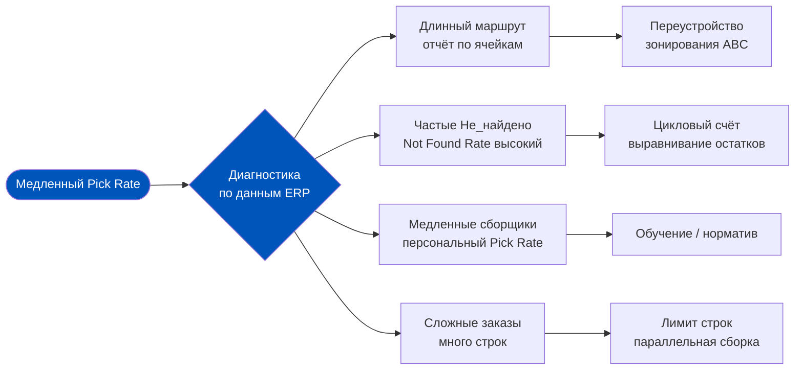
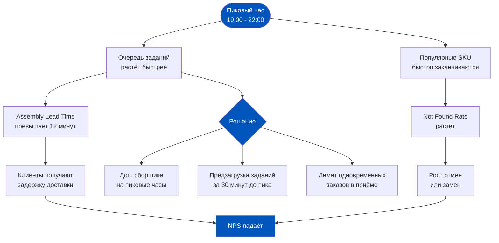

# Неделя 6, День 3. Рабочее место сборщика: восемь минут между заказом и курьером

> **Цель урока:** Понять, как 1C:ERP 2.5 организует процесс сборки в даркстор-логистике — от момента генерации задания до передачи заказа на отгрузку. Разобрать узкие места, которые видит сборщик, и те, которые он не видит, но которые влияют на точность остатков и NPS.
>
> **Компетенции после урока:**
> - Объяснить структуру документа «Задание на сборку» и его связь с Заказом клиента и Расходным ордером
> - Понять, как ERP строит маршрут по ячейкам и почему он иногда неоптимален
> - Описать алгоритм FEFO при сборке и последствия его нарушения
> - Сформулировать главные операционные риски рабочего места сборщика и их корни в логике ERP
>
> **Время:** ~80 минут

---

## Оглавление

- [[#Часть 1. Анатомия задания на сборку в ERP 2.5]]
- [[#Часть 2. МРМК vs Рабочее место сборщика в Q-com]]
- [[#Часть 3. Алгоритм подбора товара: FEFO в реальном времени]]
- [[#Часть 4. Проблемы рабочего места сборщика в Q-com]]
- [[#Часть 5. Контроль качества сборки]]
- [[#Часть 6. Весовой товар и замены при сборке]]
- [[#Часть 7. Метрики сборки как продуктовый инструмент]]

---

## Часть 1. Анатомия задания на сборку в ERP 2.5

Представьте: 23:47, даркстор в спальном районе. Поступает заказ — 14 позиций, клиент обещал получить через 18 минут. Диспетчер смены видит заказ в интерфейсе ERP и нажимает «Передать в сборку». В этот момент в системе происходит нечто, чего клиент никогда не увидит, но что определит, получит ли он свои яйца с правильным сроком годности и не обнаружит ли в пакете чужой кефир.

### Три документа, три слоя реальности

В 1C:ERP 2.5 процесс выполнения заказа разбит на три документальных слоя. Это не бюрократия ради бюрократии — это архитектурное решение, позволяющее системе отслеживать три разных состояния одновременно: коммерческое обязательство, физическое движение товара и факт его списания.

**Слой 1: Заказ клиента.** Это коммерческий документ. Он фиксирует: что заказал клиент, по какой цене, с каким статусом оплаты. Заказ клиента не двигает товар — он только резервирует. После того как оператор подтвердил заказ, ERP блокирует соответствующее количество в регистре «Товары к отгрузке» — товар больше не доступен для других заказов, хотя физически всё ещё стоит на полке.

**Слой 2: Задание на сборку.** Именно этот документ — операционное сердце процесса. Он создаётся на основании Заказа клиента и содержит не просто список SKU, а конкретные инструкции для сборщика: из какой ячейки взять, какую партию (с каким сроком годности), в каком количестве. Задание на сборку — это переход от «что нужно» к «где это лежит».

**Слой 3: Расходный ордер на товары.** Формируется после того, как сборщик завершил работу и отметил задание как выполненное. Расходный ордер — это юридический и бухгалтерский документ: он списывает товар с регистра «Товары на складах» и передаёт его в регистр «Товары, переданные перевозчику» (или сразу в «Отгруженные», в зависимости от настройки).

### Что видит кладовщик в интерфейсе

Сборщик в даркстор-среде работает с заданием, где каждая строка — это не просто SKU и количество. ERP заполняет задание следующими полями:

- **Номенклатура** — полное наименование и артикул
- **Количество к сборке** — с учётом уже зарезервированных партий
- **Ячейка хранения** — конкретный адрес на складе (если включён адресный учёт)
- **Серия/партия** — для товаров с учётом по срокам годности
- **Приоритет строки** — определяется маршрутом обхода склада
- **Статус строки** — «К сборке» / «Собрано» / «Не найдено»

Маршрутизация строится на основе топологии склада, заданной в справочнике «Размещение ячеек». ERP сортирует строки задания в порядке обхода ячеек — от входа к выходу по оптимальному маршруту. В теории сборщик идёт по складу один раз, не возвращаясь назад.

### Разница: «Задание на сборку» vs «Заказ на отбор»

Здесь кроется частое заблуждение. В типовой конфигурации 1C:ERP 2.5 существует документ «Заказ на отбор» (иногда называемый «Отбор товаров к отгрузке»). Это предшественник Задания на сборку в более простых схемах учёта.

Ключевое различие: «Заказ на отбор» создаётся как вспомогательный документ без строгой привязки к ячейкам и партиям — он годится для простых складов без адресного хранения. «Задание на сборку» — это более зрелый инструмент, который знает топологию склада, умеет маршрутизировать и работает с FEFO. В даркстор-среде с адресным хранением используется именно Задание на сборку.

---

## Часть 2. МРМК vs Рабочее место сборщика в Q-com

### Наследие из Недели 5: что даёт МРМК

На Неделе 5 мы разобрали МРМК (Мобильное рабочее место кладовщика) как инструмент для операций приёмки, перемещения и инвентаризации. Тот же интерфейс — та же логика тонкого клиента поверх базы 1C, тот же ТСД с лазерным сканером — используется и для сборки заказов. Но Q-com накладывает на него принципиально иные операционные требования.

В классическом складе МРМК-сборщик работает в режиме «батчинга»: берёт задание на 40–60 строк, идёт по складу 15–20 минут, собирает несколько заказов одновременно, возвращается, сдаёт. Скорость важна, но не критична: заказ отправится через 2–4 часа.

В даркстор Q-com всё иначе.

### Специфика Q-com: сборщик — не кладовщик, а спринтер

Среднее время сборки в Q-com — от 4 до 10 минут. Это не опечатка. Это структурное требование бизнес-модели: клиент ждёт доставку за 15–20 минут, из которых 3–5 уходит на маршрут курьера. Значит, сборка + контроль + упаковка = максимум 10 минут.

Это меняет всё:

**Батчинг невозможен (почти).** Сборщик собирает один заказ от начала до конца. Причина — не организационная, а продуктовая: смешивание товаров из разных заказов в одной тележке при 8-минутном цикле создаёт слишком высокий риск пересортицы. Отдельные даркстор-операторы экспериментируют с «мягким батчингом» — сборкой 2–3 заказов одновременно по зонам, — но это требует дополнительного слоя сортировки на выходе.

**Маршрут должен быть оптимальным с первого раза.** Если ERP построит маршрут неоптимально (например, отправит сборщика сначала на полку с водой в зоне С, потом обратно в зону А за молоком, потом снова в С за соком), это съедает 2–3 минуты. В контексте 8-минутного окна это катастрофа.

**Сборщик не должен думать.** Интерфейс МРМК при Q-com-сборке настраивается в режиме «следующий шаг»: одна строка на экране, одно действие — сканировал, подтвердил, следующий. Никакого выбора, никаких решений, если нет специального сценария (отсутствие товара, замена, весовой товар).

### Маршрутизация по ячейкам: как ERP строит маршрут

Топология даркстора в ERP задаётся через справочник «Схема размещения ячеек». Каждой ячейке присваивается координатный адрес: зона — ряд — стеллаж — ярус. ERP при формировании Задания на сборку сортирует строки по принципу «змейки»: обход стеллажей поочерёдно слева направо с разворотом.

Проблема возникает в момент, когда топологический справочник не актуален. Если управляющий переставил стеллаж в зоне B, но не обновил схему в ERP — сборщик пойдёт по адресу, которого больше нет, и потеряет время.

---

## Часть 3. Алгоритм подбора товара: FEFO в реальном времени

### Почему FEFO, а не FIFO

FIFO (First In — First Out) — классический принцип: первым пришло, первым ушло. Кажется логичным. Но в продуктовой рознице FIFO ломается на одном граничном случае: поставщик привёз новую партию с более коротким сроком годности, чем предыдущая. Такое бывает регулярно — особенно с молочкой. В FIFO-логике ERP отдаст «старую» партию, у которой срок лучше. FEFO (First Expired — First Out) переворачивает приоритет: всегда уходит та партия, у которой срок годности истекает раньше.

В 1C:ERP 2.5 выбор стратегии подбора партий настраивается на уровне номенклатурной группы или отдельной номенклатуры. Для даркстор-операторов FEFO — обязательный стандарт для всех товаров с ограниченным сроком годности. Нарушение FEFO — это не просто операционная ошибка: это возможный возврат просроченного товара, жалоба в Роспотребнадзор и удар по рейтингу магазина.

### Как ERP выбирает партию при формировании задания

Когда Задание на сборку создаётся, ERP не просто вписывает SKU и количество — она уже на этапе формирования задания указывает конкретную партию. Алгоритм работает следующим образом:

1. ERP запрашивает регистр «Партии товаров на складах» по данному SKU и складу
2. Из списка доступных партий выбирает ту, у которой `Дата истечения срока годности` — наименьшая (FEFO)
3. Если этой партии недостаточно для покрытия всего количества — берёт следующую по FEFO
4. Записывает партию в строку задания как обязательную к сборке

### Конфликт скорости и качества

Здесь возникает главный операционный риск. Сборщик, работающий в 8-минутном режиме, физически взял с полки товар. Товар выглядит правильно — та же упаковка, тот же артикул. Но это другая партия: она лежала глубже, у неё срок лучше, и сборщик взял её «по виду», не считывая штрихкод с серийным номером партии.

ERP при сканировании штрихкода товара проверяет:
- Совпадение номенклатуры (EAN-13 или внутренний штрихкод)
- Если включён учёт серий — совпадение серии/партии

Если партия не совпадает с заданной — система выдаёт предупреждение. В зависимости от настройки это может быть «мягкое» предупреждение (сборщик может проигнорировать) или «жёсткий» запрет (нельзя продолжить без подтверждения руководителя). В Q-com важно выбрать правильный режим: жёсткий запрет гарантирует FEFO, но создаёт очереди и задержки при каждой аномалии.

---

## Часть 4. Проблемы рабочего места сборщика в Q-com

### «Немая дыра»: когда цифра врёт о физике

Сборщик подходит к ячейке A-12-3. По заданию — 2 пакета молока «Домик в деревне» 3,2%, партия от 03.03. По факту — ячейка пуста. Или там стоит похожая упаковка, но это 2,5%, не 3,2%. Или молоко есть, но все пакеты с другой датой.

Это явление в операционной логистике называют «немой дырой» (silent void) — ситуация, когда физический остаток расходится с цифровым без явного инцидента. Причины:

- Товар взяли при предыдущей сборке и не сканировали (забыли, ТСД завис)
- Товар переставили в другую ячейку без документального перемещения
- Брак или порча были физически выброшены, но не списаны в ERP
- Инвентаризация была неточной, и расхождение «размазалось» по остаткам

В ERP остаток числится — в реальности полка пустая. Заказ невыполним.

### Кнопка «Не нашёл» и её последствия

Когда сборщик не находит товар, он нажимает соответствующую кнопку в интерфейсе МРМК. Это действие запускает цепочку последствий в ERP:

**Строка задания** получает статус «Не найдено». **Задание** может завершиться как «Выполнено частично». **Заказ клиента** требует решения: закрыть без этой позиции, предложить замену, или отменить целиком.

Параллельно ERP может (если настроено) автоматически создать «сигнал дефицита» — внутреннее уведомление категорийному менеджеру о факте отсутствия товара. Это первый шаг к интеграции операционных сигналов с закупочным планированием.

### Длинный список: 30+ позиций за 8 минут

В даркстор-операциях средняя корзина — 7–12 позиций. Но бывают заказы на 25–35 позиций. При фиксированном окне в 8–10 минут это математически невыполнимо с нормальным контролем качества.

Что происходит на практике:
- Сборщик начинает пропускать сканирование и подтверждать строки «по памяти»
- Растёт вероятность пересортицы и нарушения FEFO
- Скорость сборки снижается — очередь заказов накапливается

Продуктовое решение: ограничить максимальное количество позиций в одном задании (например, 20) и автоматически разбивать крупные заказы на несколько заданий, распределяя их между несколькими сборщиками.

### Параллельная сборка: поддерживает ли ERP?

Да, 1C:ERP 2.5 поддерживает разделение одного Задания на сборку между несколькими сборщиками — технически это реализуется через создание нескольких дочерних заданий из одного родительского. Каждый сборщик получает свой набор строк (обычно по зонам склада), и ERP отслеживает прогресс каждого. Расходный ордер формируется только после завершения всех дочерних заданий.

Сложность: при параллельной сборке требуется точка финальной сборки — место, где товары из разных зон объединяются в один заказ. Это добавляет операционный шаг и требует логистического решения (тележки с маркировкой, зона консолидации).

### Таблица боли: операционные проблемы сборки

| Проблема | Причина в ERP | Следствие для клиента | Решение |
|---|---|---|---|
| Немая дыра | Остатки в ERP не совпадают с физикой | Отмена позиции или заказа | Регулярный цикловый счёт, подтверждение остатков перед сменой |
| Неоптимальный маршрут | Устаревшая топология в справочнике ячеек | Задержка доставки | Актуализация схемы после каждого переустройства склада |
| Длинный заказ | Нет ограничения на число позиций в задании | Нарушение FEFO, пересортица | Лимит позиций + параллельная сборка |
| Партия не та | Мягкий режим контроля партий | Просроченный товар у клиента | Жёсткий режим FEFO с авторизацией отклонений |
| Зависание ТСД | Offline-режим, буферизация данных | Дублирование движений при синхронизации | Мониторинг offline-инцидентов, процедура сверки |

---

## Часть 5. Контроль качества сборки

### Зачем нужен контроль, если есть сканирование?

Казалось бы, если сборщик сканировал каждый товар и ERP подтверждала каждую строку — контроль избыточен. Это ловушка. Сканирование подтверждает номенклатуру и (опционально) партию. Оно не проверяет:

- Физическое состояние упаковки (мятая, порванная, с подтёками)
- Соответствие количества (сборщик поставил 2 вместо 3 и закрыл строку «с запасом»)
- Корректность комплектации по весовым позициям
- Отсутствие посторонних товаров в заказе

Контрольный этап в даркстор-операциях — это отдельный шаг в статусной модели заказа, который выполняется другим сотрудником (не тем, кто собирал).

### «Двойная сверка»: принцип четырёх глаз

Контролёр получает в ERP уведомление о завершённом задании на сборку. Он берёт контейнер/пакет с собранным заказом и проходит по нему заново — сканирует каждую позицию через тот же интерфейс МРМК, но в режиме «Контроль сборки».

ERP на экране контролёра показывает: что должно быть в заказе (из Задания на сборку) и что фактически сканируется. Расхождения подсвечиваются немедленно.

В Q-com-операциях «двойная сверка» применяется не всегда — в пиковые часы она замедляет процесс. Решение операторов: выборочный контроль (каждый 5-й или 10-й заказ) + обязательный контроль для заказов с заменами или «не найдено».

### Документ «Акт несоответствия»

Если контролёр нашёл расхождение — он фиксирует его через документ «Акт несоответствия» (или аналогичный в терминах конкретной конфигурации ERP). Этот документ:

- Описывает характер несоответствия (пересортица / недостача / ненадлежащее качество)
- Привязывается к конкретному Заданию на сборку и Заказу клиента
- Запускает процесс корректировки: возврат позиции на полку, пересборка, или формирование замены
- Является аналитическим источником для оценки качества работы конкретного сборщика

---

## Часть 6. Весовой товар и замены при сборке

### Проблема килограмма, которого не бывает

Клиент заказал 1 кг огурцов. На деле сборщик взял 0.823 кг — именно столько поместилось в пакет без дробления. Как это отразить в ERP?

1C:ERP 2.5 решает эту задачу через механизм допусков (толерантностей) для весовых товаров. В карточке номенклатуры для единицы измерения «кг» можно задать:
- **Допуск в меньшую сторону** (например, −15%)
- **Допуск в большую сторону** (например, +10%)

Если сборщик вводит фактический вес в строку задания (0.823 кг при заказанном 1 кг), ERP проверяет: попадает ли значение в диапазон допуска. 0.823 кг = −17.7% — ниже допуска −15%. ERP выдаст предупреждение.

Расходный ордер будет создан на фактическое количество (0.823 кг), Заказ клиента скорректируется автоматически, пересчитается итоговая сумма.

### Автоматические замены: когда ERP предлагает аналог

Механизм замен в ERP работает через справочник «Аналоги номенклатуры». Для каждого SKU можно заранее указать список допустимых аналогов с приоритетом. Когда сборщик нажимает «Не нашёл», ERP проверяет: есть ли для этого SKU настроенные аналоги с ненулевым остатком?

Если да — система предлагает аналог прямо на экране ТСД. Сборщик видит: «Предлагаем заменить: Молоко "Лужайка" 3,2% 0.9л на Молоко "Домик" 3,2% 1л. Цена: +12₽. Подтвердить?»

### Кто авторизует замену?

Это вопрос операционной политики, которую продакт должен осознанно конфигурировать:

- **Автоматическая замена без согласования** — ERP меняет SKU автоматически, клиент узнаёт по факту получения. Быстро, но высокий риск недовольства.
- **Замена с уведомлением клиента** — нужна интеграция ERP с CRM/нотификационной системой. ERP помечает замену, внешний сервис отправляет пуш, ждёт ответа. Сложнее, но лучше NPS.
- **Замена с авторизацией старшего смены** — сборщик не может подтвердить замену самостоятельно, нужна подпись (или нажатие) старшего в ERP. Применяется для дорогих SKU.

---

## Часть 7. Метрики сборки как продуктовый инструмент

### Три KPI, которые определяют здоровье операции

Продакт, который понимает процесс сборки в ERP, должен уметь не только описать его архитектуру, но и измерить его здоровье. Три ключевые метрики:

**Pick Rate** — производительность сборки, измеряется в позициях в час (lines per hour). Рассчитывается как: количество строк в закрытых заданиях / время от принятия задания до завершения.

**Assembly Accuracy** — точность сборки, процент заказов, доставленных клиенту без ошибок (пересортиц, недостач, нарушений FEFO). Рассчитывается через обратную связь: жалобы клиентов + данные контрольного этапа.

**Assembly Lead Time** — время сборки от момента создания задания до момента подтверждения «Готов к отгрузке». В Q-com норма — 4–8 минут, красная зона — более 12 минут.

### Как вытащить эти метрики из ERP

Отчёт «Анализ заданий на сборку» в 1C:ERP 2.5 содержит следующие поля, полезные для расчёта метрик:

- `Дата и время создания задания`
- `Дата и время завершения задания`
- `Количество строк` (всего / выполнено / не найдено)
- `Сборщик` (ответственный)
- `Задание на сборку` (номер, привязанный к Заказу клиента)
- `Расхождения контроля` (если включён этап контроля)

Из этих полей рассчитываются все три KPI без дополнительных интеграций.

### Таблица метрик сборки

| Метрика | Как считается в ERP | Бенчмарк Q-com | Красный флаг |
|---|---|---|---|
| Pick Rate | Строки в заданиях / (Время завершения − Время создания) | 180–240 строк/час | < 120 строк/час |
| Assembly Accuracy | (Заказы без жалоб + без актов несоответствия) / Все заказы × 100% | > 98% | < 95% |
| Assembly Lead Time | Время завершения задания − Время создания задания | 4–8 минут | > 12 минут |
| Not Found Rate | Строки «Не найдено» / Все строки × 100% | < 1.5% | > 3% |
| FEFO Violation Rate | Строки с заменой партии без авторизации / Все строки с партионным учётом | < 0.5% | > 2% |

### Связь Pick Rate с архитектурой склада

Pick Rate — это не только метрика сборщика. Это зеркало архитектуры склада. Если топология даркстора выстроена правильно (часто берущиеся SKU — в «золотой зоне», тяжёлые товары — на нижних полках у выхода, холодный сектор — с минимальным обходом), Pick Rate растёт органически.

На Неделе 4 мы разбирали ABC-анализ и принципы зонирования склада. Именно эти решения — какие SKU попадают в зону A — определяют среднюю длину маршрута сборки. ERP видит это через время выполнения задания. Продакт, который анализирует Pick Rate по зонам склада, может аргументировать переустройство даркстора не интуицией, а данными из регистров системы.

### Как превратить метрики в управленческие решения

Метрики без действий — это просто числа в отчёте. Продакт, работающий с данными сборки из ERP, должен превратить их в конкретные изменения операции или конфигурации системы.

**Если Pick Rate низкий по конкретному сборщику, но не системно** — это задача для операционного менеджера: норматив, обучение, или пересмотр нагрузки.

**Если Pick Rate низкий системно по всей смене** — значит дело не в людях. Нужно смотреть на структуру заданий: средняя длина маршрута, распределение ячеек по заданиям, соответствие топологии ERP физической реальности склада.

**Если Not Found Rate вырос за последние 3 дня** — это не случайность. Проверьте: не было ли переустановки стеллажей, не было ли недостачи при последней инвентаризации, не появились ли новые SKU, которые ещё не прошли топологическое размещение.

**Если FEFO Violation Rate выше нормы** — это риск для качества и для репутации. Проверьте режим контроля партий: возможно, в конфигурации стоит «мягкий» режим, и сборщики игнорируют предупреждения системы.

### Сборщик как сенсор качества данных

Парадоксально, но сборщик — это не только исполнитель задания. Он ещё и главный источник сигналов о расхождениях между цифровым и физическим складом. Каждое «Не нашёл», каждое предупреждение о несовпадении партии, каждый весовой допуск — это данные, которые ERP накапливает и которые можно использовать.

Продакт, который смотрит не только на Assembly Lead Time, но и на структуру отклонений в заданиях на сборку, видит гораздо более полную картину здоровья операции. Это разница между «KPI зелёный» и «операция под контролем».

### Pick Rate в пиковые часы: отдельная история

Пиковые часы в Q-com — это вечерние 19:00–22:00 в будни и субботние дни. В это время поток заказов кратно превышает фоновый. И именно в этот момент метрики сборки ведут себя нелинейно:

- **Pick Rate растёт** — сборщики работают интенсивнее, меньше пауз
- **Assembly Lead Time растёт** — очередь заданий накапливается быстрее, чем сборщики успевают закрывать
- **Not Found Rate растёт** — популярные SKU быстро уходят, остаток не успевает пополняться

ERP в этом контексте становится зеркалом: она не управляет нагрузкой, она фиксирует её последствия. Продакт, который анализирует данные по заданиям в разрезе времени суток, видит «узкое горлышко» — не среднее по больнице, а пиковую нагрузку. Именно она определяет реальный customer experience.

Инструмент в ERP для этого анализа — отчёт «Анализ заданий на сборку» с группировкой по часам и по дням недели. Это тот же отчёт, что дал нам Pick Rate, — просто с другим разрезом.

---

## Глоссарий

| Термин | Расшифровка |
|---|---|
| Задание на сборку | Документ 1C:ERP 2.5, описывающий конкретные инструкции для сборщика: что взять, откуда, какую партию |
| Расходный ордер | Документ списания товара со склада; формируется после выполнения задания на сборку |
| FEFO | First Expired — First Out: стратегия подбора партий по наиболее раннему сроку окончания |
| МРМК | Мобильное рабочее место кладовщика — интерфейс 1C:ERP на ТСД |
| ТСД | Терминал сбора данных — промышленный сканер штрихкодов |
| Pick Rate | Производительность сборки: количество строк заказов, обрабатываемых за час |
| Not Found Rate | Доля строк задания, по которым товар не был найден физически |
| Немая дыра | Ситуация, когда ERP показывает ненулевой остаток, а физически полка пуста |
| Батчинг | Сборка нескольких заказов одновременно (параллельная сборка по зонам) |
| Топология склада | Справочник ячеек и маршрутов в ERP, определяющий порядок обхода склада сборщиком |
| Золотая зона | Сектор склада с минимальным расстоянием от зоны упаковки; сюда помещают A-SKU |
| Assembly Accuracy | Точность сборки: доля заказов без ошибок комплектации, пересортицы или нарушений FEFO |
| Акт несоответствия | Документ ERP, фиксирующий расхождения, выявленные на этапе контроля сборки |

---

← [[Неделя 6 - День 2 - Статусная модель заказа|← День 2]] | [[1c_erp_qcom/README|Оглавление]] | [[Неделя 6 - День 4 - Отмены и замены|День 4 →]]
