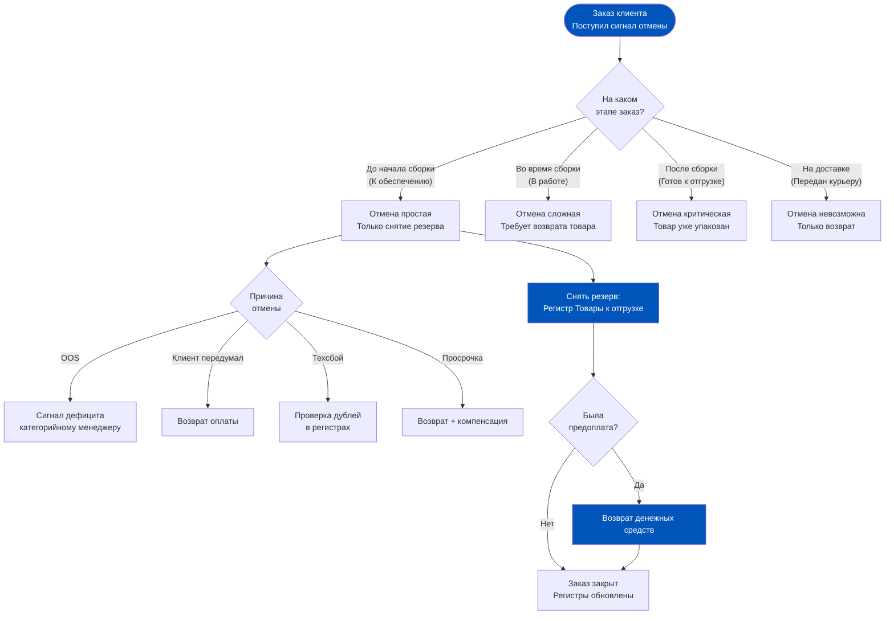
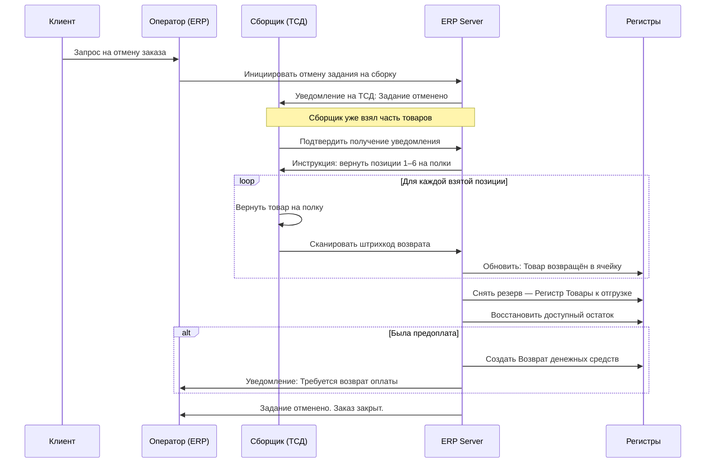
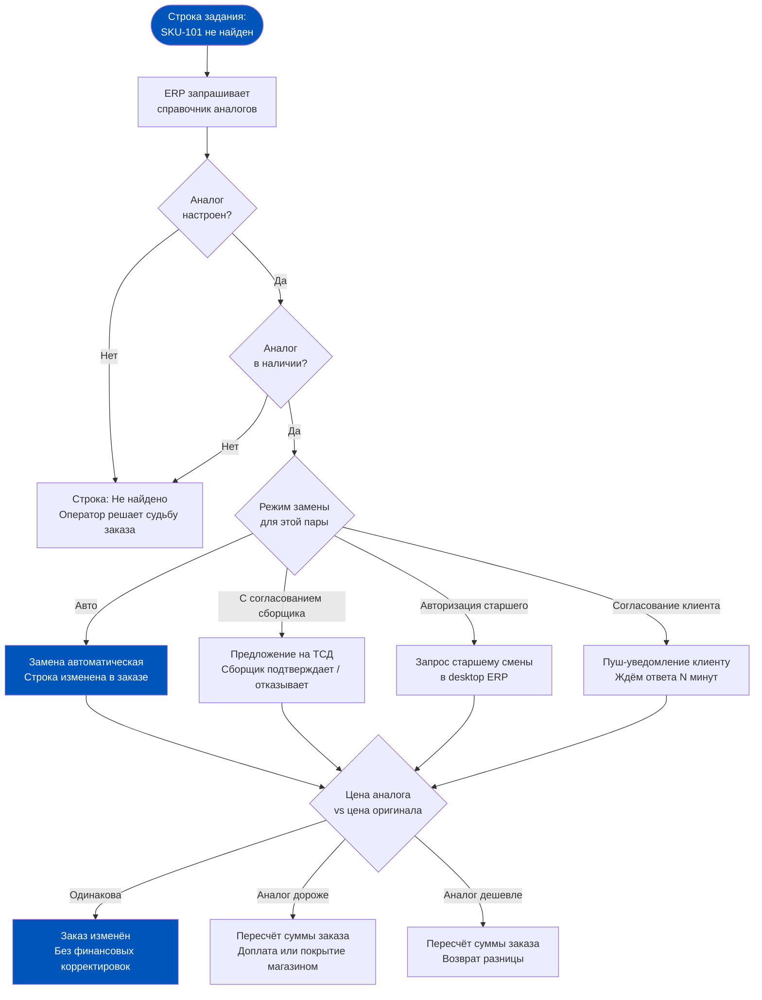
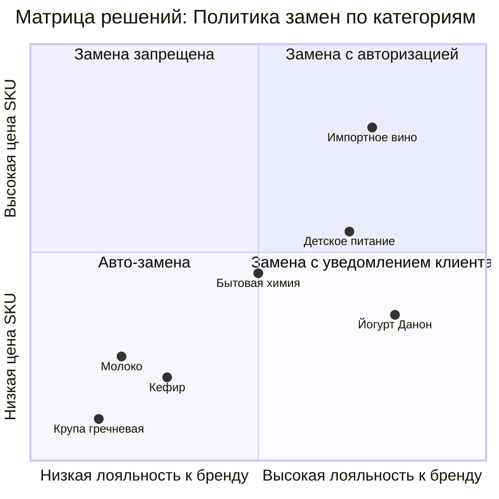
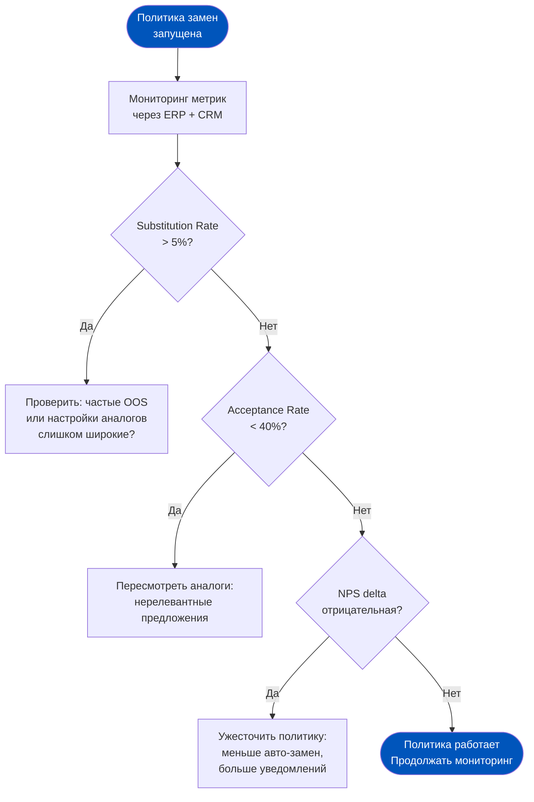

# Неделя 6, День 4. Отмены и замены: когда план встречает реальность

> **Цель урока:** Разобрать полную механику отмен и замен заказов в 1C:ERP 2.5 — от классификации причин до финансовых последствий для учёта. Понять, как продакт проектирует политику замен через конфигурацию ERP и операционные регламенты, чтобы минимизировать потери и NPS-риски.
>
> **Компетенции после урока:**
> - Классифицировать типы отмен и объяснить, как ERP обрабатывает каждый сценарий
> - Описать механику замен (Substitutions) в 1C:ERP 2.5 и документальное оформление
> - Объяснить финансовые последствия отмен для регистров и P&L
> - Спроектировать политику замен для конкретной категории SKU
>
> **Время:** ~80 минут

---

## Оглавление

- [[#Часть 1. Типология отмен: что может пойти не так]]
- [[#Часть 2. Отмена до начала сборки]]
- [[#Часть 3. Отмена во время сборки]]
- [[#Часть 4. Механика замен (Substitutions) в 1C:ERP 2.5]]
- [[#Часть 5. OOS-менеджмент: от инцидента к системе]]
- [[#Часть 6. Финансовые последствия отмен для учёта]]
- [[#Часть 7. Проектирование политики замен: чеклист продакта]]

---

## Часть 1. Типология отмен: что может пойти не так

Полночь, пятница. Даркстор обрабатывает пиковый трафик: 340 заказов за смену. Из них 17 будут отменены. Это 5% — выше среднего, но не катастрофа. Вопрос в другом: ERP знает о каждой из этих 17 отмен? Она правильно обработала все 17 сценариев? Все резервы сняты, все деньги возвращены, все остатки восстановлены?

Если продакт не спроектировал процесс отмен правильно — где-то в регистрах ERP сейчас «висит» товар, который физически стоит на полке, но числится зарезервированным. Или деньги клиента удержаны, хотя заказ отменён час назад. Или сборщик вернул товар на полку, но ERP этого не знает и показывает остаток минус один.

### Четыре причины отмены в Q-com

**OOS (Out of Stock)** — товар физически закончился, ERP не успела это зафиксировать до момента резервирования. Самая распространённая причина в даркстор-операциях. Корень проблемы — расхождение физического и цифрового остатка (тема Недели 5).

**Клиент передумал** — пришёл запрос на отмену от самого покупателя через мобильное приложение или службу поддержки. Может прийти через секунду после оформления заказа, а может — когда сборка уже в процессе.

**Технический сбой** — ошибка интеграции между приложением и ERP: дублирование заказа, неверное списание оплаты, сбой при создании Задания на сборку. Технические отмены требуют особой осторожности: нужно убедиться, что ERP обработала все связанные движения.

**Просрочка сборки** — заказ не успели собрать в обещанное время, клиент отказался от него. Специфично для Q-com: если курьер уже отправлен, а заказ не готов — это не просто отмена, это цепочка компенсаций.

### Справочник «Причины отмены заказов» в ERP

В 1C:ERP 2.5 причины отмены заказов — это элементы настраиваемого справочника. При закрытии заказа оператор (или система автоматически) выбирает причину. Это не формальность: причина отмены определяет:

- Нужно ли восстанавливать резерв
- Нужен ли возврат оплаты и через какой канал
- Должен ли инцидент попасть в аналитику по OOS или по качеству обслуживания
- Требуется ли уведомление категорийного менеджера

Правильно настроенный справочник причин — это аналитический инструмент, позволяющий отделять операционные проблемы от коммерческих и от технических.

### Влияние отмены на регистры ERP

Любая отмена затрагивает минимум два регистра:

- **Товары к отгрузке** — снимается резерв, количество возвращается в «доступный остаток»
- **Взаиморасчёты с клиентами** — если была предоплата, формируется задолженность перед клиентом

Если сборка уже началась — могут быть затронуты и другие регистры. Подробнее — в Части 3.

---

## Часть 2. Отмена до начала сборки

### Самый чистый сценарий

Заказ получен, обработан оператором, резерв установлен. Задание на сборку ещё не создано — заказ находится в статусе «К обеспечению» или «Подтверждён». В этот момент приходит запрос на отмену.

Это самый простой сценарий с точки зрения ERP-логики. Никакого физического движения товара не было — только цифровое резервирование. Откатить его технически несложно.

### Снятие резерва и возврат в «доступный остаток»

Когда оператор проводит отмену Заказа клиента на этом этапе, ERP выполняет следующие действия:

**Шаг 1:** Документ «Заказ клиента» переводится в статус «Закрыт» или «Отменён» с указанием причины из справочника.

**Шаг 2:** Регистр «Товары к отгрузке» уменьшается на зарезервированное количество по каждой строке. Товар снова становится «доступным».

**Шаг 3:** Регистр «Свободный остаток» (или «Доступно к резервированию») обновляется — новые заказы снова могут претендовать на этот товар.

Важный нюанс: если заказ был зарезервирован под конкретную партию (FEFO), именно эта партия возвращается в пул доступных для резервирования. Не «просто молоко», а «молоко партии от 03.03 с ячейки A-12-3».

### Автоматический возврат предоплаты

В 1C:ERP 2.5 автоматический возврат предоплаты при отмене заказа настраивается через правила взаиморасчётов. Схема зависит от типа оплаты:

**Онлайн-эквайринг** (оплата картой через POS или мобильное приложение): возврат инициируется через интеграцию с платёжным шлюзом. ERP формирует документ «Возврат денежных средств покупателю» и отправляет запрос через API эквайера. Фактически деньги идут обратно на карту в течение 3–10 рабочих дней — это не ERP-ограничение, это банковский процесс.

**Бонусный счёт / баллы лояльности**: если заказ оплачен баллами — ERP возвращает баллы на счёт клиента через интеграцию с CRM/программой лояльности.

### Цепочка документов при отмене до сборки

Заказ клиента (Отменён) → документ «Возврат денежных средств покупателю» → движение по регистру «Взаиморасчёты с покупателями» (закрытие задолженности перед клиентом).

При правильной настройке весь процесс занимает несколько секунд в ERP. Для клиента — это мгновенное подтверждение отмены и сообщение о возврате средств.

---

## Часть 3. Отмена во время сборки

### Сценарий, где всё усложняется

Сборщик уже работает с заданием. Он взял с полки 6 позиций из 14, подтвердил их сканированием. В этот момент клиент через приложение нажимает «Отменить заказ». Или служба поддержки принимает звонок: клиент передумал.

Что происходит в ERP? И что делать сборщику с товарами, которые уже у него в руках?

### Документ «Отмена задания на сборку»

В 1C:ERP 2.5 для этого сценария предусмотрен механизм принудительного завершения Задания на сборку с признаком «Отменено». Это не просто изменение статуса — это отдельный документ, который фиксирует:

- Какие строки были подтверждены (товар физически взят)
- Какие строки ещё не начаты
- Причину отмены
- Кто инициировал отмену (оператор, система, старший смены)

После создания этого документа ERP формирует «обратный» набор инструкций для сборщика: вернуть на место все уже взятые позиции. Каждая возвращённая позиция должна быть отсканирована повторно — так ERP подтверждает физический возврат товара на полку.

### Проблема физического и цифрового расхождения

Здесь кроется самый опасный момент всего процесса отмен. Рассмотрим последовательность:

1. Сборщик взял молоко с полки → ERP зафиксировала «резервирование к списанию»
2. Задание отменено → ERP хочет «откатить» движение
3. Сборщик вернул молоко на полку → сканировал штрихкод при возврате → ERP обновила регистр

Всё нормально, если шаг 3 выполнен. Но если сборщик, торопясь, положил молоко не на ту полку, или поставил его в место, которое не является ячейкой адресного хранения, — физически товар есть, цифровой адрес неверен. При следующей сборке ERP пошлёт другого сборщика на пустую полку A-12-3, а молоко будет стоять без регистрации в зоне упаковки.

Это и есть механизм возникновения «немых дыр», о которых мы говорили в День 3.

---

## Часть 4. Механика замен (Substitutions) в 1C:ERP 2.5

### Что такое «аналог» в контексте ERP

Замена (substitution) — это замещение одного SKU другим при невозможности выполнить исходную строку заказа. В контексте 1C:ERP 2.5 аналоги номенклатуры — это не просто пометка «похожий товар». Это настраиваемый справочник со структурой:

- **Основной SKU** — тот, который заказал клиент
- **Аналог** — предлагаемый заменитель
- **Приоритет** — порядок предложения (если аналогов несколько)
- **Тип замены** — полная замена / частичная / по согласованию
- **Условия применения** — только при OOS, или всегда при наличии у аналога лучшего срока

Без заполненного справочника аналогов механизм замен в ERP не работает. Это продуктовая работа: кто-то должен собрать и поддерживать эту базу знаний о совместимых SKU.

### Автоматическая замена vs замена с согласованием

В 1C:ERP 2.5 для каждого аналога можно настроить режим:

**Автоматическая замена** — система подставляет аналог без участия сборщика или оператора. Сборщик видит уже изменённую строку задания. Клиент уведомляется (если есть интеграция с нотификационной системой) постфактум. Применяется для взаимозаменяемых SKU одного бренда (например, разные объёмы упаковки одного продукта).

**Замена с согласованием** — ERP предлагает аналог, но требует явного подтверждения. Подтверждать может сборщик (на ТСД), старший смены (в desktop-интерфейсе ERP), или даже клиент (через мобильное приложение — требует интеграции). Применяется для замен разных брендов или при значимой разнице в цене.

### Ценообразование при замене

Это один из самых чувствительных вопросов. Что если аналог дороже или дешевле исходного SKU?

Логика ERP определяется настройкой правил ценообразования для аналогов:

- **Цена по заказу** — аналог отгружается по цене исходного SKU (разница поглощается магазином). Удобно для клиента, убыточно в случае дорогого аналога.
- **Цена аналога** — клиенту пересчитывают сумму заказа. Честно, но требует нотификации и иногда дополнительной оплаты/возврата разницы.
- **Минимум из двух** — клиент платит меньшую из двух цен. Компромисс, популярный в Q-com-операторах с акцентом на NPS.

### Документальное оформление замены

Замена в ERP оформляется как корректировка Заказа клиента. Исходная строка (SKU-101, 2 шт., 189₽) заменяется или дополняется новой строкой (SKU-205, 2 шт., 201₽). Если цена изменилась — создаётся корректировочный документ по взаиморасчётам.

Важно: история замены сохраняется. В аналитических отчётах можно получить данные: сколько раз SKU-101 был заменён на SKU-205, с какой разницей в цене, в каких временных периодах.

---

## Часть 5. OOS-менеджмент: от инцидента к системе

### OSA как продуктовая метрика

Out-of-Stock — это когда клиент заказал товар, а его нет. Но продакт должен думать не об инциденте, а о метрике: On-Shelf Availability (OSA) — процент времени, в течение которого SKU доступен для заказа на нужном складе.

OSA = (Время доступности SKU) / (Общее рабочее время склада) × 100%

В Q-com норма OSA для ключевых SKU — 97–99%. Всё ниже 95% — это сигнал системной проблемы: либо в закупках, либо в прогнозировании спроса, либо в скорости приёмки поставок.

### Как ERP аккумулирует историю OOS

Каждый раз, когда сборщик нажимает «Не нашёл» в задании на сборку — этот факт фиксируется в ERP: SKU, время, склад, причина (если введена). Если настроен механизм «сигналов дефицита», параллельно создаётся запись в соответствующем журнале.

Со временем накапливается аналитика: по какому SKU, в какие дни недели, в какое время суток возникают OOS. Это данные для закупочного планирования — не ощущения, не опыт склада, а структурированные факты из регистров ERP.

### Связь с закупками (Неделя 3)

На Неделе 3 мы разбирали механизм пополнения запасов: точки заказа, MIN/MAX, регистр «Потребности в обеспечении». Вот прямая связь с OOS:

Если по SKU-101 зафиксировано более 3 OOS за неделю — это триггер для пересмотра точки заказа или страхового запаса. ERP может (при соответствующей настройке) автоматически генерировать предложение об изменении параметров пополнения — на основании частоты OOS-инцидентов.

Это замкнутый цикл: операционные данные → аналитика → изменение параметров ERP → улучшение операции.

### Таблица: от OOS до превентивной меры

| Частота OOS | Причина | Решение в ERP | Превентивная мера |
|---|---|---|---|
| 1–2 раза в месяц | Разовый сбой поставки | Ручная корректировка заказа на поставку | Резервный поставщик в справочнике |
| 3–5 раз в неделю | Точка заказа занижена | Пересмотр MIN-остатка в карточке SKU | ABC-анализ + сезонные коэффициенты |
| Ежедневно | Прогноз спроса неточен | Подключить модуль прогнозирования | Анализ истории продаж за 12+ месяцев |
| По конкретным дням | Пик спроса не учтён | Дифференцированные нормы по дням недели | Временны́е зоны в правилах пополнения |
| После переустановки | Товар перемещён, адрес не обновлён | Обновить ячейку в карточке SKU | Регламент: перемещение = обновление в ERP |

---

## Часть 6. Финансовые последствия отмен для учёта

### Сторно: когда ERP «отматывает» назад

Сторно в бухгалтерском учёте — это документ, который создаёт движения, противоположные исходным. В ERP-логике при отмене заказа сторно задействуется не всегда — только если были реальные финансовые движения.

Если заказ отменён до оплаты — никаких финансовых движений нет, только снятие резерва. Сторно не нужно.

Если заказ отменён после предоплаты — ERP создаёт документ возврата, который формирует «обратные» движения по регистру «Взаиморасчёты с покупателями»: закрывает долг перед клиентом и инициирует возврат денег.

Если заказ полностью проведён (расходный ордер создан, отгрузка зафиксирована), а потом отменён по инициативе магазина — это уже возврат товара от покупателя, что требует полноценного документа «Возврат товаров от покупателя». Это другая логика, другой набор движений.

### Эквайринговый возврат и его отражение

Отмена предоплаченного заказа запускает эквайринговый возврат — операцию, при которой деньги идут обратно на карту клиента. В ERP этот процесс отражается так:

1. Документ «Возврат денежных средств покупателю» — фиксирует факт возврата в системе
2. Регистр «Денежные средства в кассе/на расчётном счёте» — уменьшается на сумму возврата
3. Регистр «Взаиморасчёты с покупателями» — закрывается долг

Физически деньги возвращаются клиенту через платёжный шлюз, и сроки зависят от банка-эмитента (обычно 3–10 рабочих дней). ERP фиксирует факт инициации возврата, но не контролирует скорость банковского процесса.

### Влияние на выручку и дневной P&L

Отменённые заказы искажают дневную выручку двумя способами:

**Прямое влияние**: если выручка признаётся по моменту подтверждения заказа (не по отгрузке) — отмена создаёт необходимость корректировочной записи. Это особенно болезненно для отчётности в конце дня или конце периода.

**Косвенное влияние**: если у магазина есть KPI «выручка за смену», высокий уровень отмен по OOS создаёт ощущение хорошего спроса при плохом операционном исполнении. Продакт должен следить за «чистой» выручкой (за вычетом отмен) как отдельной метрикой.

### Что нельзя отменить «задним числом»

В 1C:ERP 2.5 действует принцип хронологической целостности регистров. Нельзя отменить заказ «задним числом», если:

- Уже закрыт отчётный период (месяц), за который прошли проводки
- Товар уже прошёл через регламентную операцию «Закрытие месяца» — себестоимость рассчитана
- Финансовые документы подписаны и переданы в бухгалтерию

Попытка изменить «старый» заказ в ERP приведёт к предупреждению или ошибке. Это не баг — это защитный механизм: нельзя переписывать уже зафиксированную историю. Для таких случаев создаются корректировочные документы в текущем периоде, а не изменение прошлого.

---

## Часть 7. Проектирование политики замен: чеклист продакта

### Когда замена — добро, когда — зло

Замена — это не всегда хорошо. Это всегда компромисс. Таблица позиций:

**Замена — добро:**
- Аналог очевидно эквивалентен (тот же продукт, другой объём)
- Клиент получает больше за ту же цену или меньше за меньшую цену
- Аналог известного бренда с хорошим рейтингом
- Срок годности аналога лучше

**Замена — зло:**
- Аналог другого бренда в категории с высокой лояльностью (йогурт «только Данон»)
- Аналог значительно дороже — клиент расстроится из-за доплаты
- Замена без уведомления клиента в момент доставки создаёт сюрприз
- Замена «закрывает» OOS-инцидент, маскируя системную проблему запасов

### Матрица решений для политики замен

Любое решение о замене определяется тремя параметрами:
- **Стоимость замены** для магазина (разница в цене, операционный overhead)
- **Стоимость отмены** для бизнеса (потеря выручки, компенсация, риск NPS)
- **Вероятность согласия клиента** (на основе истории аналогичных замен)

Когда «стоимость отмены» высока, а клиент скорее всего согласится — замена оправдана. Когда «стоимость отмены» низка (дешёвый SKU), а клиент специфически выбирал именно этот бренд — замена создаст негатив.

### Таблица: политика замен по категориям

| Категория SKU | Политика замен | ERP-настройка | Метрика контроля |
|---|---|---|---|
| Молоко (низкобрендовая лояльность) | Авто-замена при OOS | Аналог — авто, цена — min из двух | OOS Rate, замены / заказы |
| Йогурты бренда X | Только с согласования клиента | Аналог — уведомление, ждём ответа 5 минут | NPS после замен vs без замен |
| Импортный алкоголь | Замена запрещена | Аналог не заполняется | Доля отмен по OOS |
| Весовые овощи и фрукты | Авто-замена ±15% по весу | Допуск по весу в карточке | Точность веса, жалобы |
| Детское питание | Только с авторизацией старшего | Аналог — жёсткая авторизация | Ноль авто-замен в отчёте |
| SKU акционного товара | Замена на аналогичную акцию | Аналог из той же акции | Выручка акционных замен |

### Главный вывод: конфигурация ERP — это операционный регламент

Политика замен — это не документ на бумаге и не инструкция для сборщика. Это конфигурация параметров в ERP: справочник аналогов, режимы авторизации, правила ценообразования при замене, пороги автоматических действий.

Когда продакт говорит «у нас политика — замены только с согласования клиента» и при этом в ERP справочник аналогов не заполнен, а режим замены стоит «авто» — работает ERP, а не политика. Операционная реальность определяется тем, что настроено в системе, а не тем, что написано в регламенте.

Это справедливо для любого процесса в 1C:ERP 2.5: система делает то, что ей сказали через интерфейс настройки. Продакт, понимающий логику регистров и документов ERP, может переводить бизнес-требования напрямую в конфигурационные решения — без посредников в виде аналитиков и разработчиков. Это и есть ценность технической грамотности в продуктовой роли.

### Чеклист для внедрения политики замен в ERP

Прежде чем настраивать справочник аналогов и режимы замен, продакт должен пройти по этому чеклисту:

**Шаг 1. Аудит категорий.**
Разбейте весь ассортимент на группы по модели «лояльность к бренду × ценовой диапазон». Это и есть матрица замен из раздела выше. Для каждой группы определите целевую политику.

**Шаг 2. Составление справочника аналогов.**
Для каждого SKU категорий «авто-замена» и «замена с уведомлением» — заполнить справочник аналогов в ERP. Минимальный набор: 1–2 аналога с приоритетами и условиями применения. Для категорий «замена запрещена» — справочник не заполняется.

**Шаг 3. Настройка режимов авторизации.**
В карточке аналога выбрать режим: авто / уведомление клиента / авторизация старшего. Убедиться, что все участники процесса (сборщики, старшие смены) знают, что от них ожидается при каждом режиме.

**Шаг 4. Настройка ценообразования.**
Для каждой категории определить правило: цена оригинала / цена аналога / min из двух. Внести в настройки правил ценообразования ERP.

**Шаг 5. Тестирование на реальных заказах.**
Провести пилотный запуск на 10–15% заказов. Отследить: частоту предложений замен, конверсию согласований, отклонения от ожидаемого поведения системы.

**Шаг 6. Мониторинг метрик после запуска.**
Следить за: NPS по заказам с заменами vs без, долей отмен по OOS (должна снизиться), частотой конфликтов ценообразования при заменах.

### Интеграционная зависимость: ERP и внешние системы

Политика замен «с уведомлением клиента» требует интеграции 1C:ERP с внешними системами. Это важно понимать продакту, чтобы правильно оценить сложность внедрения:

- **Push-уведомления** — нужна интеграция ERP с CRM или notification-сервисом. ERP создаёт «задачу на уведомление», внешняя система отправляет пуш клиенту.
- **Ожидание ответа клиента** — нужна двусторонняя интеграция: клиент отвечает «ок/нет» в приложении, ответ через API возвращается в ERP и обновляет статус задания.
- **Тайм-аут** — что делает ERP, если клиент не ответил за 3 минуты? Нужен настроенный fallback: авто-замена или отмена строки.

Если интеграции нет — политика «с уведомлением» технически реализуется только через операторов call-центра, что не масштабируется в Q-com.

### Метрика успеха: как понять, что политика замен работает

После настройки и запуска политика замен должна отслеживаться через конкретные цифры, а не ощущения. Минимальный набор метрик для мониторинга:

**Substitution Rate** — доля заказов, в которых была произведена хотя бы одна замена. Рассчитывается из отчёта «Анализ заказов клиентов» по признаку наличия корректировки строки с причиной «замена аналогом». Норма для Q-com с широким ассортиментом: 2–5%.

**Substitution Acceptance Rate** — если используется режим «согласование с клиентом», эта метрика показывает, как часто клиент соглашается на предложенный аналог. Низкий показатель (< 40%) говорит о том, что предлагаемые аналоги нерелевантны или коммуникация неудачна.

**NPS delta** — разница в оценках удовлетворённости между заказами с заменами и без. Если delta отрицательная и значимая — политика замен вредит NPS. Это не данные ERP, это данные из CRM/опросов, но их нужно сопоставлять с данными ERP по временным периодам.

**Cancellation Rate after Substitution** — как часто клиент отменяет заказ после того, как узнаёт о замене. Высокий показатель означает: лучше было бы предложить отмену сразу, не создавая замену.

---

## Глоссарий

| Термин | Расшифровка |
|---|---|
| OOS | Out of Stock — ситуация отсутствия товара на складе при наличии спроса |
| OSA | On-Shelf Availability — метрика доступности товара на полке в процентах от времени |
| Сторно | Документ с движениями, обратными исходным; используется для корректировки учёта |
| Эквайринговый возврат | Возврат денег на карту клиента через платёжный шлюз при отмене оплаченного заказа |
| Аналог номенклатуры | Элемент справочника ERP: SKU, допустимый как замена для другого SKU |
| Точка заказа | Параметр пополнения запасов: уровень остатка, при достижении которого формируется заказ поставщику |
| Сигнал дефицита | Внутреннее уведомление в ERP при фиксации OOS — триггер для закупочного планирования |
| Корректировка Заказа клиента | Документ изменения состава или цены заказа (при оформлении замены) |
| Хронологическая целостность | Принцип ERP: нельзя изменить движения в закрытом периоде; только корректировки в текущем |
| Батчинг | Объединение нескольких заказов в одно задание на сборку для повышения производительности |

---

← [[Неделя 6 - День 3 - Рабочее место сборщика|← День 3]] | [[1c_erp_qcom/README|Оглавление]] | [[Неделя 6 - День 5 - Промо и скидки|День 5 →]]
