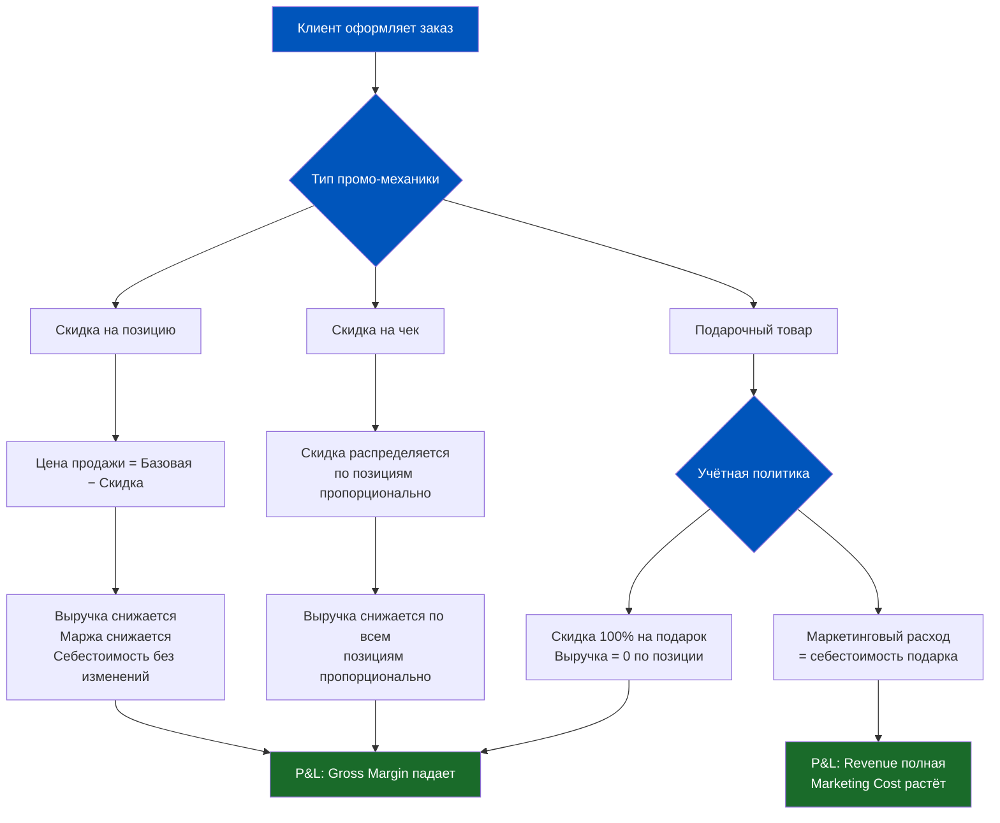
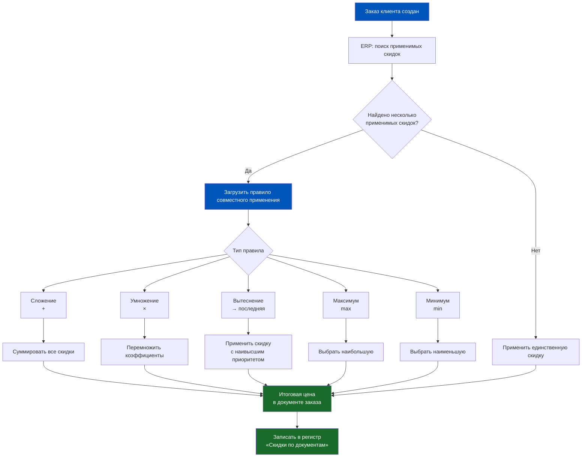
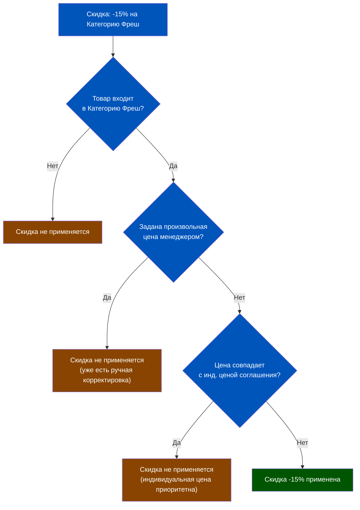
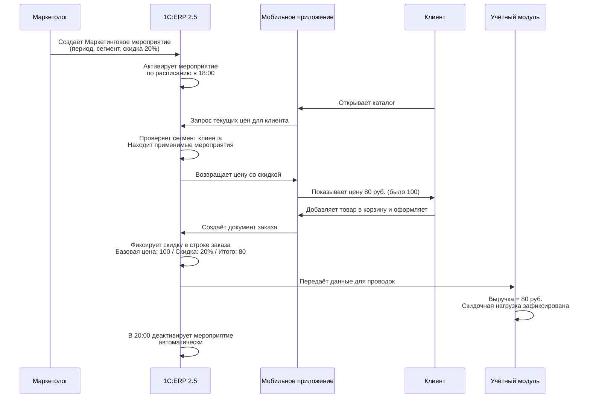
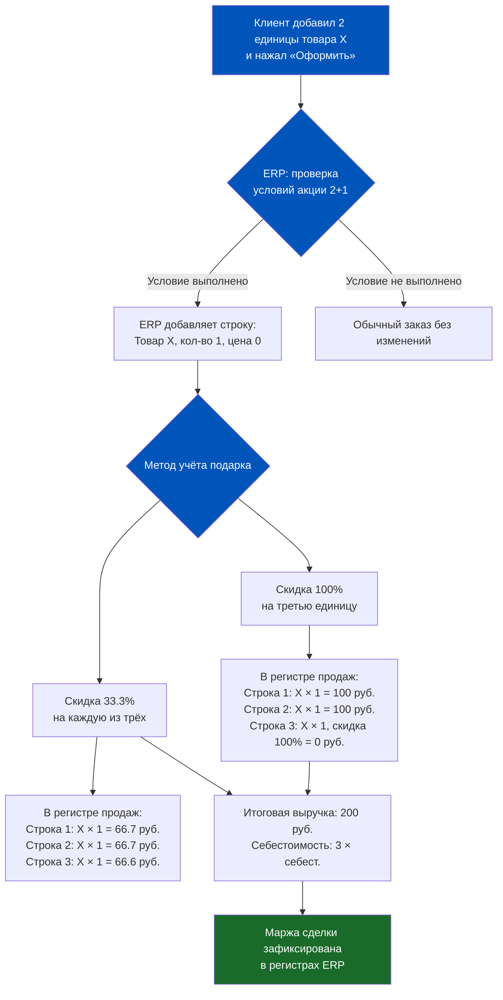
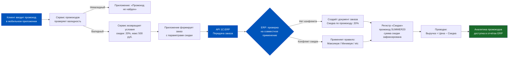
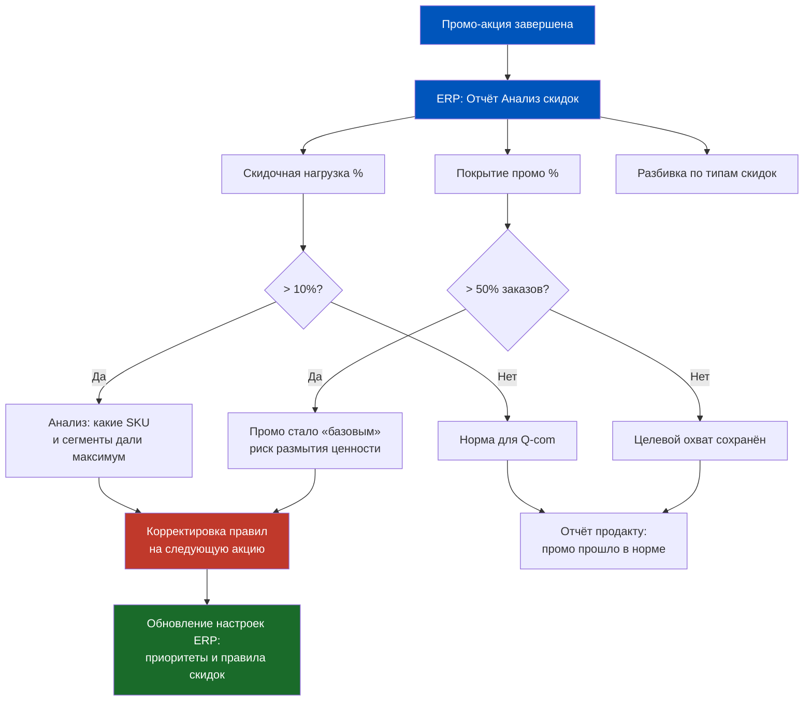
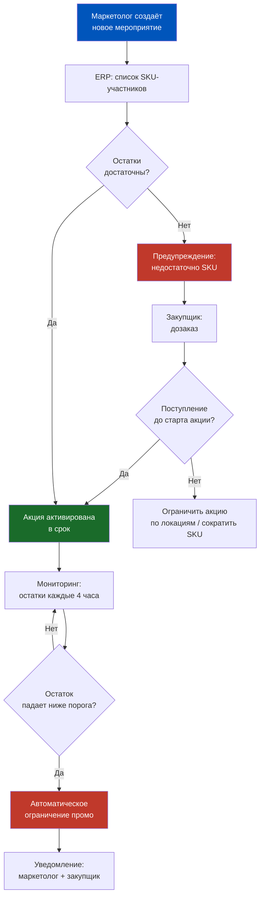

# Неделя 6, День 5. Промо и скидки: когда маркетинг встречает учёт

> Промо-акция — это момент, когда маркетинг торжественно объявляет о снижении цены, а учётная система молча пытается понять, чья это головная боль: выручки или расходов. В 1C:ERP 2.5 этот конфликт разрешён — но только если вы настроили всё правильно.

## Содержание

1. [[#Часть 1. Промо в Q-com: между маркетингом и учётом]]
2. [[#Часть 2. Классификатор скидок в 1C:ERP 2.5]]
3. [[#Часть 3. Механика маркетинговых мероприятий]]
4. [[#Часть 4. «Три по цене двух» и другие нестандартные механики]]
5. [[#Часть 5. Промо и целостность учёта]]
6. [[#Часть 6. Промокоды и внешние системы лояльности]]
7. [[#Часть 7. Аналитика промо: что измерять и как]]

---

## Часть 1. Промо в Q-com: между маркетингом и учётом

Представьте пятничный вечер. Маркетолог запускает акцию «-30% на пиццу». Клиенты видят сниженную цену в приложении, делают заказы. Всё хорошо. Но через месяц финансовый директор смотрит в отчёт и видит: выручка за пятницу упала на 18%, маржа сжалась, а маркетинговые расходы не выросли. Где деньги, которые «потратил» маркетинг?

Это не технический вопрос — это вопрос учётной логики, который в Q-com стоит особенно остро. В классическом ритейле промо-акция длится неделю, данные выверяются в конце периода. В Q-com каждый заказ — это мгновенное событие, и через 30 минут клиент уже ждёт товар. Учёт должен успевать за этим ритмом.

**Три типа промо-механик в Q-com**

Первый тип — скидка на позицию. Простейшая механика: конкретный SKU продаётся дешевле обычной цены. Покупатель берёт молоко по 89 рублей вместо 119. ERP фиксирует продажу по сниженной цене — выручка уменьшается относительно базовой цены, но никакого «расхода» не возникает. Это не маркетинговый бюджет — это просто другая цена.

Второй тип — скидка на чек. Клиент купил на 1500 рублей — получил 150 рублей скидки. Здесь сложнее: скидку нужно распределить пропорционально позициям в заказе, иначе категорийная аналитика сломается. Если не разнести скидку, получится, что все товары проданы по базовой цене, а «скидка» висит отдельной строкой — и менеджер категории молочки не поймёт, почему маржа упала именно у него.

Третий тип — подарочный товар. «При покупке двух пачек кофе — йогурт в подарок». Это самая коварная механика с точки зрения учёта. Йогурт поставлен со склада, его себестоимость реальна — но выручки за него ноль. Как отразить это в P&L? Это скидка 100% на йогурт? Или это маркетинговый расход в размере себестоимости йогурта? Ответ определяет налоги, маржу и отчётность.

**Как 1C:ERP 2.5 хранит промо**

В системе существуют три уровня промо-инструментов. Первый — маркетинговые мероприятия (документ в ERP, который описывает условия акции: период, сегмент клиентов, товарные позиции, тип скидки). Второй — соглашения о ценах и скидках (более формальный документ, привязанный к контрагенту или группе клиентов). Третий — ручные скидки, которые менеджер вводит непосредственно при оформлении заказа.

Каждый из этих инструментов имеет свою «весовую категорию» в ERP. Маркетинговое мероприятие может перекрываться соглашением, соглашение — ручной скидкой. Или наоборот — зависит от настроек приоритетов. Это создаёт систему, которая достаточно гибка для Q-com, но достаточно сложна, чтобы сломаться при неправильной конфигурации.

**Ключевой вопрос учёта**

Промо снижает выручку или увеличивает расходы на маркетинг? В 1C:ERP 2.5 ответ зависит от того, как настроена схема продаж и куда система «отправляет» разницу между базовой ценой и ценой продажи. Если скидка отражается как «скидочная часть» в документе реализации — это снижение выручки. Если создаётся отдельный документ на маркетинговые расходы — это рост расходов при сохранении полной выручки. Для продакта важно знать этот выбор, потому что от него зависит, как выглядят ваши KPI.

Этот выбор — не техническая деталь. Это стратегическое решение, которое принимает финансовый директор совместно с командой продукта. И именно поэтому продакту логистики нужно понимать, что происходит «внутри» промо в ERP — а не просто знать, что «скидка есть».

---

## Часть 2. Классификатор скидок в 1C:ERP 2.5

Если в Части 1 мы обсуждали философию, здесь начинается инженерия. Система скидок в ERP 2.5 — это не одна кнопка «сделать дешевле», а полноценный механизм с правилами, приоритетами и алгоритмами совместного применения. Продакт, который не понимает этот механизм, рано или поздно столкнётся с ситуацией, когда клиент получил скидку 0%, хотя должен был получить 20% — или наоборот, 40%, хотя планировалось 20%.

**Автоматические vs ручные скидки**

Автоматические скидки применяются системой без участия человека в момент оформления заказа. ERP проверяет: есть ли активное маркетинговое мероприятие? Попадает ли клиент в целевой сегмент? Соответствует ли набор позиций условиям акции? Если все условия выполнены — скидка применяется автоматически. Это идеал Q-com: оператор не тратит время на расчёт скидок, система всё делает сама.

Ручные скидки — это то, что менеджер вводит «руками» в документе. В Q-com они используются значительно реже, потому что скорость обработки заказа критична. Но они существуют — например, для компенсационных скидок («клиент получил испорченный товар, дайте ему 10% на следующий заказ»). В ERP такая скидка требует авторизации: у менеджера должно быть право давать скидку до X процентов без согласования, свыше X — нужно одобрение.

**Флаг «Назначается вручную»**

Не все автоматические скидки применяются бесшумно. Если для скидки установлен признак **«Назначается вручную»**, система при оформлении заказа только сообщает менеджеру: «Условия выполнены, скидка X% доступна». Но применять её или нет — решает сам менеджер. Это инструмент для скидок-исключений, которые требуют человеческого суждения: например, дополнительная скидка VIP-клиенту при покупке нового ассортимента, который менеджер продвигает.

**Пять правил совместного применения скидок**

Это продолжение темы из Недели 2, День 4. Когда к одному заказу применимы несколько скидок одновременно, ERP должна решить: как их объединить? В системе настраивается одно из пяти правил.

Правило «Сложение» — все скидки суммируются. Если применима скидка 10% и скидка 5% — итого 15%. Простейшая логика, часто приводит к неожиданно большим итоговым скидкам при одновременном запуске нескольких акций.

Правило «Умножение» — скидки перемножаются. Скидка 10% и скидка 5% дают: 1 − (0.9 × 0.95) = 14.5%. Математически корректно, но клиент не всегда понимает, почему 10% + 5% ≠ 15%. Важная деталь реализации: если группа скидок имеет тип «Умножение», все входящие в неё процентные скидки автоматически получают флаг **«С учётом примененных скидок»** — его нельзя снять вручную. Суммовые скидки внутри такой группы ведут себя по принципу сложения.

Правило «Вытеснение» — применяется только последняя по приоритету скидка. Предыдущие игнорируются. Используется, когда нужно гарантировать, что специальная акция «перекрывает» все остальные условия.

Правило «Максимум» — из всех применимых скидок выбирается наибольшая. Клиент всегда получает лучшую доступную ему скидку. Это «клиентоцентричное» правило — но потенциально дорогостоящее для бизнеса.

Правило «Минимум» — выбирается наименьшая из применимых скидок. Используется в защитных сценариях: например, когда оптовое соглашение даёт 5%, а маркетинговая акция даёт 15% — но маркетинг решил, что оптовики не должны «складывать» обе скидки.

При выборе правил «Максимум» или «Минимум» нужно дополнительно указать, как сравнивать скидки: **по строке** (сравниваются скидки для каждой позиции отдельно) или **по документу** (сравниваются суммарные эффекты скидок на весь заказ). Для Q-commerce, где один заказ содержит 10–30 разнородных позиций, выбор режима сравнения может значительно менять итоговую скидку.

**Приоритеты скидок**

Помимо правил совместного применения, каждой скидке присваивается числовой приоритет. Приоритет определяет, какая скидка «главнее» при конфликте. В Q-com типичная иерархия выглядит так: персональный промокод (наивысший приоритет) → маркетинговое мероприятие → соглашение с клиентом → стандартная цена прайс-листа. Ручная менеджерская скидка обычно получает наивысший приоритет из всех — потому что если менеджер принял решение дать скидку вручную, значит, есть исключительный контекст.

**Дополнительные условия предоставления скидок: что часто упускают**

В Классификаторе скидок есть набор условий применения, которые выходят за рамки стандартных «объём/время/карта». Несколько из них особенно важны для Q-commerce и часто остаются незамеченными при настройке системы.

**«За соблюдение графика оплаты»** — скидка (или наценка!) предоставляется в зависимости от указанного в заказе клиента графика оплаты. Пример: если клиент работает на кредитных условиях (постоплата 30 дней), сумма заказа увеличивается на 3% — финансовая наценка за предоставление отсрочки. Это прямой инструмент управления стоимостью денег во времени.

**«Ограничение по группе пользователей»** — скидка доступна только менеджерам, входящим в указанную группу. Применяется совместно с другими условиями. Пример: дополнительная скидка 7% для ключевых клиентов может быть предоставлена только руководителем отдела продаж, но не рядовым менеджером. Это разграничение не через права пользователя, а через условие скидки — более гибкий инструмент.

**Дополнительные фильтры по номенклатуре в скидке**

Помимо выбора «на какую номенклатуру действует скидка», каждый вариант ограничения можно уточнить дополнительными условиями:

| Дополнительное условие | Смысл |
|---|---|
| Задана произвольная цена | Скидка НЕ применяется к позициям, для которых уже изменена цена вручную |
| Клиент покупает товар в первый раз | Скидка только на новинки для данного клиента — инструмент вводных акций |
| Количество одинаковых > N | Скидка применяется, только если в заказе ≥ N единиц одного товара |
| Цена совпадает с уточненной ценой соглашения = Нет | Скидка НЕ применяется к позициям с индивидуальной ценой из соглашения |
| Доступность товара для клиента (мало) | Скидка на позиции, которые нужно срочно распродать |

Последний пункт таблицы — «Цена совпадает с уточненной ценой соглашения» — особенно важен для Q-commerce. Если у клиента в соглашении заданы индивидуальные цены на отдельные SKU, массовая промо-скидка может «поехать» поверх них и привести к двойному снижению. Условие «= Нет» как раз предотвращает это: скидка не накладывается на позиции, цена которых уже определена индивидуально.

**Почему это важно для продакта**

В Q-com запускается в среднем 3–5 промо-акций одновременно. Каждая из них имеет свои условия, каждая потенциально применима к одному и тому же заказу. Если правила совместного применения настроены неправильно, клиент получает непредсказуемую скидку. Это хуже, чем никакой скидки — потому что клиент ожидал одно, получил другое, и теперь не доверяет системе.

Проверяйте настройки правил совместного применения при каждом запуске новой акции. Это не паранойя — это операционная гигиена Q-com.

---

## Часть 3. Механика маркетинговых мероприятий

Документ «Маркетинговое мероприятие» в 1C:ERP 2.5 — это центральный инструмент управления промо. Если скидки на позицию — это «пушка одиночного выстрела», то маркетинговое мероприятие — это «система залпового огня»: одним документом можно управлять сотнями SKU, тысячами клиентов и сложными условиями активации.

**Структура документа**

Маркетинговое мероприятие содержит несколько ключевых блоков. Период действия: дата и время начала, дата и время окончания. В Q-com это может быть точность до часа — например, акция действует с 18:00 до 22:00 в пятницу. ERP активирует и деактивирует акцию автоматически по расписанию — не нужно держать человека, который «включит» акцию в нужный момент.

Условия применения — для кого действует акция. Это может быть «все клиенты», «клиенты из сегмента Золотой», «клиенты, сделавшие более 10 заказов», «клиенты из определённого региона». Сегментация клиентов в ERP — это отдельная тема, но важно понимать: маркетинговое мероприятие умеет «видеть» сегменты и применяться только к нужной аудитории.

Товарные условия — на что действует скидка. Конкретная номенклатура, группа номенклатуры («все молочные продукты»), категория, поставщик. Можно исключать позиции — например, «все молочные, кроме детского питания».

Тип скидки — процентная или фиксированная сумма. В Q-com почти всегда процентная, потому что ценовая линейка широкая и фиксированная сумма создаёт абсурдные ситуации (скидка 50 рублей на товар за 40 рублей).

**Связь с сегментацией клиентов**

В Q-com клиенты обычно делятся на сегменты по частоте заказов, среднему чеку и истории взаимодействия. «Золотой» сегмент — клиенты с высокой частотой и чеком. «Серебряный» — средние показатели. «Новые» — менее 5 заказов. ERP хранит принадлежность клиента к сегменту, и при создании заказа проверяет: какие маркетинговые мероприятия доступны именно для этого сегмента?

Это позволяет реализовывать персонализированные акции на уровне ERP — без дополнительных систем. «Только для Золотых: -25% на всё в субботу». Маркетолог создаёт одно маркетинговое мероприятие с условием на сегмент — и всё работает автоматически.

**Временная активация и деактивация**

Это кажется банальным, но в Q-com критично. Если акция «flash sale на 2 часа» не деактивировалась в нужное время, компания продолжает продавать по промо-ценам и теряет маржу каждую секунду. В ERP 2.5 деактивация происходит автоматически при истечении срока — но только если время закрытия явно указано в документе маркетингового мероприятия. Акции «без даты окончания» остаются активными навсегда.

**Что может пойти не так**

Три самых частых проблемы с маркетинговыми мероприятиями в Q-com. Первая: время сервера ERP и время сервера мобильного приложения расходятся на несколько минут — акция «закончилась» в ERP, но приложение ещё показывает промо-цену. Клиент оформляет заказ — и получает отказ или пересмотренную цену. Плохо. Вторая: маркетолог забыл указать дату окончания — акция работает бессрочно. Третья: неправильно настроен сегмент — скидку получают все клиенты, а не только целевые. В первый месяц после запуска новой акции проверяйте журнал применения скидок ежедневно.

---

## Часть 4. «Три по цене двух» и другие нестандартные механики

Если скидка на позицию — это «велосипед», то механики типа «3 по цене 2» — это уже «мотоцикл». С точки зрения учёта они значительно сложнее, и именно здесь чаще всего возникают конфликты между маркетингом («это же очевидно как работает!») и бухгалтерией («это не очевидно вообще»).

**Подарочный товар: нулевая цена или расход?**

Механика: клиент покупает две пачки кофе по 300 рублей, получает йогурт за 0 рублей. На складе списывается йогурт с себестоимостью, например, 45 рублей. Что происходит в учёте?

Вариант А — скидка 100% на йогурт. Документ реализации содержит строку: йогурт, 1 шт., цена 60 руб., скидка 100%, итого 0 руб. Выручка за йогурт = 0. Себестоимость реализации = 45 руб. Маржа по этой строке = −45 рублей. Итоговая маржа сделки = 300 + 300 − 45 + (−45) = 510 рублей. Маркетинговые расходы не затронуты.

Вариант Б — маркетинговый расход. Документ реализации: кофе ×2 = 600 рублей, без скидок. Отдельный документ: маркетинговый расход «промо-подарок» = 45 рублей (себестоимость йогурта). Выручка = 600 рублей. Маркетинговые расходы = 45 рублей. Маржа = 600 − 2×(себестоимость кофе) = выше, чем в Варианте А. Это «оптически лучше» для категорийного менеджера кофе, но хуже для маркетинга.

В Q-com обычно выбирают Вариант А — он операционно проще и не требует создания дополнительных документов на каждую «подарочную» операцию.

**Комплектные скидки**

Скидка при покупке набора — например, «купи смузи + энергетик + протеиновый батончик, получи скидку 15% на весь набор». ERP должна: (1) определить, что в корзине есть все три позиции, (2) применить скидку только к этому набору, (3) распределить скидку между тремя позициями.

Распределение скидки — ключевой момент. Если скидка 15% на набор стоимостью 500 рублей = 75 рублей, как разнести эти 75 рублей между тремя товарами? Пропорционально цене — самый логичный способ. Смузи стоит 200 руб. (40% от набора) → получает 30 руб. скидки. Энергетик 180 руб. (36%) → 27 руб. Батончик 120 руб. (24%) → 18 руб. Сумма = 75 руб. Всё сходится.

Но если не настроить это распределение, ERP может применить скидку только к первой позиции в наборе — и получится абсурд: смузи со скидкой 37.5%, а остальное по полной цене.

**Как ERP оформляет «2+1»**

**Проблема учёта подарочного товара**

Это не абстрактный вопрос. От того, как настроен учёт подарочного товара, зависит несколько практических вещей. Первое — налоговая база. При некоторых схемах учёта передача «подарка» может квалифицироваться как безвозмездная передача с соответствующими последствиями для НДС. Это вопрос к бухгалтерии и налоговому консультанту, но продакт должен знать, что вопрос существует.

Второе — аналитика по категориям. Если категорийный менеджер молочки отвечает за маржу молочной категории, а подарочные йогурты учитываются как «скидка 100%» в его категории — его KPI страдают из-за маркетинговых решений. Это организационный конфликт, который нужно решать не в ERP, а на уровне договорённостей.

Третье — возвраты. Если клиент возвращает товар из промо-комплекта, что происходит со скидкой? Возвращается только один из трёх товаров — скидка сохраняется или пересчитывается? Это нужно настроить в политике возвратов.

---

## Часть 5. Промо и целостность учёта

Промо-акция в Q-com — это не просто «снизить цену». Это операция, которая касается выручки, себестоимости, маржи, складских остатков и налоговой базы одновременно. Если хотя бы одно звено настроено неправильно, через месяц финансист получит цифры, которые не сходятся.

**Как скидка влияет на себестоимость продажи**

Ключевой момент: скидка не влияет на себестоимость в момент продажи. Товар был куплен за X рублей — и продан за Y рублей со скидкой. Себестоимость остаётся X. Меняется только выручка и, соответственно, маржа.

Если до промо: выручка 100 руб., себестоимость 60 руб., маржа 40 руб. (40%).
При скидке 20%: выручка 80 руб., себестоимость 60 руб., маржа 20 руб. (25%).

Маржа в рублях упала вдвое при скидке 20%. Это «эффект операционного рычага» на уровне товарной позиции. В Q-com с его тонкими маржами (часто 15–20%) скидка 20% может превратить прибыльную продажу в убыточную.

**Закрытие месяца и скидочная нагрузка**

В ERP 2.5 при закрытии месяца формируются отчёты, в которых скидочная нагрузка агрегируется по всем продажам. Это позволяет видеть: какая часть «недополученной выручки» объясняется промо-акциями? Разница между базовой ценой и фактической ценой продажи — это и есть скидочная нагрузка.

Для продакта важен этот показатель в разрезе категорий и дней недели. Типичная картина Q-com: пятница и выходные — пик промо-активности, скидочная нагрузка в эти дни в 2–3 раза выше будних.

**Mismatch: промо запустили, продажи упали**

Это реальная ситуация, которая озадачивает команды. Запустили промо «-20% на молочные» — и выручка за молочные в пятницу упала на 15% по сравнению с прошлой пятницей без промо. Как так?

Версия 1: конверсия в заказы выросла (больше клиентов купило), но средняя выручка на заказ упала сильнее из-за скидки. Итого минус. Версия 2: промо привлекло покупателей более дешёвых позиций внутри категории (сыр за 89 руб. вместо сыра за 350 руб.). Версия 3: другие категории «вытеснились» — клиент купил только молочные по промо и закрыл корзину.

ERP сама по себе не объяснит, какая из версий верна. Она покажет данные — а интерпретация требует аналитика и понимания поведения клиентов.

| Тип промо | Влияние на выручку | Влияние на маржу | Отражение в ERP |
|---|---|---|---|
| Скидка на позицию | Снижается пропорционально скидке | Снижается сильнее (операционный рычаг) | Строка реализации: цена со скидкой |
| Скидка на чек | Снижается на сумму скидки | Снижается распределённо по позициям | Строки пересчитываются пропорционально |
| Подарочный товар (скидка 100%) | Снижается на цену подарка | Снижается на себестоимость подарка | Отдельная строка с ценой 0 |
| Подарочный товар (расход) | Не меняется | Не меняется по категории | Отдельный документ маркетинговых расходов |
| Комплектная скидка | Снижается на сумму скидки по набору | Снижается пропорционально позициям набора | Скидка разносится по строкам набора |
| Промокод | Снижается на номинал промокода | Снижается пропорционально | Специальный тип скидки в документе |

---

## Часть 6. Промокоды и внешние системы лояльности

В современном Q-com ERP — это не единственная система, которая управляет ценообразованием. Мобильное приложение, CRM, программа лояльности, партнёрские промо — все они могут генерировать скидки, которые в итоге должны «приземлиться» в ERP и отразиться в учёте. Это интеграционная задача, и она сложнее, чем кажется.

**Поток промокода**

Клиент получил промокод SUMMER20 в рассылке. Открывает приложение, вводит промокод на экране оплаты. Приложение обращается к своему сервису промокодов, проверяет валидность, получает условия скидки (20% на первый заказ, не более 500 руб., один раз на аккаунт). После проверки приложение формирует заказ в ERP — и в этом заказе нужно передать информацию о скидке по промокоду.

Как именно передаётся эта информация — зависит от архитектуры интеграции. Вариант А: приложение уже рассчитало цену со скидкой и передаёт в ERP итоговую цену. ERP «не знает» о промокоде — она просто фиксирует цену. Минус: аналитика промокодов теряется. Вариант Б: приложение передаёт и базовую цену, и код скидки, и итоговую цену. ERP применяет скидку как «ручную» с комментарием «промокод SUMMER20». Лучше для аналитики.

**Cashback vs прямая скидка**

Это принципиально разные инструменты с точки зрения учёта. Прямая скидка снижает выручку здесь и сейчас. Cashback — это обязательство компании перед клиентом: «мы вернём тебе X% следующим заказом». В учёте cashback — это не снижение выручки, а начисление обязательства (кредиторская задолженность перед клиентом).

Для продакта это важно: программа cashback «лучше смотрится» в P&L прямо сейчас (выручка не снижается), но создаёт отложенные обязательства. Если вдруг нужно закрыть программу — накопленный cashback придётся либо выплатить, либо списать, что тоже имеет учётные последствия.

**Проблема двойного применения**

Клиент вводит промокод на 15% и одновременно попадает под маркетинговое мероприятие «золотым клиентам -10%». Что получает клиент: 25%? 15%? 10%? Это ровно та же история с правилами совместного применения из Части 2 — но осложнённая тем, что промокод пришёл из внешней системы, а акция живёт в ERP.

Если системы не синхронизированы в вопросе правил, клиент получает непредсказуемую скидку. Это операционный риск, который нужно закрыть на уровне архитектуры интеграции.

**Интеграция с внешней программой лояльности**

В крупном Q-com часто существует отдельная платформа лояльности (собственная или партнёрская — например, Яндекс Плюс, СберСпасибо). Взаимодействие с такой платформой создаёт дополнительный слой сложности: скидки или баллы начисляются/списываются там, а в ERP приходит уже «чистая» сумма к оплате.

Для учёта это означает, что ERP не «видит» программу лояльности как источник скидок — она видит только итоговую сумму. Это упрощает учёт, но затрудняет аналитику: нельзя в ERP увидеть, какая часть скидок объясняется программой лояльности.

---

## Часть 7. Аналитика промо: что измерять и как

Промо без аналитики — это как навигатор без GPS: есть иллюзия управления, но нет реального контроля над маршрутом. В Q-com, где промо-акции запускаются ежедневно и напрямую влияют на маржу, аналитика промо — это не «было бы неплохо», а операционная необходимость.

**Incremental Revenue**

Главная метрика промо — это не сколько продали во время акции, а сколько дополнительно продали по сравнению с тем, что продали бы без акции. Это называется incremental revenue или инкрементальная выручка. В ERP напрямую её не посчитать — нужны данные за аналогичный период без промо (контрольная группа или исторический бенчмарк).

Но ERP даёт необходимые данные: объём продаж в единицах и рублях по каждой SKU в разрезе периодов. Имея данные за несколько недель до промо, можно построить базовый тренд и сравнить с фактическими продажами в период акции. Разница — это и есть инкрементальная выручка.

**Отчёт «Анализ скидок» в ERP 2.5**

В системе есть стандартный отчёт, который показывает: базовая сумма продаж, сумма скидок по каждому типу, итоговая выручка, процент скидочной нагрузки. Отчёт можно разрезать по периодам, по клиентским сегментам, по товарным группам, по менеджерам (если используются ручные скидки).

Что искать в этом отчёте? Первое — аномально высокая скидочная нагрузка в конкретной категории или у конкретного менеджера. Это может быть симптомом ошибки в настройках или злоупотребления ручными скидками. Второе — динамика скидочной нагрузки во времени: растёт ли она? Третье — соответствие плановой и фактической скидочной нагрузки. Если маркетинг планировал 5% скидочной нагрузки, а факт 8% — где разница?

| Метрика промо | Где в ERP | Формула | Интерпретация |
|---|---|---|---|
| Скидочная нагрузка | Отчёт «Анализ скидок» | Сумма скидок / Базовая выручка × 100% | Какую долю потенциальной выручки «съели» скидки |
| Средняя скидка на заказ | Регистр «Продажи» | Сумма скидок / Количество заказов | Сколько в среднем «стоит» один заказ с промо |
| Покрытие промо | Отчёт «Маркетинговые мероприятия» | Кол-во заказов с промо / Всего заказов × 100% | Какая доля заказов затронута промо-механиками |
| ROI промо | Требует внешнего расчёта | Инкрементальная маржа / Потери маржи на скидку | Окупилось ли промо дополнительными продажами |
| Скидка по типам | Отчёт «Анализ скидок» | Разбивка по видам скидок | Какие механики доминируют в скидочной нагрузке |

**Главный антипаттерн**

«Промо без аналитики» — это управляемое снижение маржи. Каждая акция кажется логичной: «нужно поддержать продажи в понедельник», «конкурент снизил цены», «надо поощрить лояльных клиентов». Но без отслеживания совокупного эффекта и инкрементальности каждое отдельное промо-решение может быть рациональным, а их сумма — катастрофой для P&L.

В Q-com этот риск особенно высок, потому что промо-активность высокая, циклы короткие, и легко «привыкнуть» к постоянным акциям как к норме операций. Когда скидочная нагрузка становится структурной частью бизнес-модели — это уже не промо, это другой ценовой уровень. И менять его назад крайне болезненно.

Для продакта практическое правило: каждая новая промо-механика должна сопровождаться предопределённой метрикой успеха и датой ревью. Нет метрики — нет промо. Это не бюрократия, это защита маржи.

---

---

## Часть 8. Операционная интеграция промо и склада

Одна из самых частых и дорогостоящих ошибок в Q-com: маркетинг запускает акцию на SKU, которого нет в нужном количестве на складе. Результат — волна отмен и разочарованных клиентов. ERP может это предотвратить, но только если выстроен правильный процесс.

**Проверка остатков перед активацией акции**

Документ «Маркетинговое мероприятие» в 1C:ERP 2.5 содержит список SKU-участников. Перед активацией маркетолог (или система) должна сверить текущие остатки по этим SKU с прогнозируемым спросом в период акции.

Формула оценки: если акция ожидает рост продаж ×2,5 от обычного, остаток должен быть не менее 2,5 × среднедневные продажи × длительность акции в днях. Если остаток ниже — либо дозакупиться, либо ограничить промо по локациям.

**Промо как триггер пополнения**

В зрелой архитектуре ERP маркетинговое мероприятие должно автоматически создавать заявку на пополнение SKU-участников. Типовая 1С эту связь не настраивает из коробки — это точка кастомизации. Но продакт может выстроить процесс вручную: при создании акции → чеклист остатков → задача закупщику.

**Конфликт промо и FEFO**

Особенность Q-com с фреш-категориями: при промо растёт скорость продаж, что хорошо с точки зрения FEFO (срочный товар уходит быстрее). Но если промо идёт на «длинный» SKU, а срочный не попал в акцию — FEFO нарушается, срочный товар зависает.

Решение: при настройке промо на категорию фреш — проверять, не создаёт ли акция конкуренцию с ближайшими к просрочке партиями.

**Промо-усталость и её учёт в ERP**

Исследования в Q-com показывают: если клиент видит один и тот же товар в акции более 3 недель подряд — воспринимаемая ценность скидки снижается на 40%. Это «промо-усталость». ERP не измеряет NPS, но может показать динамику конверсии заказов с промо через отчёт «Анализ продаж» в разрезе недель.

Если средний чек снижается несмотря на промо — это сигнал, что акция потеряла эффект. Время менять механику или товар в акции.

> [!TIP] Чеклист: промо без боли
> - [ ] Остатки по SKU проверены за 24 часа до старта акции
> - [ ] Закупщик уведомлён о прогнозном росте спроса
> - [ ] Установлен порог автоостановки акции при падении остатков
> - [ ] Аналитик знает, какую метрику считаем «успехом» этой акции
> - [ ] Дата ревью результатов зафиксирована в календаре
> - [ ] Влияние на FEFO проверено для фреш-категорий

### Кейс: промо «-20% на молочные» в даркстре

Даркстор «Арктика» запустил акцию на молочную категорию: -20% на все SKU в понедельник. Объём молочки — 87 позиций. В понедельник с 12:00 до 18:00 пришло 340 заказов с молочными в составе. Из них 47 (14%) получили автозамену или частичную отмену молочных позиций — остатки закончились.

Потеря выручки от отмен: ~85 000 руб. Потеря от скидки на реализованные: ~42 000 руб. Итого промо обошлось в 127 000 руб. прямых потерь, при этом инкрементальные продажи составили ~35% от объёма (остальные клиенты купили бы и без скидки).

Вывод из ERP-анализа: акция была убыточной. Причина — неправильная оценка прогнозного спроса и отсутствие автоостановки промо при падении остатков.

Что нужно было настроить в ERP заранее:
1. Предупреждение при создании мероприятия: остатки < 1,5 × среднедневных продаж × 1 день
2. Порог остатка для автоограничения акции: 20% от начального промо-стока
3. Отчёт по итогам: сравнение объёма продаж с промо и без (предыдущие понедельники)

Это не уникальная история. В Q-com такие промо-кризисы случаются регулярно до тех пор, пока не выстроен процесс «промо → проверка остатков → мониторинг → стоп-триггер». ERP даёт все инструменты для этого — нужно только их подключить.

### Итоговый синтез: промо как система

Промо в Q-com — это не разовые акции. Это непрерывный операционный процесс с четырьмя фазами: планирование (маркетинг + закупки), активация (ERP применяет скидки), мониторинг (остатки + конверсия в реальном времени), анализ (инкрементальность и P&L-эффект). Компании, которые выстраивают все четыре фазы с опорой на ERP, превращают промо из «удара по марже» в управляемый инструмент роста.

Ключевое отличие зрелого подхода: каждая акция имеет предопределённую метрику успеха, порог остановки и дату ревью. Без этого промо — это неуправляемое снижение маржи с непредсказуемым операционным эффектом.

---

> [!NOTE] Ключевые термины
> - **Скидочная нагрузка** — доля скидок от базовой выручки (норма Q-com: 5–12%)
> - **Инкрементальные продажи** — дополнительные продажи, вызванные акцией (а не базовый спрос)
> - **Промо-усталость** — снижение конверсии при повторяющейся акции на один SKU
> - **Вытеснение скидок** — правило совместного применения, при котором действует только одна (наибольшая) скидка
> - **Маркетинговое мероприятие** — документ ERP 2.5, объединяющий условия, SKU-участников и временные рамки акции

---

*Промо в ERP — это не просто настройка цены. Это полный цикл: от планирования через операции к финансовому результату. Только продакт, который видит все три слоя, может управлять промо как инструментом роста, а не источником хаоса.*

← [[Неделя 6 - День 4 - Отмены и замены|← День 4]] | [[1c_erp_qcom/README|Оглавление]] | [[Неделя 6 - День 6 - Практикум по фулфилменту|День 6 →]]
