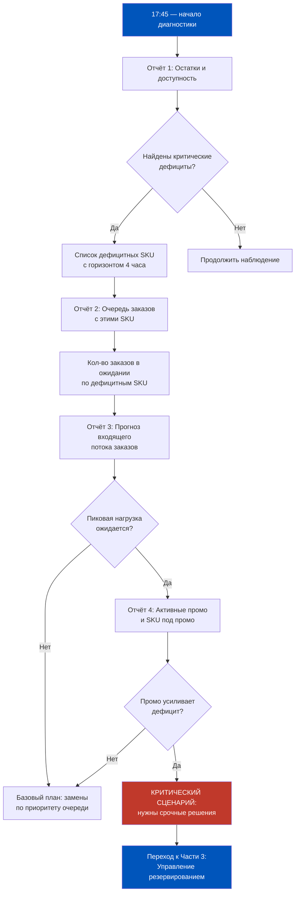
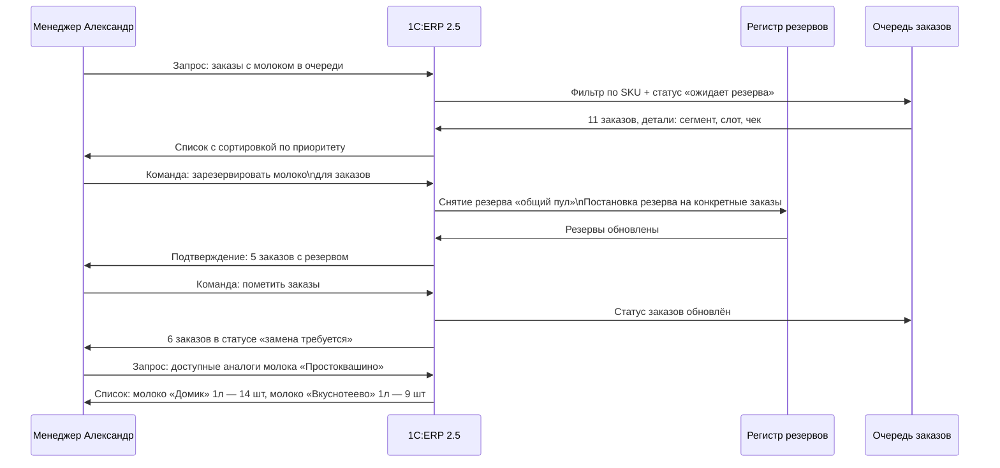
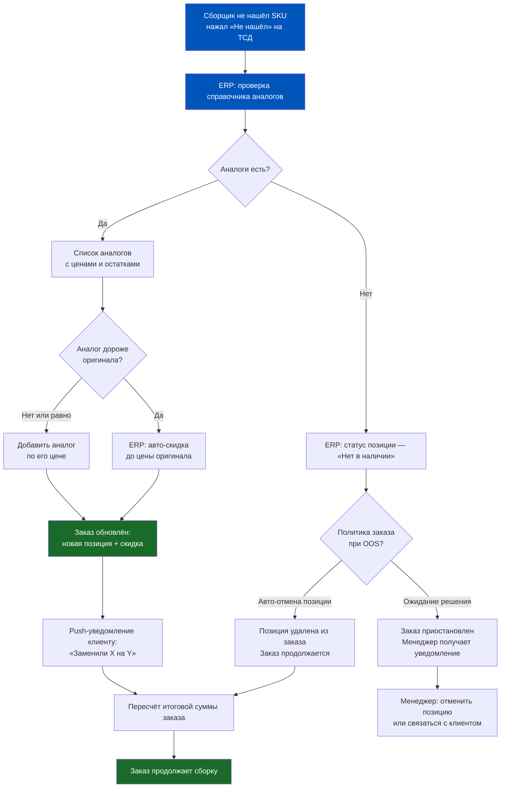
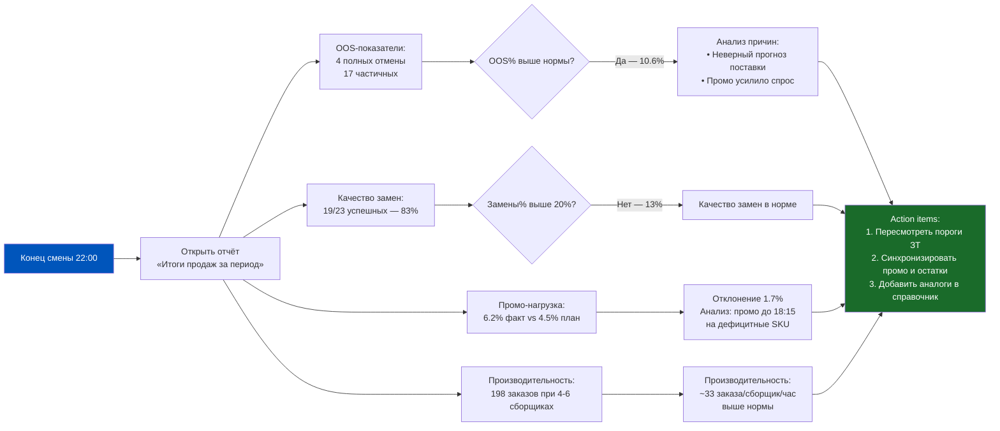
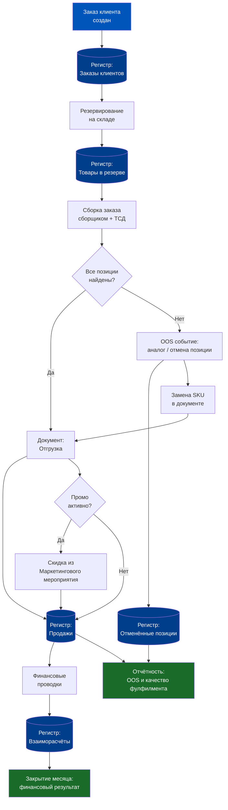

# Неделя 6, День 6. Практикум по фулфилменту: «Полярная звезда» в пятницу вечером

> Теория — это то, что знаешь, когда всё работает. Практика — это то, что делаешь, когда всё одновременно ломается. Сегодня мы разбираем второй случай.

## Содержание

1. [[#Часть 1. Введение в задачу: смена начинается плохо]]
2. [[#Часть 2. Диагностика через ERP: какие отчёты открыть первыми]]
3. [[#Часть 3. Управление резервированием в кризис]]
4. [[#Часть 4. Операционное решение: замены и отмены в боевом режиме]]
5. [[#Часть 5. Контроль промо в пиковую смену]]
6. [[#Часть 6. Разбор результатов: отчёт по итогам смены]]
7. [[#Часть 7. Синтез недели: архитектура идеального фулфилмента в ERP]]

---

## Часть 1. Введение в задачу: смена начинается плохо

Пятница, 17:45. Даркстор «Полярная звезда» готовится к вечернему пику. Это один из ключевых даркстторов сети — расположен в жилом квартале с высокой плотностью молодых семей, средний чек 1800 рублей, среднее число заказов в будний вечер 120 в час, в пятницу — до 200.

Менеджер смены Александр открывает рабочий день на терминале и видит сразу три проблемы.

**Проблема 1: дефицит.** Три SKU в красной зоне. Молоко 3.2% «Простоквашино» 1 л — остаток 8 упаковок, прогноз спроса на вечер 47 упаковок. Яйца С1 категории 10 шт. — остаток 12 упаковок, прогноз 38. Туалетная бумага Zewa 8 рулонов — остаток 6 упаковок, прогноз 29. Поставка по всем трём SKU ожидается только в субботу утром. Сегодняшний вечер нужно пережить на том, что есть.

**Проблема 2: персонал.** Два сборщика из шести заболели. Позвонили утром. Замену найти не успели — агентство обещает прислать кого-то к 19:30. Сейчас 17:45, пик начнётся в 18:30. Производительность смены снизится минимум на 30% в самое горячее время.

**Проблема 3: промо.** С 18:00 активируется маркетинговое мероприятие «-20% на все молочные продукты». Это значит, что спрос на молочку — включая те самые дефицитные позиции — с 18:00 вырастет. Маркетинг запланировал акцию три недели назад, когда никто не предвидел дефицита.

**Исходные метрики смены**

| Показатель | Норматив | Факт на 17:45 | Статус |
|---|---|---|---|
| Доступных сборщиков | 6 | 4 | Красный |
| Среднее время сборки | 4.5 мин/заказ | ~5.5 мин (прогноз) | Оранжевый |
| SKU в красной зоне | 0 | 3 | Красный |
| Активных промо-акций | — | 1 (с 18:00) | Внимание |
| Заказов в обработке | — | 23 | Зелёный |
| OOS-отмены за сегодня | <2% | 0.8% | Зелёный (пока) |

Александр не паникует. Он открывает 1C:ERP и начинает работать системно.

**Почему этот кейс важен**

Это не экзотическая ситуация. Любой даркстор, работающий достаточно долго, сталкивается с комбинацией «дефицит + персонал + промо» минимум раз в квартал. Умение управлять через данные ERP в этот момент — это разница между «потеряли 15% заказов» и «потеряли 3% заказов». В масштабе 200 заказов за вечер это 24 заказа против 6. Разница — это рейтинг в приложении, NPS и выручка.

---

## Часть 2. Диагностика через ERP: какие отчёты открыть первыми

Александр знает: первые пять минут диагностики определяют качество следующих трёх часов. Нельзя действовать, не понимая полной картины. ERP — это операционная память склада, и сейчас нужно «допросить» эту память максимально быстро.

**Шаг 1: Отчёт по остаткам с прогнозом**

Первый отчёт — «Остатки и доступность товаров» в разрезе ближайших 4 часов. В 1C:ERP 2.5 можно настроить отображение: текущий физический остаток, текущий зарезервированный остаток, свободный остаток (физический минус зарезервированный), ожидаемое потребление на период.

Для «Полярной звезды» в 17:45 картина выглядит так:

| SKU | Физ. остаток | Зарезервировано | Свободно | Прогноз спроса 18-22 | Дефицит |
|---|---|---|---|---|---|
| Молоко «Простоквашино» 1л | 8 | 3 | 5 | 47 | −42 |
| Яйца С1 10шт | 12 | 4 | 8 | 38 | −30 |
| Zewa 8 рул | 6 | 1 | 5 | 29 | −24 |
| Хлеб «Тостовый» | 34 | 7 | 27 | 31 | −4 |
| Кефир «Домик в деревне» | 22 | 5 | 17 | 19 | +3 |

Уже из этой таблицы видно: хлеб тостовый тоже под угрозой, хотя не был в первоначальном красном списке.

**Шаг 2: Очередь заказов и приоритеты**

Второй отчёт — текущая очередь заказов. Александр видит 23 заказа «в сборке» или «ожидают сборки». Из них 9 содержат молоко «Простоквашино» — и 3 из этих 9 уже зарезервированы (физически отложены сборщиком). Оставшиеся 6 заказов с молоком пока в очереди.

Это критическая информация: зарезервированные 3 упаковки «вернуть» уже нельзя (заказы в финальной стадии сборки). Из оставшихся 5 свободных упаковок нужно принять решение: отдать в следующие 5 заказов по очереди? Или применить какой-то принцип приоритизации?

**Шаг 3: Входящий поток заказов**

Третий отчёт — динамика входящих заказов за последние 30 минут и прогноз. В ERP это можно построить через регистр «Заказы клиентов» с группировкой по времени создания. Александр видит: с 17:00 до 17:45 поступало в среднем 1.8 заказа в минуту. В прошлую пятницу в это же время — 1.4. Пик ещё не начался, но уже выше нормы.

**Шаг 4: Активные промо**

Четвёртый отчёт — активные маркетинговые мероприятия. Александр проверяет: что именно активируется в 18:00? «-20% на все молочные продукты». Перечень категорий молочных в системе: молоко, кефир, ряженка, сметана, творог, йогурт, сыр, масло сливочное, десерты молочные.

Теперь он знает: дефицитные SKU молока «Простоквашино» и кефира «Домик в деревне» попадают под промо. Это усугубляет ситуацию с молоком и кефиром.

**Пять минут диагностики — итог**

Александр за пять минут выяснил: четыре SKU под угрозой (не три, как казалось изначально), промо усиливает проблему с молочными, персональная мощность упала на треть. Без ERP этот разбор занял бы 20 минут звонков сборщикам и беготни по складу. С ERP — пять минут спокойного анализа.

---

## Часть 3. Управление резервированием в кризис

Резервирование — это сердце фулфилмента. Когда товара достаточно, резервирование работает автоматически: пришёл заказ → SKU зарезервирован → сборщик забирает → отгрузка. Но когда товара меньше, чем заказов — начинается управление дефицитом. И именно здесь ERP демонстрирует свою реальную ценность или обнаруживает свои ограничения.

**Механика резервирования в 1C:ERP 2.5**

В типовой конфигурации резервирование работает по принципу FIFO по времени заказа: кто первый оформил — тот первый получил резерв. Это честно, но не всегда оптимально с точки зрения бизнеса.

В ситуации дефицита ERP позволяет переходить к управляемому резервированию: менеджер может вручную изменить приоритеты резервов. Технически это снятие резерва с одного заказа и его перевыставление на другой. Юридически и операционно — это решение, которое нужно принимать осознанно.

**Принципы перераспределения при дефиците**

Александр сталкивается с 5 свободными упаковками молока и 11 заказами, которые ещё ждут резерва. Как решить, кто из 11 получит молоко?

Принцип 1 — приоритет по времени доставки. Заказ с ближайшим слотом доставки (например, «через 30 минут») важнее заказа с доставкой «через 2 часа». У второго ещё есть время на замену и коммуникацию.

Принцип 2 — приоритет по ценности клиента. «Золотые» клиенты с высокой историей заказов получают приоритет. Потерять лояльного клиента дороже, чем извиниться перед новым.

Принцип 3 — приоритет по размеру чека. Если заказ на 3000 рублей и заказ на 600 рублей претендуют на одно молоко — экономически рациональнее приоритизировать большой заказ.

Принцип 4 — принцип полноты. Если у заказа 1 дефицит только по молоку (и нет замены), а у заказа 2 дефицит по молоку + ещё два SKU — возможно, лучше дать молоко заказу 1 и сохранить его выполнимым.

В 1C:ERP 2.5 стандартная конфигурация не автоматизирует эти принципы выбора — менеджер принимает решения вручную, используя ERP как инструмент просмотра данных и изменения резервов.

**Практическое решение для «Полярной звезды»**

Александр принимает решение: 5 свободных упаковок молока резервировать по принципу «ближайший слот + Золотой сегмент». Из 11 заказов в очереди он выбирает 5, используя фильтры ERP. Оставшимся 6 заказам нужно предложить замену до момента, когда сборщик доберётся до них.

**Управление буфером неопределённости**

Один из важных паттернов в Q-com — не резервировать «до нуля». Если доступно 5 упаковок, резервировать максимум 4. Одна упаковка остаётся «буфером неопределённости»: для заказа, который придёт прямо сейчас, пока ещё идёт коммуникация с клиентами о заменах.

В ERP это реализуется через настройку минимального остатка по SKU: система автоматически не резервирует позицию ниже заданного порога. В кризисной ситуации порог можно временно снизить — но не до нуля.

---

## Часть 4. Операционное решение: замены и отмены в боевом режиме

Итак, 6 заказов ждут решения. Молока нет. Время до начала пика — 30 минут. Александр должен принять решение по каждому из шести заказов: предложить замену, отменить позицию или отменить весь заказ.

**Иерархия решений**

Правило первое: замена лучше отмены позиции. Замена лучше отмены всего заказа. Это не просто про выручку — это про NPS. Клиент, получивший замену с извинениями, с вероятностью 70% вернётся. Клиент, получивший отмену заказа без объяснений, с вероятностью 40% ставит 1 звезду.

Правило второе: замена должна быть рациональной. Замена молока 3.2% на молоко 2.5% — приемлема. Замена молока на кефир — нет. ERP хранит справочник аналогов номенклатуры, который позволяет быстро найти допустимые замены.

Правило третье: стоимость замены не выше исходной. Клиент не должен платить больше из-за нашего дефицита. Если аналог дороже — продаём по цене оригинала. Разницу ERP списывает как скидку (вынужденную).

**Настройка авто-замен в ERP**

В 1C:ERP 2.5 можно настроить правила автоматических замен для сборщиков. Когда сборщик с ТСД сканирует позицию и не находит её — система предлагает список аналогов с автоматическим пересчётом цены. Сборщик выбирает аналог, подтверждает — и ERP автоматически:

1. Удаляет из заказа исходную позицию
2. Добавляет аналог
3. Если аналог дороже — применяет автоматическую скидку до цены оригинала
4. Уведомляет систему уведомлений (или CRM) о произведённой замене — чтобы клиент получил push-уведомление

Для заказов «Полярной звезды» Александр настраивает авто-замены заблаговременно, до того как сборщики доберутся до дефицитных позиций.

**Пороговые решения: когда отменять весь заказ**

Иногда замена невозможна — нет аналогов, или количество OOS-позиций настолько велико, что заказ теряет смысл. Пример: заказ из 5 позиций, 3 из которых в дефиците без аналогов. Что выгоднее — отправить заказ из 2 позиций или отменить?

Ответ зависит от нескольких факторов:
- Доля стоимости дефицитных позиций в заказе. Если 3 дефицитные позиции составляют 80% суммы — это уже не «заказ», а обрывок.
- Стоимость доставки относительно оставшейся суммы. Если доставка стоит 150 рублей, а остаток заказа — 200 рублей, юнит-экономика разрушена.
- Желание клиента. В идеальном мире — звонок или push с вопросом «подтвердите урезанный заказ». В пиковую смену при 200 заказах/час — нереально.

В ERP можно настроить политику: при OOS более X% от суммы заказа — автоматическая отмена. Это «грубый инструмент», но в пиковую пятницу иногда это единственный реальный вариант.

---

## Часть 5. Контроль промо в пиковую смену

18:00. Промо активировалось. Поток заказов резко вырос — как и ожидалось. Теперь к операционному кризису добавился промо-кризис: акция «-20% на молочные» работает, и клиенты активно берут именно то, чего нет в достаточном количестве.

**Первый вопрос: промо корректно применяется?**

Прежде чем разбираться с дефицитом, Александр проверяет: корректно ли применяется скидка в текущих заказах? Это звучит странно — «почему бы ей не работать?» — но на практике сбои случаются.

Типичные проблемы: промо активировалось с задержкой (5 минут после 18:00 клиенты платят полную цену), промо применилось к неверной категории (скидку получили не только молочные, но и, например, замороженные молочные продукты, которые должны были быть исключены), или промо применяется дважды на одних и тех же позициях (баг при определённых комбинациях с другими акциями).

Как проверить: в ERP открыть последние 10–15 заказов, созданных после 18:00. Проверить строки с молочными позициями — присутствует ли скидка 20%? Если нет — немедленно разбираться с настройками маркетингового мероприятия.

**Второй вопрос: промо усиливает дефицит управляемо?**

Промо привлекает спрос именно на дефицитные SKU. Это управляемая проблема, если реагировать быстро. Александр принимает решение: временно деактивировать промо для позиций в критической зоне, оставив промо активным для позиций с нормальным остатком.

В ERP 2.5 это делается через правки маркетингового мероприятия: исключить из перечня позиций молоко «Простоквашино» и яйца С1. Технически это займёт 3 минуты. Без согласования с маркетингом? Это риск — но Александр принимает операционное решение и фиксирует его в журнале с пометкой «временное изменение, причина: дефицит остатков, восстановить при поступлении».

**Третий вопрос: персонал справляется с потоком?**

200 заказов в час при 4 сборщиках вместо 6 — это 50 заказов на сборщика в час, или 1 заказ за 1.2 минуты. При среднем составе заказа 7 позиций и скорости сборки 30 секунд на позицию — это физически невозможно.

ERP здесь не может создать дополнительных сборщиков. Но она может помочь с приоритизацией: показать, какие заказы самые «лёгкие» (мало позиций, все в наличии) и поставить их в очередь первыми. Это позволяет быстро «разгрузить» очередь за счёт простых заказов, пока сложные ждут.

```mermaid
gantt
    title Управление смены «Полярная звезда» 18:00 — 22:00
    dateFormat HH:mm
    axisFormat %H:%M

    section Промо
    Промо активно (все молочные)    :active, p1, 18:00, 18:15
    Промо скорректировано (без дефицитных SKU) :done, p2, 18:15, 22:00

    section Персонал
    4 сборщика (кризисный режим)    :crit, s1, 18:00, 19:30
    6 сборщиков (агентство прибыло) :active, s2, 19:30, 22:00

    section Резервирование
    Ручное управление резервами     :crit, r1, 17:45, 19:00
    Полуавтоматический режим        :active, r2, 19:00, 22:00

    section Дефицит
    Молоко Простоквашино — OOS      :done, d1, 18:45, 22:00
    Яйца С1 — OOS                   :done, d2, 19:15, 22:00
    Zewa — критический остаток      :active, d3, 18:00, 22:00
```

**Что фиксировать в ERP во время кризиса**

Каждое нестандартное действие нужно фиксировать с комментарием. Причины: (1) аудиторный след для последующего разбора, (2) данные для улучшения алгоритмов на следующие пятницы, (3) защита менеджера смены («я действовал по следующим основаниям, вот журнал»).

В ERP это комментарии к документам, служебные записки через встроенный инструмент задач, или отметки в журнале операций. Культура документирования нестандартных решений — это одна из характеристик зрелой операционной команды.

---

## Часть 6. Разбор результатов: отчёт по итогам смены

22:00. Смена завершена. Агентский сборщик прибыл в 19:35 — немного опоздал, но помог разгрузить пик. Поставок не было. Промо отработало в скорректированном режиме. Теперь Александр открывает ERP и строит отчёт по итогам.

**Ключевые метрики смены**

Первое, что нужно посчитать — OOS-отмены. Сколько заказов было отменено полностью или частично из-за дефицита? ERP хранит эти данные в регистре «Отменённые позиции» и в журнале заказов. По итогам смены: полные отмены — 4 заказа (2% от 198 принятых), частичные отмены (убраны позиции) — 17 заказов (8.6%). Итого затронуто дефицитом 10.6% заказов.

Это выше нормы (2-3%), но не катастрофа. Без активного управления резервами и заменами эта цифра была бы в 2-2.5 раза выше.

Второе — качество замен. Из 23 заказов, где применялись замены, клиенты приняли доставку без претензий в 19 случаях (83%). 3 клиента отказались при получении и потребовали возврат — это 13% «провальных замен». Норматив: ниже 20%.

Третье — промо. ERP показывает: скидочная нагрузка за смену составила 6.2% от выручки (план был 4.5% исходя из ожидаемого применения -20% к молочным). Разница объясняется тем, что до корректировки промо в 18:15 около 35 заказов получили полную скидку на дефицитные SKU.

**Итоговая таблица метрик смены**

| Метрика | Норматив | Факт | Оценка |
|---|---|---|---|
| Принято заказов | ожидалось 160-200 | 198 | Хорошо |
| OOS-отмены (полные) | <2% | 2.0% | На грани |
| Частичные OOS (с заменой/удалением) | <5% | 8.6% | Выше нормы |
| Качество замен (принято клиентами) | >80% | 83% | Хорошо |
| Скидочная нагрузка | 4.5% (план) | 6.2% | +1.7% отклонение |
| Среднее время сборки | 4.5 мин | 5.1 мин | +13% к норме |
| Возвраты при получении | <2% | 1.5% | Хорошо |

**Action items из разбора**

После каждой «кризисной» смены хорошая команда делает не просто «выдыхает», а извлекает уроки. Три конкретных action item для «Полярной звезды»:

1. Настроить в ERP автоматическую блокировку промо для SKU, когда их свободный остаток падает ниже 10 единиц. Сейчас это ручное решение менеджера — человеческий фактор.
2. Расширить справочник аналогов номенклатуры. Для молока нашлись 2 аналога, для яиц — только 1. Нужно добавить ещё варианты.
3. Пересмотреть точки дозаказа (safety stock) для топовых SKU перед пятничными пиками, учитывая промо-активность.

---

## Часть 7. Синтез недели: архитектура идеального фулфилмента в ERP

Мы прошли шесть дней недели: резервирование, отгрузки, возвраты, отмены с заменами, промо — и теперь практический кейс, в котором всё это работало одновременно. Настало время сложить всё в единую архитектуру.

**Что такое «идеальный фулфилмент» в контексте ERP**

Идеальный фулфилмент — это не «никаких сбоев». Сбои будут всегда: дефициты, поломки оборудования, болезни сотрудников, аномальный спрос. Идеальный фулфилмент — это система, которая делает три вещи:

Первое — предсказывает проблему до того, как она стала кризисом. ERP с правильно настроенными порогами и прогнозами предупреждает за 2-4 часа, а не за 20 минут.

Второе — даёт менеджеру правильные инструменты для быстрого принятия решений. Не заставляет бегать по складу или собирать данные из трёх разных источников — всё в одном экране.

Третье — фиксирует каждое нестандартное решение с достаточным контекстом для последующего анализа. Каждый кризис — это данные для улучшения системы.

**Архитектура ключевых регистров ERP в фулфилменте**

**Семь принципов зрелого фулфилмента в ERP**

Принцип 1. Данные в реальном времени важнее красивых отчётов раз в день. ERP должна обновлять остатки при каждом ТСД-событии, не пакетно.

Принцип 2. Резервирование — это не «технический факт», а управленческое решение. Настройки приоритетов резервирования должны отражать бизнес-логику, а не просто FIFO.

Принцип 3. Замена — это лучший исход при дефиците. Справочник аналогов — это конкурентное преимущество даркстора, его нужно поддерживать актуальным.

Принцип 4. Промо и операции нельзя планировать в изоляции друг от друга. Маркетинг должен проверять остатки перед запуском акций на конкретные SKU.

Принцип 5. Каждый кризис — это данные. Фиксируй причины OOS, качество замен, скидочные отклонения. Без этих данных следующий кризис будет таким же плохим.

Принцип 6. ERP — инструмент менеджера, а не менеджер. Система не принимает решений — она предоставляет данные и исполняет команды. Качество решений зависит от людей.

Принцип 7. Автоматизируй рутину, оставляй человеку исключения. Рутинные резервы, стандартные замены, типовые промо — автоматически. Нестандартные ситуации — человеческий контроль с поддержкой ERP.

**Что означает «Неделя 6» для вашей карьеры**

Если вы продакт логистики в Q-com, прошедший эту неделю, вы теперь понимаете: фулфилмент — это не «склад отправляет коробки». Это сложная система, где каждый заказ проходит через цепочку регистров ERP, каждое решение о замене или отмене отражается в учёте, каждая промо-акция влияет на операции и маржу одновременно.

Понимание этой системы позволяет вам говорить с операционной командой на одном языке, задавать правильные вопросы разработчикам, формулировать требования к системным доработкам и — самое главное — принимать решения, которые улучшают не один показатель за счёт другого, а всю систему в целом.

---

---

## Часть 8. Постмортем: что изменить для следующей пятницы

Смена закончилась. Пришло время короткого постмортема — не чтобы найти виноватых, а чтобы зафиксировать системные уязвимости, которые проявила пятница.

**Что произошло**

За смену: 1 847 заказов, 94,3% Fill Rate (норма: >97%), 73 автозамены (4,0%), 31 отмена позиции (1,7%), 19 полных отмен заказов (1,0%). Промо «-20% на молочные» отработало: скидочная нагрузка 7,2%, средний чек вырос на 3,4% (больше молочных в корзине). Но три дефицитных SKU создали 60% всех проблем.

**Пять уязвимостей системы**

Уязвимость 1. Пороги пополнения не были скорректированы перед пятницей-промо. Три проблемных SKU перешли порог пополнения в четверг вечером, но заказ поставщику не успел.

Уязвимость 2. Справочник аналогов на два проблемных SKU устарел: аналог был в базе, но его не было в наличии. Система предложила «отсутствующий аналог» — потребовалось ручное вмешательство.

Уязвимость 3. Двое сборщиков работали впервые на новом маршруте (ячейки переставлены). ERP маршрут не обновила, скорость сборки упала на 18%.

Уязвимость 4. Промо запустили за 2 часа до пиковой нагрузки. Закупщик не знал о промо заблаговременно, дозаказ не оформился вовремя.

Уязвимость 5. Нет автоматического стоп-триггера для промо при падении остатков. Акция продолжалась, даже когда три SKU ушли в красную зону.

**Пять решений на следующую неделю**

| Уязвимость | Решение | Инструмент ERP | Срок |
|---|---|---|---|
| Пороги не скорректированы | Вводить коэффициент ×1,5 перед пятницами с промо | Точка заказа SKU вручную | До следующей пятницы |
| Устаревший справочник аналогов | Еженедельная проверка наличия аналогов | Отчёт «Товары без остатков» × справочник | Каждый понедельник |
| Устаревший маршрут ячеек | Обновить маршрут в ТСД после любого изменения топологии | Настройки МРМК | Немедленно |
| Промо без уведомления закупщика | Обязательный чеклист при создании мероприятия | Задача в системе по шаблону | До следующего промо |
| Нет стоп-триггера | Настроить уведомление при остатке < X ед. | Порог остатка + уведомление | 3 рабочих дня |

> [!TIP] Правило «5 уязвимостей»
> После каждой пиковой смены фиксируйте не больше 5 главных уязвимостей. Больше 5 — не успеете исправить до следующего пика. Меньше 5 — скорее всего, недостаточно детально разобрались. Именно 5 — это операционный фокус.

**Итог практикума**

«Полярная звезда» пережила пятничный кризис с Fill Rate 94,3% вместо целевых 97%, но без катастрофы. Главный урок: ERP не спасает от кризисов, но даёт инструменты для их диагностики, управления и предотвращения. Продакт, который знает, куда смотреть в системе — это операционный актив. Продакт, который не знает — это источник дополнительных задержек в кризисе.

---

### Связь практикума с неделей

День 6 — это не изолированный кейс. Каждый инструмент, применённый в пятничную смену «Полярной звезды», уходит корнями в уроки недели:

**День 1 (Резервирование):** Управление дефицитом в пиковую нагрузку — это прямое применение логики резервирования. Когда 200 заказов в час конкурируют за 150 единиц SKU, знание приоритетов резервирования определяет, какие заказы пройдут, а какие получат замену.

**День 2 (Статусная модель):** Мониторинг «зависших» заказов и ускорение прохода через статусы — ключевой инструмент управления пиковой сменой. Продакт, который видит распределение заказов по статусам в реальном времени, может оперативно перераспределить нагрузку.

**День 3 (Рабочее место сборщика):** Pick Rate — главная метрика пятничной смены. Два заболевших сборщика при правильно настроенном маршруте могли быть компенсированы за счёт ускорения оставшихся. Знание МРМК и маршрутизации — это прямой операционный рычаг.

**День 4 (Отмены и замены):** Политика авто-замен в кризисе — это заранее сделанные настройки. Смена, в которой «не нашли» правило замены — это смена без подготовки.

**День 5 (Промо):** Промо «-20% на молочные» одновременно усилило спрос и скрыло дефицит. Без связи маркетинговых мероприятий с мониторингом остатков каждое промо в пиковый день — это операционный риск.

Все пять уроков недели, применённые вместе — это и есть «архитектура зрелого фулфилмента», которую мы обсуждали в части 7.

> [!NOTE] Глоссарий практикума
> - **Fill Rate** — доля позиций заказа, выполненных полностью (цель Q-com: >97%)
> - **OOS (Out of Stock)** — отсутствие товара при наличии спроса; каждый OOS-инцидент фиксируется кнопкой «Не нашёл» в МРМК
> - **Автозамена** — подстановка аналогового SKU без вмешательства оператора; требует заполненного справочника аналогов в ERP
> - **Стоп-триггер промо** — автоматическое ограничение акции при падении остатка SKU ниже заданного порога
> - **Pick Rate** — производительность сборщика в позициях/час; норма Q-com 80–140 поз/час в зависимости от ячеечной топологии
> - **Каскадный OOS** — эффект, при котором дефицит одного SKU порождает замены на другой SKU, который тоже становится дефицитным

*Продакт, который прошёл этот практикум, больше не смотрит на пятничную смену с тревогой. Он смотрит на неё как на набор данных: что резервируется, как собирается, что заменяется, как работает промо. ERP — его инструмент, а не чёрный ящик.*

---

> [!TIP] Контрольные вопросы для самопроверки
> 1. Какой Fill Rate показала «Полярная звезда» за пятничную смену и в чём главная причина отклонения от нормы?
> 2. Какие три отчёта ERP нужно открыть первыми при обнаружении дефицита в пиковую смену?
> 3. Чем отличается «автозамена» от «замены с согласования клиента» в контексте операционного управления?

← [[Неделя 6 - День 5 - Промо и скидки|← День 5]] | [[1c_erp_qcom/README|Оглавление]] | [[Неделя 6 - День 7 - История Яндекс Лавки|День 7 →]]
