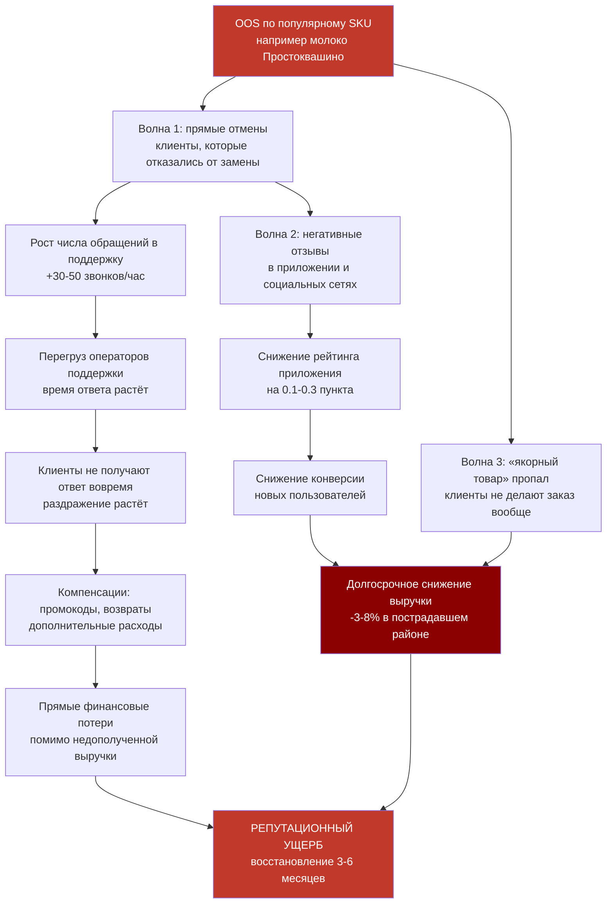
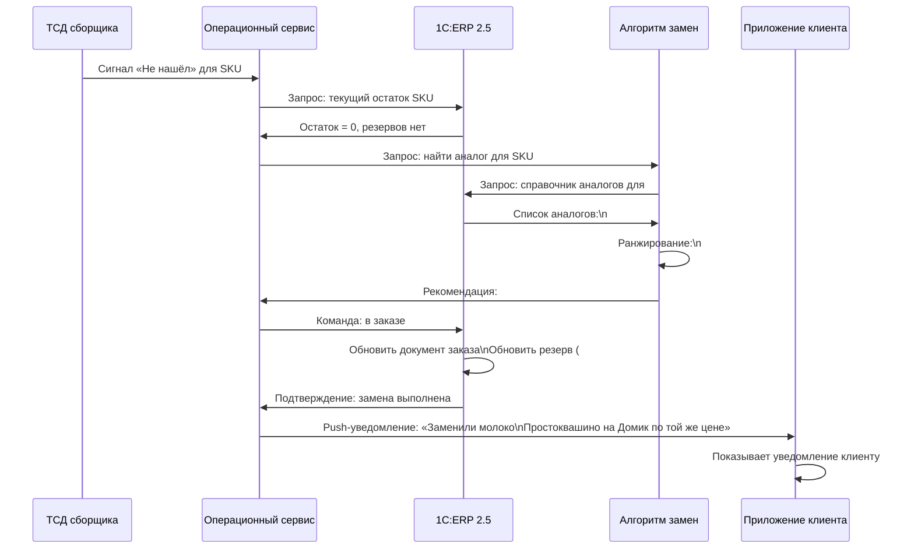
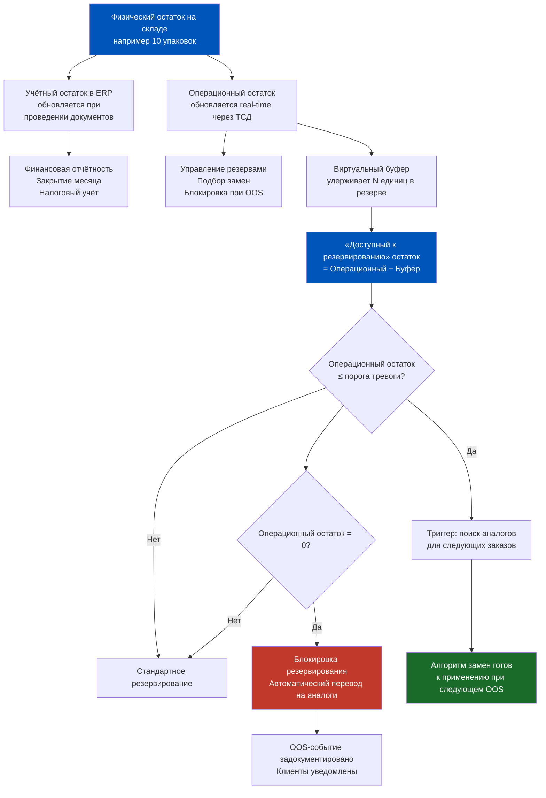
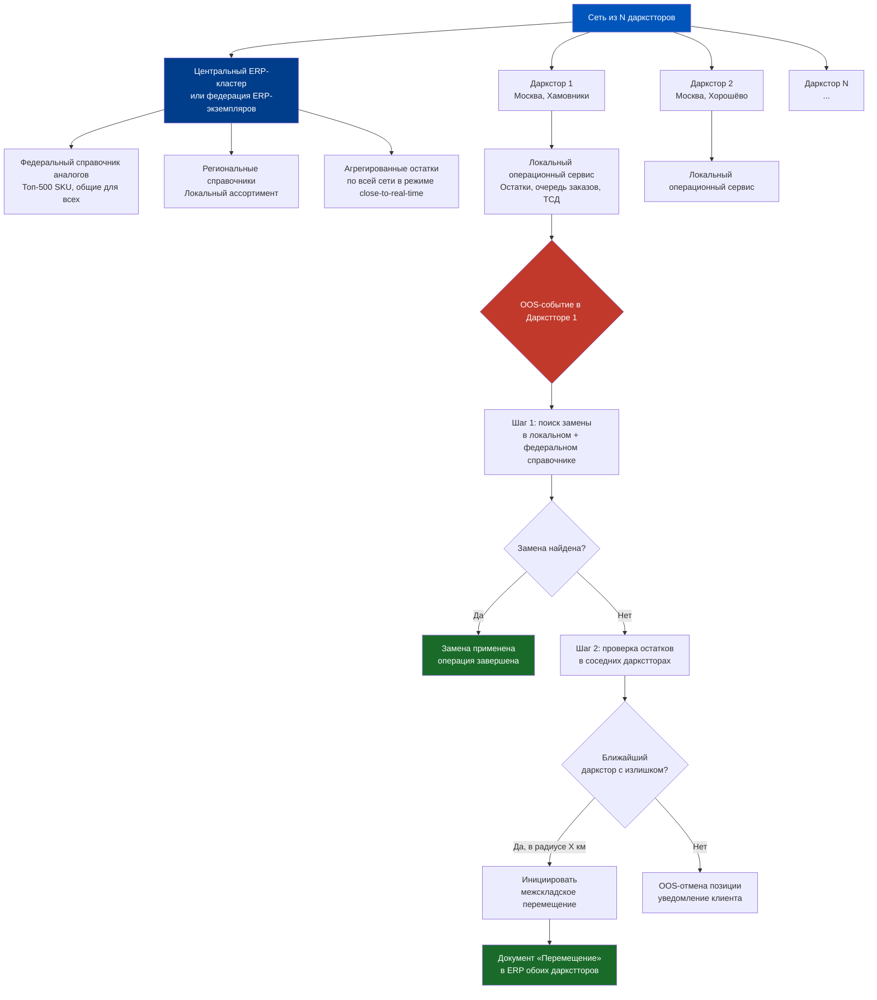
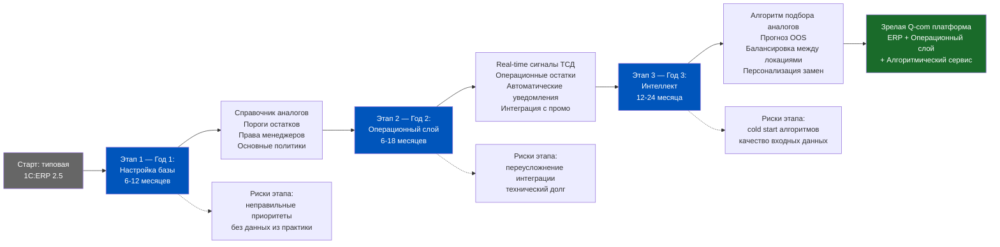
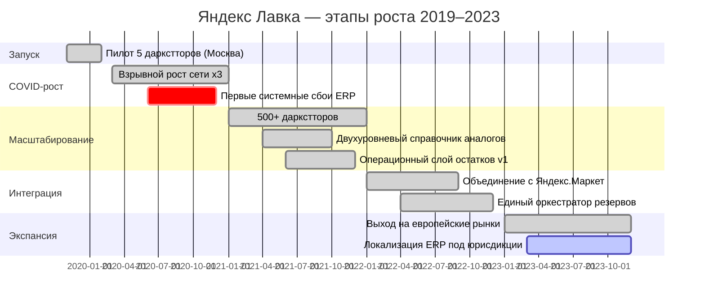
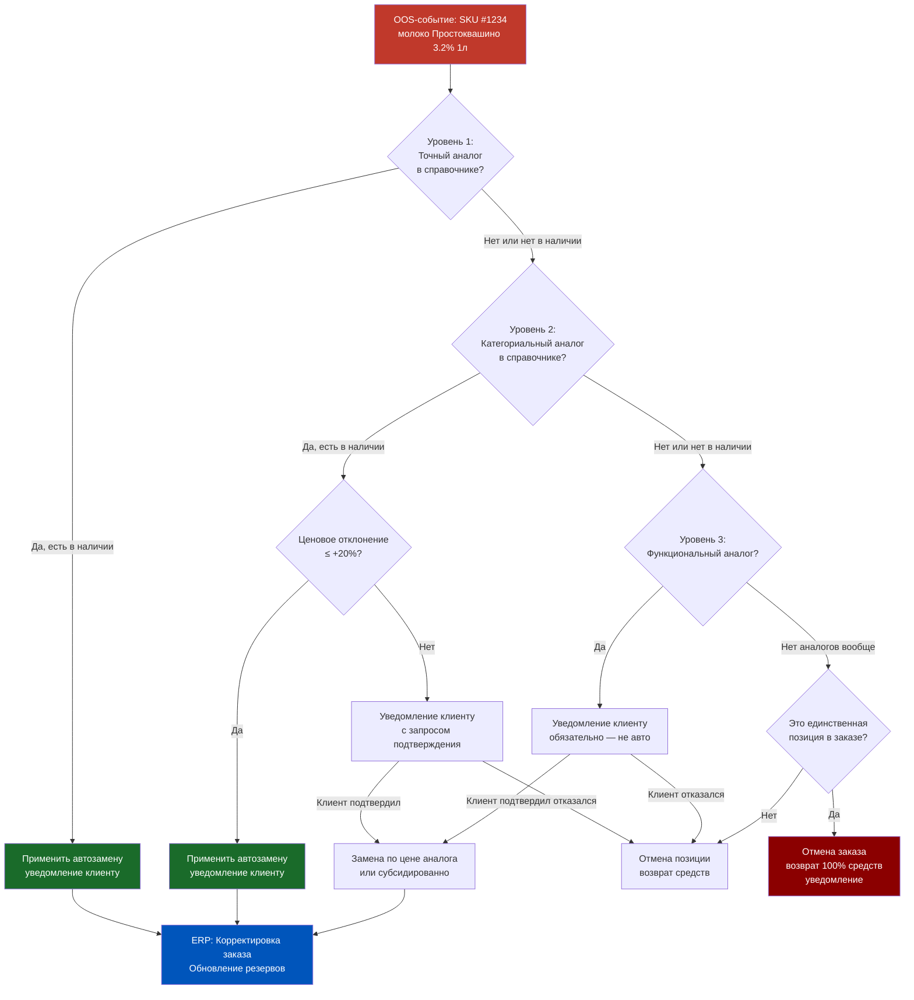
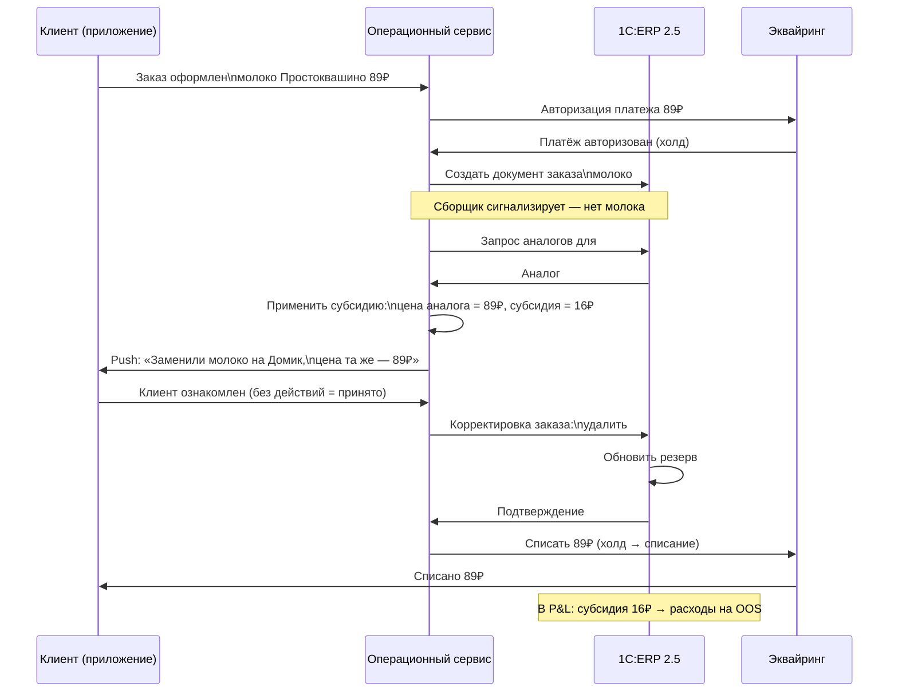
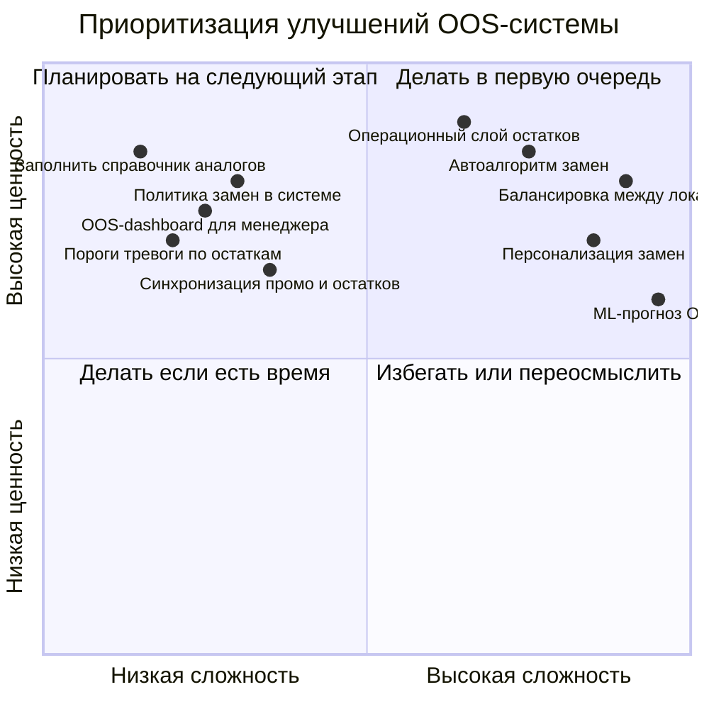

# Неделя 6, День 7. История Яндекс Лавки: как строится система real-time замен

> Яндекс Лавка не просто запустила быструю доставку. Она поставила вопрос, который изменил всю индустрию Q-com: что делает система, когда нужного товара нет? Ответ на этот вопрос потребовал переосмыслить роль ERP в операционной архитектуре.

## Содержание

1. [[#Часть 1. Контекст: рождение сервиса 15-минутной доставки]]
2. [[#Часть 2. Проблема OOS в Q-com масштабе]]
3. [[#Часть 3. Алгоритм «умных замен»]]
4. [[#Часть 4. Архитектура системы управления OOS в реальном времени]]
5. [[#Часть 5. Уроки для продакта: что сломалось и почему]]
6. [[#Часть 6. Масштабирование на сеть даркстторов]]
7. [[#Часть 7. Синтез: что это значит для вашей ERP-архитектуры]]

---

## Часть 1. Контекст: рождение сервиса 15-минутной доставки

Есть такой жанр в истории технологий — «это казалось невозможным, пока кто-то не сделал». Яндекс Лавка запустилась в 2019 году с обещанием, которое большинство людей в ритейле восприняли со скептицизмом: доставка продуктов за 15-30 минут. Не «в течение дня». Не «в 2-часовое окно». За 15-30 минут, как пицца.

Скептики указывали на очевидные проблемы. Классическая доставка продуктов работает потому, что оптимизирует маршруты через крупные склады или магазины — один курьер везёт 15 заказов по одному маршруту. 15-минутная доставка подразумевает курьера, который везёт 1-2 заказа, потому что у него просто нет времени объезжать других клиентов. Экономика выглядит убыточной.

Ответом стала концепция даркстора: небольшой склад (200-400 кв.м.), расположенный внутри жилого квартала, с радиусом покрытия 1-2 км. Не магазин (нет витрин, нет касс, нет покупателей) — только склад, заточенный под скорость сборки. Ассортимент 1500-3000 SKU против 30 000 в супермаркете. Товары расположены по логике сборки, а не по логике витрины. Сборщик знает «карту» склада наизусть.

**Что это означает для ERP**

В классическом ритейле ERP работает в «пакетном» режиме. Продажи за день суммируются, остатки пересчитываются ночью, заказы поставщикам формируются утром. Это нормально, когда цикл пополнения — 24-48 часов, а OOS в магазине не означает немедленной потери клиента (он возьмёт другой товар с соседней полки).

В Q-com с 15-минутной доставкой «пакетный» режим — это смерть. Клиент оформил заказ прямо сейчас. Через 15 минут курьер будет у его двери. Информация о наличии товара должна быть актуальной не «на вчерашний вечер», а прямо сейчас. Если ERP «думает», что молоко есть, а его нет — всё последующее становится цепочкой проблем.

**Архитектурный вызов 2019 года**

Когда команда, строившая Яндекс Лавку, задумалась об операционной системе, они столкнулись с фундаментальным противоречием. Стандартные ERP-системы (включая 1C:ERP) разрабатывались для мира, где время на обработку заказа измеряется часами или днями. Их внутренняя логика — транзакционная, но не real-time: запись в регистр, формирование проводки, обновление остатка — это операции, которые занимают секунды, но накапливаются в очереди при высокой нагрузке.

200 заказов в час — это 3.3 заказа в минуту, или один заказ каждые 18 секунд. При среднем составе заказа 7 позиций — это 70 транзакций в минуту только на резервирование, плюс столько же на сборку и отгрузку. Для маленького даркстора это вполне посильная нагрузка для правильно настроенной ERP. Но при масштабировании на сотни даркстторов и тысячи заказов — требования к архитектуре принципиально меняются.

**Яндекс Лавка не изобрела новую ERP**

Важно понять с самого начала: Яндекс Лавка не заменила ERP каким-то магическим решением. Она построила операционную архитектуру, в которой ERP сохраняла свои сильные стороны (учёт, финансы, регуляторная отчётность) — и дополнила её быстрыми операционными сервисами для задач, где ERP недостаточно быстра. Это ключевой урок, который мы будем разбирать на протяжении всего урока.

**Принципиальное отличие от e-com**

В обычном интернет-магазине клиент сделал заказ — и он ждёт. Завтра, послезавтра — нормально. Если товара нет — менеджер звонит, договаривается, предлагает замену. Это человеческий процесс, медленный, но работающий.

В Q-com «медленный человеческий процесс» невозможен по определению. Клиент ожидает доставку через 15 минут. Если через 10 минут позвонить и сказать «а молока-то нет» — это провал опыта, который стоит рейтинга и повторного заказа. Решение должно приниматься системой автоматически, за секунды, до того как клиент даже успел закрыть приложение.

Именно это требование и стало отправной точкой для системы «умных замен».

---

## Часть 2. Проблема OOS в Q-com масштабе

Прежде чем понять, как Яндекс Лавка решала проблему OOS, нужно понять, насколько она серьёзна. В ритейле к OOS давно привыкли как к «норме жизни». В Q-com это было пересмотрено полностью.

**Математика классического ритейла**

В классическом супермаркете OOS на уровне 5-8% считается приемлемым. Это означает, что из каждых 100 товарных позиций 5-8 в данный момент отсутствуют на полке. Клиент приходит, не находит нужный йогурт — берёт другой или не берёт. Ни один из этих сценариев не приводит к «потере заказа», потому что понятия «заказ» как такового нет. Клиент ушёл с полной тележкой — просто с немного другим составом.

В Q-com система принципиально другая. Клиент не «ходит по магазину» — он формирует цифровой заказ конкретных позиций. Если позиции нет — это либо замена (с риском недовольства), либо отмена позиции (клиент недоволен), либо отмена всего заказа (самый плохой исход). Нет «случайной покупки альтернативы» — система должна явно обработать ситуацию OOS.

**3% OOS в Q-com: что это реально означает**

Предположим, даркстор обрабатывает 1000 заказов в день. Средний заказ — 7 позиций. Всего позиций к сборке: 7000. При OOS 3% — это 210 позиций в дефиците.

210 «OOS-событий» в день. Каждое из них требует решения: замена или отмена позиции. Из 210 событий примерно 30% приводят к недовольству клиента независимо от решения (клиент хотел именно этот товар). 30% от 210 = 63 клиента с негативным опытом. Если хотя бы половина из них оставит отзыв или снизит рейтинг — это 31-32 негативных сигнала в день.

При рейтинге приложения как ключевом конкурентном факторе — это серьёзно. Особенно если учесть, что конкурент через дорогу работает с OOS 1.5% и имеет рейтинг 4.8 vs 4.5.

**Каскадный эффект OOS**

Отдельные OOS-события — управляемы. Системный OOS создаёт каскадный эффект, который экспоненциально хуже суммы отдельных событий.

**Почему «просто заказать больше» не работает**

Очевидное решение — держать огромный страховой запас, чтобы OOS не возникал. В классическом ритейле так часто и делают — «лучше перетарить, чем потерять продажи». Но в Q-com это работает хуже по двум причинам.

Причина первая — площадь. Даркстор 200-400 кв.м. имеет жёсткие ограничения хранения. Увеличить страховой запас по молоку означает уменьшить запас по чему-то другому. Это перераспределение рисков, а не их устранение.

Причина вторая — скоропортящиеся товары. Молоко, йогурты, свежие овощи, готовая еда — значительная часть ассортимента Q-com имеет короткий срок годности. Избыточный страховой запас оборачивается списаниями. В Q-com списания — это не «исчезающая маленькая» статья потерь, это системная угроза юнит-экономике.

Значит, решение не в «хранить больше» — а в «реагировать быстрее».

**Первые шаги: ручное управление OOS**

На старте Яндекс Лавка управляла OOS во многом вручную. Менеджер смены следил за остатками, при приближении к нулю — звонил клиентам или вносил изменения в заказы вручную. При 50-70 заказах в день это работало. При 500 — нет.

Масштаб сломал ручное управление. И именно это потребовало системного решения.

---

## Часть 3. Алгоритм «умных замен»

Ключевая инновация Яндекс Лавки в управлении OOS — это система, которая не просто фиксировала факт дефицита, а предлагала замену автоматически, не заставляя клиента ждать звонка менеджера. Это звучит просто, но за этой простотой стоит нетривиальная логика.

**Почему «автоматическая замена» сложна**

Замена — это не «дать похожий товар». Это деликатная операция, которая должна:
- уважать намерение покупателя (он хотел конкретный товар — не любой товар)
- не создавать ценовых сюрпризов (клиент не должен переплачивать из-за нашего дефицита)
- быть коммуникативно прозрачной (клиент должен узнать о замене до получения заказа)
- не создавать учётного хаоса в ERP (замена должна корректно отразиться во всех регистрах)

Без системного подхода автоматические замены хуже, чем их отсутствие: клиент получает «сюрприз», который он не заказывал, по непонятной цене, без объяснений.

**Логика алгоритма: SKU-сходство**

Алгоритм умных замен работал с несколькими измерениями сходства между SKU. Первое измерение — категориальная принадлежность. Молоко 3.2% заменяется молоком 2.5% или 1.5% — но не кефиром, даже если кефир «тоже молочный». Граница «приемлемой замены» определялась на уровне подкатегории, а не категории.

Второе измерение — объём/размер. Молоко 1 литр заменяется молоком 1 литр или 900 мл — но не 2 литра. Клиент, купивший 1 литр, не хочет внезапно получить 2 литра и заплатить вдвое больше.

Третье измерение — ценовой диапазон. Замена в пределах ±20% от базовой цены считалась приемлемой. Сверх этого — либо продаётся по цене оригинала (если дороже), либо по своей цене (если дешевле).

Четвёртое измерение — бренд. Это самое тонкое: иногда клиент лоялен к бренду (берёт только «Простоквашино») и не примет замену на другой бренд. Но это невозможно узнать заранее — только по истории покупок. Продвинутые системы учитывали историю конкретного клиента при подборе замен.

**Три класса замен**

Алгоритм ранжировал замены по трём классам. Точный аналог — тот же товар другого производителя, та же категория, объём, ценовой диапазон. Это замена с наименьшим риском недовольства — 85-90% клиентов принимают.

Категориальный аналог — товар из той же подкатегории, но с некоторыми отличиями (другой объём, немного другой вкус). Уровень принятия 60-75% — зависит от конкретной позиции и контекста.

Лучший вариант — алгоритм не нашёл близкого аналога, но предлагает «лучшее доступное». Уровень принятия 40-55%. Это уже риск, и для многих систем правильнее в этом случае уведомить клиента и спросить подтверждение.

**Критически важный момент: это не типовая 1C:ERP**

Нужно чётко понимать: описанный алгоритм подбора аналогов — это НЕ функциональность типовой 1C:ERP 2.5. Типовая 1С умеет хранить справочник аналогов номенклатуры (это стандартная функция), но логика «выбери лучший аналог учитывая ценовой диапазон, историю клиента и текущие остатки» — это кастомный сервис, написанный поверх ERP.

1C:ERP в этой архитектуре играет роль «базы данных правды»: справочник товаров, текущие остатки, история заказов, правила ценообразования. Алгоритм замен — это отдельный сервис, который обращается к ERP за данными, но принимает решения самостоятельно.

Это архитектурная философия, которую мы детально разберём в Части 4.

---

## Часть 4. Архитектура системы управления OOS в реальном времени

Самый интересный вопрос не «что система делала», а «как она узнавала о дефиците так быстро». В этом — ключевое архитектурное решение.

**Проблема времени обновления остатков**

В типовой ERP-логике остатки обновляются при проведении документов. Сборщик собрал заказ → руководитель смены провёл документ отгрузки → ERP обновила остатки. Это транзакционная модель, она верна для учёта — но медленна для операций.

В Q-com между «сборщик взял товар с полки» и «документ проведён» может пройти 5-15 минут. За это время ERP считает, что товар всё ещё доступен. Новый заказ может зарезервировать уже «взятый» товар. Сборщик приходит к полке и не находит его — OOS. Но это не реальный OOS (товар не закончился на складе), это «фантомный OOS», порождённый задержкой обновления остатков.

**Кнопка «Не нашёл» как инструмент обратной связи**

Ключевое решение — превратить ТСД (терминал сбора данных, мобильный сканер сборщика) из инструмента «подтверждения сборки» в инструмент «обратной связи по остаткам». В момент, когда сборщик нажимает «Не нашёл» — система немедленно, без ожидания проведения документов, снижает доступный остаток по этому SKU.

Это не учётная запись — это операционный сигнал. Учёт будет обновлён позже, при проведении документов. Но операционная система уже знает: молока «Простоквашино» не осталось — следующий заказ не должен его резервировать.

В ERP-архитектуре это реализуется через два параллельных «слоя остатков»:
- Учётные остатки: обновляются при проведении документов, используются для финансовой отчётности и бухгалтерии.
- Операционные остатки: обновляются в реальном времени через ТСД-события, используются для операционных решений (новые резервы, подбор замен).

Расхождение между двумя слоями — это нормально и управляемо. Оно закрывается при проведении документов конца смены.

**Виртуальный буфер безопасности**

Ещё одно решение — виртуальный буфер. Для критических SKU (топовые позиции по спросу) система не разрешала резервирование «до нуля». Даже если физически есть 3 упаковки — система считала доступной только 1, удерживая 2 в «виртуальном резерве неопределённости».

Зачем? Потому что между «сборщик взял товар» и «система обновила информацию» всегда есть лаг — пусть и маленький. Буфер амортизирует этот лаг. Когда оставшаяся 1 упаковка «уходит в последний заказ», система уже знает: SKU на исходе, пора думать о заменах для следующих заказов.

**Реальное время vs учётное время**

Для продакта важно чётко различать эти два понятия и не путать их. Когда менеджер смены смотрит на экран и видит «остаток молока: 3 упаковки» — какой это остаток? Учётный или операционный? Если ERP не разделяет эти два числа явно — возникает путаница, которая приводит к «фантомным OOS» и «фантомным избыткам».

Зрелая операционная система показывает оба числа: «учётный остаток: 8 упаковок (на момент последнего проведения документа, 17:32)» и «операционный остаток: 3 упаковки (с учётом ТСД-событий)». Разница в 5 упаковок — это товар, который уже находится «в руках» сборщиков для заказов в процессе сборки.

---

## Часть 5. Уроки для продакта: что сломалось и почему

Система «умных замен» работала — но не идеально. История Яндекс Лавки интересна не только своими успехами, но и своими провалами. Именно разбор провалов даёт продакту реальные уроки.

**Проблема 1: «умные замены» иногда раздражали**

Клиент хотел конкретный творог — потому что он готовит из него сырники по определённому рецепту, и жирность важна. Система заменила на «аналог» с другой жирностью. Формально всё правильно: та же категория, похожая цена, подходящий объём. Но клиент недоволен — потому что его намерение не было понято.

Урок: алгоритм замен не может понять намерение клиента без истории и контекста. Для новых клиентов и нестандартных позиций лучше спрашивать, чем угадывать.

Системное решение: введение «неприкосновенных позиций» — SKU, которые клиент явно пометил как «только эту марку». При OOS по таким позициям — не замена автоматически, а уведомление с вопросом.

**Проблема 2: холодный старт алгоритма**

Система замен основывалась частично на исторических данных: какие SKU клиенты принимали как замену, а какие — отвергали. Для SKU с длинной историей алгоритм работал хорошо. Для нового SKU, введённого неделю назад, — данных нет. Первые две недели жизни нового SKU были «хаотичными» с точки зрения замен: система делала предположения, иногда ошибалась, постепенно накапливала данные.

Урок: любой ML-компонент в операционной системе имеет фазу «холодного старта». В Q-com с его динамичным ассортиментом (постоянный ввод новинок) это хроническая проблема. Нужны правила для «ручной» настройки аналогов при вводе новых SKU — до того, как накопится статистика.

Системное решение: категорийный менеджер при вводе нового SKU обязан указать его аналоги в системе. Это ручная работа, но она критична для качества автозамен в первые недели.

**Проблема 3: граница кастомизации**

Что можно настроить конфигурацией 1С, а что требует написания отдельного сервиса? Это вопрос, который постоянно возникает при разработке Q-com-платформы на базе ERP.

В 1C:ERP 2.5 конфигурацией можно сделать: справочник аналогов номенклатуры, правила автозамены при нулевом остатке (базовый вариант), настройку порогов тревоги по остаткам, базовую логику приоритетов замен.

Что требует кастомного кода или отдельного микросервиса: учёт истории принятия замен конкретным клиентом, алгоритм ранжирования аналогов с учётом нескольких измерений сходства, интеграция с push-уведомлениями в режиме реального времени, разделение учётных и операционных остатков с независимым обновлением.

Граница проходит примерно там, где «конфигурация» превращается в «машинное обучение» или «сложная многофакторная логика».

**Главный урок**

ERP — это источник данных для умных алгоритмов, а не сам алгоритм. Попытка реализовать сложную бизнес-логику («выбери лучший аналог с учётом 7 факторов») внутри ERP через конфигурацию — путь к нечитаемому коду, который никто не может поддерживать. Правильный подход: ERP хранит данные (остатки, справочники, историю), внешний сервис использует эти данные и реализует логику.

Это не значит, что ERP «устаревает» или «не нужна». Это значит, что у каждой системы есть своя роль в архитектуре, и попытка заставить ERP делать всё — это антипаттерн.

---

## Часть 6. Масштабирование на сеть даркстторов

Первый даркстор — это эксперимент. Десять — это бизнес. Сотня — это платформа. При масштабировании Яндекс Лавки с единичных даркстторов до сети сотен локаций архитектура управления OOS потребовала принципиальных изменений.

**Проблема централизованного vs локального справочника аналогов**

В одном даркстторе справочник аналогов — это файл на 300-500 строк, который можно поддерживать вручную. В сети из 500 даркстторов — это 500 × 300 = 150 000 строк? Или один централизованный справочник на всех?

Ответ не очевиден, потому что оба подхода имеют свои провалы.

Централизованный справочник: одна команда поддерживает единую версию. Изменения применяются сразу ко всем. Проблема: местный ассортимент отличается. Молоко «Простоквашино» есть во всех даркстторах, но региональный бренд «Рузское молоко» — только в московских. Централизованный справочник либо не знает о региональных аналогах, либо разрастается до неуправляемого размера.

Локальный справочник: каждый даркстор настраивает под свой ассортимент. Точнее, но операционно тяжело: 500 даркстторов × время на поддержку = полная команда контент-менеджеров.

Компромиссное решение: двухуровневая архитектура. Центральный справочник для федеральных SKU (топ-500 позиций, представленных везде). Локальный слой для региональных и уникальных позиций. Приоритет при поиске замены: сначала проверить локальный слой, затем федеральный.

**Балансировка стока между локациями как следующий шаг**

OOS-менеджмент внутри одного даркстора — это реактивная задача: товар закончился, подобрали замену. Но в сети даркстторов появляется новая возможность: перемещение стока между локациями.

Даркстор «Полярная звезда» в дефиците по молоку. Даркстор «Северный» в трёх километрах — с избытком. Можно ли «одолжить» сток? Технически — да (курьер перевозит товар между локациями). Экономически — зависит от стоимости этого перемещения относительно ценности избежанных OOS.

В 1C:ERP 2.5 межскладское перемещение — это стандартный документ «Перемещение товаров». Но оперативное перемещение в режиме реального времени требует интеграции с операционной системой, которая мониторит остатки всех локаций одновременно и принимает решение: «стоит ли везти?»

Это тема Недели 7 — балансировка стока между локациями. Но важно понять уже сейчас: этот следующий шаг вырастает из проблемы OOS-менеджмента и требует той же архитектурной логики (ERP как «база данных правды», операционные сервисы как «интеллект»).

**Как ERP «видит» сеть vs как она физически работает**

Это философски важный момент. ERP «видит» сеть как набор складов с известными остатками и документами. Она не «видит» курьера, который едет между даркстторами. Она не «видит» клиента, который ждёт. Она «видит» транзакции.

Физически сеть работает как живой организм: тысячи одновременных событий, постоянные изменения состояния, непредсказуемые всплески спроса. Задача архитектора операционной платформы — создать «переводчика» между этим живым хаосом и транзакционной моделью ERP. Этот «переводчик» и есть операционный слой, который строила Яндекс Лавка.

---

## Часть 7. Синтез: что это значит для вашей ERP-архитектуры

Мы разобрали историю Яндекс Лавки не как историческую справку — а как кейс архитектурных решений. Теперь время превратить этот кейс в практические выводы для вашей работы как продакта логистики.

**Чеклист: 7 вещей, которые должны быть настроены в 1C:ERP 2.5 для Q-com OOS-менеджмента**

1. Справочник аналогов номенклатуры заполнен и актуален. Для каждого топ-300 SKU — минимум 2 аналога с указанием приоритета и допустимой ценовой разницы. Без этого справочника любой алгоритм замен слеп.

2. Пороги тревоги по остаткам настроены для критических SKU. Не «ноль — тревога», а «X единиц — предупреждение» и «Y единиц — критический уровень». Значения X и Y — на основе дневного оборота и времени пополнения.

3. Политика резервирования при дефиците определена явно. FIFO по времени заказа? Приоритет по сегменту клиента? Приоритет по слоту доставки? Это должно быть решение, зафиксированное в настройках, а не импровизация менеджера.

4. Политика замен при OOS настроена. Автоматическая замена на аналог? Уведомление клиента? Отмена позиции? Это должно быть явной настройкой в системе, а не решением момента.

5. Журнал OOS-событий ведётся и анализируется. Каждый факт «Не нашёл» на ТСД — это данные. Через месяц эти данные скажут вам, какие SKU наиболее уязвимы и в какие дни.

6. Синхронизация промо с остатками встроена в процесс. До активации нового маркетингового мероприятия — автоматическая проверка остатков по SKU-участникам. Если SKU в красной зоне — предупреждение маркетологу.

7. Права менеджера смены чётко определены. Что может менеджер сделать сам (изменить резервы, скорректировать промо), что требует согласования (отменить акцию), что требует звонка поставщику (срочный дозаказ). Неопределённость в полномочиях — источник промедления в кризисе.

**Таблица: типовое vs Q-com**

| Функциональность | Типовая 1C:ERP 2.5 | Что нужно добавить для Q-com | Сложность |
|---|---|---|---|
| Справочник аналогов | Есть (заполнение вручную) | Инструмент массового редактирования, API для внешнего алгоритма | Низкая |
| Резервирование | FIFO по времени заказа | Настройка приоритетов (сегмент, слот, чек) | Средняя |
| Пороги остатков | Базовые сигналы | Многоуровневые пороги + связь с операционным слоем | Средняя |
| OOS-замены | Ручные, без алгоритма | Автоматический подбор аналогов с ранжированием | Высокая (отдельный сервис) |
| Разделение учётных и операционных остатков | Нет в типовой | Кастомный регистр операционных остатков | Высокая |
| Интеграция с ТСД для real-time сигналов | Частично (WMS-функциональность) | Обработчик событий «Не нашёл» с немедленным обновлением | Средняя |
| Уведомления клиентам о заменах | Нет в типовой | Интеграция с push-сервисом через API | Средняя |
| Синхронизация промо с остатками | Нет автоматической | Скрипт проверки при активации акции | Низкая-Средняя |

**Философский вывод: ERP как операционная память**

ERP — это «операционная память» бизнеса. Она хранит всё, что произошло: каждый заказ, каждое перемещение, каждую продажу. Эта память полна, точна и долговечна. Но у памяти есть особенность: она фиксирует прошлое, а не управляет настоящим.

Управление настоящим в Q-com требует скорости, которая выходит за пределы того, что ERP может сделать в транзакционной модели. Это не недостаток ERP — это её природа. Транзакционность обеспечивает точность учёта, а точность учёта — основа бизнеса.

Скорость обновления операционной памяти определяет скорость реакции на реальность. Яндекс Лавка не заменила ERP — она ускорила «обновление памяти», добавив операционный слой, который работает быстрее, чем ERP, но опирается на данные ERP. Это архитектурный принцип, применимый к любому Q-com бизнесу.

**Что это значит для вашей следующей задачи**

Если вы продакт в Q-com, и перед вами стоит задача «улучшить OOS-менеджмент», первый вопрос — не «как улучшить алгоритм замен?». Первый вопрос: «насколько актуальны остатки в нашей системе прямо сейчас?» Если актуальность — 15 минут, никакой алгоритм замен не поможет. Сначала нужно решить задачу актуальности данных.

Второй вопрос: «заполнен ли справочник аналогов?» Если нет — любой алгоритм замен работает вслепую.

Третий вопрос: «зафиксированы ли OOS-события в системе с достаточным контекстом для анализа?» Если нет — нет данных для улучшений.

Четвёртый вопрос: «синхронизированы ли промо-акции с мониторингом остатков?» Если нет — маркетинг будет регулярно усиливать дефицит своими же акциями.

Только ответив на эти четыре вопроса и закрыв пробелы — переходить к алгоритмической сложности. Это и есть путь от «типовой ERP» к «Q-com платформе».

---

## Часть 8. Хронология роста Яндекс Лавки (2019–2023)

История Яндекс Лавки — это не плавный линейный рост. Это серия кризисов, каждый из которых обнажал архитектурный предел, достигнутый системой. Понимание этой хронологии необходимо: оно показывает, что ERP-проблемы не появляются внезапно, они созревают вместе с бизнесом.

**Ноябрь 2019: пилот, 5 даркстторов**

Первые пять даркстторов Яндекс Лавки открылись в Москве в ноябре 2019 года. Зона покрытия — несколько кварталов, ассортимент около 1 200 SKU, обещанное время доставки 15-30 минут. На уровне пяти локаций все ERP-задачи решались вручную или полуавтоматически. Остатки смотрели глазами. Справочник аналогов помещался в таблицу Excel. Замены обрабатывал менеджер смены по телефону.

Это важный момент: при небольшом масштабе «плохая» архитектура работает нормально. Никто не чувствовал боли. Именно поэтому архитектурный долг незаметно накапливался.

**2020: COVID-буст, x3 рост за год**

Пандемия изменила всё. Q-com из «удобного сервиса для занятых людей» превратился в «способ безопасно получить продукты». Спрос вырос в разы за недели. Яндекс Лавка открывала новые даркстторы быстрее, чем успевала настраивать операционные процессы.

К концу 2020 года сеть выросла примерно втрое. Первые системные сбои ERP появились именно в этот период: очереди на проведение документов, «задвоенные» резервы при высокой нагрузке, задержки обновления остатков во время пиков спроса. Менеджеры обходили систему вручную, накапливая учётные расхождения.

COVID-2020 стал первым реальным стресс-тестом архитектуры. Большинство проблем были «залатаны» операционными костылями. Системные решения появились позже.

**2021: 500+ даркстторов, проблема балансировки стока**

К середине 2021 года сеть преодолела отметку 500 даркстторов. При этом масштабе проявилась новая проблема, которой не было на 5 даркстторах: структурные дисбалансы стока между локациями.

Один район города «переедал» популярный SKU из-за нестандартного события (концерт, спортивный матч, погодный всплеск). Соседний район — с избытком. Без механизма видимости стока через сеть в реальном времени операционная команда узнавала о дисбалансе из жалоб клиентов — когда было уже поздно.

Именно 2021 год стал переломным для архитектуры системы аналогов. Были сделаны первые серьёзные инвестиции в двухуровневый справочник (федеральный + локальный) и в операционные остатки как отдельный слой данных.

**2022: интеграция с Яндекс.Маркет**

В 2022 году произошло важное архитектурное событие: Яндекс начал интегрировать Лавку и Яндекс.Маркет в единую цепочку фулфилмента. Клиент мог оформить заказ на Маркете с доставкой «за 30 минут» через инфраструктуру Лавки.

Для ERP это создало новый вызов: два продукта с разной логикой продаж и ценообразования, работающие с общими складскими остатками. Документы из Маркета и из Лавки попадали в одну ERP, но с разными статусами, скидками, промо-механиками. Риск конфликтов резервирования (один товар зарезервирован из двух каналов) стал реальным.

Решение потребовало создания единого сервиса управления резервами — «оркестратора», который видел оба канала и предотвращал двойное резервирование.

**2023: международная экспансия**

В 2023 году Яндекс Лавка начала экспансию в европейские страны. Каждый рынок принёс новый набор регуляторных требований: другие правила НДС, различная логика «возвратов» (в ряде стран возврат продуктов питания регулируется иначе), локальная маркировка товаров.

Это означало, что единая ERP-архитектура, которую выстраивали под российский рынок, требовала либо локализации под каждую юрисдикцию, либо создания «учётных прокси», которые конвертировали локальные операции в формат, понятный центральной ERP.

Хронология показывает закономерность: каждый архитектурный вызов созревал за 6-12 месяцев до того, как становился кризисом. И каждое решение занимало 6-18 месяцев реализации. Это означает, что Q-com платформа всегда работает «в долг» относительно своего текущего масштаба — и правильный продакт должен думать об архитектуре следующего этапа уже на текущем.

---

## Часть 9. Техническая анатомия «умных замен» в 2021

К 2021 году система замен прошла несколько итераций и приобрела структуру, которую можно детально разобрать. Это уже не «приблизительные замены по категории», а многоуровневый алгоритм с явными правилами.

**Три уровня сходства SKU**

Алгоритм 2021 года оперировал тремя уровнями сходства, которые использовались каскадно.

Уровень 1 — точный аналог. Тот же тип товара, тот же объём, тот же диапазон жирности/состава, другой производитель. Пример: молоко Простоквашино 3.2% 1л → молоко Домик в деревне 3.2% 1л. Ценовое отклонение допустимо в диапазоне ±10% от оригинала. Если аналог дороже — система применяет автоматическую скидку до цены оригинала. Уровень принятия клиентами: 85-92%.

Уровень 2 — категориальный аналог. Тот же тип товара, возможно другой объём или незначительно иной состав. Пример: молоко 3.2% 1л → молоко 2.5% 1л, или молоко 3.2% 1л → молоко 3.2% 900мл. Ценовое отклонение допустимо ±20%. Уровень принятия: 62-78%.

Уровень 3 — функциональный аналог. Товар решает ту же потребительскую задачу, но может существенно отличаться по параметрам. Пример: молоко 3.2% → кокосовое молоко в категории «молочные альтернативы», или молочный коктейль вместо молока. Ценовое отклонение допустимо ±25%, но клиент всегда получает уведомление с возможностью отказаться. Уровень принятия: 38-52%.

**Ценовые коридоры и ценовая политика при заменах**

Ценообразование при замене — деликатный вопрос, напрямую влияющий на доверие клиента. Базовое правило: клиент никогда не должен переплачивать из-за дефицита. Это право клиента, которое система гарантировала автоматически.

Если аналог дешевле оригинала — клиент получает аналог по его реальной цене (ниже той, что он планировал). Разница возвращается через перерасчёт заказа. Если аналог дороже оригинала в пределах +20% — клиент получает аналог по цене оригинала (Яндекс принимает убыток разницы). Если аналог дороже на 20-40% — клиент получает push-уведомление с предложением: взять аналог по его цене, взять аналог по цене оригинала (с ограниченным бюджетом субсидий), или отменить позицию. Если аналог дороже более чем на 40% — автоматическая отмена позиции, уведомление клиенту.

Рейтинг товара влиял на приоритизацию: при наличии нескольких аналогов одного уровня предпочтение отдавалось товару с более высоким рейтингом в приложении. Высокорейтинговый аналог имел статистически более высокий уровень принятия, даже при незначительно большей ценовой разнице.

**Каскадная логика при отсутствии аналогов**

Алгоритм разработан так, чтобы максимально сохранить заказ. Только при полном отсутствии аналогов и при условии, что эта позиция — единственная в заказе, происходит полная отмена. Во всех остальных случаях — отменяется позиция, но не заказ.

**Данные из ERP как топливо алгоритма**

Алгоритм работает с тремя массивами данных из ERP. Первый — справочник аналогов номенклатуры: заполняется категорийными менеджерами при вводе каждого SKU, содержит ссылки на аналоги с указанием уровня сходства и ценовых правил. Второй — история продаж по SKU: позволяет оценить «сезонность» дефицита (некоторые SKU уходят в OOS в определённые дни недели или периоды года) и вероятность того, что клиент примет замену. Третий — текущий операционный остаток: уже описанный выше «быстрый слой», который показывает актуальное наличие с точностью до минуты.

---

## Часть 10. Финансовая механика замен в ERP

За каждой «умной заменой» стоит финансовая операция в ERP. Понимание этой механики критично: неправильно реализованный учёт замен приводит к расхождениям в отчётности, проблемам с эквайрингом и ошибкам в P&L.

**Сценарий 1: замена на более дешёвый аналог**

Клиент заказал молоко за 89 рублей. Аналог стоит 75 рублей. Система применила замену автоматически.

В ERP формируется «Корректировка реализации»: строка оригинального SKU удаляется, добавляется строка аналога по цене 75 рублей. Разница 14 рублей возвращается клиенту. Технически это частичный эквайринговый возврат: транзакция на 89 рублей была авторизована при оформлении заказа, теперь нужно вернуть 14 рублей на карту клиента.

В P&L: выручка по SKU «молоко Простоквашино» — 0 (не отгружено), выручка по SKU «молоко аналог» — 75 рублей. Маржа по аналогу может быть как выше, так и ниже, чем по оригиналу — зависит от закупочной цены.

**Сценарий 2: замена на более дорогой аналог по цене оригинала**

Клиент заказал молоко за 89 рублей. Аналог стоит 105 рублей. Система применила замену по цене 89 рублей (субсидировала разницу 16 рублей).

В ERP: документ реализации содержит строку аналога с ценой 89 рублей и автоматической скидкой. Скидка 16 рублей учитывается как «расходы на OOS-субсидии» — отдельная аналитика в P&L, которая позволяет контролировать стоимость политики замен.

Без этой аналитики невозможно ответить на вопрос: «сколько нам стоит наша политика бесплатных замен в месяц?»

**Сценарий 3: клиент отказался от замены, позиция отменена**

Клиент заказал молоко за 89 рублей, отказался от предложенного аналога. ERP формирует «Частичную отмену заказа». Возврат 89 рублей — снова эквайринговый частичный возврат. Резерв под оригинальный SKU снимается. В отчёте OOS фиксируется событие «отказ от замены» с указанием причины и позиции.

**«Замены по причинам OOS» как управленческий отчёт**

Ключевой отчёт для операционного руководства — это сводка OOS-событий с разбивкой по причинам и исходам. Структура отчёта:

| Параметр | Значение | Интерпретация |
|---|---|---|
| Всего OOS-событий за период | 847 | Базовая метрика частоты дефицитов |
| Из них: автозамена принята | 612 (72%) | Качество справочника аналогов |
| Из них: клиент отказался от замены | 143 (17%) | Потери от неподходящих аналогов |
| Из них: аналогов не нашлось | 92 (11%) | Пробелы в справочнике аналогов |
| Субсидии на OOS-замены (руб.) | 34 200 | Финансовая стоимость политики замен |
| Частичные отмены от OOS | 235 | Потери выручки от OOS |
| Полные отмены заказов от OOS | 18 | Самые болезненные события |

Этот отчёт — инструмент управления: он показывает, где справочник аналогов неполный, сколько стоит политика субсидий и как меняется ситуация в динамике.

**Влияние замен на маржу: почему нужна аналитика на уровне SKU**

Ключевой вопрос, который редко задают продакты: замены улучшают или ухудшают маржу? Ответ зависит от конкретной замены. Если аналог — собственная торговая марка даркстора (СТМ), его маржа может быть выше, чем у брендового оригинала. В этом случае OOS по бренду при наличии СТМ-аналога — это финансово выгодное событие (при условии принятия клиентом). Если аналог — более дорогой брендовый товар, который продаётся по субсидированной цене оригинала — это убыток.

Без аналитики на уровне SKU невозможно отличить одно от другого. Отчёт «общая выручка за день» не покажет, что половина замен принесла дополнительную маржу, а вторая половина — убыток.

---

## Часть 11. Конкурентное сравнение: как другие Q-com игроки решали ту же проблему

Яндекс Лавка не была единственным Q-com игроком на российском рынке. Самокат, ВкусВилл.Экспресс и Озон.Экспресс решали ту же проблему OOS — но принципиально разными методами. Сравнение этих подходов даёт объёмную картину.

**Самокат: инвентаризации вместо алгоритмов**

Самокат сделал ставку на точность исходных данных, а не на алгоритмическое управление дефицитом. Логика: если остатки всегда актуальны, замены нужны реже.

Практически это означало высокую частоту мини-инвентаризаций прямо в процессе работы смены. Каждые 2-3 часа сборщики выполняли быстрый подсчёт топ-50 SKU. Расхождения с системой исправлялись немедленно, не накапливаясь. Результат: более низкий OOS-rate за счёт точности данных, но более высокие операционные расходы на инвентаризацию.

Слабое место стратегии Самоката: при внезапном всплеске спроса (промо, событие в районе) инвентаризации не успевают за реальностью. Дефицит всё равно возникает — и тогда система, заточенная на «точность, а не замены», оказывается менее гибкой.

**ВкусВилл.Экспресс: узкий ассортимент как структурная защита**

ВкусВилл решил проблему OOS на уровне ассортиментной стратегии. Около 800 SKU в матрице — примерно в 2-3 раза меньше, чем у конкурентов. Меньше SKU означает меньше вероятность дефицита по каждой позиции при том же страховом запасе.

Математика: при запасе 1 000 единиц на 800 SKU — в среднем 1.25 единицы на SKU. При тех же 1 000 единицах на 2 500 SKU — 0.4 единицы на SKU. Вероятность нулевого остатка по любому SKU в первом случае кратно ниже.

Слабое место: узкий ассортимент ограничивает средний чек и «полноту» заказа. Клиент, который хочет купить всё в одном месте, вынужден делать несколько заказов. Ассортиментная стратегия ВкусВилла работает на высоколояльную аудиторию, ценящую конкретные категории, но теряет клиентов с более широкими потребностями.

**Озон.Экспресс: агрессивный справочник аналогов из маркетплейса**

У Озона было уникальное конкурентное преимущество, недоступное другим игрокам: каталог маркетплейса с миллионами SKU и накопленными данными о «похожих товарах» из поисковой аналитики. Алгоритм «похожих товаров», изначально разработанный для рекомендательной системы маркетплейса, был адаптирован для алгоритма замен в Q-com.

Результат: самый широкий справочник аналогов среди всех игроков, с данными не только о категориальном сходстве, но и о реальном поведении покупателей («люди, купившие X, часто также берут Y»). Слабое место: рекомендации маркетплейса оптимизированы на расширение чека, а не на минимизацию разочарования от дефицита. «Похожий товар» в логике маркетплейса — это не всегда корректная замена в логике Q-com.

**Таблица сравнения**

| Игрок | Стратегия OOS | Типичный OOS-Rate | Подход к заменам | Слабое место стратегии |
|---|---|---|---|---|
| Яндекс Лавка | Алгоритмические замены + операционный слой остатков | 2–3% | Трёхуровневый алгоритм, ценовые коридоры, история клиента | Сложность поддержки справочника аналогов при широком ассортименте |
| Самокат | Частые инвентаризации, приоритет точности данных | 1.5–2.5% | Меньше замен, больше отмен позиций | Высокие операционные расходы, уязвим к внезапным всплескам |
| ВкусВилл.Экспресс | Узкий ассортимент как структурная защита | 1–2% | Минимальные замены за счёт низкой частоты OOS | Ограниченный средний чек, узкая аудитория |
| Озон.Экспресс | Агрессивный справочник аналогов из маркетплейса | 3–5% | Широкий каталог замен с поведенческими данными | Рекомендации «маркетплейсной логики» не всегда уместны в Q-com |

Каждая стратегия отражает глубинные ценности компании: Самокат — «операционное совершенство», ВкусВилл — «сила бренда и фокус», Озон — «масштаб и данные», Яндекс Лавка — «технологический алгоритм».

---

## Часть 12. Уроки для продакта: 10 выводов из истории Яндекс Лавки

**Вывод 1. Скорость обновления остатков — это архитектурное решение, не операционная дисциплина**

Когда остатки обновляются с задержкой 15 минут — это не потому, что менеджеры «работают плохо». Это потому, что архитектура системы не предусматривает более быстрого обновления. Требовать от команды «обновлять остатки чаще» при транзакционной ERP-логике — всё равно что требовать от человека «думать быстрее». Ограничение физическое. Решение архитектурное: операционный слой остатков с независимым обновлением через события ТСД.

**Вывод 2. Справочник аналогов — это конкурентный актив, который нужно поддерживать как продукт**

Справочник аналогов — не «список похожих товаров, который один раз заполнили». Это живая база знаний, которая либо растёт и актуализируется, либо устаревает и перестаёт работать. При ассортименте 2 000 SKU и обновлении матрицы на 20% в год — это 400 новых позиций ежегодно, каждой нужны аналоги. У справочника должен быть owner (обычно категорийный менеджер), метрика качества (coverage — доля SKU с хотя бы двумя аналогами) и процесс актуализации.

**Вывод 3. ERP — источник данных для умных алгоритмов, не сам алгоритм**

Одна из самых дорогостоящих ошибок в Q-com — попытка реализовать сложную многофакторную логику «прямо в 1С» через конфигурацию. ERP великолепно справляется с хранением справочников, остатков, истории транзакций. Но принятие решений с учётом 5+ факторов в режиме реального времени — это работа для специализированного сервиса. Разграничение «ERP = хранение данных, сервис = принятие решений» — основа масштабируемой архитектуры.

**Вывод 4. Кастомизация поверх типовой 1С — это технический долг, требующий управления**

Каждое кастомное расширение типовой 1С:ERP — это будущая проблема при обновлении платформы. Яндекс Лавка при переходе на новые версии конфигурации регулярно обнаруживала, что кастомные регистры и обработчики конфликтуют с типовыми изменениями. Правило: для каждой кастомизации должен существовать владелец, документация и план миграции. Кастомизация «без хозяина» — это бомба с неизвестным таймером.

**Вывод 5. OOS-метрика должна быть видна операционной команде в реальном времени, не в конце дня**

Если менеджер смены узнаёт об OOS-проблеме из утреннего отчёта — он может только констатировать факт. Если он видит OOS-dashboard в реальном времени — он может реагировать: перераспределять сборщиков, инициировать срочное пополнение, корректировать промо. Разница между «отчётом о прошлом» и «инструментом управления настоящим» — это разница между реактивным и проактивным управлением.

**Вывод 6. Промо без синхронизации с остатками — это управляемый кризис**

Маркетинговая команда запускает акцию «-30% на молоко» без проверки остатков. Спрос на молоко вырастает в 3 раза. Остатки обнуляются через 2 часа. Следующие 22 часа дня — OOS по главному промо-товару. Клиенты получают замены или отмены именно тогда, когда пришли за акционным товаром. Репутационный ущерб в 10 раз хуже, чем от обычного OOS. Решение: автоматическая проверка остатков при создании промо-события. Если SKU в жёлтой или красной зоне — предупреждение маркетологу до активации.

**Вывод 7. «Умная замена» требует обратной связи: клиент принял или отклонил — данные в модель**

Алгоритм замен обучается только на обратной связи. Если результаты замен не попадают обратно в систему («этот аналог клиент принял 95 раз и отверг 3 раза»), алгоритм не улучшается. Данные о принятии/отклонении замен — золото для модели. Компании, которые собирают и используют эти данные, через 12-18 месяцев имеют радикально лучший алгоритм, чем те, кто этого не делает.

**Вывод 8. Балансировка стока между локациями — следующий уровень после OOS-менеджмента**

OOS-менеджмент внутри одного даркстора — это фундамент. Следующий уровень зрелости — видеть дефицит в одной точке и избыток в соседней, и принимать решение о межскладском перемещении в реальном времени. Эта задача требует агрегированного операционного остатка по всей сети и логики сравнения «стоимость перемещения vs ценность избежанного OOS». Без фундамента (точные операционные остатки в каждой локации) — к этому уровню приступать преждевременно.

**Вывод 9. Рост сети = рост сложности ERP. Архитектура «на 5 даркстторов» не масштабируется на 500**

Это не теоретическое предостережение — это подтверждённый факт из истории Яндекс Лавки. Архитектура, которая работает при 5 локациях, начинает скрипеть при 50 и ломается при 500. Причины: централизованные справочники становятся узким местом, транзакционная нагрузка растёт нелинейно, ручные процессы не масштабируются. Правильный момент для пересмотра архитектуры — не кризис, а предыдущий этап роста. Планировать архитектуру следующего масштаба нужно в спокойное время, а не когда всё горит.

**Вывод 10. Данные из ERP — это стратегический актив, который со временем становится ценнее самой системы**

История OOS-событий за 3 года, обогащённая данными о принятии замен, сезонности дефицита и поведении клиентов — это актив, который невозможно купить или быстро создать. Он накапливается только в процессе операционной работы. Компания, которая с первого дня правильно структурирует и сохраняет эти данные, через три года имеет инструмент прогнозирования дефицита, который на порядок точнее, чем у стартапа без истории. ERP — это не просто «система учёта». Это хранилище операционной памяти, ценность которой растёт с каждым днём работы.

---

## Часть 13. От теории к практике: как внедрить изученное в вашу систему

Курс построен вокруг конкретных навыков. Эта часть — финальный переход от кейса Яндекс Лавки к практическому чеклисту для продакта, работающего с 1С:ERP 2.5 в Q-com.

**Диагностика текущего состояния вашей ERP**

Прежде чем что-то улучшать, нужно честно оценить текущее состояние. Ответьте на 8 вопросов:

Первый: с какой задержкой обновляются остатки в вашей системе? Если больше 10 минут — это архитектурная проблема. Если от 3 до 10 минут — приемлемо, но есть куда расти. Если менее 3 минут — хороший результат.

Второй: какой процент топ-300 SKU имеет хотя бы двух аналогов в справочнике? Менее 50% — критическая уязвимость. 50-80% — средний уровень. Более 80% — зрелая система.

Третий: логируются ли OOS-события с контекстом (какой SKU, в какой момент, какое решение принято)? Если нет — нет данных для улучшений.

Четвёртый: знает ли маркетинг об остатках до запуска промо? Если промо запускается без проверки — это систематический риск.

Пятый: есть ли у менеджера смены OOS-dashboard в реальном времени? Если нет — управление реактивное, не проактивное.

Шестой: какова политика при OOS? Зафиксирована ли она явно в системе или существует «в головах»? Если в головах — каждый менеджер решает по-своему.

Седьмой: есть ли аналитика по финансовым последствиям замен (субсидии, маржа по заменам)? Если нет — нет видимости реальной стоимости OOS-политики.

Восьмой: как часто обновляется справочник аналогов и кто за него отвечает? Если ответа нет — справочник деградирует.

**Приоритизация улучшений по матрице ценность/сложность**

Матрица показывает классическую картину: самые ценные «быстрые победы» — в верхнем левом квадранте. Заполнить справочник аналогов, настроить пороги тревоги, зафиксировать политику замен — это высокая ценность при относительно низкой сложности реализации. С них и нужно начинать.

Высокосложные задачи (операционный слой остатков, алгоритм замен, балансировка между локациями) дают огромный эффект — но требуют архитектурной зрелости и подготовленной базы данных. Делать их «в первый год» без фундамента — ошибка.

**Признаки зрелой Q-com платформы**

Как выглядит система, которая прошла весь путь от «типовой ERP» до «Q-com платформы»?

Первый признак — операционная команда знает об OOS-проблемах раньше клиентов. Система сигнализирует о приближающемся дефиците до того, как он материализуется в заказе. Менеджер принимает превентивные меры, а не гасит пожар.

Второй признак — справочник аналогов покрывает 90%+ SKU и обновляется при каждом вводе новинки. Это не задача «сделать однажды» — это непрерывный процесс с owner и KPI.

Третий признак — каждое OOS-событие оставляет данные. История замен, история принятий и отказов, финансовые последствия — всё это аккумулируется и регулярно анализируется. Не «у нас есть данные», а «мы регулярно принимаем решения на основе этих данных».

Четвёртый признак — архитектура готова к следующему масштабу. Команда думает о проблемах 500 локаций, находясь на 100. Не потому что у них много свободного времени — а потому что иначе кризис масштабирования неизбежен.

Пятый признак — ERP и операционные сервисы работают слаженно: ERP хранит «правду» о бизнесе, операционные сервисы используют эту правду для принятия решений в реальном времени, и никто не пытается заставить ERP делать то, для чего она не предназначена.

Это и есть цель курса: не «научиться работать в 1С:ERP», а понять, как ERP встраивается в более широкую операционную архитектуру — и что происходит, когда эта архитектура выстроена правильно.

**Ключевые термины урока**

| Термин | Определение |
|---|---|
| OOS (Out of Stock) | Отсутствие товара на момент формирования заказа |
| Даркстор | Небольшой склад внутри жилого квартала, работающий только на онлайн-заказы |
| Справочник аналогов | Структурированный перечень товаров-заменителей с указанием уровня сходства и ценовых правил |
| Учётные остатки | Остатки в ERP, обновляемые при проведении документов |
| Операционные остатки | Быстрый слой данных, обновляемый через события ТСД в режиме реального времени |
| Виртуальный буфер | Зарезервированный запас, не доступный для нового резервирования, амортизирующий лаг обновления |
| Корректировка заказа | Документ в ERP, фиксирующий замену позиции с перерасчётом стоимости |
| OOS-субсидия | Разница между ценой более дорогого аналога и ценой оригинала, которую оплачивает операция |
| Каскадная отмена | Ситуация, когда OOS единственной позиции приводит к отмене всего заказа |
| Coverage справочника | Доля SKU, для которых заведено хотя бы два аналога; ключевая метрика качества справочника |

**Связи с другими темами курса**

Урок опирается на знания Недели 1 (архитектура регистров 1С:ERP — почему ERP транзакционна по природе), Недели 2 (управление складом и WMS — роль ТСД в операционных сигналах), Недели 4 (ценообразование и скидки — механика субсидированных замен), Недели 5 (управление промо-активностями — синхронизация акций с остатками).

Следующая неделя (Неделя 7) строится на фундаменте этого урока: балансировка стока между локациями сети — это логическое продолжение темы OOS-менеджмента, расширенное с одного даркстора на сетевой уровень.

**Контрольные вопросы для самопроверки**

1. Чем отличается учётный остаток от операционного и почему это разграничение критично для Q-com?
2. Назовите три уровня сходства SKU в алгоритме умных замен. В чём принципиальная разница между уровнем 1 и уровнем 3?
3. Что такое «каскадный эффект OOS» и какие его стадии?
4. Почему «просто держать больший страховой запас» не решает проблему OOS в Q-com?
5. Какие четыре вопроса продакт должен задать в первую очередь, прежде чем улучшать алгоритм замен?
6. Как OOS-субсидия отражается в P&L, и почему важно выделять её в отдельную аналитику?
7. В чём фундаментальное отличие стратегии Самоката от стратегии Яндекс Лавки в управлении OOS?
8. Что означает «Coverage справочника аналогов» и какой показатель считается зрелым?

---

← [[Неделя 6 - День 6 - Практикум по фулфилменту|← День 6]] | [[1c_erp_qcom/README|Оглавление]] | [[Неделя 7 - День 1 - Балансировка стока|Неделя 7. День 1 →]]
