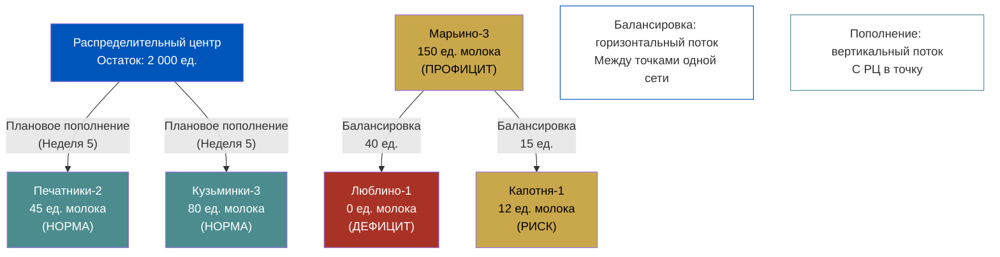
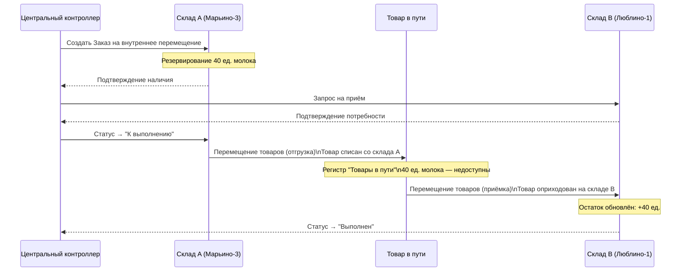
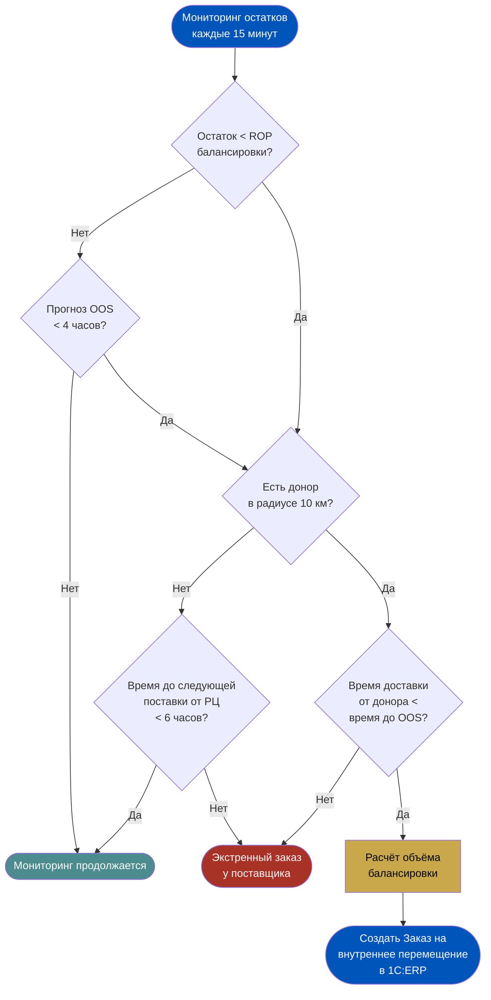
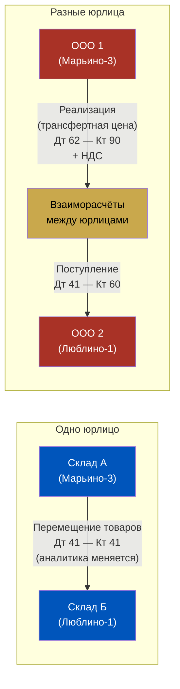
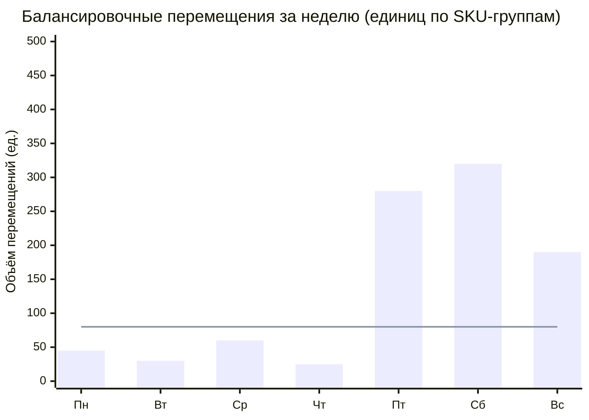

# Неделя 7. День 1. Балансировка стока: как ERP управляет сетью даркстторов

> **Цель урока:** понять механику балансировки товарных остатков между локациями сети в 1C:ERP 2.5 — от логики принятия решения до финансового учёта и проектирования системы.
>
> **Компетенции:** после урока вы сможете спроектировать схему балансировки для сети даркстторов, объяснить документальный поток в ERP, выбрать правильные метрики и настроить триггеры балансировочных операций.
>
> **Время:** 45–55 минут

---

## Содержание

1. [[#Часть 1. Что такое балансировка стока в контексте сети даркстторов]]
2. [[#Часть 2. Документы балансировки в 1C ERP 2.5]]
3. [[#Часть 3. Алгоритм принятия решения о балансировке]]
4. [[#Часть 4. Сезонность и ситуативные перетоки]]
5. [[#Часть 5. Финансовые и учётные аспекты балансировки]]
6. [[#Часть 6. Метрики балансировки как KPI]]
7. [[#Часть 7. Проектирование системы балансировки — чеклист продакта]]

---

## Часть 1. Что такое балансировка стока в контексте сети даркстторов

Представьте вторник, 9:00 утра. В даркстторе «Марьино-3» на полке стоит 150 упаковок молока 3,2%. Спрос вялый — рабочий день, квартал преимущественно офисный, утренние покупки минимальны. В пяти километрах, в даркстторе «Люблино-1», молока нет вообще. Ноль. Последняя упаковка ушла в 8:47, и следующая поставка от поставщика ожидается только в четверг.

С точки зрения бизнеса это не две отдельные проблемы — это одна проблема с двумя симптомами. Профицит в одной точке и дефицит в другой — это разбалансированная сеть. И задача балансировки стока — превратить эту разбалансированную сеть в сбалансированную, перераспределив запасы там, где это имеет смысл.

Эта тема — одна из тех, где разрыв между «понимаю теоретически» и «умею настроить в ERP» особенно велик. Многие Product Manager'ы работают с балансировкой на уровне «попросил аналитика сделать выгрузку, посмотрел — что-то не так, написал в Slack складскому менеджеру». Цель этого урока — дать вам инструменты для системного подхода: понять, что именно в ERP отвечает за балансировку, как настраиваются правила, и как измерять эффективность системы.

**Балансировка стока** — это операция планового или реактивного перераспределения товарных остатков между локациями сети без привлечения внешнего поставщика. Ключевое слово здесь — «сети». Один склад не балансируется. Балансировка имеет смысл только тогда, когда у вас есть как минимум две точки с разными уровнями остатков и физическая возможность перемещения товара между ними за приемлемое время.

Важно с самого начала зафиксировать терминологию, потому что в разных компаниях слово «балансировка» означает разное. В одних — это только горизонтальные потоки между даркстторами. В других — любые межскладские перемещения, включая пополнение с РЦ. В контексте этого урока мы говорим строго о горизонтальных потоках: между точками одного уровня сети, без участия центрального склада.

**Чем балансировка отличается от обычного межскладского перемещения?**

На Неделе 5, День 1 мы разбирали межскладское перемещение как плановую операцию — когда центральный склад (или распределительный центр) отправляет товар в точки продаж согласно заявке или расписанию. Это пополнение: поток всегда идёт сверху вниз, от большего запаса к меньшему, по заранее определённой схеме.

Балансировка — другая история. Здесь поток может идти в любом направлении: из точки A в точку B сегодня, а завтра — из B в C и обратно из C в A. Инициатором может быть как центральная система управления, так и сам менеджер локации. И самое главное: балансировка — это реакция на отклонение от нормального состояния сети, а не плановое пополнение по графику.

Различие важно не только концептуально, но и практически — в ERP эти операции оформляются разными документами и проходят через разные регистры учёта.



Посмотрите на диаграмму выше. Плановые пополнения идут вертикально — с распределительного центра в нормальные точки. Балансировка идёт горизонтально — между самими даркстторами. Марьино-3, у которого 150 единиц, делится с Люблино-1 и Капотней-1. Это и есть суть операции.

**Почему балансировка критична для Q-commerce?**

В традиционном ритейле срок доставки — 1–3 дня. Даже если у вас закончился товар, клиент вернётся или закажет на следующий день. В Q-commerce окно ожидания — 15–45 минут. Если товара нет прямо сейчас в ближайшем даркстторе, заказ либо не оформляется (клиент видит «нет в наличии»), либо уходит к конкуренту.

При этом сеть из 50 даркстторов в одном городе — это не 50 независимых магазинов. Это единый запас, физически распределённый по 50 точкам. Балансировка — механизм, который позволяет этой сети вести себя как единый организм, а не как набор изолированных ячеек.

**Цена балансировки и цена её отсутствия**

Любое перемещение товара стоит денег. Курьер, топливо, время операторов складов. В Q-commerce, где маржа на продуктах питания составляет 20–35%, а каждая доставка уже «съедает» значительную часть маржи — лишняя поездка ради балансировки должна быть экономически оправдана.

Ориентир: балансировка оправдана, если выручка от «спасённых» заказов (тех, что ушли бы в OOS без перемещения) превышает стоимость транспортировки с коэффициентом не менее 1,5. Иными словами, если транспортировка стоит 500 рублей, а спасённые продажи принесут менее 750 рублей маржи — балансировка нерентабельна в этом конкретном случае, и лучше ждать планового пополнения.

Именно поэтому автоматизированная балансировка всегда должна содержать экономический фильтр — ERP или внешняя система должна считать не только «нужен ли товар», но и «стоит ли его везти».

---

## Часть 2. Документы балансировки в 1C:ERP 2.5

Если балансировка — это управленческое решение, то документы в ERP — это язык, на котором это решение записывается в учётную систему. Разберём этот язык детально.

**«Заказ на перемещение» как главный инструмент**

В 1C:ERP 2.5 балансировка оформляется через документ «Заказ на перемещение» (в интерфейсе — раздел «Склад и доставка» → «Внутренние перемещения»). Это плановый документ: он фиксирует намерение переместить товар, но не само физическое движение.

Структура документа:
- **Склад-отправитель** — локация, с которой уходит товар
- **Склад-получатель** — локация, которая принимает товар
- **Номенклатура и количество** — что и сколько перемещаем
- **Дата и время планируемого перемещения** — когда это должно произойти
- **Статус** — «Не согласован» / «Согласован» / «К выполнению» / «Выполнен»

Сам по себе «Заказ на перемещение» не двигает товар по регистрам. Он только резервирует товар на складе-отправителе (то есть исключает его из доступного остатка, чтобы другой процесс не захватил те же единицы).

**Разница между «Заказом на перемещение» и «Перемещением товаров»**

Это классическая ловушка для новичков в ERP-проектировании. Путаница между этими двумя документами приводит к тому, что в системе фиксируется «товар нигде» или «товар везде одновременно».

«Заказ на перемещение» — это план. Он говорит: «Мы собираемся переместить X единиц товара Y из склада A в склад B». Товар при этом физически никуда не движется.

«Перемещение товаров» — это факт. Он говорит: «Товар X в количестве Y фактически отгружен со склада A и принят на складе B». Именно этот документ меняет регистры остатков.

Между этими двумя документами существует статус-переходный объект — регистр «Товары в пути».

**Регистр «Товары в пути» и его особенности**

Когда «Перемещение товаров» проводится в части отгрузки (склад A физически отдал товар курьеру-балансировщику), но склад B ещё не принял его, товар оказывается в промежуточном состоянии. В ERP 2.5 этот момент фиксируется в регистре накопления «Товары организаций» с аналитикой «В пути» — специальным признаком, который сигнализирует: товар существует, он ваш, но физически он между двумя точками.

Почему это важно? Потому что:
1. Такой товар не может быть продан (он недоступен ни на складе A, ни на складе B)
2. Его нельзя зарезервировать под другой заказ
3. Он не учитывается при расчёте обеспеченности склада B, пока не принят

Для Product Manager это означает: если у вас много «товара в пути», ваш Network Fill Rate будет занижен в моменте. Следует учитывать этот лаг при мониторинге дашбордов.

**Статусная модель «Заказа на внутреннее перемещение»**

Документ проходит через несколько состояний, каждое из которых имеет учётное значение:

- **Не согласован** — черновик, никаких изменений в регистрах нет
- **Согласован** — резервирование активировано: товар заблокирован на складе-отправителе
- **К выполнению** — склад-отправитель подтвердил готовность к физической отгрузке
- **Выполнен** — «Перемещение товаров» проведено, остатки обновлены на обоих складах
- **Отменён** — резервирование снято, остаток возвращается в доступный пул

Для Product Manager важен переход «Согласован» → «К выполнению»: именно здесь часто возникает «узкое горлышко» при ручном управлении. Если документ зависает в статусе «Согласован» дольше 30 минут — это индикатор операционной проблемы (склад занят, водитель недоступен, нет согласования).

**Трёхстороннее согласование**

В хорошо настроенной системе балансировки задействованы три роли:

1. **Склад-отправитель** подтверждает наличие товара и физическую возможность отгрузки
2. **Склад-получатель** подтверждает потребность и готовность принять товар
3. **Центральный контроллер** (менеджер по логистике или автоматический алгоритм) финализирует решение и переводит документ в статус «К выполнению»



Обратите внимание на промежуточный этап «Товар в пути» — это не абстракция, а конкретное состояние в регистрах ERP, которое влияет на видимость остатков во всех отчётах системы.

---

## Часть 3. Алгоритм принятия решения о балансировке

Допустим, вы — система управления сетью. Каждую минуту вам приходят данные об остатках по 50 точкам. Как вы решаете, когда и куда нужно перебросить товар?

**Входные данные для принятия решения**

Решение о балансировке — это не просто сравнение двух чисел. Для осмысленного решения нужны три потока данных:

**1. Текущий остаток** — сколько единиц товара прямо сейчас на складе. В ERP это виртуальный склад (регистр «Товары организаций»). Казалось бы, просто. Но «текущий остаток» нужно корректировать на:
- Уже зарезервированные под активные заказы единицы
- Товар в пути (уже ушедший с другого склада, но не принятый)
- Товар, ожидающий приёмки от поставщика

То есть реально доступный остаток = Физический остаток − Резервы − Дефекты на хранении.

**2. Прогноз спроса** — сколько этого товара уйдёт в ближайшие N часов. В Q-commerce горизонт прогноза короткий — 4–8 часов. ERP сама по себе не строит статистические прогнозы (для этого нужна BI-система или внешний ML-сервис), но хранит историю продаж по дням недели, часам и праздникам — данные, на которых строится прогноз.

**3. Время доставки между точками** — сколько времени займёт физическое перемещение товара от донора к реципиенту. Если Марьино-3 → Люблино-1 занимает 45 минут, а дефицит в Люблино-1 ожидается через 30 минут — балансировка уже опоздала.

**Три критерия запуска балансировки**

Балансировка оправдана, если выполнено хотя бы одно из трёх условий:

**Критерий 1: Уровень остатка ниже ROP** — точки заказа (Reorder Point). ROP для балансировки рассчитывается иначе, чем ROP для закупки: он учитывает время доставки от ближайшей точки-донора, а не от поставщика. Обычно это на 30–50% меньше классического ROP закупки.

**Критерий 2: Прогноз OOS в течение N часов** — система предсказывает, что при текущем темпе продаж остаток упадёт до нуля раньше, чем придёт следующее плановое пополнение от РЦ. N для Q-commerce — обычно 2–4 часа.

**Критерий 3: Профицит в соседней локации** — есть точка, у которой товара больше, чем нужно на плановый период, физически близко, и перемещение займёт меньше времени, чем ждать поставку от поставщика.



**Почему ручная балансировка не работает при сети 50+ точек**

Допустим, у вас 50 даркстторов и 3 000 SKU. Это 150 000 пар «точка–товар», которые нужно мониторить каждые 15 минут. Каждую смену. Ни один менеджер физически не может обрабатывать такой поток данных.

Ручная балансировка работает при двух условиях: малое количество точек (до 5–7) и ограниченный ассортимент (до 200–300 SKU). Как только сеть вырастает за эти пределы, нужна автоматизация — либо через встроенные механизмы ERP (правила пополнения между складами), либо через внешнюю систему управления запасами с интеграцией в ERP.

В 1C:ERP 2.5 для автоматизации используется инструмент «Правила пополнения склада» с источником «Другой склад». Система сама создаёт заказы на перемещение, когда остаток падает ниже заданного порога, и указывает склад-донор по заранее настроенным приоритетам.

**Расчёт объёма балансировки: сколько везти?**

Определить момент балансировки — это половина задачи. Вторая половина — сколько именно единиц перевезти. Здесь есть три стратегии:

**«До максимума»**: везём столько, сколько нужно, чтобы довести склад-реципиент до максимального запаса. Простая логика, но риск — создать профицит у реципиента, который потом придётся снова балансировать.

**«До планового уровня»**: везём столько, сколько нужно до следующего планового пополнения с РЦ. Более точный подход, требует знания графика поставок.

**«Только покрытие дефицита»**: везём ровно столько, сколько не хватает до ROP. Минимальный объём, минимальные транспортные расходы, но частые поездки.

В Q-commerce рекомендована комбинация: «покрытие дефицита + 20% буфер» — достаточно, чтобы закрыть текущую нехватку и не создать нового дисбаланса у донора. В ERP параметр «Количество к пополнению» в правиле пополнения склада позволяет задать эту формулу как фиксированное значение или формулу от текущего остатка.

---

## Часть 4. Сезонность и ситуативные перетоки

Балансировка — не только реакция на случившийся дефицит. Самые умные системы балансируют проактивно, опираясь на предсказуемые паттерны спроса.

**Предсказуемые события, меняющие баланс**

Q-commerce живёт в ритме города. И этот ритм удивительно предсказуем, если вы накопили достаточно данных:

**Пятница, 17:00–21:00** — традиционный пик заказов снеков, алкоголя, готовой еды. Даркстторы рядом с жилыми кварталами показывают рост спроса на 40–60% против среднесуточного. Офисные районы — наоборот, падение.

**Дождь** — классический мультипликатор спроса на Q-commerce в целом (+20–35% к среднему), особенно на молочные продукты, хлеб, яйца. Интересно, что дождь снижает мобильность покупателей, концентрируя спрос вблизи жилья — значит, жилые даркстторы получают непропорционально большую нагрузку.

**Футбольный матч** — если в 21:00 по ТВ идёт Лига Чемпионов, за 1–2 часа до этого идёт волна заказов пива, чипсов, закусок. Это настолько предсказуемо, что несколько Q-commerce операторов в России встраивали расписание крупных спортивных событий прямо в систему управления запасами.

**Проактивная балансировка: перемещение до дефицита**

Суть проактивного подхода — переместить товар в точку A не потому что там уже закончилось, а потому что через 3 часа там закончится с высокой вероятностью, а в точке B прямо сейчас есть излишек.

Это меняет экономику балансировки: вы работаете в штатном режиме, без срочности и связанных с ней ошибок. Нет нужды в экстренных поездках — плановое перемещение встраивается в обычный логистический маршрут.

**Роль ERP в фиксации истории событий**

ERP хранит все движения товаров с временными метками. Для системы балансировки это золото: можно построить профиль спроса «пятница + дождь + жилой квартал» по историческим данным за 12 месяцев и применять его как коэффициент к базовому прогнозу.

1C:ERP 2.5 не строит такие модели автоматически — но она хранит данные в регистрах с нужной детализацией. Внешняя BI-система (Power BI, Tableau, собственный аналитический слой) извлекает эти данные и возвращает готовые прогнозные коэффициенты в ERP как параметры планирования.

| Событие | Эффект на спрос | Локации-доноры | Объём переброски |
|---|---|---|---|
| Пятница 17–21 | +50% в жилых зонах | Офисные даркстторы | 20–30% запаса снеки/напитки |
| Дождь (>1 часа) | +30% общий, +50% жилые | Деловые кварталы | 15–25% молоко/хлеб |
| Футбол (матч ТВ) | +80% пиво/снеки за час до | Спальные районы с остатком | 25–40% по категории |
| Праздничный день | +40% по всей сети | РЦ → все точки | Плановое пополнение |
| Понедельник утро | -30% вечерние категории | Жилые точки — к офисам | Готовые завтраки, кофе |

Важный момент для Product Manager: чтобы проактивная балансировка работала, нужно, чтобы ERP умела принимать плановый горизонт события. Это настраивается через «Период планирования» в правилах пополнения склада — вместо стандартного «когда упал ниже ROP» ставим «с учётом прогнозного спроса на X часов».

**Как накапливать паттерны в ERP для будущих прогнозов**

Каждая балансировочная операция должна быть «помечена» в ERP причиной инициации: плановая (по правилу пополнения), проактивная (по событийному прогнозу), реактивная (ручная, после OOS). Это не стандартное поле — нужно добавить пользовательский реквизит в документ «Заказ на перемещение». Зато через 6–12 месяцев у вас будет статистика: какой процент операций был реактивным (это плохо — значит система не справляется с предсказанием), какой — проактивным (это хорошо), и насколько точными оказались проактивные прогнозы (сколько из них реально предотвратили OOS).

Этот массив данных — ценнейший актив для итерации алгоритма: вы видите, где модель ошибается, и корректируете параметры. ERP здесь выступает как база данных обратной связи для системы принятия решений.

---

## Часть 5. Финансовые и учётные аспекты балансировки

До этого момента мы говорили о балансировке как о физическом движении товара. Но ERP — это прежде всего учётная система. И у каждого физического движения есть финансовое отражение.

**Сценарий 1: Балансировка внутри одного юридического лица**

Самый простой случай: все 50 даркстторов принадлежат одной компании — ООО «Q-Speed». Товар перемещается из Марьино-3 в Люблино-1. С финансовой точки зрения это не продажа — не возникает ни выручки, ни НДС, ни прибыли/убытка. Товар просто меняет физическое местонахождение внутри одного юрлица.

В ERP 2.5 это оформляется «Перемещением товаров» между складами одной организации. Бухгалтерская проводка в классической конфигурации: Дт 41.01 (склад-получатель) — Кт 41.01 (склад-отправитель). Счёт тот же, меняется только аналитика — субконто «Склад».

Себестоимость при этом сохраняется: товар переходит по своей исходной стоимости, без переоценки. Важно: если в системе настроен учёт по партиям или FEFO (First Expired — First Out), то при балансировке партия не меняется. Товар, срок годности которого истекает через 5 дней, переехав в другую точку, остаётся с тем же сроком годности и тем же партионным учётом.

**Сценарий 2: Балансировка между разными юридическими лицами**

Представьте сложнее: операционная компания «Q-Speed Марьино» (ООО 1) и «Q-Speed Люблино» (ООО 2) — разные юрлица, объединённые под одним брендом. Это типичная ситуация для франчайзинговых сетей или холдинговых структур.

Здесь балансировка уже не «перемещение» — это продажа от ООО 1 к ООО 2 по трансфертной цене. Возникает:
- НДС (если обе компании на ОСНО)
- Трансфертная цена (обычно = себестоимость + небольшая наценка)
- Документы: счёт-фактура, ТОРГ-12 или УПД

В ERP 2.5 это оформляется через документ «Реализация товаров и услуг» от имени ООО 1 и «Приобретение товаров и услуг» от имени ООО 2. Автоматически формируются все необходимые регламентированные документы.



**FEFO при балансировке: нюанс, который часто упускают**

Молочная продукция, мясо, свежие овощи — товары с ограниченным сроком годности. При балансировке сети Q-commerce особенно важно соблюдать принцип FEFO: на балансировку нужно отправлять товар с ближайшим сроком годности, не с дальним.

Логика простая: если в Марьино-3 есть молоко со сроком 3 дня и со сроком 7 дней, в Люблино-1 нужно отправить трёхдневное. Иначе трёхдневное молоко останется в Марьино-3 и окажется под риском списания.

В 1C:ERP 2.5 это управляется через настройку «Метод списания» в карточке склада — при включённом FEFO документ перемещения автоматически выберет партию с ближайшим сроком годности. Это работает, только если в системе включён партионный учёт и даты заносятся при поступлении.

---

## Часть 6. Метрики балансировки как KPI

Как понять, что ваша система балансировки работает хорошо? Нужны правильные метрики — не те, что просто «выглядят красиво» на дашборде, а те, что реально отражают эффективность перераспределения.

**Network Fill Rate vs Local Fill Rate**

**Local Fill Rate (LFR)** — доля заказов, полностью удовлетворённых из остатков конкретной точки. Если в Люблино-1 выполнено 90% заказов без отмен — LFR = 90%. Это стандартная метрика для одной точки.

**Network Fill Rate (NFR)** — доля заказов, которые теоретически могли бы быть выполнены, если бы вся сеть работала как единый склад. NFR всегда >= LFR. Разрыв между NFR и LFR — это потенциал балансировки: сколько заказов было потеряно не потому что товара не было в сети, а потому что он лежал не в той точке.

Пример: LFR = 91%, NFR = 97%. Это значит, что 6% заказов были потеряны из-за несовершенства балансировки — товар был в сети, но не там, где был нужен клиент.

**Транспортные расходы на балансировку — скрытая статья**

Каждая балансировка стоит денег. Курьер, который везёт молоко из Марьино в Люблино, мог бы доставлять заказы клиентам. Или это отдельный водитель-экспедитор — дополнительная статья расходов.

Типичная ошибка: оценивать балансировку только по улучшению Fill Rate, не считая транспортные расходы. Балансировка оправдана тогда, когда стоимость потерянных продаж из-за OOS превышает стоимость транспортировки.

| Метрика | Формула | Целевое значение Q-com | Красный флаг |
|---|---|---|---|
| Network Fill Rate | Выполненные заказы / Все возможные заказы при идеальной балансировке | ≥ 97% | < 93% |
| Local Fill Rate | Выполненные заказы точки / Все заказы точки | ≥ 92% | < 87% |
| Балансировка / OOS | Транспорт на балансировку / Выручка от спасённых заказов | < 1 (расходы < дохода) | > 1,2 |
| Оборачиваемость «товара в пути» | Ср. время в статусе «в пути» | < 90 минут | > 3 часов |
| Доля проактивной балансировки | Проактивные перемещения / Все перемещения | ≥ 60% | < 30% |

**Отчёт «Движение товаров между складами» в ERP**

В 1C:ERP 2.5 есть стандартный отчёт «Движение товаров между складами» (раздел «Склад и доставка» → «Отчёты»). Он показывает:
- Все перемещения за период с разбивкой по парам «склад-отправитель / склад-получатель»
- Номенклатуру, количество и стоимость каждого перемещения
- Среднее время между созданием «Заказа на перемещение» и его выполнением

Для Product Manager этот отчёт — основа аудита балансировочной системы. Если вы видите, что 80% перемещений идут из одних и тех же двух точек-доноров — это сигнал, что сеть структурно разбалансирована, и нужно пересматривать плановые объёмы пополнения с РЦ, а не только настройки балансировки.

**Метрика «возраст балансировочного решения»**

Есть ещё одна метрика, которую редко включают в стандартные дашборды, но которая крайне информативна: среднее время от момента выявления дисбаланса (остаток упал ниже ROP) до момента фактического перемещения товара. Назовём её «возраст балансировочного решения».

Если это время составляет 3–4 часа при среднем времени доставки между точками в 40 минут — значит, 2–3 часа товар «ждёт» согласований, назначения водителя, оформления документов. В Q-commerce 3 часа = потерянные заказы. Эта метрика — прямой индикатор операционных проблем в процессе балансировки, которые ERP помогает выявить, но не решает сама по себе.

---

## Часть 7. Проектирование системы балансировки: чеклист продакта

Мы прошли весь путь — от управленческой логики до документов ERP и метрик. Теперь собираем всё в практический чеклист: что нужно сделать, чтобы система балансировки реально работала.

**Шаг 1: Настройка складской структуры в ERP**

Каждая точка должна быть зарегистрирована как отдельный склад (или зона хранения) в справочнике «Склады». Ключевые параметры:
- Включён партионный учёт (необходим для FEFO)
- Настроен метод списания по срокам годности
- Задан адрес и координаты (для расчёта расстояний во внешней системе маршрутизации)

**Шаг 2: Настройка правил пополнения**

Для каждой пары «товар–склад» нужны параметры:
- ROP балансировки (отличается от ROP закупки)
- Максимальный запас (чтобы не создавать профицит в принимающей точке)
- Список складов-доноров в порядке приоритета
- Минимальный объём перемещения (нет смысла ехать за 3 упаковками)

**Шаг 3: Разграничение ролей и прав**

В ERP нужно настроить:
- Кто может создавать «Заказ на перемещение» (менеджер сети, автоматическая служба)
- Кто утверждает (логист, старший менеджер)
- Кто проводит факт отгрузки и приёмки (складские операторы точек)

**Шаг 4: Интеграция с системой прогнозирования**

ERP принимает прогнозные данные как параметр «Плановый спрос на период». Это может быть:
- Ручной ввод менеджером
- Автоматическая загрузка из внешней BI-системы через API или импорт файла

Здесь важно понимать техническую ограниченность: ERP хранит исторические данные продаж, но алгоритм прогноза — это не её сильная сторона. Правильная архитектура — отдельная аналитическая система (ML-пайплайн, BI с предиктивными моделями), которая строит прогноз на основе выгрузки из ERP и затем загружает плановые цифры обратно. ERP в этой схеме — источник правды о прошлом и исполнитель решений о будущем, но не генератор прогноза.

**Шаг 5: Мониторинг и алертинг**

Настройте автоматические уведомления в ERP (механизм «Бизнес-событий») на:
- Остаток ниже ROP балансировки
- «Заказ на перемещение» не выполнен в течение N минут
- Товар в пути более X часов без подтверждения приёмки

Механизм «Бизнес-событий» в 1C:ERP 2.5 позволяет настроить уведомления без программирования: через конструктор условий указывается объект мониторинга, условие срабатывания и адресат (email, push, запись в задачу). Например: «Если на складе Люблино-1 остаток SKU "Молоко 3,2% Простоквашино 1л" упал ниже 10 ед. — создать задачу менеджеру по балансировке».

**Шаг 6: Тестирование системы перед запуском**

Перед тем как включить автоматическую балансировку в боевом режиме, обязательно нужен «теневой» период: алгоритм работает и создаёт заказы на перемещение, но они не выполняются автоматически — менеджер видит их, оценивает корректность и вручную утверждает или отклоняет. Это позволяет поймать ошибки в настройке порогов без реальных последствий для склада.

Типичная продолжительность теневого периода — 2–3 рабочих недели, покрывающие как минимум один «пиковый» эпизод (выходные, праздники, дождливый день).

**Порог остатка для триггера: как определить для каждой категории**

Универсального порога нет. Для молока с оборачиваемостью 3 раза в день порог будет 30–40% дневного объёма продаж. Для медленно оборачивающегося товара (специи, редкие соусы) — иначе: балансировка может вообще не применяться, выгоднее держать небольшой страховой запас на каждой точке.

Подход к расчёту порога:

```
ROP_балансировки = Среднечасовой спрос × Время доставки между точками × Коэффициент вариации спроса
```

Например: молоко продаётся со скоростью 8 упаковок в час, время доставки между двумя даркстторами — 40 минут (0,67 часа), коэффициент вариации (нестабильность спроса) — 1,3. Тогда ROP = 8 × 0,67 × 1,3 ≈ 7 упаковок. То есть балансировочный алерт должен срабатывать при остатке ниже 7 единиц.

**Связь с Неделей 3 (закупки): балансировка как альтернатива дозакупке**

Балансировка дешевле экстренной закупки почти всегда — если у вас есть сеть. Экстренная закупка: надбавка к цене 10–25%, нарушение графика поставок, риск избыточного пополнения. Балансировка: транспортные расходы + небольшой административный ресурс.

Практическое правило: если до следующей плановой поставки от РЦ меньше 6 часов и в сети есть донор — балансируй. Если больше 6 часов и донора нет — заказывай экстренно.

Ещё один важный угол зрения: балансировка помогает избежать «двойного заказа». Без балансировки менеджер каждой точки видит дефицит у себя и заказывает у поставщика. Итог — через 24 часа у нескольких точек одновременно профицит, потому что каждая заказала «на всякий случай». Балансировка разрывает этот цикл: сначала перераспределяем то, что есть в сети, и только потом — дозаказываем реальную нехватку.

| Архитектурное решение | Опция А | Опция Б | Рекомендация |
|---|---|---|---|
| Инициатор балансировки | Ручной (менеджер) | Автоматический (правила ERP) | Автомат + ручная коррекция |
| Порог для триггера | Фиксированный (ед.) | Динамический (% от прогноза) | Динамический |
| Донор по умолчанию | Ближайший географически | Наибольший профицит | Профицит × расстояние |
| Учёт юрлиц | Единое юрлицо | Разные юрлица | Зависит от структуры холдинга |
| FEFO при балансировке | Включён | Выключен | Всегда включать для скоропорта |
| Мониторинг «товара в пути» | Ручной отчёт | Автоматический алерт | Алерт на задержку >2 часов |

Балансировка — это не функция склада. Это функция всей сети. Product Manager, который понимает её механику, видит в каждой метрике Fill Rate не просто число, а отражение десятков маленьких решений: правильно ли настроены пороги, корректно ли работает FEFO, не залёг ли товар в пути. Именно это понимание отличает проектирование системы от её использования.

**Главный вопрос на следующей встрече с командой**

После того как вы выстроили систему балансировки, есть один вопрос, который стоит задавать на еженедельном ревью: «Сколько заказов на прошлой неделе было спасено балансировкой, и сколько из них мы должны были предотвратить проактивно, но не предотвратили?» Первое число показывает ценность системы. Второе — её потенциал для улучшения. ERP даёт данные для обоих ответов. Вопрос — задаёте ли вы его достаточно регулярно.

В следующем уроке мы выйдем за пределы склада и посмотрим, что происходит после того, как товар покинул даркстор и оказался в руках курьера — как ERP управляет последней милей и где заканчивается её ответственность.

Балансировка и доставка — две стороны одной медали: первая обеспечивает, чтобы товар был в правильной точке, вторая — чтобы он добрался от этой точки до клиента. Вместе они образуют операционный скелет Q-commerce.

---

**Ключевые термины урока:**
- **Балансировка стока** — горизонтальное перераспределение товаров между локациями сети
- **Заказ на внутреннее перемещение** — плановый документ ERP, инициирует балансировочную операцию
- **Товар в пути** — состояние регистра между отгрузкой с донора и приёмкой реципиентом
- **Network Fill Rate** — доля удовлетворённых заказов при условии идеальной балансировки всей сети
- **ROP балансировки** — точка заказа, специфичная для балансировочного триггера (ниже ROP закупки)

---


---

### Динамика балансировки за неделю: пример

Пример недельного цикла балансировки для сети из 5 даркстторов:



*Красная линия — плановый порог балансировки. Пятница и суббота резко превышают норму: промо-акции и событийный спрос требуют экстренной балансировки. В идеальной архитектуре система должна начинать проактивную балансировку уже в четверг вечером, предвосхищая пиковый спрос.*


← [[Неделя 6 - День 7 - История Яндекс Лавки|← Неделя 6. День 7]] | [[1c_erp_qcom/README|Оглавление]] | [[Неделя 7 - День 2 - Интеграция курьерской доставки|День 2 →]]
