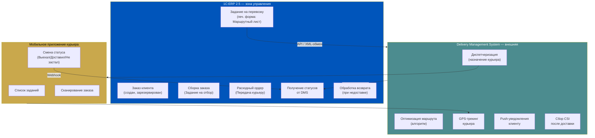
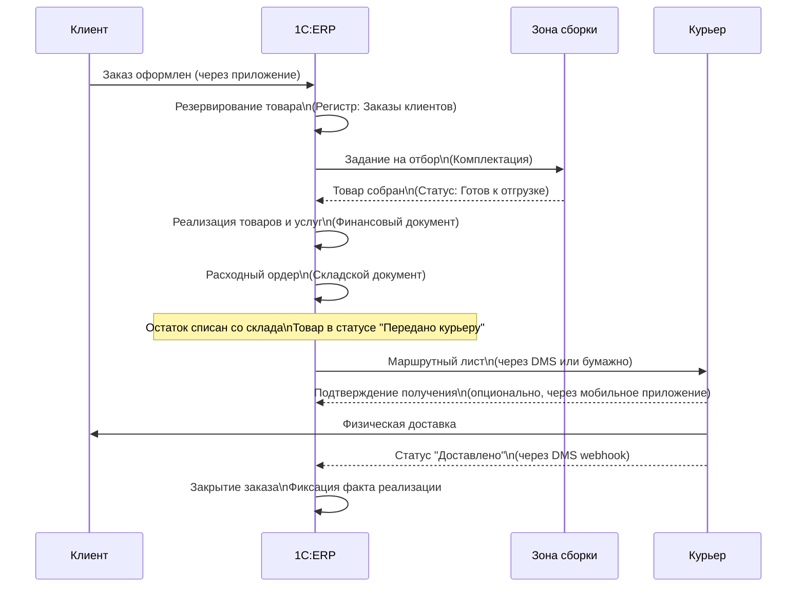
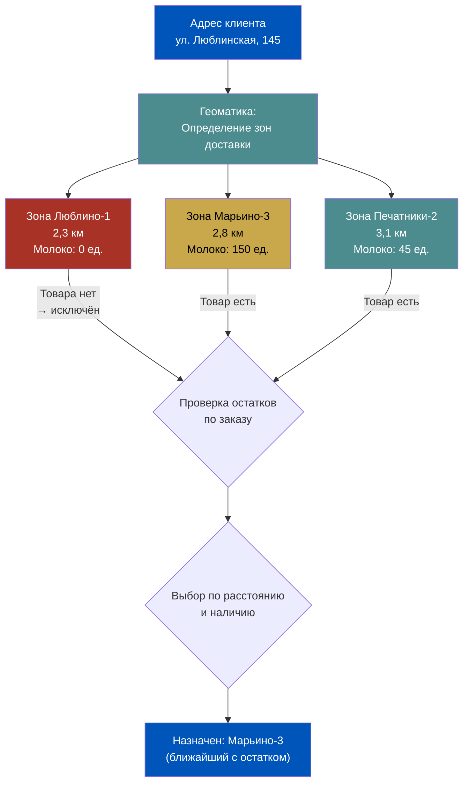
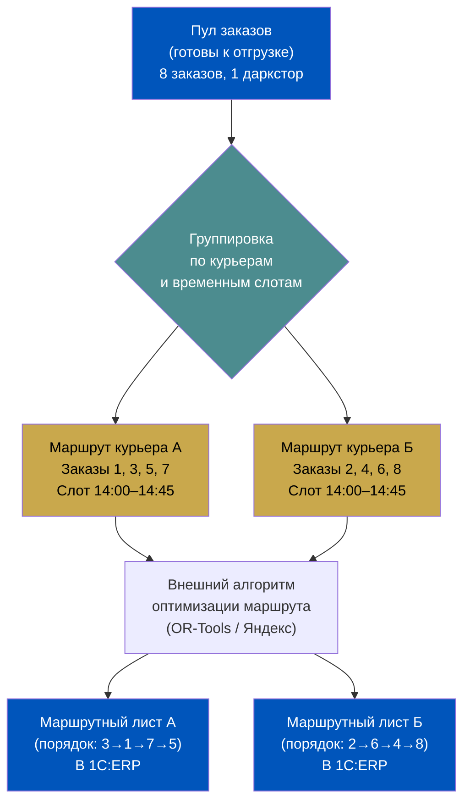
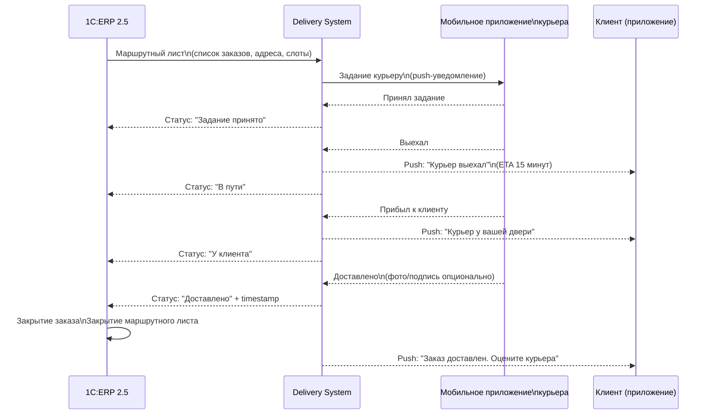
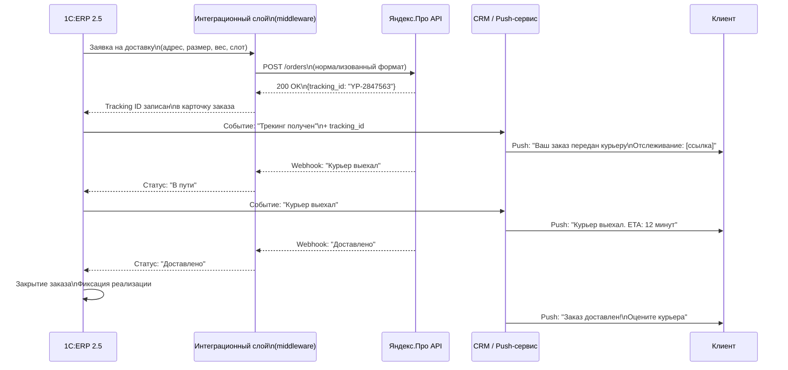

# Неделя 7. День 2. Интеграция курьерской доставки: где заканчивается ERP и начинается последняя миля

> **Цель урока:** понять архитектуру взаимодействия 1C:ERP 2.5 с системой доставки — от передачи заказа курьеру до документального оформления недоставки и интеграции с внешними курьерскими сервисами.
>
> **Компетенции:** после урока вы сможете спроектировать документальный поток «от склада до клиента», описать статусную модель доставки в ERP, корректно обработать сценарии недоставки и выбрать схему работы с внешними курьерскими партнёрами.
>
> **Время:** 50–60 минут

---

## Содержание

1. [[#Часть 1. Связь ERP с последней милей — архитектурный обзор]]
2. [[#Часть 2. Документ «Расходный ордер» и передача товара курьеру]]
3. [[#Часть 3. Зоны доставки и геоматика в ERP]]
4. [[#Часть 4. Задание на перевозку: от одного заказа до батча курьера]]
5. [[#Часть 5. Статусы доставки и синхронизация с мобильным приложением]]
6. [[#Часть 6. Недоставка и возврат — что происходит в ERP]]
7. [[#Часть 7. Интеграция с внешними курьерскими сервисами]]

---

## Часть 1. Связь ERP с последней милей: архитектурный обзор

Есть соблазн думать, что ERP управляет всем — от создания заказа клиентом до момента, когда курьер нажимает кнопку «Доставлено» в телефоне. Это не так. И понимание реальной границы ответственности ERP — первый шаг к правильному проектированию системы.

**Граница ответственности ERP**

1C:ERP 2.5 хорошо справляется с тем, что происходит внутри четырёх стен даркстора: резервирование товара, сборка заказа, списание с остатков, оформление документов. Как только товар оказался в руках курьера и вышел за дверь даркстора — начинается зона, где ERP работает в режиме «получатель событий», а не активный управляющий.

Что **ERP делает хорошо** в контексте доставки:
- Формирует документы передачи товара (расходный ордер, маршрутный лист)
- Фиксирует статусные переходы, полученные от внешней системы
- Обрабатывает сценарии недоставки и возврата
- Ведёт финансовый учёт по каждому заказу

Что **находится за пределами ERP**:
- GPS-трекинг курьера в реальном времени
- Push-уведомления клиенту («курьер выехал», «курьер у двери»)
- Оптимизация маршрута с учётом пробок
- Рейтинг CSI (Customer Satisfaction Index) по конкретной доставке
- Управление загрузкой курьеров (диспетчеризация)

Для этих задач нужна отдельная система — Delivery Management System (DMS) или TMS (Transportation Management System). ERP и DMS работают в паре: ERP создаёт «задание» для DMS, DMS выполняет физическую доставку и возвращает в ERP результат.



Обратите внимание на интерфейс между слоями. Маршрутный лист из ERP уходит в DMS через API или файловый обмен. Статусы возвращаются обратно — через тот же канал. Это двунаправленная интеграция, и её надёжность напрямую влияет на качество данных в ERP.

**Точка интерфейса: документ «Задание на перевозку»**

В 1C:ERP 2.5 существует объект, который является официальной «точкой передачи управления» от ERP к системе доставки. Официальное название документа — «Задание на перевозку» (раздел «Склад и доставка»). Из него распечатывается «Маршрутный лист» — печатная форма документа. В документе зафиксированы: транспортное средство, состав распоряжений на доставку, адреса, временные окна и статус выполнения.

Пока этот документ не создан и не передан, товар с точки зрения ERP ещё «на складе». Как только документ создан и передан — начинается процесс доставки.

---

## Часть 2. Документ «Расходный ордер» и передача товара курьеру

Между моментом, когда заказ собран на складе, и моментом, когда курьер взял его в руки, в ERP происходит важный документальный переход. Это один из самых деликатных моментов в учёте Q-commerce, потому что именно здесь часто возникают расхождения между физическим и учётным состоянием товара.

**Расходный ордер как документ физической отгрузки**

«Расходный ордер» (в ERP 2.5 — складской ордер на отгрузку) фиксирует физическое выбытие товара со склада. Это не то же самое, что «Реализация товаров» — финансовый документ. В схеме с ордерным документооборотом они разделены намеренно:

- **Реализация товаров и услуг** — финансовый документ, фиксирует выручку, НДС, себестоимость. Может быть создан заранее или одновременно со сборкой.
- **Расходный ордер** — складской документ, фиксирует физическое перемещение товара из зоны хранения в зону отгрузки/передачи курьеру.

Почему разделение важно? Потому что финансовая реализация и физическая отгрузка могут происходить в разное время. В Q-commerce обычно оба документа формируются одновременно в момент передачи курьеру, но при интеграции с внешними платёжными системами и постоплатой картой при получении — возникают нюансы.

**Связь документов: от заказа до передачи курьеру**



**Статус «Передано курьеру»: что происходит с регистрами**

Когда расходный ордер проведён, в регистрах ERP происходит следующее:

1. **Регистр «Товары организаций»** — остаток на складе уменьшается. Товар физически больше не на складе.
2. **Регистр «Заказы клиентов»** — заказ переходит в статус отгруженного.
3. **Регистр расчётов с клиентами** — фиксируется задолженность покупателя (если постоплата) или погашение аванса (если предоплата).

**Кто несёт ответственность за товар между передачей курьеру и доставкой клиенту?**

Это юридически острый вопрос. С точки зрения бухгалтерского учёта, в момент оформления расходного ордера товар выбывает с баланса склада. Если курьер потерял или повредил товар — это убыток, который нужно оформить отдельным документом (акт о потере/порче).

В операционной практике Q-commerce этот риск минимизируется:
- Курьеры работают за фиксированную ставку + бонус, а не на комиссионной основе
- Потери покрываются страхованием или фондом операционных потерь
- Маршруты короткие (15–45 минут), вероятность утери мала

Тем не менее, для учёта этих случаев в ERP нужна настроенная схема оформления — документ «Списание товаров» с аналитикой «Потери при доставке».

---

## Часть 3. Зоны доставки и геоматика в ERP

Когда клиент оформляет заказ, система должна мгновенно ответить на вопрос: «Из какого даркстора мы доставим этот заказ?» Это не тривиальная задача — особенно в плотной городской сети, где зоны обслуживания соседних даркстторов перекрываются.

**Как ERP хранит зоны доставки**

В 1C:ERP 2.5 существует справочник «Зоны доставки» — набор именованных географических областей, каждая из которых привязана к одному или нескольким складам (даркстторам). Структура проста:

- **Зона доставки** (например, «Юго-Восток ЦАО», «Марьино-север»)
- **Привязанный склад** — даркстор, который обслуживает эту зону
- **Параметры зоны** — максимальное расстояние, стоимость доставки, доступные временные слоты

Адрес клиента при оформлении заказа сопоставляется с зонами доставки. На выходе — конкретный склад, который должен выполнить заказ.

**Проблема перекрывающихся зон**

В реальной городской сети зоны соседних точек пересекаются. Клиент по адресу «ул. Люблинская, 145» теоретически может быть обслужен и из Люблино-1 (2,3 км), и из Марьино-3 (2,8 км), и из Печатников-2 (3,1 км).

Как решить? В ERP настраивается приоритет: если несколько зон покрывают адрес клиента, система выбирает склад по правилу:
1. Минимальное расстояние (если позволяют остатки)
2. Максимальный уровень остатка нужного товара
3. Минимальное время доставки (учитывает загрузку курьеров)

Первые два критерия ERP оценивает самостоятельно. Третий требует данных от DMS о текущей загрузке.



**Слот доставки**

В Q-commerce временные слоты — это не просто «удобное время для клиента». Это инструмент управления нагрузкой на курьеров. ERP управляет слотами через следующую логику:

- Каждый слот имеет ёмкость (например, не более 8 заказов)
- Когда ёмкость слота достигнута, он закрывается для новых заказов
- Смежные слоты могут иметь разную ёмкость в зависимости от прогнозируемой нагрузки

В ERP 2.5 управление слотами реализовано через справочник «Временные окна доставки» с привязкой к зоне доставки и дате. Автоматическое открытие/закрытие слотов при достижении ёмкости — это бизнес-логика, которая реализуется либо штатно через настройки ERP, либо через внешнюю систему с обратной синхронизацией.

---

## Часть 4. Задание на перевозку: от одного заказа до батча курьера

Один курьер за смену делает не один заказ. Типичная смена в Q-commerce — 30–50 доставок. Но каждый отдельный заказ создаётся клиентом независимо, в случайный момент времени. Как из потока отдельных заказов получается связный маршрут курьера?

**Документ «Задание на перевозку» в ERP**

> **Терминология:** Официальное название документа в 1С:ERP 2.5 — **«Задание на перевозку»** (раздел «Склад и доставка»). В профессиональной практике и в этом уроке используется термин «Маршрутный лист» — это название **печатной формы**, которая распечатывается из Задания на перевозку. В интерфейсе ERP и документации ИТС — «Задание на перевозку».

«Задание на перевозку» (печатная форма — «Маршрутный лист») — это агрегирующий документ, который объединяет несколько распоряжений на доставку в один рейс. Структура документа:

- **Курьер** — конкретный сотрудник или внешний исполнитель
- **Транспортное средство** (если применимо)
- **Список заказов** — очерёдность доставки, адреса, временные окна
- **Дата и смена** — привязка к рабочей смене
- **Статус** — «Формируется» → «К погрузке» → «Отправлено» → «Закрыто»

Каждый заказ в маршрутном листе имеет свой статус независимо. Это критически важно: маршрутный лист может быть «Частично выполнен», если одни заказы доставлены, а другие — нет.

**Оптимизация маршрута: граница ERP**

Порядок заказов в маршрутном листе — это оптимизация маршрута. ERP 2.5 умеет делать простую оптимизацию по географическому принципу (ближайший следующий адрес), но серьёзную оптимизацию с учётом пробок, временных окон и загрузки дорог — нет. Для этого нужен внешний алгоритм (Google OR-Tools, Яндекс.Маршрутизация и аналоги).

Типичная схема: ERP формирует пул заказов → внешний алгоритм оптимизирует маршрут → оптимизированный порядок возвращается в ERP и фиксируется в маршрутном листе.



**Проблема: один отменённый заказ в маршруте**

Клиент отменил заказ после того, как маршрутный лист уже сформирован и курьер выехал. Что происходит в ERP?

1. Заказ в ERP переводится в статус «Отменён»
2. В маршрутном листе этот заказ помечается как «Исключён»
3. **Критично:** товар, который курьер уже везёт, нужно вернуть на склад. Если курьер его ещё не забрал — он остаётся на складе, расходный ордер сторнируется. Если забрал — нужен акт возврата.
4. Маршрут пересчитывается — оставшиеся заказы идут без отменённого.

В идеальной системе пересчёт маршрута при отмене происходит автоматически через внешний алгоритм маршрутизации. В ERP это информационное событие — система фиксирует факт, но не управляет перестройкой маршрута.

**Проблема батчинга: когда объединять заказы в один маршрут?**

Слишком ранний батчинг: маршрут формируется, пока ещё поступают заказы — и в него не попадают заказы, созданные через 5 минут после формирования. Слишком поздний: курьер стоит и ждёт, пока наберётся достаточно заказов, — и вы нарушаете SLA.

Решение — «скользящее окно батчинга»: каждые N минут система формирует маршрутные листы из накопившихся заказов, не ожидая «полного» набора. N для Q-commerce — обычно 3–5 минут.

---

## Часть 5. Статусы доставки и синхронизация с мобильным приложением

В Неделе 6, День 2 мы разбирали статусную модель заказа внутри даркстора. Сейчас посмотрим на то, что происходит со статусами после того, как заказ вышел за дверь.

**Цепочка статусов доставки**

В типичной Q-commerce системе статусы после «Передано курьеру» выглядят так:

| Статус | Кто инициирует | Что фиксирует ERP |
|---|---|---|
| Курьер принял задание | Мобильное приложение курьера | Время принятия в маршрутный лист |
| Курьер выехал | Мобильное приложение | Время начала маршрута |
| Курьер у двери | Мобильное приложение (геозона) | Время прибытия к клиенту |
| Доставлено | Курьер вручную или автоматически | Факт выполнения, время |
| Не застал | Курьер вручную | Начало сценария недоставки |
| Клиент отказался | Курьер вручную | Начало сценария отказа |

Откуда берутся эти статусы? Мобильное приложение курьера — это источник. Курьер нажимает кнопку «Доставил» → приложение отправляет webhook в DMS → DMS передаёт событие в ERP → ERP обновляет статус маршрутного листа и связанного заказа.

**Двунаправленный обмен**



**Проблема рассинхронизации**

Курьер нажал «Доставлено» в приложении. Приложение отправило webhook в DMS. Но интернет в подвальном паркинге пропал, и webhook не дошёл до ERP. Курьер уже на следующем адресе, DMS считает заказ выполненным, а ERP — нет.

Это не экзотическая ситуация — в реальных Q-commerce системах такие случаи составляют 0,5–2% от доставок. Последствия:
- Клиент получил заказ, но ERP не закрыла его — нет факта реализации
- Остаток в ERP не списан (если ордер проводится по факту доставки, а не передачи курьеру)
- Финансовая отчётность за смену содержит незакрытые заказы

Решение — механизм «идемпотентной синхронизации»: каждые N минут DMS проверяет список «отправленных в ERP событий» и повторно отправляет незафиксированные. ERP принимает дубли спокойно (если статус уже «Доставлено» — повторное событие игнорируется).

---

## Часть 6. Недоставка и возврат: что происходит в ERP

Никакая Q-commerce система не работает с Fill Rate 100%. Курьер позвонил — клиент не ответил. Клиент отказался от заказа на пороге. Собака испугала курьера. Причины разные, а документальный процесс в ERP — один.

**Сценарий «Не застал»**

Курьер приехал по адресу, звонил 3 минуты — никто не открыл. Действия в системе:

1. Курьер отмечает в мобильном приложении «Не застал» с временной отметкой
2. DMS передаёт событие в ERP
3. В ERP заказ переходит в статус «Попытка доставки совершена»
4. Запускается бизнес-процесс: попытка связаться с клиентом (обычно через call-center или push-уведомление)
5. Если клиент недоступен N минут — заказ автоматически отменяется

**Сценарий «Клиент отказался»**

Клиент открыл дверь, но отказался принять заказ. Это другой сценарий: физически курьер у клиента, товар передаётся обратно курьеру.

**Документальное оформление возврата**

```mermaid
flowchart TD
    Start(["Недоставка\n(Не застал / Отказ)"])
    style Start fill:#A93226,color:#fff

    Check{"Товар у курьера?"}
    Start --> Check

    YesCourier["Товар физически\nу курьера"]
    NoCourier["Товар остался\nна складе"]
    Check -->|Да| YesCourier
    Check -->|Нет\n(не успели отдать)| NoCourier

    style YesCourier fill:#C9A84C,color:#000
    style NoCourier fill:#4C8C8F,color:#fff

    NoCourier --> CancelRO["Сторно расходного ордера\nТовар остаётся в остатке"]
    style CancelRO fill:#4C8C8F,color:#fff

    YesCourier --> ReturnRO["Обратный расходный ордер\n(Возврат с курьера на склад)"]
    style ReturnRO fill:#0055BB,color:#fff

    ReturnRO --> Inspect{"Инспекция\nкачества товара"}

    Inspect -->|"Товар в норме"| RestoreStock["Возврат в доступный остаток\nРегистр: +1 ед."]
    Inspect -->|"Товар повреждён\nили истёк срок"| WriteOff["Акт списания\nСтатья: Потери при доставке"]

    RestoreStock --> FinClose["Финансовое закрытие:\nАннулирование реализации\nВозврат ДС клиенту (если предоплата)"]
    WriteOff --> FinClose

    style RestoreStock fill:#4C8C8F,color:#fff
    style WriteOff fill:#A93226,color:#fff
    style FinClose fill:#0055BB,color:#fff
```

**Нужна ли новая инвентаризация при возврате?**

Теоретически — нет. Если возврат оформлен корректно через «Обратный расходный ордер», ERP автоматически восстанавливает остаток. Инвентаризация при каждом возврате — это избыточно и замедляет процесс.

Практически — нужен выборочный контроль. Если в течение смены несколько возвратов, есть риск того, что курьер «доставил» (по своим словам) и вернул товар одновременно — попытка двойного возврата. Поэтому хорошая практика: ежесменная сверка количества физических возвратов с документами в ERP.

**Финансовое закрытие недоставки**

Если клиент оплатил заказ заранее (онлайн-оплата) — нужен возврат денежных средств. В ERP это оформляется документом «Возврат денежных средств покупателю» с привязкой к исходному заказу. Если оплата при получении — просто аннулируется реализация без дополнительных финансовых документов.

Важный учётный момент: себестоимость возвращённого товара. Если молоко уехало с курьером и вернулось через 2 часа — его первоначальная стоимость не изменилась, но срок годности сократился. В системах с партионным учётом этот факт фиксируется автоматически. При возврате в остаток товар попадает с той же датой истечения срока годности, что была при отгрузке.

---

## Часть 7. Интеграция с внешними курьерскими сервисами

До сих пор мы говорили о собственных курьерах. Но реальность Q-commerce сложнее: в пиковые часы или в новых зонах покрытия не хватает своих курьеров. Здесь появляются внешние партнёры — Яндекс.Про, Delivery Club, СДЭК, локальные службы.

**Модель работы с внешним курьерским сервисом**

Когда даркстор «отдаёт» доставку внешнему сервису, с точки зрения ERP это выглядит так:

1. Создаётся «Заявка на доставку» во внешний сервис (это может быть документ в ERP или API-вызов напрямую из интегрированной системы)
2. Внешний сервис принимает заявку и присваивает номер отслеживания (tracking ID)
3. Tracking ID записывается в ERP в карточку заказа
4. Статусы доставки приходят через webhook от внешнего API
5. Документальное закрытие — то же, что при своей доставке, только исполнитель — юридическое лицо внешнего сервиса

**Создание «Заявки на доставку» во внешний сервис**

В 1C:ERP 2.5 нет встроенного коннектора к Яндекс.Про или СДЭК — это нестандартный функционал, который реализуется через модуль интеграции. Типовая архитектура:

- ERP формирует заявку в стандартизированном формате (JSON/XML)
- Интеграционный слой (1С-шина, ESB, самописный middleware) транслирует заявку в формат API партнёра
- Ответ с tracking ID сохраняется в ERP в поле «Внешний номер отслеживания»

**Таблица сравнения: Собственная доставка vs Внешний курьерский сервис**

| Параметр | Собственная доставка | Внешний курьерский сервис |
|---|---|---|
| Интеграция с ERP | Глубокая (статусы, маршруты) | Через API, webhook |
| Скорость статусов | Реалtime (webhook) | Реалtime или с задержкой (зависит от партнёра) |
| Контроль маршрута | Полный (через DMS) | Ограниченный (только tracking) |
| Документы в ERP | Маршрутный лист, Расходный ордер | + Заявка на внешнюю доставку |
| Стоимость | Переменная (ФОТ + авто) | Фиксированная за заказ |
| Ответственность за товар | Сотрудник | Договор с контрагентом |
| Возврат при недоставке | Простой (возврат на склад) | Сложный (акт, согласование) |
| Пиковая нагрузка | Ограничена штатом | Масштабируется |

**Трекинг через API: как номер попадает к клиенту**

Схема передачи tracking ID к клиенту:

ERP получила tracking ID от внешнего партнёра → Запись в карточку заказа → Триггер на события заказа → Уведомление через CRM или push-сервис → Клиент видит ссылку на отслеживание в приложении.

В ERP 2.5 механизм «Бизнес-события» позволяет настроить автоматическое действие при появлении tracking ID в заказе — например, отправить webhook в CRM с текстом уведомления для клиента.



**Ключевые архитектурные решения при подключении внешнего сервиса**

Для Product Manager, проектирующего интеграцию:

1. **Идемпотентность webhook'ов** — один и тот же статус от внешнего партнёра должен обрабатываться только один раз. ERP должна проверять: «Я уже получала этот статус для этого заказа?»

2. **Таймаут и fallback** — если внешний API не ответил за N секунд, система должна либо повторить попытку, либо перейти в ручной режим. Нельзя блокировать оформление заказа из-за недоступности стороннего API.

3. **Сверка финансов** — по итогам месяца данные ERP о выполненных заказах через внешний сервис должны сходиться с актами партнёра. Настройте автоматическую сверку через отчёт «Движение по контрагентам — курьерские сервисы».

4. **Резервирование канала** — при недоступности внешнего сервиса (технические работы, перегрузка в пик) система должна автоматически переключить заказ на собственный курьерский ресурс или другого партнёра. Это логика оркестрации, которая реализуется на уровне интеграционного слоя, но параметры настраиваются в ERP.

Интеграция ERP с последней милей — это не просто техническая задача. Это проектирование поведения системы в условиях неопределённости: курьер потерял связь, партнёр вернул ошибку, клиент не взял трубку. Каждый из этих сценариев должен быть предусмотрен заранее — в документах, статусах и правилах ERP. Product Manager, который понимает эту механику, может внятно поставить задачу разработке, а не просто сослаться на «что-то пошло не так».

---

← [[Неделя 7 - День 1 - Балансировка стока|← День 1]] | [[1c_erp_qcom/README|Оглавление]] | [[Неделя 7 - День 3 - Управление сменами курьеров|День 3 →]]
