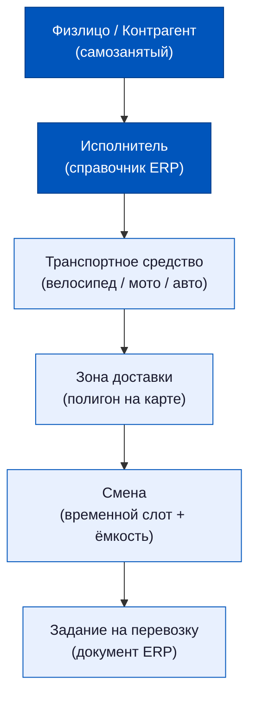
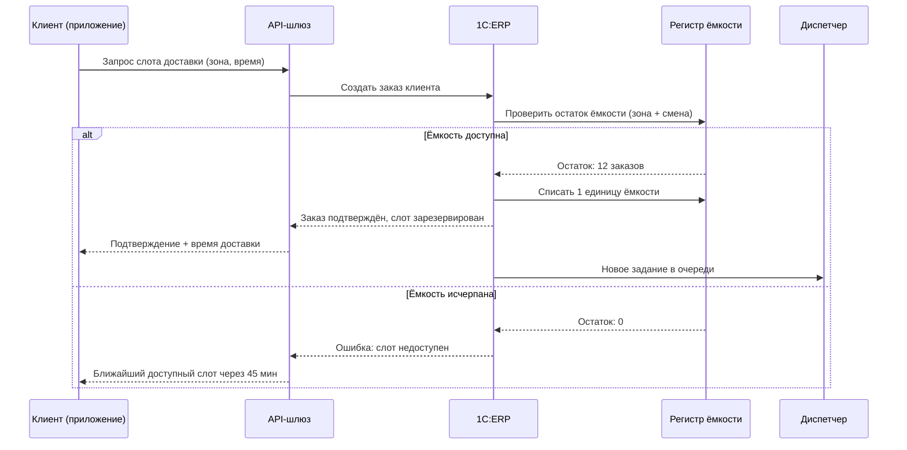
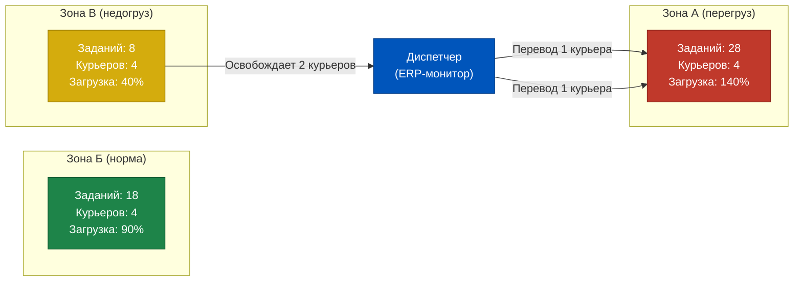
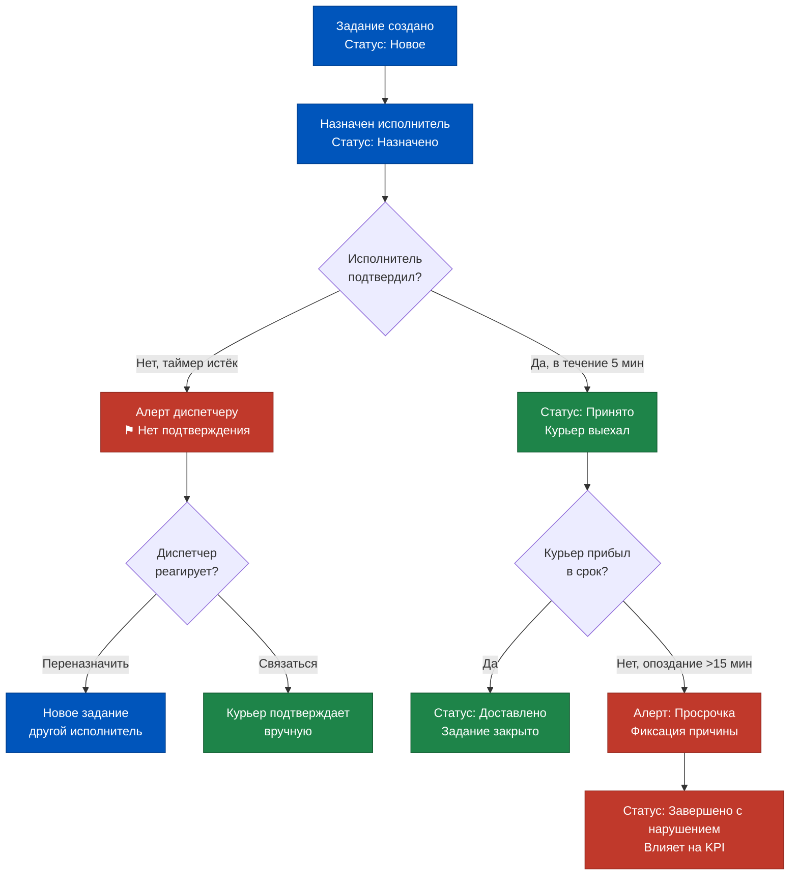
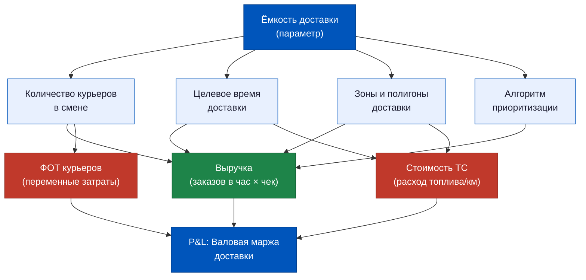
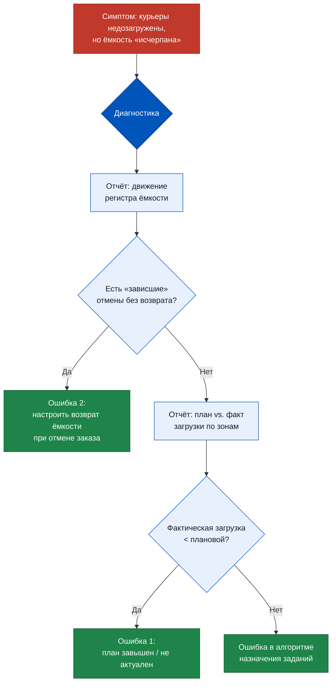
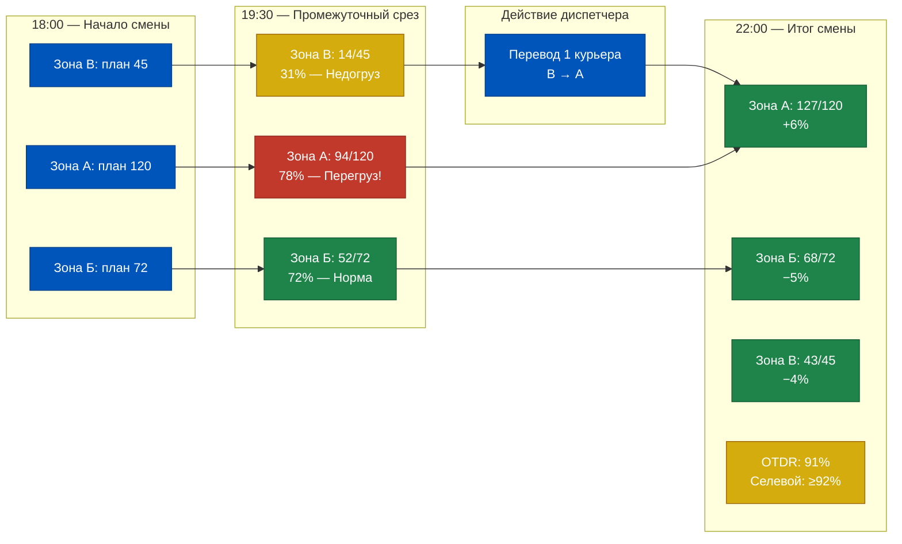

# Неделя 7, День 3. Управление сменами курьеров

> Курьер — это не «человек с рюкзаком». В системе ERP это ресурс с измеримой ёмкостью, привязанный к зоне, транспортному средству и временному слоту. Когда PM говорит «у нас нет ёмкости», он должен уметь доказать это цифрами из системы — и знать, какой именно параметр нужно изменить, чтобы ёмкость появилась.

## Содержание

1. [[#Часть 1. Курьер в ERP: не сотрудник, а ресурс доставки]]
2. [[#Часть 2. Смены и ёмкость доставки]]
3. [[#Часть 3. Планирование смен: данные из ERP для диспетчера]]
4. [[#Часть 4. Реальное время: диспетчерский монитор]]
5. [[#Часть 5. KPI курьерской службы в разрезе ERP]]
6. [[#Часть 6. Расчёт оплаты курьеров: связь с ERP]]
7. [[#Часть 7. Архитектурное решение: ёмкость как продуктовый параметр]]

---

## Часть 1. Курьер в ERP: не сотрудник, а ресурс доставки

В большинстве компаний, которые впервые внедряют ERP для логистики последней мили, возникает один и тот же концептуальный конфликт. HR-директор настаивает: курьер — это сотрудник, и должен быть в карточке физлица. Операционный директор возражает: курьер — это ресурс, как грузовик или складская ячейка, и должен управляться через диспетчерский контур. Оба правы — и именно поэтому 1C:ERP 2.5 предлагает два независимых способа учёта, которые могут существовать параллельно.

**Способ первый: физлицо — сотрудник.** Если курьер работает в штате и получает зарплату через расчётный модуль ERP, он заводится как физическое лицо в справочнике «Физические лица», затем как сотрудник в «Сотрудниках организации». К нему привязываются трудовой договор, налоговый статус, начисления и удержания. Этот путь даёт полный цикл расчёта зарплаты, но создаёт нагрузку на HR-блок при высокой ротации — а в Q-commerce ротация курьеров традиционно высока.

**Способ второй: ресурс — исполнитель.** В модуле управления транспортом и доставкой курьер может быть заведён как «Исполнитель» — элемент справочника, который описывает не человека, а функциональную единицу. К исполнителю привязывается транспортное средство, зона доставки, временные слоты доступности. Этот способ работает независимо от того, является ли курьер штатным сотрудником, самозанятым или курьером из аутсорсинговой службы.

**Самозанятые в ERP** — отдельная история, особенно актуальная для Q-commerce. С точки зрения налогового учёта самозанятый не является сотрудником: нет НДФЛ, нет страховых взносов, есть только акт об оказании услуг. В ERP это означает, что самозанятый заводится как контрагент (юридически он — ИП или физлицо на НПД), а выплаты ему проходят через блок расчётов с контрагентами, а не через зарплатный модуль. Практическое следствие: если у вас 200 самозанятых курьеров, у вас 200 контрагентов, и закрывающие документы по каждому из них нужно получать ежемесячно. Это не мелочь — это операционная нагрузка, которую нужно проектировать заранее.

**Справочник «Транспортные средства»** хранит не только велосипеды и мотоциклы. Каждое ТС имеет атрибуты: тип (пеший, велосипед, мотоцикл, авто), грузоподъёмность в единицах заказов, зона действия (ограничена радиусом или конкретными районами), плановое время возврата на базу. Эти атрибуты непосредственно влияют на алгоритм назначения заданий: система не назначит мотоциклиста на пешеходную зону и не поставит в слот заказ, если ТС уже на предельной загрузке.

**Связь «Исполнитель → ТС → Зона → Смена»** реализована через иерархию справочников и документов. Смотрите схему ниже.

Ключевое свойство этой иерархии: она работает снизу вверх при назначении (система ищет свободное задание в смене → ищет исполнителя в зоне → проверяет ТС) и сверху вниз при планировании (PM задаёт ёмкость смены → система рассчитывает, сколько исполнителей нужно → диспетчер назначает конкретных людей).

Важный нюанс: в Q-commerce один исполнитель может работать с несколькими транспортными средствами в рамках смены — например, начать на велосипеде, а продолжить пешком в плотной застройке. ERP позволяет менять ТС в рамках открытого задания, но это требует ручного действия диспетчера и создаёт запись в журнале изменений. Автоматической смены ТС в середине смены система не поддерживает — это принципиальное ограничение, которое нужно учитывать при проектировании операционных процессов.

---

## Часть 2. Смены и ёмкость доставки

Представьте пятницу, 19:00. Даркстор в Москве, зона «Северо-Запад». В системе 47 активных заказов, 12 курьеров на смене, средний интервал доставки — 28 минут. Математика простая: 12 курьеров × (60 / 28) ≈ 25 заказов в час. А входящий поток — 35 заказов в час. Через 40 минут система столкнётся с кризисом ёмкости.

Вопрос: знает ли ваша ERP об этом прямо сейчас, в 19:00?

Если ёмкость настроена правильно — знает. Если нет — узнает в 19:42, когда первые клиенты начнут звонить с жалобами.

**Ёмкость сети** — это агрегированный параметр, который показывает, сколько заказов может принять и исполнить сеть дарксторов в конкретный момент времени. Он складывается из трёх компонентов: количество активных курьеров × их средняя скорость исполнения заказа × корректирующий коэффициент (погода, пробки, сложность зоны). В 1C:ERP 2.5 этот параметр не вычисляется автоматически из первых принципов — он задаётся через документ «График работы курьеров» как плановая ёмкость, а затем сравнивается с фактической загрузкой.

**Документ «График работы курьеров»** — это центральный документ планирования смен в ERP. Его структура:

- Заголовок: дата, даркстор (склад), временной период смены
- Табличная часть: исполнитель, транспортное средство, зона, время начала, время окончания, плановая ёмкость (количество заказов за смену)
- Атрибуты смены: приоритет зоны, максимальная загрузка в процентах, пороговое значение для блокировки новых заказов

Когда диспетчер создаёт график на следующий день, он фактически объявляет системе: «В зоне А с 18:00 до 22:00 будет работать 8 курьеров с суммарной ёмкостью 160 заказов». Система принимает это как факт и начинает вести учёт исполнения относительно этого плана.

**Механизм блокировки приёма заказов** — один из самых болезненных вопросов для Q-commerce. Теоретически, когда ёмкость смены исчерпана, ERP должна отказывать в подтверждении новых заказов из этой зоны. На практике это работает только если настроен триггер — бизнес-правило, которое при создании нового заказа клиента проверяет остаток ёмкости в соответствующей смене и зоне.

Без этого триггера ERP просто накапливает заказы в очереди, не сигнализируя о перегрузке. Результат известен: клиент видит слот «Доставка через 30 минут», оформляет заказ, а реальное время доставки составляет 90 минут. Это не ошибка курьера — это архитектурный просчёт в настройке ёмкости.

Обратите внимание на деталь: при нормальном сценарии ERP списывает ёмкость в момент создания заказа, а не в момент его исполнения. Это значит, что даже заказ в статусе «Ожидает сборки» уже занимает слот ёмкости. Если заказ отменяется до передачи курьеру — ёмкость должна вернуться в регистр. Этот возврат настраивается отдельным бизнес-правилом и нередко забывается при первоначальной настройке системы.

Практическое следствие для PM: если вы видите, что «ёмкость исчерпана», но на самом деле курьеры недозагружены — скорее всего, в системе накопились отменённые заказы, которые не вернули ёмкость. Это диагностируется за 5 минут через отчёт по регистру накопления ёмкости.

---

## Часть 3. Планирование смен: данные из ERP для диспетчера

Хороший диспетчер планирует смену не по интуиции, а по данным. Плохой диспетчер тоже думает, что планирует по данным — но берёт не те данные из не того отчёта. Разберём, что именно ERP может предоставить для планирования смены, и что нужно запрашивать.

**Прогноз заказов по зонам и временным слотам** — это не нативная функция 1C:ERP. ERP хранит исторические данные: сколько заказов было в прошлый вторник в 18:00 в зоне «Центр». На основе этих данных можно построить отчёт «История заказов по зонам и времени» с группировкой по дням недели и часам. Это не ML-прогноз — это статистический бэкграунд, на который диспетчер накладывает свои поправки: праздники, акции, плохая погода.

**Балансировка курьеров по зонам** — задача, которую ERP решает частично. Система может показать плановое распределение курьеров по зонам (из графика работы) и фактическое количество активных заданий по зонам (из регистра текущих заданий). Разность между этими двумя показателями — это и есть сигнал перегрузки или недогрузки.

Перегруженная зона: заданий больше, чем курьеры могут исполнить в целевое время. Сигнал в ERP: среднее время «В пути» растёт выше порогового значения.

Недогруженная зона: курьеры простаивают, ждут новых заказов. Сигнал: среднее время ожидания следующего задания превышает норму (обычно 10–15 минут для Q-commerce).

Реакция диспетчера на перегрузку: перевести курьера из недогруженной зоны в перегруженную. В ERP это делается через редактирование графика работы — изменение зоны для конкретного исполнителя на текущую смену. Операция занимает 2–3 минуты, но требует, чтобы у исполнителя не было открытых заданий в текущей зоне.

**Погодные и событийные факторы** ERP не обрабатывает автоматически. Это важное ограничение, которое нужно принять: 1C:ERP не интегрирована с погодными API и не знает о городских событиях (концерты, матчи, митинги). Всё это диспетчер добавляет вручную — через поправочный коэффициент в графике работы или через ручное увеличение плановой ёмкости. Некоторые команды строят внешние дашборды, которые агрегируют погоду, события и данные ERP — но это уже за пределами стандартного функционала системы.

Для PM важно понимать: ERP — это не система предсказания спроса. Это система учёта и управления тем, что происходит прямо сейчас. Прогнозирование — отдельный продуктовый слой, который интегрируется с ERP, но живёт вне неё.

---

## Часть 4. Реальное время: диспетчерский монитор

Пятница, 20:15. Диспетчер смотрит в экран. У него открыто три окна: карта с курьерами, список активных заказов и чат с водителями. Если это хорошо настроенная ERP-система, то все три источника информации сходятся в одном месте — в диспетчерском мониторе. Если нет — диспетчер переключается между окнами, теряет время и делает ошибки.

**Что видит диспетчер в ERP в момент пиковой нагрузки** — это вопрос конфигурации, но типовой набор данных включает:

- Список активных заданий на доставку с текущим статусом каждого
- Количество заданий на каждом исполнителе (текущая загрузка)
- Время, прошедшее с момента присвоения статуса (сколько минут задание в текущем статусе)
- Флаги просрочки: задание просрочено, если время в статусе превышает норматив
- Географическая привязка (если ERP интегрирована с GPS-трекером)

**Отчёт «Текущее состояние заказов»** в 1C:ERP — это, строго говоря, не один отчёт, а набор представлений регистра «Задания на доставку». Ключевые поля: номер задания, заказ клиента (ссылка), исполнитель, статус, время создания, время смены статуса, плановое время доставки, фактическое время доставки (заполняется при закрытии задания). Группировки, которые нужны диспетчеру в пиковый момент: по исполнителю (сколько у каждого открытых заданий), по статусу (сколько «В пути», сколько «Передано», сколько «Ждёт курьера»), по просрочке (фильтр по превышению планового времени).

**Перераспределение заказа** — операция, которую диспетчер выполняет, когда курьер не может выполнить задание: заболел, ТС сломалось, попал в пробку. В ERP это делается через документ «Перераспределение задания»: старое задание переводится в статус «Отменено» или «Приостановлено», создаётся новое задание с тем же заказом клиента, но другим исполнителем. Важно: при этом не создаётся новый заказ клиента — переоформляется только задание. Это сохраняет историю и не ломает финансовый документооборот.

**Проблема «застрявших» заданий** — классическая головная боль Q-commerce. Сценарий: курьер получил задание, приложение показало статус «Принято», но курьер не вышел на маршрут. Через 10 минут задание всё ещё в статусе «Принято», время идёт, клиент ждёт. В ERP нет автоматического таймера, который бы эскалировал такие случаи — если только он не настроен как бизнес-правило.

Эскалация в Q-commerce работает в трёх временных горизонтах. Первые 5 минут: ожидание подтверждения от курьера. 5–15 минут без движения: алерт диспетчеру, попытка связаться. После 15 минут: автоматическое переназначение (если настроено) или ручная эскалация. На практике большинство команд настраивают алерты, но оставляют переназначение ручным — потому что автоматическое переназначение может создать конфликт, если первый курьер уже едет, просто не обновил статус в приложении.

Для PM этот момент принципиален: надёжность диспетчерского монитора напрямую зависит от дисциплины обновления статусов курьерами. Если курьеры обновляют статус нерегулярно — данные в ERP устаревают, и диспетчер принимает решения на основе неактуальной картины. Это не техническая проблема — это операционная, и она решается не кодом, а обучением и контролем.

---

## Часть 5. KPI курьерской службы в разрезе ERP

Каждый KPI — это история о данных. Прежде чем ставить метрику, нужно ответить на вопрос: откуда берётся числитель, откуда знаменатель, и можно ли доверять этим данным в системе? Разберём три ключевых KPI курьерской службы через призму 1C:ERP.

**On-Time Delivery Rate (OTDR)** — доля заказов, доставленных в обещанный временной слот. Формула: количество заказов со статусом «Доставлено» с фактическим временем ≤ планового времени / общее количество закрытых заказов за период.

Источник данных в ERP: регистр «Задания на доставку». Поля: «Плановое время доставки» (заполняется при создании задания из параметров слота) и «Фактическое время доставки» (заполняется при переводе задания в статус «Доставлено»).

Проблема достоверности: фактическое время — это время, когда курьер нажал кнопку «Доставлено» в приложении, а не время, когда клиент реально получил заказ. Если курьер нажимает кнопку заранее — OTDR искусственно завышается. ERP не может проверить геолокацию в момент нажатия (если только не настроена GPS-верификация через интеграцию).

**Среднее время доставки** — от «Передано курьеру» до «Доставлено». Считается как среднее арифметическое разности временных меток по всем закрытым заданиям за период. В ERP это стандартный отчёт с группировкой по зонам, дням недели и временным слотам.

Ключевой инсайт: среднее время доставки — это не константа. Оно существенно различается между зонами (плотная застройка vs. частный сектор), между слотами (утро vs. пик вечера) и между типами ТС. Отчёт ERP должен показывать это распределение, а не только среднее по всей сети.

**FCR для последней мили** (First Contact Resolution, или «Первая доставка с попытки») — доля заказов, доставленных с первой попытки без повторного выезда. В Q-commerce этот показатель обычно высокий (90%+), потому что клиент присутствует дома. Но в B2B-сегменте или при доставке к офисам он может падать. В ERP источник данных — количество заданий с более чем одной попыткой доставки по одному заказу.

| KPI | Источник данных в ERP | Формула | Бенчмарк Q-com |
|-----|----------------------|---------|----------------|
| OTDR | Регистр «Задания на доставку» | Доставлено в срок / Всего заказов × 100% | ≥ 92% |
| Среднее время доставки | Разность временных меток задания | Σ(Факт − Передано) / N заданий | ≤ 35 минут |
| FCR | Количество попыток по заданию | Заданий с 1 попыткой / Всего заданий × 100% | ≥ 95% |
| Загрузка ТС | Плановая ёмкость vs. факт заказов | Факт заказов / Плановая ёмкость × 100% | 80–90% |
| Время простоя курьера | Время между закрытием и открытием задания | Σ(Новое задание − Закрыто предыдущее) / N | ≤ 12 минут |

Для PM важно понимать: ни один из этих KPI не считается в ERP автоматически и не отображается на готовом дашборде «из коробки». Все они требуют настройки отчётов или выгрузки в BI-систему. ERP — это хранилище данных для расчёта KPI, а не инструмент их визуализации.

---

## Часть 6. Расчёт оплаты курьеров: связь с ERP

Деньги — это то, где операционная логика встречается с финансовой. Именно в расчёте оплаты курьеров ошибки обходятся дороже всего: переплата бьёт по P&L, недоплата бьёт по мотивации и текучке. Разберём, как данные из модуля доставки ERP попадают в расчёт вознаграждения.

**Сдельная оплата** — базовая модель для Q-commerce: курьер получает фиксированную сумму за каждый доставленный заказ. Источник данных: регистр «Задания на доставку», отфильтрованный по исполнителю и периоду, статус «Доставлено», дополнительный фильтр — задания, по которым нет открытых претензий или возвратов.

В 1C:ERP сдельный расчёт реализуется через документ «Начисление по данным производственного учёта» или через настройку специального вида начисления в зарплатном модуле, привязанного к количеству закрытых заданий. При штатном оформлении курьера система автоматически подтягивает количество заданий из регистра и умножает на ставку за заказ.

При оформлении через контрагента (самозанятый) механизм другой: создаётся акт об оказании услуг на сумму = количество заказов × ставка, акт согласовывается с контрагентом, оплата проходит через банковскую интеграцию. Это ручной процесс, который при масштабировании (200+ самозанятых) требует автоматизации через интеграцию с платформами для самозанятых.

**Бонусные надбавки** добавляют сложности. Типичная структура бонусов в Q-commerce:

- За OTDR выше порога (например, +15% к ставке при OTDR ≥ 95% за смену)
- За ночные смены (смена с 22:00 до 06:00 — надбавка 25–40%)
- За сложные условия (дождь, мороз ниже −15°C — надбавка 10–20%)
- За количество заказов в смену сверх нормы (прогрессивная шкала)

В ERP каждый из этих бонусов настраивается как отдельный вид начисления с условием срабатывания. Условие для OTDR-бонуса: значение показателя OTDR по исполнителю за период ≥ заданного порога. Условие для ночного бонуса: время начала задания входит в ночной диапазон. Условие за погоду — проблема: ERP не знает о погоде, поэтому или диспетчер вручную активирует «погодный коэффициент» на смену, или строится интеграция с погодным API.

**Проблема недобросовестного закрытия заданий.** Курьер пометил задание «Доставлено» без реальной доставки — либо по ошибке, либо намеренно. Как ERP выявляет такие случаи?

Первый метод: GPS-верификация. Если ERP интегрирована с GPS-трекером и хранит координаты при смене статуса, система может сравнить координаты в момент «Доставлено» с адресом доставки. Отклонение более 200 метров — автоматический флаг для проверки.

Второй метод: клиентская верификация. Клиент получает push-уведомление «Подтвердите получение» и нажимает кнопку в приложении. Только после этого задание закрывается как «Доставлено» в ERP. Без подтверждения — статус «Доставлено (не подтверждено)», который попадает в отдельную очередь проверки.

Третий метод: паттерн-анализ. Если курьер систематически закрывает задания быстрее среднего по зоне (например, в 2 раза быстрее) — это аномалия. ERP может выдавать такой отчёт, но интерпретирует его человек, а не система.

Для PM: проблема недобросовестного закрытия заданий влияет не только на расчёт зарплаты, но и на OTDR и на доверие клиентов. Это системная проблема, которая требует комплексного решения: технического (GPS, подтверждение клиента) и операционного (культура, контроль, последствия).

---

## Часть 7. Архитектурное решение: ёмкость как продуктовый параметр

Финальный раздел — концептуальный. После шести частей с деталями реализации важно сделать шаг назад и увидеть картину целиком. Ёмкость доставки — это не техническая настройка в ERP. Это бизнес-параметр, который определяет, сколько выручки сеть может генерировать в единицу времени.

Это означает, что управление ёмкостью — это продуктовая задача, а не задача операций. PM должен понимать, какие параметры ёмкости существуют в системе, кто ими управляет и каковы финансовые последствия их изменения.

| Параметр ёмкости | Кто управляет | Как изменить в ERP | Последствия для P&L |
|-----------------|--------------|-------------------|---------------------|
| Плановая ёмкость смены | Диспетчер / Ops-менеджер | График работы курьеров | Прямо: больше курьеров = больше ФОТ |
| Порог блокировки приёма заказов | PM / Продукт | Настройки бизнес-правил | Косвенно: отказ в слоте = потеря заказа |
| Целевое время доставки | PM / Продукт | Параметры слота в настройках | Влияет на OTDR и стоимость ТС |
| Зоны доставки (полигоны) | Ops-менеджер / GIS | Справочник зон | Расширение зоны = рост ФОТ + падение OTDR |
| Приоритизация заданий (FIFO vs. ближайший) | Архитектор системы | Алгоритм в настройках | Влияет на среднее время и удовлетворённость |

**Связь с балансировкой стока** (тема Дня 1): ёмкость доставки и ёмкость склада — это два независимых ограничения, которые могут входить в конфликт. Сценарий: даркстор собрал заказ за 3 минуты (высокая ёмкость сборки), но курьер недоступен (низкая ёмкость доставки). Заказ ждёт на выходе, занимает место на staging-зоне, тикает таймер клиента. Балансировка стока между дарксторами помогает только тогда, когда ёмкость доставки в целевой зоне достаточна. Если курьеров не хватает везде — перебалансировка стока не даст эффекта.

**Итоговый чеклист: 6 вопросов для оценки зрелости управления ёмкостью**

Используйте этот чеклист при аудите операционной системы даркстора или при онбординге нового сайта.

1. **Настроен ли регистр ёмкости?** Существует ли в ERP плановая ёмкость по каждой зоне и каждому временному слоту — или диспетчер работает «по ощущениям»?

2. **Работает ли блокировка приёма заказов?** При исчерпании ёмкости слота система отказывает в подтверждении нового заказа — или принимает всё подряд, создавая скрытую очередь?

3. **Возвращается ли ёмкость при отмене?** Если заказ отменён до передачи курьеру, ёмкость возвращается в регистр автоматически — или «зависает», занижая реальную доступную мощность?

4. **Настроены ли алерты на застрявшие задания?** Система сигнализирует диспетчеру, если задание не сменило статус дольше норматива — или диспетчер обнаруживает проблему вручную?

5. **Есть ли GPS-верификация или клиентское подтверждение?** Или OTDR считается на основании нажатий кнопки курьером без верификации?

6. **Связаны ли параметры ёмкости с финансовой моделью?** PM знает, как изменение целевого времени доставки с 45 до 30 минут влияет на ФОТ и на выручку — или это отдельные «миры», которые не разговаривают друг с другом?

Если на все шесть вопросов ответ «да» — поздравляем: ёмкость управляется как продуктовый параметр. Если есть «нет» — это не технический долг, это операционный риск с измеримой стоимостью.

---

## Приложение. Типичные ошибки настройки и как их диагностировать

После разбора архитектуры полезно систематизировать то, что чаще всего идёт не так при внедрении управления сменами в 1C:ERP. Ниже — реестр типичных ошибок с диагностикой.

**Ошибка 1: Ёмкость настроена как константа, а не как переменная по дням и слотам.**
Симптом: в пятницу вечером система принимает столько же заказов, сколько в понедельник утром, хотя у вас в пятницу вечером в два раза больше курьеров. Причина: плановая ёмкость в графике работы выставлена одинаково для всех смен без учёта дня недели. Диагностика: сравните фактическую загрузку (заказов/курьер/час) по дням недели — если нет вариации, это признак проблемы.

**Ошибка 2: Ёмкость «зависает» из-за отменённых заказов.**
Симптом: диспетчер видит «ёмкость исчерпана», но курьеры работают с загрузкой 60–70%. Причина: заказы отменяются (клиент передумал, OOS, ошибка маппинга), но ёмкость не возвращается в регистр. Диагностика: отчёт «Движение по регистру ёмкости» — найдите строки с признаком «Отмена», у которых нет парной строки «Возврат ёмкости».

**Ошибка 3: Нет разделения плановой и фактической ёмкости в отчётах.**
Симптом: PM смотрит на «загрузку» в ERP и видит 85%, но не понимает — это от плана или от физического предела. Причина: отчёт показывает только один показатель. Диагностика: в правильно настроенном отчёте должны быть три столбца: Плановая ёмкость (из графика), Зарезервировано (из принятых заказов), Фактически исполнено (из закрытых заданий).

**Ошибка 4: KPI курьера считается только в момент закрытия смены, а не в реальном времени.**
Симптом: диспетчер не видит, что OTDR конкретного курьера падает прямо сейчас, и не может отреагировать. Причина: расчёт OTDR реализован как пакетный отчёт, а не как live-показатель. Диагностика: попробуйте открыть карточку исполнителя во время активной смены — если OTDR там пустой или вчерашний, расчёт пакетный.

**Ошибка 5: Данные для расчёта зарплаты и данные для оперативного управления — в разных регистрах.**
Симптом: количество доставленных заказов по зарплатному расчёту расходится с количеством по диспетчерскому отчёту. Причина: операционный модуль и зарплатный модуль ERP используют разные источники данных и разные правила подсчёта (например, один включает «доставлено с нарушением», другой нет). Диагностика: сверьте два числа за один день — если они различаются больше чем на 1%, нужно унифицировать источник.

---

## Глоссарий урока

Несколько терминов, которые использовались в уроке и могут потребовать уточнения при работе с командой:

**Ёмкость доставки** — максимальное количество заказов, которое сеть курьеров может исполнить в единицу времени в данной зоне. Измеряется в заказах/час. Не путать с пропускной способностью склада (заказов/час по сборке).

**Плановая ёмкость** — ёмкость, зафиксированная в графике работы курьеров до начала смены. Это то, что диспетчер планирует. Отличается от фактической ёмкости, которую система рассчитывает на основе реального количества активных курьеров в данный момент.

**Исполнитель (в ERP)** — функциональная единица в справочнике ERP, описывающая ресурс доставки. Может быть привязан к физлицу (штатный сотрудник), контрагенту (самозанятый) или оставаться обезличенным (аутсорсинговая смена).

**Задание на перевозку** — официальный документ ERP (1С:ERP 2.5, раздел «Склад и доставка»), связывающий распоряжения на доставку с транспортным средством и исполнителем. Официальные статусы: Формируется → К погрузке → Отправлено → Закрыто. Статусы самого факта доставки (Принято / В пути / Доставлено) приходят из DMS через интеграцию и фиксируются в ERP как события. Именно этот документ является источником данных для KPI.

**Регистр накопления ёмкости** — служебный регистр ERP, который хранит плановую ёмкость по зонам и временным слотам, и из которого система вычитает единицу при каждом подтверждённом заказе. Не является нативным объектом типовой конфигурации — как правило, настраивается при доработке системы под специфику Q-commerce.

**OTDR (On-Time Delivery Rate)** — ключевой KPI последней мили: доля заказов, доставленных в обещанный временной слот. Для Q-commerce целевой бенчмарк — не ниже 92%.

**FCR (First Contact Resolution) для доставки** — доля заказов, доставленных с первой попытки без повторного выезда курьера. В контексте Q-commerce означает, что клиент был дома и принял заказ с первого раза. Целевое значение для Q-commerce — не ниже 95%.

---

## Практический кейс. Оптимизация ёмкости в пиковые дни: разбор сценария

Рассмотрим конкретный сценарий управления ёмкостью в Q-commerce даркстоpe в пятницу перед выходными. Это учебный кейс, построенный на типичных параметрах российского Q-commerce.

**Исходные данные:**

- Даркстор «Центр», Москва. Три зоны доставки: А (плотная застройка, пешие и велокурьеры), Б (смешанная, мотоциклы), В (окраина, авто).
- Пятница, 18:00–22:00 — пиковая смена.
- Плановый состав смены: зона А — 6 курьеров × 20 заказов = 120 ед. ёмкости; зона Б — 4 курьера × 18 заказов = 72 ед.; зона В — 3 курьера × 15 заказов = 45 ед.
- Итого плановая ёмкость смены: 237 заказов.
- Исторический факт: в прошлую пятницу фактический спрос составил 285 заказов — на 20% выше плана.

**Шаг 1: Превентивная корректировка плана.**

Диспетчер видит историческую статистику через отчёт «История загрузки смен» в ERP. Он корректирует плановую ёмкость на коэффициент +20% и добавляет в график двух дополнительных курьеров в зону А и одного в зону Б. Новая плановая ёмкость: 285 заказов.

В ERP это отражается через редактирование «Графика работы курьеров»: добавляются строки с новыми исполнителями, плановая ёмкость пересчитывается автоматически.

**Шаг 2: Мониторинг в 19:30.**

Факт на 19:30: принято 142 заказа из 285 плановых (50% за 1,5 часа из 4). Если темп сохранится — к концу смены выйдет ~284 заказа. Система укладывается в план.

Но диспетчер видит аномалию: зона А уже загружена на 78% (94 из 120 заказов за 1,5 часа), зона В загружена только на 31% (14 из 45). Темп поступления в зону А в 2,5 раза выше, чем в зону В.

**Шаг 3: Перебалансировка.**

Диспетчер переводит одного курьера из зоны В в зону А. Это занимает 3 минуты в ERP: редактирование строки графика, сохранение. Курьер получает уведомление через приложение.

Важно: перевод возможен только если у курьера нет открытых заданий в зоне В. Диспетчер проверяет: у курьера завершено последнее задание 7 минут назад, новых нет. Перевод выполнен.

**Шаг 4: Итоговый срез смены.**

К 22:00 фактически исполнено: зона А — 127 заказов (план 120, перевыполнение 6%); зона Б — 68 заказов (план 72, недовыполнение 5%); зона В — 43 заказа (план 45, недовыполнение 4%). Итого: 238 заказов из 285 плановых (84%). OTDR составил 91% — чуть ниже бенчмарка 92%, но в допустимой зоне с учётом пиковой нагрузки.

**Выводы из кейса:**

Первый вывод: исторические данные в ERP — это база для планирования, а не гарантия. Корректировка плана на основе статистики прошлой пятницы была правильным решением, но недостаточным — спрос оказался неравномерным по зонам.

Второй вывод: балансировка между зонами в реальном времени спасает смену. Без перевода курьера из зоны В в зону А OTDR был бы ниже 88%, что повлекло бы волну жалоб.

Третий вывод: 84% исполнения плана при 91% OTDR — это хороший результат для пятницы в Q-commerce. Цель не в том, чтобы исполнить план на 100%, а в том, чтобы обслужить максимум клиентов в рамках обещанного времени.

Четвёртый вывод: данные для всего этого анализа — исторические отчёты, промежуточный мониторинг, итоговый KPI — берутся из одной системы: 1C:ERP. Это означает, что качество управления сменой прямо пропорционально качеству настройки системы.

---

## Связь с другими темами курса

**С Днём 1 (Балансировка стока).** Управление ёмкостью доставки и управление стоком — это два независимых ограничения операции Q-commerce, которые необходимо решать совместно. Бессмысленно балансировать сток между дарксторами, если в целевом дарксторе нет ёмкости доставки для исполнения перебалансированных заказов. Любая задача по балансировке стока должна включать проверку ёмкости доставки в целевой точке — иначе это перемещение проблемы, а не её решение.

**С Днём 2 (Интеграция курьерской доставки).** Интеграция курьерских систем создаёт данные, которые используются в управлении сменами. GPS-координаты курьеров, статусы заданий, фактическое время доставки — всё это поступает в ERP через интеграционный слой. Без надёжной интеграции диспетчерский монитор работает вслепую.

**С Днём 5 (Возвраты от покупателей).** Возврат товара в рамках смены — это обратное движение, которое создаёт дополнительную нагрузку на курьера (он везёт товар обратно) и на склад (нужно принять и переоприходовать). При высоком уровне возвратов ёмкость смены фактически снижается: курьер тратит время на возврат, которое мог бы потратить на новый заказ. Это нужно учитывать при планировании плановой ёмкости в зонах с высокой долей возвратов.

**С Неделей 4 (Финансовый учёт).** Расчёт оплаты курьеров, надбавки за OTDR, бонусы за ночные смены — всё это влияет на строку «Переменные операционные расходы» в P&L. PM должен уметь связывать операционные решения (добавить двух курьеров в пятничную смену) с финансовыми последствиями (рост ФОТ на X рублей, рост выручки на Y рублей, итоговое изменение маржи на Z процентных пунктов).

---

## Итоговый чеклист: вопросы для самопроверки

После изучения этого урока вы должны уметь ответить на следующие вопросы без обращения к материалам.

**По архитектуре данных:**
- В чём разница между «Исполнителем» в ERP и физическим лицом сотрудника?
- Почему самозанятый курьер заводится как контрагент, а не как физлицо?
- Какие атрибуты хранятся в справочнике «Транспортные средства» и как они влияют на назначение заданий?

**По управлению ёмкостью:**
- Что произойдёт, если в ERP не настроен триггер блокировки при исчерпании ёмкости?
- Почему ёмкость нужно возвращать в регистр при отмене заказа, и что происходит, если этого не делать?
- Какой режим синхронизации ёмкости оптимален для Q-commerce — событийный, плановый или гибридный?

**По KPI и расчёту оплаты:**
- Почему OTDR, рассчитанный из данных ERP, может быть завышен относительно реальности?
- Как ERP может выявить недобросовестное закрытие заданий курьерами?
- Какие три метода верификации реальной доставки существуют, и в чём ограничения каждого?

**По продуктовому мышлению:**
- Является ли параметр «целевое время доставки» техническим или бизнес-параметром? Обоснуйте ответ через P&L.
- Как связаны ёмкость доставки и балансировка стока между дарксторами?
- Назовите шесть вопросов из чеклиста зрелости управления ёмкостью — без подглядывания.

---

← [[Неделя 7 - День 2 - Интеграция курьерской доставки|← День 2]] | [[1c_erp_qcom/README|Оглавление]] | [[Неделя 7 - День 4 - Интеграция с маркетплейсами|День 4 →]]
