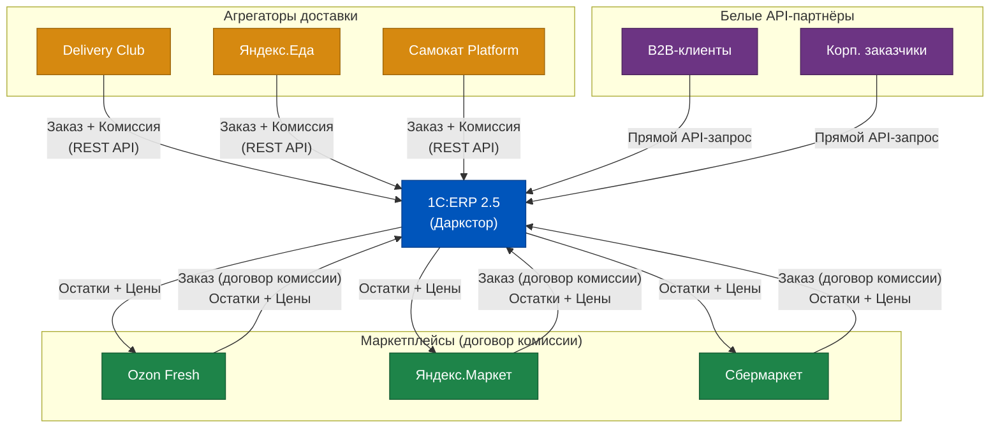
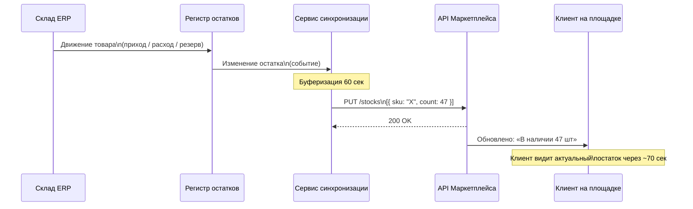
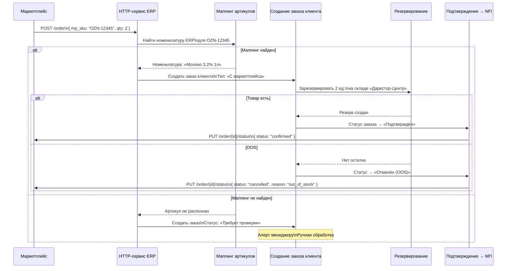
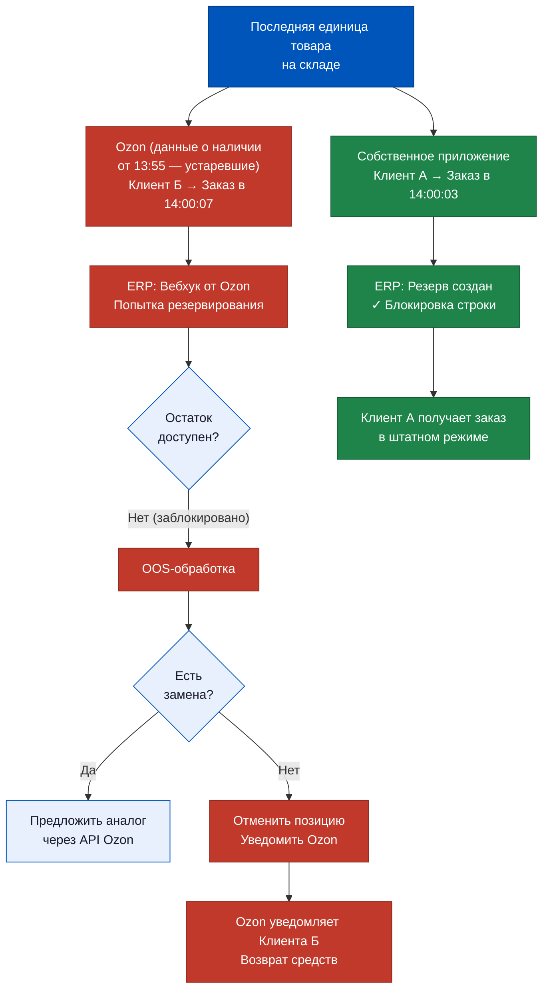
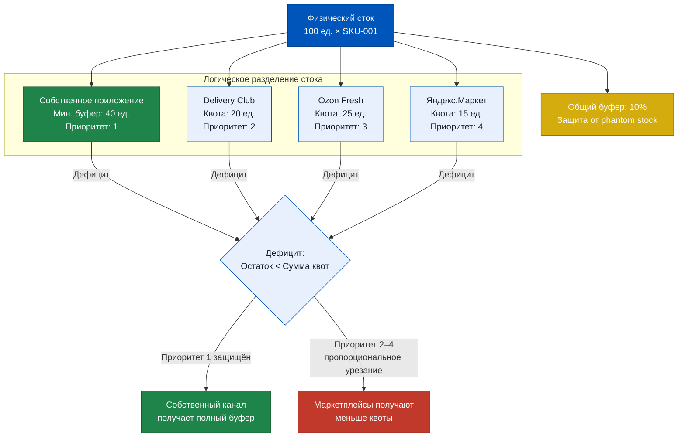
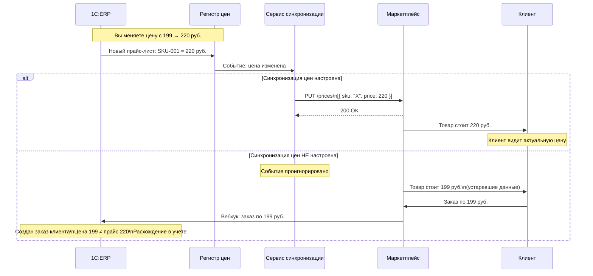
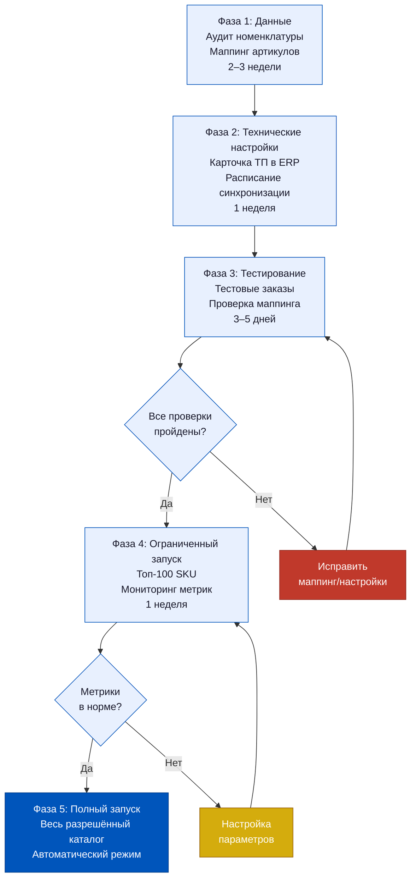

# Неделя 7, День 4. Интеграция с маркетплейсами

> Когда клиент нажимает «Заказать» на Ozon — он думает, что покупает у Ozon. На самом деле он покупает у вас. Ozon только передаёт заказ. Маркетплейс — это канал привлечения, а не склад. И именно поэтому интеграция ERP с маркетплейсами — это не «техническая задача для IT», а продуктовая архитектура, которая определяет, как быстро вы узнаёте о заказе, как управляете единым стоком и как считаете реальную маржу с каждого канала.

## Содержание

1. [[#Часть 1. Экосистема интеграций: кто, зачем и каким образом]]
2. [[#Часть 2. Настройки интеграции в 1C:ERP 2.5]]
3. [[#Часть 3. Входящий заказ с маркетплейса: документооборот]]
4. [[#Часть 4. Phantom Stock Problem: синхронизация остатков в реальном времени]]
5. [[#Часть 5. Комиссии и взаиморасчёты с маркетплейсами в ERP]]
6. [[#Часть 6. Возвраты через маркетплейс]]
7. [[#Часть 7. Управление несколькими каналами: единый стоковый пул]]

---

## Часть 1. Экосистема интеграций: кто, зачем и каким образом

Начнём с того, что разберём зоопарк внешних партнёров, с которыми работает типовой даркстор Q-commerce. Их принято называть «маркетплейсами» — но это ошибка, которая стоит дорого, потому что скрывает принципиально разные бизнес-модели и, соответственно, разные требования к интеграции с ERP.

**Агрегаторы доставки** — первый тип. Delivery Club, Яндекс.Еда, Самокат (как агрегаторная платформа). Бизнес-модель: агрегатор привлекает клиента, передаёт заказ партнёру (вам), берёт комиссию с заказа. Ключевые характеристики для интеграции: вы продаёте свой товар, по своим ценам, со своим ассортиментом. Агрегатор — это витрина и логистика привлечения. Товарный учёт целиком на вашей стороне. ERP должна принять заказ, зарезервировать товар, передать задание курьеру (вашему или агрегаторского) и зафиксировать выручку.

**Маркетплейсы** — второй тип. Ozon Fresh, Яндекс.Маркет с доставкой, ВкусВилл через сторонние платформы. Бизнес-модель: маркетплейс размещает вашу номенклатуру на своей площадке, клиент платит маркетплейсу, маркетплейс перечисляет вам выручку за вычетом комиссии. Принципиальное отличие от агрегатора: клиент юридически покупает у маркетплейса, а не у вас. Это меняет НДС-схему, документооборот и логику возвратов. ERP получает не просто «заказ», а «заказ в рамках договора комиссии», и это разные документы.

**Белые API-партнёры** — третий тип. Корпоративные клиенты, B2B-покупатели, курьерские агрегаторы, которые интегрируются напрямую через ваш API. Особенность: у каждого свои требования к формату данных, своя частота синхронизации, свои SLA. ERP выступает источником истины, а партнёр — потребителем данных через API-шлюз.

Почему разграничение важно для PM? Потому что требования к ERP кардинально различаются. Для агрегатора достаточно принять входящий HTTP POST с заказом и создать документ «Заказ клиента». Для маркетплейса нужен ещё двусторонний канал синхронизации остатков, учёт комиссии через отчёт комитента и механизм сверки взаиморасчётов. Для B2B-партнёра — настройка прав доступа к API и кастомный маппинг полей под схему конкретного клиента. Если смешивать эти три типа в одну «задачу на интеграцию» — получается архитектурная каша, которую потом сложно поддерживать.

---

## Часть 2. Настройки интеграции в 1C:ERP 2.5

Раздел «Настройки интеграции с торговыми площадками» в 1C:ERP 2.5 — это одна из тех частей системы, которые эволюционировали вместе с российским e-commerce. Ещё в версии 2.4 эта функциональность была минимальной; в 2.5 она получила существенное расширение под реалии маркетплейсной торговли.

Вход: «НСИ и администрирование» → «Настройка НСИ и разделов» → «Торговые площадки». Здесь создаются карточки торговых площадок — по одной на каждого внешнего партнёра. Каждая карточка содержит: тип площадки (агрегатор / маркетплейс / прямой API), параметры подключения (URL, ключи API, тип аутентификации), правила маппинга номенклатуры, настройки синхронизации остатков, финансовые параметры (ставка комиссии, счёт для расчётов, порядок выставления документов).

**Форматы обмена данными.** В 1C:ERP 2.5 поддерживаются два формата обмена с внешними торговыми площадками.

CommerceML — стандарт 1С для обмена коммерческой информацией. XML-файлы с описанием номенклатуры, ценами, остатками и заказами. Применяется преимущественно для интеграции с площадками, которые «знают» экосистему 1С: некоторые российские агрегаторы и платформы Bitrix24. Достоинство: встроенная поддержка, нет нужды в промежуточном слое. Недостаток: тяжёлый формат, не подходит для высокочастотной синхронизации остатков.

REST API / JSON — современный стандарт. Большинство крупных маркетплейсов (Ozon, Яндекс.Маркет) работают именно так. В ERP настраивается через механизм HTTP-сервисов: входящие вызовы обрабатываются HTTP-сервисом ERP, исходящие — через подсистему обмена данными с настроенными конечными точками.

**Синхронизация номенклатуры.** Это однократная (при первоначальной настройке) и периодическая (при изменениях) операция. Карточка товара в ERP содержит: артикул, наименование, характеристики, штрихкод, вес и габариты, фото (ссылки), ставку НДС, признаки прослеживаемости. Маркетплейс ожидает свой набор полей — и он почти никогда не совпадает с полями ERP один к одному.

Здесь возникает задача маппинга: поле «Единица измерения» в ERP → поле «unit» в API маркетплейса. Поле «Характеристика (цвет)» → поле «attributes[color]». Поле «Код номенклатуры» → поле «seller_sku». Таблица маппинга хранится в карточке торговой площадки и редактируется вручную или через шаблон при добавлении новых полей.

**Синхронизация остатков** — самая критичная операция. Правило Q-commerce: остатки на маркетплейсе должны отражать реальное состояние стока не позже чем через 5 минут после изменения. Несколько режимов синхронизации в ERP:

- Событийный: остатки отправляются автоматически при каждом движении по складу (проведение документа). Самый актуальный режим, но создаёт высокую нагрузку на API маркетплейса.
- Плановый: остатки отправляются по расписанию (каждые 5 минут, 15 минут). Проще в реализации, но создаёт окно неактуальности.
- Гибридный: событийная синхронизация с буферизацией (изменения накапливаются за 60 секунд, затем отправляются одним пакетом). Оптимальный вариант для большинства случаев.

Критическое понимание: «фотография» остатков — это момент отправки запроса, а не момент реального изменения. Между событием (списали последнюю единицу) и обновлением на маркетплейсе проходит буферное время + время обработки API. Именно в этом окне живёт «призрачный сток», о котором подробно — в Части 4.

---

## Часть 3. Входящий заказ с маркетплейса: документооборот

Заказ пришёл. Это не просто строчка в базе данных — это документ, который запускает цепочку операций: резервирование, сборку, доставку, выручку, расчёт комиссии. Разберём, что происходит внутри ERP от момента получения HTTP-запроса до момента, когда курьер получает задание.

Шаг первый: ERP получает входящий вебхук от маркетплейса. Это HTTP POST на эндпоинт HTTP-сервиса ERP. Тело запроса содержит данные заказа в формате маркетплейса: его внутренний номер заказа, список позиций с артикулами маркетплейса (не вашими!), адрес доставки, контакт клиента, временной слот доставки, тип оплаты.

Шаг второй: маппинг артикулов. ERP должна перевести артикул маркетплейса в номенклатуру ERP. Это делается через таблицу соответствий в карточке торговой площадки. Проблема несовпадений возникает регулярно: маркетплейс обновил свою базу и переименовал артикул; вы добавили новую позицию в ERP, но не синхронизировали с маркетплейсом; маркетплейс продаёт комплект (bundle), а в ERP это два отдельных товара.

Если маппинг не найден — заказ создаётся с «нераспознанной номенклатурой» и попадает в очередь ручной обработки. Это критическая ситуация: заказ не будет выполнен автоматически. Диспетчер или менеджер должен вручную указать соответствие и перезапустить обработку.

Шаг третий: создание «Заказа клиента» в ERP. Система создаёт документ с типом «С маркетплейса» (или аналогичным признаком — зависит от конфигурации), заполняет поля из данных вебхука, ставит статус «Новый», записывает внешний номер заказа маркетплейса в поле «Номер заказа контрагента» для сверки.

Шаг четвёртый: автоматическое резервирование. Если в настройках торговой площадки включён флаг «Автоматически резервировать при создании заказа», система немедленно формирует резерв по складу. Если товара нет — заказ попадает в статус «Ожидает наличия» или «Отказ» — зависит от настройки поведения при OOS.

**Проблема дублей** возникает из-за нестабильности сетевых соединений. Маркетплейс отправил вебхук, ERP создала заказ, но ответ «200 OK» не дошёл до маркетплейса из-за таймаута. Маркетплейс повторяет запрос через 30 секунд. ERP создаёт второй заказ с тем же содержимым и тем же внешним номером.

Защита: поле «Номер заказа контрагента» должно иметь уникальный индекс на уровне базы данных. При попытке создать второй заказ с тем же внешним номером — система должна вернуть ID уже существующего заказа, а не создавать дубль. Это называется идемпотентность обработки входящих запросов. Если эта защита не настроена — при нестабильном соединении с маркетплейсом склад собирает один и тот же заказ дважды, а клиент получает двойное резервирование.

---

## Часть 4. Phantom Stock Problem: синхронизация остатков в реальном времени

Phantom stock — «призрачный сток» — это ситуация, когда маркетплейс показывает клиенту товар в наличии, а на реальном складе его уже нет. Клиент оформляет заказ, платит — и через несколько минут получает сообщение об отмене. Это худший сценарий с точки зрения клиентского опыта: деньги заморожены, время потрачено, доверие потеряно.

В Q-commerce phantom stock — это не экзотика. Это статистическая неизбежность при работе с несколькими каналами и высоким темпом продаж. Вопрос не «случится ли это», а «как часто» и «как быстро система это исправит».

**Механика проблемы.** Представьте: на складе последний батон хлеба. В 14:00:00 собственное приложение Q-commerce отображает его в наличии. В 14:00:03 клиент А через приложение нажимает «Купить» — заказ создаётся, резерв ставится в ERP. В 14:00:03 (одновременно!) клиент Б на Ozon видит этот же батон в наличии — потому что синхронизация остатков последний раз происходила в 13:55. Клиент Б оформляет заказ на Ozon. Ozon отправляет вебхук в ERP.

ERP получает два запроса практически одновременно. Первый (от собственного приложения) уже зарезервировал последнюю единицу. Второй (от Ozon) не находит доступного стока.

**Как ERP решает конфликт.** Принцип «первый зарезервировавший побеждает» — это поведение по умолчанию. Транзакция резервирования в 1C:ERP атомарна: если два процесса одновременно пытаются зарезервировать последнюю единицу, только один из них получит блокировку строки в регистре остатков. Второй получит отказ и должен обработать ситуацию OOS.

Для заказа с маркетплейса при OOS-ситуации возможны два варианта поведения:

- Автозамена: если для позиции настроена замена (аналог), ERP может предложить маркетплейсу альтернативный товар. Маркетплейс передаёт предложение клиенту или автоматически заменяет (зависит от настроек маркетплейса).
- Отмена позиции: позиция отмечается как «Нет в наличии», заказ обновляется (если в нём остались другие позиции) или полностью отменяется (если это была единственная позиция).

**Управление риском через частоту синхронизации.** Чем чаще ERP обновляет остатки на маркетплейсе, тем меньше окно неактуальности и ниже вероятность phantom stock.

| Частота синхронизации | Окно неактуальности | Риск phantom stock | Рекомендация |
|----------------------|--------------------|--------------------|--------------|
| Раз в час | до 60 минут | Критически высокий | Неприемлемо для Q-com |
| Каждые 15 минут | до 15 минут | Высокий | Только для медленных SKU |
| Каждые 5 минут | до 5 минут | Средний | Минимально допустимо |
| Событийная (мгновенная) | 30–90 секунд | Низкий | Рекомендуется для топ-SKU |
| Событийная с буфером 60 сек | ~90 секунд | Низкий | Оптимальный баланс |

Для Q-commerce практическая рекомендация: событийная синхронизация с буферизацией для всех SKU с ежедневными продажами более 10 единиц, плановая (каждые 15 минут) для медленных SKU. Это снижает нагрузку на API маркетплейса и поддерживает актуальность данных по критичным позициям.

---

## Часть 5. Комиссии и взаиморасчёты с маркетплейсами в ERP

Маркетплейс — дорогой канал. Комиссия 15–25% от GMV — это не абстрактная цифра; это реальные деньги, которые нужно правильно отразить в учёте, правильно сверить и правильно включить в расчёт маржи по каналу.

В 1C:ERP учёт комиссии маркетплейса реализуется через один из двух механизмов, выбор которого зависит от юридической схемы отношений.

**Схема 1: Договор комиссии (маркетплейс — комиссионер, вы — комитент).** Именно так устроено большинство крупных маркетплейсов. Клиент юридически покупает у маркетплейса; маркетплейс продаёт ваш товар, удерживает комиссию и перечисляет остаток вам. В ERP этому соответствует документ «Отчёт комитента»: маркетплейс периодически (обычно раз в неделю) предоставляет отчёт о реализованных товарах, и в ERP на основе этого отчёта формируется выручка. До получения отчёта комитента выручка не признаётся — это важное налоговое следствие, о котором часто забывают при настройке.

**Схема 2: Агентский договор.** Маркетплейс выступает агентом, который от вашего имени находит покупателей. Клиент юридически покупает у вас; маркетплейс получает агентское вознаграждение (ту же комиссию). В ERP это отражается иначе: выручка признаётся в момент продажи, а комиссия маркетплейса оформляется как «Акт об оказании услуг» — расходы на агентское вознаграждение. Налоговые последствия существенно отличаются от схемы комиссии.

**Взаиморасчёты.** Маркетплейс перечисляет деньги не в день продажи, а по расписанию: раз в неделю, раз в две недели, иногда реже. В ERP это создаёт временную дебиторскую задолженность: товар продан, выручка признана (или нет, в зависимости от схемы), но денег ещё нет. Регистр «Расчёты с контрагентами» отражает эту задолженность в разрезе каждой торговой площадки.

Сверка плановой и фактической комиссии — обязательная операция. Маркетплейс может начислить «скрытые» комиссии: за хранение, за логистику, за рекламное размещение. В ERP настраивается сверочный отчёт: плановая комиссия (ставка × выручка) против фактической (из отчёта комитента или акта). Расхождение более 1% — сигнал для уточнения с маркетплейсом.

---

## Часть 6. Возвраты через маркетплейс

Возврат через маркетплейс — это один из самых запутанных процессов в Q-commerce, потому что он затрагивает сразу три стороны: клиента, маркетплейс и даркстор. И у каждой стороны своя система учёта, которую нужно синхронизировать.

**Куда идёт товар при возврате?** Это первый вопрос, на который нет универсального ответа — он зависит от договора с маркетплейсом. Возможные варианты:

- Товар возвращается на даркстор: клиент сдаёт товар курьеру при следующей доставке или в точку самовывоза, откуда логист доставляет его обратно на склад. В ERP создаётся «Возврат товаров от покупателя» и приходуется на склад.
- Товар уничтожается (для скоропортящихся продуктов): физического возврата нет, но ERP должна зафиксировать факт возврата для финансового разворота. Создаётся «Возврат» без фактического движения товара — только финансовый разворот.
- Товар хранится у маркетплейса (для неп скоропортящихся): маркетплейс принимает возврат на свой склад и либо уничтожает, либо отправляет вам партию. В ERP это сложнее: товар числится «в пути» до физического получения.

**Документооборот в ERP при возврате.** В 1C:ERP документ «Возврат товаров от покупателя» создаётся на основании исходного «Реализации товаров и услуг» (или «Заказа клиента»). Поля: ссылка на исходный документ реализации, позиции к возврату, количество, причина возврата, сумма к возврату. При проведении документа: остаток товара восстанавливается на складе (если физический возврат), выручка сторнируется, НДС корректируется.

Создаётся ли документ автоматически или вручную? Зависит от настройки интеграции. Если маркетплейс поддерживает API-уведомления о возвратах — настраивается автоматическое создание документа по вебхуку от маркетплейса. Если нет — менеджер создаёт документ вручную на основании отчёта маркетплейса о возвратах.

**Финансовый разворот.** Клиент заплатил 500 рублей. Маркетплейс удержал комиссию 15% = 75 рублей, перечислил вам 425 рублей. Клиент вернул товар. Маркетплейс возвращает клиенту 500 рублей — полную сумму. Вам маркетплейс перечисляет: минус 425 рублей (то, что вам перечислили за этот заказ) + за вычетом комиссии за обработку возврата (например, 50 рублей). Итого вы теряете: себестоимость товара + 50 рублей за обработку + потерянная маржа.

В ERP финансовый разворот выглядит так: документ «Возврат» сторнирует выручку 500 рублей; «Акт об оказании услуг» от маркетплейса на комиссию за обработку возврата 50 рублей относится на затраты; взаиморасчёты корректируются на -425 рублей. Это не одна проводка — это несколько документов, которые должны быть связаны между собой для корректной сверки.

---

## Часть 7. Управление несколькими каналами: единый стоковый пул

Финальная часть — самая стратегически важная. Представьте: один даркстор, один физический склад, 3 000 SKU. И пять каналов продаж: собственное приложение, Ozon Fresh, Яндекс.Маркет, Delivery Club, B2B-клиент. Вопрос: как управлять стоком так, чтобы ни один канал не получил заказ, который нельзя исполнить, и при этом каждый канал получил достаточную доступность для генерации выручки?

Это задача «единого стокового пула с приоритизацией каналов» — одна из ключевых архитектурных задач в Q-commerce.

**Единый физический сток, разделённый логически.** В 1C:ERP физический склад один — один адрес хранения, одна точка сборки. Но логически сток можно разделить через механизм «Складские статусы» или «Резервирование по типам каналов». Каждый канал продаж настраивается с квотой: X% от общего стока зарезервировано только для этого канала.

Пример: 100 единиц товара. Собственное приложение — минимальный резерв 40 единиц (нельзя продать через другие каналы, пока в собственном меньше 40). Ozon — квота до 30 единиц. Яндекс.Маркет — квота до 20 единиц. Оставшиеся 10 единиц — буфер, который распределяется по приоритету.

**Стоковые буферы** — это не просто квоты. Буфер выполняет несколько функций: защита флагманского канала (собственное приложение) от исчерпания стока агрессивными продажами через маркетплейсы; защита от phantom stock (если буфер 10%, то при синхронизации остатков маркетплейс видит остаток за вычетом буфера, что снижает вероятность race condition); управление сроком годности (скоропортящиеся товары с коротким остатком срока годности направляются в канал с быстрой оборачиваемостью).

**Приоритизация каналов при дефиците.** Когда суммарный спрос превышает физический сток, ERP должна иметь правила приоритизации: какой канал получает товар первым.

**Управленческая логика приоритизации.** Почему собственное приложение на первом месте? Потому что маржинальность прямого канала выше: нет комиссии маркетплейса (15–25%), выше CLV клиента (он в вашей базе), больше данных для персонализации. Когда сток ограничен, вы хотите сначала обслужить наиболее маржинальный канал. Это не интуиция — это расчёт, который должен быть зашит в настройки ERP.

**Связь с финансовой моделью.** Изменение приоритизации каналов в ERP — это не «техническая настройка». Это решение с прямым влиянием на P&L:

| Параметр | Управляет | Как изменить в ERP | Влияние на P&L |
|----------|-----------|-------------------|----------------|
| Минимальный буфер собственного канала | PM / Коммерческий директор | Настройки торговой площадки | Рост: +маржа, но −GMV маркетплейсов |
| Квота маркетплейса при дефиците | PM / Коммерческий директор | Правила резервирования | Снижение комиссионных расходов |
| Порог срабатывания буфера (% от стока) | Ops-менеджер | Настройки склада | Снижение phantom stock, −выручка МП |
| Алгоритм при исчерпании квоты (пропорционально vs. последовательно) | Архитектор системы | Бизнес-правила ERP | Влияет на сатисфакцию партнёров |

Финальный тезис: управление единым стоковым пулом — это не задача настройки ERP. Это продуктовая стратегия, выраженная в параметрах системы. PM, который умеет читать конфигурацию ERP как финансовый документ, видит в каждой квоте и каждом буфере не «технические настройки», а бизнес-решения с измеримыми последствиями для выручки, маржи и клиентского опыта.

---

## Приложение. Операционные сценарии и решения

Разберём несколько конкретных ситуаций, которые PM встречает при работе с маркетплейсовыми интеграциями. Это не гипотетические кейсы — это типичные проблемы первых трёх месяцев после запуска интеграции.

**Сценарий А: Маркетплейс перестал получать обновления остатков на 40 минут.**

Что произошло в ERP: сбой в сервисе синхронизации (зависание очереди событий, таймаут подключения к API маркетплейса). Маркетплейс продолжал показывать остатки на момент последней успешной синхронизации. За 40 минут продажи через собственный канал и через других партнёров «съели» часть стока.

Что нужно сделать при восстановлении: не просто перезапустить синхронизацию — а сначала отправить актуальный снимок остатков (полный дамп, а не только изменения). Если отправить только «дельту» изменений за 40 минут, маркетплейс может оказаться с некорректными остатками из-за накопленных расхождений.

Как настроить в ERP: при каждом перезапуске сервиса синхронизации — принудительная полная выгрузка остатков, а не инкрементальная. Это можно реализовать через флаг «Требуется полная синхронизация» в параметрах сервиса.

**Сценарий Б: Один артикул маркетплейса соответствует бандлу из трёх позиций в ERP.**

Маркетплейс продаёт «Набор завтрак» (артикул MP-BRKF-01) за 450 рублей. В ERP это три отдельных позиции: кофе, круассан, йогурт — у каждого своя номенклатура, свой остаток, своя себестоимость.

При получении заказа на «MP-BRKF-01» система должна зарезервировать три позиции. Если хотя бы одна из них в OOS — весь бандл недоступен. Маппинг должен настраиваться как «один ко многим» с логикой «И» (все позиции должны быть в наличии).

В ERP это решается через справочник комплектов или через виртуальную номенклатуру с автоматической разбивкой при резервировании. Без этой настройки система будет создавать ошибку маппинга при каждом заказе бандла.

**Сценарий В: Маркетплейс присылает заказ с ценой, отличной от вашей цены в ERP.**

Клиент купил товар за 199 рублей через маркетплейс. В вашей ERP текущая цена на этот товар — 220 рублей (вы подняли цену вчера, но не обновили карточку на маркетплейсе). Маркетплейс обязан продать по цене, которую видел клиент при оформлении заказа — 199 рублей.

В ERP заказ клиента создаётся с ценой из вебхука (199 рублей), не из прайс-листа (220 рублей). Это правильное поведение — цена зафиксирована на маркетплейсе в момент заказа. Но это создаёт расхождение в отчётности: план по выручке считался из 220, а факт пришёл 199. Разница — это «ценовая погрешность синхронизации», которую нужно отдельно учитывать при анализе маржи канала.

Профилактика: настроить событийную синхронизацию цен (не только остатков) при каждом изменении прайс-листа в ERP.

**Сценарий Г: Маркетплейс изменил формат вебхука без предупреждения.**

Это происходит чаще, чем хотелось бы. Маркетплейс добавил обязательное поле `delivery_slot_id` в тело вебхука, и теперь старый парсер ERP либо игнорирует его (заказ создаётся без слота), либо завершается с ошибкой (заказ вообще не создаётся).

Защита: логирование всех входящих вебхуков с сохранением тела запроса в технический регистр ERP. При сбое обработки — автоматическое сохранение сырого вебхука для ручной повторной обработки после исправления парсера. Без этого логирования при изменении формата вебхука вы теряете заказы, которые не можете восстановить.

---

## Глоссарий урока

**Агрегатор доставки** — внешняя платформа, которая привлекает клиента и передаёт заказ партнёру (вам). Клиент покупает у вас; агрегатор получает комиссию. Пример: Delivery Club в модели «белого лейбла».

**Маркетплейс** — внешняя платформа, на которой вы размещаете свою номенклатуру. Клиент юридически покупает у маркетплейса; маркетплейс перечисляет вам выручку за вычетом комиссии. Требует учёта через договор комиссии или агентский договор.

**Phantom Stock (призрачный сток)** — ситуация, когда маркетплейс отображает товар в наличии, которого фактически уже нет на складе. Возникает из-за задержки синхронизации остатков.

**Race Condition (гонка заявок)** — ситуация, когда два канала одновременно пытаются зарезервировать одну и ту же последнюю единицу товара. ERP решает через атомарную блокировку строки регистра остатков: побеждает тот, кто получил блокировку первым.

**Идемпотентность** — свойство операции, при котором повторное выполнение той же операции даёт тот же результат, что и первое выполнение. Применительно к вебхукам: повторный запрос с тем же ID заказа не должен создавать дубль — должен вернуть ID уже созданного заказа.

**Отчёт комитента** — документ в ERP, который маркетплейс предоставляет периодически. Содержит перечень реализованных товаров за период, суммы продаж и удержанные комиссии. На основании этого документа в ERP признаётся выручка (при схеме договора комиссии).

**CommerceML** — стандарт 1С для обмена коммерческими данными в формате XML. Используется для интеграции с площадками, совместимыми с экосистемой 1С. Для высокочастотной синхронизации остатков не подходит из-за избыточности формата.

**Стоковый буфер** — зарезервированное количество (или процент) стока, которое не передаётся в доступность конкретного канала. Служит для защиты флагманского канала и снижения риска phantom stock.

---

## Практический кейс. Запуск интеграции с Ozon Fresh: чек-лист PM

Запуск интеграции нового маркетплейса — это проектная задача с несколькими параллельными треками. Ниже — типичный путь запуска интеграции с Ozon Fresh, разобранный по фазам с точки зрения работы в ERP.

**Фаза 1: Подготовка данных (2–3 недели до запуска)**

Первым делом проводится аудит номенклатуры: какие SKU из каталога ERP будут продаваться через Ozon. Не все позиции подходят: скоропортящиеся с остаточным сроком годности менее 30% от общего — под запретом для большинства маркетплейсов. Алкоголь — отдельный вопрос с лицензированием. Товары с индивидуальными характеристиками (вес, размер) требуют дополнительных атрибутов в карточке.

В ERP создаётся «Список номенклатуры для торговой площадки» — фильтрованный перечень SKU, разрешённых к продаже через конкретный канал. Это не отдельный справочник — это отбор по атрибутам номенклатуры с признаком «Разрешено для Ozon».

Параллельно настраивается таблица маппинга: артикул ERP ↔ артикул Ozon. На этом этапе обычно выясняется, что у части SKU нет штрихкодов или они задвоены — это блокер для выгрузки. Исправляется в карточках номенклатуры в ERP.

**Фаза 2: Технические настройки интеграции (1 неделя)**

В разделе «Торговые площадки» ERP создаётся карточка Ozon Fresh. Заполняются параметры подключения: Client-ID и API-key из личного кабинета Ozon, URL вебхука для приёма входящих заказов (должен указывать на HTTP-сервис ERP, доступный извне), формат обмена (JSON/REST).

Настраивается расписание синхронизации остатков: для тестового периода — каждые 15 минут, после стабилизации — переход на событийный режим с буфером 60 секунд.

Настраивается финансовый блок: ставка комиссии Ozon (обычно 15–20% в зависимости от категории), счёт для расчётов с Ozon, тип документа для учёта комиссии (отчёт комитента), периодичность ожидаемых выплат (еженедельно).

**Фаза 3: Тестовый запуск (3–5 дней)**

Первые тестовые заказы создаются вручную через тестовую среду Ozon API. Для каждого тестового заказа проверяется: корректность маппинга артикула, корректность создания «Заказа клиента» в ERP, корректность резервирования, корректность статусных переходов (подтверждение, передача в доставку, закрытие), корректность формирования документов для финансового учёта.

На этом этапе обычно обнаруживаются: несоответствие единиц измерения (Ozon ожидает «шт», ERP хранит в «упаковках»); отсутствие маппинга для нескольких позиций; некорректная обработка частичной отмены (клиент отменил одну позицию из трёх в заказе).

**Фаза 4: Ограниченный запуск (первая неделя «боевого» режима)**

В первую неделю рекомендуется ограничить ассортимент на Ozon: только топ-100 SKU по оборачиваемости, только слоты без пиковой нагрузки. Это снижает операционный риск при возникновении технических проблем.

Мониторинг ключевых показателей ежедневно: процент успешных маппингов (цель: 100%), процент заказов, обработанных без ручного вмешательства (цель: ≥95%), время от получения вебхука до создания резерва в ERP (цель: ≤30 секунд), процент phantom stock отказов (цель: ≤2% от заказов Ozon).

**Метрики для оценки зрелости интеграции:**

Зрелость интеграции с маркетплейсом оценивается не на старте, а через 4–6 недель после полного запуска. К этому моменту должны стабилизироваться следующие показатели.

Технические метрики: процент автоматической обработки входящих заказов (без ручного вмешательства) — целевое значение 99%+; среднее время от вебхука до резерва — целевое значение менее 30 секунд; частота ошибок маппинга — целевое значение менее 0,1% от заказов.

Операционные метрики: phantom stock rate по заказам с маркетплейса — целевое значение менее 1%; процент заказов, отменённых из-за OOS после подтверждения — целевое значение менее 0,5%; точность взаиморасчётов (плановая комиссия vs. фактическая) — целевое расхождение менее 0,5%.

Финансовые метрики: маржа по каналу Ozon после вычета комиссий — бенчмарк для Q-commerce 12–18% от GMV; доля GMV Ozon в общей выручке — целевое значение определяется стратегией, но обычно не превышает 25–30% для сохранения переговорной позиции.

---

## Связь с другими темами курса

**С Днём 3 (Управление сменами).** Интеграция с маркетплейсами напрямую влияет на ёмкость доставки: заказы с маркетплейсов конкурируют за те же ресурсы (курьеры, ёмкость сборки), что и заказы из собственного приложения. При запуске нового маркетплейса PM должен заранее оценить, как изменится суммарный входящий поток заказов и достаточна ли текущая ёмкость смен для его обслуживания. Недооценка этого эффекта — одна из частых причин деградации OTDR в первые недели после запуска нового канала.

**С Днём 5 (Возвраты от покупателей).** Возвраты через маркетплейс имеют особую юридическую и учётную специфику: клиент обращается к маркетплейсу, а не к вам напрямую. Маркетплейс принимает решение о возврате (иногда без вашего участия) и уведомляет вас через API. В ERP нужно заранее настроить правило: какие возвраты создаются автоматически по вебхуку, а какие требуют ручного одобрения. Это тема следующего урока — День 5 посвящён именно управлению возвратами.

**С Неделей 3 (Ценообразование).** Цены на маркетплейсах — это отдельный ценовой сегмент. Маркетплейс может требовать соблюдения ценового паритета (ваша цена на Ozon не может быть выше, чем в собственном приложении). В ERP это управляется через ценовые группы: «Собственный канал», «Ozon», «Яндекс.Маркет». Изменение цены в одной группе автоматически триггерит синхронизацию с соответствующей торговой площадкой. Несоблюдение ценового паритета — повод для штрафов со стороны маркетплейса.

**С Неделей 4 (Финансовый учёт).** Учёт выручки и комиссий по каналам — это ключевая задача финансового блока при многоканальных продажах. P&L по каналу Ozon включает: выручку (по отчёту комитента), комиссию маркетплейса (расходная строка), себестоимость реализованных товаров, расходы на доставку (если доставляете сами), расходы на возвраты. Без правильно настроенного учёта в ERP невозможно ответить на вопрос: «Выгоден ли нам канал Ozon?»

---

## Итоговый чеклист: 7 вопросов для оценки готовности интеграции

Используйте этот чеклист при аудите существующей интеграции с маркетплейсом или при планировании запуска нового канала.

1. **Настроен ли маппинг для 100% активных SKU?** Есть ли хотя бы один артикул без соответствия в таблице маппинга — это блокер автоматической обработки заказов.

2. **Работает ли событийная синхронизация остатков?** Или остатки обновляются по расписанию раз в 15+ минут — в таком случае phantom stock неизбежен при высоком темпе продаж.

3. **Настроена ли идемпотентность входящих запросов?** Повторный вебхук с тем же ID заказа не создаёт дубль — а возвращает ID существующего заказа?

4. **Логируются ли все входящие вебхуки?** При сбое парсера потерянные заказы можно восстановить из лога — или они исчезают безвозвратно?

5. **Настроен ли финансовый блок (отчёт комитента / акт услуг)?** Или комиссия маркетплейса учитывается вручную в конце периода, что делает невозможным оперативный P&L по каналу?

6. **Настроены ли стоковые буферы для защиты приоритетного канала?** Маркетплейс не может «съесть» сток, зарезервированный для собственного приложения?

7. **Есть ли регулярная сверка взаиморасчётов?** Плановая комиссия из ERP сверяется с фактическим отчётом маркетплейса — расхождения обнаруживаются в течение недели, а не в конце квартала?

---

← [[Неделя 7 - День 3 - Управление сменами курьеров|← День 3]] | [[1c_erp_qcom/README|Оглавление]] | [[Неделя 7 - День 5 - Возвраты от покупателей|День 5 →]]
