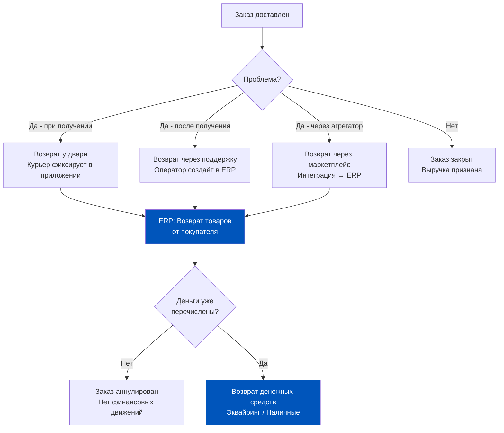
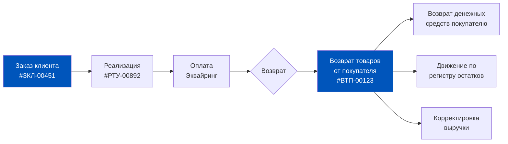
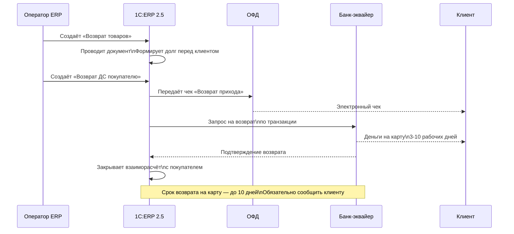
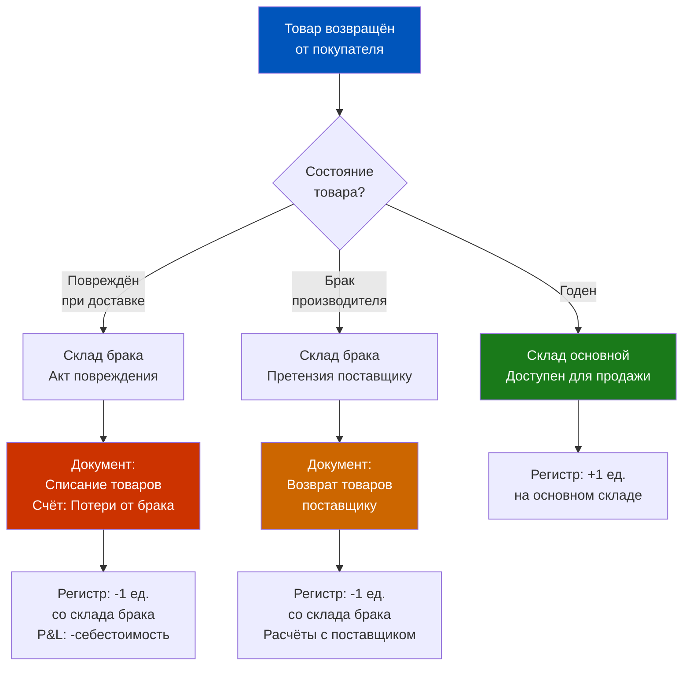
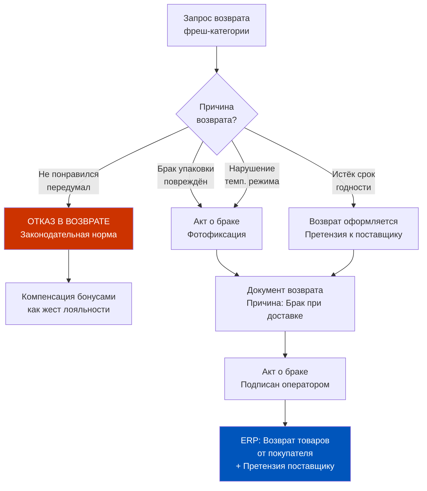
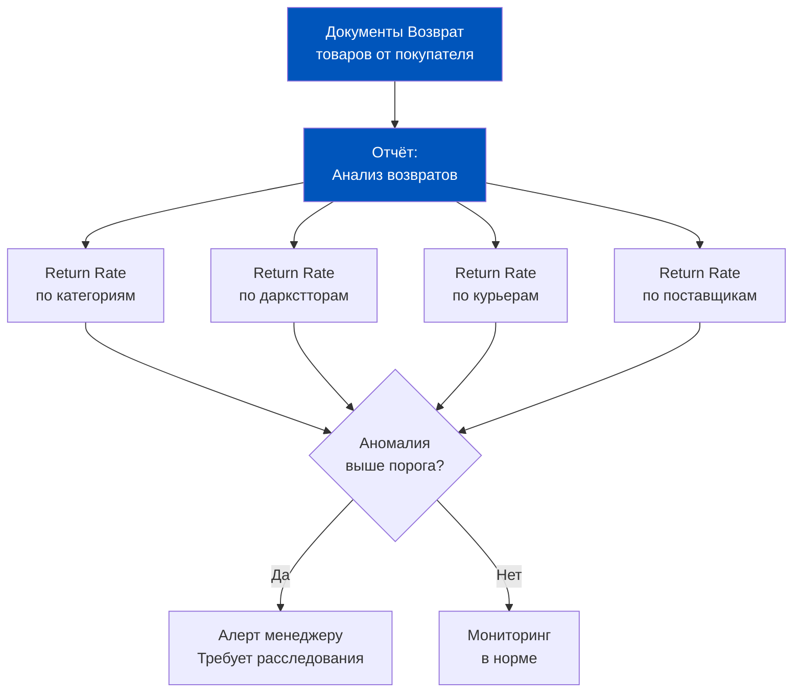
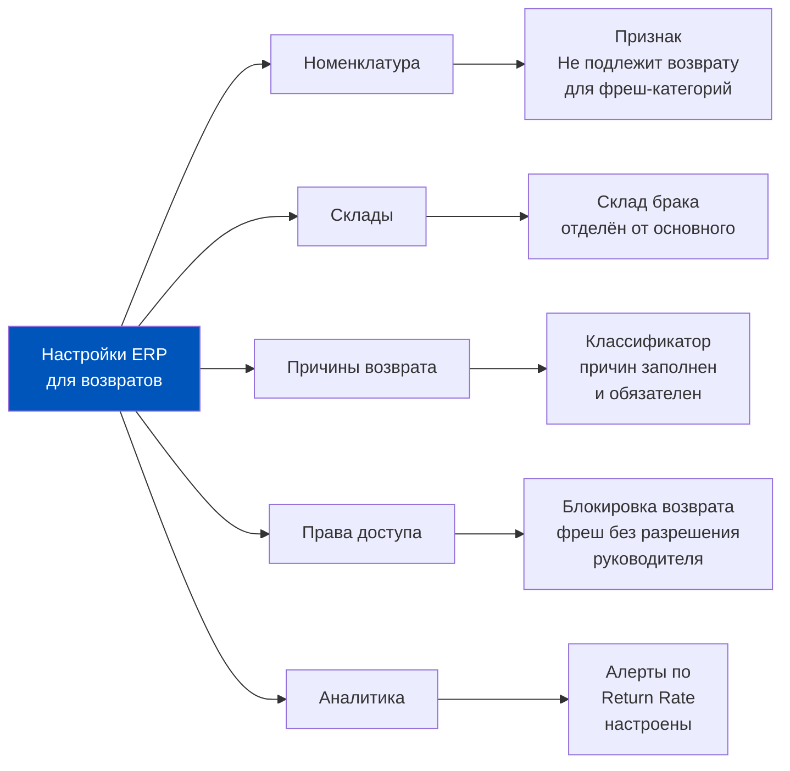
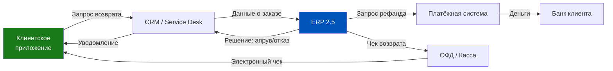

# Неделя 7. День 5. Возвраты от покупателей

> Возврат — это момент истины для Q-com операции. Клиент уже разочарован. У вас есть несколько минут и одна попытка, чтобы превратить негатив в лояльность. Всё зависит от того, насколько быстро и правильно ERP отработает обратную цепочку.

## Содержание

- [[#Часть 1. Анатомия возврата в Q-com]]
- [[#Часть 2. Документ «Возврат товаров от покупателя» в ERP 2.5]]
- [[#Часть 3. Возврат наличными и эквайринговый возврат]]
- [[#Часть 4. Что происходит с товаром после возврата]]
- [[#Часть 5. Возврат фреш-категорий: особые правила]]
- [[#Часть 6. Аналитика возвратов: что ERP рассказывает о качестве сервиса]]
- [[#Часть 7. Проектирование политики возвратов]]

---

## Часть 1. Анатомия возврата в Q-com

Представьте: курьер привозит молоко. Клиент открывает пакет — скисшее. Или другой сценарий: доставили пять позиций, а в пакете только четыре. Или клиент просто передумал — «не то заказал». Три разные ситуации, три разных юридических основания, три разных пути в ERP. И ни одна из них не похожа на обычный возврат в офлайн-магазин.

В Q-com возвраты — это отдельный операционный домен. Скорость доставки 15–30 минут означает, что курьер уже уехал к следующему клиенту, пока вы читаете это сообщение. Нет кассы, к которой можно подойти. Нет менеджера зала. Есть только приложение, колл-центр и ERP на другом конце.

### Типология возвратов по месту инициации

Первый тип — **возврат у двери**. Клиент обнаруживает проблему в момент получения заказа. Курьер ещё не уехал. Это самый дорогой возврат с точки зрения логистики: курьер должен физически забрать товар, довезти до даркстора, провести документ возврата. Либо курьер уезжает без товара — и тогда актируется брак на месте.

Ключевой вопрос для ERP: есть ли у курьера право создавать документ прямо в поле? В большинстве операционных моделей Q-com — нет. Курьер фиксирует отказ в мобильном приложении, которое через интеграционный слой передаёт событие в ERP. Дальше диспетчер или оператор создаёт документ возврата руками.

Второй тип — **возврат через поддержку**. Клиент обнаруживает проблему после того, как курьер уехал: бракованный товар, несоответствие заказу, короткий срок годности. Клиент пишет в чат поддержки. Оператор принимает решение: компенсировать бонусами, сделать повторную доставку или оформить денежный возврат. В ERP оператор создаёт документ возврата на основании обращения.

Третий тип — **возврат через маркетплейс**. Если заказ пришёл с Яндекс Маркета, Ozon Fresh или другого агрегатора, то возврат может быть инициирован через интерфейс агрегатора. Агрегатор уведомляет вашу операционную систему. Интеграционный слой передаёт событие в ERP. Сложность: агрегатор уже мог выплатить компенсацию клиенту от своего имени и ожидает дебетования от вас.

### Кто инициирует возврат и что это значит для учёта

Инициатор возврата определяет юридическую основу и финансовый механизм. Если клиент отказался до оплаты — это аннулирование заказа, не возврат. Если оплата прошла — возврат денежных средств обязателен. Именно поэтому в ERP 2.5 документ «Возврат товаров от покупателя» всегда имеет связь с исходным документом оплаты.

### Масштаб проблемы: цифры, которые меняют отношение к процессу

Return Rate в Q-com — 2–5% от количества заказов в нормальной операции. Звучит мало. Но при 10 000 заказов в день это 200–500 возвратных событий. Каждое требует документа в ERP, каждое влияет на регистры остатков, каждое может требовать возврата денег клиенту. Операционный масштаб огромен.

При этом стоимость одного возврата — непропорционально высокая относительно стоимости среднего заказа. Сюда входят: время оператора поддержки, повторная поездка курьера (если нужна), эквайринговая комиссия за возврат, потеря товара при браке. Правильная постановка учёта возвратов в ERP — это не формальность, это прямая экономия.

---

## Часть 2. Документ «Возврат товаров от покупателя» в ERP 2.5

Когда оператор открывает ERP для оформления возврата, перед ним документ с говорящим названием: «Возврат товаров от покупателя». Это не просто форма — это точка, в которой обратная логистика пересекается с финансовым учётом и регистрами остатков одновременно.

### Шапка документа: что заполняется и почему это важно

Первое поле — **организация**. Юридическое лицо, от имени которого был оформлен исходный заказ. Это критично: если у вас несколько юрлиц (отдельные ИП для разных даркстторов), возврат должен идти через то же юрлицо. Ошибка здесь — это налоговая проблема.

Второе поле — **склад**. Точка возврата остатков. Как правило — даркстор, с которого отгружался заказ. Но есть нюанс: если товар возвращается в повреждённом состоянии, его нельзя класть на основной склад. В ERP 2.5 для этого используется **склад брака** — отдельное место хранения с особым статусом номенклатуры.

Третье поле — **контрагент (покупатель)**. В B2C-модели Q-com это физическое лицо. В ERP 2.5 для работы с физлицами обычно создаётся сводный контрагент (например, «Покупатели розничные») или каждый клиент заводится отдельной карточкой. Второй подход сложнее в обслуживании, но даёт точную аналитику.

Четвёртое поле — **связь с исходным документом**. Документ «Возврат» в ERP 2.5 всегда должен быть привязан к «Заказу клиента» или «Реализации товаров и услуг». Это не просто рекомендация — это механизм, который позволяет ERP правильно пересчитать финансовый результат и не задвоить выручку.

### Поле «Причина возврата»: обязательность и классификатор

В ERP 2.5 поле «Причина возврата» — обязательное. Без него документ не проводится. Это не случайно: причина возврата определяет дальнейшую судьбу товара и финансовую аналитику.

Стандартный классификатор причин в Q-com ERP включает:
- Ненадлежащее качество товара (брак производителя)
- Нарушение срока годности
- Несоответствие заказу (доставили не то)
- Неполная комплектация заказа
- Повреждение при доставке
- Отказ покупателя без объяснения причин
- Брак упаковки

Каждая причина — это не просто метка. В корректно настроенной системе каждая причина ведёт к конкретному бизнес-процессу: «брак производителя» → претензия поставщику; «повреждение при доставке» → анализ работы курьера; «несоответствие заказу» → ошибка комплектации в даркстторе.

### Табличная часть: что возвращается

Табличная часть документа содержит номенклатуру, количество, цену возврата. Важный момент: цена возврата должна соответствовать цене в исходной реализации. Если клиент купил молоко за 89 рублей, возврат оформляется по 89 рублей. Нельзя возвращать по другой цене — это искажает финансовый результат.

### Что происходит с регистрами при проведении документа

При проведении «Возврата товаров от покупателя» ERP 2.5 делает следующие движения:

1. **Регистр накопления «Товары на складах»** — приходует товар обратно на указанный склад. Остаток физически восстанавливается.

2. **Регистр накопления «Взаиморасчёты с покупателями»** — формирует задолженность перед покупателем на сумму возврата. Это основание для последующего возврата денег.

3. **Регистр накопления «Выручка»** — сторнирует выручку по возвращённым позициям. Важно: сторнирование идёт в период, когда оформляется возврат, а не задним числом (если только не использовать ручную корректировку).

4. **Себестоимость** — здесь сложнее. При возврате ERP восстанавливает себестоимость возвращённого товара. Но поскольку в ERP 2.5 используется **себестоимость «По средней»**, восстановление идёт по текущей средней, а не по цене конкретной партии. Это важно учитывать при анализе прибыльности.

---

## Часть 3. Возврат наличными и эквайринговый возврат

Деньги вернуть — звучит просто. На практике это один из самых зарегулированных процессов в рознице. Q-com здесь не исключение: тот факт, что у вас нет физической кассы, не освобождает от требований 54-ФЗ.

### Чек возврата: налоговые требования

Закон 54-ФЗ требует: при возврате денег покупателю необходимо пробить кассовый чек с признаком расчёта «Возврат прихода». Это чек с отрицательной суммой с точки зрения фискального регистратора.

В Q-com операции касса чаще всего — это онлайн-касса, встроенная в платёжную инфраструктуру. При безналичной оплате чек возврата формируется и отправляется клиенту на email или в приложение. Физического «пробития» на устройстве нет, но фискальный документ обязателен.

### Эквайринговый возврат: механика

Когда клиент платил картой, деньги прошли через банк-эквайер. Возврат идёт тем же путём, только в обратном направлении. Технически это операция **refund** или **reversal** в процессинге.

**Reversal** (отмена) работает только в день транзакции, пока расчёты не прошли клиринг. В Q-com это редкий случай — клиент жалуется в тот же день.

**Refund** (возврат) — стандартный механизм, работает в любое время. Деньги возвращаются клиенту в течение 3–10 рабочих дней в зависимости от банка.

С точки зрения ERP: возврат через эквайера создаёт дополнительный документ «Возврат денежных средств покупателю» (или «Кассовый ордер» с типом «Возврат»). Этот документ:
- Закрывает задолженность из документа «Возврат товаров»
- Уменьшает остаток по расчётному счёту (реально деньги ушли)
- Фиксирует эквайринговую комиссию за возврат

### Эквайринговая комиссия при возврате: скрытые потери

Здесь часто упускают важный момент: при рефанде банк-эквайер **не возвращает** свою комиссию. Если за транзакцию вы заплатили 1,5% комиссии при приёме оплаты, при возврате эта комиссия не возвращается. Деньги уйдут клиенту в полном объёме, а комиссия останется банку.

Это значит, что каждый возврат — это не просто «отмена сделки». Это реальный убыток в размере эквайринговой комиссии от суммы возврата. При среднем чеке 800 рублей и комиссии 1,5% это 12 рублей потери на каждый возврат. При 300 возвратах в день — 3600 рублей потери только на комиссии.

### Наличный возврат: дополнительные ограничения

Если клиент платил наличными и возврат производится наличными, закон требует выдачу наличных из той же кассы, через которую прошёл приём. В Q-com с выездным курьером это практически невозможно: у курьера нет кассы для полноценного возврата. Поэтому стандартная практика — переключить клиента на возврат на счёт, даже если изначально он платил наличными. Юридически это возможно при согласии клиента.

---

## Часть 4. Что происходит с товаром после возврата

Деньги вернули, документ провели. А что с самим товаром? Вот где операционный менеджер часто делает первую ошибку: считает, что после проведения «Возврата» всё автоматически встало на место. Это не так.

Возвращённый товар может оказаться в трёх принципиально разных состояниях, и каждое требует отдельного сценария в ERP.

### Сценарий 1: Товар годен — обратно на полку

Клиент вернул нераспечатанную бутылку воды. Товар в идеальном состоянии, срок годности в порядке. Логика: вернуть в продажу.

В ERP: документ «Возврат товаров от покупателя» уже приходовал товар на склад (при условии, что в документе указан основной склад). Если склад правильный — товар автоматически доступен для новых заказов. Регистр «Товары на складах» показывает его наличие.

Но есть нюанс: в Q-com важно проверить, что система правильно определила **склад возврата**. Если в документе возврата указан «Склад брака» по умолчанию, а товар годен — нужно ещё одно движение: перемещение со склада брака на основной склад через «Перемещение товаров».

### Сценарий 2: Товар повреждён — списание

Курьер привёз молоко. Клиент вернул его — бутылка треснула при транспортировке. Товар нельзя продать. Нужно списание.

В ERP:
1. Документ «Возврат товаров от покупателя» с указанием **склада брака**.
2. Документ «Списание товаров» — фиксирует выбытие товара со склада брака.
3. Счёт затрат списания относится на «Потери от брака» или «Прочие операционные расходы» — в зависимости от вашей учётной политики.

Важно: списание влияет на P&L в текущем периоде. Если брак значительный, это заметная строка в операционных расходах.

### Сценарий 3: Товар с браком производителя — возврат поставщику

Молоко скисло раньше срока годности. Это производственный брак. Поставщик обязан принять претензию и компенсировать. Здесь возврат от клиента инициирует обратную цепочку: от даркстора к поставщику.

В ERP:
1. Документ «Возврат товаров от покупателя» — фиксирует возврат от клиента.
2. Документ «Возврат товаров поставщику» — инициирует претензию к поставщику.
3. Связь между документами — через партию товара. ERP должна «помнить», от какого поставщика поступил бракованный товар.

### Движения в регистрах по каждому сценарию

**Сценарий 1 (товар годен):**
- Регистр «Товары на складах»: +1 на основном складе
- Выручка: -89 руб. (сторно)
- Себестоимость: +себестоимость единицы (восстановлена)

**Сценарий 2 (списание):**
- Регистр «Товары на складах»: +1 на складе брака → 0 (после списания)
- Выручка: -89 руб. (сторно)
- P&L: -себестоимость единицы (списана в убытки)

**Сценарий 3 (возврат поставщику):**
- Регистр «Товары на складах»: +1 склад брака → 0 (после возврата поставщику)
- Регистр «Взаиморасчёты с поставщиком»: претензия на сумму закупочной цены
- P&L: нейтральный (если поставщик компенсирует)

### Автоматизация выбора сценария

В продвинутой настройке ERP 2.5 можно настроить автоматическое определение сценария по причине возврата. «Брак производителя» → автоматически направляет на претензию поставщику. «Повреждение при доставке» → на списание. Это убирает необходимость ручного выбора оператором и снижает ошибки.

---

## Часть 5. Возврат фреш-категорий: особые правила

Вот где Q-com принципиально отличается от любого другого ретейла. В супермаркете покупатель может вернуть йогурт, если не понравился вкус. В сервисе быстрой доставки — нет. И это не прихоть бизнеса, это законодательная норма плюс операционная реальность.

### Законодательная основа: что нельзя вернуть

Постановление Правительства РФ №2463 устанавливает перечень товаров, не подлежащих возврату и обмену. В этот перечень входят **продовольственные товары надлежащего качества** — то есть фреш-категории, если с ними всё в порядке.

Практический вывод: клиент не может вернуть купленный банан просто потому, что передумал. Если товар качественный — возврат незаконен. Если клиент настаивает — это ситуация для поддержки (компенсация бонусами, как жест лояльности), но не документ возврата в ERP.

### Как ERP блокирует возврат по типу номенклатуры

В ERP 2.5 каждая номенклатурная позиция имеет атрибут **«Вид номенклатуры»** и дополнительные реквизиты. В правильно настроенной системе для скоропортящихся товаров устанавливается признак «Не подлежит возврату».

При попытке создать документ «Возврат товаров от покупателя» с такой номенклатурой система либо:
- Выдаёт предупреждение (мягкая блокировка) — оператор может переопределить
- Запрещает проведение (жёсткая блокировка) — только руководитель может разблокировать

Для Q-com рекомендуется мягкая блокировка с обязательным указанием основания исключения. Жёсткая блокировка создаёт операционные сложности в нестандартных ситуациях.

### Исключение: брак при доставке

Исключение существует и оно важное: если скоропортящийся товар возвращается по причине **брака при доставке** (повреждение упаковки, нарушение температурного режима, явный дефект) — возврат оформляется как брак, а не как возврат товара надлежащего качества.

### Юридическое оформление «акта о браке»

Акт о браке — это документ, который подтверждает факт дефекта скоропортящегося товара. Без него ERP-документ возврата может быть оспорен при налоговой проверке (налоговая может поставить под сомнение законность уменьшения выручки).

Минимальный состав акта:
- Дата и время составления
- Номер заказа
- Перечень позиций с описанием дефекта
- Фотоматериалы (приложение к акту)
- Подпись оператора поддержки или руководителя смены

В некоторых Q-com операциях акт о браке формируется автоматически из ERP при выборе соответствующей причины возврата. Это идеальный вариант: документ создаётся без ручного ввода и сразу привязывается к возврату.

### Особый случай: возврат по истечении срока годности «до доставки»

Отдельная ситуация — клиент получил товар с истекающим сроком годности (например, молоко с датой «завтра»). Формально товар качественный. Но нарушение оферты возможно: если в описании было указано «срок годности не менее 3 дней» — у клиента есть основания.

В ERP это фиксируется как «Несоответствие условиям договора (оферты)» — отдельная причина возврата. Она инициирует не только документ возврата, но и внутреннюю проверку: какой партии товар? Какое время комплектации? Кто выбирал позицию на складе?

---

## Часть 6. Аналитика возвратов: что ERP рассказывает о качестве сервиса

Операционный директор смотрит на Return Rate как на индикатор здоровья всей цепочки. Но Return Rate — это только верхушка айсберга. ERP 2.5 хранит данные, которые позволяют разложить каждый процентный пункт возвратов до уровня конкретного курьера, конкретного даркстора или конкретного поставщика.

### Ключевые метрики из аналитики возвратов

**Return Rate по категориям.** Молочная продукция возвращается чаще, чем бытовая химия? Это сигнал о проблеме с управлением температурной цепью или с поставщиком. ERP строит этот разрез через связку: номенклатура → категория → причина возврата.

**Return Rate по курьерам.** Один курьер с Return Rate 8%, другой — 1%. Что происходит? Либо разная аккуратность при транспортировке, либо первый работает в проблемном районе с недовольными клиентами. ERP даёт данные — разбираться нужно операционно.

**Return Rate по даркстторам.** Даркстор «Орион» возвращает 4%, «Сигма» — 1,5%. Разная культура комплектации заказов? Разное качество входящих поставок? Разный состав курьерского парка? Аналитика ERP ставит вопрос, на который нужно отвечать в поле.

### Отчёт «Анализ возвратов» в ERP 2.5

В стандартной конфигурации ERP 2.5 отчёт «Анализ возвратов» строится из документов возврата и позволяет срезать данные по:
- Периоду (день, неделя, месяц)
- Подразделению (даркстор)
- Менеджеру (курьер, оператор)
- Номенклатуре и категории
- Причине возврата

Для Q-com критически важно настроить **автоматические алерты**: если Return Rate по категории или даркстору превышает пороговое значение (например, 5%), система должна уведомить ответственного менеджера. Это не делается из коробки, но настраивается через регламентные задания ERP.

### Полная стоимость возврата: что включить в расчёт

Ошибка многих команд: считать стоимость возврата только как себестоимость потерянного товара. Реальная картина сложнее.

Полная стоимость одного возврата включает:
1. **Себестоимость товара** (если списывается): 40–200 руб.
2. **Эквайринговая комиссия**: не возвращается банком, 1–2% от суммы
3. **Трудозатраты оператора поддержки**: 5–15 минут × ставка
4. **Логистические затраты**: повторный визит курьера (если нужен)
5. **Стоимость складской обработки**: приём, сортировка, утилизация

При правильной настройке ERP каждый из этих компонентов может быть измерен. Себестоимость — из регистра себестоимости. Эквайринг — из документа возврата ДС. Трудозатраты — из нормирования по операциям. Логистика — из маршрутных листов курьеров.

Совокупная стоимость одного возврата в Q-com — 150–400 рублей в зависимости от операционной модели. При среднем чеке 700–900 рублей это 20–50% от выручки заказа. Именно поэтому Return Rate 5% — это не «мелочь», это серьёзная операционная проблема.

---

## Часть 7. Проектирование политики возвратов

Вы прочитали про анатомию возврата, документы ERP, деньги, товар и аналитику. Теперь вопрос: как всё это собрать в работающую политику? Политика возвратов — это не документ в папке с регламентами. Это набор правил, жёстко зашитых в ERP, которые делают правильное поведение автоматическим, а неправильное — невозможным.

### Матрица: тип возврата × категория товара × решение в ERP

| Тип возврата | Категория | Решение в ERP | Документы |
|---|---|---|---|
| Отказ у двери, товар годен | Непродовольственный | Возврат на основной склад | Возврат ТП |
| Отказ у двери, товар годен | Фреш | Отказ (блокировка) | — |
| Брак при доставке | Любая | Возврат на склад брака → Списание | Возврат ТП + Списание |
| Брак производителя | Любая | Возврат на склад брака → Претензия | Возврат ТП + Возврат поставщику |
| Несоответствие заказу | Любая | Возврат + повторная отгрузка | Возврат ТП + Реализация |
| Истекающий срок год. | Фреш | Возврат + Претензия поставщику | Возврат ТП + Акт |

### Чеклист настроек ERP для управления возвратами

### Контрольные точки для продакта

Как продакт-менеджер, ваша задача — убедиться, что политика возвратов не просто описана в регламенте, но реализована в системе. Несколько вопросов для аудита:

1. **Блокировка фреш.** Попробуйте оформить тестовый возврат молока с причиной «передумал». ERP должна остановить вас.
2. **Обязательность причины.** Попробуйте провести документ без причины возврата. Система должна требовать её заполнения.
3. **Склад брака.** Создан ли отдельный склад для бракованного товара? Он физически изолирован от основного складского учёта?
4. **Цепочка документов.** Каждый возврат денег должен быть привязан к возврату товара. Проверьте, нет ли «висящих» возвратов ДС без исходного документа.
5. **Аналитика.** Есть ли отчёт по Return Rate? Кто его смотрит и с какой периодичностью?

### Главный вывод: возврат — часть операционного процесса

В офлайн-ретейле возврат — это исключение. Специальная стойка, специальный сотрудник, специальный процесс. В Q-com возврат — это ежедневная операция, которая должна работать так же бесперебойно, как доставка.

Правильно выстроенный процесс возвратов в ERP:
- Снижает трудозатраты оператора (меньше ручного ввода)
- Даёт точную аналитику (знаем, где теряем и почему)
- Защищает компанию юридически (чеки, акты, документы в порядке)
- Создаёт основу для претензий к поставщикам (брак не поглощается убытками)

Возврат — это не конец сделки. Это начало расследования: почему произошло и как предотвратить в следующий раз. ERP 2.5 даёт инструменты для этого расследования. Использовать их или нет — выбор команды.

### Возвратная воронка: от события до решения

Каждый возврат проходит через цикл, который в хорошо настроенной системе занимает минуты, а в плохо настроенной — дни.

На каждом шаге воронки возможна задержка. Регистрация — если нет мобильного инструмента для курьера или оператора. Классификация — если причины возврата не стандартизированы и каждый заполняет по-своему. Финансовое решение — если нет чётких полномочий у оператора (нужно звонить руководителю). Документальное оформление — если процесс не автоматизирован.

Ваша задача как продакта — минимизировать задержку на каждом шаге. Цель: от события возврата до проведённого документа в ERP — не более 5 минут в стандартном сценарии.

### Автоматизация возвратов: три уровня зрелости

**Уровень 1 — Ручной.** Оператор получает запрос, открывает ERP, создаёт документ руками. Время: 10–15 минут. Ошибки: частые (ручной ввод). Масштаб: до 50 возвратов/день.

**Уровень 2 — Полуавтоматический.** Запрос возврата фиксируется в CRM или приложении поддержки. Одним кликом создаётся заготовка документа в ERP с предзаполненными полями из исходного заказа. Оператор только проверяет и подтверждает. Время: 2–5 минут. Масштаб: до 300 возвратов/день.

**Уровень 3 — Автоматический.** Решение о возврате принимается автоматически по правилам (стоимость до N рублей → автоапрув; клиент с рейтингом выше X → автоапрув; брак категории «скоропорт» → автоапрув с актом). ERP создаёт документ без участия оператора. Финансовый возврат отправляется автоматически. Оператор проверяет только нестандартные случаи. Время: секунды. Масштаб: неограничен.

Большинство Q-com компаний находятся между Уровнем 1 и Уровнем 2. Переход на Уровень 3 требует зрелой интеграции между CRM, ERP и платёжной системой — это проект на несколько месяцев, но он кратно снижает операционные расходы на обработку возвратов.

### Как измерять зрелость процесса возвратов

Несколько метрик, которые показывают, насколько хорошо выстроен процесс:

**Время обработки возврата** — от момента запроса до проведённого документа в ERP. Целевой показатель: <10 минут для стандартного случая.

**Доля «зависших» возвратов** — запросы, по которым документ в ERP не создан в течение 24 часов. Целевой показатель: 0%. Каждый зависший возврат — это потенциальная претензия клиента и некорректный остаток в ERP.

**Доля возвратов без причины** — документы, где поле «Причина» не заполнено. Целевой показатель: 0%. Если система позволяет проводить документ без причины — это ошибка настройки.

**Точность предсказания Return Rate** — насколько ваши прогнозы Return Rate совпадают с фактом. Хорошая аналитическая система должна давать прогноз с точностью ±0,5 п.п.

### Возвратная политика как продуктовое решение

Продакт-менеджер в Q-com принимает решения о возвратной политике точно так же, как о features в продукте: формулирует гипотезу, тестирует, измеряет, итерирует.

Пример гипотезы: «Если мы увеличим срок, в течение которого клиент может запросить возврат, с 24 часов до 72 часов — NPS вырастет, а Return Rate не вырастет значимо».

Тест: ввести изменение на части клиентов (A/B тест на уровне сегментов). Метрики: NPS, Return Rate, средний чек повторного заказа после возврата.

Результат: если NPS вырос на 5 пунктов, а Return Rate вырос на 0,3% — это выгодный обмен. Стоимость дополнительных 0,3% возвратов < стоимости 5 пунктов NPS в LTV клиента.

ERP здесь — не просто учётная система. Это инструмент A/B тестирования операционных политик: через неё вы видите финансовый результат каждого варианта.

### Регистр «Взаиморасчёты с покупателями»: детальный разбор при возвратах

Один из наименее очевидных аспектов работы с возвратами — это то, что происходит с долгом перед клиентом между моментом оформления возврата товара и моментом фактического возврата денег. В ERP 2.5 этот промежуток учитывается через регистр «Взаиморасчёты с покупателями» — и именно здесь кроется источник расхождений в отчётности.

**Цикл взаиморасчётов при возврате:**

1. Заказ оплачен → регистр фиксирует: покупатель свои обязательства выполнил, задолженность = 0
2. Документ «Возврат товаров от покупателя» проведён → регистр фиксирует: компания должна покупателю N рублей
3. Документ «Возврат ДС покупателю» проведён → регистр обнуляется, долг закрыт

Пока шаги 2 и 3 не закрыты, в регистре «висит» кредиторская задолженность перед покупателями. В масштабе Q-com это может быть значительная сумма. Если возвраты оформляются, но деньги не возвращаются вовремя (или возвращаются, но документ в ERP не проведён) — эта задолженность накапливается.

Для финансового контролёра: возраст дебиторской/кредиторской задолженности по покупателям — один из ключевых показателей качества учёта возвратов. Если в регистре есть «висящие» возвраты старше 14 дней — это либо незавершённые операции, либо ошибки учёта.

### Спорные ситуации: когда клиент не прав, но сложно доказать

Не все запросы возврата обоснованы. В Q-com периодически встречается паттерн злоупотреблений: клиент регулярно заявляет, что «товар не тот» или «упаковка повреждена», получает компенсацию, но при этом продолжает пользоваться товаром.

ERP 2.5 позволяет выявлять таких клиентов через аналитику: если у одного контрагента Return Rate значимо выше среднего по базе (например, 15–20% при норме 2%), это сигнал для проверки. В разрезе документов возврата по данному контрагенту можно увидеть паттерн: одни и те же причины, одни и те же категории.

Политика реагирования — на усмотрение компании: ограничение суммы автоматической компенсации, требование фотодокументации, ограничение промо-доступа. Важно: любые ограничения должны быть прописаны в оферте — иначе есть риск нарушения прав потребителей.

### Интеграция процесса возвратов с клиентским сервисом

В идеальной архитектуре процесс возврата — это бесшовный опыт для клиента: он делает запрос в приложении, система автоматически принимает решение и мгновенно уведомляет о возврате денег. За этой простотой — сложная интеграция между несколькими системами.

Каждая стрелка на этой схеме — это интеграционная точка. Каждая интеграционная точка — потенциальный сбой. Правильная архитектура предусматривает:

- Идемпотентность: повторный запрос не создаёт дублирующийся возврат
- Логирование: каждое событие записывается с временной меткой для последующего расследования
- Уведомления об ошибках: если ERP не смогла создать документ — система уведомляет оператора, а не «молча» теряет запрос
- Graceful degradation: если платёжная система недоступна, документ возврата в ERP всё равно проводится, возврат денег встаёт в очередь

---

← [[Неделя 7 - День 4 - Интеграция с маркетплейсами|← День 4]] | [[1c_erp_qcom/README|Оглавление]] | [[Неделя 7 - День 6 - Практикум по цепочке доставки|День 6 →]]
