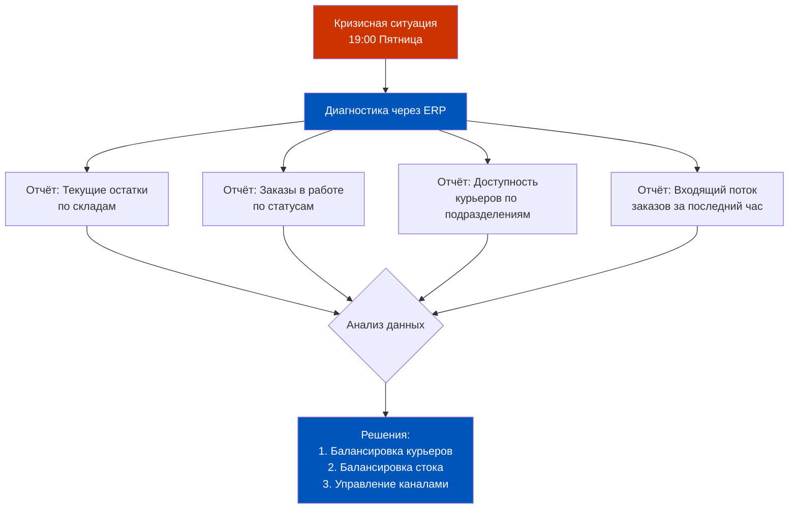
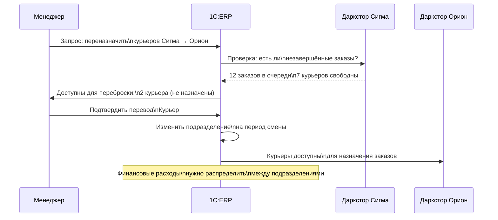
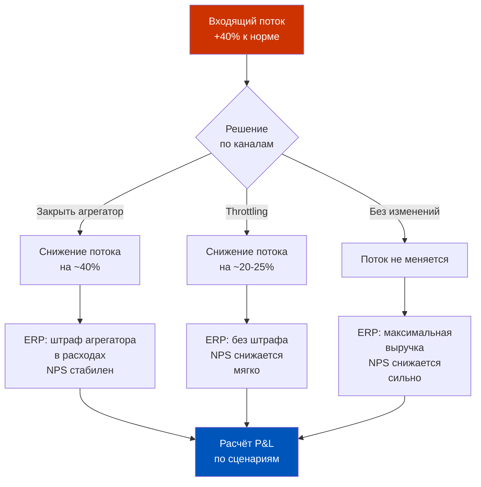
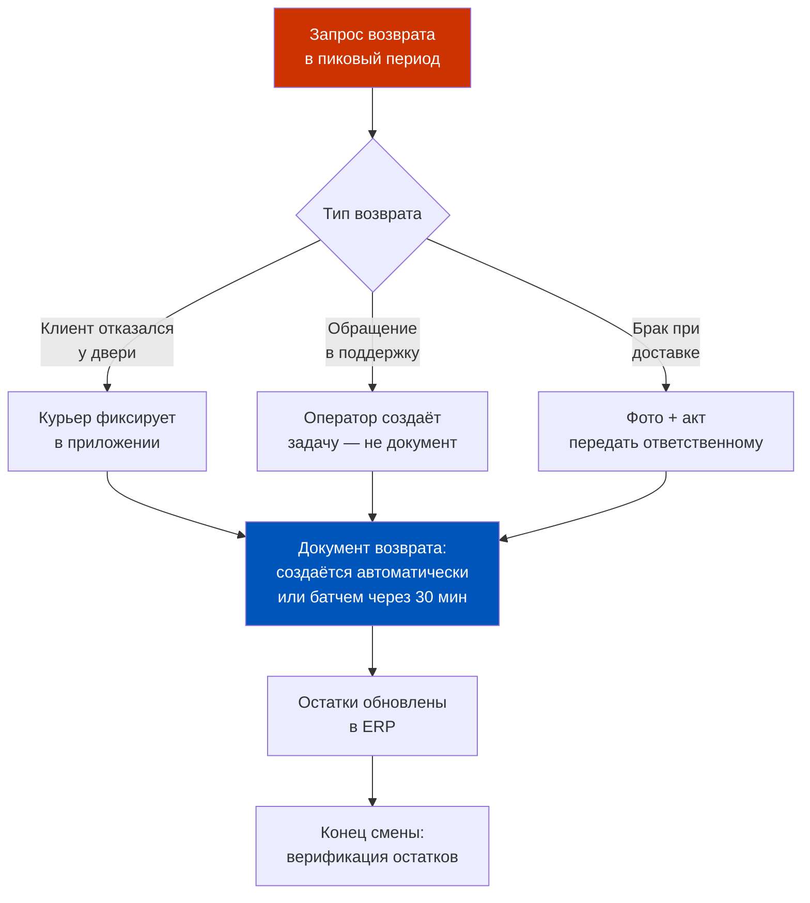
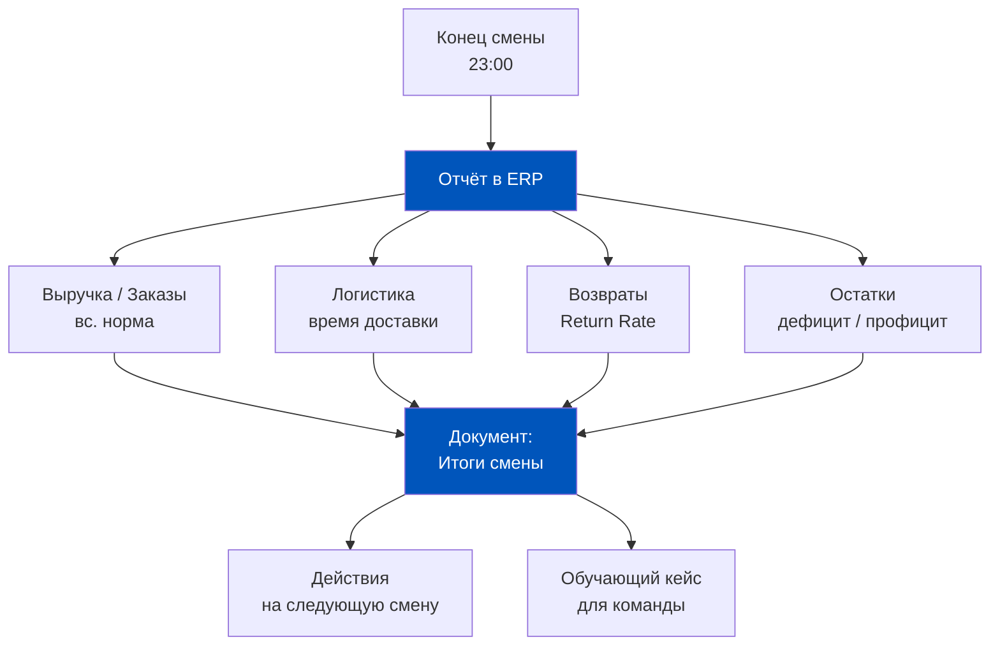
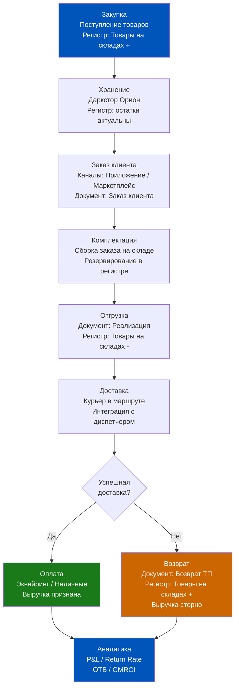
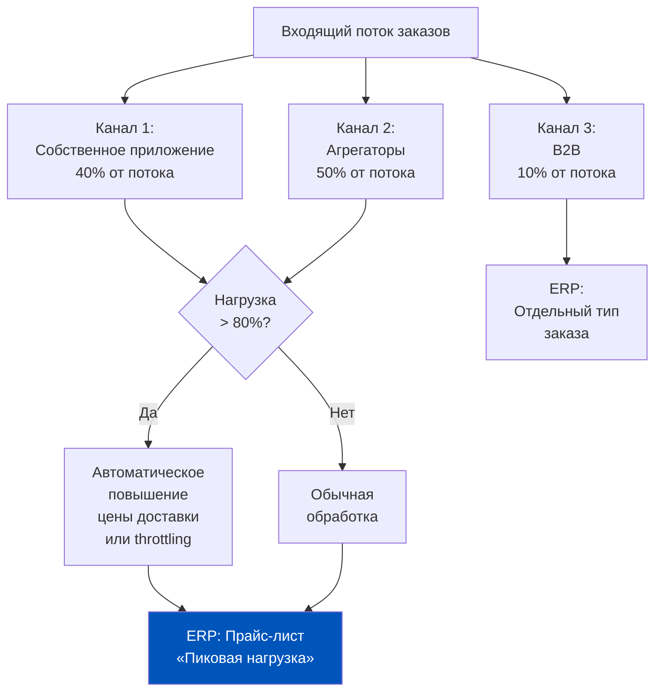

# Неделя 7. День 6. Практикум по цепочке доставки

> Теория — это карта. Практика — это территория. Сегодня мы работаем с территорией: пятница, дождь, три курьера не вышли на смену, промо горит, а в соседнем даркстторе профицит и ресурсов, и товара.

## Содержание

- [[#Часть 1. Введение в задачу: диагностика через ERP]]
- [[#Часть 2. Балансировка ёмкости: перераспределение курьеров]]
- [[#Часть 3. Балансировка стока: какие SKU и в каком объёме]]
- [[#Часть 4. Управление каналами: ограничить ли агрегатор]]
- [[#Часть 5. Возвраты в условиях пиковой нагрузки]]
- [[#Часть 6. Итоги смены: отчёт и фиксация для следующей пятницы]]
- [[#Часть 7. Синтез недели: полная цепочка через ERP]]

---

## Часть 1. Введение в задачу: диагностика через ERP

**Сценарий дня.** Пятница, 19:00. За окном ливень. Даркстор «Орион» — один из ключевых узлов вашей сети. Восемь курьеров в расписании. Из них трое не вышли: один заболел, двое попали в пробки и опоздали настолько, что первый час смены уже потерян.

На Яндекс Маркете и собственном приложении активна промо-акция: «15% кэшбэк на все заказы». Запущена в понедельник, рассчитана до воскресенья. Маркетинг не предупредил операции о масштабе. В пятничный вечер под дождём акция работает как катализатор: входящий поток заказов вырос на 40% относительно обычной пятницы.

В шести километрах — даркстор «Сигма». У них сегодня нестандартная ситуация: два дополнительных курьера вышли на подмену (плановая ротация), но заказов меньше обычного (их зона покрытия — спальный район, пятничный вечер не пик). Плюс: на «Сигме» профицит молочной группы — поставка пришла вчера, а плановые продажи отстают.

Ваша задача — управлять ситуацией. Не вручную, не интуитивно, а через ERP.

### Первый шаг: открыть правильные отчёты

Прежде чем принимать любое решение, нужно понять реальную картину. Это не разговор с диспетчером по телефону. Это данные из системы.

**Что смотрим в ERP прямо сейчас:**

Отчёт 1 — **«Товары на складах» в разрезе даркстторов**. Нас интересует «Орион» и «Сигма». По каждому складу: текущий остаток, остаток на момент начала смены, отгружено за последние 2 часа. Это даёт понимание, как быстро тает сток под нагрузкой.

Отчёт 2 — **«Заказы клиентов» по статусам**. Статусы в Q-com: «Принят», «В сборке», «Передан курьеру», «Доставлен», «Отменён». Нас интересует очередь: сколько заказов в статусе «Принят» и «В сборке» на «Орионе» прямо сейчас. Это реальная очередь ожидания.

Отчёт 3 — **«Ресурсы доставки» или аналог**. В ERP 2.5 в зависимости от конфигурации это может быть блок управления транспортом или интеграция с диспетчерской системой. Нас интересует: сколько курьеров «Ориона» сейчас в поле, сколько на базе, сколько недоступны.

Отчёт 4 — **«Динамика заказов»**. Количество заказов за последний час в разрезе каналов (приложение, маркетплейс). Это покажет, работает ли промо и насколько агрессивно.

### Что мы видим: данные кризисного момента

После открытия отчётов картина следующая. «Орион»: 47 заказов в очереди (в статусах «Принят» и «В сборке»). Норматив ожидания — 15 минут. При 5 активных курьерах (из 8 по расписанию) и среднем времени доставки 22 минуты — расчётное отставание уже 35 минут и растёт. Остатки по молочной группе: уровень достаточный, но при текущем темпе продаж через 2 часа будет дефицит по ряду SKU.

«Сигма»: 12 заказов в очереди. 7 курьеров доступны. Остатки молочной группы: профицит — уровень 140% от норматива.

Диагностика завершена. Начинаем принимать решения.

---

## Часть 2. Балансировка ёмкости: перераспределение курьеров

Идея перебросить курьеров с «Сигмы» на «Орион» кажется очевидной. Но в ERP это не переключение тумблера. Это последовательность операций, которая затрагивает несколько регистров и бизнес-процессов.

### Почему это сложнее, чем «просто сказать курьеру ехать»

Курьер в Q-com — это ресурс, привязанный к конкретному подразделению (даркстору) в ERP. У него есть:
- Плановый график на смену (документ «Плановая загрузка»)
- Незавершённые заказы, привязанные к его маршруту
- Зона доставки, определённая для его базового даркстора

Если мы просто физически направим курьера «Сигмы» на «Орион», в ERP это создаст коллизию: заказы нового даркстора будут назначаться курьеру, который в системе числится за «Сигмой». Финансовый учёт расходов на доставку пойдёт не в то подразделение. Аналитика по KPI курьера будет искажена.

### Механика перераспределения в ERP 2.5

Правильная последовательность операций в ERP при балансировке курьеров:

**Шаг 1.** Убедиться, что курьер не привязан к активному заказу. В ERP смотрим документы доставки со статусом «В маршруте» — по конкретному курьеру.

**Шаг 2.** Временное изменение подразделения курьера. В зависимости от конфигурации это может быть изменение в карточке сотрудника (нежелательно — постоянное изменение) или создание документа «Временная командировка» / записи в регистре сведений «Плановая загрузка ресурсов».

**Шаг 3.** Изменение зоны доставки. Если зоны жёстко зашиты в ERP через геофенсинг, нужно расширить зону «Ориона» на часть зоны «Сигмы» на период балансировки.

**Шаг 4.** Уведомление диспетчерской системы. ERP через интеграцию должна передать обновлённый список доступных курьеров диспетчерскому алгоритму.

### Сколько курьеров перебрасывать: расчёт

Не нужно выгребать всю «Сигму». Нужно ровно столько, чтобы ликвидировать очередь «Ориона» и не создать дефицит на «Сигме».

Расчёт по данным ERP:
- «Орион»: 47 заказов в очереди, 5 курьеров, среднее время доставки 22 мин.
- Текущая пропускная способность «Ориона»: 5 × (60/22) ≈ 13,6 заказов/час
- Входящий поток с промо: ~25 заказов/час (на 40% выше нормы)
- Дефицит ёмкости: 25 - 13,6 = 11,4 заказов/час
- Нужно дополнительных курьеров: 11,4 / (60/22) ≈ 4,2 → 4 курьера

Вывод: переброска 4 курьеров с «Сигмы» ликвидирует дефицит ёмкости. На «Сигме» остаётся 3 курьера для собственного потока 12 заказов в час — этого достаточно.

---

## Часть 3. Балансировка стока: какие SKU и в каком объёме

Курьеров перебросили. Но через 2 часа на «Орионе» возникнет дефицит молочной группы. «Сигма» сидит на профиците. Это второй фронт кризиса.

### Диагностика через регистры остатков ERP

В ERP 2.5 для межскладского перемещения используется документ **«Перемещение товаров»**. Он создаёт:
- Расход на складе-источнике («Сигма»)
- Приход на складе-получателе («Орион»)
- Изменение в регистре «Товары на складах» по обоим складам
- Транспортные затраты (если учитываются) — относятся на операционные расходы

### Какие SKU балансировать

Приоритет перемещения определяется двумя факторами: **скорость оборота** и **критичность для ассортимента**.

Молочная группа на «Орионе»: топ-10 SKU по продажам за прошлую пятницу. Смотрим в ERP отчёт «АВС-анализ продаж» в разрезе дня недели. Скорее всего это: молоко 1л 3,2%, кефир 1%, творог 5%, сметана 15% — классика пятничных корзин.

Фильтруем: у «Сигмы» эти SKU есть в достаточном количестве? Проверяем через тот же регистр остатков. Если есть — они первые кандидаты на перемещение.

### Объём перемещения: расчёт

Принцип: перемещаем ровно столько, чтобы «Орион» дотянул до утренней поставки без дефицита.

Для каждого SKU:
- Текущий остаток «Ориона»
- Темп продаж за последние 2 часа (экстраполируем на оставшиеся 4 часа смены)
- Прогнозный остаток к концу смены = текущий - (темп × 4 часа)
- Если прогнозный остаток < страховой запас → дефицит
- Объём перемещения = дефицит + буфер 20%

Это вычислимо из ERP без Excel. Отчёт «Прогноз остатков» или, в ручном режиме, «Анализ доступности товаров» даёт эти числа.

### Документ «Перемещение товаров»: ключевые поля

Обязательные поля при создании документа перемещения в кризисной ситуации:
- **Склад-отправитель**: Сигма
- **Склад-получатель**: Орион
- **Время отгрузки**: текущее (или планируемое, если нужен курьер для доставки)
- **Ответственный**: менеджер смены
- **Комментарий**: «Балансировка пиковой нагрузки — пятница» (важно для последующего анализа)

Провести документ нужно до фактического перемещения физического товара. Иначе ERP и реальность разойдутся: в системе товар ещё на «Сигме», а физически он уже в машине на пути к «Ориону».

---

## Часть 4. Управление каналами: нужно ли ограничить агрегатор

Это самый неочевидный, но потенциально самый важный рычаг в вашем распоряжении. Агрегатор (Яндекс Маркет, Ozon Fresh) генерирует входящий поток. Если ёмкость ограничена — можно ограничить поток.

### Три позиции менеджера в этой ситуации

**Позиция 1: Закрыть приём заказов с агрегатора.** Радикально. Агрегатор выдаёт «нет в наличии» или «временно не работаем». Поток падает. Но: штрафные санкции от агрегатора за закрытие в рабочее время, потеря позиций в выдаче, отток клиентов к конкурентам.

**Позиция 2: Ограничить объём заказов (throttling).** Если интеграция позволяет — выставить лимит на количество одновременных заказов из агрегатора. Агрегатор показывает «задержка доставки» вместо «нет в наличии». Клиент может подождать или уйти — его выбор.

**Позиция 3: Ничего не делать, отработать как есть.** Принять задержку. Пусть время доставки вырастет с 22 до 40 минут. Если промо работает — это всё равно выгодно, просто с ухудшенным NPS.

### Что говорит ERP об экономике каждой позиции

В ERP после смены вы увидите разницу в строках:
- Выручка: максимальна при сценарии «без изменений»
- Расходы на логистику: максимальны при сценарии «без изменений» (каждая задержка — риск возврата и повторной доставки)
- Возвраты: коррелируют с задержками (NPS падает → возвраты растут)

Сценарий throttling — как правило, оптимальный баланс. Он реализуется через API интеграции с агрегатором, а не через ERP напрямую. Но ERP фиксирует результат: сравните Return Rate в пятницы с throttling и без.

### Ограничение через собственный канал

Если входящий поток большой не из агрегатора, а из собственного приложения — там можно управлять через динамическое ценообразование или временным изменением стоимости доставки. Если доставка стоит 99 рублей, а в пик — 149 рублей, часть клиентов отложит заказ. Это не манипуляция: это честный сигнал о высоком спросе. В ERP это отражается через прайс-листы с привязкой к условиям (время суток, нагрузка).

---

## Часть 5. Возвраты в условиях пиковой нагрузки

Пиковая нагрузка и возвраты — это взаимно усиливающиеся проблемы. Когда курьер торопится из-за очереди заказов, качество доставки падает. Повреждений больше, ошибок комплектации больше, времени на приёмку возвратов меньше.

### Почему возвраты в пик особенно опасны

В обычной ситуации оператор обрабатывает возврат за 5–7 минут. В пиковой нагрузке:
- Оператор перегружен основным потоком заказов
- Возвратный документ создаётся «на потом»
- «Потом» накапливается — к концу смены стопка необработанных возвратов
- Регистр остатков не актуален: товар физически есть на складе, но ERP его не видит
- Система продаёт позиции, которых нет, или не продаёт то, что вернулось и годно

Это системная ошибка, которую видно только на следующий день при сверке инвентаря.

### Протокол возвратов при пиковой нагрузке

**Ключевое решение для пика:** не обрабатывать каждый возврат немедленно вручную — это занимает слишком много времени оператора. Вместо этого:

1. Создаётся «буферный список» возвратов (через приложение курьера или простую форму)
2. Каждые 30 минут — пакетная обработка в ERP (batch processing)
3. Один оператор назначается ответственным за очередь возвратов на пиковую смену

Это не идеально с точки зрения актуальности остатков — есть задержка 30 минут. Но это лучше, чем полный хаос.

### Что настроить в ERP до следующего пика

Несколько конфигурационных изменений, которые снизят нагрузку в следующую пятницу:

**Автоматическое создание документа возврата** при фиксации отказа в мобильном приложении курьера. Без участия оператора. Документ создаётся в статусе «Черновик» — оператор только подтверждает.

**Шаблоны причин возврата** в мобильном приложении поддержки. Оператор не вводит текст, а выбирает из списка. Экономия 2–3 минуты на каждом возврате.

**Авторасчёт суммы возврата** из исходного заказа. Оператор не вводит цену вручную — ERP подтягивает из реализации.

---

## Часть 6. Итоги смены: отчёт и фиксация для следующей пятницы

Смена заканчивается. 23:00. Дождь утих. «Орион» отработал напряжённо, но без коллапса. Что теперь?

Самое важное, что можно сделать сейчас — зафиксировать всё, что произошло, в структурированном виде. Не в мессенджере. В ERP и в базе знаний команды.

### Отчёт по итогам смены через ERP

**Блок 1: Выручка и заказы.** Сколько заказов обработано, какая выручка, средний чек. Сравнить с предыдущей пятницей и с нормой. Эффект промо-акции в цифрах.

**Блок 2: Логистика.** Среднее время доставки по смене (из диспетчерской системы через интеграцию в ERP). Количество просроченных доставок (>30 мин). Какой вклад перекинутых курьеров с «Сигмы».

**Блок 3: Возвраты.** Return Rate за смену. Топ-3 причины возвратов. Стоимость возвратов в абсолютных цифрах.

**Блок 4: Остатки.** Остаток на «Орионе» к концу смены. Какие позиции ушли в ноль или ниже страхового запаса. Эффективность балансировки стока с «Сигмы».

### Что зафиксировать для следующей пятницы

ERP хранит данные, но не хранит контекст принятых решений. Это работа менеджера: к стандартным данным добавить:

1. **Триггер кризиса**: промо без предупреждения операций + 3 выпавших курьера + дождь.
2. **Решения и их эффект**: перебросили 4 курьера — очередь сократилась с 47 до 15 за 45 минут. Перемещение 6 SKU молочной группы с «Сигмы» — дефицита не было.
3. **Что сработало плохо**: пакетная обработка возвратов с 30-минутной задержкой создала 12 позиций с некорректным остатком в ERP в течение смены.
4. **Предложения по улучшению**: автоматическое создание документа возврата из приложения курьера (оценка трудозатрат на разработку: 2 спринта).

Этот контекст — золото для операционного планирования. Следующий раз, когда маркетинг запустит промо в пятницу — у вас будет не ощущение, что «что-то пошло не так», а чёткий план действий с конкретными порогами: при нехватке N курьеров — перебрасываем с соседнего даркстора; при прогнозе дефицита M SKU — запускаем балансировку стока.

### Финансовое подведение итогов

Цифры из ERP по итогам пятницы позволяют ответить на вопрос: была ли промо-акция прибыльной?

Выручка выросла на 40%. Но также выросли: логистические расходы (4 дополнительных курьера, перемещение стока), расходы на возвраты (выше Return Rate при спешке), разовые затраты на балансировку. ERP позволяет сделать этот расчёт в разрезе «маркетинговое мероприятие» — если в документах правильно проставить аналитику (статью ДДС и аналитику расходов).

---

## Часть 7. Синтез недели: полная цепочка «Шельф — Курьер — Клиент» через ERP

Неделя 7 была посвящена операционному слою Q-com: как данные движутся через ERP от момента появления товара на полке даркстора до момента, когда деньги оказались на счёте. Сегодняшний практикум — это не просто кейс. Это полная демонстрация того, как все части системы работают вместе под нагрузкой.

### Полная цепочка в одной схеме

### Какие темы недели работали вместе сегодня

**Балансировка курьеров** (День 2 недели) — сегодня мы применили логику перераспределения ресурсов в реальном времени, используя данные ERP о доступности и загрузке.

**Балансировка стока** (День 3 недели) — перемещение товаров между «Сигмой» и «Орионом» — это та же межскладская балансировка, только в кризисном режиме.

**Интеграция с маркетплейсами** (День 4 недели) — решение об ограничении потока с агрегатора базируется на понимании того, как данные о доступности передаются через API.

**Возвраты** (День 5 недели) — сегодня мы увидели, как возвраты в пик становятся операционной угрозой, и настроили протокол их обработки.

### Что операционный менеджер должен знать наизусть

Три числа, которые определяют качество операции в Q-com:

**Time to Deliver** — среднее время от создания заказа до доставки. Целевой показатель: 25–35 минут. ERP видит его через временные метки статусов заказа.

**Return Rate** — доля возвратов от общего количества заказов. Целевой показатель: <3%. ERP считает его из документов возврата.

**Stock Availability** — доля SKU, доступных для заказа (не в дефиците). Целевой показатель: >97%. ERP видит через регистр остатков и заявки, по которым не было остатка.

Эти три числа — ваш пульс операции. Если все три в норме — можно спать спокойно. Если хоть одно выходит за порог — открывайте ERP и ищите причину в данных, не в мессенджерах.

### Урок сегодняшнего дня в одном предложении

Кризис — это не момент героизма. Это момент проверки системы: насколько хорошо вы настроили ERP, насколько точны ваши данные и насколько быстро вы можете принять решение, опираясь на цифры, а не на ощущения.

### Дополнительный разбор: что произошло с «Орионом» за смену — полный timeline

Разберём сегодняшний кейс поминутно, чтобы видеть, как каждое решение изменяло состояние системы.

```mermaid
gantt
    title Timeline смены Даркстор Орион — Пятница
    dateFormat HH:mm
    section Входящий поток
    Нормальный поток заказов      :done, 17:00, 2h
    Промо активировалось          :crit, 19:00, 4h
    section Ресурсы
    8 курьеров в расписании       :done, 17:00, 2h
    5 курьеров (3 выпали)         :crit, 19:00, 1h
    5 + 4 с Сигмы                 :active, 20:00, 3h
    section Сток
    Остатки в норме               :done, 17:00, 3h
    Риск дефицита молочки         :crit, 20:00, 1h
    Балансировка со склада Сигма  :active, 21:00, 2h
    section Возвраты
    Return Rate в норме           :done, 17:00, 3h
    Рост возвратов при нагрузке   :crit, 20:30, 1h30m
    Пакетная обработка настроена  :active, 22:00, 1h
```

**19:00 — Момент обнаружения кризиса.** Оператор открывает ERP и видит: 47 заказов в очереди. Обычная пятница — 20–25 заказов. Первая реакция — не звонить диспетчеру, а открыть отчёт «Динамика заказов за последние 2 часа». Видно: рост начался в 18:30. Коррелирует с активацией промо-баннера в приложении.

**19:15 — Решение о балансировке курьеров.** Данные из ERP: «Сигма» — 7 курьеров, 12 заказов в очереди. Расчёт: 4 курьера с «Сигмы» переброшены на «Орион». Документальное оформление в ERP — временная смена подразделения. Диспетчерская система получает обновлённый список ресурсов через интеграцию.

**19:45 — Первый эффект балансировки.** Очередь «Ориона» снизилась с 47 до 28. Среднее время ожидания — 22 минуты (было 40). Промо продолжает генерировать входящий поток.

**20:30 — Обнаружен риск дефицита стока.** Отчёт «Прогноз остатков»: молоко цельное 1л — прогнозный остаток к 23:00 = 12 единиц при страховом запасе 30 единиц. Начинается балансировка: документ «Перемещение товаров» с «Сигмы» на «Орион» по 6 критичным SKU молочной группы.

**21:30 — Пиковая точка.** Одновременно: 35 заказов в работе у курьеров, 8 заказов в сборке на складе, 3 запроса возврата в очереди обработки. Оператор переключается на пакетный режим возвратов: фиксирует все три в буфере, обрабатывает пакетом через 30 минут.

**22:00 — Стабилизация.** Очередь заказов нормализовалась: 15 в работе. Сток пополнен. Возвраты обработаны пакетом (3 документа за 8 минут вместо 24 минут при индивидуальной обработке).

**23:00 — Закрытие смены.** Return Rate за смену: 3,1% (выше нормы 2,1%, но в рамках критичного порога). Среднее время доставки: 28 минут (выше нормы 22 минут, но в пределах SLA 35 минут). Выручка: +38% к прошлой пятнице (промо отработало).

### Разбор решений: что было правильно, что можно улучшить

**Правильные решения:**
- Диагностика через ERP (не через WhatsApp с диспетчером) дала точные числа для расчёта
- Балансировка курьеров сработала быстро — 30 минут от обнаружения до эффекта
- Пакетная обработка возвратов не позволила возвратам парализовать оператора

**Решения, которые можно улучшить:**
- Throttling агрегатора не применялся — в итоге Return Rate вырос из-за спешки курьеров
- Фиксация в ERP причин переброски курьеров — не сделана. Следующая смена не узнает о перераспределении, если не прочитает чат
- Авторасчёт объёма балансировки стока делался вручную — нужен инструмент или отчёт «Рекомендуемое перемещение» с предрасчётом

### Финальный вопрос для самопроверки

Прежде чем перейти к Дню 7 (истории Delivery Club), ответьте на вопрос: если бы у вас было право изменить один процесс в ERP, который бы максимально снизил операционные потери в сценарии «пятничный пик», — что бы вы изменили?

Нет единственно правильного ответа. Но правильный процесс думания: сначала найти в ERP, где теряется время и точность, потом — предложить конкретное изменение в конфигурации или интеграции.

### Расширенный анализ: эффективность канальной модели в пиковые дни

Вернёмся к вопросу каналов. Сегодня мы обсуждали, нужно ли ограничивать агрегатор при нехватке ёмкости. Но есть и более фундаментальный вопрос: как вообще строить канальную модель, чтобы кризисы «пятничного пика» случались реже и были управляемее?

**Канал 1 — Собственное приложение.** Самый контролируемый канал. Вы управляете UX, ценообразованием, условиями промо, логикой приёма заказов. Здесь легче всего реализовать динамическое управление доступностью: автоматически поднять стоимость доставки при высокой нагрузке, показать честное время ожидания «45 минут» вместо «20 минут».

В ERP это реализуется через прайс-листы с условиями. Условие «Время суток = вечер пятницы И нагрузка > 80%» → применить прайс-лист «Пиковая доставка». Настраивается в справочнике «Виды цен» с привязкой к расписанию.

**Канал 2 — Агрегатор.** Менее контролируемый. Агрегатор сам управляет ранжированием, показывает ваши условия по своим правилам. Управление доступностью — через API: передаём «паузу» или «расчётное время доставки 45 минут» вместо 20 минут. Агрегатор обновляет информацию для клиентов.

Важный нюанс: у разных агрегаторов разные API и разные соглашения об управлении доступностью. То, что работает для Яндекс Маркета, может не работать для Ozon Fresh. Это нужно проверить заранее и протестировать в тестовой среде, а не в момент пикового кризиса.

**Канал 3 — B2B / корпоративные заказы.** Если у вас есть корпоративный канал (офисы, рестораны), он как правило генерирует заказы в рабочее время, не в пятничный вечер. Это «стабилизатор» нагрузки в дневные часы. В ERP корпоративные заказы идут через отдельный тип «Заказов клиентов» с другими условиями оплаты и доставки.

### Управление ожиданиями: лучше честно, чем обнадёжить и подвести

Один из самых ценных операционных инсайтов, который даёт работа с данными ERP: обещание «доставка за 15 минут», которое не выполняется, хуже по NPS, чем честное «45 минут», которое выполняется.

Клиент, которому пообещали 15 минут и привезли за 40 — злой. Клиент, которому честно сказали «45 минут» и привезли за 38 — доволен. ERP позволяет строить реалистичные прогнозы времени доставки на основе текущей загрузки и автоматически транслировать их в каналы.

Для реализации нужно:
1. В ERP (или в интегрированной диспетчерской системе) — алгоритм расчёта расчётного времени доставки на основе текущей очереди заказов и доступности курьеров
2. API для передачи этого времени в приложение и агрегаторы
3. Мониторинг фактического времени vs. обещанного — в ERP через временные метки статусов заказа

Это не сложная техническая задача. Но она требует, чтобы данные о загрузке системы были доступны в реальном времени — то есть регистры ERP обновлялись синхронно с реальными событиями.

---

← [[Неделя 7 - День 5 - Возвраты от покупателей|← День 5]] | [[1c_erp_qcom/README|Оглавление]] | [[Неделя 7 - День 7 - История Delivery Club|День 7 →]]
