# Неделя 7. День 7. История Delivery Club: архитектурные вызовы при слиянии

> Когда две компании объединяются, самые громкие новости — о брендах, продуктах и командах. Самые тихие и самые дорогие проблемы — в ERP. Два справочника номенклатуры. Два регистра остатков. Два учётных контура. Один рынок. Один клиент, которому всё равно, какая у вас система учёта.

## Содержание

- [[#Часть 1. Контекст: Delivery Club на рынке Q-com]]
- [[#Часть 2. Проблема двух систем учёта]]
- [[#Часть 3. Архитектурный вызов 1 — единый справочник номенклатуры]]
- [[#Часть 4. Архитектурный вызов 2 — единый учёт остатков]]
- [[#Часть 5. Архитектурный вызов 3 — финансовый учёт и разные юрлица]]
- [[#Часть 6. Что сломалось и чему это учит]]
- [[#Часть 7. Синтез недели и уроки для продакта]]

---

## Часть 1. Контекст: Delivery Club на рынке Q-com

Delivery Club появился как агрегатор доставки еды в 2009 году — в эпоху, когда «доставка за 15 минут» звучала как научная фантастика. К середине 2010-х компания занимала лидирующие позиции на российском рынке доставки готовой еды, конкурируя с Яндекс.Едой за каждый процент рыночной доли в Москве.

Переход в Q-com — доставку продуктов — для Delivery Club был эволюцией, а не революцией. Логика простая: у нас есть сеть курьеров, есть клиентская база, есть доверие к бренду. Добавим продукты — расширим LTV клиента. Технически это означало не просто новую категорию в приложении, а принципиально новую операционную модель.

### Бизнес-модель Delivery Club: три слоя

Первый слой — **агрегатор**. Партнёрские рестораны и магазины размещают меню в приложении. DC берёт комиссию с каждого заказа. Склады, товар, кухня — у партнёра. DC — только витрина и доставка.

Второй слой — **собственная доставка**. Курьеры DC доставляют заказы не только из ресторанов, но и от ретейл-партнёров. Это уже сложнее: нужна интеграция с системами партнёров, синхронизация остатков, управление SLA.

Третий слой — **даркстторы**. Собственные склады-магазины без торгового зала. DC полностью контролирует: закупки, хранение, комплектацию, доставку. Это Q-com в чистом виде — и именно здесь ERP становится центральной нервной системой.

### Что отличало DC от конкурентов архитектурно

Delivery Club строил своё технологическое ядро постепенно, слой за слоем. Агрегаторная часть опиралась на собственные разработки: платформу приёма заказов, диспетчеризацию, рейтинговую систему партнёров. Блок финансового учёта и склад — на адаптированные решения класса ERP, в разные периоды в разных юрлицах это были разные системы.

К моменту активного развития даркстторного направления (2019–2021 годы) в периметре DC существовало несколько информационных баз с разной степенью интеграции между собой. Это типичная история быстрорастущего стартапа: сначала решаем бизнес-задачу, потом разбираемся с архитектурой. К сожалению, «потом» для некоторых задач наступило в момент слияния.

### Слияние: что и с чем

В 2021 году Сбербанк продал свой пакет в Delivery Club компании Mail.ru Group (впоследствии — VK). Это не первое M&A-событие в истории DC, но оно запустило процессы интеграции на уровне, который затронул и операционные системы. Параллельно рынок Q-com переживал активную консолидацию: Самокат, Яндекс Лавка, ВкусВилл строили свои даркстторные сети. Конкуренция требовала масштабирования, масштабирование требовало унификации систем.

Когда в одном периметре оказываются разные юрлица с разными историями автоматизации, разными справочниками и разными учётными политиками — это не технический вопрос. Это стратегический вопрос с техническим исполнением.

### Масштаб как контекст для понимания проблемы

К 2021 году Delivery Club обрабатывал миллионы заказов в месяц. Сеть даркстторов насчитывала десятки точек в нескольких городах. Справочник номенклатуры включал тысячи SKU. Количество транзакций с поставщиками — сотни документов в день.

Любая ошибка на уровне данных в системе такого масштаба — это не «небольшая неточность». Это потенциально ошибочные решения о закупках, балансировке стока, ценообразовании. Цена архитектурных долгов при слиянии измеряется не человеко-часами программистов, а операционными потерями в реальном времени.

---

## Часть 2. Проблема двух систем учёта

Представьте: две ERP-системы, работающие независимо друг от друга. У каждой — свой справочник номенклатуры, свои регистры остатков, свои контрагенты, своя учётная политика. Каждая по отдельности — рабочая, корректная, логически целостная система. Вместе — это как два параллельных мира, которые вдруг решили стать одним.

### Архитектура «до слияния»: карта двух систем

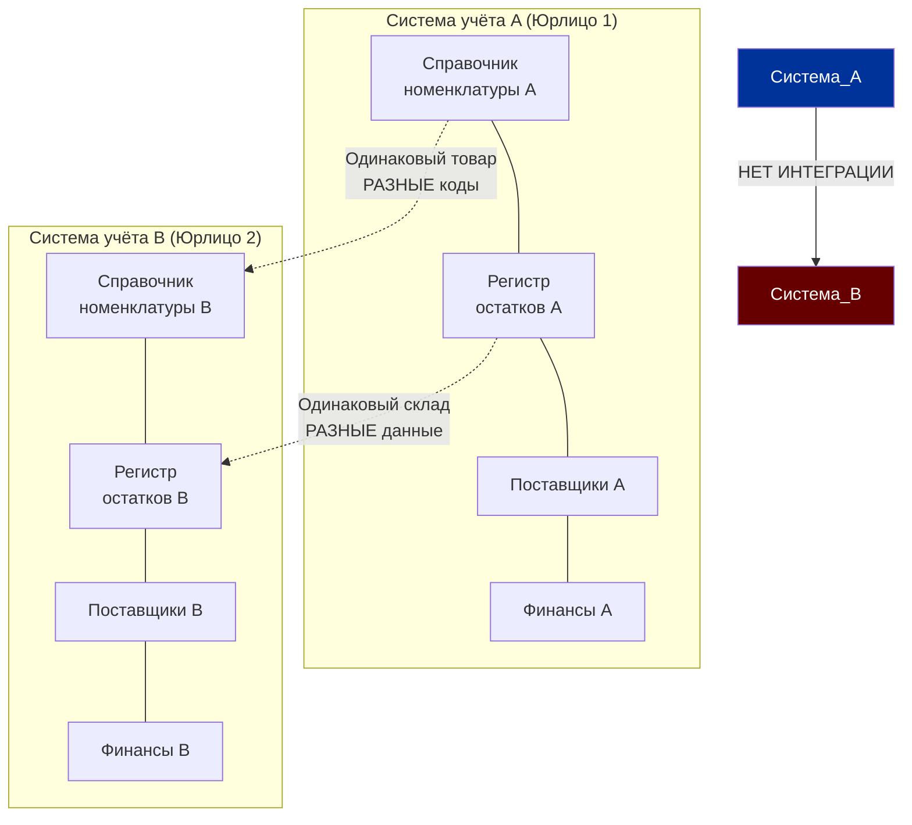

В реальной истории DC ситуация была ещё сложнее: помимо двух основных систем, существовали промежуточные интеграционные слои, самописные системы управления даркстторами, интеграции с агрегаторными платформами. Каждый из этих узлов имел своё представление о данных.

### Почему параллельные системы — это управляемая ситуация до слияния

До момента необходимости консолидации две независимые ERP — это нормально. У каждого юрлица своя система, каждая работает в своём периметре. Сводная отчётность делается через выгрузки, управленческий учёт — отдельно. Неудобно, но функционально.

Проблема начинается, когда появляется требование:
- Единый справочник для закупки у общих поставщиков
- Единая витрина остатков для маршрутизации заказов
- Единая P&L для инвесторов
- Единая система управления ценами для всех каналов

Это не технические требования. Это бизнес-требования, которые возникают ровно в тот момент, когда две компании начинают работать как одна.

### Момент истины: первый общий заказ

Первый заказ, который должны были обработать обе системы вместе — это момент, когда все архитектурные долги становятся видимы одновременно. Клиент оформил заказ в приложении, которое смотрит в Систему А. Товар физически лежит на складе, который управляется Системой Б. Доставку нужно оформить через курьерский блок, интегрированный с обеими системами.

Что происходит? Система А не знает остатков Системы Б. Система Б не знает заказа Системы А. Без промежуточного интеграционного слоя — заказ невозможен.

Временное решение — ручная передача данных между операторами двух систем. Это работает при объёме 10 заказов в день. При 10 000 заказов в день это операционный коллапс.

### Почему именно ERP-интеграция — самая сложная часть M&A

В любом слиянии есть несколько уровней интеграции: бренды (поверхностный уровень — меняем логотип), команды (HR-уровень — организационная структура), продукты (продуктовый уровень — решаем, что сохранить), системы (технологический уровень — интеграция IT).

Системный уровень — самый глубокий и самый долгий. Причины:

**Данные накоплены годами.** Справочник номенклатуры, созданный в 2015 году, содержит историю изменений, привязки к документам, поставщикам, ценам. Нельзя просто «скопировать» его в другую систему — нужно мигрировать с сохранением всех связей.

**Учётная политика — не технический вопрос.** Разные методы учёта себестоимости, разные аналитические разрезы, разные схемы распределения накладных расходов — всё это нельзя унифицировать кнопкой «объединить».

**Операция не останавливается.** Интеграцию систем нужно провести, пока бизнес работает в обычном режиме. Нельзя сказать клиентам «мы закрыты на месяц, переезжаем на новую ERP». Это означает параллельную работу в двух системах с постепенной миграцией.

---

## Часть 3. Архитектурный вызов 1 — единый справочник номенклатуры

Молоко «Простоквашино» 3,2% 1л. Простой товар. Продаётся в каждом магазине России. Как вы думаете, сколько раз этот товар может быть записан в справочнике номенклатуры объединённой компании? Ответ: столько раз, сколько независимых систем работало в компании до слияния. Плюс несколько вариантов от операторов, которые создавали номенклатуру чуть по-разному.

### Анатомия проблемы дублирования

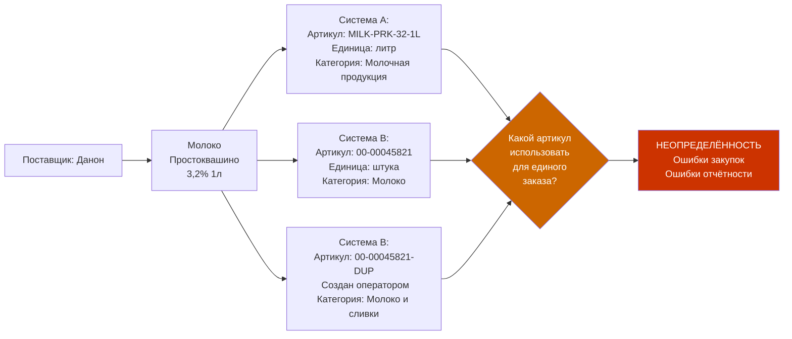

В реальной интеграции количество дублей в справочнике номенклатуры при слиянии двух крупных систем — 15–40% от общего количества позиций. Это не погрешность. Это критическая масса, которая делает невозможным автоматический анализ продаж, закупок и остатков.

### Последствия дублей в номенклатуре для бизнеса

**Проблема закупок.** Закупщик смотрит остатки молока «Простоквашино» по артикулу из Системы А — видит 200 литров, нормально. Реальный остаток, если суммировать оба артикула — 380 литров, избыток. Заказывает у поставщика лишние 200 литров. Получает потери от просрочки.

Или обратная ситуация: по одному артикулу — 0, закупщик срочно заказывает. По второму артикулу — 400 литров на складе. Дублирующий заказ поставщику с риском расторжения условий.

**Проблема ценообразования.** Один и тот же товар с двумя артикулами может иметь разные цены в системе. Прайс-лист загружен в одну систему с новой ценой, в другую — не загружен. Клиент видит разные цены в разных каналах для одного товара. Это не просто неудобство — это потенциальный конфликт с ФАС при определённых условиях.

**Проблема аналитики продаж.** Отчёт «Топ-100 SKU по продажам» суммирует продажи по артикулу. Молоко «Простоквашино» с двумя артикулами попадает в список дважды, но с половинными продажами каждое. В результате реальный топ-seller «уходит» из топ-100 и не получает нужного уровня закупки.

### Процесс дедупликации: как это делается в ERP

Дедупликация справочника номенклатуры — это не техническая задача нажать кнопку. Это проект длиной от нескольких недель до нескольких месяцев в зависимости от объёма справочника.

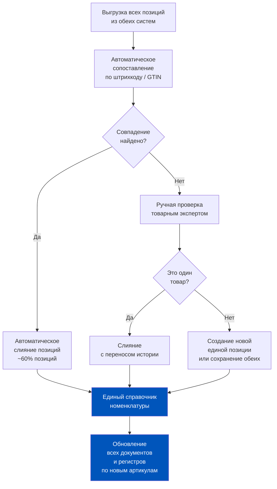

**Шаг 1: Выгрузка и первичное сопоставление.** Из обеих систем выгружаются все позиции номенклатуры с ключевыми атрибутами: штрихкод (EAN/GTIN), наименование, единица измерения, артикул поставщика. Автоматическое сопоставление по штрихкоду даёт совпадение для 50–70% позиций.

**Шаг 2: Ручная верификация «серой зоны».** Остальные 30–50% — позиции без совпадения по штрихкоду. Причины: штрихкод не заполнен, товар введён под разными наименованиями, один товар продаётся в разных единицах (литры vs штуки). Каждую позицию проверяет человек с товарным знанием.

**Шаг 3: Принятие решений по структуре справочника.** Какой артикул будет «главным» в объединённой системе? Как переносятся исторические данные? Документы, привязанные к «старому» артикулу, должны переlinks-ваться к «новому» — иначе история продаж теряется.

**Шаг 4: Миграция в продуктивную систему.** Это самый рискованный шаг: нужно обновить миллионы записей в документах, регистрах, отчётах — не останавливая работу системы. Как правило, делается в нерабочее время (ночью) с тестовым прогоном на копии базы перед продуктивом.

### Разные единицы измерения: неочевидный источник ошибок

Отдельная проблема внутри задачи дедупликации: один товар в двух системах может быть заведён в разных единицах измерения. Молоко в Системе А — «литры» (учёт по объёму). В Системе Б — «штуки» (учёт по упаковке). Физически это одно и то же, но для ERP это разные числа.

При наивном слиянии: у нас 200 литров молока на одном складе и 150 штук на другом. Как посчитать суммарный остаток? Нельзя напрямую. Нужен коэффициент пересчёта — и он должен быть зашит в справочник.

В ERP 2.5 для этого используется механизм «Единицы хранения» с коэффициентами пересчёта. Но если базовые единицы в разных системах разные — при миграции нужно пересчитать все остатки, все цены, все нормы расхода.

---

## Часть 4. Архитектурный вызов 2 — единый учёт остатков

Если проблема справочника — это «мы по-разному называем одно и то же», то проблема остатков — это «мы по-разному считаем одно и то же». Два регистра остатков для одного товара в одном физическом месте — это не просто путаница. Это операционная слепота.

### Коллизия двух регистров остатков

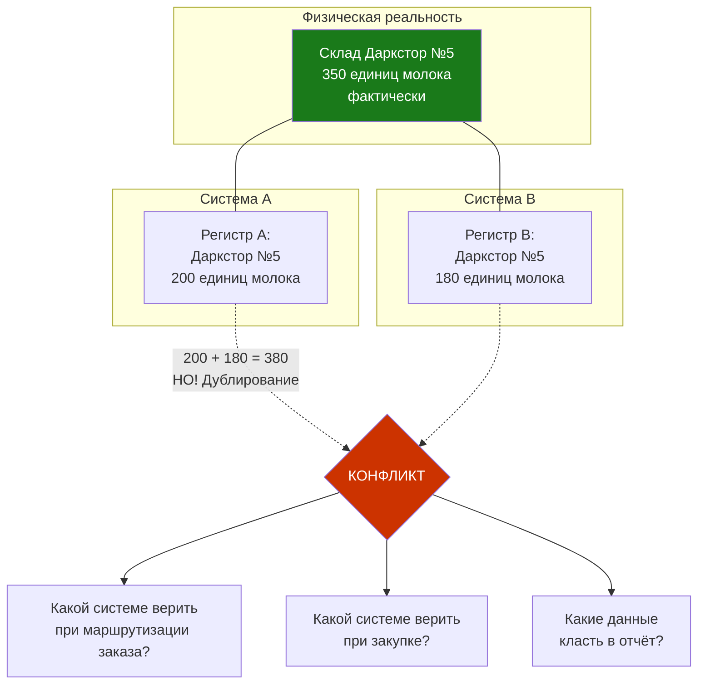

В реальной ситуации коллизия выглядит ещё драматичнее: Система А считает остатки на основании документов приёмки и отгрузки. Система Б — на основании данных, которые она получала через интеграцию от Системы А (но с задержкой). В итоге обе системы «правы» на момент своего последнего обновления, но данные расходятся на величину транзакций за период задержки синхронизации.

### Влияние на балансировку стока

Балансировка стока между даркстторами (вспомним вчерашний практикум) требует точных данных об остатках в каждой точке. Если остатки «двоятся» — алгоритм балансировки работает с ошибочными входными данными.

Конкретный сценарий: алгоритм видит профицит молока на Даркстторе №5 по Системе А (200 единиц при норме 150). Начинает балансировку — отправляет избыток на соседний Даркстор №3. По факту на Даркстторе №5 было 100 единиц (реальный остаток по Системе Б ближе к правде). После балансировки — дефицит.

Это не ошибка алгоритма. Это ошибка данных. И именно поэтому интеграция регистров остатков — приоритет номер один при слиянии систем.

### Два подхода к интеграции регистров остатков

**Подход 1: Мастер-система.** Одна из систем объявляется «источником правды» для остатков. Все транзакции с товаром проходят через неё. Вторая система получает данные об остатках синхронно через API. Плюс: простота архитектуры, один источник правды. Минус: зависимость от доступности мастер-системы; при сбое — вся операция слепая.

**Подход 2: Единое хранилище остатков.** Создаётся промежуточная система (data lake или специализированная платформа управления запасами), которая получает транзакции из обеих ERP и хранит консолидированный регистр. Обе ERP читают остатки оттуда. Плюс: высокая надёжность, нет зависимости от одной системы. Минус: сложность архитектуры, потенциальная задержка обновления.

В случае DC (по логике крупного Q-com игрока) правильный путь — Подход 2 как целевой, Подход 1 как временное решение на период перехода. Но «временное решение» при недостаточном давлении со стороны бизнеса имеет свойство становиться постоянным.

### Проблема «фантомных» остатков

Ещё одна специфическая проблема при интеграции: **фантомные остатки**. Это ситуация, когда в системе числится товар, которого физически нет на складе, или наоборот — товар есть, а система о нём не знает.

Фантомные остатки возникают при миграции данных из-за:
- Документов, перенесённых с ошибкой (дублирование приходных документов)
- Незакрытых транзакций на момент выгрузки данных
- Ошибок в коэффициентах пересчёта единиц измерения
- Документов возврата, которые не были перенесены вместе с исходными реализациями

В ERP 2.5 фантомные остатки выявляются через **инвентаризацию** — сверку фактических остатков с данными системы. При слиянии рекомендуется проводить обязательную инвентаризацию по всем складам в «день ноль» — день перехода на единую систему.

---

## Часть 5. Архитектурный вызов 3 — финансовый учёт и разные юрлица

Два справочника и два регистра остатков — это операционные проблемы. Финансовый учёт при слиянии — это другой уровень сложности. Здесь подключаются налоговая инспекция, аудиторы и инвесторы, которым нужны числа, которым можно верить.

### Два учётных контура: что это означает практически

Каждое юрлицо в России ведёт свой бухгалтерский учёт. У юрлица есть своя налоговая база, свои обязательства перед ФНС, своя отчётность. Объединить два юрлица «на бумаге» нельзя — нужно либо реорганизация (слияние, присоединение), либо продолжать работать в рамках группы компаний с управленческой консолидацией.

Delivery Club работал через несколько юрлиц: отдельные ООО для разных направлений деятельности, регионов, партнёрских программ. Это стандартная корпоративная структура для российского Q-com бизнеса.

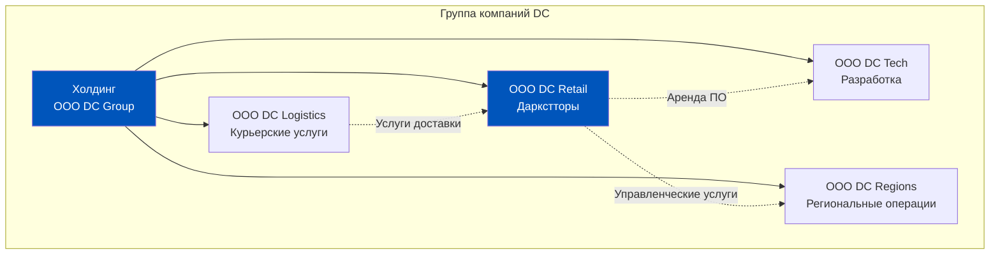

### Трансфертное ценообразование: как деньги движутся внутри группы

Когда ООО «DC Logistics» доставляет заказы для ООО «DC Retail», это не просто «одна компания помогает другой». Это межфирменная операция, которая должна быть оформлена документально и по рыночным ценам (принцип «вытянутой руки», transfer pricing).

В ERP 2.5 межфирменные операции оформляются через механизм **«Передача товаров между организациями»** или через полноценную схему «реализация — покупка» между двумя учётными базами.

Проблема при слиянии: если две системы использовали разные подходы к межфирменным операциям — одна через внутренние документы, другая через полноценный документооборот — при консолидации возникают расхождения в балансах. Покупка в Системе А не находит соответствующей продажи в Системе Б.

### Единая P&L: главный запрос инвесторов

Инвестор, смотрящий на объединённую компанию, хочет видеть единую P&L: одна строка выручки, одна строка себестоимости, одна строка EBITDA. Без задвоений, без элиминаций, которые нужно делать вручную.

В реальности до завершения интеграции систем единая P&L составляется вручную: финансовый контролёр берёт отчётность из каждой системы, проводит элиминацию межфирменных операций и складывает. Это занимает время. Это источник ошибок. Это задержка в принятии управленческих решений.

В ERP 2.5 для управленческой консолидации используется блок **«Бюджетирование и финансовый анализ»** или специализированные инструменты класса Consolidation. В рамках нашего курса важно понимать принцип: до полной интеграции систем единая P&L — это ручной процесс с неизбежными погрешностями.

### Распределение расходов: кто платит за склад

Даркстор использует площадь, которая принадлежит или арендуется одним юрлицом, а операционно управляется другим. Расходы на аренду идут в одно юрлицо, выручка от продаж — в другое. Как распределить?

В ERP 2.5 механизм для этого — **«Статьи расходов»** с настройкой правил распределения. Но при двух системах правила распределения были настроены независимо в каждой. При слиянии возникает конфликт: один и тот же расход распределён по-разному в двух системах.

Прежде чем объединять системы, необходимо унифицировать учётную политику в части распределения расходов. Это решение на уровне CFO, не программиста. Сначала — бизнес-решение, потом — техническая реализация в ERP.

---

## Часть 6. Что сломалось и чему это учит

История Q-com в России, включая историю Delivery Club, богата примерами проблем переходного периода. Они редко освещаются публично — компании не торопятся рассказывать об операционных сбоях. Но паттерны этих сбоев хорошо известны в индустрии.

### Класс проблем 1: Дублирующиеся заказы

Один клиент делает заказ через приложение. Приложение работает с Системой А. Одновременно обрабатывается интеграция с маркетплейсом, который в этот момент перенастраивается под Систему Б. Технический сбой в интеграционном слое создаёт дубль заказа в обеих системах.

Результат: к клиенту приезжает два курьера с двумя одинаковыми заказами. Один заказ был в Системе А, второй — в Системе Б. Клиент в замешательстве. Компания теряет стоимость одного заказа (продукты + логистика). Клиент пишет отзыв в стиле «вы сумасшедшие?».

В масштабе 10 000 заказов/день даже 0,1% дублей — это 10 двойных доставок в день. При средней стоимости доставки и товара 600 рублей — 6 000 рублей потерь в день, 180 000 рублей в месяц только на этом баге.

### Класс проблем 2: Расхождения в остатках при маршрутизации

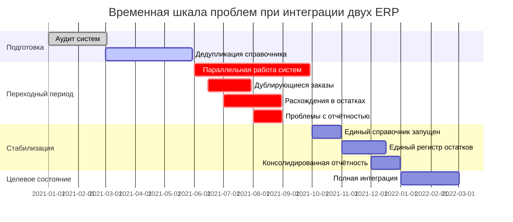

Алгоритм маршрутизации принимает заказ и должен назначить его на даркстор с достаточным остатком нужных SKU. Если данные об остатках из двух систем поступают с задержкой или расходятся — алгоритм назначает заказ на даркстор, у которого фактически нет товара.

Сборщик комплектует заказ — и обнаруживает, что части позиций нет. Начинается частичная доставка или отмена. Клиент недоволен.

В типичном сценарии переходного периода уровень «неполных комплектаций» вырастает на 1,5–3% выше нормы. При 10 000 заказов в день это 150–300 клиентов ежедневно, получивших не то, что заказывали.

### Класс проблем 3: Потеря истории в отчётах

Представьте: команда закупок строит отчёт «Динамика продаж по категории за 12 месяцев» для планирования следующего сезона. Первые 6 месяцев — данные из Системы А. Следующие 6 месяцев — данные из Системы Б. Товары идентифицированы по разным артикулам.

Результат: в отчёте один и тот же товар выглядит как два разных. Первые 6 месяцев — продажи «падают до нуля» (по Системе А). Следующие 6 — начинается новый товар (по Системе Б). Тренд анализировать невозможно.

Закупщик смотрит на «новый товар» без истории и закупает консервативно. Сезонный пик — дефицит. Потери выручки.

### Уроки из паттернов проблем

Три главных урока, которые можно извлечь из паттернов интеграционных проблем:

**Урок 1: Данные важнее систем.** Можно иметь идеальную ERP и плохую интеграцию данных. Плохие данные делают хорошую систему бесполезной.

**Урок 2: Переходный период — самый опасный момент.** Не момент «до слияния» и не момент «после». Именно в переходе, когда две системы работают параллельно, риски максимальны.

**Урок 3: Нельзя делать интеграцию только силами IT.** Решения об артикулах, единицах измерения, учётной политике — это решения бизнеса. Без бизнес-участия команда IT делает технически правильные решения, которые не работают операционно.

---

## Часть 7. Синтез недели и уроки для продакта

Неделя 7 началась с балансировки курьеров и заканчивается историей о слиянии двух систем учёта. Кажется, далёкие темы. На самом деле — это один непрерывный нарратив о том, как данные в ERP определяют качество операции.

### 10 ключевых выводов из истории Delivery Club

**Вывод 1.** Архитектура данных — это конкурентное преимущество. Компания, у которой единый точный справочник номенклатуры и актуальные остатки, быстрее принимает решения и делает меньше ошибок. Это не IT-вопрос. Это вопрос операционного превосходства.

**Вывод 2.** Технический долг в ERP платится с процентами. Каждый месяц работы с дублирующимися справочниками — это месяц накопленных ошибочных данных, которые нужно будет разбирать при миграции. Откладывание унификации увеличивает, а не уменьшает стоимость перехода.

**Вывод 3.** Скорость интеграции ограничена не технологиями, а бизнес-решениями. Самое узкое место при слиянии — договориться о том, как будет выглядеть единый справочник. Написать программу миграции — часы. Договориться о правилах номенклатуры — недели.

**Вывод 4.** Параллельная работа двух систем — временное решение, которое нельзя делать постоянным. Каждый день параллельной работы создаёт расхождения данных, которые нужно ручным трудом синхронизировать.

**Вывод 5.** Инвентаризация на «день ноль» — обязательна. Нельзя мигрировать «данные как есть», если данные в обеих системах содержат фантомные остатки и ошибки.

**Вывод 6.** Единая P&L — это последнее, что появляется, но первое, что требуют инвесторы. Это создаёт давление на ускорение интеграции, но без готовой инфраструктуры ускорение ведёт к ошибкам в отчётности.

**Вывод 7.** Каждый бизнес-процесс, который пересекает две системы, — это зона риска. Маршрутизация заказов, балансировка стока, анализ продаж — всё, что требует данных из обеих систем, работает с пониженной надёжностью до завершения интеграции.

**Вывод 8.** Return Rate растёт в переходный период. Некорректные остатки → ошибки комплектации → неполные заказы → возвраты. Это прямая цепочка.

**Вывод 9.** Команда должна знать, в какой системе «правда» по каждому типу данных. Если операционный менеджер не знает, остаткам какой системы верить при балансировке — он будет делать решения наугад.

**Вывод 10.** Слияние систем — это не разовый проект, это программа изменений. С дорожной картой, ответственными, метриками успеха и регулярными точками проверки.

### Архитектурная таблица для продакта

| Проблема при слиянии | Как проявляется в ERP | Стратегия решения | Срок реализации |
|---|---|---|---|
| Дублирующийся справочник номенклатуры | Один товар — два артикула, раздвоение аналитики | Дедупликация: автомат по штрихкоду + ручная верификация | 2–4 месяца |
| Конфликт единиц измерения | Ошибочный пересчёт остатков и цен | Унификация базовых единиц + коэффициенты | 1–2 месяца |
| Два регистра остатков | Алгоритм балансировки работает с ошибочными данными | Мастер-система остатков или единое хранилище | 3–6 месяцев |
| Фантомные остатки при миграции | Дефицит или избыток по факту, не совпадающий с ERP | Обязательная инвентаризация на «день ноль» | 1–2 недели |
| Разные учётные политики | Несопоставимая отчётность, ошибки P&L | Унификация политики до технической интеграции | 1–3 месяца |
| Межфирменные операции без элиминации | Задвоение выручки / расходов в консолидированной отчётности | Настройка элиминации в ERP или внешнем инструменте | 2–4 месяца |
| Дублирующиеся заказы при интеграции каналов | Двойная доставка, операционные потери | Идемпотентный приём заказов, дедупликация по ID | 2–4 недели |
| Потеря истории продаж при смене артикулов | Невозможность анализировать тренды более 6 мес | Таблица соответствия «старый артикул — новый» во всех отчётах | 1–2 месяца |

### Связь с темами недели 7

История Delivery Club — это не отдельный кейс «для общего развития». Это прямое продолжение каждой темы, которую мы разбирали на этой неделе.

**Балансировка курьеров** (День 2) требует точных данных о доступности ресурсов. Если данные о курьерах хранятся в двух системах — алгоритм балансировки слепой.

**Балансировка стока** (День 3) требует актуальных остатков по каждому складу. Если два регистра остатков расходятся — решение о перемещении стока принимается на основе неверных данных.

**Интеграция с маркетплейсами** (День 4) требует единого справочника номенклатуры для корректной передачи данных о наличии. Дублирующиеся артикулы создают ошибки в фидах агрегаторов.

**Возвраты** (День 5) требуют корректной привязки к исходным реализациям. Если реализация в Системе А, а возврат оформляется в Системе Б — связь теряется, финансовый результат некорректен.

**Практикум** (День 6) показал, как операционный менеджер использует ERP в режиме реального времени. Это возможно только при условии, что данные в системе точны. История DC — это кейс о том, что бывает, когда данные не точны.

### Итоговый образ: ERP как нервная система

Если представить Q-com бизнес как живой организм, то ERP — это нервная система. Физические объекты — товары, курьеры, склады — это тело. Данные о них в ERP — это нервные сигналы, на основе которых принимаются решения.

Слияние двух компаний — это попытка соединить две нервные системы. Звучит пугающе, потому что это и есть пугающая задача. Но решаемая. При правильном планировании, правильных приоритетах и правильном понимании того, что на самом деле является узким местом.

История Delivery Club — не история провала. Это история о том, что любая быстрорастущая компания неизбежно накапливает архитектурный долг, и рано или поздно этот долг нужно платить. Лучше — по плану. Хуже — в режиме пожаротушения.

Продакт, который понимает, как данные движутся через ERP, может увидеть этот долг заранее. И сделать так, чтобы его компания платила по плану.

### Расширенный анализ: как оценить готовность ERP к масштабированию

История DC даёт ещё один важный урок, который выходит за рамки темы слияния. Любая Q-com компания, которая планирует рост — открытие новых даркстторов, выход в новые города, добавление новых каналов — сталкивается с вопросом: готова ли наша ERP к этому росту?

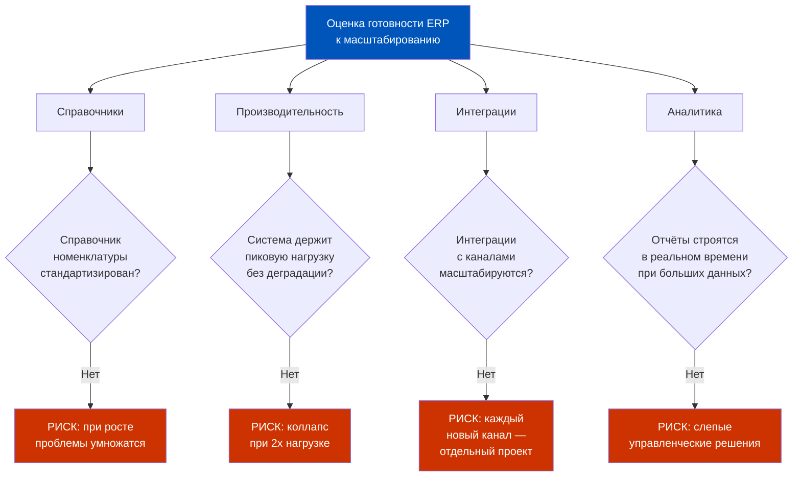

Четыре вопроса для оценки ERP-готовности к росту:

**Вопрос 1: Насколько стандартизированы справочники?** Если сегодня в вашем справочнике 10% дублей — при увеличении каталога в 3 раза это будет 30% дублей с соответствующими последствиями. Проблемы со справочниками не рассасываются сами собой при росте — они умножаются.

**Вопрос 2: Какова производительность системы при пиковой нагрузке?** Тест: создайте искусственную нагрузку на ERP, эквивалентную 3x текущему объёму транзакций. Что происходит со скоростью проведения документов? Сколько времени занимает построение отчётов? Если система деградирует при 2x — масштабирование потребует технической модернизации до запуска.

**Вопрос 3: Насколько легко подключить новый канал или нового партнёра?** Если каждая новая интеграция — это индивидуальный проект на 2–3 месяца, рост будет ограничен пропускной способностью команды разработки. Правильная архитектура — API-first, где ERP выступает как сервис, к которому легко подключается любой канал по единому протоколу.

**Вопрос 4: Можно ли строить аналитику самообслуживания?** Если каждый новый отчёт — заявка в IT на 2 недели, бизнес принимает решения с задержкой. Зрелая ERP-система позволяет аналитику или продакта самостоятельно строить нужные срезы без программирования.

### Чек-лист: что проверить в ERP перед открытием нового даркстора

Каждое открытие нового даркстора — это минислияние в рамках одной компании: новое подразделение, новый склад, новые сотрудники, новый поставщик (иногда). Уроки истории DC применимы здесь напрямую.

**До открытия:**
- Создан новый склад в справочнике организационной структуры ERP
- Назначен ответственный за склад (для документов инвентаризации)
- Настроены зоны доставки нового даркстора в интеграции с диспетчерской системой
- Номенклатура нового ассортимента добавлена в единый справочник (без дублей!)
- Поставщики нового даркстора прописаны в регистре контрагентов
- Ценовые условия от поставщиков загружены в прайс-листы
- Стартовый остаток зафиксирован документом «Ввод начальных остатков» после инвентаризации

**В день открытия:**
- Тестовый заказ через все каналы — проверка, что новый склад виден как источник остатков
- Тестовый возврат — проверка, что документ возврата корректно привязывается к новому складу
- Первая приёмка товара — проверка, что поступление отражается в регистре нужного склада

**После первой недели:**
- Сверка фактического инвентаря с данными ERP — поиск расхождений
- Проверка отчётов аналитики: новый даркстор корректно выделяется в разрезах
- Проверка Return Rate нового даркстора: аномально высокий означает проблему со сборкой или поставщиком

### Параллели с другими рынками: международный опыт

История, похожая на DC, происходила в разных рынках. Gorillas (Германия) при быстрой экспансии в 10 стран столкнулась с проблемой несовместимых систем учёта в разных юрисдикциях — разные налоговые требования, разные правила рабочего времени курьеров, разные форматы финансовой отчётности. Компания строила «национальные экземпляры» ERP для каждой страны, что множило проблему дублирующихся справочников в международном масштабе.

Getir (Турция) при выходе на рынок Великобритании и Германии столкнулась с проблемой мультивалютности: один и тот же товар, доставляемый из одного логистического узла, должен учитываться в трёх валютах с разными VAT-ставками. Это не просто вопрос курсов обмена — это архитектурный вопрос о том, как ERP хранит и агрегирует финансовые данные в мультивалютной среде.

В ERP 2.5 мультивалютность поддерживается через механизм «Регламентированный учёт» с базовой валютой и пересчётом по курсам ЦБ. Но для Q-com с реальными операциями в нескольких валютах этого часто недостаточно — нужна дополнительная настройка управленческого учёта с «постоянными» курсами для бюджетирования.

### Антипаттерны: что точно не нужно делать при интеграции систем

Заканчивая тему слияния, выделим три антипаттерна — подхода, которые кажутся разумными, но приводят к усугублению проблем.

**Антипаттерн 1: «Мигрируем всё за один раз».** Большой взрыв. Выбираем дату X, переносим все данные из двух систем в одну за выходные. Риск: в воскресенье вечером обнаруживаем, что 30% данных мигрировали некорректно. В понедельник — хаос. Правильный подход: поэтапная миграция по доменам данных (сначала справочники, потом остатки, потом история документов).

**Антипаттерн 2: «IT сами разберутся».** Бизнес делегирует интеграцию IT-отделу без участия в принятии решений о правилах. IT принимают технически корректные решения, которые не учитывают операционную логику. Итог: систему нужно переделывать через полгода, когда бизнес обнаруживает, что аналитика «не то считает». Правильный подход: joint team из IT и бизнеса с чёткими ролями.

**Антипаттерн 3: «Параллельная работа — это нормально».** Компания работает в двух системах параллельно год, два, три. «Привыкли, работает». На самом деле — накапливается расхождение данных, растёт стоимость финального перехода, и в какой-то момент проект интеграции становится настолько дорогим, что его откладывают навсегда. Правильный подход: установить жёсткий дедлайн перехода и публично объявить его внутри компании.

### Глоссарий ключевых понятий урока

Для удобства — краткий словарь терминов, которые использовались в этом уроке:

**Дедупликация** — процесс обнаружения и устранения дублирующихся записей в справочнике. Применяется к номенклатуре, контрагентам, сотрудникам.

**Фантомный остаток** — ситуация, когда ERP показывает наличие товара, которого физически нет (или наоборот). Возникает при ошибках миграции или незакрытых транзакциях.

**Мастер-система** — система, объявленная «источником правды» для определённого типа данных. Другие системы получают данные из мастер-системы, но не могут их изменить.

**Трансфертная цена** — цена, по которой одно подразделение (юрлицо) передаёт товар или услугу другому подразделению внутри группы компаний. Должна быть близка к рыночной по требованиям налогового законодательства.

**Элиминация** — исключение межфирменных оборотов из консолидированной отчётности. Если ООО А продало ООО Б на 100 рублей, в консолидации эти 100 рублей «аннулируются» — иначе выручка группы задвоится.

**Инвентаризация «день ноль»** — обязательная физическая сверка остатков в момент перехода на новую систему или объединения систем. Служит отправной точкой, от которой новая система начинает считать корректно.

### Управленческая отчётность при двух системах: практика промежуточного периода

Пока интеграция не завершена, финансовый директор и операционный директор нуждаются в управленческой отчётности, которая отражает реальность — даже если данные поступают из двух систем с разными форматами.

На практике в период параллельной работы двух систем типичное решение — **промежуточное хранилище данных (staging layer)**. Это не полноценный Data Warehouse, но структурированное место, куда обе ERP выгружают ключевые данные в едином формате: продажи по SKU, остатки по складам, возвраты.

Из этого хранилища строятся управленческие отчёты. Ключевые допущения, которые нужно зафиксировать явно:
- Данные из Системы А актуальны до HH:MM (момент последней выгрузки)
- Данные из Системы Б актуальны до HH:MM
- Сверка между системами проводится раз в день в 07:00

Без таких допущений команда тратит время на обсуждение «а какие данные правильные» вместо анализа.

### Вопрос о стоимости: сколько стоит интеграция двух ERP

Это вопрос, который задают все и на который нет честного универсального ответа. Но порядок цифр полезно иметь в голове.

Стоимость интеграции двух ERP-систем класса 1C:ERP в крупной Q-com компании (несколько десятков даркстторов, тысячи SKU, несколько каналов) — это проект от 6 до 24 месяцев с командой 5–15 человек.

Компоненты стоимости:
- **Аудит и проектирование**: 1–2 месяца, команда аналитиков и архитекторов
- **Дедупликация справочника**: 2–4 месяца, товарные эксперты + автоматизация
- **Разработка интеграционного слоя**: 3–6 месяцев, команда разработки
- **Тестирование и пилот**: 2–3 месяца, QA + операционная команда
- **Продуктивный запуск и стабилизация**: 1–3 месяца

Итого: в сложном случае это 12–18 месяцев и бюджет с семью нулями в рублях.

Почему так дорого? Потому что интеграция данных — это не просто техническая задача. Это изменение бизнес-процессов, обучение людей, переработка отчётов, адаптация всех систем, которые «висят» на ERP (CRM, диспетчерская, маркетинговая платформа).

Именно поэтому лучшая инвестиция — превентивная: строить единую правильную архитектуру с первого дня, а не откладывать унификацию на «потом».

### Финальный кейс: как должна выглядеть архитектура «с нуля»

Представим, что сегодня 2024 год и вы строите Q-com операцию с нуля. Учитывая все уроки истории DC и других игроков — как должна выглядеть правильная архитектура?

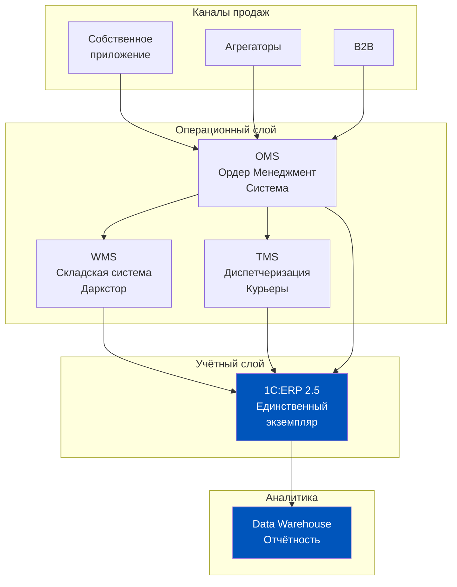

**Ключевые принципы правильной архитектуры:**

Первый принцип — **один экземпляр ERP для всех юрлиц группы**. ERP 2.5 поддерживает ведение нескольких организаций в одной информационной базе. Разные учётные контуры — через разные организации внутри одной базы, но единый справочник номенклатуры, единый регистр остатков, единая аналитика.

Второй принцип — **ERP как ядро, а не как агрегатор**. OMS (Order Management System), WMS (Warehouse Management System), TMS (Transport Management System) — это специализированные системы, каждая отвечает за свой домен. ERP получает итоговые события (реализация, поступление, возврат) и ведёт финансовый и товарный учёт. Не нужно тянуть в ERP всю оперативную логику.

Третий принцип — **API-first для интеграций**. Каждый внешний канал подключается через единый API. Добавление нового агрегатора или нового канала — конфигурация, не разработка.

Четвёртый принцип — **Data Warehouse для аналитики, ERP для учёта**. Не нужно строить сложные аналитические отчёты прямо в ERP — это нагружает операционную систему. ERP ведёт учёт и отдаёт данные. DWH строит аналитику. Это разделение ответственности снижает нагрузку и даёт гибкость.

История Delivery Club — это не история ошибок. Это история о том, что архитектурные решения, принятые в режиме быстрого роста, имеют долгосрочные последствия. Зная это, каждый продакт и каждый операционный менеджер может принимать более осознанные решения — даже когда дедлайн горит, а давление на скорость высокое.

### Разбор типичных сценариев при интеграции: что ломается первым

Опыт множества ERP-интеграций в ретейле позволяет выделить несколько типовых сценариев — ситуаций, которые с высокой вероятностью возникнут в переходный период. Знание этих сценариев помогает заранее подготовить план реагирования.

**Сценарий A: «Пропавший заказ»**

Клиент оформил заказ. Заказ попал в Систему А (старая), которая ещё принимает его через старый канал. Новая Система Б уже работает на новом канале. Диспетчерская система обновилась и смотрит только в Систему Б. Результат: заказ есть, курьера нет. Клиент ждёт.

Причина: несинхронизированный переключатель каналов. В одном месте переключили на новую систему, в другом — ещё нет.

Решение: перед запуском составить матрицу «источник данных × потребитель данных» и переключать их синхронно.

**Сценарий B: «Задвоенный остаток»**

После запуска единого регистра остатков система показывает 400 единиц молока на Даркстторе №5. Реальный остаток — 200 единиц. Оказывается, при миграции данных входящие документы поступления были загружены дважды: один раз из Системы А, один раз из Системы Б (обе системы «помнили» одну и ту же поставку).

Причина: отсутствие дедупликации при миграции документов.

Решение: перед миграцией документов провести сверку по уникальным идентификаторам (номер документа поставщика + дата + сумма). Дубли удалить до загрузки.

**Сценарий C: «Потерянный поставщик»**

После слияния обнаруживается, что один крупный поставщик в Системе А был записан как «ООО Молочный завод Север», а в Системе Б — как «МЗ Север ООО». Юридически это одно лицо с одним ИНН. Но в объединённой системе это два контрагента с разными историями расчётов.

Причина: отсутствие дедупликации справочника контрагентов перед слиянием.

Последствие: невозможно корректно отследить общий объём закупок у поставщика для переговоров о скидках. Взаиморасчёты «зависают» в неправильном контрагенте.

Решение: дедупликация контрагентов по ИНН — автоматизированная задача. Перед интеграцией обязателен прогон справочника контрагентов по ИНН с выявлением дублей.

### Роль продакта при интеграции систем: не технарь, но и не наблюдатель

Продакт-менеджер в Q-com не пишет код и не конфигурирует ERP. Но он играет ключевую роль в проекте интеграции, которую часто недооценивают.

**Роль 1: Формулировщик бизнес-требований.** Только продакт знает, какие отчёты нужны после интеграции, какие срезы аналитики критичны, какие процессы должны работать без задержки. IT реализует то, что сформулировал бизнес.

**Роль 2: Приоритизатор.** Нельзя мигрировать всё сразу. Что мигрируем первым — справочник номенклатуры, регистр остатков или историю заказов? Продакт расставляет приоритеты по критерию бизнес-ценности.

**Роль 3: Держатель User Acceptance Testing (UAT).** После технической реализации кто проверяет, что система работает правильно с точки зрения бизнеса? Продакт и операционная команда. IT проверяют, что код работает. Бизнес проверяет, что процессы работают.

**Роль 4: Коммуникатор с командой.** При интеграции систем изменяются привычные процессы. Операторы ERP, закупщики, менеджеры склада — все работают по-новому. Объяснить «зачем» и «как» — задача продакта совместно с операционным директором.

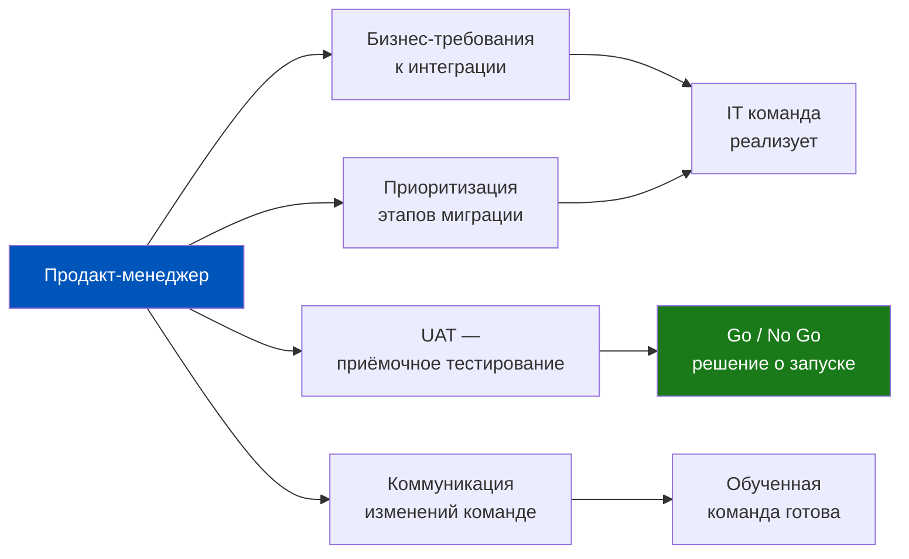

### Долгосрочная перспектива: что меняется в Q-com в горизонте 3–5 лет

Рынок Q-com продолжает эволюцию. Инструменты и подходы меняются. Несколько трендов, которые повлияют на то, как ERP будет использоваться в ближайшие годы:

**Тренд 1: Консолидация рынка продолжится.** Количество игроков на рынке будет сокращаться. Слияния, поглощения, партнёрства. Каждое событие — новый вызов для интеграции систем. Компания, которая научилась быстро и без потерь интегрировать ERP, получает конкурентное преимущество при M&A.

**Тренд 2: Рост требований к данным в реальном времени.** Клиент хочет знать прямо сейчас: есть ли товар, когда приедет курьер, где он сейчас. Это требует, чтобы ERP обновлялась синхронно с событиями, а не batch-процессами раз в час. Архитектура event-driven (событийная) становится стандартом.

**Тренд 3: Машинное обучение в прогнозировании спроса.** Традиционные методы планирования закупок (статистика + экспертное мнение) постепенно уступают место ML-моделям. Эти модели едят данные из ERP — историю продаж, возвратов, поставок. Качество данных в ERP напрямую определяет качество прогнозов.

**Тренд 4: Регуляторное давление растёт.** 54-ФЗ, маркировка продуктов (молочка, алкоголь, табак), прослеживаемость цепочки поставок — требования к документальному оформлению каждой транзакции становятся жёстче. ERP, которая не успевает за регуляторными изменениями, создаёт комплаенс-риски.

Для продакта-менеджера в Q-com это означает: понимание ERP — это не «техническая тема, которую можно делегировать». Это стратегическая компетенция, которая определяет, насколько эффективно ваш бизнес адаптируется к изменениям рынка и требованиям регуляторов.

### Итоговый образ: продакт как интерпретатор между бизнесом и системой

Закончим неделю образом, который стоит запомнить. ERP — это язык, на котором бизнес разговаривает сам с собой. Каждый документ, каждый регистр, каждый отчёт — это слова этого языка. Компания, которая говорит на этом языке чётко и без ошибок, принимает лучшие решения и работает эффективнее.

Продакт-менеджер — это переводчик. Он понимает язык бизнеса (что нужно клиенту, какие метрики важны, как устроена операция) и язык ERP (как данные движутся через регистры, какие документы что порождают, как настроить систему). Его задача — чтобы эти два языка совпадали.

История Delivery Club — это история о том, что произошло, когда два «диалекта» одного языка столкнулись и нужно было срочно создать единый словарь. Это болезненно и дорого. Правильный продакт делает так, чтобы его компания говорила на одном языке с самого начала.

### Детальный разбор: как устроена миграция данных в ERP 2.5

Тема миграции данных при объединении систем достаточно конкретна, чтобы разобрать её на уровне механики. Как именно данные переносятся из одной базы 1C в другую — или как из чужой ERP данные попадают в 1C:ERP 2.5?

**Инструменты миграции в экосистеме 1C:**

Первый инструмент — **Универсальный обмен данными XML**. Стандартный механизм 1C для переноса данных между базами. Создаётся правило обмена, которое описывает маппинг: объект из источника → объект в приёмнике. Подходит для однотипных баз (обе на 1C).

Второй инструмент — **Механизм загрузки данных из табличных документов (Excel/CSV)**. Если источник — не 1C, а другая ERP или самописная система, данные сначала выгружаются в Excel, затем загружаются в 1C через обработку загрузки. Медленнее и рискованнее, но универсально.

Третий инструмент — **1C:Интеграция** или **EnterpriseData**. Современный подход: REST API или очередь сообщений (RabbitMQ, Kafka). Системы обмениваются событиями в реальном времени. Это правильный путь для постоянной интеграции (не разовой миграции).

**Порядок миграции: что мигрируем в какой последовательности**

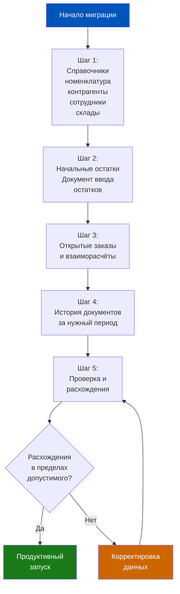

Критически важная последовательность: **сначала справочники, потом остатки, потом документы**. Нарушение этого порядка ведёт к тому, что документы мигрируют с ссылками на несуществующие объекты справочника (ещё не мигрированные). Это создаёт «битые» ссылки, которые потом очень трудно исправить.

**Документ «Ввод начальных остатков»: ключевой момент перехода**

В ERP 2.5 документ «Ввод начальных остатков» — это точка, с которой новая система начинает вести учёт. Он создаётся на дату перехода и содержит:
- Остатки по каждому складу и каждой номенклатурной позиции
- Задолженности покупателей и перед поставщиками
- Остатки денежных средств по кассам и расчётным счетам

Сумма документа должна совпадать с данными инвентаризации («день ноль»). Любое расхождение — это ошибка, которая будет «тянуться» через все последующие операции в системе.

### Квалификационные вопросы: как проверить понимание

Завершим урок набором вопросов, которые помогают проверить, насколько глубоко усвоена тема. Это не тест — это инструмент для размышления.

**Вопрос 1.** У Delivery Club было несколько юрлиц, и в каждом — своя ERP. Какой механизм ERP 2.5 позволяет вести несколько юрлиц в одной информационной базе, не создавая отдельных систем? Что это даёт и что усложняет?

*Ориентир ответа: многоорганизационный учёт в рамках одной информационной базы. Единый справочник номенклатуры и общие данные — плюс. Сложность разграничения доступа и настройки прав — минус.*

**Вопрос 2.** При слиянии обнаружилось, что одна ERP учитывает себестоимость по FIFO, другая — по средневзвешенной. ERP 2.5 использует средневзвешенную. Что произойдёт с историческими данными о себестоимости из «FIFO-системы» при миграции?

*Ориентир ответа: историческая себестоимость будет перенесена «как есть» через остатки. Но с момента перехода в новой системе все расчёты пойдут по средневзвешенной. Сравнение себестоимости до и после перехода будет методологически некорректным.*

**Вопрос 3.** Один поставщик поставлял товар в обе компании (до слияния) через два разных контракта с разными ценами. После слияния — один поставщик, но нужно понять, какие условия выгоднее. Как это реализовать в ERP 2.5?

*Ориентир ответа: через механизм «Соглашения с поставщиками» — отдельные соглашения для разных подразделений или разных типов заказа. ERP хранит историю закупочных цен по каждому соглашению, что позволяет аналитически сравнить условия.*

**Вопрос 4.** В переходный период Return Rate вырос с 2% до 4,5%. Как с помощью ERP определить, это системная проблема (новый процесс) или случайный выброс?

*Ориентир ответа: построить разбивку возвратов по причинам и по датам — посмотреть, есть ли корреляция с датой перехода на новую систему. Если рост причины «Несоответствие заказу» совпадает с датой запуска — проблема в процессе комплектации, который изменился при переходе.*

**Вопрос 5.** После слияния команда маркетинга хочет видеть «единую аналитику продаж по SKU за 2 года». Обе системы работали с разными артикулами для одного товара. Возможно ли построить такой отчёт? Что для этого нужно?

*Ориентир ответа: да, возможно — через таблицу соответствия «старый артикул → новый артикул», которая должна быть создана в процессе дедупликации. Отчёт использует эту таблицу для объединения истории из двух систем. Без таблицы соответствия — только ручной маппинг.*

### Что читать дальше: связь с Неделей 8

Неделя 8 посвящена финансовому учёту в Q-com: себестоимость, P&L, бюджетирование. Многие темы, которые мы обозначили сегодня — трансфертное ценообразование, единая P&L группы компаний, методы учёта себестоимости — будут раскрыты там подробнее.

История Delivery Club — хороший пример того, почему финансовый учёт нельзя рассматривать отдельно от операционного. Операционные данные (остатки, заказы, возвраты) — это сырьё для финансовой отчётности. Если сырьё неточное — финансовая картина искажена. Это не абстрактное утверждение: это то, с чем сталкивались команды финансового контроля всех крупных Q-com игроков в России в период активного роста и консолидации рынка.

### Послесловие: что осталось за кадром

Намеренно не разобраны несколько тем, которые выходят за рамки курса по 1C:ERP, но важны для полной картины:

**Управление изменениями (Change Management).** Интеграция систем — это не только технический проект. Люди, которые привыкли работать в одной системе, должны перейти на другую. Сопротивление изменениям — реальная сила, которая может сорвать самый технически грамотный проект. Обучение, коммуникация, вовлечение ключевых пользователей в проектирование — это отдельная дисциплина.

**Юридические аспекты слияния.** Объединение юрлиц через реорганизацию (слияние, присоединение) имеет налоговые и юридические последствия, которые напрямую влияют на то, как нужно перестроить учёт в ERP. Это работа юристов и налоговых консультантов, но продакт должен понимать, что юридическая структура определяет учётную.

**Технические аспекты производительности 1C.** При больших объёмах данных (несколько миллионов документов, несколько тысяч пользователей) производительность 1C:ERP требует специальной оптимизации: отдельные серверы, шардирование, архивирование исторических данных. Это задача системного администратора, но продакт должен включать нагрузочное тестирование в критерии готовности к запуску.

Эти темы заслуживают отдельных курсов. В рамках нашего курса достаточно знать, что они существуют и что они не менее важны, чем сама конфигурация ERP.

### Итоговая схема: полный цикл интеграции двух ERP

Подведём итог всего дня в одной диаграмме — от момента принятия решения о слиянии до стабильной работы единой системы.

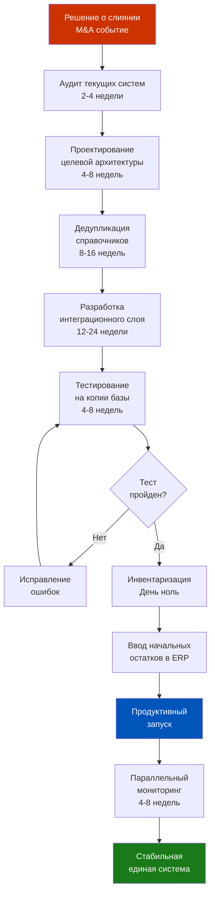

Общий срок от решения до стабильной работы единой системы — от 9 до 18 месяцев в зависимости от сложности. Это не пессимистичная оценка. Это реалистичная. Компании, которые планируют сделать это «за квартал», как правило, либо решают задачу поверхностно (два справочника формально объединены, но по факту работают независимо), либо создают критические операционные риски на переходе.

Знание этих сроков и этапов — ваш инструмент как продакта: когда руководство или инвестор спрашивает «а когда будет единая система?», вы отвечаете не «скоро», а «через 12 месяцев по дорожной карте, вот ключевые вехи».

---

← [[Неделя 7 - День 6 - Практикум по цепочке доставки|← День 6]] | [[1c_erp_qcom/README|Оглавление]] | [[Неделя 8 - День 1 - Себестоимость|Неделя 8. День 1 →]]
