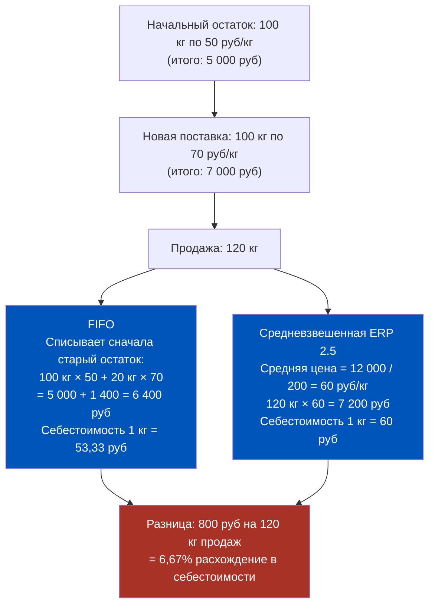
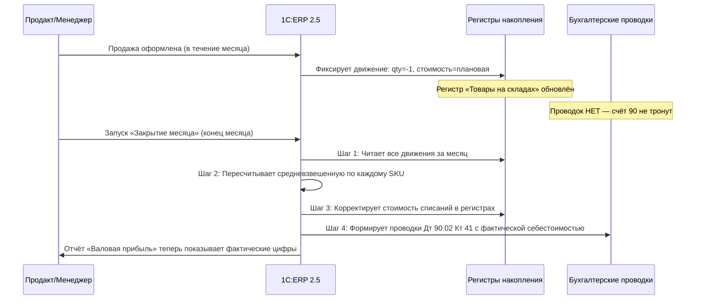
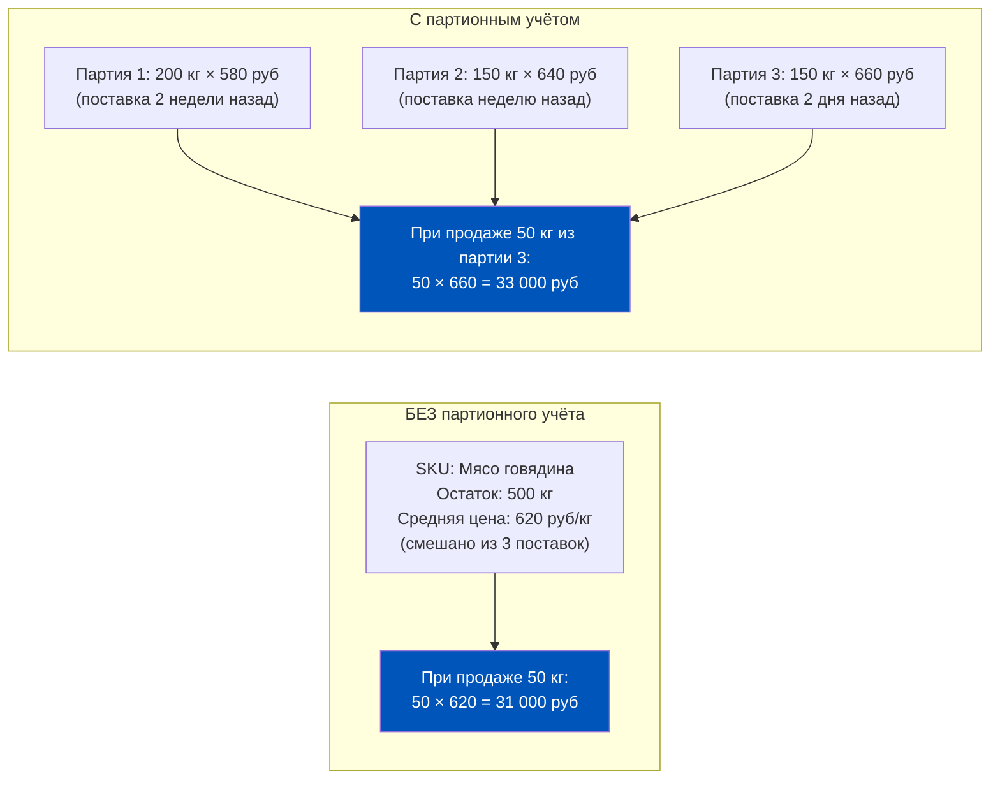
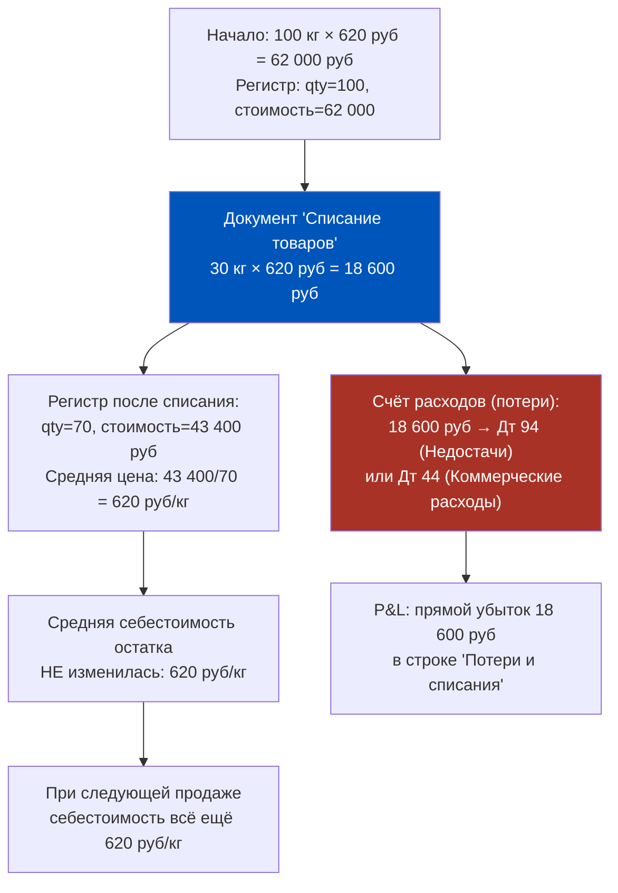
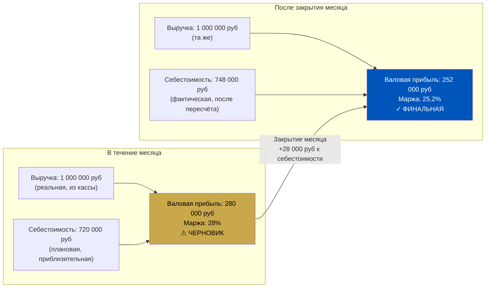
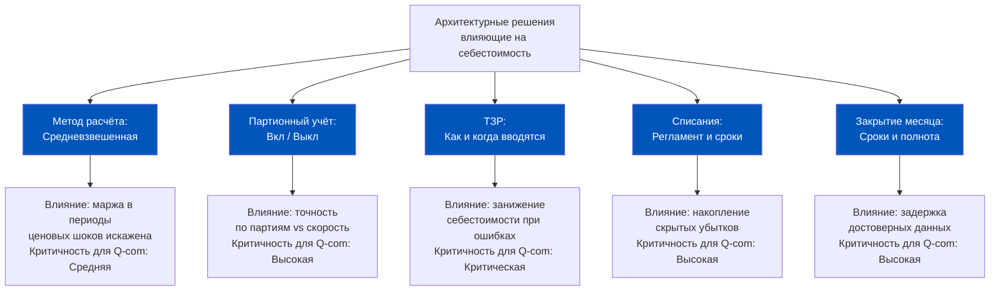
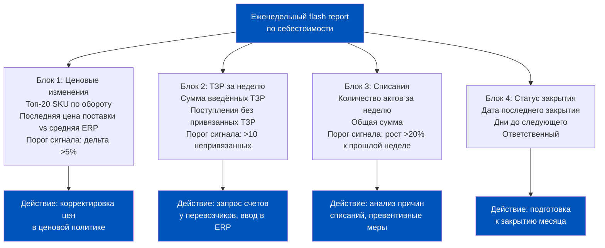

# Неделя 8. День 1. Себестоимость: как ERP 2.5 считает, во что вам обошёлся товар

> Себестоимость — это не цена в накладной поставщика. Это результат архитектурных решений, принятых в ERP задолго до момента продажи. Продакт, который понимает эту разницу, читает P&L иначе, чем тот, кто её не понимает.

## Содержание

1. [[#Часть 1. Что такое себестоимость в 1C:ERP 2.5 и почему это сложно]]
2. [[#Часть 2. Как ERP 2.5 «вычисляет» себестоимость]]
3. [[#Часть 3. Партионный учёт и его влияние на себестоимость]]
4. [[#Часть 4. Списания, потери и их влияние на себестоимость]]
5. [[#Часть 5. Тонкости расчёта себестоимости в Q-com]]
6. [[#Часть 6. Отчётность по себестоимости: где продакт смотрит цифры]]
7. [[#Часть 7. Архитектурное решение: как PM управляет себестоимостью]]

---

## Часть 1. Что такое себестоимость в 1C:ERP 2.5 и почему это сложно

Представьте, что вы финансовый детектив. Клиент задаёт простой вопрос: «Сколько нам стоила эта бутылка молока, которую мы продали вчера?» Вы открываете ERP, находите строку продажи, видите цену реализации — 89 рублей. Отлично. Но вопрос был о себестоимости.

Здесь начинается расследование.

Себестоимость в управленческом смысле — это совокупность всех затрат, которые предприятие понесло для того, чтобы товар оказался на полке даркстора. Закупочная цена — лишь первая и самая очевидная составляющая. К ней добавляются транспортно-заготовительные расходы (ТЗР): доставка от поставщика, разгрузка, приёмка, иногда таможенные пошлины. В итоге бутылка молока, купленная за 55 рублей, может иметь фактическую себестоимость 62 рубля с учётом всех накладных расходов.

Это важно. Продавать по 63 рубля при себестоимости 62 — не то же самое, что при себестоимости 55.

**Метод «По средней» в ERP 2.5: почему именно он?**

В 1C:ERP версии 2.5 используется метод **себестоимость «По средней»**. Не FIFO, не LIFO — средневзвешенная. Это означает: если у вас на складе находятся товары из разных поставок по разным ценам, ERP при продаже списывает не конкретную партию по её цене, а вычисляет среднюю стоимость всего остатка и применяет её.

Формула проста: Средневзвешенная = (Стоимость остатка на начало + Стоимость поступлений) / (Количество на начало + Количество поступлений).

Посмотрим на числовой пример, чтобы разница с FIFO стала ощутимой:

Разница в 800 рублей на одной категории, одной поставке. Умножьте на тысячи SKU и ежедневный оборот даркстора — и вы поймёте, почему метод себестоимости это не «бухгалтерская мелочь», а управленческое решение с последствиями.

**Почему средневзвешенная проблематична именно в Q-com?**

Q-commerce работает с коротким горизонтом: товар приехал сегодня утром, продан сегодня вечером. Оборачиваемость — несколько дней, а не месяцы. В такой модели средневзвешенная и FIFO дают почти одинаковый результат, потому что на складе редко накапливаются большие остатки из разных ценовых периодов.

Но есть исключения. При резком росте цен поставщика (инфляция, сезонность, логистический шок) средневзвешенная «размазывает» эффект по всем остаткам. Вы продаёте товар по старой средней цене, хотя на самом деле он обошёлся дороже. P&L покажет лучшую маржу, чем есть на самом деле — до момента закрытия месяца.

Это первый сигнал для финансового детектива: в Q-com отчёт о марже в течение месяца — это гипотеза, а не факт.

### Из чего состоит себестоимость: официальная структура ERP 2.5

Согласно документации ИТС (раздел 11.1 «Концепция учёта затрат»), себестоимость в ERP 2.5 складывается из пяти составляющих. Это не бухгалтерская абстракция — это конкретные поля регистра накопления `Себестоимость товаров`:

| Составляющая | Что входит |
|---|---|
| **Стоимость** | Закупочная стоимость материалов и товаров, включая НДС, отнесённый на стоимость |
| **Дополнительные расходы** | ТЗР и прочие расходы, распределённые на себестоимость товаров через статьи расходов с вариантом «На себестоимость товаров» |
| **Трудозатраты** | Сдельная оплата труда и отчисления на социальные нужды, включённые в себестоимость производства |
| **Постатейные постоянные** | Производственные затраты по статьям расходов с характером «Постоянные» |
| **Постатейные переменные** | Производственные затраты по статьям расходов с характером «Переменные» |

Для Q-com наиболее значимы первые две составляющие: **Стоимость** и **Дополнительные расходы** (ТЗР). Трудозатраты и постатейные — это производственная специфика, для чистого ритейла их доля нулевая.

**Документ «Расчёт себестоимости товаров»**

ИТС указывает, что расчёт себестоимости отражается в системе специальным регламентным документом — **«Расчёт себестоимости товаров»**. Этот документ существует в двух режимах:

- **Предварительный расчёт** — выполняется в течение месяца для определения оценочной стоимости запасов. Используется при промежуточных отчётах. Это тот самый «черновик», который даёт приблизительную маржу.
- **Фактический расчёт** — выполняется по итогам месяца с полным расчётом стоимости партий. Только он является финансово достоверным.

Важно понимать: в ERP 2.5 можно запустить предварительный расчёт хоть каждый день — это не «закрытие», это мониторинг. Но только фактический расчёт в рамках закрытия месяца создаёт окончательные данные.

---

## Часть 2. Как ERP 2.5 «вычисляет» себестоимость

Вот факт, который меняет всё понимание работы с ERP 2.5: когда кассир оформляет продажу или склад отгружает заказ, **фактическая себестоимость в этот момент не рассчитывается**.

Это не ошибка и не упущение разработчиков. Это архитектурное решение.

ERP в момент продажи фиксирует «плановую» себестоимость — как правило, последнюю известную закупочную цену или среднюю из базы. Это быстро, это позволяет системе работать без задержек при высоком темпе операций. Но это приблизительная цифра.

Настоящий расчёт происходит один раз в месяц — при выполнении регламентной процедуры **«Закрытие месяца»**.

**Что происходит при закрытии месяца (в части себестоимости):**

Обратите внимание на шаг 4: бухгалтерские проводки формируются только здесь. Это означает, что весь месяц регистры накопления — первичный источник данных, а проводки — вторичный. Если вы видите проводки в журнале операций по документу продажи, сделанному в середине месяца, это плановые проводки, которые будут скорректированы.

**Три состояния данных по себестоимости:**

| Момент | Источник | Значение себестоимости | Надёжность |
|--------|----------|----------------------|------------|
| В течение месяца, до закрытия | Регистры (плановые) | Приблизительная | Ориентировочная |
| После закрытия месяца | Проводки + регистры | Фактическая (средневзвешенная) | Точная |
| Исправление прошлых периодов | Перепроведение документов | Скорректированная | Точная, но влияет на периоды |

**Что это означает на практике для PM?**

Если вы смотрите на P&L 15-го числа и видите маржу 23% — это черновик. Реальная маржа может отличаться. Разброс зависит от того, насколько сильно изменились цены поставок в этом месяце по сравнению с прошлым.

Хорошая новость: в Q-com с высокой оборачиваемостью и стабильными поставщиками разброс обычно небольшой — 1–3%. Плохая новость: в периоды ценовых шоков он может достигать 10–15%, и вы об этом узнаете только в начале следующего месяца.

---

## Часть 3. Партионный учёт и его влияние на себестоимость

Партионный учёт — это режим работы ERP, при котором система отслеживает не просто «сколько товара на складе», а «сколько товара из каждой конкретной поставки». Каждая партия имеет свою закупочную цену и дату.

Если вы изучали материалы Недели 4 (Day 3), вы уже встречались с партионным учётом в контексте складской операционки. Теперь посмотрим на него через призму себестоимости.

**Как партионный учёт меняет расчёт средневзвешенной:**

Без партионного учёта ERP считает одну среднюю по всему остатку SKU на складе. С партионным учётом — отдельную среднюю по каждой партии (или использует цену конкретной партии при её списании).

Это тонкое, но важное различие:

Разница в примере: 31 000 vs 33 000 рублей себестоимости на одинаковые 50 кг. 6,5% расхождение — на одной операции. Для категории с маржой 15% это существенно.

**Когда партионный учёт критичен для точности P&L:**

Первый случай — **импортные товары**. При импорте цена одной и той же позиции может существенно меняться от партии к партии из-за курса валюты, изменений таможенных пошлин, фрахта. Смешивать эти партии в одну среднюю — значит скрывать волатильность себестоимости.

Второй случай — **сезонные закупки**. Если вы делаете большую закупку ягод в сезон по низкой цене и продаёте их несколько недель, средневзвешенная будет «размывать» эту низкую цену по всему периоду. При партионном учёте вы точно знаете: пока продаётся эта партия — маржа такая-то.

Третий случай — **товары с разными сроками годности**. В Q-com критична свежесть. Партионный учёт позволяет связать финансовую аналитику (маржа по партии) с операционной (срок годности партии).

**Компромисс:**

Партионный учёт даёт точность, но создаёт нагрузку на систему и требует строгой дисциплины в документообороте. Если поставка не оформлена отдельным документом с указанием партии — ERP не может её отследить. Для Q-com с ежедневными поставками это означает необходимость чёткого регламента приёмки.

---

## Часть 4. Списания, потери и их влияние на себестоимость

Каждый даркстор имеет списания. Просроченные продукты, бой при транспортировке, товары с утраченным видом — всё это должно отражаться в ERP. И каждое списание меняет себестоимость оставшегося товара.

Вот как это работает, и почему это важно понимать с точки зрения P&L.

**Механика: как ERP пересчитывает себестоимость при списании**

Допустим, на складе 100 кг говядины со средней себестоимостью 620 руб/кг. Общая стоимость остатка: 62 000 рублей. Вы списываете 30 кг (просрок, обнаруженный при инвентаризации).

Ключевое наблюдение: простое списание не меняет среднюю себестоимость оставшегося товара. Оно уходит напрямую в расходы.

**Более сложный случай: частичное списание при смешанном остатке**

Теперь усложним. Партия мяса куплена по 500 руб/кг (200 кг). Через неделю новая поставка — 600 руб/кг (200 кг). Итого на складе 400 кг по средней 550 руб/кг, стоимость остатка 220 000 рублей. Затем списывается 160 кг (40% от всего остатка) — эта партия оказалась некачественной.

| Показатель | До списания | После списания |
|------------|-------------|----------------|
| Количество на складе | 400 кг | 240 кг |
| Общая стоимость остатка | 220 000 руб | 132 000 руб |
| Средняя себестоимость | 550 руб/кг | 550 руб/кг |
| Убыток от списания | — | 88 000 руб |
| Маржа при продаже по 700 руб | 27,1% | 27,1% (но 88 000 уже потеряны) |

Средняя себестоимость не меняется. Но убыток от списания уже сидит в P&L и съедает операционную прибыль.

**Почему это важно для продакта в Q-com:**

Если в вашей команде нет чёткого регламента своевременного списания, убытки накапливаются и «выстреливают» в конце месяца при закрытии. Внутримесячный P&L выглядит лучше, чем он есть. Это создаёт ложное ощущение успеха — и неприятный сюрприз в финальном отчёте.

Кроме того, несвоевременное списание искажает среднюю себестоимость в обратную сторону: если дешёвые «мёртвые» партии не списаны, они продолжают участвовать в расчёте средней, занижая её. Итог: при продаже ERP показывает меньшую себестоимость, чем реальная стоимость живого товара.

---

## Часть 5. Тонкости расчёта себестоимости в Q-com

Q-commerce — это специфическая среда для управления себестоимостью. Три главные черты этой специфики: высокая частота поставок, скоропортящийся ассортимент, высокая чувствительность потребителя к цене.

**Проблема «вчерашней цены»**

Представьте: поставщик молока поднял цену с 52 до 61 рубля за литр (рост 17%) — это реальная картина при инфляционных шоках. Новая партия приехала сегодня утром. На складе ещё лежит остаток по старой цене.

ERP 2.5 пересчитает средневзвешенную с учётом новой поставки. Но если новая партия составила только 30% от общего остатка, средняя поднимется незначительно — например, с 52 до 55 рублей. Это означает: сегодняшние продажи будут рассчитаны с себестоимостью 55 рублей, хотя реальная стоимость замены товара — уже 61 рубль.

Ваша ценовая политика может не успевать за реальной себестоимостью.

**Индикаторы для мониторинга:**

| Ситуация | Эффект на среднюю себестоимость | Влияние на P&L | Срочность реакции |
|----------|--------------------------------|----------------|------------------|
| Резкий рост цены поставщика (>10%) | Медленный рост средней | Маржа завышена в текущем периоде | Высокая |
| Крупное разовое списание | Прямой убыток, средняя не меняется | Провал в строке «Потери» | Средняя |
| Несвоевременный ввод ТЗР | Занижение средней | Маржа завышена до ввода ТЗР | Высокая |
| Ошибка в количестве при приёмке | Перекос в расчёте средней | Плановая ≠ фактическая | Средняя |
| Закрытие месяца с большой дельтой | Корректировка всех прошлых продаж | Ретроспективное изменение P&L | Высокая |

**Как отслеживать актуальность средней себестоимости:**

В ERP 2.5 для этого существует отчёт **«Себестоимость товаров»** (раздел «Запасы» или «Финансы» в зависимости от конфигурации). Он показывает текущую среднюю себестоимость по номенклатуре с детализацией по складам.

Что важно: этот отчёт в течение месяца показывает **плановую** среднюю. Сравнивайте её с ценами последних поступлений вручную или через специальный отчёт по ценам поставщиков.

Практика Q-com компаний: еженедельный (а не ежемесячный) сверочный репорт «Последняя цена поставки vs текущая средняя себестоимость» по топ-100 SKU по обороту. Дельта более 5% — сигнал для ревизии ценовой политики.

---

## Часть 6. Отчётность по себестоимости: где продакт смотрит цифры

ERP 2.5 предоставляет несколько инструментов для анализа себестоимости. Разберём их по назначению и ограничениям.

**Отчёт «Валовая прибыль»**

Основной операционный отчёт. Структура: Выручка − Себестоимость продаж = Валовая прибыль. Доступны разрезы по номенклатуре, группам номенклатуры (категориям), складам и периодам.

Ключевое ограничение: в течение месяца себестоимость в этом отчёте — плановая. После закрытия месяца — фактическая. Это создаёт «разрыв достоверности»:

Разрыв 2,8 процентных пункта маржи — это реальная история из практики Q-com при ценовых шоках. В «нормальные» месяцы разрыв составляет 0,3–0,8 п.п.

**Управленческая P&L vs бухгалтерская P&L:**

Ещё одна важная разница. Управленческая P&L (которую вы смотрите в ERP в разделе «Финансовый результат») может включать статьи, которых нет в бухгалтерской (нераспределённые расходы, внутренние переводы между складами). Бухгалтерская P&L — только то, что прошло через счета 90 и 91.

Для операционного управления используйте управленческую. Для сверки с финансовым отделом — бухгалтерскую.

**Точные названия отчётов ERP 2.5 (по ИТС)**

Навигация в интерфейсе: раздел **Финансовый результат и контроллинг → Отчёты по финансовому результату → Доходы и расходы**.

Здесь находятся два ключевых отчёта, которые критически важно не путать:

- **«Доходы и расходы предприятия»** — формируется в валюте управленческого учёта, суммы **с НДС**, внутригрупповые обороты исключены (интеркампани по себестоимости). Это главный отчёт для управленческого анализа.
- **«Доходы и расходы организаций»** — может формироваться как в управленческой, так и в регламентированной валюте, суммы **без НДС**. Используется для сверки с бухгалтерией и МСФО-анализа.

Дополнительно, после распределения расходов по направлениям деятельности, доступен отчёт **«Финансовые результаты»** — он показывает P&L в разрезе направлений деятельности с иерархией статей доходов и расходов.

**Что смотреть и когда:**

| Отчёт | Путь в ERP | Когда смотреть | Что ищем | Ограничение |
|-------|-----------|---------------|----------|-------------|
| «Валовая прибыль» | Запасы → Отчёты | Еженедельно | Динамика маржи по категориям | Плановая себестоимость до закрытия |
| «Себестоимость товаров» | Запасы → Отчёты | При ценовых шоках поставки | Актуальность средней | Только по остаткам |
| «Анализ продаж» | Продажи → Отчёты | Ежедневно | Обороты, количества | Нет себестоимости |
| «Доходы и расходы предприятия» | Фин. результат → Отчёты | 1–3 числа следующего месяца | Итоговая маржа с НДС | Доступен только после закрытия |
| «Финансовые результаты» | Фин. результат → Отчёты | После закрытия | P&L по направлениям деятельности | Только если настроены направления |

---

## Часть 7. Архитектурное решение: как PM управляет себестоимостью

Финальная часть — синтез. Себестоимость в ERP 2.5 — это не просто цифра в отчёте. Это результат цепочки решений: метод учёта, включён ли партионный учёт, как оформляются ТЗР, когда проводятся списания, как часто закрывается месяц.

**Пять признаков того, что данные по себестоимости в ERP надёжны:**

1. **Регулярное закрытие месяца** — процедура выполняется в первые 3 рабочих дня следующего месяца, а не через две недели.
2. **Актуальный ввод ТЗР** — транспортно-заготовительные расходы вводятся в ERP в день поступления товара или не позже следующего рабочего дня.
3. **Своевременные списания** — документы на списание оформляются в тот же день, что и фактическое списание. Нет «накопления» актов списания к концу месяца.
4. **Корректный партионный учёт** (если включён) — каждая поставка оформляется отдельным документом поступления с правильными ценами, партии не смешиваются.
5. **Контроль дельты плановой и фактической себестоимости** — после каждого закрытия месяца анализируется расхождение. Если дельта системно растёт — это сигнал к аудиту.

**Управленческая матрица: решения и их влияние на себестоимость:**

**Итоговый вывод:**

Продакт-менеджер в Q-com, который понимает механику себестоимости в ERP 2.5, имеет несколько практических преимуществ перед тем, кто смотрит только на итоговые цифры.

Первое: он не паникует и не принимает решений по «черновым» данным в середине месяца. Он знает, что цифры выравниваются при закрытии.

Второе: он видит, когда данные ненадёжны — и именно по каким причинам (не введены ТЗР, не проведены списания, закрытие месяца просрочено).

Третье: он может ставить задачи команде операционного учёта с точным пониманием, какие действия влияют на P&L, а какие — нет.

Себестоимость — это не число. Это следствие архитектуры. И управлять ею нужно на уровне архитектуры, а не на уровне «поменяем цифру в отчёте».

**Разбор типичного кейса: что произошло в феврале?**

Рассмотрим реальную управленческую ситуацию. Команда Q-com оператора смотрит на закрытый февраль. По плановым данным в течение месяца маржа категории «Молочные продукты» держалась на уровне 21–22%. После закрытия месяца финансисты выставили фактическую цифру: 17,8%.

Разница в 3–4 п.п. Что произошло?

Детективное расследование показало три причины в порядке значимости:

Первая и главная: в начале февраля крупнейший поставщик молока поднял цену на 12%. Новые партии пошли по 61 рублю вместо 54,5. Но на складе оставался значительный остаток по старой цене — поставщик сделал крупную отгрузку в конце января. В течение февраля средневзвешенная «поглощала» дешёвый остаток и держалась на уровне 56–57 рублей. К концу февраля старый остаток исчерпался, и финальная средняя за месяц оказалась выше, чем показывала плановая.

Вторая: ТЗР за вторую половину февраля — счёт от перевозчика — был введён с опозданием и попал в закрытие месяца отдельным пакетом на 280 000 рублей. Планово эта сумма «висела» вне себестоимости товаров.

Третья (минорная): инвентаризация в конце февраля выявила списание на 45 000 рублей, оформленное за один день до закрытия. Убыток попал в февраль, хотя фактически порча произошла раньше.

Итог: три причины, каждую из которых можно было спрогнозировать или предотвратить при правильно выстроенном оперативном мониторинге.

**Как выстроить оперативный мониторинг себестоимости:**

Практика ведущих Q-com операторов: еженедельный «flash report» по себестоимости. Он занимает одну страницу и содержит:

- Топ-20 SKU по обороту: последняя цена поставки vs текущая средняя в ERP
- Сумма ТЗР, введённых за неделю, с разбивкой по типам
- Списания за неделю: количество актов и общая сумма
- Дата и статус последнего сверочного акта по остаткам

Этот репорт не требует доступа к сложным ERP-отчётам. Он составляется за 30 минут при правильной выгрузке данных. Но он позволяет PM видеть потенциальные расхождения до закрытия месяца — и реагировать превентивно.

**Регистры ERP 2.5 как инструмент PM:**

Напомним архитектурный принцип, установленный в начале курса: в ERP 2.5 **регистры — первичный источник данных**, проводки — вторичный. Это напрямую относится к работе с себестоимостью.

Когда PM смотрит на себестоимость в течение месяца, он работает с данными регистра накопления «Товары на складах». Этот регистр обновляется при каждом движении: поступление, реализация, списание, ввод ТЗР. Он всегда актуален — но содержит плановые стоимости.

После закрытия месяца регистр корректируется (специальный документ «Корректировка стоимости товаров»), и только затем формируются окончательные бухгалтерские проводки.

Это означает: для операционного контроля откройте отчёт по регистру. Для финансовой отчётности — дождитесь проводок после закрытия.

**Связь себестоимости с ценообразованием: практическая петля обратной связи:**

Себестоимость — не только итог учёта прошлых событий. Это основа для принятия будущих решений.

В правильно выстроенной операционной модели Q-com существует петля обратной связи:

Финальная себестоимость после закрытия месяца → анализ маржи по категориям и SKU → корректировка ценовой политики на следующий месяц → новые продажи → новая себестоимость → следующее закрытие.

Разрыв этой петли — например, когда ценообразование строится на закупочной цене без ТЗР, или когда данные закрытия месяца не анализируются систематически — приводит к постепенному накоплению ошибок. Менеджмент думает, что оптимизирует маржу, а на самом деле работает с неверным базисом.

PM, который замкнул эту петлю — кто убедился, что данные ERP достоверны, что ТЗР учтены, что закрытие месяца своевременно, что отчёты читаются правильно — создаёт для своей команды информационное преимущество перед теми, кто этого не сделал.

**Контрольные вопросы для самопроверки:**

Прежде чем перейти к следующему уроку, убедитесь, что вы можете уверенно ответить на каждый из этих вопросов. Это не тест — это инструмент для выявления пробелов в понимании, которые лучше закрыть сейчас, пока темы свежи в памяти.

1. Какой метод расчёта себестоимости используется в 1C:ERP 2.5, и чем он отличается от FIFO по механике расчёта?
2. В какой момент в ERP 2.5 формируются окончательные бухгалтерские проводки по себестоимости? Что происходит с себестоимостью в течение месяца до этого момента?
3. Вы видите, что маржа категории «Мясо» в ERP показывает 22% по состоянию на 20-е число. Насколько вы можете доверять этой цифре и почему?
4. Чем средневзвешенная с партионным учётом отличается от средневзвешенной без партионного учёта? В каком сценарии разница принципиальна?
5. Менеджер склада сообщает, что списал 15% партии яблок из-за гнили. Как это отразится на средней себестоимости оставшихся яблок? Как на P&L?
6. Какой отчёт в ERP 2.5 нужно открыть, чтобы увидеть текущую среднюю себестоимость конкретного SKU?
7. Назовите три архитектурных решения в ERP, которые непосредственно определяют точность данных о себестоимости.

Если на какой-то вопрос нет уверенного ответа — вернитесь к соответствующей части урока. Ключевые концепции этого урока будут активно использоваться в Days 2–5 Недели 8.

**Глоссарий ключевых терминов урока:**

| Термин | Определение в контексте ERP 2.5 |
|--------|--------------------------------|
| Себестоимость «По средней» | Метод, при котором себестоимость единицы = общая стоимость остатка / общее количество. Пересчитывается при каждом поступлении |
| Плановая себестоимость | Приближённая стоимость, используемая ERP в течение месяца до закрытия |
| Фактическая себестоимость | Точная стоимость, рассчитанная после закрытия месяца на основе всех данных |
| Закрытие месяца | Регламентная процедура, в ходе которой ERP пересчитывает среднюю по всем движениям месяца и формирует проводки |
| Партионный учёт | Режим, при котором каждая поставка отслеживается как отдельная партия со своей ценой |
| Регистр накопления | Первичная таблица данных в ERP, хранящая текущее состояние остатков и движений |
| Корректировка стоимости | Документ ERP, возникающий при закрытии месяца, который уточняет стоимость движений по регистрам |

**Мост к следующему уроку:**

Сегодня мы разобрали себестоимость как концептуальную основу. Вы теперь понимаете метод (средневзвешенная), момент расчёта (закрытие месяца), источник данных (регистры → проводки) и факторы точности (партионный учёт, своевременные списания, корректный ввод ТЗР).

В Day 2 мы погружаемся в один конкретный компонент себестоимости — транспортно-заготовительные расходы. Это тот «невидимый зазор» между ценой в накладной поставщика и реальной фактической себестоимостью на полке даркстора.

Пока вы читаете этот урок, подумайте: знаете ли вы, какую долю от закупочной цены составляют ТЗР в вашей или знакомой вам компании? Если ответ «не знаю» — это уже сигнал. Завтра у вас будет инструментарий, чтобы это узнать.

**Дополнительный контекст: история метода средневзвешенной в российском законодательстве**

Метод средневзвешенной не случайно оказался основным в российских ERP-системах. Российское бухгалтерское законодательство (ПБУ 5/01, заменённый с 2021 года ФСБУ 5/2019) разрешает использовать как метод средней себестоимости, так и FIFO. LIFO исключён из допустимых методов в России с 2008 года.

В 1C:ERP 2.5, ориентированной на российские предприятия, средневзвешенная — это и бухгалтерски корректный, и технически наиболее производительный выбор при больших объёмах операций. FIFO требует хранения информации о каждой конкретной партии и её стоимости при каждом списании — это существенная нагрузка на базу данных при тысячах транзакций в день.

Для управленческого учёта ФСБУ 5/2019 даёт компаниям свободу: можно применять тот метод, который лучше отражает экономическую суть бизнеса. Некоторые Q-com операторы ведут параллельный управленческий учёт по FIFO — например, в Excel или BI-системе — для более точного понимания маржи при высоковолатильных ценах. Это не противоречит использованию средневзвешенной в бухгалтерском учёте ERP.

**Интеграция с другими темами курса:**

Себестоимость не существует изолированно. Она пересекается с почти каждой темой курса:

- **Неделя 4 (Склад)**: партионный учёт — операционная основа точной себестоимости по партиям
- **Неделя 5 (Закупки)**: цена закупки — первый и главный компонент себестоимости
- **Неделя 8, Day 2 (ТЗР)**: второй компонент, без которого себестоимость занижена
- **Неделя 8, Day 3 (Казначейство)**: когда деньги реально уходят на закупку — связь cash flow и себестоимости
- **Неделя 6 (Продажи)**: выручка минус себестоимость = валовая прибыль — основа P&L

Понимание себестоимости в ERP — это не изолированный навык. Это центральная нить, которая связывает все операционные и финансовые данные в единую картину бизнеса.

**Практическое задание: аудит данных по себестоимости**

Если у вас есть доступ к ERP 2.5 вашей компании, выполните следующую последовательность действий. Это займёт 30–40 минут и даст вам конкретное представление о состоянии данных по себестоимости.

Шаг первый: откройте отчёт «Себестоимость товаров» по своему складу или дарксторам. Найдите 5 SKU из топа по обороту. Запишите их текущую среднюю себестоимость по данным ERP.

Шаг второй: найдите документы поступления этих SKU за последние две недели. Сравните закупочные цены в документах с текущей средней в ERP. Дельта более 5% — сигнал для анализа.

Шаг третий: проверьте, есть ли для этих поступлений привязанные документы «Поступление доп. расходов». Если нет — себестоимость занижена на величину ТЗР.

Шаг четвёртый: найдите дату последнего закрытия месяца. Если с момента закрытия прошло более 45 дней — вы работаете с плановыми данными более полутора месяцев.

Шаг пятый: запишите выводы и сформулируйте один вопрос к финансовому директору или главному бухгалтеру. Хороший вопрос: «Какова типичная дельта между плановой и фактической себестоимостью при закрытии месяца у нас?»

Если у вас нет прямого доступа к ERP — сформулируйте эти же вопросы как запрос к аналитику или финансовому контролёру. Ответы на них дадут вам понимание, насколько надёжны данные о марже, с которыми работает ваша команда.

**Резюме урока в пяти тезисах:**

Первый тезис: ERP 2.5 использует себестоимость «По средней» — не FIFO. При стабильных ценах разница минимальна, при ценовых шоках — существенна.

Второй тезис: себестоимость в течение месяца — плановая. Фактическая формируется только при закрытии месяца. Весь операционный P&L до закрытия — черновик.

Третий тезис: регистры накопления — первичный источник данных о себестоимости. Бухгалтерские проводки появляются позже и являются следствием, а не источником.

Четвёртый тезис: партионный учёт увеличивает точность, но требует строгой операционной дисциплины. Для Q-com с импортными и сезонными товарами он часто необходим.

Пятый тезис: своевременные списания, корректный ввод ТЗР и регулярное закрытие месяца — это не бухгалтерские формальности. Это условия, при которых данные по себестоимости можно использовать для принятия решений.

---

← [[Неделя 7 - День 7 - История Delivery Club|← Неделя 7. День 7]] | [[1c_erp_qcom/README|Оглавление]] | [[Неделя 8 - День 2 - Транспортно-заготовительные расходы|День 2 →]]
